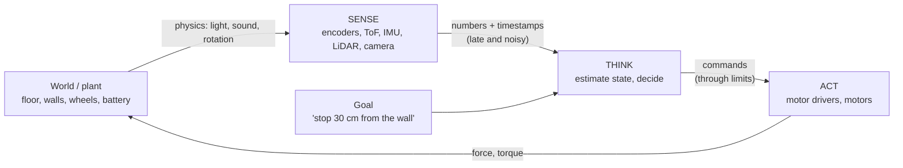

# 00.01 — What is a robot? The sense–think–act loop

<!-- glance:start -->
<!-- generated by tools/build.py from curriculum/syllabus.yaml — edit the syllabus, not this block -->

| | |
|---|---|
| **Track** | Main path |
| **Difficulty** | Beginner |
| **Time** | 30 min |
| **Hardware** | none |
| **Software** | none |
| **Prerequisites** | none |
| **Skip if** | You can explain why a robot is a closed loop between software and physics, not a program with motors attached. |

<!-- glance:end -->

## What you will learn

- Tell a robot apart from "a program with motors attached", and explain why the difference matters.
- Describe any robot as a sense–think–act loop running against the physical world.
- Explain autonomy and embodiment in concrete terms, and place real machines on the autonomy spectrum.
- Compute how far a robot moves during one loop iteration and during a sensing delay.
- Run a small simulation that shows open-loop control failing and closed-loop control succeeding.

## Why it matters

karmel, the robot you build in this course, will drive to your kitchen and pick up a bottle. Nothing
in that sentence is a single function call. Motors don't turn at the speed you ask for, the floor
changes under the wheels, the battery sags, the bottle isn't quite where the camera said it was, and
people walk in front of the robot. The robot works only because it measures the world again and
again and corrects itself many times a second.

If you come from software, your instinct is to write a sequence: drive 2 m, turn 90°, drive 1 m.
That instinct produces robots that hit walls. This lesson replaces it with the mental model every
later module builds on: **a robot is a feedback loop between software and physics**. Control
(module 08), odometry (09), localization (10), navigation (12) and even the LLM agent (19) are all
loops of this shape, at different speeds.

<!-- prereqs:start -->
## Prerequisites

None — you can start here.

### Optional prerequisite links

None.

Check your readiness: `python course.py why 00.01`
<!-- prereqs:end -->

## Concept

### A program with motors attached

Picture a first attempt at a robot vacuum. The code says: drive forward for 3.6 seconds (that
should be 1.8 m at 0.5 m/s), turn left for 1 second, repeat. On your desk with a fresh battery it
works. In the living room it fails:

- On the rug the wheels slip, so 3.6 s covers 1.5 m.
- With a tired battery the motors are 15% slower.
- Someone moved a chair into the path.

The program never finds out. It has no idea where it is, only where it *should* be. Engineers call
this **open-loop control**: commands go out, and nothing comes back.

An everyday version: filling a glass of water. **Open loop** is "open the tap for 5 seconds, then
close it". That works only if the water pressure is exactly what you measured once; with weak
pressure the glass ends up half full, and you never find out. **Closed loop** is "watch the water
level and close the tap when it reaches the top". You never measure the pressure at all, yet the
glass ends up full whatever the pressure is, because you watch the *result*, not the cause. In
software terms: `sleep(30)` and assume the deployment is up (open loop) versus polling the health
endpoint until it answers (closed loop).

### A loop that looks at the world

A real robot vacuum does something different. Many times per second it:

1. **Senses:** reads its bumper, cliff sensors, wheel encoders and LiDAR.
2. **Thinks:** updates its guess of where it is and decides what to do next.
3. **Acts:** sends new speeds to the wheel motors.

Then it does it again, with the world now slightly changed by what it just did. This is the
**sense–think–act loop**, and it is **closed-loop control**: the result of each action is measured
and feeds the next decision. Slip, a weak battery and a moved chair are no longer surprises. They
are just new measurements.

The distributed-systems version of this idea is a **reconciliation loop**. A Kubernetes controller
doesn't run "create 3 pods" once and hope. It keeps comparing desired state with observed state
and acts on the difference. A robot is a reconciliation loop whose "cluster" is physics: it lags,
it's noisy, it's partly invisible, and you can't roll it back.

### Three words you will hear

- **Robot:** a machine that senses its environment, decides, and acts on the physical world through
  actuators, in a closed loop. A thermostat is a (very small) closed loop. A chatbot is not a
  robot, because nothing it does moves anything physical. A CNC mill that follows a fixed G-code
  file with no sensing of the part is automation, not much of a robot.
- **Embodiment:** the software has a body. The body has mass, inertia, battery limits, friction and
  a size that doesn't fit under every table. Its sensors see only what the body lets them see. An
  embodied system can't "retry the request": a collision already happened.
- **Autonomy:** how much of the loop runs without a human. A remote-control car puts a human in the
  "think" step. karmel starts there (teleop in [01.15](../01-first-robot/01.15-teleop-from-laptop.md))
  and moves step by step to autonomy for a task ("go to the kitchen", [P11](../projects/P11-autonomous-navigation.md)).

> [!TIP]
> **Ask your teacher:** "Give me five machines in my apartment and, for each, tell me whether it is
> open loop or closed loop and what it senses."

## Technical explanation

### Level 1 — Intuition: the loop has a body and a clock

Draw the loop as four boxes: the **world** (also called the *plant* in control theory), the
**sensors** that turn physics into numbers, the **controller** (the software), and the
**actuators** (motors) that turn numbers back into physics. Two things make this loop unlike a
software loop:

- **The world keeps moving while you think.** If an iteration takes 100 ms at 0.5 m/s, the robot
  moved 5 cm during that iteration. Time is part of correctness.
- **Every measurement is late and noisy.** A sensor sample is a noisy photo of the past, not the
  present.

### Level 2 — Practical: what changes when software meets physics

| Software habit | Robotics reality | Where the course handles it |
|---|---|---|
| State is in memory and exact | State (position, speed) is *estimated* from noisy sensors | 07 Sensors, 10 Localization |
| A call either succeeds or throws | A motor command "succeeds" and the wheel still slips | 08 Control, 09 Odometry |
| Latency affects user experience | Latency affects *where the robot is when it reacts* | 00.02, 03.04 |
| Bugs can be rolled back | A collision, a fall down the stairs or a battery fire cannot | 00.06, SAFETY.md |
| Scale by adding servers | Energy, mass and heat are fixed budgets | 02.02 Power budgets, FP.05 |

The autonomy spectrum, with examples:

| Level | Who closes the loop | Example | karmel |
|---|---|---|---|
| Teleoperated | Human does think; robot does sense/act | RC car, bomb-disposal robot | 01.15 keyboard teleop |
| Assisted | Human commands; robot adds safety reflexes | Car with automatic emergency braking | 01.13 stops before obstacles |
| Supervised autonomy | Robot runs the whole loop; human watches, can stop it | Warehouse robot, robot vacuum | 12.08 Nav2 on the real robot |
| Task autonomy with language goals | Human gives a goal in words; robot plans and executes | Research mobile manipulators | 19, 20 LLM agent |

### Level 3 — Mathematics: distance per iteration and reaction distance

A loop running at frequency $f$ has period $T = 1/f$. A robot moving at speed $v$ travels

$$d_{\text{iteration}} = v\,T = \frac{v}{f}$$

between two decisions. At karmel's speed limit $v = 0.5$ m/s: at 50 Hz, $d = 0.5/50 = 0.01$ m (1 cm);
at 2 Hz, $d = 0.25$ m.

In the worst case the obstacle crosses the threshold just after a sample, so the robot notices it
up to one full period late. Add sensing latency $L$ (the reading is $L$ seconds old when you use it)
and the motor's own lag, and the distance covered before braking even starts is

$$d_{\text{react}} = v\,(T + L + \tau)$$

where $\tau$ is roughly how long the motor takes to respond. karmel's motor time constant is
$\tau = 0.08$ s (`labs/config/karmel.yaml`). With $v = 0.5$ m/s, $T = 0.02$ s (50 Hz) and $L = 0.5$ s:
$d_{\text{react}} = 0.5 \times (0.02 + 0.5 + 0.08) = 0.30$ m. A robot told to stop 30 cm from a wall
touches it. The simulation below shows exactly this.

> [!NOTE]
> New to speed, distance and units? → [FP.01 Units, position, velocity and acceleration](../optional-foundations/physics/FP.01-kinematics-units.md). Skip it if you already know them.

### Level 4 — Implementation: the shape of every robot program

Every loop in this course, from the Pico firmware to the LLM agent, has this skeleton:

```python
next_tick = clock.now()
while running:
    reading = sensors.read()                  # SENSE  (with a timestamp)
    state = estimator.update(state, reading)  # THINK: where am I, what is happening?
    command = policy.decide(state, goal)      # THINK: what should I do?
    actuators.apply(limits.clamp(command))    # ACT    (always through safety limits)
    next_tick += PERIOD                       # fixed rate, absolute schedule
    clock.sleep_until(next_tick)
```

Three details matter from day one: a **fixed rate** (so $d_{\text{iteration}}$ is predictable),
**timestamps** on readings (so you know how old they are), and **limits** between the decision
and the motors (so a bad decision is a slow bad decision). [00.02](00.02-the-robotics-stack.md)
shows that a real robot runs a stack of these loops at different rates.

## Diagram



The simulation in the Code section, from above:

```text
   x = 0                                                     x = 2.10 m
   ┌──────┐  v = 0.5 m/s                                         ║
   │karmel├──▶ ToF beam ·····························▶           ║ wall
   └──────┘                                                      ║
   |<──────────────── 1.80 m to drive ─────────────▶|<─ 0.30 m ─▶║
                                                     goal: stop here
```

## Code

Save as `sense_think_act.py` and run `python sense_think_act.py` (on Windows `py sense_think_act.py`
also works). Standard library only.

```python
"""00.01 — a robot is a loop, not a program: open loop vs sense–think–act.

A 1D robot drives toward a wall. Physics runs at 1 kHz. The "brain" runs at loop_hz.
Standard library only:  python sense_think_act.py
"""
from dataclasses import dataclass

PHYSICS_DT = 0.001          # s, the "real world" integrates at 1 kHz
WALL_X = 2.1                # m, wall position; robot starts at x = 0
CRUISE = 0.5                # m/s commanded speed
STOP_AT = 0.30              # m, desired gap to the wall
TAU = 0.08                  # s, motor time constant (labs/config/karmel.yaml)


@dataclass
class World:
    x: float = 0.0          # robot front position, m
    v: float = 0.0          # actual speed, m/s

    def step(self, v_cmd: float, motor_gain: float) -> None:
        # first-order motor: actual speed approaches gain * command with time constant TAU
        self.v += (motor_gain * v_cmd - self.v) * PHYSICS_DT / TAU
        self.x += self.v * PHYSICS_DT

    def range_sensor(self) -> float:
        return WALL_X - self.x


def open_loop(motor_gain: float) -> float:
    """'A program with motors attached': compute the drive time once, then just wait."""
    w = World()
    drive_time = (WALL_X - STOP_AT) / CRUISE          # 3.6 s — assumes the robot does exactly 0.5 m/s
    t = 0.0
    while t < drive_time + 1.0:                       # +1 s to let it coast to a stop
        w.step(CRUISE if t < drive_time else 0.0, motor_gain)
        t += PHYSICS_DT
    return w.range_sensor()


def closed_loop(motor_gain: float, loop_hz: float, latency_s: float = 0.0, first_tick_s: float = 0.0) -> float:
    """Sense–think–act at loop_hz, first iteration at first_tick_s. 'Think' sees a reading latency_s old."""
    w = World()
    history: list[tuple[float, float]] = []           # (time, range) — lets us model sensor latency
    period = 1.0 / loop_hz
    next_tick, v_cmd, t = first_tick_s, CRUISE, 0.0
    while t < 6.0:
        history.append((t, w.range_sensor()))
        if t >= next_tick:                            # --- one iteration of the loop ---
            stale = [r for (ts, r) in history if ts <= t - latency_s]
            sensed = stale[-1] if stale else history[0][1]          # SENSE
            v_cmd = 0.0 if sensed <= STOP_AT else CRUISE            # THINK
            next_tick += period                                     # ACT is applied below
        w.step(v_cmd, motor_gain)
        t += PHYSICS_DT
        if w.range_sensor() <= 0.0:
            return 0.0                                # crashed into the wall
    return w.range_sensor()


if __name__ == "__main__":
    rows = [
        ("open loop, fresh battery", open_loop(1.0)),
        ("open loop, tired battery + carpet", open_loop(0.85)),
        ("closed loop 50 Hz, fresh battery", closed_loop(1.0, 50)),
        ("closed loop 50 Hz, tired battery + carpet", closed_loop(0.85, 50)),
        ("closed loop 5 Hz", closed_loop(1.0, 5)),
        ("closed loop 0.5 Hz, first tick at 0.0 s", closed_loop(1.0, 0.5)),
        ("closed loop 0.5 Hz, first tick at 1.0 s", closed_loop(1.0, 0.5, first_tick_s=1.0)),
        ("closed loop 50 Hz, sensor 0.5 s old", closed_loop(1.0, 50, latency_s=0.5)),
        ("closed loop 50 Hz, sensor 1.5 s old", closed_loop(1.0, 50, latency_s=1.5)),
    ]
    print(f"Final gap to the wall (goal {STOP_AT:.2f} m, 0.000 = crashed)")
    for label, gap in rows:
        print(f"  {label:44s} {gap:6.3f} m")
```

Output:

```text
Final gap to the wall (goal 0.30 m, 0.000 = crashed)
  open loop, fresh battery                      0.300 m
  open loop, tired battery + carpet             0.570 m
  closed loop 50 Hz, fresh battery              0.260 m
  closed loop 50 Hz, tired battery + carpet     0.264 m
  closed loop 5 Hz                              0.200 m
  closed loop 0.5 Hz, first tick at 0.0 s       0.100 m
  closed loop 0.5 Hz, first tick at 1.0 s       0.000 m
  closed loop 50 Hz, sensor 0.5 s old           0.010 m
  closed loop 50 Hz, sensor 1.5 s old           0.000 m
```

How to read it:

- **Same job, different stop trigger.** Every row is the same task: start 2.1 m from the wall, drive at
  0.5 m/s, and *stop* 0.30 m from the wall (1.8 m of driving). The only difference is what decides the
  moment to stop. Open loop stops **by the clock**: 1.8 / 0.5 = 3.6 s, so "stop at t = 3.6 s". Closed
  loop stops **by the sensor**: "stop when the range reads 0.30 m". With the tired battery the robot
  really moves at 0.425 m/s. At t = 3.6 s it has covered only 0.425 × 3.6 = 1.53 m, the clock says
  stop anyway, and it stops 0.57 m from the wall. The closed-loop robot doesn't look at the clock:
  it reaches the 0.30 m reading later (at about 1.8 / 0.425 = 4.2 s) and stops there.
- **What each version measures.** Neither version reads the battery. The open-loop robot measures
  *nothing*: it computes "3.6 s at 0.5 m/s" once and then just waits. The closed-loop robot measures
  one thing, the distance to the wall (`range_sensor()`), every iteration. The tired battery and the
  carpet (`motor_gain = 0.85`, 15% slower) are the *unexpected disturbance*: the question is which
  robot copes with a problem nobody programmed it to check for.
- **Open loop** is perfect only in the world it was calibrated for. A 15% weaker motor leaves it 27 cm
  short, and it would never notice a chair.
- **Closed loop at 50 Hz** doesn't care about the battery: 0.260 m vs 0.264 m. It never learns that
  the motors are slow; it simply keeps driving until the wall *measures* 0.30 m, whatever the reason
  it took longer. The 4 cm it overshoots
  the goal is the motor lag, $v\tau = 0.5 \times 0.08 = 0.04$ m. Module 08 removes that by braking
  earlier.
- **Slow loops** are sometimes fine and sometimes crash, depending on *when* the samples happen to fall.
  At 0.5 Hz the robot looks at the sensor only once every 2 s, and between two looks it drives about
  1 m blind, far more than the 0.30 m margin. "First tick" is the moment of the first look; the two
  rows differ only in that. Positions below are approximate (the motor needs ~0.08 s to get up to speed):

  ```text
  first tick at 0.0 s: looks at t = 0, 2, 4 s
    t = 2 s: gap 1.14 m -> keep driving
    t = 4 s: gap 0.14 m -> already past 0.30 m, stop; motor lag adds 0.04 m -> stops at 0.10 m
  first tick at 1.0 s: looks at t = 1, 3, 5 s
    t = 3 s: gap 0.64 m -> keep driving
    t = 4.28 s: hits the wall, before the next look at t = 5 s -> crash (0.000)
  ```

  Same code, same robot, same speed; only the timing luck differs. A test that passes once proves
  little. You must reason about the worst case.
- **Old data** is as dangerous as slow data. *How often* you get a reading (the rate, 50 Hz) and
  *how old* each reading is when you use it (the latency, 0.5 s) are two different numbers, like
  throughput and latency in a message queue. Think of a live video stream with a 0.5 s delay: you
  still get 50 frames per second, but every frame shows the world as it was 0.5 s ago. In the code,
  `history` keeps every reading and the loop uses the one from `t - latency_s`. Readings get old in a
  real robot because they pass through processing and transport: camera frames through a detector,
  data over Wi-Fi to a laptop, a request to a cloud model. In the "0.5 s old" row the robot drives at
  0.5 m/s, so when the old reading finally says 0.30 m, the robot is really $0.5 	imes 0.5 = 0.25$ m
  closer, at 0.05 m; the 0.04 m motor lag then leaves 0.010 m. A 1.5 s latency is realistic for a
  cloud LLM call, which is why [19.01](../19-llm-robot-agents/19.01-why-llms-dont-drive-motors.md)
  never lets the LLM drive the motors.

## Exercise

All exercises in this lesson need hardware: **none**.

### Exercise 00.01-E1 — Rank the outcomes before you run `[predict]`

Before running the script, write down your predicted final gap for each row, or at least rank the
rows from "stops furthest from the wall" to "crashes". In particular predict: (a) does the open-loop
robot with the tired battery stop short of or past the goal? (b) is the 50 Hz closed-loop gap
exactly 0.30 m? (c) which is worse, a 5 Hz loop or a 50 Hz loop that uses 0.5 s-old data? Then run
the script and explain every prediction you got wrong in one sentence.

### Exercise 00.01-E2 — Distance per decision `[numerical]`

karmel drives at 0.5 m/s. (a) How far does it travel during one iteration of a loop at 100 Hz,
20 Hz, 5 Hz and 1 Hz? (b) An LLM planner takes 2.5 s to answer. How far does the robot travel while
it waits? (c) Separate question, no LLM involved: karmel should never travel more than 2 cm between two obstacle checks. What is the
minimum loop rate at 0.5 m/s, and at the lower indoor speed of 0.3 m/s from SAFETY.md?

### Exercise 00.01-E3 — Find the worst case, not the lucky case `[coding]`

The 0.5 Hz loop survived with `first_tick_s=0.0` and crashed with `first_tick_s=1.0`. Write a short
script that imports `closed_loop` from `sense_think_act.py` and, for loop rates 50, 10, 5, 2 and
0.5 Hz, runs 20 simulations with `first_tick_s` evenly spread over one period ($k \cdot T/20$ for
$k = 0..19$). Print the minimum gap and the number of crashes per rate. Compare the minimum gaps
with the formula $0.30 - v\tau - vT$.

What the inputs mean: `closed_loop(motor_gain, loop_hz, first_tick_s=...)` takes the rate in Hz
(pass `5`, not the period). The period is $T = 1/f$ seconds, and `first_tick_s` is a time in seconds
*within the first period*. For example at 5 Hz, $T = 0.2$ s, so the 20 runs use
`first_tick_s` = 0, 0.01, 0.02, ..., 0.19. Each run shifts *when* the robot looks, which is exactly the
timing luck the two 0.5 Hz rows showed. A returned gap of 0.0 means that run crashed.

Why only offsets *inside one period*: after the first look the robot looks again every $T$. At 5 Hz,
a first tick of 0.00 s gives looks at 0.00, 0.20, 0.40, ... s, and a first tick of 0.20 s gives
0.20, 0.40, ... s, the same schedule. So 0.20, 0.40 or 1.00 s just repeat the 0.00 case, and only
offsets between 0 and $T$ produce *different* schedules. A large first tick is also a broken test:
the robot drives blind until its first look, so with a first tick of 5 s it hits the wall
(at about 4.3 s) before it ever looks. Splitting one period into 20 equal steps, $k \cdot T/20$, gives
20 genuinely different timings:

```text
5 Hz, T = 0.2 s. Each | is a look at the sensor:
k = 0,  first tick 0.00 s:  |-------------------|-------------------|---
k = 5,  first tick 0.05 s:  -----|-------------------|-------------------|
k = 10, first tick 0.10 s:  ----------|-------------------|-----------
                            0.0                 0.2                 0.4 s
```

### Exercise 00.01-E4 — Design: robot or not? `[design]`
Classify each machine as *not a robot*, *open-loop automation*, *teleoperated robot* or
*autonomous robot*, and name what it senses and what it actuates: (1) a thermostat with a heater,
(2) a dishwasher on a fixed program, (3) a robot vacuum, (4) a drone flown by a person with FPV
goggles, (5) a customer-support chatbot, (6) a 3D printer without bed sensing, (7) a self-driving
car, (8) karmel on the day it first spins its motors (01.08). There is room for debate; the
reasoning is what counts.

## Expected result

- **00.01-E1:** (a) The tired-battery open-loop robot stops **short**, 0.570 m from the wall: it drove
  the planned time at 85% speed. (b) No: **0.260 m**. The motor keeps moving for about $\tau$ after the
  stop command. (c) The **0.5 s-old data at 50 Hz is worse** (0.010 m) than the 5 Hz loop (0.200 m),
  because 0.5 s of latency is 2.5 times worse than a 0.2 s period. Latency and period add; a fast
  loop on stale data is still a late loop.
- **00.01-E2:** (a) 100 Hz → **5 mm**, 20 Hz → **2.5 cm**, 5 Hz → **10 cm**, 1 Hz → **50 cm**.
  (b) $0.5 \times 2.5 =$ **1.25 m**. (c) $f \ge v/d$: $0.5/0.02 =$ **25 Hz**; $0.3/0.02 =$ **15 Hz**.
- **00.01-E3:** Minimum gaps (±0.005 m): **50 Hz 0.251 m, 10 Hz 0.212 m, 5 Hz 0.165 m, 2 Hz 0.012 m,
  0.5 Hz 0.000 m** with **15 of 20 runs crashing** at 0.5 Hz and none at the other rates. The formula
  gives 0.25, 0.21, 0.16, 0.01 and −0.74 m (negative = crash), so it predicts the worst case well.
- **00.01-E4:** A reasonable answer: (1) closed-loop control but no motion, a borderline "tiny
  robot" (senses temperature, actuates a heater); (2) open-loop automation (timer; maybe a water-level
  sensor); (3) autonomous robot (bumpers, cliff sensors, encoders, often LiDAR; wheels, brushes);
  (4) teleoperated robot, although its flight controller closes a fast attitude loop on its own
  (IMU → rotor speeds); (5) not a robot (no physical actuation); (6) open-loop automation (steppers
  follow G-code; endstops only at startup); (7) autonomous robot (cameras, radar, LiDAR, IMU,
  wheel speed; steering, throttle, brakes); (8) open-loop teleoperated machine: motors, no sensing yet.
  Full credit if you noticed that "robot" is about the closed sense–act loop, and that many
  machines contain small autonomous loops inside a human-driven one.

<details><summary>Reference solution for 00.01-E3</summary>

```python
from sense_think_act import closed_loop

for hz in (50, 10, 5, 2, 0.5):
    period = 1.0 / hz
    gaps = [closed_loop(1.0, hz, first_tick_s=k * period / 20) for k in range(20)]
    formula = 0.30 - 0.5 * 0.08 - 0.5 * period
    print(f"{hz:4} Hz  min gap {min(gaps):.3f} m  crashes {sum(g == 0.0 for g in gaps):2d}/20"
          f"  formula {formula:+.3f} m")
```
</details>

## Troubleshooting

### Symptom: the script prints nothing or `SyntaxError` near `float | None` or `list[tuple…]`

1. Run `python --version`. The course needs Python 3.10 or newer. On Windows, `py --version`
   shows the launcher's default.
2. If you have several Pythons, run with an explicit one: `py -3.12 sense_think_act.py`.

### Symptom: your numbers differ from the Expected result

1. **Check you copied the constants**, especially `WALL_X = 2.1` and `TAU = 0.08`. The result
   depends on them.
2. **Differences in the 4th decimal** come from floating-point accumulation over 6,000 steps. They
   don't matter.
3. **Large differences in slow-loop rows** usually mean `next_tick` starts at a different value.
   That sensitivity is the point of E3, not a bug.

### Symptom: in the future, a real robot stops at a different distance every run

This is the same method you will use in [01.13](../01-first-robot/01.13-distance-sensors-stop.md):

1. **Measure the loop rate** actually achieved (log timestamps). Is it the rate you think?
2. **Measure sensor latency**: how old is the reading when the decision is made?
3. **Compute** $v(T + L + \tau)$ and compare with the observed overshoot. If they match, fix the
   budget (slower speed, faster loop, earlier braking). If not, look for a lost or noisy reading.

## Common mistakes

- **Writing robot behavior as a timed script** ("drive 3 s, turn 1 s"). It happens because it works
  on the desk. Measure the result and close the loop, even crudely.
- **Assuming a command equals an outcome.** `set_speed(0.5)` is a request to physics. Log what the
  encoders say actually happened.
- **Ignoring how old data is.** Always carry a timestamp with every reading, and compute age at
  decision time. ROS 2 messages have `header.stamp` for exactly this.
- **Testing only the lucky case.** Slow or jittery loops pass some runs and fail others. Reason about
  the worst case: one full period plus latency.
- **Calling any automation "AI".** Most of a working robot is deterministic loops. AI earns its place
  in perception and high-level decisions (00.02 shows where).

## Knowledge check

1. What is the difference between open-loop and closed-loop control? Give a robot example of each.
   <details><summary>Answer</summary>

   Open loop sends commands without measuring the result ("drive 3.6 s"). Closed loop measures the
   result and uses it for the next command ("drive until the ToF sensor reads 0.30 m"). The closed-loop
   version still works when the battery, floor or obstacles change.
   </details>

2. Name the three steps of the loop and one component of karmel that belongs to each.
   <details><summary>Answer</summary>

   Sense: wheel encoders, VL53L1X ToF, US-100 ultrasonic, later IMU/LiDAR/camera. Think: code on the
   Pico and Raspberry Pi 5 (and later Nav2 and the LLM agent). Act: DRV8874 motor drivers and the two
   gear motors (later the arm's servos).
   </details>

3. A loop runs at 20 Hz and the robot moves at 0.4 m/s. How far does it move between decisions?
   <details><summary>Answer</summary>

   $d = v/f = 0.4/20 = 0.02$ m = 2 cm.
   </details>

4. Predict: you make the 50 Hz loop 10 times faster (500 Hz), but the ToF reading it uses is still
   0.3 s old. Roughly how much does the overshoot improve?
   <details><summary>Answer</summary>

   Barely. The reaction distance is $v(T + L + \tau) = 0.5 \times (T + 0.3 + 0.08)$. Going from $T = 0.02$
   to $0.002$ s changes it from 0.200 m to 0.191 m. Latency dominates, so fix latency first.
   </details>

5. Why is a chatbot not a robot, while a thermostat arguably is a very small one?
   <details><summary>Answer</summary>

   A robot needs embodiment: a closed loop that senses and acts on the physical world. The chatbot
   only exchanges text. The thermostat senses temperature and switches a heater that changes that
   temperature, a closed physical loop (with no motion, so it is a borderline case).
   </details>

6. Debugging scenario: a teammate's robot stops at the right distance on the desk but hits the wall on
   the living room floor. Their code drives for a computed time. What is the cause, and what is the
   smallest change that fixes it?
   <details><summary>Answer</summary>

   Open-loop control: on the floor, slip, carpet or a different battery level change the real speed, so
   the computed time no longer gives the planned distance. The fix is to close the loop: drive until a
   sensor (range sensor, or encoders for distance) says the goal is reached.
   </details>

7. What does "autonomy" mean in this course, and at which level does karmel start?
   <details><summary>Answer</summary>

   Autonomy is how much of the sense–think–act loop runs without a human. karmel starts teleoperated
   (you do "think" in 01.15), adds reflexes (stop before obstacles, 01.13), then supervised autonomy
   (Nav2, module 12), then goals given in language (module 19).
   </details>

## Practical challenge

Extend `sense_think_act.py` into a **proportional stop**: instead of full speed until the threshold,
command $v = \min(0.5,\; k \cdot (d_{\text{sensed}} - 0.30))$ with $v \ge 0$.

**Acceptance criteria:**

- With $k = 2.0$ s⁻¹, a 50 Hz loop, a fresh battery and the script's 6 s run time, the final gap is
  within **±2 cm** of 0.30 m (a reference implementation ends at 0.300 m).
- The same code, unchanged, stays within ±2 cm with `motor_gain=0.85` (reference: 0.302 m).
- You can explain in two sentences why this beats "full speed, then stop", and what happens (try it)
  when $k$ is very large, for example 50 s⁻¹, with 0.2 s of sensor latency (reference: it overshoots
  to a 0.16 m gap, because a huge gain turns it back into "full speed, then stop" on stale data).

This is a preview of proportional control, which [08.04](../08-control/08.04-proportional-control.md)
teaches properly.

## You can skip this if…

You answer knowledge-check questions 4 and 6 correctly without looking, and you can explain in one
minute why a robot is a closed loop between software and physics, not a program with motors attached.

`python course.py skip 00.01 --reason "I already think of robots as closed loops"`

## Go deeper

- Siegwart, Nourbakhsh, Scaramuzza, *Introduction to Autonomous Mobile Robots*, 2nd ed. (MIT Press): https://mitpress.mit.edu/9780262015356/introduction-to-autonomous-mobile-robots/ — chapter 1 frames the see–think–act cycle for wheeled robots; the standard intro book.
- Åström & Murray, *Feedback Systems*, 2nd ed. (free online): https://www.cds.caltech.edu/~murray/FBS/Second_Edition.html — chapter 1 explains why feedback makes systems robust to uncertainty, with many non-robot examples.
- QUT Robot Academy (Peter Corke): https://robotacademy.net.au/ — short university video lessons; good for a second explanation of what robots are and how they sense.
- Hugging Face Robotics Course: https://huggingface.co/learn/robotics-course — the classical-to-learning view of robotics; useful later to see where learning fits into the same loop.

## Progress checkpoint

- [ ] I can explain the difference between a timed script and a sense–think–act loop.
- [ ] I can compute distance per loop iteration and reaction distance with latency.
- [ ] I can place a machine on the autonomy spectrum and say what it senses and actuates.
- [ ] I ran the simulation and can explain why slow loops sometimes pass and sometimes crash.

`python course.py complete 00.01` (exercises done) · `python course.py master 00.01`
(challenge done) · `python course.py struggle 00.01 "what was hard"`

Next: [00.02 — The robotics stack from AI down to motors](00.02-the-robotics-stack.md).
