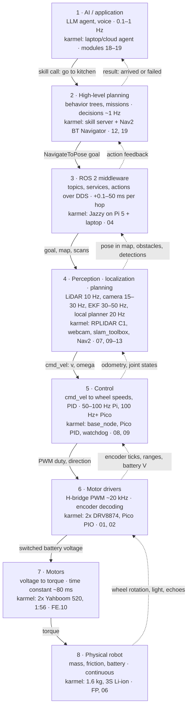
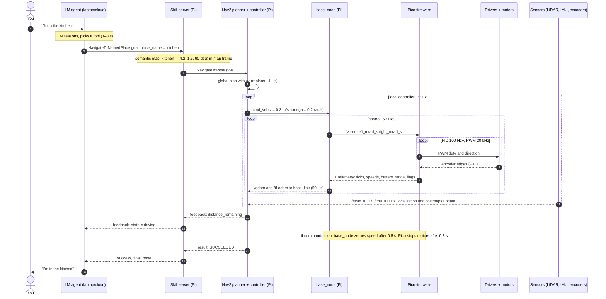

# 00.02 — The robotics stack from AI down to motors

<!-- glance:start -->
<!-- generated by tools/build.py from curriculum/syllabus.yaml — edit the syllabus, not this block -->

| | |
|---|---|
| **Track** | Main path |
| **Difficulty** | Beginner |
| **Time** | 45 min |
| **Hardware** | none |
| **Software** | none |
| **Prerequisites** | [00.01 What is a robot? The sense–think–act loop](00.01-what-is-a-robot.md) |
| **Skip if** | You can draw the layers from an LLM planner down to a PWM signal and say what runs at which rate. |

<!-- glance:end -->

## What you will learn

- Draw the eight layers of a robot, from an AI application down to the physical robot, and say what each layer does.
- Give the typical rate or latency of each layer, and explain why layers get faster as you go down.
- Map every layer to karmel's concrete hardware and software, and to the course module that teaches it.
- Trace one "go to the kitchen" request down the stack, and the sensor data that flows back up.
- Build a latency budget and decide which layer must own a given reaction.

## Why it matters

The rest of this course is 21 modules and 218 main-path lessons. Without a map, PWM (module 01), TF frames
(05), Kalman filters (10) and LLM tool calling (19) look like unrelated topics. They aren't. Each one
is a layer of the same system, with a clear job, a clear interface to the layer above and below,
and a clear rate.

The map also stops the most common architectural mistake of software engineers entering robotics:
putting a slow, smart component (an LLM, a cloud call, a Python loop on Wi-Fi) in a place that needs
a fast, dumb one. In distributed-systems terms, you are about to learn the robot's **latency
budgets and SLOs** before you write a line of robot code.

<!-- prereqs:start -->
## Prerequisites

You need these first:

- [00.01 What is a robot? The sense–think–act loop](00.01-what-is-a-robot.md)

### Optional prerequisite links

None.

Check your readiness: `python course.py why 00.02`
<!-- prereqs:end -->

## Concept

### The stack as a service architecture

You already know a layered architecture where requests flow down and events flow up:

| Web system | Robot | What the layer promises |
|---|---|---|
| Client app / chat UI | **1. AI / application** (LLM agent, voice) | Understands what the user wants |
| Workflow engine / orchestrator | **2. High-level planning** (missions, behavior trees) | Turns intent into a sequence of steps, handles failures |
| Message bus (Kafka, RabbitMQ, gRPC mesh) | **3. ROS 2 middleware** | Moves typed messages between processes and machines |
| Microservices | **4. Perception, localization, planning** | Each turns data into a higher-level fact: "obstacle at 1.2 m", "robot at (3.1, 0.4)", "path" |
| Hot path with a tight SLO | **5. Control** | Makes the wheels actually do the commanded speed, every 10–20 ms |
| Device drivers / NIC firmware | **6. Motor drivers** | Turns a number into switched battery power, every 50 µs |
| Hardware | **7. Motors** | Turns current into torque |
| The data center's physics | **8. Physical robot** | Mass, friction and a battery that don't read your code |

Two rules make this stack different from a web stack.

**Rule 1: rates increase as you go down.** An LLM decides once every few seconds. A navigation
controller decides 20 times a second. A wheel-speed loop decides 100 times a second. A motor driver
switches 20,000 times a second. Each layer is a closed loop (00.01) that turns a goal from above into
faster goals for the layer below, and corrects the disturbances that the layer above is too slow to see.

**Rule 2: safety responsibility moves down.** If the LLM is late, Nav2 keeps driving the planned path.
If Nav2 crashes, the base controller's command timeout stops the robot. If the Raspberry Pi freezes,
the Pico's watchdog stops the motors. If the Pico dies, you hit the power switch. Each fast layer must
keep the robot safe when every slower layer above it is late, wrong or dead. That's graceful
degradation with a physical cost of failure.

> [!TIP]
> **Ask your teacher:** "Compare the robotics stack to a microservice system I might have built: where
> is the API gateway, the message bus, the circuit breaker and the hot path? Where does the analogy break?"

## Technical explanation

### Level 1 — Intuition: goals down, measurements up

- **Down the stack** flow increasingly concrete goals: "go to the kitchen" → "reach pose (4.2, 1.5, 90°)"
  → "follow this path" → "drive at 0.3 m/s, turn at 0.2 rad/s" → "left wheel 6.2 rad/s, right wheel 7.1
  rad/s" → "62% PWM duty" → "7 V across the motor" → torque.
- **Up the stack** flow increasingly abstract facts: encoder edges → ticks → wheel speeds → odometry →
  a pose in the map → "arrived" → "I'm in the kitchen".

### Level 2 — Practical: the eight layers, one by one

#### 1. AI / application — decide *what* to do

- **How it works:** an LLM agent (or a voice interface, or a phone app) receives a request and calls a
  small set of **skills** exposed as tools, such as `navigate_to_named_place("kitchen")` or
  `pick(object_id)`. It never publishes raw motor speeds.
- **Rate:** event-driven, 0.1–1 decisions per second; one LLM call takes 0.5–5 s.
- **karmel:** at Stage 6 an agent on your laptop or in the cloud calls the ROS 2 action
  `karmel_interfaces/action/NavigateToNamedPlace`, already defined in
  `labs/ros2_ws/src/karmel_interfaces/action/`. Vision-language models answer "where is the bottle?".
- **Modules:** [19 LLM robot agents](../19-llm-robot-agents/19.01-why-llms-dont-drive-motors.md),
  18 embodied AI (learned policies), [13.14 VLMs](../13-computer-vision/13.14-vision-language-models.md).

#### 2. High-level planning — decide *in what order*, and what to do on failure

- **How it works:** a state machine or **behavior tree** sequences skills ("navigate, look, pick,
  navigate back"), resolves names to coordinates using a semantic map ("kitchen" = pose (4.2, 1.5)),
  retries, and runs recovery behaviors when a step fails. Nav2's BT Navigator is this layer for
  driving.
- **Rate:** trees tick at 10–100 Hz, but real decisions change about once a second. Nav2's standard
  replanning tree recomputes the global path about once per second.
- **karmel:** a skill server implementing `NavigateToNamedPlace` on top of Nav2's `NavigateToPose` action.
- **Modules:** [12.06 Nav2 architecture](../12-navigation/12.06-nav2-architecture.md),
  [12.09 Waypoints and missions](../12-navigation/12.09-waypoints-and-missions.md),
  [19.04 State machines](../19-llm-robot-agents/19.04-state-machines.md), [19.05 Behavior trees](../19-llm-robot-agents/19.05-behavior-trees.md).

#### 3. ROS 2 middleware — move messages between everything

- **How it works:** every component is a **node** (a process or part of one). Nodes publish and
  subscribe to typed **topics** (`/scan`, `/odom`, `/cmd_vel`), call **services** (request/response)
  and **actions** (long-running goals with feedback and cancel). Underneath, DDS discovers peers on the
  network and handles delivery with configurable QoS. [00.05](00.05-ros2-in-one-page.md) is the one-page tour.
- **Rate:** none of its own. It adds latency: typically well under a millisecond between processes on
  the same computer, and 5–50 ms (with spikes) per hop over home Wi-Fi.
- **karmel:** ROS 2 Jazzy on the Raspberry Pi 5 (Ubuntu 24.04), and on your laptop in Docker for RViz,
  simulation and heavy AI.
- **Modules:** [04 ROS 2](../04-ros2/04.01-why-middleware.md), [05 frames and TF](../05-frames-and-transforms/05.01-why-frames.md).

It's drawn as one layer, but it is really the bus that connects layers 1–5. Layers 6–8 are below it.

#### 4. Perception, localization and planning — turn data into facts and paths

- **Perception** turns raw sensor data into facts. The LiDAR driver publishes a 360-point scan at 10 Hz;
  a camera publishes images at 15–30 Hz; a detector finds "bottle at pixel (412, 230)" at 5–30 Hz
  depending on compute.
- **Localization** answers "where am I?". Wheel odometry integrates encoder ticks at 50 Hz and drifts. An
  EKF fuses it with the IMU at 30–50 Hz. SLAM or AMCL corrects the drift by matching LiDAR scans to a
  map, once per scan; the map itself updates every few seconds.
- **Planning** answers "how do I get there?". A **global planner** (A* on a grid, [12.02](../12-navigation/12.02-grid-path-planning.md))
  finds a path through the map about once a second. A **local planner/controller** (DWB, MPPI) turns the
  path plus the latest obstacles into a velocity command, typically at 20 Hz.
- **karmel:** RPLIDAR C1 driver, USB webcam via `v4l2_camera`, `robot_localization` EKF, `slam_toolbox`
  and AMCL, Nav2. Output: `geometry_msgs/TwistStamped` on `cmd_vel` (linear m/s, angular rad/s).
- **Modules:** 05 frames, 07 sensors, 09 odometry, 10 localization, 11 SLAM, 12 navigation, 13 vision.

#### 5. Control — make the wheels do what was asked

- **How it works:** inverse kinematics turns $(v, \omega)$ into two wheel speeds
  ([09.02](../09-odometry/09.02-inverse-kinematics-cmd-vel.md)). Then a **PID controller** with feedforward
  compares each commanded wheel speed with the speed measured by the encoder and adjusts the motor power,
  many times a second ([08](../08-control/08.01-open-vs-closed-loop.md)). Speed and acceleration limits and
  a command timeout live here too.
- **Rate:** 50–100 Hz on the Pi (ros2_control's `diff_drive_controller`, or karmel's simple `base_node`),
  and typically 100 Hz or faster for the wheel-speed PID on the microcontroller.
- **karmel:** `labs/ros2_ws/src/karmel_base/karmel_base/base_node.py` runs at 50 Hz, clamps speed to
  0.5 m/s and 2.5 rad/s, ramps acceleration, and zeroes the target when no `cmd_vel` arrives for 0.5 s. It
  sends `V <seq> <left_mrad_s> <right_mrad_s>` lines over USB serial to the Pico, which runs the wheel
  PID and stops the motors if no valid command arrives for 300 ms.

#### 6. Motor drivers — turn a number into power

- **How it works:** a microcontroller pin can't power a motor (it supplies milliamps; the motor stalls at
  4 A). An **H-bridge** motor driver connects the motor to the battery through four transistor switches.
  Switching them on and off very fast, **PWM**, sets the *average* voltage: 60% duty on an 11.1 V pack
  gives about 6.7 V. Which pair of switches is on sets the direction.
- **Rate:** PWM around 20 kHz (a 50 µs period, above human hearing). The Pico also decodes the encoders'
  quadrature pulses in its PIO hardware: at full speed, karmel's encoders produce about 6,700 edges per
  second per wheel.
- **karmel:** 2× Pololu DRV8874 carriers driven by the Pico 2's PWM pins (GP2/3 and GP6/7 in
  `labs/config/karmel.yaml`).
- **Modules:** [01.08](../01-first-robot/01.08-first-motor-spin.md), [02.03](../02-robot-electronics/02.03-motor-drivers-in-depth.md);
  foundations [FE.07 PWM](../optional-foundations/electronics/FE.07-pwm.md), [FE.12 H-bridges](../optional-foundations/electronics/FE.12-h-bridges-motor-drivers.md).

#### 7. Motors — turn current into torque

- **How it works:** a brushed DC motor produces torque proportional to current. As it speeds up it
  generates a back-voltage that limits speed. A gearbox trades speed for torque (1:56 on karmel).
- **Rate:** motors are low-pass filters. karmel's motor time constant is about 80 ms, so it can't follow
  anything much faster than a few hertz. The 20 kHz PWM ripple is smoothed away; the 100 Hz PID is fast
  enough to control it.
- **karmel:** 2× Yahboom 520 12 V gear motors, 205 RPM, with Hall encoders. [00.03](00.03-actuators-and-sensors-field-guide.md) has specs.
- **Modules:** [FE.10 DC motors](../optional-foundations/electronics/FE.10-dc-motors.md), [08.02 step response](../08-control/08.02-motor-step-response.md).

#### 8. Physical robot — the part that doesn't read your code

- **What it is:** 1.6 kg of chassis, wheels (45 mm radius), a caster, a 3S Li-ion battery whose voltage
  sags from 12.6 V to 9.9 V, and floors with different friction.
- **Rate:** physics is continuous. What matters is its slowest dynamics: stopping from 0.5 m/s at 1 m/s²
  takes 0.5 s and 12.5 cm, no matter how fast your software is.
- **Modules:** [FP physics foundations](../optional-foundations/physics/FP.04-torque-gears-wheels.md),
  [06 Simulation](../06-simulation/06.01-why-simulate.md), which models this layer so you can break things for free.

#### Summary table

| # | Layer | Typical rate / latency | karmel (final robot) | Modules |
|---|---|---|---|---|
| 1 | AI / application | 0.1–1 Hz, 0.5–5 s per call | LLM agent on laptop/cloud, skill tools | 13.14, 18, 19 |
| 2 | High-level planning | decisions ~1 Hz (ticks 10–100 Hz) | skill server, Nav2 BT Navigator | 12, 19 |
| 3 | ROS 2 middleware | +0.1 ms (same host) to +50 ms (Wi-Fi) per hop | ROS 2 Jazzy, Pi 5 + laptop | 04, 05 |
| 4 | Perception / localization / planning | LiDAR 10 Hz, camera 15–30 Hz, EKF 30–50 Hz, global plan ~1 Hz, local control 20 Hz | RPLIDAR C1, webcam, IMU, slam_toolbox, AMCL, Nav2 | 07, 09–13 |
| 5 | Control | 50–100 Hz (Pi), 100 Hz+ (Pico) | base_node or ros2_control, Pico PID, 300 ms watchdog | 08, 09 |
| 6 | Motor drivers | PWM ~20 kHz; encoder edges ~6.7 kHz | 2× DRV8874, Pico PWM + PIO | 01, 02 |
| 7 | Motors | time constant ~80 ms | 2× Yahboom 520, 1:56 | FE.10, 08.02 |
| 8 | Physical robot | continuous; stopping takes ~0.5 s | 1.6 kg, 3S Li-ion, 90 mm wheels | FP, 06 |

### Level 3 — Mathematics: rate separation and latency budgets

**Rate separation.** A loop can only control something slower than itself. The usual rule of thumb
(explained in [FCT.05](../optional-foundations/control-theory/FCT.05-discrete-time-sampling.md)) is that
an inner loop should run 5–10 times faster than the loop that gives it goals, and fast compared with the
dynamics it controls. For a motor with time constant $\tau$, a sample period $T \le \tau/10$ is comfortable:

$$f_{\text{PID}} \ge \frac{10}{\tau} = \frac{10}{0.08\ \text{s}} = 125\ \text{Hz}$$

And a 20 Hz local planner above a 100 Hz wheel controller has a ratio of 5. Across the whole stack, a
3 s LLM decision vs a 50 µs PWM period is a ratio of $3 / 0.00005 = 60{,}000$.

**Latency budget.** Suppose an obstacle appears. The robot keeps moving at speed $v$ for the total
reaction latency $L = \sum_i L_i$ (every stage on the path: sensor period, transport, processing,
loop periods), then brakes at deceleration $a$:

$$d_{\text{stop}} = v \sum_i L_i + \frac{v^2}{2a}$$

For karmel ($v = 0.5$ m/s, $a = 1.0$ m/s²) the braking term alone is $0.25/2 = 0.125$ m. A reflex in the
Pico firmware with $L = 30$ ms adds $0.5 \times 0.03 = 0.015$ m: 14 cm total. A cloud LLM in the loop with
$L \approx 3.5$ s adds 1.74 m: 1.87 m total. That is the quantitative reason [19.01](../19-llm-robot-agents/19.01-why-llms-dont-drive-motors.md)
keeps the LLM out of the control path.

Solving the same equation for $v$ tells you the **maximum safe speed** for a given stopping distance
$d$ and latency $L$:

$$v_{\max} = a\left(-L + \sqrt{L^2 + \frac{2d}{a}}\right)$$

With $d = 0.25$ m, $a = 1$ m/s² and $L = 0.094$ s (a ROS 2 safety node on the Pi): $v_{\max} = -0.094 + \sqrt{0.0088 + 0.5} = 0.619$ m/s.
With $L = 3.48$ s (LLM): $v_{\max} = 0.071$ m/s, a crawl.

**Data volume.** Upper layers also consume more data than lower ones produce. A LiDAR scan of 360
`float32` ranges and 360 intensities is 2,880 bytes; at 10 Hz that's 28.8 kB/s. A raw 640×480 RGB image is
921,600 bytes; at 15 Hz that's 13.8 MB/s, 480 times more. That ratio decides where perception runs
(on the robot, compressed over Wi-Fi, or on a Jetson in [00.04](00.04-robot-computers.md)).

### Level 4 — Implementation: where each layer runs on karmel

```text
┌─ Laptop / cloud ──────────────────────────────────────────────────────────────────┐
│  L1  LLM agent (tool calls) · RViz · optional heavy vision models                 │
└──────────────── ROS 2 over Wi-Fi (DDS): actions, feedback, compressed images ─────┘
┌─ Raspberry Pi 5, Ubuntu 24.04, ROS 2 Jazzy ───────────────────────────────────────┐
│  L2  NavigateToNamedPlace skill server · Nav2 BT Navigator                        │
│  L4  rplidar driver /scan · v4l2_camera /image_raw · EKF · slam_toolbox/AMCL ·    │
│      Nav2 planner (A*) + controller (20 Hz) → cmd_vel                             │
│  L5  base_node (50 Hz): limits, ramps, cmd_vel timeout, odometry → /odom, /tf     │
└──────────────── USB serial, protocol v1: "V seq l r" down, "T ..." telemetry up 50 Hz ─┘
┌─ Raspberry Pi Pico 2, MicroPython ────────────────────────────────────────────────┐
│  L5  wheel-speed PID · 300 ms command watchdog                                    │
│  L6  PWM generation · PIO quadrature decoding · ToF/ultrasonic/battery reading    │
└──────────────── GPIO: PWM, direction; encoder A/B back ───────────────────────────┘
   L6  2× DRV8874 H-bridges ──▶ L7  2× Yahboom 520 motors ──▶ L8  wheels, chassis, floor
```

The interfaces between layers, top to bottom: a tool call (JSON arguments) → a ROS 2 action goal
(`place_name: "kitchen"`) → `NavigateToPose` with a `PoseStamped` in the `map` frame → `nav_msgs/Path` →
`TwistStamped` on `cmd_vel` → a serial line `V 812 6222 7111*hh` in milliradians per second → a PWM duty
cycle → volts → torque. Each boundary is a contract you will implement or configure in the course.

## Diagram

The stack, with goals flowing down (solid) and measurements flowing up (dotted):



One "go to the kitchen" request. Each lower loop runs many times per iteration of the loop above it:



## Code

A latency-budget calculator for karmel's reaction paths. Save as `latency_budget.py` and run
`python latency_budget.py`. Standard library only.

```python
"""00.02 — latency budgets: how far does karmel travel before it reacts?

Each reaction path is a list of (stage, worst-case milliseconds). Stopping distance is
the distance covered during the reaction latency plus the braking distance v²/(2a).
Standard library only:  python latency_budget.py
"""
from dataclasses import dataclass

V = 0.5        # m/s   karmel's software speed limit (labs/config/karmel.yaml: max_linear_speed_m_s)
A = 1.0        # m/s²  karmel's deceleration limit (max_linear_accel_m_s2)


@dataclass(frozen=True)
class Path:
    name: str
    stages: tuple[tuple[str, float], ...]      # (stage, worst-case ms)

    @property
    def latency_s(self) -> float:
        return sum(ms for _, ms in self.stages) / 1000.0

    def stopping_distance_m(self, v: float = V, a: float = A) -> float:
        return v * self.latency_s + v * v / (2 * a)


PATHS = (
    Path("reflex in Pico firmware", (
        ("ToF sensor sample period (50 Hz)", 20), ("firmware loop period (100 Hz)", 10),
    )),
    Path("ROS 2 safety node on the Pi", (
        ("ToF sample (50 Hz)", 20), ("USB serial Pico->Pi", 5), ("ROS 2 topic hop", 2),
        ("safety node loop (20 Hz)", 50), ("ROS 2 hop to base node", 2), ("USB serial Pi->Pico", 5),
        ("firmware loop (100 Hz)", 10),
    )),
    Path("human teleop over Wi-Fi", (
        ("camera frame (15 Hz)", 67), ("video encode + Wi-Fi", 150), ("human sees and reacts", 250),
        ("key -> Wi-Fi -> Pi", 50), ("serial + firmware", 15),
    )),
    Path("cloud LLM in the loop", (
        ("camera frame (15 Hz)", 67), ("upload image", 300), ("LLM reasoning + tool call", 3000),
        ("result back to robot", 100), ("serial + firmware", 15),
    )),
)


if __name__ == "__main__":
    print(f"Speed {V} m/s, braking {A} m/s^2 -> braking distance alone {V * V / (2 * A):.3f} m\n")
    for p in PATHS:
        print(f"{p.name}: latency {p.latency_s * 1000:.0f} ms, "
              f"travels {V * p.latency_s:.3f} m before braking, stops after {p.stopping_distance_m():.3f} m")
    print("\nLoop rate -> period (the time budget of one iteration)")
    for hz in (0.2, 1, 10, 20, 50, 100, 1000, 20000):
        print(f"  {hz:>8g} Hz -> {1000 / hz:>8.2f} ms")
```

Output:

```text
Speed 0.5 m/s, braking 1.0 m/s^2 -> braking distance alone 0.125 m

reflex in Pico firmware: latency 30 ms, travels 0.015 m before braking, stops after 0.140 m
ROS 2 safety node on the Pi: latency 94 ms, travels 0.047 m before braking, stops after 0.172 m
human teleop over Wi-Fi: latency 532 ms, travels 0.266 m before braking, stops after 0.391 m
cloud LLM in the loop: latency 3482 ms, travels 1.741 m before braking, stops after 1.866 m

Loop rate -> period (the time budget of one iteration)
       0.2 Hz ->  5000.00 ms
         1 Hz ->  1000.00 ms
        10 Hz ->   100.00 ms
        20 Hz ->    50.00 ms
        50 Hz ->    20.00 ms
       100 Hz ->    10.00 ms
      1000 Hz ->     1.00 ms
     20000 Hz ->     0.05 ms
```

The stage numbers are realistic worst-case estimates, not measurements. From module 03 on you will
replace them with measured values from your robot's logs ([03.07](../03-robot-software/03.07-logging-and-telemetry.md)).

## Exercise

All exercises in this lesson need hardware: **none**.

### Exercise 00.02-E1 — Which layer owns the reaction? `[predict]`

For each event, predict which layer (1–8) should react first, roughly how fast it must react, and
what it does: (a) a person steps in front of karmel 1 m ahead; (b) the kitchen door is closed, so no path
exists; (c) the right wheel hits a rug and slows down; (d) Wi-Fi to the laptop drops for 10 s while Nav2
runs on the Pi; (e) the Raspberry Pi's kernel freezes while the robot drives at 0.3 m/s; (f) you say
"actually, go to the living room" halfway there.

### Exercise 00.02-E2 — Budget the data and the loop `[numerical]`

(a) A 20 Hz local controller must finish its work inside one period. It spends 8 ms reading costmaps,
22 ms scoring trajectories and 1 ms publishing. How much slack is left, as ms and as a percentage of the
period? (b) How many bits per second does a raw 640×480 RGB stream at 15 Hz need? Can it cross a home
Wi-Fi link that delivers 20 Mbit/s? What about the 360-point LiDAR scan (ranges and intensities as
`float32`) at 10 Hz? (c) What compression ratio would the camera need to use at most 50% of that link?

### Exercise 00.02-E3 — Move Nav2 to the laptop `[coding]`

Add two paths to `PATHS` in `latency_budget.py`: an obstacle-avoidance reaction through Nav2 on the **Pi**,
and the same one with Nav2 on the **laptop over Wi-Fi**. Pi version stages (ms): LiDAR scan period 100,
USB 5, costmap update period (5 Hz) 200, local controller period (20 Hz) 50, base_node period (50 Hz) 20,
serial 5, firmware 10. Laptop version: the same plus two Wi-Fi hops of 30 ms each. Then add a function
`max_speed(latency_s, d=0.25, a=1.0)` using $v_{\max}$ from Level 3, and print, for both paths, the stopping
distance at 0.3 and 0.5 m/s and the maximum speed that stops within 0.25 m.

### Exercise 00.02-E4 — Design: draw the stack for a robot vacuum
Draw the eight-layer diagram (Mermaid, ASCII or paper) for a typical LiDAR robot vacuum. For each layer,
name the component it probably uses, a plausible rate, and one failure the layer must handle. Then mark
which layers run on which chip, assuming the vacuum has one application processor running Linux and one
microcontroller.

## Expected result

- **00.02-E1:** (a) Layer 4 (costmap + local planner slows or stops within ~100–400 ms, about one LiDAR scan
  plus one controller period), backed up by a close-range reflex in layer 5/6 (ToF stop on the Pico within
  ~30 ms). (b) Layer 2: planning fails, the behavior tree runs recovery, then reports failure to layer 1,
  which can tell you "the door seems closed" (seconds). (c) Layer 5: the wheel PID sees the speed error and
  adds power within a few 10 ms control periods; layer 4 corrects the path drift later via localization.
  (d) Nothing important: layers 2–8 run on the Pi and keep going; layer 1 gets feedback when the link
  returns. If Nav2 ran on the laptop, `base_node`'s 0.5 s `cmd_vel` timeout (layer 5) would stop the robot.
  (e) Layer 5 on the Pico: the 300 ms command watchdog stops the motors; the robot coasts about
  $0.3 \times 0.3 + 0.3^2/2 = 0.135$ m. (f) Layer 1 → layer 2: the agent cancels the running action and sends a
  new goal (1–5 s); lower layers simply receive new goals.
- **00.02-E2:** (a) Work = 31 ms of a 50 ms period: **19 ms slack, 38%**. (b) Camera: $640 \cdot 480 \cdot 3 \cdot 8 \cdot 15 =$
  **110.6 Mbit/s**, 5.5× more than the link: **no**. LiDAR: $360 \cdot 2 \cdot 4 \cdot 8 \cdot 10 =$ **230.4 kbit/s**: easily.
  (c) To use ≤ 10 Mbit/s: **≥ 11:1** compression (JPEG/H.264 typically give 10:1 to 100:1).
- **00.02-E3:** Pi path latency **390 ms**: stops after **0.162 m** at 0.3 m/s and **0.320 m** at 0.5 m/s,
  $v_{\max}$ = **0.418 m/s**. Laptop path latency **450 ms**: **0.180 m** and **0.350 m**, $v_{\max}$ = **0.388 m/s**.
  Conclusion: the Wi-Fi hops cost about 3 cm of stopping distance per path at 0.5 m/s, and both are too slow
  for 0.5 m/s near obstacles; that's why Nav2 also slows down near obstacles and a close-range reflex exists.
- **00.02-E4:** A good answer, roughly: L1 phone app + cloud (on demand, "clean the kitchen"); L2 room-by-room
  cleaning plan and dock-return logic (~1 Hz); L3 an internal message bus or plain function calls (often not
  ROS); L4 LiDAR SLAM (5–10 Hz), coverage path planner, cliff/bumper fusion; L5 wheel-speed PID and brush-motor
  current control (100–1000 Hz); L6 H-bridges for wheels, brushes and vacuum fan (kHz PWM); L7 geared wheel
  motors, brush motors, fan; L8 a ~3–4 kg disc with a battery. Failures: L1 cloud unreachable; L2 room blocked;
  L4 lost localization; L5 wheel stuck (current spike); L6 over-temperature; L8 cliff. Linux processor: L1 (local
  part)–L4; microcontroller: L5–L6 plus cliff and bumper reflexes. Full credit for putting safety reflexes on the
  microcontroller.

<details><summary>Reference solution for 00.02-E3</summary>

```python
import math

from latency_budget import Path, PATHS

NAV_PI = Path("Nav2 obstacle reaction on the Pi", (
    ("LiDAR scan period (10 Hz)", 100), ("USB", 5), ("costmap update (5 Hz)", 200),
    ("local controller (20 Hz)", 50), ("base_node (50 Hz)", 20), ("serial", 5), ("firmware", 10),
))
NAV_LAPTOP = Path("Nav2 obstacle reaction on the laptop", NAV_PI.stages + (
    ("Wi-Fi Pi->laptop", 30), ("Wi-Fi laptop->Pi", 30),
))


def max_speed(latency_s: float, d: float = 0.25, a: float = 1.0) -> float:
    return a * (-latency_s + math.sqrt(latency_s ** 2 + 2 * d / a))


for p in PATHS + (NAV_PI, NAV_LAPTOP):
    print(f"{p.name}: L={p.latency_s * 1000:.0f} ms  "
          f"stop@0.3={p.stopping_distance_m(0.3):.3f} m  stop@0.5={p.stopping_distance_m(0.5):.3f} m  "
          f"vmax(0.25 m)={max_speed(p.latency_s):.3f} m/s")
```
</details>

## Troubleshooting

### Symptom: a Mermaid diagram shows as plain text

1. **Where are you reading?** GitHub and the course's docsify site render Mermaid. Some editors don't:
   in VS Code install a Mermaid preview extension, or paste the block into https://mermaid.live.
2. **Did the copy keep the fence?** The block must start with three backticks followed by `mermaid`.

### Symptom: you can't decide which layer something belongs to

Use this decision procedure; it works for any component you meet later:

1. **What does it consume and produce?** Raw physics or electrical signals → layers 6–8. Sensor data → facts
   or commands at tens of Hz → layer 4. Wheel speed errors → layer 5. Goals and sequences → layer 2. Human
   language → layer 1.
2. **What rate does it need?** Place it with the layers of the same order of magnitude (see the summary table).
3. **What happens if it's 1 s late?** If the answer is "something breaks or gets hit", it belongs in layer 5
   or below, or needs a fast fallback there.

### Symptom: your latency numbers look far too optimistic compared with a real robot later

1. **Did you use worst-case, not average?** Loop periods count fully in the worst case (00.01).
2. **Did you count every queue?** Serial buffers, ROS 2 subscription queues and costmap update periods all
   add delay; [00.05](00.05-ros2-in-one-page.md) shows how a queue makes data stale.
3. **Measure instead of guessing**: timestamps at each stage, then compute ages. Module 03 teaches this.

## Common mistakes

- **Putting the LLM (or any cloud call) in the control path.** It happens because tool calling makes
  "publish cmd_vel" look like any other API. Give the LLM skills (goals), never velocities.
- **Believing ROS 2 is the whole stack.** ROS 2 is the bus between layers 1–5. PWM, encoders and watchdogs
  live below it, on the microcontroller.
- **Running every layer at the same rate.** A 50 Hz planner wastes CPU; a 5 Hz wheel controller oscillates.
  Match the rate to the layer.
- **Relying on the top layers for safety.** "The planner avoids obstacles" isn't enough. Every layer needs a
  fallback that works when the layers above it are late or dead.
- **Ignoring data volume.** Streaming raw camera frames over Wi-Fi saturates the link and delays the small,
  important messages. Compress, downsample, or process on the robot.

## Knowledge check

1. List the eight layers from top to bottom and give one karmel component for each.
   <details><summary>Answer</summary>

   1 AI/application: LLM agent. 2 High-level planning: skill server / Nav2 BT Navigator. 3 ROS 2 middleware:
   ROS 2 Jazzy (DDS). 4 Perception/localization/planning: RPLIDAR driver, EKF, slam_toolbox, Nav2 planner and
   controller. 5 Control: base_node / diff_drive_controller and the Pico's wheel PID. 6 Motor drivers: DRV8874
   (with Pico PWM and PIO). 7 Motors: Yahboom 520 gear motors. 8 Physical robot: chassis, wheels, 3S battery.
   </details>

2. Why do layers get faster as you go down the stack?
   <details><summary>Answer</summary>

   Each layer controls something that changes faster than what the layer above controls, and must correct
   disturbances between the upper layer's decisions. A loop can only control dynamics slower than itself:
   roughly 5–10× rate separation between a loop and the loop giving it goals.
   </details>

3. karmel's motor time constant is 80 ms. Using the $T \le \tau/10$ rule, what is the minimum wheel-PID rate?
   <details><summary>Answer</summary>

   $T \le 0.008$ s, so $f \ge 125$ Hz.
   </details>

4. Predict: the LLM agent crashes while karmel is driving to the kitchen with Nav2 running on the Pi. What
   happens to the robot?
   <details><summary>Answer</summary>

   It keeps driving and arrives. Layers 2–8 don't depend on layer 1 to execute an accepted goal. Only the
   result report is lost. (Whether it *should* continue is a design decision for 19.09.)
   </details>

5. At 0.5 m/s with 1 m/s² braking and 94 ms reaction latency, what is the stopping distance?
   <details><summary>Answer</summary>

   $0.5 \times 0.094 + 0.5^2/(2 \times 1) = 0.047 + 0.125 = 0.172$ m.
   </details>

6. Debugging scenario: the robot drives smoothly in simulation but stutters on the real robot whenever you
   watch the camera feed in RViz on your laptop. Which layers are involved and what is the likely cause?
   <details><summary>Answer</summary>

   Layer 3 (middleware over Wi-Fi) and layer 4/5 timing. Raw images saturate the Wi-Fi link, so `cmd_vel` or
   odometry messages arrive late or in bursts, and the control loop sees stale commands. Fixes: compressed
   image transport, lower resolution/rate, or keep control traffic on the Pi.
   </details>

7. Where does ROS 2 stop and the microcontroller take over on karmel, and what crosses that boundary?
   <details><summary>Answer</summary>

   At `base_node` (or the ros2_control hardware interface) on the Pi. Over USB serial, protocol v1 lines cross
   it: `V` velocity setpoints (and `S` stop, `P` parameters) down, `T` telemetry at 50 Hz up.
   </details>

## Practical challenge

Write a one-page architecture document for karmel's final robot, as if for a design review:

- the eight-layer diagram with your own rate targets per layer;
- a table of the five most dangerous failures (e.g. "Pi freezes while driving"), which layer detects each,
  its reaction time, and the resulting stopping distance at your chosen speed limit (computed with your
  extended `latency_budget.py`);
- one paragraph on where the LLM's authority ends.

**Acceptance criteria:** every layer has a rate and a karmel component; every failure has a numeric
reaction time and stopping distance; no failure relies only on layers 1–3 for stopping; your teacher,
asked to act as a skeptical reviewer, can't find a failure that hits something at your speed limit.
Keep the document: [20.01](../20-final-robot/20.01-final-architecture.md) asks you to revisit it.

## You can skip this if…

You can draw the eight layers from an LLM planner down to a PWM signal from memory, say what rate each
runs at, and answer knowledge-check questions 3, 5 and 6 correctly without looking.

`python course.py skip 00.02 --reason "I can draw the stack and its rates"`

## Go deeper

- Nav2 documentation, navigation concepts (Jazzy): https://docs.nav2.org/jazzy/getting_started/navigation_concepts/ — how servers, behavior trees, costmaps and state estimation fit together in layers 2 and 4.
- ros2_control documentation (Jazzy): https://control.ros.org/jazzy/index.html — the standard boundary between ROS 2 and hardware in layer 5.
- ROS 2 Concepts (Jazzy): https://docs.ros.org/en/jazzy/Concepts.html — nodes, topics, services and actions, the vocabulary of layer 3.
- MATLAB Tech Talks, Control Systems in Practice (Brian Douglas): https://www.youtube.com/playlist?list=PLn8PRpmsu08pFBqgd_6Bi7msgkWFKL33b — cascaded loops, sample rates and real-world control engineering, with no heavy math.
- Liang et al., "Code as Policies" (2022): https://arxiv.org/abs/2209.07753 — the original idea of an LLM calling perception and control APIs, which layer 1 still follows.
- Capuano et al., "Robot Learning: A Tutorial" (2025): https://arxiv.org/abs/2510.12403 — where learned policies sit between layer 1 and layer 5 in modern embodied AI.

## Progress checkpoint

- [ ] I can draw the eight layers and name karmel's component in each.
- [ ] I can give the typical rate of each layer and explain rate separation.
- [ ] I can compute a stopping distance and a maximum speed from a latency budget.
- [ ] I can trace a "go to the kitchen" request down the stack and the sensor data back up.
- [ ] I can say which layer must own a given reaction, and why the LLM never drives the motors.

`python course.py complete 00.02` (exercises done) · `python course.py master 00.02`
(challenge done) · `python course.py struggle 00.02 "what was hard"`

Next: [00.03 — Field guide: motors, servos, encoders, IMUs, cameras, LiDAR, ToF, ultrasonic](00.03-actuators-and-sensors-field-guide.md).
