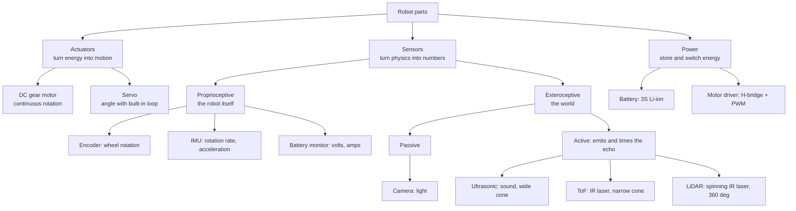

# 00.03 — Field guide: motors, servos, encoders, IMUs, cameras, LiDAR, ToF, ultrasonic

<!-- glance:start -->
<!-- generated by tools/build.py from curriculum/syllabus.yaml — edit the syllabus, not this block -->

| | |
|---|---|
| **Track** | Main path |
| **Difficulty** | Beginner |
| **Time** | 45 min |
| **Hardware** | none |
| **Software** | none |
| **Prerequisites** | [00.02 The robotics stack from AI down to motors](00.02-the-robotics-stack.md) |
| **Skip if** | You know what each of these parts measures or moves and roughly what it costs. |

<!-- glance:end -->

## What you will learn

- Say what each common robot part moves or measures: motor, servo, encoder, IMU, camera, LiDAR, ToF, ultrasonic, motor controller and battery.
- Read the handful of specs that matter for each part (range, resolution, rate, field of view, voltage, current) and turn them into robot numbers.
- Know roughly what each part costs in Israel (Sept 2026) and where it sits on karmel.
- Predict which sensor fails in a given situation (glass, black sofa, sunlight, a slipping wheel).
- Classify any component as actuator, sensor, compute or power, and as proprioceptive or exteroceptive.

## Why it matters

In 00.02 you drew the stack. This lesson fills in its bottom half with real parts. Before you spend
₪2,000+ on Stage 1 ([01.02](../01-first-robot/01.02-buying-hardware-in-israel.md)), you should know
why karmel has *both* an ultrasonic and a ToF sensor, why its motors have encoders, why the LiDAR costs
more than everything else on the first shopping list, and why the battery gets its own safety rules.

Every part here gets a deep lesson later (module 07 for sensors, 01–02 and FE for motors and power).
This is the field guide you carry until then: enough to recognize a part, read its spec sheet and
guess how it will fail.

<!-- prereqs:start -->
## Prerequisites

You need these first:

- [00.02 The robotics stack from AI down to motors](00.02-the-robotics-stack.md)

### Optional prerequisite links

None.

Check your readiness: `python course.py why 00.03`
<!-- prereqs:end -->

## Concept

### Actuators move, sensors measure

An **actuator** turns energy into motion: motors, servos, linear actuators, a gripper. A **sensor**
turns a physical quantity into a number: rotation, acceleration, light, distance. Between them sit
**motor controllers** (which turn small control signals into large currents) and the **battery**
(which supplies all the energy). In the stack from 00.02 these are layers 6–8, plus the sensor
drivers that feed layer 4.

Two ways to sort sensors are worth learning now, because they predict failure modes:

- **Proprioceptive vs exteroceptive.** Proprioceptive sensors measure the robot itself: encoders
  (wheel rotation), IMU (the body's acceleration and rotation), battery voltage. Exteroceptive sensors
  measure the world: ToF, ultrasonic, LiDAR, camera. Proprioception works in a dark, empty room but
  drifts over time. Exteroception fixes drift but depends on what the world looks like.
- **Active vs passive.** Active sensors emit something and time the echo: ultrasonic (sound), ToF and
  LiDAR (infrared laser light). Passive sensors only receive: a camera, an IMU. Active sensors fail on
  surfaces that don't send the signal back (glass, black velvet, soft fabric); passive cameras fail in
  the dark or in glare.

The software analogy: proprioceptive sensors are your service's internal metrics; exteroceptive
sensors are synthetic probes against the outside world. You need both, and they fail differently.

> [!TIP]
> **Ask your teacher:** "For each sensor on karmel, give me one realistic situation in my apartment
> where it returns a confidently wrong number, not just noise."

## Technical explanation

### Level 1 — Intuition: the spec vocabulary

Every datasheet boils down to a few questions. Keep this table next to you when you shop:

| Spec | Question it answers | Example (karmel) |
|---|---|---|
| Range | Nearest and farthest it can measure | VL53L1X ToF: up to ~4 m |
| Resolution | Smallest change it can report | Encoder: 0.115 mm of wheel travel per tick |
| Rate | How many readings per second | RPLIDAR C1: ~10 scans/s |
| Latency | How old a reading is when you get it | USB webcam: tens of ms or more |
| Field of view | How wide it looks | VL53L1X: ~27° cone; LiDAR: 360° |
| Accuracy / noise | How far readings are from the truth, and how much they scatter | Module 07 measures this |
| Interface | How it talks to a computer | GPIO pulses, PWM, I²C, UART, USB |
| Voltage / current | What it needs to run, what it can take | Pico pins are 3.3 V only |

### Level 2 — Practical: the field guide

Prices are approximate, include VAT, and were checked in Israeli shops on 2026-09-16 unless marked
"estimate". Details, alternatives and suppliers: [HARDWARE.md](../HARDWARE.md) and the per-stage pages
such as [hardware/stage-1-first-robot.md](../hardware/stage-1-first-robot.md).

#### DC gear motor (actuator)

- **What it moves:** a shaft, continuously, in either direction. Speed rises with average voltage; torque
  rises with current. A **gearbox** trades speed for torque so a small fast motor can push a 1.6 kg robot.
- **Typical specs:** rated voltage (6/12 V), no-load speed (RPM at the output shaft), stall current (the
  current when blocked, often 10× the running current), gear ratio, shaft type.
- **karmel:** 2× **Yahboom 520** 12 V, 1:56 gearbox, **205 RPM** no-load, 0.3 A rated, **4 A stall**, 6 mm D
  shaft, with a Hall encoder built in. **≈ ₪65 each** (Piitel). Premium alternative: Pololu 25D ≈ ₪347 (4Project).
- **Deep dive:** [FE.10](../optional-foundations/electronics/FE.10-dc-motors.md), [08.02](../08-control/08.02-motor-step-response.md).

```text
   battery ─▶ [driver] ─▶ ┌──────────┐┌─────────┐
                          │  motor   ││ gearbox │══ output shaft (205 RPM) ══ wheel
                          │ ~11,500  ││  1:56   │
                          │   RPM    │└─────────┘
                          └────┬─────┘
                        [encoder disc + 2 Hall sensors] ─▶ A, B pulses
```

#### Servo (actuator with built-in feedback)

- **What it moves:** a shaft to a commanded **angle** and holds it there. Inside: a small motor, a gearbox,
  a position sensor and a controller, all in one box. It is a closed loop you buy ready-made.
- **Two kinds you will meet:**
  - *Hobby PWM servo* (e.g. SG90 micro servo): one signal wire; a pulse every 20 ms (50 Hz) whose width,
    1.0–2.0 ms, sets the angle across roughly 180°. No feedback to your code. **≈ ₪10–25** (estimate, not
    checked). Good for a pan-tilt camera mount.
  - *Serial bus servo* (Feetech STS3215 class): many servos daisy-chained on one UART bus; you command
    position and speed and *read back* position, load, voltage and temperature. A 12-bit magnetic encoder
    gives 4,096 steps per turn. **≈ ₪107** for a 12 V 30 kg·cm unit (Piitel). karmel's SO-101 arm (Stage 5)
    uses six of them per arm.
- **Deep dive:** [FE.11](../optional-foundations/electronics/FE.11-servos-and-steppers.md), [14.03](../14-robotic-arm/14.03-controlling-servos.md).

```text
 PWM servo signal (50 Hz):   1.0 ms ≈ 0°      1.5 ms ≈ 90°       2.0 ms ≈ 180°
                             ┌┐                ┌─┐                ┌──┐
                         ────┘└──────── ... ───┘ └─────── ... ────┘  └─────
                             |<──────── 20 ms period ────────>|
```

A **stepper motor** is a third kind, common in 3D printers: it moves in fixed steps (typically 200 per
turn) without an encoder. It's rare on mobile robots because it wastes power when holding and can
silently skip steps under load.

#### Encoder (proprioceptive sensor)

- **What it measures:** rotation. An **incremental quadrature** encoder produces two square waves, A and B,
  90° out of phase. Counting edges gives how far the shaft turned; which wave leads gives the direction.
  An **absolute** encoder (like the one inside a bus servo) reports the angle directly, even after power-up.
- **Typical specs:** pulses per revolution (PPR) of the motor shaft, supply voltage, output type.
- **karmel:** the Yahboom 520's Hall encoder gives **11 pulses per motor revolution** per channel. Counting
  all 4 edges of A and B (×4) and multiplying by the 1:56 gearbox gives **2,464 counts per wheel revolution**:
  about **0.115 mm** of travel per count on a 90 mm wheel. At full speed that's ~6,700 edges per second per
  wheel, which is why the Pico counts them in hardware (PIO). **Included in the ₪65 motor.**
- **Deep dive:** [01.09](../01-first-robot/01.09-reading-encoders.md), [07.02](../07-sensors/07.02-wheel-encoders-in-depth.md).

```text
 forward:   A  ─┐ ┌─┐ ┌─┐ ┌─        backward:  A  ┌─┐ ┌─┐ ┌─┐
               └─┘ └─┘ └─┘                       ─┘ └─┘ └─┘ └─
            B  ┐ ┌─┐ ┌─┐ ┌─┐                   B  ─┐ ┌─┐ ┌─┐ ┌
               └─┘ └─┘ └─┘ └                       └─┘ └─┘ └─┘
            A rises while B is high               A rises while B is low
            1 cycle = 4 countable edges
```

Encoders measure *wheel* rotation, not robot motion. When a wheel slips on a rug, the encoder happily
reports distance the robot never travelled.

#### IMU — inertial measurement unit (proprioceptive sensor)

- **What it measures:** a **gyroscope** measures angular velocity (rad/s) around 3 axes; an **accelerometer**
  measures acceleration (m/s²) including gravity, which reveals which way is down; a **magnetometer**, if
  present, measures the magnetic field (a compass, badly disturbed by motors and steel indoors). "6-DOF" =
  gyro + accel, "9-DOF" = plus magnetometer.
- **Typical specs:** gyro range ±250 to ±2,000 °/s, accel range ±2 to ±16 g, output rate 100–1,000 Hz, I²C or
  SPI, and the number that matters most: **gyro bias** (the reading when perfectly still). Integrating a
  0.5 °/s bias for 60 s gives a 30° heading error.
- **karmel (Stage 2):** a **BNO055** breakout (does orientation fusion on the chip, has a released ROS 2
  driver) **≈ ₪135** (Hackstore, out of stock on 2026-09-16), or **ICM-20948** ≈ ₪152 (4Project, in stock),
  mounted at the robot's center. It corrects the heading when wheels slip.
- **Deep dive:** [07.05](../07-sensors/07.05-imu-fundamentals.md), [10.07](../10-localization/10.07-fusing-imu-and-odometry.md).

```text
          z (up, yaw rate)
          ▲
          │   ↺ gyro measures rotation about each axis
          │
          ●────▶ x (forward)      accelerometer at rest reads ≈ (0, 0, +9.81) m/s²
         ╱                        (it feels the floor pushing up against gravity)
        ▼ y (left)
```

#### Camera (exteroceptive, passive)

- **What it measures:** light, as a grid of pixels (640×480 = 307,200 pixels × 3 color channels per frame).
  It sees everything and measures no distance by itself; software must find "bottle" in the pixels.
- **Typical specs:** resolution, frame rate (15–60 fps), field of view, shutter type (cheap cameras use a
  *rolling shutter*, so fast motion skews the image), interface (USB UVC or the Pi's CSI ribbon), latency.
- **karmel (Stage 2):** a **USB webcam** such as a Logitech C920 **≈ ₪245** (C920E ≈ ₪220), front-mounted,
  used at 640×480. The Raspberry Pi Camera Module 3 (≈ ₪145, Wide ≈ ₪200) is an optional path, because its
  software stack needs workarounds on Ubuntu 24.04 (see `curriculum/versions.yaml`).
- **Depth cameras** add a distance per pixel (stereo or active IR): Intel RealSense D435i ≈ $334 or Luxonis
  OAK-D Lite ≈ $269, imported (Stage 4, optional).
- **Deep dive:** [07.08](../07-sensors/07.08-rgb-cameras.md), [07.09](../07-sensors/07.09-depth-cameras-and-point-clouds.md), module 13.

#### LiDAR (exteroceptive, active)

- **What it measures:** distance around the robot. A laser range finder spins on a motor and measures the
  time of flight of infrared light pulses, producing a **scan**: hundreds of (angle, distance) points per
  revolution in a horizontal plane.
- **Typical specs:** range (the C1: 12 m on white surfaces, 6 m on black), sample rate (C1: 5,000 samples/s),
  scan rate (~10 Hz, so ~500 points per turn, one every 0.72°), interface (USB serial adapter), laser safety
  class. Consumer 2D LiDARs are **Class 1: eye-safe** in normal use; still, never stare into or disassemble
  the emitter.
- **karmel (Stage 3):** **Slamtec RPLIDAR C1** on the top deck, **≈ ₪1,050** (Hackstore) or $69 imported
  (DFRobot). It is the sensor that makes mapping (SLAM) and navigation work. The course simulator models it
  as 360 samples at 10 Hz (`labs/config/karmel.yaml`).
- **Deep dive:** [07.07](../07-sensors/07.07-2d-lidar.md), modules 11–12.

```text
 top view, one scan                 ·  ·  ·
                                 ·            ·      each · = one (angle, range) sample
            wall ███████████  ·      ┌──────┐     ·
                               ·     │ C1 ↻ │     ·  points get sparser with distance:
                                 ·   └──────┘   ·    0.72° apart = 1.3 cm at 1 m, 3.8 cm at 3 m
                                    ·  ·  ·  ·
 misses: glass (light passes), mirrors (light bounces away), anything above or below the scan plane
```

#### ToF — optical time-of-flight distance sensor (exteroceptive, active)

- **What it measures:** distance to whatever is in a narrow cone in front of it, by timing an infrared laser
  pulse. Light is fast: the round trip from 1 m takes 6.7 **nano**seconds, so the timing is done by a
  dedicated chip. Think of it as a one-point LiDAR that doesn't spin.
- **Typical specs:** range 4 cm to ~4 m (VL53L1X; the older VL53L0X reaches ~2 m), field of view ~27°,
  up to ~50 readings/s, I²C, 940 nm Class 1 laser.
- **karmel (Stage 1):** a **VL53L1X** facing forward, 12.5 cm ahead of the wheel axis, for "stop before
  hitting things". **≈ ₪80** (Adafruit, Piitel) or **≈ ₪108** (Pololu, 4Project).
- **Deep dive:** [01.13](../01-first-robot/01.13-distance-sensors-stop.md), [07.04](../07-sensors/07.04-tof-sensors.md).

#### Ultrasonic distance sensor (exteroceptive, active)

- **What it measures:** distance, by sending a 40 kHz sound burst and timing the echo. Sound travels 343 m/s
  in air at 20 °C, so an echo after 5.83 ms means 1.0 m (there and back).
- **Typical specs:** ~2 cm to ~4 m, a wide beam (roughly 15–30° cone), at most ~20–40 readings per second
  (you must wait for the echo to die out), supply 3.3 V or 5 V.
- **karmel (Stage 1):** a **US-100** facing forward, **≈ ₪40** (Hackstore). It runs at 3.3 V, so it connects
  directly to the Pico. The cheaper **HC-SR04 ≈ ₪12** (4Project) needs 5 V and a resistor divider on its echo pin.
- **Why both ToF and ultrasonic?** They fail differently. Sound bounces off glass that light passes through;
  light works on soft fabric that absorbs sound. Two cheap sensors with different physics beat one good one.
- **Deep dive:** [01.13](../01-first-robot/01.13-distance-sensors-stop.md), [07.03](../07-sensors/07.03-ultrasonic-sensors.md).

```text
   side view     ┌────┐  )  )  )   ╲                       glass door:
   US-100 ───────┤ (o)├ ) ) ) ) )    ▌ obstacle             ultrasonic: sees it (sound reflects)
   (wide cone)   │ (o)├  )  )  )   ╱                        ToF/LiDAR: often doesn't (light passes)
                 └────┘   one sends, one listens
```

#### Motor controller / motor driver (power electronics)

- **What it does:** lets a 3.3 V logic pin that supplies a few milliamps control a motor that draws amps. An
  **H-bridge** of four transistor switches connects the motor to the battery in either polarity (direction);
  switching it on and off at ~20 kHz with **PWM** sets the average voltage (speed). "Motor driver" usually
  means just this power stage; a "motor controller" may also run its own speed or position loop.
- **Typical specs:** supply voltage range, continuous and peak current per channel, logic voltage, PWM
  frequency limit, protections (over-current, thermal shutdown), current-sense output.
- **karmel:** 2× **Pololu DRV8874** single-channel carriers: 4.5–37 V, 2.1 A continuous, current-sense
  output. **≈ ₪61 each** (4Project). Budget: TB6612FNG dual ≈ ₪30 (fine for light loads, may shut down on a
  stall). Avoid the classic **L298N** (it wastes 2–5 V as heat) and the **DRV8833** (its 10.8 V maximum is
  below a full 3S pack).
- **Deep dive:** [01.08](../01-first-robot/01.08-first-motor-spin.md), [02.03](../02-robot-electronics/02.03-motor-drivers-in-depth.md), [FE.12](../optional-foundations/electronics/FE.12-h-bridges-motor-drivers.md).

```text
         V_batt (10.8 V)
          ┌───┴───┐
         S1       S3          S1 + S4 closed: current → through motor → forward
          ├─(M)───┤           S3 + S2 closed: current ← through motor ← reverse
         S2       S4          never S1 + S2 together: a short circuit across the battery
          └───┬───┘           switching S1 on 60% of the time ≈ 6.5 V average
             GND
```

#### Battery (energy)

- **What it does:** stores all the energy the robot uses. Its voltage sags as it empties and under load,
  which changes motor speed (00.01's "tired battery").
- **Typical specs:** chemistry (Li-ion, LiPo, LiFePO₄, NiMH), cells in series (**S**: each Li-ion cell is 3.0–4.2 V,
  3.6–3.7 V nominal), capacity (Ah), energy (Wh = V × Ah), maximum continuous discharge current, connector.
- **karmel (Stage 1):** a **3S pack of Samsung INR18650-35E** cells: 9.0 V empty to 12.6 V full, 10.8 V nominal
  (Samsung rates the 35E cell at 3.6 V, not the 3.7 V that generic "11.1 V" LiPo labels assume),
  3.5 Ah, about **38 Wh**; the robot warns at 10.5 V and cuts off at 9.9 V. Cells **≈ ₪98 per pair** (Sollan),
  plus a holder ≈ ₪16, a 3S BMS protection board ≈ ₪45 and a 12.6 V charger ≈ ₪80 (Hackstore). Buy cells in
  Israel: lithium shipments from abroad are often refused.
- **Deep dive:** [FE.13](../optional-foundations/electronics/FE.13-batteries.md), [FE.14](../optional-foundations/electronics/FE.14-lithium-battery-safety.md), [01.07](../01-first-robot/01.07-power-system.md), [01.14](../01-first-robot/01.14-battery-monitoring.md).

> [!CAUTION]
> **Safety:** a lithium pack is the most dangerous part on karmel. A short circuit can deliver tens of amps,
> melt wires and start a fire. Don't buy or handle cells until you have read [SAFETY.md](../SAFETY.md) rules 4,
> 5 and 9 and lesson [FE.14](../optional-foundations/electronics/FE.14-lithium-battery-safety.md). Never charge
> unattended.

```text
  3S pack:   [+ 3.6 V −]──[+ 3.6 V −]──[+ 3.6 V −]    = 10.8 V nominal (12.6 V full, 9.0 V empty)
                 cell 1       cell 2       cell 3         capacity stays 3.5 Ah (series adds volts, not Ah)
  BMS board watches each cell: over-charge, over-discharge, short circuit
```

### Level 3 — Mathematics: turning specs into robot numbers

**Encoder resolution.** With $N$ counts per wheel revolution and wheel radius $r$, one count is

$$\Delta s = \frac{2\pi r}{N}, \qquad N = \text{PPR} \times \text{gear ratio} \times 4$$

karmel: $N = 11 \times 56 \times 4 = 2464$ and $\Delta s = 2\pi \times 45\ \text{mm} / 2464 = 0.1147$ mm.

**Time of flight.** Active sensors measure a round trip, so distance is half the path:

$$d = \frac{c \cdot t}{2}$$

Ultrasonic ($c = 343$ m/s): $t = 5.83$ ms gives $d = 343 \times 0.00583 / 2 = 1.000$ m. Light
($c = 3.0 \times 10^8$ m/s): 1 m gives $t = 2 \times 1 / 3.0 \times 10^8 = 6.67$ ns.

**LiDAR point spacing.** With angular step $\Delta\theta$ (radians), neighboring points at range $R$ are

$$\text{gap} \approx R\,\Delta\theta$$

360 samples: $\Delta\theta = 2\pi/360 = 0.01745$ rad, so at 3 m the gap is $3 \times 0.01745 = 0.052$ m. A 2 cm chair
leg can fall between two beams.

**Gyro drift.** A constant bias $b$ integrated for time $t$ gives a heading error $\Delta\psi = b\,t$: 0.5 °/s for
60 s is 30°.

**Battery energy and runtime.**

$$E = n_{\text{cells}} \cdot V_{\text{cell}} \cdot C, \qquad t_{\text{run}} \approx \frac{k \cdot E}{P_{\text{avg}}}$$

with $k \approx 0.8$ because you stop before empty. karmel: $E = 3 \times 3.6 \times 3.5 = 37.8$ Wh; at an average
$P = 12$ W, $t \approx 0.8 \times 37.8 / 12 = 2.5$ h.

### Level 4 — Implementation: how each part connects on karmel

| Part | Interface | Connects to | Pins / port (`labs/config/karmel.yaml`) | Voltage |
|---|---|---|---|---|
| Motor driver ×2 | 2 PWM inputs each (IN/IN mode) | Pico | GP2/GP3 left, GP6/GP7 right | 3.3 V logic, battery power |
| Encoders ×2 | quadrature A/B pulses | Pico (PIO) | GP10/GP11 left, GP12/GP13 right | 3.3 V |
| VL53L1X ToF | I²C | Pico | SDA GP4, SCL GP5 | 3.3 V |
| US-100 ultrasonic | trigger pulse out, echo pulse in | Pico | GP14 trig, GP15 echo | 3.3 V |
| INA219 (battery V/A) | I²C | Pico | shared I²C bus | 3.3 V |
| IMU (Stage 2) | I²C | Pico or Pi | module 07 decides | 3.3 V |
| USB webcam (Stage 2) | USB (UVC) | Pi 5 | `/dev/video0` | 5 V from USB |
| RPLIDAR C1 (Stage 3) | USB serial | Pi 5 | `/dev/ttyUSB0` | 5 V from USB |
| Pico itself | USB serial | Pi 5 | `/dev/ttyACM0`, 115200 baud | 5 V from USB |

The rule of thumb that falls out of this table: **anything that needs microsecond timing or raw pins goes
to the Pico; anything that produces a lot of data goes to the Pi over USB.** [00.04](00.04-robot-computers.md)
explains why.

## Diagram

Where the parts sit on karmel (top view, positions from `labs/config/karmel.yaml`, x forward):

```text
                              x (forward) ▲
                                          │
              ┌───────────────────────────┼───────────────────────────┐ ← front edge
              │         [ToF VL53L1X] + [US-100]  x = +0.125 m         │
              │                  [USB camera]  x = +0.10 m, z = 0.10 m │
              │         ◯ ball caster, underneath, x = +0.10 m         │
   ┌──┐       │                                                        │       ┌──┐
   │L │═[520 motor+enc]═[DRV8874]   [RPLIDAR C1 on top deck, z=0.12]  [DRV8874]═[520 motor+enc]═│R │
   │  │ wheel r = 45 mm            [IMU at center]  ● base_link          wheel                 │  │
   └──┘       │          [Pico 2]      [Raspberry Pi 5]                │       └──┘
   y ◀────────┼────── wheel separation 0.200 m ─────────────────────────┼────────
              │               [3S Li-ion pack + BMS + fuse + switch]   │
              └────────────────────────────────────────────────────────┘
```

How the parts classify:



## Code

A calculator that turns datasheet numbers into robot numbers. Save as `spec_sheet.py` and run
`python spec_sheet.py`. Standard library only.

```python
"""00.03 — turn datasheet numbers into robot numbers (karmel defaults).

Standard library only:  python spec_sheet.py
"""
import math

# --- drive (labs/config/karmel.yaml) ---
WHEEL_R = 0.045            # m
PPR_MOTOR = 11             # encoder pulses per motor revolution, one channel
GEAR = 56.0                # gearbox ratio (205 RPM version)
QUAD = 4                   # quadrature decoding: count every edge of A and B
MAX_WHEEL = 17.0           # rad/s, loaded

# --- sensors ---
SPEED_OF_SOUND = 343.0     # m/s in air at 20 °C
LIDAR_SAMPLES = 360        # points per revolution (karmel.yaml)
GYRO_BIAS_DEG_S = 0.5      # a plausible uncalibrated MEMS gyro bias

# --- battery: 3S Samsung 35E ---
CELLS, NOMINAL_CELL_V, CAPACITY_AH = 3, 3.6, 3.5   # Samsung INR18650-35E: 3.6 V nominal per cell


def main() -> None:
    ticks_per_rev = PPR_MOTOR * GEAR * QUAD
    mm_per_tick = 2 * math.pi * WHEEL_R / ticks_per_rev * 1000
    edges_per_s = MAX_WHEEL / (2 * math.pi) * ticks_per_rev
    print(f"Encoder: {ticks_per_rev:.0f} ticks/wheel rev, {mm_per_tick:.4f} mm/tick, "
          f"{edges_per_s:.0f} edges/s at {MAX_WHEEL} rad/s")

    echo_ms = 5.83
    print(f"Ultrasonic: echo after {echo_ms} ms -> {SPEED_OF_SOUND * echo_ms / 1000 / 2:.3f} m "
          f"(sound goes there AND back)")
    print(f"Ultrasonic: max rate for a 4 m range = {1 / (2 * 4.0 / SPEED_OF_SOUND):.0f} Hz "
          f"(before the echo of the previous ping could still arrive)")

    tof_s = 2 * 1.0 / 299_792_458
    print(f"Optical ToF: light returns from 1 m in {tof_s * 1e9:.2f} ns")

    step_rad = 2 * math.pi / LIDAR_SAMPLES
    for r in (1.0, 3.0, 6.0):
        print(f"LiDAR: {LIDAR_SAMPLES} samples/rev -> points {r * step_rad * 100:.1f} cm apart at {r:.0f} m")

    print(f"Gyro: {GYRO_BIAS_DEG_S} deg/s bias integrated for 60 s -> heading error {GYRO_BIAS_DEG_S * 60:.0f} deg")

    wh = CELLS * NOMINAL_CELL_V * CAPACITY_AH
    for load_w in (6.0, 12.0):
        print(f"Battery: {CELLS}S {CAPACITY_AH} Ah = {wh:.1f} Wh; at {load_w:.0f} W average "
              f"-> {0.8 * wh / load_w:.1f} h using 80 % of capacity")

    w, h = 640, 480
    print(f"Camera: {w}x{h} RGB frame = {w * h * 3 / 1e6:.2f} MB raw; at 30 fps = {w * h * 3 * 30 / 1e6:.0f} MB/s")


if __name__ == "__main__":
    main()
```

Output:

```text
Encoder: 2464 ticks/wheel rev, 0.1147 mm/tick, 6667 edges/s at 17.0 rad/s
Ultrasonic: echo after 5.83 ms -> 1.000 m (sound goes there AND back)
Ultrasonic: max rate for a 4 m range = 43 Hz (before the echo of the previous ping could still arrive)
Optical ToF: light returns from 1 m in 6.67 ns
LiDAR: 360 samples/rev -> points 1.7 cm apart at 1 m
LiDAR: 360 samples/rev -> points 5.2 cm apart at 3 m
LiDAR: 360 samples/rev -> points 10.5 cm apart at 6 m
Gyro: 0.5 deg/s bias integrated for 60 s -> heading error 30 deg
Battery: 3S 3.5 Ah = 37.8 Wh; at 6 W average -> 5.0 h using 80 % of capacity
Battery: 3S 3.5 Ah = 37.8 Wh; at 12 W average -> 2.5 h using 80 % of capacity
Camera: 640x480 RGB frame = 0.92 MB raw; at 30 fps = 28 MB/s
```

## Exercise

All exercises in this lesson need hardware: **none**.

### Exercise 00.03-E1 — Encoder resolution `[numerical]`

(a) Piitel may ship the 333 RPM (1:30) version of the Yahboom 520 instead of the 1:56 one. With the same 11 PPR
encoder, ×4 decoding and 90 mm wheels, how many counts per wheel revolution and how many mm per count?
(b) The Pololu Romi kit gives about 1,440 counts per revolution on 70 mm wheels. mm per count?
(c) The Pi reads tick counts at 50 Hz. What is the smallest non-zero speed karmel (1:56) can report from one
sample, in mm/s? Why does that matter when driving slowly?

### Exercise 00.03-E2 — Time of flight and point spacing `[numerical]`

(a) An ultrasonic echo arrives after 11.66 ms. Distance? (b) How long does light take to return from a wall
4 m from a ToF sensor? (c) The RPLIDAR C1 gives ~500 points per revolution. What is the gap between
neighboring points at 1 m, 3 m and 4 m? Is a 2 cm-wide chair leg guaranteed to be hit at 1 m? At 3 m?

### Exercise 00.03-E3 — Which sensor lies? `[predict]`

For each situation, predict what the ToF, ultrasonic, LiDAR, wheel encoders and IMU report, and which ones
are *confidently wrong*: (a) karmel faces a glass balcony door 0.5 m away; (b) it faces a black velvet sofa
2 m away; (c) karmel's wheels spin on a smooth tile floor while it is pushed against a wall; (d) a sunbeam
through a window hits the sensors at noon; (e) karmel drives next to a table whose top is higher than the
LiDAR and whose legs are thin.

### Exercise 00.03-E4 — Design: classify the parts `[design]`
Build a table with columns *part · actuator/sensor/compute/power · proprioceptive/exteroceptive (sensors
only) · active/passive (sensors only) · interface · karmel layer (00.02)*. Rows: Yahboom 520 motor, its Hall
encoder, DRV8874, VL53L1X, US-100, BNO055, USB webcam, RPLIDAR C1, INA219, 3S Li-ion pack with BMS, STS3215
bus servo, Raspberry Pi Pico 2, SG90 servo, a bumper microswitch.

### Exercise 00.03-E5 — Battery runtime from a power budget `[numerical]`

karmel at Stage 3 draws, on average: Raspberry Pi 5 6 W, LiDAR 1.5 W and small sensors 0.5 W, all from the
5 V regulator (90% efficient), plus 4 W for the two motors directly from the pack. With the 3S 3.5 Ah pack
(3.6 V nominal per cell) and using 80% of its energy, how long does karmel run, and what average current
flows from the pack at 10.8 V?

## Expected result

- **00.03-E1:** (a) $11 \times 30 \times 4 =$ **1,320 counts**, $2\pi \times 45 / 1320 =$ **0.214 mm/count**. (b) $\pi \times 70 / 1440 =$
  **0.153 mm/count**. (c) One count in 20 ms: $0.1147 / 0.02 =$ **5.7 mm/s**. Below a few counts per sample the
  speed estimate jumps between 0, 5.7, 11.5 mm/s…, so slow-speed control gets jerky; 07.02 and 08.03 fix this
  by timing between ticks or filtering.
- **00.03-E2:** (a) $343 \times 0.01166 / 2 =$ **2.00 m**. (b) $2 \times 4 / 3\times10^8 =$ **26.7 ns**. (c) $\Delta\theta = 2\pi/500 = 0.01257$
  rad: **1.26 cm at 1 m, 3.77 cm at 3 m, 5.03 cm at 4 m**. At 1 m, yes: a 2 cm leg is wider than the 1.26 cm gap.
  At 3 m, no: it can fall between two beams.
- **00.03-E3:** (a) Ultrasonic ≈ 0.5 m (correct); ToF and LiDAR often report the wall or object *behind* the
  glass, or nothing: confidently wrong. (b) LiDAR and ToF return weak or no readings (reduced range on black;
  the C1 is rated only 6 m on black), ultrasonic may get a weak echo from soft fabric: expect dropouts rather
  than lies. (c) Encoders report steady forward motion: confidently wrong; IMU shows no rotation and no
  acceleration; range sensors show a constant distance. (d) ToF and LiDAR get noisier with shorter maximum range
  in strong infrared sunlight; the camera may saturate; ultrasonic and encoders are unaffected. (e) LiDAR sees
  only thin legs as a few points (or misses them) and doesn't see the tabletop at all: karmel thinks it can
  drive under a table its camera mast might hit. Full credit if you identified (a) ToF/LiDAR, (c) encoders and
  (e) LiDAR as the confidently wrong ones.
- **00.03-E4:** Motor: actuator, PWM via driver, layer 7. Encoder: sensor, proprioceptive, active electronics
  but passive sensing of rotation (accept either), quadrature pulses, layer 6/5. DRV8874: power, PWM, layer 6.
  VL53L1X: sensor, exteroceptive, active, I²C, layer 4 input (and 5 reflex). US-100: same, pulse timing. BNO055:
  sensor, proprioceptive, passive, I²C. Webcam: sensor, exteroceptive, passive, USB. RPLIDAR C1: sensor,
  exteroceptive, active, USB serial. INA219: sensor, proprioceptive, passive, I²C. Battery + BMS: power, layer 8.
  STS3215: actuator with built-in position sensor, UART bus, layers 5–7 in one box. Pico 2: compute, USB serial,
  layers 5–6. SG90: actuator, PWM pulse, layer 7 with its own internal loop. Bumper switch: sensor,
  exteroceptive, passive (contact), GPIO. Minor disagreements on active/passive for encoders are fine.
- **00.03-E5:** 5 V loads 8 W / 0.9 = **8.9 W** from the pack; plus motors = **12.9 W**. Energy $3 \times 3.6 \times 3.5 = 37.8$ Wh;
  usable 30.2 Wh; runtime **≈ 2.3 h**. Current $12.9 / 10.8 \approx$ **1.19 A**.

## Troubleshooting

### Symptom: a spec sheet gives a number you can't place in the table

1. **Find the unit first.** RPM or rad/s? PPR on the motor shaft or counts on the output? mA or A? Many
   mistakes are ×4 (quadrature), ×gear ratio or ×1000 errors.
2. **Find the conditions.** "Range 12 m" on white targets; "stall current" at rated voltage; "runtime" at
   some load. Write the condition next to the number.
3. **Check it against physics** with a quick calculation like the ones in Level 3. If a sensor claims a
   rate faster than its time of flight allows, you misread something.

### Symptom: in module 01–07, a distance sensor reads nonsense

This is the decision procedure you will use on the real robot ([07.11](../07-sensors/07.11-sensor-troubleshooting.md)
teaches the full method):

1. **Point it at a known flat, matte target** (a cardboard box) at a measured distance. If that's wrong,
   the problem is wiring, power or code (units, divide-by-two), not the environment.
2. **If the known target works**, change one property of the target at a time: angle, material, color,
   lighting. You have found a physics limitation; add a second sensor with different physics.
3. **If readings are intermittent**, suspect power noise from the motors (module 02) before blaming the sensor.

## Common mistakes

- **Buying a driver by its "rated" current instead of the motor's stall current.** Motors draw stall current
  every time they start or get blocked. Check the stall number (4 A for karmel's motors).
- **Treating encoders as ground truth.** They measure wheel rotation, not robot motion. Slip, bumps and
  wheel wear all lie to them. Fuse them with an IMU and exteroceptive sensors (module 10).
- **Connecting 5 V sensor outputs to 3.3 V Pico pins.** The HC-SR04's echo pin outputs 5 V and can damage the
  Pico. Choose 3.3 V parts (US-100) or level-shift ([02.05](../02-robot-electronics/02.05-logic-levels-and-protection.md)).
- **Assuming a LiDAR sees everything.** It sees one horizontal plane. Tabletops, overhangs, glass and stairs
  going down are invisible to it.
- **Forgetting that battery voltage changes.** 12.6 V full and 9.9 V at cutoff: motor speed at the same PWM
  duty changes by ~20% over one charge. Closed-loop speed control (module 08) removes this.
- **Ordering lithium cells from abroad.** Parcels with lithium cells are often refused on the way to Israel.
  Buy cells locally; chargers and BMS boards import fine.

## Knowledge check

1. What is the difference between a DC gear motor and a servo, from your code's point of view?
   <details><summary>Answer</summary>

   A DC motor gets a power level (PWM duty) and turns continuously; your code must add sensing (an encoder) and
   control to reach a speed or position. A servo gets a target angle (or position) and closes the loop inside
   its own case; bus servos also report position back.
   </details>

2. karmel's encoder gives 2,464 counts per wheel revolution on 90 mm wheels. How far has the wheel rolled after
   10,000 counts?
   <details><summary>Answer</summary>

   $10000 \times 2\pi \times 0.045 / 2464 = 10000 \times 0.0001147 = 1.147$ m.
   </details>

3. Why does karmel have both a ToF sensor and an ultrasonic sensor facing forward?
   <details><summary>Answer</summary>

   They use different physics and fail in different situations: ultrasonic sees glass but struggles with soft,
   sound-absorbing surfaces and has a wide, imprecise cone; ToF has a narrow, precise beam but light passes
   through glass and fades on black. Together they cover each other's blind spots cheaply.
   </details>

4. An IMU's gyro has a 0.2 °/s bias. If you estimate heading only by integrating the gyro, how wrong is the
   heading after 5 minutes?
   <details><summary>Answer</summary>

   $0.2 \times 300 = 60°$. That's why heading also needs other sources (wheel odometry, LiDAR scan matching, a magnetometer
   outdoors) and why module 10 fuses them.
   </details>

5. Predict: you set 50% PWM duty on karmel's motors with a full battery (12.6 V), and again near cutoff (9.9 V).
   What happens to the wheel speed?
   <details><summary>Answer</summary>

   The average motor voltage drops from about 6.3 V to about 5.0 V, so the speed drops by roughly 20%. Open-loop
   duty doesn't give a fixed speed; an encoder-based speed loop does.
   </details>

6. Debugging scenario: the robot's odometry says it drove 3 m straight, but it actually stopped against a
   doorframe after 1 m with the wheels spinning. Which sensor was misleading, and which sensor would have
   revealed the problem?
   <details><summary>Answer</summary>

   The wheel encoders (they count rotation, not motion). The IMU would show no forward acceleration and the
   forward range sensor would show an unchanging distance; the motor driver's current sense would show high
   current. Any of them reveals a stall/slip.
   </details>

7. Why is the RPLIDAR C1 considered safe to use at home, and what should you still avoid?
   <details><summary>Answer</summary>

   It is a Class 1 laser product: eye-safe under normal use. Still, don't stare into the emitter at close range
   and never open or modify it, which can defeat the safety design.
   </details>

8. A 3S Li-ion pack of 3.5 Ah cells: what are its nominal voltage and energy, and what does "3S" mean?
   <details><summary>Answer</summary>

   Three cells in series: $3 \times 3.6 = 10.8$ V nominal for the Samsung 35E (12.6 V full). Capacity stays 3.5 Ah; energy $10.8 \times 3.5 \approx 37.8$ Wh. A pack of generic 3.7 V/cell LiPos would be labelled 11.1 V — same pack, different label.
   </details>

## Practical challenge

Write a **parts dossier** for karmel's Stage 1 and Stage 3 sensors: for the Yahboom 520 encoder, VL53L1X,
US-100 and RPLIDAR C1, find the manufacturer's datasheet or official product page and extract range,
resolution, rate, field of view, interface, supply voltage and current, and one limitation the datasheet
admits. Then extend `spec_sheet.py` so each sensor's numbers come from a dictionary you filled from those
documents, and print one derived robot number per sensor (e.g. mm per count, maximum safe ping rate, point
spacing at 3 m).

**Acceptance criteria:** every number has a source URL; at least one number in this lesson turns out to be
different in the official datasheet and you note the difference; the script runs and prints four derived
numbers. Ask your teacher to check two of your extracted values against the documents.

## You can skip this if…

You can say what each of the ten parts measures or moves, roughly what it costs, and how it fails, and you
answer knowledge-check questions 3, 5 and 6 correctly without looking.

`python course.py skip 00.03 --reason "I know robot sensors and actuators"`

## Go deeper

- Adafruit, Motor Selection Guide: https://learn.adafruit.com/adafruit-motor-selection-guide — DC motors vs servos vs steppers, and how to pick a driver.
- SparkFun, Pulse Width Modulation: https://learn.sparkfun.com/tutorials/pulse-width-modulation — PWM for motor speed and servo angles, in one page.
- Pololu, 25D gearmotor with 48 CPR encoder (product page and resources): https://www.pololu.com/product/4865 — a well-documented example of reading a gearmotor + encoder spec sheet.
- `rplidar_ros` package page: https://index.ros.org/p/rplidar_ros/ — the official ROS 2 driver for karmel's LiDAR, with supported models.
- REP-145, Conventions for IMU Sensor Drivers: https://www.ros.org/reps/rep-0145.html — what an IMU driver is expected to publish, in which frames and units.
- Battery University, BU-304a Safety Concerns with Li-ion: https://batteryuniversity.com/article/bu-304a-safety-concerns-with-li-ion — why lithium cells fail and how to avoid it.

## Progress checkpoint

- [ ] I can say what each of the ten parts moves or measures, and where it sits on karmel.
- [ ] I can read range, resolution, rate, field of view and interface from a spec sheet.
- [ ] I can compute encoder resolution, time of flight, LiDAR point spacing, gyro drift and battery runtime.
- [ ] I can predict which sensor fails on glass, black surfaces, sunlight and wheel slip.

`python course.py complete 00.03` (exercises done) · `python course.py master 00.03`
(challenge done) · `python course.py struggle 00.03 "what was hard"`

Next: [00.04 — Robot computers: microcontrollers, single-board computers and GPUs](00.04-robot-computers.md).
