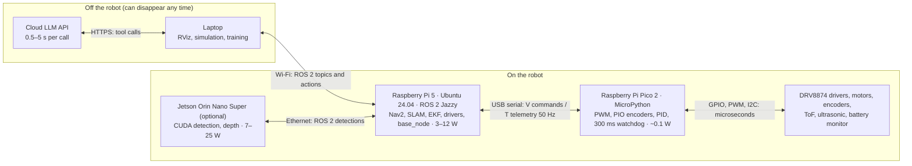

# 00.04 — Robot computers: microcontrollers, single-board computers and GPUs

<!-- glance:start -->
<!-- generated by tools/build.py from curriculum/syllabus.yaml — edit the syllabus, not this block -->

| | |
|---|---|
| **Track** | Main path |
| **Difficulty** | Beginner |
| **Time** | 35 min |
| **Hardware** | none |
| **Software** | none |
| **Prerequisites** | [00.03 Field guide: motors, servos, encoders, IMUs, cameras, LiDAR, ToF, ultrasonic](00.03-actuators-and-sensors-field-guide.md) |
| **Skip if** | You can explain why a robot typically has both a Raspberry Pi and a microcontroller. |

<!-- glance:end -->

## What you will learn

- Explain the difference between a microcontroller, a single-board computer, an edge GPU and a laptop or cloud machine, in terms of timing, power, I/O and failure behavior.
- Explain why karmel has a Raspberry Pi 5 **and** a Raspberry Pi Pico 2, and which job belongs to each.
- Define real-time, determinism, jitter and a watchdog, and measure loop jitter on your own computer.
- Compute whether a given computer can keep up with an encoder, a control loop or a camera stream.
- Choose a compute architecture for a new robot and justify it.

## Why it matters

A robot is a distributed system in a very small box. karmel's first version has two computers
connected by a USB cable; the final version may add a laptop, a cloud LLM and optionally a Jetson.
Putting a job on the wrong computer produces bugs that look like magic: a wheel that counts the wrong
number of ticks at full speed, a robot that keeps driving after the Pi crashed, a Raspberry Pi that
reboots every time the motors start.

You already choose between a CDN edge function, an app server and a batch GPU cluster by latency,
cost and failure domain. This lesson gives you the same reasoning for robot compute, with numbers.
It is the "why" behind [01.01 Plan the build](../01-first-robot/01.01-plan-the-build.md), which is
the next lesson after this module.

<!-- prereqs:start -->
## Prerequisites

You need these first:

- [00.03 Field guide: motors, servos, encoders, IMUs, cameras, LiDAR, ToF, ultrasonic](00.03-actuators-and-sensors-field-guide.md)

### Optional prerequisite links

None.

Check your readiness: `python course.py why 00.04`
<!-- prereqs:end -->

## Concept

### Four kinds of computer, four jobs

| | Microcontroller (MCU) | Single-board computer (SBC) | Edge GPU module | Laptop / cloud |
|---|---|---|---|---|
| karmel's | **Raspberry Pi Pico 2** | **Raspberry Pi 5** | Jetson Orin Nano Super (optional) | your laptop; cloud LLM |
| Runs | one program, no OS (MicroPython or C) | Linux (Ubuntu 24.04), many processes | Linux + CUDA | Windows/Linux, big models |
| Good at | exact timing, raw pins, never hanging | ROS 2, networking, SLAM, Nav2, cameras | neural networks on the robot | training, LLMs, visualization |
| Boots in | well under a second | tens of seconds | tens of seconds | — |
| Power | ≈ 0.1 W | ≈ 3–12 W | 7–25 W | 15–300 W, or someone else's |
| Price (Sept 2026) | ≈ ₪35 | ≈ ₪500 (4 GB) / ₪800 (8 GB) | ≈ ₪1,652 (out of stock) | — |
| Layer (00.02) | 5–6 | 2–5 | 4 (perception) | 1, dev tools |

### Why not just one computer?

The Raspberry Pi 5 has about 16,000 times the Pico's memory and far faster cores. Why does karmel also need a ₪35
microcontroller? Four reasons, each of which you would recognize from server design:

1. **Timing.** Linux decides when your program runs. Usually that's within a millisecond of when you
   asked; occasionally it's 10 ms later because the kernel flushed a disk buffer or the Wi-Fi driver
   was busy. For ROS 2 at 20 Hz that's fine. For counting encoder edges that arrive every 150 µs, it isn't.
   A microcontroller runs one loop with nothing to interrupt it, and the Pico's **PIO** blocks count
   edges in dedicated hardware.
2. **Failure isolation.** The Pi can crash, run out of memory, hang on an `apt upgrade` or reboot. When it
   does, something still has to stop the motors. The Pico's **300 ms command watchdog** does: no valid
   command for 300 ms, motors off. Servers have the same pattern: the baseboard management controller
   (BMC) is a small independent microcontroller that can still power-cycle a machine whose OS is frozen.
3. **Electrical I/O.** The Pi 5 has digital GPIO but **no analog inputs** (no ADC), and a mistake on its pins
   can destroy a ₪500 board. The Pico has ADCs (battery voltage), flexible PWM, and costs ₪35 to replace.
4. **Power and boot.** When motors start, the battery voltage dips. A microcontroller shrugs off a short dip
   and is running again in milliseconds; a Pi may brown out and take 30 s to reboot, and it must be shut
   down cleanly to protect its SD card.

The split is the classic **control plane / data plane** separation. The Pi is the control plane: it
decides *what* the wheels should do, with rich software and a network. The Pico is the data plane plus
safety interlock: it does the tight, simple, time-critical work and keeps doing the safe thing if the
control plane goes away. The interface between them is deliberately narrow: a text protocol with
velocity commands down and telemetry up ([labs/README.md](../labs/README.md) documents it).

> [!TIP]
> **Ask your teacher:** "Walk me through what happens on karmel, millisecond by millisecond, if the
> Raspberry Pi kernel freezes while the robot drives at 0.3 m/s. Then do the same assuming there were
> no Pico."

## Technical explanation

### Level 1 — Intuition: real-time means *on time*, not *fast*

- **Real-time** means a result is only correct if it arrives before a deadline. A slow computer that is
  always on time is real-time; a fast computer that is usually on time is not.
- **Hard real-time**: missing one deadline is a failure (an airbag, a motor current loop). **Soft real-time**:
  occasional misses degrade quality (video streaming, a 20 Hz navigation controller).
- **Jitter** is the variation in when a periodic task actually runs. A 10 ms loop that runs at 9.8, 10.1 and
  17.8 ms has 8 ms of jitter.
- **Determinism** means the timing is predictable enough to bound the worst case. Microcontrollers are
  deterministic by design; general-purpose Linux is not (a PREEMPT_RT kernel improves it, see
  [FC.07](../optional-foundations/cpp-and-embedded/FC.07-real-time-concepts.md)).
- A **watchdog** is a timer that forces a safe action (stop, reset) if the software doesn't "feed" it in time.
  It turns "the software hung" into "the robot stopped".

### Level 2 — Practical: the computers on karmel and around it

#### Raspberry Pi Pico 2 — the microcontroller

- **Chip:** RP2350 with two Arm Cortex-M33 cores at 150 MHz (it can also boot two RISC-V cores), 520 KB of RAM,
  4 MB flash. Compare with megabytes and gigabytes on the Pi: this is a different kind of machine.
- **I/O:** 26 GPIO pins at **3.3 V**, 3 ADC inputs, PWM on almost any pin, I²C, SPI, UART, and **PIO**: small
  programmable state machines that run bit-level protocols (like quadrature decoding) in hardware, without
  the CPU.
- **Software:** MicroPython in this course (C/C++ in [FC.06](../optional-foundations/cpp-and-embedded/FC.06-pico-c-sdk.md)).
  No operating system: your `while True:` loop *is* the system.
- **Jobs on karmel:** motor PWM, encoder counting (PIO), wheel-speed PID, ToF/ultrasonic/battery readings,
  the 300 ms watchdog, 50 Hz telemetry to the Pi over USB serial.
- **Price:** ≈ ₪35 with headers (Piitel). An ESP32 is a common alternative when you want Wi-Fi on the
  microcontroller itself; the older 5 V Arduino Uno is not a good fit for 3.3 V sensors.

#### Raspberry Pi 5 — the single-board computer

- **Chip:** Broadcom BCM2712, four Arm Cortex-A76 cores, 4 or 8 GB RAM; microSD or NVMe storage; Wi-Fi, Ethernet,
  USB 3; powered with 5 V at up to 5 A.
- **Software:** Ubuntu Server 24.04 and ROS 2 Jazzy (`curriculum/versions.yaml`). GPIO via `lgpio`/`gpiozero`
  (the old `RPi.GPIO` library does not work on a Pi 5).
- **Jobs on karmel:** everything in layers 2–5 above the Pico: `base_node`, odometry, LiDAR and camera drivers,
  EKF, SLAM, Nav2, the skill server; networking to your laptop.
- **Price:** ≈ ₪500 (4 GB) or ≈ ₪800 (8 GB, recommended if you want on-robot vision), plus a ₪30 active cooler:
  sustained ROS 2 load throttles an uncooled Pi 5.

#### NVIDIA Jetson Orin Nano Super — the optional edge GPU (Stage 4)

- **What it adds:** an Ampere GPU with CUDA, rated at 67 TOPS (trillions of operations per second, a rough
  neural-network throughput figure), 8 GB shared memory, 7–25 W. It runs object detection, depth processing
  and small learned policies on the robot at useful frame rates.
- **Software:** JetPack 7.2.x (Ubuntu 24.04), Isaac ROS for ROS 2 Jazzy.
- **Price:** ≈ ₪1,652 at Piitel (out of stock on 2026-09-16), about $249 abroad. **No lesson requires it**: the
  alternative is to run heavy models on your laptop over Wi-Fi, or a camera with its own neural chip (OAK-D Lite).
  See [hardware/stage-4-compute-and-depth.md](../hardware/stage-4-compute-and-depth.md).

#### Laptop and cloud — off the robot

- Your laptop runs simulation (Gazebo), RViz, training and big vision models; a cloud API runs the LLM in module 19.
- Rule: nothing off the robot may be needed to **stop** the robot. Wi-Fi drops; the robot must degrade to stopped.

#### Which job goes where: the decision rules

| If the job… | Put it on… | Example |
|---|---|---|
| has a deadline under ~1 ms, or reads raw pulses | the microcontroller | encoder decoding, PWM, current trip |
| must work when everything else has crashed | the microcontroller (plus hardware) | command watchdog, e-stop sensing |
| needs Linux, ROS 2, a network or lots of RAM | the SBC | Nav2, SLAM, drivers for USB devices |
| is a neural network that must run at camera rate on the robot | the edge GPU (or the SBC, slower) | object detection at 15–30 fps |
| is slow, heavy and can tolerate Wi-Fi latency | laptop or cloud | LLM planning, training, visualization |

### Level 3 — Mathematics: can this computer keep up?

**Edge rate.** A quadrature encoder with $N$ counts per wheel revolution on a wheel spinning at $\omega$ rad/s
produces

$$f_{\text{edges}} = \frac{\omega}{2\pi} N$$

edges per second. karmel at full speed: $17 / 2\pi \times 2464 = 6{,}667$ edges/s, one every
$1/6667 = 150$ µs. Quadrature decoding must observe **every** state change; if two edges happen between two
observations, the count is wrong. A Python loop polling a GPIO every 1 ms can only follow up to 1,000 edges/s,
which is $1000 / 2464 \times 2\pi = 2.55$ rad/s, or $2.55 \times 0.045 = 0.115$ m/s. Above a walking-pace crawl it
silently loses ticks. PIO hardware counts at MHz rates, far above what karmel needs.

**Jitter becomes measurement error.** Speed is estimated from ticks counted over a period assumed to be $T$:
$\hat\omega = 2\pi\,\Delta n / (N\,T)$. If the loop actually ran for $T + \delta$, the estimate is off by the factor
$(T+\delta)/T$. With $T = 20$ ms and $\delta = 1$ ms: the wheel really at 17.0 rad/s makes 140 counts in 21 ms, and
dividing by 20 ms gives $\hat\omega = 17.85$ rad/s, a **5% error** from 1 ms of jitter. The fix: timestamp each
sample and divide by the measured interval, or count on a deterministic clock (the Pico).

**Rate separation check.** From 00.02: a wheel PID should run at $f \ge 10/\tau = 125$ Hz for $\tau = 0.08$ s,
with a deadline of $1/125 = 8$ ms every cycle. On a microcontroller the worst case is predictable. On Linux
you design for the p99 and the occasional outlier.

**Power budget.** Compute draws from the same battery as the motors (00.03). A Pi 5 averaging 8 W through a
90%-efficient regulator costs $8 / 0.9 = 8.9$ W from the pack, i.e. about 0.8 A at 11.1 V, before a single wheel
turns. Adding a Jetson at 15 W nearly triples that.

### Level 4 — Implementation: the boundary between the two computers

The Pi and the Pico talk over USB serial at 115200 baud with a line protocol (full table in
[labs/README.md](../labs/README.md)). The Pi sends goals; the Pico reports facts and owns safety:

```text
Pi → Pico   V 812 6222 7111*4A        wheel speeds in mrad/s, sequence 812, checksum
Pico → Pi   A 812 OK*..               acknowledgement
Pico → Pi   T 53120 10233 10251 6210 7105 11840 734 8*..    every 20 ms (50 Hz):
            time_ms, left/right ticks, left/right mrad/s, battery mV, range mm, flags
            flags bit 1 = watchdog tripped (no valid V/M command for 300 ms → motors stopped)
```

(The `*..` checksums are placeholders here; [01.10](../01-first-robot/01.10-pi-pico-protocol.md) computes real
ones.) The design choices worth noticing as an architect: the Pico is **stateless with respect to the mission**
(it doesn't know about kitchens), it **fails safe** (silence means stop), and every message is **human-readable**
so you can debug it with a serial terminal.

## Diagram

Compute tiers on the final karmel, with what crosses each boundary:



Why the encoder can't be polled from Linux, on one time axis:

```text
 time (ms)   0         1         2         3         4
 encoder A   ┐ ┌┐ ┌┐ ┌┐ ┌┐ ┌┐ ┌┐ ┌┐ ┌┐ ┌┐ ┌┐ ┌┐ ┌┐ ┌┐ ┌┐    ~6,700 edges/s: one edge every 0.15 ms
             └┘└┘ └┘ └┘ └┘ └┘ └┘ └┘ └┘ └┘ └┘ └┘ └┘ └┘ └┘
 Linux poll  ▲         ▲              ▲    ▲                  target every 1 ms, actual 1.0 / 1.5 / 0.5 ms
             └ sees ~7 edges happened; quadrature needs to see each one → count corrupted
 Pico PIO    ▲▲▲▲▲▲▲▲▲▲▲▲▲▲▲▲▲▲▲▲▲▲▲▲▲▲▲▲▲▲▲▲▲▲▲▲▲▲▲▲▲▲    samples in hardware far faster than the edges
```

## Code

Measure how steady a timed loop is on a general-purpose OS. Save as `loop_jitter.py`, run
`python loop_jitter.py` on your laptop now, and again on the Raspberry Pi after [01.04](../01-first-robot/01.04-raspberry-pi-setup.md).
Standard library only.

```python
"""00.04 — how steady is a timed loop on a general-purpose OS?

Runs a loop that tries to tick every PERIOD_MS using time.sleep and reports the actual
periods. Run it on your laptop now, and later on the Raspberry Pi (01.04).
Standard library only:  python loop_jitter.py [period_ms] [iterations]
"""
import statistics
import sys
import time


def measure(period_ms: float, n: int) -> list[float]:
    period = period_ms / 1000.0
    periods: list[float] = []
    next_t = time.perf_counter() + period
    last = time.perf_counter()
    for _ in range(n):
        delay = next_t - time.perf_counter()
        if delay > 0:
            time.sleep(delay)
        now = time.perf_counter()
        periods.append((now - last) * 1000.0)
        last = now
        next_t += period                     # absolute schedule: errors do not accumulate
    return periods


def report(period_ms: float, periods: list[float]) -> None:
    s = sorted(periods)
    p99 = s[int(0.99 * (len(s) - 1))]
    late = sum(1 for p in periods if p > 1.5 * period_ms)
    print(f"target {period_ms:6.2f} ms | mean {statistics.mean(periods):6.3f} | "
          f"min {s[0]:6.3f} | p99 {p99:6.3f} | max {s[-1]:7.3f} ms | "
          f">1.5x late: {late}/{len(periods)}")


if __name__ == "__main__":
    targets = [float(sys.argv[1])] if len(sys.argv) > 1 else [20.0, 10.0, 1.0]
    n = int(sys.argv[2]) if len(sys.argv) > 2 else 500
    for t in targets:
        report(t, measure(t, n))
```

One run on a Windows 11 laptop with Python 3.14 (your numbers will differ):

```text
target  20.00 ms | mean 20.001 | min 15.067 | p99 21.668 | max  24.790 ms | >1.5x late: 0/500
target  10.00 ms | mean 10.001 | min  2.129 | p99 10.664 | max  17.775 ms | >1.5x late: 1/500
target   1.00 ms | mean  1.001 | min  0.004 | p99  1.460 | max   1.594 ms | >1.5x late: 4/500
```

Read it like an SLO report. The **mean** is perfect: the absolute schedule catches up after every late tick.
The **individual periods** are not: a 1 ms loop produced periods from 0.004 ms (catching up) to 1.6 ms, and a
10 ms loop had one 17.8 ms period. That's excellent for a 20 Hz navigation loop, and useless for counting 150 µs
encoder edges. Close other programs, then run a heavy task (a browser video, a build) in parallel and watch the
max grow.

## Exercise

All exercises in this lesson need hardware: **none**. (E1 is worth repeating on the Raspberry Pi 5,
catalog item `robot-base`, once you have it.)

### Exercise 00.04-E1 — Measure your own jitter `[coding]`

Run `python loop_jitter.py` three times: (1) with the computer idle, (2) while a video plays in a browser,
(3) with `python loop_jitter.py 1 5000` while you compile or copy a large folder. Record mean, p99 and max for
the 1 ms target in each case. Then change `measure` so that it also counts how many iterations were **more than
one full period late** (i.e. a whole tick was effectively skipped), and print that count.

### Exercise 00.04-E2 — Can it keep up? `[numerical]`

(a) If you replace karmel's 1:56 motors with the 1:30 (333 RPM) version, how many counts per wheel revolution
(from 00.03) and how many edges per second at 30 rad/s? (b) A Linux process polls the encoder pins at 1 kHz.
Up to what wheel speed (rad/s and m/s, 90 mm wheels) can it follow the 1:30 encoder? (c) A speed estimate uses a
20 ms window but the loop's actual window was 23 ms. By what percentage is the estimate wrong, and in which
direction? (d) The Pi 5 averages 7 W and the Pico 0.1 W through a 90%-efficient 5 V regulator. What current do they
draw from an 11.1 V pack, and what fraction of the 38.9 Wh pack do they use in 2 h?

### Exercise 00.04-E3 — What happens when…? `[predict]`

Predict karmel's behavior (motors, telemetry, what you see) in each case, assuming Stage 1 firmware with the
300 ms watchdog: (a) you run `sudo reboot` on the Pi while the robot drives at 0.2 m/s; (b) the USB cable between
Pi and Pico is pulled out; (c) the Pico's MicroPython program crashes with an exception while driving; (d) the
battery voltage dips when both motors start at full power and the Pi resets; (e) you run a CPU-heavy SLAM build
on the Pi while `base_node` drives at 50 Hz.

### Exercise 00.04-E4 — Design: choose the compute
For each robot, choose microcontroller(s), SBC, edge GPU and off-robot compute (any can be "none"), assign the
main jobs, and justify in two sentences: (1) a robot lawn mower that follows a boundary wire; (2) an SO-101 arm
running a learned ACT policy from a camera at 30 Hz; (3) a quadcopter drone that holds position; (4) karmel
answering "is there a cup on the table?" with a vision-language model.

## Expected result

- **00.04-E1:** On an idle laptop the 1 ms target shows a mean within ±0.01 ms of 1.000, p99 between about 1.1 and
  3 ms and max from ~1.5 ms to over 15 ms (Windows timers are coarser than Linux; some machines show ~15.6 ms
  steps). Under load p99 and max grow, often several-fold, while the mean stays near 1.000. The modified function
  reports a small but usually non-zero number of skipped ticks, which rises under load. The lesson: the average
  hides the tail, and the tail is what breaks tight loops.
- **00.04-E2:** (a) **1,320 counts/rev**; $30/2\pi \times 1320 =$ **6,303 edges/s**. (b) $1000/1320 \times 2\pi =$ **4.76 rad/s**,
  $\times 0.045 =$ **0.214 m/s**. (c) The wheel made 23/20 = 1.15 times the counts assumed, so the estimate is **15% too high**.
  (d) $(7 + 0.1)/0.9 = 7.89$ W from the pack → **0.71 A** at 11.1 V; $7.89 \times 2 = 15.8$ Wh = **41%** of the pack.
- **00.04-E3:** (a) Commands stop when `base_node` dies; the Pico trips its watchdog **300 ms** later and stops the motors;
  the robot coasts about $0.2 \times 0.3 = 6$ cm plus braking; telemetry flag 1 is set but nobody listens. (b) Same as (a)
  (the Pico is powered from USB in Stage 1, so it may lose power: then the drivers' inputs float low and the motors
  stop; either way it stops). (c) The Pico loop that drives PWM and the watchdog is dead, so **the last PWM output may
  keep running**: the robot can keep driving. This is the failure a software watchdog can't catch, which is why
  firmware should also enable the RP2350's hardware watchdog (`machine.WDT` in MicroPython) and why SAFETY.md
  requires a physical switch.
  (d) The Pi reboots (30+ s); the Pico, which rides through the dip or resets in milliseconds, stops the motors
  after 300 ms of silence; 02.02 fixes the power design. (e) `base_node` loop jitter grows (late cycles, uneven
  accelerations), odometry timestamps get irregular, but the robot stays safe; if a cycle is later than 300 ms the
  watchdog stops it briefly (a "stutter").
- **00.04-E4:** Reasonable answers: (1) one microcontroller only (wire sensing, bump sensors, motor PID); no SBC
  needed; justify by simple sense–act and low power. (2) A bus-servo controller (inside the servos/adapter), an edge
  GPU or a laptop with a GPU for the policy at 30 Hz, no cloud (latency). (3) A flight-controller microcontroller
  running attitude control at 250–1,000 Hz is mandatory; an optional SBC for vision/position; the cloud is never in
  the loop. (4) Pico + Pi 5 as usual; the VLM runs on the laptop, the cloud, or a Jetson, because a 1–5 s answer is
  acceptable for a question and nothing safety-critical depends on it. Full credit when every design keeps
  stop/stabilize functions on the lowest, most deterministic computer.

<details><summary>Reference solution for 00.04-E1 (skipped-tick counter)</summary>

```python
def measure(period_ms: float, n: int) -> tuple[list[float], int]:
    period = period_ms / 1000.0
    periods: list[float] = []
    skipped = 0
    next_t = time.perf_counter() + period
    last = time.perf_counter()
    for _ in range(n):
        delay = next_t - time.perf_counter()
        if delay > 0:
            time.sleep(delay)
        now = time.perf_counter()
        if now - next_t > period:            # woke up more than one full period after the deadline
            skipped += 1
        periods.append((now - last) * 1000.0)
        last = now
        next_t += period
    return periods, skipped
```

Update the caller: `periods, skipped = measure(t, n)`, `report(t, periods)`, then print `skipped`.
</details>

## Troubleshooting

### Symptom: `loop_jitter.py` shows periods of ~15.6 ms even for a 1 ms target

1. **You're on Windows with the default timer resolution.** Some Windows versions and power plans round sleeps to
   the 15.6 ms system tick. That's a real property of the OS, not a bug in the script.
2. **Check the power plan**: laptops on battery-saver throttle timers. Plug in and use a balanced or
   high-performance plan, then rerun.
3. **Compare with Linux** later on the Pi or in WSL2; the difference is part of why robots run Linux.

### Symptom (from module 01 on): encoder counts are too low at high speed but correct when pushed by hand

1. **Where is counting done?** If Python polls GPIO pins in a loop, you are losing edges (Level 3). Move counting to
   PIO or interrupts on the Pico ([01.09](../01-first-robot/01.09-reading-encoders.md)).
2. **If counting is already in PIO**, compare counts at low and high speed over a measured number of wheel turns. A
   constant ratio suggests a wrong counts-per-revolution constant; a speed-dependent loss suggests noise on the
   encoder wires ([02.06](../02-robot-electronics/02.06-noise-grounding-emi.md)).

### Symptom (from module 01 on): the Pi reboots when the motors start

1. **Watch the 5 V rail with a multimeter or the Pi's undervoltage warning** (`dmesg` shows it). A dip means a power
   problem, not software.
2. **Check that the Pi has its own regulator** fed directly from the battery with short thick wires, not shared thin
   wires with the motor drivers ([01.07](../01-first-robot/01.07-power-system.md), [02.02](../02-robot-electronics/02.02-power-budget.md)).
3. **Confirm the Pico stops the motors** when the Pi disappears. If the robot kept driving, fix the watchdog before
   anything else.

## Common mistakes

- **Reading encoders or generating PWM from Python on the Pi.** It works at low speed on the desk and fails on the
  floor. Timing-critical I/O belongs on the microcontroller.
- **Trusting the average loop rate.** Design for the p99 and the max, as you would for a latency SLO.
- **Having no safe behavior when the high-level computer disappears.** Silence from the Pi must mean "stop". Test it
  by pulling the USB cable with the wheels in the air.
- **Buying the biggest computer first.** A Jetson draws 7–25 W from the same battery and doesn't fix a timing or
  architecture problem. Measure that the Pi 5 is the bottleneck before upgrading.
- **Putting mission logic in firmware.** Keep the microcontroller small and stateless about goals; firmware is harder
  to update, test and debug than Python on the Pi.

## Knowledge check

1. Give two reasons why karmel uses a Pico in addition to the Raspberry Pi 5.
   <details><summary>Answer</summary>

   Any two of: deterministic microsecond timing for PWM and encoder decoding (PIO); failure isolation (the watchdog
   stops the motors when the Pi crashes or the link drops); electrical I/O the Pi lacks, such as ADC inputs, on a ₪35
   board you can afford to destroy; fast recovery from voltage dips versus a 30 s Pi reboot.
   </details>

2. What is the difference between "real-time" and "fast"?
   <details><summary>Answer</summary>

   Real-time means meeting deadlines predictably (bounded worst case). A slow microcontroller that always responds
   within 1 ms is real-time; a fast Linux computer that usually responds in 0.1 ms but sometimes in 20 ms is not hard
   real-time.
   </details>

3. karmel's wheel spins at 10 rad/s with 2,464 counts per revolution. How many edges per second, and what is the
   interval between edges?
   <details><summary>Answer</summary>

   $10/2\pi \times 2464 = 3{,}922$ edges/s; interval $1/3922 = 255$ µs.
   </details>

4. Predict: the Pi keeps sending valid `V` commands, but the Pico firmware's main loop is stuck in an infinite loop
   inside a sensor driver. Does the 300 ms command watchdog stop the motors?
   <details><summary>Answer</summary>

   Not necessarily. The command watchdog is code inside that same stuck loop, so it never runs, and the PWM hardware
   keeps outputting the last duty cycle. You need a **hardware** watchdog timer that resets the microcontroller (and
   motor pins that default to off on reset), plus the physical power switch.
   </details>

5. A speed estimator assumes a 10 ms window, but jitter makes one window 12 ms. What is the error?
   <details><summary>Answer</summary>

   The wheel made $12/10 = 1.2$ times the assumed counts, so the estimate is 20% too high for that sample. Use measured
   timestamps instead of the nominal period.
   </details>

6. Debugging scenario: in simulation the navigation works; on the real robot with a Jetson added, battery runtime
   dropped from 2.5 h to 1.2 h and the robot sometimes resets when accelerating. What is the likely cause?
   <details><summary>Answer</summary>

   Power, not software: the Jetson adds 7–25 W from the same pack, roughly doubling average consumption, and its
   current peaks together with motor starts cause voltage dips that reset the computers. Revisit the power budget and
   regulators (02.02), or move inference off the robot.
   </details>

7. Where should each of these run on karmel: LLM planning, Nav2, encoder decoding, the command watchdog, YOLO
   detection at 20 fps?
   <details><summary>Answer</summary>

   LLM planning: laptop/cloud. Nav2: Pi 5. Encoder decoding: Pico (PIO). Command watchdog: Pico (plus hardware
   watchdog). YOLO at 20 fps: Jetson (or laptop GPU if Wi-Fi latency is acceptable; a Pi 5 would manage only a few fps
   with small models).
   </details>

## Practical challenge

Write a **compute allocation document** for the final karmel: a table of at least 15 software components (drivers,
estimators, planners, controllers, AI services, safety functions), each assigned to one computer with its rate,
deadline, CPU/GPU need and what happens if that computer fails. Add a failure matrix: rows = "laptop gone", "Pi
frozen", "Pico frozen", "Wi-Fi at 500 ms latency"; columns = what still works, what stops, whether the robot ends up
stopped.

**Acceptance criteria:** every safety function sits on the Pico or in hardware; every row of the failure matrix ends
in "robot stopped or still safely controlled"; you justify one component you deliberately kept off the Jetson. Review
it with your teacher acting as the skeptical architect, and keep it for [20.01](../20-final-robot/20.01-final-architecture.md).

## You can skip this if…

You can explain in two minutes why a robot typically has both a Raspberry Pi and a microcontroller, and you answer
knowledge-check questions 3, 4 and 6 correctly without looking.

`python course.py skip 00.04 --reason "I know MCU vs SBC vs GPU trade-offs"`

## Go deeper

- Raspberry Pi documentation, Raspberry Pi hardware: https://www.raspberrypi.com/documentation/computers/raspberry-pi.html — Pi 5 specs, GPIO and power requirements (including the USB current limit with non-PD supplies).
- Raspberry Pi documentation, Microcontrollers: https://www.raspberrypi.com/documentation/microcontrollers/ — Pico 2 / RP2350 specs, MicroPython and the C SDK.
- MicroPython RP2 quick reference: https://docs.micropython.org/en/latest/rp2/quickref.html — pins, PWM, I²C, UART and timers on the Pico, the API you use in module 01.
- pico-examples, PIO quadrature encoder: https://github.com/raspberrypi/pico-examples/tree/master/pio/quadrature_encoder — a reference for counting encoders in hardware.
- Elecia White, *Making Embedded Systems*, 2nd ed.: https://www.oreilly.com/library/view/making-embedded-systems/9781098151539/ — how firmware engineers think about timing, watchdogs and hardware interfaces.
- micro-ROS (now hosted by Vulcanexus): https://micro.vulcanexus.org/ — the option of running ROS 2 directly on a microcontroller, covered in FC.08.

## Progress checkpoint

- [ ] I can compare an MCU, an SBC, an edge GPU and off-robot compute on timing, power, I/O and failure behavior.
- [ ] I can explain why karmel has a Pi 5 and a Pico, and which jobs each owns.
- [ ] I measured loop jitter on my computer and can read mean vs p99 vs max.
- [ ] I can compute encoder edge rates and the error caused by jitter.
- [ ] I can allocate a new robot's jobs to computers and keep safety on the lowest layer.

`python course.py complete 00.04` (exercises done) · `python course.py master 00.04`
(challenge done) · `python course.py struggle 00.04 "what was hard"`

Next: [00.05 — ROS 2 and robot middleware in one page](00.05-ros2-in-one-page.md).
