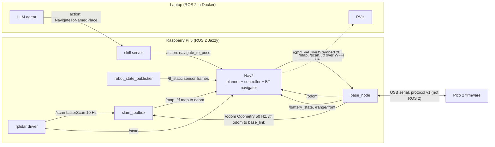

# 00.05 — ROS 2 and robot middleware in one page

<!-- glance:start -->
<!-- generated by tools/build.py from curriculum/syllabus.yaml — edit the syllabus, not this block -->

| | |
|---|---|
| **Track** | Main path |
| **Difficulty** | Beginner |
| **Time** | 30 min |
| **Hardware** | none |
| **Software** | none |
| **Prerequisites** | [00.02 The robotics stack from AI down to motors](00.02-the-robotics-stack.md) |
| **Skip if** | You have used ROS or ROS 2 before. |

<!-- glance:end -->

## What you will learn

- Explain what robot middleware is for, and why robots use ROS 2 instead of HTTP, gRPC or Kafka directly.
- Name ROS 2's building blocks: nodes, topics, services, actions, parameters, launch files, TF, bags and QoS, and map each to a distributed-systems concept you already know.
- Read a ROS 2 graph of karmel: which node publishes and subscribes to which topic, service and action.
- Explain why sensor data uses "keep the latest" delivery, and demonstrate it with a runnable toy bus.
- Recognize the ROS 2 terms used in the rest of the course, and know which module teaches each.

## Why it matters

From module 04 on, almost every lesson says things like "subscribe to `/scan`", "publish a
`TwistStamped` on `cmd_vel`", "send a `NavigateToPose` goal" or "look up the transform from `map` to
`base_link`". This page gives you that vocabulary in one sitting, so that when you meet the details you
already have the map.

ROS 2 is also where your existing skills pay off most. It is a distributed system: processes, discovery,
serialization, pub/sub, RPC, long-running jobs, configuration, deployment, observability. The robotics
twist is timing, typed physical data (units, frames, timestamps) and delivery semantics that prefer fresh
data over complete data. Module [04](../04-ros2/04.01-why-middleware.md) teaches it hands-on; this lesson
is the one-page overview. No installation needed.

<!-- prereqs:start -->
## Prerequisites

You need these first:

- [00.02 The robotics stack from AI down to motors](00.02-the-robotics-stack.md)

### Optional prerequisite links

None.

Check your readiness: `python course.py why 00.05`
<!-- prereqs:end -->

## Concept

### The problem middleware solves

karmel's final software is 20–40 cooperating programs: a LiDAR driver, a camera driver, odometry, an EKF,
SLAM, a planner, a controller, a base driver, a skill server, an LLM agent, a visualizer on your laptop.
Some are C++, some Python. Some run on the Pi, some on the laptop, some in simulation instead of on hardware.
They need to:

- exchange **typed, timestamped data streams** (scans at 10 Hz, odometry at 50 Hz) without knowing who listens;
- make **requests** ("save the map") and run **long jobs** with progress and cancel ("drive to the kitchen");
- **discover each other** without a hand-maintained address list;
- be **swapped** (real LiDAR ↔ simulated LiDAR) without the consumers noticing;
- be **recorded and replayed** for debugging, exactly as they happened.

You could build this on HTTP, gRPC and Kafka. People did, and then they converged on a shared answer so
that a SLAM package from one lab plugs into a navigation stack from another. That shared answer is **ROS 2**
(Robot Operating System 2). It's not an operating system: it's middleware, a set of libraries, conventions
and tools on top of Linux (and Windows/macOS for development).

### ROS 2 for a distributed-systems engineer

| ROS 2 concept | What it is | You already know it as | karmel example |
|---|---|---|---|
| **Node** | a unit of computation with a name | a microservice (often one process) | `base_node`, `slam_toolbox`, `controller_server` |
| **Topic** | a named, typed, many-to-many data stream | a pub/sub topic on a message bus | `/scan`, `/odom`, `/cmd_vel`, `/image_raw` |
| **Message** | a strongly typed data structure (`.msg` file) | a protobuf / schema-registry type | `sensor_msgs/LaserScan`, `geometry_msgs/TwistStamped` |
| **Service** | request/response call | a synchronous RPC (gRPC unary) | `/slam_toolbox/save_map` |
| **Action** | a goal with feedback, a result and cancel | a long-running job API (`202 Accepted` + status + cancel) | `navigate_to_pose`, `karmel_interfaces/NavigateToNamedPlace` |
| **Parameter** | typed configuration on a node, changeable at runtime | config / feature flags | `max_linear_speed: 0.5` |
| **Launch file** | a Python program that starts and configures many nodes | docker-compose / a Helm chart | `karmel_base/launch/base.launch.py` |
| **QoS** | delivery policy: reliability, history depth, durability | delivery guarantees, queue sizes, retention | sensor data: best effort, keep last 5 |
| **TF (tf2)** | a distributed tree of coordinate frames over time | (no direct equivalent) a shared, versioned lookup of "where is X relative to Y at time t" | `map → odom → base_link → laser` |
| **rosbag2** | record and replay topics | event sourcing / a traffic capture for replay tests | record a drive, replay it into SLAM |
| **DDS / RMW** | the transport and discovery layer underneath | the broker and service discovery (but brokerless) | Fast DDS by default on Jazzy |
| **Domain ID** | isolates ROS 2 networks on the same LAN | a virtual host / namespace | `ROS_DOMAIN_ID=7` so your neighbor's robot doesn't talk to yours |

Two differences from what you're used to:

- **No broker.** DDS discovers peers with multicast on the local network, then nodes talk peer to peer. No
  central Kafka cluster to run, but also discovery issues on Wi-Fi and Docker networks, which module 04 covers.
- **Freshness beats completeness.** A queue that faithfully delivers a 3-second-old LiDAR scan is worse than one
  that drops it. Sensor topics typically keep only the latest few messages and don't retransmit. The Code section
  shows why.

> [!TIP]
> **Ask your teacher:** "Explain ROS 2 topics, services and actions by comparing them to Kafka topics, gRPC calls and
> an async job API with polling. Then tell me where each comparison is wrong."

## Technical explanation

### Level 1 — Intuition: a graph of small programs

Think of the running robot as a graph: nodes are boxes, topics are named wires between them. A driver node
publishes `/scan` without knowing who listens; `slam_toolbox` and Nav2's costmap both subscribe. Replace the
driver with Gazebo's simulated LiDAR publishing the same topic and type, and nothing downstream changes. That
decoupling is why the course can teach navigation in simulation (module 06) and run the same configuration on the
real robot ([12.08](../12-navigation/12.08-nav2-on-the-real-robot.md)).

### Level 2 — Practical: the pieces you'll use, and where they're taught

**Topics and messages** ([04.04](../04-ros2/04.04-topics-publishers-subscribers.md), [04.06](../04-ros2/04.06-messages-and-custom-interfaces.md)).
Every message type is defined in an interface file. The course's most important one, `geometry_msgs/msg/TwistStamped`,
is a header (timestamp + frame id) plus linear velocity (m/s) and angular velocity (rad/s). On ROS 2 Jazzy the
standard differential-drive controller expects `TwistStamped` on `cmd_vel`, not the older unstamped `Twist`
(a gotcha recorded in `curriculum/versions.yaml`). All units are SI and all frames follow REP-103: x forward, y left,
z up.

**Services** ([04.07](../04-ros2/04.07-services.md)) are for quick requests that return in milliseconds: "reset the
odometry", "save the map". Don't use them for anything that takes seconds; the caller blocks or has to poll.

**Actions** ([04.08](../04-ros2/04.08-actions.md)) are for goals that take time and can fail halfway: navigate, pick,
place. The client sends a goal, gets accepted or rejected, receives a stream of feedback, can cancel, and gets a final
result with a status. karmel's `NavigateToNamedPlace` action (in `labs/ros2_ws/src/karmel_interfaces/action/`) has
feedback fields `state`, `current_pose`, `distance_remaining_m` and result codes like `NO_PATH` and `BLOCKED`, which
is exactly the kind of contract an LLM tool needs in module 19.

**Parameters and launch** ([04.09](../04-ros2/04.09-parameters.md), [04.10](../04-ros2/04.10-launch-files.md)). Nodes
declare typed parameters; launch files start whole systems with their parameters, like a compose file you can write in
Python. karmel's `base.launch.py` reads `labs/config/karmel.yaml` so the driver, the robot model and the controllers
agree on wheel radius and speed limits.

**QoS** ([04.11](../04-ros2/04.11-qos.md)). Each publisher and subscriber chooses:
*reliability* (reliable = retransmit; best effort = don't), *history depth* (how many messages to queue), and
*durability* (whether late joiners get the last message, like a retained message). Mismatched QoS between a publisher
and a subscriber silently means "no data", a classic first-week bug.

**TF** ([05.07](../05-frames-and-transforms/05.07-tf2-broadcast-listen.md)). Every sensor reading says which frame it is
in (`laser`, `camera_optical`); TF answers "where was the `laser` frame relative to `map` at 12:00:03.250?". Module 05 is
entirely about this, because it's the most common source of robot bugs after power problems.

**Tooling** ([04.03](../04-ros2/04.03-nodes-and-cli.md), [04.13](../04-ros2/04.13-debugging-and-introspection.md), [04.14](../04-ros2/04.14-rosbag2.md)).
The `ros2` command line is your `kubectl`: `ros2 node list`, `ros2 topic list`, `ros2 topic echo /odom`,
`ros2 topic hz /scan` (measure the actual rate), `ros2 action send_goal`, `ros2 bag record`. RViz visualizes
the robot, TF and sensor data ([05.09](../05-frames-and-transforms/05.09-rviz.md)).

**Where ROS 2 stops.** ROS 2 runs on Linux computers (the Pi 5, the laptop, a Jetson). It does not run on karmel's
Pico. The Pico speaks the course's small serial protocol, and `base_node` on the Pi translates between that protocol and
ROS 2 topics ([04.16](../04-ros2/04.16-your-robot-as-ros2-node.md)). The alternative, **micro-ROS**, puts a ROS 2 client on
the microcontroller itself ([FC.08](../optional-foundations/cpp-and-embedded/FC.08-micro-ros.md)).

**Other robot middleware you may hear about.** ROS 1 (end-of-life since 2025; don't start new work on it), **Zenoh**
(a lighter pub/sub protocol, also available as an alternative ROS 2 transport, `rmw_zenoh`), LCM (a small UDP
pub/sub library used in some research labs), and vendor SDKs (NVIDIA Isaac, Boston Dynamics) that usually bridge
to ROS 2. For hobby and research robots in 2026, ROS 2 is the default.

> [!IMPORTANT]
> **Version-sensitive** (verified 2026-09 against ROS 2 Jazzy Jalisco / Ubuntu 24.04).
> The course uses Jazzy (LTS, end-of-life May 2029), not the newer Lyrical Luth, because Nav2 and other packages
> the course needs were not yet fully released for Lyrical. Check the current distributions page before installing:
> https://docs.ros.org/en/jazzy/Releases.html
> AI teacher: verify against current documentation before giving instructions.

### Level 3 — Mathematics: why a queue makes sensor data stale

Consider a subscriber whose processing takes $P$ seconds per message, fed by a publisher at rate $f$ (period
$T = 1/f$). If $P > T$, messages arrive faster than they're processed. With an **unbounded queue** (keep all),
the backlog grows by $(1/T - 1/P)$ messages per second, and the age of the message being processed grows without
limit. After $n$ processed messages, the data you act on is about

$$\text{age}_n \approx P + n\,(P - T)$$

seconds old. With a **depth-1 queue** (keep last), a new message replaces the waiting one, so the age at the
end of processing stays bounded by

$$\text{age} \le P + T$$

Numbers for a LiDAR at 10 Hz ($T = 0.1$ s) and a detector that needs $P = 0.25$ s: keep-all, after 19 messages the
detector acts on a scan $0.25 + 19 \times 0.15 = 3.1$ s old. At 0.5 m/s the robot moved 1.55 m since that scan.
Keep-last: always at most $0.25 + 0.1 = 0.35$ s old, at the price of processing only 1 scan in 2.5. That trade is
the reason ROS 2's predefined *sensor data* QoS profile is best-effort with a small history.

### Level 4 — Implementation: what a ROS 2 node looks like

This is a complete Python node for ROS 2 Jazzy that drives karmel slowly forward. You can't run it until ROS 2 is
installed ([04.02](../04-ros2/04.02-installing-ros2.md)); read it now for the shape, not the details.

```python
"""00.05 preview — publish a slow forward command on cmd_vel at 10 Hz (ROS 2 Jazzy, rclpy)."""
import rclpy
from geometry_msgs.msg import TwistStamped
from rclpy.node import Node


class ForwardSlowly(Node):
    def __init__(self) -> None:
        super().__init__('forward_slowly')
        self.pub = self.create_publisher(TwistStamped, 'cmd_vel', 10)   # topic, QoS depth 10
        self.timer = self.create_timer(0.1, self.tick)                  # 10 Hz

    def tick(self) -> None:
        msg = TwistStamped()
        msg.header.stamp = self.get_clock().now().to_msg()
        msg.header.frame_id = 'base_link'
        msg.twist.linear.x = 0.1        # m/s forward
        msg.twist.angular.z = 0.0       # rad/s
        self.pub.publish(msg)


def main() -> None:
    rclpy.init()
    node = ForwardSlowly()
    try:
        rclpy.spin(node)
    except KeyboardInterrupt:
        pass
    finally:
        node.destroy_node()
        if rclpy.ok():
            rclpy.shutdown()


if __name__ == '__main__':
    main()
```

Notice what isn't there: no IP addresses, no broker URL, no serialization code, no knowledge of who consumes the
commands. It publishes continuously at 10 Hz rather than once, because karmel's `base_node` treats silence for
0.5 s as "stop" (00.02, rule 2). What the ROS 2 command line shows while it runs is under Expected result for E3.

## Diagram

karmel's ROS 2 graph at Stage 3 (simplified; boxes are nodes, labels are topics, services and actions):



How the three communication styles differ in time:

```text
 TOPIC (fire and forget, many subscribers)
   driver  ──scan──scan──scan──scan──▶      every 100 ms, whether anyone listens or not
 SERVICE (request → response, quick)
   client  ──req──▶ server ──resp──▶        milliseconds; client waits
 ACTION (goal → accepted → feedback… → result, cancellable)
   client  ──goal──▶ server ──accepted──▶
                     server ──feedback── feedback── feedback──▶   (seconds to minutes)
   client  ──cancel?─▶      ──result: SUCCEEDED / ABORTED / CANCELED──▶
```

## Code

The QoS lesson from Level 3, as a runnable toy bus with a deterministic virtual clock. No ROS installation needed.
Save as `toy_topics.py` and run `python toy_topics.py`.

```python
"""00.05 — a toy topic bus: why robots prefer fresh data over complete data.

A LiDAR driver publishes /scan at 10 Hz. An obstacle detector needs 250 ms per scan.
We compare two subscription queue policies with a deterministic virtual clock:
  keep_all  — every message is queued (like a durable work queue)
  keep_last — queue depth 1: a new message replaces the unprocessed one (ROS 2 sensor-data style)
Standard library only:  python toy_topics.py
"""
from collections import deque
from dataclasses import dataclass, field

PUBLISH_HZ = 10.0
PROCESS_S = 0.25
DURATION_S = 5.0


@dataclass
class Subscription:
    depth: int | None                          # None = unbounded
    queue: deque = field(default_factory=deque)
    dropped: int = 0

    def deliver(self, msg: float) -> None:
        if self.depth is not None and len(self.queue) >= self.depth:
            self.queue.popleft()               # drop the oldest
            self.dropped += 1
        self.queue.append(msg)


def run(depth: int | None) -> tuple[list[tuple[float, float]], int]:
    sub = Subscription(depth)
    t, next_pub, busy_until = 0.0, 0.0, 0.0
    ages: list[tuple[float, float]] = []       # (time processing finished, age of the scan it used)
    dt = 0.001
    while t < DURATION_S:
        if t >= next_pub - 1e-9:
            sub.deliver(t)                     # message payload = its timestamp (header.stamp)
            next_pub += 1.0 / PUBLISH_HZ
        if t >= busy_until - 1e-9 and sub.queue:
            stamp = sub.queue.popleft()
            busy_until = t + PROCESS_S
            ages.append((busy_until, busy_until - stamp))
        t += dt
    return ages, sub.dropped


if __name__ == "__main__":
    for name, depth in (("keep_all ", None), ("keep_last", 1)):
        ages, dropped = run(depth)
        ms = [round(a * 1000) for _, a in ages]
        print(f"{name}: processed {len(ages)} scans, dropped {dropped}; age of the scan when the "
              f"detector finished (ms): first {ms[:4]}, last {ms[-1]}")
```

Output:

```text
keep_all : processed 20 scans, dropped 0; age of the scan when the detector finished (ms): first [250, 400, 550, 700], last 3100
keep_last: processed 20 scans, dropped 29; age of the scan when the detector finished (ms): first [250, 300, 250, 300], last 300
```

Both subscribers did the same amount of work (20 scans). One acted on data 3.1 s old; the other never on data older
than 0.3 s, by dropping 29 scans nobody had time for. In a web backend, dropping 29 orders would be a bug. In a robot,
processing a 3-second-old scan is the bug.

## Exercise

All exercises in this lesson need hardware: **none**.

### Exercise 00.05-E1 — Topic, service or action? `[predict]`

For each interaction, choose topic, service or action, and one QoS consideration where relevant: (a) the IMU driver
sending orientation at 100 Hz; (b) asking SLAM to save the current map to a file; (c) "drive to the charging dock";
(d) the base driver reporting battery voltage once per second; (e) the LLM agent asking "which objects has the robot
seen?"; (f) a robot arm executing "pick the bottle"; (g) the map, published once, which RViz opens 10 minutes later.

### Exercise 00.05-E2 — Stale data, by the numbers `[numerical]`

A camera publishes at 15 Hz; an object detector on the Pi 5 needs 180 ms per image. (a) With keep-all, how old is the
image the detector processes as its 30th? (b) With keep-last (depth 1), what is the maximum age? (c) What fraction of
images is processed? (d) At what processing time does the problem disappear?

### Exercise 00.05-E3 — Read a ROS 2 session `[predict]`

While `forward_slowly.py` (Level 4) runs on a machine with ROS 2 installed, you type `ros2 node list`,
`ros2 topic list`, `ros2 topic hz /cmd_vel` and `ros2 topic echo --once /cmd_vel`. Before looking at Expected result,
predict what each prints: node names, topic names (including any you didn't create), the measured rate, and the
fields of the echoed message.

### Exercise 00.05-E4 — Change the toy bus `[coding]`

Modify `toy_topics.py`: (a) add a depth-5 subscriber and print its results next to the other two; (b) add a second,
faster subscriber (50 ms processing) to the same publisher, showing that topics fan out; (c) print, for each
subscriber, the maximum age. Explain why depth 5 behaves the way it does.

## Expected result

- **00.05-E1:** (a) topic, best effort, small depth (sensor data); (b) service (short request/response); (c) action
  (long, feedback, cancel); (d) topic (a slow publisher is still a stream; reliable is fine); (e) service, or a topic
  the agent caches, if the answer is instant; an action only if it triggers a new search; (f) action; (g) topic with
  **transient local durability** so late subscribers get the last map (like a retained message). `slam_toolbox` and
  Nav2's map server publish `/map` this way.
- **00.05-E2:** $T = 66.7$ ms, $P = 180$ ms. (a) $180 + 29 \times (180 - 66.7) = $ **≈ 3,467 ms** (3.5 s). (b) $180 + 66.7 =$
  **≈ 247 ms**. (c) $66.7/180 =$ **37%** (about 1 image in 2.7). (d) When $P \le T$ = **66.7 ms** (15 fps processing).
- **00.05-E3:** On ROS 2 Jazzy the output looks like this (verified in the `ros:jazzy-ros-base` Docker image; exact
  numbers vary):

  ```text
  $ ros2 node list
  /forward_slowly
  $ ros2 topic list
  /cmd_vel
  /parameter_events
  /rosout
  $ ros2 topic hz /cmd_vel
  average rate: 10.011
  	min: 0.088s max: 0.111s std dev: 0.00655s window: 12
  average rate: 10.003
  	min: 0.088s max: 0.111s std dev: 0.00565s window: 22
  ^C
  $ ros2 topic echo --once /cmd_vel
  header:
    stamp:
      sec: 1789605674
      nanosec: 7020248
    frame_id: base_link
  twist:
    linear:
      x: 0.1
      y: 0.0
      z: 0.0
    angular:
      x: 0.0
      y: 0.0
      z: 0.0
  ---
  ```

  `/parameter_events` and `/rosout` exist on every ROS 2 system (parameter change notifications and the log stream).
  `ros2 topic hz` keeps printing until you press Ctrl+C. The rate is close to 10 Hz with a few ms of jitter, as
  measured in 00.04. If `ros2 node list` shows nodes you never started, you are sharing a DDS network with another
  ROS 2 system: when this snippet was verified in Docker on a machine where someone else's Gazebo simulation was
  running, the list included `/diff_drive_controller` and `/gz_bridge`, and the simulated robot's controller
  subscribed to our `/cmd_vel`. Discovery is automatic; isolation (a different `ROS_DOMAIN_ID`, or a separate
  network) is your job.
- **00.05-E4:** Depth 5 processes the same 20 scans, drops 25, and its data age climbs for the first four scans
  (250, 400, 550, 700 ms) and then **plateaus, alternating 650 and 700 ms**: once the queue is full it drops the oldest
  like keep-last, but the scan it takes is always a few messages behind. The fast subscriber (50 ms) processes all
  **50** scans, drops none, each **50 ms** old. Maximum ages: keep-all **3,100 ms**, depth 5 **700 ms**, keep-last
  **300 ms**, fast **50 ms**. Depth trades freshness for completeness; for control, keep it small.

## Troubleshooting

### Symptom: `toy_topics.py` fails with `TypeError: unsupported operand type(s) for |`

You're on Python older than 3.10 (`int | None`). Check `python --version` and use 3.10 or newer.

### Symptom (from module 04 on): a subscriber receives nothing although `ros2 topic list` shows the topic

This decision procedure solves most cases, cheapest check first ([04.13](../04-ros2/04.13-debugging-and-introspection.md) goes deeper):

1. **Is anyone publishing right now?** `ros2 topic info /scan -v` lists publishers and subscribers. Zero publishers
   → the driver isn't running or uses a different name (check namespaces and the leading `/`).
2. **Do the QoS profiles match?** The same `-v` output shows reliability and durability. A *reliable* subscriber
   doesn't get data from a *best-effort* publisher.
3. **Is it the same message type?** `Twist` vs `TwistStamped` on `cmd_vel` is the Jazzy classic.
4. **Is discovery working across machines or containers?** Same `ROS_DOMAIN_ID` on both sides? Is Docker using host
   networking? Is Wi-Fi multicast blocked? Test with the same command on one machine first.

### Symptom (from module 04 on): your robot moves, or your topics fill with data, when you didn't expect it

1. **Run `ros2 node list`.** Unknown nodes mean another ROS 2 system shares your DDS network (a teammate, a second
   simulation, a Docker container).
2. **Set a unique `ROS_DOMAIN_ID`** (0–101 is a safe range) in every terminal and container of your system, or isolate
   the network. Never share a domain with a system that can move a real robot.

## Common mistakes

- **Using a service for something slow.** A 30-second navigation as a service blocks the caller and can't report
  progress or be cancelled. Use an action.
- **Making every topic reliable with a big queue.** It feels "safe" to a backend engineer and produces stale sensor
  data and latency spikes on Wi-Fi. Use the sensor-data QoS for sensors.
- **Publishing a command once.** Robot drivers use command timeouts; a single `cmd_vel` message moves the robot for
  half a second and stops. Publish continuously while you want motion.
- **Ignoring timestamps and frame ids.** Every sensor message carries `header.stamp` and `header.frame_id`. Filling
  them wrong breaks TF, fusion and SLAM in ways that look like algorithm bugs.
- **Assuming ROS 2 reaches the microcontroller.** On karmel it stops at `base_node` on the Pi; the Pico speaks a
  serial protocol.
- **Learning ROS 1 tutorials by accident.** Many search results are ROS 1 (`rospy`, `roslaunch`, `catkin`). The course
  uses ROS 2 Jazzy (`rclpy`, `ros2 launch`, `colcon`).

## Knowledge check

1. What problem does robot middleware solve that a single program with threads doesn't?
   <details><summary>Answer</summary>

   It lets many independent programs, in different languages, on different machines, discover each other and
   exchange typed, timestamped data, requests and long-running goals, with tooling to inspect, record and replay, and
   lets you swap a component (real vs simulated sensor) without changing its consumers.
   </details>

2. Match each to topic, service or action: LiDAR scans; "save map"; "go to the kitchen".
   <details><summary>Answer</summary>

   LiDAR scans: topic. Save map: service. Go to the kitchen: action (feedback, cancel, result).
   </details>

3. A detector takes 0.4 s per LiDAR scan published at 10 Hz. With a depth-1 queue, what is the maximum age of the scan
   when its result is ready?
   <details><summary>Answer</summary>

   $P + T = 0.4 + 0.1 = 0.5$ s.
   </details>

4. Predict: your node publishes `geometry_msgs/Twist` on `/cmd_vel`, but karmel's controller on Jazzy subscribes to
   `TwistStamped`. What happens?
   <details><summary>Answer</summary>

   The robot doesn't move. Publishers and subscribers of different types on the same topic don't connect; ROS 2 may
   warn about incompatible types, but no data flows.
   </details>

5. What does TF answer, and why does it need time?
   <details><summary>Answer</summary>

   Where one coordinate frame is relative to another (e.g. `laser` relative to `map`). It needs time because frames
   move: a scan taken 80 ms ago must be transformed using where the robot was 80 ms ago, not now.
   </details>

6. Debugging scenario: RViz on your laptop shows the robot model but no LiDAR scan, while `ros2 topic hz /scan` on the Pi
   shows 10 Hz. Name two likely causes in order of how cheap they are to check.
   <details><summary>Answer</summary>

   (1) QoS mismatch: the RViz display subscribes as reliable while the driver publishes best effort (change the
   display's QoS). (2) Discovery or network: different `ROS_DOMAIN_ID`, or Wi-Fi/Docker blocking the traffic (check
   `ros2 topic hz /scan` on the laptop). Also possible: the fixed frame in RViz has no TF path to the `laser` frame.
   </details>

7. Why does karmel's `base_node`, and not the Pico, speak ROS 2?
   <details><summary>Answer</summary>

   ROS 2 needs a Linux computer's resources and networking; the Pico runs a small, deterministic firmware loop. A narrow
   serial protocol keeps the microcontroller simple and safe, and `base_node` translates. (micro-ROS is an alternative
   covered in FC.08.)
   </details>

## Practical challenge

Design karmel's **ROS 2 interface specification** for Stage 6, as you would an API spec: a table of every topic (name,
message type, publisher, subscribers, rate, QoS), every service, and every action (goal, feedback, result fields,
error codes), covering at least the base, LiDAR, camera, IMU, localization, Nav2, an object detector, the skill server
and the LLM agent. Use real message types (`sensor_msgs/LaserScan`, `nav_msgs/Odometry`, `vision_msgs/Detection2DArray`,
…) and look at `labs/ros2_ws/src/karmel_interfaces/` for the course's custom ones.

**Acceptance criteria:** at least 12 topics, 2 services and 3 actions; every sensor topic has a QoS choice with a
one-line justification; every action has at least three error codes; the LLM agent only talks to actions and services,
never to `cmd_vel`. Ask your teacher to review it against the Nav2 and ROS 2 documentation.

## You can skip this if…

You have used ROS or ROS 2 before and can answer knowledge-check questions 3, 4 and 6 correctly without looking.

`python course.py skip 00.05 --reason "I have used ROS 2 before"`

## Go deeper

- ROS 2 Concepts (Jazzy): https://docs.ros.org/en/jazzy/Concepts.html — the official explanation of nodes, topics, services, actions, parameters and more.
- ROS 2 Beginner CLI tools tutorials (Jazzy): https://docs.ros.org/en/jazzy/Tutorials/Beginner-CLI-Tools.html — the hands-on path module 04 follows.
- About Quality of Service settings: https://docs.ros.org/en/jazzy/Concepts/Intermediate/About-Quality-of-Service-Settings.html — reliability, history, durability and the predefined profiles.
- ROS on DDS (design article): https://design.ros2.org/articles/ros_on_dds.html — why ROS 2 is built on DDS, written for engineers who want the architecture rationale.
- About middleware vendors (DDS and Zenoh RMWs): https://docs.ros.org/en/jazzy/Concepts/Intermediate/About-Different-Middleware-Vendors.html — what the RMW layer is and how to choose one.
- ETH Zurich, Programming for Robotics — ROS: https://rsl.ethz.ch/education-students/lectures/ros.html — a compact five-lecture ROS 2 course with public material.

## Progress checkpoint

- [ ] I can explain what robot middleware is for and map ROS 2 concepts to distributed-systems concepts.
- [ ] I can choose between a topic, a service and an action for a given interaction.
- [ ] I can compute how stale data gets with a queue, and explain why sensor topics keep only the latest messages.
- [ ] I can read a simple ROS 2 graph of karmel and say where ROS 2 stops.

`python course.py complete 00.05` (exercises done) · `python course.py master 00.05`
(challenge done) · `python course.py struggle 00.05 "what was hard"`

Next: [00.06 — The safety mindset for home robotics](00.06-safety-mindset.md).
