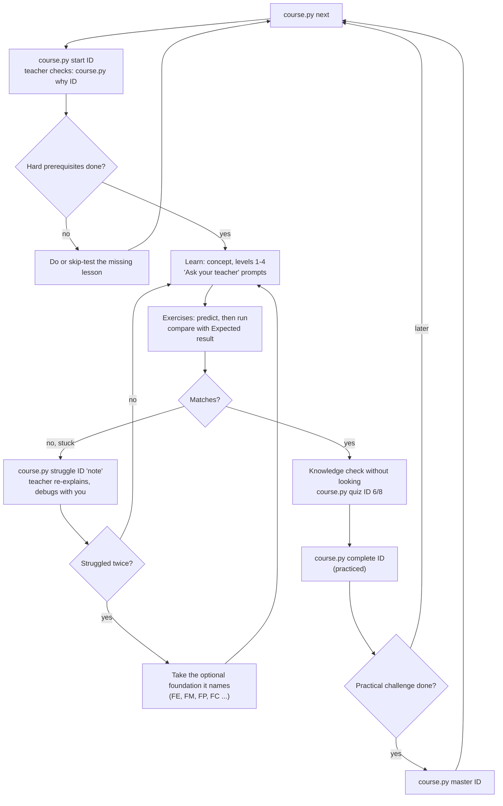
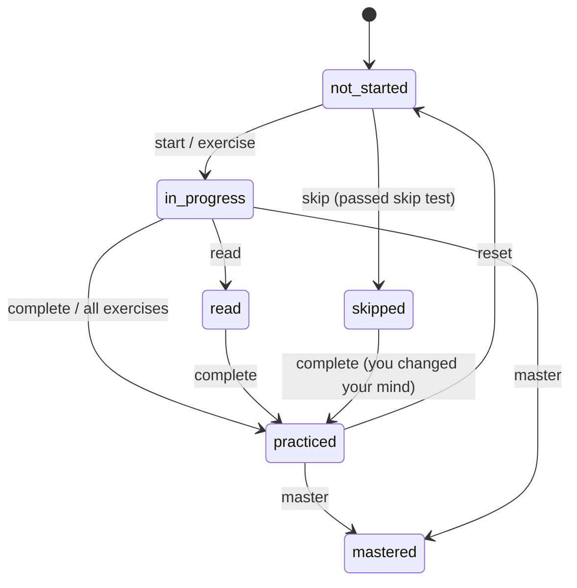

# 00.07 — How to study this course with an AI teacher and the progress tool

<!-- glance:start -->
<!-- generated by tools/build.py from curriculum/syllabus.yaml — edit the syllabus, not this block -->

| | |
|---|---|
| **Track** | Main path |
| **Difficulty** | Beginner |
| **Time** | 25 min |
| **Hardware** | none |
| **Software** | python |
| **Prerequisites** | none |
| **Skip if** | Never — it explains course.py and how optional tracks work. |

<!-- glance:end -->

## What you will learn

- Navigate the course as a dependency graph: main path, optional foundations, projects, hard and soft prerequisites.
- Use `course.py` to see where you are, pick the next lesson, record honest progress, find the lesson that teaches a concept, and get pointed to a foundation when you struggle.
- Experiment with `course.py` safely in a sandbox that doesn't touch your real progress file.
- Work with the AI teacher effectively: which prompts to use, what it will do, and what it must never do for you.
- Plan your time and hardware purchases for the whole course with real numbers.

## Why it matters

This course is large: 21 main modules with 218 lessons (about 238 hours), 105 optional foundation lessons
(about 91 hours, of which you'll need a fraction) and 18 projects. A course this size fails in two predictable
ways. Either you grind through theory you don't need and lose momentum, or you skip ahead, hit a lesson that
assumes a Kalman filter you never learned, and stall.

The course is built to avoid both. The main path never blocks on theory; foundations are pulled in exactly when a
lesson needs them; a progress tool knows the prerequisite graph; and an AI coding agent in this repository acts as
your teacher, not your code generator. This lesson shows you how to drive all of it. It's the one lesson you should
read first, even before [00.01](00.01-what-is-a-robot.md).

<!-- prereqs:start -->
## Prerequisites

None — you can start here.

### Optional prerequisite links

None.

Check your readiness: `python course.py why 00.07`
<!-- prereqs:end -->

## Concept

### The course is a build graph

You know build systems and package managers: targets depend on other targets, you build only what's needed, and
the tool tells you what's missing. The course works the same way.

- **Main path** (`00-orientation/` … `20-final-robot/`): practical robotics, done in order. Each lesson lists
  **hard prerequisites** (`requires`): you'll be lost without them.
- **Optional foundations** (`optional-foundations/`: math, electronics, physics, Linux, Python for C# developers,
  embedded and C++, control theory, ML, computer vision, 3D printing): **soft prerequisites** (`optional`). A lesson
  links them in one line, "New to PWM? → FE.07. Skip it if you know it." You take them only when you need them.
- **Projects** (`projects/`): milestones that prove you can build the thing, not just that you read about it.

`curriculum/syllabus.yaml` is the single source of truth for this graph; `curriculum/graph.json` is the generated
version that `course.py` and your AI teacher read.

### "Read" is not "can do"

Progress has six states, and the difference between them is the point:

| Status | Meaning | Satisfies a prerequisite? |
|---|---|---|
| not-started | — | no |
| in-progress | you're working on it | no |
| read | you read it but didn't do the exercises | yes, **with a warning** |
| practiced | you did the exercises ("I can do this") | yes |
| mastered | you did the practical challenge | yes |
| skipped | you already know it (passed the skip test) | yes |

An experienced engineer's biggest risk here is marking things done because they *make sense*. Robotics punishes that:
the exercises are where you discover that the sign convention, the units or the timing were not what you assumed.

### The AI teacher

[CLAUDE.md](../CLAUDE.md) (and `AGENTS.md` for other agents) tells a coding agent opened in this repository how to
teach you. It reads your progress, teaches a lesson section by section and stops to ask questions, re-explains in a
different way when you're stuck (simpler words, an analogy, a diagram, a numerical example, a tiny experiment), finds
the foundation you're actually missing, checks version-sensitive instructions against current documentation, and runs
`course.py` to record progress.

What it will not (and should not) do: mark a lesson practiced because you read it, run code on your robot that neither
of you has read, or skip a safety rule because you're in a hurry.

> [!TIP]
> **Ask your teacher:** "I'm starting the course. Read my progress, tell me what's next and why, and ask me three
> questions to find out which optional foundations I can skip."

## Technical explanation

### Level 1 — Intuition: one study loop per lesson

1. **Start** the lesson with the teacher (`course.py start`). Check prerequisites (`course.py why`).
2. **Concept → explanation:** read or be taught, stopping at the "Ask your teacher" prompts when something is fuzzy.
3. **Predict, then run:** every `[predict]` exercise asks for a prediction before you run anything. Write it down.
   Wrong predictions are where learning happens.
4. **Exercises → Expected result:** compare your output with the numbers and tolerances given. Mark exercises done.
5. **Knowledge check without looking**, then record the score. Below 70%, reread or ask for a different explanation.
6. **Practical challenge** when you want "mastered". Otherwise move on and come back later.
7. **Stuck?** Record a struggle. Twice on the same lesson means a missing foundation; take it, then return.

### Level 2 — Practical: `course.py`

`course.py` needs only Python 3.10+ (standard library). Run it from the repository root. On Windows, `py course.py …`
works if `python` isn't on your PATH. Lesson ids are forgiving: `7.3`, `07.3` and `07.03` are the same lesson; `fm.5`
is `FM.05`; `p4` is `P04`.

| Command | What it does | Changes progress? |
|---|---|---|
| `status` | overall progress per module, open struggles, then `next` | no |
| `next` | lessons you're in the middle of, the next unlocked lessons, helpful foundations, warnings | no |
| `start <id>` | mark in-progress | yes |
| `read <id>` | mark read (not practiced) | yes |
| `exercise <id>-E<n>` | mark one exercise done; all done → practiced | yes |
| `complete <id>` | mark practiced (exercises done); prints what it unlocked | yes |
| `master <id>` | mark mastered (practical challenge done) | yes |
| `quiz <id> 6/8` | record a knowledge-check score; below 70% it suggests rereading | yes |
| `skip <id> --reason "…"` | mark skipped with a reason | yes |
| `struggle <id> "note"` | record confusion; lists foundations that target it and weak prerequisites | yes |
| `resolve <id>` | close open struggles on a lesson | yes |
| `why <id>` | prerequisite tree with your status, and what's still to do, with time | no |
| `learn <concept>` | which lesson teaches a concept (e.g. `learn pwm`, `learn quaternions`) | no |
| `show <id>` | lesson details: file, prerequisites, unlocks, hardware, exercises | no |
| `list [00\|main\|FM\|projects\|all]` | lessons with status icons | no |
| `project P04 start\|done` | project progress | yes |
| `hw`, `hw buy <item>`, `hw assemble <item>` | hardware you own (catalog ids like `robot-base`, `lidar`) | yes |
| `check <id>` | run the automated checker for lessons that have one (e.g. `check 09.04`) | yes, if it passes |
| `skills`, `log`, `reset <id>`, `render` | practiced concepts, recent activity, forget a lesson, regenerate PROGRESS.md | varies |

Your state lives in `progress/progress.json` (machine-readable; the teacher reads it) and is rendered to `PROGRESS.md`
after every change. Commit both to Git so your progress survives a laptop change. Don't edit `PROGRESS.md` by hand.

**How `next` decides.** It lists lessons already in progress, then the first main-path lessons (in course order) whose
hard prerequisites are all done, where *read* counts as done but produces a warning. It adds optional foundations for
the first recommended lesson, warns when that lesson needs hardware you haven't marked as bought (and reminds you to
look for the simulation alternative), and after repeated struggles tells you which foundation to take first.

**Hardware gating.** Lessons that need hardware name a catalog id from [HARDWARE.md](../HARDWARE.md). Mark purchases
with `course.py hw buy robot-base` so `next` stops warning. Buying is staged; module 00 needs nothing.

**A sandbox.** `course.py` reads two environment variables: `COURSE_PROGRESS_FILE` (the JSON file) and
`COURSE_PROGRESS_MD` (the rendered Markdown). Point them at a temporary folder and you can try every command without
touching your real progress. The Code section does exactly that.

### Level 3 — Mathematics: a time and budget plan

**Time.** The syllabus gives an estimated time per lesson, including exercises but not the optional challenges. Sum over
what you'll actually do:

$$T_{\text{total}} = \sum_{\text{main}} t_i + \sum_{\text{foundations taken}} t_j + \sum_{\text{projects}} t_k$$

The numbers from `curriculum/graph.json`: main path 14,300 min (238 h), projects 8,280 min (138 h), all 105
foundations 5,435 min (91 h). If you take a quarter of the foundations, $T \approx 238 + 138 + 23 = 399$ h. At $h$ hours
per week the course takes

$$W = \frac{T}{h} \qquad \text{e.g. } \frac{399}{8} \approx 50 \text{ weeks}$$

In practice hardware debugging adds time that no estimate captures; plan a buffer of 20–30%.

**Budget.** Hardware spending follows the stages, so it's spread across the year rather than paid up front. From
HARDWARE.md (prices checked 2026-09-16): tools ≈ ₪640–870, Stage 1 ≈ ₪1,800–2,550, Stage 2 ≈ ₪300–380, Stage 3 ≈ ₪300
(imported) to ₪1,080 (local). Match purchase dates to the week you'll reach each stage's first lesson.

**Prerequisite distance.** `course.py why <id>` computes the transitive closure of hard prerequisites and sums their
times. For example, before your first motor spin ([01.08](../01-first-robot/01.08-first-motor-spin.md)) there are 11
lessons, about 9 h 45 min.

### Level 4 — Implementation: what the teacher sees

After a few commands, `progress/progress.json` looks like this (abridged, from the sandbox session below):

```json
{
  "schema": 1,
  "student": {"started": "2026-09-17"},
  "lessons": {
    "00.01": {"status": "practiced", "history": ["…"], "started": "2026-09-17", "read": "2026-09-17",
              "practiced": "2026-09-17", "quiz": [{"date": "2026-09-17", "score": "5/7"}]},
    "FE.07": {"status": "skipped", "skipped": "2026-09-17", "reason": "I know PWM from work"}
  },
  "exercises": {"00.01-E1": "2026-09-17"},
  "hardware": {},
  "struggles": [{"id": "01.08", "note": "duty cycle vs speed makes no sense", "date": "2026-09-17", "resolved": null}],
  "log": [{"date": "2026-09-17", "event": "in-progress 00.01"}]
}
```

Combined with `curriculum/graph.json` (each lesson's `requires`, `optional`, `teaches`, `hardware`, `exercises`,
`unlocks`), that's everything the teacher needs to answer "what next?", "why am I stuck?" and "what can I skip?"
without guessing. The recommended way to talk to it:

| You say | The teacher does |
|---|---|
| "I'm starting lesson 1.8" | normalizes to 01.08, runs `start`, checks `why`, then teaches interactively |
| "Where am I? What next?" | runs `status` / `next` and explains the recommendation |
| "I don't understand the H-bridge part" | re-explains from a different angle, asks a check question, records a struggle if needed |
| "Explain PID without math" / "now with the math" | honors the level (intuition, practical, math, implementation) |
| "Give me a concrete numerical example" | uses karmel's real numbers from `labs/config/karmel.yaml`, computed in Python |
| "I know Kalman filters, let me skip 10.04" | gives you the lesson's skip test; runs `skip` if you pass or insist |
| "I ran the exercise and got this error: …" | debugs with you systematically (observe → hypothesize → measure), teaching the method |
| "Is this Nav2 parameter still right?" | checks current official documentation and `curriculum/versions.yaml`, cites URLs |
| "Done with the exercises" | asks to see your results against Expected result, then runs `complete` / `exercise` |

## Diagram

The study loop, with the tool and the teacher:



The status state machine:



## Code

A sandbox session: the real `course.py`, with progress written to a temporary folder. Run from the repository root.

Git Bash, Linux or macOS:

```bash
mkdir -p /tmp/course-sandbox
export COURSE_PROGRESS_FILE=/tmp/course-sandbox/progress.json
export COURSE_PROGRESS_MD=/tmp/course-sandbox/PROGRESS.md
python course.py status
```

PowerShell:

```powershell
$d = Join-Path $env:TEMP "course-sandbox"; New-Item -ItemType Directory -Force $d | Out-Null
$env:COURSE_PROGRESS_FILE = "$d\progress.json"
$env:COURSE_PROGRESS_MD   = "$d\PROGRESS.md"
py course.py status
```

The environment variables last only for that terminal session; close it (or `unset` / `Remove-Item Env:`) to go back
to your real progress. The session below was run on 2026-09-17 against the course as it was then; lesson counts,
titles and exercise lists will change as the course grows.

```text
$ python course.py status
Main path: 0/218 lessons (0% by time)
Projects done: 0/18

Next lessons:
  00.01 What is a robot? The sense–think–act loop  [beginner, 30 min]  →  00-orientation/00.01-what-is-a-robot.md
  00.07 How to study this course with an AI teacher and the progress tool  [beginner, 25 min]  →  00-orientation/00.07-how-to-use-this-course.md

$ python course.py start 0.1
🟨 00.01 What is a robot? The sense–think–act loop → in-progress
```

The rest of the session (`show`, `exercise`, `read`, `next`, `complete`, `quiz`, `why`, `learn`, `struggle`, `skip`,
`log`) and its output are in Expected result, so you can predict first in E2.

## Exercise

All exercises in this lesson need hardware: **none**. Software: Python 3.10+ and this repository.

### Exercise 00.07-E1 — A sandbox tour `[coding]`

Set up the sandbox (Code section) in a new terminal. Then run, in order: `status`, `start 0.1`, `show 00.01`,
`exercise 00.01-E1`, `read 00.01`, `next`, `complete 00.01`, `quiz 00.01 5/7`, `why 01.08`, `learn pwm`. Open the
sandbox `progress.json` and find where each command left its mark. Finally confirm that your real
`progress/progress.json` was not created or changed.

### Exercise 00.07-E2 — Predict the tool `[predict]`

Before running each command in the sandbox, write down what you expect: (a) after `read 00.01`, does `next` recommend
00.02, and does it print anything else? (b) What does `quiz 00.01 4/7` print that `quiz 00.01 5/7` doesn't?
(c) After `struggle 01.08 "…"` twice, what extra line appears the second time? (d) If you then run
`skip FE.07 --reason "I know PWM from work"` and struggle a third time, which foundation does it recommend now?
(e) Is `check 00.07` going to run tests? Run them and compare.

### Exercise 00.07-E3 — Plan your year `[numerical]`

Using the numbers in Level 3 (or `course.py why` on later lessons): (a) At 6 h/week, how many weeks does the main path
alone take, and main path plus projects? (b) Add 25% of the foundations and a 25% debugging buffer: how many weeks at
6 h/week and at 10 h/week? (c) Module 00 totals 240 min. If you start it this week at 6 h/week, in which week do you
reach the first hardware lesson that needs `robot-base`, [01.04](../01-first-robot/01.04-raspberry-pi-setup.md)? Use
`python course.py why 01.04` for the time.

### Exercise 00.07-E4 — Your first real session with the teacher `[coding]`

Close the sandbox terminal. In a new terminal (real progress), open your AI coding agent in the repository and say:
*"I'm starting the course. Read CLAUDE.md and my progress, then start lesson 00.07 with me."* Let it run
`course.py start 00.07`. Ask it the three "Ask your teacher" questions from this lesson and 00.01. Then record your
knowledge-check score for this lesson with `course.py quiz 00.07 <score>`, mark E1–E4 with `course.py exercise`, and
check `course.py status`.

## Expected result

- **00.07-E1:** Output like the session below (dates are today's; exercise lists depend on the current lessons). The sandbox
  `progress.json` gains `lessons["00.01"]` with `status: "practiced"`, a `history` of in-progress → read → practiced,
  a `quiz` entry, `exercises["00.01-E1"]`, and one `log` entry per change. `why`, `learn`, `show`, `next` and `status`
  don't change the file. Your real `progress/progress.json` is untouched (or still doesn't exist).

  ```text
  $ python course.py show 00.01
  00.01 What is a robot? The sense–think–act loop
    file:        00-orientation/00.01-what-is-a-robot.md
    kind:        lesson   difficulty: beginner   time: 30 min
    status:      in-progress
    requires:    —
    optional:    —
    unlocks:     00.02
    hardware:    none
    software:    none
    teaches:     robot, sense-think-act, autonomy, embodiment
    skip if:     You can explain why a robot is a closed loop between software and physics, not a program with motors attached.
    exercises:
      [ ] 00.01-E1 Rank the outcomes before you run (predict)
      [ ] 00.01-E2 Distance per decision (numerical)
      [ ] 00.01-E3 Find the worst case, not the lucky case (coding)
      [ ] 00.01-E4 Design: robot or not? (exercise)

  $ python course.py exercise 00.01-E1
  ✔ 00.01-E1

  $ python course.py read 00.01
  📖 00.01 What is a robot? The sense–think–act loop → read

  $ python course.py next
  Next lessons:
    00.02 The robotics stack from AI down to motors  [beginner, 45 min]  →  00-orientation/00.02-the-robotics-stack.md
    00.07 How to study this course with an AI teacher and the progress tool  [beginner, 25 min]  →  00-orientation/00.07-how-to-use-this-course.md
  ! 00.02 builds on 00.01, which you only marked as read — consider doing its exercises.

  $ python course.py complete 00.01
  ✅ 00.01 What is a robot? The sense–think–act loop → practiced
  Unlocked: 00.02 The robotics stack from AI down to motors
  (Exercises not individually marked: 00.01-E2, 00.01-E3, 00.01-E4 — mark with: python course.py exercise <id>)

  $ python course.py quiz 00.01 5/7
  Recorded 00.01 knowledge check 5/7.

  $ python course.py why 01.08
  01.08 Wire the motor driver and spin a motor (PWM and direction)  (not-started)
    ✗ 01.05 Set up the Pico microcontroller and talk to it over USB [not-started]
      ✗ 01.04 Set up the Raspberry Pi 5 headless (OS, SSH, updates) [not-started]
    ✗ 01.07 Power it safely — battery, fuse, switch, buck converter, common ground [not-started]
      ✗ 01.06 Mechanical assembly — chassis, motors, wheels, caster [not-started]

  Still to do before 01.08 (10 items, ≈ 9 h 15 min), in order:
    00.02 The robotics stack from AI down to motors
    00.03 Field guide: motors, servos, encoders, IMUs, cameras, LiDAR, ToF, ultrasonic
    00.04 Robot computers: microcontrollers, single-board computers and GPUs
    01.01 Plan the build — the architecture of your first robot
    01.02 Stage 1 shopping list: buying the parts in Israel
    01.04 Set up the Raspberry Pi 5 headless (OS, SSH, updates)
    01.05 Set up the Pico microcontroller and talk to it over USB
    01.03 Your workbench: tools, multimeter and first soldering
    01.06 Mechanical assembly — chassis, motors, wheels, caster
    01.07 Power it safely — battery, fuse, switch, buck converter, common ground
  Optional foundations: FE.07 [not-started], FE.10 [not-started], FE.12 [not-started]

  $ python course.py learn pwm
  pwm: FE.07 PWM — pulse-width modulation [not-started]  →  optional-foundations/electronics/FE.07-pwm.md
      needs first (3): FE.01, FE.02, FE.05
  pwm-frequency: 02.03 Motor drivers in depth — H-bridges, PWM frequency, current, braking [not-started]  →  02-robot-electronics/02.03-motor-drivers-in-depth.md
      needs first (12): 00.02, 00.03, 00.04, 01.01, 01.02, 01.04, 01.05, 01.03, 01.06, 01.07, 01.08, 02.01
  pwm-frequency-basics: FE.07 PWM — pulse-width modulation [not-started]  →  optional-foundations/electronics/FE.07-pwm.md
      needs first (3): FE.01, FE.02, FE.05
  pwm-motor-speed: 01.08 Wire the motor driver and spin a motor (PWM and direction) [not-started]  →  01-first-robot/01.08-first-motor-spin.md
      needs first (10): 00.02, 00.03, 00.04, 01.01, 01.02, 01.04, 01.05, 01.03, 01.06, 01.07
  ```

  Note that `why 01.08` no longer lists 00.01 once it's practiced, and the total time dropped by 30 minutes.

- **00.07-E2:** (a) Yes, 00.02 is recommended (read satisfies the prerequisite), **plus a warning line** starting with `!`
  that 00.02 builds on 00.01, which you only marked as read. (b) `quiz 00.01 4/7` (57%) adds: *"Below 70% — reread the
  Concept section or ask your teacher to explain it differently."* (00.01 has no optional foundations, so nothing more.)
  (c) The second struggle adds: *"This is a repeated struggle — do FE.07 before retrying 01.08."* (d) FE.07 is now skipped,
  so it recommends the next one, **FE.10** (DC motors). (e) No: *"00.07 has no automated checker. Its exercises are
  verified by the Expected result section."* and exit code 1. The struggle and skip output:

  ```text
  $ python course.py struggle 01.08 "duty cycle vs speed makes no sense"
  Noted. Struggles on 01.08: 1.
  Foundation lessons that target this: FE.07 PWM — pulse-width modulation, FE.10 DC motors: brushed vs brushless, gearboxes, stall current, FE.12 H-bridges and motor drivers
  Prerequisites you only read, skipped or never did: 01.02, 01.04, 01.05, 01.03, 01.06, 01.07

  $ python course.py struggle 01.08 "still confused after rereading"
  Noted. Struggles on 01.08: 2.
  Foundation lessons that target this: FE.07 PWM — pulse-width modulation, FE.10 DC motors: brushed vs brushless, gearboxes, stall current, FE.12 H-bridges and motor drivers
  Prerequisites you only read, skipped or never did: 01.02, 01.04, 01.05, 01.03, 01.06, 01.07
  This is a repeated struggle — do FE.07 before retrying 01.08.

  $ python course.py skip FE.07 --reason "I know PWM from work"
  ⏭️ FE.07 PWM — pulse-width modulation → skipped
  ```

- **00.07-E3:** (a) Main path $238/6 \approx$ **40 weeks**; with projects $376/6 \approx$ **63 weeks**. (b) $(238 + 138 + 23) \times 1.25 = 499$ h:
  **≈ 83 weeks** at 6 h/week, **≈ 50 weeks** at 10 h/week. (c) `why 01.04` from a fresh start lists 00.01–00.04, 01.01
  and 01.02: $30 + 45 + 45 + 35 + 40 + 45 = 240$ min = 4 h, less than one 6 h week, so **01.04 is reachable in week 1**
  (module 00's other lessons, 00.05–00.07, add 85 min). Your hardware, not your study time, is the limiting factor:
  order Stage 1 parts when you start 01.02.
- **00.07-E4:** `course.py status` shows `00 ░░░░░░░░░░ 0/7` (or one block filled once 00.07 is practiced), 00.07 under
  "Continue" until you complete it, and your quiz score and exercises in `course.py show 00.07`. The teacher asked you at
  least one check question during the session rather than only pasting lesson text. `PROGRESS.md` and
  `progress/progress.json` exist in the repository; commit them.

## Troubleshooting

### Symptom: `python course.py …` prints "Python was not found" or opens the Microsoft Store (Windows)

1. Try `py course.py status`. The Python launcher is usually installed even when `python` isn't on the PATH.
2. If neither works, install Python 3.10+ from python.org (tick "Add python.exe to PATH") and open a new terminal.
3. Check the version with `py --version`; older than 3.10 won't run `course.py`.

### Symptom: `curriculum/graph.json is missing — run: python tools/build.py`

You're not in the repository root, or the generated graph wasn't committed. `cd` to the folder that contains
`course.py`. If the file really is missing, `python tools/build.py` regenerates it (it needs PyYAML:
`pip install pyyaml`).

### Symptom: `Unknown lesson/project id '7.30'`

Ids are `module.lesson`: `07.03`, not `7.30`. The error message lists close matches. `python course.py list 07` shows the
module's ids.

### Symptom: your progress "disappeared" or looks like someone else's

1. **Check the environment variables** in that terminal: `echo $COURSE_PROGRESS_FILE` (Bash) or
   `$env:COURSE_PROGRESS_FILE` (PowerShell). If set, you're in a sandbox.
2. **Check the working folder**: another clone of the repository has its own `progress/`.
3. **Check Git**: `git log -- progress/progress.json` shows when it was last committed; restore from there.

### Symptom: the teacher gives instructions that don't match the lesson or your installed versions

1. Ask it to read the lesson file and `curriculum/versions.yaml` first ("teach from the lesson, not from memory").
2. For install or configuration steps, ask it to check the current official documentation and cite URLs.
3. If the course itself is out of date, note it; `MAINTAINING.md` explains how the course gets updated.

## Common mistakes

- **Marking lessons complete after reading.** Use `read` honestly; `next` will warn you downstream. The exercises exist
  because robotics knowledge that isn't practiced doesn't survive contact with hardware.
- **Doing every foundation "just in case".** That's 91 hours of theory before your first motor spins. Take foundations when
  a lesson links them and you can't answer its skip test, or when `course.py` flags a repeated struggle.
- **Using the teacher as a code generator.** Pasting generated code you didn't read onto a robot with a battery is how
  things break. Ask it to explain, then write or at least read the code yourself. CLAUDE.md forbids running unread code on
  hardware.
- **Skipping predictions.** Running code first and then "agreeing" with the output teaches very little. Write the prediction down.
- **Buying all the hardware on day one.** Prices and recommendations are dated and change; buy per stage (HARDWARE.md).
- **Forgetting to commit progress.** `progress/progress.json` is your learning history and what the teacher uses. Commit it
  with your code.

## Knowledge check

1. What's the difference between a hard prerequisite and an optional one, and where are they defined?
   <details><summary>Answer</summary>

   Hard prerequisites (`requires`) are lessons you'll be lost without; `next` only unlocks a lesson when they are done.
   Optional prerequisites (`optional`) are foundation lessons that help if the topic is new; you can skip them. Both are
   defined in `curriculum/syllabus.yaml` (and generated into `curriculum/graph.json`).
   </details>

2. You read lesson 01.09 but didn't do the exercises. Which command do you run, and what effect does it have on later lessons?
   <details><summary>Answer</summary>

   `python course.py read 01.09`. It satisfies 01.09 as a prerequisite, so later lessons unlock, but `next` warns that
   they build on a lesson you only read.
   </details>

3. How do you try `course.py` commands without changing your real progress?
   <details><summary>Answer</summary>

   Set `COURSE_PROGRESS_FILE` and `COURSE_PROGRESS_MD` to paths in a temporary folder for that terminal session, then run
   the commands. `course.py` reads and writes those files instead of `progress/progress.json` and `PROGRESS.md`.
   </details>

4. Predict: you record `struggle 10.05 "…"` twice, and 10.05's optional foundations are FM.15 and FM.16. You haven't done
   either. What does `course.py` tell you?
   <details><summary>Answer</summary>

   The second time it notes a repeated struggle and says to do the first unfinished optional foundation (FM.15) before
   retrying 10.05. `next` also shows a warning about the repeated struggle.
   </details>

5. At 8 hours per week, roughly how long do the main path and projects take (without foundations or buffer)?
   <details><summary>Answer</summary>

   $(238 + 138)/8 = 47$ weeks.
   </details>

6. Debugging scenario: `course.py next` keeps recommending 00.01 although you completed it yesterday. What are the two most
   likely causes?
   <details><summary>Answer</summary>

   (1) You're in a terminal where `COURSE_PROGRESS_FILE` points to a sandbox (or unset now, when yesterday it was set).
   (2) You're running in a different clone or folder, with a different `progress/` directory. Check the environment variable
   and the working directory, then `git log` for the progress file.
   </details>

7. Name three things the AI teacher is instructed to do, and one thing it must not do.
   <details><summary>Answer</summary>

   Any three of: read your progress before teaching; teach interactively and ask check questions; re-explain from a different
   angle when you're stuck; find the missing foundation; verify version-sensitive instructions against current documentation;
   restate safety rules before hardware steps; record progress with `course.py`. It must not mark lessons practiced without
   exercises, or have you run code on hardware that hasn't been read.
   </details>

## Practical challenge

Write your **study contract**, a one-page `my-study-plan.md` in your fork (not in the course folders):

- weekly hours and fixed study slots;
- the week you expect to reach each hardware stage (from `course.py why` on the first lesson of each stage), and the
  purchase date for its parts;
- which foundation tracks you expect to need (run the skip tests of FE.01, FM.05 and FPY.01 with your teacher to decide);
- your personal rules: predictions before running, no "complete" without exercises, commit progress weekly;
- three prompts you'll use with the teacher when stuck.

**Acceptance criteria:** every date is derived from numbers `course.py` prints; the plan includes a 20–30% buffer; your
teacher reviews it against your `progress.json` and agrees it's realistic; you run `python course.py master 00.07` only after
your first full week follows the plan.

## You can skip this if…

Never — it explains `course.py` and how optional tracks work. If you already use the tool fluently, do E2 and E3 quickly and
move on.

## Go deeper

- [CLAUDE.md](../CLAUDE.md) and [README.md](../README.md) — how the AI teacher is instructed to teach, and the course overview with the full command list.
- [COURSE_MAP.md](../COURSE_MAP.md) — the roadmap: which foundations feed which module, and every lesson with prerequisites.
- MIT Missing Semester (2026 edition): https://missing.csail.mit.edu/ — shell, Git, debugging and (new in 2026) working with coding agents; useful if any of your tooling feels shaky.
- Robotics Stack Exchange: https://robotics.stackexchange.com/ — where ROS and robotics questions (including the former ROS Answers) live, for when you and your teacher both get stuck.
- Open Robotics Discourse: https://discourse.openrobotics.org/ — release announcements and community discussion; how you'll hear about new ROS 2 and Gazebo versions.

## Progress checkpoint

- [ ] I can explain main path vs optional foundations vs projects, and hard vs soft prerequisites.
- [ ] I can use `status`, `next`, `start`, `exercise`, `complete`, `quiz`, `why`, `learn`, `struggle` and `skip`.
- [ ] I tried the tool in a sandbox and know my real progress is untouched.
- [ ] I had a first session with the AI teacher and know which prompts to use.
- [ ] I have a time and hardware plan based on real numbers.

`python course.py complete 00.07` (exercises done) · `python course.py master 00.07`
(challenge done) · `python course.py struggle 00.07 "what was hard"`

Next: [00.01 — What is a robot? The sense–think–act loop](00.01-what-is-a-robot.md) (or, if you've done it, the next lesson `python course.py next` shows).
