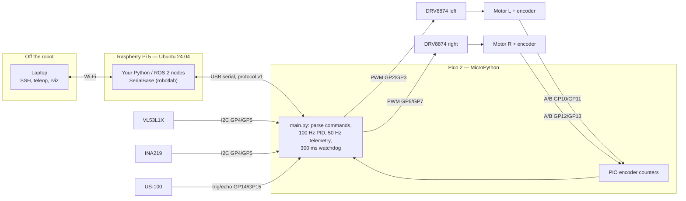
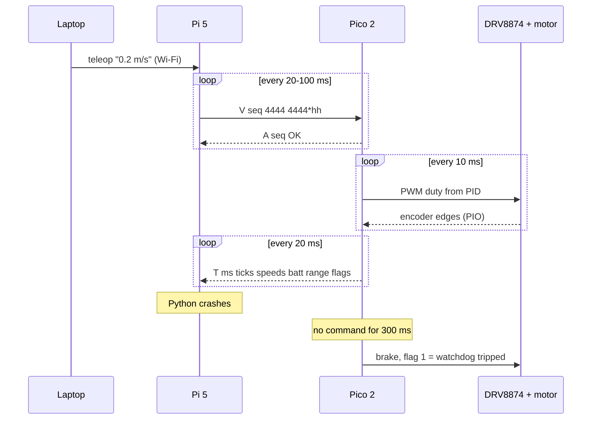

# 01.01 — Plan the build — the architecture of your first robot

<!-- glance:start -->
<!-- generated by tools/build.py from curriculum/syllabus.yaml — edit the syllabus, not this block -->

| | |
|---|---|
| **Track** | Main path |
| **Difficulty** | Beginner |
| **Time** | 40 min |
| **Hardware** | none |
| **Software** | none |
| **Prerequisites** | [00.04 Robot computers: microcontrollers, single-board computers and GPUs](../00-orientation/00.04-robot-computers.md) |
| **Optional prerequisites** | [FE.01 Voltage, current, resistance and power](../optional-foundations/electronics/FE.01-voltage-current-resistance-power.md) |
| **Skip if** | You already own a working differential-drive robot with encoders and a companion computer. |

<!-- glance:end -->

## What you will learn

- Draw karmel v1's architecture from memory: which part does which job, how the parts talk, and where the power goes.
- Trace one command ("drive forward") from your laptop to the wheel and the encoder ticks back, naming every interface and its timing.
- Read karmel's pin map and power tree, and check a pin map for the mistakes that destroy boards.
- Compute the numbers that justify the design: encoder edge rates, distance per tick, link bandwidth, current per rail and runtime.
- Record hardware decisions (and deviations from the course BOM) as short architecture decision records.

## Why it matters

Module 01 turns a box of parts into a robot that drives a measured square and stops before walls. The next fourteen
lessons each add one piece: shopping, tools, the Pi, the Pico, the chassis, power, motors, encoders, the serial
protocol, driving, sensors, battery monitoring and teleop. If you don't hold the whole picture first, each lesson
looks like an isolated trick, and the first real bug ("the Pi reboots when a motor starts", "the left wheel counts
backwards") has no mental model to debug against.

You already know this from software: you don't start coding a distributed system without a context diagram, the
interfaces and a failure-mode list. A robot is the same exercise with two extra planes you're not used to drawing:
**power** (where the amps flow, and what happens when they spike) and **mechanics** (where the forces go). This
lesson is that architecture review, done once and reused for the whole module.

<!-- prereqs:start -->
## Prerequisites

You need these first:

- [00.04 Robot computers: microcontrollers, single-board computers and GPUs](../00-orientation/00.04-robot-computers.md)

### Optional prerequisite links

New to any of these? Take the foundation lesson first; skip it if you already know it.

- [FE.01 Voltage, current, resistance and power](../optional-foundations/electronics/FE.01-voltage-current-resistance-power.md)

Check your readiness: `python course.py why 01.01`
<!-- prereqs:end -->

## Concept

### karmel v1 in one paragraph

karmel is a two-wheeled **differential-drive** robot: two motors, one per wheel, and a free-rolling ball caster as
the third contact point. It steers by driving the wheels at different speeds, like a tank. A **Raspberry Pi 5**
running Ubuntu Server 24.04 is the brain: it runs your Python (and, from module 04, ROS 2), talks to your laptop
over Wi-Fi and decides where to go. A **Raspberry Pi Pico 2** microcontroller is the spinal cord: it generates the
PWM signals for two **Pololu DRV8874** motor drivers, counts pulses from the Hall **encoders** on the two **Yahboom
520** gear motors, reads the distance sensors and the battery monitor, and stops the motors by itself if the Pi goes
quiet for 300 ms. The Pi and the Pico talk over one **USB cable** that is both a serial link and the Pico's power
supply. Everything runs from a **3S Li-ion pack** (three Samsung 35E cells in series with a protection board)
through a **fuse** and a **switch**; the motor drivers take the battery voltage directly, and a **5 V buck
regulator** feeds the Pi.

### Why two computers (the short version)

[00.04](../00-orientation/00.04-robot-computers.md) makes the full case. The one-line version for a software
architect: **the Pi is your application server, the Pico is a device controller with a circuit breaker.** Linux is
excellent at networking, files, Python and ROS, and it is allowed to pause your process for tens of milliseconds
whenever it likes. The Pico runs one program with no operating system, so its timing is predictable to the
microsecond, and it keeps doing the safe thing (stop) when the Pi crashes, reboots or loses its cable. You put
everything that must happen **on time** (PWM, counting 8,000 encoder edges per second, the watchdog) on the Pico,
and everything that must be **smart** (planning, vision, networking, logging) on the Pi.

### Three planes to plan

| Plane | Question it answers | What goes wrong if you skip it |
|---|---|---|
| **Data / control** | Who sends what to whom, how often, over which interface? | Lost encoder ticks, a robot that keeps driving when the laptop disconnects |
| **Power** | Where does current flow from the battery, at what voltage, protected by what? | Brown-out reboots, a melted wire, a Li-ion fire |
| **Mechanical** | Where is each part, what carries the load, how do cables run? | A tipping robot, wheels that aren't parallel, a cable caught in a wheel |

This lesson draws all three. 01.06 builds the mechanical plane, 01.07 the power plane, and 01.08–01.10 the
data plane.

> [!TIP]
> **Ask your teacher:** "Walk me through what happens, component by component, in the 500 ms after I pull the USB
> cable between the Pi and the Pico while the robot is driving at 0.3 m/s."

## Technical explanation

### Level 1 — Intuition: follow one command

You press the up-arrow in the teleop program on your laptop (lesson 01.15). This is what happens:

1. **Laptop → Pi (Wi-Fi, ~10–50 ms, jittery).** A small network message says "linear speed 0.2 m/s".
2. **Pi (Python, every 20–50 ms).** The program converts 0.2 m/s into two wheel speeds (4.4 rad/s each, since
   $0.2 / 0.045 = 4.44$) and sends a line of text over USB serial: `V 17 4444 4444*hh`.
3. **Pico (every 10 ms).** The firmware parses the line, resets its 300 ms watchdog, compares the requested wheel
   speed with the speed measured from the encoders, and adjusts the PWM duty cycle for each driver.
4. **DRV8874 (20,000 times a second).** The driver switches the battery voltage onto the motor terminals for the
   fraction of each 50 µs period that the duty cycle says: at 40% duty, the 10.8 V pack looks like about 4.3 V on
   average to the motor.
5. **Motor and gearbox.** The motor spins 56 times faster than the wheel; the gearbox trades that speed for torque.
6. **Encoder → Pico.** Two Hall sensors on the motor shaft produce square waves; the Pico's PIO hardware counts
   every edge (2,464 per wheel turn).
7. **Pico → Pi (50 times a second).** A telemetry line reports the tick counts, wheel speeds, battery voltage,
   front distance and status flags: `T 5340 1210 1198 4431 4402 11850 523 8*hh`.
8. **Pi → laptop.** Odometry and battery state go back to you.

If step 1 or 2 stops (Wi-Fi drops, your program crashes), nothing new reaches the Pico, and 300 ms later it stops
the motors. That is the first safety layer; the switch in your hand is the last.

### Level 2 — Practical: the parts, the interfaces, the pins

**Subsystems.** The whole Stage-1 BOM with prices is in [01.02](01.02-buying-hardware-in-israel.md); this is the
architecture view.

| Subsystem | Part | Job | Interface / voltage | Built in |
|---|---|---|---|---|
| Main computer | Raspberry Pi 5 (4 or 8 GB) + Active Cooler + 64 GB microSD | Python, ROS 2, networking, logging | 5 V 5 A in; USB to Pico; Wi-Fi to laptop | [01.04](01.04-raspberry-pi-setup.md) |
| Real-time controller | Raspberry Pi Pico 2 (RP2350) | PWM, encoders, sensors, watchdog | USB (power + serial); **3.3 V logic** | [01.05](01.05-pico-microcontroller-setup.md) |
| Motor drivers | 2× Pololu DRV8874 carrier | Switch battery voltage to each motor | VIN 4.5–37 V; logic 1.8–5 V; IN/IN mode | [01.08](01.08-first-motor-spin.md) |
| Drive | 2× Yahboom 520, 12 V, 205 RPM (1:56), Hall encoder | Torque and odometry | Motor ±12 V; encoder 3.3 V, A/B square waves | [01.06](01.06-mechanical-assembly.md), [01.09](01.09-reading-encoders.md) |
| Wheels | Pololu 90 mm wheels, 6 mm hubs, 3/4" ball caster | Contact with the floor | — | [01.06](01.06-mechanical-assembly.md) |
| Battery | 3× Samsung 35E in a holder + 3S 40 A BMS | Energy: 9.9–12.6 V, 3.5 Ah | XT60 | [01.07](01.07-power-system.md) |
| Protection | 10 A fuse, ≥ 10 A DC switch | Limit fault current, cut power in one second | In the **positive** wire | [01.07](01.07-power-system.md) |
| 5 V rail | Pololu D42V55F5 buck regulator | Battery → stable 5 V for the Pi | 5 V ±3%, up to ≈ 5.5–6 A | [01.07](01.07-power-system.md) |
| Sensors | US-100 ultrasonic, VL53L1X ToF, INA219 battery monitor | Obstacles, battery state | GPIO pulse; I²C at 3.3 V | [01.13](01.13-distance-sensors-stop.md), [01.14](01.14-battery-monitoring.md) |

**Interfaces.** Each wire in the robot is one of a handful of interface types. You'll meet each one in its own lesson;
here is the map.

| Link | Physical layer | Rate / timing | Owner | Foundation |
|---|---|---|---|---|
| Laptop ↔ Pi | Wi-Fi, SSH / TCP | 10–100 ms, jittery, can drop | Pi | [FL.09](../optional-foundations/linux-and-tools/FL.09-networking-basics.md) |
| Pi ↔ Pico | USB CDC serial ("virtual COM port"), text protocol v1 | Commands 10–50 Hz, telemetry 50 Hz, watchdog 300 ms | both | [FE.09](../optional-foundations/electronics/FE.09-uart-i2c-spi.md) |
| Pico → DRV8874 | 2 PWM pins per driver, 3.3 V | 20 kHz | Pico | [FE.07](../optional-foundations/electronics/FE.07-pwm.md) |
| Encoder → Pico | 2 digital inputs per motor (A, B), 3.3 V | up to ≈ 8,400 edges/s per wheel | Pico PIO | [FE.05](../optional-foundations/electronics/FE.05-digital-analog-gpio.md) |
| VL53L1X, INA219 → Pico | I²C bus (SDA, SCL), 3.3 V | 400 kHz clock, read at 10 Hz | Pico | [FE.09](../optional-foundations/electronics/FE.09-uart-i2c-spi.md) |
| US-100 → Pico | trigger out, echo pulse in | ≤ 30 ms per reading | Pico | [FE.05](../optional-foundations/electronics/FE.05-digital-analog-gpio.md) |

**The pin map.** The single source of truth is [`labs/config/karmel.yaml`](../labs/config/karmel.yaml) (`pins:`);
the firmware mirrors it in `labs/firmware/pico/config.py`, and a test checks they agree. The physical pin number is
what you count on the board (pin 1 is next to the USB connector, top left, with the USB end facing up and the
components toward you).

| Function | Pico GPIO | Physical pin | Goes to | Lesson |
|---|---|---|---|---|
| Left motor IN1 / IN2 (PWM) | GP2 / GP3 | 4 / 5 | Left DRV8874 EN/IN1, PH/IN2 | 01.08 |
| I²C0 SDA / SCL | GP4 / GP5 | 6 / 7 | VL53L1X, INA219 | 01.13, 01.14 |
| Right motor IN1 / IN2 (PWM) | GP6 / GP7 | 9 / 10 | Right DRV8874 EN/IN1, PH/IN2 | 01.08 |
| Left encoder A / B | GP10 / GP11 | 14 / 15 | Left motor Hall A / B | 01.09 |
| Right encoder A / B | GP12 / GP13 | 16 / 17 | Right motor Hall A / B | 01.09 |
| Ultrasonic trigger / echo | GP14 / GP15 | 19 / 20 | US-100 Trig / Echo | 01.13 |
| Battery divider (ADC0) | GP26 | 31 | Alternative to the INA219 | 01.14 |
| Left motor current sense (ADC1) | GP27 | 32 | **Not connected in Stage 1** (see below) | 02.03 |
| Status LED | GP25 | on board | — | 01.05 |
| 3V3 out / GND | — | 36 / 3, 8, 13, 18, 23, 28, 38 | Sensor power, logic grounds | 01.08 |

**Design rules that come with this map.** These are the decisions most beginner robots get wrong. Each has a reason
you can check with a number:

1. **Everything that touches a Pico pin is 3.3 V logic.** The DRV8874 accepts 3.3 V inputs, the Yahboom encoders run
   at 3.3 V with built-in pull-ups, the US-100 and the Pololu VL53L1X run at 3.3 V. An HC-SR04 (5 V echo) would need a
   divider ([02.05](../02-robot-electronics/02.05-logic-levels-and-protection.md)).
2. **No internal pull-downs on the Pico 2.** Early RP2350 chips (stepping A2) have erratum **RP2350-E9**: an input pin
   leaks enough current that the internal pull-down can't pull it low. karmel only uses pull-ups (the encoders
   provide their own), active-low inputs, or external pull-downs of ≤ 8.2 kΩ. You'll check your chip's stepping in
   01.05; the details are in [FE.06](../optional-foundations/electronics/FE.06-pull-up-pull-down.md).
3. **The DRV8874 current-sense output stays unconnected in Stage 1.** The carrier's CS (IPROPI) pin outputs
   ≈ 1.1 V per amp. With the driver's SLEEP pin at 3.3 V, the carrier limits current to ≈ 2.9 A, which is 3.2 V on
   CS: already at the top of the ADC range. Current spikes above the limit before regulation kicks in, or a stall at
   a higher limit, would put 3.9–4.8 V on GP27, above the RP2350's 3.8 V absolute maximum for an ADC-capable pin
   (IOVDD + 0.5 V). Nothing in Stage 1 needs motor current (the firmware doesn't read it), so the safe choice is to
   leave CS unwired. When stall detection arrives ([02.03](../02-robot-electronics/02.03-motor-drivers-in-depth.md)),
   add a divider (47 kΩ over 100 kΩ, factor 0.68, so 4.4 A reads 3.29 V), a 10 nF capacitor at the ADC pin and a
   Schottky clamp to 3V3. The divider's 147 kΩ in parallel with the carrier's own 2.49 kΩ CS resistor raises the
   current limit by only 1.7%; a stiff 10 k / 22 k divider would raise it by 7.8%.
4. **Fuse and switch in the positive wire, never the ground.** Opening a ground wire while USB is plugged in makes
   the motor current look for a return path through the Pico and the Pi
   ([FE.16](../optional-foundations/electronics/FE.16-grounding.md)).
5. **One source per rail.** The Pi gets 5 V from exactly one place at a time: the 27 W bench PSU **or** the
   robot's regulator, both through its USB-C connector. The Pico is powered only from the Pi's USB port, never also
   from the regulator.
6. **Common ground.** Battery negative, both drivers, the regulator, the Pi and the Pico share one ground, joined at
   one star point. Signals are voltages *relative to ground*; two boards without a shared ground can't understand each
   other.

> [!NOTE]
> New to voltage, current and power? → [FE.01 Voltage, current, resistance and power](../optional-foundations/electronics/FE.01-voltage-current-resistance-power.md). Skip it if you can compute the current a 25 W load draws from an 11 V battery.

### Level 3 — Mathematics: the numbers behind the design

**Encoder resolution.** The encoder gives $N_{cpr} = 11$ pulses per motor revolution on one channel. Counting both
edges of both channels multiplies by 4, and the gearbox multiplies by its ratio $G$:

$$N_{ticks} = N_{cpr} \cdot G \cdot 4 \qquad d_{tick} = \frac{2\pi r}{N_{ticks}}$$

With $G = 56$ and $r = 0.045$ m: $N_{ticks} = 11 \times 56 \times 4 = 2464$ ticks per wheel turn, and
$d_{tick} = 2\pi \times 45\ \text{mm} / 2464 = 0.115$ mm. The robot measures its wheel travel to about a tenth of a
millimetre (whether that becomes accurate position is a module 09 question).

**Why the Pico counts in hardware.** The edge rate at the wheel's no-load speed $n$ (rev/min) is

$$f_{edges} = \frac{n}{60} \cdot N_{ticks}$$

$205 / 60 \times 2464 = 8{,}419$ edges per second **per wheel**, so 16,800 per second for both. A MicroPython interrupt
handler takes tens to hundreds of microseconds, and Linux on the Pi can stall a process for 10 ms (84 lost edges).
The Pico's PIO is a tiny state machine in silicon that counts every edge without the CPU.

**Top speed.** $v = \frac{n}{60} \cdot 2\pi r = \frac{205}{60} \times 0.2827 = 0.97$ m/s at no load. The software
limit in `karmel.yaml` is 0.5 m/s: indoors, a robot that can't stop in time is a hazard.

**Link bandwidth.** One telemetry line is about 50 bytes. At 50 Hz that is 2,500 bytes/s, which is 0.2% of USB full
speed (12 Mbit/s). USB is not the bottleneck; latency and robustness (01.10) are what matter.

**Power budget.** A buck regulator converts power, not current. With efficiency $\eta$:

$$I_{battery} = \frac{V_{out} \cdot I_{out}}{\eta \cdot V_{battery}}$$

| Load | At the load | Battery current at 10.8 V (η = 0.9 for the 5 V rail) |
|---|---|---|
| Pi 5 idle/light work | 5 V × 0.8 A = 4 W | 0.41 A |
| Pi 5 heavy CPU (estimate) | 5 V × 2.5 A = 12.5 W | 1.29 A |
| Pi 5 + full 1.6 A USB budget (worst case) | 5 V × 5 A = 25 W | 2.57 A |
| Two motors, normal driving (estimate) | 2 × 0.5 A | 1.0 A |
| Two motors stalled, DRV8874 limiting at ≈ 2.9 A each | 2 × 2.9 A | 5.8 A |
| **Realistic fault: both stalled + Pi busy** | | **≈ 7.1 A** |

That table is why the fuse is **10 A** (above every legitimate current, below what the wiring and switch tolerate)
and why the regulator must deliver 5 A even though the Pi usually draws under 1 A. [02.02](../02-robot-electronics/02.02-power-budget.md)
refines it with measurements.

**Runtime.** The pack stores $E = 10.8\ \text{V} \times 3.5\ \text{Ah} = 37.8$ Wh. If you use 80% of it and the robot
draws about 1.56 A while driving (Pi 1 A at 5 V plus 1 A of motors): $0.8 \times 37.8 / (1.56 \times 10.8) = 1.8$
hours of driving, or about 6.8 hours with the Pi idling and the motors off. Plenty for a study session.

### Level 4 — Implementation: configuration as code, decisions as records

**One config file.** Every physical number (wheel radius, gear ratio, pins, battery thresholds, watchdog) lives in
`labs/config/karmel.yaml`. The simulator, the Pi scripts and (through `config.py`) the firmware read it. When your
parts differ, you change **one file** and the tests tell you what else to update. It's the same discipline as keeping
connection strings out of code.

**Architecture decision records.** Hardware choices look arbitrary six months later. Write each one down in five
lines, like an ADR for a service. karmel's first five:

| ADR | Decision | Because | Revisit when |
|---|---|---|---|
| 1 | Pi 5 + Pico 2 over USB serial, not a Pi alone | Hard timing (PWM, 8 kHz encoder edges, watchdog) can't depend on Linux scheduling | micro-ROS on the Pico (FC.08) |
| 2 | 2× DRV8874, not TB6612FNG or L298N | 520 motors stall at 3–4 A; TB6612 is 1.2 A continuous; L298N wastes 2–5 V as heat | A heavier robot or 24 V motors |
| 3 | DRV8874 CS pin unconnected in Stage 1 | 1.1 V/A exceeds the ADC range above 3 A; no Stage-1 feature needs current | Stall detection in 02.03 (divider + clamp) |
| 4 | Pull-ups or external pull-downs only | RP2350-E9 on A2-stepping chips | All your Pico 2 boards are A4 |
| 5 | Pi powered through a USB-C lead from a 5 V ≥ 5 A buck, `usb_max_current_enable=1` | The buck can't announce 5 A over USB-PD, so the Pi would limit USB devices to 600 mA | Stage 3 adds the LiDAR's USB current |

When you deviate from the BOM (a different motor, a TB6612 because 4Project was out of stock), add a row. Your AI
teacher can review it against the numbers above.

## Diagram

**Block diagram: data and control.**



**Data flow over time: one control cycle and a failure.**



**Power tree** (details and the full wiring table in [01.07](01.07-power-system.md)):

```text
 3× Samsung 35E in series  ──►  3S BMS  ──►  P+ ──[10 A fuse]──►  XT60 (pack side, female)
   9.9–12.6 V, 3.5 Ah             40 A        P− ─────────────────►  XT60
                                                                        │
                                                   robot side XT60 (male)
                                                                        │
                                           + ──[switch ≥ 10 A DC]──► STAR (+)          − ──► STAR (GND)
                                                                        │
                    ┌───────────────────────────┬───────────────────────┤
                    ▼                           ▼                       ▼
            DRV8874 left VIN            DRV8874 right VIN        D42V55F5 buck VIN
            (470 µF across VIN–GND)          │                    5.0 V out, ≤ 5.5 A
                    │                           │                       │ USB-C lead
              motor left                 motor right              Raspberry Pi 5
                                                                        │ USB-A → micro-USB
                                                                   Pico 2 (own 3.3 V regulator)
                                                                        │ 3V3 pin, ≤ 300 mA
                                                            encoders, VL53L1X, INA219, US-100
```

**Physical layout, top view** (x forward, y left, per REP-103; origin `base_link` between the wheels):

```text
                          FRONT (+x)
           ┌──────────────────────────────────────┐  x = +125 mm
           │   [US-100]  [VL53L1X]   sensor strip │
           │              ( caster )              │  x = +100 mm (under the lower deck)
           │   upper deck (50 mm standoffs):      │
           │   Pi 5 + cooler, Pico 2 on breadboard│
        ┌──┤ ┌──────┐                  ┌──────┐   ├──┐
  LEFT  │W │ │motor │═══ ◄─ y ─ ● ─────│motor │   │ W│  RIGHT
  wheel │  │ │  L   │     base_link    │  R   │   │  │  wheel
  (+y)  └──┤ └──────┘  drivers L / R   └──────┘   ├──┘
           │   lower deck: battery pack, BMS,     │
           │   fuse, regulator, star terminal     │
           │   switch at the rear edge ► [SW]     │
           └──────────────────────────────────────┘  x = −125 mm
                          REAR (−x)       track width 200 mm, plate 250 × 200 mm
```

## Code

`karmel_architecture.py` prints the design numbers from the real config file, checks the pin map for the mistakes
listed in Level 2, and (optionally) shows you raw protocol lines from a software Pico, so you can watch the data
plane before any hardware exists. Save it in the **repository root** and run it from there. It needs the lab
packages installed as in [labs/README.md](../labs/README.md) (`pyyaml`; `pyserial` for `--peek`).

```python
"""01.01 — karmel's architecture in numbers, straight from labs/config/karmel.yaml.

Run from the repository root (no hardware needed):
    python karmel_architecture.py                      # numbers + pin-map checks
    python karmel_architecture.py --peek socket://localhost:5760   # watch the Pi<->Pico link

For --peek, start the software Pico first in another terminal:
    python -m robotlab.fake_pico --port 5760           (with labs/python on PYTHONPATH)
"""
from __future__ import annotations

import argparse
import math
import sys
import time
from pathlib import Path

REPO = Path(__file__).resolve().parent
for candidate in (REPO / "labs" / "python", Path.cwd() / "labs" / "python"):
    if candidate.is_dir():
        sys.path.insert(0, str(candidate))
        break

from robotlab import protocol  # noqa: E402
from robotlab.config import load_config  # noqa: E402

ADC_CAPABLE = {26, 27, 28}          # Pico 2 GPIOs wired to the ADC (29 measures VSYS on the board)
RESERVED = {23, 24, 25, 29}         # used on the Pico 2 board itself (SMPS mode, VBUS sense, LED, VSYS/3)


def derived_numbers() -> None:
    cfg = load_config()
    d, b, s = cfg.drive, cfg.battery, cfg.serial
    ticks = d.ticks_per_wheel_rev
    circumference = 2 * math.pi * d.wheel_radius_m
    no_load_rpm = 205.0                              # Yahboom 520, 1:56 version, at 12 V
    no_load_speed = no_load_rpm / 60 * circumference
    edges_per_s = no_load_rpm / 60 * ticks           # quadrature edges one Pico must catch per wheel
    telemetry_line = protocol.encode(protocol.Telemetry(123456, -98765, 98765, 17000, -17000, 11850, 523, 8))
    bytes_per_s = len(telemetry_line) * s.telemetry_hz
    usb_full_speed_bytes_per_s = 12_000_000 / 10     # 12 Mbit/s, very roughly 10 bits per byte of payload
    energy_wh = b.nominal_v * b.capacity_ah

    print(f"config file            : {cfg.source}")
    print(f"ticks per wheel rev    : {ticks}  (= {d.encoder_cpr_motor} x {d.gear_ratio:g} x {d.quadrature_multiplier})")
    print(f"distance per tick      : {circumference / ticks * 1000:.3f} mm")
    print(f"no-load top speed      : {no_load_speed:.2f} m/s  (software limit {d.max_linear_speed_m_s} m/s)")
    print(f"encoder edges per wheel: {edges_per_s:,.0f} per second at no-load speed")
    print(f"telemetry line         : {telemetry_line.strip()!r} = {len(telemetry_line)} bytes")
    print(f"telemetry bandwidth    : {bytes_per_s:,.0f} bytes/s = {bytes_per_s / usb_full_speed_bytes_per_s:.2%} of USB full speed")
    print(f"watchdog               : motors stop {s.watchdog_ms} ms after the last drive command")
    print(f"battery                : {b.cells_series}S, {b.cutoff_v}-{b.full_v} V, {energy_wh:.1f} Wh nominal")


def check_pins() -> list[str]:
    pins = load_config().pins
    problems: list[str] = []
    seen: dict[int, str] = {}
    for name, gpio in pins.items():
        if gpio in seen:
            problems.append(f"GP{gpio} used twice: {seen[gpio]} and {name}")
        seen[gpio] = name
        if name.endswith("_adc") and gpio not in ADC_CAPABLE:
            problems.append(f"{name}=GP{gpio} is not an ADC pin (use 26, 27 or 28)")
        if gpio in RESERVED and name != "status_led":
            problems.append(f"{name}=GP{gpio} is used by the Pico 2 board itself")
    for side in ("left", "right"):
        a, b = pins[f"encoder_{side}_a"], pins[f"encoder_{side}_b"]
        if b != a + 1:
            problems.append(f"encoder_{side}: B must be A+1 for the PIO decoder (A=GP{a}, B=GP{b})")
        in1, in2 = pins[f"motor_{side}_in1"], pins[f"motor_{side}_in2"]
        if in1 // 2 != in2 // 2:
            problems.append(f"motor_{side}: GP{in1} and GP{in2} are on different PWM slices")
    return problems


def peek(url: str, seconds: float) -> None:
    import serial  # pyserial

    with serial.serial_for_url(url, baudrate=115200, timeout=0.2) as port:
        port.write(protocol.encode_bytes(protocol.Hello(1)))
        end = time.monotonic() + seconds
        while time.monotonic() < end:
            line = port.readline()
            if not line:
                continue
            try:
                message = protocol.decode_pico_message(line)
            except protocol.ProtocolError as exc:
                print(f"  bad line {line!r}: {exc}")
                continue
            print(f"  Pico -> Pi: {line.decode().strip():<45} {type(message).__name__}")


def main() -> int:
    parser = argparse.ArgumentParser(description=__doc__, formatter_class=argparse.RawDescriptionHelpFormatter)
    parser.add_argument("--peek", metavar="URL", help="e.g. socket://localhost:5760 or /dev/ttyACM0")
    parser.add_argument("--seconds", type=float, default=0.2)
    args = parser.parse_args()
    derived_numbers()
    problems = check_pins()
    print("pin map                : " + ("OK" if not problems else f"{len(problems)} problem(s)"))
    for problem in problems:
        print("  - " + problem)
    if args.peek:
        peek(args.peek, args.seconds)
    return 1 if problems else 0


if __name__ == "__main__":
    raise SystemExit(main())
```

Run it (Linux/macOS/WSL; on Windows PowerShell set `$env:PYTHONPATH = "labs/python"` instead of the prefix):

```bash
python karmel_architecture.py
PYTHONPATH=labs/python python -m robotlab.fake_pico --port 5760      # terminal 2: the software Pico
python karmel_architecture.py --peek socket://localhost:5760           # terminal 1 again
```

Why the pin checks matter: GP23, GP24 and GP29 are wired to the Pico 2's own power circuitry, so using them for a
sensor gives nonsense; the PIO encoder program needs B on the pin right after A; and the two inputs of one motor
should share a PWM "slice" (GP2/GP3 are slice 1, GP6/GP7 slice 3) so they always run at the same frequency.

## Exercise

### Exercise 01.01-E1 — Watch the data plane before you own a robot `[coding]`

Hardware: none.

1. Run `python karmel_architecture.py` from the repository root and copy the output into your notes.
2. Start the software Pico and run the script with `--peek socket://localhost:5760`.
3. Identify in the output: the hello reply, one telemetry line, and each of its eight fields (use the protocol table
   in [labs/README.md](../labs/README.md#the-pi--pico-protocol-v1)).
4. Copy `labs/config/karmel.yaml` to a scratch file, change `encoder_right_b` to `14`, and run the script with
   `KARMEL_CONFIG=<your copy>` (PowerShell: `$env:KARMEL_CONFIG = "<your copy>"`). Don't edit the real file.

### Exercise 01.01-E2 — What happens when…? `[predict]`

Hardware: none. Write your prediction **before** reading the expected result. For each event, say what the motors
do, within what time, and which component makes that happen.

1. Your Python program on the Pi raises an exception while the robot drives at 0.3 m/s.
2. You pull the USB cable between the Pi and the Pico while driving.
3. Both wheels are blocked by a chair leg for 5 seconds at full duty.
4. The 5 V regulator is replaced with a 3 A model and both motors start at once.
5. You open the robot's power switch while the Pi is still connected to your laptop by an Ethernet cable.

### Exercise 01.01-E3 — Recompute for different parts `[numerical]`

Hardware: none. The store only has the **333 RPM (1:30)** Yahboom motors and Pololu **70 mm** wheels. Compute
(by hand, then check by editing a copy of `karmel.yaml` and running the script): (a) ticks per wheel turn;
(b) distance per tick; (c) no-load top speed; (d) edges per second per wheel at no-load speed; (e) whether the Pico's
PIO design still holds, and what you'd change in the software limits.

### Exercise 01.01-E4 — Your architecture decision records `[design]`

Hardware: none. Write ADRs 6–8 for karmel in the five-column format above: (6) where the battery sits on the chassis
and why; (7) whether the Pico is powered from the Pi's USB or from the 5 V regulator; (8) one deviation you already
expect from the BOM (budget, stock, a part you own). Each ADR must cite at least one number.

## Expected result

- **01.01-E1:** The first run prints `ticks per wheel rev : 2464`, `distance per tick : 0.115 mm`, `no-load top speed : 0.97 m/s`,
  `encoder edges per wheel: 8,419 per second`, a 50-byte telemetry line, `2,500 bytes/s = 0.21% of USB full speed`
  and `pin map : OK`. With `--peek` you see one `I fake-0.1.0 1*6D` (HelloReply) and several lines like
  `T 5340 0 0 0 0 12239 2875 1*54` (Telemetry): time 5.34 s since the fake Pico started, both tick counts 0, both speeds 0,
  battery 12.239 V, front range 2.875 m, flags 1 (watchdog tripped, because no drive command has been sent yet). The
  modified config reports `GP14 used twice: encoder_right_b and ultrasonic_trig` and
  `encoder_right: B must be A+1 for the PIO decoder (A=GP12, B=GP14)`.
- **01.01-E2:** (1) The keep-alive thread dies with the program; no drive command arrives; the **Pico's watchdog**
  brakes the motors **≈ 300 ms** later (the robot rolls ≈ 9 cm plus braking). (2) Same watchdog stop within 300 ms;
  in Stage 1 the Pico is powered by that cable, so it may simply lose power: the DRV8874 inputs are pulled low on the
  carrier (coast) and the motors stop either way. (3) The DRV8874 limits each motor to ≈ 2.9 A, the chip heats and
  may enter thermal shutdown after a few seconds; battery current ≈ 6–7 A, below the 10 A fuse. Nothing *software*
  stops it in Stage 1, which is why stall detection appears in 02.03 and you keep a hand on the switch. (4) The Pi's
  5 V sags below ≈ 4.63 V under the combined load: under-voltage warning or a reboot (00.04, 02.02). The Pico stops
  the motors 300 ms after the Pi goes silent. (5) The switch is in the positive wire, so all loads lose power
  cleanly; the Pi shuts off (an unclean power-off: that's why 01.14 adds a clean shutdown). If the switch were in the
  **ground** wire, current could return through the Ethernet/USB grounds: this is the "never switch ground" rule.
- **01.01-E3:** (a) $11 \times 30 \times 4 = 1320$; (b) $\pi \times 70 / 1320 = 0.167$ mm; (c) $333/60 \times \pi \times 0.070 = 1.22$ m/s;
  (d) $333/60 \times 1320 = 7{,}326$ edges/s, still hardware-counting territory, so the PIO design holds.
  (e) Set `gear_ratio: 30.0` and `wheel_radius_m: 0.035`, keep `max_linear_speed_m_s: 0.5` (the robot is faster, so
  the limit matters more). The pushing force at the rim scales with gear ratio divided by wheel radius:
  $(30/56) \times (45/35) = 0.69$, so the robot has about 31% less pull, and you should re-measure the deadband in 01.08.
- **01.01-E4:** Good answers cite numbers. Examples: (6) battery low on the lower deck, centred at x ≈ +20 to +30 mm —
  the caster is 100 mm *in front* of the axle, so the centre of mass has to sit between the two if it is to stay
  inside the wheel–wheel–caster triangle, and at x = +20 to +30 mm ≈ 70–80% of the weight is on the drive wheels
  (traction); 3 cells ≈ 150 g of a ≈ 1.6 kg robot. (7) From the Pi's USB: one source per rail, no back-feeding
  between the regulator and the Pi's USB 5 V, and the Pico reboots together with the Pi (its watchdog stops the
  motors meanwhile). (8) For example "TB6612FNG instead of DRV8874: saves ₪151; stall current exceeds its 3.2 A peak,
  so ramp duty and never stall for more than 1 s; revisit when a motor stalls in testing".

## Troubleshooting

### Symptom: `ModuleNotFoundError: No module named 'robotlab'` or `'yaml'`

1. **Where did you run it from?** The script looks for `labs/python` next to itself and in the current directory. Run
   it from the repository root, with the file saved there.
2. **Is pyyaml installed** in the Python you're running? `python -c "import yaml"`. If not, follow
   [labs/README.md](../labs/README.md) (venv, `pip install -r requirements.txt`).
3. **`--peek` only:** `import serial` fails → `pip install pyserial` in the same environment.

### Symptom: `--peek` prints the numbers but no protocol lines

1. **Is the fake Pico running?** Its terminal should show that it's listening on port 5760. If it exited, read its
   error.
2. **Same port on both sides?** `--port 5760` and `socket://localhost:5760`.
3. **Increase `--seconds` to 2.** The default 0.2 s may catch only a few lines on a slow machine.
4. **Windows firewall prompt:** allow local connections for Python, or bind to `127.0.0.1` (the default).

### Symptom: the pin check fails after you adapted `karmel.yaml` to your parts

Read the message; each one names the rule. Then decide: move the function to a free GPIO that satisfies the rule, and
update `labs/firmware/pico/config.py` identically (the lab tests compare the two files: `pytest labs/python/tests/test_firmware_logic.py`).

### Symptom: "my parts don't match the BOM" (before you build anything)

Check in this order, cheapest question first: (1) **voltage** (does it run on 9.9–12.6 V or 3.3 V logic?);
(2) **current** (stall current vs driver limit; regulator ≥ 5 A for the Pi); (3) **interface** (I²C address, 3.3 V
signals, connector type); (4) **mechanics** (shaft 6 mm D, bracket hole pattern, wheel hub fit); (5) **config**
(what changes in `karmel.yaml`). Write an ADR for the change. If any of (1)–(3) fails, don't buy it.

## Common mistakes

- **Planning only the data plane.** Software engineers draw boxes and arrows and forget the power tree. Most "software"
  bugs on a new robot are brown-outs, missing grounds or reversed polarity.
- **Putting timing-critical work on the Pi** ("I'll just read the encoders with gpiozero"). It works slowly by hand and
  loses counts at speed. Counting belongs to the Pico's PIO.
- **Sizing the regulator for the average current.** The Pi averages under 1 A and peaks at several; USB devices add
  more. Size for the peak, fuse for the fault.
- **Choosing a motor driver from its "rated" current.** The motor's **stall** current (3–4 A for the 520) is what the
  driver must survive when a wheel is blocked.
- **Treating every Pico pin as equivalent.** ADC only on GP26–28, board functions on GP23/24/25/29, E9 on pull-downs,
  and encoder B must follow A for the PIO program.
- **Not writing decisions down.** Without ADRs, the next "why is this here?" costs a day of re-deriving it.

## Knowledge check

1. Name the job of each computer on karmel in one sentence, and give one job that must never move from the Pico to the Pi.
   <details><summary>Answer</summary>

   The Pi runs the application: Python/ROS 2, planning, networking, logging. The Pico runs the hard real-time
   I/O: PWM, encoder counting, sensor timing and the watchdog. The **motor-stop watchdog** must stay on the Pico,
   because it has to work precisely when the Pi has crashed, rebooted or lost its cable.
   </details>

2. The encoder produces 11 pulses per motor revolution on one channel, the gear ratio is 56 and the wheel diameter is 90 mm. How far does the wheel rim travel per tick with 4× decoding?
   <details><summary>Answer</summary>

   $11 \times 56 \times 4 = 2464$ ticks per wheel turn; $\pi \times 90\ \text{mm} / 2464 = 0.115$ mm per tick.
   </details>

3. Why is the DRV8874's current-sense pin left unconnected in Stage 1, and what would you add to use it later?
   <details><summary>Answer</summary>

   It outputs ≈ 1.1 V/A: at the 2.9 A limit that's 3.2 V, and spikes or a higher limit push it to 3.9–4.8 V, above the
   RP2350's 3.8 V absolute maximum on an ADC-capable pin. Stage 1 doesn't use motor current. Later: a high-impedance
   divider (47 k over 100 k, factor 0.68, so the carrier's current limit changes by < 2%), a 10 nF filter capacitor
   and a Schottky clamp to 3V3.
   </details>

4. Predict: you set a button input on your Pico 2 to `Pin.PULL_DOWN`, press the button (to 3.3 V) once and release it. The pin keeps reading 1. What's the likely cause and the fix?
   <details><summary>Answer</summary>

   Erratum RP2350-E9 on an A2-stepping chip: the pad leakage holds the released pin near 2.2 V, and the weak internal
   pull-down can't pull it low. Fix: wire the button to GND and use `Pin.PULL_UP` (active low), or add an external
   pull-down of 8.2 kΩ or less. Check the stepping as in 01.05.
   </details>

5. The Pi draws 5 V × 2.5 A through a 90%-efficient regulator from a pack at 10.8 V. What current does the battery supply for the Pi?
   <details><summary>Answer</summary>

   $I = (5 \times 2.5) / (0.9 \times 10.8) = 1.29$ A. The regulator converts power, so the battery current is lower
   than the Pi's current.
   </details>

6. Debugging scenario: telemetry shows the robot's tick counts increasing smoothly at walking speed, but at full speed the left count grows 20% slower than the right, while both wheels visibly turn at the same speed. The encoders are read by a Python loop on the Pi via gpiozero. What's wrong with the architecture?
   <details><summary>Answer</summary>

   The Pi (Linux + Python) can't sample ≈ 8,000 edges per second reliably; it misses edges whenever the process is
   descheduled, and misses more at higher speed. Encoder counting belongs on the Pico, in PIO hardware. (If counting
   were already on the Pico, check noise and the counts-per-rev constant instead.)
   </details>

7. Why are the fuse and the switch placed in the positive wire rather than the ground wire?
   <details><summary>Answer</summary>

   If the ground wire is opened while any other connection exists (USB to a laptop, Ethernet, a serial adapter), the
   return current finds a path through signal grounds and protection diodes, which can damage the Pi, the Pico or your
   laptop's port. Opening the positive wire removes the energy source from every load at once.
   </details>

## Practical challenge

Produce **karmel's architecture document v1** for *your* robot as a single Markdown file in your notes (not in this
repository's lesson folders):

1. The block diagram, the power tree and the top-view layout, adapted to the parts you are actually buying.
2. A complete pin table (every Pico pin you use, physical pin number, voltage, destination, lesson).
3. A power budget table with the fuse rating and the regulator rating justified by numbers.
4. At least eight ADRs (the five above, your three from E4).
5. A failure table: rows "Pi program crash", "USB unplugged", "motor stall", "battery at 9.9 V", "Wi-Fi drop";
   columns "what happens", "within how long", "which component acts", "what the human does".

**Acceptance criteria:** `karmel_architecture.py` reports `pin map : OK` for your `karmel.yaml`; every rail in the
power tree has a protection device or a documented reason why not; every failure row ends with the motors stopped
or under control; your AI teacher, acting as a skeptical reviewer, can't find a pin that exceeds its voltage rating.

## You can skip this if…

You already own a working differential-drive robot with encoders and a companion computer, **and** you can answer
knowledge-check questions 2, 3 and 6 correctly without looking, **and** you can draw its power tree including the fuse
rating from memory.

`python course.py skip 01.01 --reason "I have a working diff-drive robot and know its architecture"`

## Go deeper

- Raspberry Pi Pico 2 datasheet: https://datasheets.raspberrypi.com/pico/pico-2-datasheet.pdf — the board pinout, which GPIOs the board uses internally, the 3V3 output limit (keep it under 300 mA) and power options.
- RP2350 datasheet: https://datasheets.raspberrypi.com/rp2350/rp2350-datasheet.pdf — absolute maximum ratings per pin type, the ADC, PIO and erratum RP2350-E9.
- Pololu DRV8874 carrier: https://www.pololu.com/product/4035 — pinout, default pin states, current limit and the ≈ 1.1 V/A current-sense output this lesson plans around.
- Raspberry Pi documentation source, power supplies: https://github.com/raspberrypi/documentation/blob/master/documentation/asciidoc/computers/raspberry-pi/power-supplies.adoc — the Pi 5's 5 A requirement and the 1.6 A / 600 mA USB current budget.
- MicroPython RP2 quick reference: https://docs.micropython.org/en/latest/rp2/quickref.html — the Pico API that the firmware in `labs/firmware/pico` uses.
- Michael Nygard, "Documenting Architecture Decisions": https://cognitect.com/blog/2011/11/15/documenting-architecture-decisions — the ADR format, which works as well for hardware as for services.

## Progress checkpoint

- [ ] I can draw karmel's block diagram, power tree and layout from memory.
- [ ] I can trace a drive command from laptop to wheel and back, with the interface and timing of each hop.
- [ ] I can read the pin map and explain the six design rules (3.3 V logic, E9, CS unconnected, positive-side switch, one source per rail, common ground).
- [ ] I can compute ticks per revolution, distance per tick, edge rate, battery current and runtime.
- [ ] I have written ADRs for my own build.

`python course.py complete 01.01` (exercises done) · `python course.py master 01.01`
(challenge done) · `python course.py struggle 01.01 "what was hard"`

Next: [01.02 — Stage 1 shopping list: buying the parts in Israel](01.02-buying-hardware-in-israel.md).
