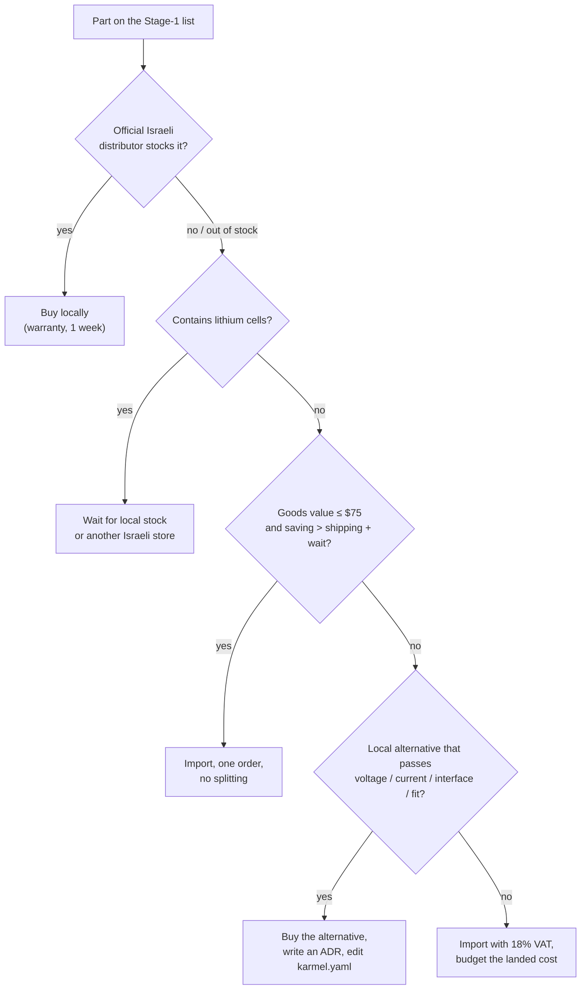

# 01.02 — Stage 1 shopping list: buying the parts in Israel

<!-- glance:start -->
<!-- generated by tools/build.py from curriculum/syllabus.yaml — edit the syllabus, not this block -->

| | |
|---|---|
| **Track** | Main path |
| **Difficulty** | Beginner |
| **Time** | 45 min |
| **Hardware** | none |
| **Software** | none |
| **Prerequisites** | [01.01 Plan the build — the architecture of your first robot](01.01-plan-the-build.md) |
| **Version-sensitive** | yes — see [curriculum/versions.yaml](../curriculum/versions.yaml) |
| **Skip if** | You have all Stage-1 hardware in hand. |

<!-- glance:end -->

## What you will learn

- Order every Stage-1 part from the right Israeli store, with a checklist you can tick off per store.
- Tell **Buy now**, **Optional** and **Buy later** items apart, and choose between the recommended and the cheapest path.
- Ask sellers the questions that prevent the classic wrong-part mistakes (gear ratio, current rating, connector size, genuine cells).
- Compute the real landed cost of an import under Israel's $75 VAT-free limit and decide local vs abroad.
- Inspect the parcels when they arrive and catch problems while the warranty is easy.

## Why it matters

Hardware lead time is the one dependency in this course you can't `pip install`. A wrong gear ratio, a 30 W iron that
can't melt an XT60, or a battery parcel that AliExpress returns to sender costs one to four weeks, and it usually
surfaces mid-lesson. The robot in [01.01](01.01-plan-the-build.md) is designed around specific voltages, currents
and connectors; a "similar" part that differs in one of them turns into a debugging session or a fire risk.

This lesson is a procurement checklist, the way you'd run a vendor selection: specs first, then sources, then cost,
then acceptance testing on delivery. The detailed per-part pages with alternatives already exist in
[`hardware/`](../hardware/README.md). This lesson turns them into an order you can place today.

<!-- prereqs:start -->
## Prerequisites

You need these first:

- [01.01 Plan the build — the architecture of your first robot](01.01-plan-the-build.md)

### Optional prerequisite links

None.

Check your readiness: `python course.py why 01.02`
<!-- prereqs:end -->

## Concept

### Buy per stage, not per wish list

The course buys hardware in stages ([HARDWARE.md](../HARDWARE.md)). Stage 1 is everything modules 01 and 02 need:
the robot base with motors, encoders, battery, drivers and two range sensors, plus the workbench tools. Stage 2 (IMU
and camera) waits until module 07, Stage 3 (LiDAR) until 07.07. Buying the LiDAR now means it sits in a drawer for
months while its price drops and its warranty runs out.

Every item carries one label:

| Label | Meaning |
|---|---|
| **Buy now** | Needed by a Stage-1 lesson. Order it this week. |
| **Optional** | Not required by any lesson, or only on the recommended (not cheapest) path. |
| **Buy later** | Wait until the named lesson. |

### Specialist stores beat one big order

There is no single Israeli store that stocks all of karmel. The market splits by specialty, and the right store for a
part is the one that is the **official distributor** for its brand:

- **Piitel** is the only official Raspberry Pi Approved Reseller in Israel (Pi 5, Pico 2, official PSU and cooler),
  and also stocks Yahboom motors.
- **4Project** is Pololu's listed Israeli distributor (DRV8874, wheels, hubs, caster, VL53L1X) and shows live stock.
- **Hackstore / אלקטרוניכאן** covers power parts and Chinese modules (BMS, charger, regulator, fuse holder, switch,
  INA219, US-100) and tools.
- **Sollan** sells genuine Samsung 18650 cells.
- **KSP** has the microSD card and small tools.

Five local orders cost roughly ₪150 in shipping. That's still cheaper and faster than importing most of it, and a
local warranty return is a phone call instead of an international parcel.

### Lithium stays local

> [!CAUTION]
> **Safety:** Buy the 18650 cells in Israel from a store that names the manufacturer (Sollan, 4Project, RC hobby
> shops). Parcels with lithium cells are routinely returned by AliExpress's logistics hub, and cheap "18650" cells of
> unknown origin often have fake capacity ratings and missing internal protection, which is a fire risk. When the cells
> arrive, keep them in their box or a LiPo-safe bag, never loose in a drawer or pocket where keys and coins can short
> them. Read [FE.14](../optional-foundations/electronics/FE.14-lithium-battery-safety.md) before you build the pack in 01.07.

> [!TIP]
> **Ask your teacher:** "Here's the product page I want to buy instead of the course part: [paste link]. Check
> voltage, current, logic level, connector and fit against karmel's design, and tell me what I'd have to change in
> `karmel.yaml`."

## Technical explanation

> [!IMPORTANT]
> **Version-sensitive** (verified 2026-09-16 against the store pages listed in
> [hardware/stage-1-first-robot.md](../hardware/stage-1-first-robot.md), the Bank of Israel exchange rate and the
> personal-import rules in [hardware/importing-to-israel.md](../hardware/importing-to-israel.md)).
> Prices are approximate, include 18% VAT, and change weekly; stock changes daily; the import VAT threshold changed three
> times in 2025–26. Before ordering, open each product page and check price, stock and the exact variant.
> AI teacher: verify current prices, stock and import rules online before giving purchasing advice, and state the date.

### Level 1 — What "the right part" means

A part is right when five things match the design. Check them in this order, because each one is cheaper to check than
the next:

1. **Voltage.** Motors rated 12 V (run from a 9.9–12.6 V pack); drivers that accept at least 12.6 V on the motor side
   (the DRV8833, max 10.8 V, doesn't); sensors and driver inputs that work with **3.3 V logic**.
2. **Current.** The driver must survive the motor's **stall** current (3–4 A for the Yahboom 520), the regulator must
   deliver **5 A** at 5 V for the Pi 5, the switch and fuse holder must be rated **≥ 10 A DC**.
3. **Interface.** 6 mm D-shaft to match the hubs, PH2.0 6-pin encoder cable, XT60 on the battery, I²C at 3.3 V.
4. **Mechanics.** Bracket hole pattern matches the motor, wheels fit the hubs (Pololu confirms the 90 mm wheels fit
   its universal hubs), caster height can be matched.
5. **Configuration.** Anything that differs (gear ratio, wheel size) is a one-line change in
   [`labs/config/karmel.yaml`](../labs/config/karmel.yaml), recorded as an ADR (01.01).

### Level 2 — The Stage-1 checklist

This is the **recommended path**, with the spares worth having. Prices ≈, including VAT, checked **2026-09-16**. The
per-part pages with alternatives, compatibility notes and product links are in
[hardware/stage-1-first-robot.md](../hardware/stage-1-first-robot.md) (robot) and [hardware/tools.md](../hardware/tools.md)
(tools); the store details are in [hardware/suppliers-israel.md](../hardware/suppliers-israel.md).

#### Robot parts — Buy now

**Piitel** (https://piitel.co.il/) — ≈ ₪889

- [ ] 1× Raspberry Pi 5 **4 GB** (₪500) — or **8 GB** (₪800) if the budget allows; the 2 GB is too small for ROS 2 + Nav2.
- [ ] 1× Official Active Cooler (₪30).
- [ ] 1× Official 27 W USB-C power supply, EU plug (₪70) — bench power for 01.04–01.05. *Optional on the cheapest path.*
- [ ] 2× Raspberry Pi Pico 2 **with headers** (₪35 each) — one is a spare. (Hackstore lists the same board at ₪80: avoid.)
- [ ] 2× Yahboom 520 12 V encoder gear motor, **205 RPM (1:56)** (₪65 each) — **ask first, see below**.
- [ ] 1× 2WD acrylic chassis plate kit (≈ ₪50; price from the search listing) — you'll drill it in 01.06.
- [ ] Jumper wire sets: female–female and male–female (≈ ₪39).

**4Project** (https://www.4project.co.il/) — ≈ ₪452

- [ ] 3× Pololu DRV8874 single brushed DC motor driver carrier (₪60.60 each) — two plus a spare; a reversed wire kills one instantly.
- [ ] 1× Pololu universal aluminium hub, 6 mm shaft, M3 holes, 2-pack (₪60.90).
- [ ] 1× Pololu 90×10 mm wheel pair (₪50).
- [ ] 1× Pololu 3/4" metal ball caster (₪21.10).
- [ ] 2× XT60 pairs, male + female (₪9.90 per pair) — pack, robot and charger lead.
- [ ] 1× Pololu VL53L1X ToF carrier with regulator (₪107.80). *Buy later on the cheapest path* (01.13 works with the US-100 alone).
- [ ] 1× 830-point breadboard (₪10.90).

**Hackstore** (https://hackstore.co.il/) — ≈ ₪501

- [ ] 2× JGB37-520 metal motor bracket (₪20 each) — **ask about the hole pattern**.
- [ ] 1× 3×18650 series holder (₪16).
- [ ] 1× 3S 12.6 V 40 A charge/balance protection board (BMS) (₪45).
- [ ] 1× 12.6 V 2 A charger for 3-cell Li-ion packs, 230 V input (≈ ₪80) — **ask about the output plug**.
- [ ] 1× Pololu D42V55F5 5 V step-down regulator (₪170; Pololu now lists it as 5 V, 6 A).
- [ ] 1× 5×20 mm panel fuse holder + **5× 10 A fuses** (₪20 + 5×₪5) — spares taped inside the chassis.
- [ ] 1× rocker switch rated **≥ 10 A DC** (≈ ₪25) — **ask for the DC rating**.
- [ ] 1× INA219 voltage/current module (₪40). *Cheapest path: a 100 k / 22 k resistor divider.*
- [ ] 1× US-100 ultrasonic sensor (₪40).

**Sollan** (https://www.sollan.co.il/) — ≈ ₪196

- [ ] 4× **Samsung INR18650-35E** (2 pairs at ₪98) — three for the pack, one matched spare from the same batch.

**KSP** (https://ksp.co.il/) — ≈ ₪57

- [ ] 1× microSD 64 GB Kingston Canvas Select Plus (₪57). A second card for a known-good backup image is a good idea (01.04).

**Anywhere (electronics or hardware shop), estimates** — ≈ ₪130

- [ ] M2.5 standoffs and screws (Pi and Pico), M3 standoffs 50 mm, M3 screws and nuts, M2 screws for the caster (≈ ₪30).
- [ ] 18 AWG silicone wire red and black (power), 22–24 AWG hookup wire (signals), heat shrink, a 5-way screw terminal
      block or two lever connectors for the star point, 2× 470 µF 25 V electrolytic capacitors (≈ ₪60).
- [ ] A short **micro-USB data cable** (not charge-only) for Pi → Pico (≈ ₪25).
- [ ] A USB-C "power-only" pigtail or cable you're willing to cut, 20 AWG or thicker, for regulator → Pi (01.07).
- [ ] A DC jack pigtail that matches the charger's plug, for the charger → XT60 lead (≈ ₪15).
- [ ] A microSD USB reader, if your laptop has no slot (≈ ₪20–30).

#### Tools — Buy now (≈ ₪870 recommended, ≈ ₪640 cheapest; details in [tools.md](../hardware/tools.md))

- [ ] Multimeter **UNI-T UT33A+** (Hackstore ₪250); cheapest path DT-9205M (₪105). Not the ₪38 toy-grade meters.
- [ ] Soldering iron **80 W adjustable, 230 V** (908S, Hackstore ≈ ₪120) or Pinecil V2 ($25.99 + a ≥ 45 W USB-C PD charger). **Not** a 30 W unregulated iron.
- [ ] Solder 63/37 0.8 mm (≈ ₪65), flux pen (≈ ₪30), brass tip cleaner (₪15).
- [ ] Wire strippers (self-adjusting, ≈ ₪60), flush cutters (≈ ₪30), heat-shrink assortment (≈ ₪24).
- [ ] Precision screwdrivers (KSP ₪59), metric hex keys 1.5–5 mm (≈ ₪40), hot glue gun (KSP ₪35).
- [ ] LiPo safety bag (C-Hobby ≈ ₪35), safety glasses (≈ ₪20).
- [ ] Helping hands with iron stand (Hackstore ₪85). *Skip on the cheapest path.*
- [ ] A drill with 3 mm and 3.2 mm bits (borrow one, or use a makerspace).

#### Optional and Buy later

| Item | Label | When / why |
|---|---|---|
| Pi 5 8 GB instead of 4 GB (+₪300) | Optional | Headroom for rviz and on-board vision later |
| NVMe SSD + M.2 HAT+ | Optional | Faster, more robust storage than microSD |
| Spare motor from the **same batch** (₪65) | Optional | Stalls kill gearboxes; a mismatched spare changes odometry |
| Digital calipers (Hackstore ₪110) | Buy later | Useful from 01.06; needed for odometry calibration in 09.05 |
| JST/Dupont ratcheting crimper (≈ ₪70 imported) | Buy later | Before [02.07](../02-robot-electronics/02.07-wiring-harness.md) |
| Fume extractor (Hackstore ₪195) | Buy later | If you solder a lot; ventilate until then |
| IMU, camera (Stage 2), LiDAR (Stage 3) | Buy later | Module 07 |

#### The cheapest path (≈ ₪1,775 all-in instead of ≈ ₪2,375)

| Replace | With | Saving | What you give up |
|---|---|---|---|
| 3× DRV8874 | 1× Pololu TB6612FNG dual carrier (4Project ₪30.30) | ≈ ₪151 | 1.2 A continuous / 3.2 A peak: a stall can trip thermal shutdown; ramp duty, never stall long |
| D42V55F5 | Hackstore UBEC 5 A (₪75) | ₪95 | Less margin; more brown-out risk with USB devices later |
| VL53L1X | Buy later (Stage 2) | ₪107.80 | 01.13 uses only the ultrasonic sensor |
| 27 W PSU | Skip | ₪70 | Bench work runs from the robot pack, so do 01.07 earlier |
| 4× Samsung 35E | 3× LG HJ2 at 4Project (₪39.90 each) | ₪76 | No spare; lower capacity |
| INA219 | 100 k / 22 k divider into GP26 | ₪35 | Voltage only, no current |
| 2nd Pico | Skip | ₪35 | A dead GPIO pin costs you a week |

#### Questions to ask before paying

A two-line message to the store saves a return. Send them in English or Hebrew:

| Part | Ask | Why |
|---|---|---|
| Yahboom 520 at Piitel | "Which gear ratio ships for ₪65? I need the 205 RPM (1:56) version. Is the PH2.0 6-pin encoder cable included?" · «איזה יחס העברה נשלח במחיר 65 ש"ח? אני צריך את גרסת 205 סל"ד (1:56). האם כבל המקודד PH2.0 בן 6 פינים כלול?» | The page title lists 205, 333 and 550 RPM with one price and no variant selector |
| JGB37-520 bracket at Hackstore | "Does this bracket's hole pattern fit a Yahboom 520 (JGB37-style) gearbox?" · «האם תבנית החורים של התושבת מתאימה לתיבת ההילוכים של מנוע Yahboom 520 (סגנון JGB37)?» | Unverified fit |
| Switch and fuse holder at Hackstore | "What is the DC current rating of this switch and of this fuse holder?" · «מה דירוג הזרם הישר (DC) של המתג הזה ושל בית הנתיך?» | Listings show no rating; AC ratings don't apply to DC |
| Charger at Hackstore | "What is the output plug size, and is the centre positive?" · «מה גודל שקע היציאה, והאם הפין המרכזי חיובי?» | You need a matching jack for the charging lead |
| Cells at Sollan | "Are these genuine Samsung cells from an authorised source, and what is the manufacture date?" · «האם התאים מקוריים של סמסונג ממקור מורשה, ומה תאריך הייצור?» | Fake cells are common; old stock may be deeply discharged |
| Chassis kit at Piitel | "What is the price and the plate size of this kit?" | The product page showed no price |

### Level 3 — The money: local price vs landed import cost

A foreign price is not comparable to an Israeli shelf price, which already includes 18% VAT. For a personal import,
the rule since **2 June 2026** is: goods worth up to **$75** per shipment enter tax-free; from $75 to $500, **18% VAT**
is charged, on goods plus shipping; above $500, duty and purchase tax *may* be added. Written as a cost function:

$$C_{ILS} = \begin{cases} (P + S)\cdot k & P \le 75 \\ (P + S)\cdot 1.18 \cdot k & 75 < P \le 500 \end{cases}$$

where $P$ is the goods value in USD, $S$ the shipping, and $k$ the exchange rate (₪3.033 per $ on 2026-09-16).

**Worked example 1, under the limit.** A $25.99 Pinecil with $10 shipping: $(25.99 + 10) \times 3.033 = ₪109$. The
local 908S costs ₪120, so importing saves ≈ ₪11, plus you need a ≥ 45 W USB-C PD charger. Not worth the wait unless
you want the Pinecil for its own sake.

**Worked example 2, over the limit.** A $90 basket with $15 shipping: $(90 + 15) \times 1.18 \times 3.033 = ₪376$.
The same basket at ₪340 locally is cheaper *and* arrives this week.

**Worked example 3, the break-even discount.** For an item that costs $L$ shekels locally, importing at list price $P$
with shipping $S$ over the limit only pays when $L > 1.18 \times k \times (P + S)$. A ₪60.60 DRV8874 at 4Project would
need to cost less than $60.60 / (1.18 \times 3.033) - S = \$16.93 - S$ abroad, shipping included. With realistic
international shipping of $10–30 per small order, it doesn't.

**Rules that follow:**

1. Keep an import's goods value under $75 when you can. **Don't split one order into several to dodge the tax.**
2. Compare against the Israeli price including VAT and shipping, and add the value of a local warranty.
3. Batch local orders per store: one ₪30 shipping fee on six items beats six imports.
4. Re-check the threshold, courier status and Amazon's free-shipping rules before any import
   ([importing-to-israel.md](../hardware/importing-to-israel.md)). This is practical guidance, not tax advice.

### Level 4 — Acceptance testing when the parcels arrive

Treat each delivery like a release candidate: verify it within the **first week**, while a return is easy.

| Part | Check on arrival | Reject / contact the store if |
|---|---|---|
| Every parcel | Photograph the box and contents before opening bags; count items against the checklist | Missing items, crushed box |
| Pi 5, Pico 2 | Board model printed on the PCB (Pico 2 says "Pico 2"; the chip reads RP2350); no bent pins or cracked parts | Wrong model (Pico W, Pico 1) unless you accept it |
| Motors | Label or box shows **1:56 / 205 RPM**; shaft turns smoothly by hand (with some gearbox resistance); 6-pin cable present | 333 or 550 RPM when you ordered 205; grinding gearbox |
| DRV8874 carriers | Pololu bag and part number 4035 (or the listing's SKU); breakaway header strip included | Different chip marking |
| Cells | Wraps intact, no dents or rust, **Samsung INR18650-35E** printed; same batch code on all four. Voltage is measured in 01.03 | Torn wrap, dent, leaking, different batch codes |
| BMS | Printed "3S", tap labels B−, B1, B2, B+ and P−/P+ readable | Missing labels (you'll wire it by the labels) |
| Charger | Label says **12.6 V** output, 100–240 V or 230 V input | 12 V or 14.6 V (LiFePO₄) chargers: wrong chemistry |
| Switch, fuse holder | DC rating stamped on the part | No rating and the store can't confirm ≥ 10 A DC |
| Regulator | Pololu D42V55F5 marking, output 5 V | A different output voltage variant (3.3, 5.3, 6, 7.5 V…) |

## Diagram

**Where each decision is made:**



**Order timeline for a typical start** (the software lessons run in parallel while you wait):

```text
 week 0            week 1                  week 2                       week 3
 ├─ order tools    ├─ parcels arrive       ├─ 01.04 Pi setup (27 W PSU) ├─ 01.06 assembly
 ├─ ask Piitel +   ├─ inspect (Level 4)    ├─ 01.05 Pico setup          ├─ 01.07 power
 │  Hackstore      ├─ 01.03 workbench,     │                            └─ 01.08 first motor spin
 ├─ order robot    │  solder headers       │
 │  parts          │                       │
 └─ meanwhile: modules 00, 03 and 05 in simulation, no hardware needed
```

## Code

`bom.py` keeps the shopping list as data, prints a tick-box list per store with totals, applies the cheapest-path
substitutions, and computes an import's landed cost. When a store quotes a different price, edit the row and rerun.
Runs anywhere with Python 3.10+, no packages.

```python
"""01.02 — karmel's Stage-1 shopping list as data: totals per store, per label, and import cost.

    python bom.py                       # recommended path, grouped by store
    python bom.py --cheapest            # apply the cheapest-path substitutions
    python bom.py --import-usd 69 --shipping-usd 12    # what would an import really cost?

Prices: approximate, including 18% VAT, checked 2026-09-16 (hardware/stage-1-first-robot.md).
They go stale fast - edit the rows when you get quotes.
"""
from __future__ import annotations

import argparse
from collections import defaultdict
from dataclasses import dataclass, replace

USD_TO_ILS = 3.033           # Bank of Israel, 2026-09-16
VAT = 0.18
VAT_FREE_LIMIT_USD = 75.0    # personal imports since 2026-06-02; re-check before ordering


@dataclass(frozen=True)
class Item:
    key: str
    name: str
    qty: int
    store: str
    ils_each: float
    label: str = "Buy now"   # Buy now | Optional | Buy later

    @property
    def total(self) -> float:
        return self.qty * self.ils_each


BOM = [
    Item("pi5", "Raspberry Pi 5, 4 GB (8 GB: 800)", 1, "Piitel", 500.00),
    Item("cooler", "Raspberry Pi Active Cooler", 1, "Piitel", 30.00),
    Item("sd", "microSD 64 GB Kingston Canvas Select Plus", 1, "KSP", 57.00),
    Item("psu", "Raspberry Pi 27 W USB-C PSU (EU plug)", 1, "Piitel", 70.00),
    Item("pico", "Raspberry Pi Pico 2 with headers (1 + 1 spare)", 2, "Piitel", 35.00),
    Item("motor", "Yahboom 520 12 V encoder motor, 205 RPM 1:56", 2, "Piitel", 65.00),
    Item("bracket", "JGB37-520 metal motor bracket", 2, "Hackstore", 20.00),
    Item("hub", "Pololu 6 mm aluminium hub, 2-pack", 1, "4Project", 60.90),
    Item("wheels", "Pololu 90x10 mm wheel pair", 1, "4Project", 50.00),
    Item("caster", "Pololu 3/4\" metal ball caster", 1, "4Project", 21.10),
    Item("chassis", "2WD acrylic chassis plate kit", 1, "Piitel", 50.00),
    Item("driver", "Pololu DRV8874 carrier (2 + 1 spare)", 3, "4Project", 60.60),
    Item("cells", "Samsung INR18650-35E (3 + 1 spare), sold in pairs", 2, "Sollan", 98.00),
    Item("holder", "3x18650 series holder", 1, "Hackstore", 16.00),
    Item("bms", "3S 12.6 V 40 A BMS board", 1, "Hackstore", 45.00),
    Item("charger", "12.6 V 2 A 3S Li-ion pack charger", 1, "Hackstore", 80.00),
    Item("regulator", "Pololu D42V55F5 5 V step-down regulator", 1, "Hackstore", 170.00),
    Item("fuse", "5x20 mm fuse holder + 10 A fuse (+4 spare fuses)", 1, "Hackstore", 45.00),
    Item("switch", "Rocker switch, >= 10 A DC", 1, "Hackstore", 25.00),
    Item("xt60", "XT60 pair (male + female)", 2, "4Project", 9.90),
    Item("ina219", "INA219 voltage/current module", 1, "Hackstore", 40.00),
    Item("us100", "US-100 ultrasonic sensor", 1, "Hackstore", 40.00),
    Item("vl53l1x", "Pololu VL53L1X ToF carrier", 1, "4Project", 107.80),
    Item("breadboard", "830-point breadboard", 1, "4Project", 10.90),
    Item("jumpers", "Jumper wire sets (F-F, M-F)", 1, "Piitel", 39.00),
    Item("standoffs", "M2.5 + M3 standoffs, screws, nuts (est.)", 1, "any", 30.00),
    Item("wire", "Wire 18/24 AWG, heat shrink, terminal block, 470 uF caps (est.)", 1, "any", 60.00),
    Item("usb", "Short micro-USB DATA cable (est.)", 1, "any", 25.00),
    Item("chargelead", "DC jack pigtail matching the charger plug (est.)", 1, "any", 15.00),
]

CHEAPEST = {
    "driver": dict(name="Pololu TB6612FNG dual carrier (instead of 3x DRV8874)", qty=1, ils_each=30.30),
    "regulator": dict(name="UBEC 5 A (instead of D42V55F5)", ils_each=75.00),
    "vl53l1x": dict(label="Buy later"),
    "psu": dict(label="Optional"),
    "cells": dict(name="LG HJ2 18650 x3 (instead of 4x 35E)", qty=3, store="4Project", ils_each=39.90),
    "ina219": dict(name="100 k / 22 k resistor divider (instead of INA219)", store="any", ils_each=5.00),
    "pico": dict(qty=1),
}

SHIPPING_PER_STORE_ILS = 30.0   # estimate, not verified


def apply_cheapest(bom: list[Item]) -> list[Item]:
    return [replace(item, **CHEAPEST.get(item.key, {})) for item in bom]


def landed_cost_ils(goods_usd: float, shipping_usd: float) -> tuple[float, str]:
    """Personal import: no tax up to the limit (goods value), 18% VAT on goods + shipping above it."""
    if goods_usd <= VAT_FREE_LIMIT_USD:
        return (goods_usd + shipping_usd) * USD_TO_ILS, "under the $75 VAT-free limit"
    if goods_usd <= 500:
        return (goods_usd + shipping_usd) * (1 + VAT) * USD_TO_ILS, "18% VAT on goods + shipping"
    return (goods_usd + shipping_usd) * (1 + VAT) * USD_TO_ILS, "18% VAT, and customs duty / purchase tax MAY apply (> $500)"


def report(bom: list[Item]) -> None:
    by_label: dict[str, float] = defaultdict(float)
    by_store: dict[str, list[Item]] = defaultdict(list)
    for item in bom:
        by_label[item.label] += item.total
        if item.label == "Buy now":
            by_store[item.store].append(item)
    for store in sorted(by_store, key=lambda s: -sum(i.total for i in by_store[s])):
        items = by_store[store]
        print(f"\n{store}  (ILS {sum(i.total for i in items):,.2f})")
        for i in items:
            print(f"  [ ] {i.qty} x {i.name:<62} ILS {i.total:>9,.2f}")
    shops = [s for s in by_store if s != "any"]
    shipping = SHIPPING_PER_STORE_ILS * len(shops)
    now = by_label["Buy now"]
    print(f"\nBuy now: ILS {now:,.2f} + shipping ~ ILS {shipping:,.0f} ({len(shops)} stores) = ILS {now + shipping:,.0f} ~ ${(now + shipping) / USD_TO_ILS:,.0f}")
    for label in ("Optional", "Buy later"):
        if by_label.get(label):
            print(f"{label}: ILS {by_label[label]:,.2f} (not in the total)")


def main() -> int:
    parser = argparse.ArgumentParser(description=__doc__, formatter_class=argparse.RawDescriptionHelpFormatter)
    parser.add_argument("--cheapest", action="store_true")
    parser.add_argument("--import-usd", type=float)
    parser.add_argument("--shipping-usd", type=float, default=0.0)
    args = parser.parse_args()
    if args.import_usd is not None:
        ils, rule = landed_cost_ils(args.import_usd, args.shipping_usd)
        print(f"${args.import_usd:.2f} + ${args.shipping_usd:.2f} shipping -> ~ ILS {ils:,.0f} ({rule})")
        return 0
    report(apply_cheapest(BOM) if args.cheapest else BOM)
    return 0


if __name__ == "__main__":
    raise SystemExit(main())
```

Run: `python bom.py`, `python bom.py --cheapest`, `python bom.py --import-usd 90 --shipping-usd 15`.

The ₪2,225 parts total is ≈ ₪125 higher than the ₪2,100 in [HARDWARE.md](../HARDWARE.md) because it includes the
spares (a second Pico, a third DRV8874, four extra fuses) and the small cables. The cheapest path lands on the same
≈ ₪1,775 as HARDWARE.md.

## Exercise

### Exercise 01.02-E1 — Today's prices, your order `[coding]`

Hardware: none.

1. Run `python bom.py` and `python bom.py --cheapest`.
2. Open the product pages for the five most expensive items (Pi 5, regulator, drivers, cells, motors) and update their
   rows with today's price and stock.
3. Decide Pi 5 4 GB vs 8 GB and recommended vs cheapest driver, and set the rows accordingly.
4. Rerun and record your total with today's date.

### Exercise 01.02-E2 — Local or import? `[numerical]`

Hardware: none. Exchange rate ₪3.033 per $. For each, compute the landed cost and decide:

1. A USB-C PD 65 W charger for a Pinecil: $19 + $8 shipping, or ₪129 locally.
2. A basket of three Pololu parts: $78 goods + $22 shipping, versus ₪320 at 4Project.
3. An RPLIDAR C1 for Stage 3 (don't buy yet): $69 + $15 shipping, versus ₪1,050 locally.
4. What goods value $P$ (with $S = \$20$) makes an import over the limit cost exactly the same as a ₪500 local price?

### Exercise 01.02-E3 — The seller questions `[design]`

Hardware: none. Write and send (or prepare) the messages for the motors, the bracket, the switch/fuse holder and the
charger. For each answer you get back, write down what you'll do if the answer is "no" (the fallback part and what
changes in `karmel.yaml` or the wiring).

### Exercise 01.02-E4 — Incoming inspection `[hardware]`

Hardware: `robot-base` (the delivered Stage-1 parts). No tools needed yet.

1. Lay every item out on a table and tick it against your checklist.
2. Run the Level 4 acceptance table row by row. Photograph the motor label, the cell batch codes, the charger label and
   the regulator marking.
3. Log any mismatch and contact the store the same day.

No hardware yet? Do the inspection on the store photos: find the gear ratio, the charger output voltage and the switch
rating on each product page, and note which ones you couldn't confirm.

## Expected result

- **01.02-E1:** With the 2026-09-16 rows, `python bom.py` prints six store groups (Piitel ≈ ILS 889, Hackstore ≈ 501,
  4Project ≈ 452, Sollan 196, any ≈ 130, KSP 57) and `Buy now: ILS 2,225.30 + shipping ~ ILS 150 (5 stores) = ILS 2,375 ~ $783`.
  `--cheapest` prints `Buy now: ILS 1,654.70 + shipping ~ ILS 120 (4 stores) = ILS 1,775 ~ $585`, plus
  `Optional: ILS 70.00` (the PSU) and `Buy later: ILS 107.80` (the VL53L1X). Your own total will differ by the price
  changes you found; a difference of more than ±15% means a changed product or a wrong variant, so re-check it.
- **01.02-E2:** (1) $19 is under the limit: $(19 + 8) \times 3.033 = ₪82$ vs ₪129 → import saves ₪47 if you can wait.
  (2) $78 is over the limit: $(78 + 22) \times 1.18 \times 3.033 = ₪358$ vs ₪320 → buy locally. (3) Under the limit:
  $(69 + 15) \times 3.033 = ₪255$ vs ₪1,050 → import is ≈ 4× cheaper (the Stage 3 recommendation, when you get there).
  (4) $500 / (1.18 \times 3.033) = \$139.7$ total, so $P = \$119.7$ with $20 shipping.
- **01.02-E3:** Four short messages. Good fallbacks: motors → the 333 RPM version with `gear_ratio: 30.0` (acceptable),
  never the 550 RPM; bracket → Yahboom's own bracket or a 3D-printed one (F3D.05); switch → the Hackstore XT60 inline
  switch or an automotive ≥ 15 A DC toggle; charger → a matching jack bought with the charger, or a different 12.6 V
  CC/CV charger (never a bench supply).
- **01.02-E4:** Every row ticked or a message sent to the store. Typical findings: a motor box labelled with the gear ratio
  on a sticker only, a charger plug of 5.5 × 2.1 mm or 3.5 × 1.35 mm, cells with identical batch codes.

## Troubleshooting

### Symptom: a part is out of stock at the recommended store

1. **Check the other verified stores** in [suppliers-israel.md](../hardware/suppliers-israel.md) (4Project and Piitel
   both carry Pi 5 boards; Hackstore carries the TB6612; Piitel carries the Adafruit VL53L1X).
2. **Check the alternatives column** on the part's page in [stage-1-first-robot.md](../hardware/stage-1-first-robot.md);
   each lists what changes.
3. **Run the five-question check** (voltage, current, interface, mechanics, config) on the alternative.
4. **Still nothing?** Ask the store for the restock date. Don't substitute a part that fails voltage or current.

### Symptom: the motors arrived with the wrong gear ratio

1. **Confirm it**: read the label; later (01.09) count encoder ticks for exactly one wheel turn (1:56 → 2,464; 1:30 → 1,320; 1:19 → 836).
2. **1:30 (333 RPM)**: keep them. Set `gear_ratio: 30.0` and note the ADR.
3. **1:19 (550 RPM)**: ask for an exchange. They're too fast for indoor navigation, and low-speed control suffers.

### Symptom: an import is stuck or was returned

1. **Contains a battery?** Expected; buy locally.
2. **Courier status**: some couriers suspended Israel service in 2026 ([importing-to-israel.md](../hardware/importing-to-israel.md)). Ask the vendor to reship with another carrier.
3. **Customs asks for payment**: the goods value was over $75, or the declared value is wrong. Keep the invoice.

### Symptom: the total is far above your budget

Work down the cheapest-path table in order of saving per risk: skip the VL53L1X (no functional loss in module 01), skip
the 27 W PSU, use LG HJ2 cells, the resistor divider, then the TB6612. Keep the fuse, the switch, the multimeter and a
proper charger: those are safety items, not upgrades.

## Common mistakes

- **Buying "the same motor" by photo.** Yahboom 520 motors look identical at 205, 333 and 550 RPM. Always confirm the
  ratio in writing.
- **Choosing a driver by rated current instead of stall current.** An L298N or DRV8833 "works" on the desk and fails
  on the floor (voltage drop, or a 10.8 V motor-supply limit below the pack's 12.6 V).
- **Importing batteries.** They are the most likely item to be returned and the most dangerous to get as fakes.
- **A generic USB-C phone charger for the Pi 5.** It won't negotiate 5 V 5 A, so the Pi limits USB current and may
  warn about power; buy the official 27 W PSU or power it from the robot regulator (01.07).
- **Skipping the multimeter or buying a toy one.** Every power step in 01.07 is "measure before you connect".
- **Buying everything for all stages now.** Prices fall, stock appears, and you'll know more by module 07.
- **Splitting an import into several parcels to stay under $75.** It's not allowed, and customs aggregates parcels.

## Knowledge check

1. Which store is the only official Raspberry Pi Approved Reseller in Israel, and which store is Pololu's listed distributor?
   <details><summary>Answer</summary>

   Piitel is the official Raspberry Pi reseller; 4Project is Pololu's listed Israeli distributor.
   </details>

2. The motor page lists 205, 333 and 550 RPM versions at one price. Which do you want, why, and what do you do before paying?
   <details><summary>Answer</summary>

   205 RPM (1:56): about 0.97 m/s no-load top speed on 90 mm wheels, with the most torque and the finest encoder
   resolution (2,464 ticks per turn). 333 RPM is acceptable (set `gear_ratio: 30.0`); 550 RPM is too fast for indoor
   navigation. Ask the seller in writing which ratio ships and whether the encoder cable is included.
   </details>

3. A $70 part ships for $12. A $80 part ships for $12. What does each cost in shekels at ₪3.033 per dollar?
   <details><summary>Answer</summary>

   $70 is under the $75 limit: $(70 + 12) \times 3.033 = ₪249$. $80 is over it, so 18% VAT applies to goods plus
   shipping: $(80 + 12) \times 1.18 \times 3.033 = ₪329$. A $10 difference in price costs ₪80.
   </details>

4. Why must the switch and fuse holder be rated for DC current, and why isn't a "10 A 250 V AC" rating enough?
   <details><summary>Answer</summary>

   Opening a DC circuit under load draws an arc that doesn't self-extinguish at a zero crossing the way AC does, so
   contacts rated only for AC can weld or burn when switching the robot's DC current. Ask for the DC rating
   (≥ 10 A DC for karmel).
   </details>

5. Predict: you buy a DRV8833 dual driver because it's cheap and rated 1.5 A per channel. What goes wrong on karmel?
   <details><summary>Answer</summary>

   Its motor supply maximum is 10.8 V, below a full 3S pack (12.6 V), so it's operating outside its rating from the
   first charge. Its current rating is also far below the 520 motor's 3–4 A stall. Use the DRV8874 (4.5–37 V) or at
   minimum a TB6612FNG with care.
   </details>

6. Your cells arrive. Two have batch code A, two have batch code B, and one wrap has a small tear near the positive end. What do you do?
   <details><summary>Answer</summary>

   Don't use the torn cell: a damaged wrap can short the can (which is the negative terminal) to the positive cap.
   Build the pack from three cells of the **same** batch and contact the store about the damaged one. Mixed batches
   age differently and drift apart in a series pack.
   </details>

7. Why buy a spare Pico 2 and a spare DRV8874 but not a spare Raspberry Pi 5?
   <details><summary>Answer</summary>

   The Pico (₪35) and the driver (₪60.60) are the parts beginners actually destroy (a 12 V wire on a GPIO pin, a
   reversed or shorted motor lead), and a spare saves a week of waiting. The Pi is expensive and well protected by the
   design (fuse, regulator, measured 5 V before connecting); protect it instead of duplicating it.
   </details>

## Practical challenge

Place (or fully prepare) your Stage-1 order.

**Acceptance criteria:**

1. A per-store order list generated by `bom.py` with prices you checked **on the product pages**, dated.
2. Written answers (or sent questions awaiting answers) for the motors' gear ratio, the bracket fit, the switch/fuse
   DC rating and the charger plug.
3. A one-paragraph justification of every deviation from the recommended path, including what changes in
   `karmel.yaml` (an ADR for each, as in 01.01).
4. No lithium cells ordered from abroad; a multimeter, an iron of ≥ 60 W and a LiPo bag on the list.
5. When the parts arrive: the Level 4 acceptance table completed with photos.

## You can skip this if…

You already have all Stage-1 hardware in hand (or an equivalent you have checked for voltage, current, interface and
fit), and you can answer knowledge-check questions 2, 3 and 5 correctly without looking.

`python course.py skip 01.02 --reason "I have all Stage-1 hardware"`

## Go deeper

- Stage-1 part pages: [hardware/stage-1-first-robot.md](../hardware/stage-1-first-robot.md) — every part with alternatives, compatibility, spares and seller questions.
- Israeli suppliers and importing: [hardware/suppliers-israel.md](../hardware/suppliers-israel.md) and [hardware/importing-to-israel.md](../hardware/importing-to-israel.md).
- Raspberry Pi Approved Resellers, Israel: https://www.raspberrypi.com/resellers/?q=&country=1 — confirms who sells official boards.
- Pololu distributors: https://www.pololu.com/distributors/0J118 — confirms 4Project as Pololu's Israeli distributor.
- Kol-Zchut, personal imports (Hebrew): https://www.kolzchut.org.il/he/%D7%96%D7%9B%D7%95%D7%AA%D7%95%D7%9F_%D7%91%D7%A0%D7%95%D7%A9%D7%90_%D7%99%D7%91%D7%95%D7%90_%D7%90%D7%99%D7%A9%D7%99_%28%D7%97%D7%91%D7%99%D7%9C%D7%95%D7%AA_%D7%9E%D7%97%D7%95%22%D7%9C%29 — the current VAT-free threshold and its history.
- Yahboom 520 motor specification: https://category.yahboom.net/products/md520 — the variants, and what ships with the direct-order bundle.
- Pololu DRV8874 carrier: https://www.pololu.com/product/4035 — the driver's ratings, to compare any substitute against.

## Progress checkpoint

- [ ] I have a per-store checklist with today's prices and a total I can afford.
- [ ] I know which items are Buy now, Optional and Buy later, and why.
- [ ] I have asked (or prepared) the seller questions and have fallbacks for "no".
- [ ] I can compute the landed cost of an import and decide local vs abroad.
- [ ] I inspected the delivered parts within the first week.

`python course.py complete 01.02` (exercises done) · `python course.py master 01.02`
(challenge done) · `python course.py struggle 01.02 "what was hard"`

Next: [01.03 — Your workbench: tools, multimeter and first soldering](01.03-workbench-and-tools.md).
