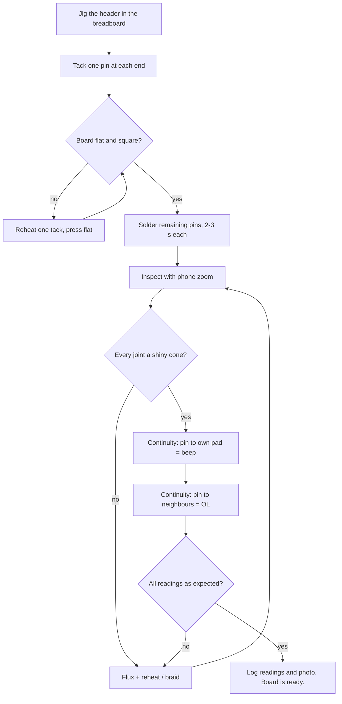

# 01.03 — Your workbench: tools, multimeter and first soldering

<!-- glance:start -->
<!-- generated by tools/build.py from curriculum/syllabus.yaml — edit the syllabus, not this block -->

| | |
|---|---|
| **Track** | Main path |
| **Difficulty** | Beginner |
| **Time** | 1 h |
| **Hardware** | Workbench tools (multimeter, soldering iron, crimper, screwdrivers) (stage 1) |
| **Software** | none |
| **Prerequisites** | [01.02 Stage 1 shopping list: buying the parts in Israel](01.02-buying-hardware-in-israel.md) |
| **Optional prerequisites** | [FE.03 Using a multimeter safely](../optional-foundations/electronics/FE.03-multimeter.md)<br>[FE.17 Soldering from zero](../optional-foundations/electronics/FE.17-soldering.md) |
| **Skip if** | You can measure voltage and continuity and solder header pins cleanly. |

<!-- glance:end -->

## What you will learn

- Set up a safe workbench with separate zones for soldering, electronics and battery charging.
- Use a multimeter for the three measurements module 01 depends on: DC voltage, continuity and resistance, and know which measurement never to make on a battery.
- Solder straight, reliable header pins onto the DRV8874 carriers (and a headerless Pico 2 or breakout boards), using a breadboard as a jig.
- Verify every joint with a continuity and bridge check before anything gets power, and log the readings.
- Recognise good and bad joints and fix the bad ones.

## Why it matters

From 01.07 on, every hardware step in this course follows the same pattern: **measure, compare with the expected
value, then connect**. A multimeter reading is to hardware what a failing test is to code: cheap, fast and far better
than finding out from smoke. Beginners who skip it discover reversed polarity by destroying a driver, and 12 V on a
"5 V" rail by destroying a Pi.

Soldering is the other skill module 01 can't avoid. The DRV8874 carriers, the INA219 and the VL53L1X arrive with loose
header strips, and the battery in 01.07 needs XT60 connectors and a BMS. Bad joints are the worst bugs in robotics:
invisible, intermittent and triggered by vibration, so a robot "sometimes" loses an encoder or resets on a bump. An hour
of deliberate practice here removes a whole category of future debugging.

<!-- prereqs:start -->
## Prerequisites

You need these first:

- [01.02 Stage 1 shopping list: buying the parts in Israel](01.02-buying-hardware-in-israel.md)

### Optional prerequisite links

New to any of these? Take the foundation lesson first; skip it if you already know it.

- [FE.03 Using a multimeter safely](../optional-foundations/electronics/FE.03-multimeter.md)
- [FE.17 Soldering from zero](../optional-foundations/electronics/FE.17-soldering.md)

Check your readiness: `python course.py why 01.03`
<!-- prereqs:end -->

## Concept

### The bench is your development environment

A good workbench is organised like a good dev environment: separate environments for separate risks, with nothing
from one leaking into another.

| Zone | Surface | What lives there | Rule |
|---|---|---|---|
| **Soldering** | Heat-resistant silicone mat or a ceramic tile | Iron in its stand, brass tip cleaner, solder, flux, helping hands | The iron is always in the stand or in your hand. Unplug it when you leave. |
| **Electronics** | Clean table, good light, a small tray per project | Multimeter, breadboard, boards, screws | No drinks. Power off before rewiring. |
| **Charging** | Ceramic tile or stone, **LiPo bag**, nothing flammable within 50 cm, visible from where you sit | Pack charger, the pack during charging | Never unattended, never overnight ([SAFETY.md](../SAFETY.md) rule 5). |

Put the charging zone on the opposite side of the bench from the soldering zone. A hot iron dropped on a charging pack
is the one accident you can design away completely.

### The multimeter as a debugger

A multimeter answers three questions module 01 asks constantly:

- **"Is it the voltage I think it is?"** (DC volts: pack 9.9–12.6 V, regulator 5.0 V, Pico 3.3 V.)
- **"Is this connected to that, and nothing else?"** (continuity: a joint conducts; two neighbouring pins don't.)
- **"How much resistance is there?"** (ohms: a resistor's value, a short circuit before first power-up.)

Current measurement is the fourth function, and in this module you'll avoid it: in current mode the meter is a short
circuit between its probes, so touching a battery in that mode is a dead short through the meter. The INA219 in 01.14
measures current safely. [FE.03](../optional-foundations/electronics/FE.03-multimeter.md) explains all four functions
in depth.

### Soldering is heat transfer

Solder is not glue. A joint forms when the **pin and the pad are both hot enough** for the molten solder to wet them
and bond with the metal. The iron's job is to deliver heat quickly; the solder should flow toward the heat, onto the
metal, not be melted on the iron tip and dripped onto a cold pin. Almost every bad joint is a heat-transfer failure:
too little heat (dull, lumpy, "cold"), too much time (burnt flux, lifted pad), or no flux (solder beads up instead of
flowing). [FE.17](../optional-foundations/electronics/FE.17-soldering.md) is the full foundation lesson with practice
drills; this lesson applies it to karmel's parts.

> [!TIP]
> **Ask your teacher:** "I'm about to solder my first header. Describe what a good joint looks like from the side, what
> a cold joint looks like, and what I should do in the first three seconds after touching the iron to the pin."

## Technical explanation

### Level 1 — The tools and when you first need them

| Tool | Used for | First needed |
|---|---|---|
| Multimeter (UT33A+ or DT-9205M) | Voltage, continuity, resistance | This lesson |
| 80 W adjustable iron + stand + brass cleaner | Headers now; XT60 and 18 AWG wire in 01.07 | This lesson |
| 63/37 solder 0.8 mm + flux pen | Every joint | This lesson |
| Flush cutters, safety glasses | Trimming leads (they fly) | This lesson |
| Helping hands | Holding wires and connectors | 01.07 |
| Wire strippers, heat shrink | Power wiring | 01.07 |
| Precision screwdrivers, hex keys 1.5–5 mm | Standoffs, brackets, hub set screws | 01.06 |
| Drill with 3 mm / 3.2 mm bits | Chassis plate holes | 01.06 |
| Hot glue gun | Strain relief, cable tie-downs | 01.06–01.07 |
| LiPo safety bag | Charging the pack | 01.07 |

### Level 2 — The multimeter, practically

**Probe sockets.** Black lead in **COM**, always. Red lead in **VΩ** (volts, ohms, continuity) for everything in this
module. The **A / mA** sockets are only for current; if the red lead is left there and you touch a battery, you short
it. Make "red back to VΩ" a reflex whenever you put the meter down.

**Setting the dial.** On a manual-ranging meter (DT-9205M), pick the smallest range *above* the expected value: the
20 V DC range for a 12.6 V pack, the 20 kΩ range for a 10 kΩ resistor. Auto-ranging meters (UT33A+) choose for you.
Continuity mode beeps below a threshold (typically 30–50 Ω) and shows the resistance.

**The measurements of module 01 and what to expect:**

| Measurement | Dial | Probes | Expected | If not |
|---|---|---|---|---|
| Meter self-test | Continuity | Tips touching | Beep, 0.0–1.0 Ω | Dirty tips or a broken lead |
| Meter self-test | Continuity | Tips apart | **OL** | Faulty meter |
| A 10 kΩ resistor (brown-black-orange) | Ω, 20 k | One tip per leg, fingers off | 9.5–10.5 kΩ | Wrong band reading or wrong range |
| A new 18650 cell | V DC, 20 V | Red on +, black on − | 3.3–4.2 V (new cells ship at ≈ 3.5–3.6 V) | Below 3.0 V: reject the cell |
| Soldered pin to its own signal | Continuity | Pin top → the matching edge pad or trace | Beep, < 1 Ω | Dry or cold joint |
| Neighbouring pins | Continuity | Two adjacent pins | **OL** (except pins the board connects, e.g. two GND pins) | Solder bridge |
| Pack voltage (01.07) | V DC, 20 V | XT60 contacts | 9.9–12.6 V, positive | Negative reading = reversed polarity |
| Regulator output (01.07) | V DC, 20 V | 5 V lead | 4.85–5.15 V | Don't connect the Pi |
| Pico 3V3 pin (01.05) | V DC, 20 V | Pin 36 → pin 38 | 3.25–3.35 V | Board fault or short on 3V3 |

> [!CAUTION]
> **Safety:** Measure batteries and cells **only in DC volts mode**. Never in ohms, continuity or current mode, and
> never with the red lead in the A/mA socket: in those modes the meter can short the cell, which can deliver tens of
> amps, melt the probe tip and start a fire. Do the cell measurement on the charging tile, one cell at a time, with the
> other cells still in their box.

**Reading "OL".** OL means "over limit": the value is larger than the range can show. In continuity or ohms mode that
means an open circuit, which is exactly what you want between two pins that must not be connected.

**Why fingers matter.** Your body is roughly 100 kΩ–1 MΩ between two hands. Holding both probe tips on a 10 kΩ
resistor with your fingers puts that in parallel: $10 \parallel 500 = 9.8$ kΩ. Harmless, but a 1 MΩ resistor reads
$1000 \parallel 500 = 333$ kΩ, a 67% error.

### Level 3 — The physics of a joint: why an 80 W iron

The heat needed to bring a joint to soldering temperature is

$$Q = m \cdot c \cdot \Delta T$$

with $m$ the mass of metal that must heat up, $c$ its specific heat (copper ≈ 385 J/(kg·K), brass ≈ 380) and
$\Delta T$ the temperature rise (from 25 °C to about 250 °C, so 225 K).

**A header pin** plus its pad and a little solder is about 0.1 g of copper:
$Q = 0.0001 \times 385 \times 225 = 8.7$ J. Even if only 4–5 W of the iron's power actually flows into the joint,
that's about 2 seconds. Any decent iron does this.

**An XT60 solder cup** (01.07) is about 1.5 g of brass plus 2 cm of 18 AWG copper wire:
$Q = 0.0015 \times 380 \times 225 + 13 = 141$ J. At 30 W of net heat flow that's 4.7 s; at the ≈ 5 W a cheap 30 W
unregulated iron manages once its tip cools on a big joint, it's **28 s**, long enough to melt the connector's plastic
and still leave a cold joint. That's why the tool list says 80 W with temperature control: it's not about a hotter
tip, it's about **recovering** heat fast into a large joint.

**Tip temperature.** 63/37 solder melts at 183 °C. Use **330–350 °C** for headers and **380–400 °C** for XT60 and
18 AWG wire. Hotter than that doesn't make joints better; it burns the flux before the solder flows and oxidises the
tip.

**Why flux.** Copper oxidises in air, and molten solder doesn't wet oxide. Flux chemically removes the oxide at soldering
temperature. The solder wire has a flux core; a flux pen adds more for rework, big joints and bridges.

### Level 4 — Soldering karmel's headers, step by step

**What gets headers in Stage 1:**

| Board | Pins to header | Why |
|---|---|---|
| 2× DRV8874 carriers (+ the spare) | The **logic pins** (EN/IN1, PH/IN2, SLEEP, PMODE, IMODE, CS, VREF, FAULT and the logic-side GND) | They plug into the breadboard next to the Pico (01.08) |
| Same carriers | **No headers** on the motor-power pins (VIN, VM, GND, OUT1, OUT2) | Up to ≈ 2.9 A flows here; breadboard contacts are rated around 1 A. You'll solder 20 AWG wires straight into these holes in 01.07. Check the silkscreen: if your carrier's layout puts a power pin in the logic row, leave that one un-headered too. |
| Pico 2 | Both 20-pin rows, if you bought it **without** headers | Breadboard use. (Piitel's version comes pre-soldered.) Skip the 3-pin debug header. |
| INA219, VL53L1X | The supplied header strips | I²C wiring in 01.13–01.14 |

> [!CAUTION]
> **Safety:** The iron tip is at 350 °C and looks exactly like it does when cold. Park it in its stand after every joint.
> Wear safety glasses: clipped leads fly, and flux can spit. Solder in a ventilated room with a window open or a fan
> blowing the fumes **away** from your face (the fumes are mostly flux, and they irritate eyes and lungs). With leaded
> solder, don't eat at the bench and wash your hands afterwards. Keep the battery cells and the charger out of the
> soldering zone. Rule 10 in [SAFETY.md](../SAFETY.md).

**The breadboard jig (headers go on straight, first time):**

1. Break the header strip to length with pliers (or cut it with flush cutters through a pin, losing one pin). For a
   DRV8874 carrier, count the pins you decided to header.
2. Push the strip's **long ends** into the breadboard, in the same row pattern as the board's holes.
3. Drop the board onto the short ends, **component side up**. It now sits flat and square.
4. Heat the iron to 330–350 °C. Wipe the tip on the brass cleaner and add a tiny drop of fresh solder to "tin" it.
5. Solder **one pin at one end**: touch the tip to both pin and pad at once, count "one", feed solder into the joint
   (not onto the tip) for about one second until it flows around the pin, remove the solder, then the iron. Total
   2–3 seconds.
6. Solder **one pin at the other end**. Check that the board is flat. If it isn't, reheat one joint and press the board
   down (not with your finger over the hot pin: use the tip of a screwdriver).
7. Solder all remaining pins. Ground pins connected to a copper pour take a second longer.
8. Let it cool 10 seconds, pull the board out of the breadboard, and inspect.

**What a good joint looks like:** a small shiny cone ("volcano") from the pad up the pin, concave sides, the pad's
outline visible under the solder, no hole around the pin. A **cold joint** is dull, grainy or lumpy. A **ball** that
sits on top of the pad without spreading means the pad was too cold. A **bridge** is a solder web between two pins.
Use your phone camera zoomed in as a magnifier; its photos also go in your build log.

**Fixes:**

| Defect | Fix |
|---|---|
| Cold / dull / grainy | Flux, then reheat with a clean tinned tip until it flows and turns shiny |
| Too little solder (pad not covered) | Reheat and add a little solder |
| Blob (too much) | Flux, reheat, and let the tip pull the excess away; or desoldering braid |
| Bridge | Flux, then drag a clean tip from between the pins outwards; braid if it persists |
| Lifted pad | Stop; the board may still work if the trace is intact. Ask your teacher before continuing. |

**Verify every board** before it goes near power, with the checklist runner (below) and this sequence:

1. **Each pin to its own signal** (continuity, beep). On the Pico, test each header pin against its castellated edge pad
   next to it. On the carriers, test each header pin against the pad on the opposite side of the board.
2. **Each pin to both neighbours** (continuity, **OL**). Two GND pins beeping to each other is correct; anything else
   beeping is a bridge.
3. **Power pins to GND** on each breakout (3V3/VCC/VIN to GND): no beep (a reading of a few kΩ or more that climbs as
   the board's capacitors charge is normal).
4. Photograph the joints and log the readings.

## Diagram

**Bench layout:**

```text
  ┌──────────────────────────────────────────────────────────────────────────┐
  │  WINDOW / FAN  ← fumes blown away from you                               │
  │                                                                          │
  │  SOLDERING ZONE (silicone mat)     ELECTRONICS ZONE        CHARGING ZONE │
  │  ┌────────────────────┐            ┌─────────────────┐   (ceramic tile)  │
  │  │ iron in stand      │            │ multimeter      │   ┌────────────┐  │
  │  │ brass cleaner      │            │ breadboard      │   │ LiPo bag   │  │
  │  │ solder, flux pen   │            │ parts trays     │   │ + charger  │  │
  │  │ helping hands      │            │ build log       │   └────────────┘  │
  │  └────────────────────┘            └─────────────────┘   ≥ 50 cm from    │
  │         glasses on                   no drinks            anything that  │
  │                                                           burns          │
  │                         YOU (chair)                                      │
  └──────────────────────────────────────────────────────────────────────────┘
   iron cord routed away from the charging zone · power strip with a switch within reach
```

**The header jig, side view:**

```text
          board (component side up)            iron tip touches pin AND pad
     ─────────────████████████████──────             ╲
                 │  │  │  │  │  │    ← short pin ends   ╲●  solder fed here, flows
     ════════════╪══╪══╪══╪══╪══╪════ plastic header      into the joint
                 │  │  │  │  │  │    ← long pin ends
     ┌───────────┴──┴──┴──┴──┴──┴───────────┐
     │  breadboard holds the pins vertical  │
     └──────────────────────────────────────┘
```

**Joint cross-sections:**

```text
   GOOD                    COLD / DRY               BALL (pad too cold)       BRIDGE
     │                        │                         │                    │     │
    ╱│╲   shiny cone,       ░▒│▒░  dull, grainy,       (●)  sits on top,     │▓▓▓▓▓│  solder
   ╱ │ ╲  concave sides    ░▒▒│▒▒░ gap around pin      ─┴─  doesn't wet     ─┴─   ─┴─ joins
  ───┴───  pad covered     ───┴───                     pad    the pad        pad   pad  two pins
```

**Solder-and-verify loop:**



## Code

`checklist.py` is a measure-before-you-connect checklist runner: it shows each step (meter setting, probe placement,
expected window), asks for your reading, stops at the first reading outside the window, and appends everything to
`bench_log.csv`. Lesson [01.07](01.07-power-system.md) imports it for the power-system checklist, so save it in a
folder you'll keep, for example `~/karmel-bench/checklist.py` on your laptop. Python 3.10+, no packages.

```python
"""01.03 — a measure-before-you-connect checklist runner with a log file.

Hardware work fails the same way software deploys fail: someone skips a step "just this once".
This runner makes the steps explicit, compares every reading with its expected window, stops at
the first reading outside it, and appends everything to a CSV log you can look at later.

    python checklist.py                   # the 01.03 bench checks, interactive
    python checklist.py --demo            # replay recorded example readings (no hardware)

Lesson 01.07 imports this file for the power-system checklist.
"""
from __future__ import annotations

import argparse
import csv
import datetime as dt
from dataclasses import dataclass
from pathlib import Path
from typing import Callable, Iterable


@dataclass(frozen=True)
class Step:
    name: str
    meter: str               # dial setting, e.g. "V DC (20 V range)" or "continuity"
    probes: str              # "red on X, black on Y"
    low: float               # expected window, in the unit below; for continuity use ohms
    high: float
    unit: str
    why: str = ""

    def judge(self, value: float) -> bool:
        return self.low <= value <= self.high


OL = float("inf")            # type "OL" when the meter shows overload / open circuit


def parse_reading(text: str) -> float:
    text = text.strip().upper()
    if text in ("OL", "O.L", "OPEN", "INF"):
        return OL
    return float(text.replace(",", "."))


def run(steps: Iterable[Step], ask: Callable[[str], str], log_path: Path, title: str) -> bool:
    """Walk through the steps; return True if every reading was inside its window."""
    new_file = not log_path.exists()
    with log_path.open("a", newline="", encoding="utf-8") as fh:
        log = csv.writer(fh)
        if new_file:
            log.writerow(["time", "checklist", "step", "reading", "unit", "low", "high", "result"])
        for number, step in enumerate(steps, start=1):
            print(f"\n[{number}] {step.name}")
            print(f"    meter : {step.meter}")
            print(f"    probes: {step.probes}")
            if step.low == OL:
                expect = "OL (open circuit)"
            else:
                expect = f"{step.low:g} .. {'OL' if step.high == OL else f'{step.high:g}'} {step.unit}"
            print(f"    expect: {expect}" + (f"   ({step.why})" if step.why else ""))
            while True:
                try:
                    value = parse_reading(ask("    reading (number, or OL): "))
                    break
                except ValueError:
                    print("    please type a number such as 3.29, or OL")
            ok = step.judge(value)
            log.writerow([dt.datetime.now().isoformat(timespec="seconds"), title, step.name,
                          value, step.unit, step.low, step.high, "PASS" if ok else "STOP"])
            print("    PASS" if ok else "    STOP: outside the expected window. Do not continue - "
                  "power off, find out why (Troubleshooting section), then start again.")
            if not ok:
                return False
    print("\nAll readings inside their windows.")
    return True


BENCH_STEPS = [
    Step("Meter self-test: probes touching", "continuity / lowest ohms range", "red and black tips pressed together",
         0.0, 1.0, "ohm", "above 1 ohm: dirty tips or a probe lead is failing"),
    Step("Meter self-test: probes apart", "continuity / lowest ohms range", "tips not touching anything",
         OL, OL, "ohm", "anything but OL means the meter or leads are faulty"),
    Step("Known resistor, 10 kOhm (brown-black-orange)", "ohms, 20 k range", "one probe on each leg, fingers off the metal",
         9_500, 10_500, "ohm", "5 % tolerance"),
    Step("One new 18650 cell, resting voltage", "V DC, 20 V range (NEVER ohms or amps on a cell)",
         "red on the + cap, black on the - end, cell lying on the mat",
         3.30, 4.20, "V", "new cells ship at about 3.5-3.6 V; below 3.0 V means reject the cell"),
    Step("Soldered header: pin to its own pad (repeat per pin)", "continuity", "one tip on the header pin, the other on the same signal's edge pad or test point",
         0.0, 1.0, "ohm", "a joint that does not beep is dry or cold"),
    Step("Soldered header: pin to neighbouring pin (repeat per pair)", "continuity", "tips on two adjacent pins",
         OL, OL, "ohm", "a beep here is a solder bridge (unless the board itself connects them, e.g. two GND pins)"),
]


def main() -> int:
    parser = argparse.ArgumentParser(description=__doc__, formatter_class=argparse.RawDescriptionHelpFormatter)
    parser.add_argument("--log", type=Path, default=Path("bench_log.csv"))
    parser.add_argument("--demo", action="store_true", help="replay example readings instead of asking")
    args = parser.parse_args()
    if args.demo:
        readings = iter(["0.2", "OL", "9870", "3.56", "0.3", "OL"])
        def ask(prompt: str) -> str:
            value = next(readings)
            print(prompt + value)
            return value
    else:
        ask = input
    return 0 if run(BENCH_STEPS, ask, args.log, "01.03 bench") else 1


if __name__ == "__main__":
    raise SystemExit(main())
```

Run: `python checklist.py --demo` to see it work, then `python checklist.py` at the bench. Open `bench_log.csv` in any
spreadsheet afterwards.

Once your Pico runs MicroPython (01.05), [FE.17](../optional-foundations/electronics/FE.17-soldering.md) has a second
tool, `solder_check.py`, that finds bridges on a freshly soldered Pico header from the Pico itself.

## Exercise

### Exercise 01.03-E1 — Set up the bench and prove the meter `[hardware]`

Hardware: `tools` (multimeter, a 10 kΩ resistor), one Samsung 35E cell from `robot-base`.

1. Arrange the three zones. Put the charging tile and LiPo bag where you can see them from your chair.
2. Check the meter's battery and, if your meter allows, its current fuse ([FE.03](../optional-foundations/electronics/FE.03-multimeter.md)).
3. Run `python checklist.py` and do steps 1–4 for real. For step 4, measure **all four** cells (one at a time) and write
   down each voltage; the runner checks only the window, so compare the four by hand.
4. Keep `bench_log.csv`.

### Exercise 01.03-E2 — Twenty practice joints `[hardware]`

Hardware: `tools`, a spare header strip, a scrap of perfboard (or the spare DRV8874 carrier's un-headered pins).

Do [FE.17-E1](../optional-foundations/electronics/FE.17-soldering.md) if you've never soldered: twenty joints and
five removals. Otherwise, solder ten pins of a header strip into perfboard, photograph them, and grade each joint as
good / cold / ball / bridge before fixing the bad ones.

### Exercise 01.03-E3 — Headers on karmel's boards `[hardware]`

Hardware: `tools`, `robot-base` (3× DRV8874 carriers, INA219, VL53L1X; Pico 2 only if headerless).

1. Decide, from each DRV8874 carrier's silkscreen, which pins get headers (logic) and which stay bare (VIN, VM, GND on
   the motor side, OUT1, OUT2). Write the list down before you break the strip.
2. Solder the headers with the breadboard jig. Start with the **spare** carrier: it's your practice board.
3. Solder the INA219 and VL53L1X header strips.

### Exercise 01.03-E4 — Verify and log `[hardware]`

Hardware: `tools`, the boards from E3.

For each board: run checklist steps 5 and 6 for **every** pin and every neighbouring pair (edit `BENCH_STEPS` or just
repeat the steps), and check VCC/VIN to GND on each breakout. Record the photos and readings.

### Exercise 01.03-E5 — Predict the meter `[predict]`

Hardware: none (predict first; only item 1 is safe to try).

Predict the display for each case before looking at the expected result:

1. Ohms mode, measuring a 1 MΩ resistor while holding both leads between your fingers.
2. DC volts mode, 20 V range, red on the cell's **negative** end and black on the positive cap.
3. Continuity mode, probes across a DRV8874 carrier's VIN and GND pins (board unpowered, a 470 µF capacitor already
   soldered across them).
4. The red lead left in the **10 A** socket, dial on V DC, probes touched to a charged 18650 cell. (**Don't try this.**)

## Expected result

- **01.03-E1:** Checklist steps 1–4 PASS. Typical readings: 0.1–0.3 Ω with tips touching, OL apart, 9.8–10.1 kΩ for a
  5% 10 kΩ resistor, and 3.4–3.7 V for new 35E cells, all four within about 0.05 V of each other. A cell more than
  0.1 V away from the others, or below 3.0 V, goes back to the store (01.02).
- **01.03-E2:** At least 16 of 20 joints graded "good" on the first try by the end; every bad one fixed. Photos show
  shiny cones with visible pad outlines.
- **01.03-E3:** Carriers with a straight logic header that plugs into the breadboard without force, bare power holes
  still open (no solder filling them), INA219 and VL53L1X with straight headers. The spare carrier may look worse;
  that's what it's for.
- **01.03-E4:** Every pin beeps (< 1 Ω) to its own pad; every neighbouring pair reads OL except board-connected pairs
  (e.g. two GND pins); VCC/VIN to GND reads kΩ or more, often climbing, never a beep. A log line per check.
- **01.03-E5:** (1) Around 0.1–0.5 MΩ, well below 1 MΩ: your body's resistance is in parallel. (2) **−3.6 V** (a minus
  sign): nothing is harmed; the sign tells you the probes are reversed, which is exactly how you'll catch reversed
  polarity in 01.07. (3) A brief beep or a low reading that **rises** over a second or two toward kΩ/OL: the meter's
  small test current charges the capacitor. A reading that stays below ~10 Ω is a short. (4) The 10 A socket is a
  ≈ 0.01 Ω shunt, so this is a short circuit across the cell: hundreds of amps limited only by the cell, sparks, a
  blown meter fuse at best and a welded probe tip or burn at worst. That's why "red back to VΩ" is a reflex.

## Troubleshooting

### Symptom: the meter shows nonsense or nothing

1. **Is the display showing a low-battery icon?** Replace the 9 V / AAA battery first. Low meter batteries give wrong readings.
2. **Probe sockets:** black in COM, red in VΩ. A red lead in A/mA reads ≈ 0 V everywhere.
3. **Dial mode:** AC volts on a DC source reads 0 or garbage; the ohms range too low reads OL on everything.
4. **Probe self-test:** tips together should beep. If not, a lead is broken inside; wiggle it while touching the tips.
5. **Still wrong:** measure a known source (a fresh cell ≈ 3.5 V) to separate "meter broken" from "circuit unexpected".

### Symptom: two neighbouring pins beep

1. **Is it supposed to?** Check the board's pinout: two GND pins, or pins joined on the board, beep legitimately.
2. **Look** with the phone zoom between the pins, on **both** sides of the board.
3. **Fix** with flux and a clean tip dragged outward, or braid. Re-test.
4. **Still beeps with no visible bridge?** Check under the plastic header strip: flux residue or a solder whisker. Clean
   with isopropyl alcohol and a brush, dry, re-test.

### Symptom: solder won't flow, balls up, or the joint looks dull

Work through heat transfer in order: (1) **tip oxidised?** A black, non-shiny tip doesn't transfer heat; clean on brass
and re-tin immediately. (2) **Tip touching both pin and pad?** Touch the side of the tip to both. (3) **Flux?** Add flux
from the pen. (4) **Temperature?** 330–350 °C for headers; ground pins on copper pours need 10–20 °C more or a larger
tip. (5) **Iron too weak?** An unregulated 30 W iron will struggle on ground pins and fail on XT60s (Level 3).

### Symptom: the tip turns black within minutes

Too hot, and/or left un-tinned. Lower to 330–350 °C, always leave a blob of solder on the tip when parking it, clean on
brass (not a dripping wet sponge, which shocks the tip), and turn the iron off between sessions.

### Symptom: the header came out crooked

Reheat one end joint while gently pressing the board flat with a screwdriver tip, let it cool, then the other end. If
several pins are already soldered, flux all of them and work along the row. Don't force a crooked header into the
breadboard: it bends breadboard contacts and makes intermittent connections later.

## Common mistakes

- **Melting solder on the tip and dabbing it onto the pin.** The flux burns off on the tip and the pin never gets hot:
  cold joint. Heat the joint, feed solder into it.
- **Holding the iron on a joint for 10 seconds "to be sure".** Pads lift and parts overheat. If it doesn't flow in
  3 seconds, stop, find the heat-transfer problem, try again.
- **Soldering headers onto motor-power pins and running motor current through a breadboard.** Breadboard contacts
  are rated around 1 A and loosen with heat. Solder power wires directly (01.07).
- **Leaving the red probe in the A socket.** The next voltage measurement on a battery is a short circuit.
- **Measuring a cell in ohms or continuity mode.** Wrong reading at best, damaged meter or cell at worst. Batteries get
  DC volts only.
- **No verification after soldering.** A bridge found with a meter costs a minute; the same bridge found by powering
  up a DRV8874 costs a driver.
- **A charging pack next to the soldering zone.** Separate the zones before the first time you need them.

## Knowledge check

1. Which sockets do the probes go in for measuring the pack voltage, and what single mistake turns that measurement into a short circuit?
   <details><summary>Answer</summary>

   Black in COM, red in VΩ, dial on DC volts (20 V range). Leaving the red lead in the A/mA socket (or the dial on a
   current range) makes the meter a near-zero-ohm path across the pack.
   </details>

2. What does "OL" mean in continuity mode, and when is it the reading you want?
   <details><summary>Answer</summary>

   Over limit: the resistance is higher than the range can display, i.e. no connection. You want OL between neighbouring
   pins that must not be connected (no bridge), and with the probe tips apart during the self-test.
   </details>

3. An XT60 solder cup plus a short 18 AWG lead needs about 141 J to reach soldering temperature. How long does that take at 30 W of net heat flow, and why does a 30 W unregulated iron fail at it?
   <details><summary>Answer</summary>

   $141 / 30 = 4.7$ s. A 30 W iron's tip cools as soon as it touches a big joint and, with no temperature regulation,
   it delivers only a few watts net, so it can take tens of seconds, melting the plastic and still producing a cold joint.
   </details>

4. Predict: you measure a cell with the red probe on its negative end and the black probe on the positive cap. What does the meter show, and is anything damaged?
   <details><summary>Answer</summary>

   About −3.6 V. Nothing is damaged in DC volts mode; the minus sign just says the probes are reversed relative to the
   source. You'll use exactly this to detect reversed polarity on the pack in 01.07.
   </details>

5. Why do the DRV8874 carriers get headers only on the logic pins in karmel's build?
   <details><summary>Answer</summary>

   The logic pins carry milliamps and plug into the breadboard next to the Pico. The motor-power pins carry up to ≈ 2.9 A
   (the carrier's current limit with SLEEP at 3.3 V), far more than breadboard contacts tolerate, so they get 20 AWG
   wires soldered directly in 01.07.
   </details>

6. Debugging: after soldering the INA219, continuity between its VCC and GND pins gives a short beep, then the reading climbs to several kΩ and then OL. Short circuit or not?
   <details><summary>Answer</summary>

   Not a short. The board's decoupling capacitor between VCC and GND charges from the meter's test current, so the
   reading starts low and rises. A real short stays below a few ohms and keeps beeping.
   </details>

7. What does a good through-hole joint look like, and name the most likely cause of a joint that is a round ball sitting on the pad?
   <details><summary>Answer</summary>

   A small, shiny, concave cone from pad to pin, pad outline visible, no gap around the pin. A ball that doesn't
   spread means the pad (or pin) wasn't hot enough: the solder melted but didn't wet the metal. Add flux, heat the pad
   and pin together, and let it flow.
   </details>

## Practical challenge

Build **a complete, verified logic-board set for karmel**: both DRV8874 carriers plus the spare, the INA219 and the
VL53L1X with headers (and the Pico 2 if headerless), plus a documented bench.

**Acceptance criteria:**

1. Every header is straight and plugs into the breadboard without force; the motor-power holes are untouched.
2. `bench_log.csv` contains a PASS for every pin-to-pad and every neighbour check on every board (dozens of lines), and
   the four cell voltages within 0.05 V of each other.
3. A photo per board side where every joint is a shiny cone; no rework marks left unaddressed.
4. Your bench has the three zones, and the charging zone passes the "nothing flammable within 50 cm" test.
5. Your AI teacher, shown the photos, can't find a joint to reject.

## You can skip this if…

You can measure voltage and continuity and solder header pins cleanly: show one board you soldered where every joint is
a shiny cone and there are no bridges, and answer knowledge-check questions 1, 3 and 6 correctly without looking.
You still need the three bench zones before 01.07.

`python course.py skip 01.03 --reason "I solder and use a multimeter routinely"`

## Go deeper

- [FE.03 The multimeter](../optional-foundations/electronics/FE.03-multimeter.md) and [FE.17 Soldering from zero](../optional-foundations/electronics/FE.17-soldering.md) — the foundation lessons behind this one, with more drills.
- Adafruit Guide to Excellent Soldering: https://learn.adafruit.com/adafruit-guide-excellent-soldering — the best photo guide to good and bad joints and how to fix each.
- SparkFun, How to Solder: Through-Hole Soldering: https://learn.sparkfun.com/tutorials/how-to-solder-through-hole-soldering — tools, tip care and technique, with close-up photos.
- SparkFun, How to Use a Multimeter: https://learn.sparkfun.com/tutorials/how-to-use-a-multimeter — continuity, voltage and resistance with clear probe placement.
- Pololu DRV8874 carrier: https://www.pololu.com/product/4035 — the pinout picture you'll use to decide which pins get headers.
- Raspberry Pi Pico 2 datasheet: https://datasheets.raspberrypi.com/pico/pico-2-datasheet.pdf — the pinout and castellated pads you test against.

## Progress checkpoint

- [ ] My bench has separate soldering, electronics and charging zones.
- [ ] I can measure DC voltage, continuity and resistance, and I never measure a battery in any other mode.
- [ ] I soldered straight headers onto the DRV8874 carriers and breakout boards using a breadboard jig.
- [ ] Every joint passed a pin-to-pad and neighbour-bridge check, logged in `bench_log.csv`.
- [ ] I can recognise and fix cold joints, balls and bridges.

`python course.py complete 01.03` (exercises done) · `python course.py master 01.03`
(challenge done) · `python course.py struggle 01.03 "what was hard"`

Next: [01.04 — Set up the Raspberry Pi 5 headless (OS, SSH, updates)](01.04-raspberry-pi-setup.md). (01.06 mechanical
assembly also only needs this lesson, so you can do it in parallel with 01.04–01.05.)
