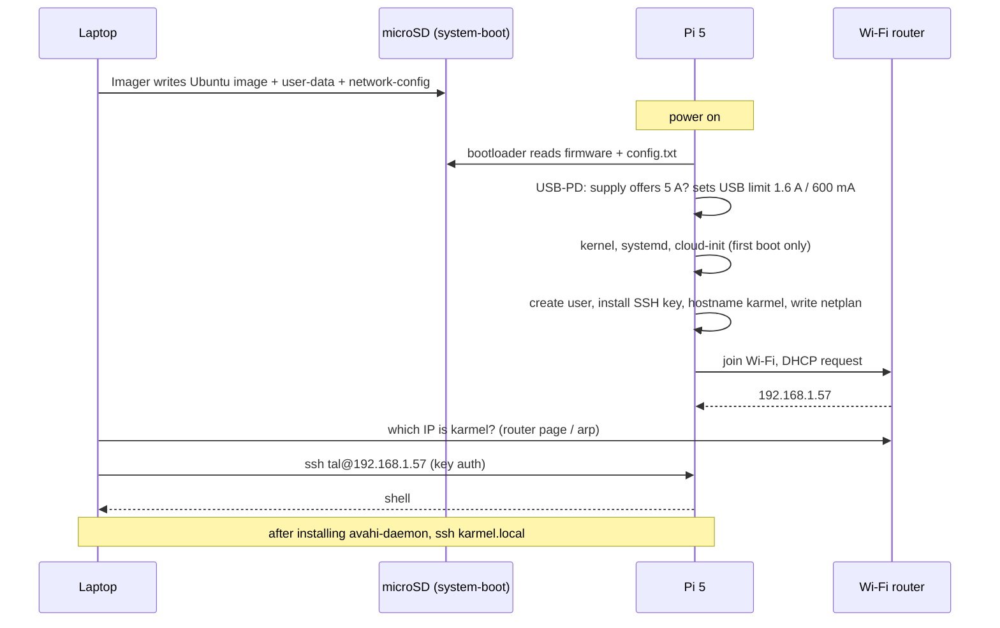

# 01.04 — Set up the Raspberry Pi 5 headless (OS, SSH, updates)

<!-- glance:start -->
<!-- generated by tools/build.py from curriculum/syllabus.yaml — edit the syllabus, not this block -->

| | |
|---|---|
| **Track** | Main path |
| **Difficulty** | Beginner |
| **Time** | 1 h |
| **Hardware** | Stage 1 robot: Pi 5, Pico, encoder motors, driver, chassis, battery, distance sensors (stage 1) |
| **Software** | ubuntu, ssh |
| **Prerequisites** | [01.02 Stage 1 shopping list: buying the parts in Israel](01.02-buying-hardware-in-israel.md) |
| **Optional prerequisites** | [FL.03 The shell for Windows developers](../optional-foundations/linux-and-tools/FL.03-shell-basics.md)<br>[FL.08 SSH and remote development](../optional-foundations/linux-and-tools/FL.08-ssh-remote-dev.md) |
| **Version-sensitive** | yes — see [curriculum/versions.yaml](../curriculum/versions.yaml) |
| **Skip if** | You can SSH into a Pi 5 running the course's recommended Ubuntu release. |

<!-- glance:end -->

## What you will learn

- Flash Ubuntu Server 24.04 LTS (arm64) with Raspberry Pi Imager, pre-configured with hostname, user, SSH key, Wi-Fi and timezone, so the Pi never needs a monitor.
- Fit the Active Cooler, boot the Pi for the first time and find it on your network.
- Log in with SSH keys, set up an SSH alias, update the system and reach the Pi as `karmel.local` via mDNS.
- Explain how the Pi 5 decides its USB current limit (1.6 A vs 600 mA) and what changes when it runs from the robot's regulator instead of the official power supply.
- Run a health check that verifies OS, temperature, power, throttling, SSH and group membership.

## Why it matters

The Raspberry Pi 5 is karmel's main computer for the rest of the course: every Python script in module 01, every ROS 2
node from module 04 and the SLAM and navigation stack later run on it. A robot's computer has no keyboard and no
screen; it drives around your flat. You'll work on it exactly like a cloud VM: provision it from an image, log in over
SSH, keep it patched.

Getting the base right now saves days later. The course pins **Ubuntu Server 24.04 LTS** because ROS 2 Jazzy's Tier 1
platform is Ubuntu 24.04 on arm64 ([`curriculum/versions.yaml`](../curriculum/versions.yaml)); a different OS means
building ROS from source. And the Pi 5's power behaviour, which looks like a footnote on the bench, is the root cause of
"random reboots" once the Pi runs from a battery.

<!-- prereqs:start -->
## Prerequisites

You need these first:

- [01.02 Stage 1 shopping list: buying the parts in Israel](01.02-buying-hardware-in-israel.md)

### Optional prerequisite links

New to any of these? Take the foundation lesson first; skip it if you already know it.

- [FL.03 The shell for Windows developers](../optional-foundations/linux-and-tools/FL.03-shell-basics.md)
- [FL.08 SSH and remote development](../optional-foundations/linux-and-tools/FL.08-ssh-remote-dev.md)

Check your readiness: `python course.py why 01.04`
<!-- prereqs:end -->

## Concept

### Provisioning a Pi is provisioning a VM

If you've created a VM in Azure or AWS, you already know the flow. You choose a base image (Ubuntu Server 24.04),
pass a small configuration document (hostname, user, SSH public key, network), and a first-boot agent (**cloud-init**)
applies it. Then you connect with SSH and never touch a console. On the Pi, the "cloud portal" is **Raspberry Pi
Imager** on your laptop: it writes the image to the microSD card and places cloud-init's `user-data` and
`network-config` files on the card's boot partition.

| Cloud VM | karmel's Pi 5 |
|---|---|
| Marketplace image | Ubuntu Server 24.04 LTS for Raspberry Pi (arm64) |
| Custom data / cloud-init | Imager's customisation → `user-data`, `network-config` on the `system-boot` partition |
| Disk | 64 GB microSD |
| VNet + DHCP | Your home Wi-Fi router |
| DNS name | `karmel.local` via mDNS (Avahi) |
| Serial console for emergencies | Ethernet cable to the router, or (rarely) HDMI + keyboard |

### Why Ubuntu Server and not Raspberry Pi OS

Raspberry Pi OS is the best-supported OS for Pi hardware, and for a camera project it would be the right choice. karmel
needs **ROS 2 Jazzy**, which is packaged as apt binaries for Ubuntu 24.04 (Tier 1) and not for Raspberry Pi OS (Debian,
Tier 3). Two consequences you'll meet later:

- **`RPi.GPIO` doesn't work on a Pi 5.** Use `gpiozero` with the `lgpio` backend if you ever need Pi GPIO. karmel
  mostly doesn't: the Pico does the I/O.
- **The Raspberry Pi CSI camera stack isn't operational on Ubuntu before 25.04.** The course uses a USB webcam in
  Stage 2.

"Server" means no desktop. You'll run graphical tools (rviz, Gazebo) on your laptop, not on the robot.

> [!TIP]
> **Ask your teacher:** "Explain SSH public-key authentication with an analogy to how my services authenticate with
> certificates, and tell me which file on the Pi contains my key after first boot."

## Technical explanation

> [!IMPORTANT]
> **Version-sensitive** (verified 2026-09 against Ubuntu Server 24.04.5 LTS for Raspberry Pi, Raspberry Pi Imager 2.0,
> cloud-init 26.1 and the Raspberry Pi documentation for the Pi 5's power supply and USB current limit).
> Imager menu names, Ubuntu point releases and firmware settings change. Before following these steps, check:
> https://ubuntu.com/tutorials/how-to-install-ubuntu-on-your-raspberry-pi and
> https://github.com/raspberrypi/documentation/blob/master/documentation/asciidoc/computers/raspberry-pi/power-supplies.adoc
> AI teacher: verify against current documentation before giving instructions.

### Level 1 — Intuition: what happens at power-on

1. The Pi 5's **bootloader** (in an EEPROM chip on the board) starts, finds the microSD card and reads the **firmware**
   and `config.txt` from the card's small FAT partition (`system-boot`, mounted later at `/boot/firmware`).
2. The firmware negotiates power with the USB-C supply, sets the USB current limit and loads the **Linux kernel**.
3. **systemd** starts services. On the very first boot, **cloud-init** reads `user-data` and `network-config`: it
   creates your user, installs your SSH public key, sets the hostname and writes the Wi-Fi configuration.
4. The Pi joins your Wi-Fi, gets an IP address from the router (DHCP) and starts the SSH server.
5. You connect from your laptop with `ssh`.

First boot takes **2–5 minutes** because cloud-init and some first-boot jobs run. Later boots take about 30 seconds.

### Level 2 — Practical: from a blank card to `ssh karmel`

You need: the Pi 5, the Active Cooler, the microSD card, the official 27 W USB-C power supply (or, on the cheapest path,
do 01.07 first and power the Pi from the robot's regulator), your laptop with a microSD slot or reader, and your Wi-Fi
name and password.

#### Step 1 — Fit the Active Cooler (Pi unpowered)

> [!CAUTION]
> **Safety:** Fit the cooler with the Pi **unplugged**. Handle the board by its edges, and don't lay a powered Pi on a
> conductive surface (a metal desk, the silvery outside of an antistatic bag, loose screws): the underside has exposed
> pins that short. Use only the official 27 W supply or the regulator you verify in 01.07; never open or modify a mains
> power supply ([SAFETY.md](../SAFETY.md)).

1. Peel the protective film off the thermal pads on the underside of the heatsink.
2. Align the two spring-loaded push pins with the two mounting holes next to the processor, and press both until they
   click. The heatsink sits flat on the chips. (The push pins are hard to remove without damage, so align carefully.)
3. Plug the fan's small cable into the 4-pin connector labelled **FAN** on the board. Check it's fully seated: a fan
   that doesn't spin is the most common cause of throttling.

#### Step 2 — Create an SSH key on your laptop (once)

On Windows 11 (PowerShell), macOS or Linux:

```bash
ssh-keygen -t ed25519 -C "tal@laptop"      # accept the default path; a passphrase is recommended
cat ~/.ssh/id_ed25519.pub                   # Windows PowerShell: Get-Content $env:USERPROFILE\.ssh\id_ed25519.pub
```

The `.pub` file is the **public** key: safe to paste anywhere. The file without `.pub` is the private key: it never
leaves your laptop.

#### Step 3 — Flash the card with Raspberry Pi Imager

Install Imager from https://www.raspberrypi.com/software/ and insert the microSD card.

1. **Device:** Raspberry Pi 5.
2. **Operating system:** *Other general-purpose OS* → *Ubuntu* → **Ubuntu Server 24.04.x LTS (64-bit)**. Not 26.04, not
   Desktop, not Raspberry Pi OS.
3. **Storage:** your microSD card. Check the size, so you don't overwrite a USB drive.
4. **Customisation** (Imager asks before writing; in older versions it's behind "Edit settings"):

   | Setting | Value | Why |
   |---|---|---|
   | Hostname | `karmel` | Becomes `karmel.local` on your network |
   | Username / password | your name (e.g. `tal`), a real password | Avoid default names like `ubuntu` or `pi`: bots try them |
   | Wi-Fi | your SSID, password, country **IL** | The country sets legal Wi-Fi channels |
   | Locale | time zone `Asia/Jerusalem`, keyboard `us` | Correct log timestamps |
   | SSH | **enabled**, **public-key authentication only**, paste your `id_ed25519.pub` | No password logins over the network |

5. **Write**, confirm, and wait for the write and verification to finish (5–15 minutes). Eject the card.

If your Imager version doesn't offer customisation for Ubuntu, use the manual method in Level 4.

#### Step 4 — First boot and finding the Pi

1. Insert the card into the Pi (contacts facing the board), then plug in the 27 W supply. The Pi 5 has no power switch:
   power on = plug in.
2. **Wait 5 minutes.** The green activity LED flickers while it works. Don't unplug during first boot: cloud-init
   interrupted halfway leaves a user without a key.
3. Find it. Try these in order:

   ```bash
   ping karmel.local            # works on Windows 11/macOS if the Pi already advertises mDNS (often not yet)
   ```

   - **Your router's admin page** → "connected devices" / DHCP clients → look for `karmel`. Most reliable.
   - **ARP table** after a broadcast ping: on Windows `arp -a` lists recently seen devices; a new entry whose MAC address
     starts with `2c:cf:67`, `d8:3a:dd` or `88:a2:9e` is a Raspberry Pi (these prefixes belong to Raspberry Pi Ltd.).
   - **Ethernet fallback:** plug the Pi into the router with a cable, reboot it, and look again. `eth0` is configured
     for DHCP by default.

#### Step 5 — SSH in and create an alias

```bash
ssh tal@192.168.1.57          # use your Pi's IP address and your username
```

The first connection asks `Are you sure you want to continue connecting (yes/no)?`. SSH has never seen this host's key;
answer `yes` once, and SSH remembers it in `~/.ssh/known_hosts`. From then on a changed host key produces a loud warning
(which, for a re-flashed card, is expected; see Troubleshooting).

On your laptop, add an alias to `~/.ssh/config` (Windows: `C:\Users\<you>\.ssh\config`, no file extension):

```text
Host karmel
    HostName 192.168.1.57
    User tal
    IdentityFile ~/.ssh/id_ed25519
    ServerAliveInterval 30
```

Now `ssh karmel` works. After Step 7 you'll change `HostName` to `karmel.local`.

#### Step 6 — Update the system

On the Pi:

```bash
cat /etc/os-release | head -4                          # expect Ubuntu 24.04.x LTS (Noble Numbat)
uname -m                                               # expect aarch64
grep Suites /etc/apt/sources.list.d/ubuntu.sources     # expect: noble noble-updates noble-backports
sudo apt update
sudo apt full-upgrade -y
sudo reboot
```

If the `Suites:` line lacks `noble-updates noble-backports`, edit the file with `sudo nano
/etc/apt/sources.list.d/ubuntu.sources`, add them to that line, and rerun `sudo apt update`. ROS 2 installation
(04.02) needs the updates pocket.

`apt` may complain `Could not get lock /var/lib/dpkg/lock-frontend` right after first boot: the automatic security
updater is running. Wait a few minutes and retry; don't delete lock files.

#### Step 7 — mDNS: reach the Pi as `karmel.local`

Your home router hands out IP addresses that can change. **mDNS** (multicast DNS) lets devices announce their own name
on the local network, so you connect by name instead. Windows 11 and macOS resolve `.local` names out of the box; the Pi
needs the **Avahi** daemon to announce itself:

```bash
sudo apt install -y avahi-daemon
systemctl is-active avahi-daemon          # expect: active
```

On the laptop: `ping karmel.local` should now answer. Change the alias's `HostName` to `karmel.local`.

#### Step 8 — Base packages, groups, time

```bash
sudo apt install -y git tmux htop python3-venv python3-pip pipx python3-serial \
    libraspberrypi-bin rpi-eeprom
sudo timedatectl set-timezone Asia/Jerusalem   # if you didn't set it in Imager
groups                                          # expect dialout among them
```

If `dialout` is missing: `sudo usermod -aG dialout $USER`, then **log out and back in** (group membership is read at
login; see [FL.05](../optional-foundations/linux-and-tools/FL.05-permissions-users-groups.md)). You need `dialout` to
open `/dev/ttyACM0`, the Pico's serial port, in 01.05.

`vcgencmd` (from `libraspberrypi-bin`) reads the Pi's firmware status. If it says it can't open `/dev/vcio`, add yourself
to the `video` group the same way.

Put the course repository on the Pi, for example with `git clone <your fork's URL> ~/robotics-course`, or copy the
`labs/` folder from your laptop with `scp -r labs karmel:~/robotics-course/`.

#### Step 9 — Power: what the Pi thinks its supply can do

The Pi 5 wants **5 V at 5 A** (25 W). The official 27 W supply provides 5.1 V and announces, over USB Power Delivery,
that it can deliver 5 A. When the firmware sees that, it allows **1.6 A** in total for devices on the Pi's USB ports.
With any supply that doesn't announce 5 A, including a plain 5 V buck regulator wired to a USB-C lead, the Pi assumes a
3 A supply and limits USB devices to **600 mA**.

Check what your Pi decided:

```bash
vcgencmd get_config usb_max_current_enable        # 1 = high limit (1.6 A) active
vcgencmd get_throttled                             # throttled=0x0 means no power or thermal events since boot
od -An -tu4 --endian=big /proc/device-tree/chosen/power/max_current   # 5000 on the 27 W PSU
```

What to do about it, and when:

| Situation | USB limit | Action |
|---|---|---|
| Official 27 W PSU (this lesson) | 1.6 A, automatically | Nothing |
| A generic USB-C phone/laptop charger | 600 mA, and possibly under-voltage under load | Don't use it for the robot; for a quick test it's fine with nothing on USB but the Pico |
| **karmel on its D42V55F5 regulator (01.07)** | 600 mA until you override it | Add `usb_max_current_enable=1` to `/boot/firmware/config.txt` **after** you've verified the regulator delivers 5 V at ≥ 5 A |
| Same, alternative | — | Bootloader EEPROM setting `PSU_MAX_CURRENT=5000` (`sudo rpi-eeprom-config --edit`): skip USB-PD negotiation and assume a 5 A supply |

In Stage 1 only the Pico (tens of mA) hangs off USB, so 600 mA would be enough. The setting matters in Stage 2–3 when a
USB camera and a USB LiDAR join. Override the limit **only** for a supply that really delivers 5 A: otherwise you've just
moved the brown-out from the USB device to the whole Pi. [FE.15](../optional-foundations/electronics/FE.15-voltage-regulators.md)
explains the regulator side.

#### Step 10 — Health check

Copy `pi_health.py` (the Code section) to the Pi and run `python3 pi_health.py`. Everything should PASS except items that
depend on later lessons.

A thermal check under load, while watching the temperature from a second SSH session:

```bash
sudo apt install -y stress-ng
stress-ng --cpu 4 --timeout 120s &          # full load on all four cores for 2 minutes
watch -n 2 vcgencmd measure_temp            # Ctrl-C to stop watching
```

With the Active Cooler seated and spinning, the temperature rises and levels off well below 80 °C, and
`vcgencmd get_throttled` stays `0x0`. A reading climbing past 80 °C with a silent fan means the fan cable isn't plugged in.

### Level 3 — Mathematics: why the supply's 5.1 V and a short cable matter

The Pi's low-voltage detector trips when its input falls below about **4.63 V**. The voltage at the Pi is the supply
voltage minus the drop in **both** conductors of the cable (current goes out on VBUS and back on GND):

$$V_{Pi} = V_{supply} - I \cdot 2 L \cdot R'$$

where $L$ is the cable length and $R'$ the resistance per metre of one conductor (≈ 0.084 Ω/m for 24 AWG,
≈ 0.033 Ω/m for 20 AWG).

**Example: a 1 m generic USB-C cable with 24 AWG power wires at 3 A** (Pi busy plus a USB device):
$3 \times 2 \times 1 \times 0.084 = 0.50$ V drop. From a 5.0 V supply, the Pi sees **4.49 V**: under-voltage warnings
and throttling. From the official 5.1 V supply it's 4.59 V, still marginal. The official supply's cable is short and
thick for this reason.

**Example: karmel's regulator lead**, 30 cm of 20 AWG at 3 A: $3 \times 2 \times 0.3 \times 0.033 = 0.06$ V. From 5.0 V,
the Pi sees 4.94 V: comfortable. That's the lead you build in 01.07.

**USB budget.** At 600 mA, the Pico (≈ 30–50 mA with sensors) leaves ≈ 550 mA. A USB webcam draws 200–500 mA and a USB
LiDAR 300–500 mA, so Stage 3 exceeds the low limit: $50 + 500 + 500 = 1{,}050$ mA > 600 mA, but < 1,600 mA.

**SD card speed and wear.** A 64 GB A1 card reads at ≈ 90–100 MB/s on the Pi 5. `apt full-upgrade` writes a few hundred
MB; a ROS 2 install (04.02) adds a few GB. Plenty for this course; the optional NVMe drive becomes worthwhile when you
record hours of rosbags.

### Level 4 — Implementation: the files Imager writes, and doing it by hand

After flashing, the card's `system-boot` partition (visible on your laptop as a small drive) contains, among the
firmware files:

- `config.txt`: firmware settings (mounted on the Pi at `/boot/firmware/config.txt`).
- `user-data`: cloud-init's configuration for users, SSH and more.
- `network-config`: a netplan v2 network description.
- `meta-data`: the instance identity (leave it alone).

**If Imager's customisation isn't applied** (older Imager versions, or you flashed from a downloaded `.img.xz`), write
these two files yourself on the `system-boot` partition before first boot. Replace the key, names and passwords.

`user-data`:

```yaml
#cloud-config
hostname: karmel
manage_etc_hosts: true
timezone: Asia/Jerusalem
users:
  - name: tal
    gecos: Tal
    groups: [adm, dialout, plugdev, sudo, video]
    shell: /bin/bash
    lock_passwd: false
    ssh_authorized_keys:
      - ssh-ed25519 AAAAC3NzaC1lZDI1NTE5AAAAIExampleKeyReplaceWithYours tal@laptop
chpasswd:
  expire: false
  users:
    - name: tal
      password: change-me-after-first-login
      type: text
ssh_pwauth: false
```

`network-config`:

```yaml
version: 2
ethernets:
  eth0:
    dhcp4: true
    optional: true
wifis:
  wlan0:
    dhcp4: true
    optional: true
    regulatory-domain: IL
    access-points:
      "MyHomeWiFi":
        password: "wifi-password-here"
```

Both files were validated with `cloud-init schema` (cloud-init 26.1 on Ubuntu 24.04) and `netplan generate`. Notes:

- The password in `user-data` is plain text on the card, used for `sudo`. Change it after the first login with
  `passwd`. SSH logins use only the key (`ssh_pwauth: false`).
- cloud-init runs these files **once per instance**. Editing them after the first boot does nothing; change settings on
  the running system instead (Wi-Fi: `/etc/netplan/50-cloud-init.yaml`, then `sudo netplan apply`).
- YAML indentation errors are the usual reason nothing happens. Use spaces, never tabs.

**Keeping a known-good image.** Once `pi_health.py` passes, shut down (`sudo poweroff`), and copy the card to an image
file or to the second microSD card (on Linux/WSL: `sudo dd if=/dev/sdX of=karmel-base.img bs=4M status=progress`; on
Windows a tool such as Win32 Disk Imager). When an experiment wrecks the OS, you restore in minutes.

## Diagram

**First boot, provisioning sequence:**



**Network view:**

```text
   Laptop (Windows 11)                     Wi-Fi router (DHCP)                Raspberry Pi 5 "karmel"
   ~/.ssh/id_ed25519  ◄── private key       192.168.1.1                        ~/.ssh/authorized_keys ◄── your .pub
   ~/.ssh/config: Host karmel               hands out 192.168.1.x              avahi-daemon: "I am karmel.local"
          │                                        │                                  │
          └──────────── Wi-Fi ─────────────────────┴──────────── Wi-Fi ───────────────┘
                   ssh karmel  →  mDNS query "karmel.local?" (224.0.0.251:5353)  →  answer 192.168.1.57  →  TCP 22
```

**What's on the card:**

```text
  microSD (64 GB)
  ├── partition 1: system-boot (FAT32, ~500 MB)  → /boot/firmware on the Pi
  │     config.txt  cmdline.txt  user-data  network-config  meta-data  kernel + firmware files
  └── partition 2: writable (ext4, rest of the card) → /
        /home/tal   /etc/netplan/50-cloud-init.yaml   /var/log   ...
```

## Code

`pi_health.py` checks that the Pi is ready to be karmel's computer. It runs on the Pi with Ubuntu's stock `python3`, no
packages. Copy it over with `scp pi_health.py karmel:~/` and run `python3 pi_health.py`. It also runs (with FAIL/WARN
results) on any other computer, so you can read and test it before the Pi arrives.

```python
"""01.04 — is this Raspberry Pi 5 ready to be karmel's main computer?

Run on the Pi (no packages needed beyond Ubuntu's python3):
    python3 pi_health.py
Exit code 0 = every check passed, 1 = at least one FAIL (WARN does not fail).
On any other computer it runs too and reports what it cannot see - handy to read the code.
"""
from __future__ import annotations

import os
import platform
import shutil
import socket
import subprocess
import sys
from dataclasses import dataclass
from pathlib import Path

THROTTLE_BITS = {
    0: "under-voltage now", 1: "frequency capped now", 2: "throttled now", 3: "soft temperature limit now",
    16: "under-voltage since boot", 17: "frequency capping since boot", 18: "throttling since boot",
    19: "soft temperature limit since boot",
}


@dataclass
class Check:
    name: str
    status: str  # PASS, WARN, FAIL
    detail: str


def read_text(path: Path) -> str | None:
    try:
        return path.read_text(encoding="utf-8", errors="replace").strip("\x00\n ")
    except OSError:
        return None


def read_be_u32(path: Path) -> int | None:
    """Device-tree integers are 4 big-endian bytes (e.g. /proc/device-tree/chosen/power/max_current)."""
    try:
        data = path.read_bytes()
    except OSError:
        return None
    return int.from_bytes(data[:4], "big") if len(data) >= 4 else None


def decode_throttled(value: int) -> list[str]:
    return [text for bit, text in THROTTLE_BITS.items() if value & (1 << bit)]


def check_model(root: Path) -> Check:
    model = read_text(root / "proc/device-tree/model")
    if model is None:
        return Check("board", "FAIL", "no /proc/device-tree/model - not a Raspberry Pi?")
    status = "PASS" if "Raspberry Pi 5" in model else "WARN"
    return Check("board", status, model)


def check_os(root: Path) -> Check:
    info = read_text(root / "etc/os-release") or ""
    fields = dict(line.split("=", 1) for line in info.splitlines() if "=" in line)
    name = fields.get("PRETTY_NAME", "unknown").strip('"')
    version = fields.get("VERSION_ID", "").strip('"')
    arch = platform.machine()
    ok = version == "24.04" and arch in ("aarch64", "arm64")
    return Check("os", "PASS" if ok else "FAIL", f"{name}, {arch} (course expects Ubuntu 24.04 arm64)")


def check_temperature(root: Path) -> Check:
    raw = read_text(root / "sys/class/thermal/thermal_zone0/temp")
    if raw is None or not raw.lstrip("-").isdigit():
        return Check("cpu temperature", "WARN", "not available")
    celsius = int(raw) / 1000
    status = "PASS" if celsius < 70 else "WARN" if celsius < 80 else "FAIL"
    return Check("cpu temperature", status, f"{celsius:.1f} C (the Pi 5 throttles from about 80-85 C)")


def check_power(root: Path) -> list[Check]:
    checks: list[Check] = []
    power = root / "proc/device-tree/chosen/power"
    max_ma = read_be_u32(power / "max_current")
    usb_high = read_be_u32(power / "usb_max_current_enable")
    if max_ma is None:
        checks.append(Check("psu max current", "WARN", "not reported by the firmware"))
    else:
        checks.append(Check("psu max current", "PASS" if max_ma >= 5000 else "WARN",
                            f"{max_ma} mA ({'5 A supply recognised' if max_ma >= 5000 else 'Pi assumes a 3 A supply'})"))
    if usb_high is not None:
        checks.append(Check("usb current limit", "PASS" if usb_high else "WARN",
                            "1.6 A for USB devices" if usb_high else "600 mA for USB devices (fine for the Pico alone)"))
    vcgencmd = shutil.which("vcgencmd")
    if vcgencmd is None:
        checks.append(Check("throttling", "WARN", "vcgencmd missing: sudo apt install libraspberrypi-bin"))
        return checks
    try:
        out = subprocess.run([vcgencmd, "get_throttled"], capture_output=True, text=True, timeout=5).stdout
        value = int(out.strip().split("=")[1], 16)
    except (OSError, subprocess.SubprocessError, IndexError, ValueError) as exc:
        checks.append(Check("throttling", "WARN", f"could not read: {exc} (try sudo, or add yourself to the video group)"))
        return checks
    problems = decode_throttled(value)
    status = "PASS" if not problems else ("FAIL" if value & 0x1 else "WARN")
    checks.append(Check("throttling", status, f"0x{value:X} " + (", ".join(problems) if problems else "no events since boot")))
    return checks


def check_disk() -> Check:
    usage = shutil.disk_usage("/")
    free_gb = usage.free / 1e9
    return Check("disk free", "PASS" if free_gb >= 10 else "WARN", f"{free_gb:.1f} GB free on / (ROS 2 + workspaces need ~10 GB)")


def check_network() -> Check:
    hostname = socket.gethostname()
    try:
        socket.getaddrinfo("archive.ubuntu.com", 443)
        return Check("network", "PASS", f"hostname {hostname}, DNS works")
    except OSError:
        return Check("network", "FAIL", f"hostname {hostname}, cannot resolve archive.ubuntu.com")


def check_ssh_service() -> Check:
    if shutil.which("systemctl") is None:
        return Check("ssh server", "WARN", "systemctl not found")
    for unit in ("ssh", "ssh.socket"):
        result = subprocess.run(["systemctl", "is-active", unit], capture_output=True, text=True)
        if result.stdout.strip() == "active":
            return Check("ssh server", "PASS", f"{unit} is active")
    return Check("ssh server", "FAIL", "neither ssh.service nor ssh.socket is active")


def check_groups() -> Check:
    try:
        import grp

        names = {grp.getgrgid(g).gr_name for g in os.getgroups()}
    except (ImportError, KeyError):
        return Check("groups", "WARN", "cannot read groups on this OS")
    missing = [g for g in ("dialout", "sudo") if g not in names]
    return Check("groups", "PASS" if not missing else "WARN",
                 "in dialout and sudo" if not missing else f"missing {missing} (needed in 01.05; log out and in after adding)")


def run_all(root: Path = Path("/")) -> list[Check]:
    return [check_model(root), check_os(root), check_temperature(root), *check_power(root),
            check_disk(), check_network(), check_ssh_service(), check_groups()]


def main() -> int:
    checks = run_all()
    for c in checks:
        print(f"[{c.status:4}] {c.name:<18} {c.detail}")
    failed = [c for c in checks if c.status == "FAIL"]
    print(f"\n{len(checks) - len(failed)}/{len(checks)} checks without FAIL")
    return 1 if failed else 0


if __name__ == "__main__":
    sys.exit(main())
```

`vcgencmd get_throttled` returns a bit field: bit 0 = under-voltage **now**, bit 16 = under-voltage has happened
**since boot**. `0x50005` decodes to "under-voltage now, throttled now, both since boot": a power problem, not a
software one.

## Exercise

### Exercise 01.04-E1 — Flash, boot, SSH `[hardware]`

Hardware: `robot-base` (Pi 5, Active Cooler, microSD, 27 W PSU); a laptop.

Do Steps 1–5. Done when `ssh karmel` opens a shell without asking for a password.

No hardware yet? Rehearse on your laptop: in WSL2 or a Docker container (`docker run --rm -it --network none ubuntu:24.04`)
read `/etc/os-release`, create `~/.ssh/config` with the alias, and write your own `user-data` and `network-config` files
from Level 4 with your values.

### Exercise 01.04-E2 — Update, mDNS, packages, health `[hardware]`

Hardware: `robot-base` (Pi 5 as in E1).

Do Steps 6–10. Save the output of `python3 pi_health.py` and of the 2-minute `stress-ng` run (the highest temperature you
saw and the final `vcgencmd get_throttled`).

### Exercise 01.04-E3 — Cable drop and USB budget `[numerical]`

Hardware: none.

1. A 2 m USB-C cable with 28 AWG power conductors (≈ 0.213 Ω/m each) feeds the Pi 2.5 A from a 5.1 V supply. What voltage
   reaches the Pi? Is it above 4.63 V?
2. What maximum length of 20 AWG lead (0.033 Ω/m) keeps the drop under 0.1 V at 5 A?
3. In Stage 3 the USB devices are: Pico 50 mA, webcam 450 mA, LiDAR 400 mA. Which USB limit do you need, and what must be
   true about the supply before you enable it?

### Exercise 01.04-E4 — Why can't I connect? `[debugging]`

Hardware: none. For each report, name the most likely cause and the next command or check:

1. The router's device list shows no `karmel` 5 minutes after power-on; the green LED flickered at first and is now mostly off.
2. `ssh tal@192.168.1.57` → `Permission denied (publickey)`.
3. `ssh karmel` → `WARNING: REMOTE HOST IDENTIFICATION HAS CHANGED!` The day before, you re-flashed the card.
4. `ping 192.168.1.57` works, `ping karmel.local` says "could not find host".
5. `vcgencmd get_throttled` → `throttled=0x50005` while the Pi runs from a phone charger.

### Exercise 01.04-E5 — Predict the health report `[predict]`

Hardware: none (then verify on the Pi if you have it). Predict the `psu max current`, `usb current limit` and
`throttling` lines of `pi_health.py` in three situations: (a) on the official 27 W PSU; (b) on a generic 5 V 3 A
USB-C charger while `stress-ng` runs; (c) on karmel's regulator in 01.07 **after** adding `usb_max_current_enable=1`.

## Expected result

- **01.04-E1:** `ssh karmel` logs in with the key; the prompt reads `tal@karmel:~$`; `hostname` prints `karmel`;
  `whoami` prints your user. No monitor was ever connected.
- **01.04-E2:** `apt full-upgrade` finishes without errors; `ping karmel.local` answers from the laptop; `pi_health.py`
  prints PASS for board (`Raspberry Pi 5 Model B Rev 1.x`), os (`Ubuntu 24.04.x LTS, aarch64`), cpu temperature
  (typically 40–55 °C idle with the cooler), psu max current (`5000 mA`), usb current limit (`1.6 A`), throttling
  (`0x0 no events since boot`), disk free (≈ 50 GB on a 64 GB card), network, ssh server, groups, and ends with
  `10/10 checks without FAIL`. Under `stress-ng` the temperature levels off below 80 °C and `get_throttled` stays `0x0`.
- **01.04-E3:** (1) Drop $= 2.5 \times 2 \times 2 \times 0.213 = 2.13$ V → the Pi sees **2.97 V**: far below 4.63 V; it
  won't even boot reliably. (2) $0.1 / (5 \times 2 \times 0.033) = 0.30$ m, so **30 cm**. (3) $50 + 450 + 400 = 900$ mA,
  above 600 mA: you need the 1.6 A limit (`usb_max_current_enable=1` or `PSU_MAX_CURRENT=5000`), and only if the supply
  really delivers 5 A at 5 V with a short, thick lead.
- **01.04-E4:** (1) Wi-Fi didn't come up: wrong SSID/password or cloud-init didn't apply. Connect Ethernet and look for
  `karmel` again; once in, check `/etc/netplan/50-cloud-init.yaml`. (2) The key on the Pi doesn't match: wrong username
  in the command, or the public key wasn't installed; try `ssh -v`, check you're using the right username, re-flash with
  the key if needed (password logins are disabled by design). (3) Expected after re-flashing: the new install has a new
  host key. Remove the old one with `ssh-keygen -R karmel.local` (and the IP), then reconnect and accept. (4) Avahi isn't
  running on the Pi: `sudo apt install avahi-daemon`, `systemctl is-active avahi-daemon`; or the laptop's network is set
  to "public" and blocks mDNS. (5) Under-voltage now and since boot, throttled: the charger or its cable can't hold 5 V.
  Use the 27 W PSU.
- **01.04-E5:** (a) `5000 mA` PASS, `1.6 A` PASS, `0x0`. (b) `3000 mA` WARN, `600 mA` WARN, throttling likely `0x50005`
  (FAIL) or at least `0x50000` (WARN) once load and cable drop pull the voltage under 4.63 V. (c) `max_current` still
  reports `3000 mA` WARN (the firmware didn't negotiate 5 A), but `usb current limit` shows `1.6 A` PASS and throttling
  `0x0` if the regulator lead is short and thick. With `PSU_MAX_CURRENT=5000` instead, `max_current` would read 5000.

## Troubleshooting

### Symptom: the Pi doesn't show up on the network

1. **Is it booting?** The red LED means "powered but halted/standby"; a flickering green LED means activity. A repeating
   long/short green pattern is a bootloader error code (for example, seven short flashes: kernel image not found); look it
   up under "LED warning flash codes" in the Raspberry Pi documentation, and re-flash the card.
2. **Waited 5 minutes?** First boot is slow. Power-cycle once only if nothing happened after 10 minutes.
3. **Wi-Fi details:** SSID and password are case-sensitive; a 5 GHz-only or WPA3-only network with a hidden SSID can
   fail. Test with a phone hotspot or plug in Ethernet.
4. **Was the customisation applied?** Put the card in your laptop: `user-data` should contain your username and key,
   `network-config` your SSID. If they're the stock files, use the manual method (Level 4) or a newer Imager.
5. **Guest/isolated network?** Some routers isolate Wi-Fi clients from each other. Use the main network.

### Symptom: `Permission denied (publickey)`

1. `ssh -v tal@<ip>` and read which keys it offers. Is `id_ed25519` among them?
2. Right **username**? It's the one you set in Imager, not `ubuntu`.
3. On the card's `user-data`, is the public key the same as your laptop's `id_ed25519.pub` (compare the last characters)?
4. Password logins over SSH are disabled by design, so there's no back door. Re-flash with the correct public key; it
   takes 10 minutes.

### Symptom: `apt` errors

1. `Could not get lock`: automatic updates are running; wait and retry.
2. `Temporary failure resolving`: no internet on the Pi. `ping -c 3 8.8.8.8` (network) vs `ping -c 3 archive.ubuntu.com`
   (DNS). Check Wi-Fi with `ip addr show wlan0`.
3. Clock wrong (certificate errors): `timedatectl` should show `System clock synchronized: yes`; the Pi has no
   battery-backed clock and needs the network time.

### Symptom: the Pi reboots, freezes or logs under-voltage

Measure before you blame software:

1. `vcgencmd get_throttled` and `dmesg | grep -i voltage`. Bit 0/16 set = power problem.
2. **Supply:** official 27 W PSU? A phone charger or a long thin cable causes exactly this (Level 3).
3. **Load:** does it happen only under `stress-ng` or when a USB device is plugged in? That's the supply's limit.
4. **Heat:** `vcgencmd measure_temp` above 80 °C → cooler not seated or fan not plugged in (bit 3/19 in `get_throttled`).
5. **Card:** a corrupt or fake microSD causes freezes and read-only filesystems; `dmesg | grep mmc` shows I/O errors.
   Re-flash onto a known good card.
6. On the robot (01.07 onward), measure the 5 V at the Pi's GPIO header pins 2 and 6 with a multimeter while it happens.

### Symptom: `karmel.local` doesn't resolve

1. On the Pi: `systemctl is-active avahi-daemon` → `active`?
2. On Windows: is the Wi-Fi network profile "Private"? "Public" can block mDNS.
3. Some mesh or enterprise Wi-Fi systems drop multicast. Use the IP in the SSH alias and give the Pi a DHCP reservation
   in the router.

## Common mistakes

- **Choosing Raspberry Pi OS "because it's the default".** ROS 2 Jazzy is packaged for Ubuntu 24.04; on Pi OS you'd build
  from source or use containers.
- **Choosing Ubuntu 26.04 or 22.04.** 22.04 doesn't support the Pi 5; 26.04 pairs with a ROS 2 distro the course doesn't
  use yet ([`versions.yaml`](../curriculum/versions.yaml)).
- **Unplugging the Pi during first boot.** cloud-init doesn't finish, and you get a half-configured user. Wait 5 minutes.
- **Powering the Pi 5 from a phone charger and a long cable.** Under-voltage looks like random crashes and SD corruption.
- **Enabling `usb_max_current_enable=1` on a weak supply "to make the camera work".** You move the brown-out from the USB
  port to the whole board.
- **Adding yourself to `dialout` and testing in the same session.** Group changes need a new login.
- **Editing `user-data` after first boot and expecting a change.** cloud-init runs it once.
- **Pulling the power instead of `sudo poweroff`.** Usually fine, occasionally corrupts the card. Shut down cleanly, and
  keep a known-good image.

## Knowledge check

1. Why does karmel run Ubuntu Server 24.04 rather than Raspberry Pi OS?
   <details><summary>Answer</summary>

   ROS 2 Jazzy's Tier 1 platform is Ubuntu 24.04 (amd64 and arm64), with apt binaries for the whole navigation and
   control stack. Raspberry Pi OS is Debian-based (Tier 3 for ROS), so you'd build from source or use containers.
   Ubuntu 22.04 doesn't support the Pi 5.
   </details>

2. What does cloud-init do on the first boot, and why doesn't editing `user-data` afterwards change anything?
   <details><summary>Answer</summary>

   It reads `user-data` and `network-config` from the boot partition and creates the user, installs the SSH public key,
   sets hostname and time zone, and writes the netplan Wi-Fi configuration. It records that this instance has been
   provisioned and doesn't re-run those modules on later boots, like custom data on a cloud VM.
   </details>

3. The Pi 5 runs from a 5 V buck regulator via a USB-C lead. What USB current limit does it apply by default, why, and how do you change it?
   <details><summary>Answer</summary>

   600 mA, because the regulator can't announce a 5 A capability over USB Power Delivery, so the firmware assumes a
   3 A supply. Add `usb_max_current_enable=1` to `/boot/firmware/config.txt` (or set `PSU_MAX_CURRENT=5000` in the
   bootloader EEPROM), only if the regulator really delivers 5 A at 5 V.
   </details>

4. A 1 m cable with 24 AWG conductors (0.084 Ω/m) carries 3 A from a 5.0 V supply. What voltage reaches the Pi, and what happens?
   <details><summary>Answer</summary>

   Drop $= 3 \times 2 \times 1 \times 0.084 = 0.50$ V, so 4.50 V at the Pi: below the ≈ 4.63 V threshold. The Pi logs
   under-voltage, throttles, and may reboot or corrupt the card under load.
   </details>

5. Decode `throttled=0x20000`.
   <details><summary>Answer</summary>

   Bit 17: ARM frequency capping **has occurred since boot**, but nothing is active now (bits 0–3 are clear). Typically
   the Pi hit a thermal soft limit or a brief supply dip earlier. Check temperature and supply; it's a warning, not a
   current failure.
   </details>

6. Debugging: `ping karmel.local` fails from the laptop, but `ssh tal@192.168.1.57` works. List the checks in order.
   <details><summary>Answer</summary>

   (1) On the Pi, is `avahi-daemon` installed and active? (2) Is the laptop's network profile Private (Windows) so
   multicast is allowed? (3) Does the router or mesh system block multicast between clients? As a fallback, reserve the
   Pi's IP in the router and use it in `~/.ssh/config`.
   </details>

7. Predict: you add yourself to `dialout` with `sudo usermod -aG dialout $USER` and immediately run `groups` in the same SSH session. What do you see, and why?
   <details><summary>Answer</summary>

   `dialout` is **not** listed yet. A process's group list is fixed at login; `usermod` changes the database, not the
   running session. Log out and back in (or open a new SSH session).
   </details>

## Practical challenge

Make the Pi a **reproducible, documented base system**.

**Acceptance criteria:**

1. `ssh karmel` works by key from your laptop using `karmel.local`; password SSH is refused
   (`ssh -o PubkeyAuthentication=no karmel` fails).
2. `python3 pi_health.py` exits 0 on the official PSU, and a 2-minute `stress-ng --cpu 4` run ends with
   `vcgencmd get_throttled` = `0x0`.
3. The course repository (or at least `labs/`) is on the Pi, and `python3 -c "import serial"` works.
4. A known-good card image (or a second card) exists, and you've **tested** restoring it once.
5. A `SETUP.md` in your own notes lists every command you ran after first boot, so a fresh card reaches the same state
   in under 30 minutes.

## You can skip this if…

You can SSH by key into a Pi 5 running Ubuntu Server 24.04 (arm64), `karmel.local` resolves, `pi_health.py` passes, and
you can answer knowledge-check questions 3, 4 and 7 correctly without looking.

`python course.py skip 01.04 --reason "Pi 5 on Ubuntu 24.04 already reachable by SSH"`

## Go deeper

- Ubuntu, "How to install Ubuntu Server on your Raspberry Pi": https://ubuntu.com/tutorials/how-to-install-ubuntu-on-your-raspberry-pi — the official walkthrough, including Imager settings and first-boot notes.
- Ubuntu for Raspberry Pi downloads and supported boards: https://ubuntu.com/download/raspberry-pi — which releases support the Pi 5.
- Raspberry Pi documentation source, power supplies: https://github.com/raspberrypi/documentation/blob/master/documentation/asciidoc/computers/raspberry-pi/power-supplies.adoc — the Pi 5's 5 A requirement, the 1.6 A / 600 mA USB limit, under-voltage detection and `pmic_read_adc`.
- Raspberry Pi documentation source, bootloader configuration: https://github.com/raspberrypi/documentation/blob/master/documentation/asciidoc/computers/raspberry-pi/eeprom-bootloader.adoc — `PSU_MAX_CURRENT` and the other EEPROM settings.
- cloud-init documentation: https://cloudinit.readthedocs.io/en/latest/ — the `users`, `chpasswd` and `ssh` modules used in `user-data`.
- Raspberry Pi Imager source and releases: https://github.com/raspberrypi/rpi-imager — version history when menus change.
- [FL.08 SSH and remote development](../optional-foundations/linux-and-tools/FL.08-ssh-remote-dev.md) and [FL.09 Networking basics](../optional-foundations/linux-and-tools/FL.09-networking-basics.md) — SSH keys, VS Code Remote-SSH, IP addresses and mDNS in depth.

## Progress checkpoint

- [ ] I flashed Ubuntu Server 24.04 with hostname, user, SSH key and Wi-Fi preset, and never needed a monitor.
- [ ] I can SSH into `karmel.local` by key, using an alias.
- [ ] The system is updated, has the base packages, and my user is in `dialout`.
- [ ] I can explain and check the Pi 5's USB current limit and when to change it.
- [ ] `pi_health.py` passes and the Pi stays unthrottled under full CPU load.

`python course.py complete 01.04` (exercises done) · `python course.py master 01.04`
(challenge done) · `python course.py struggle 01.04 "what was hard"`

Next: [01.05 — Set up the Pico microcontroller and talk to it over USB](01.05-pico-microcontroller-setup.md).
