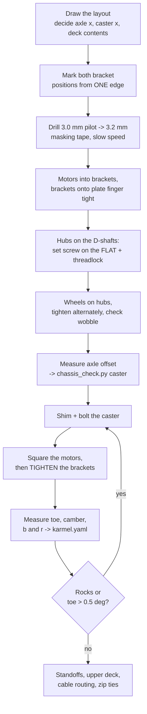

# 01.06 — Mechanical assembly — chassis, motors, wheels, caster

<!-- glance:start -->
<!-- generated by tools/build.py from curriculum/syllabus.yaml — edit the syllabus, not this block -->

| | |
|---|---|
| **Track** | Main path |
| **Difficulty** | Beginner |
| **Time** | 1 h 30 min |
| **Hardware** | Stage 1 robot: Pi 5, Pico, encoder motors, driver, chassis, battery, distance sensors (stage 1), Workbench tools (multimeter, soldering iron, crimper, screwdrivers) (stage 1) |
| **Software** | none |
| **Prerequisites** | [01.03 Your workbench: tools, multimeter and first soldering](01.03-workbench-and-tools.md) |
| **Optional prerequisites** | [FP.04 Torque, gears and wheels — sizing motors](../optional-foundations/physics/FP.04-torque-gears-wheels.md) |
| **Skip if** | Your chassis is assembled with motors mounted and wheels aligned. |

<!-- glance:end -->

## What you will learn

- Lay out karmel's two decks so that mass, heat, cables and future sensors each have a place, and write the layout down before you drill.
- Drill an acrylic plate for 37 mm motor brackets without cracking it, and bolt both motors on square.
- Fit 6 mm hubs to the D-shafts and 90 mm wheels to the hubs so they run true, and shim the ball caster so the robot sits level.
- Measure wheel alignment, squareness and effective wheel radius, and convert those millimetres into the heading error they will cause.
- Route power and signal cables so nothing reaches a wheel, and so you can still take the robot apart.

## Why it matters

Everything you will do from module 08 onwards — hold a wheel speed, drive a measured square, fuse odometry with a
LiDAR — assumes that the two wheels are the same size, parallel, and a known distance apart. Odometry is dead
reckoning: the robot's only idea of where it is comes from counting wheel turns and multiplying by numbers you
measured today. A 0.5 mm difference in effective wheel radius is 1 %, and 1 % over a 2 m straight run is a 5.7°
heading error and a 10 cm miss. No filter in module 10 recovers cleanly from a chassis that was built crooked.

The mechanical plane is also the one that bites software people hardest, because it fails *silently*. A loose hub set
screw doesn't throw an exception; it just makes the left wheel count 3 % low on Tuesdays. So this lesson does three
things in parallel: build it, measure it, and record the measurements in `labs/config/karmel.yaml` where the rest of
the course reads them.

<!-- prereqs:start -->
## Prerequisites

You need these first:

- [01.03 Your workbench: tools, multimeter and first soldering](01.03-workbench-and-tools.md)

### Optional prerequisite links

New to any of these? Take the foundation lesson first; skip it if you already know it.

- [FP.04 Torque, gears and wheels — sizing motors](../optional-foundations/physics/FP.04-torque-gears-wheels.md)

Check your readiness: `python course.py why 01.06`
<!-- prereqs:end -->

## Concept

### A chassis is a measuring instrument

Think of the drivetrain as a sensor with actuators attached. When the firmware reports "the left wheel turned 2464
ticks", the only way to turn that into "the robot moved 283 mm" is the wheel radius. When it reports "the left wheel
went forward 283 mm and the right one 293 mm", the only way to turn that into "the robot rotated 2.9°" is the wheel
separation. Those two constants — $r$ and $b$ — live in `karmel.yaml`, and the chassis's job is to make them **true
and stable**.

"True" you get by measuring instead of trusting the catalogue: a 90 mm wheel with a silicone tyre under a 1.6 kg
robot is not 90 mm at the contact patch. "Stable" you get from mechanics: set screws on the flat of the D-shaft,
brackets bolted to a flat plate, and a caster that touches the floor at exactly the right height so no wheel ever
lifts.

### Three contact points, one of them free

karmel is a differential drive: two powered wheels on one axle and a passive ball caster. Three points define a
plane, so the robot can never rock — *as long as all three really touch*. Get the caster 2 mm too tall and the robot
balances on the two drive wheels and rocks fore and aft; get it 2 mm too low and one drive wheel lifts every time
the floor is slightly uneven, and that wheel's encoder happily counts air.

The caster is also why the robot has a **front and a back that behave differently**, and which end it is on decides
which way. karmel's caster is 100 mm *in front* of the axle, so the triangle it makes with the two wheels covers the
nose and stops nothing at the tail: under hard braking the caster is what keeps the robot off its face, and under
acceleration there is nothing behind the axle, so the robot can rock backwards onto its tail. (It used to be behind,
and that cost the course a week of bad maps — [11.09](../11-slam/11.09-slam-troubleshooting.md) Level 3b is the
story.) Where you put the battery — the heaviest single part — decides how much margin you have at each end.

### The distributed-systems analogy that actually holds

A mechanical assembly is a stack of **tolerances**, and tolerances compose exactly like latencies: each one is small,
they add up, and the worst case is what you feel. The plate is ±0.3 mm, the drilled hole is ±0.2 mm, the bracket is
±0.2 mm, the hub is ±0.1 mm, the tyre is ±0.3 mm. Nothing in that list is "wrong", but stacked the wrong way they put
one wheel 1 mm lower than the other. The engineering answer is the same as in a service graph: **measure the end-to-end
result, not the parts**, and design so the important dimension is set by *one* thing you control (here: shims under
the caster) rather than by the sum of five.

> [!TIP]
> **Ask your teacher:** "Show me, with numbers, how a 1 mm difference between my left and right wheel radius turns
> into a heading error, and how far off the robot ends up after driving 5 metres."

## Technical explanation

### Level 1 — The stack, bottom to top

```text
floor
  ├── left wheel (90 mm) ──── hub ──── 6 mm D shaft ──── gearbox ──── bracket ──── plate
  ├── right wheel (90 mm) ─── hub ──── 6 mm D shaft ──── gearbox ──── bracket ──── plate
  └── ball caster ──── spacers / standoff ──── plate
plate (lower deck)  : battery pack + BMS, fuse, switch, 5 V regulator, star terminal
standoffs 30-40 mm  : leaves room for the pack and for the LiDAR mount in Stage 3
upper deck          : Raspberry Pi 5 + cooler, Pico 2 on the breadboard, motor drivers
front edge          : US-100 and VL53L1X, facing +x
```

Two decks, not one, for three reasons: the battery is heavy and belongs as low as possible; the Pi wants air around
its cooler; and every wire that runs between decks can be bundled and strain-relieved at a single point.

### Level 2 — Practical: the build, step by step

> [!CAUTION]
> **Safety:** the battery stays disconnected and out of the way for this entire lesson — no pack, no XT60, nothing
> charged on the bench (that is 01.07). Wear safety glasses when drilling and when cutting zip ties: acrylic chips
> and cable-tie ends fly. Clamp the plate; never hold it in your hand while drilling. Keep fingers out of the gap
> between wheel and plate when you spin a wheel by hand.

**Tools** (`tools`): drill with 3.0 and 3.2 mm bits, a square or a steel ruler, calipers if you have them, hex keys
(1.5 mm for the hub set screws), precision screwdrivers, a marker, masking tape, removable thread-locker, zip ties.

#### Step 1 — Draw the layout before you drill

On paper (or in the notes file from 01.01), draw the plate at 1:1 or 1:2 and place: motors and wheels, battery pack,
BMS, switch, fuse holder, regulator, star terminal, Pi, Pico + breadboard, the two drivers, and the front sensors.
Mark `base_link` at the midpoint between the wheel contact points. Put the switch where your hand reaches it in one
second **with the robot driving away from you** — the rear edge.

Decide the wheel axle position now. karmel puts the axle at $x = 0$ and the caster at $x = +100$ mm
(`chassis.caster_offset_x_m` in `karmel.yaml`) — under the front of the lower deck, 25 mm behind the plate's front
edge — which leaves the front 125 mm of the plate for the sensor strip above it and the whole 125 mm behind the
axle for the pack, the switch and the fuse.

#### Step 2 — Mark and drill the plate

The 2WD kit's acrylic plate is drilled for TT motors, not for 37 mm gearboxes, so you will drill
([hardware/stage-1-first-robot.md](../hardware/stage-1-first-robot.md), item B6).

1. Put masking tape where you will drill. It stops the bit skating and stops acrylic chipping.
2. Put a bracket on the plate, square it against a plate edge, and mark through its holes with a fine marker.
   **Mark both brackets from the same edge and at the same $x$**: that, not the drilling, is what makes the wheels
   parallel.
3. Measure the distance between the two marked sets. You want the wheel *contact points* 200 mm apart
   (`drive.wheel_separation_m`). The contact point is under the middle of the tyre, so measure bracket-to-bracket
   and add the tyre width offsets, or simply check the separation at the end (Step 7) and record the real number.
4. Drill 3.0 mm pilot holes, then open to 3.2 mm for M3. Acrylic: slow speed, light pressure, back the bit out often.
   A hot fast bit melts and cracks acrylic; a slow one cuts it.
5. Deburr with the back of a knife blade or a larger bit twirled by hand.

> [!TIP]
> **Ask your teacher:** "I don't have a drill press and my holes came out 1 mm off. What does that do to my robot,
> and is it worth re-drilling or can I fix it in software?"

#### Step 3 — Mount the motors

1. Bolt each motor into its bracket with the M3 screws that came with it. Do not over-tighten into the gearbox face:
   the threads are in a thin aluminium plate.
2. Bolt the brackets to the plate, **finger tight only**.
3. Square both motors with a ruler along the plate edge (details in Step 7), then tighten.
4. Note which way each motor's connector points. Both connectors should face **inwards/backwards**, towards where the
   drivers will sit, so no cable runs past a wheel.

The two motors are mirror images: the same wiring makes one wheel turn forward and the other backward. That is
expected and is fixed in firmware later (`MOTOR_RIGHT_REVERSED = True` in
[`labs/firmware/pico/config.py`](../labs/firmware/pico/config.py)), not by re-wiring.

#### Step 4 — Hubs on the shafts

The Pololu universal hub for a 6 mm shaft is 25.4 mm across and 9.2 mm thick, with six M3 threaded holes and two M3
set screws (a 1.5 mm Allen wrench is in the pack).

1. Slide the hub on so its **set screw lands on the flat of the D-shaft**, not on the round part. This is the single
   most common cause of "the wheel slips and my odometry drifts".
2. Push it on far enough that the wheel will clear the bracket, but leave 1–2 mm so the wheel isn't rubbing.
3. One drop of removable thread-locker on each set screw. Tighten both.

#### Step 5 — Wheels on the hubs

The Pololu 90×10 mm wheel has six M3 holes: one pair 12.7 mm apart and two pairs 19.1 mm apart. Use two screws on
opposite sides, tighten them **alternately and lightly** so the wheel seats flat, then check for wobble: spin the
wheel by hand and watch a fixed reference (the plate edge) at the rim. More than about 0.5 mm of wobble means the
wheel isn't seated — loosen, re-seat, retighten.

#### Step 6 — The caster, at exactly the right height

This is the only adjustable dimension in the stack, so make it carry all the error.

1. With the motors and wheels on, put the assembly upside down on the bench and measure the **axle offset**: the
   height of the motor shaft axis relative to the plate's underside. Brackets on top of the plate → the axle is
   *above* the underside (a negative offset in the script below); motors hanging under the plate → positive.
2. Compute the required caster height: `python chassis_check.py caster --wheel-radius 45 --axle-offset=-20.5`.
3. Build the stack. The Pololu 3/4" metal ball caster is 0.82 in (20.8 mm) tall assembled, and the kit includes a
   1/16 in (1.6 mm) and a 1/8 in (3.2 mm) spacer; Pololu quotes 0.8–1.1 in of total range. If you need more than
   that, add M3 standoffs or washers between the caster and the plate.
4. Put the robot on a flat surface (a kitchen worktop, not a carpet) and press each corner in turn. **No rocking
   allowed.** If it rocks, one of the three contact points is off; shim until it doesn't.

#### Step 7 — Alignment and squareness checks

Do all three, write the numbers down:

| Check | How | Target |
|---|---|---|
| **Toe** (are the wheels parallel?) | Hold a straightedge flat against each wheel's outer face. Measure the gap between the straightedges at the **front** of the tyres and at the **rear**, 90 mm apart. | Difference under 0.8 mm (≈ 0.5° total) |
| **Camber** (are the wheels vertical?) | Square against the plate, against each wheel face. | Under 1° |
| **Wheel separation** $b$ | Distance between the two tyre centre-lines, measured at the floor. | Record it; it goes into `karmel.yaml` |
| **Effective wheel radius** $r$ | Mark the tyre with tape, roll the robot in a straight line for 10 full wheel turns against a ruler, divide by $10 \times 2\pi$. | Record it; expect 44–45 mm, not 45.0 |
| **Rocking** | Press each corner. | Nothing moves |

Then update `labs/config/karmel.yaml` with your measured `wheel_radius_m` and `wheel_separation_m` — and only those
two, nothing else in that file is yours to change yet.

#### Step 8 — Cable routing

You have no electronics on the robot yet, but you decide the routing now, because it is almost impossible to fix
later:

| Cable | From → to | Rule |
|---|---|---|
| Motor power (2 × 2 wires, 18–20 AWG) | motor terminals → drivers on the upper deck | Up through a hole **inboard of the wheel**, never past the tyre |
| Encoder (PH2.0 6-pin) | motor → Pico | Same hole, but zip-tied on the **other side** of the bundle from the motor power (01.08 explains why) |
| Battery (18 AWG, XT60) | pack → fuse → switch → star | Shortest path, lower deck only, red and black twisted together |
| 5 V to the Pi | regulator → Pi USB-C | Short and thick; every centimetre costs voltage (02.02) |
| USB Pi → Pico | upper deck only | Leave a service loop so you can lift the Pi out |

Three habits: (1) every bundle gets a zip tie within 50 mm of where it leaves a board, so a tug moves the tie and not
the solder joint; (2) leave a **service loop** at every connector, so you can disconnect it without pulling;
(3) nothing crosses the plane of a wheel — hold the robot up and look along the axle; if you can see a cable near the
tyre, move it.

### Level 3 — Mathematics: millimetres into degrees

**Wheel radius mismatch.** Dead reckoning converts wheel rotation into distance: $d = r\,\phi$, where $\phi$ is the
wheel's rotation in radians. If the two wheels really have radii $r_L \ne r_R$ but your code uses the same $r$ for
both, then commanding the same rotation $\phi$ on both wheels produces

$$d_L = r_L \phi, \qquad d_R = r_R \phi, \qquad \Delta\theta = \frac{d_R - d_L}{b} = \frac{(r_R - r_L)\phi}{b}$$

**Example.** Your wheels measure $r_L = 44.775$ mm and $r_R = 45.225$ mm — a 1 % difference, which you would never see
by eye. Drive a commanded 2 m straight, $b = 200$ mm:

$$\phi = \frac{2.0}{0.045} = 44.4\ \text{rad}, \quad d_R - d_L = 0.00045 \times 44.4 = 0.020\ \text{m},
\quad \Delta\theta = \frac{0.020}{0.200} = 0.100\ \text{rad} = 5.73°$$

The robot ends up about $L\Delta\theta/2 = 100$ mm to one side, pointing 5.7° off. That is the whole reason lesson
[09.05](../09-odometry/09.05-calibrating-odometry.md) exists, and why you measure the wheels now instead of typing 45.

**Wheel separation error.** Rotation in place uses $b$: $\Delta\theta = (d_R - d_L)/b$. A $b$ that is wrong by 1 %
(2 mm out of 200) makes every commanded rotation wrong by 1 %: a commanded full turn lands 3.6° off, and ten turns
land 36° off. Note the asymmetry — **$r$ dominates straight-line error, $b$ dominates rotation error**. That is the
insight behind the UMBmark square-driving test in 09.05.

**Toe.** Measure the gap between two straightedges held against the wheel faces, at two points a distance $s$ apart
along the robot:

$$\delta_{total} = \arctan\frac{g_{rear} - g_{front}}{s}$$

**Example.** $g_{front} = 199.0$ mm, $g_{rear} = 201.0$ mm, $s = 90$ mm (the wheel diameter):
$\delta = \arctan(2/90) = 1.27°$ total, 0.64° per wheel. Each wheel therefore drags sideways by
$\sin(0.64°) = 1.1\%$ of the distance driven — 11 mm of scrubbing per metre, which you pay for in torque and tyre
wear. But the *odometry* error from toe is $1/\cos(0.64°) - 1 = 0.006\%$: negligible. **Toe costs you energy, not
accuracy.** Fix it because scrubbing wheels also slip, and slip is what odometry cannot see.

**Weight distribution and traction.** With the axle at $x_a$, the caster at $x_c$ and the centre of mass at $x_m$,
statics gives the share of the weight carried by the drive wheels:

$$f_{wheels} = \frac{x_m - x_c}{x_a - x_c}$$

**Example.** Axle at 0, caster at **+100 mm**, centre of mass at +20 mm: $f = (20 - 100)/(0 - 100) = 0.80$. Eighty
percent of a 1.6 kg robot (12.6 N of 15.7 N) presses on the drive wheels. With a friction coefficient of about 0.8 on
a hard floor ([FP.03](../optional-foundations/physics/FP.03-friction-traction.md)) that is about **10 N** of available
traction. Each motor can push roughly **13 N** at the rim when its driver is limiting the current
([01.08](01.08-first-motor-spin.md)), so the **wheels slip before the motors stall**. That is good news — the gearbox
is protected — but it means karmel's acceleration is limited by *grip*, not by torque, and that grip is what you are
setting when you decide where the battery goes. Note the direction: with the caster in front, moving mass *forward*
unloads the drive wheels. Slide the battery to $x_m = +60$ mm and only 40 % of the weight is on them: 5 N of traction,
and the robot starts spinning its wheels on a rug.

**Tipping backwards.** Nothing supports the robot *behind* the axle — the support polygon is the triangle
(0, ±100) – (+100, 0), and its rear edge is the axle line itself. Accelerating at $a$ with the centre of mass a
height $h$ up and a distance $\ell = x_m - x_a$ **ahead** of the axle, the robot rocks back onto its tail when

$$a > g \frac{\ell}{h}$$

**Example.** $\ell = 20$ mm, $h = 50$ mm: $a > 9.81 \times 0.020/0.050 = 3.9$ m/s², which is reaching 0.5 m/s in
128 ms. The configured `max_linear_accel_m_s2: 1.0` in `karmel.yaml` leaves a factor of four, so a well-balanced
karmel is fine. The *simulated* karmel is not: its URDF puts the centre of mass only **1.7 mm** ahead of the axle,
giving $a_{tip} = 9.81 \times 0.0017/0.05 = 0.33$ m/s², and a full-rate acceleration step measurably rocks it to
about 5.6° nose-up before it settles ([`labs/TESTED.md`](../labs/TESTED.md) §3.1). Twenty millimetres of battery
position is the difference between "fine" and "visibly rocking". Braking is the easy direction now: the caster is
100 mm ahead, so the robot would need the centre of mass past $x = +100$ mm to nose over, which nothing on this
chassis can do.

> [!NOTE]
> New to torque, gear ratios and why a gearbox trades speed for push? → [FP.04 Torque, gears and wheels — sizing motors](../optional-foundations/physics/FP.04-torque-gears-wheels.md). Skip it if you can already explain why a 1:56 gearbox multiplies torque by 56 and divides speed by 56.

### Level 4 — Implementation: record it, don't remember it

Three things leave this lesson as data, not as memory:

1. **`labs/config/karmel.yaml`** gets your measured `drive.wheel_radius_m` and `drive.wheel_separation_m`. Everything
   downstream — the simulator, odometry, Nav2 — reads them from there.
2. **A build log.** One Markdown file in your notes: every measurement from Step 7, the drill sizes you used, which
   bracket hole pattern fitted, photographs of the two decks before you cabled them. When the robot drifts left in
   three months, this file is your git history for the hardware.
3. **`karmel.yaml`'s `chassis:` block** gets your real plate dimensions and caster offset, so the URDF you build in
   module 05 and the simulator in module 06 describe *your* robot.

## Diagram

**Top view** (REP-103: x forward, y left; origin `base_link` midway between the wheel contact points):

```text
                                FRONT (+x)
            ┌───────────────────────────────────────────┐   x = +125
            │  [US-100]        [VL53L1X]                │
            │            ( caster, underneath )         │   x = +100
            │                                           │
            │        upper deck, 35 mm standoffs        │
            │   ┌────────────┐   ┌────┐   ┌──────────┐  │
            │   │ Pi 5 +     │   │Pico│   │ DRV8874  │  │
            │   │ cooler     │   │ +bb│   │ L  and R │  │
            │   └────────────┘   └────┘   └──────────┘  │
   ┌────────┤                                           ├────────┐
   │ LEFT   │ ┌────────┐                   ┌────────┐   │ RIGHT  │
   │ wheel  │═│motor L │═══════ ● ═════════│motor R │═══│ wheel  │   b = 200 mm
   │ 90 mm  │ └────────┘   base_link (0,0) └────────┘   │ 90 mm  │
   └────────┤        ▲ axle line, x = 0                 ├────────┘
            │        │                                  │
            │   lower deck: 3S pack | BMS | regulator   │
            │           [SWITCH]    [FUSE]              │
            └───────────────────────────────────────────┘   x = -125
                                REAR (-x)
                        plate 250 x 200 mm (measure yours)
```

The pack is the heaviest single part and the drawing above puts it in the middle of the lower deck, which is where
it will end up if you do not think about it. Slide it **forward**, so that it is centred around $x = +20$ mm —
between the axle and the caster — until `chassis_check.py balance` reports 70–85 % on the drive wheels. The switch
and the fuse stay at the rear edge, where your hand can reach them while the robot drives away from you.

**Side view** — the dimension chain that decides the caster stack. The front of the robot is to the **left** here:
the caster is the *front* contact, 100 mm ahead of the axle, and nothing touches the floor to the right of the wheel.

```text
                       upper deck
              ═════════════════════════════
                  ║                  ║          35 mm standoffs
        plate  ▄▄▄▄▄▄▄▄▄▄▄▄▄▄▄▄▄▄▄▄▄▄▄▄▄▄▄▄▄▄▄▄    3 mm acrylic
                 │                        │  ▲
                 │  bracket + motor       │  │ axle offset  (measure this: here -20.5 mm,
    caster ──────┤       ┌──────┐         │  │              i.e. the axle sits ABOVE
    stack   24.0 │      ( motor )  ● ─────┼──▼              the plate's underside)
      mm    ─────┤       └──────┘  ▲      │
                 │                 │      │  r = 45 mm (MEASURED, loaded)
            ═════○═════════════════╪══════╧═══════════════  floor
              caster ball      contact patch

      required caster height = r + axle offset = 45.0 + (-20.5) = 24.5 mm
      built stack            = 20.8 (caster) + 3.2 (1/8 in spacer) = 24.0 mm  -> 0.5 mm low, fine
```

**Assembly order** — do it in this order and nothing has to come apart again:



## Code

`chassis_check.py` turns the readings from Step 7 into decisions. It needs no hardware and no packages, so run it on
your laptop while the robot is on the bench next to you. Save it with your build log (for example
`~/karmel-bench/chassis_check.py`), not in this repository.

```python
"""01.06 — turn tape-measure readings into decisions about karmel's chassis.

Four calculators, each one answering a question you will actually ask while building:

    python chassis_check.py caster  --wheel-radius 45 --axle-offset=-20.5
    python chassis_check.py toe     --front 199.0 --rear 201.0 --span 90
    python chassis_check.py drift   --left-radius 44.8 --right-radius 45.2 --distance 2.0
    python chassis_check.py balance --com-x 20 --com-height 50

Negative numbers need the '=' form (--axle-offset=-20.5): argparse reads a bare -20.5 as a flag.

No hardware, no packages: a ruler, calipers if you have them, and Python 3.10+.
"""
from __future__ import annotations

import argparse
import math

# Pololu ball caster with 3/4" metal ball (item 955): 0.82 in assembled without spacers,
# plus the included 1/16 in and 1/8 in spacers. Measure yours; tolerances are real.
CASTER_BASE_MM = 20.8
CASTER_SPACERS_MM = (1.6, 3.2)          # 1/16", 1/8"
STANDOFF_STEPS_MM = (3.0, 5.0, 6.0, 8.0, 10.0, 12.0, 15.0, 20.0)   # common M3 standoff lengths


def caster(wheel_radius_mm: float, axle_offset_mm: float) -> None:
    """How tall must the ball caster assembly be so the robot sits level?

    axle_offset_mm is the motor shaft axis measured from the plate's underside:
    NEGATIVE when the brackets sit on top of the plate and the axle is above the underside,
    POSITIVE when the motors hang below the plate. Measure it with the motors bolted on and
    the plate upside down on the bench, with a ruler and a square.
    """
    plate_underside = wheel_radius_mm + axle_offset_mm
    print(f"wheel radius (loaded)      : {wheel_radius_mm:.1f} mm  -> the axle must sit this high")
    print(f"axle vs plate underside    : {axle_offset_mm:+.1f} mm  (- = axle above the underside)")
    print(f"required caster height     : {plate_underside:.1f} mm from plate underside to floor")

    best = None
    for spacers in ((), (CASTER_SPACERS_MM[0],), (CASTER_SPACERS_MM[1],), CASTER_SPACERS_MM):
        height = CASTER_BASE_MM + sum(spacers)
        gap = plate_underside - height
        for standoff in (0.0,) + STANDOFF_STEPS_MM:
            error = gap - standoff
            if best is None or abs(error) < abs(best[0]):
                best = (error, spacers, standoff, height)
    error, spacers, standoff, height = best
    spacer_text = " + ".join(f"{s:g} mm" for s in spacers) if spacers else "none"
    print(f"closest stack              : caster {height:.1f} mm (spacers: {spacer_text})"
          + (f" + {standoff:g} mm M3 standoff" if standoff else ""))
    print(f"residual error             : {error:+.1f} mm "
          f"({'caster too low: robot rocks onto the caster' if error > 0 else 'caster too high: a drive wheel lifts'})")
    if abs(error) <= 1.0:
        print("verdict                    : fine, 1 mm is inside tyre compression")
    else:
        print("verdict                    : shim it. Washers under the caster (too low) or "
              "under the motor brackets (too high). A rocking robot loses traction on one wheel.")


def toe(front_mm: float, rear_mm: float, span_mm: float) -> None:
    """Toe angle from the gap between two straightedges held against the wheel faces."""
    difference = rear_mm - front_mm
    total = math.degrees(math.atan2(difference, span_mm))
    print(f"gap at the front of the wheels : {front_mm:.1f} mm")
    print(f"gap at the rear of the wheels  : {rear_mm:.1f} mm")
    print(f"measuring span                 : {span_mm:.1f} mm")
    print(f"total toe                      : {total:+.2f} deg "
          f"({'toe-in' if difference > 0 else 'toe-out' if difference < 0 else 'parallel'}), "
          f"{total / 2:+.2f} deg per wheel")
    scrub = math.sin(math.radians(abs(total) / 2))
    print(f"sideways scrub per wheel       : {scrub * 100:.2f} % of the distance driven "
          f"({scrub * 1000:.1f} mm per metre)")
    rolling_error = 1 / math.cos(math.radians(abs(total) / 2)) - 1
    print(f"odometry error from toe alone  : {rolling_error * 100:.3f} % "
          "(tiny: toe wastes torque and rubber, it does not ruin odometry)")
    print("verdict                        : "
          + ("fine" if abs(total) <= 0.5 else "re-seat the brackets; aim for under 0.5 deg total"))


def drift(left_radius_mm: float, right_radius_mm: float, distance_m: float,
          separation_mm: float = 200.0) -> None:
    """Heading error over a straight run caused by unequal effective wheel radii."""
    mean_radius = (left_radius_mm + right_radius_mm) / 2
    ratio = right_radius_mm / left_radius_mm
    left_m = distance_m * left_radius_mm / mean_radius
    right_m = distance_m * right_radius_mm / mean_radius
    heading_rad = (right_m - left_m) / (separation_mm / 1000.0)
    lateral_m = distance_m * heading_rad / 2          # small-angle arc offset
    print(f"effective wheel radii   : left {left_radius_mm:.2f} mm, right {right_radius_mm:.2f} mm "
          f"(ratio {ratio:.4f})")
    print(f"wheel separation        : {separation_mm:.1f} mm")
    print(f"commanded straight run  : {distance_m:.2f} m with equal wheel rotations")
    print(f"actual arc              : left {left_m:.4f} m, right {right_m:.4f} m")
    print(f"heading error           : {math.degrees(heading_rad):+.2f} deg")
    print(f"sideways miss at the end: {lateral_m * 1000:+.0f} mm")
    print("note                    : this is systematic, repeatable and calibratable (09.05 UMBmark). "
          "Tyre wear, pressure and a loose hub all change the effective radius.")


def balance(com_x_mm: float, com_height_mm: float, caster_x_mm: float = 100.0,
            axle_x_mm: float = 0.0, mass_kg: float = 1.6) -> None:
    """Weight on the drive wheels, and the acceleration at which the robot rocks off the axle.

    karmel's caster is 100 mm IN FRONT of the axle, so the unsupported end is the tail and the
    dangerous manoeuvre is accelerating, not braking. The formulas below work for either sign of
    caster_x_mm; only which end is unsupported changes.
    """
    span = axle_x_mm - caster_x_mm
    on_wheels = (com_x_mm - caster_x_mm) / span
    caster_in_front = caster_x_mm > axle_x_mm
    toward_caster = "forward" if caster_in_front else "backward"
    # the unsupported end is the one the caster is NOT on, and it lifts under the
    # acceleration that throws the mass towards it
    away = "backward" if caster_in_front else "forward"
    unsupported = "behind" if caster_in_front else "in front of"
    manoeuvre = "accelerating" if caster_in_front else "braking"
    print(f"centre of mass          : x = {com_x_mm:+.0f} mm, height {com_height_mm:.0f} mm "
          f"(axle at x = {axle_x_mm:+.0f} mm, caster at x = {caster_x_mm:+.0f} mm)")
    print(f"weight on drive wheels  : {on_wheels * 100:.0f} %  "
          f"({on_wheels * mass_kg * 9.81:.1f} N of {mass_kg * 9.81:.1f} N)")
    if on_wheels >= 1.0:
        print(f"  -> over 100 %: the centre of mass is on the far side of the axle from the "
              f"caster. The caster carries nothing and the robot sits back on its tail.")
    elif on_wheels < 0.6:
        print(f"  -> too little: the wheels slip before they push. Move the battery {away}.")
    elif on_wheels > 0.95:
        print("  -> the caster barely touches: the robot will rock fore-aft over the axle.")
    else:
        print("  -> good: enough traction, caster still loaded.")
    lever = abs(com_x_mm - axle_x_mm) if on_wheels < 1.0 else 0.0
    if lever <= 0:
        print(f"tipping {away:9s}       : already unstable - nothing supports the robot "
              f"{unsupported} the axle, and the mass is on that side. Move mass {toward_caster}.")
    else:
        tip_accel = 9.81 * (lever / 1000.0) / (com_height_mm / 1000.0)
        print(f"tips {away} when {manoeuvre} harder than {tip_accel:.1f} m/s^2 "
              f"(= 0.5 m/s gained or lost in {0.5 / tip_accel * 1000:.0f} ms)")


def main() -> int:
    parser = argparse.ArgumentParser(description=__doc__,
                                     formatter_class=argparse.RawDescriptionHelpFormatter)
    sub = parser.add_subparsers(dest="command", required=True)

    p = sub.add_parser("caster", help="required ball-caster height and spacer stack")
    p.add_argument("--wheel-radius", type=float, default=45.0, help="mm, measured with the robot's weight on it")
    p.add_argument("--axle-offset", type=float, required=True,
                   help="mm; negative = axle ABOVE the plate underside (brackets on top), positive = below")

    p = sub.add_parser("toe", help="toe angle from two straightedge readings")
    p.add_argument("--front", type=float, required=True, help="mm between the wheel faces, at the front of the tyres")
    p.add_argument("--rear", type=float, required=True, help="mm between the wheel faces, at the rear of the tyres")
    p.add_argument("--span", type=float, default=90.0, help="mm between the two measuring points (the wheel diameter)")

    p = sub.add_parser("drift", help="heading error from unequal effective wheel radii")
    p.add_argument("--left-radius", type=float, required=True, help="mm")
    p.add_argument("--right-radius", type=float, required=True, help="mm")
    p.add_argument("--distance", type=float, default=2.0, help="m of commanded straight driving")
    p.add_argument("--separation", type=float, default=200.0, help="mm between the wheel contact points")

    p = sub.add_parser("balance", help="traction share and tipping over the unsupported end")
    p.add_argument("--com-x", type=float, required=True, help="mm, + is forward of the wheel axle")
    p.add_argument("--com-height", type=float, required=True, help="mm above the floor")
    p.add_argument("--caster-x", type=float, default=100.0,
                   help="mm, positive = in front of the axle (karmel: +100)")
    p.add_argument("--mass", type=float, default=1.6, help="kg")

    args = parser.parse_args()
    if args.command == "caster":
        caster(args.wheel_radius, args.axle_offset)
    elif args.command == "toe":
        toe(args.front, args.rear, args.span)
    elif args.command == "drift":
        drift(args.left_radius, args.right_radius, args.distance, args.separation)
    else:
        balance(args.com_x, args.com_height, args.caster_x, 0.0, args.mass)
    return 0


if __name__ == "__main__":
    raise SystemExit(main())
```

To find the centre of mass for the `balance` command without a physics lab: put the assembled robot (with the
battery where you plan to keep it) on a round pen or a broom handle laid on the table, and slide it until it
balances. The pen is under $x_m$. Height is harder; estimate it as the mid-height of the battery-plus-Pi stack, or
do the string-and-plumb-line trick from
[FP.07](../optional-foundations/physics/FP.07-center-of-mass-stability.md).

## Exercise

### Exercise 01.06-E1 — Layout on paper before metal `[design]`

Hardware: none (paper, pencil, and the parts in front of you for size).

Draw your plate at 1:1. Place all fifteen Stage-1 items (motors, wheels, caster, pack, BMS, fuse, switch, regulator,
star terminal, 2 drivers, Pi, Pico + breadboard, US-100, VL53L1X). Mark `base_link`, the axle line and the caster.
Then answer in writing:

1. Where is the centre of mass, roughly, and what fraction of the weight does that put on the drive wheels?
2. Which cable, on your drawing, is closest to a wheel, and how will you keep it away?
3. Where will the LiDAR go in Stage 3 — and does anything on the upper deck have to move now to leave room?

### Exercise 01.06-E2 — Build it `[hardware]`

Hardware: `robot-base` (chassis plate, 2 motors, 2 brackets, 2 hubs, 2 wheels, ball caster, standoffs, M3 hardware),
`tools` (drill and 3.0/3.2 mm bits, square/ruler, hex keys, screwdrivers, thread-locker, safety glasses).

Do Steps 2–6. Stop at the point where the robot stands on its three contact points with no electronics on it.
Photograph both decks before you fit the standoffs.

No hardware yet? Do E1, E4 and E5, and come back.

### Exercise 01.06-E3 — Measure and record `[hardware]`

Hardware: `robot-base` (the assembly from E2), `tools` (ruler, calipers if you have them).

Run all five checks in Step 7, and run `chassis_check.py` on the results (`caster`, `toe`, `drift` with your two
measured radii, `balance`). Then:

1. Update `drive.wheel_radius_m` and `drive.wheel_separation_m` in `labs/config/karmel.yaml`.
2. Roll the robot by hand along a 2 m straight line on the floor, guided by a wall or a taut string, and mark where
   it ends up. Repeat three times.
3. Write everything into your build log.

### Exercise 01.06-E4 — Predict the crooked robot `[predict]`

Hardware: none. Write your prediction *before* checking. For each fault, say (a) what the robot does visibly,
(b) whether encoders alone can detect it, and (c) which lesson fixes it.

1. The right hub's set screw is on the round part of the D-shaft, not the flat, and slowly slips.
2. The caster is 3 mm too tall.
3. The two brackets are parallel but one sits 4 mm further forward than the other.
4. The right tyre is worn so its effective radius is 44.0 mm while the left is 45.0 mm.
5. You typed `wheel_separation_m: 0.200` but the real separation is 0.208 m.

### Exercise 01.06-E5 — The tolerance budget `[numerical]`

Hardware: none. Using `chassis_check.py` (or by hand), work out:

1. The heading error after a commanded 5 m straight run if the wheel radii differ by 0.5 %.
2. The error after a commanded 10 full rotations in place if $b$ is 3 mm too small.
3. The largest radius mismatch you can tolerate if "5 m straight, ends within 100 mm of the line" is your spec.
4. How much the caster height may be wrong before a wheel lifts, given that the silicone tyre compresses about 1 mm
   under this robot's weight.

## Expected result

- **01.06-E1:** A drawing where the battery sits between the axle and the caster — that is, just *forward* of the
  axle, since the caster is at x = +100 mm — putting the centre of mass around x = +20 to +30 mm and 70–85 % of the
  weight on the drive wheels; the switch is at the rear edge, and the front 100 mm of the **upper** deck is free for
  sensors (the caster lives under the lower deck, so it does not compete with them). A good answer
  to (2) names the motor power leads and puts them through a hole inboard of the wheel. A good answer to (3) leaves
  the centre of the upper deck, above `base_link`, clear — a LiDAR mounted off-centre needs an extra transform and
  sees the robot's own Pi.
- **01.06-E2:** A robot that stands on three points on a flat surface and **does not rock** when you press any
  corner. Both wheels spin freely by hand with under ≈ 0.5 mm of visible wobble, and nothing rubs. Each hub set screw
  is on the shaft flat.
- **01.06-E3:** `chassis_check.py caster` reports a residual within ±1 mm; `toe` reports under 0.5° total; measured
  radii between 44.0 and 45.0 mm and within ≈ 0.3 mm of each other; measured separation within a few mm of 200. In
  the hand-roll test the robot should stay within roughly 50 mm of the line over 2 m and **miss the same way every
  time** — a repeatable drift is a systematic error you can calibrate (09.05); a random one means something is loose.
- **01.06-E4:** (1) The right wheel slowly under-counts relative to the distance it really travels, so odometry
  thinks the robot turned right when it went straight; encoders alone **cannot** see it (the encoder is on the motor,
  before the slipping joint) — you catch it by driving a known distance and measuring with a tape. Fix: set screw on
  the flat, thread-locker. (2) The robot balances on the two drive wheels and rocks fore-aft; braking drops the nose
  onto the caster and accelerating bangs the tail down, and the pitching drags every forward-facing sensor with it
  ([11.09](../11-slam/11.09-slam-troubleshooting.md) is what that costs you later). Encoders can't see it; you feel
  it. Fix: shim (this lesson). (3) The wheels are still parallel, so nothing
  visible happens to straight driving, but `base_link` isn't where you think it is and every rotation is about a
  slightly offset point — a small, constant odometry bias. (4) Straight runs curve toward the right; it's systematic
  and repeatable, so 09.05 calibrates it out, or you replace the tyre. (5) Straight lines are perfect, rotations are
  4 % short: the robot under-turns. Rotation error with correct straight-line distance is the signature of a wrong
  $b$.
- **01.06-E5:** (1) 0.5 % mismatch over 5 m: $\Delta\theta = 5 \times 0.005/0.2 = 0.125$ rad = **7.2°**, ending about
  310 mm off the line. (2) $b$ 3 mm small (197 instead of 200) makes each rotation read 1.52 % large, so after 10
  commanded turns the robot has actually turned $10 \times 360° \times 197/200 = 3546°$ — **54° short**. (3) You need
  $L\Delta\theta/2 \le 0.1$ m, so $\Delta\theta \le 0.04$ rad, so $(r_R - r_L)/r \le \Delta\theta \cdot b / L =
  0.04 \times 0.2/5 = 0.0016$: **0.16 %, or 0.07 mm** on a 45 mm wheel. You cannot build that; you calibrate it
  (09.05). (4) About 1 mm of error is absorbed by tyre compression; beyond roughly 1–1.5 mm too tall the caster
  starts unloading a drive wheel on any floor that isn't perfectly flat.

## Troubleshooting

### Symptom: the robot rocks on a flat table

Work through the three contact points, cheapest check first:

1. **Is the table flat?** Try a different surface first. Two out of three "rocking robots" are rocking tables.
2. **Which pair of points does it rock about?** Press the **nose**, over the caster: it should be solid. If it goes
   down and springs back, the caster is too tall and the robot is balancing on the two drive wheels. Pressing the
   **tail** will always tip it — there is no contact behind the axle, by design — so that tells you nothing. If
   pressing one *side* rocks it, one drive wheel is lower: that is a bracket or a bent shaft, not the caster.
3. **Measure**, don't eyeball: with the robot upside down, measure each wheel's outer edge to the plate. A 1 mm
   difference is visible in the measurement and invisible to the eye.
4. **Fix at the caster** if it's fore-aft (add or remove a spacer), **at the bracket** if it's side-to-side (washers
   under one bracket foot).

### Symptom: a wheel wobbles as it turns

1. **Is it the wheel or the shaft?** Hold a marker against the plate as a reference and spin the wheel by hand. Then
   remove the wheel and watch the *hub* — if the hub wobbles, the shaft is bent or the hub isn't square on the shaft.
2. **Hub not square:** loosen both set screws, push the hub fully onto the shaft's flat, tighten one, check, tighten
   the other.
3. **Wheel not seated:** loosen the wheel screws, press the wheel flat against the hub face, and tighten the screws
   in alternating order, a quarter turn at a time.
4. **Bent shaft:** it happens when a robot is dropped. The motor is ₪65 and the gearbox is not repairable.

### Symptom: the wheels aren't parallel and re-seating doesn't help

1. **Were both brackets marked from the same plate edge?** If not, re-drill one: a 3.2 mm hole can be opened to
   4 mm with the bracket as a guide, then use an M3 screw with a washer, which gives you ±0.4 mm of adjustment.
2. **Is the plate flat?** Acrylic warps. Lay it on the table and look along it. A warped plate tilts both brackets
   and no amount of adjustment fixes it — replace it (plywood is flatter and cheaper).
3. **Is the bracket itself square?** Sheet-metal brackets get bent in shipping. Check with a square, bend it back in
   a vice.

### Symptom: acrylic cracked while drilling

Nothing to fix, only to avoid next time: masking tape, a sharp bit at **low** speed, light pressure, pilot hole first,
and support the plate on a scrap of wood so the bit has somewhere to break through into. If the crack is not through
a bolt hole, a drop of superglue stops it spreading. If it is, make a new plate — a cracked mount will move under
motor torque, and then your $b$ changes while you drive.

### Symptom: the measured wheel separation doesn't match the drawing

Measure the same thing twice more before you believe it. The most common mistake is measuring wheel *outer faces*
instead of the tyre centre-lines. Then just **record the number you measured** in `karmel.yaml`. The course does not
need $b$ to be 200 mm; it needs `karmel.yaml` to say what $b$ really is.

## Common mistakes

- **Trusting the catalogue radius.** "90 mm wheel" means 45.0 mm unloaded, on a clean bench. Under a 1.6 kg robot on
  a silicone tyre it's typically 44.3–44.8 mm, and that 1 % is a 5.7° heading error over 2 m.
- **Set screw on the round part of the shaft.** It holds for a day, then polishes a groove and slips. Always on the
  flat, always with thread-locker.
- **Tightening the brackets before squaring the motors.** Bolt finger tight, align, *then* tighten. Tightening moves
  things.
- **One deck.** Everything on one plate means the battery is high (tipping), the Pi is next to the motor wires
  (noise), and there is nowhere for the LiDAR in Stage 3.
- **Routing the encoder cable next to the motor power cable.** 20 kHz switching at 3 A next to a 3.3 V digital signal
  is an antenna and a victim taped together. Separate them, or at least cross them at right angles.
- **No strain relief.** The first time you pick the robot up by the Pi, an unrelieved wire takes the load at its
  solder joint.
- **Building before drawing.** Drilling the plate twice costs an hour and a plate.

## Knowledge check

1. You measure your left wheel's effective radius as 44.6 mm and your right as 45.0 mm. You command a 3 m straight run with $b = 0.200$ m. Which way does the robot veer, and by how many degrees?
   <details><summary>Answer</summary>

   The right wheel is bigger, so it travels further, so the robot veers **left**.
   $\Delta\theta = L(r_R - r_L)/(r\,b)$ with $r$ the mean radius 44.8 mm:
   $\phi = 3.0/0.0448 = 66.96$ rad, $d_R - d_L = 0.0004 \times 66.96 = 0.0268$ m,
   $\Delta\theta = 0.0268/0.200 = 0.134$ rad = **7.7°**, ending about 200 mm left of the line.
   </details>

2. Why is the ball caster's height the dimension you adjust, rather than the motor bracket height?
   <details><summary>Answer</summary>

   Because every other dimension in the stack (plate thickness, bracket, gearbox diameter, hub, wheel, tyre) is fixed
   by the parts, and their tolerances add up. Making **one** adjustable element absorb the whole stacked error is a
   design choice: you measure the end-to-end result and shim in one place. The caster is also the contact point that
   carries the least load and has no accuracy requirement of its own.
   </details>

3. Your robot has 1.3° of total toe-in. What does it cost you — odometry accuracy, energy, or both?
   <details><summary>Answer</summary>

   Almost entirely **energy** (and tyre wear). Each wheel drags sideways by $\sin(0.65°) = 1.1\%$ of the distance
   driven, which the motors pay for in friction. The rolling-distance error is $1/\cos(0.65°) - 1 = 0.006\%$, which
   is invisible next to a 1 % radius mismatch. The indirect risk is real though: a scrubbing tyre is closer to
   slipping, and slip is the error odometry cannot see.
   </details>

4. Predict: you move the battery from $x = -20$ mm to $x = -70$ mm (further back). What happens to traction and to tipping?
   <details><summary>Answer</summary>

   Traction gets **worse**: the weight on the drive wheels falls from $(100-20)/100 = 80\%$ to
   $(100-70)/100 = 30\%$, so the wheels slip much earlier. Forward tipping gets **better** (the lever
   $\ell$ grows from 20 to 70 mm, so the tipping deceleration rises from 3.9 to 13.7 m/s² with a 50 mm
   centre-of-mass height — above what the robot can achieve). The useful compromise is 70–85 % on the drive wheels.
   </details>

5. Debugging scenario: your robot drives a commanded 2 m straight and ends up 80 mm to the left, every single time, with the same 80 mm. A colleague says "your encoders are losing ticks". Are they right?
   <details><summary>Answer</summary>

   No. Lost ticks are **random**: the error would vary run to run and usually get worse at higher speed. A
   perfectly repeatable 80 mm is a **systematic** error — unequal effective wheel radii, a wrong $b$, or a wrong
   `ticks_per_wheel_rev`. Repeatable errors are calibrated away (09.05); random ones are bugs to fix (01.09).
   </details>

6. Why do the two motors need `MOTOR_RIGHT_REVERSED = True` in the firmware rather than swapped wires?
   <details><summary>Answer</summary>

   They're mounted as mirror images, so identical electrical polarity spins them in opposite directions in the
   robot's frame. Either fix works electrically, but a config flag is visible, version-controlled, testable and
   reversible; swapped wires are invisible six months later and get "fixed" by the next person who follows the
   wiring table. Keep hardware wiring uniform and put the asymmetry in one named constant.
   </details>

7. You have no calipers. How do you measure the effective wheel radius to better than 1 %?
   <details><summary>Answer</summary>

   Don't measure the wheel; measure the **rolling distance**. Put a tape mark on the tyre and on the floor, roll the
   loaded robot in a straight line for 10 full wheel turns, and measure the total distance $D$ with a tape measure:
   $r = D/(10 \cdot 2\pi)$. Ten turns is about 2.8 m, so a 2 mm reading error is 0.07 % — far better than measuring a
   compressed tyre directly, and it measures the quantity odometry actually uses.
   </details>

## Practical challenge

Build karmel's rolling chassis and prove it mechanically, with no electronics on board.

1. Assemble everything through Step 8, including standoffs, the upper deck and your planned cable routes (run string
   or spare wire where the cables will go).
2. Produce a **mechanical acceptance report** in your build log containing: the five Step-7 measurements, the
   `chassis_check.py` output for all four commands, photos of both decks, and the diff you made to `karmel.yaml`.
3. Run a **repeatability test**: push the robot by hand along a 2 m straight line, guided by a taut string, five
   times, and record where the centre of the rear edge ends up each time relative to the line.

**Acceptance criteria:** no rocking on a flat surface; both wheels turn freely with under ≈ 0.5 mm of wobble; total
toe under 0.5°; the two measured effective radii within 0.3 mm of each other; the five hand-roll end points within a
20 mm band of each other (repeatable — the *offset* from the line doesn't matter, the *spread* does); `karmel.yaml`
contains your measured numbers; and nothing in your cable plan crosses the plane of a wheel.

## You can skip this if…

Your chassis is already assembled with the motors mounted and the wheels aligned, **and** you can produce measured
values (not catalogue values) for your wheel radius and wheel separation, **and** you answer knowledge-check
questions 1, 5 and 7 correctly without looking.

`python course.py skip 01.06 --reason "chassis assembled, wheels aligned, r and b measured"`

## Go deeper

- Pololu ball caster with 3/4″ metal ball: https://www.pololu.com/product/955 — assembled height, the two included spacers and the mounting hole spacing this lesson's caster stack is built from.
- Pololu wheel 90×10 mm pair: https://www.pololu.com/product/1439 — the six M3 mounting holes (12.7 mm and 19.1 mm spacings) and what the hub must match.
- Pololu universal aluminium mounting hub for 6 mm shaft, M3 holes: https://www.pololu.com/product/1999 — 25.4 mm × 9.2 mm, M3 set screws, 1.5 mm Allen wrench.
- J. Borenstein and L. Feng, "Measurement and Correction of Systematic Odometry Errors in Mobile Robots" (the UMBmark method): https://www-personal.umich.edu/~johannb/Papers/paper58.pdf — the original paper behind "unequal wheel diameters and wrong wheelbase are the two systematic errors that matter".
- [FP.04 Torque, gears and wheels — sizing motors](../optional-foundations/physics/FP.04-torque-gears-wheels.md) and [FP.07 Center of mass and tipping stability](../optional-foundations/physics/FP.07-center-of-mass-stability.md) — the physics behind Level 3, from zero.
- [F3D.05 Design and print a mounting bracket](../optional-foundations/3d-printing-and-cad/F3D.05-mounting-bracket.md) — if the JGB37 bracket doesn't fit your motor, print one that does.

## Progress checkpoint

- [ ] I drew the deck layout before drilling, and my build log has the drawing.
- [ ] Both motors are mounted square, hubs are on the shaft flats with thread-locker, and the wheels run true.
- [ ] The robot stands on three contact points and does not rock.
- [ ] I measured toe, wheel separation and effective wheel radius, and `karmel.yaml` has my numbers.
- [ ] I can convert a millimetre of mechanical error into the degrees of heading error it causes.

`python course.py complete 01.06` (exercises done) · `python course.py master 01.06`
(challenge done) · `python course.py struggle 01.06 "what was hard"`

Next: [01.07 — Power it safely: battery, fuse, switch, buck converter, common ground](01.07-power-system.md).
