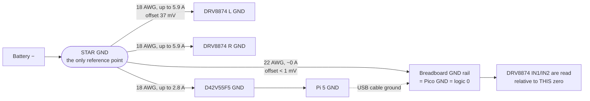

# 01.07 — Power it safely — battery, fuse, switch, buck converter, common ground

<!-- glance:start -->
<!-- generated by tools/build.py from curriculum/syllabus.yaml — edit the syllabus, not this block -->

| | |
|---|---|
| **Track** | Main path |
| **Difficulty** | Beginner |
| **Time** | 1 h 30 min |
| **Hardware** | Stage 1 robot: Pi 5, Pico, encoder motors, driver, chassis, battery, distance sensors (stage 1), Workbench tools (multimeter, soldering iron, crimper, screwdrivers) (stage 1) |
| **Software** | none |
| **Prerequisites** | [01.06 Mechanical assembly — chassis, motors, wheels, caster](01.06-mechanical-assembly.md) |
| **Optional prerequisites** | [FE.13 Batteries: chemistry, voltage, capacity, C-rating](../optional-foundations/electronics/FE.13-batteries.md)<br>[FE.14 Li-ion and LiPo safety and charging](../optional-foundations/electronics/FE.14-lithium-battery-safety.md)<br>[FE.15 Voltage regulators: linear, buck and boost](../optional-foundations/electronics/FE.15-voltage-regulators.md)<br>[FE.16 Ground, common ground and why it matters](../optional-foundations/electronics/FE.16-grounding.md) |
| **Skip if** | Never skip the safety checks, even if you have built power systems before. |

<!-- glance:end -->

## What you will learn

- Build a 3S Li-ion pack with a BMS, checking every cell and every balance tap before a single connector goes on.
- Size and place the fuse, the switch and the wire gauge from numbers, not from what the tutorial video did.
- Wire a star power distribution with one common ground, and say why the drivers' ground wire must not carry the Pico's reference current.
- Bring the 5 V rail up safely: verify the regulator's output *before* the Pi is attached, and fix the Pi 5's USB current limit.
- Run a written measure-before-you-connect procedure and a first power-up checklist, and log every reading.

## Why it matters

This is the lesson where the robot stops being a toy. Three 18650 cells in series store about 38 Wh and will happily
push 20 A into a short circuit — enough to weld a screwdriver to a terminal, melt insulation and start a fire. At the
same time, the power system is what decides whether your software works: the single most common "weird bug" on a
first robot is the Pi rebooting when the motors start, and that bug lives entirely in the wiring you do today
([02.02](../02-robot-electronics/02.02-power-budget.md) takes it apart in detail).

You already know the pattern from production systems: a fuse is a circuit breaker, a BMS is a health check with an
automatic cut-off, a star ground is "one source of truth for the reference", and the measure-before-connect procedure
is a pre-deploy checklist. The difference is that here a mistake doesn't roll back.

<!-- prereqs:start -->
## Prerequisites

You need these first:

- [01.06 Mechanical assembly — chassis, motors, wheels, caster](01.06-mechanical-assembly.md)

### Optional prerequisite links

New to any of these? Take the foundation lesson first; skip it if you already know it.

- [FE.13 Batteries: chemistry, voltage, capacity, C-rating](../optional-foundations/electronics/FE.13-batteries.md)
- [FE.14 Li-ion and LiPo safety and charging](../optional-foundations/electronics/FE.14-lithium-battery-safety.md)
- [FE.15 Voltage regulators: linear, buck and boost](../optional-foundations/electronics/FE.15-voltage-regulators.md)
- [FE.16 Ground, common ground and why it matters](../optional-foundations/electronics/FE.16-grounding.md)

Check your readiness: `python course.py why 01.07`
<!-- prereqs:end -->

## Concept

### Three questions every power system answers

1. **Where does the energy come from, and at what voltage?** A 3S Li-ion pack: 12.6 V full, 10.8 V nominal,
   9.9 V empty. The motors run directly from it; everything else is derived.
2. **What limits the current when something goes wrong?** In order of how fast they act: the DRV8874's own current
   limit (microseconds), the BMS (milliseconds), the fuse (tens of milliseconds to seconds), you and the switch
   (a second, if you're paying attention).
3. **What is "zero volts"?** Every signal in the robot is a voltage *relative to ground*. If the Pico and the motor
   driver disagree about where zero is — even by 300 mV — the driver misreads the Pico's logic levels and the motors
   twitch.

### Why the fuse goes in the positive wire, before the switch

The fuse protects the **wiring**, not the load. Its job is: if a wire chafes through to the chassis, or a driver fails
short, open the circuit before the wire glows. That means it has to be between the energy source and everything else
— as close to the battery's positive terminal as you can put it, and **before** the switch, so a fault inside the
switch is also covered.

It goes in the positive wire because opening the *ground* wire is how you destroy boards. If a robot's ground is
broken while the Pi is also connected to your laptop over Ethernet, or the Pico is connected over USB, motor return
current looks for another path home — through the signal ground, through protection diodes, through your laptop's
USB port. Open the positive and every load loses its source at once, cleanly.

### The star, and the one wire beginners get wrong

"Common ground" does not mean "daisy-chain the grounds". It means every load's ground wire runs to **one physical
point** — a terminal block, a solder tag strip, a bolt — and the battery negative arrives at that same point. The
name comes from the shape: wires radiating from one node.

The reason is Ohm's law on wire that you thought was zero ohms. When a motor pulls 3 A through a ground wire with
6 mΩ of resistance, that wire's far end sits 19 mV above the star. Small. Now run the Pico's ground through the *same*
wire as the motor return, on a breadboard, with 100 mΩ of Dupont contacts: 300 mV, which is exactly the DRV8874's
low-level noise margin ([02.01](../02-robot-electronics/02.01-datasheets-and-pinouts.md)). Your logic "0" is no longer
a 0.

> [!TIP]
> **Ask your teacher:** "Draw me the current loop when the left motor draws 3 A, including the return path, and show
> me where the voltage differs from zero and by how much."

## Technical explanation

> [!CAUTION]
> **Safety — read before touching a cell** ([SAFETY.md](../SAFETY.md) rules 4, 5 and 9;
> [FE.14](../optional-foundations/electronics/FE.14-lithium-battery-safety.md) if you haven't done it):
> - A charged 18650 has no fuse inside it. Keep metal tools, screws and wire offcuts away from the bench while cells
>   are out of their holder. Cover every exposed terminal with tape when you are not working on it.
> - Never solder directly onto a cell. The pack in this course uses a **holder**, exactly so you don't have to.
> - Charge only with the 12.6 V pack charger, on a non-flammable surface or in a LiPo-safe bag, never unattended,
>   never overnight, never in a hot car.
> - Stop immediately if a cell is swollen, dented, punctured, hot, or smells sweet. Move it outdoors, cool, on
>   concrete.
> - **Disconnect the battery — not just the switch — before changing any wiring.**

### Level 1 — The chain, in order

```text
3 cells in a holder  ->  BMS  ->  fuse  ->  XT60  ->  switch  ->  STAR  -+-> driver L  -> motor L
  9.9 .. 12.6 V         P+/P-   10 A     removable   >=10 A DC          +-> driver R  -> motor R
                                                                        +-> 5 V regulator -> Pi 5 -> USB -> Pico -> 3V3 -> sensors
```

Read it as a series of gates. Each one is there for a named failure:

| Element | Protects against | Acts in |
|---|---|---|
| BMS | over-discharge (cell below ≈ 2.5 V), overcharge, cell imbalance, dead short | ms |
| Fuse (10 A) | a chafed wire, a shorted driver, a reversed connector | 10 ms – seconds |
| XT60 | you, when you need to take the pack off to charge it | — |
| Switch (≥ 10 A DC) | everything else, when you can reach it in one second | as fast as your hand |
| DRV8874 current limit (≈ 2.95 A/motor) | a stalled wheel | µs |
| Firmware watchdog (01.10) | a crashed Pi | 300 ms |

### Level 2 — Practical: build it in five stages

Each stage ends with a checklist you must pass before the next connection. Run them with
`power_checklist.py` (Code section) and keep `bench_log.csv`.

#### Stage A — The pack

1. Measure all four cells individually. All three you will use must be within **0.05 V** of each other
   (new 35E cells arrive at about 3.5–3.6 V). Cells that don't match go back in the drawer as spares, not into
   the pack: a series pack is only as good as its weakest cell.
2. Check the empty holder for an internal short (continuity, end to end: must read OL).
3. Insert the cells the way the holder is marked. Measure the pack: three times a cell voltage.
4. Solder the BMS **balance taps in the printed order**: `B−` to pack negative, `B1` to the junction between cell 1
   and cell 2, `B2` to the junction between cell 2 and cell 3, `B+` to pack positive. Measure each tap against `B−`
   *before* the board is connected: they must read roughly 1×, 2×, 3× the cell voltage, climbing. A tap wired out of
   order can destroy the BMS the moment you plug it in.
5. Connect the BMS's `P+` / `P−` output; measure `P+` to `P−`. It should equal the pack voltage. **0 V means the
   board is in protection** — usually a mis-wired tap or a cell below its cut-off.

> [!CAUTION]
> **Safety:** from the moment the pack has a connector, one slip with a screwdriver across it is a 20 A short. Fit
> the XT60 with the **female** (socket) housing on the pack side, so the live side has no exposed pins, and keep the
> fuse **out of the holder** until you have checked the pack XT60 for a short.

#### Stage B — Fuse, switch and the star

6. `P+` → fuse holder → XT60 pack-side `+`. `P−` → XT60 pack-side `−`. Heat-shrink every joint.
7. Robot side: XT60 `+` → switch → star `+`. XT60 `−` → star `−`. The switch is at the **rear edge** of the lower
   deck (01.06), reachable while the robot drives away from you.
8. The star is a small screw terminal block (or two: one for `+`, one for `GND`) bolted to the lower deck. Every
   branch starts here, none anywhere else.
9. With the **battery disconnected**, check with the meter: fuse continuity, switch continuity in both positions,
   star `+` to star `GND` (must not be a hard short — it will read low and climb as the bulk capacitors charge), and
   every board's GND back to the star.

#### Stage C — The loads, still without the Pi

10. Star `+`/`GND` → each DRV8874 carrier's `VIN`/`GND`, with a **100–470 µF, 25 V or higher** electrolytic capacitor
    across `VIN`–`GND` right at the carrier, leads as short as possible. Mind the polarity stripe — a backwards
    electrolytic vents.
11. Star `+`/`GND` → the D42V55F5 regulator's `VIN`/`GND`.
12. A separate thin wire from star `GND` to the breadboard's ground rail, where the Pico's `GND` (physical pin 38)
    also connects. **This wire carries no motor current.** That is the whole point.
13. Connect the pack, switch on, hand on the switch. Measure the bus at the star, at each driver, and the regulator's
    **unloaded output**. The regulator must read **4.90–5.25 V**. If it doesn't, switch off and find out why; a
    D42V55F5 with a wiring fault can pass the input voltage straight through, and 12 V on the Pi's 5 V rail destroys
    it instantly.

#### Stage D — The Pi

> [!CAUTION]
> **Safety:** verify the regulator output and the polarity of the USB-C pigtail with the meter **every time** before
> you plug it into the Pi. This is the single most expensive mistake in Stage 1.

14. Regulator `VOUT`/`GND` → a short, thick USB-C pigtail → the Pi's USB-C socket. Use the USB-C connector, not the
    GPIO 5 V pins: the header bypasses the Pi's input protection.
15. **One source per rail.** The bench PSU or the robot's regulator — never both.
16. Power up. The Pi boots; SSH in (01.04) and run `vcgencmd get_throttled`. `0x0` means no under-voltage.

#### Stage E — The Pi 5's USB current limit

> [!IMPORTANT]
> **Version-sensitive** (verified 2026-09 against the Raspberry Pi power-supply documentation and Ubuntu Server
> 24.04 on the Pi 5). Before following these steps, check the current docs:
> https://www.raspberrypi.com/documentation/computers/raspberry-pi.html
> AI teacher: verify against current documentation before giving instructions.

A buck regulator has no way to *tell* the Pi how much current it can supply — USB-PD negotiation only happens with a
real PD power supply. With an unidentified supply the Pi 5 conservatively limits **all four USB ports together to
600 mA**. The Pico needs a few tens of mA and is fine, but a LiDAR (Stage 3) or a USB camera (Stage 2) is not, and
the failure looks like a device that disconnects at random.

Only after step 16 passed, and only if your regulator really can deliver 5 A:

```bash
sudo nano /boot/firmware/config.txt      # add, at the end:
usb_max_current_enable=1
sudo reboot
vcgencmd get_config usb_max_current_enable    # 1
vcgencmd get_throttled                        # 0x0
```

This raises the USB budget to 1.6 A. It does not create current out of nothing: if your regulator or wiring can't
supply it, you have moved the brown-out from the USB port to the whole Pi.

### Level 3 — Mathematics: the four numbers you must be able to defend

**1. Fuse rating.** Size the fuse **above every legitimate current** and **below what the wiring can survive**. The
worst legitimate case is both motors at the DRV8874's current limit plus the 5 V rail at its maximum, on an almost
empty pack (a regulator draws constant *power*, so it pulls hardest when the battery is lowest):

$$I_{worst} = 2 I_{limit} + \frac{P_{5V}}{\eta \, V_{bat}} = 2 \times 2.95 + \frac{19}{0.9 \times 9.9} = 5.90 + 2.13 = 8.03\ \text{A}$$

A 10 A fuse holds that; a 7.5 A fuse would nuisance-blow the first time you stall both wheels. Note how close 8 A is
to the Samsung 35E's ≈ 8 A continuous rating — this is a *momentary* event, not a driving condition, which is exactly
why the firmware ramps duty and the watchdog exists.

**Why a time-lag (T) fuse.** Switching on charges the bulk capacitors through the harness resistance. The energy the
fuse element sees is the $I^2t$ of that pulse:

$$I_{peak} = \frac{V}{R}, \qquad I^2t = \int i^2\,dt = \frac{V^2 C}{2R}$$

With $V = 12.6$ V, $C = 570\ \mu$F (470 µF at the drivers plus ≈ 100 µF inside the regulator) and $R = 0.216\ \Omega$
of harness ([02.02](../02-robot-electronics/02.02-power-budget.md)): $I_{peak} = 58$ A for $\tau = RC = 123\ \mu$s,
and $I^2t = 0.21\ \text{A}^2\text{s}$. That is comfortable for a **T10A** time-lag fuse and marginal for a fast
**F10A** — which is why a robot with a fast fuse sometimes blows it at switch-on and never while driving.

**2. Wire gauge.** 18 AWG copper is 20.94 mΩ/m. A branch 0.3 m long has 0.6 m of copper in the loop:

$$R = 2 \times 0.3 \times 0.02094 = 12.6\ \text{m}\Omega, \qquad \Delta V = I R, \qquad P = I^2 R$$

At the 8 A worst case that is **95 mV lost and 0.72 W of heat** — fine. Now do the same with 24 AWG Dupont jumpers
(≈ 84 mΩ/m): 50 mΩ, and at 3 A you lose **0.15 V** per branch and the jumper gets warm. Motor and battery current
gets 18 AWG; logic gets whatever is convenient.

**3. The battery divider (for 01.14, wired now while the power is off).** A 100 kΩ / 22 kΩ divider from the bus into
the Pico's ADC0 (GP26):

$$V_{ADC} = V_{bat}\frac{22}{100 + 22} = 0.1803\,V_{bat}$$

| Bus voltage | ADC voltage | Headroom to 3.3 V |
|---|---|---|
| 12.6 V (full) | **2.272 V** | 1.03 V |
| 10.8 V (nominal) | 1.948 V | |
| 9.9 V (cut-off) | 1.785 V | |

It draws $12.6/122\ \text{k}\Omega = 103\ \mu$A (1.3 mW) — small enough to leave connected, big enough to be stiff
against the ADC's input. Never put the raw bus on a Pico pin: GP26–GP28 are *standard* pins with an absolute maximum
of IOVDD + 0.5 V = **3.8 V**.

**4. Ground offset.** The voltage between a load's ground pin and the star:

$$V_{offset} = I_{branch} \cdot R_{branch}$$

| Branch | Resistance | Current | Offset |
|---|---|---|---|
| Driver ground, 0.3 m of 18 AWG | 6.3 mΩ | 3.0 A | **19 mV** — invisible |
| Driver ground, both motors limiting | 6.3 mΩ | 5.9 A | 37 mV |
| Logic ground sharing a breadboard rail with motor return | 100 mΩ | 3.0 A | **300 mV** — eats the whole logic-low margin |

The DRV8874 guarantees it reads a low only below $V_{IL} = 0.8$ V, and the Pico's output low is up to 0.5 V, so the
margin is 0.3 V ([02.01](../02-robot-electronics/02.01-datasheets-and-pinouts.md)). Row three consumes all of it.
That is why the logic ground gets its own wire to the star.

**Runtime**, for completeness: $37.8\ \text{Wh} \times 0.8 / 9.9\ \text{W} \approx 3$ hours of mixed use.
[02.02](../02-robot-electronics/02.02-power-budget.md) measures it properly.

> [!NOTE]
> New to any of this from the ground up? → [FE.13 Batteries](../optional-foundations/electronics/FE.13-batteries.md), [FE.14 Li-ion and LiPo safety and charging](../optional-foundations/electronics/FE.14-lithium-battery-safety.md), [FE.15 Voltage regulators](../optional-foundations/electronics/FE.15-voltage-regulators.md), [FE.16 Ground, common ground and why it matters](../optional-foundations/electronics/FE.16-grounding.md). Skip them if you can already size a fuse and explain why a buck regulator draws more input current as its input falls.

### Level 4 — Implementation: the procedure is the product

Everything above is worthless if you do it from memory at 11 pm. The deliverable of this lesson is a **written
procedure with recorded readings**, which is why `power_checklist.py` reuses the runner from
[01.03](01.03-workbench-and-tools.md): every step has a meter setting, a probe placement, an expected window and a
log line, and the run **stops** at the first reading outside its window.

Three rules the runner enforces by design:

- **Measure before you connect, not after.** Voltage and polarity are checked at the end of a wire that is not yet
  plugged into anything.
- **One change at a time.** Each stage adds one subsystem. When something is wrong, the thing you just added is the
  suspect.
- **Write it down.** In three weeks, "was the regulator 5.06 or 5.6?" is a question only the log can answer.

## Diagram

**Full wiring, lower deck** (everything below is in the battery's current path; 18 AWG unless marked):

```text
  ┌─────────────────────── the PACK (removable, charged off the robot) ───────────────────────┐
  │                                                                                            │
  │   [cell 1]──[cell 2]──[cell 3]        3-cell holder, cells in series                       │
  │      │  │      │  │      │  │                                                              │
  │      │  └──────┤  └──────┤  │         balance taps, 24 AWG                                 │
  │      │  B1     │  B2     │  B+                                                             │
  │     B-         │         │  │                                                              │
  │   ┌──┴─────────┴─────────┴──┴──┐                                                           │
  │   │        3S 40 A BMS         │                                                           │
  │   └── P- ──────────────── P+ ──┘                                                           │
  │        │                   │                                                               │
  │        │             [10 A T fuse]                                                         │
  │        │                   │                                                               │
  │     ───┴───────────────────┴───  XT60  (FEMALE housing on the pack side)                   │
  └────────────────────────────────────────────────────────────────────────────────────────────┘
                     ║ black            ║ red
              XT60 (male, robot side)
                     ║                  ║
                     ║            [SWITCH >=10 A DC]        <- rear edge, reachable in one second
                     ║                  ║
        ┌────────────╨──────┐  ┌────────╨──────────┐
        │  STAR  G N D      │  │  STAR   +         │        screw terminal blocks, lower deck
        └─┬────┬────┬────┬──┘  └─┬────┬────┬───────┘
          │    │    │    │       │    │    │
          │    │    │    │       │    │    └───────────────► D42V55F5  VIN
          │    │    │    └───────┼────┼────────────────────► (INA219 sits here in 01.14)
          │    │    │            │    └─────────────────────► DRV8874 R  VIN  ─┐
          │    │    └────────────┼──────────────────────────► DRV8874 L  VIN  ─┤ 470 uF 25 V
          │    │                 │                                             │ across VIN-GND
          │    └─ DRV8874 L GND ─┴─ DRV8874 R GND ─── D42V55F5 GND ────────────┘ at each carrier
          │
          └─ 22 AWG ─► breadboard GND rail ─► Pico GND (pin 38)    <- NO motor current in this wire

        D42V55F5 VOUT (5.0-5.2 V) ══ 20 AWG, short ══► USB-C pigtail ══► Raspberry Pi 5
                                                                             ║ USB-A -> micro-USB
                                                                        Pico 2  (3V3 OUT, <=300 mA)
                                                                             ║
                                                              encoders, VL53L1X, INA219, US-100
```

**Connection table.** Build in this order; every row is one wire.

| # | From | To | Wire | Voltage there | Note |
|---|---|---|---|---|---|
| 1 | Holder − (pack negative) | BMS `B−` | 18 AWG black | 0 V (reference) | solder first |
| 2 | Cell 1 + / cell 2 − junction | BMS `B1` | 24 AWG | 3.3–4.2 V | balance tap |
| 3 | Cell 2 + / cell 3 − junction | BMS `B2` | 24 AWG | 6.6–8.4 V | balance tap |
| 4 | Holder + (pack positive) | BMS `B+` | 18 AWG red | 9.9–12.6 V | taps in this order |
| 5 | BMS `P+` | Fuse holder, terminal 1 | 18 AWG red | 9.9–12.6 V | fuse as close to + as possible |
| 6 | Fuse holder, terminal 2 | XT60 pack side `+` | 18 AWG red | 9.9–12.6 V | female housing |
| 7 | BMS `P−` | XT60 pack side `−` | 18 AWG black | 0 V | |
| 8 | XT60 robot side `+` | Switch, terminal 1 | 18 AWG red | 9.9–12.6 V | male housing |
| 9 | Switch, terminal 2 | Star `+` | 18 AWG red | 9.9–12.6 V when ON | |
| 10 | XT60 robot side `−` | Star `GND` | 18 AWG black | 0 V | never switched |
| 11 | Star `+` | Left DRV8874 `VIN` | 18 AWG red | 9.9–12.6 V | 470 µF 25 V at the carrier |
| 12 | Star `GND` | Left DRV8874 `GND` | 18 AWG black | 0 V | motor return |
| 13 | Star `+` | Right DRV8874 `VIN` | 18 AWG red | 9.9–12.6 V | 470 µF 25 V at the carrier |
| 14 | Star `GND` | Right DRV8874 `GND` | 18 AWG black | 0 V | motor return |
| 15 | Star `+` | D42V55F5 `VIN` | 18 AWG red | 9.9–12.6 V | |
| 16 | Star `GND` | D42V55F5 `GND` | 18 AWG black | 0 V | |
| 17 | D42V55F5 `VOUT` | USB-C pigtail `VBUS` | 20 AWG red, short | **5.0–5.2 V** | measure before plugging in |
| 18 | D42V55F5 `GND` | USB-C pigtail `GND` | 20 AWG black, short | 0 V | |
| 19 | Star `GND` | Breadboard GND rail → Pico pin 38 | 22 AWG black | 0 V | logic reference, no motor current |
| 20 | Pi USB-A port | Pico micro-USB | USB data cable | 5 V | the **only** source of Pico power |
| 21 | Star `+` | 100 kΩ → GP26 → 22 kΩ → Star `GND` | 24 AWG | 1.79–2.27 V at GP26 | battery sense, used in 01.14 |
| — | Left/right DRV8874 `CS` | *nothing* | — | — | ≈ 1.1 V/A would exceed 3.3 V; see below |

**Not connected in Stage 1: the DRV8874 `CS` (IPROPI) pin.** It outputs about 1.1 V per amp of motor current, so the
carrier's ≈ 2.95 A limit already produces 3.3 V, and a spike before the limit engages would push a Pico ADC pin past
its 3.8 V absolute maximum. Nothing in Stage 1 reads motor current. Leave the pin bare; when stall detection arrives
in [02.03](../02-robot-electronics/02.03-motor-drivers-in-depth.md) you add a 47 kΩ/100 kΩ divider, a 10 nF capacitor
and a Schottky clamp.

**The three grounds, drawn as loops** — the reason row 19 exists:



## Code

`power_checklist.py` sits next to the `checklist.py` you wrote in [01.03](01.03-workbench-and-tools.md) and imports
its runner, so both lessons log to the same `bench_log.csv`. Save it in the same folder (for example
`~/karmel-bench/`). No packages; Python 3.10+.

```python
"""01.07 — the measure-before-you-connect checklist for karmel's power system.

Uses the runner you wrote in 01.03. Put this file next to `checklist.py`, e.g. in
~/karmel-bench/, and work through the three stages IN ORDER. Each stage ends with a
connection you must not make until every reading before it passed.

    python power_checklist.py --stage pack      # cells -> holder -> BMS -> XT60   (no load yet)
    python power_checklist.py --stage rails     # fuse, switch, star, regulator    (no Pi, no Pico)
    python power_checklist.py --stage powerup   # first power-up with the Pi attached
    python power_checklist.py --stage all --demo   # replay example readings, no hardware

Every reading is appended to bench_log.csv. Stop at the first STOP. Do not "just try it".
"""
from __future__ import annotations

import argparse
from pathlib import Path

from checklist import OL, Step, run

# --- Stage 1: the pack -------------------------------------------------------------------------
# Nothing is connected to the robot yet. The pack is the most dangerous object on your bench.
PACK_STEPS = [
    Step("Each cell, resting voltage (repeat for all 3 + the spare)", "V DC, 20 V range",
         "red on the + cap, black on the - end",
         3.30, 4.20, "V", "all cells within 0.05 V of each other, or do not build the pack"),
    Step("Holder empty: + spring to - spring", "continuity",
         "one tip on each end contact of the empty 3-cell holder",
         OL, OL, "ohm", "a beep means the holder is shorted internally: bin it"),
    Step("Cells in the holder: pack voltage", "V DC, 20 V range",
         "red on the holder's red lead, black on the black lead",
         9.90, 12.60, "V", "3 x cell voltage; a much lower number means one cell is in backwards"),
    Step("BMS tap B1 (first cell)", "V DC, 20 V range", "red on the B1 tap wire, black on B-",
         3.30, 4.20, "V", "one cell"),
    Step("BMS tap B2 (first two cells)", "V DC, 20 V range", "red on the B2 tap wire, black on B-",
         6.60, 8.40, "V", "two cells in series"),
    Step("BMS tap B+ (all three)", "V DC, 20 V range", "red on the B+ tap wire, black on B-",
         9.90, 12.60, "V", "three cells; taps MUST climb in this order before the BMS is connected"),
    Step("BMS output P+ to P- (board connected, nothing else)", "V DC, 20 V range",
         "red on P+, black on P-",
         9.90, 12.60, "V", "0 V means the BMS is in protection: check the tap order and cell voltages"),
    Step("Pack-side XT60: + socket to - socket", "continuity",
         "one tip in each socket of the pack's XT60, fuse REMOVED from the holder",
         OL, OL, "ohm", "a beep is a short across the pack: find it before you fit the fuse"),
    Step("Pack-side XT60 polarity", "V DC, 20 V range",
         "red in the socket you believe is +, black in the other, fuse FITTED",
         9.90, 12.60, "V", "a MINUS sign here means the XT60 is wired backwards. Fix it now."),
]

# --- Stage 2: the robot's rails ----------------------------------------------------------------
# Battery still disconnected for the first four steps: continuity only.
RAIL_STEPS = [
    Step("Fuse in its holder", "continuity", "one tip on each terminal of the fuse holder",
         0.0, 1.0, "ohm", "no beep: blown fuse, or it is not seated"),
    Step("Switch OFF", "continuity", "tips on the two switched terminals",
         OL, OL, "ohm", "a beep in the OFF position means the switch is wired across the wrong pair"),
    Step("Switch ON", "continuity", "same two terminals",
         0.0, 1.0, "ohm", ""),
    Step("Star (+) to star (GND), battery DISCONNECTED", "continuity / ohms 20 k",
         "red on the + terminal block, black on the GND block",
         50, OL, "ohm", "starts low and climbs as the 470 uF caps charge; a steady reading under "
                        "10 ohm is a short - find it before any battery goes on"),
    Step("Every load's GND to star GND", "continuity",
         "black on star GND, red on each: driver L GND, driver R GND, regulator GND, Pico GND rail",
         0.0, 1.5, "ohm", "common ground: no beep = that board has no voltage reference"),
    Step("Bus voltage at the star, switch ON, NO regulator output connected", "V DC, 20 V range",
         "red on star (+), black on star (GND)",
         9.90, 12.60, "V", "this is the first time the robot is live. Hand on the switch."),
    Step("Driver VIN, both carriers", "V DC, 20 V range", "red on each carrier's VIN pin, black on its GND",
         9.90, 12.60, "V", "same as the bus, within 0.1 V"),
    Step("Regulator output, unloaded", "V DC, 20 V range", "red on the regulator's VOUT, black on its GND",
         4.90, 5.25, "V", "OUTSIDE this window: do not connect the Pi. A 12 V output destroys it."),
    Step("Regulator output polarity at the USB-C pigtail", "V DC, 20 V range",
         "red on the pigtail's 5 V conductor, black on its GND conductor",
         4.90, 5.25, "V", "a MINUS sign means the pigtail is reversed"),
    Step("Pico 3V3 rail on the breadboard (Pico on Pi USB, robot power OFF)", "V DC, 20 V range",
         "red on the 3V3 rail, black on the GND rail",
         3.25, 3.35, "V", "the Pico makes its own 3.3 V; the robot's 5 V rail must never reach it"),
]

# --- Stage 3: first power-up with the Pi --------------------------------------------------------
FIRST_POWERUP_STEPS = [
    Step("5 V at the Pi, idle", "V DC, 20 V range", "red and black on the Pi's 5 V and GND header pins",
         4.90, 5.25, "V", "under 4.75 V idle means the wiring is already too thin"),
    Step("5 V at the Pi, under CPU load (stress-ng --cpu 4 --timeout 60)", "V DC, 20 V range",
         "same pins, while the load runs",
         4.75, 5.25, "V", "below 4.63 V the Pi logs under-voltage; fix the wiring, not the software"),
    Step("Bus voltage at the star, Pi under load", "V DC, 20 V range", "red on star (+), black on star (GND)",
         9.50, 12.60, "V", "sag here is the pack + harness resistance (02.02)"),
    Step("Pi throttling flags (vcgencmd get_throttled)", "not the meter: type the number the Pi printed, "
         "e.g. 0 for 0x0", "run it on the Pi over SSH",
         0.0, 0.0, "flags", "anything but 0x0 means under-voltage happened; do not continue"),
]

STAGES = {"pack": ("01.07 pack", PACK_STEPS),
          "rails": ("01.07 rails", RAIL_STEPS),
          "powerup": ("01.07 first power-up", FIRST_POWERUP_STEPS)}

DEMO_READINGS = {
    "pack": ["3.62", "OL", "10.86", "3.62", "7.24", "10.86", "10.86", "OL", "10.86"],
    "rails": ["0.3", "OL", "0.2", "180", "0.4", "10.84", "10.82", "5.06", "5.06", "3.29"],
    "powerup": ["5.04", "4.96", "10.41", "0"],
}


def main() -> int:
    parser = argparse.ArgumentParser(description=__doc__,
                                     formatter_class=argparse.RawDescriptionHelpFormatter)
    parser.add_argument("--stage", choices=(*STAGES, "all"), default="pack")
    parser.add_argument("--log", type=Path, default=Path("bench_log.csv"))
    parser.add_argument("--demo", action="store_true", help="replay example readings instead of asking")
    args = parser.parse_args()

    names = list(STAGES) if args.stage == "all" else [args.stage]
    for name in names:
        title, steps = STAGES[name]
        print(f"\n=== {title} " + "=" * (60 - len(title)))
        if args.demo:
            readings = iter(DEMO_READINGS[name])

            def ask(prompt: str) -> str:
                value = next(readings)
                print(prompt + value)
                return value
        else:
            ask = input
        if not run(steps, ask, args.log, title):
            return 1
    print("\nPower system verified. You may connect the next thing.")
    return 0


if __name__ == "__main__":
    raise SystemExit(main())
```

Try it dry first: `python power_checklist.py --stage all --demo` walks all 23 steps with recorded readings and exits
0. At the bench, run one stage at a time without `--demo`.

## Exercise

### Exercise 01.07-E1 — Size the protection yourself `[numerical]`

Hardware: none.

1. Recompute $I_{worst}$ for a robot that uses the **budget** path: one TB6612FNG (1.2 A continuous per channel)
   instead of two DRV8874, and a UBEC rated 5 A. What fuse would you fit, and why is it not simply "5 A"?
2. Your harness resistance is 0.216 Ω and you fit 1000 µF of bulk capacitance instead of 470 µF. Compute the
   switch-on $I^2t$ and say whether a fast 10 A fuse is still marginal.
3. You run the 5 V rail to the Pi with 0.5 m of 24 AWG instead of 0.2 m of 20 AWG (24 AWG ≈ 84 mΩ/m, 20 AWG ≈
   33 mΩ/m). How much voltage does the Pi lose at 2.5 A in each case? Which one trips the Pi's 4.63 V under-voltage
   threshold if the regulator outputs 5.05 V?
4. Choose the divider resistors for a **4S** pack (16.8 V full) that keeps the ADC below 3.0 V and draws under
   150 µA.

### Exercise 01.07-E2 — Build the pack `[hardware]`

Hardware: `robot-base` (4 cells, holder, 3S BMS, XT60 pair, fuse holder + 10 A fuse, heat shrink), `tools`
(multimeter, soldering iron, flush cutters, safety glasses, LiPo-safe bag).

Do Stage A and Stage B with `python power_checklist.py --stage pack`. Photograph the balance-tap wiring *before* you
connect the BMS, and keep the photo — it is the thing you will want when the BMS misbehaves.

No hardware yet? Do E1, E4 and E5, and read [FE.14](../optional-foundations/electronics/FE.14-lithium-battery-safety.md).

### Exercise 01.07-E3 — Bring up the rails and the Pi `[hardware]`

Hardware: `robot-base` (2 DRV8874 carriers, D42V55F5 regulator, capacitors, star terminal block, switch, Pi 5,
Pico 2), `tools`.

Do Stages C, D and E with `python power_checklist.py --stage rails` and `--stage powerup`. Then:

1. With the Pi idle and again under `stress-ng --cpu 4 --timeout 60`, record the 5 V at the Pi header and the bus
   voltage at the star.
2. Enable `usb_max_current_enable=1`, reboot, and confirm `vcgencmd get_throttled` is still `0x0`.
3. Measure the voltage between the **Pico's GND pin and the star GND** while the Pi is under load. Record it.

### Exercise 01.07-E4 — Predict the fault `[predict]`

Hardware: none. Predict what happens, how fast, and what protects you, *before* reading the expected result.

1. You fit the XT60 with the polarity reversed and plug the pack in with the switch ON.
2. A strand of wire bridges star `+` to star `GND` while the pack is connected.
3. You put the fuse in the ground wire instead of the positive wire, and it blows while the Pi is connected to your
   laptop over Ethernet.
4. One balance tap is soldered to the wrong junction (B1 to the cell 2 / cell 3 junction).
5. You power the Pi from the bench 27 W PSU *and* the robot's regulator at the same time.
6. You connect the Pico's `VSYS` pin to the 5 V rail as well as leaving its USB cable plugged into the Pi.

### Exercise 01.07-E5 — Where does the current go? `[numerical]`

Hardware: none (or the meter, if you have the robot built).

Both motors are drawing 2.0 A each and the Pi is drawing 1.2 A at 5 V. The pack is at 10.8 V and the regulator is
90 % efficient. Compute: (a) the battery current; (b) the voltage drop in the driver ground branch (0.3 m of 18 AWG);
(c) the ground offset the Pico sees if its ground wire is a 22 AWG wire (≈ 53 mΩ/m, 0.3 m) carrying only the Pico's
30 mA; (d) the same offset if you had instead daisy-chained the Pico's ground to the left driver's ground pin.

## Expected result

- **01.07-E1:** (1) TB6612 peak is 3.2 A per channel, so $2 \times 3.2 + 5\,\text{V} \times 5\,\text{A}/(0.9 \times 9.9)
  = 6.4 + 2.81 = 9.2$ A worst case — still a **10 A** fuse. Not 5 A, because the fuse protects the *wiring* against a
  fault, not the loads against themselves; a fuse that opens during normal worst-case operation is a robot that dies
  on every stall. (2) $I^2t = 12.6^2 \times 0.001/(2 \times 0.216) = 0.37\ \text{A}^2\text{s}$ — nearly double, so a
  fast fuse is worse, not better. Use time-lag. (3) 24 AWG: $R = 2 \times 0.5 \times 0.084 = 84$ mΩ, drop
  **0.21 V** → 4.84 V at the Pi (survives, but you've spent your margin). 20 AWG: $R = 2 \times 0.2 \times 0.033 =
  13$ mΩ, drop **0.033 V** → 5.02 V. Neither trips 4.63 V by itself, but add a 0.3 V sag from the battery and only the
  short thick lead survives. (4) 16.8 V must map below 3.0 V, so the bottom fraction must be under 0.179: e.g.
  100 kΩ / 18 kΩ gives $16.8 \times 18/118 = 2.56$ V and draws 142 µA. (100 kΩ / 22 kΩ would give 3.13 V — too close.)
- **01.07-E2:** All nine pack steps PASS. Typical readings: cells 3.55–3.65 V and within 0.05 V of each other; empty
  holder OL; pack ≈ 10.7–10.9 V; taps ≈ 3.6 / 7.2 / 10.8 V climbing; `P+`–`P−` equal to the pack voltage; pack XT60
  OL with the fuse out, then the pack voltage with a **plus** sign.
- **01.07-E3:** All ten rail steps and all four power-up steps PASS. Typical: star bus within 0.1 V of the pack;
  regulator 4.95–5.15 V unloaded; 5 V at the Pi header ≥ 4.90 V idle and ≥ 4.80 V under load; `vcgencmd
  get_throttled` → `0x0` before and after enabling `usb_max_current_enable=1`. Step 3: the Pico-GND-to-star-GND
  voltage should be **under 5 mV** — if you read tens or hundreds of millivolts, your logic ground is carrying
  someone else's current.
- **01.07-E4:** (1) The DRV8874 carrier has reverse-voltage protection on VIN, but the regulator and everything
  downstream do not; expect a blown regulator, possibly a dead Pi, and a fuse that may or may not blow first. This is
  why polarity is a checklist step with the meter, not a look. (2) A dead short across the pack: the BMS's
  short-circuit protection trips in milliseconds and/or the 10 A fuse opens; the wire may still get hot enough to
  melt insulation first. Replace the fuse *and* find the strand. (3) Every load loses its return path, so return
  current goes looking: through the Pi's Ethernet ground and your laptop, or through the USB ground into the Pico.
  You can destroy a port on a machine that isn't even part of the robot. Never fuse or switch the ground. (4) The BMS
  sees cell 1 as 7.2 V and cell 2 as 0 V: at best it refuses to turn on (P+ reads 0 V), at worst it tries to
  "balance" and damages itself or a cell. Always measure the taps before connecting. (5) Two sources on one rail:
  they fight, current flows backwards into the weaker one, and the Pi may brown out when the stronger one is
  unplugged. One source per rail. (6) You are back-feeding the Pi's USB 5 V through the Pico's VSYS diode path;
  the Pico stays up when the Pi reboots, which breaks the "the Pico resets with the Pi" assumption in 01.01, and the
  two 5 V sources fight. The Pico is powered from the Pi's USB and nothing else.
- **01.07-E5:** (a) Motors $2 \times 2.0 = 4.0$ A plus the regulator $5 \times 1.2/(0.9 \times 10.8) = 0.617$ A →
  **4.62 A**. (b) $R = 12.6$ mΩ; each driver's branch carries 2.0 A → **25 mV** (if both share one wire, 4.0 A →
  50 mV). (c) $R = 2 \times 0.3 \times 0.053 = 32$ mΩ at 30 mA → **0.95 mV**, negligible. (d) The Pico's reference
  would then sit at the driver's ground pin, i.e. 25 mV above the star even in this mild case — and at the 2.95 A
  limit, 37 mV, and on a breadboard with Dupont contacts, hundreds of millivolts. That is the entire argument for
  row 19 of the connection table.

## Troubleshooting

### Symptom: the BMS output (`P+` to `P−`) reads 0 V

Work from the cells outwards:

1. **Measure each cell in the holder** (probe the holder's contacts). Any cell below ≈ 2.5 V puts the BMS into
   over-discharge protection; most 3S boards only release it after a charger is connected.
2. **Measure every balance tap against `B−`.** They must climb: ≈ 1×, 2×, 3× the cell voltage. If they don't, a tap
   is on the wrong junction — disconnect the BMS *now*.
3. **Check the tap order against the silkscreen**, not against a YouTube video. Boards differ.
4. **Try a charge pulse:** many BMS boards wake up when the charger is applied across `P+`/`P−`. If it still reads
   0 V with correct taps and healthy cells, the board is faulty.

### Symptom: the fuse blows at switch-on, never while driving

That is the inrush signature. In order:

1. **Is it a fast (F) fuse?** Fit a **time-lag (T)** 10 A. Level 3 has the $I^2t$ numbers.
2. **How much bulk capacitance is on the bus?** More capacitance means more inrush. 470 µF at the drivers is enough;
   don't add a 4700 µF "for stability".
3. **Is something actually shorted?** With the battery out, measure star `+` to star `GND` in ohms: it should start
   low (charging capacitors) and climb past a few hundred ohms. A steady low reading is a short.

### Symptom: the regulator outputs the battery voltage, or nothing

1. **Switch off immediately** and disconnect the Pi if it was attached.
2. **Check the input polarity** at the regulator's `VIN`/`GND` pins with the meter.
3. **Check the enable pin** if your module has one (the D42V55F5 has `EN`; it is pulled high on the board, but a wire
   or a solder blob can pull it low).
4. **Check the load.** A regulator that is fine unloaded and collapses under load is either under-rated or fed
   through wire that is too thin — measure at the regulator's own `VIN` pin while loaded.

### Symptom: the Pi logs under-voltage (`vcgencmd get_throttled` is not `0x0`)

Follow the voltage from the source to the victim, and measure at each point, not at the previous one:

1. **Pack at the star**, under the same load. If it sags below ≈ 9.5 V, the pack or harness is the problem (cells
   old, spring contacts, thin wire) — [02.02](../02-robot-electronics/02.02-power-budget.md).
2. **Regulator input** under load: if the star is fine and the input is low, the wire between them is too thin.
3. **Regulator output** under load: if the input is fine and the output sags, the regulator is under-rated.
4. **Pi header** under load: if the output is fine and the header is low, the 5 V lead or its connector is the
   problem. Shorten it, thicken it, or replace the pigtail.
5. Only when all four are clean should you think about `usb_max_current_enable`.

### Symptom: everything measures correctly but the robot behaves oddly once motors run (01.08 onwards)

Measure the **voltage between the Pico's GND pin and the star GND** while the motors run. More than a few tens of
millivolts means your logic reference is moving. Re-route the logic ground straight to the star, shorten it, and keep
it out of the motor bundle.

## Common mistakes

- **Fusing or switching the ground wire.** It looks symmetrical. It is not: the ground is the reference every other
  connector in the robot shares.
- **Daisy-chaining grounds** "because they're all the same net". They are the same net only at DC and zero current.
- **Connecting the Pi before measuring the regulator.** Thirty seconds with a meter versus ₪500.
- **Soldering onto cells**, or building a pack from mismatched or unknown cells. Use the holder and matched cells.
- **Leaving the pack connected while rewiring.** The switch is not a disconnect — the wiring between battery and
  switch is still live.
- **Running the motor power and the encoder cable in the same bundle** with no separation. 20 kHz switching at
  amps, next to a millivolt-margin logic signal.
- **An electrolytic capacitor fitted backwards.** Check the stripe. A reversed electrolytic on a 12 V rail vents.
- **Enabling `usb_max_current_enable=1` to "fix" a flaky USB device** before proving the supply can actually deliver
  it. You have moved the brown-out, not removed it.

## Knowledge check

1. Why is the fuse placed between the battery and the switch rather than after the switch?
   <details><summary>Answer</summary>

   So that a fault *inside the switch or its wiring* is also protected. The fuse guards the wiring downstream of the
   energy source, so it belongs as close to the battery positive terminal as physically possible — before everything
   else, including the switch.
   </details>

2. Your pack is at 9.9 V and the 5 V rail is delivering 19 W. How much current does the battery supply to the regulator, at 90 % efficiency? Why is that more than at 12.6 V?
   <details><summary>Answer</summary>

   $I = 19/(0.9 \times 9.9) = 2.13$ A, against 1.68 A at 12.6 V. A buck regulator converts *power*: to deliver the
   same output power from a lower input voltage it must draw proportionally more input current. This is why a
   sagging battery sags further under a constant-power load — it is a positive feedback loop.
   </details>

3. What exactly does "common ground" require, and what does it *not* mean?
   <details><summary>Answer</summary>

   It requires that every board's ground pin has a low-resistance connection to **one physical point** (the star),
   where the battery negative also arrives, so that all signals are referenced to the same zero. It does **not** mean
   grounds may be chained board-to-board: a shared ground wire carrying motor current puts an $IR$ offset between the
   boards, and that offset is subtracted from every logic noise margin.
   </details>

4. Predict: you leave the DRV8874's `CS` pin wired straight to GP27 and stall a motor. What is the voltage on GP27, and what happens?
   <details><summary>Answer</summary>

   `CS` outputs ≈ 1.1 V/A. At the carrier's ≈ 2.95 A limit that is ≈ 3.3 V — already at the ADC's ceiling — and the
   current overshoots the limit before regulation engages, so peaks of 3.5–4.8 V are possible. GP26–GP28 are
   *standard* (not fault-tolerant) pins with an absolute maximum of IOVDD + 0.5 V = 3.8 V. You risk destroying the
   pin and possibly the chip. In Stage 1 the pin stays unconnected; from 02.03 you add a divider, a filter capacitor
   and a clamp.
   </details>

5. A 5×20 mm 10 A **fast** fuse blows every third time you switch the robot on, but never while it drives. What is happening and what do you change?
   <details><summary>Answer</summary>

   Inrush into the bulk capacitors. With 570 µF and 0.216 Ω of harness at 12.6 V the peak is ≈ 58 A for ≈ 123 µs, an
   $I^2t$ of ≈ 0.21 A²s, which is within reach of a fast fuse's melting energy but far below a time-lag one's. Fit a
   **T10A** time-lag fuse (and don't add more bulk capacitance than you need).
   </details>

6. Debugging: with the motors idle everything is fine. As soon as a motor spins, the Pico stops responding to serial and its LED restarts. Name two candidate causes and the measurement that tells them apart.
   <details><summary>Answer</summary>

   (a) The Pi is browning out, so its USB port drops and the Pico loses power — measure the **5 V at the Pi header**
   while the motor runs; below ≈ 4.63 V the Pi logs under-voltage. (b) The logic ground is shifting, so the Pico or
   the USB link sees corrupted levels — measure the **voltage between the Pico GND pin and the star GND** while the
   motor runs; more than a few tens of millivolts is the smoking gun. Both are power-plane problems, not software.
   </details>

7. Why does karmel power the Pico from the Pi's USB port instead of from the 5 V regulator?
   <details><summary>Answer</summary>

   One source per rail, and a deliberate failure coupling: the Pico must reset when the Pi resets, so a rebooting Pi
   can never leave the Pico driving motors from a stale command. It also avoids back-feeding between the Pi's USB 5 V
   and the regulator. The cost is that the Pico dies if the USB cable is pulled — which is safe, because a
   powered-down Pico leaves the DRV8874 inputs pulled low and the motors coasting.
   </details>

## Practical challenge

Bring karmel's power system up from bare cells to a Pi booting on battery, with a complete written record.

1. Work through Stages A–E, logging every reading with `power_checklist.py`.
2. Add a **fault-injection test** (with the battery *disconnected* between each step): pull the fuse and confirm the
   robot is dead; switch off and confirm the star reads 0 V; disconnect the XT60 and confirm the pack XT60 shows the
   pack voltage with correct polarity.
3. Run the Pi from the pack for **30 minutes** under `stress-ng --cpu 4`, logging `vcgencmd get_throttled` and the
   bus voltage every 5 minutes. Note the bus voltage at the start and end.
4. Write a one-page **power acceptance report** in your build log: the connection table as you actually built it
   (with any deviations), all readings, the fuse type and rating you fitted with the calculation behind it, and a
   photo of the balance-tap wiring.

**Acceptance criteria:** every checklist step PASS; `vcgencmd get_throttled` stays `0x0` for the full 30 minutes;
5 V at the Pi header never below 4.80 V under load; Pico GND to star GND under 5 mV; the switch cuts all power in one
motion; the pack can be removed for charging without tools; and nothing in the robot depends on you remembering
anything — it is all in the log.

## You can skip this if…

Never skip the safety checks, even if you have built power systems before. At minimum, run
`python power_checklist.py --stage rails` and `--stage powerup` on your existing robot, log the readings, and answer
knowledge-check questions 3, 4 and 6 correctly without looking.

`python course.py skip 01.07 --reason "existing power system re-verified against the 01.07 checklist, log attached"`

## Go deeper

- Raspberry Pi documentation, power supplies: https://www.raspberrypi.com/documentation/computers/raspberry-pi.html#power-supply — the Pi 5's 5 A requirement, the 4.63 V under-voltage threshold and the USB current budget behind `usb_max_current_enable`.
- Pololu D42V55F5 5 V 5.5 A step-down regulator: https://www.pololu.com/product/5571 — input range, efficiency curves and the enable pin.
- Pololu DRV8874 single brushed DC motor driver carrier: https://www.pololu.com/product/4035 — default pin states, the ≈ 1.1 V/A current sense and the default ≈ 4.4 A current limit with 5 V on SLEEP.
- Battery University, BU-304a "Safety Concerns with Li-ion": https://batteryuniversity.com/article/bu-304a-safety-concerns-with-li-ion — why series packs need balancing and protection.
- Adafruit, Li-Ion & LiPoly batteries: https://learn.adafruit.com/li-ion-and-lipoly-batteries — practical handling, charging and connector advice.
- [FE.15 Voltage regulators](../optional-foundations/electronics/FE.15-voltage-regulators.md) and [FE.16 Ground, common ground and why it matters](../optional-foundations/electronics/FE.16-grounding.md) — the theory this lesson applies, from zero.
- [02.02 Power budgets and power architecture](../02-robot-electronics/02.02-power-budget.md) — the time-domain model of the brown-out this wiring is designed to avoid.

## Progress checkpoint

- [ ] I built and verified a 3S pack: matched cells, taps measured in order, BMS output correct.
- [ ] My fuse rating, fuse type and wire gauge each come from a calculation I can repeat.
- [ ] Every ground runs to one star point, and the logic ground carries no motor current.
- [ ] I measured the regulator output before connecting the Pi, and the Pi runs on battery with `get_throttled = 0x0`.
- [ ] Every reading is in `bench_log.csv`, and my build log has the connection table as built.

`python course.py complete 01.07` (exercises done) · `python course.py master 01.07`
(challenge done) · `python course.py struggle 01.07 "what was hard"`

Next: [01.08 — Wire the motor driver and spin a motor (PWM and direction)](01.08-first-motor-spin.md).
