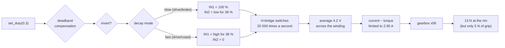

# 01.08 — Wire the motor driver and spin a motor (PWM and direction)

<!-- glance:start -->
<!-- generated by tools/build.py from curriculum/syllabus.yaml — edit the syllabus, not this block -->

| | |
|---|---|
| **Track** | Main path |
| **Difficulty** | Beginner |
| **Time** | 1 h 15 min |
| **Hardware** | Stage 1 robot: Pi 5, Pico, encoder motors, driver, chassis, battery, distance sensors (stage 1) |
| **Software** | micropython |
| **Prerequisites** | [01.05 Set up the Pico microcontroller and talk to it over USB](01.05-pico-microcontroller-setup.md)<br>[01.07 Power it safely — battery, fuse, switch, buck converter, common ground](01.07-power-system.md) |
| **Optional prerequisites** | [FE.07 PWM — pulse-width modulation](../optional-foundations/electronics/FE.07-pwm.md)<br>[FE.10 DC motors: brushed vs brushless, gearboxes, stall current](../optional-foundations/electronics/FE.10-dc-motors.md)<br>[FE.12 H-bridges and motor drivers](../optional-foundations/electronics/FE.12-h-bridges-motor-drivers.md) |
| **Skip if** | You can make both motors spin both directions at a commanded duty cycle. |

<!-- glance:end -->

## What you will learn

- Wire two Pololu DRV8874 carriers in IN/IN mode from the Pico's PWM pins, including the pins the carrier leaves in the wrong state by default.
- Explain what each of the four H-bridge states does to the motor, and choose drive/brake over drive/coast for a reason you can state.
- Make each wheel turn forward for a positive duty, and fix a reversed motor in `config.py` rather than in the wiring.
- Measure your motors' deadband and put the number where the rest of the course reads it.
- Diagnose "the motor does not turn" systematically, from the battery through the driver to the firmware.

## Why it matters

Until now karmel has been a rolling chassis with a powered computer on it. This is the lesson where it moves. It is
also the first time your code can hurt something: a 1:56 gearbox turning a 90 mm wheel puts about 13 N at the rim and
does not care what is in the way.

The interface you build here — "a signed number between −1 and +1 goes in, torque comes out" — is the bottom of the
whole control stack. Every later lesson stands on it: the velocity PID in module 08 outputs a duty, the odometry in
module 09 assumes the duty you asked for is the duty that was applied, and the ROS 2 `diff_drive_controller` in
module 04 eventually drives this same function. Getting the direction convention and the deadband right today saves
you from a sign bug that looks like a broken Kalman filter in three months.

<!-- prereqs:start -->
## Prerequisites

You need these first:

- [01.05 Set up the Pico microcontroller and talk to it over USB](01.05-pico-microcontroller-setup.md)
- [01.07 Power it safely — battery, fuse, switch, buck converter, common ground](01.07-power-system.md)

### Optional prerequisite links

New to any of these? Take the foundation lesson first; skip it if you already know it.

- [FE.07 PWM — pulse-width modulation](../optional-foundations/electronics/FE.07-pwm.md)
- [FE.10 DC motors: brushed vs brushless, gearboxes, stall current](../optional-foundations/electronics/FE.10-dc-motors.md)
- [FE.12 H-bridges and motor drivers](../optional-foundations/electronics/FE.12-h-bridges-motor-drivers.md)

Check your readiness: `python course.py why 01.08`
<!-- prereqs:end -->

## Concept

### The Pico can't drive a motor, and why

A Pico GPIO pin can source a few milliamps at 3.3 V. The Yahboom 520 wants amps at 12 V. So the Pico doesn't drive
the motor; it **tells a switch** what to do. The switch is an **H-bridge**: four transistors arranged so that each
motor terminal can be connected either to the battery's positive rail or to ground. The DRV8874 is that H-bridge plus
the gate drivers, the protection and the current limiter, on a chip; the Pololu carrier adds the passives.

Think of it as the difference between a service that does work and a service that issues a signed command to a worker
pool. Your Pico writes intent; the DRV8874 does the amperes.

### Speed from a switch that is only ever fully on or fully off

The transistors have two efficient states: fully on (almost no voltage across them) and fully off (almost no current
through them). Anything in between turns the transistor into a heater. So instead of producing 4.4 V, the bridge
produces 11 V for 40 % of the time and 0 V for 60 % of the time, 20,000 times a second. The motor's inductance and
inertia can't follow that fast, so it behaves as if it had 4.4 V across it. This is **PWM**, and it is how nearly
everything in robotics controls power.

> [!NOTE]
> New to PWM, H-bridges or DC motors? → [FE.07 PWM](../optional-foundations/electronics/FE.07-pwm.md), [FE.12 H-bridges and motor drivers](../optional-foundations/electronics/FE.12-h-bridges-motor-drivers.md), [FE.10 DC motors](../optional-foundations/electronics/FE.10-dc-motors.md). Skip them if you can already explain why a 40 % duty cycle at 20 kHz looks like 4.4 V to a motor on an 11 V bus.

### Duty is not speed

The thing that surprises software engineers most: `set_duty(0.1)` does not mean "10 % of top speed". Below about
12–20 % duty the motor produces less torque than the friction in its own gearbox, and the wheel simply does not move
at all. That flat region is the **deadband**, and it is the reason open-loop duty is a bad API for "go at 0.2 m/s".
You will measure yours today, compensate for it crudely, and replace the whole approach with a closed loop in module
08.

> [!TIP]
> **Ask your teacher:** "Walk me through what the four transistors in the H-bridge are doing during one 50 µs PWM
> period, in drive/brake mode at 40 % duty, and where the motor current flows in each half."

## Technical explanation

### Level 1 — The four states of an H-bridge

In **IN/IN mode** (which is what `PMODE` tied high selects) the two logic inputs mean exactly this:

| IN1 | IN2 | OUT1 | OUT2 | The motor |
|---|---|---|---|---|
| 0 | 0 | disconnected | disconnected | **coast** — spins freely to a slow stop |
| 1 | 0 | +V | GND | drives **forward** |
| 0 | 1 | GND | +V | drives **reverse** |
| 1 | 1 | GND | GND | **brake** — the motor's own generated voltage fights its motion |

To get a fraction of full power you switch rapidly between "drive" and one of the two stopped states. Which one you
choose is the **decay mode**:

- **drive/coast ("fast decay")**: `IN1 = PWM at 40 %`, `IN2 = 0`. Between pulses the current decays quickly through
  the body diodes.
- **drive/brake ("slow decay")**: `IN1 = 1`, `IN2 = PWM low for 40 % of the period`. Between pulses the motor is
  shorted, so the current circulates and decays slowly.

Pololu recommends drive/brake, and karmel uses it, because **speed is much more linear in duty** — which makes the
velocity controller in module 08 far easier to tune. You will feel the difference in the exercises.

### Level 2 — Practical: wiring two carriers

> [!CAUTION]
> **Safety, before any of this:** battery **disconnected** (not just the switch off) while you wire
> ([SAFETY.md](../SAFETY.md) rule 9). When you power up for the first time, the robot is on a box with **both wheels
> off the ground** (rule 1), the switch is under your hand (rule 8), and nothing loose is near the wheels. A wheel
> that catches a cable will pull it, the board it is soldered to, and your finger.

The Pololu DRV8874 carrier leaves two pins in states that do **not** work for us:

| Carrier pin | Board default | What we need | Why |
|---|---|---|---|
| `SLEEP` | pulled **low** | **3.3 V** | low = the driver is asleep and the outputs are off. An unconnected SLEEP is a dead motor. |
| `PMODE` | **floating** | **3.3 V** | floating selects independent half-bridge mode, not IN/IN. The chip **latches** PMODE when it wakes up. |
| `EN/IN1`, `PH/IN2` | pulled low | Pico PWM | coast at power-up, which is what you want before the firmware runs |
| `CS` (IPROPI) | 2.49 kΩ to GND | **nothing** | ≈ 1.1 V/A would exceed the Pico ADC's 3.8 V maximum (01.01, 01.07) |
| `VREF` | 10 kΩ pull-up to SLEEP | leave it | the current limit then follows SLEEP: ≈ 2.95 A with 3.3 V |
| `IMODE` | 20 kΩ to GND | leave it | cycle-by-cycle current chopping |

**Connection table.** Power rows (VIN, GND) come from the star you built in [01.07](01.07-power-system.md); logic rows
go to the Pico through the breadboard. Left motor first; the right one is identical with GP6/GP7.

| # | From | To | Wire | Voltage |
|---|---|---|---|---|
| 1 | Star `+` | **L** carrier `VIN` | 18 AWG red | 9.9–12.6 V |
| 2 | Star `GND` | **L** carrier `GND` | 18 AWG black | 0 V |
| 3 | **L** carrier `VIN`–`GND` | 470 µF 25 V electrolytic, **at the carrier** | — | mind the stripe |
| 4 | **L** carrier `OUT1` | Left motor `M+` (PH2.0 pin 1) | 20 AWG red | switched, up to bus |
| 5 | **L** carrier `OUT2` | Left motor `M−` (PH2.0 pin 2) | 20 AWG black | switched, up to bus |
| 6 | Pico **GP2** (physical pin 4) | **L** carrier `EN/IN1` | 24 AWG | 3.3 V, 20 kHz PWM |
| 7 | Pico **GP3** (physical pin 5) | **L** carrier `PH/IN2` | 24 AWG | 3.3 V, 20 kHz PWM |
| 8 | Pico **3V3 OUT** (pin 36) | **L** carrier `SLEEP` | 24 AWG | 3.3 V |
| 9 | Pico **3V3 OUT** (pin 36) | **L** carrier `PMODE` | 24 AWG | 3.3 V |
| 10 | Star `+` | **R** carrier `VIN` | 18 AWG red | 9.9–12.6 V |
| 11 | Star `GND` | **R** carrier `GND` | 18 AWG black | 0 V |
| 12 | **R** carrier `VIN`–`GND` | 470 µF 25 V electrolytic | — | |
| 13 | **R** carrier `OUT1` / `OUT2` | Right motor `M+` / `M−` | 20 AWG | switched |
| 14 | Pico **GP6** (pin 9) / **GP7** (pin 10) | **R** carrier `EN/IN1` / `PH/IN2` | 24 AWG | 3.3 V PWM |
| 15 | Pico **3V3 OUT** | **R** carrier `SLEEP`, `PMODE` | 24 AWG | 3.3 V |
| — | Both carriers' `CS` | *not connected* | — | — |

Two things that are **not** in the table and matter:

- **The grounds.** Each carrier's `GND` goes to the star, and the Pico's ground goes to the star separately
  ([01.07](01.07-power-system.md), row 19). Do **not** chain the Pico's ground to a carrier's `GND` pin: that pin
  carries up to 2.95 A of motor return, and it sits tens of millivolts above the star while it does. Straight to the
  star, both of them.
- **3V3 budget.** `SLEEP` and `PMODE` are high-impedance inputs, so the four of them together draw well under a
  milliamp. The Pico's 3V3 OUT rail can supply 300 mA total, which also has to cover the encoders and the I²C
  sensors — still plenty.

**Why GP2/GP3 and GP6/GP7 and not any two pins.** On the RP2350 each PWM "slice" owns a pair of adjacent GPIOs:
GP2/GP3 are slice 1 channels A and B; GP6/GP7 are slice 3. Both inputs of one motor therefore share one hardware
counter and can never drift out of frequency with each other — which matters, because in drive/brake mode one input
is high while the other pulses.

#### Before you power up

With the battery **disconnected**, meter in continuity mode:

1. Each carrier's `VIN` to `GND`: not a short (low and climbing as the 470 µF charges).
2. `OUT1` to `OUT2`: a few ohms — that is the motor winding. `OL` means the motor lead is not connected.
3. `SLEEP` and `PMODE` to the Pico's 3V3 pin: beep.
4. `EN/IN1` to `PH/IN2`: `OL`. A beep is a solder bridge, and it means both inputs move together — brake and coast
   only, never rotation.
5. `OUT1` (and `OUT2`) to `GND`: not a short.

Then power up with **no firmware running**. Both inputs are pulled low on the carrier, so the motors must sit
perfectly still. If a wheel creeps, stop and find out why before running any code.

#### Spin it

```bash
# On the Pi, in your checkout:
cd ~/robotics-course/labs/firmware/pico
mpremote mount . run examples/02_motor_test.py
```

The script ([`examples/02_motor_test.py`](../labs/firmware/pico/examples/02_motor_test.py)) drives each motor at
0.1, 0.2, 0.4 and 0.7 duty in each direction, then demonstrates coast versus brake. `Ctrl-C` stops it and the
`finally` block brakes both motors.

Watch for exactly two things:

1. **Direction.** "Forward" must turn each wheel the way that would push the *robot* forward. Because the two motors
   are mirror images on the chassis, one of them will be wrong. Fix it by flipping `MOTOR_LEFT_REVERSED` or
   `MOTOR_RIGHT_REVERSED` in [`labs/firmware/pico/config.py`](../labs/firmware/pico/config.py) — not by swapping the
   motor leads. The flag is visible, version-controlled and testable; swapped wires are invisible and get "corrected"
   by the next person who follows the wiring table.
2. **The lowest duty that moves the wheel.** That is your deadband, which you measure properly in the next section.

### Level 3 — Mathematics: duty, voltage, ripple and the deadband

**Average voltage.** Over one PWM period of $T = 1/f$ the bridge applies the bus voltage for $D\,T$ and (near) zero
for the rest:

$$\bar{V} = D \cdot V_{bus}$$

**Example.** $D = 0.4$ on the 10.8 V bus: $\bar{V} = 4.32$ V. A multimeter across the motor terminals reads about
that, because it averages. An oscilloscope shows a 10.8 V square wave — the meter is lying to you in a useful way.

**Why 20 kHz.** The motor is an inductor with resistance: $L \approx 2$ mH, $R = 3.0\ \Omega$ (from the 4 A stall at
12 V, [02.02](../02-robot-electronics/02.02-power-budget.md)), so its **electrical time constant** is
$\tau_e = L/R = 667\ \mu$s. The peak-to-peak current ripple during PWM is approximately

$$\Delta I = \frac{V_{bus}\,D(1-D)}{f\,L}$$

| PWM frequency | Period | Period / $\tau_e$ | Ripple at $D = 0.5$ |
|---|---|---|---|
| 1 kHz | 1000 µs | 1.50 | **1.58 A** — the current (and torque) pulses, and you hear it |
| 5 kHz | 200 µs | 0.30 | 0.32 A — still audible to many people |
| **20 kHz** | **50 µs** | **0.075** | **0.08 A** — smooth torque, above hearing |
| 100 kHz | 10 µs | 0.015 | 0.016 A — no better, and the driver's 650 ns of switching delay is now 6.5 % of the period |

20 kHz is the sweet spot: the current barely ripples, nothing whines, and the DRV8874's ≈ 650 ns of propagation, rise
and dead time is only 1.3 % of the period ([02.01](../02-robot-electronics/02.01-datasheets-and-pinouts.md)).

**Deadband compensation.** The firmware maps a requested duty onto the range where the motor actually turns, keeping
zero at zero:

$$D_{applied} = \operatorname{sign}(D)\left[d + |D|\,(1 - d)\right], \qquad D \ne 0$$

**Example** with $d = 0.12$: a request of 0.05 becomes 0.164, 0.10 becomes 0.208, 0.50 becomes 0.560, and 1.00 stays
1.00. A request of exactly 0 stays 0, because "stopped" must mean stopped.

This is a **crude** fix and you should know why: real friction is different in each direction, on each motor, and
changes with temperature and wear. It turns a completely dead zone into a roughly linear response — good enough for
teleop, not good enough for odometry. Module 08 replaces it with a controller that measures the actual speed.

**How hard can it push?** Torque is proportional to current. The Yahboom 520 (1:56) is rated 6.5 kg·cm and stalls at
8.3 kg·cm at 4 A. The DRV8874 carrier limits current to

$$I_{limit} = \frac{V_{SLEEP}}{R_{CS} \cdot A_{IPROPI}} = \frac{3.3}{2490 \times 450\times10^{-6}} = 2.95\ \text{A}$$

so the most torque the driver will allow is roughly $8.3 \times 2.95/4 = 6.1$ kg·cm $= 0.60$ N·m, which at a 45 mm
wheel radius is **13 N** at the rim, per wheel. Compare that with the traction you computed in
[01.06](01.06-mechanical-assembly.md): about 10 N for both wheels together. **The wheels slip before the motors
stall.** That protects the gearboxes, and it means the current limit only really engages when a wheel is
mechanically jammed — a cable wound around it, or the robot pushed against a kerb.

### Level 4 — Implementation: `labs/firmware/pico/motors.py`

The whole driver is one small class. Here is the part that does the work; the full file, with the truth table and the
decay-mode discussion in its header comment, is
[`labs/firmware/pico/motors.py`](../labs/firmware/pico/motors.py).

```python
def compensate_deadband(duty, deadband):
    """Map a requested duty onto the range where the motor actually turns."""
    if duty == 0:
        return 0.0
    magnitude = deadband + abs(duty) * (1.0 - deadband)
    return magnitude if duty > 0 else -magnitude


class Motor:
    def __init__(self, in1_pin, in2_pin, invert=False, pwm_freq_hz=config.PWM_FREQ_HZ,
                 decay="slow", deadband=0.0):
        self.invert = invert          # True: swap forward and reverse (mirrored motor)
        self.decay = decay
        self.deadband = deadband      # 0.0 = no compensation (raw duty goes to the driver)
        # Start with both inputs low (coast) so the motor cannot jump when the PWM starts.
        self._in1 = PWM(Pin(in1_pin), freq=pwm_freq_hz, duty_u16=0)
        self._in2 = PWM(Pin(in2_pin), freq=pwm_freq_hz, duty_u16=0)
        self.duty = 0.0               # last commanded duty, -1.0 .. 1.0

    def set_duty(self, duty):
        duty = clamp(duty, -1.0, 1.0)
        self.duty = duty
        if self.deadband > 0:
            duty = compensate_deadband(duty, self.deadband)
        if self.invert:
            duty = -duty

        level = int(abs(duty) * _DUTY_U16_MAX)
        if self.decay == "slow":
            # Drive/brake: one input held HIGH, the other pulses LOW for `duty` of the period.
            if duty >= 0:
                self._in1.duty_u16(_DUTY_U16_MAX)
                self._in2.duty_u16(_DUTY_U16_MAX - level)
            else:
                self._in1.duty_u16(_DUTY_U16_MAX - level)
                self._in2.duty_u16(_DUTY_U16_MAX)
        else:
            # Drive/coast: one input LOW, the other pulses HIGH for `duty` of the period.
            if duty >= 0:
                self._in1.duty_u16(level)
                self._in2.duty_u16(0)
            else:
                self._in1.duty_u16(0)
                self._in2.duty_u16(level)
```

Four design decisions worth naming, because they recur all through the firmware:

- **Both PWM objects are created with `duty_u16=0`** — coast — so configuring the pins can never produce a kick.
- **`invert` is a constructor argument, not a wiring instruction.** One named constant per motor, in one file.
- **`deadband=0` by default.** The raw path stays available for measurement; compensation is opt-in.
- **`brake()` and `coast()` are separate methods.** The watchdog and the `S` command brake (01.10); a reset leaves the
  pins as inputs, which is coast. "Stopped" has two meanings and the code says which one it means.

## Diagram

**One motor, end to end:**

```text
   Pico 2 (3.3 V logic)              Pololu DRV8874 carrier                 Yahboom 520
  ┌───────────────────┐            ┌────────────────────────┐             ┌───────────┐
  │ GP2  ─ PWM 20 kHz ├───────────►│ EN/IN1                 │             │           │
  │ GP3  ─ PWM 20 kHz ├───────────►│ PH/IN2        OUT1 ────┼────red─────►│ M+        │
  │ 3V3 OUT ──────────┼──────┬────►│ SLEEP         OUT2 ────┼────black───►│ M-        │
  │                   │      └────►│ PMODE  (IN/IN mode)    │             │  1:56     │
  │ GND (pin 38)      │            │ CS   ──  not connected │             └───────────┘
  └────────┬──────────┘            │ VIN ◄── 9.9-12.6 V ────┼──── star (+)
           │                       │ GND ───────────────────┼──── star (GND)   470 uF 25 V
           │                       └────────────────────────┘                  across VIN-GND
           └──────────────────────────────────────────────────── star (GND)
                  (its own wire: the logic reference carries no motor current)
```

**What the two pins do over one 50 µs period, at 40 % duty, drive/brake (slow decay):**

```text
        |<------------------ 50 us ------------------>|
 IN1  ──┴─────────────────────────────────────────────┴──  held HIGH
            <-- 20 us --><----------- 30 us ---------->
 IN2  ──────┐            ┌───────────────────────────────  LOW 40 % of the time
            └────────────┘
 state:   BRAKE   DRIVE FWD          BRAKE
 motor:  current circulates | battery pushes | current circulates
 average across the motor terminals: 0.40 x 10.8 V = 4.32 V
```

**From a number in your code to torque:**



## Code

### Run it on the robot

[`labs/firmware/pico/examples/02_motor_test.py`](../labs/firmware/pico/examples/02_motor_test.py) is the first thing
you run. Read it before you run it ([CLAUDE.md](../CLAUDE.md): never run code on hardware you have not read).

```bash
cd ~/robotics-course/labs/firmware/pico
mpremote mount . run examples/02_motor_test.py     # wheels OFF the ground
```

### `deadband_sweep.py` — measure where the motor wakes up

Save this as `labs/firmware/pico/examples/02b_deadband.py` in your checkout.

```python
# deadband_sweep.py - 01.08: find the duty at which each wheel starts and stops turning.
#
# Save it as labs/firmware/pico/examples/02b_deadband.py in your checkout and run:
#     cd labs/firmware/pico
#     mpremote mount . run examples/02b_deadband.py
#
# SAFETY - read before running:
#   * BOTH WHEELS OFF THE GROUND, robot on a box or a mug. This drives the motors open loop.
#   * Hand on the battery switch. Ctrl-C aborts; the finally block brakes the motors.
#   * Keep fingers, hair and cables out of the wheels.
#
# What it does: for each motor and each decay mode it ramps the duty up in 1 % steps, then
# back down. You watch the wheel and write down two numbers: the duty where it STARTS turning
# and the duty where it STOPS. They differ, because static friction is larger than sliding
# friction. The starting duty is the deadband, and its existence is why open-loop duty is a
# poor way to ask for a speed (module 08 closes the loop instead).
#
# Four runs of about 45 s each. Watch the wheel, not the screen.

import time

import config
from motors import Motor

STEP = 0.01          # duty increment
HOLD_MS = 600        # how long each step is held: long enough to see
MAX_DUTY = 0.35      # never sweep to full speed - you are looking for the START of motion

MOTORS = (
    ("left", config.MOTOR_LEFT_IN1, config.MOTOR_LEFT_IN2, config.MOTOR_LEFT_REVERSED),
    ("right", config.MOTOR_RIGHT_IN1, config.MOTOR_RIGHT_IN2, config.MOTOR_RIGHT_REVERSED),
)


def ramp(motor, start, stop, step, label):
    duty = start
    while (step > 0 and duty < stop) or (step < 0 and duty > stop):
        duty = round(duty + step, 3)
        motor.set_duty(duty)                 # SAFETY: the wheel may start turning here
        print("  %-4s duty %.2f" % (label, duty))
        time.sleep_ms(HOLD_MS)
    return duty


def run_one(name, in1, in2, inverted, decay):
    print()
    print("=== %s motor, %s decay ===" % (name, decay))
    print("Ramping UP: note the duty at which the wheel STARTS turning.")
    # deadband=0 on purpose: this script measures the raw motor, with no compensation applied.
    motor = Motor(in1, in2, invert=inverted, decay=decay)
    try:
        top = ramp(motor, 0.0, MAX_DUTY, STEP, "up")
        print("Ramping DOWN: note the duty at which it STOPS.")
        ramp(motor, top, 0.0, -STEP, "down")
    finally:
        motor.brake()
        motor.deinit()


print("Wheels OFF the ground? Starting in 5 seconds... (Ctrl-C to abort)")
time.sleep(5)

try:
    for name, in1, in2, inverted in MOTORS:
        for decay_mode in ("slow", "fast"):
            run_one(name, in1, in2, inverted, decay_mode)
except KeyboardInterrupt:
    print("\naborted")
finally:
    # Belt and braces: whatever happened above, leave both motors braked.
    for name, in1, in2, inverted in MOTORS:
        Motor(in1, in2, invert=inverted).brake()
    print("Motors stopped.")
    print("Put the SMALLER of your two 'starts turning' duties (slow decay) into")
    print("config.DUTY_DEADBAND and drive.duty_deadband in labs/config/karmel.yaml.")
    print("Lesson 08.02 measures it again with the encoders, per direction and per motor,")
    print("which is what the velocity controller really needs.")
```

### `duty_map.py` — what a duty cycle means, before you spin anything

Runs on your laptop or the Pi, no hardware. Save it in the **repository root** (it reads `labs/config/karmel.yaml`
through `robotlab`, installed as in [labs/README.md](../labs/README.md)).

```python
"""01.08 — what a duty cycle actually does to the motor, from labs/config/karmel.yaml.

Run from the repository root (no hardware, no robot needed):

    python duty_map.py                         # the table, with karmel's configured deadband
    python duty_map.py --deadband 0.17         # after you measure YOUR deadband
    python duty_map.py --bus 9.9 --deadband 0.17

It prints, for each commanded duty: the duty after deadband compensation, the average voltage
the H-bridge puts across the motor, and the wheel speed you should expect if the motor is
roughly linear above the deadband. Compare the last column with what you measure in 01.09.
"""
from __future__ import annotations

import argparse
import math
import sys
from pathlib import Path

REPO = Path(__file__).resolve().parent
for candidate in (REPO / "labs" / "python", Path.cwd() / "labs" / "python"):
    if candidate.is_dir():
        sys.path.insert(0, str(candidate))
        break

from robotlab.config import load_config  # noqa: E402

PWM_FREQ_HZ = 20_000          # labs/firmware/pico/config.py


def compensate_deadband(duty: float, deadband: float) -> float:
    """The mapping in labs/firmware/pico/motors.py: stretch 0..1 onto deadband..1.

    Zero stays zero, so "stopped" still means stopped.
    """
    if duty == 0:
        return 0.0
    magnitude = deadband + abs(duty) * (1.0 - deadband)
    return magnitude if duty > 0 else -magnitude


def main() -> int:
    parser = argparse.ArgumentParser(description=__doc__,
                                     formatter_class=argparse.RawDescriptionHelpFormatter)
    parser.add_argument("--deadband", type=float, default=None,
                        help="fraction, e.g. 0.17 (default: drive.duty_deadband from karmel.yaml)")
    parser.add_argument("--bus", type=float, default=None,
                        help="battery volts (default: battery.nominal_v from karmel.yaml)")
    args = parser.parse_args()

    cfg = load_config()
    deadband = cfg.drive.duty_deadband if args.deadband is None else args.deadband
    bus = cfg.battery.nominal_v if args.bus is None else args.bus
    top_speed = cfg.drive.max_wheel_speed_rad_s
    radius = cfg.drive.wheel_radius_m
    ticks = cfg.drive.ticks_per_wheel_rev

    print(f"config          : {cfg.source}")
    print(f"bus voltage     : {bus:.1f} V")
    print(f"PWM             : {PWM_FREQ_HZ / 1000:.0f} kHz, period {1e6 / PWM_FREQ_HZ:.0f} us")
    print(f"deadband        : {deadband:.2f} ({deadband * 100:.0f} % duty before the wheel moves)")
    print(f"max wheel speed : {top_speed:.1f} rad/s loaded  ({top_speed * radius:.2f} m/s at the rim)")
    print()
    print("  commanded   compensated   on-time    avg motor V   wheel rad/s   m/s     ticks/s")
    print("  ---------   -----------   -------    -----------   -----------   -----   -------")
    for commanded in (0.0, 0.05, 0.1, 0.2, 0.3, 0.5, 0.7, 1.0):
        applied = compensate_deadband(commanded, deadband)
        on_time_us = abs(applied) * 1e6 / PWM_FREQ_HZ
        volts = abs(applied) * bus
        # Linear model above the deadband: duty 1.0 -> max_wheel_speed_rad_s.
        speed = 0.0 if applied == 0 else max(0.0, (abs(applied) - deadband) / (1 - deadband)) * top_speed
        print(f"   {commanded:5.2f}       {applied:6.3f}      {on_time_us:5.1f} us     "
              f"{volts:5.2f} V       {speed:6.2f}      {speed * radius:5.2f}   "
              f"{speed / (2 * math.pi) * ticks:7.0f}")
    print()
    print("Read the table this way:")
    print(f"  * Without compensation, every command below {deadband:.2f} does nothing at all -")
    print("    the controller in module 08 would see zero response and wind up its integrator.")
    print("  * With compensation, the smallest non-zero command already produces motion,")
    print("    and the speed is roughly proportional to the command.")
    print("  * The avg motor V column is what a slow meter reads across the motor terminals;")
    print("    an oscilloscope shows the full bus voltage switching at 20 kHz (FE.07).")
    return 0


if __name__ == "__main__":
    raise SystemExit(main())
```

## Exercise

### Exercise 01.08-E1 — Predict the bridge `[predict]`

Hardware: none. Write your answers down *before* running anything.

1. `IN1 = 1`, `IN2 = 1`, the wheel is spinning at 10 rad/s. What happens, and where does the energy go?
2. `IN1 = 0`, `IN2 = 0`, same starting condition. What happens, and how is it different?
3. In drive/brake mode at 40 % duty, which input carries the PWM and what is its duty number in the firmware?
4. `PMODE` is left floating (the carrier's default). You command `set_duty(0.4)`. What does the motor do?
5. `SLEEP` is left unconnected. What do you measure on `OUT1` and `OUT2` with the motor disconnected?

### Exercise 01.08-E2 — Wire both drivers and check before power `[hardware]`

Hardware: `robot-base` (2 DRV8874 carriers with headers soldered, 2 × 470 µF 25 V capacitors, breadboard, jumpers,
the powered chassis from 01.07), `tools` (multimeter).

Wire both carriers per the connection table, **battery disconnected**. Then run the five continuity checks in
Level 2 and record them in `bench_log.csv` (add them as `Step`s to your `power_checklist.py` if you like). Finally,
power up with no firmware running and confirm both wheels sit still.

No hardware yet? Do E1, E5 and the `duty_map.py` half of E4.

### Exercise 01.08-E3 — First spin, and fix the direction `[hardware]`

Hardware: `robot-base`, plus a box or two mugs to stand the robot on.

> [!CAUTION]
> **Safety:** wheels off the ground, switch under your hand, nothing loose near the wheels, pets and children out of
> the room ([SAFETY.md](../SAFETY.md) rules 1, 7 and 8).

1. Read `examples/02_motor_test.py`, then run it with `mpremote mount . run`.
2. Note which wheel turns the wrong way for "forward", and set `MOTOR_LEFT_REVERSED` / `MOTOR_RIGHT_REVERSED` in
   `labs/firmware/pico/config.py` until a positive duty turns **both** wheels the way that would drive the robot
   forward.
3. Watch the coast-versus-brake demonstration at the end and time roughly how long the wheel takes to stop in each
   case.

### Exercise 01.08-E4 — Measure your deadband `[hardware]`

Hardware: `robot-base` on its stand.

1. Run `02b_deadband.py`. For each motor and each decay mode, record the duty where the wheel **starts** and the duty
   where it **stops** (four pairs of numbers).
2. Put the smallest "starts" value (slow decay) into `DUTY_DEADBAND` in `labs/firmware/pico/config.py` and
   `drive.duty_deadband` in `labs/config/karmel.yaml`.
3. Run `python duty_map.py --deadband <yours>` and compare the predicted speeds against what you *see* — you cannot
   measure speed yet, so judge by eye. You will do this properly in [01.09](01.09-reading-encoders.md).

### Exercise 01.08-E5 — The numbers behind the duty `[numerical]`

Hardware: none.

1. Your pack is at 11.4 V and you command a duty of 0.35 with no deadband compensation. What is the average voltage
   across the motor, and what is the on-time in microseconds at 20 kHz?
2. With a measured deadband of 0.18, what does `compensate_deadband` turn requests of 0.02, 0.25 and 0.90 into?
3. Someone sets `PWM_FREQ_HZ = 2000` "to reduce switching losses". Compute the current ripple at $D = 0.5$ and
   compare with 20 kHz. What will the robot sound like, and what happens to the torque?
4. A wheel jams completely at full duty on a 12.6 V pack. The winding is 3.0 Ω. What current *would* flow, what
   current actually flows, and what limits it?

## Expected result

- **01.08-E1:** (1) **Brake**: both terminals are shorted to ground, so the motor acts as a generator into a short.
  Its kinetic energy is dissipated as heat in the winding and the bridge's low-side transistors; it stops quickly.
  (2) **Coast**: both terminals are disconnected, no current can flow, so only friction slows it — it takes several
  times longer. (3) `IN1` is held high and **`IN2`** carries the PWM, low for 40 % of the period; the firmware
  therefore writes `duty_u16 = 65535 − 0.40 × 65535 = 39321` to `IN2`. (4) A floating PMODE selects independent
  half-bridge mode, latched at wake-up, so the two inputs each control one half-bridge independently — you get
  braking and coasting, and the wheel never reverses. It may also just sit still. (5) With `SLEEP` low the driver is
  asleep: the outputs are high-impedance, so `OUT1` and `OUT2` float. Any reading is meaningless and the motor does
  nothing.
- **01.08-E2:** `VIN`–`GND` reads low and climbs past a few hundred ohms (the 470 µF charging); `OUT1`–`OUT2` reads
  the motor winding, a few ohms — 3 Ω is the expected order for the 520; `SLEEP` and `PMODE` beep to the Pico's 3V3
  pin; `EN/IN1`–`PH/IN2` reads `OL`; no output is shorted to `GND`. On power-up with no firmware, both wheels are
  completely still and the carriers stay cool.
- **01.08-E3:** Each wheel turns in both directions, faster at each higher duty; the 0.1 step may not move the wheel
  at all (that is the deadband). After setting the two flags, a positive duty turns both wheels forward. The
  coast/brake demonstration is unambiguous: coasting takes perhaps 1–3 seconds to stop, braking a small fraction of
  a second.
- **01.08-E4:** Typical starting duties are **0.10–0.20** in slow decay and **higher** in fast decay (the same
  average voltage produces less useful current when the current decays quickly between pulses). The stopping duty is
  lower than the starting duty by roughly 0.01–0.04 — that gap is static versus sliding friction, and it is why a
  robot that is just barely moving will stop and refuse to restart. The two motors will not match; expect a few
  percent of difference.
- **01.08-E5:** (1) $0.35 \times 11.4 = 3.99$ V; on-time $0.35 \times 50\ \mu\text{s} = 17.5\ \mu$s.
  (2) $0.18 + 0.02 \times 0.82 = 0.196$; $0.18 + 0.25 \times 0.82 = 0.385$; $0.18 + 0.90 \times 0.82 = 0.918$.
  (3) $\Delta I = 12.6 \times 0.25/(2000 \times 0.002) = 0.79$ A, ten times the ripple at 20 kHz. The motors whine
  audibly at 2 kHz, the torque pulses at the same rate, and the extra RMS current heats the winding — and switching
  losses at 20 kHz were never the problem (the bridge switches in ≈ 650 ns, 1.3 % of the period). (4) $12.6/3.0 =
  4.2$ A would flow; the carrier limits it to **2.95 A** (its VREF is tied to the 3.3 V SLEEP pin). What limits it
  is cycle-by-cycle current chopping in the DRV8874 — not the fuse, not the firmware. In practice the wheel slips
  before this, because the available traction is only about 5 N per wheel.

## Troubleshooting

### Symptom: the motor doesn't move at all

Measure your way from the power in to the motor out. Stop at the first surprise.

1. **Is the bus there?** Meter on the carrier's `VIN` to `GND`: 9.9–12.6 V. No → the switch, fuse, or star wiring
   (01.07).
2. **Is the driver awake?** `SLEEP` to `GND`: must read 3.3 V. This is the single most common cause, because the
   carrier pulls it low by default.
3. **Is the firmware running?** `mpremote` should print the script's output. A `mount` failure or an import error
   means nothing ever reached the pins.
4. **Are the pins moving?** With the script commanding 0.4, meter on `EN/IN1` and `PH/IN2` to `GND`. In slow decay at
   40 % you should read about 3.3 V on one and about 2.0 V on the other (the meter averages the PWM). Both at 0 V
   means the firmware isn't driving them; both at 3.3 V means brake.
5. **Is the motor connected?** `OUT1` to `OUT2` with the power off: a few ohms. `OL` means a broken lead or a
   connector that isn't seated.
6. **Is the motor itself alive?** Disconnect it from the driver and touch its two leads briefly to a 3 V source (two
   AA cells). If it doesn't twitch, the motor or its cable is the problem.

### Symptom: the motor only brakes and coasts, and never reverses

`PMODE` is not high when the driver wakes up — the carrier leaves it floating, which selects independent
half-bridge mode, and the chip **latches** that choice at wake-up.

1. Meter `PMODE` to `GND` while powered: must be 3.3 V.
2. If it is 3.3 V and the behaviour persists, the latch caught it too early because `PMODE` and `SLEEP` rise
   together from the same 3V3 rail. Two fixes: add an RC delay on `SLEEP` (10 kΩ in series, 1 µF to ground, which
   delays it by ≈ 10 ms), or move `SLEEP` to a spare Pico GPIO and have the firmware raise it a few milliseconds
   after boot.
3. Power-cycle after any change: the mode is only re-read on wake-up.

### Symptom: one wheel spins the wrong way

Do **not** swap the motor leads. Flip `MOTOR_LEFT_REVERSED` or `MOTOR_RIGHT_REVERSED` in
`labs/firmware/pico/config.py`, and remember that in 01.09 you will do the same exercise for
`ENCODER_*_REVERSED` — the two flags are independent, and both must end up such that "positive duty" and "rising tick
count" mean "the robot moves forward".

### Symptom: the motors whine, or the sound changes with duty

1. **Check `PWM_FREQ_HZ`** in `config.py`: it should be 20000. A frequency in the audible range (under ≈ 18 kHz)
   whines by design.
2. **Both inputs on the same PWM slice?** GP2/GP3 (slice 1) and GP6/GP7 (slice 3). Inputs on different slices can
   drift out of phase and produce a beat.
3. **A little noise at very low duty is normal**: the on-time approaches the driver's switching delay.

### Symptom: the Pi reboots, or the Pico drops off `/dev`, as soon as a motor starts

This is a power problem, not a motor problem — go to [02.02](../02-robot-electronics/02.02-power-budget.md) and the
"under-voltage" troubleshooting in [01.07](01.07-power-system.md). Quick triage: measure the 5 V at the Pi header
while the motor starts, and measure the voltage between the Pico's `GND` pin and the star `GND` at the same moment.

### Symptom: the carrier gets hot, or the motor stutters at high duty

1. **Is it the current limit?** With `VREF` tied to `SLEEP` at 3.3 V the carrier chops at ≈ 2.95 A. Stuttering at
   high duty into a jammed wheel is the limiter working as designed. Free the wheel.
2. **Is there a bulk capacitor across `VIN`–`GND` at the carrier**, with short leads? Without one, the switching
   current has to come down the harness.
3. **Thermal shutdown** (DRV8874: ≥ 160 °C) makes the driver cut out and recover in cycles. Let it cool and find
   what is loading the motor.

## Common mistakes

- **Leaving `SLEEP` unconnected.** The carrier pulls it low, so the driver is asleep and nothing happens. Every
  beginner does this once.
- **Leaving `PMODE` floating.** Then the truth table in every tutorial you read does not apply to your board.
- **Wiring `CS` to a Pico ADC pin.** ≈ 1.1 V/A exceeds the 3.8 V absolute maximum on GP26–GP28 during a current
  spike.
- **Swapping motor wires to fix direction.** Put the asymmetry in one named constant, not in the harness.
- **Treating duty as speed.** It is a voltage fraction. Below the deadband it is nothing at all, and the same duty
  gives a different speed on a full pack than on an empty one.
- **No bulk capacitor at the carrier**, or one with a 16 V rating on a 12.6 V rail, or one fitted backwards.
- **Testing with the wheels on the table.** The robot drives off the edge while you read the terminal.
- **Chaining the Pico's ground to the driver's `GND` pin** because it's nearby. That pin carries motor current.

## Knowledge check

1. What does the `PMODE` pin select, when is the choice made, and what goes wrong if it's floating?
   <details><summary>Answer</summary>

   It selects the control interface: tied high = **IN/IN mode** (two logic inputs, the truth table in Level 1);
   floating = independent half-bridge mode; tied low = PH/EN mode. The DRV8874 **latches** PMODE when `nSLEEP` goes
   high, so the choice is made once, at wake-up. Floating means the carrier is in half-bridge mode: the motor can
   brake and coast but never reverse.
   </details>

2. Your bus is 10.8 V and you command duty 0.6 in drive/brake mode. What does `IN1` read on a multimeter, what does `IN2` read, and what is the average across the motor?
   <details><summary>Answer</summary>

   `IN1` is held high: **3.3 V**. `IN2` is low for 60 % of the period, so it averages
   $0.4 \times 3.3 = 1.3$ V. The motor sees $0.6 \times 10.8 = 6.5$ V on average. (An oscilloscope would show 10.8 V
   square waves; the meter averages.)
   </details>

3. Why does karmel use 20 kHz rather than 1 kHz, given that higher frequencies mean more switching losses?
   <details><summary>Answer</summary>

   Two reasons, both quantitative. **Ripple:** the motor's electrical time constant is $L/R \approx 667\ \mu$s; a
   1 kHz period (1000 µs) is longer than that, so the current — and therefore the torque — rises and falls fully
   every cycle: 1.58 A peak-to-peak at $D=0.5$, against 0.08 A at 20 kHz. **Noise:** 1 kHz is right in the middle of
   human hearing. The switching loss argument doesn't bite until far above 20 kHz: the DRV8874 switches in about
   650 ns, which is 1.3 % of a 50 µs period.
   </details>

4. Predict: you measure a deadband of 0.15 and set `DUTY_DEADBAND = 0.15`. You then command `set_duty(0.0)`. Does the motor get 15 % duty?
   <details><summary>Answer</summary>

   No. The compensation has an explicit special case: `if duty == 0: return 0.0`. Zero maps to zero, because
   "stopped" must mean stopped — otherwise every idle robot would creep. The compensation stretches the *non-zero*
   range 0<|D|≤1 onto deadband..1.
   </details>

5. Debugging: the left wheel spins fine, the right wheel does nothing. `VIN` is 11.8 V on both carriers, `SLEEP` and `PMODE` are 3.3 V on both, and both motors read 3 Ω across their leads. What do you measure next, and what are the two likely faults?
   <details><summary>Answer</summary>

   Measure **GP6 and GP7 relative to GND while the script commands the right motor**. If both read 0 V, the firmware
   isn't driving those pins — wrong pin numbers in `config.py`, or a jumper in the wrong breadboard row. If they read
   3.3 V and ~2 V as expected, the signal is not reaching the carrier: a broken jumper, a cold solder joint on the
   header, or a pin plugged into the neighbouring hole. Continuity from the Pico pin to the carrier pad tells them
   apart.
   </details>

6. Why does the firmware brake (rather than coast) when the watchdog trips, and when would coasting be the better choice?
   <details><summary>Answer</summary>

   Braking stops the robot in a fraction of a second instead of letting it roll; when the host has gone silent you
   want the robot **stopped**, fast, near where it was. Coasting is better when the robot is being pushed by hand,
   when you want to measure free rotation (the encoder tests in 01.09), or on a slope where a hard brake could tip a
   top-heavy robot. Note that a Pico reset leaves the pins as inputs, which the carrier's pull-downs turn into
   coast — so "power lost" and "watchdog tripped" behave differently on purpose.
   </details>

7. You replace the motors with the 333 RPM (1:30) version. What changes in `config.py`, and does your measured deadband still apply?
   <details><summary>Answer</summary>

   `GEAR_RATIO = 30.0` (so `TICKS_PER_WHEEL_REV` becomes $11 \times 30 \times 4 = 1320$) and
   `MAX_WHEEL_SPEED_RAD_S` rises. The deadband must be **re-measured**: it is set by friction in that particular
   gearbox, and a 1:30 box has different losses and delivers less torque at the same current, so the duty at which
   the wheel starts moving changes. Deadband is always a measured, per-robot number.
   </details>

## Practical challenge

Turn "the motors spin" into a **characterised actuator** you can trust.

1. Wire both drivers and pass all five pre-power continuity checks, logged.
2. Get both wheels turning forward for a positive duty, with the direction fixed in `config.py`.
3. Measure the deadband four times (two motors × two decay modes) and record all eight numbers.
4. Build a small table, for one motor in slow decay, of duty → does it turn? → roughly how fast (count the
   revolutions of a tape mark over 10 seconds, by eye or on video): duties 0.05 to 0.60 in steps of 0.05. Plot it
   (pen and paper is fine).
5. Compare your plot with the `duty_map.py` prediction for your deadband, and write one paragraph on where the
   simple linear model is wrong and why.

**Acceptance criteria:** both wheels turn forward for a positive duty and reverse for a negative one; your measured
deadband is in both `config.py` and `karmel.yaml`; your duty-vs-speed plot has at least 12 points and shows a clear
flat region followed by a roughly straight rise; you can state, with numbers, why drive/brake was chosen over
drive/coast; and every powered test happened with the wheels off the ground.

## You can skip this if…

You can make both motors spin both directions at a commanded duty cycle **on karmel's own firmware**, **and** you
have a measured deadband in `karmel.yaml`, **and** you answer knowledge-check questions 1, 3 and 5 correctly without
looking.

`python course.py skip 01.08 --reason "both motors run under PWM in both directions, deadband measured"`

## Go deeper

- Pololu DRV8874 single brushed DC motor driver carrier: https://www.pololu.com/product/4035 — the carrier's default pin states (SLEEP low, PMODE floating), the ≈ 1.1 V/A current sense and the ≈ 4.4 A default limit with 5 V on SLEEP.
- Texas Instruments DRV8874 datasheet (SLVSF66): https://www.ti.com/product/DRV8874 — the IN/IN truth table, PMODE latching, current regulation, propagation and dead-time numbers used in Level 3.
- MicroPython RP2 quick reference, PWM: https://docs.micropython.org/en/latest/rp2/quickref.html#pwm-pulse-width-modulation — `PWM(Pin(n), freq=, duty_u16=)`, and which GPIOs share a slice.
- Raspberry Pi RP2350 datasheet: https://datasheets.raspberrypi.com/rp2350/rp2350-datasheet.pdf — the PWM block, slice/channel mapping, and the GPIO absolute maximum ratings behind "CS stays unconnected".
- [FE.07 PWM](../optional-foundations/electronics/FE.07-pwm.md), [FE.10 DC motors](../optional-foundations/electronics/FE.10-dc-motors.md), [FE.12 H-bridges and motor drivers](../optional-foundations/electronics/FE.12-h-bridges-motor-drivers.md) — the same material from first principles, with more experiments.
- [02.03 Motor drivers in depth](../02-robot-electronics/02.03-motor-drivers-in-depth.md) — current sensing, stall detection and the divider that makes `CS` safe to read.

## Progress checkpoint

- [ ] Both DRV8874 carriers are wired in IN/IN mode, with `SLEEP` and `PMODE` high and `CS` unconnected.
- [ ] I passed the pre-power continuity checks and the motors stayed still with no firmware running.
- [ ] A positive duty turns both wheels forward, with the direction fixed in `config.py`.
- [ ] I measured the deadband for both motors in both decay modes and recorded it in `karmel.yaml`.
- [ ] I can explain drive/brake versus drive/coast, and why 20 kHz, with numbers.

`python course.py complete 01.08` (exercises done) · `python course.py master 01.08`
(challenge done) · `python course.py struggle 01.08 "what was hard"`

Next: [01.09 — Read the wheel encoders: ticks, direction, counts per revolution](01.09-reading-encoders.md).
