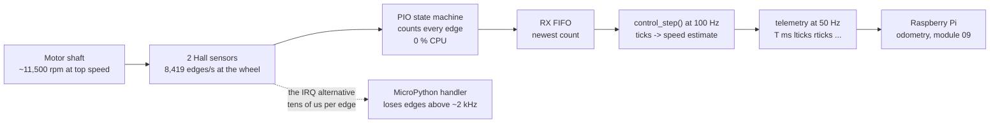

# 01.09 — Read the wheel encoders — ticks, direction, counts per revolution

<!-- glance:start -->
<!-- generated by tools/build.py from curriculum/syllabus.yaml — edit the syllabus, not this block -->

| | |
|---|---|
| **Track** | Main path |
| **Difficulty** | Beginner |
| **Time** | 1 h 15 min |
| **Hardware** | Stage 1 robot: Pi 5, Pico, encoder motors, driver, chassis, battery, distance sensors (stage 1) |
| **Software** | micropython |
| **Prerequisites** | [01.08 Wire the motor driver and spin a motor (PWM and direction)](01.08-first-motor-spin.md) |
| **Optional prerequisites** | [FC.05 Interrupts, timers and the Pico's PIO](../optional-foundations/cpp-and-embedded/FC.05-interrupts-timers-pio.md)<br>[FE.06 Pull-up and pull-down resistors (and why inputs float)](../optional-foundations/electronics/FE.06-pull-up-pull-down.md) |
| **Skip if** | You can report signed tick counts for both wheels reliably at full speed. |

<!-- glance:end -->

## What you will learn

- Explain how two square waves a quarter-cycle apart encode both distance and direction, and decode a sequence of them by hand.
- Wire both Hall encoders to the Pico at 3.3 V, with pull-ups rather than pull-downs, and say why erratum RP2350-E9 makes that mandatory.
- Read signed tick counts with the PIO-based counter, and set the sign convention so forward motion always counts up.
- Measure your own ticks-per-wheel-revolution instead of trusting 2,464, and compute the resolution and edge rate that result.
- Show, on your own robot, that a Python interrupt handler loses ticks at speed while the PIO counter does not.

## Why it matters

An encoder is the robot's only proprioceptive sensor in Stage 1: without it the robot knows nothing about what it
actually did, only what it was told to do. Everything from lesson 08.03 onward depends on this count being exact and
correctly signed — closed-loop wheel speed, driving a measured distance, odometry, the EKF in module 10, and the
`/odom` topic that Nav2 plans against in module 12.

"Exact" is a strong word and it is meant literally. Encoder counting is one of the few places in robotics where the
measurement can and must be **lossless**: every edge is counted or the error accumulates forever. A speed estimate
that is 2 % noisy is fine — the filter handles it. A tick count that quietly drops 2 % of its edges is a position
estimate that walks away from reality and never comes back, and no amount of sensor fusion later will notice, because
the error looks exactly like real motion.

<!-- prereqs:start -->
## Prerequisites

You need these first:

- [01.08 Wire the motor driver and spin a motor (PWM and direction)](01.08-first-motor-spin.md)

### Optional prerequisite links

New to any of these? Take the foundation lesson first; skip it if you already know it.

- [FC.05 Interrupts, timers and the Pico's PIO](../optional-foundations/cpp-and-embedded/FC.05-interrupts-timers-pio.md)
- [FE.06 Pull-up and pull-down resistors (and why inputs float)](../optional-foundations/electronics/FE.06-pull-up-pull-down.md)

Check your readiness: `python course.py why 01.09`
<!-- prereqs:end -->

## Concept

### One channel tells you how far, two tell you which way

Inside the Yahboom 520's rear housing there is a small ring magnet on the motor shaft with 11 pole pairs, and two
Hall-effect sensors next to it. As the shaft turns, each sensor produces a square wave: 11 pulses per motor
revolution. One sensor alone gives you *speed and distance* but not direction — the pulse train looks identical
whether the wheel goes forwards or backwards.

The trick is that the two sensors are physically offset so their square waves are **a quarter of a cycle apart**.
Now, at any moment, the two levels form a 2-bit number — throughout this lesson and in the firmware, the **state** is
$s = (B \ll 1) \mid A$ — and the order in which those states appear tells you the direction:

```text
  state s = (B << 1) | A        ( A = bit 0,  B = bit 1 )

  forward :  0 -> 1 -> 3 -> 2 -> 0 -> ...        in binary:  00 -> 01 -> 11 -> 10 -> 00
  backward:  0 -> 2 -> 3 -> 1 -> 0 -> ...                    00 -> 10 -> 11 -> 01 -> 00
```

Exactly **one bit changes at each step** — this is a two-bit Gray code, and it is what makes the direction
unambiguous. State 0 followed by state 1 can only mean forward; state 0 followed by state 2 can only mean backward.

### Incremental, not absolute

The encoder tells you about *changes*. Power the robot on and the count starts at zero, wherever the wheel happens
to be. That is fine for odometry (which integrates changes anyway) and it is why the `R` command in the protocol
exists — "call the current position zero". It is also why an encoder cannot tell you that the wheel slipped: the
motor shaft turned, so ticks were produced, and the robot went nowhere. Slip is invisible to encoders, which is why
module 10 adds an IMU and a LiDAR.

### Why this cannot be a Python loop

At full speed one wheel produces about **8,400 edges per second** — an edge every 119 µs, and every 59 µs if you
count both wheels. A MicroPython interrupt handler takes tens of microseconds; a Python polling loop is far worse;
and Linux on the Pi can stall a process for 10 ms, which is 84 lost edges. The RP2350 has **PIO**: small state
machines in silicon, independent of the CPU, that run a program of at most 32 instructions at millions of steps per
second. karmel gives each encoder its own state machine, and the CPU simply asks for the current count whenever it
wants it.

> [!TIP]
> **Ask your teacher:** "Show me a sequence of (A, B) samples where the decoder counts confidently in the wrong
> direction, and explain what physical situation produces it."

## Technical explanation

### Level 1 — The waveform and the four-times multiplier

```text
        one electrical cycle
     |<--------------------->|
  A  ___------______------______      A leads B by a quarter cycle
  B  ______------______------___
     |  |  |  |  |  |  |  |  |
     0  1  3  2  0  1  3  2  0        state = (B << 1) | A
        ^  ^  ^  ^
        every one of these edges is a tick -> 4 ticks per electrical cycle
```

Each channel has 11 cycles per motor revolution. Counting **both edges of both channels** gives four ticks per cycle
— "4× decoding" — and then the gearbox multiplies by 56 between motor and wheel:

$$N_{ticks} = N_{cpr} \cdot G \cdot 4 = 11 \times 56 \times 4 = 2464 \text{ ticks per wheel revolution}$$

The decoding rule is a 16-entry table indexed by `(previous_state << 2) | new_state`:

| previous → new | step | meaning |
|---|---|---|
| `00→10`, `10→11`, `11→01`, `01→00` | −1 | one step backward |
| `00→01`, `01→11`, `11→10`, `10→00` | +1 | one step forward |
| `00→00`, `01→01`, `10→10`, `11→11` | 0 | nothing changed since the last read |
| `00→11`, `11→00`, `01→10`, `10→01` | 0 | **impossible**: two bits changed, so we sampled too slowly |

That last row is the dangerous one, and it is the whole reason for the PIO. Two bits changing at once means at least
one edge was missed, and the decoder cannot recover the direction — so it counts 0 and the error is permanent. Worse,
as you will see in the exercise, at some sampling rates the aliasing makes the decoder count **backwards** with
complete confidence.

### Level 2 — Practical: wiring and first counts

> [!CAUTION]
> **Safety:** battery disconnected while you wire ([SAFETY.md](../SAFETY.md) rule 9). The first half of this lesson
> turns the wheels **by hand**, with the robot on a box and no power to the motor drivers. The second half spins them
> under power: wheels off the ground, switch under your hand (rules 1 and 8).

#### The motor's 6-pin connector

The Yahboom 520 brings motor power and encoder signals out on one PH2.0 6-pin connector.

> [!IMPORTANT]
> **Verify the pin order against your own motor before you wire it.** Sellers ship variants, and the silkscreen or
> the seller's diagram is the authority — not this table, and not a video. How to check with the meter, in 60
> seconds: the two pins that read a few ohms to each other are the **motor winding** (everything else reads OL to
> them). Of the remaining four, the seller's diagram names GND, VCC, C1 and C2; with 3.3 V applied to VCC/GND (and
> the motor leads disconnected) both signal pins must sit near 3.3 V and flip between 0 V and 3.3 V as you slowly
> turn the shaft by hand.

The commonly documented order, and where each pin goes on karmel:

| PH2.0 pin | Signal | Goes to (LEFT motor) | Goes to (RIGHT motor) | Wire | Voltage |
|---|---|---|---|---|---|
| 1 | `M+` motor | Left carrier `OUT1` | Right carrier `OUT1` | 20 AWG red | switched bus |
| 2 | `M−` motor | Left carrier `OUT2` | Right carrier `OUT2` | 20 AWG black | switched bus |
| 3 | `GND` encoder | breadboard GND rail | breadboard GND rail | 24 AWG black | 0 V |
| 4 | `VCC` encoder (3.3–5 V) | Pico **3V3 OUT** (pin 36) | Pico **3V3 OUT** (pin 36) | 24 AWG red | 3.3 V |
| 5 | `C1` = channel **A** | Pico **GP10** (pin 14) | Pico **GP12** (pin 16) | 24 AWG | 0 / 3.3 V |
| 6 | `C2` = channel **B** | Pico **GP11** (pin 15) | Pico **GP13** (pin 17) | 24 AWG | 0 / 3.3 V |

Four constraints hide in that table:

1. **Power the encoder from the Pico's 3.3 V, not from 5 V.** The Hall sensors accept 3.3–5 V and have built-in
   pull-ups to whatever you feed them. At 5 V their outputs would be 5 V, and while the RP2350's plain digital pins
   tolerate up to 5.5 V *while powered*, they tolerate only 3.63 V when IOVDD is 0 V — which is exactly the
   situation when you unplug the Pico's USB while the robot is still on. 3.3 V removes the whole class of problem.
2. **Pull-ups only, never `Pin.PULL_DOWN`.** Erratum **RP2350-E9** on A2-stepping chips lets pad leakage hold an
   input near 2.2 V, which the weak internal pull-down cannot overcome, so a released input reads 1 forever. The
   encoder already provides its own pull-ups; `encoders.py` adds `Pin.PULL_UP` as a harmless extra and never uses a
   pull-down. If you need a pull-down anywhere on this robot, it must be external and ≤ 8.2 kΩ
   ([FE.06](../optional-foundations/electronics/FE.06-pull-up-pull-down.md), and you recorded your chip's stepping
   in [01.05](01.05-pico-microcontroller-setup.md)).
3. **B must be on the GPIO immediately after A.** The PIO program reads both pins with a single `in_(pins, 2)`
   starting at a base pin, so GP11 must follow GP10 and GP13 must follow GP12. `WheelEncoders` raises a `ValueError`
   at startup if `config.py` says otherwise.
4. **The encoder ground goes to the breadboard's ground rail (the logic ground), not to the star.** It is a logic
   signal, and it must be referenced to the same zero the Pico uses ([01.07](01.07-power-system.md)). Run the
   encoder pair away from the motor power pair where you can — 20 kHz of switching at amps, next to a 3.3 V logic
   line, is an antenna pointed at a victim.

#### Count by hand

```bash
cd ~/robotics-course/labs/firmware/pico
mpremote mount . run examples/03_encoder_count.py
```

Turn each wheel slowly by hand and watch the count. Then fix the **sign convention**:

> Rolling the robot **forward** must make **both** counts go **up**.

If one goes down, flip `ENCODER_LEFT_REVERSED` or `ENCODER_RIGHT_REVERSED` in
[`labs/firmware/pico/config.py`](../labs/firmware/pico/config.py). This flag is independent of
`MOTOR_*_REVERSED` from [01.08](01.08-first-motor-spin.md): one makes a positive duty drive the robot forward, the
other makes forward motion count up. Both must be right, and the only way to know is to check them separately.

#### Measure your own ticks per revolution

Don't trust 2,464 — check it, because a wrong gear ratio is a silent scale error on every distance the robot ever
reports.

1. Put a strip of tape on the tyre and a mark on the plate as a reference.
2. Note the count. Roll the robot forward so that wheel makes **exactly 10 full revolutions** (count the tape passing
   the mark). Note the count again.
3. $N_{ticks} = \Delta\text{count} / 10$.

Ten revolutions rather than one because the alignment error is the same either way and you divide it by ten. If
`karmel.yaml`'s `gear_ratio` is wrong for your motor, this is where you find out: a 1:30 motor gives 1,320.

### Level 3 — Mathematics: resolution, rates and how good the speed estimate is

**Distance per tick.**

$$d_{tick} = \frac{2\pi r}{N_{ticks}} = \frac{2\pi \times 0.045}{2464} = 1.147 \times 10^{-4}\ \text{m} = 0.115\ \text{mm}$$

The wheel's travel is measured to about a tenth of a millimetre. (Whether that becomes *accurate position* is a
module 09 question — it does not, because of slip and the systematic errors you measured in
[01.06](01.06-mechanical-assembly.md).)

**Edge rate.** At the no-load speed $n = 205$ RPM:

$$f_{edges} = \frac{n}{60}\,N_{ticks} = \frac{205}{60} \times 2464 = 8{,}419\ \text{edges/s per wheel}$$

— an edge every 119 µs, 59 µs for both wheels together. Compare that with a MicroPython IRQ handler (tens of µs, and
it must not allocate memory) and you have the argument for PIO in one number.

**Speed resolution.** The firmware estimates wheel speed from the change in ticks over one control period
$\Delta t = 1/100$ s:

$$\omega = \frac{2\pi}{N_{ticks}} \cdot \frac{\Delta n}{\Delta t}$$

One extra or missing tick in a 10 ms window is

$$\Delta\omega = \frac{2\pi}{2464 \times 0.01} = 0.255\ \text{rad/s}$$

which is 1.5 % of the 17 rad/s top speed — fine at speed. But at 1 rad/s the wheel produces only
$1 \times 2464/2\pi \times 0.01 = 3.9$ ticks per window, so the estimate jumps between 0.77, 1.02 and 1.28 rad/s:
**25 % quantisation noise at low speed.** That is why `velocity.py` low-passes the estimate
(`VELOCITY_FILTER_ALPHA`), and why 08.04 revisits the problem properly.

**How good is your measured $N_{ticks}$?** If you can judge a revolution to ±10 ticks (about 1.5° of wheel rotation)
and you count 10 revolutions, the error in $N_{ticks}$ is $10/10 = 1$ tick out of 2464 — **0.04 %**. Counting one
revolution instead would give 0.4 %, which over a 5 m drive is 2 cm. Ten revolutions cost you thirty seconds.

**Worked example, end to end.** You roll the robot forward, the left count goes from 1,204 to 13,524 and the right
from 1,198 to 13,502. Distance travelled:

$$s = \frac{(12320 + 12304)/2 \times 0.1147\ \text{mm}}{1} = 1{,}412\ \text{mm}$$

and the heading change is $(12304 - 12320) \times 0.1147\ \text{mm} / 200\ \text{mm} = -0.0092$ rad $= -0.53°$. That
is the whole of odometry, three lessons early.

### Level 4 — Implementation: counting in hardware

The PIO program in [`labs/firmware/pico/encoders.py`](../labs/firmware/pico/encoders.py) is worth reading even if
you never write another line of PIO, because it is a beautiful example of doing a lot with 32 instructions.

**The idea.** The state machine keeps the count in its `Y` register and the previous pin state in `OSR`. On every
loop it publishes the count, reads the two pins, forms the 4-bit index `(previous << 2) | new`, and **jumps to that
address**. Addresses 0–15 are a jump table — the transition table, compiled into control flow:

```python
@rp2.asm_pio(in_shiftdir=rp2.PIO.SHIFT_LEFT, out_shiftdir=rp2.PIO.SHIFT_RIGHT)
def quadrature_program():
    # addresses 0..15: jump table (keep in sync with TRANSITION_TABLE)
    jmp("update")           # 0000  00 -> 00  no change
    jmp("increment")        # 0001  00 -> 01  +1
    jmp("decrement")        # 0010  00 -> 10  -1
    jmp("update")           # 0011  00 -> 11  invalid, ignore
    # ... twelve more ...

    label("decrement")      # 16
    jmp(y_dec, "update")    # y = y - 1 (jumps only if y was not 0; either way y is decremented)
    jmp("update")

    label("increment")      # 18
    mov(y, invert(y))       # y = ~y
    jmp(y_dec, "inc_done")  # y = y - 1
    label("inc_done")
    mov(y, invert(y))       # y = ~y  -> net effect y + 1

    label("update")         # 21
    mov(isr, y)             # publish the count:
    push(noblock)           #   into the RX FIFO; if the FIFO is full, this value is dropped
    out(isr, 2)             # ISR = previous state (lowest 2 bits of OSR)
    in_(pins, 2)            # ISR = (previous << 2) | new state   (reads pins A and B)
    mov(osr, isr)           # remember this 4-bit value
    mov(pc, isr)            # jump into the table at address (previous << 2) | new
```

Three details that look like magic and are not:

- **PIO can only decrement.** `jmp(y_dec, …)` subtracts one. To add one, the program flips every bit
  ($\sim y = -y - 1$), subtracts one, and flips back: $\sim(\sim y - 1) = y + 1$. Two instructions instead of one.
- **`mov(pc, isr)` uses absolute addresses**, so the jump table must live at address 0 of the PIO block.
  MicroPython loads a program at the *end* of the 32-instruction memory, so `encoders.py` pads the program to
  exactly 32 instructions — then address 0 is the only place it fits. The consequence is documented in the file:
  **PIO block 1 must hold nothing else**, which is why the encoders use state machines 4 and 5.
- **The count is published into a 4-entry FIFO on every loop**, millions of times a second, so the FIFO is always
  full of slightly stale values. `_raw_count()` therefore drains it and then waits for one fresh value — which
  arrives within microseconds.

`reset()` does **not** write to `Y`:

```python
def reset(self):
    """Make count() return 0 from now on. We remember an offset instead of writing to the
    state machine's Y register, which could race with an increment in progress."""
    self._offset = self._raw_count()
```

That is a general embedded lesson: you cannot atomically modify state that a hardware unit is also modifying, so you
keep your own offset instead.

For teaching and comparison the same file has `QuadratureEncoderIRQ`, a plain-Python interrupt version using the same
transition table, with `hard=True` handlers (which must not allocate memory — no lists, no floats, no `print`). It is
correct at hand-turning speeds and demonstrably loses ticks under power. You will prove that in exercise E3.

## Diagram

**Signal path, one wheel:**

```text
  ring magnet (11 pole pairs) on the motor shaft
        │
   ┌────┴────┐   open-drain Hall outputs with built-in pull-ups to VCC
   │ Hall A  ├────────────────────────────► Pico GP10  ─┐
   │ Hall B  ├────────────────────────────► Pico GP11  ─┤ adjacent pins:
   └────┬────┘                                          │ in_(pins, 2)
        │ VCC 3.3 V from Pico pin 36                    │ reads both at once
        │ GND to the breadboard logic ground            │
        │                                               ▼
   gearbox 1:56                              PIO block 1, state machine 4
        │                                    ┌─────────────────────────────┐
        ▼                                    │ Y   = signed tick count     │
   wheel, r = 45 mm                          │ OSR = previous (A,B) state  │
   2464 ticks per revolution                 │ 32-instruction program,     │
   0.115 mm per tick                         │ runs at ~150 MHz, no CPU    │
                                             └──────────────┬──────────────┘
                                                            │ RX FIFO
                                              enc.count() ──┘  (CPU reads on demand)
```

**Who does what, and at what rate:**



## Code

### On the robot

[`labs/firmware/pico/examples/03_encoder_count.py`](../labs/firmware/pico/examples/03_encoder_count.py) prints both
counts and the equivalent number of wheel revolutions, ten times a second. Set `USE_IRQ = True` at the top to run the
interrupt version instead.

```bash
cd ~/robotics-course/labs/firmware/pico
mpremote mount . run examples/03_encoder_count.py
```

### `quadrature.py` — the decoder on your laptop

No hardware. Save it with your notes. It uses the same transition table as the firmware, so anything you learn here
transfers directly.

```python
"""01.09 — decode a quadrature encoder on paper, before you trust one on the robot.

Same decoding rule as labs/firmware/pico/encoders.py, in plain CPython so you can poke at it:

    python quadrature.py table          # the 16-entry transition table, explained
    python quadrature.py demo           # forward and backward waveforms, decoded step by step
    python quadrature.py undersample    # what happens when you read the pins too slowly
    python quadrature.py revolution     # ticks per wheel revolution and edge rates for karmel

No hardware, no packages, Python 3.10+.
"""
from __future__ import annotations

import argparse

# A "state" is the two pin levels as a 2-bit number: bit 0 = A, bit 1 = B.
# Index = (previous_state << 2) | new_state.
#   +1 = one step forward, -1 = one step backward,
#    0 = no change, or an impossible jump of two steps (we sampled too slowly).
#                 new: 00  01  10  11
TRANSITION_TABLE = (0, +1, -1, 0,     # previous 00
                    -1, 0, 0, +1,     # previous 01
                    +1, 0, 0, -1,     # previous 10
                    0, -1, +1, 0)     # previous 11

# One electrical cycle of a quadrature encoder, in the forward direction.
# (A, B) walks 00 -> 10 -> 11 -> 01 -> 00: exactly one bit changes per step, which is what
# makes the direction unambiguous (this is a 2-bit Gray code).
FORWARD_CYCLE = ((0, 0), (1, 0), (1, 1), (0, 1))

# karmel's numbers (labs/config/karmel.yaml)
CPR_MOTOR = 11            # hall pulses per motor revolution, one channel
GEAR_RATIO = 56.0
QUADRATURE = 4            # both edges of both channels
WHEEL_RADIUS_M = 0.045
NO_LOAD_RPM = 205.0       # Yahboom 520, 1:56 version, at 12 V


def state_of(a: int, b: int) -> int:
    return (b << 1) | a


def waveform(cycles: int, forward: bool = True) -> list[tuple[int, int]]:
    """The (A, B) states the encoder produces over `cycles` electrical cycles."""
    order = FORWARD_CYCLE if forward else tuple(reversed(FORWARD_CYCLE))
    return [order[i % 4] for i in range(cycles * 4 + 1)]


def decode(states: list[tuple[int, int]]) -> int:
    """Count ticks over a list of sampled (A, B) states."""
    count = 0
    previous = state_of(*states[0])
    for a, b in states[1:]:
        new = state_of(a, b)
        count += TRANSITION_TABLE[(previous << 2) | new]
        previous = new
    return count


def draw(states: list[tuple[int, int]]) -> None:
    high, low = "-", "_"
    for name, index in (("A", 0), ("B", 1)):
        line = "".join((high if s[index] else low) * 3 for s in states)
        print(f"  {name}  {line}")
    print("     " + "".join(f"{state_of(*s):>3}" for s in states) + "   <- state = (B<<1)|A")


def cmd_table() -> None:
    print("Index = (previous << 2) | new, where state = (B << 1) | A\n")
    print("  prev  new   binary   step   meaning")
    for index, step in enumerate(TRANSITION_TABLE):
        previous, new = index >> 2, index & 3
        if previous == new:
            meaning = "no change (the pins were read twice between edges)"
        elif step == 0:
            meaning = "IMPOSSIBLE jump of two steps -> we sampled too slowly, ticks are lost"
        else:
            meaning = "forward" if step > 0 else "backward"
        label = f"{step:+d}" if step else " 0"
        print(f"   {previous:02b}   {new:02b}   {index:04b}    {label}    {meaning}")
    print("\nOnly one bit may change per step. A jump of two bits is unrecoverable: the decoder")
    print("cannot tell which way the encoder went, so it counts 0 and the error is permanent.")


def cmd_demo() -> None:
    for forward in (True, False):
        states = waveform(2, forward)
        label = "FORWARD" if forward else "BACKWARD"
        print(f"\n{label}: two electrical cycles")
        draw(states)
        running = 0
        previous = state_of(*states[0])
        steps = []
        for a, b in states[1:]:
            new = state_of(a, b)
            running += TRANSITION_TABLE[(previous << 2) | new]
            steps.append(f"{previous:02b}->{new:02b}={running:+d}")
            previous = new
        print("  " + "  ".join(steps))
        print(f"  total: {decode(states):+d} ticks for 2 electrical cycles "
              f"= {abs(decode(states)) // 2} ticks per cycle")


def cmd_undersample() -> None:
    states = waveform(6, forward=True)
    print("Six electrical cycles forward = 24 ticks if every edge is seen.\n")
    print("  read every Nth state   ticks counted   error")
    for every in (1, 2, 3, 4):
        sampled = states[::every]
        counted = decode(sampled)
        print(f"        {every}                  {counted:3d}          {counted - 24:+d}")
    print("\n  N=1: every edge seen -> correct.")
    print("  N=2: every transition is a 2-step jump -> the table returns 0 for all of them.")
    print("  N=3: the decoder sees 1-step jumps again, but BACKWARDS: it counts the wrong way.")
    print("  N=4: the state never appears to change -> the wheel looks stopped.")
    print("\nThat N=3 row is the dangerous one: the count is confidently, silently wrong.")
    print("It is the whole argument for counting in PIO hardware instead of in a Python loop.")


def cmd_revolution() -> None:
    ticks = int(CPR_MOTOR * GEAR_RATIO * QUADRATURE)
    circumference = 2 * 3.141592653589793 * WHEEL_RADIUS_M
    edges_per_s = NO_LOAD_RPM / 60 * ticks
    print(f"pulses per motor rev, one channel : {CPR_MOTOR}")
    print(f"quadrature multiplier             : {QUADRATURE} (both edges of both channels)")
    print(f"gear ratio                        : {GEAR_RATIO:g}:1")
    print(f"ticks per WHEEL revolution        : {CPR_MOTOR} x {GEAR_RATIO:g} x {QUADRATURE} = {ticks}")
    print(f"wheel circumference               : {circumference * 1000:.1f} mm")
    print(f"distance per tick                 : {circumference / ticks * 1000:.4f} mm")
    print(f"edges per second at {NO_LOAD_RPM:.0f} RPM       : {edges_per_s:,.0f} per wheel, "
          f"{2 * edges_per_s:,.0f} for both")
    print(f"time between edges                : {1e6 / edges_per_s:.0f} us")
    print()
    print("A MicroPython interrupt handler takes tens of microseconds, and two wheels produce an")
    print(f"edge every {1e6 / (2 * edges_per_s):.0f} us. That is why the counting lives in PIO.")


def main() -> int:
    parser = argparse.ArgumentParser(description=__doc__,
                                     formatter_class=argparse.RawDescriptionHelpFormatter)
    parser.add_argument("command", choices=("table", "demo", "undersample", "revolution"))
    args = parser.parse_args()
    {"table": cmd_table, "demo": cmd_demo,
     "undersample": cmd_undersample, "revolution": cmd_revolution}[args.command]()
    return 0


if __name__ == "__main__":
    raise SystemExit(main())
```

## Exercise

### Exercise 01.09-E1 — Decode by hand `[numerical]`

Hardware: none.

1. Run `python quadrature.py table` and `python quadrature.py demo`. Then, without running anything, decode this
   sequence of states by hand and give the running total after each step: `0, 1, 3, 2, 3, 1, 0, 1`.
2. Run `python quadrature.py undersample`. Explain in your own words why reading every 3rd sample produces a
   *negative* count for forward motion, and what the physical equivalent is on the robot.
3. `python quadrature.py revolution`. If you fit the 1:30 motors and 70 mm wheels, recompute ticks per revolution,
   distance per tick and edges per second at 333 RPM.

### Exercise 01.09-E2 — Wire the encoders and count by hand `[hardware]`

Hardware: `robot-base` (both motors already mounted and wired to the drivers, Pico on the breadboard), `tools`
(multimeter).

1. **Verify your motor's PH2.0 pin order** with the meter, as described in Level 2, before you connect anything to
   the Pico. Write the pin order into your build log.
2. Wire both encoders per the connection table.
3. Run `examples/03_encoder_count.py` and turn each wheel slowly by hand. Set `ENCODER_LEFT_REVERSED` and
   `ENCODER_RIGHT_REVERSED` so that rolling the robot **forward** makes **both** counts increase.
4. Check the count is stable when the wheels are still: leave it for 30 seconds and confirm it does not drift by a
   single tick.

No hardware yet? Do E1 and E5, and come back.

### Exercise 01.09-E3 — Measure your ticks per revolution `[hardware]`

Hardware: `robot-base` on the floor, masking tape.

1. Tape a mark on one tyre and a reference on the plate.
2. Roll the robot forward through exactly **10** wheel revolutions and record the tick change. Repeat three times.
3. Compute $N_{ticks}$ for each run and the spread between them.
4. Compare with `encoder_cpr_motor × gear_ratio × 4` from `karmel.yaml`. If they disagree by more than about 1 %,
   your gear ratio is wrong — fix `karmel.yaml` **and** `labs/firmware/pico/config.py` (a lab test checks that the
   two agree: `pytest labs/python/tests/test_firmware_logic.py`).
5. While you are there, measure the effective wheel radius the same way: total distance rolled ÷ (10 × 2π).

### Exercise 01.09-E4 — Make the IRQ counter fail `[hardware]`

Hardware: `robot-base` **on a stand, wheels off the ground**.

> [!CAUTION]
> **Safety:** wheels in the air, hand on the switch, nothing loose near the wheels ([SAFETY.md](../SAFETY.md) rules
> 1 and 8).

1. With `USE_IRQ = False`, spin one motor at duty 0.8 for 10 seconds (use `examples/02_motor_test.py` or a two-line
   script) and record the tick change.
2. Set `USE_IRQ = True` and repeat at the same duty for the same time.
3. Compute the ratio. Then repeat both at duty 0.2.
4. Write one sentence explaining why the discrepancy grows with speed, and one sentence on why this bug would be
   almost impossible to find from the robot's behaviour alone.

### Exercise 01.09-E5 — Predict the encoder faults `[predict]`

Hardware: none (verify on the robot afterwards if you have it). For each, say what the count does and how you would
detect it.

1. Channel B's wire falls off (A still connected).
2. You swap A and B on one motor.
3. The encoder's VCC is connected to 5 V instead of 3.3 V, and then you unplug the Pico's USB cable while the robot
   is still powered.
4. Someone sets both encoder pins to `Pin.IN, Pin.PULL_DOWN` on an A2-stepping Pico 2.
5. The wheel is jacked up and you command duty 1.0 for 5 seconds; then you put the robot down and command the same
   thing for 5 seconds.
6. `ENCODER_RIGHT_REVERSED` is wrong but `MOTOR_RIGHT_REVERSED` is right.

## Expected result

- **01.09-E1:** (1) `0→1` = +1, `1→3` = +1, `3→2` = +1, `2→3` = −1, `3→1` = −1, `1→0` = −1, `0→1` = +1; running
  totals +1, +2, +3, +2, +1, 0, +1 → **total +1**. (The wheel went forward three steps, back three, forward one:
  the count follows the motion exactly, which is the point of an incremental encoder.) (2) At every third sample the
  apparent state walk reverses, and the table reads one step *backwards* each time — classic aliasing, the same
  effect that makes wagon wheels spin backwards on film. The physical equivalent is a polling loop or an overloaded
  interrupt handler reading the pins slower than the encoder changes them. (3) 1:30 with 70 mm wheels:
  $11 \times 30 \times 4 = 1320$ ticks/rev; $\pi \times 70/1320 = 0.167$ mm per tick;
  $333/60 \times 1320 = 7{,}326$ edges/s.
- **01.09-E2:** Turning a wheel by hand one full revolution changes the count by roughly 2,400–2,500. Rolling the
  robot forward makes both counts increase. With the wheels still, the count does not move at all — **not even by
  one tick**. A count that creeps while nothing moves means a floating input or electrical noise, not a mechanical
  problem.
- **01.09-E3:** Three runs within about ±5 ticks of each other, and a mean within 1 % of 2,464 for the 1:56 motor.
  A result near 1,320 means you have the 1:30 version; a result near 4,600 means 1:105. Effective wheel radius:
  typically 44.0–45.0 mm, not exactly 45.
- **01.09-E4:** At duty 0.8 the PIO counter should report roughly $0.8 \times 8419 \times 10 \approx 67{,}000$ ticks
  in 10 s (less, because the motor is slower under the drive/brake curve and on a partly-discharged pack). The IRQ
  counter will report **substantially fewer** — expect it to lose a large fraction at this speed, and the exact
  number depends on your firmware version and what else is running. At duty 0.2 the two will be much closer, and may
  agree. The discrepancy grows with speed because the handler's execution time is fixed while the interval between
  edges shrinks: once the next edge arrives before the previous handler has finished, edges are simply dropped.
  It is hard to find from behaviour because lost ticks look exactly like a wheel that turned less — the robot
  believes it under-drove, and "corrects" by driving further.
- **01.09-E5:** (1) With B stuck at one level, half the transitions become the "impossible" two-bit kind and the rest
  alternate: the count jitters around zero and never accumulates. Distance reads ≈ 0 while the wheel clearly turns.
  (2) The direction inverts: forward counts down. Indistinguishable from `ENCODER_*_REVERSED` being wrong — fix it
  in `config.py`, not in the wiring. (3) While the Pico is powered, the 5 V signals are within the plain pins'
  5.5 V tolerance. The moment IOVDD goes to 0 V, the limit drops to 3.63 V and the 5 V encoder outputs are over it —
  you are pushing current into an unpowered chip's protection structures. This is why the encoders run at 3.3 V.
  (4) Erratum RP2350-E9: pad leakage holds each released input near 2.2 V, so both pins read 1 permanently, the state
  never changes, and the count stays frozen at whatever it was. (5) Both runs report a similar tick count, but only
  the second one moved the robot. The encoder measures the *motor*, not the ground: slip and "wheels in the air" are
  invisible to it, which is the fundamental limit of odometry (module 09) and the reason for the IMU and LiDAR in
  modules 10–11. (6) Driving forward works, but the reported distance for that wheel is negative: odometry thinks
  the robot is spinning on the spot at high speed while it drives in a straight line. The two flags are independent
  and both must be checked.

## Troubleshooting

### Symptom: the count never changes

Work outwards from the Pico:

1. **Is the encoder powered?** Meter on the motor's encoder VCC pin to GND: 3.25–3.35 V. No → check the wire to the
   Pico's 3V3 OUT (pin 36) and that you have not exceeded its 300 mA budget.
2. **Do the signals move?** Meter in DC volts on GP10 (and GP11) to GND while you turn the shaft *slowly* by hand.
   You should see the reading flip between ≈ 0 V and ≈ 3.3 V. Stuck at 3.3 V → the sensor isn't pulling it down
   (dead sensor, wrong pin, or the pin isn't actually connected). Stuck near 2.2 V with nothing connected → erratum
   E9 and a pull-down somewhere.
3. **Are you on the right pins?** `config.ENCODER_LEFT_A` is GP10 = *physical pin 14*. GPIO number ≠ physical pin
   number.
4. **Is the PIO program actually running?** `WheelEncoders` raises `ValueError` if B is not A+1. Also check that no
   other code is using PIO block 1 (state machines 4–7).
5. **Is it the wire or the motor?** Swap the left and right encoder connectors at the Pico end. If the fault follows
   the connector, it's the motor or its cable; if it stays on the same GPIO pair, it's the Pico end.

### Symptom: the count drifts while the wheels are stationary

A tick count must be perfectly stable at rest. Drift means an input is picking up noise.

1. **Is the input floating?** Both encoder signal wires must actually be connected, and `Pin.PULL_UP` set (it is, in
   `encoders.py`).
2. **Is the encoder ground connected** to the same ground rail as the Pico? An encoder without a ground reference
   produces garbage.
3. **Is the motor power cable bundled with the encoder cable?** Separate them, or cross them at right angles.
4. **Does it only drift when the motors are powered (even at zero duty)?** Then it is switching noise: add the bulk
   capacitor at the driver if you skipped it (01.08), shorten the encoder leads, and see
   [02.06](../02-robot-electronics/02.06-noise-grounding-emi.md).

### Symptom: the count goes the wrong way

Not a fault. Flip `ENCODER_LEFT_REVERSED` or `ENCODER_RIGHT_REVERSED` in `labs/firmware/pico/config.py`. Then check
*both* conventions again, because they interact: positive duty must drive the robot forward **and** forward motion
must count up.

### Symptom: the count is roughly right at low speed and too low at high speed

That is the signature of lost edges.

1. **Are you running the IRQ version?** `USE_IRQ = True` in the example, or `QuadratureEncoderIRQ` in your own code.
   Switch to PIO.
2. **Is something else hogging PIO block 1**, or has another program claimed state machines 4–5?
3. **Is it actually mechanical?** A slipping hub set screw (01.06) also produces "less count than expected", but it
   scales with torque rather than with speed. Test: spin the wheel fast *by hand* (no torque) and compare with the
   same number of revolutions slowly. If the fast hand-spin counts correctly, the electronics are fine and the
   problem is the hub.

### Symptom: `ValueError: PIO encoders need B on the pin right after A`

Exactly what it says: `ENCODER_LEFT_B` must equal `ENCODER_LEFT_A + 1`, and the same for the right. Move the wire,
don't change the program — the PIO reads both pins with one instruction from a base pin.

## Common mistakes

- **Trusting the catalogue gear ratio.** Sellers list 1:30, 1:56 and 1:105 on one page. Measure your ticks per
  revolution; it takes two minutes and prevents a silent scale error on every distance the robot reports.
- **Powering the encoder from 5 V** because "the datasheet says 3.3–5 V". It does, but then its outputs are 5 V, and
  the Pico's plain pins only tolerate 3.63 V when the Pico is unpowered.
- **Using `Pin.PULL_DOWN` anywhere on a Pico 2.** Erratum RP2350-E9.
- **Putting B on a non-adjacent pin** and then wondering why the PIO decoder refuses to start.
- **Fixing a reversed count by swapping wires.** One named constant per motor, in one file, both for motors and
  encoders.
- **Believing the encoder about distance.** It reports motor rotation. Wheels in the air, a slipping tyre and a
  slipping hub all produce ticks with no motion.
- **Reading encoders on the Pi** with gpiozero. Linux scheduling plus Python plus 16,800 edges per second is a
  silent, speed-dependent undercount.
- **Resetting a count by writing to the hardware.** Keep an offset (`reset()` in `encoders.py`) so you can't race the
  counter.

## Knowledge check

1. Why do you need two channels rather than one, and what exactly does the second one add?
   <details><summary>Answer</summary>

   One channel gives you the *number* of pulses — speed and distance magnitude — but its waveform is identical in
   both directions. The second channel is offset by a quarter cycle, so the pair of levels forms a 2-bit Gray code
   whose *order* reveals direction. As a bonus, counting the edges of both channels gives 4× the resolution of one
   channel's pulses.
   </details>

2. Your robot's wheel turns exactly one revolution and the count changes by 1,320 rather than 2,464. What do you conclude, and what do you change?
   <details><summary>Answer</summary>

   $1320 = 11 \times 30 \times 4$: you have the **1:30 (333 RPM)** motor, not the 1:56. Set `gear_ratio: 30.0` in
   `labs/config/karmel.yaml` and `GEAR_RATIO = 30.0` in `labs/firmware/pico/config.py` (a test checks the two
   agree), and raise `max_wheel_speed_rad_s` — the robot is faster and has less torque.
   </details>

3. At 100 Hz, how much does the wheel-speed estimate change per extra tick in the window, and why is that a problem at low speed but not at high speed?
   <details><summary>Answer</summary>

   $\Delta\omega = 2\pi/(N_{ticks}\,\Delta t) = 2\pi/(2464 \times 0.01) = 0.255$ rad/s. At the 17 rad/s top speed
   that is 1.5 % — negligible. At 1 rad/s the window contains only about 4 ticks, so ±1 tick is ±25 %: the estimate
   is mostly quantisation noise. Fixes: filter it (`VELOCITY_FILTER_ALPHA`), lengthen the window at low speed, or
   measure the time *between* edges instead of the count per window (08.04).
   </details>

4. Predict: a colleague reads the encoders from the Pi with a Python loop polling two GPIOs at 10 kHz. What happens at full speed, and would the robot's behaviour make the bug obvious?
   <details><summary>Answer</summary>

   Full speed is 8,419 edges/s per wheel, so at 10 kHz you sample barely above the edge rate — and Linux will not
   give you an even 10 kHz anyway. You get missed transitions (counted as 0) and, at some effective rates, aliasing
   that counts **backwards**. The behaviour is not obvious: odometry reports less distance than travelled, so a
   "drive 2 m" routine overshoots and a velocity loop runs the motors too fast. It looks like a calibration or tuning
   problem, not a lost-data problem — which is why the counting belongs in PIO.
   </details>

5. Why does `QuadratureEncoderPIO.reset()` remember an offset instead of setting the state machine's `Y` register to zero?
   <details><summary>Answer</summary>

   Because the state machine is running: it might be in the middle of its increment sequence
   (`mov`/`jmp y_dec`/`mov`), and a write from the CPU would race with that and could corrupt the count. Keeping a
   CPU-side offset and subtracting it is race-free and costs one subtraction per read. The general rule: don't modify
   state that a hardware unit is concurrently modifying — shadow it instead.
   </details>

6. Debugging: forward driving makes the left count go up and the right count go down, but both wheels visibly turn the right way. What is wrong, what does odometry compute, and where do you fix it?
   <details><summary>Answer</summary>

   `ENCODER_RIGHT_REVERSED` has the wrong value (the motor flag is evidently fine, since the wheels turn correctly).
   Odometry computes $(d_R - d_L)/b$ with $d_R$ negative, so it reports a violent rotation in place while the robot
   drives straight. Fix it in `labs/firmware/pico/config.py`, not in the wiring, and re-check both conventions
   afterwards.
   </details>

7. The encoder count increases smoothly while the robot is on its stand with the wheels spinning in the air. What does that tell you about the relationship between encoder ticks and position?
   <details><summary>Answer</summary>

   That there is none, directly. The encoder measures **motor shaft rotation**. Turning that into position assumes
   the wheel rolls without slipping on a floor that is where you think it is. Wheels in the air, a slipping tyre, a
   loose hub and a carpet all break the assumption, and the encoder cannot tell. This is the fundamental limitation
   of odometry (module 09) and the reason the robot later gets an IMU (module 07), a LiDAR (module 11) and a filter
   that trusts none of them completely (module 10).
   </details>

## Practical challenge

Turn the encoders into a **measured, characterised sensor** with documented numbers.

1. Wire both encoders, verify the PH2.0 pin order yourself, and get both sign conventions right.
2. Measure $N_{ticks}$ three times over 10 revolutions per wheel (six measurements), and the effective radius of
   each wheel. Put the results in `labs/config/karmel.yaml` and `labs/firmware/pico/config.py`.
3. Produce a **PIO-versus-IRQ table**: for duties 0.2, 0.4, 0.6 and 0.8, ten seconds each, the tick count from both
   implementations, and the percentage the IRQ version loses. Plot loss against duty.
4. Write a short **encoder acceptance note** in your build log: the pin order you verified, the two conventions, the
   measured constants with their spread, the PIO-versus-IRQ table, and a statement of the smallest wheel speed at
   which the 100 Hz estimate is better than 10 % accurate.

**Acceptance criteria:** rolling the robot forward increases both counts; the counts are perfectly stable when the
wheels are still (zero drift over 60 seconds); your measured $N_{ticks}$ is repeatable to better than 0.5 % across
three runs; the PIO count at duty 0.8 is within a few percent of the theoretical edge rate for that speed; and your
table shows the IRQ version's loss growing with duty.

## You can skip this if…

You can report signed tick counts for both wheels reliably at full speed on karmel's own firmware, **and** you have
measured (not assumed) ticks-per-revolution in `karmel.yaml`, **and** you answer knowledge-check questions 1, 3 and 6
correctly without looking.

`python course.py skip 01.09 --reason "both encoders counting signed ticks at speed, ticks/rev measured"`

## Go deeper

- MicroPython RP2 PIO documentation: https://docs.micropython.org/en/latest/library/rp2.html — `asm_pio`, `StateMachine`, the instruction set used by `encoders.py`.
- Raspberry Pi RP2350 datasheet: https://datasheets.raspberrypi.com/rp2350/rp2350-datasheet.pdf — the PIO chapter, GPIO electrical characteristics, and erratum **RP2350-E9** (input pull-downs).
- Raspberry Pi Pico 2 datasheet: https://datasheets.raspberrypi.com/pico/pico-2-datasheet.pdf — pinout and the 3V3 OUT current budget that powers your encoders.
- Pico examples, PIO quadrature encoder (C SDK): https://github.com/raspberrypi/pico-examples/tree/master/pio/quadrature_encoder — the reference implementation that karmel's MicroPython program follows, with the same jump-table trick.
- [FE.06 Pull-up and pull-down resistors](../optional-foundations/electronics/FE.06-pull-up-pull-down.md) and [FC.05 Interrupts, timers and the Pico's PIO](../optional-foundations/cpp-and-embedded/FC.05-interrupts-timers-pio.md) — floating inputs and PIO from first principles.
- [09.05 Calibrating odometry](../09-odometry/09.05-calibrating-odometry.md) — the UMBmark procedure that turns these counts into an accurate position estimate.

## Progress checkpoint

- [ ] Both encoders are wired at 3.3 V with A and B on adjacent GPIOs, and I verified my motor's PH2.0 pin order.
- [ ] Rolling the robot forward makes both tick counts increase, and the counts never drift at rest.
- [ ] I measured ticks per wheel revolution myself and put it in `karmel.yaml` and `config.py`.
- [ ] I can decode a quadrature sequence by hand and explain what an "impossible" transition means.
- [ ] I demonstrated on my own robot that the IRQ counter loses ticks at speed and the PIO counter does not.

`python course.py complete 01.09` (exercises done) · `python course.py master 01.09`
(challenge done) · `python course.py struggle 01.09 "what was hard"`

Next: [01.10 — Design the Pi ↔ Pico serial protocol (with a watchdog)](01.10-pi-pico-protocol.md).
