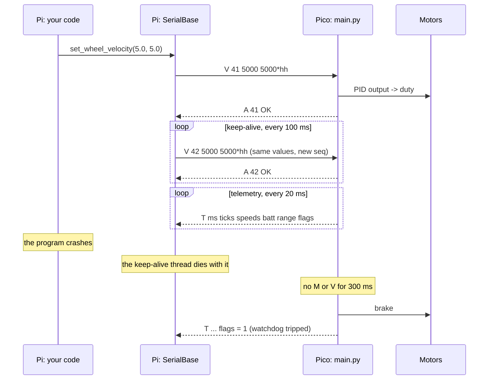
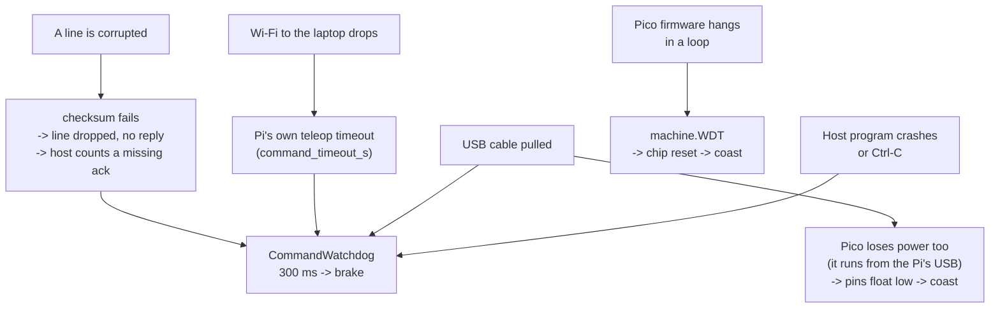

# 01.10 — Design the Pi ↔ Pico serial protocol (with a watchdog)

<!-- glance:start -->
<!-- generated by tools/build.py from curriculum/syllabus.yaml — edit the syllabus, not this block -->

| | |
|---|---|
| **Track** | Main path |
| **Difficulty** | Intermediate |
| **Time** | 1 h 30 min |
| **Hardware** | Stage 1 robot: Pi 5, Pico, encoder motors, driver, chassis, battery, distance sensors (stage 1) |
| **Software** | python, pyserial, micropython |
| **Prerequisites** | [01.09 Read the wheel encoders — ticks, direction, counts per revolution](01.09-reading-encoders.md) |
| **Optional prerequisites** | [FE.09 Serial buses: UART, I²C and SPI](../optional-foundations/electronics/FE.09-uart-i2c-spi.md)<br>[FPY.01 Python for C# developers — the fast tour](../optional-foundations/python/FPY.01-python-for-csharp-devs.md) |
| **Skip if** | You already have a robust, versioned command/telemetry link with a motor-stop watchdog. |

<!-- glance:end -->

## What you will learn

- Answer the five questions every wire protocol must answer — framing, integrity, ordering, liveness and evolution — and justify karmel's answer to each.
- Read, write and check protocol v1 lines by hand, and predict exactly what the firmware does with a damaged one.
- Explain why drive commands are fire-and-forget while `S`, `R` and `P` are acknowledged and retried.
- Build a command watchdog that stops the motors when the host goes quiet, and measure how far the robot travels before it does.
- Exercise the whole link — encoding, acknowledgements, keep-alive, watchdog — against a software Pico, with no hardware attached.

## Why it matters

You now have two computers with complementary weaknesses. The Pi is smart and unreliable: Linux can pause your
process for tens of milliseconds, your Python can throw, Wi-Fi can drop, and the whole thing can reboot. The Pico is
dumb and dependable: one program, predictable to the microsecond, but it has no idea where the robot should go.
The cable between them is the seam, and **every serious failure mode of this robot crosses that seam**.

This is a distributed-systems problem and you already have the instincts for it — you have designed request/response
protocols, idempotency keys, heartbeats and version negotiation before. What is new is the consequence of getting it
wrong: a lost message in a web service means a retry, a lost message here means a 1.6 kg robot continuing at 0.3 m/s
into a wall because nobody told it to stop. The watchdog you build today is the reason that doesn't happen, and it
is the single most important safety mechanism in Stage 1 ([SAFETY.md](../SAFETY.md) rule 3).

<!-- prereqs:start -->
## Prerequisites

You need these first:

- [01.09 Read the wheel encoders — ticks, direction, counts per revolution](01.09-reading-encoders.md)

### Optional prerequisite links

New to any of these? Take the foundation lesson first; skip it if you already know it.

- [FE.09 Serial buses: UART, I²C and SPI](../optional-foundations/electronics/FE.09-uart-i2c-spi.md)
- [FPY.01 Python for C# developers — the fast tour](../optional-foundations/python/FPY.01-python-for-csharp-devs.md)

Check your readiness: `python course.py why 01.10`
<!-- prereqs:end -->

## Concept

### What you actually have

USB CDC serial gives you **an ordered stream of bytes in each direction**. That is all. It does not give you
messages, boundaries, delivery guarantees, or any notification that the other end has gone away. It is a TCP socket
without the connection: bytes you write appear, in order, until they don't.

> [!NOTE]
> New to serial links — UART, baud rate, and why USB CDC pretends to be one? →
> [FE.09 Serial buses: UART, I²C and SPI](../optional-foundations/electronics/FE.09-uart-i2c-spi.md).
> Skip it if you can already say how long 42 bytes take at 115200 baud and why I²C would be the wrong
> bus between two boards a cable apart.

So everything above that you have to build:

| Question | What goes wrong without it | karmel's answer |
|---|---|---|
| **Framing** — where does a message start and end? | Two half-messages get glued into one plausible-looking command | newline-terminated ASCII lines |
| **Integrity** — is this message intact? | A cut cable delivers `M 7 500 -5` and the robot drives at a random speed | NMEA-style XOR checksum |
| **Ordering / identity** — which reply belongs to which request? | You match an old acknowledgement to a new command | a 16-bit sequence number in every command, echoed in the reply |
| **Liveness** — is the other end still there? | The Pi crashes and the robot keeps driving | a 300 ms command watchdog on the Pico |
| **Evolution** — what happens when the two ends disagree? | Subtly wrong behaviour that looks like a hardware fault | a protocol version in the hello reply |

### Text, not binary

karmel's protocol is human-readable ASCII:

```text
M 7 500 -500*77
```

A binary protocol would be smaller and faster to parse. It would also be invisible: you could not open a serial
terminal, watch the robot talk, and type a command by hand. At 50 Hz and 42 bytes per telemetry line the link uses
2.1 kB/s out of roughly 1 MB/s available — **bandwidth is not the constraint**, debuggability is. Lesson
[03.03](../03-robot-software/03.03-robust-serial-communication.md) shows what you would change (COBS framing,
CRC-16) if it ever were.

### The watchdog is the point

Every other feature in this lesson supports one behaviour: **a drive command is a lease, not a setting**. The Pi
says "drive at 30 %", and that is only true for the next 300 ms. If the Pi wants it to remain true it has to keep
saying so. If it stops — because it crashed, because the cable came out, because you hit Ctrl-C — the Pico stops the
motors by itself.

That inversion is what makes the system safe: the *default* state is stopped, and motion requires continuous active
effort. Compare it with a heartbeat in a cluster, except that here the failure action is not "fail over" but
"apply the brakes".

> [!TIP]
> **Ask your teacher:** "Take one telemetry line and one command line and walk me through what each side does with
> every field, including what happens if the line arrives with one character changed."

## Technical explanation

### Level 1 — Designing it, before reading the answer

Work through the five questions yourself first; the design space is small and the trade-offs are real.

**Framing.** Three common choices:

| Approach | How | Cost |
|---|---|---|
| **Delimiter** (`\n`) | read until newline | the delimiter must never appear in the payload — fine for ASCII, painful for binary |
| **Length prefix** | `<len><payload>` | one corrupted length byte and you are mis-framed for a long time |
| **COBS** | byte-stuff so `0x00` never occurs in the payload, then use `0x00` as the delimiter | a little code, resynchronises in one message |

karmel uses a delimiter, because the payload is printable ASCII by construction so the delimiter cannot collide.
COBS appears in [03.03](../03-robot-software/03.03-robust-serial-communication.md).

**Integrity.** USB already has CRCs at the link layer, so bit errors on the wire are rare. What is *not* rare is a
line that was **truncated** — the cable was pulled mid-write, the host program was killed, the Pico rebooted between
two characters. A checksum catches that, cheaply: XOR every payload byte, print it as two hex digits. It is the same
scheme NMEA has used for marine GPS for decades, which is why you can read it.

**Ordering and identity.** Each command carries a 16-bit `seq` that the reply echoes. That is what lets the host
match `A 7 OK` to the command it sent, count missing acknowledgements, and discard a late reply for a command it has
already given up on.

**Liveness.** Something must notice when the other end stops talking. It has to be the Pico, because the failure to
detect is the Pi's.

**Evolution.** The `I` reply carries a protocol version. `SerialBase` warns when the firmware's version differs from
the library's. Adding a *command* is backward compatible (old firmware answers `ERR unknown_command`); changing the
*shape* of an existing message is not, because both parsers check the field count exactly.

### Level 2 — Protocol v1, as implemented

The normative description is in [labs/README.md](../labs/README.md#the-pi--pico-protocol-v1); the canonical code is
[`labs/python/robotlab/protocol.py`](../labs/python/robotlab/protocol.py) (host) and
[`labs/firmware/pico/protocol.py`](../labs/firmware/pico/protocol.py) (firmware), and a test round-trips lines
between them so they cannot drift apart.

**The line:**

```text
<payload>*<hh>\n          hh = XOR of every payload byte, two uppercase hex digits
                          fields inside the payload are separated by exactly one space
                          integers are plain decimal: -12 is valid, +12 and 12.0 are not
                          a line longer than 120 characters is discarded
```

**Host → Pico:**

| Payload | Meaning | Acknowledged? |
|---|---|---|
| `H <seq>` | hello; who are you? | replies `I …` |
| `M <seq> <left> <right>` | open-loop duty, per-mille, −1000…1000 | `A <seq> OK`, but the host does not wait |
| `V <seq> <left_mrad_s> <right_mrad_s>` | wheel velocity setpoints, milliradians/s (PID runs on the Pico) | same |
| `S <seq>` | stop (brake) | `A <seq> OK`, **the host waits and retries** |
| `R <seq>` | reset encoder counts to zero | same |
| `P <seq> <key> <value>` | set `kp`, `ki`, `kd`, `ff`, `watchdog_ms` or `telemetry_hz` | same |

**Pico → host:**

| Payload | Meaning |
|---|---|
| `I <firmware_version> <protocol_version>` | hello reply |
| `A <seq> OK` / `A <seq> ERR <reason>` | acknowledgement; reasons are `bad_args`, `out_of_range`, `unknown_command`, `unknown_param` |
| `T <ms> <lticks> <rticks> <l_mrad_s> <r_mrad_s> <batt_mV> <range_mm> <flags>` | telemetry, 50 Hz by default |

`ms` counts up from boot and does not wrap. `batt_mV` and `range_mm` are `−1` when there is no valid reading.
`flags` is a bitfield:

| Bit | Value | Meaning |
|---|---|---|
| 0 | 1 | watchdog tripped — motors stopped because no `M`/`V` arrived in time (set at boot, until the first drive command) |
| 1 | 2 | low battery |
| 2 | 4 | range sensor error |
| 3 | 8 | velocity mode active (the last drive command was `V`, not `M`) |

**Two acknowledgement policies, on purpose.**

- **Drive commands (`M`, `V`) are fire-and-forget.** A control loop sends 20–50 of them per second; if one is lost,
  the next one 20–50 ms later replaces it. Waiting for an acknowledgement would add a round trip to every control
  cycle for no benefit. Lost ones are *counted* (`stats.unacked_drive_commands`) so a degrading link is visible.
- **`S`, `R` and `P` are waited for and retried.** These are one-shot and must not be lost: a dropped `S` means the
  robot does not stop (until the watchdog catches it), a dropped `R` means your odometry starts from the wrong
  offset, a dropped `P` means the firmware is running gains you think you changed.

That is the same reasoning as "fire-and-forget metrics, at-least-once for commands" in a service, with one extra
twist: repeating a drive command is harmless because it is **idempotent** — it sets a state, it does not request an
increment. Designing the wire messages to be idempotent is what makes fire-and-forget safe.

**Errors and silence.** A line that fails framing or checksum gets **no reply at all**: its sequence number cannot
be trusted, so there is nobody to answer. A line that frames correctly but is semantically wrong keeps a trustworthy
`seq`, so it gets `A <seq> ERR <reason>`. The host notices the first kind through a missing acknowledgement and the
rising `stats.bad_lines`.

### Level 3 — Mathematics: how strong, how fast, how far

**How much does the checksum catch?** An 8-bit XOR is a parity check per bit position. It detects:

- every single-bit error,
- every error that flips an odd number of bits in the same bit position,
- every truncation that changes the length (the remaining bytes almost never XOR to the same value),

and it misses errors that flip an even number of bits in the same column. For a *random* corruption, the chance of
landing on the same checksum by luck is

$$P_{undetected} \approx \frac{1}{2^8} = 0.39\%$$

against $1/2^{16} = 0.0015\%$ for a CRC-16. Over a USB link, where the hardware already CRCs every packet and the
realistic failure is truncation rather than random bit flips, 0.39 % of a very small number is acceptable.
[03.03](../03-robot-software/03.03-robust-serial-communication.md) does the full analysis and the upgrade.

**Bandwidth.** A telemetry line is 42 bytes. At 50 Hz that is 2,100 bytes/s. Commands at 20 Hz add about 320
bytes/s. USB full speed is 12 Mbit/s, and MicroPython's CDC serial sustains on the order of 1 MB/s in practice, so
the link runs at roughly **0.25 % of capacity**. Latency and robustness are the design constraints, not throughput.

**Choosing the watchdog timeout.** Two forces pull in opposite directions:

$$t_{watchdog} > k \cdot T_{command} \quad\text{(don't trip on normal jitter)}, \qquad
d_{coast} = v \cdot t_{watchdog} \quad\text{(don't travel far when it does)}$$

With commands at 20 Hz ($T = 50$ ms) and `SerialBase`'s keep-alive at 100 ms, a 300 ms timeout tolerates **two
consecutive lost keep-alives** plus scheduling jitter. And the cost:

| Speed | Distance in 300 ms | Plus braking (≈ 0.1 s at 3 m/s²) |
|---|---|---|
| 0.1 m/s | 3 cm | ≈ 3.2 cm |
| 0.3 m/s | 9 cm | ≈ 10 cm |
| 0.5 m/s (the software limit) | 15 cm | ≈ 17 cm |

**Example.** The robot is crossing a room at 0.3 m/s and your Python raises an exception. The keep-alive thread dies
with the process, the Pico sees no `M` or `V`, and 300 ms later it brakes. The robot has moved about 9 cm past the
point where your program died, plus a few centimetres of braking. That is the whole safety budget, and it is why
`max_linear_speed_m_s` is 0.5 and not 0.97.

**Sequence-number wraparound.** `seq` is 0…65535 and wraps. At 50 commands per second it wraps every
$65536/50 = 1311$ s ≈ 22 minutes. A stale reply that arrives 22 minutes late and matches a live sequence number is
not a realistic failure here — but it is exactly the reason real protocols use timestamps or larger counters, and
`SerialBase` expires pending entries after $5 \times$ the acknowledgement timeout rather than keeping them forever.

### Level 4 — Implementation: two watchdogs, and the loop that feeds them

[`labs/firmware/pico/watchdog.py`](../labs/firmware/pico/watchdog.py) has two, for two different failures:

```python
class CommandWatchdog:
    """Software watchdog for host commands. Times are time.ticks_ms() values."""

    def __init__(self, timeout_ms, now_ms):
        self.timeout_ms = timeout_ms
        self._last_feed_ms = now_ms
        # Start tripped: after boot the motors are stopped until the first command arrives.
        self.tripped = True

    def feed(self, now_ms):
        self._last_feed_ms = now_ms
        self.tripped = False

    def check(self, now_ms):
        """Return True exactly once, on the step where the watchdog trips."""
        if self.tripped:
            return False
        if ticks_diff(now_ms, self._last_feed_ms) >= self.timeout_ms:
            self.tripped = True
            return True
        return False
```

Four details worth copying into your own embedded code:

1. **It starts tripped.** A freshly booted Pico is in the "stopped" state until a host explicitly commands motion.
   Safe defaults, not zero defaults.
2. **`check()` returns `True` exactly once**, on the transition, so the caller brakes once instead of hammering the
   motors every control step.
3. **`ticks_diff`, never subtraction.** `time.ticks_ms()` wraps (after about 12 days on the Pico); subtracting two
   tick values across the wrap gives a huge negative number and your watchdog stops working. `ticks_diff` handles
   it.
4. **Time is an argument, not a global.** Every method takes `now_ms`, which is what lets
   `labs/python/tests/test_firmware_logic.py` test the whole firmware on a PC with a fake clock.

`HardwareWatchdog` wraps `machine.WDT` and covers the *other* failure: the Pico itself hanging. If the control loop
stops feeding it, the chip resets — and after a reset the motor pins are inputs again, which the DRV8874 carrier's
pull-downs turn into coast. It is disabled by default (`HARDWARE_WATCHDOG_MS = 0`) because, once started, it cannot
be stopped, and it fights `mpremote` while you are developing.

The two meet in the firmware's control step,
[`labs/firmware/pico/main.py`](../labs/firmware/pico/main.py):

```python
def control_step(self, now_ms):
    """Call at config.CONTROL_HZ: encoders -> speed estimate -> watchdog -> PID -> motors."""
    ...
    if self.watchdog.check(now_ms):
        self.stop()                     # host went silent: stop NOW
        return
    ...
```

and, one level up:

```python
def control(now):
    robot.control_step(now)
    hardware_watchdog.feed()            # proves the control loop is still running
```

The hardware watchdog is fed **inside the control task**, not from a timer of its own. That is deliberate: what you
want to prove is that *the control loop* is alive, not that some timer is.

On the host side, [`labs/python/robotlab/serial_base.py`](../labs/python/robotlab/serial_base.py) completes the
picture with a keep-alive thread that re-sends the active drive command every 100 ms, so the watchdog never trips
while your code is still commanding — and dies with your process, so it does trip when your code stops. Its
optional `command_timeout_s` adds a software dead-man on top: stop refreshing a command the application has not
renewed for that long (teleop uses it).

#### Deploying the firmware

> [!CAUTION]
> **Safety:** once `main.py` is on the Pico, the robot accepts drive commands **at every power-up**. Wheels off the
> ground for this whole section, switch under your hand ([SAFETY.md](../SAFETY.md) rules 1 and 8). Keep
> `HARDWARE_WATCHDOG_MS = 0` while developing, or the Pico resets while you are copying files.

```bash
cd ~/robotics-course/labs/firmware/pico
mpremote cp config.py protocol.py motors.py encoders.py velocity.py watchdog.py sensors.py vl53l1x.py :
mpremote cp main.py :        # main.py runs automatically at every power-up
mpremote reset
```

Then, from the Pi, talk to it exactly as the software Pico was talked to:

```bash
python protocol_lab.py talk --port /dev/ttyACM0
```

## Diagram

**The line, field by field:**

```text
   T 5340 1210 1198 4431 4402 11850 523 8*64
   │ │    │    │    │    │    │     │   │ └── checksum: XOR of every byte before the '*'
   │ │    │    │    │    │    │     │   └──── flags: 8 = velocity mode (bit 3)
   │ │    │    │    │    │    │     └──────── front range 523 mm (-1 = no reading)
   │ │    │    │    │    │    └────────────── battery 11 850 mV (-1 = no reading)
   │ │    │    │    │    └─────────────────── right wheel 4.402 rad/s
   │ │    │    │    └──────────────────────── left wheel 4.431 rad/s
   │ │    │    └───────────────────────────── right encoder, signed cumulative ticks
   │ │    └────────────────────────────────── left encoder, signed cumulative ticks
   │ └─────────────────────────────────────── 5 340 ms since the Pico booted
   └───────────────────────────────────────── message type: telemetry
```

**A normal exchange, and then the failure the whole design exists for:**



**Who protects against what:**



## Code

### `protocol_lab.py`

Six subcommands that take the protocol apart and then exercise it end to end. `--fake` runs a software Pico inside
the same process, so everything works with no robot attached. Save it in the **repository root**; it needs
`robotlab` and pyserial ([labs/README.md](../labs/README.md)).

> [!NOTE]
> The code below leans on Python idioms that have no exact C# twin: dataclasses, `bytes` vs `str`, generators,
> and `with` for the port. New to them? → [FPY.01 Python for C# developers — the fast tour](../optional-foundations/python/FPY.01-python-for-csharp-devs.md).
> Skip it if you already know why `b"M 7"[0]` is an `int` and what a generator gives you over returning a list.

```python
"""01.10 — take protocol v1 apart, then watch the watchdog stop the robot.

Run from the repository root. `--fake` starts a software Pico inside this process, so every
command works with no hardware at all:

    python protocol_lab.py checksum "M 7 500 -500"   # the XOR, byte by byte
    python protocol_lab.py roundtrip                 # encode/decode every message type
    python protocol_lab.py corrupt                   # what a damaged line does
    python protocol_lab.py talk     --fake           # hello, drive, telemetry (raw lines)
    python protocol_lab.py watchdog --fake           # stop sending and time the motor stop
    python protocol_lab.py library  --fake           # the same through robotlab.SerialBase

Against a real Pico running the karmel firmware, replace --fake with
    --port /dev/ttyACM0        (Linux)      --port COM5      (Windows)
or against a separately started software Pico
    --port socket://localhost:5760

Needs `robotlab` and pyserial (labs/README.md).
"""
from __future__ import annotations

import argparse
import contextlib
import sys
import time
from pathlib import Path

REPO = Path(__file__).resolve().parent
for candidate in (REPO / "labs" / "python", Path.cwd() / "labs" / "python"):
    if candidate.is_dir():
        sys.path.insert(0, str(candidate))
        break

from robotlab import protocol  # noqa: E402


# --- 1. framing -------------------------------------------------------------------------------
def cmd_checksum(payload: str) -> None:
    value = 0
    print(f"payload: {payload!r}")
    print("  char  ascii   running XOR")
    for char in payload:
        value ^= ord(char)
        print(f"    {char!r:>4}   {ord(char):3d}      0x{value:02X}")
    line = protocol.frame(payload)
    print(f"\nchecksum      : 0x{value:02X}")
    print(f"complete line : {line!r}")
    print(f"unframes back : {protocol.unframe(line)!r}")
    print("\nThe checksum covers the payload only - not the '*', not the newline. Two hex digits")
    print("are emitted uppercase; a decoder accepts either case.")


def cmd_roundtrip() -> None:
    messages = [
        protocol.Hello(1),
        protocol.DutyCommand(7, 500, -500),
        protocol.VelocityCommand(8, 4444, 4444),
        protocol.StopCommand(9),
        protocol.ResetEncoders(10),
        protocol.SetParam(11, "kp", 0.05),
        protocol.SetParam(12, "watchdog_ms", 300),
        protocol.HelloReply("0.1.0", protocol.PROTOCOL_VERSION),
        protocol.Ack(7, True),
        protocol.Ack(13, False, "out_of_range"),
        protocol.Telemetry(5340, 1210, 1198, 4431, 4402, 11850, 523, 8),
    ]
    print(f"{'message':<28} {'on the wire':<52} bytes")
    for message in messages:
        line = protocol.encode(message)
        assert protocol.decode(line) == message, message      # encode -> decode -> same object
        print(f"{type(message).__name__:<28} {line.strip()!r:<52} {len(line)}")
    print("\nEvery line decoded back to exactly the object it came from.")
    print(f"Telemetry is {len(protocol.encode(messages[-1]))} bytes; at 50 Hz that is "
          f"{len(protocol.encode(messages[-1])) * 50} bytes/s.")


def cmd_corrupt() -> None:
    good = protocol.encode(protocol.DutyCommand(7, 500, -500))
    print(f"good line            : {good!r} -> {protocol.decode(good)}")
    cases = {
        "one digit changed": good.replace("500", "600", 1),
        "one checksum digit changed": good.strip()[:-1] + "8\n",
        "line cut in half (cable pulled)": good[:8] + "\n",
        "no checksum at all": "M 7 500 -500\n",
        "a tab instead of a space": good.replace(" ", "\t", 1),
        "unknown command": protocol.frame("Z 7 500 -500"),
        "duty out of range": protocol.frame("M 7 5000 0"),
    }
    for name, line in cases.items():
        try:
            message = protocol.decode(line)
            verdict = f"accepted: {message}"
        except protocol.ChecksumError as exc:
            verdict = f"ChecksumError  ({exc})"
        except protocol.FramingError as exc:
            verdict = f"FramingError   ({exc})"
        except protocol.MessageError as exc:
            verdict = f"MessageError   ({exc})"
        print(f"  {name:<32} {line.strip()!r:<26} {verdict}")
    print("\nFraming and checksum errors are DROPPED by the firmware without a reply: the sequence")
    print("number in a corrupted line cannot be trusted, so there is nobody to answer. Message")
    print("errors keep a trustworthy seq, so they get 'A <seq> ERR <reason>'.")


# --- 2. talking to a Pico ---------------------------------------------------------------------
class LineReader:
    """Read complete protocol lines from a pyserial port opened with timeout=0."""

    def __init__(self, port) -> None:
        self.port = port
        self._buffer = b""

    def lines(self, seconds: float):
        deadline = time.monotonic() + seconds
        while time.monotonic() < deadline:
            chunk = self.port.read(4096)
            if not chunk:
                time.sleep(0.002)
                continue
            self._buffer += chunk
            while b"\n" in self._buffer:
                line, self._buffer = self._buffer.split(b"\n", 1)
                if line.strip():
                    yield line


@contextlib.contextmanager
def open_link(args):
    """Yield (pyserial port, url). With --fake, a software Pico runs in this process."""
    import serial

    server = None
    url = args.port
    if args.fake:
        from robotlab.fake_pico import FakePico, FakePicoServer

        server = FakePicoServer(FakePico(), port=0).start()
        url = server.url
        print(f"software Pico listening on {url}\n")
    port = serial.serial_for_url(url, baudrate=115200, timeout=0)
    try:
        yield port, url
    finally:
        port.close()
        if server is not None:
            server.stop()


def send(port, message) -> None:
    print(f"  Pi   -> Pico : {protocol.encode(message).strip()}")
    port.write(protocol.encode_bytes(message))


def show(line: bytes) -> object | None:
    try:
        message = protocol.decode_pico_message(line)
    except protocol.ProtocolError as exc:
        print(f"  Pico -> Pi   : {line!r}   REJECTED: {exc}")
        return None
    print(f"  Pico -> Pi   : {line.decode().strip():<52} {type(message).__name__}")
    return message


def listen(reader: LineReader, seconds: float, max_telemetry: int = 4) -> None:
    """Print replies for `seconds`, but only the first few telemetry lines (50 Hz is a lot)."""
    shown = hidden = 0
    for line in reader.lines(seconds):
        if line.startswith(b"T "):
            shown += 1
            if shown > max_telemetry:
                hidden += 1
                continue
        show(line)
    if hidden:
        print(f"  ... and {hidden} more telemetry lines")


def cmd_talk(args) -> None:
    with open_link(args) as (port, _url):
        reader = LineReader(port)
        send(port, protocol.Hello(1))
        listen(reader, 0.3, max_telemetry=2)
        print("\n--- drive both wheels at 30 % duty for 0.4 s ---")
        send(port, protocol.DutyCommand(2, 300, 300))
        listen(reader, 0.4)
        print("\n--- stop ---")
        send(port, protocol.StopCommand(3))
        listen(reader, 0.2, max_telemetry=2)
        print("\nThe tick counts rise while the duty command is active, the speed estimate")
        print("follows, and flag 8 (velocity mode) stays clear because M is open loop.")


def cmd_watchdog(args) -> None:
    """Send one drive command, then go quiet, and time how long until flag 1 appears."""
    with open_link(args) as (port, _url):
        reader = LineReader(port)
        send(port, protocol.Hello(1))
        listen(reader, 0.2, max_telemetry=1)

        print("\n--- one M command, then SILENCE (this is what a crashed host looks like) ---")
        sent_at = time.monotonic()
        send(port, protocol.DutyCommand(2, 400, 400))

        tripped_at = None
        last = None
        for line in reader.lines(1.2):
            try:
                message = protocol.decode_pico_message(line)
            except protocol.ProtocolError:
                continue
            if not isinstance(message, protocol.Telemetry):
                continue
            flags = message.flags
            if last is None or (flags & protocol.FLAG_WATCHDOG) != (last & protocol.FLAG_WATCHDOG):
                elapsed = (time.monotonic() - sent_at) * 1000
                state = "TRIPPED - motors braked" if flags & protocol.FLAG_WATCHDOG else "running"
                print(f"  t = {elapsed:6.0f} ms   flags = {flags}   {state}")
                if flags & protocol.FLAG_WATCHDOG and tripped_at is None:
                    tripped_at = elapsed
            last = flags

        if tripped_at is None:
            print("\n  the watchdog did not trip - is watchdog_ms larger than the 1.2 s we waited?")
        else:
            print(f"\n  watchdog tripped {tripped_at:.0f} ms after the last drive command "
                  f"(firmware default: 300 ms).")
            print("  A robot at 0.3 m/s travels about "
                  f"{0.3 * tripped_at / 1000 * 100:.0f} cm in that time, plus braking distance.")


def cmd_library(args) -> None:
    """The same conversation through robotlab.SerialBase, which handles all of it for you."""
    from robotlab.serial_base import SerialBase

    with open_link(args) as (port, url):
        port.close()                      # SerialBase opens the URL itself
        with SerialBase(url) as base:
            print(f"firmware      : {base.firmware}")
            base.reset_encoders()
            base.set_wheel_velocity(5.0, 5.0)     # SAFETY: on a real robot the wheels turn here
            state = base.read()
            for _ in range(6):
                # newer_than uses the ROBOT's clock, so this samples about every 100 ms
                state = base.wait_for_telemetry(timeout_s=1.0, newer_than=state.t + 0.09)
                print(f"  t={state.t:7.3f} s  ticks L/R {state.left_ticks:6d}/{state.right_ticks:6d}  "
                      f"speed {state.left_rad_s:5.2f}/{state.right_rad_s:5.2f} rad/s  "
                      f"batt {state.battery_v}  flags {state.flags}")
            base.stop()
            print(f"stats         : {base.stats}")
        print("\nSerialBase did all of this for you: sequence numbers, acknowledgements with")
        print("retries for stop/reset/param, a keep-alive thread that re-sends the drive command")
        print("every 100 ms so the watchdog never trips while you are still commanding, unit")
        print("conversion to SI, and reconnection if the cable is pulled.")


def main() -> int:
    parser = argparse.ArgumentParser(description=__doc__,
                                     formatter_class=argparse.RawDescriptionHelpFormatter)
    sub = parser.add_subparsers(dest="command", required=True)

    p = sub.add_parser("checksum", help="XOR a payload, byte by byte")
    p.add_argument("payload")
    sub.add_parser("roundtrip", help="encode and decode every message type")
    sub.add_parser("corrupt", help="what happens to damaged lines")
    for name, helptext in (("talk", "hello, drive, telemetry, stop"),
                           ("watchdog", "go silent and time the motor stop"),
                           ("library", "the same through robotlab.SerialBase")):
        p = sub.add_parser(name, help=helptext)
        p.add_argument("--port", default="/dev/ttyACM0", help="serial device or pyserial URL")
        p.add_argument("--fake", action="store_true", help="run a software Pico in this process")

    args = parser.parse_args()
    if args.command == "checksum":
        cmd_checksum(args.payload)
    elif args.command == "roundtrip":
        cmd_roundtrip()
    elif args.command == "corrupt":
        cmd_corrupt()
    elif args.command == "talk":
        cmd_talk(args)
    elif args.command == "watchdog":
        cmd_watchdog(args)
    else:
        cmd_library(args)
    return 0


if __name__ == "__main__":
    raise SystemExit(main())
```

You can also run the software Pico as a separate process, which is closer to the real thing:

```bash
PYTHONPATH=labs/python python -m robotlab.fake_pico --port 5760     # terminal 1
python protocol_lab.py talk --port socket://localhost:5760          # terminal 2
```

On Windows PowerShell, set `$env:PYTHONPATH = "labs/python"` instead of the `PYTHONPATH=` prefix.

## Exercise

### Exercise 01.10-E1 — Design it before you read it `[design]`

Hardware: none. Do this **before** re-reading Level 2, and keep your answer.

Write a one-page specification for a Pi↔MCU link for karmel, answering the five questions in Level 1: framing,
integrity, ordering, liveness, evolution. For each, state your choice **and the failure it prevents**. Then compare
with protocol v1 and list: (a) one place where your design is better, (b) one place where it is worse, (c) one
decision you made that you now think was arbitrary.

### Exercise 01.10-E2 — Checksums and lines by hand `[numerical]`

Hardware: none.

1. Compute the XOR checksum of `S 42` by hand, then check with `python protocol_lab.py checksum "S 42"`.
2. Write the complete line for: stop with sequence 42; reset encoders with sequence 43; set `watchdog_ms` to 500
   with sequence 44; drive the left wheel at −25 % and the right at +25 % with sequence 45.
3. Here is a received line: `T 12000 -2464 2464 0 0 10450 -1 3*hh`. Without computing the checksum, say what the
   robot is doing, how long it has been running, and what the flags mean.
4. `python protocol_lab.py corrupt`. For each of the seven cases, say whether the firmware replies and why.

### Exercise 01.10-E3 — Talk to a software Pico `[coding]`

Hardware: none.

1. `python protocol_lab.py roundtrip` and `python protocol_lab.py talk --fake`. Identify, in the output, the hello
   reply, the acknowledgement, the point where the tick counts start rising, and the flags before and after the
   drive command.
2. Start the software Pico in its own terminal (`python -m robotlab.fake_pico --port 5760`) and connect with
   `--port socket://localhost:5760`.
3. Extend `protocol_lab.py` with a `params` subcommand that sends `P <seq> kp 0.05`, `P <seq> kp 999` and
   `P <seq> banana 1` and prints the three replies.

### Exercise 01.10-E4 — Make the watchdog trip, and time it `[predict]`

Hardware: none for parts 1–3.

1. **Predict first:** after `protocol_lab.py watchdog --fake` sends one `M` command and stops, how many milliseconds
   until `flags` includes bit 0, and what will the tick counts do in the meantime?
2. Run it. Compare with your prediction and explain any difference.
3. Run it again with the timeout changed: send `P <seq> watchdog_ms 1000` first (add it, or use the `params`
   command from E3). Predict, then measure.
4. Predict what `python protocol_lab.py library --fake` shows instead, and why the watchdog does **not** trip there.

### Exercise 01.10-E5 — Deploy and measure on the real robot `[hardware]`

Hardware: `robot-base` (the full robot from 01.06–01.09), on a stand.

> [!CAUTION]
> **Safety:** wheels off the ground, switch under your hand. After this exercise the Pico accepts drive commands at
> every power-up ([SAFETY.md](../SAFETY.md) rules 1, 3 and 8).

1. Deploy the firmware (Level 4) and confirm `protocol_lab.py talk --port /dev/ttyACM0` shows a hello reply and
   telemetry with your real tick counts.
2. Run `protocol_lab.py watchdog --port /dev/ttyACM0` and record the measured trip time. Watch the wheels.
3. Set `watchdog_ms` to 1000, repeat, and watch how much longer the wheels keep turning.
4. Put it back to 300, then do the real test: start `protocol_lab.py library --port /dev/ttyACM0` and **kill the
   process with Ctrl-C while the wheels are turning**. Time how long they keep going.
5. Record all four results in your build log.

## Expected result

- **01.10-E1:** Any coherent design is acceptable; the grading is in the *reasons*. Good answers notice that
  integrity is mostly about truncation rather than bit flips on a USB link, that liveness must be enforced by the
  side that is *not* failing, and that drive commands should be idempotent state-setting messages rather than
  increments. Common arbitrary decisions people spot in their own designs: the exact timeout value, binary versus
  text, and acknowledging everything "because it feels safer" (it costs a round trip per control cycle and buys
  nothing for a message that is replaced 20 times a second).
- **01.10-E2:** (1) `S 42`: `0x53 ^ 0x20 = 0x73`, `^ 0x34 = 0x47`, `^ 0x32 = 0x75`, so the line is `S 42*75`.
  (2) `S 42*75`, `R 43*75`, `P 44 watchdog_ms 500*01`, `M 45 -250 250*41` — check each with the `checksum`
  subcommand. (Yes, `S 42` and `R 43` really do have the same checksum: an 8-bit XOR has only 256 values, which is
  the point of the probability calculation in Level 3.) (3) Twelve
  seconds since boot; the left wheel is exactly one revolution **behind** its start and the right exactly one
  revolution ahead — the robot has rotated in place; both wheels are now stopped; battery 10.45 V (below the 10.5 V
  warning); no valid range reading; flags 3 = 1 + 2 = watchdog tripped **and** low battery. So: it rotated, the host
  went quiet, the motors were braked, and the battery needs charging. (4) The three that fail framing or checksum
  (`one digit changed`, `one checksum digit changed`, `line cut in half`, `no checksum at all`, `a tab instead of a
  space`) get **no reply**; `unknown command` and `duty out of range` frame correctly, so the firmware answers
  `A 7 ERR unknown_command` and `A 7 ERR out_of_range`.
- **01.10-E3:** `roundtrip` prints eleven messages, each decoding back to itself, with telemetry at 42 bytes =
  2,100 bytes/s at 50 Hz. `talk --fake` shows `I fake-0.1.0 1*6D`, then `A 2 OK*77` after the `M`, then telemetry
  whose tick counts climb from 0 and whose flags go from `1` (watchdog tripped at boot) to `0`, and back to `1`
  after the `S`. The `params` subcommand should produce `A <seq> OK`, `A <seq> ERR out_of_range` (`kp` is limited to
  0…10) and `A <seq> ERR unknown_param`.
- **01.10-E4:** (1) ≈ 300 ms, and the ticks keep rising the whole time. (2) You should measure roughly 290–350 ms,
  and a different value on each run: the timeout is 300 ms, but you only *learn* about the trip on the next
  telemetry line (up to 20 ms later at 50 Hz), and the software Pico advances in 10 ms simulation steps, so the
  reported moment can land either side of 300. **The measured value is the one that matters**: it includes the
  reporting delay that a real system also has. (3) With `watchdog_ms 1000` the trip happens at roughly
  990–1,050 ms. (4) `library --fake` never trips (flags stay 8, velocity mode) because `SerialBase`'s keep-alive
  thread re-sends the drive command every 100 ms. That is exactly the difference between "the application is alive"
  and "someone sent a command once".
- **01.10-E5:** `mpremote ls` shows the nine firmware files; after `reset` the status LED blinks slowly (idle) and
  speeds up while driving. Measured watchdog trip: 300–350 ms, and you should *see* the wheels stop. At
  `watchdog_ms 1000` the wheels visibly keep turning for about a second — this is the exercise that makes the number
  real. On Ctrl-C the wheels stop within about 300 ms of the keypress; note that `SerialBase.close()` also sends an
  explicit `S`, so a clean shutdown stops faster than the watchdog, and the watchdog is the backstop for the
  *unclean* case (pull the USB cable instead, and compare).

## Troubleshooting

### Symptom: `AckTimeoutError: no hello reply from /dev/ttyACM0`

1. **Is anything on the port?** `mpremote connect list`, or `python find_pico.py` from
   [01.05](01.05-pico-microcontroller-setup.md).
2. **Is `main.py` actually on the Pico and running?** `mpremote ls` should show it. `mpremote reset` then watch:
   `timeout 3 cat /dev/ttyACM0` should print telemetry lines.
3. **Is something else holding the port?** `fuser -v /dev/ttyACM0`. An open `mpremote repl` in another window will
   swallow everything. One owner per port.
4. **Did the firmware crash at startup?** `mpremote repl` and press Ctrl-D: you will see the traceback. A missing
   module (you forgot to copy one) is the usual cause.
5. **Wrong protocol version?** A hello reply with a different version number still arrives; `SerialBase` logs a
   warning rather than failing. If you get no reply at all, it is not a version problem.

### Symptom: `stats.bad_lines` keeps rising

1. **Is something else printing to the same serial port?** A stray `print()` in the firmware, or a `mpremote`
   session, injects lines with no checksum. The firmware's telemetry goes to `sys.stdout`, which *is* the protocol
   channel — that is why debugging prints do not belong in `main.py` once it is deployed.
2. **Is the line being truncated?** Check `MAX_LINE_LENGTH` (120) — a telemetry line with huge tick counts is still
   well under it, but a malformed float from a bad `P` value is not.
3. **Is the Pico rebooting?** `stats.firmware_restarts` counts telemetry clocks going backwards. A rebooting Pico
   is a power problem ([01.07](01.07-power-system.md), [02.02](../02-robot-electronics/02.02-power-budget.md)).

### Symptom: the motors stutter or stop every few hundred milliseconds

The watchdog is tripping and being re-fed. In order:

1. **Is your loop actually sending commands?** Print the rate. Anything slower than about 3 Hz will trip a 300 ms
   watchdog between commands.
2. **Is the loop blocking?** A `time.sleep(1)` between commands, a blocking network read, or a slow log write will
   do it. `SerialBase`'s keep-alive thread exists precisely so this does not matter — use the library rather than
   writing raw lines in your application loop.
3. **Did you set `command_timeout_s`?** That deliberately stops refreshing a command the application has not
   renewed. Teleop wants it; a control loop does not.
4. **Do not "fix" it by raising `watchdog_ms`.** Fix the loop. The watchdog is doing its job.

### Symptom: `A <seq> ERR bad_args` for a command that looks fine

The parsers are deliberately strict, and every one of these is a real bug in a real implementation:

- **Two spaces** between fields, or a trailing space. Fields are separated by exactly one space.
- **`+12`** instead of `12`, or **`12.0`** where an integer is required.
- A **float** for `watchdog_ms` or `telemetry_hz` (both are integer parameters).
- `\r\n` is fine (both sides strip it), but any other non-printable character is not.

### Symptom: the watchdog never trips, even when you stop sending

1. **Are you using `SerialBase`?** Its keep-alive thread re-sends the last drive command every 100 ms. That is the
   feature. To test the watchdog, send raw lines (as `protocol_lab.py watchdog` does) or set `command_timeout_s`.
2. **Is `watchdog_ms` what you think?** Send `P <seq> watchdog_ms 300` and check for `A <seq> OK`.
3. **Is telemetry arriving at all?** You detect the trip through flag 1 in telemetry; if telemetry has stopped you
   will never see it.

## Common mistakes

- **Treating a drive command as a setting.** It is a lease. Code that sets a speed and then sleeps will be stopped
  by the watchdog, and that is correct behaviour, not a bug to work around.
- **Raising `watchdog_ms` to make a slow loop work.** You have traded a visible stutter for an invisible increase in
  stopping distance.
- **Acknowledging everything.** A round trip per control cycle, for messages that are replaced 20 times a second.
- **Acknowledging nothing.** A lost `S` or `P` is silent and its effect is permanent.
- **Replying to a line that failed its checksum.** Its sequence number is untrustworthy; you would be answering a
  question nobody asked.
- **`print()` in deployed firmware.** `sys.stdout` *is* the protocol channel.
- **Subtracting `ticks_ms()` values.** They wrap. Use `ticks_diff`.
- **A watchdog that starts untripped.** Then a Pico that boots while a stale command sits in a buffer can move
  before the host has said anything. Start in the safe state.
- **Changing the field layout of an existing message** without bumping the protocol version. Both parsers check the
  field count exactly, so one side silently rejects every line.

## Knowledge check

1. Why does the firmware send no reply at all to a line whose checksum fails, rather than `A <seq> ERR bad_checksum`?
   <details><summary>Answer</summary>

   Because if the checksum failed, **the sequence number in that line cannot be trusted either** — it may be
   corrupted too. Replying would risk sending an acknowledgement that the host matches to a *different*, legitimate
   command. Silence is unambiguous: the host sees a missing acknowledgement, counts it, and retries if the command
   was one of the retried kinds.
   </details>

2. Why are `M` and `V` fire-and-forget while `S`, `R` and `P` are waited for and retried?
   <details><summary>Answer</summary>

   `M`/`V` are **idempotent state-setting messages sent continuously**: 20–50 per second, each one replacing the
   last, so a loss is repaired by the next message 20–50 ms later and waiting for an acknowledgement would add a
   round trip to every control cycle. `S`, `R` and `P` are **one-shot** and their loss is permanent and
   consequential: the robot doesn't stop, odometry starts from a wrong offset, or the firmware runs gains you think
   you changed.
   </details>

3. You set `watchdog_ms` to 50 and your control loop runs at 20 Hz. What happens, and what is the right fix?
   <details><summary>Answer</summary>

   Commands arrive every 50 ms, so any jitter at all pushes the gap past 50 ms and the watchdog trips between
   commands: the motors stutter. The right fix is a timeout of several command periods (karmel: 300 ms, six periods
   at 20 Hz, tolerating two lost 100 ms keep-alives). The wrong fix is raising it to a second, which triples the
   distance the robot travels after a genuine failure.
   </details>

4. Compute the checksum of `R 43` and write the full line.
   <details><summary>Answer</summary>

   `R` = 0x52, space = 0x20, `4` = 0x34, `3` = 0x33.
   $0x52 \oplus 0x20 = 0x72$; $0x72 \oplus 0x34 = 0x46$; $0x46 \oplus 0x33 = 0x75$.
   The line is **`R 43*75\n`**. (Check it: `python protocol_lab.py checksum "R 43"`.)
   </details>

5. Predict: the robot is driving at 0.4 m/s under `SerialBase` when you pull the USB cable between the Pi and the Pico. Describe what happens, in order, and how far the robot travels.
   <details><summary>Answer</summary>

   In Stage 1 the Pico is powered *by that cable*, so it loses power immediately: its pins become inputs, the
   DRV8874 carrier's pull-downs take both inputs low, and the motors **coast**. The robot rolls to a stop over
   perhaps a metre depending on the floor. If the Pico had its own supply, the command watchdog would instead trip
   after 300 ms (12 cm at 0.4 m/s) and **brake**, which stops it much faster. Meanwhile the host's reader thread
   notices the disconnect, forgets the drive command (so a reconnect cannot silently restart the motors) and starts
   retrying.
   </details>

6. Debugging: telemetry arrives normally, `stats.acks_ok` climbs, but `stats.bad_lines` also climbs steadily at about 2 per second. What is the most likely cause?
   <details><summary>Answer</summary>

   Something is writing non-protocol text to the same serial port. The usual culprit is a `print()` left in the
   firmware (the telemetry channel *is* `sys.stdout`), or a MicroPython warning or traceback. Look at the raw bytes:
   `timeout 3 cat /dev/ttyACM0` shows the offending lines immediately. A steady low rate, rather than a burst,
   points to something periodic — a sensor error message in a task.
   </details>

7. You want to add a front-bumper switch to the telemetry. What is the compatible way to do it, and what is the tempting incompatible one?
   <details><summary>Answer</summary>

   **Compatible:** use a spare **flag bit** (bit 4, value 16) in the existing `flags` field — old hosts ignore
   unknown bits, and nothing about the line's shape changes. **Incompatible and tempting:** appending a ninth field
   to `T`. Both parsers check the field count exactly (`_expect(args, 8, …)`), so every telemetry line would be
   rejected by an un-updated host. If you genuinely need a new field, add a **new message type** (a new letter) or
   bump `PROTOCOL_VERSION` and handle both — which is what the version in the hello reply is for.
   </details>

## Practical challenge

Prove the whole link, end to end, and then prove that it fails safely.

1. Deploy the firmware to the Pico and confirm hello, telemetry, and all six commands work from the Pi
   (`protocol_lab.py talk` plus your `params` subcommand from E3).
2. Write a **failure matrix** in your build log, with a measured result for each row: host program exits cleanly;
   host program killed with `kill -9`; USB cable pulled; battery switch opened while driving; a deliberately
   corrupted line injected (`printf 'M 9 999 999*00\n' > /dev/ttyACM0`); `watchdog_ms` set to 1000. For each:
   what the wheels did, how long it took (measure it), and which mechanism acted.
3. Build a **link-quality test**: run a 5-minute session at 20 Hz commands, then print `base.stats` and report
   `bad_lines`, `ack_timeouts`, `unacked_drive_commands` and `firmware_restarts` per minute.
4. Write one paragraph on what you would change first if this robot were going to be driven by someone else.

**Acceptance criteria:** every row of the failure matrix ends with the motors stopped, with a measured time; the
watchdog trip is within 350 ms of the last command; `bad_lines` and `firmware_restarts` are **zero** over five
minutes (a non-zero `firmware_restarts` is a power problem, not a protocol problem); you can explain, from your own
measurements, the difference between the clean-exit stop time and the cable-pull stop time.

## You can skip this if…

You already have a robust, versioned command/telemetry link with a motor-stop watchdog, **and** you can state your
watchdog's timeout and the distance your robot travels before it acts, **and** you answer knowledge-check questions
1, 2 and 7 correctly without looking.

`python course.py skip 01.10 --reason "versioned, checksummed command link with a measured motor-stop watchdog"`

## Go deeper

- [labs/README.md — the Pi ↔ Pico protocol (v1)](../labs/README.md#the-pi--pico-protocol-v1) — the normative specification this lesson teaches.
- NMEA 0183 checksum description (the scheme protocol v1 borrows): https://gpsd.gitlab.io/gpsd/NMEA.html#_nmea_encoding_conventions — why marine GPS has used a human-readable XOR checksum for forty years.
- Consistent Overhead Byte Stuffing (Cheshire & Baker, 1999): https://www.stuartcheshire.org/papers/COBSforToN.pdf — the framing you would move to for a binary protocol, taught in [03.03](../03-robot-software/03.03-robust-serial-communication.md).
- MicroPython `machine.WDT`: https://docs.micropython.org/en/latest/library/machine.WDT.html — the hardware watchdog, its "cannot be stopped" semantics and the RP2350's 8,388 ms maximum.
- MAVLink message and protocol design: https://mavlink.io/en/guide/serialization.html — a mature, production robotics wire protocol with framing, CRC, sequence numbers and versioning; useful to compare your E1 design against.
- [03.03 Robust serial communication](../03-robot-software/03.03-robust-serial-communication.md) and [03.04 Timing and concurrency](../03-robot-software/03.04-timing-and-concurrency.md) — reconnection, udev rules, checksum strength and the firmware's asyncio loop, in depth.

## Progress checkpoint

- [ ] I can name the five questions a wire protocol answers and karmel's answer to each.
- [ ] I can write and check a protocol v1 line by hand, and predict what a damaged one does.
- [ ] I can explain why drive commands are fire-and-forget and `S`/`R`/`P` are retried.
- [ ] The firmware is deployed, and I measured how long the watchdog takes to stop the motors.
- [ ] I tested the link against a software Pico with no hardware attached.

`python course.py complete 01.10` (exercises done) · `python course.py master 01.10`
(challenge done) · `python course.py struggle 01.10 "what was hard"`

Next: [01.11 — Drive forward, backward and rotate in place (open loop)](01.11-drive-and-rotate.md).
