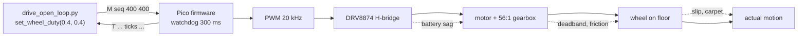

# 01.11 — Drive forward, backward and rotate in place (open loop)

<!-- glance:start -->
<!-- generated by tools/build.py from curriculum/syllabus.yaml — edit the syllabus, not this block -->

| | |
|---|---|
| **Track** | Main path |
| **Difficulty** | Beginner |
| **Time** | 1 h |
| **Hardware** | Stage 1 robot: Pi 5, Pico, encoder motors, driver, chassis, battery, distance sensors (stage 1) |
| **Software** | python |
| **Prerequisites** | [01.10 Design the Pi ↔ Pico serial protocol (with a watchdog)](01.10-pi-pico-protocol.md) |
| **Optional prerequisites** | [FP.01 Units, position, velocity and acceleration](../optional-foundations/physics/FP.01-kinematics-units.md) |
| **Skip if** | Your robot drives and turns on command from Python on the Pi. |

<!-- glance:end -->

## What you will learn

- Drive both wheels from a Python program on the Pi, in all four directions, and stop them safely.
- Measure your own motors' duty→speed curve, including the deadband, instead of guessing it.
- Predict how far the robot will go in *t* seconds at duty *d*, then measure how wrong you were.
- Explain, with numbers, why "same duty on both motors" is never a straight line.
- Run the whole lesson with no robot at all, against a simulated Pico.

## Why it matters

Until now the robot has been parts: a Pi that boots, a Pico that blinks, motors that spin on the
bench, encoders that count, a serial protocol that carries commands. This is the lesson where it
becomes a **robot**: you type a command on the Pi and 1.5 metres of floor go past.

It is also the lesson where the robot disappoints you, on purpose. Open loop means you command a
duty cycle and hope. The robot curves. It goes further on a full battery than on a tired one. It
stops somewhere different every time. Every control, odometry and navigation lesson in this course
exists to fix a specific failure you are about to see with your own eyes, so pay attention to
*how* it fails, not just *that* it does. Modules 08 (control) and 09 (odometry) are the answers;
this lesson is the question.

<!-- prereqs:start -->
## Prerequisites

You need these first:

- [01.10 Design the Pi ↔ Pico serial protocol (with a watchdog)](01.10-pi-pico-protocol.md)

### Optional prerequisite links

New to any of these? Take the foundation lesson first; skip it if you already know it.

- [FP.01 Units, position, velocity and acceleration](../optional-foundations/physics/FP.01-kinematics-units.md)

Check your readiness: `python course.py why 01.11`
<!-- prereqs:end -->

## Concept

### Open loop is fire-and-forget

You already know this distinction from distributed systems. Publishing to a queue and moving on
is open loop: fast, simple, and you have no idea whether the work happened. A request/response
call with a result is closed loop: slower, more code, but you *know*.

"Duty 0.4 on both motors for 2 seconds" is a fire-and-forget message to the floor. Nothing in that
sentence mentions distance, speed or direction. The motors convert it into motion with a factor
that depends on the battery, the carpet, the temperature of the gearbox, the weight of the Pi, and
how tight you did up the wheel screws. You will measure that factor today; you will stop relying on
it in 01.12.

### Four motions from two wheels

A differential-drive robot has exactly two actuators, and every motion is a combination of them:

| Left wheel | Right wheel | Robot does |
|---|---|---|
| forward | forward | drives forward |
| backward | backward | drives backward |
| backward | forward | rotates left (counter-clockwise) on the spot |
| forward | backward | rotates right (clockwise) on the spot |
| forward | forward, slower | curves to the right |
| stopped | forward | pivots around the left wheel |

There is no sideways. A differential-drive robot cannot move to its left without first turning —
that constraint has a name (*non-holonomic*) and it is the reason parking a robot is harder than
parking a drone. 09.01 makes it formal; for now, it is why "go to the kitchen" will always be
"turn, drive, turn" and never "slide".

### Duty is not speed

The duty cycle is the fraction of time the H-bridge connects the motor to the battery
(see [FE.07](../optional-foundations/electronics/FE.07-pwm.md) if PWM is new). The motor turns that
into a voltage, the voltage into a current, the current into torque, the torque into speed — and
somewhere in there, friction eats the first 10–15 % of it entirely. Below a **deadband** duty the
motor makes a faint whine and does not move at all. Above it, speed rises roughly in a straight
line. karmel's deadband is about 0.12; yours will be different, and the two motors' will differ from
each other.

> [!TIP]
> **Ask your teacher:** "Walk me through what physically happens between `set_wheel_duty(0.4, 0.4)`
> on the Pi and the wheel turning — every hop, and roughly how long each one takes."

## Technical explanation

### Level 1 — The command path

```text
your Python on the Pi  →  M 17 400 400*4C\n  →  USB  →  Pico main.py  →  PWM 20 kHz  →  DRV8874  →  motor
        ↑                                                                                            ↓
        └───────────── T 4820 8788 8790 5960 5940 12150 3000 0*7A ←──── telemetry at 50 Hz ─────────┘
```

Three properties of that path matter today:

1. **It is one-way as far as motion is concerned.** The telemetry comes back, but the `M` command
   does not care what it says. That is the definition of open loop.
2. **It expires.** The Pico stops the motors if no `M` or `V` arrives for `watchdog_ms` (300 ms).
   So "drive for 2 seconds" is a *loop* that re-sends the command every 50 ms, not one call and a
   `sleep(2)`. This is a safety feature, not an annoyance: if your program crashes, the SSH session
   dies or the USB cable falls out, the robot stops on its own ([01.10](01.10-pi-pico-protocol.md)).
3. **`stop()` brakes, it does not coast.** The firmware drives both motor inputs to the same level,
   which short-circuits the motor through the H-bridge and turns its own momentum into a braking
   current. The robot still travels a few centimetres; it just travels fewer of them.

> [!CAUTION]
> **Safety:** First run of *any* new motion code goes on a stand — a mug, a box, a roll of tape
> under the chassis — with the wheels in the air. Then the floor, in an open area, with a hand on
> the battery switch and nothing fragile within a metre. Pets and children out of the room: a
> robot that suddenly reverses is exactly the kind of thing a cat investigates with its face.

### Level 2 — Practical: the duty→speed curve

You cannot look this up. Measure it: command a duty, wait for the speed to settle, count encoder
ticks for a fixed time, convert.

$$v = \frac{\Delta\text{ticks}}{\Delta t}\cdot\frac{2\pi r}{N}$$

with $r = 0.045$ m and $N = 2464$ ticks per wheel revolution, so one tick is
$2\pi \times 0.045 / 2464 = 0.11475$ mm of rim travel.

**Example.** The left wheel gains 4807 ticks in 2.00 s:
$v = 4807 / 2.00 \times 0.00011475 = 0.276$ m/s.

`01-first-robot/code/duty_calibration.py` does exactly this for a list of duties. On the simulated
karmel it produces:

| duty | left (m/s) | right (m/s) |
|---|---|---|
| 0.10 | 0.000 | 0.000 |
| 0.15 | 0.030 | 0.030 |
| 0.20 | 0.079 | 0.079 |
| 0.30 | 0.177 | 0.177 |
| 0.40 | 0.276 | 0.276 |
| 0.60 | 0.470 | 0.470 |
| 1.00 | 0.867 | 0.867 |

Fitting a straight line through the points that moved gives

$$v \approx k\,(d - d_0), \qquad k = 0.985\ \text{m/s per unit duty},\quad d_0 = 0.120$$

**Check it:** $0.985 \times (0.40 - 0.120) = 0.276$ m/s. ✓
**Use it backwards:** to get 0.25 m/s, command $d = 0.25/0.985 + 0.120 = 0.374$.

Two warnings about this curve, both of which you will meet again:

- **It is not the same on a stand and on the floor.** Wheels in the air have almost no load, so
  they spin faster. Calibrate on the floor you actually drive on, and say so in your notes.
- **It moves with the battery.** At 10.5 V instead of 12.6 V the same duty gives roughly 17 % less
  speed. That is the second half of why open loop drifts, and 01.14 is where you start watching it.

### Level 3 — Mathematics: body velocity from wheel velocity

Call the left and right rim speeds $v_L$ and $v_R$ (m/s), and the track width $b = 0.200$ m. The
robot's forward speed is the average and its turn rate is the difference divided by the track:

$$v = \frac{v_L + v_R}{2}, \qquad \omega = \frac{v_R - v_L}{b}$$

**Driving forward.** $v_L = v_R = 0.276$ → $v = 0.276$ m/s, $\omega = 0$. In 2 s: 0.552 m.

**Rotating in place.** $v_L = -v_R$, so $v = 0$ and $\omega = 2 v_R / b$. At duty 0.35 each rim
moves at $0.985\times(0.35-0.12) = 0.227$ m/s, so $\omega = 2 \times 0.227/0.200 = 2.27$ rad/s
= 130 °/s, and a quarter turn takes $\frac{\pi/2}{2.27} = 0.69$ s.

**Why it curves.** Suppose the right motor is 6 % weaker — a completely ordinary amount for two
motors out of the same bag. Commanding duty 0.4 on both gives $v_L = 0.276$, $v_R = 0.259$:

$$\omega = \frac{0.259 - 0.276}{0.200} = -0.083\ \text{rad/s} = -4.7\ °/\text{s}$$

The robot is not driving straight, it is driving a circle of radius $v/\omega = 0.276/0.083 = 3.3$ m.
After 2 seconds it has turned 9.5° and is about 4 cm to the right of where you aimed it. After
10 seconds it is 47° off. Nothing is broken; open loop simply has no opinion about heading.

Measured on the simulator's "realistic" robot (right motor 6 % weak, wheels 1 % different, 2 % slip),
2 seconds at duty 0.4 ends at x = 0.527 m, y = −0.030 m, heading −6.7°. Same order as the hand
calculation; the difference is that its two wheels are also slightly different sizes, which happens
to cancel part of the motor mismatch. Real robots are like that too.

> [!NOTE]
> New to "rad/s" and why we never use degrees in code? →
> [FM.02 Angles and radians](../optional-foundations/mathematics/FM.02-angles-and-radians.md), and
> [FP.01 Kinematics and units](../optional-foundations/physics/FP.01-kinematics-units.md) for
> distance–speed–time and SI discipline. Both are short.

### Level 4 — Implementation: the drive loop

The core of `labs/robot/drive_open_loop.py` is eleven lines, and every one of them is there for a
reason:

```python
end_time = time.monotonic() + duration
while time.monotonic() < end_time:
    # SAFETY: the wheels turn here. We re-send every 50 ms (the firmware watchdog
    # stops the motors if commands stop for 300 ms).
    base.set_wheel_duty(left_sign * duty, right_sign * duty)
    time.sleep(0.05)
base.stop()
time.sleep(0.3)          # let the robot come to rest before measuring
end = base.read()
```

- `time.monotonic()`, never `time.time()`: a clock that cannot jump backwards when NTP corrects it.
- The re-send at 20 Hz feeds the watchdog. Delete it and the robot moves for 300 ms and stops.
- `base.stop()` before reading, and a 0.3 s pause, because the encoders keep counting while the
  robot brakes. Read too early and you under-report the distance by a few centimetres.
- The whole thing is inside `with connect(args) as conn:`, whose `finally` closes the port —
  and `SerialBase.close()` brakes the motors first. A `Ctrl-C`, an exception or a bug in your
  code all end with the robot stopped.

## Diagram

**Where a duty command goes, and what can eat it:**



**The four motions, seen from above** (x forward, y left, REP-103):

```text
      forward              rotate left            rotate right          curve right
                                                                     (right wheel slower)
     ↑   ↑                  ↓     ↑                ↑     ↓                ↑    ↑
   ┌─┴───┴─┐              ┌─┴─────┴─┐            ┌─┴─────┴─┐            ┌─┴────┴┐
   │   ▲   │              │    ↺    │            │    ↻    │            │   ↗   │
   │   x   │  y ←──       │    ω>0  │            │   ω<0   │            │  v>0  │
   └───────┘              └─────────┘            └─────────┘            └───────┘
   v>0  ω=0               v=0  ω=+2vR/b          v=0  ω=-2vR/b          ω<0, R = v/|ω|

   left sign  +1            -1                     +1                    +1
   right sign +1            +1                     -1                    +0.94
```

## Code

### Driving: `labs/robot/drive_open_loop.py`

Runs a sequence of `ACTION:SECONDS` steps and prints what the encoders saw for each one.

```bash
# No robot: a simulated Pico and a simulated karmel inside the same process.
python labs/robot/drive_open_loop.py --fake

# Real robot, from the Pi (WHEELS IN THE AIR the first time):
python labs/robot/drive_open_loop.py --steps forward:2 pause:0.5 rotate-left:1.2 pause:0.5 backward:2 \
                                     --duty 0.4 --turn-duty 0.35
```

Output on the simulator (`--steps forward:1.5 rotate-left:1.0 backward:1.5`):

```text
     forward for 1.5 s at duty 0.40
             encoders: left +0.424 m, right +0.424 m, turned +0.00 rad
 rotate-left for 1.0 s at duty 0.35
             encoders: left -0.230 m, right +0.231 m, turned +2.31 rad
    backward for 1.5 s at duty 0.40
             encoders: left -0.422 m, right -0.421 m, turned +0.00 rad
simulator ground truth: x=1.709 m  y=1.189 m  theta=+2.31 rad
```

Notice that 1.5 s at duty 0.40 gave 0.424 m, not the 0.414 m the steady-state fit predicts: the
extra comes from the ramp-up and the braking distance at the end. Open-loop timing includes the
transients, and they are a few percent.

### Calibrating: `01-first-robot/code/duty_calibration.py`

```bash
python 01-first-robot/code/duty_calibration.py --fake                      # matched motors
python 01-first-robot/code/duty_calibration.py --fake --realistic --plot duty.png
python 01-first-robot/code/duty_calibration.py --port /dev/ttyACM0         # WHEELS IN THE AIR
```

It drives each duty, counts ticks, fits $v = k(d - d_0)$ per wheel, and reports the thing that
actually predicts curving — the ratio of the two gains:

```text
 duty  left m/s  right m/s  right/left
 0.40     0.272      0.255       0.940
 1.00     0.843      0.793       0.940

left  : v = 0.958 * duty, deadband at duty 0.118
right : v = 0.900 * duty, deadband at duty 0.118
right/left gain ratio 0.940 -> driving 'straight' open loop at full duty turns at +14.1 deg/s
```

### No hardware? Run a Pico in another terminal

`--fake` puts the simulated robot inside your script. The other way is closer to the real thing —
a separate process listening on a TCP port, which you talk to exactly like a serial device:

```bash
# Terminal 1 — the "robot" (use --realistic for mismatched motors and slip)
python -m robotlab.fake_pico --port 5760 --world room --realistic --seed 3

# Terminal 2 — your program, unchanged except for the port
python labs/robot/drive_open_loop.py --port socket://localhost:5760 --steps forward:2
```

Everything runs: protocol encoding, checksums, acknowledgements, the watchdog, the 50 Hz telemetry
stream. Only the physics is simulated. Details: [`labs/python/README.md`](../labs/python/README.md).

## Exercise

### Exercise 01.11-E1 — Measure your duty→speed curve `[hardware]`

Hardware: `robot-base` (assembled robot, Pico flashed with the karmel firmware). No hardware:
use `--fake --realistic`.

> [!CAUTION]
> **Safety:** wheels in the air on a stand for the first run, hand near the switch.

1. Wheels in the air: `python 01-first-robot/code/duty_calibration.py --port /dev/ttyACM0 --plot duty-air.png`
2. On the floor, in a clear 2 m lane, with the duties limited to what fits:
   `--duties 0.15 0.2 0.3 0.4 0.5 --measure 1.0 --plot duty-floor.png`
3. Write down $k$, $d_0$ and the gain ratio for both cases in `notes/karmel-calibration.md`.

### Exercise 01.11-E2 — Predict before you drive `[predict]`

Hardware: none for the prediction; `robot-base` or `--fake` to check it.

Using **your** $k$ and $d_0$ (or the course values $k = 0.985$, $d_0 = 0.12$), write down, before
running anything:

1. How far does the robot travel in 2.0 s at duty 0.45?
2. What duty gives 0.20 m/s?
3. At `--turn-duty 0.35`, how many seconds is a 180° turn in place?
4. If the right motor is 4 % weaker, how far off the line is the robot after driving 2 m at
   duty 0.40 — and to which side?

Then run each one and record the error as a percentage.

### Exercise 01.11-E3 — Watch open loop fail `[hardware]`

Hardware: `robot-base`, plus masking tape and a tape measure. No hardware: `--fake --realistic`
and read the ground-truth line.

Mark a start line on the floor and a straight reference line (a wall edge, or a 2 m strip of tape).

1. Run `forward:5` at duty 0.4 **five times**, from the same start, and mark where the robot's
   front centre ends each time. Measure the forward distance and the sideways offset.
2. Repeat with the battery freshly charged and again after 20 minutes of driving.
3. Plot or tabulate the ten results. Which spread is bigger: run to run, or charged vs tired?

### Exercise 01.11-E4 — The watchdog is not optional `[debugging]`

Hardware: `robot-base` or `--fake`.

1. Copy `drive_open_loop.py` to your home directory. In the copy, replace the re-send loop with a
   single `base.set_wheel_duty(0.4, 0.4)` followed by `time.sleep(2)`. Predict what happens, then run it.
2. Read the `flags` field in the telemetry afterwards (`base.read().flags`). Which bit is set, and
   what does it mean (see the flags table in [`labs/README.md`](../labs/README.md))?
3. Now set the watchdog to 2000 ms with `base.set_param("watchdog_ms", 2000)` and run it again.
   Why is a long watchdog a bad idea on a robot you drive by hand?

### Exercise 01.11-E5 — Open-loop odometry by hand `[numerical]`

Hardware: none.

A run prints `encoders: left -0.230 m, right +0.231 m`. Using $b = 0.200$ m:

1. How far did the robot's centre travel, and by how much did its heading change (rad and degrees)?
2. The same run on a robot whose track is really 0.208 m, not 0.200 m: what heading do you compute
   then, and by how much were you wrong after four such turns?
3. A 2.00 s run reports 4807 ticks left and 4520 ticks right. What were $v$, $\omega$ and the
   radius of the circle the robot drove?

## Expected result

- **01.11-E1:** A monotone curve with a flat start. Wheels in the air, the deadband is small
  (0.08–0.12) and top speed is close to the no-load 0.9–1.0 m/s; on the floor, the deadband moves
  up (0.12–0.20) and the top speed down (0.6–0.8 m/s). The script's fit residuals should look
  straight above the deadband. On `--fake --realistic` you get exactly `left v = 0.958*duty`,
  `right v = 0.900*duty`, deadband 0.118, gain ratio 0.940. A gain ratio outside 0.85–1.15 on a
  real robot means something mechanical is wrong (a rubbing wheel, a tight screw), not a motor.
- **01.11-E2:** With the course values: (1) $2.0 \times 0.985 \times (0.45-0.12) = 0.650$ m;
  (2) $d = 0.20/0.985 + 0.12 = 0.323$; (3) $\omega = 2\times0.227/0.2 = 2.27$ rad/s, so
  $\pi/2.27 = 1.38$ s; (4) $v_R = 0.96 \times 0.276 = 0.265$, so $\omega = -0.011/0.2 = -0.055$ rad/s,
  and 2 m at the mean speed 0.271 m/s takes 7.4 s: 0.41 rad = 23° of heading, and a circle of radius
  $0.271/0.055 = 4.9$ m leaves the robot $4.9(1-\cos 0.41) = 0.41$ m to the **right** of the line. Measured errors of 5–20 % are normal and
  are the point of the exercise; more than 50 % means your $k$ came from the stand, not the floor.
- **01.11-E3:** Run-to-run spread of a few centimetres sideways over 5 s, always to the same side
  (systematic). Charged vs tired changes the forward distance by 10–20 % — usually a much bigger
  effect than the run-to-run spread. On `--fake --realistic` at duty 0.4 for 2 s: x = 0.527 m,
  y = −0.030 m, heading −6.7°, repeatable to a couple of millimetres because the simulator's only
  randomness is slip.
- **01.11-E4:** (1) The robot moves for about 300 ms and stops, while your program happily sleeps.
  (2) `flags & 1` — `FLAG_WATCHDOG`, "no valid drive command for watchdog_ms". (3) With 2000 ms it
  drives the full two seconds; and if your program dies mid-run the robot keeps going for two more
  seconds, which across a room is more than a metre of uncontrolled robot.
- **01.11-E5:** (1) $v\Delta t = (-0.230+0.231)/2 = +0.0005$ m ≈ stayed put;
  $\Delta\theta = (0.231-(-0.230))/0.200 = 2.305$ rad = 132°. (2) With $b = 0.208$:
  $\Delta\theta = 2.216$ rad; you would have believed 132° while really turning 127°, so after four
  turns you are 20° off — this is exactly what 09.05 calibrates away. (3) 4807 ticks = 0.5516 m,
  4520 ticks = 0.5187 m, so $v = 0.2676$ m/s, $\omega = (0.5187-0.5516)/(0.200 \times 2.0) = -0.082$
  rad/s, radius $= 0.2676/0.082 = 3.3$ m, curving right.

## Troubleshooting

### Symptom: nothing moves at all

Work down the chain, cheapest check first.

1. **Is it a software problem?** Run `--fake`. If the simulated robot moves, your script and the
   protocol library are fine and the problem is below the USB cable.
2. **Is the Pico talking?** `python labs/robot/battery_monitor.py --once`. A `TelemetryTimeoutError`
   means the link, not the motors: go back to [01.10](01.10-pi-pico-protocol.md).
3. **Is the duty above the deadband?** Try `--duty 0.6`. If it moves at 0.6 but not 0.3, that is a
   deadband, not a fault — and it is also why 08.04's P-controller needs a feedforward term.
4. **Is motor power actually on?** The Pico is powered by USB from the Pi, so telemetry works
   perfectly with the motor supply switched off. Check the switch, the fuse, and the voltage at the
   DRV8874's V+ with the multimeter (expect 10–12.6 V).
5. **Only one wheel?** Swap the two motor connectors at the driver. If the fault follows the cable,
   it is the motor or the wiring; if it stays on the same side, it is the driver or the Pico pin
   ([02.09](../02-robot-electronics/02.09-electrical-debugging-method.md) turns this into a method).

### Symptom: it moves for a moment and stops

Almost always the watchdog. Confirm with `base.read().flags & 1`. Causes, in order of likelihood:
your loop does not re-send the command (E4); your loop body got slow (a `print` of a big object, a
blocking sensor read); the serial link is dropping lines — check `base.stats` for `bad_lines` and
`ack_timeouts` and read [03.03](../03-robot-software/03.03-robust-serial-communication.md).

### Symptom: it curves

This is expected. Quantify it before you "fix" it:

1. Run `duty_calibration.py`. A gain ratio of 0.90–1.10 is normal motor spread — live with it, or
   fix it with feedback in 08.01. Nothing to repair.
2. A ratio below 0.85 with the wheels **in the air**: mechanical drag. Lift the robot and spin each
   wheel by hand; the bad one feels notchy or stops sooner. Loosen the motor mount, check the wheel
   is not rubbing the chassis, check the hub grub screw.
3. The robot curves on the floor but the ratio is 1.00 in the air: weight distribution or a
   dragging caster. Turn the caster by hand; it should swivel freely.
4. It curves *differently* each run: that is slip, not mismatch. Check the tyres are clean and that
   the caster is not catching on the floor.

### Symptom: the robot jerks or the Pi reboots when the motors start

Motor inrush current is pulling the shared supply down. This is 02.02's whole lesson. Short term:
lower the duty, make sure the Pi has its own 5 V regulator from the pack (not the Pico's 3V3),
and check the battery voltage under load with `battery_monitor.py` — if it dips below ~10 V when
the motors start, the pack, the fuse holder or a crimp is the weak link.

### Symptom: `rotate-left` turns right

Your sign convention and your wiring disagree. Fix it in `labs/firmware/pico/config.py`
(`MOTOR_LEFT_REVERSED`, `MOTOR_RIGHT_REVERSED`, `ENCODER_LEFT_REVERSED`, `ENCODER_RIGHT_REVERSED`)
and not in your Python. Every later lesson assumes: positive duty drives that wheel forward, and
its tick count goes up. Get it right once, here.

## Common mistakes

- **`sleep(2)` instead of a re-send loop.** The watchdog stops the robot after 300 ms and you spend
  an hour blaming the motors.
- **Calibrating with the wheels in the air and then driving on carpet.** The numbers are 20–40 %
  apart. Note which one each measurement is.
- **Reading the encoders before the robot has stopped.** Brake, wait ~0.3 s, then read.
- **Treating the deadband as a fault.** Every brushed DC gearmotor has one.
- **Using `time.time()`** for durations. Use `time.monotonic()`.
- **Assuming "same duty = straight".** It is a circle, typically of a few metres' radius. The only
  question is how big.
- **Testing on a table.** The robot drives off the edge at 0.3 m/s. Floor, or a stand.

## Knowledge check

1. Why does `drive_open_loop.py` re-send the same duty command every 50 ms instead of sending it once?
   <details><summary>Answer</summary>

   The Pico's firmware watchdog stops the motors if no valid `M`/`V` command arrives for 300 ms.
   Re-sending keeps the motors alive and guarantees the robot stops within 300 ms if the Pi program,
   the USB link or the SSH session dies. It is a safety mechanism, and every command loop in this
   course has one.
   </details>

2. Your fit is $v = 0.90(d - 0.15)$ m/s. What duty do you command for 0.30 m/s, and how far does the
   robot travel in 2.5 s at that duty?
   <details><summary>Answer</summary>

   $d = 0.30/0.90 + 0.15 = 0.483$. In 2.5 s: $0.30 \times 2.5 = 0.75$ m — plus a few percent extra
   from the ramp-up and braking transients, so expect 0.76–0.80 m in practice.
   </details>

3. Two wheels, $v_L = 0.30$ m/s and $v_R = 0.26$ m/s, track 0.20 m. What are $v$ and $\omega$, and
   what is the radius of the circle the robot is driving?
   <details><summary>Answer</summary>

   $v = 0.28$ m/s, $\omega = (0.26-0.30)/0.20 = -0.20$ rad/s (clockwise, i.e. to the right).
   Radius $= v/|\omega| = 0.28/0.20 = 1.4$ m.
   </details>

4. Predict: you run the same `forward:3` command with a full battery and again when the pack reads
   10.5 V. What changes, and roughly by how much?
   <details><summary>Answer</summary>

   The distance drops. The motor's speed is roughly proportional to the applied voltage, and
   10.5/12.6 = 0.83, so expect about 15–20 % less distance for the same duty and time. It is also
   why the robot's *turns* get shallower as the battery drains — the deadband takes a bigger bite
   out of a smaller voltage.
   </details>

5. Debugging: the robot drives straight beautifully with the wheels in the air but curves hard left
   on the floor. What do you check, and in what order?
   <details><summary>Answer</summary>

   Air-vs-floor means load, not electronics. (1) Spin each wheel by hand — is one rubbing the
   chassis or binding on a tight grub screw? (2) The caster: does it swivel freely, or is it
   catching and dragging the back of the robot to one side? (3) Weight distribution — is the
   battery pushing the load onto one drive wheel? (4) Only then re-run `duty_calibration.py` on
   the floor and compare gain ratios with the in-air run.
   </details>

6. Why can't a differential-drive robot move directly to its left, and what does it do instead?
   <details><summary>Answer</summary>

   Both wheels roll along the robot's x axis; there is no actuator that produces sideways motion,
   and the wheels resist sliding. The constraint is called non-holonomic. To reach a point on its
   left the robot must rotate first (or drive an arc), which is why every path planner in module 12
   produces turn-drive-turn sequences rather than straight lines to the goal.
   </details>

7. You measure the deadband as 0.11 on the left motor and 0.17 on the right. Is the robot broken?
   What will it do at duty 0.14?
   <details><summary>Answer</summary>

   Not broken, but unusually mismatched — check the right wheel for mechanical drag first. At duty
   0.14 the left wheel turns and the right one does not, so the robot pivots slowly around the
   right wheel. This is exactly why low-speed open-loop driving is unreliable and why the firmware's
   velocity controller has a per-wheel feedforward that includes the deadband.
   </details>

## Practical challenge

**Build a duty table for your robot and hit a target with it.**

1. Calibrate on the floor you will drive on: at least six duties, both wheels, three repeats each.
   Fit $k$ and $d_0$ per wheel and commit the numbers to `notes/karmel-calibration.md` with the
   date, the surface, and the battery voltage at the time.
2. Write `~/go.py` that takes a distance in metres and a duty, computes the time from your fit, and
   drives it — re-sending the command, braking, and printing what the encoders measured versus what
   you asked for.
3. Put tape at 1.00 m. Run `go.py 1.0` five times from the same start.

**Acceptance criteria:** the mean stopping error is under 10 cm and the spread (max − min) under
8 cm; you can state, from your own data, how much of the error is systematic (always the same
direction) and how much is random; the robot also ends within 10° of its starting heading; and
you can predict the result of `go.py 0.5` to within 15 % before running it.

## You can skip this if…

You can, without looking anything up: state your robot's deadband and duty→speed gain for each
wheel, from measurements you made yourself; explain why the command loop must re-send; and answer
knowledge-check questions 2, 3 and 5 correctly.

`python course.py skip 01.11 --reason "my robot drives and turns on command and I have measured its duty-speed curve"`

## Go deeper

- SparkFun, Pulse Width Modulation: https://learn.sparkfun.com/tutorials/pulse-width-modulation — what a duty cycle is, at the level the motor sees it.
- Adafruit, Motor Selection Guide: https://learn.adafruit.com/adafruit-motor-selection-guide — torque, speed, gearing and why a gearmotor has a deadband.
- Pololu, Brushed DC Motor Drivers: https://www.pololu.com/category/11/brushed-dc-motor-drivers — the DRV8874's own page has the IN/IN truth table and the brake-vs-coast behaviour used by `stop()`.
- Introduction to Autonomous Mobile Robots (Siegwart, Nourbakhsh, Scaramuzza), MIT Press: https://mitpress.mit.edu/9780262015356/introduction-to-autonomous-mobile-robots/ — chapter 3 derives differential-drive kinematics properly; 09.01 covers the same ground with code.
- [FE.07 PWM](../optional-foundations/electronics/FE.07-pwm.md), [FE.10 DC motors](../optional-foundations/electronics/FE.10-dc-motors.md), [FP.01 Kinematics and units](../optional-foundations/physics/FP.01-kinematics-units.md) — the foundations under this lesson.

## Progress checkpoint

- [ ] I can drive my robot forward, backward and rotate it in place from Python on the Pi.
- [ ] I have measured my own duty→speed curve and deadband, on the floor, and written them down.
- [ ] I can predict a distance from a duty and a time, and say how wrong the prediction will be.
- [ ] I can explain, with a number, why my robot curves when both motors get the same duty.
- [ ] I understand why the command loop re-sends and what happens when it stops.

`python course.py complete 01.11` (exercises done) · `python course.py master 01.11`
(challenge done) · `python course.py struggle 01.11 "what was hard"`

Next: [01.12 — Use encoders to drive exact distances and angles](01.12-encoder-distance-and-square.md),
which replaces "duty and a stopwatch" with "ticks and a target". Also unlocked:
[01.13 — distance sensors](01.13-distance-sensors-stop.md) and
[01.15 — teleop from your laptop](01.15-teleop-from-laptop.md).
