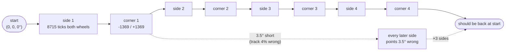

# 01.12 — Use encoders to drive exact distances and angles — drive a square

<!-- glance:start -->
<!-- generated by tools/build.py from curriculum/syllabus.yaml — edit the syllabus, not this block -->

| | |
|---|---|
| **Track** | Main path |
| **Difficulty** | Intermediate |
| **Time** | 1 h 30 min |
| **Hardware** | Stage 1 robot: Pi 5, Pico, encoder motors, driver, chassis, battery, distance sensors (stage 1) |
| **Software** | python |
| **Prerequisites** | [01.11 Drive forward, backward and rotate in place (open loop)](01.11-drive-and-rotate.md) |
| **Optional prerequisites** | [FM.01 Algebra refresher for robotics formulas](../optional-foundations/mathematics/FM.01-algebra-refresher.md)<br>[FM.02 Angles, degrees and radians](../optional-foundations/mathematics/FM.02-angles-and-radians.md)<br>[FM.03 Trigonometry: sin, cos, tan and atan2](../optional-foundations/mathematics/FM.03-trigonometry.md) |
| **Skip if** | Your robot drives a 1 m square using encoder feedback and returns near its start. |

<!-- glance:end -->

## What you will learn

- Convert encoder ticks to metres and radians for *your* robot, in both directions, with the signs right.
- Drive a commanded distance and a commanded angle using the encoders as the stopping rule.
- Make the robot drive a 1 m square and come back to where it started — approximately.
- Measure *how* approximately, over five runs, and separate systematic error from random error.
- Name the six things that ate the difference, and which lesson fixes each one.

## Why it matters

In 01.11 you drove by duty and stopwatch, and watched it drift with the battery, the carpet and
the temperature of the gearbox. The encoders fix half of that in one step: instead of "spin for
2.0 seconds and hope", you say "go until the wheels have turned 8715 ticks". A tired battery now
makes the robot *slower*, not *shorter*. That is the single biggest accuracy jump in the whole
course, and it costs about twenty lines of code.

The other half is what remains, and it is the honest foundation for everything after it: your
wheels are not exactly 45 mm, your track is not exactly 200 mm, and rubber slips. The square you
are about to drive is the classic test for all of it (Borenstein's UMBmark, which module 09 turns
into a calibration procedure). Project [P03](../projects/P03-encoder-movement.md) is built on this
lesson, and the odometry of [09.04](../09-odometry/09.04-odometry-from-scratch.md) is the same
arithmetic run continuously instead of once per segment.

<!-- prereqs:start -->
## Prerequisites

You need these first:

- [01.11 Drive forward, backward and rotate in place (open loop)](01.11-drive-and-rotate.md)

### Optional prerequisite links

New to any of these? Take the foundation lesson first; skip it if you already know it.

- [FM.01 Algebra refresher for robotics formulas](../optional-foundations/mathematics/FM.01-algebra-refresher.md)
- [FM.02 Angles, degrees and radians](../optional-foundations/mathematics/FM.02-angles-and-radians.md)
- [FM.03 Trigonometry: sin, cos, tan and atan2](../optional-foundations/mathematics/FM.03-trigonometry.md)

Check your readiness: `python course.py why 01.12`
<!-- prereqs:end -->

## Concept

### A tick is a unit of distance

Your encoder produces 2464 ticks per wheel revolution, and one wheel revolution rolls the robot
forward by one wheel circumference. So a tick is not an abstract count — it is 0.11475 millimetres
of floor. Every "drive 1 m" becomes "8715 ticks", and every "turn 90°" becomes "1369 ticks on each
wheel, in opposite directions".

This is a measuring wheel, the thing surveyors push along a pavement, with two of them and a
computer. And it has exactly the weaknesses of a measuring wheel: if you got the wheel diameter
wrong, every measurement is wrong by the same percentage, forever; and if the wheel skids, the
count is simply missing.

### Turning is a distance too

Here is the idea that makes differential drive click. The robot has no compass, no gyro (yet — that
is [07.05](../07-sensors/07.05-imu-fundamentals.md)) and no idea which way it is pointing. It has
two odometers, 200 mm apart. If the right wheel rolls 10 mm further than the left one, the robot
*must* have turned, by an amount that depends only on that difference and the distance between the
wheels:

$$\Delta\theta = \frac{d_R - d_L}{b}$$

Angle from two distances. That is the whole trick, and it is why the track width $b$ matters as
much as the wheel radius: get $b$ wrong by 4 % and every turn is wrong by 4 %.

> [!NOTE]
> That $\Delta\theta$ comes out in **radians**, not degrees — metres divided by metres. Every angle in this
> course is in radians (REP-103), and the conversions below all go through $\pi$. New to radians? →
> [FM.02 Angles, degrees and radians](../optional-foundations/mathematics/FM.02-angles-and-radians.md).
> Skip it if you can say without thinking how far the rim of a 45 mm wheel travels when it turns 1 rad.

> [!TIP]
> **Ask your teacher:** "Draw me the geometry that turns a difference in wheel distances into an
> angle, and show me why the wheel radius doesn't appear in that formula."

### Closed loop on position, still open loop on heading

Be clear about what today's control loop does and does not do. It watches the ticks and decides
**when to stop**. It does *not* correct the robot's heading while it drives: if the right motor is
weaker, the robot still curves, it just curves for exactly the right number of ticks. Fixing the
curve needs a controller that adjusts the wheels *while* driving — that is module 08, and
[08.01](../08-control/08.01-open-vs-closed-loop.md) starts from exactly this script.

## Technical explanation

### Level 1 — The numbers for karmel

| Quantity | Symbol | Value | Where from |
|---|---|---|---|
| Wheel radius | $r$ | 0.045 m | `karmel.yaml: drive.wheel_radius_m` |
| Wheel circumference | $2\pi r$ | 0.282743 m | computed |
| Ticks per wheel revolution | $N$ | 2464 | 11 hall pulses × 56 gear ratio × 4 quadrature edges |
| **Metres per tick** | $2\pi r/N$ | **0.00011475 m** (0.115 mm) | computed |
| Track width | $b$ | 0.200 m | `karmel.yaml: drive.wheel_separation_m` |
| Ticks for 1 m | | 8715 | $1/0.00011475$ |
| Ticks for a 90° turn in place | | 1369 per wheel | $(\pi/2)(b/2)/0.00011475$ |
| Ticks for a full 360° spin | | 5476 per wheel | four times the above |
| Ticks per second at 0.3 m/s | | 2614 | 0.3 / 0.00011475 |

> [!NOTE]
> These are *the course's* numbers. Your gear ratio may be 1:30 (the 333 RPM motor) rather than
> 1:56, and your wheels are 90 mm nominal but not exactly. Edit `labs/config/karmel.yaml`; every
> script and every exercise in the course reads it from there, so you change one file.

### Level 2 — Practical: three conversions and their inverses

```text
   ticks  ──×(2π r / N)──▶  metres of rim travel        ──▶ distance the robot moved = (dL + dR)/2
   ticks  ──×(2π r / N)──▶  metres of rim travel        ──▶ heading change = (dR − dL)/b
   metres ──÷(2π r / N)──▶  ticks   (round to an int — encoders don't do fractions)
```

Signs, once, for the rest of the course: **forward is positive for both wheels**; a
counter-clockwise (left) turn is left wheel negative, right wheel positive. Everything else follows.

**Worked example — 1 metre.** $1.0 / 0.00011475 = 8714.6$, so command 8715 ticks on both wheels.
The rounding costs 0.4 of a tick = 0.046 mm. Nothing on this robot is that accurate; rounding is
free.

**Worked example — 90° to the left.** Each wheel rides a circle of radius $b/2 = 0.100$ m, so it
travels $(\pi/2)\times 0.100 = 0.15708$ m of arc. In ticks: $0.15708/0.00011475 = 1368.9 \to 1369$.
Targets: left $-1369$, right $+1369$.

**Worked example — an arc, not a spin.** To follow a circle of radius 0.5 m through 90° to the
left, the left (inner) wheel travels $(0.5-0.1)\times\pi/2 = 0.6283$ m = 5476 ticks and the right
(outer) wheel $(0.5+0.1)\times\pi/2 = 0.9425$ m = 8213 ticks. Note that the inner-wheel number is
the same 5476 as a full spin in place — a coincidence of these particular numbers, and a nice
sanity check that the formula is just "radius × angle" per wheel.

**Worked example — backwards.** Reading motion back out: the encoders report $-2000$ / $-2000$
ticks. Distance $= (-0.2295 + -0.2295)/2 = -0.2295$ m (reversed 23 cm), heading change
$= (-0.2295 - -0.2295)/0.200 = 0$. Signs do all the work; there are no special cases.

### Level 3 — Mathematics: why the square closes, and why it doesn't

A perfect square is four sides and four 90° turns:

$$\sum_{i=1}^{4}\left[\text{translate}(s) \cdot \text{rotate}(\tfrac{\pi}{2})\right] = \text{identity}$$

Errors do not stay where they are made. A heading error $\epsilon$ at the first corner rotates
everything after it, so the end position is off by roughly $s\epsilon$ for each remaining side.

> [!NOTE]
> Working out *where* the robot ends up after four imperfect corners means adding four side vectors, each
> rotated by the running heading — that is $\sin$ and $\cos$, and recovering "17.8 cm, 14° off" from the sum is
> `atan2`. New to them? → [FM.03 Trigonometry: sin, cos, tan and atan2](../optional-foundations/mathematics/FM.03-trigonometry.md).
> Skip it if you can already say why `atan2(y, x)` exists when `atan(y/x)` is shorter.

**Numbers.** Suppose your true track is $b_{\text{true}} = 0.208$ m but you compute with
$b = 0.200$. Each wheel is told to travel $\theta b/2$, which on the wider axle turns only
$90 \times 0.200/0.208 = 86.5°$ — 3.5° short at every corner. Walking the four sides of a 1 m
square with 86.5° corners ends **17.8 cm** from the start, pointing 14° away. A 4 % error in one
constant, and the robot misses by a sixth of the side length.

The same wrongness in the wheel radius is gentler, because it scales the sides *and* the corners
together: $r$ 2 % too large gives 0.98 m sides and 88.2° corners, which closes to 8.8 cm and 7.2°.
And a *pure* distance error — you asked for the wrong side length — closes perfectly, just on a
bigger square. That ranking (heading worst, mixed next, distance harmless) is why robot position
drifts mostly through **heading** error, and it dominates modules 09–11.

This is also why [09.05](../09-odometry/09.05-calibrating-odometry.md) measures $b$ and $r$ from
the square instead of trusting the datasheet, and why running the square **clockwise and
counter-clockwise** separates a track-width error (which errs the same way in both) from a
wheel-diameter mismatch (which flips).

### Level 4 — Implementation: the stop rule

`labs/robot/drive_square.py`'s `move()` is the whole lesson in twenty lines:

```python
base.reset_encoders()
half_track = params.wheel_separation_m / 2.0
target = abs(distance_m) if angle_rad == 0 else abs(angle_rad) * half_track
while time.monotonic() < deadline:
    left_m, right_m = wheel_travel_m(start, state, params)
    travelled = (abs(left_m) + abs(right_m)) / 2.0
    remaining = target - travelled
    if remaining <= 0.002:
        break
    # Full speed far away, proportionally slower in the last 10 cm, never below 3 cm/s.
    speed = max(0.03, min(speed_m_s, speed_m_s * remaining / 0.10))
    ...
    base.set_wheel_velocity(left, right)   # SAFETY: the wheels turn here
    state = base.wait_for_telemetry(timeout_s=1.0, newer_than=state.t)
base.stop()
```

Four design decisions worth copying:

1. **The target is expressed in metres of wheel travel**, for straights *and* turns. A turn is just
   "each wheel travels 0.157 m, in opposite directions". One code path, no special cases.
2. **It slows down near the goal.** Without the ramp the wheels coast past the target by several
   percent. In the simulator, a 1369-tick (90°) turn comes out at 1374 ticks — 90.3° — with the
   ramp, and 1448 ticks — **95.2°** — with it removed: 5° of overshoot at every corner, 21° after
   four.
3. **It uses `set_wheel_velocity`, not `set_wheel_duty`.** The Pico's own PID holds each wheel at
   the commanded speed, so a tired battery changes nothing. You will build that controller yourself
   in [08.05](../08-control/08.05-integral-control.md); today you use it.
4. **It waits for fresh telemetry** (`wait_for_telemetry(..., newer_than=state.t)`) instead of
   sleeping. The loop then runs at the robot's rate, never faster, and never acts on a stale reading.

## Diagram

**Turning by tick difference:**

```text
                    counter-clockwise turn by θ, in place
                    ───────────────────────────────────────

              left wheel                        right wheel
              travels −θ·b/2                    travels +θ·b/2
                  ○ ←────┐                   ┌────→ ○
                          \                 /
                           \      ↺ θ      /
                            └──── ● ──────┘        ● = centre of rotation
                            │←── b/2 ──→│            = midpoint of the axle
                            │←───── b = 0.200 m ────→│

        θ = 90° = π/2 rad   →  arc = 0.157 m per wheel  →  1369 ticks per wheel
        read it back:  Δθ = (d_R − d_L) / b = (0.157 − (−0.157)) / 0.200 = 1.571 rad ✓
```

**The square, and where the error goes:**



## Code

### `labs/robot/drive_square.py`

```bash
python labs/robot/drive_square.py --fake                      # no robot needed
python labs/robot/drive_square.py --side 1.0 --speed 0.2      # on the Pi, real robot
python labs/robot/drive_square.py --side 1.0 --direction right --laps 2
```

On the simulated robot, `--side 0.5`:

```text
lap 1, side 1 done (last wheel ticks -1376 / +1375)
lap 1, side 2 done (last wheel ticks -1379 / +1379)
lap 1, side 3 done (last wheel ticks -1376 / +1376)
lap 1, side 4 done (last wheel ticks -1376 / +1376)
simulator: ended at x=1.011 m y=1.491 m theta=+0.036 rad (started at the room's start pose - a perfect square returns there)
```

Read that carefully. The target for each corner was 1369 ticks and the robot delivered 1376 — a
0.5 % overshoot from the 2 mm stopping tolerance and the last bit of coasting. Even on a *perfect*
simulated robot, the square closes to 11 mm and 2.1°, not to zero. Control tolerance is an error
source in its own right, before any hardware imperfection.

### `01-first-robot/code/square_repeatability.py`

One run is an anecdote. This runs the square N times and does the statistics, reporting both what
the robot's own ticks claim (`odometry`) and the truth (the simulator's ground truth, or your tape
measurements with `--measured`):

```bash
python 01-first-robot/code/square_repeatability.py --fake --realistic --runs 5 --side 0.5
python 01-first-robot/code/square_repeatability.py --port /dev/ttyACM0 --runs 5 --measured
```

```text
run 1: truth ended 0.038 m from the start, heading off by -5.6 deg
run 2: truth ended 0.024 m from the start, heading off by -4.3 deg
...
--- odometry over 5 runs ---
heading error          mean   +0.969 deg   sd  0.381 deg   min  +0.489   max  +1.541
distance from start    mean   +0.006 m   sd  0.003 m   min  +0.004   max  +0.012
--- truth over 5 runs ---
heading error          mean   -5.018 deg   sd  0.832 deg   min  -6.044   max  -4.067
distance from start    mean   +0.031 m   sd  0.009 m   min  +0.022   max  +0.042
```

This is the most important table in the lesson. **The robot is confidently wrong.** Its own ticks
say it came back within 6 mm and 1°; it is actually 31 mm away and 5° off, every single time, in
the same direction. A wrong constant produces a *repeatable* lie, and no amount of re-running
reveals it. Only an independent measurement — a tape, a wall, a LiDAR, a landmark — can.

### The six error sources, and who fixes them

| Source | Typical size on karmel | Systematic or random | Fixed in |
|---|---|---|---|
| Wheel radius wrong (wear, tyre squash, nominal ≠ real) | 1–3 % of distance | systematic | [09.05](../09-odometry/09.05-calibrating-odometry.md) |
| Track width wrong (wheels not where you think) | 2–5 % of every angle | systematic | [09.05](../09-odometry/09.05-calibrating-odometry.md) |
| The two wheels differ from each other | 1–2 % curve | systematic | [08.01](../08-control/08.01-open-vs-closed-loop.md), 09.05 |
| Stopping tolerance and coasting | 0.5 % per segment | systematic | better control, [08.07](../08-control/08.07-pid-mathematics.md) |
| Slip (turning in place is the worst case) | 1–5 % of angle, random | random | an IMU, [07.05](../07-sensors/07.05-imu-fundamentals.md) / [10.07](../10-localization/10.07-fusing-imu-and-odometry.md) |
| Tick quantisation | 0.115 mm — negligible | random | nothing needed |

The order matters: measure the systematic ones first, because they are much bigger and they are
*free* to remove. Random error can only be reduced with more sensors.

## Exercise

### Exercise 01.12-E1 — The conversions, in code `[coding]`

Hardware: none.

Implement `labs/exercises/01.12/student.py`: ticks ↔ distance, turn-in-place targets, arc targets,
reading distance and heading back out of a pair of tick deltas, and `square_plan()`.

Check it: `python course.py check 01.12`

### Exercise 01.12-E2 — Tick arithmetic by hand `[numerical]`

Hardware: none. Use $r = 0.045$ m, $N = 2464$, $b = 0.200$ m. Do these on paper first, then verify
with your E1 code.

1. How many ticks for 2.35 m? For −0.40 m?
2. How many ticks per wheel for a 45° right turn in place?
3. The encoders report deltas of $+4300$ / $+4520$. What distance and what heading change?
4. You want the robot to follow a 0.8 m radius circle through 180°, turning left. Ticks per wheel?
5. Your wheels are really 44.2 mm in radius, not 45.0. You drive "10.00 m" by ticks. How far did
   the robot actually go?

### Exercise 01.12-E3 — Drive the square `[hardware]`

Hardware: `robot-base`, masking tape, a tape measure, about 2 m × 2 m of clear floor. No hardware:
`--fake` and `--fake --realistic` (via `python -m robotlab.fake_pico --realistic`).

> [!CAUTION]
> **Safety:** clear a square of (side + 0.5) m. Nothing fragile, no cables across the floor, stairs
> blocked, pets and children out. Start with `--side 0.5 --speed 0.15`, hand on the switch, and
> only then go to 1 m. `Ctrl-C` stops the robot.

1. Put tape on the floor marking the start position **and** the start heading (two marks, 30 cm
   apart, so you can measure the angle afterwards).
2. `python labs/robot/drive_square.py --side 1.0 --speed 0.2`
3. Measure and record: forward offset, sideways offset, heading error.
4. Repeat five times. Then five times with `--direction right`.

### Exercise 01.12-E4 — Systematic or random? `[numerical]`

Hardware: none beyond E3's numbers.

From your ten runs:

1. Compute the mean and standard deviation of each of the three errors, per direction.
2. Which errors keep their sign when you reverse the direction, and which flip? (This is the core
   idea of the UMBmark test.)
3. Estimate the track-width error that would explain your mean heading error, using
   $b_{\text{true}} = b \times 90° / \theta_{\text{measured}}$.
4. Re-run the square with that corrected $b$ in `labs/config/karmel.yaml`. Did the mean error drop?
   Did the spread?

### Exercise 01.12-E5 — Predict the failure `[predict]`

Hardware: none to predict; `--fake` to verify.

Before running anything, write down what you expect to happen and by how much:

1. You double `--speed` from 0.2 to 0.4 m/s. What happens to the closing error, and why?
2. You set the stopping tolerance in `move()` from 0.002 m to 0.02 m.
3. You edit `wheel_radius_m` in `karmel.yaml` from 0.045 to 0.0405 (10 % small) and drive a 1 m
   square. Where does the robot end up, and what does its own odometry claim?
4. You drive the square on a rug instead of tiles.

## Expected result

- **01.12-E1:** `python course.py check 01.12` prints `✅ 01.12 checker passed` with 26 tests
  passing, including two that drive the simulator around your plan (clockwise and
  counter-clockwise) and require it to close within 5 cm.
- **01.12-E2:** (1) $2.35/0.00011475 = 20479$ ticks; $-0.40 \to -3486$ ticks. (2) 45° = 0.7854 rad,
  arc $= 0.7854 \times 0.1 = 0.07854$ m = 684 ticks, so **right** turn = left $+684$, right $-684$.
  (3) $d_L = 0.49343$ m, $d_R = 0.51867$ m → distance 0.50605 m, $\Delta\theta = 0.02524/0.200 =
  0.1262$ rad = 7.23° to the left. (4) inner (left) $= 0.7\times\pi = 2.1991$ m = 19164 ticks,
  outer (right) $= 0.9\times\pi = 2.8274$ m = 24640 ticks. (5) $10.00 \times 44.2/45.0 = 9.822$ m —
  18 cm short, and you would never know from the ticks.
- **01.12-E3:** With `--side 0.5` a healthy robot closes within 5–15 cm and 5–15°; with
  `--side 1.0`, within 10–30 cm. The errors should be *similar across runs in the same direction*
  — that is the sign that they are systematic and therefore fixable. On the ideal simulator
  (`--fake`, side 0.5) you get 11 mm and 2.1°; on `--fake --realistic`, about 31 mm and −5° with a
  spread under 1°.
- **01.12-E4:** (2) A heading error caused by a wrong **track width** keeps its sign when you
  reverse direction (both directions under- or over-turn); an error caused by **unequal wheel
  diameters** flips sign, because the wheel that was on the inside is now on the outside. Borenstein
  and Feng's UMBmark uses exactly this to separate the two. (3) If you measure 86.5° per corner,
  $b_{\text{true}} = 0.200 \times 90/86.5 = 0.208$ m. (4) The mean error should drop by at least
  half; the spread should barely change, because calibration removes bias, not noise.
- **01.12-E5:** (1) Worse: the ramp gets less time to bleed off speed, so both the overshoot and
  the slip in the turns grow — expect roughly double the closing error. (2) Each segment ends up to
  2 cm short, consistently, so the square shrinks and the corners under-turn: tens of centimetres of
  closing error. (3) Believing the wheels are smaller, the code asks for 9683 ticks per "metre"
  instead of 8715, and the robot really travels 1.111 m; each "90°" corner really turns 100°. After
  four sides it is 0.50 m from the start and 40° off — while its odometry, using the same wrong
  radius, insists it drove a perfect 1 m square. (4) A rug increases slip, especially in
  the turns; expect a bigger *spread*, and typically under-turning.

## Troubleshooting

### Symptom: the sides are right but the corners are wrong

The distance conversion (wheel radius, ticks per revolution) is good and the angle conversion
(track width) is not. Measure the track properly: with the robot on its side, measure the distance
between the *centres* of the two tyre contact patches, not the outer faces of the wheels
(they differ by one wheel width, 10 mm — a 5 % error). Then do E4's calibration.

### Symptom: every side is consistently long or short by the same percentage

Your wheel radius or ticks-per-revolution is wrong. Check the ratio first:

1. Mark a wheel and the floor, push the robot straight by hand for exactly 5 wheel revolutions,
   measure the distance. It should be $5\times2\pi r = 1.414$ m for 45 mm wheels.
2. Check `encoder_cpr_motor × gear_ratio × quadrature_multiplier` against your motor's actual gear
   ratio. The 205 RPM version is 1:56 and the 333 RPM version is 1:30; buying the other one and not
   changing the config gives you a 46 % error, not a subtle one.
3. Push the robot 1.000 m by hand along a tape measure and compare the tick count with 8715.

### Symptom: it drives the sides but the turns overshoot wildly

1. Check the `--speed`. Turning in place at 0.3 m/s of rim speed on a smooth floor slips.
2. Check that both wheels are reaching the target: print `end.left_ticks` and `end.right_ticks` per
   segment. If one wheel consistently stops short, its motor is saturating at the low end of the
   ramp — raise the floor speed in `move()` from 0.03 m/s, or check for mechanical drag.
3. If the *first* turn is fine and later ones get worse, you are accumulating heading error, which
   is expected; measure it rather than fighting it.

### Symptom: `TimeoutError: move did not finish in time - is a wheel blocked?`

The loop drove for 30 s without reaching the target. Either something is physically blocking a
wheel (lift the robot and check), or the encoder for that wheel has stopped counting (run
`labs/firmware/pico/examples/03_encoder_count.py` and turn each wheel by hand), or the target was
absurd (a `--side` of 30 m).

### Symptom: the numbers are right in simulation and wrong on the robot

That is the normal state of the world, and the size of the gap is the measurement. Quantify it
before changing anything: run the square five times in each direction, tabulate, and go to E4. If
the gap is more than ~30 % of the side length, suspect a wrong constant in `karmel.yaml` rather
than physics.

## Common mistakes

- **Measuring the track width across the outside of the wheels.** You need centre to centre; the
  difference is one wheel width and it is a 5 % angle error.
- **Forgetting that `move()` zeroes the encoders.** Its tick counts are per segment, not cumulative.
  Mixing the two produces spectacular nonsense.
- **Using degrees somewhere.** Every API in this course takes radians. Convert at the edges only,
  with `math.radians`, and never store degrees.
- **`int()` instead of `round()`** when converting metres to ticks. `int()` truncates towards zero,
  so backwards moves come out systematically short.
- **Calibrating on one surface and driving on another.** Slip is a property of the pair.
- **Concluding "encoders are accurate" after one good run.** Five runs, both directions, or it
  didn't happen.
- **Trying to fix the drift with a better stop rule.** It is a heading problem; only feedback on
  heading (08.11, an IMU, or a map) fixes it.

## Knowledge check

1. One tick is how many millimetres on karmel, and where does that number come from?
   <details><summary>Answer</summary>

   0.11475 mm. Wheel circumference $2\pi \times 0.045 = 0.282743$ m divided by 2464 ticks per wheel
   revolution, where 2464 = 11 hall pulses per motor revolution × 56 gear ratio × 4 (counting both
   edges of both quadrature channels).
   </details>

2. Why does the wheel radius not appear in $\Delta\theta = (d_R - d_L)/b$?
   <details><summary>Answer</summary>

   Because $d_R$ and $d_L$ are already distances in metres — the radius was used to convert ticks
   into them. The geometry that turns two travelled distances into an angle only involves how far
   apart the wheels are. (Get $r$ wrong and both distances are wrong by the same factor, which
   *does* then scale the angle — but the formula itself has no $r$ in it.)
   </details>

3. You command a 90° turn and the robot turns 86.5° every time, in both directions. What constant
   is wrong, in which direction, and by how much?
   <details><summary>Answer</summary>

   The track width. You are telling each wheel to travel $\theta b/2$ with $b$ too small, so the
   robot under-turns. The true value is $0.200 \times 90/86.5 = 0.208$ m. That it errs the same way
   in both directions is the clue that it is the track, not unequal wheels.
   </details>

4. Predict: you drive a 1 m square with a wheel radius that is 2 % too large in the config. Where
   does the robot end up, and what does its odometry say?
   <details><summary>Answer</summary>

   Believing the wheels are bigger than they are, the code asks for fewer ticks per metre, so each
   side is ~2 % short (0.98 m) and each corner ~2 % shallow (88.2°). The robot ends 8.8 cm
   from the start and 7.2° off. Its own odometry, using the same wrong radius, reports a
   near-perfect square: the error is invisible from the inside.
   </details>

5. Your five runs give heading errors of −5.2°, −4.9°, −5.4°, −4.6°, −5.1°. Your friend's give
   −1°, +4°, −6°, +2°, −3°. Whose robot is easier to fix, and what would you do to each?
   <details><summary>Answer</summary>

   Yours. A tight cluster away from zero is systematic error: calibrate the track width (and check
   the wheels) and most of it disappears. Your friend's is random — slip, a loose wheel, a
   sticking caster — which calibration cannot remove; they need to fix the mechanics, slow the
   turns down, or add a heading sensor.
   </details>

6. Why does `move()` slow down over the last 10 cm instead of driving at full speed and then braking?
   <details><summary>Answer</summary>

   Because the motors and the robot's mass take about 0.1–0.2 s to stop, during which the robot
   keeps travelling. Arriving slowly makes that residual tiny. In the simulator, a 90° turn comes
   out at 90.3° with the ramp and 95.2° without it — 5° of overshoot per corner, 21° over a square.
   </details>

7. Debugging: the square is beautiful at 0.15 m/s and terrible at 0.4 m/s. What are the two most
   likely reasons?
   <details><summary>Answer</summary>

   (1) Slip: fast turns in place break traction, especially the moment the wheels reverse.
   (2) Overshoot: the fixed 10 cm deceleration ramp is not enough distance to bleed off the higher
   speed, so every segment overshoots. Both are speed-dependent and both are fixed by a real
   controller (module 08) rather than by driving slowly forever.
   </details>

8. Why run the square clockwise *and* counter-clockwise?
   <details><summary>Answer</summary>

   To separate two systematic errors that look identical in one direction. A wrong track width
   makes the robot under-turn in both directions; unequal wheel diameters make it veer to one side,
   so the error flips sign when you reverse. Comparing the two runs identifies which constant to
   correct — that is Borenstein and Feng's UMBmark benchmark, used properly in 09.05.
   </details>

## Practical challenge

**Make a 1 m square close to within 10 cm, and prove it.**

1. Measure your robot's real wheel radius and track width, and put them in `labs/config/karmel.yaml`
   (push-by-hand method for the radius; centre-to-centre for the track).
2. Run `square_repeatability.py --runs 5` in each direction and tabulate all thirty numbers.
3. Use the mean heading error to correct the track width, and the mean side length to correct the
   wheel radius. Re-run.
4. Iterate at most twice more. Write down what you changed and what it bought you.

**Acceptance criteria:** over five consecutive 1 m squares in each direction, the mean distance
from the start is under 10 cm and the mean heading error under 6°, with the standard deviation of
the distance under 5 cm; your `karmel.yaml` contains measured values with a comment saying how you
measured them and on what surface; and you can say, from your own data, how much of the remaining
error is random and therefore *not* fixable by calibration.

## You can skip this if…

Your robot drives a 1 m square from encoder feedback and returns within ~10 cm, you can state your
robot's metres-per-tick and ticks-per-90°-turn from memory or from your own config, and you can
answer knowledge-check questions 2, 3 and 8 correctly without looking.

`python course.py skip 01.12 --reason "my robot drives encoder-measured distances and a 1 m square"`

## Project checkpoint

You now have everything [Project 3 — Encoder-based movement](../projects/P03-encoder-movement.md)
needs: tick↔metre conversions, a segment controller, and a measured error budget. P03 asks you to
turn today's script into a reusable `go(distance)` / `turn(angle)` API with limits and a test
report. If you have also done [01.13](01.13-distance-sensors-stop.md) and
[01.15](01.15-teleop-from-laptop.md), [P01](../projects/P01-manual-drive.md) and
[P02](../projects/P02-obstacle-avoidance.md) are open too — P01 needs only teleop, P02 adds the
range sensor.

## Go deeper

- Borenstein & Feng, "Measurement and Correction of Systematic Odometry Errors in Mobile Robots" (the UMBmark paper): https://ieeexplore.ieee.org/document/544770 — the bidirectional square test and the calibration that follows from it. 09.05 implements it.
- Modern Robotics (Lynch & Park), free preprint and videos: https://hades.mech.northwestern.edu/index.php/Modern_Robotics — chapter 13 covers wheeled mobile robots and odometry rigorously.
- Introduction to Autonomous Mobile Robots (Siegwart et al.): https://mitpress.mit.edu/9780262015356/introduction-to-autonomous-mobile-robots/ — section 5.2 is the classic treatment of odometry error growth.
- Pololu, example gearmotor with encoder: https://www.pololu.com/product/4865 — how CPR, gear ratio and quadrature multiply into ticks per wheel revolution, with a real datasheet.
- [09.04 Build an odometry system from scratch](../09-odometry/09.04-odometry-from-scratch.md) and [09.05 Calibrating odometry](../09-odometry/09.05-calibrating-odometry.md) — today's arithmetic, run continuously, then calibrated.

## Progress checkpoint

- [ ] I can convert ticks to metres and radians for my robot, with the right signs, and back.
- [ ] My robot drives a commanded distance and a commanded angle from encoder feedback.
- [ ] My robot drives a 1 m square and I know, in centimetres and degrees, how badly it closes.
- [ ] I have measured five runs and can say which part of the error is systematic.
- [ ] I can name the six error sources and which lesson deals with each.

`python course.py complete 01.12` (exercises done) · `python course.py master 01.12`
(challenge done) · `python course.py struggle 01.12 "what was hard"`

Next: [01.13 — Ultrasonic and ToF sensors: stop before hitting things](01.13-distance-sensors-stop.md),
so the robot can notice the wall it is driving a square into.
