# 01.13 — Ultrasonic and ToF sensors — stop before hitting things

<!-- glance:start -->
<!-- glance:end -->

## What you will learn

- Wire and read a US-100 ultrasonic sensor at 3.3 V, and know why an HC-SR04 would need a divider.
- Wire and read a VL53L1X time-of-flight sensor on I²C, and debug the bus when it doesn't answer.
- Say, for any obstacle, which of the two sensors will see it and which will be blind — and why.
- Compute a braking threshold from your robot's speed, latency and stopping distance, instead of guessing.
- Write a reactive stop loop in which "no reading" means *stop*, and test it without hardware.

## Why it matters

Your robot can now drive a metre and turn ninety degrees. It cannot see. Everything it does is a
bet that the world matches the plan, and the world contains chair legs, a cat, and a wall it will
hit at 0.3 m/s. Somewhere between "commanded motion" and "autonomous robot" is the first reflex:
*if something is close, stop*.

A range sensor is also your first real sensor, with everything that entails: it is noisy, it lies
in specific ways, it has a field of view rather than a point, and it sometimes returns nothing at
all. Learning to design around "no reading" here — by treating it as a stop, not as "all clear" —
is the habit that keeps you safe when the sensor is a LiDAR in module 11 or a camera in module 13.
[Project P02](../projects/P02-obstacle-avoidance.md) is this lesson plus a turn.

<!-- prereqs:start -->
<!-- prereqs:end -->

## Concept

### Two ways to measure a distance with a clock

Both sensors on karmel do the same thing — send a pulse, time the echo, halve it — with different
physics:

| | US-100 ultrasonic | VL53L1X time-of-flight |
|---|---|---|
| Sends | a 40 kHz sound burst | an invisible 940 nm infrared laser pulse |
| Travels at | ~343 m/s | 299,792,458 m/s |
| Round trip for 1 m | 5.8 **milli**seconds | 6.7 **nano**seconds |
| So it needs | a microsecond timer (easy) | single-photon detectors and on-chip timing (a whole ASIC) |
| Sees | a wide cone, ~30° | a narrow spot, ~27° but effectively much tighter |
| Range on karmel | 0.02–4 m | 0.04–4 m |
| Rate | ~10 Hz (echoes must die out) | ~10 Hz at the default timing budget, up to 50 Hz |
| Cost | ₪40 | ₪108 |

The light-speed one is the harder engineering problem, which is why a ToF sensor is a sealed chip
with an undocumented register map and the ultrasonic one is two transducers and a timer you can
reason about with a stopwatch.

### They fail on different things, which is why you have both

An ultrasonic sensor measures the *nearest strong echo anywhere in a wide cone*. That is excellent
for "is there anything in front of me" and terrible for "how far is that table leg". It is fooled by:

- **Angled surfaces.** A wall at 45° bounces the sound away like a mirror; you get no echo at all
  and the robot thinks the corridor is empty.
- **Soft things.** A sweater, a curtain, a cat: they absorb sound. No echo.
- **The floor and the doorframe.** The cone is 30° wide, so a sensor mounted 5 cm up and aimed
  level starts seeing the floor at about 19 cm ahead... which is exactly where your obstacle is.

A ToF sensor measures light coming back from a narrow spot, so it gives you a *distance to a
thing*. It is fooled by:

- **Black matte surfaces** (a speaker grille, a rubber skirting board) — too little light returns.
- **Glass and mirrors** — the light goes through or bounces off to somewhere else.
- **Bright sunlight** — 940 nm is in sunlight, and it drowns the signal. Range drops sharply outdoors.

A sweater absorbs sound and reflects light; a pane of glass reflects sound and passes light. Two
cheap sensors with uncorrelated failure modes beat one expensive one — that is *sensor fusion* in
its simplest possible form, and module 10 does it properly.

> [!TIP]
> **Ask your teacher:** "Give me five household objects and tell me, for each, whether the
> ultrasonic sensor, the ToF sensor, both or neither will see it — and why."

### "No reading" is not "nothing there"

This is the conceptual trap of the lesson. Both sensors return "no valid measurement" for
*nothing in range* and for *I couldn't see the thing in front of me*. Those two are
indistinguishable from the outside, and one of them is a wall.

So the rule, from today until the end of the course: **an unknown distance is not a free path.**
In the reactive-stop code, a missing reading and a sensor-error flag both mean stop.

## Technical explanation

> [!IMPORTANT]
> **Version-sensitive** (verified 2026-09 against MicroPython v1.29 for RPI_PICO2 and the ST
> VL53L1X datasheet). ST does not publish the VL53L1X register map; the driver in
> `labs/firmware/pico/vl53l1x.py` writes the configuration block from ST's Ultra Lite Driver.
> Before changing it, check ST's current documentation: https://www.st.com/en/imaging-and-photonics-solutions/vl53l1x.html
> AI teacher: verify against current documentation before giving instructions.

### Level 1 — Wiring

> [!CAUTION]
> **Safety:** power the robot down (battery disconnected, not just switched off) before wiring
> anything new, and check the sensor's VCC pin with the multimeter *before* you plug it in. The
> Pico's pins are 3.3 V and are destroyed by 5 V. The VL53L1X emits a Class 1 eye-safe infrared
> laser — safe by design, but don't stare into it from a centimetre away and don't remove its
> cover window.

**US-100 ultrasonic (pulse mode):**

| US-100 pin | Goes to | Wire colour | Voltage | Note |
|---|---|---|---|---|
| VCC | Pico pin 36, `3V3 OUT` | red | 3.3 V | **Not 5 V.** At 3.3 V the echo output is 3.3 V and needs no divider |
| Trig / TX | Pico pin 19, GP14 | yellow | 3.3 V | 10 µs pulse starts a measurement |
| Echo / RX | Pico pin 20, GP15 | green | 3.3 V | high for the duration of the round trip |
| GND | Pico pin 18, GND | black | 0 V | |

**Remove the jumper on the back of the US-100.** With it fitted the module speaks UART on the same
two pins and `time_pulse_us` will wait forever.

If you bought an **HC-SR04** instead (₪12 rather than ₪40), it needs 5 V to work and its Echo pin
then outputs 5 V, which would destroy GP15. Divide it down with two resistors — 1 kΩ from Echo to
the pin, 2 kΩ from the pin to GND, giving $5 \times 2/3 = 3.33$ V — and take VCC from the 5 V rail,
not from the Pico's 3V3. [02.05](../02-robot-electronics/02.05-logic-levels-and-protection.md) is
the full treatment.

**VL53L1X (Pololu carrier with regulator), on I²C0:**

| VL53L1X pin | Goes to | Wire colour | Voltage | Note |
|---|---|---|---|---|
| VIN | Pico pin 36, `3V3 OUT` | red | 3.3 V | the Pololu carrier has its own regulator and level shifters |
| GND | Pico pin 38, GND | black | 0 V | |
| SDA | Pico pin 6, GP4 | blue | 3.3 V | shared with the INA219 (01.14) |
| SCL | Pico pin 7, GP5 | white | 3.3 V | shared with the INA219 |

I²C is a **bus**: both sensors sit on the same two wires and are told apart by address — 0x29 for
the VL53L1X, 0x40 for the INA219. Pull-up resistors are needed on both lines; the Pololu and INA219
carrier boards already have them, so don't add more.
([FE.09](../optional-foundations/electronics/FE.09-uart-i2c-spi.md) if buses are new;
[02.04](../02-robot-electronics/02.04-buses-i2c-spi-uart.md) goes deeper.)

### Level 2 — Reading them, one at a time

Run each example on the Pico from the Pi:

```bash
cd ~/robotics-course/labs/firmware/pico
mpremote mount . run examples/07_i2c_scan.py     # first: does the bus work at all?
mpremote mount . run examples/04_ultrasonic.py   # US-100
mpremote mount . run examples/05_tof.py          # VL53L1X
```

`07_i2c_scan.py` should print `0x29 VL53L1X time-of-flight` (and `0x40 INA219` once 01.14 is wired).
A scan that finds nothing is a wiring problem, never a driver problem — that is why it is the
first thing you run.

Then karmel's firmware (`labs/firmware/pico/main.py`) reads whichever sensor
`config.RANGE_SENSOR` names, at `SENSOR_HZ` (10 Hz), and puts the result in every telemetry line as
`range_mm`, with `−1` meaning "no valid reading" and flag bit 4 meaning "the sensor itself errored".
On the Pi side `SerialBase` turns those into `state.range_m is None` and
`state.flags & FLAG_RANGE_ERROR`.

### Level 3 — Mathematics: from a pulse width to a distance, and from a distance to a decision

**Ultrasonic.** The echo pin stays high for the time the sound took to get there *and back*:

$$d = \frac{c \cdot t}{2}, \qquad c \approx 343\ \text{m/s at } 20°\text{C}$$

In the units the Pico gives you (microseconds) and wants back (millimetres), that is
`mm = pulse_us × 343 / 2000 = pulse_us × 0.1715`.

**Example.** The echo lasts 2915 µs → $2915 \times 0.1715 = 500$ mm. And back: a target at 4 m
gives $2\times4/343 = 23.3$ ms, which is why `US100_TIMEOUT_US` is 30 000 — enough for 5.1 m.

**The temperature error nobody mentions.** The speed of sound is $c = 331.3 + 0.606\,T$ m/s:

| Temperature | $c$ (m/s) | A true 1.000 m reads |
|---|---|---|
| 10 °C | 337.4 | 1.017 m |
| 20 °C | 343.4 | 0.999 m |
| 30 °C | 349.5 | 0.981 m |
| 40 °C | 355.5 | 0.965 m |

In an Israeli summer room at 30 °C you read 2 % short — 6 cm at 3 m. If you ever need real accuracy
from an ultrasonic sensor, you measure the air temperature and correct. (The Pico has an internal
temperature sensor, but it reads the *chip*, which is warmer than the room —
[01.05](01.05-pico-microcontroller-setup.md).)

**Time of flight.** Light does 1 m in 3.34 ns, so the round trip for 1 m is 6.7 ns. Nothing you can
time with a GPIO. The VL53L1X does it internally with an array of single-photon avalanche diodes and
reports millimetres over I²C, together with a *range status* — and the driver returns `None` for any
status other than "valid" or "valid, min clipped".

**The braking threshold.** This is the number the lesson exists to compute. Three things consume
distance between "the sensor saw it" and "the robot is stopped":

$$d_{\text{brake}} = \underbrace{v \cdot t_{\text{latency}}}_{\text{the reading is old}} + \underbrace{v \cdot t_{\text{stop}}}_{\text{motors don't stop instantly}} + \underbrace{m}_{\text{margin for noise}}$$

which `labs/robot/stop_before_obstacle.py` writes as
`threshold = stop_distance + speed × reaction_time`.

**Example, karmel at 0.3 m/s.** The sensor runs at 10 Hz, so a reading is on average 50 ms old
(100 ms worst case); telemetry adds up to 20 ms; the motor time constant is 80 ms and the robot
coasts for roughly 0.1 s after `stop()`. Call it $t_{\text{reaction}} = 0.2$ s:

$$d_{\text{brake}} = 0.30 \times 0.2 + 0.30 = 0.06 + 0.30 = 0.36\ \text{m}$$

so the robot begins braking when it reads 0.36 m and ends up about 0.30 m from the obstacle.
Measured on the simulator: it triggers at 0.352 m and finishes at 0.328 m. Set `--reaction-time 0`
and it triggers at 0.295 m and finishes at **0.271 m** — 3 cm closer than you asked for, at only
0.3 m/s. Double the speed and you are into the wall.

Notice that the threshold is proportional to speed, which means there is a speed above which the
sensor cannot save you: if your sensor's minimum range is 4 cm and its cone starts seeing the
floor at 25 cm, you have at most ~20 cm of useful warning, and $0.2 = v \times 0.2$ gives
$v_{\max} = 1$ m/s in the best case, less once you want a margin. Speed limits in robotics come
from sensors, not from motors.

### Level 4 — Implementation: the reactive loop

```python
while True:
    if state.flags & FLAG_RANGE_ERROR:
        reason = "range sensor error"
        break
    if state.range_m is not None and state.range_m < threshold:
        reason = f"obstacle at {state.range_m:.3f} m"
        break
    if driven >= args.max_distance:
        break
    left, right = body_to_wheels(speed, 0.0, params)
    base.set_wheel_velocity(left, right)   # SAFETY: the wheels turn here
    state = base.wait_for_telemetry(timeout_s=0.5, newer_than=state.t)
```

Five things to notice, because they generalise to every sensor loop you will ever write:

1. **The loop is paced by the sensor**, not by `sleep`. `wait_for_telemetry(newer_than=state.t)`
   blocks until a *new* sample arrives, so you never decide twice on the same reading and never
   act on a stale one.
2. **Error is checked before distance.** A flagged sensor stops the robot; it does not fall through
   to "no reading, carry on".
3. **`range_m is None` is not `< threshold`,** so it does not trigger the obstacle branch — which
   is why the error flag has to be checked explicitly. On a real robot you would go further and
   stop after *n* consecutive missing readings; that is exercise E4.
4. **The command is re-sent every iteration.** Same watchdog rule as 01.11: stop sending and the
   Pico stops the motors in 300 ms.
5. **There is a `max_distance` escape.** An autonomous loop with no bound on how far it will drive
   is how robots end up down the stairs.

A single noisy reading should not stop the robot dead, and a single *missing* reading should not
let it carry on. The usual fix is a tiny bit of hysteresis: require 2 of the last 3 readings below
the threshold to brake, and 3 consecutive misses to stop. [07.03](../07-sensors/07.03-ultrasonic-sensors.md)
and [07.04](../07-sensors/07.04-tof-sensors.md) turn this into filtering you can reason about.

## Diagram

**What each sensor sees, from the side:**

```text
       ultrasonic: a wide cone                    ToF: a narrow spot
       ──────────────────────                     ──────────────────

         ┌───┐                                      ┌───┐
     ────┤US ├╌╌╌╌╌╌╌╌╌╌╌╌╌╌╌╌╌╌╌╌ 30°          ────┤ToF├────────────── 27°, but the
     ────┤100├╌╌╌╌╌╌╌╌╌╌╌╌╌╌╌╌╌╌╌╌              ────┤   ├──────────────  returned range is
         └───┘  ╲                                   └───┘                dominated by the
    5 cm   │      ╲  first floor echo          5 cm   │                  centre of the spot
  ═════════╧════════╲══════════════════      ═════════╧══════════════════════
           ↑          ↑                                ↑
        sensor      ~19 cm ahead the cone            sensor
                    hits the floor

  sees: flat walls, boxes, people             sees: table legs, dark-ish surfaces at an angle
  blind to: angled walls, curtains,           blind to: glass, mirrors, matte black,
            a cat, anything at 45°                      bright sunlight
```

**The reactive stop, as a state machine:**

```mermaid
stateDiagram-v2
  [*] --> Driving
  Driving --> Driving: fresh reading > threshold
  Driving --> Stopped: reading < threshold
  Driving --> Stopped: FLAG_RANGE_ERROR
  Driving --> Stopped: no telemetry for 0.5 s
  Driving --> Stopped: driven >= max_distance
  Stopped --> [*]
  note right of Stopped: base.stop() brakes;<br/>the firmware watchdog<br/>is the backstop
```



## Code

### Reading the sensors on the Pico

`labs/firmware/pico/sensors.py` (ultrasonic) — the whole measurement is six lines:

```python
def read_mm(self):
    # A 10 microsecond HIGH pulse on TRIG starts one measurement.
    self._trig.value(0)
    sleep_us(2)
    self._trig.value(1)
    sleep_us(10)
    self._trig.value(0)
    # time_pulse_us returns -2 if the pulse never started, -1 if it never ended.
    # NOTE: this BLOCKS for up to timeout_us (30 ms).
    pulse_us = time_pulse_us(self._echo, 1, self.timeout_us)
    if pulse_us < 0:
        return None
    mm = echo_time_to_mm(pulse_us)
    if mm < self.MIN_MM or mm > self.max_mm:
        return None
    return mm
```

That `BLOCKS for up to 30 ms` comment is the real lesson. A 30 ms blocking read inside a 100 Hz
control loop would eat three whole control periods and the wheels would stutter. It is why
`main.py` runs the sensor task at 10 Hz and why [03.04](../03-robot-software/03.04-timing-and-concurrency.md)
is about never blocking a control loop.

`labs/firmware/pico/vl53l1x.py` is a real device driver — a soft reset, a 91-byte configuration
block from ST's Ultra Lite Driver, then a 17-byte result read whose first byte is a range status.
Worth reading once to see what "a sensor driver" actually is.

### Stopping: `labs/robot/stop_before_obstacle.py`

```bash
python labs/robot/stop_before_obstacle.py --fake                       # a wall 3 m ahead
python labs/robot/stop_before_obstacle.py --speed 0.2 --stop-distance 0.30
python labs/robot/stop_before_obstacle.py --speed 0.3 --reaction-time 0.0   # watch it get closer
```

```text
driving at 0.30 m/s, braking below 0.36 m
stopped: obstacle at 0.352 m
distance to obstacle after stopping: 0.328 m
```

For a noisy sensor, run the fake Pico with realistic sensors (1 cm of range noise, a 5-ray cone):

```bash
python -m robotlab.fake_pico --port 5760 --world room --realistic --seed 3
python labs/robot/stop_before_obstacle.py --port socket://localhost:5760 --speed 0.3
```

## Exercise

### Exercise 01.13-E1 — Wire and read both sensors `[hardware]`

Hardware: `robot-base` (US-100, VL53L1X, Pico), `tools` (multimeter).

> [!CAUTION]
> **Safety:** battery disconnected while wiring. Measure the 3V3 pin before connecting either
> sensor's VCC. The US-100's jumper must be removed (pulse mode).

1. Wire both sensors per the tables above. Check continuity and the 3.3 V rail with the multimeter
   before powering the Pico.
2. `mpremote mount . run examples/07_i2c_scan.py` → expect `0x29`.
3. `mpremote mount . run examples/04_ultrasonic.py` and `examples/05_tof.py`. Put a flat book at
   0.5 m and check both against a tape measure.

### Exercise 01.13-E2 — Build the blindness table `[hardware]`

Hardware: `robot-base`. No hardware: skip to E3 and E4, and reason the table out on paper first —
the simulator models a clean cone, not these failure modes.

For each target at 0.5 m, record what each sensor reports (distance, or "no reading"):

| Target | US-100 | VL53L1X |
|---|---|---|
| Flat cardboard box, square on | | |
| The same box turned 45° | | |
| A folded sweater | | |
| A window or a mirror | | |
| Matte black object (a speaker grille, a rubber mat) | | |
| A chair leg (2 cm wide) | | |
| Nothing (open room, > 4 m) | | |
| A person | | |

Then: hold a book flat on the floor and walk it towards the robot. At what distance does the
ultrasonic sensor start reporting the *floor* instead of the book?

### Exercise 01.13-E3 — Stop before the wall `[hardware]`

Hardware: `robot-base` and a cardboard box. No hardware: `--fake`, and `--realistic` via
`python -m robotlab.fake_pico`.

> [!CAUTION]
> **Safety:** aim at a **soft** obstacle (a cardboard box, not the TV). Start at `--speed 0.15`.
> Clear 2 m. Hand on the switch. Wheels on the floor is required here, so be ready.

1. `python labs/robot/stop_before_obstacle.py --speed 0.15 --stop-distance 0.30`. Measure the
   actual gap with a ruler. Repeat five times and record the spread.
2. Repeat at 0.30 m/s and at 0.45 m/s, same `--stop-distance`. Plot gap versus speed.
3. Now set `--reaction-time 0.0` and repeat at each speed. How much closer does it get?
4. From your data, solve for your robot's real reaction time (the slope of gap-deficit versus speed).

### Exercise 01.13-E4 — Make "no reading" safe `[coding]`

Hardware: none (`--fake` is enough, plus your hand over the sensor if you have hardware).

Copy `stop_before_obstacle.py` and change the policy:

1. Stop after **three consecutive** missing readings rather than driving on.
2. Require **two of the last three** readings below the threshold before braking, so one noisy
   sample doesn't stop the robot.
3. Print a one-line status at 10 Hz: distance, the last three raw readings, and the decision.
4. Test with `--realistic` (1 cm of noise) and by covering the sensor with your hand mid-run.

### Exercise 01.13-E5 — Predict the stopping distance `[predict]`

Hardware: none.

Before running anything, write down your answers with units:

1. Your robot drives at 0.25 m/s, the sensor updates at 10 Hz, telemetry at 50 Hz, and the robot
   takes 0.12 s to stop. What is the largest distance it can travel between "the obstacle came
   into range" and "the wheels are still"?
2. You want to stop 20 cm from the wall. What `--stop-distance` and `--reaction-time` do you pass?
3. The ultrasonic sensor's cone hits the floor at 19 cm. What is the highest speed at which it can
   still stop you in time, with a 10 cm margin?
4. The room is at 32 °C and you assume 343 m/s. Is the robot stopping too early or too late, and
   by how much at a 0.4 m threshold?

## Expected result

- **01.13-E1:** The I²C scan prints `0x29 VL53L1X time-of-flight`. Both sensors read a flat target
  at 0.50 m as 480–520 mm. The ultrasonic bar graph is steady on a flat target and flickers to
  `no echo` if you tilt it.
- **01.13-E2:** Expected pattern: flat box → both fine. Box at 45° → ultrasonic `no echo`, ToF
  usually still reads (light scatters more diffusely than 40 kHz sound). Sweater → ultrasonic
  no reading or a long one, ToF fine. Window/mirror → ultrasonic reads the glass, ToF reads
  whatever is *behind* it or nothing. Matte black → ToF short-range only or nothing, ultrasonic
  fine. Chair leg → ToF if aimed at it, ultrasonic reports it (it is the nearest echo in the cone)
  but cannot tell you where in the cone it is. Nothing → both `None`. Person → both fine, ToF
  slightly noisier on dark clothing. The floor starts appearing at roughly
  $h/\tan(15°) = 0.05/0.268 = 19$ cm for a sensor 5 cm up with a 30° cone.
- **01.13-E3:** At 0.15 m/s with `--stop-distance 0.30` and the default 0.2 s reaction time, expect
  a gap of 0.28–0.33 m, repeatable to a couple of centimetres. The gap shrinks as speed rises if
  `--reaction-time` is 0 (in the simulator, 0.271 m at 0.3 m/s instead of 0.30) and stays roughly
  constant when the reaction term is included — that is the whole point of the term. Your solved
  reaction time should land between 0.15 and 0.35 s.
- **01.13-E4:** Covering the sensor stops the robot within three sensor periods (~0.3 s). A single
  injected bad reading no longer stops it. With `--realistic` the robot still stops at the wall,
  and the printed triples show the 1 cm of noise.
- **01.13-E5:** (1) sensor age up to 0.1 s + telemetry up to 0.02 s + stopping 0.12 s = 0.24 s, so
  $0.25 \times 0.24 = 0.06$ m. (2) `--stop-distance 0.20` with `--reaction-time` set to your
  measured value (0.2 s gives a 0.25 m trigger at 0.25 m/s). (3) usable warning = 0.19 − 0.10 =
  0.09 m, so $v = 0.09/0.24 = 0.37$ m/s. (4) At 32 °C, $c = 350.7$ m/s, so the true distance is
  $350.7/343 = 1.022\times$ what you computed: when you *read* 0.40 m the obstacle is really at
  0.409 m, so you stop about 9 mm **early**. Harmless here; the same 2 % is 8 cm at 4 m.

## Troubleshooting

### Symptom: the I²C scan finds nothing

Never start with the driver. Work outwards from power:

1. **Power.** Measure the sensor's VIN pin: 3.25–3.35 V. Zero means a broken wire or the wrong pin.
2. **The two wires, swapped.** SDA must go to GP4 and SCL to GP5. Swapping them is the single most
   common I²C fault and produces exactly this symptom.
3. **The right I²C block.** GP4/GP5 belong to `I2C0`; `config.I2C_ID` must be `0`. Using `I2C(1, ...)`
   on those pins scans a bus that is not connected to anything.
4. **Pull-ups.** The bus needs them (typically 2.2–10 kΩ to 3.3 V). Carrier boards include them;
   a bare chip on a breadboard does not. With no pull-ups, SDA sits low and the scan is empty.
5. **The sensor.** Try it alone on the bus, with short wires. Long or bundled dupont wires alongside
   motor cables fail at 400 kHz; drop to `freq=100_000` and see if it comes back
   ([02.06](../02-robot-electronics/02.06-noise-grounding-emi.md)).

### Symptom: the ultrasonic sensor always prints "no echo"

1. **The jumper.** Remove it from the back of the US-100 — with it fitted the module is in UART mode.
2. **Trig and Echo swapped.** GP14 must drive Trig, GP15 must read Echo.
3. **Aim.** Point it at a flat wall 0.5–1 m away, square on. Angled or soft targets genuinely give
   no echo, which is the sensor working correctly.
4. **Too close.** Below ~2 cm the echo arrives while the transducer is still ringing; the driver
   rejects anything under `MIN_MM = 20`.
5. **Power.** At 3.3 V the US-100 is in spec; an HC-SR04 in the same socket needs 5 V and will
   behave erratically or not at all at 3.3 V.

### Symptom: the ToF sensor reads, but the numbers jump around

1. **Ambient light.** Move away from a sunlit window and retest; sunlight at 940 nm is the usual
   culprit.
2. **Target.** Shiny, glass, black, or at a steep angle. Test against white cardboard first to
   establish that the sensor is fine.
3. **Below the minimum range** (~4 cm), the status byte says "min clipped" and the number is
   meaningless.
4. **Bus noise** while the motors run — the classic "it works until I drive" fault. Route the I²C
   wires away from motor leads, shorten them, and read
   [02.06](../02-robot-electronics/02.06-noise-grounding-emi.md).

### Symptom: the robot stops too late (or hits the box)

Measure, don't guess:

1. Is `range_m` arriving at all while driving? Print it. If it goes `None` when the motors start,
   you have an EMI problem, not a control problem.
2. Increase `--reaction-time` until the gap stops shrinking with speed, and use that number.
3. Check the obstacle is actually in the cone at the height the sensor is mounted — a 3 cm-high
   doorstop is invisible to a sensor 5 cm up aimed level.
4. Reduce the speed. A range sensor 4 cm off the ground cannot license 0.5 m/s indoors.

### Symptom: it stops immediately, for nothing

The threshold includes `speed × reaction_time`, so a high `--speed` with a high `--reaction-time`
can exceed the sensor's own minimum range or the distance to the floor in the cone. Print the
threshold (the script does) and compare it with what the sensor reads while stationary.

## Common mistakes

- **Treating "no reading" as "clear".** An unknown distance is not a free path. Both the `None`
  case and the error flag must stop the robot.
- **Powering a US-100 at 5 V and wiring Echo straight to a Pico pin.** That is a dead GPIO.
  (At 3.3 V, it is fine — which is exactly why this course specifies the US-100.)
- **Leaving the US-100's UART jumper on** and then debugging the code for an hour.
- **Blocking the control loop with a 30 ms ultrasonic read.** Sensor at 10 Hz, control at 100 Hz.
- **Mounting the sensor level and low,** so the floor is always the nearest echo.
- **Testing only against a flat wall.** Every sensor looks great against a flat wall. Your house
  is not made of flat walls.
- **A fixed braking threshold that does not scale with speed.** It is correct at exactly one speed.
- **Pinging the ultrasonic sensor faster than ~10 Hz.** The previous ping's echoes are still in the
  room and you measure them instead.

## Knowledge check

1. Why does the US-100 work directly with the Pico while an HC-SR04 needs extra components?
   <details><summary>Answer</summary>

   The US-100 runs from 3.3 V, so its Echo output swings 0–3.3 V, which is safe for the Pico's
   GPIO. The HC-SR04 needs a 5 V supply, and its Echo output is then 5 V — above the Pico's
   absolute maximum of about 3.8 V on an IO pin. It needs a divider (e.g. 1 kΩ / 2 kΩ) or a level
   shifter on the Echo line.
   </details>

2. The echo pulse lasts 4100 µs. How far away is the obstacle at 20 °C? What if the room is at 35 °C?
   <details><summary>Answer</summary>

   At 343 m/s: $4100 \times 0.1715 = 703$ mm. At 35 °C, $c = 331.3 + 0.606\times35 = 352.5$ m/s, so
   the true distance is $4100\times10^{-6}\times352.5/2 = 723$ mm. Assuming 20 °C in a hot room
   under-reads by about 2.7 %.
   </details>

3. Your robot drives at 0.4 m/s, the reading can be 100 ms old, and the robot takes 0.15 s to stop.
   You want to end 0.25 m from the wall. What threshold do you use?
   <details><summary>Answer</summary>

   Reaction time 0.10 + 0.15 = 0.25 s, so the threshold is $0.25 + 0.4\times0.25 = 0.35$ m. Add a
   margin for sensor noise (say 0.03 m) and use 0.38 m.
   </details>

4. Predict: you point the robot at a floor-to-ceiling window and run `stop_before_obstacle.py`
   with the VL53L1X as the range sensor. What happens, and what would happen with the US-100?
   <details><summary>Answer</summary>

   The ToF laser mostly passes through the glass, so it reads whatever is beyond it, or returns no
   valid target — the robot drives into the window. The ultrasonic sensor sees glass as a perfect
   flat reflector and stops correctly. This is the clearest example of why the two sensors are
   complementary, and why a robot that navigates a home needs more than one kind of range sensor.
   </details>

5. Debugging: the range readings are fine when the robot is stationary and go to `None` a second
   after the motors start. What is your hypothesis and how do you test it?
   <details><summary>Answer</summary>

   Electrical noise from the motors is corrupting the I²C bus (or the echo timing). Test by
   commanding the motors with the robot on a stand and watching `range_m`; then repeat with the
   motor power off but the drive command still being sent (no motion, no noise). If the readings
   survive the second test, it is EMI: shorten and separate the sensor wiring, add decoupling,
   drop the I²C frequency to 100 kHz (02.06).
   </details>

6. Why does the firmware read the range sensor at 10 Hz while the control loop runs at 100 Hz?
   <details><summary>Answer</summary>

   The ultrasonic read blocks for up to 30 ms waiting for an echo — three control periods — and the
   VL53L1X only produces a new measurement about every 100 ms anyway. Reading faster would stall
   the motor control and return the same number. Sensors and controllers run at different rates,
   and the control loop must never wait for a sensor.
   </details>

7. What is the difference between `state.range_m is None` and `state.flags & FLAG_RANGE_ERROR`, and
   why does the code treat both as "stop"?
   <details><summary>Answer</summary>

   `range_m is None` means the sensor produced no valid measurement this time (nothing in range, a
   bad angle, an absorbing target). The flag means the sensor itself failed — an I²C error, no
   device. The first is normal, the second is a fault, but neither tells you the path ahead is
   clear, so both must stop a robot that is driving forward blind.
   </details>

## Practical challenge

**Give karmel a reflex you would trust in your own living room.**

Write `~/safe_drive.py` that drives forward until told otherwise and:

1. Computes its braking threshold from the commanded speed and a reaction time you *measured* in
   E3, not one you guessed.
2. Stops on: an obstacle below the threshold (2 of the last 3 readings), three consecutive missing
   readings, a sensor-error flag, telemetry going stale for 0.5 s, or a distance limit.
3. Logs every decision with a timestamp, the raw readings and the reason, to a CSV.
4. Re-sends the drive command every loop, and stops the motors on any exception.

**Acceptance criteria:** ten runs at 0.30 m/s towards a cardboard box end between 0.20 m and 0.35 m
from it with no contact; covering the sensor with your hand at any moment stops the robot within
0.4 s; unplugging the sensor's SDA wire mid-run stops the robot; the CSV lets you reconstruct why
each run stopped; and you can state your robot's measured reaction time with a number.

## You can skip this if…

Your robot reliably stops before an obstacle using a range sensor, you can explain from memory why
the braking threshold must scale with speed and what your robot's reaction time is, and you can
answer knowledge-check questions 1, 4 and 7 correctly without looking.

`python course.py skip 01.13 --reason "my robot stops before obstacles with a measured braking threshold"`

## Project checkpoint

With [01.15](01.15-teleop-from-laptop.md) done as well, you have everything for
[Project P02 — Obstacle avoidance](../projects/P02-obstacle-avoidance.md): today's reflex plus
"turn and try again". [P01](../projects/P01-manual-drive.md) needs only teleop;
[P03](../projects/P03-encoder-movement.md) needs [01.12](01.12-encoder-distance-and-square.md).
Module 07 ([07.03](../07-sensors/07.03-ultrasonic-sensors.md),
[07.04](../07-sensors/07.04-tof-sensors.md)) revisits both sensors properly, with noise models and
ROS 2 messages.

## Go deeper

- ST, VL53L1X product page and datasheet: https://www.st.com/en/imaging-and-photonics-solutions/vl53l1x.html — ranging modes, the timing budget, range status codes, and the Ultra Lite Driver our MicroPython driver is adapted from.
- Pololu, VL53L1X carrier: https://www.pololu.com/product/3415 — the board karmel uses, with its regulator, level shifters and pin descriptions.
- SparkFun, I2C: https://learn.sparkfun.com/tutorials/i2c — addresses, pull-ups and what a scan actually does.
- Adafruit, I2C addresses and troublesome chips: https://learn.adafruit.com/i2c-addresses — for when two sensors want the same address.
- Engineering ToolBox, speed of sound in air vs temperature: https://www.engineeringtoolbox.com/air-speed-sound-d_603.html — the $331.3 + 0.606T$ relation and a table.
- [07.01 Sensor fundamentals](../07-sensors/07.01-sensor-fundamentals.md), [07.03 Ultrasonic sensors](../07-sensors/07.03-ultrasonic-sensors.md) and [07.04 ToF sensors](../07-sensors/07.04-tof-sensors.md) — accuracy vs precision, noise models, and the filters that make E4's hysteresis principled.

## Progress checkpoint

- [ ] I wired and read both a US-100 and a VL53L1X, and I know why neither needed a level shifter.
- [ ] I can predict which of the two will see a given object, and I tested that prediction.
- [ ] I can compute a braking threshold from speed, latency and stopping time, and I measured my robot's reaction time.
- [ ] My robot stops before an obstacle, and also stops when the sensor says nothing at all.
- [ ] I can debug an I²C bus that answers nothing, starting from power.

`python course.py complete 01.13` (exercises done) · `python course.py master 01.13`
(challenge done) · `python course.py struggle 01.13 "what was hard"`

Next: [01.14 — Measure and report battery state](01.14-battery-monitoring.md), so the robot notices
the *other* thing that stops it unexpectedly.
