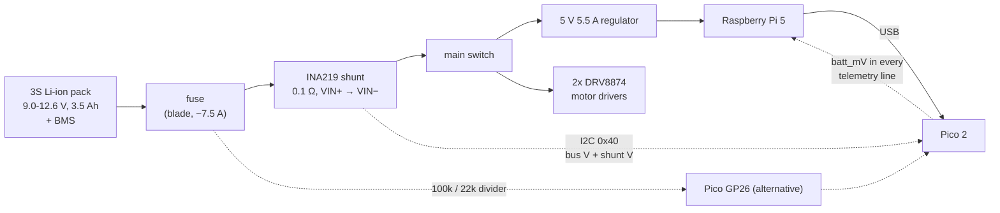

# 01.14 — Measure and report battery state; low-battery shutdown

<!-- glance:start -->
<!-- generated by tools/build.py from curriculum/syllabus.yaml — edit the syllabus, not this block -->

| | |
|---|---|
| **Track** | Main path |
| **Difficulty** | Beginner |
| **Time** | 1 h |
| **Hardware** | Stage 1 robot: Pi 5, Pico, encoder motors, driver, chassis, battery, distance sensors (stage 1) |
| **Software** | python, micropython |
| **Prerequisites** | [01.10 Design the Pi ↔ Pico serial protocol (with a watchdog)](01.10-pi-pico-protocol.md) |
| **Optional prerequisites** | [FE.08 ADC — reading analog voltages](../optional-foundations/electronics/FE.08-adc.md)<br>[FE.02 Ohm's law, series and parallel, voltage dividers](../optional-foundations/electronics/FE.02-ohms-law-series-parallel.md) |
| **Skip if** | Your robot reports battery voltage and shuts down safely at a threshold. |

<!-- glance:end -->

## What you will learn

- Measure pack voltage two ways — an INA219 on I²C, or a 100k/22k divider into the Pico's ADC — and say which error each one has.
- Turn a voltage into a *useful* state-of-charge estimate, and explain why "useful" is the strongest word available.
- Recognise voltage sag under load and stop it triggering false alarms.
- Build a low-voltage warning and a safe shutdown that stops the motors before the Pi loses power.
- Estimate your robot's runtime from its current draw, and watch the estimate be wrong.

## Why it matters

Three things go wrong when a robot ignores its battery, in increasing order of expense:

1. **Behaviour changes silently.** At 10.5 V instead of 12.6 V the same duty gives ~17 % less speed.
   Every open-loop calibration you made in 01.11 drifts away over an afternoon, and you blame your
   code.
2. **The Pi's SD card corrupts.** When the pack's BMS finally disconnects, the Pi loses power
   mid-write. A robot that shuts down cleanly at 9.9 V never sees that.
3. **The cells are damaged.** Discharge a Li-ion cell much below 3.0 V and it loses capacity
   permanently; below ~2.0 V, recharging it can grow internal shorts. Your 3S pack has a BMS that
   will cut out to protect itself, but the BMS is the *last* line of defence, not the first.

So the robot needs to know its own battery state and act on it, the way a service reports health
and drains connections before a shutdown. This is also the lesson where the last field of the
telemetry line stops being a mystery number.

<!-- prereqs:start -->
## Prerequisites

You need these first:

- [01.10 Design the Pi ↔ Pico serial protocol (with a watchdog)](01.10-pi-pico-protocol.md)

### Optional prerequisite links

New to any of these? Take the foundation lesson first; skip it if you already know it.

- [FE.08 ADC — reading analog voltages](../optional-foundations/electronics/FE.08-adc.md)
- [FE.02 Ohm's law, series and parallel, voltage dividers](../optional-foundations/electronics/FE.02-ohms-law-series-parallel.md)

Check your readiness: `python course.py why 01.14`
<!-- prereqs:end -->

## Concept

### Voltage is a bad fuel gauge, and it's the one you have

A petrol tank has a float. A battery has no equivalent: the charge is chemistry, not a level. What
you can measure easily is voltage, and the relationship between voltage and remaining charge is
**flat in the middle and steep at the ends**:

```text
 V/cell
  4.2 ┤●                        a 3S pack: multiply by 3
  4.1 ┤ ●                       12.6 V full ... 9.0 V empty
  4.0 ┤   ●
  3.9 ┤      ●
  3.8 ┤          ●  ●  ●        ← 3.6-3.9 V covers ~50 % of the charge:
  3.7 ┤                   ●       a 0.05 V error here is 10 % of the pack
  3.6 ┤                     ●
  3.4 ┤                      ●
  3.0 ┤                       ●  ← the cliff
      └┬────┬────┬────┬────┬───
      100   75   50   25   0   % state of charge
```

Between 3.9 V and 3.6 V per cell you cross from 60 % to 12 %, and the whole span is 0.3 V — 9 mV per
percent. Your ADC, your resistors and the temperature all move by more than that. So a
voltage-based fuel gauge is honest only as a **band**: "full", "most of it left", "getting low",
"stop now". Treat any percentage you print as decoration and act on the bands.

(The accurate method is *coulomb counting*: integrate current in and out, like a transaction log
rather than a gauge reading. The INA219 measures current, so you can do it — it just drifts,
because integrating a small offset forever is how integrators fail.)

### Sag: the battery reads low exactly when you are using it

A battery is a voltage source with a resistor in series (its internal resistance, plus your wiring,
connectors and fuse). Draw current and the terminal voltage drops:

$$V_{\text{terminal}} = V_{\text{open circuit}} - I \cdot R_{\text{internal}}$$

An aged 3S 18650 pack has perhaps 0.15 Ω. Drawing 2 A — two motors accelerating plus the Pi —
costs 0.30 V, which is 10 % of the pack's *apparent* charge. When the motors stop, the voltage comes
back.

This is why the monitor averages several readings and requires several *consecutive* low samples
before it acts. A robot that shuts down every time it starts a turn is worse than useless.

> [!TIP]
> **Ask your teacher:** "Show me, with numbers, why my robot reports 11.2 V standing still and
> 10.6 V while turning, and why only one of those numbers should trigger a shutdown."

### Two ways to measure it

| | Resistor divider into the Pico ADC | INA219 on I²C |
|---|---|---|
| Parts | two resistors (≈ ₪5) | a carrier board (≈ ₪40) |
| Measures | voltage only | voltage **and** current |
| Accuracy | ±2–3 % (the Pico's 3.3 V reference is the limit) | ±0.5 % typical |
| Wiring | one wire to an ADC pin | four wires, and the pack current goes *through* it |
| Risk | the full pack voltage is one wrong resistor away from a GPIO pin | none to the Pico |

karmel's default is the INA219, because current is what lets you compute a power budget
([02.02](../02-robot-electronics/02.02-power-budget.md)) and a runtime estimate. The divider is
the fallback, and it is worth wiring once because it teaches you how every analogue sensor on a
microcontroller works.

## Technical explanation

> [!CAUTION]
> **Safety:** this lesson touches the battery. Disconnect the pack (unplug it, don't just flick
> the switch) before wiring. Never let the pack's leads touch each other — a 3S 18650 pack will
> deliver tens of amps into a short and set fire to a bench. Charge only with the correct 12.6 V
> charger, on a non-flammable surface or in a LiPo bag, **never unattended**. Stop using any cell
> that is swollen, dented, punctured or hot. Full rules:
> [SAFETY.md](../SAFETY.md) and [FE.14](../optional-foundations/electronics/FE.14-lithium-battery-safety.md).

### Level 1 — Wiring

**The divider (GP26 / ADC0):** the Pico's ADC can only see 0–3.3 V, and a full pack is 12.6 V, so
two resistors scale it down.

```text
   pack +  ──┬── (to fuse, switch, buck converters, motor drivers)
             │
            ┌┴┐
            │ │ R_top = 100 kΩ
            └┬┘
             ├───────────────▶ Pico pin 31, GP26 / ADC0
            ┌┴┐
            │ │ R_bottom = 22 kΩ
            └┬┘
             │
   pack −  ──┴── common ground with the Pico  ← REQUIRED, or the reading is meaningless
```

| Connection | To | Note |
|---|---|---|
| Pack + | top of the 100 kΩ | after the fuse, so a short in your divider blows the fuse |
| Junction of the two resistors | Pico pin 31, GP26 | **measure this with the multimeter before connecting it** |
| Bottom of the 22 kΩ | Pico GND (pin 33/38) | and the pack − must be the same ground |

> [!CAUTION]
> **Safety:** before that middle wire touches GP26, connect the divider to the battery and measure
> the junction with the multimeter. With a fully charged pack it must read **2.2–2.3 V**. Anything
> above 3.3 V means the resistors are swapped or a joint is bad, and connecting it destroys the
> Pico. One measurement, ten seconds, saves a board.

**The INA219:** it measures the voltage across a 0.1 Ω shunt resistor that the pack current flows
through, so it goes *in series* with the supply.

| INA219 pin | To | Note |
|---|---|---|
| VCC | Pico 3V3 (pin 36) | logic supply only |
| GND | Pico GND | |
| SDA | Pico GP4 (pin 6) | shared bus with the VL53L1X (01.13) |
| SCL | Pico GP5 (pin 7) | |
| VIN+ | battery side, after the fuse | the current flows in here... |
| VIN− | load side: switch, buck converters, motor drivers | ...and out here, through the shunt |

Get VIN+ and VIN− the wrong way round and the current reads negative — harmless, and a good first
test. Leave them disconnected and the board reads nothing at all.

### Level 2 — Practical: reading it

```bash
cd ~/robotics-course/labs/firmware/pico
mpremote mount . run examples/07_i2c_scan.py     # expect 0x29 (ToF) and 0x40 (INA219)
mpremote mount . run examples/06_battery.py      # set USE_DIVIDER = True to test the divider
```

Then from the Pi, through the normal telemetry stream:

```bash
python labs/robot/battery_monitor.py --once
python labs/robot/battery_monitor.py --interval 2
python labs/robot/battery_monitor.py --fake --once      # no hardware
```

```text
10:45:01  12.24 V  (4.08 V/cell)  ~ 84 %  OK
```

`config.BATTERY_SENSOR` in the firmware selects `"ina219"`, `"adc"` or `"none"`; whichever it is,
the result appears as `batt_mV` in the telemetry line and as `state.battery_v` on the Pi, with
`None` when there is no reading and `flags & 2` (`FLAG_LOW_BATTERY`) when the firmware itself
considers the pack low.

### Level 3 — Mathematics

**The divider.** Two resistors split the voltage in proportion to their values:

$$V_{\text{pin}} = V_{\text{batt}}\cdot\frac{R_b}{R_t + R_b}, \qquad V_{\text{batt}} = V_{\text{pin}}\cdot\frac{R_t + R_b}{R_b}$$

**Example.** $R_t = 100$ kΩ, $R_b = 22$ kΩ, so the ratio is $22/122 = 0.1803$.
A full pack: $12.6 \times 0.1803 = 2.272$ V — comfortably under 3.3 V, with headroom for a
freshly charged pack that briefly reads 12.7 V. The cutoff, 9.9 V, arrives as 1.785 V.

**Back from the ADC.** MicroPython's `read_u16()` scales the 12-bit conversion to 0–65535:

$$V_{\text{pin}} = \frac{N}{65535}\cdot 3.3, \qquad V_{\text{batt}} = V_{\text{pin}}\cdot 5.545$$

**Example.** $N = 45122 \Rightarrow V_{\text{pin}} = 2.272$ V $\Rightarrow V_{\text{batt}} = 12.60$ V.

**How good is that?** One step of the real 12-bit converter is $3.3/4096 = 0.81$ mV at the pin,
which is $0.81 \times 5.545 = 4.5$ mV at the battery — irrelevant. The error that matters is the
**reference**: the Pico's 3.3 V rail is a switching regulator with a few percent of tolerance and
some ripple. 1 % of 12.6 V is 0.126 V, which on the flat part of the discharge curve is about 12 %
of the pack. Averaging eight samples (which `DividerBattery` does) kills the noise but not the
reference error — only calibrating against a multimeter does, and that is exactly what 07.01 calls
*offset and scale calibration*.

The divider also costs you a little current forever: $12.6/122\,\text{k}\Omega = 0.103$ mA, which is
2.5 mAh per day, or 0.07 % of a 3500 mAh pack. Fine. Use 10k/2.2k instead and you would burn
1.03 mA — still small, but ten times more for no benefit.

**The INA219.** Two registers, no configuration writes: bus voltage in 4 mV steps (bits 15..3), and
shunt voltage in 10 µV steps. Ohm's law gives the current:

$$I = \frac{V_{\text{shunt}}}{R_{\text{shunt}}}$$

**Example.** The shunt register reads 1832 → $V_{\text{shunt}} = 18.32$ mV →
$I = 0.01832/0.1 = 0.183$ A. With a 0.1 Ω shunt the ±320 mV range means the board measures up to
±3.2 A — enough for karmel cruising (≈ 1.2 A) but *not* for a stall (3–4 A per motor), where it
clips. That is a real limitation of the cheap module, and it is why 20.02 upgrades to an INA226.

**Sag, numerically.** Open-circuit 11.4 V, internal resistance 0.15 Ω:

| Current | Sag | Terminal voltage | Would it trip `low_warning_v = 10.5`? |
|---|---|---|---|
| 0.6 A (Pi idle) | 0.09 V | 11.31 V | no |
| 1.2 A (cruising) | 0.18 V | 11.22 V | no |
| 2.0 A (accelerating) | 0.30 V | 11.10 V | no |
| 4.0 A (both motors stalled) | 0.60 V | 10.80 V | no, but close |

Now repeat with an open-circuit voltage of 10.7 V (a genuinely tired pack): stalling drops it to
10.1 V, below the warning and heading for the 9.9 V cutoff. The same *instantaneous* reading means
different things depending on load — which is why the code needs `--confirm` consecutive samples
before shutting down.

**Runtime.** $t = \text{capacity} / \text{current}$, and you only get to use ~80 % of it:

| Current | Theoretical | Usable (80 %) |
|---|---|---|
| 0.8 A (Pi + sensors, robot parked) | 4.4 h | 3.5 h |
| 1.2 A (driving gently) | 2.9 h | 2.3 h |
| 2.0 A (driving hard) | 1.8 h | 1.4 h |

karmel's 3.5 Ah pack therefore gives you a comfortable two-hour session and a nasty surprise if you
spend it stalling against a chair leg. [02.02](../02-robot-electronics/02.02-power-budget.md) turns
this into a proper budget.

### Level 4 — Implementation: bands, confirmation, shutdown

`labs/robot/battery_monitor.py` is thirty lines of policy around one reading.

```python
def update(self, voltage: float) -> BatteryStatus:
    self._readings.append(voltage)
    average = sum(self._readings) / len(self._readings)
    self._below_cutoff = self._below_cutoff + 1 if average < self.cutoff_v else 0
    if self._below_cutoff >= self.confirm:
        level = "critical"
    elif average < self.low_v:
        level = "low"
    else:
        level = "ok"
    return BatteryStatus(average, estimate_soc_percent(average, self.cells), level)
```

- **A moving average over five samples** smooths ADC noise and short sags.
- **A consecutive-sample counter,** reset to zero the moment the average recovers. Three confirmed
  samples at a 2 s interval means six seconds below the cutoff before anything drastic happens.
  A turn's sag lasts under a second.
- **Two thresholds, not one.** 10.5 V warns you (finish what you're doing); 9.9 V acts.
- **Shutdown stops the motors first**, then runs the command you configured:

```python
def safe_shutdown(base, command):
    base.stop()    # SAFETY: first make sure nothing moves
    if not command:
        print("CRITICAL battery: motors stopped. Run with --shutdown-command to power off automatically.")
        return
    subprocess.run(shlex.split(command), check=False)
```

Order matters. Halting the Pi first would leave the motors running on the last command until the
Pico's 300 ms watchdog expires — a third of a second of an unsupervised robot, which is 10 cm.

Run it for real with:

```bash
python labs/robot/battery_monitor.py --interval 5 --confirm 3 --shutdown-command "sudo shutdown -h now"
```

Give the `robot` user a sudoers entry for exactly that command rather than running the whole
program as root ([FL.05](../optional-foundations/linux-and-tools/FL.05-permissions-users-groups.md)).

## Diagram

**Where the measurement happens in the power path:**



**The decision, over time:**

```text
  V
12.6 ┤▔▔▔╲___
     │        ╲▔╲__                    ← sag when the motors start, recovery when they stop
11.0 ┤             ╲_╱▔╲__╱▔╲__
10.5 ┼────────────────────────╲────────  low_warning_v: print a warning, keep driving
     │                          ╲_╱╲_
 9.9 ┼──────────────────────────────╲──  cutoff_v: needs `--confirm` samples in a row
     │                                ╲
 9.0 ┤                                 ╲ BMS cuts out - everything dies mid-write
     └──────────────────────────────────────────────────────────────▶ time
             ↑ one sample here                ↑ three samples here
               is a sag, not an empty pack      is an empty pack
```

## Code

### Firmware: `labs/firmware/pico/sensors.py`

The divider conversion, with the arithmetic spelled out:

```python
def divider_voltage(adc_u16, r_top=config.BATTERY_DIVIDER_TOP_OHMS,
                    r_bottom=config.BATTERY_DIVIDER_BOTTOM_OHMS, v_ref=config.ADC_REFERENCE_V):
    """Battery voltage from a 16-bit ADC reading of the divider's middle point.

        V_pin = V_batt * r_bottom / (r_top + r_bottom)     100k/22k: 12.6 V -> 2.27 V
    """
    v_pin = adc_u16 * v_ref / 65535
    return v_pin * (r_top + r_bottom) / r_bottom
```

and the INA219, which reads two registers and writes none (the power-on defaults are what we want):

```python
def bus_voltage_v(self):
    raw = self._read_register(self.REG_BUS_VOLTAGE)
    # Bits 15..3 hold the voltage in 4 mV steps; bits 2..0 are status flags.
    return (raw >> 3) * 0.004

def current_a(self):
    return self.shunt_voltage_v() / self.shunt_ohms
```

### On the Pi: `labs/robot/battery_monitor.py`

```bash
python labs/robot/battery_monitor.py --fake --once
python labs/robot/battery_monitor.py --interval 2 --confirm 3
python labs/robot/battery_monitor.py --interval 5 --shutdown-command "sudo shutdown -h now"
```

The state-of-charge table it interpolates (per cell, resting, typical NMC 18650 at room
temperature) turns into these pack figures:

| Pack voltage | V/cell | Estimated SoC |
|---|---|---|
| 12.60 | 4.20 | 100 % |
| 12.00 | 4.00 | 74 % |
| 11.50 | 3.83 | 49 % |
| 11.10 | 3.70 | 23 % |
| 10.80 | 3.60 | 12 % |
| 10.50 | 3.50 | 7 % |
| 9.90 | 3.30 | 2 % |

Look at the last four rows: 0.6 V covers 21 % of the charge at the bottom, while 0.6 V at the top
covers 26 %. In the middle (11.4 → 10.8 V) the same 0.6 V covers 30 %. The curve is only *usable*
because it is monotone; it is not accurate, and your cells' curve differs with chemistry, age and
temperature.

### No hardware

`--fake` gives you a simulated pack with a real discharge model — open-circuit voltage linear in
state of charge, minus $I \times 0.15\,\Omega$ of sag with `--realistic`:

```bash
python -m robotlab.fake_pico --port 5760 --realistic --seed 1
python labs/robot/battery_monitor.py --port socket://localhost:5760 --interval 1
```

Driving the simulated robot hard while watching the monitor shows the sag directly: 12.15 V at
rest, 12.01 V at duty 0.6, 11.91 V at duty 1.0, back to 12.15 V when it stops.

## Exercise

### Exercise 01.14-E1 — Wire and cross-check both methods `[hardware]`

Hardware: `robot-base` (INA219, two resistors), `tools` (multimeter).

> [!CAUTION]
> **Safety:** battery disconnected while wiring. Measure the divider's midpoint with the
> multimeter *before* connecting it to GP26; it must be under 3.3 V.

1. Wire the INA219 in series with the pack (after the fuse) and on the I²C bus. Run
   `examples/07_i2c_scan.py` → expect `0x40`.
2. Wire the 100k/22k divider. Measure the midpoint. Then connect GP26 and run
   `examples/06_battery.py` with `USE_DIVIDER = True`.
3. Record, at the same moment: the multimeter reading at the pack, the INA219 reading, and the
   divider reading. Compute each sensor's error against the multimeter, as a voltage and a percentage.

### Exercise 01.14-E2 — Measure your sag and your internal resistance `[hardware]`

Hardware: `robot-base` with the INA219. No hardware: use `--realistic` on the fake Pico, whose pack
has a known 0.15 Ω.

> [!CAUTION]
> **Safety:** wheels in the air for the stall test, and stall for **no more than two seconds** —
> a stalled gearmotor heats up fast. Hand on the switch.

1. Log voltage and current at 5 Hz while the robot: idles, drives at duty 0.3, at duty 0.6, and
   briefly stalls (hold a wheel — two seconds, no more).
2. Plot voltage against current. The slope is $-R_{\text{internal}}$ (of the pack *plus* your wiring
   and fuse holder).
3. What voltage would your pack show, at this state of charge, at 4 A?
4. Repeat with the pack at ~50 %. Did the internal resistance change?

### Exercise 01.14-E3 — Build the discharge curve `[hardware]`

Hardware: `robot-base`, a charged pack, and about two hours.

> [!CAUTION]
> **Safety:** do not leave this running unattended, and stop at 10.2 V — do not discharge to the
> BMS cutout. Never leave the pack charging unattended afterwards.

1. Charge the pack fully. Run `battery_monitor.py --interval 30` and log to a file
   (`| tee battery-log.txt`).
2. Drive the robot in a repeatable pattern (a square on a loop) until the monitor reports `low`.
3. Plot voltage against elapsed time, and against integrated current if you have the INA219
   (coulomb counting: sum $I\,\Delta t$).
4. Compare your measured curve to the table above. How wrong is `estimate_soc_percent` for
   *your* cells, at 80 %, 50 % and 20 %?

### Exercise 01.14-E4 — Make the shutdown trustworthy `[coding]`

Hardware: none (`--fake`).

1. Run `battery_monitor.py --fake --once` and confirm you get a reading.
2. Write a test that drives a `BatteryMonitor` through a synthetic voltage sequence and asserts the
   level at each step: steady 11.5 V → `ok`; a single 9.5 V dip → still `ok`/`low`, never
   `critical`; five consecutive 9.5 V → `critical`.
3. Add a *hysteresis* band: once the monitor reports `low`, it should not go back to `ok` until the
   average is 0.2 V above `low_warning_v`. Why does a bare threshold flap?
4. Make the shutdown path refuse to run if the motors are still moving (check
   `state.left_rad_s`/`right_rad_s`) and log why.

### Exercise 01.14-E5 — The numbers `[numerical]`

Hardware: none.

1. Your divider is 100k/22k and `read_u16()` returns 39 400. What is the pack voltage?
2. You only have 47k and 10k resistors. What is the ratio, what does a 12.6 V pack read at the
   pin, and how much current does the divider waste?
3. The INA219's shunt register reads −4210 (two's complement). What current is flowing, and what
   does the sign mean?
4. Your pack shows 11.9 V while the robot draws 1.5 A, and 12.2 V at rest. What is the internal
   resistance, and what will it read at a 4 A stall?
5. Your robot draws 1.4 A average. With a 3.5 Ah pack and a rule of never going below 20 %, how
   many minutes of driving do you get?

## Expected result

- **01.14-E1:** The I²C scan lists `0x40 INA219 current/voltage`. The INA219 agrees with the
  multimeter to within ±0.1 V (typically ±0.05); the divider agrees to within ±0.3 V, and its error
  is a consistent *scale* error, not random — which is exactly what makes it calibratable.
  The divider midpoint on a full pack measures 2.2–2.3 V.
- **01.14-E2:** A clean straight line on the voltage-versus-current plot, with a slope of
  −0.10 to −0.25 Ω for a healthy 3S 18650 pack with reasonable wiring. A slope worse than −0.4 Ω
  means tired cells or a bad connection (a loose XT60, a corroded fuse holder, thin wire) — find it
  before blaming the cells. On the simulator you recover exactly 0.15 Ω. The 4 A prediction should
  land within 0.1 V when you test it.
- **01.14-E3:** A curve that is steep for the first ten minutes, almost flat for an hour, then
  falls off a cliff. Expect `estimate_soc_percent` to be within ~10 % at the top and bottom and to
  be wrong by 20–30 % in the flat middle. That result is the lesson: report bands, not percentages.
- **01.14-E4:** `--fake --once` prints something like `12.24 V (4.08 V/cell) ~ 84 % OK`. Your tests
  pass; the single dip never produces `critical`; with hysteresis, a pack hovering at exactly
  10.50 V produces one `low` and then silence instead of alternating messages every two seconds.
- **01.14-E5:** (1) $V_{\text{pin}} = 39400/65535\times3.3 = 1.984$ V; $\times 5.545 = 11.00$ V.
  (2) ratio $10/57 = 0.1754$, so 12.6 V → 2.211 V at the pin (fine), and the divider draws
  $12.6/57\text{k} = 0.221$ mA — about twice the 100k/22k version, still negligible.
  (3) $-4210 \times 10\,\mu\text{V} = -42.10$ mV, so $I = -0.421$ A: current is flowing the *other*
  way through the shunt — either VIN+/VIN− are swapped, or something is charging the pack.
  (4) $R = (12.2-11.9)/1.5 = 0.20$ Ω; at 4 A the terminal voltage is $12.2 - 0.8 = 11.4$ V.
  (5) usable $= 0.8\times3.5 = 2.8$ Ah; $2.8/1.4 = 2.0$ h = 120 minutes.

## Troubleshooting

### Symptom: `no battery reading (is the INA219 / divider connected?)`

The telemetry carries `-1`. Work from the firmware outwards:

1. **Which sensor does the firmware think it has?** `config.BATTERY_SENSOR` must be `"ina219"` or
   `"adc"`, not `"none"`.
2. **INA219:** run `examples/07_i2c_scan.py`. No `0x40` → it is a bus problem, and the I²C
   checklist in [01.13](01.13-distance-sensors-stop.md) applies unchanged. Some modules are at
   0x41/0x44/0x45 depending on their address jumpers — the scan tells you.
3. **Divider:** run `examples/06_battery.py` with `USE_DIVIDER = True`. A reading of ~0 V means the
   midpoint wire is not connected or the 100 kΩ is open; a reading pinned at ~18.3 V (the maximum
   the divider can express) means the pin is sitting at 3.3 V — check the bottom resistor is
   actually going to ground.
4. **Common ground.** If the Pico's ground and the pack's negative are not the same node, the
   divider measures nonsense. This is the single most common mistake
   ([FE.16](../optional-foundations/electronics/FE.16-grounding.md)).

### Symptom: the voltage reads consistently 0.3–0.5 V low (or high)

That is a scale error, and it is expected from the divider. Diagnose before you calibrate:

1. Measure the two resistors with the multimeter. "100 kΩ ±5 %" can be 96 kΩ, which alone is 2 %.
2. Measure the Pico's 3V3 pin. If it is 3.26 V rather than 3.30 V, every reading is 1.2 % low.
3. Put both measured numbers into `config.BATTERY_DIVIDER_*` and `config.ADC_REFERENCE_V` and
   re-run. The error should collapse to well under 1 %.
4. If it reads high only when the motors run, it is noise, not scale — see below.

### Symptom: it shuts down while driving, but the pack is fine

Sag. Confirm by logging voltage and current together: if the dips line up with motor starts and the
voltage recovers within a second, you are measuring $I R$, not an empty pack. Fixes, in order:
raise `--confirm`, lengthen `--interval`, widen the averaging window, and check your wiring
resistance (E2's slope). If the sag is more than ~0.6 V at 2 A, the problem is a connector or a
thin wire, not the code.

### Symptom: the reading jumps around only when the motors run

Motor noise on the ADC line or the I²C bus. In order: make the divider's wires short and keep them
away from motor leads; add a 100 nF capacitor from GP26 to ground (it filters the noise and, with
the 100 kΩ, adds a ~2 ms time constant — harmless at 10 Hz); increase the number of averaged
samples; check that the Pico's ground returns to the pack through a short, thick path.
[02.06](../02-robot-electronics/02.06-noise-grounding-emi.md) is the full treatment.

### Symptom: the Pi reboots when the motors start, but the battery reads fine

The pack is fine and the 5 V rail is not. You are measuring the wrong node: put the multimeter on
the Pi's 5 V input while the motors start. This is [02.02](../02-robot-electronics/02.02-power-budget.md)'s
brownout, and the fix is a regulator with enough headroom and thicker wire, not a bigger battery.

## Common mistakes

- **Connecting the divider midpoint before measuring it.** The pack is 12.6 V and the pin's absolute
  maximum is about 3.8 V. Measure first. Every time.
- **Forgetting the common ground** between the pack's negative and the Pico's GND.
- **Acting on a single low reading.** Motors starting is a sag, not an empty battery.
- **Printing a percentage and believing it.** Act on bands.
- **Putting the shunt on the ground side** without understanding what that does to your grounds.
  Keep it high-side, as wired here.
- **Running the whole monitor as root** so it can call `shutdown`. Use a narrow sudoers rule.
- **Discharging "just a bit more" to finish a test.** Below 3.0 V per cell you are spending the
  pack's life; below the BMS cutout you risk an SD card too.
- **Charging unattended.** Named here again because it is the rule most often broken and the one
  with the worst consequence.

## Knowledge check

1. Why does the resistor divider need 100 kΩ and 22 kΩ specifically — what breaks if you use 10 kΩ
   and 2.2 kΩ, or 1 MΩ and 220 kΩ?
   <details><summary>Answer</summary>

   The *ratio* sets the scaling (22/122 = 0.18, so 12.6 V → 2.27 V, under the ADC's 3.3 V ceiling).
   The absolute values set the current wasted and the source impedance. 10k/2.2k has the same ratio
   but wastes ten times the current (1.03 mA, continuously, forever). 1M/220k wastes almost nothing
   but presents such a high impedance that the ADC's sample-and-hold capacitor cannot charge in
   time, and the readings come out low and noisy. 100k/22k is the usual compromise.
   </details>

2. `read_u16()` returns 42 100 on a 100k/22k divider. What is the pack voltage, and roughly what
   state of charge is that?
   <details><summary>Answer</summary>

   $V_{\text{pin}} = 42100/65535 \times 3.3 = 2.120$ V; $\times (122/22) = 11.76$ V, i.e. 3.92 V per
   cell — around 63 % by the table. But on the flat part of the curve, so "more than half" is the
   honest statement.
   </details>

3. Your robot reads 11.2 V standing still and 10.4 V while turning. Is the battery low?
   <details><summary>Answer</summary>

   Not necessarily. The 0.8 V difference is sag: turning in place draws the most current of any
   manoeuvre (both motors working against friction). The resting 11.2 V is the number that
   describes the charge — about 35 % — so you have maybe half an hour left. Only the resting
   voltage should be compared against the thresholds, which is why the monitor averages and
   requires confirmation.
   </details>

4. Predict: you set `--confirm 1` and drive an aggressive course. What happens, and what is the
   failure mode of the opposite mistake (`--confirm 30` at a 5 s interval)?
   <details><summary>Answer</summary>

   With `--confirm 1` the robot shuts down the first time a turn sags the pack below 9.9 V — it
   quits mid-session with a half-full battery. With `--confirm 30` at 5 s, it needs 150 seconds
   below the cutoff before acting, by which time the BMS may have cut the power itself, which is
   exactly what you were trying to avoid. The confirmation window must be longer than the longest
   sag (~1 s) and much shorter than the time from cutoff to BMS disconnect (minutes).
   </details>

5. Why does `safe_shutdown()` stop the motors *before* running the shutdown command?
   <details><summary>Answer</summary>

   Because halting the Pi kills the program that is feeding the Pico's watchdog, and the motors keep
   running on the last command until the watchdog expires 300 ms later. At 0.3 m/s that is 10 cm of
   unsupervised robot, with the computer already going down. Stop the actuators, then the computer —
   the same ordering as any safe shutdown sequence.
   </details>

6. The INA219 with a 0.1 Ω shunt reads up to ±3.2 A. Your motors stall at 3.5 A each. What do you
   see, and what do you do about it?
   <details><summary>Answer</summary>

   The shunt-voltage register saturates at its ±320 mV range, so the reported current clips at about
   3.2 A: a 7 A stall looks like 3.2 A. The voltage reading is still correct. Options: accept it and
   treat 3.2 A as "at least 3.2 A"; fit a smaller shunt and recompute; or move to an INA226 with a
   configurable range (the Stage 6 upgrade). Knowing the limit is what matters — a clipped sensor
   that you believe is worse than no sensor.
   </details>

7. Debugging: your divider reads 12.6 V correctly with the motors off, and 13.4 V when they run.
   What is happening, and what is your first fix?
   <details><summary>Answer</summary>

   It cannot really be rising; motor load can only pull the pack down. You are seeing switching
   noise coupled into the high-impedance divider node and rectified by the ADC's sampling. First
   fix: a 100 nF capacitor from GP26 to ground, and route the divider wires away from the motor
   leads. Then increase the number of averaged samples. If it persists, check that the Pico's
   ground path to the pack is short and thick.
   </details>

## Practical challenge

**Give karmel a battery service you would trust to run unattended overnight.**

Write `~/battery_service.py` (and a systemd unit for it —
[FL.06](../optional-foundations/linux-and-tools/FL.06-processes-systemd.md)) that:

1. Reads voltage (and current, if you have the INA219) from the telemetry stream once per second.
2. Reports one of four bands — `full`, `ok`, `low`, `critical` — with hysteresis, so it never flaps.
3. Logs a CSV of time, voltage, current, band, and the drive command in force, so you can
   reconstruct a session afterwards.
4. At `low`: prints a warning and refuses to start new autonomous behaviours (expose a
   `may_drive()` the other scripts can call).
5. At `critical`: stops the motors, flushes the log, and shuts the Pi down.
6. Survives the Pico disappearing (no telemetry) without shutting anything down by mistake.

**Acceptance criteria:** it runs for a full battery from full to `low` without a false `critical`;
the CSV shows the sag events clearly and you can point at each one and name the manoeuvre; pulling
the Pico's USB cable produces a clear error and no shutdown; and a deliberate test with the
thresholds raised (`--low 12.0 --cutoff 11.8`, if you add those options) demonstrates the full
warn-then-shutdown path on a healthy battery, with the motors stopping before the Pi halts.

## You can skip this if…

Your robot reports battery voltage in its telemetry, warns you at a threshold, and shuts down
safely at a lower one — and you can explain from memory why a single low reading must not trigger
it. Answer knowledge-check questions 1, 3 and 5 correctly without looking.

`python course.py skip 01.14 --reason "my robot reports battery voltage and shuts down safely"`

## Go deeper

- Battery University, BU-903 How to Measure State-of-Charge: https://batteryuniversity.com/article/bu-903-how-to-measure-state-of-charge — why voltage-based gauging is hard, and what coulomb counting and impedance methods add.
- Battery University, BU-808 How to Prolong Lithium-Based Batteries: https://batteryuniversity.com/article/bu-808-how-to-prolong-lithium-based-batteries — depth of discharge, storage voltage, and what "80 % usable" really costs.
- Adafruit, Li-Ion & LiPoly Batteries: https://learn.adafruit.com/li-ion-and-lipoly-batteries — chemistry, charging, protection circuits, handling.
- TI, INA219 datasheet: https://www.ti.com/lit/ds/symlink/ina219.pdf — the register map our driver reads, the bus/shunt ranges, and the calibration register we deliberately don't use.
- Raspberry Pi Pico 2 datasheet: https://datasheets.raspberrypi.com/pico/pico-2-datasheet.pdf — ADC characteristics, the 3.3 V reference and the absolute maximum ratings that make the "measure before you connect" rule non-negotiable.
- [FE.08 ADC](../optional-foundations/electronics/FE.08-adc.md), [FE.02 Ohm's law, series and parallel](../optional-foundations/electronics/FE.02-ohms-law-series-parallel.md) and [FE.13 Batteries](../optional-foundations/electronics/FE.13-batteries.md) — the foundations under this lesson.

## Progress checkpoint

- [ ] My robot reports its pack voltage in every telemetry line, and I know which sensor produces it.
- [ ] I have cross-checked that reading against a multimeter and know its error.
- [ ] I can explain voltage sag with a number, and my monitor does not mistake it for an empty pack.
- [ ] I have a low-battery warning and a shutdown that stops the motors first.
- [ ] I can estimate my robot's remaining runtime, and I know how wrong that estimate is.

`python course.py complete 01.14` (exercises done) · `python course.py master 01.14`
(challenge done) · `python course.py struggle 01.14 "what was hard"`

Next: [01.15 — Drive it from your laptop: keyboard teleop over the network](01.15-teleop-from-laptop.md),
the last piece before [Project P01](../projects/P01-manual-drive.md).
