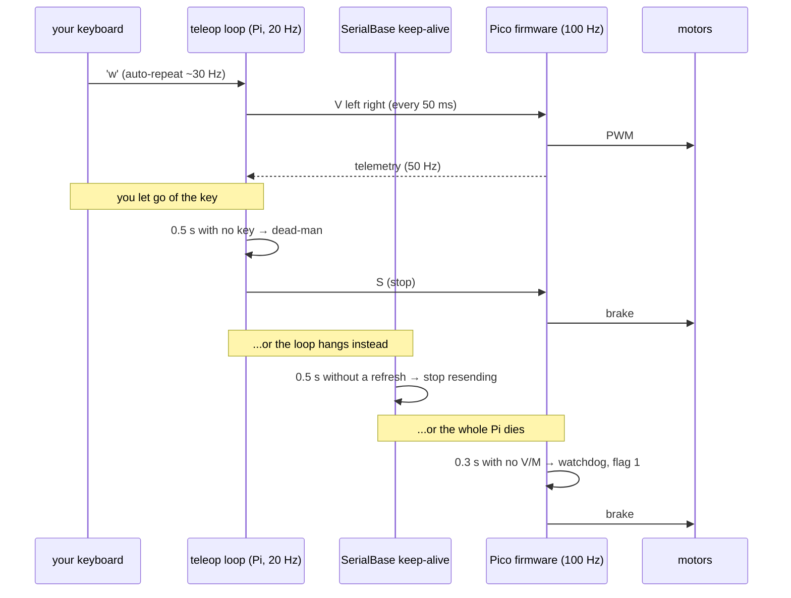

# 01.15 — Drive it from your laptop — keyboard teleop over the network

<!-- glance:start -->
<!-- generated by tools/build.py from curriculum/syllabus.yaml — edit the syllabus, not this block -->

| | |
|---|---|
| **Track** | Main path |
| **Difficulty** | Intermediate |
| **Time** | 1 h |
| **Hardware** | Stage 1 robot: Pi 5, Pico, encoder motors, driver, chassis, battery, distance sensors (stage 1) |
| **Software** | python |
| **Prerequisites** | [01.11 Drive forward, backward and rotate in place (open loop)](01.11-drive-and-rotate.md) |
| **Optional prerequisites** | [FL.09 Networking basics: IP, Wi-Fi, ports, mDNS, ping](../optional-foundations/linux-and-tools/FL.09-networking-basics.md) |
| **Skip if** | You can drive the robot remotely and it stops when the connection drops. |

<!-- glance:end -->

## What you will learn

- Drive the robot with the keyboard from an SSH session on your laptop, at a fixed command rate.
- Design a dead-man switch: the robot moves only while you are actively asking it to.
- Name the three independent layers that stop the robot, and test each one by breaking it.
- Measure your link: round-trip latency, telemetry jitter, and the delay from key to motion.
- Say exactly what happens when the Wi-Fi drops mid-drive — and prove it by unplugging.

## Why it matters

Chasing a robot around the floor with a laptop tethered by USB gets old in about four minutes. More
importantly, teleop is the first time your control loop runs **across a network**, which changes
the problem in ways you already know from distributed systems: the channel can be slow, can
reorder, can pause for 800 ms while the access point scans, and can simply stop existing — and
unlike a web request, the thing on the other end has momentum.

The answer is the same one you would reach for in any distributed system: never let a command mean
"keep doing this forever". Make it a lease that must be renewed. Everything in this course that
moves — teleop today, `cmd_vel` in ROS 2, Nav2's controller in module 12 — is built on that idea.
This is also the last lesson before [Project P01 — Robot drives manually](../projects/P01-manual-drive.md).

<!-- prereqs:start -->
## Prerequisites

You need these first:

- [01.11 Drive forward, backward and rotate in place (open loop)](01.11-drive-and-rotate.md)

### Optional prerequisite links

New to any of these? Take the foundation lesson first; skip it if you already know it.

- [FL.09 Networking basics: IP, Wi-Fi, ports, mDNS, ping](../optional-foundations/linux-and-tools/FL.09-networking-basics.md)

Check your readiness: `python course.py why 01.15`
<!-- prereqs:end -->

## Concept

### The command is a lease, not an order

`set_wheel_velocity(5.0, 5.0)` does not mean "drive at 5 rad/s until further notice". It means
"drive at 5 rad/s for the next 300 milliseconds". Renew it and the robot keeps going; stop renewing
— because you let go of the key, because your program crashed, because the Wi-Fi died — and it
stops by itself.

The .NET analogy that actually fits is a distributed lock with a TTL: the holder must keep
refreshing, and a holder that dies loses the lock automatically instead of wedging the system. Here
the "system" is 1.6 kg of robot moving at 0.3 m/s, so the automatic release matters more than usual.

### Three layers, because one is never enough

Between your finger and the motors there are three independent timers, each covering the failure
the one below it cannot see:

| Layer | Where it lives | Timeout | Catches |
|---|---|---|---|
| 1. Dead-man | `teleop_keyboard.py`'s loop | `--deadman`, 0.5 s | you let go of the key; the terminal stops delivering keys |
| 2. Command timeout | `SerialBase`'s keep-alive thread | the same 0.5 s | your program's main loop hangs or blocks |
| 3. Firmware watchdog | the Pico, `watchdog_ms` | 0.3 s | the Pi crashed, the USB cable fell out, the program was killed |

They are deliberately independent: layer 3 runs on a different chip and does not care whether Linux
is alive. A robot that relies on one watchdog has a single point of failure exactly where it can
least afford one. Note also that they are *nested*: the outer layers stop sending, which makes the
inner one fire.

### Keyboard repeat is doing more work than you think

`teleop_keyboard.py` has no "latch" — there is no key that means "drive until stopped". Holding
`w` keeps the robot moving because your terminal's **auto-repeat** sends `w` about thirty times a
second, and every one of those refreshes the lease. Release the key, the repeats stop, and 0.5 s
later the robot stops.

This has one consequence worth knowing before it confuses you: the OS waits 250–500 ms after the
first press before it starts repeating. If `--deadman` is shorter than that initial delay, the
robot lurches and stops between the first keypress and the first repeat. The default 0.5 s is
chosen to sit just past it; if your robot stutters, raise it.

> [!TIP]
> **Ask your teacher:** "Walk me through exactly what happens between my finger pressing `w` on my
> laptop and the wheels turning — terminal, SSH, Python, USB, firmware — and where the delay is."

## Technical explanation

### Level 1 — The path from your keyboard to the wheels

```text
  your laptop                Wi-Fi                 Raspberry Pi 5 (karmel)         Pico 2
  ┌──────────────┐        ~1-5 ms        ┌───────────────────────────────┐   USB  ┌──────────────┐
  │ terminal     │ ──────────────────►   │ sshd → your shell             │ ─────► │ firmware     │
  │ key 'w'      │      encrypted TCP    │ teleop_keyboard.py @ 20 Hz    │  <1 ms │ PID @ 100 Hz │
  │              │ ◄──────────────────   │ SerialBase reader thread      │ ◄───── │ telemetry    │
  └──────────────┘    status line back   └───────────────────────────────┘  50 Hz └──────────────┘
        ↑                                                                                ↓
        └──────────────── what you see is ~20-60 ms behind reality ────────── motors, 80 ms tau
```

The program runs **on the Pi**. SSH carries your keystrokes there and the status line back; it does
not carry robot commands. That matters: if Wi-Fi hiccups for 200 ms, no command is lost — the loop
on the Pi simply gets no new keys, and the dead-man does its job.

(The alternative — running the control loop on your laptop and sending commands over the network —
is what ROS 2 does in module 04, and it needs more care precisely because the loop itself is now
across the link.)

### Level 2 — Practical: driving it

From your laptop:

```bash
ssh karmel                                   # or: ssh ubuntu@karmel.local
cd ~/robotics-course
python labs/robot/teleop_keyboard.py         # defaults: 0.15 m/s, 1.2 rad/s, 0.5 s dead-man
```

| Key | Does |
|---|---|
| `w` / `s` | forward / backward |
| `a` / `d` | turn left / right in place |
| `q` / `e` | forward while turning |
| space | stop now |
| `+` / `-` | faster / slower, in 0.05 m/s steps |
| `x` or `Ctrl-C` | quit (and stop) |

The status line updates at the loop rate:

```text
MOVING  speed 0.20 m/s  battery 11.9 V  range  0.84 m  flags 8
```

`flags 8` is `FLAG_VELOCITY_MODE` — the Pico is running its own speed controller. If you ever see
`flags 9`, that is velocity mode *plus* the watchdog having tripped: you stopped sending.

> [!CAUTION]
> **Safety:** first run on a stand with the wheels in the air, to learn the keys without chasing
> anything. Then on the floor, in an open space, with `--speed 0.10`, a hand on the battery switch,
> and nothing fragile in range. **Test the disconnect behaviour before you trust it** (E3). Keep
> pets and children out of the area — a remote-controlled robot invites exactly the kind of
> attention you do not want near gearmotors.

> [!IMPORTANT]
> **Version-sensitive** (verified 2026-09 against Ubuntu Server 24.04 LTS on the Raspberry Pi 5,
> OpenSSH 9.6 and `tmux` 3.4). SSH client options and NetworkManager's Wi-Fi power-save default
> change between releases. Before following the keep-alive and power-save steps, check the current
> docs: https://ubuntu.com/server/docs/openssh-server
> AI teacher: verify against current documentation before giving instructions.

**Make SSH notice a dead link quickly.** By default an SSH session can sit there for minutes after
the network dies. In `~/.ssh/config` on your laptop:

```text
Host karmel karmel.local
    HostName karmel.local
    User ubuntu
    ServerAliveInterval 3
    ServerAliveCountMax 2
```

Now the client gives up after about 6 seconds, the Pi's sshd sees the session close and sends
`SIGHUP` to your program — which `teleop_keyboard.py` catches and turns into a stop. Six seconds is
still an age; that is why the dead-man is the *real* protection and SSH's timeout is only tidy-up.

**Turn off Wi-Fi power saving on the Pi**, which otherwise adds 100–200 ms of latency at random:

```bash
iw dev wlan0 get power_save          # expect: Power save: on
sudo iw dev wlan0 set power_save off # immediate, not persistent
```

To make it stick, add `wifi.powersave = 2` under `[connection]` in a NetworkManager conf drop-in
(`/etc/NetworkManager/conf.d/wifi-powersave.conf`) and restart NetworkManager. Measure before and
after with `link_latency.py` — the difference is visible in the p99, not the mean.

**Use `tmux`.** A dropped SSH session kills your program, which is correct for teleop and
infuriating for a long experiment. `tmux new -s robot` on the Pi, then `tmux attach -t robot`
after a reconnect ([FL.13](../optional-foundations/linux-and-tools/FL.13-tmux-headless.md)).
Do **not** run teleop inside tmux: the session surviving is exactly what you don't want when your
laptop walks out of range.

### Level 3 — Mathematics: what latency costs you, in centimetres

Latency is only interesting when you multiply it by speed.

$$d_{\text{blind}} = v \cdot \left(t_{\text{network}} + t_{\text{loop}} + t_{\text{motor}}\right)$$

**Example, driving at 0.30 m/s over good Wi-Fi.** $t_{\text{network}} \approx 5$ ms round trip,
the 20 Hz loop adds up to 50 ms before your key is acted on, telemetry adds up to 20 ms to what you
see, and the motors take ~80 ms to spin down after `stop()`. From "I see an obstacle on the status
line" to "the robot has stopped": about 0.16 s, or **4.8 cm**.

Now the same over a congested 2.4 GHz band with power-save on: a p99 of 250 ms turns that into
0.41 s and **12 cm**. And if the link pauses for a full second, the dead-man fires and the robot
stops on its own after 0.5 s — 15 cm — *without you*. That is the layer doing its job.

**Why the dead-man is 0.5 s and not 0.1 s.** The bound is the keyboard's initial repeat delay
(250–500 ms). Below it, a held key produces stop-start-stop. Above ~1 s, you are giving up control
for too long. The trade-off is visible and measurable, which is the point of E2.

**Why the firmware watchdog is 0.3 s.** It only has to catch "the Pi is gone", and at 0.5 m/s
0.3 s is 15 cm. Shorter would risk false trips when the Pi is briefly busy; longer would let a dead
Pi push the robot further than you can accept.

### Level 4 — Implementation: reading keys without curses

```python
class KeyReader:
    """Non-blocking single-key reads without curses. Use as a context manager."""

    def __enter__(self):
        if os.name == "nt":
            import msvcrt
            self._msvcrt = msvcrt
        else:
            import termios, tty
            self._fd = sys.stdin.fileno()
            self._saved = termios.tcgetattr(self._fd)
            tty.setcbreak(self._fd)   # keys arrive immediately, without Enter; Ctrl-C still works
        return self
```

- **`tty.setcbreak`, not `tty.setraw`.** cbreak turns off line buffering and echo but leaves signal
  generation on, so `Ctrl-C` still raises `KeyboardInterrupt`. With `setraw`, `Ctrl-C` becomes just
  another byte and you have lost your emergency stop.
- **The terminal settings are restored in `__exit__`,** inside a `try` that tolerates
  `termios.error` — because if the SSH session has already gone, there is no terminal to restore
  and you do not want that exception to hide the real one.
- **`msvcrt` on Windows** so the same script runs against `--fake` on your laptop.

And the three ways the network's death reaches the program:

```python
except (HangUp, EOFError, OSError) as exc:
    # SAFETY: the terminal/network is gone - stop now (close() below also stops).
    print(f"\nconnection to the terminal lost ({type(exc).__name__}): stopping")
```

- **`HangUp`** — a `SIGHUP` handler. The kernel sends it when the controlling terminal disappears,
  which is what happens when sshd notices the session is dead.
- **`EOFError`** — `os.read` on stdin returned zero bytes: the pty closed under us.
- **`OSError`** — the read itself failed.

None of these is guaranteed to arrive, and that is fine: if the network merely *freezes*, nothing
is raised, no keys arrive, and the dead-man stops the robot in 0.5 s. Belt, braces, and a third
thing on a different chip.

The main loop is the rest of the lesson:

```python
deadman_expired = loop_start - last_key_time > args.deadman
if deadman_expired or command == (0.0, 0.0):
    if moving:
        base.stop()
        moving = False
else:
    left, right = body_to_wheels(command[0] * speed, command[1] * turn_rate, params)
    base.set_wheel_velocity(left, right)   # SAFETY: the wheels turn here
    moving = True
```

Note `body_to_wheels`: you think in robot terms (forward at *v*, turn at *ω*) and the inverse
kinematics turns that into two wheel speeds. That is exactly the `Twist` → wheel-velocity step that
ROS 2's `diff_drive_controller` performs in [09.02](../09-odometry/09.02-inverse-kinematics-cmd-vel.md);
you are writing a two-line version of it here.

## Diagram

**The three timers, and what each one is watching:**



**What happens when the Wi-Fi drops, in three cases:**

```text
  case A: the link freezes (packets stop, TCP still "open")
      keys stop arriving ──▶ dead-man (0.5 s) ──▶ base.stop() ──▶ robot stops.  YOU still see
      a frozen status line for several seconds. The robot is already stopped.

  case B: sshd notices and closes the session
      SIGHUP ──▶ HangUp exception ──▶ print + stop ──▶ `with` block closes SerialBase,
      whose close() brakes the motors.  Terminal settings restored.

  case C: the Pi itself dies (power, kernel panic, you pulled the USB cable)
      nothing on the Pi runs ──▶ no V command reaches the Pico ──▶ firmware watchdog (0.3 s)
      ──▶ motors braked, FLAG_WATCHDOG set. The only layer that can survive this is on the Pico.
```

## Code

### `labs/robot/teleop_keyboard.py`

```bash
# On your laptop, no robot at all:
python labs/robot/teleop_keyboard.py --fake

# On the Pi over SSH, real robot:
python labs/robot/teleop_keyboard.py --speed 0.10 --turn-rate 0.8 --deadman 0.5

# A separate "robot" process, to test the network path without hardware:
python -m robotlab.fake_pico --port 5760 --world apartment --realistic   # terminal 1
python labs/robot/teleop_keyboard.py --port socket://localhost:5760      # terminal 2
```

The dead-man is wired in at connection time, so `SerialBase`'s keep-alive uses the same timeout as
the loop:

```python
with connect(args, command_timeout_s=args.deadman) as conn, KeyReader() as keyboard:
```

### Measuring the link: `01-first-robot/code/link_latency.py`

```bash
python 01-first-robot/code/link_latency.py --fake
python 01-first-robot/code/link_latency.py --port /dev/ttyACM0 --move     # WHEELS IN THE AIR
python 01-first-robot/code/link_latency.py --port socket://karmel.local:5760
```

```text
connected to socket://127.0.0.1:58232 — firmware fake-0.1.0, protocol v1

round trip (H->I)      n=  20  mean   2.77 ms  p50   2.83  p90   3.22  p99   3.49  max    3.49 ms
telemetry interval     n= 101  mean  19.85 ms  p50  16.02  p90  31.95  p99  34.17  max   34.22 ms
telemetry rate         50.4 Hz
command -> motion      n=   3  mean  53.66 ms  p50  56.92  p90  58.95  p99  58.95  max   58.95 ms

link counters: SerialStats(lines_received=279, bad_lines=0, telemetry=243, commands_sent=36, acks_ok=15, ...)
```

Read the **p99 and the max**, not the mean. A link whose mean is 3 ms and whose p99 is 250 ms feels
broken, and the mean will never tell you that. `command -> motion` is the number to feed into
`--reaction-time` in [01.13](01.13-distance-sensors-stop.md)'s obstacle stop.

## Exercise

### Exercise 01.15-E1 — Drive it from the laptop `[hardware]`

Hardware: `robot-base`, a laptop on the same Wi-Fi. No hardware: `--fake` on your laptop.

> [!CAUTION]
> **Safety:** wheels in the air for the first run, then the floor at `--speed 0.10` with a hand on
> the switch and a clear 2 m.

1. `ssh karmel`, run teleop with the wheels in the air, and learn the keys.
2. On the floor, drive a figure of eight around two chairs at 0.10 m/s. Then at 0.25 m/s.
3. Hold `w` and release it. Time how long the robot keeps moving (film it with your phone at
   60 fps and count frames, or just watch the status line flip to `stopped`).
4. Note the battery voltage and range reading on the status line while driving.

### Exercise 01.15-E2 — Tune the dead-man `[hardware]`

Hardware: `robot-base` or `--fake`.

1. Run with `--deadman 0.2`. Hold `w`. What happens in the first half second, and why?
2. Find your terminal's initial repeat delay: `xset q | grep -A1 'auto repeat delay'` on X11,
   or just bisect `--deadman` until the stutter disappears.
3. Run with `--deadman 2.0` and let go of the key while driving at 0.25 m/s. Measure how far it
   travels after you release. Would you accept that in your living room?
4. Pick a value, justify it in one sentence, and put it in your notes.

### Exercise 01.15-E3 — Break the link on purpose `[hardware]`

Hardware: `robot-base` on the floor. No hardware: cases A and B work with `--fake` plus
`fake_pico` in another terminal; case C needs you to kill the fake_pico process.

> [!CAUTION]
> **Safety:** this exercise deliberately creates uncontrolled robot states. Floor level, open
> space, `--speed 0.10`, hand on the battery switch, and nobody else in the room.

Test each layer by breaking exactly one thing while holding `w`:

1. **Wi-Fi off on your laptop** (airplane mode). How long until the robot stops? What does the
   terminal show, and when?
2. **Close the laptop lid / kill the SSH client** (`~.` in an SSH session). Which exception path
   did it take? (Add a `print` if you want to see.)
3. **Unplug the Pico's USB cable** mid-drive. What stops the robot, and what flag is set when you
   plug it back in?
4. **`kill -9` the teleop process** from a second SSH session. Which layer catches this one?
5. Write down, for each, which of the three layers fired and how long it took.

### Exercise 01.15-E4 — Measure your network `[coding]`

Hardware: `robot-base` (for the USB comparison); the network part works with `--fake`.

1. `python 01-first-robot/code/link_latency.py --port /dev/ttyACM0` on the Pi — this is your USB
   baseline.
2. Run `python -m robotlab.fake_pico --host 0.0.0.0 --port 5760` on the Pi and
   `link_latency.py --port socket://karmel.local:5760` from your laptop. Compare p50, p99 and max.
3. Turn Wi-Fi power saving off and repeat. Which statistic changed?
4. Repeat while streaming a video on the same Wi-Fi, and from the far end of the flat.
5. Convert your worst p99 into centimetres at 0.3 m/s. Is that acceptable?

### Exercise 01.15-E5 — Predict the failure `[predict]`

Hardware: none to predict.

Write down what you expect *before* testing:

1. You run teleop inside `tmux` and your laptop's Wi-Fi drops while you are holding `w`. What
   stops the robot, and when?
2. You replace the re-send loop with "send the command once when the key is pressed, send stop when
   it is released". What breaks, and which layer catches it?
3. `--deadman 5.0`, and you `kill -9` the teleop process while driving.
4. Two people SSH in and run teleop at the same time, pressing different keys.
5. You use `tty.setraw` instead of `tty.setcbreak` and then need to stop the robot urgently.

## Expected result

- **01.15-E1:** The robot responds within about 100 ms of a keypress and stops 0.4–0.6 s after you
  release. The status line shows `MOVING`/`stopped`, a plausible battery voltage, a range reading
  when something is in front, and `flags 8` while driving. At 0.25 m/s the figure of eight is
  noticeably harder — that is latency, not you.
- **01.15-E2:** (1) With `--deadman 0.2` the robot lurches and stops repeatedly until auto-repeat
  kicks in, because the initial repeat delay (250–500 ms) is longer than the dead-man. (3) With
  `--deadman 2.0` at 0.25 m/s it travels about 0.5 m after you let go. (4) A defensible answer is
  0.4–0.6 s: longer than the repeat delay, short enough that the robot stops within ~15 cm.
- **01.15-E3:** (1) The robot stops after `--deadman` (0.5 s); your terminal freezes and only
  reports the drop when SSH's `ServerAliveCountMax` expires, seconds later — the robot was already
  stopped. (2) `SIGHUP` → `HangUp`, or `EOFError` if the pty closes first; either way the message
  prints and `close()` brakes the motors. (3) `SerialBase` raises and the `with` block closes —
  but the layer that *actually* stopped the motors is the Pico's watchdog at 0.3 s; on reconnect the
  first telemetry has `flags & 1` set. (4) `kill -9` leaves no chance for Python cleanup, so again
  the firmware watchdog is the one that catches it, at 0.3 s. Layers 1 and 2 cannot save you from
  `SIGKILL` — which is precisely why layer 3 lives on another chip.
- **01.15-E4:** USB: round trip well under 2 ms, telemetry interval 20 ms ± a few, `command ->
  motion` 40–90 ms (mostly the motor's time constant). Local TCP on the same machine: ~3 ms round
  trip. Good Wi-Fi: p50 2–6 ms, p99 20–60 ms. Power-save on typically triples the p99 and barely
  moves the p50. Congested or far away: p99 in the hundreds of milliseconds. At 0.3 m/s, a 250 ms
  p99 is 7.5 cm of blindness on top of your reaction time.
- **01.15-E5:** (1) tmux keeps the *session* alive, so no `SIGHUP` arrives — only the dead-man
  stops the robot, at 0.5 s. Then the program sits there, still connected to the robot, waiting for
  keys. That is why teleop does not belong in tmux. (2) It breaks immediately: the firmware
  watchdog stops the motors 300 ms after the single command, so the robot twitches and stops while
  you hold the key. Layer 3 catches it. (3) The teleop process dies without stopping anything;
  layers 1 and 2 die with it; the Pico's watchdog stops the motors 0.3 s later. The 5 s dead-man
  is irrelevant because nothing is running to enforce it. (4) Both processes fight over
  `/dev/ttyACM0` — one will fail to open it, or you get interleaved commands and unpredictable
  motion. One owner per serial port. (5) `setraw` disables signal generation, so `Ctrl-C` is
  delivered as the byte `0x03` rather than raising `KeyboardInterrupt`. (`teleop_keyboard.py` does
  handle `\x03` in its key table — but only while the loop is running; if the loop is stuck, you
  have lost your software stop and are down to the battery switch.)

## Troubleshooting

### Symptom: keys do nothing, or the robot stutters

1. **Is the terminal interactive?** The script refuses to start without a TTY. Running it through a
   pipe, a CI job or `nohup` will not work.
2. **Dead-man shorter than the repeat delay** — the single most common cause of stutter. Raise
   `--deadman` to 0.5 s or more (E2).
3. **Is your terminal emulator eating the keys?** Some send escape sequences for arrow keys; this
   script uses letters precisely to avoid that.
4. **Check the flags.** `flags 9` means velocity mode plus a tripped watchdog: commands are not
   arriving at the Pico. Look at `base.stats` for `ack_timeouts` and `bad_lines`.

### Symptom: the robot responds half a second late

Measure before guessing, with `link_latency.py`:

1. **Round trip large even over USB** → the Pi is overloaded. Check with `top`; a background
   `apt` upgrade will do it.
2. **Round trip fine, telemetry interval spiky** → the link is fine and your loop is being delayed.
   Remove any `print` of large objects; make sure nothing in the loop blocks.
3. **Round trip p99 large over Wi-Fi only** → power save (turn it off), channel congestion (move to
   5 GHz), or distance. Compare 2.4 GHz and 5 GHz directly.
4. **Everything fine but it still feels laggy** → that is the motor time constant (~80 ms) plus the
   status line being 20–50 ms behind. Teleop at 0.3 m/s genuinely feels sluggish; this is why real
   remote driving uses video and predictive displays.

### Symptom: the terminal is a mess after the program exits

The `KeyReader.__exit__` restore did not run — usually because the process was killed with
`SIGKILL`, or the SSH session died first. Fix your terminal with `reset` or `stty sane`. If it
happens on a *normal* exit, something is swallowing the exception before the `with` block unwinds.

### Symptom: "could not open port /dev/ttyACM0"

Something else has it: another teleop, an `mpremote repl`, or a leftover process. Find it with
`fuser -v /dev/ttyACM0` and stop it. One owner per serial port — the same rule as
[01.05](01.05-pico-microcontroller-setup.md).

### Symptom: the SSH session drops constantly

1. `ping karmel.local` from the laptop while driving — packet loss points at Wi-Fi, not SSH.
2. Wi-Fi power save on the Pi (turn it off).
3. Weak signal: the Pi's antenna is inside a metal-ish robot, low to the ground, and moving. This
   is a real and underestimated effect; try a different orientation or the 2.4 GHz band, which
   penetrates better than 5 GHz at the cost of latency.
4. The Pi browning out when the motors start, taking Wi-Fi down with it
   ([02.02](../02-robot-electronics/02.02-power-budget.md)).

## Common mistakes

- **A latched drive command.** "Press `w` to go, press space to stop" is one dropped keystroke away
  from a robot in the stairwell. Hold-to-drive, always.
- **Running teleop in tmux.** The session surviving your laptop's disappearance is the opposite of
  what you want here.
- **Removing the watchdog "just for this test".** That is how the test becomes the incident.
- **Testing the disconnect behaviour on carpet next to the bookshelf.** Test it deliberately, in an
  open space, before you rely on it.
- **Judging the link by its mean latency.** The p99 is what you feel.
- **Using `tty.setraw`,** which turns `Ctrl-C` into a plain byte and costs you the software stop.
- **Forgetting that the program runs on the Pi.** Editing the file on your laptop and wondering why
  nothing changed is a rite of passage; use `rsync`, `git pull` on the Pi, or an editor with remote
  SSH support.
- **Driving fast because it works fine on the desk.** Latency is free at 0 m/s.

## Knowledge check

1. Why does the robot stop when you release `w`, even though the program never sends a "stop" on
   key release?
   <details><summary>Answer</summary>

   It does send a stop — the dead-man does it. Holding a key works because terminal auto-repeat
   refreshes `last_key_time` about 30 times a second; releasing it means no key arrives, and after
   `--deadman` seconds the loop calls `base.stop()`. Behind that, `SerialBase` stops refreshing the
   drive command and the Pico's watchdog would stop the motors anyway 300 ms later.
   </details>

2. Your laptop's Wi-Fi dies while you hold `w`. List, in order, everything that stops the robot and
   when.
   <details><summary>Answer</summary>

   (1) Keys stop arriving at the loop on the Pi immediately; at 0.5 s the dead-man calls `stop()`
   and the robot stops. (2) Seconds later, SSH's `ServerAliveCountMax` expires, sshd closes the
   session, your program gets `SIGHUP`, prints and exits, and `SerialBase.close()` brakes again.
   (3) The Pico's watchdog never fires, because layer 1 already stopped the robot properly. Your
   *screen* is the last thing to find out.
   </details>

3. Why are there three timeouts instead of one good one?
   <details><summary>Answer</summary>

   Each covers a failure the others cannot see. The dead-man knows about your intent but dies with
   your program. `SerialBase`'s keep-alive covers a hung main loop but also dies with the process.
   Only the Pico's watchdog survives `kill -9`, a kernel panic, a power loss on the Pi or an
   unplugged USB cable — because it runs on a different chip. Layered, independent timeouts are the
   standard pattern for anything with momentum.
   </details>

4. You measure a round-trip p50 of 4 ms and a p99 of 300 ms. Is the link usable at 0.3 m/s? What
   would you change?
   <details><summary>Answer</summary>

   Usable but unpleasant: one command in a hundred is 300 ms late, which is 9 cm of robot. Teleop
   will feel like it "sticks". Fixes in order of effect: disable Wi-Fi power save on the Pi, move
   to a less congested channel or band, get closer to the access point, and lower the driving speed
   so the same latency costs fewer centimetres.
   </details>

5. Predict: you change the loop so the command is sent once on key-press and once on key-release.
   What does the robot do while you hold the key?
   <details><summary>Answer</summary>

   It moves for about 300 ms and stops, because nothing refreshes the Pico's watchdog. It will do
   this over and over as auto-repeat re-sends the "press". The lesson: the watchdog is not an error
   handler you can design around — it defines the shape of every drive loop in the course.
   </details>

6. Debugging: teleop works perfectly over USB on the desk and is unusable when the robot is in the
   next room. Where do you look first, and what tool tells you?
   <details><summary>Answer</summary>

   `link_latency.py` against the fake Pico over TCP, from the laptop, near and far. If p99 and max
   blow up while p50 stays small, it is the wireless link (power save, congestion, range), not your
   code. Confirm with `ping -i 0.2 karmel.local` and look at the loss and the tail. Note also that
   over SSH the *control loop* runs on the Pi, so a bad link degrades your feedback, not the robot's
   control — the robot simply stops, which is the right failure.
   </details>

7. Why does `teleop_keyboard.py` use `tty.setcbreak` rather than `tty.setraw`, and why does it
   restore the terminal inside a `try`?
   <details><summary>Answer</summary>

   `setcbreak` gives immediate, unechoed keys while leaving signal generation on, so `Ctrl-C` still
   raises `KeyboardInterrupt` — you keep a software emergency stop. `setraw` would deliver `0x03`
   as data instead. The restore is wrapped in `try` because when the SSH session has already died
   there is no terminal to restore; letting `termios.error` escape there would mask the original
   failure and skip the rest of the cleanup, including stopping the motors.
   </details>

## Practical challenge

**Make teleop good enough to hand your laptop to someone else.**

Extend `teleop_keyboard.py` into `~/teleop_plus.py` with:

1. **Acceleration limits** — ramp the commanded speed rather than stepping it, so the robot does not
   jerk. Cap the rate at `max_linear_accel_m_s2` from `karmel.yaml`.
2. **A live status line** showing speed, battery band (from [01.14](01.14-battery-monitoring.md)),
   range, link p99 latency over the last 5 s, and which layer last stopped the robot.
3. **A safety veto**: refuse to move forward when the range sensor reads below the braking
   threshold from [01.13](01.13-distance-sensors-stop.md), and refuse to move at all when the
   battery band is `critical`.
4. **A session log** (CSV) of time, key, commanded *v* and *ω*, measured wheel speeds, range,
   battery and flags — enough to replay the session afterwards.
5. **A clean shutdown** on every exit path you can think of, verified by testing them.

**Acceptance criteria:** someone who has not read the code can drive the robot around a room
without hitting anything, using only the on-screen help; releasing the key stops the robot within
0.6 s; killing the process with `kill -9`, unplugging the Pico and switching off the laptop's Wi-Fi
each stop the robot within 0.6 s and you can say which layer did it; the log lets you plot the
whole session afterwards; and the robot refuses to drive into a box you hold in front of it.

## You can skip this if…

You can drive your robot remotely from your laptop and it stops when the connection drops — and you
can demonstrate all three stopping layers on demand and say which one fires for each failure.
Answer knowledge-check questions 2, 3 and 5 correctly without looking.

`python course.py skip 01.15 --reason "I drive my robot over the network with a dead-man switch and layered watchdogs"`

## Project checkpoint

This completes the hardware path of module 01. [Project P01 — Robot drives
manually](../projects/P01-manual-drive.md) is now open and is essentially this lesson turned into a
finished, documented deliverable. With [01.13](01.13-distance-sensors-stop.md) you can also do
[P02 — Obstacle avoidance](../projects/P02-obstacle-avoidance.md), and with
[01.12](01.12-encoder-distance-and-square.md), [P03 — Encoder-based
movement](../projects/P03-encoder-movement.md).

## Go deeper

- OpenSSH server documentation (Ubuntu): https://ubuntu.com/server/docs/openssh-server — `ServerAliveInterval`, key management and hardening for a robot on your home network.
- ROS 2 Jazzy, teleop_twist_keyboard: https://index.ros.org/p/teleop_twist_keyboard/ — the ROS 2 equivalent of today's script, publishing `Twist`; module 04 replaces your loop with it.
- ROS 2 Jazzy, About Quality of Service settings: https://docs.ros.org/en/jazzy/Concepts/Intermediate/About-Quality-of-Service-Settings.html — what "reliable" and "best effort" mean once the control loop itself crosses the network.
- SparkFun, Serial Communication: https://learn.sparkfun.com/tutorials/serial-communication — the layer under `SerialBase`, if the USB link is still a black box.
- [FL.08 SSH and remote development](../optional-foundations/linux-and-tools/FL.08-ssh-remote-dev.md), [FL.09 Networking basics](../optional-foundations/linux-and-tools/FL.09-networking-basics.md) and [FL.13 tmux for headless work](../optional-foundations/linux-and-tools/FL.13-tmux-headless.md) — the foundations under this lesson.
- [03.10 Networking for robots](../03-robot-software/03.10-networking-for-robots.md) — mDNS, static addresses, VPNs and what to do when the robot leaves your Wi-Fi.

## Progress checkpoint

- [ ] I can drive my robot from my laptop over SSH, and the controls feel predictable.
- [ ] My teleop is hold-to-drive, and I can explain why a latched command is dangerous.
- [ ] I have tested all three stopping layers by deliberately breaking things, and I know which fires when.
- [ ] I have measured my link's round trip, telemetry jitter and command-to-motion delay, and know the p99.
- [ ] I can convert latency into centimetres at a given speed.

`python course.py complete 01.15` (exercises done) · `python course.py master 01.15`
(challenge done) · `python course.py struggle 01.15 "what was hard"`

Next: [Project P01 — Robot drives manually](../projects/P01-manual-drive.md), then module
[02 — Robot electronics](../02-robot-electronics/02.01-datasheets-and-pinouts.md) to understand the
hardware you just built, or module [03 — Robot software](../03-robot-software/03.01-python-robotics-ecosystem.md)
to turn these scripts into a real robot program.
