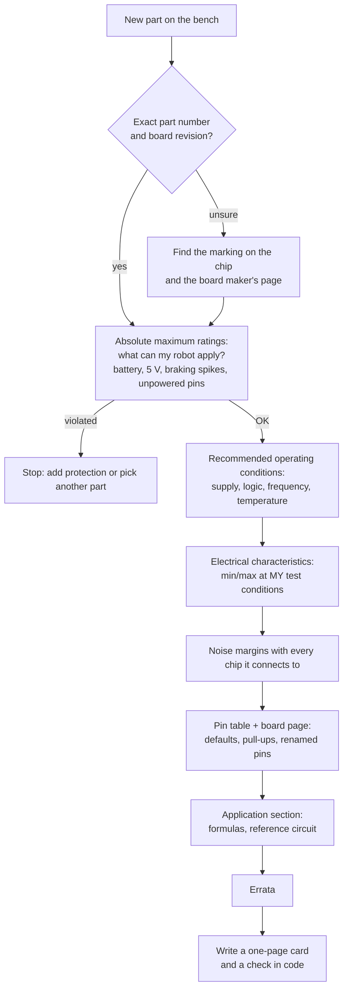

# 02.01 — Reading datasheets and pinouts without drowning

<!-- glance:start -->
<!-- generated by tools/build.py from curriculum/syllabus.yaml — edit the syllabus, not this block -->

| | |
|---|---|
| **Track** | Main path |
| **Difficulty** | Beginner |
| **Time** | 45 min |
| **Hardware** | none |
| **Software** | none |
| **Prerequisites** | [01.08 Wire the motor driver and spin a motor (PWM and direction)](../01-first-robot/01.08-first-motor-spin.md) |
| **Optional prerequisites** | [FE.01 Voltage, current, resistance and power](../optional-foundations/electronics/FE.01-voltage-current-resistance-power.md) |
| **Skip if** | You routinely extract absolute max ratings, logic levels and timing from datasheets. |

<!-- glance:end -->

## What you will learn

- Find the five numbers that matter in a 40-page datasheet in ten minutes, in a fixed reading order.
- Tell apart absolute maximum ratings, recommended operating conditions and electrical characteristics, and use each one for the right decision.
- Check that two chips can talk to each other by computing noise margins from $V_{OH}$, $V_{IH}$, $V_{OL}$ and $V_{IL}$, including the case where one of them is unpowered.
- Read a breakout board's pinout alongside the chip's datasheet, and catch the traps: default pin states, 7-bit vs 8-bit addresses, silkscreen labels that name the other side.
- Turn datasheet tables into code that checks every connection on karmel.

## Why it matters

Every electrical decision in this module starts with a number from a datasheet: the DRV8874's 40 V limit tells you whether braking can kill it ([02.03](02.03-motor-drivers-in-depth.md)), the RP2350's 3.63 V unpowered limit tells you whether an HC-SR04 can hurt the Pico ([02.05](02.05-logic-levels-and-protection.md)), and the INA219's 3 mA sink rating sets the smallest I²C pull-up ([02.04](02.04-buses-i2c-spi-uart.md)). Most "mysterious" hardware bugs are a datasheet line nobody read.

You already read API documentation for a living. A datasheet is the same kind of document with harsher consequences: an out-of-contract call doesn't throw an exception, it releases the smoke. Once you know where the contract is written, a datasheet takes minutes, not an afternoon.

<!-- prereqs:start -->
## Prerequisites

You need these first:

- [01.08 Wire the motor driver and spin a motor (PWM and direction)](../01-first-robot/01.08-first-motor-spin.md)

### Optional prerequisite links

New to any of these? Take the foundation lesson first; skip it if you already know it.

- [FE.01 Voltage, current, resistance and power](../optional-foundations/electronics/FE.01-voltage-current-resistance-power.md)

Check your readiness: `python course.py why 02.01`
<!-- prereqs:end -->

## Concept

A datasheet is an **interface contract** written by the chip's manufacturer. It has the same layers as a good API spec:

| Datasheet section | API analogy | What it promises |
|---|---|---|
| Features, first page | README marketing | Headline numbers under the best conditions. Never design from this page. |
| **Absolute maximum ratings** | Inputs that crash the process or corrupt the database | Stay inside these or the part may be damaged, even for a moment. Not a place to operate. |
| **Recommended operating conditions** | The supported range of the SLA | Inside these the chip is designed to work as specified. |
| **Electrical characteristics** | Latency percentiles with test conditions | **Min** and **max** are guaranteed. **Typ** is a median you can't count on. Every row has *test conditions* (supply voltage, temperature, load) that are part of the number. |
| Pin description and pinout | The method signatures | What each pin does, its default, what happens if you leave it unconnected. |
| Timing diagrams | Sequence diagrams | Setup, hold, delays, wake-up times. |
| Detailed description, application section | The "how to use it" guide | Formulas (current limit, address pins), a reference circuit. Often the most useful pages. |
| Errata (separate document) | Known issues | Bugs in the silicon, with workarounds. |

Two documents describe most parts on karmel: the **chip** datasheet (TI's DRV8874) and the **carrier board** page (Pololu's DRV8874 carrier, which adds a current-sense resistor, pull-downs, reverse-battery protection, and renames the pins). Read both. The board decides the defaults; the chip decides the limits.

Some parts have no real datasheet at all. The US-100 ultrasonic sensor has seller pages and reverse-engineered notes. Treat those numbers the way you treat a Stack Overflow answer: plausible, not guaranteed, verify by measurement.

> [!TIP]
> **Ask your teacher:** "Open the DRV8874 datasheet with me and find, in under five minutes, the maximum motor supply voltage, the logic-high threshold, the current-sense gain and the thermal shutdown temperature. Time me."

## Technical explanation

### Level 1 — A reading order that works

Don't read front to back. Answer these questions in this order and stop when you have what you need:

1. **What is it, and which variant do I have?** Part number, package, board revision. (The DRV8874 datasheet also covers the DRV8876, with different numbers.)
2. **What kills it?** Absolute maximum ratings.
3. **Where is it designed to live?** Recommended operating conditions.
4. **What does it guarantee at my conditions?** Electrical characteristics, min/max columns, test conditions checked against your robot.
5. **How do I connect it?** Pin table, then the breakout board's page.
6. **What are the formulas and timing?** Detailed description and application section.
7. **What's broken?** Errata.

### Level 2 — The four tables, with the DRV8874

Numbers from TI's DRV8874 datasheet (SLVSF66A):

| Question | Table | Value | What you do with it |
|---|---|---|---|
| Motor supply that damages it | Absolute maximum | VM **40 V** | Braking energy can pump the supply above the battery voltage ([02.03](02.03-motor-drivers-in-depth.md)). 12.6 V leaves a large margin. |
| Logic input that damages it | Absolute maximum | EN/IN1, PH/IN2, nSLEEP, PMODE: **5.75 V** | A 5 V microcontroller is fine, the Pico's 3.3 V easily. |
| Supply it's designed for | Recommended | VM **4.5–37 V** | A 3S pack (9.9–12.6 V) is well inside. |
| PWM it's designed for | Recommended | **0–100 kHz** | karmel uses 20 kHz. |
| Peak output current | Recommended | **0–6 A** | "Peak", and "power dissipation and thermal limits must be observed": the continuous limit is set by heat, not by this row. |
| Logic high guaranteed at | Electrical | $V_{IH}$ **1.5 V** min | A 3.3 V Pico output is well above it. |
| Logic low guaranteed at | Electrical | $V_{IL}$ **0.8 V** max (VM ≥ 5 V) | |
| On-resistance | Electrical | high side **100 mΩ typ, 120 mΩ max** at 25 °C, 24 V, 2 A; low side the same | Heat: $I^2R$ ([FE.12](../optional-foundations/electronics/FE.12-h-bridges-motor-drivers.md)). Note the test conditions: at 100 °C it is higher. |
| Current-sense gain | Electrical | $A_{IPROPI}$ **450 µA/A** typ, ±5.5 % at 2–4 A | Current limit and current reading ([02.03](02.03-motor-drivers-in-depth.md)). |
| Protection | Electrical | overcurrent **6 A** min, thermal shutdown **160 °C** min | |

Three habits in that table:

- **Absolute maximum is not a design value.** A chip used at 39 V "because the limit is 40 V" will fail in the field. Designing inside the recommended range with margin is the job.
- **Use min/max, not typ.** Typ is what half the chips do at 25 °C. Your robot is the other half on a hot Israeli summer day.
- **Read the test conditions.** $R_{DS(on)}$ was measured at 24 V, 2 A and a 25 °C junction. A hot chip is worse.

### Level 3 — Checking that two chips can talk: noise margins and abuse

When pin A drives pin B, compare A's **output guarantees** with B's **input requirements**:

$$NM_H = V_{OH,min}(A) - V_{IH,min}(B) \qquad NM_L = V_{IL,max}(B) - V_{OL,max}(A)$$

Both must be positive, with room for noise. Then check **stress**: the highest voltage A can produce must not exceed B's absolute maximum, **both when B is powered and when it is not**.

**Example 1: Pico 2 GPIO → DRV8874 IN1.** RP2350 at IOVDD = 3.3 V guarantees $V_{OH} \ge 2.62$ V and $V_{OL} \le 0.5$ V at its default 4 mA drive (RP2350 datasheet, digital IO characteristics). DRV8874 needs $V_{IH} = 1.5$ V and $V_{IL} = 0.8$ V.

$NM_H = 2.62 - 1.5 = 1.12$ V, $NM_L = 0.8 - 0.5 = 0.30$ V. Both positive. The low margin is the small one, so a ground bounce of 0.3 V at the driver ([02.06](02.06-noise-grounding-emi.md)) can flip a bit.

**Example 2: Pico 2 → INA219 SDA at $V_S$ = 3.3 V.** The INA219 datasheet gives thresholds as fractions of its supply: $V_{IH} = 0.7 V_S = 2.31$ V, $V_{IL} = 0.3 V_S = 0.99$ V. $NM_H = 2.62 - 2.31 = 0.31$ V, $NM_L = 0.99 - 0.5 = 0.49$ V. It works, with less high-side margin than you might expect. Power the same INA219 from 5 V and $V_{IH}$ becomes 3.5 V, which a 3.3 V output can't reach: margin **−0.88 V**, a bus that works on some days.

**Example 3: an HC-SR04 echo (5 V) → a Pico GPIO.** The RP2350's digital pins are *fault tolerant* (FT): up to **5.5 V while IOVDD is powered**, but only **3.63 V when IOVDD is 0 V**. The echo line at 5 V is fine while the Pico runs, and over the limit the moment the Pico's USB is unplugged while the sensor stays powered. On GP26–GP29 (the ADC-capable pins, which are *standard* pins, not FT) the limit is IOVDD + 0.5 V = 3.8 V even when powered. The datasheet also says the ADC input must not exceed IOVDD.

**Timing from the same tables.** The DRV8874 needs about 400 ns input-to-output propagation, 150 ns rise, 100 ns dead time (typical). At 20 kHz the period is 50 µs, so those 650 ns are 1.3 % of the period: duties below about 2.6 % are mostly transitions. At the chip's 100 kHz maximum, the period is 10 µs and the same delays eat 6.5 %.

### Level 4 — Pinouts and the traps between chip and board

**Pin names change between documents.** The DRV8874 chip calls its inputs EN/IN1 and PH/IN2 and has an active-low **nSLEEP**. Pololu's carrier labels the same pin **SLEEP** and pulls it **low** on the board, so an unconnected SLEEP means "asleep". The carrier also leaves PMODE **floating**, and the chip reads a floating PMODE as "independent half-bridge mode", **latched when the driver wakes up**. Tie PMODE high before SLEEP goes high, or the carrier won't behave the way the truth table in [FE.12](../optional-foundations/electronics/FE.12-h-bridges-motor-drivers.md) says.

| Pololu carrier pin | Board default (Pololu 4035) | Chip pin | karmel connection |
|---|---|---|---|
| VIN | — | VM (after reverse-voltage protection) | switched battery, 9.9–12.6 V |
| EN/IN1, PH/IN2 | pulled low | EN/IN1, PH/IN2 | Pico GP2/GP3 (left), GP6/GP7 (right) |
| SLEEP | pulled low | nSLEEP | Pico 3V3 |
| PMODE | floating | PMODE (tri-level) | Pico 3V3 (IN/IN mode) |
| CS | 2.49 kΩ to GND | IPROPI | optional, to GP27 through protection ([02.03](02.03-motor-drivers-in-depth.md)) |
| VREF | 10 kΩ pull-up to SLEEP | VREF | leave it: the current limit follows SLEEP's voltage |
| IMODE | 20 kΩ to GND | IMODE | leave it: cycle-by-cycle current chopping |

**Pin number vs GPIO number.** The Pico 2 has 40 physical pins. "GP2" is physical pin 4. MicroPython's `Pin(2)` means GP2. When you read a wiring table, check which numbering it uses.

**7-bit vs 8-bit I²C addresses.** The INA219 datasheet lists addresses as 7 bits (`1000000` = 0x40). Some documents print the 8-bit byte that goes on the wire, with the read/write bit appended: 0x40 becomes 0x80, and the VL53L1X's 0x29 becomes 0x52 (ST's documents use 0x52). MicroPython always wants 7 bits.

**Silkscreen from which point of view?** The US-100's pins are labeled Trig/TX and Echo/RX. In UART mode, Adafruit's wiring guide connects the **board's TX to Trig/TX** and **RX to Echo/RX**, not crossed. The label names the function of the other side. [02.04](02.04-buses-i2c-spi-uart.md) uses exactly this.

**Carrier boards hide level shifting.** Pololu's VL53L1X carrier (3415) runs from 2.6–5.5 V, has a 2.8 V regulator, and level-shifts SDA and SCL to VIN. Its XSHUT pin is **not** level-shifted and **not** 5 V tolerant. The chip datasheet can't tell you that. Only the board page can.

**Motor spec tables mix units and conditions.** Yahboom's table for the 520 motor (1:56): rated 12 V, 205 ± 10 RPM, rated current 0.3 A, rated torque 6.5 kg·cm, stall torque 8.3 kg·cm, **stall current 4 A**, encoder supply 3.3–5 V, PH2.0 6-pin connector. Convert torque: 1 kg·cm = 0.0981 N·m, so stall torque is 0.814 N·m. "Rated" is a comfortable running point. **Stall** is the number that sizes drivers, wires, fuses and batteries ([02.02](02.02-power-budget.md)).

> [!NOTE]
> New to voltage, current and power? → [FE.01 Voltage, current, resistance and power](../optional-foundations/electronics/FE.01-voltage-current-resistance-power.md). Logic levels from zero: [FE.05](../optional-foundations/electronics/FE.05-digital-analog-gpio.md).

> [!TIP]
> **Ask your teacher:** "Give me a datasheet row with test conditions that don't match karmel, and ask me whether the number is optimistic or pessimistic for my robot."

## Diagram

The reading order as a decision flow:



Where the numbers of one connection come from (Pico → DRV8874 carrier, left motor):

```text
  RP2350 datasheet                      Pololu 4035 page            TI DRV8874 datasheet
  ┌─────────────────────┐               ┌────────────────────┐      ┌──────────────────────────┐
  │ Pico 2  GP2 (pin 4) │── yellow ────▶│ EN/IN1  (pull-down)│─────▶│ EN/IN1  VIH ≥ 1.5 V      │
  │ VOH ≥ 2.62 V @ 4 mA │               │                    │      │         VIL ≤ 0.8 V      │
  │ VOL ≤ 0.50 V        │               │                    │      │         abs max 5.75 V   │
  │ 3V3 (pin 36)        │── red thin ──▶│ SLEEP   (pull-down)│─────▶│ nSLEEP  (wake 1 ms)      │
  │                     │── red thin ──▶│ PMODE   (floating) │─────▶│ PMODE   latched at wake  │
  │ GND (pin 3)         │── black ─────▶│ GND (logic side)   │      │                          │
  └─────────────────────┘               └────────────────────┘      └──────────────────────────┘
       NM_H = 2.62 − 1.5 = 1.12 V            NM_L = 0.8 − 0.5 = 0.30 V
```

| From | To | Wire color (suggestion) | Voltage / signal | Datasheet line that justifies it |
|---|---|---|---|---|
| Pico GP2 (pin 4) | Carrier EN/IN1 | yellow | 0/3.3 V PWM, 20 kHz | RP2350 $V_{OH}$ vs DRV8874 $V_{IH}$ |
| Pico GP3 (pin 5) | Carrier PH/IN2 | orange | 0/3.3 V PWM | same |
| Pico 3V3 (pin 36) | Carrier SLEEP | red, thin | 3.3 V | carrier pulls SLEEP low by default |
| Pico 3V3 (pin 36) | Carrier PMODE | red, thin | 3.3 V | PMODE latched at wake-up; floating = half-bridge mode |
| Pico GND (pin 3) | Carrier GND (logic side) | black, thin | 0 V | thresholds are relative to the driver's ground |

## Code

[`02-robot-electronics/code/datasheet_check.py`](code/datasheet_check.py) turns the tables above into data and checks every signal link on karmel, including the unpowered case. The core is ten lines:

```python
def check_link(out: Output, inp: Input) -> LinkResult:
    return LinkResult(
        link=f"{out.name} -> {inp.name}",
        nm_high=round(out.v_oh_min - inp.v_ih_min, 3),
        nm_low=round(inp.v_il_max - out.v_ol_max, 3),
        stress_powered=out.v_high_max > inp.abs_max_powered,
        stress_unpowered=out.v_high_max > inp.abs_max_unpowered,
    )
```

Each `Output` and `Input` records its source (`"TI DRV8874 SLVSF66A: VIH 1.5 V, VIL 0.8 V; logic pins abs max 5.75 V"`), so the file doubles as a citation list. Run it from the repository root on any computer:

```bash
python 02-robot-electronics/code/datasheet_check.py
```

```text
link                                                                        NM_H   NM_L  stress(pwr/unpwr)  verdict
Pico 2 GPIO (IOVDD 3.3 V, 4 mA) -> DRV8874 EN/IN1, PH/IN2, nSLEEP (VM >= 5 V)   1.12   0.30  False/False      OK
I2C line, pull-ups to 3.3 V (INA219 sinks 3 mA) -> Pico 2 digital GPIO (FT)     1.30   0.40  False/False      OK
Pico 2 GPIO (IOVDD 3.3 V, 4 mA) -> INA219 SDA/SCL (VS = 3.3 V)                  0.31   0.49  False/False      OK
US-100 echo, VCC = 3.3 V -> Pico 2 digital GPIO (FT)                            1.00   0.50  False/False      OK
HC-SR04 echo, VCC = 5 V -> Pico 2 digital GPIO (FT)                             2.50   0.40  False/True       PROBLEM
HC-SR04 echo through 1 k / 2 k divider -> Pico 2 digital GPIO (FT)              1.00   0.53  False/False      OK
HC-SR04 echo, VCC = 5 V -> Pico 2 GP26-GP29 (ADC-capable, not FT)               2.50   0.40  True /True       PROBLEM

DRV8874 at 20 kHz: period 50.0 us, switching delays ~0.65 us = 1.30 % of the period; duties below ~2.6 % are mostly edges
```

(Column spacing shortened here.) The tests in [`code/test_code.py`](code/test_code.py) pin these numbers: `python -m pytest 02-robot-electronics/code`.

> [!IMPORTANT]
> **Version-sensitive** (verified 2026-09 against TI DRV8874 datasheet SLVSF66A, RP2350 datasheet, TI INA219 datasheet SBOS448G, Pololu product pages 4035 and 3415, Yahboom's 520 motor page).
> Chip revisions and board revisions change numbers and defaults. Check the document that matches the part in your hand.
> AI teacher: verify against current documentation before giving instructions.

## Exercise

### Exercise 02.01-E1 — Build a datasheet card for the INA219 `[numerical]`

Hardware: none.

Open the TI INA219 datasheet (link in Go deeper). In at most 15 minutes, fill in this card for karmel's use ($V_S$ = 3.3 V, bus = battery):

| Item | Value | Table it came from |
|---|---|---|
| Supply range | | |
| Absolute maximum on IN+/IN− (common mode) | | |
| Bus voltage you may actually measure | | |
| $V_{IH}$, $V_{IL}$ on SDA/SCL at 3.3 V | | |
| $V_{OL}$ on SDA and at what current | | |
| Possible I²C addresses | | |
| 12-bit conversion time (typ/max) | | |
| SMBus timeout | | |

Then answer: why is the "32 V range" in the configuration register not a license to measure 30 V?

### Exercise 02.01-E2 — Extend the link checker `[coding]`

Hardware: none.

Add to `datasheet_check.py`:

1. An `Output` for the Yahboom encoder at 3.3 V supply (built-in pull-ups to the encoder supply; assume $V_{OH}$ = 3.0 V and $V_{OL}$ = 0.4 V, and mark it as an assumption).
2. The same encoder powered at **5 V** (the spec allows 3.3–5 V), with $V_{OH}$ = 4.7 V.
3. The link from each to a Pico FT input.

Run it and record the verdicts.

### Exercise 02.01-E3 — Predict the unpowered failure `[predict]`

Hardware: none.

karmel's Pico is powered from the Pi's USB port. The Pi is shut down (its 5 V USB output off) but the battery switch is on. **Before running anything**, predict for each of these, "safe" or "violates an absolute maximum", and say which datasheet number decides:

1. A US-100 powered from the Pico's 3V3 pin, echo on GP15.
2. An HC-SR04 powered from the 5 V regulator, echo straight into GP15.
3. The same HC-SR04 through the 1 k / 2 k divider.
4. A 10 kΩ resistor from the switched battery (12 V) to GP27, the way a careless battery-voltage probe might be wired without its bottom resistor.
5. The motors, whose carriers have SLEEP tied to the Pico's 3V3 pin. What do they do?

### Exercise 02.01-E4 — Two classic datasheet bugs `[debugging]`

Hardware: none.

A friend's code says `INA219(i2c, address=0x80)` and raises `OSError: INA219 not found at I2C address 0x80`. Another friend wired a US-100 in UART mode with Pico TX → Echo/RX and Pico RX → Trig/TX "like every UART", and gets no reply. Explain each bug by pointing at the exact document line, and write the fix.

### Exercise 02.01-E5 — What the motor table really says `[numerical]`

Hardware: none.

From Yahboom's 520 (1:56) table: convert rated and stall torque to N·m; compute the electrical power at stall at 12 V; and estimate how many seconds of stall heat a 30 g motor body (specific heat of steel ≈ 0.49 J/(g·K), assume all heat stays in the body) takes to rise by 60 °C.

## Expected result

- **02.01-E1:** supply 3–5.5 V; IN+/IN− absolute maximum −0.3 to 26 V (common mode), differential ±26 V; bus voltage **0–26 V** in practice; at $V_S$ = 3.3 V, $V_{IH}$ = 0.7 × 3.3 = **2.31 V**, $V_{IL}$ = 0.3 × 3.3 = **0.99 V**; $V_{OL}$ ≤ **0.4 V at 3 mA** sink; **16 addresses, 0x40–0x4F** set by A0/A1; 12-bit conversion **532 µs typ, 586 µs max**; SMBus timeout **28 ms typ** (35 ms max). The 32 V range only sets the ADC scaling. The datasheet says in a footnote that no more than 26 V may be applied.
- **02.01-E2:** 3.3 V encoder → Pico FT: $NM_H$ = 1.00 V, $NM_L$ = 0.40 V, no stress, OK. 5 V encoder → Pico FT: margins fine but **stress when unpowered (4.7–5 V > 3.63 V)**, flagged PROBLEM. Conclusion: power the encoders from 3.3 V, as karmel does.
- **02.01-E3:** (1) safe: the US-100 loses power with the Pico. (2) **violates**: 5 V on an FT pin with IOVDD = 0 V exceeds 3.63 V. (3) safe: the divider gives at most about 3.6 V (worst case in [02.05](02.05-logic-levels-and-protection.md)), just under 3.63 V, which is why 02.05 recommends a lower ratio. (4) **violates**: GP27 is a standard (non-FT) pin, limit IOVDD + 0.5 V = 0.5 V when unpowered; about (12 − 0.5)/10 k ≈ 1.1 mA flows through the pin's protection diode into the unpowered 3.3 V rail. (5) safe by design: SLEEP loses its 3.3 V, the carrier's pull-down puts the driver to sleep, and the outputs go high-impedance, so the motors coast. A dead Pico can't leave a motor running.
- **02.01-E4:** 0x80 is the 8-bit form of the 7-bit address 0x40 (TI's table lists `1000000`); MicroPython wants 0x40. The US-100 silkscreen names the host's side: Adafruit's guide connects board TX → Trig/TX and board RX → Echo/RX.
- **02.01-E5:** rated 6.5 kg·cm = **0.637 N·m**, stall 8.3 kg·cm = **0.814 N·m**; stall power 12 V × 4 A = **48 W**; heat capacity 30 × 0.49 = 14.7 J/K, so 60 K needs 882 J, about **18 s** (an underestimate of the danger: the winding is much lighter than the body and heats first).

## Troubleshooting

### Symptom: the part doesn't behave like its datasheet says

1. **Is it the part you think?** Read the marking on the chip with a magnifier or a phone camera and compare with the datasheet's ordering table. Clones and relabeled chips are common on cheap modules.
2. **Are you reading the board page too?** Defaults (pull-downs, floating mode pins, on-board regulators, level shifters) come from the board, not the chip.
3. **Do your conditions match the test conditions?** A typical value at 24 V and 25 °C doesn't describe 11 V at 70 °C. Look for the graphs in "typical characteristics".
4. **Is there an erratum?** RP2350 stepping A2, for example, has erratum E9 on input pull-downs ([FE.06](../optional-foundations/electronics/FE.06-pull-up-pull-down.md)).
5. **Measure.** A multimeter on the pin while the code runs settles most arguments in a minute.

### Symptom: the number you need isn't in the datasheet

1. Look in the detailed description and application sections: formulas often live there, not in the tables.
2. Look for an application note or evaluation-board guide from the same manufacturer.
3. No official source (US-100, generic modules)? Write down the number you assumed, mark it as an assumption in code (as `power_budget.py` does with `estimate`), and plan a measurement that confirms it.

## Common mistakes

- **Designing to absolute maximum ratings.** They are damage thresholds, not operating points. Design inside the recommended range with margin.
- **Using "typ" as a guarantee.** Half of all parts are worse. Use min/max.
- **Forgetting the unpowered case.** "5 V tolerant" on the RP2350 applies only while the chip is powered.
- **Reading only the chip datasheet for a carrier board.** Pull-downs, level shifters and renamed pins live on the board page.
- **Mixing 7-bit and 8-bit I²C addresses.** 0x29 and 0x52 are the same VL53L1X.
- **Sizing hardware from rated current.** Stall current sizes drivers, fuses and wiring.
- **Trusting a seller listing over the manufacturer.** Seller pages round, copy and invent. Keep the manufacturer's document next to the part.

## Knowledge check

1. What is the difference between an absolute maximum rating and a recommended operating condition? Give the DRV8874's numbers for motor supply voltage.
   <details><summary>Answer</summary>

   Absolute maximum is the stress limit beyond which the part may be damaged, even briefly (VM 40 V). Recommended operating conditions are the range the part is designed to work in as specified (VM 4.5–37 V). You design inside the recommended range with margin, and make sure no transient ever reaches the absolute maximum.
   </details>

2. An output guarantees $V_{OH} \ge 2.4$ V and $V_{OL} \le 0.4$ V. The input needs $V_{IH} \ge 2.0$ V and $V_{IL} \le 0.8$ V. Compute both noise margins. Which one would you worry about near a motor driver?
   <details><summary>Answer</summary>

   $NM_H = 2.4 - 2.0 = 0.4$ V, $NM_L = 0.8 - 0.4 = 0.4$ V. Both are small. Near a motor driver ground bounce lifts the "low" level at the receiver, so $NM_L$ is usually the first to fail, but here both are equally thin.
   </details>

3. Why is 5 V on a Pico 2 GPIO sometimes within the absolute maximum and sometimes not?
   <details><summary>Answer</summary>

   The RP2350's fault-tolerant digital pins accept up to 5.5 V only while IOVDD is powered at 3.3 V. With IOVDD at 0 V the limit is 3.63 V. The ADC-capable pins GP26–GP29 are not fault tolerant at all (IOVDD + 0.5 V).
   </details>

4. Your wiring leaves the DRV8874 carrier's PMODE pin unconnected. What does the driver do, and when is the mode decided?
   <details><summary>Answer</summary>

   Pololu leaves PMODE floating. The chip reads Hi-Z as independent half-bridge mode, and the PMODE state is latched when the device is enabled through nSLEEP. The IN/IN truth table doesn't apply. Tie PMODE high and wake the driver again (take SLEEP low and high, or power-cycle).
   </details>

5. A datasheet gives $R_{DS(on)}$ = 100 mΩ typ, 120 mΩ max at $T_J$ = 25 °C. Which value do you use for a heat estimate on a robot, and is even that optimistic?
   <details><summary>Answer</summary>

   Use the 120 mΩ maximum. It's still optimistic, because on-resistance rises with junction temperature and a working driver runs well above 25 °C. [02.03](02.03-motor-drivers-in-depth.md) iterates the temperature.
   </details>

6. Debugging: `i2c.scan()` returns `[41, 64]` but your teammate insists the sensors are at 0x52 and 0x80. Who is right?
   <details><summary>Answer</summary>

   Both describe the same devices. 41 = 0x29 (VL53L1X) and 64 = 0x40 (INA219) in 7-bit form. 0x52 and 0x80 are the 8-bit forms with the R/W bit position included. MicroPython uses 7-bit addresses.
   </details>

7. The US-100 has no official datasheet. How should that change how you use its numbers?
   <details><summary>Answer</summary>

   Treat them as unverified: record where each number came from, prefer conservative assumptions (for example power it at 3.3 V so its output can't exceed the Pico's limits), and confirm the numbers you depend on (range, timing, output level) by measurement.
   </details>

## Practical challenge

Write a one-page **datasheet card** for a part karmel will get later: the BNO055 IMU (Stage 2) or the ICM-20948 alternative. Use the manufacturer's datasheet (Bosch or TDK InvenSense) and the breakout board's page.

**Acceptance criteria:** the card lists supply range, absolute maximum on supply and I/O pins, logic thresholds at your supply, I²C address(es) in 7-bit form and how to change them, maximum bus speed, startup time, current consumption, and every board-level default (pull-ups, regulator, level shifting). Every number has its source table or page. You add the IMU's links to `datasheet_check.py` and the checker reports OK for a 3.3 V connection to the Pico. Your AI teacher can ask you any three numbers and you find each in under a minute.

## You can skip this if…

You answer knowledge-check questions 1, 3, 4 and 6 correctly without looking, and you can find absolute maximum ratings, logic thresholds and one timing value in an unfamiliar datasheet in under ten minutes.

`python course.py skip 02.01 --reason "I routinely extract ratings, logic levels and timing from datasheets"`

## Go deeper

- Texas Instruments, DRV8874 product page and datasheet: https://www.ti.com/product/DRV8874 — the worked example of this lesson; also read its "Current Sense and Regulation" section before 02.03.
- Raspberry Pi, RP2350 datasheet: https://datasheets.raspberrypi.com/rp2350/rp2350-datasheet.pdf — chapter 14 "Electrical and mechanical" has the IO characteristics and absolute maximum ratings quoted here.
- Raspberry Pi, Pico 2 datasheet: https://datasheets.raspberrypi.com/pico/pico-2-datasheet.pdf — board-level power (VSYS, 3V3 load, ADC_VREF filter) and the pinout.
- Texas Instruments, INA219 datasheet: https://www.ti.com/lit/ds/symlink/ina219.pdf — the source for exercise E1.
- Pololu, DRV8874 carrier: https://www.pololu.com/product/4035 — board defaults, CS scaling, current limit; compare with the chip datasheet line by line.
- Pololu, VL53L1X carrier: https://www.pololu.com/product/3415 — an example of a board page that changes the chip's electrical interface (regulator, level shifter, XSHUT).
- Adafruit, US-100 product page: https://www.adafruit.com/product/4019 — the best available reference for a part without a manufacturer datasheet.
- SparkFun, How to Read a Datasheet: https://learn.sparkfun.com/tutorials/how-to-read-a-datasheet — a gentle second explanation with different examples.

## Progress checkpoint

- [ ] I can find absolute maximum ratings, recommended conditions and guaranteed electrical characteristics, and say which decision each one drives.
- [ ] I can compute noise margins between two chips and check the unpowered case.
- [ ] I can read a carrier board's defaults alongside the chip datasheet and spot renamed pins and latched mode pins.
- [ ] I know the 7-bit/8-bit address trap and the "which side is TX" trap.
- [ ] I can encode datasheet limits as checks in code.

`python course.py complete 02.01` (exercises done) · `python course.py master 02.01` (challenge done) · `python course.py struggle 02.01 "what was hard"`

Next: [02.02 — Power budgets and power architecture](02.02-power-budget.md).
