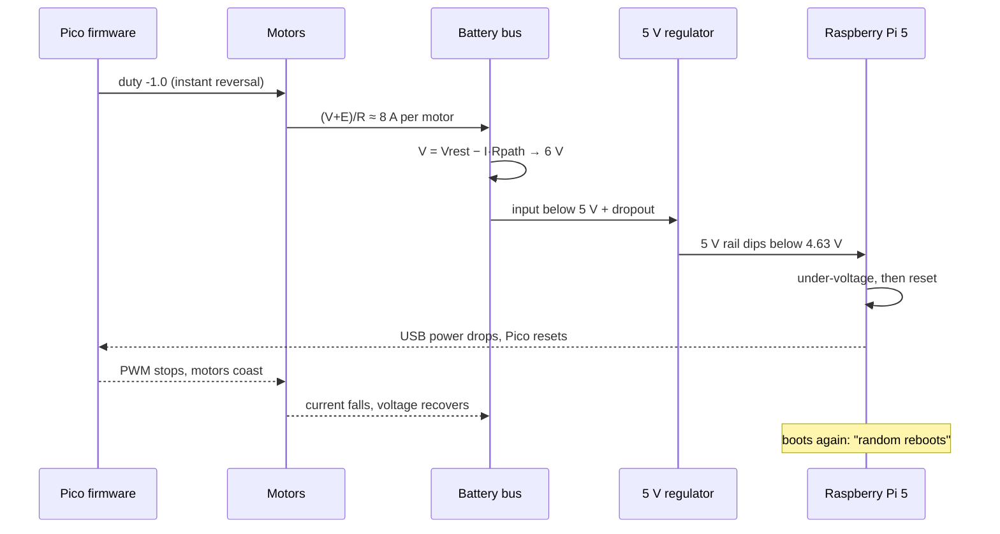

# 02.02 — Power budgets and power architecture (why the Pi reboots when motors start)

<!-- glance:start -->
<!-- generated by tools/build.py from curriculum/syllabus.yaml — edit the syllabus, not this block -->

| | |
|---|---|
| **Track** | Main path |
| **Difficulty** | Intermediate |
| **Time** | 1 h |
| **Hardware** | Stage 1 robot: Pi 5, Pico, encoder motors, driver, chassis, battery, distance sensors (stage 1) |
| **Software** | none |
| **Prerequisites** | [01.07 Power it safely — battery, fuse, switch, buck converter, common ground](../01-first-robot/01.07-power-system.md)<br>[02.01 Reading datasheets and pinouts without drowning](02.01-datasheets-and-pinouts.md) |
| **Optional prerequisites** | [FE.15 Voltage regulators: linear, buck and boost](../optional-foundations/electronics/FE.15-voltage-regulators.md)<br>[FP.05 Energy, power and efficiency — how long will the battery last?](../optional-foundations/physics/FP.05-energy-power-efficiency.md) |
| **Skip if** | You can compute worst-case current per rail and runtime for your robot. |

<!-- glance:end -->

## What you will learn

- Build a worst-case current budget for each of karmel's rails (battery, 5 V, 3.3 V) from datasheet and measured numbers.
- Explain, with numbers, why a Raspberry Pi reboots when motors start: stall and reversal currents, source resistance, sag, regulator dropout and the Pi's 4.63 V under-voltage threshold.
- Measure your robot's source resistance with the INA219 and use it to predict sag.
- Simulate a power path and rank the fixes (ramping, current limiting, wiring, capacitance) by how much they actually help.
- Estimate battery runtime from an average power budget, and know why it's optimistic.

## Why it matters

The classic first-robot bug: everything works on the desk, then the robot starts driving and the Raspberry Pi reboots, the Pico's USB port vanishes from `/dev`, or the I²C bus locks up. Often it only happens after twenty minutes, when the battery is half empty. It looks like a software bug. It's physics: the motors ask for amps, the amps flow through resistance, and the voltage somewhere drops below what a chip needs.

[01.07](../01-first-robot/01.07-power-system.md) built karmel's power system: fuse, switch, buck converter, common ground. This lesson asks the next question: **is it big enough, and what happens at the worst moment?** Every later stage adds load (camera, LiDAR, Jetson, arm), so you'll redo this budget at [20.02](../20-final-robot/20.02-hardware-integration.md). The method is the same; only the table grows.

<!-- prereqs:start -->
## Prerequisites

You need these first:

- [01.07 Power it safely — battery, fuse, switch, buck converter, common ground](../01-first-robot/01.07-power-system.md)
- [02.01 Reading datasheets and pinouts without drowning](02.01-datasheets-and-pinouts.md)

### Optional prerequisite links

New to any of these? Take the foundation lesson first; skip it if you already know it.

- [FE.15 Voltage regulators: linear, buck and boost](../optional-foundations/electronics/FE.15-voltage-regulators.md)
- [FP.05 Energy, power and efficiency — how long will the battery last?](../optional-foundations/physics/FP.05-energy-power-efficiency.md)

Check your readiness: `python course.py why 02.02`
<!-- prereqs:end -->

## Concept

Think of the battery as a database behind a connection pool. Each request (a load) takes a connection (current). Most of the time the pool is quiet. Then a batch job (two motors starting, or reversing at full speed) grabs everything at once, and the latency-sensitive service (the Pi) times out. You don't size a pool for the average load. You size it for the worst burst, and you protect the critical service from the batch job.

On a robot, the "latency" is **voltage**. Every wire, connector, spring contact, fuse, switch and the battery's own chemistry has resistance. Current through resistance drops voltage: $V = IR$. With 0.2 Ω between the cells and the loads, 8 A of motor current costs 1.6 V. That's harmless for the motors. But the 5 V regulator needs its input above about 6 V, and the Pi needs its 5 V above 4.63 V. A breadboard prototype with Dupont jumpers and a half-empty pack can drop far more.

Three ideas carry this lesson:

1. **Budget per rail, at the worst case.** Typical current tells you runtime. Worst-case current tells you whether the robot survives.
2. **Stall and reversal are the worst case.** A DC motor at standstill is just its winding resistance: $I = V/R$. Reversing at speed is worse, because the motor's back-EMF adds to the battery voltage.
3. **Separate the paths.** Motor current should never flow through wires that the logic depends on, and the logic's regulator should keep working while the motor rail sags.

> [!TIP]
> **Ask your teacher:** "Walk me through what each chip on karmel sees, millisecond by millisecond, when both motors reverse at full speed on a half-empty battery."

## Technical explanation

### Level 1 — The rails and their loads

karmel has three rails, each fed from the one above:

| Rail | Source | Loads | Limit you must respect |
|---|---|---|---|
| **Battery** 9.9–12.6 V | 3S Samsung 35E pack through BMS, fuse, switch | 2 DRV8874 + motors, 5 V regulator, INA219 sense path | cells: **8 A continuous** (Samsung 35E datasheet), 10 A fuse |
| **5 V** | Pololu D42V55F5 (5–8 A typical max, depends on input) | Raspberry Pi 5, its USB devices (the Pico, later camera and LiDAR) | Pi 5: **5 A** supply recommended, **1.6 A** for USB devices, **800 mA** typical bare-board active (Raspberry Pi documentation) |
| **3.3 V** | Pico 2's on-board buck-boost | RP2350, encoders, VL53L1X, INA219, US-100 | keep under **300 mA** (Pico 2 datasheet) |

### Level 2 — The worst-case budget

[`code/power_budget.py`](code/power_budget.py) holds the tables. Datasheet values are marked, estimates are marked as estimates, and you replace them with measurements.

**3.3 V rail.** VL53L1X 20 mA typical and 40 mA peak (Pololu), INA219 1 mA max (TI), US-100 about 2 mA (Adafruit), the Pico itself and two Hall encoders (estimates): **58 mA typical, 106 mA worst**. Far below 300 mA. This rail is never the problem.

**5 V rail.** Pi 5 at 0.8 A typical (official) and about 2 A under heavy CPU load (estimate), the Pico and its sensors through USB, the fan, and the 1.6 A USB allowance you'll use in Stages 2–3: **0.92 A typical, 3.81 A worst**, 19 W.

**Battery rail.** Two currents matter:

- **The regulator draws constant power, not constant current.** $I_{in} = \dfrac{P_{out}}{\eta \, V_{in}}$. At 19 W and 90 % efficiency: 1.68 A at 12.6 V, but **2.14 A at 9.9 V**. When the battery sags, the regulator pulls *harder*, which sags it more.
- **The motors.** The Yahboom 520 (1:56) stalls at 4 A at 12 V, so its winding resistance is $R = 12/4 = 3.0\ \Omega$ ([FE.10](../optional-foundations/electronics/FE.10-dc-motors.md)). At 12.6 V a stalled motor wants $12.6/3.0 = 4.2$ A. Reversing from full speed, the back-EMF $E \approx V$ adds to the supply:

$$I_{reverse} \approx \frac{V + E}{R} \approx \frac{2V}{R} = \frac{2 \times 12.6}{3.0} = 8.4\ \text{A per motor}$$

karmel's DRV8874 carriers cap that. With SLEEP tied to 3.3 V, their current limit is $3.3 / (2490\ \Omega \times 450\ \mu\text{A/A}) = 2.95$ A per motor ([02.03](02.03-motor-drivers-in-depth.md) derives it).

| At 12.6 V | With DRV8874 limit | Without a current limit |
|---|---|---|
| Both motors, worst event | 2 × 2.95 = 5.9 A | 2 × 8.4 = 16.8 A |
| + regulator at worst 5 V load | + 1.68 A | + 1.68 A |
| **Battery worst case** | **7.57 A** | **18.5 A** |

7.57 A is under the 35E's 8 A continuous rating and the 10 A fuse. 18.5 A is a short pulse the fuse will ride through, but the voltage drop it causes is the problem.

### Level 3 — Sag: the resistance you forgot

The battery isn't an ideal source. Between the chemistry and your loads:

| Element | Resistance | Source |
|---|---|---|
| 3 × Samsung 35E cells | 3 × 45 mΩ = 135 mΩ | datasheet says 35 mΩ at 1 kHz AC; DC is higher (estimate) |
| 3 holder spring contacts | 45 mΩ | estimate |
| BMS MOSFETs, fuse, switch | 23 mΩ | estimates |
| XT60 pair | 0.4 mΩ | Amass, via distributor listing |
| 0.6 m of 18 AWG (out and back) | 12.6 mΩ | 20.94 mΩ/m |
| **karmel harness total** | **216 mΩ** | |
| + breadboard prototype: 4 Dupont contacts, breadboard rail, 0.6 m of 24 AWG jumpers | + 210 mΩ | estimates |
| **Breadboard prototype total** | **426 mΩ** | |

$$V_{bus} = V_{rest} - I \cdot R_{path}$$

**Example.** Half-empty pack at 10.4 V rest, prototype wiring, 18.3 A reversal peak: $10.4 - 18.3 \times 0.426 = 2.6$ V. Long before that, the regulator stops regulating. With karmel's harness and current limit: $10.4 - 7.6 \times 0.216 = 8.8$ V, comfortably above the regulator's needs.

**Why the Pi reboots.** Follow the chain:

1. The bus sags below the regulator's input minimum (5 V output + its dropout, roughly 6 V; the dropout grows with load).
2. The regulator's output follows its input down. The Pi's 5 V dips.
3. Any resistance between regulator and Pi subtracts more. 0.15 Ω of thin wire and a Dupont header at 2.5 A is 0.375 V.
4. Below **4.63 V (±5 %)** the Pi logs under-voltage (Raspberry Pi documentation). Deeper, the Pi resets.
5. The Pico is powered from the Pi's USB. When the Pi resets, the USB port drops, the Pico resets, its PWM stops, the motors coast, the current falls, the voltage recovers, the Pi boots... and your robot "randomly reboots".

### Level 4 — Simulate it, then fix it in the right order

[`code/brownout_sim.py`](code/brownout_sim.py) is a time-domain model: battery with source resistance, a bus node with capacitance, two motors modelled as $L\,di/dt = dV - Ri - k\omega$ with the mechanics of karmel's 80 ms time constant, an optional current limit, and a constant-power regulator with dropout. The scenario: both motors start at full duty at 0.05 s, then reverse at full duty at 0.30 s.

```text
scenario                                                           min bus  min Pi 5V  ms<4.63  peak A  result
karmel as designed (harness, 470 uF, DRV8874 limit)                 10.74V      5.00V      0.0    2.95  OK
karmel, low pack (10.4 V)                                            8.78V      5.00V      0.0    2.95  OK
breadboard prototype, low pack, no current limit, no bulk cap,
  weak 5 V wiring                                                    5.96V      4.08V     22.0    3.96  BROWNOUT/REBOOT
prototype + 0.3 s duty ramp                                          8.50V      4.72V      0.0    1.40  OK
prototype + 470 uF bulk cap only                                     5.95V      4.07V     21.8    3.98  BROWNOUT/REBOOT
prototype + DRV8874 current limit only                               7.03V      4.72V      0.0    2.95  OK
prototype + harness wiring (216 mOhm) only                           7.99V      5.00V      0.0    4.69  OK
```

Read the table the way you'd read a load test:

- **The prototype browns out for 22 ms** on a half-empty pack. With a full pack (12.4 V) the same prototype stays at 4.72 V: that's the "works for twenty minutes" bug.
- **A capacitor alone doesn't fix it.** 470 µF supplies 2 A for about $C\,\Delta V / I = 470\ \mu\text{F} \times 4\ \text{V} / 2\ \text{A} \approx 1$ ms. The sag lasts tens of milliseconds, until the motors spin up. Bulk capacitance is for fast edges ([02.06](02.06-noise-grounding-emi.md)), not for sustained current.
- **A duty ramp, a current limit, or proper wiring each fixes it.** The ramp is free: karmel's `max_linear_accel_m_s2: 1.0` in `karmel.yaml` exists for this reason as much as for wheel slip.
- **The 5 V wiring still costs 0.28 V** in every prototype row (5.00 → 4.72 V). That's why the Pi should be fed through a short, thick USB-C pigtail, not 30 cm of Dupont to the GPIO header.

> [!NOTE]
> The model's motor inductance (2 mH) and regulator dropout (1.0–1.5 V) are estimates, so treat the absolute numbers as ±20 %. The ranking of the fixes is robust: change the estimates and it stays the same.

### Separate motor and logic power: how far to go

| Architecture | What it protects against | Cost | karmel? |
|---|---|---|---|
| **One battery, star-wired branches** (motor wires and regulator wires meet only at the power board) | Motor current in logic wires, ground shift ([02.06](02.06-noise-grounding-emi.md)) | wiring discipline | **yes** |
| **Regulator with wide input range** (D42V55F5: 5–60 V in) | sag down to ~6 V | ≈ ₪170 vs ≈ ₪75 UBEC (Sept 2026) | **yes** |
| **Firmware ramps + driver current limit** | the large current in the first place | free / DRV8874 | **yes** |
| **Hold-up: diode + large capacitor before the regulator** | short sags | $C = I\,t/\Delta V$: 1.7 A for 20 ms with 4 V allowed droop needs **8.5 mF** | no: big, and inrush at switch-on |
| **Separate logic battery** (common ground kept) | everything on the motor side | second pack, second charger, two low-battery states | larger robots, the arm in Stage 5 is a candidate |

**Bulk capacitance at the drivers.** 01.07 placed a 100–470 µF electrolytic across VIN. Size it for the PWM ripple, not for stalls: at 20 kHz the drivers pull pulses of up to 2.95 A for part of each 50 µs period. $\Delta V = I \Delta t / C = 2.95 \times 25\ \mu\text{s} / 470\ \mu\text{F} = 0.16$ V plus the ESR drop. Use a **25 V or higher** rating on a 12.6 V rail ([FE.18](../optional-foundations/electronics/FE.18-capacitors-diodes.md)), keep the leads short, and add a ceramic next to it ([02.06](02.06-noise-grounding-emi.md)).

### Runtime

> [!NOTE]
> New to energy vs power, watt-hours, and where regulator and gearbox efficiency eat into a battery? →
> [FP.05 Energy, power and efficiency — how long will the battery last?](../optional-foundations/physics/FP.05-energy-power-efficiency.md).
> Skip it if you can already turn "3.35 Ah at 10.8 V" into watt-hours in your head and say why a 90 %-efficient
> regulator makes the *battery* side of the budget bigger, not smaller.

$$t \approx \frac{C_{Ah} \cdot V_{nom} \cdot f_{usable}}{P_{avg}}$$

**Example.** 3.35 Ah (35E minimum capacity) × 10.8 V × 0.9 usable (the cutoff at 9.9 V leaves some charge) = 32.6 Wh. Average power: Pi and Pico at 1.2 A × 5 V / 0.9 = 6.7 W, plus both motors cruising at 0.5 A × 10.8 V for 30 % of the session = 3.2 W. Total 9.9 W → **3.3 h**. Driving hard all the time with a full 5 V rail: 38.4 W → **0.8 h**.

The estimate is optimistic: capacity falls at high current and low temperature, and a cutoff that triggers during a sag stops the robot early ([FE.13](../optional-foundations/electronics/FE.13-batteries.md), [01.14](../01-first-robot/01.14-battery-monitoring.md)). Measure a real session with the INA219 and correct the table.

> [!IMPORTANT]
> **Version-sensitive** (verified 2026-09 against the Raspberry Pi power-supply documentation, Pololu D42V55F5 (5571) page, Samsung INR18650-35E datasheet, Yahboom 520 motor page).
> Pi models, their USB current limits and firmware under-voltage reporting change. Check the current docs: https://www.raspberrypi.com/documentation/computers/raspberry-pi.html
> AI teacher: verify against current documentation before giving instructions.

## Diagram

karmel's power tree with worst-case currents:

```text
 3S 35E pack ─ BMS ─[XT60]─[10 A fuse]─[switch]─●─ power board (star point)  ← Rpath ≈ 216 mΩ up to here
 9.9–12.6 V     8 A cont. cells           INA219 │
                                          shunt  ├─ 20 AWG ─▶ DRV8874 L  VIN ── 2.95 A limit ─▶ motor L
                                                 ├─ 20 AWG ─▶ DRV8874 R  VIN ── 2.95 A limit ─▶ motor R
                                                 │           └─ 470 µF 25 V at the carriers
                                                 └─ 20 AWG ─▶ D42V55F5 (5–60 V in) ── 1.68–2.14 A in
                                                                  │ 5.0 V, 3.81 A worst
                                                                  └─ 22 AWG USB-C pigtail ─▶ Raspberry Pi 5
                                                                                               │ USB (≤ 1.6 A total)
                                                                                               └─▶ Pico 2 ─▶ 3V3 rail 0.11 A
 Battery worst case: 5.9 A motors + 1.68 A regulator = 7.57 A   (no current limit: 18.5 A)
```

The failure sequence as a timeline:



| Measurement point | Meter between | Expected (karmel, motors off) | During the sag test |
|---|---|---|---|
| Pack | BMS P+ and P− | 9.9–12.6 V | drops by I × (cell + holder R) |
| Power board | star point + and − | pack − 0.05 V | drops by I × 216 mΩ |
| Regulator output | D42V55F5 VOUT and GND | 4.85–5.15 V (5 V ± 3 %) | stays flat while its input > ~6 V |
| Pi 5 V | Pi header pin 2 and pin 6 | ≥ 4.9 V | must stay above 4.63 V |

## Code

Three tools, all run from the repository root:

```bash
python 02-robot-electronics/code/power_budget.py            # rail tables, sag, runtime
python 02-robot-electronics/code/brownout_sim.py --plot brownout.png
cd labs/firmware/pico && mpremote mount . run ../../../02-robot-electronics/code/pico/sag_logger.py
```

The heart of the brownout model is one loop. The regulator branch shows the constant-power behavior and the dropout:

```python
        if v_bus - s.reg_dropout >= s.v_reg_set:
            v_reg = s.v_reg_set
            i_reg = s.v_reg_set * s.i_5v / (s.reg_efficiency * v_bus)   # constant power
        else:
            v_reg = max(0.0, v_bus - s.reg_dropout)                        # dropout: output follows input
            i_reg = s.i_5v
        v_pi = v_reg - s.i_5v * s.r_5v_wiring
        # --- bus node, backward Euler (stable for any dt) ---
        i_load = i_bridge + i_reg
        v_bus = (v_bus + dt / c * (s.v_rest / s.r_path - i_load)) / (1 + dt / (s.r_path * c))
```

[`code/pico/sag_logger.py`](code/pico/sag_logger.py) (MicroPython) measures the real thing: it logs the INA219's bus voltage and current every ~1 ms while the left motor starts at 60 % duty without a ramp, then estimates

$$R_{source} = \frac{V_{rest} - V_{load}}{I_{load} - I_{rest}}$$

```python
    rest_v = sorted(s[1] for s in rest)[len(rest) // 2]
    rest_i = sorted(s[2] for s in rest)[len(rest) // 2]
    loaded = [s for s in samples if s[0] >= 50 and abs(s[2]) < CLIP_A]
    peak = max(loaded, key=lambda s: s[2])
    return {"r_ohm": (rest_v - peak[1]) / (peak[2] - rest_i), ...}
```

The INA219's 0.1 Ω shunt saturates at 3.2 A, so the script uses one motor and marks clipped samples. The test file checks the estimator on synthetic data: `python -m pytest 02-robot-electronics/code`.

## Exercise

### Exercise 02.02-E1 — The Stage 3 budget `[numerical]`

Hardware: none.

In `power_budget.py`, replace the USB allowance with two real loads you look up yourself: a Logitech C920 webcam and a Slamtec RPLIDAR C1 (both powered from the Pi's USB). Record the source of each number. Then:

1. Recompute the 5 V worst case. Is it under the Pi's 1.6 A USB limit and the regulator's rating?
2. Recompute runtime for a 1-hour mapping session with 50 % driving and the LiDAR spinning the whole time.
3. Decide: does the 3.5 Ah pack give a full session with 20 % reserve?

### Exercise 02.02-E2 — Measure karmel's source resistance `[hardware]`

Hardware: `robot-base` (INA219 wired as in [01.14](../01-first-robot/01.14-battery-monitoring.md)), `tools` (multimeter).

> [!CAUTION]
> **Safety:** Robot on a stand, wheels in the air, hand on the battery switch. The left motor starts at 60 % duty without a ramp. Keep fingers and cables away from the wheels. Don't run the test more than a few times in a row: the motor and driver heat up.

1. Charge state: note the resting pack voltage.
2. Run `sag_logger.py` three times. Record rest voltage, loaded voltage, currents and the estimated resistance.
3. Repeat with the robot's power wired through the breadboard and Dupont jumpers (if you still have the prototype wiring) or insert one 30 cm 24 AWG jumper in the positive lead, **battery disconnected while you rewire**.
4. Plug your measured resistance into `brownout_sim.py` (`r_path`) and rerun the scenarios.

No hardware? Use `brownout_sim.py` with `r_path` = 0.216 and 0.426 Ω and answer step 4 from the simulated bus voltages.

### Exercise 02.02-E3 — Find the margins `[simulation]`

Hardware: none.

Using `brownout_sim.py` (edit `scenarios()` or call `simulate(replace(...))`):

1. For the breadboard prototype, find the shortest duty ramp that keeps the Pi above 4.63 V.
2. For karmel as designed on a low pack (10.4 V), find the largest source resistance before the Pi's 5 V drops below 4.63 V.
3. Explain in two sentences why step 2's answer is much larger than the prototype's actual 0.426 Ω, although the prototype browns out.

### Exercise 02.02-E4 — Predict the fix `[predict]`

Hardware: none.

Before running anything, rank these single changes to the breadboard prototype from most to least effective at preventing the brownout, and write one sentence of reasoning for each: (a) add 2200 µF at the drivers, (b) 0.3 s duty ramp in firmware, (c) replace the 5 V Dupont wiring with a USB-C pigtail, (d) DRV8874 current limit, (e) harness wiring (216 mΩ). Then run the simulation and compare.

### Exercise 02.02-E5 — Catch a Pi brownout in the act `[hardware]`

Hardware: `robot-base`.

> [!CAUTION]
> **Safety:** Wheels in the air, hand on the switch. This test deliberately stresses the power system; stop if anything gets hot or smells.

On the Pi (Ubuntu 24.04, `libraspberrypi-bin` installed as in [FE.15](../optional-foundations/electronics/FE.15-voltage-regulators.md)):

```bash
vcgencmd get_throttled                    # before: expect throttled=0x0
watch -n 0.2 "vcgencmd pmic_read_adc EXT5V_V"
```

In a second terminal, run [02.03](02.03-motor-drivers-in-depth.md)'s reversal test or `02_motor_test.py`. Watch the EXT5V_V reading, then run `vcgencmd get_throttled` again and `sudo dmesg | grep -i voltage`.

No hardware? Plot `brownout_sim.py --plot` and mark on the plot where the Pi would log under-voltage.

## Expected result

- **02.02-E1:** the numbers depend on the product pages you find; the method is the result. Typical findings: the 5 V worst case stays within the regulator's rating and the Pi's 1.6 A USB allowance if the two USB devices together stay under about 1 A; runtime for the mapping session drops to roughly **2–2.5 h** with 50 % driving; a 1-hour session with 20 % reserve fits. Every number has a cited source or is marked "estimate".
- **02.02-E2:** karmel's harness: source resistance **0.15–0.35 Ω** (cells, holder, BMS, wiring; worn holder springs push it up). Loaded voltage drops by **0.3–0.8 V** for a ~2 A step. With the extra 30 cm 24 AWG jumper and its two contacts, the resistance rises by roughly **0.05–0.1 Ω**. The simulation with your measured value still shows karmel OK.
- **02.02-E3:** (1) about **0.04 s** (at 0.035 s the Pi dips to 4.54 V for 3.5 ms; at 0.04 s it stays at 4.72 V). (2) about **0.55 Ω** (0.54 Ω: 4.76 V OK; 0.56 Ω: 4.60 V, under-voltage for 38 ms). (3) karmel has the DRV8874 current limit, a bulk capacitor and a 0.04 Ω 5 V path; the prototype has no current limit (twice the peak current), a regulator with more dropout and 0.15 Ω of 5 V wiring, so it tolerates much less resistance.
- **02.02-E4:** simulation ranking: (d) current limit, (e) harness wiring and (b) ramp all remove the brownout; (c) alone doesn't (the regulator still drops out, but the Pi gains 0.28 V, so the dip is shorter); (a) a large capacitor alone barely changes the result (it covers ~1–5 ms of a ~20 ms event).
- **02.02-E5:** a correctly built karmel shows `throttled=0x0` before and after, and EXT5V_V stays around **5.0 V** (±0.1 V). If you see `0x50000` or `0x50005`, under-voltage has occurred (bit 0: now, bit 16: since boot) and dmesg shows an under-voltage message: the power path needs work.

## Troubleshooting

### Symptom: the Pi reboots (or the Pico disappears from /dev) when the motors start

1. **Does it happen with the wheels in the air?** If only on the floor: the load is higher (starting a 1.6 kg robot, carpet). The same fixes apply, but check the current limit first.
2. **Measure the regulator output during the event** (multimeter on MIN/MAX mode, or `vcgencmd pmic_read_adc EXT5V_V` on the Pi). If it dips: continue at 3. If it stays at 5 V but the Pi still resets: the drop is in the 5 V wiring (pigtail, header, Dupont). Measure at the Pi's pin 2 and 6.
3. **Measure the regulator input during the event.** If it falls below ~6 V: source resistance or current is too high. Measure the pack terminals at the same time: pack voltage falls too → cells/holder/BMS; pack steady but board voltage falls → fuse, switch, wiring, connectors (feel for warm spots after a stall test, battery disconnected).
4. **Reduce the current:** add a ramp in firmware, confirm the DRV8874 current limit (SLEEP at 3.3 V → 2.95 A).
5. **Does it only happen on a partly discharged pack?** Expected: sag grows as the rest voltage falls. Your budget must use the cutoff voltage (9.9 V), not the full voltage.
6. **Still resetting with good voltages?** Look at ground: a USB cable from the Pi to the Pico carrying motor return current ([02.06](02.06-noise-grounding-emi.md)).

### Symptom: the BMS cuts the whole robot off during reversals

The pulse exceeded the BMS's overcurrent threshold or pulled a cell below its undervoltage threshold. Check with a fully charged pack: if it stops happening, it's undervoltage (a tired or mismatched cell; measure each cell at rest). If not, the current is too high: ramp and current-limit.

## Common mistakes

- **Budgeting with typical or rated current.** The motors' 0.3 A "rated current" tells you nothing about the 8.4 A reversal peak.
- **Forgetting that regulators draw constant power.** Input current rises as the battery sags.
- **Adding a huge capacitor to fix a brownout.** It helps for milliseconds; brownouts from motor starts last tens of milliseconds.
- **Testing only on a full battery.** The robot works for twenty minutes, then reboots.
- **Feeding the Pi 5 V through Dupont jumpers to the GPIO header.** Each contact and thin wire costs tenths of a volt at 3 A, and the GPIO pins bypass the Pi's input protection.
- **Removing firmware ramps "for responsiveness".** The ramp is part of the power design.
- **Measuring with a slow multimeter and concluding the voltage is fine.** A 20 ms dip doesn't show on a meter updating twice a second. Use MIN/MAX mode, the INA219 logger or the Pi's PMIC readings.

## Knowledge check

1. A regulator delivers 15 W at 90 % efficiency. What current does it draw at 12.0 V and at 9.0 V?
   <details><summary>Answer</summary>

   $I = P/(\eta V)$: $15/(0.9 \times 12) = 1.39$ A and $15/(0.9 \times 9) = 1.85$ A. Lower input voltage, more current, which increases the sag further.
   </details>

2. A 6 V motor has 2 Ω winding resistance. Estimate its current at stall and when reversing from full speed on a 6 V supply.
   <details><summary>Answer</summary>

   Stall: $6/2 = 3$ A. Reversing: back-EMF ≈ 6 V adds to the supply, $(6 + 6)/2 = 6$ A, briefly.
   </details>

3. Rest voltage 11.0 V, source resistance 0.3 Ω, load step from 0.5 A to 9.5 A. What's the bus voltage during the step?
   <details><summary>Answer</summary>

   Rest already includes the 0.5 A drop, so only the change counts: $11.0 - (9.5 - 0.5) \times 0.3 = 8.3$ V.
   </details>

4. Predict: you add a 4700 µF capacitor to a robot that reboots when its motors start. The motors take about 50 ms to spin up and draw 6 A extra. Will it help? Estimate how long the capacitor alone could supply 6 A with 3 V of allowed droop.
   <details><summary>Answer</summary>

   $t = C \Delta V / I = 4700\ \mu\text{F} \times 3 / 6 = 2.35$ ms, less than 5 % of the 50 ms event. It barely helps. Reduce the current (ramp, current limit) or the resistance.
   </details>

5. The Pi logs under-voltage, but a multimeter on the regulator output always shows 5.05 V. Where do you look next, and why doesn't the meter show the dip?
   <details><summary>Answer</summary>

   Between the regulator and the Pi: the pigtail, connector, header pins or thin wires, measured at the Pi's own 5 V and GND pins under load. Also note that a multimeter averages and updates slowly, so a 20 ms dip at the regulator itself may be invisible; use MIN/MAX mode or `vcgencmd pmic_read_adc EXT5V_V`.
   </details>

6. Why does karmel's worst-case battery current fall from 18.5 A to 7.57 A without changing the motors?
   <details><summary>Answer</summary>

   The DRV8874's current regulation chops the output when the sensed current exceeds its trip level (2.95 A with SLEEP at 3.3 V), so a stall or reversal draws at most about 2.95 A per motor instead of up to 8.4 A.
   </details>

7. Runtime: a robot averages 12 W from a 3S 2.5 Ah Li-ion pack (10.8 V nominal) with 90 % usable. How long does it run, and name two reasons the real number will be lower.
   <details><summary>Answer</summary>

   $2.5 \times 10.8 \times 0.9 / 12 = 2.0$ h. Lower in practice: capacity drops at high current and low temperature, aged cells hold less, and a voltage cutoff can trigger early during sags.
   </details>

## Practical challenge

Make karmel **brownout-proof and prove it**. Write a torture script (MicroPython, wheels in the air) that runs 50 full-duty reversals of both motors with no ramp, while the Pi logs `vcgencmd get_throttled` and `vcgencmd pmic_read_adc EXT5V_V` every 100 ms to a CSV, and the Pico logs INA219 bus voltage.

**Acceptance criteria:** with the battery at or below 10.8 V at rest, all 50 reversals complete; `get_throttled` stays `0x0`; the minimum logged EXT5V_V stays above 4.75 V; the Pi's uptime is unchanged; you have a plot of bus voltage and 5 V together, and a one-paragraph power budget explaining the margins with your measured source resistance. If it fails, fix the power path (not the test) and document what changed.

## You can skip this if…

You answer knowledge-check questions 1, 3, 4 and 5 correctly without looking, and you've already built a worst-case per-rail budget for a robot and verified it with a measurement under stall or reversal.

`python course.py skip 02.02 --reason "I can compute worst-case current per rail, sag and runtime"`

## Go deeper

- Raspberry Pi documentation, power supply: https://www.raspberrypi.com/documentation/computers/raspberry-pi.html — Pi 5 current requirements, USB limits, the 4.63 V under-voltage detection and `pmic_read_adc`.
- Pololu, D42V55F5 regulator: https://www.pololu.com/product/5571 — input range, current vs input voltage graphs and dropout curves for karmel's 5 V regulator.
- Pololu, Understanding Destructive LC Voltage Spikes: https://www.pololu.com/docs/0J16 — why plugging in a battery can overshoot, and why an electrolytic at the board input helps.
- Samsung INR18650-35E datasheet (via Orbtronic): https://www.orbtronic.com/content/samsung-35e-datasheet-inr18650-35e.pdf — 8 A continuous, 13 A non-continuous, 35 mΩ AC impedance.
- Battery University, BU-808 How to Prolong Lithium-based Batteries: https://batteryuniversity.com/article/bu-808-how-to-prolong-lithium-based-batteries — why high current and heat shorten cell life.
- Monolithic Power Systems, buck converters: https://www.monolithicpower.com/en/learning/mpscholar/power-electronics/dc-dc-converters/buck-converters — how the regulator works and where its dropout comes from.

## Progress checkpoint

- [ ] I can build a worst-case current budget per rail and explain every number's source.
- [ ] I can explain the chain from motor reversal to Pi reboot with voltages at each step.
- [ ] I have measured (or simulated) my robot's source resistance and sag.
- [ ] I can rank brownout fixes and explain why capacitance alone rarely works.
- [ ] I can estimate runtime and say why the estimate is optimistic.

`python course.py complete 02.02` (exercises done) · `python course.py master 02.02` (challenge done) · `python course.py struggle 02.02 "what was hard"`

Next: [02.03 — Motor drivers in depth](02.03-motor-drivers-in-depth.md).
