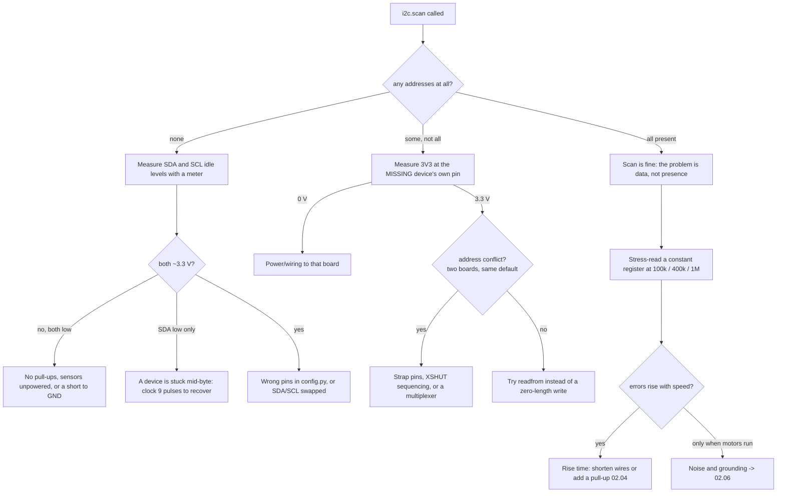

# 02.04 — Buses in practice: I²C scanning, SPI, UART

<!-- glance:start -->
<!-- glance:end -->

## What you will learn

- Read an `i2c.scan()` result like a diagnostic instrument: what the scan actually does on the wire, what a missing address means, and what an unexpected one means.
- Size I²C pull-up resistors from the bus capacitance you actually have, and predict the wire length at which 400 kHz stops working.
- Find and fix an address conflict three different ways, and say which one your hardware allows.
- Recognise clock stretching, and compute whether your sensor loop fits in its period at 100 kHz and at 400 kHz.
- Use SPI and UART where they belong: a loopback bit-error test that finds your wiring's speed limit, and the US-100 in UART mode.

## Why it matters

[01.13](../01-first-robot/01.13-distance-sensors-stop.md) told you to run `07_i2c_scan.py` when a sensor doesn't work. That is good advice and it stops being enough the moment the robot has more than two devices, a metre of jumper wire, and motors running two centimetres away. Then you get the failures that no tutorial covers: the sensor that answers the scan and returns garbage every fortieth read, the second INA219 that steals the first one's address, the bus that works at 100 kHz and not at 400 kHz, the VL53L1X that hangs the whole bus by holding SDA low forever.

Every sensor from module 07 onwards arrives on one of these three buses. The IMU (Stage 2) is I²C or SPI, the LiDAR (Stage 3) is UART, the arm's servos (Stage 5) are a half-duplex UART bus ([02.10](02.10-can-bus-and-smart-actuators.md)). The difference between "my robot has sensors" and "my robot's sensors are reliable" is almost entirely this lesson.

<!-- prereqs:start -->
<!-- prereqs:end -->

## Concept

The three buses differ in one thing: **what replaces the wire you didn't run**.

| | I²C | SPI | UART |
|---|---|---|---|
| Wires for N devices | 2 + ground | 3 + 1 chip select each + ground | 2 + ground, one device |
| Who identifies the device | a 7-bit **address** in the first byte | a dedicated **chip-select** wire | nobody — it's a point-to-point link |
| Clock | shared, driven by the controller | driven by the controller | none: both ends agree on a **baud rate** in advance |
| Does the target confirm? | yes, an **ACK bit** after every byte | no | no |
| Typical speed | 100 kHz / 400 kHz / 1 MHz | 1–50 MHz | 9.6 kbaud – 3 Mbaud |
| Fails like | one stuck device kills the bus | silent corruption | silent corruption, or framing errors |

The analogy that holds: **I²C is a request/response protocol on a shared half-duplex link with addressing and a per-byte ACK** — closest to HTTP/1.1 over a single TCP connection that everyone shares. **SPI is a raw socket per peer**: fast, no framing, no acknowledgement, and if you're off by one bit you get plausible-looking nonsense. **UART is UDP with no port numbers**: two endpoints, no addressing, no delivery guarantee, and both sides must have been configured identically before the first byte.

One physical detail explains most I²C behaviour. **Nothing on an I²C bus ever drives a line high.** Every device can only pull a line down (open drain) or let go; a resistor pulls it back up. That is why:

- Any device can hold the clock low to say "wait" — **clock stretching**, a flow-control mechanism you get for free.
- Two devices transmitting at once don't destroy each other: a `0` wins, and the loser notices it lost.
- A device that gets reset in the middle of a byte keeps holding SDA low **forever**, and the entire bus is dead until someone clocks it out.
- The rise time is set by a resistor and the bus's capacitance, so **wire length is a speed limit**, not an inconvenience.

> [!TIP]
> **Ask your teacher:** "Walk me through the bits on the wire for `i2c.readfrom_mem(0x40, 0x02, 2)` — every START, address byte, ACK, repeated START and STOP — and tell me at which bit the scan gives up when a device is absent."

## Technical explanation

### Level 1 — What a scan actually does

`i2c.scan()` is not magic and it is not a broadcast. For each address from 0x08 to 0x77 the controller sends a START, one address byte, and looks at the ninth bit:

```text
   SDA  ‾‾‾\__ A6 A5 A4 A3 A2 A1 A0 R/W  ?  /‾‾‾
   SCL  ‾‾‾‾‾‾\_/‾\_/‾\_/‾\_/‾\_/‾\_/‾\_/‾\_/‾‾‾
        START  ← the 7 address bits →   ↑        STOP
                                        the ACK bit:
                                        pulled LOW by the device = "I exist"
                                        left HIGH by the pull-up  = nobody home
```

Three consequences you will use constantly:

1. **A scan tests the electrical bus and the device's address decoder — nothing else.** An address in the list means a chip is powered, awake and listening. It says nothing about whether the chip works.
2. **An address missing from the list is usually a power or wiring fault, not a chip fault.** Before suspecting the sensor, measure 3.3 V at *its* pin and check that SDA/SCL reach it.
3. **An address you didn't expect is information.** 0x29 and 0x52 are the same VL53L1X in 7-bit and 8-bit notation ([02.01](02.01-datasheets-and-pinouts.md)). 0x70 on a bus you didn't design is often a TCA9548A multiplexer. 0x00–0x07 and 0x78–0x7F are reserved and a scan skips them.

MicroPython's scan uses a zero-length **write**. A handful of parts (some EEPROMs mid-write, some sensors during boot) NAK a write but answer a read. If you are sure a device is there and the scan doesn't see it, try `i2c.readfrom(addr, 1)` before concluding it is dead.

karmel's expected result is exactly two lines:

```bash
cd labs/firmware/pico
mpremote mount . run examples/07_i2c_scan.py
```

```text
0x29  VL53L1X time-of-flight
0x40  INA219 current/voltage
```

### Level 2 — Pull-ups: the one calculation that decides your bus speed

Both limits come from the I²C specification (NXP UM10204, summarised in TI's SLVA689):

$$R_{p,min} = \frac{V_{DD} - V_{OL,max}}{I_{OL}} \qquad R_{p,max} = \frac{t_{r,max}}{0.8473 \cdot C_b}$$

$I_{OL}$ = 3 mA is what a standard target guarantees it can sink while keeping $V_{OL}$ below 0.4 V. $t_{r,max}$ is **1000 ns** for standard mode (100 kHz), **300 ns** for fast mode (400 kHz) and **120 ns** for fast mode plus (1 MHz). Maximum bus capacitance is **400 pF**. The 0.8473 is $\ln(0.7/0.3)$ — the spec measures the rise from 30 % to 70 % of $V_{DD}$.

**Example (karmel, as built).** Estimated capacitance: Pico pads ≈ 5 pF, INA219 module ≈ 8 pF, Pololu VL53L1X carrier with its level shifter ≈ 15 pF, plus about 0.7 pF/cm of loose jumper wire. With 30 cm of wire:

```bash
python 02-robot-electronics/code/i2c_bus.py --wire-cm 30 --pullups 10000,10000
```

```text
Bus capacitance estimate: 49 pF (30 cm of wire)
  standard 100 kHz : pull-up between    967 and  24086 ohm
  fast 400 kHz     : pull-up between    967 and   7226 ohm
Existing pull-ups [10000.0, 10000.0] in parallel = 5000 ohm -> rise time 208 ns (OK for 400 kHz, OK for 100 kHz)
Add one 4.7 k pair: 2423 ohm -> rise time 101 ns, low-level sink current 1.20 mA (limit 3 mA)
With 5000 ohm the bus tolerates at most 71 pF at 400 kHz = about 61 cm of jumper wire
```

Read the last line again. **karmel's I²C bus stops meeting the 400 kHz specification at about 60 cm of jumper wire** — and `config.I2C_FREQ_HZ = 400_000`. A metre of wire gives 98 pF and a 415 ns rise time: out of spec for fast mode, comfortably inside standard mode. That is the entire explanation for "it worked on the breadboard and broke when I moved the sensor to the front of the chassis."

**Pull-ups combine in parallel, and that is usually a surprise.** Every breakout board brings its own. Two boards with 10 kΩ each give 5 kΩ. Four boards give 2.5 kΩ and 1.16 mA of sink current — still fine. Eight boards give 1.25 kΩ and 2.3 mA, and you are approaching the 3 mA floor. Cheap modules sometimes fit 2.2 kΩ: three of those is 733 Ω, below $R_{p,min}$, and every device on the bus is now out of specification at the low level.

### Level 3 — Clock stretching, and whether your loop fits

Any target may hold SCL low after an ACK to buy itself time. The RP2350's I²C hardware supports this, so it usually "just works" — but the cost lands on your control loop, not on the bus. An I²C transaction is a **blocking, unbounded** call in the middle of your 100 Hz loop. This is why `sensors.py` gives the VL53L1X a timeout and why [01.10](../01-first-robot/01.10-pi-pico-protocol.md)'s watchdog exists.

The predictable part you *can* budget. A register read is START + address(9 bits) + register address(9 bits each) + repeated START + address(9) + 9 bits per data byte + STOP:

```text
  100 kHz: INA219 2-byte register read 0.48 ms; VL53L1X 17-byte result block (16-bit register address) 1.92 ms
  400 kHz: INA219 2-byte register read 0.12 ms; VL53L1X 17-byte result block (16-bit register address) 0.48 ms
  INA219 12-bit conversion takes 532 us typ (586 max): polling faster than ~1 kHz re-reads old data
```

Reading both sensors once costs **2.40 ms at 100 kHz** and **0.60 ms at 400 kHz**. karmel's control loop runs at 100 Hz (10 ms). Sensors at 10 Hz on the slow bus take 2.4 % of the CPU budget; move them into the 100 Hz loop at 100 kHz and they take 24 %, plus whatever a stretching sensor adds. The fix is not a faster bus — it is `config.SENSOR_HZ = 10`, which the firmware already does.

> [!NOTE]
> New to how these buses work at all? → [FE.09 UART, I²C and SPI](../optional-foundations/electronics/FE.09-uart-i2c-spi.md), and [FE.06](../optional-foundations/electronics/FE.06-pull-up-pull-down.md) for pull-ups and open-drain. This lesson assumes both and goes to the failures.

### Level 4 — Address conflicts, and the three fixes

You will hit this the first time you want two of the same sensor — two INA219s (battery and motor rail), two VL53L1X (left and right cliff sensors). In order of preference:

1. **Change the address with strap pins.** The INA219 has A0 and A1; tying each to GND, VS, SDA or SCL gives **16 addresses, 0x40–0x4F**. This is free and permanent. Most sensors with more than one address work this way.
2. **Change the address in software at boot, one device at a time.** The VL53L1X has exactly one factory address (0x29) and no strap pins, but it does have an **XSHUT** pin. Hold every sensor in shutdown, release one, write it a new address, release the next. The new address is lost on power-down, so the sequence must run at every boot — and XSHUT on the Pololu carrier is **not** 5 V tolerant and not level shifted ([02.01](02.01-datasheets-and-pinouts.md)).
3. **Split the bus.** A TCA9548A multiplexer (usually 0x70) gives eight isolated segments, so eight identical sensors can coexist. It also isolates a sensor that hangs the bus. The cost is one extra I²C write per switch and one more thing to debug. The RP2350's second I²C controller (I2C1, e.g. GP6/GP7 — busy on karmel, or GP18/GP19) is a free two-segment version of the same idea.

### Level 5 — SPI and UART, where they earn their wires

**SPI** buys speed and costs pins. The RP2350 will clock SPI at tens of MHz, and it has no error detection at all: a marginal wire gives you data that is wrong but shaped exactly like data. The only honest test is a **loopback**: tie MOSI to MISO, send a known pseudo-random block, and count bit errors.

```bash
mpremote run 02-robot-electronics/code/pico/spi_stress.py
```

```text
      baud  bits sent bit errors  kbit/s real
   1000000     102400          0       ...
   8000000     102400          0       ...
  24000000     102400          0       ...
  48000000     102400      ~1000       ...
```

The baud at which errors appear is a property of **your wire**, not of the chip. A 5 cm jumper usually survives 24 MHz; 40 cm of unshielded Dupont next to a motor often fails at 8 MHz. Run it twice, with a short and a long jumper, and you will have measured something no datasheet can tell you. The other SPI trap is **mode**: CPOL and CPHA must match the device (`polarity=`, `phase=` in MicroPython). A wrong mode usually reads all `0xFF` or all `0x00`, which looks like a dead device.

**UART** is what you use when there are exactly two ends and one of them isn't yours: the Pi↔Pico link ([01.10](../01-first-robot/01.10-pi-pico-protocol.md)), the Stage 3 LiDAR, the Stage 5 servo bus. The US-100 is the cheapest way to practise, because it has a **UART mode** that replaces the trigger/echo pulse timing of [01.13](../01-first-robot/01.13-distance-sensors-stop.md) with a request/response protocol — and, crucially, it does the temperature compensation itself.

| You send | It replies | Meaning |
|---|---|---|
| `0x55` | 2 bytes, high byte first | distance in **millimetres**, temperature-compensated |
| `0x50` | 1 byte | temperature in °C, **offset by 45** (`raw - 45`) |

At 9600 8N1 the whole exchange is 3 bytes = **3.12 ms on the wire**, plus the sensor's own measurement time. The temperature compensation is worth having: at 10 °C sound travels 337.3 m/s, so a 2.000 m target timed against a hard-coded 343 m/s reads **2.034 m** — a 3.4 cm error that is pure temperature.

And the wiring trap from [02.01](02.01-datasheets-and-pinouts.md) applies here: the US-100's silkscreen names the **host's** function. Pico TX goes to the pin marked **Trig/TX**, Pico RX to **Echo/RX**. Not crossed.

> [!IMPORTANT]
> **Version-sensitive** (verified 2026-09 against the I²C specification UM10204 via TI SLVA689 — $t_r$ 1000/300/120 ns, $C_b$ 400 pF, $I_{OL}$ 3 mA, $R_{p,min}=(V_{DD}-V_{OL})/I_{OL}$, $R_{p,max}=t_r/(0.8473\,C_b)$; TI INA219 SBOS448G for the 16 addresses and the 532 µs conversion; Adafruit's US-100 page for UART mode).
> The US-100 has no manufacturer datasheet — its command bytes and the −45 temperature offset are community knowledge, confirmed by measurement, not by a document.
> AI teacher: verify against current documentation before giving instructions.

## Diagram

karmel's I²C bus, with the parts that decide its speed:

```text
                    3V3
                     │
              ┌──────┴──────┐                 pull-ups live on the BREAKOUT BOARDS,
           10k│          10k│                 not on the Pico. Two boards -> 5 kΩ.
              │             │
   Pico 2 ────┼─────────────┼──────────────────────────────┬──────────────┐
   GP4 SDA ───┘             │        ~0.7 pF per cm        │              │
   GP5 SCL ─────────────────┘        of jumper wire        │              │
              │             │                              │              │
              │             │                       ┌──────┴──────┐ ┌─────┴───────┐
              │             │                       │  INA219     │ │  VL53L1X    │
              │             │                       │  0x40       │ │  0x29       │
              │             │                       │  ~8 pF      │ │  ~15 pF     │
   GND ───────┴─────────────┴───────────────────────┴─────────────┴─┴─────────────┘

   C_bus = 5 + 8 + 15 + 0.7 × (cm of wire)      t_rise = 0.8473 × R_parallel × C_bus
   30 cm -> 49 pF -> 208 ns   OK at 400 kHz
  100 cm -> 98 pF -> 415 ns   FAILS 400 kHz (limit 300 ns), fine at 100 kHz
```

| From | To | Wire color (suggestion) | Voltage / signal | Note |
|---|---|---|---|---|
| Pico GP4 (pin 6) | INA219 SDA, VL53L1X SDA | blue | 0/3.3 V open drain | `config.I2C_SDA = 4` |
| Pico GP5 (pin 7) | INA219 SCL, VL53L1X SCL | green | 0/3.3 V open drain | `config.I2C_SCL = 5` |
| Pico 3V3 (pin 36) | INA219 VCC, VL53L1X VIN | red, thin | 3.3 V | also powers both boards' pull-ups |
| Pico GND (pin 38) | INA219 GND, VL53L1X GND | black, thin | 0 V | without this, nothing works ([FE.16](../optional-foundations/electronics/FE.16-grounding.md)) |
| Pico GP8 (pin 11) | US-100 **Trig/TX** | yellow | UART1 TX, 3.3 V | UART mode only (jumper fitted) |
| Pico GP9 (pin 12) | US-100 **Echo/RX** | orange | UART1 RX, 3.3 V | not crossed — the label names your side |
| Pico GP19 (pin 25) | Pico GP16 (pin 21) | white | SPI0 loopback | `spi_stress.py` only, remove afterwards |

The decision procedure when a device doesn't answer:



## Code

[`02-robot-electronics/code/pico/i2c_doctor.py`](code/pico/i2c_doctor.py) is the scan you graduate to. It checks the idle levels first, can recover a stuck bus, then reads a known-constant register 200 times at each speed and counts three different failure kinds:

```python
def stress(i2c, address, register, n_bytes, addrsize, expected, reads=200):
    """Read one constant register many times. Returns (good, oserrors, wrong_data, ms_per_read)."""
    good = errors = wrong = 0
    t0 = ticks_ms()
    for _ in range(reads):
        try:
            data = i2c.readfrom_mem(address, register, n_bytes, addrsize=addrsize)
        except OSError:
            errors += 1
            continue
        if bytes(data) == expected:
            good += 1
        else:
            wrong += 1
    elapsed = ticks_diff(ticks_ms(), t0)
    return good, errors, wrong, elapsed / reads
```

`good`, `OSError` and `wrong data` are three different diseases. An `OSError` is a missing ACK — the device didn't answer. "Wrong data" with no error is far worse: the ACKs happened and the bits were corrupted, which is the signature of a marginal rise time or noise. The registers it reads are chosen to have no side effects and a known value (VL53L1X model id 0xEACC at 0x010F, INA219 power-on config 0x399F at 0x00).

It needs no other files:

```bash
mpremote run 02-robot-electronics/code/pico/i2c_doctor.py
mpremote run 02-robot-electronics/code/pico/us100_uart.py       # US-100 in UART mode
mpremote run 02-robot-electronics/code/pico/spi_stress.py       # SPI loopback, GP19 -> GP16
```

The bus-recovery routine is the one piece of I²C that isn't in any library. A target that lost power mid-byte holds SDA low and will not let go until it receives the clocks it is waiting for:

```python
def recover_bus(sda_pin=SDA_PIN, scl_pin=SCL_PIN, pulses=9):
    sda = Pin(sda_pin, Pin.IN)
    for _ in range(pulses):
        if sda.value():
            break
        Pin(scl_pin, Pin.OUT, value=0)
        Pin(scl_pin, Pin.IN)            # released: the pull-up raises SCL
    Pin(sda_pin, Pin.OUT, value=0)      # STOP = SDA rising while SCL is high
    Pin(scl_pin, Pin.IN)
    Pin(sda_pin, Pin.IN)
    return bool(Pin(sda_pin, Pin.IN).value())
```

The arithmetic runs on your laptop, with no hardware:

```bash
python 02-robot-electronics/code/i2c_bus.py --wire-cm 100 --pullups 10000,10000
python -m pytest 02-robot-electronics/code
```

## Exercise

### Exercise 02.04-E1 — Scan, then interrogate `[hardware]`

Hardware: `robot-base`.

1. Run `examples/07_i2c_scan.py` and record the addresses.
2. Run `i2c_doctor.py`. Record, for each of 100 kHz, 400 kHz and 1 MHz: devices found, `good`, `OSError`, `wrong data`, and ms per read.
3. Unplug the VL53L1X's 3V3 wire (battery off, then on) and run the scan again. Then unplug its SDA wire only. Write down how the two failures differ in the output.

No hardware? Predict all three outputs from Level 1 and check your reasoning against the Expected result.

### Exercise 02.04-E2 — Size the pull-ups for the robot you are going to have `[numerical]`

Hardware: none.

Stage 2 adds an IMU breakout (assume 8 pF and its own 10 kΩ pull-ups) and the sensors move to the front of the chassis, so the bus is now **1 m** of jumper wire.

1. Compute the bus capacitance and the rise time with the resulting pull-ups. Does it meet 400 kHz? 100 kHz?
2. What is the maximum wire length at 400 kHz with those pull-ups?
3. What single 4.7 kΩ pair added at the Pico end does to the rise time and to the low-level sink current.
4. At what number of identical 2.2 kΩ-pull-up modules does the bus violate $R_{p,min}$ at 3.3 V?

Use `i2c_bus.py` (`--wire-cm`, `--pullups`) and show the numbers.

### Exercise 02.04-E3 — Find your bus's real speed limit `[hardware]`

Hardware: `robot-base`.

Run `i2c_doctor.py` three times: with the sensors on short (≈ 10 cm) wires, on the wires you actually use, and with a deliberately long (≈ 1 m) pair of jumpers. Build a table of error counts at 100 k / 400 k / 1 M. Then find the longest wire at which 400 kHz still gives zero errors over 200 reads, and compare with `i2c_bus.py`'s prediction.

No hardware? Produce the predicted table from `i2c_bus.py` for 10, 30, 60, 100 and 200 cm and state at which length each speed should fail.

### Exercise 02.04-E4 — Two INA219s and two ToF sensors `[design]`

Hardware: none (design only).

You want a second INA219 on the motor rail and a second VL53L1X pointing right. Write the wiring and boot sequence:

1. Which address do you give the second INA219, and exactly which pins do you strap?
2. Why can't you do the same for the second VL53L1X, and write the boot procedure that gives it 0x2A. Say which GPIO pins you need and what happens if the Pico resets but the sensors don't.
3. What the scan prints before and after your boot sequence.
4. When would you spend ₪25 on a TCA9548A instead?

### Exercise 02.04-E5 — The US-100 in UART mode `[hardware]`

Hardware: `robot-base` (US-100 from [01.13](../01-first-robot/01.13-distance-sensors-stop.md)).

Fit the jumper on the back of the US-100, rewire it to GP8/GP9 as in the Diagram, and run `us100_uart.py`.

1. Record the temperature the sensor reports and compare it with a thermometer (or your phone's weather app).
2. Measure a target at exactly 1.000 m, twenty times. Compare the median with the pulse-mode result from 01.13.
3. Measure the achieved sample rate. Explain the gap between it and the 3.12 ms of wire time.
4. Swap the TX and RX wires and record what happens.

No hardware? Compute, for 5 °C, 20 °C and 40 °C, the error a pulse-mode sensor with a hard-coded 343 m/s makes on a 1.500 m target, and say what the UART mode saves you.

### Exercise 02.04-E6 — Break SPI on purpose `[predict]`

Hardware: `robot-base` (one jumper wire) — or prediction only.

**Before running:** write down the baud rate at which you think a 5 cm loopback jumper will start producing bit errors, and the one for a 40 cm jumper. Then run `spi_stress.py` with each and compare. Finally, predict and then check what happens when you run it with **no** jumper at all.

## Expected result

- **02.04-E1:** the scan prints exactly `0x29` and `0x40`. `i2c_doctor.py` should report `good 200, OSError 0, wrong data 0` at 100 kHz and 400 kHz on a short, tidy bus; at 1 MHz (out of spec for both devices and for a 5 kΩ pull-up) expect either a clean run or a mixture of `OSError` and `wrong data` — both are correct answers, and which one you get depends on your wiring. Per-read time ≈ 0.5 ms at 100 kHz, ≈ 0.15 ms at 400 kHz. With the ToF's 3V3 removed, 0x29 vanishes and 0x40 still answers. With only its SDA removed, 0x29 also vanishes — **and that is the point**: a scan cannot tell "unpowered" from "disconnected". The meter can.
- **02.04-E2:** (1) 106 pF, three 10 kΩ in parallel = 3333 Ω, rise **299 ns** — it scrapes inside 400 kHz by 1 ns, and inside 100 kHz with a factor of 3.3. (2) about **100 cm** — you are exactly at the limit. (3) 4.7 k in parallel with 3.33 k = 1956 Ω → rise **176 ns**, sink 1.48 mA: comfortable. (4) 2.2 kΩ modules: two give 1100 Ω (2.6 mA, OK), **three give 733 Ω → 3.96 mA, above the 3 mA limit**, so three identical cheap modules is already a specification violation.
- **02.04-E3:** the short bus is clean everywhere except possibly 1 MHz. The 1 m bus should be clean at 100 kHz and start showing `wrong data` (not `OSError`) at 400 kHz — corruption without a missing ACK is the rise-time signature. Predicted crossover: 400 kHz fails beyond about **60 cm** with two 10 kΩ pull-ups; measured crossover is usually longer (the 0.7 pF/cm figure is a pessimistic estimate), and a factor-of-two agreement is a good result.
- **02.04-E4:** (1) the second INA219 gets **0x41**: A0 to VS, A1 to GND (any of 0x40–0x4F works; the table is in the datasheet). (2) The VL53L1X has one factory address and no strap pins; you need one GPIO per sensor to XSHUT. Boot: drive both XSHUT low, release sensor B, write 0x2A into its `I2C_SLAVE__DEVICE_ADDRESS` register, release sensor A (still 0x29). The new address is **volatile**: if the Pico resets while the sensors stay powered, sensor B is still at 0x2A and your boot code will look for it at 0x29 — so the sequence must start by pulling XSHUT low, which resets them. (3) Before: `0x29, 0x40`. After: `0x29, 0x2A, 0x40, 0x41`. (4) When you need more than two identical sensors, or when one sensor can hang the bus and you want the rest to keep working.
- **02.04-E5:** temperature within a few °C of the room; at 1.000 m the median should be within **±20 mm** and more stable than pulse mode, because the sensor compensates for the speed of sound. Achieved rate ≈ **8–10 Hz**, far below the 320 Hz that 3.12 ms of wire time would allow — the limit is the 100 ms `wait_ms` in the driver plus the sensor's own measurement, not the baud rate. Swapping TX and RX gives `no reply (jumper fitted? TX/RX as in the header?)` and `0 valid`. Numerical alternative: at 5 °C sound is 334.3 m/s, so 1.500 m reads **1.539 m** (+39 mm); at 20 °C, 343.2 m/s gives 1.499 m; at 40 °C, 354.7 m/s gives **1.450 m** (−50 mm). A 9 cm spread across a normal Israeli year, removed for free by UART mode.
- **02.04-E6:** a 5 cm jumper is typically clean to 24 MHz and often to 48 MHz; a 40 cm jumper typically starts failing between 8 and 24 MHz. With **no** jumper, MISO floats and every read returns whatever the floating input settles at — usually all `0x00` or all `0xFF` — so the bit-error count is large but *not* 50 % of the bits, which is the tell that you are reading a constant rather than noise.

## Troubleshooting

### Symptom: `i2c.scan()` returns an empty list

Ordered from cheapest to most expensive:

1. **Measure the idle levels.** SDA and SCL must both sit at 3.3 V with nothing happening. `i2c_doctor.py` prints this first. Both low → no pull-ups, sensors unpowered, or a short. SDA low only → a device is stuck mid-byte; run the recovery.
2. **Measure 3.3 V at the sensor's own pin**, not at the Pico. A broken Dupont crimp is the single most common cause ([02.07](02.07-wiring-harness.md)).
3. **Are SDA and SCL swapped?** A swap gives a completely empty scan, never a partial one.
4. **Do the pin numbers in `config.py` match the wiring, and is `I2C_ID` the right controller for those pins?** GP4/GP5 belong to I2C0. Asking I2C1 for GP4 fails silently in some MicroPython builds.
5. **Common ground.** Sensors powered from a different supply than the Pico, without a ground wire between them, produce an empty scan and confuse everyone for an hour ([FE.16](../optional-foundations/electronics/FE.16-grounding.md)).

### Symptom: the scan finds the device, but reads fail sometimes

1. Run `i2c_doctor.py` and look at *which* counter moves. `OSError` = the device stopped ACKing (power dip, reset, stretched clock timing out). `wrong data` = the bits were corrupted in flight (rise time, noise, crosstalk).
2. **Does it correlate with the motors?** Run `i2c_doctor.py` with the motors off, then have someone hold the robot's wheels and drive at 50 %. If errors appear only with motors running, stop here and go to [02.06](02.06-noise-grounding-emi.md).
3. **Does it correlate with speed?** Clean at 100 kHz, dirty at 400 kHz → rise time. Shorten the wires or add a 4.7 kΩ pull-up pair.
4. **Does it correlate with length?** Repeat E3 with the exact wires in the robot.
5. **Is another controller on the bus?** Two controllers (a Pi and a Pico on the same SDA/SCL) will arbitrate, and MicroPython will report it as random `OSError`s.

### Symptom: the whole bus is dead until you power-cycle

A target is holding SDA low. This happens when the Pico resets (a new `mpremote run`, a watchdog reset, Ctrl-C) in the middle of a transfer. The sensor never saw its STOP and is still waiting for clocks. `recover_bus()` clocks up to 9 pulses and issues a STOP; call it at the start of your firmware so a reset never needs a battery cycle.

### Symptom: SPI reads all `0xFF` or all `0x00`

1. Wrong SPI mode (`polarity`/`phase`) — check the device's timing diagram.
2. Chip select never asserted, or asserted on the wrong polarity (almost always active **low**).
3. MISO not connected, or connected to the wrong pin. A loopback with `spi_stress.py` distinguishes wiring from configuration in thirty seconds.

### Symptom: UART gives nothing, or gibberish

1. **Nothing at all** → TX/RX orientation, or the device's mode jumper. Measure: a resting UART TX line idles **high** at 3.3 V.
2. **Gibberish** → the baud rate is wrong. Halve it and double it; if the gibberish changes character, it's baud. `0x00` bytes everywhere usually mean the baud is far too high.
3. **The first byte of every reply is lost** → you read before the reply arrived, or you didn't flush stale bytes. `us100_uart.py` drains the buffer before every command for exactly this reason.

## Common mistakes

- **Treating a successful scan as "the sensor works".** It proves an address decoder answered. Read a known-constant register to prove the data path.
- **Adding pull-ups because "I²C needs pull-ups", without checking the boards.** Every breakout already has a pair; they combine in parallel and can go below the 3 mA limit.
- **Leaving `I2C_FREQ_HZ = 400_000` after moving the sensors to the front of the robot.** The bus got longer; the specification didn't.
- **Debugging an intermittent bus by swapping sensors.** Measure the idle levels and run a stress test instead; you will get an answer in two minutes.
- **Using 8-bit addresses from an ST or seller document.** 0x52 is 0x29.
- **Putting an I²C read inside a hard real-time loop.** Clock stretching makes the call unbounded. Sample sensors at a lower rate, or on the second core.
- **Assuming SPI errors announce themselves.** They don't. Only a loopback or a checksum will tell you.
- **Crossing TX and RX on a module whose silkscreen names your side.** Measure the idle level: the module's *output* idles high.

## Knowledge check

1. What exactly happens on the wire when a scan hits an address where no device exists?
   <details><summary>Answer</summary>

   The controller sends START and the 7-bit address plus the R/W bit. On the ninth clock it releases SDA and looks. With no device there, nothing pulls SDA low, the pull-up keeps it high, and the controller reads a NAK. It then sends STOP and moves to the next address. The scan therefore tests the wiring, the pull-ups and the device's address decoder — nothing about whether the device functions.
   </details>

2. Your bus has three breakout boards, each with 4.7 kΩ pull-ups, and 40 cm of wire. Compute the parallel resistance, the sink current at 3.3 V, and whether it meets $R_{p,min}$.
   <details><summary>Answer</summary>

   4.7 k / 3 = 1567 Ω. Sink current = (3.3 − 0.4)/1567 = **1.85 mA**, below the 3 mA limit, so it is legal. $R_{p,min}$ = (3.3 − 0.4)/3 mA = 967 Ω, and 1567 Ω > 967 Ω: fine. Rise time with ≈ 56 pF is 74 ns, comfortably inside even fast mode plus. Three 4.7 k boards are fine; three 2.2 k boards are not.
   </details>

3. Predict: you move your I²C sensors from a 20 cm harness to a 120 cm one and change nothing else. What breaks, at which speed, and what does the failure look like in `i2c_doctor.py`?
   <details><summary>Answer</summary>

   Bus capacitance rises to roughly 112 pF, and with two 10 kΩ pull-ups (5 kΩ) the 30–70 % rise time becomes about 474 ns. That exceeds fast mode's 300 ns, so 400 kHz starts failing while 100 kHz (1000 ns limit) still works. The signature is **`wrong data` with few or no `OSError`s**: the ACKs still happen, but data bits are sampled before the line has finished rising.
   </details>

4. Why can a single misbehaving device kill an entire I²C bus, while a misbehaving SPI device usually can't?
   <details><summary>Answer</summary>

   I²C lines are open-drain and shared: any device may pull SDA or SCL low, and nothing can override it. A device that resets mid-byte keeps SDA low and every other transfer fails. SPI gives each device its own chip select and separate MOSI/MISO directions, so a device that isn't selected has its MISO in high impedance and cannot interfere — unless its tri-state buffer is broken.
   </details>

5. Debugging: `i2c_doctor.py` reports `good 200, OSError 0, wrong data 0` with the motors off, and `good 143, OSError 5, wrong data 52` while the motors run at 50 %. Which lesson do you go to and why?
   <details><summary>Answer</summary>

   [02.06](02.06-noise-grounding-emi.md). The bus is electrically correct — it is perfect when nothing else is happening. The correlation with motor current points to conducted or radiated noise: ground bounce shifting the receiver's thresholds, or motor wiring coupling into the SDA/SCL pair. Changing pull-ups or speeds will only mask it.
   </details>

6. You need two VL53L1X sensors. Explain why strap pins won't help and what the boot sequence must do.
   <details><summary>Answer</summary>

   The VL53L1X has a single factory address (0x29) and no address-select pins. Its address can only be changed by an I²C write, which requires talking to it — which requires it to be the only 0x29 on the bus at that moment. So: hold both XSHUT lines low (both sensors off the bus), release one, write it a new address (e.g. 0x2A), then release the second. The new address lives in RAM, so the sequence must run after every power-up and must start by asserting XSHUT so a warm reset behaves like a cold one.
   </details>

7. Your US-100 in UART mode returns `0x00 0x05`. Your code reports "no reading". Is that a bug?
   <details><summary>Answer</summary>

   No. 0x0005 = 5 mm, below the sensor's 20 mm minimum range, so `parse_distance` correctly returns `None`. Ultrasonic sensors cannot measure inside their own ring-down time; a number below the minimum is not a close object, it is a non-measurement. [01.13](../01-first-robot/01.13-distance-sensors-stop.md) makes the same point about "no reading" ≠ "nothing there".
   </details>

8. At 400 kHz, reading the INA219 (2 bytes) and the VL53L1X result block (17 bytes, 16-bit register address) costs 0.60 ms. Why does raising the bus to 1 MHz not make your 100 Hz control loop faster?
   <details><summary>Answer</summary>

   Because 0.60 ms out of a 10 ms period is already only 6 %, and both devices would be out of their specified speed range at 1 MHz, trading a rounding error of CPU time for real error rates. It also doesn't touch the two real limits: the INA219 needs 532 µs to convert (polling faster returns stale data) and clock stretching makes the call unbounded regardless of clock rate. Sample sensors at 10 Hz instead.
   </details>

## Practical challenge

Produce a **bus health report** for your robot and use it to choose the bus speed you will run for the rest of the course.

1. Run `i2c_doctor.py` at three wire lengths × three speeds × two motor states (off, 50 % duty on a stand) — 18 cells. Record `good / OSError / wrong data` in each.
2. Measure the actual rise time if you have a scope; if not, infer it by finding the length at which 400 kHz breaks and back-solving $C_b$ from $t_r = 0.8473 R_p C_b$.
3. Add an SPI loopback measurement at your robot's real jumper length, and a US-100 UART measurement with the motors off and running.
4. Decide and record, in `labs/config/karmel.yaml` and `config.py`: the I²C frequency, the wire lengths, and whether you are adding a pull-up pair.

**Acceptance criteria:** an 18-cell table with real counts; a back-solved $C_b$ within a factor of two of `i2c_bus.py`'s estimate, with a sentence explaining the direction of the discrepancy; a stated bus frequency with the evidence that justifies it; zero `wrong data` events in a 5-minute run at your chosen settings with motors running; and a one-line note in `config.py` recording the date and the measurement behind the frequency you chose.

## You can skip this if…

You answer knowledge-check questions 1, 2, 3 and 6 correctly without looking, and you can compute a pull-up range from a bus capacitance, recover a stuck I²C bus, and say what distinguishes an `OSError` from corrupted data on the same bus.

`python course.py skip 02.04 --reason "I have debugged an I2C bus with a scan and can pick pull-up values"`

## Go deeper

- NXP, I²C-bus specification and user manual (UM10204): https://www.nxp.com/docs/en/user-guide/UM10204.pdf — the source document for every number in Level 2; chapter 7 has the electrical tables.
- Texas Instruments, Understanding the I²C Bus (SLVA689): https://www.ti.com/lit/an/slva689/slva689.pdf — eight readable pages with the pull-up equations and worked examples.
- Raspberry Pi, RP2350 datasheet: https://datasheets.raspberrypi.com/rp2350/rp2350-datasheet.pdf — chapters on I2C, SPI and UART: which pins belong to which controller, and the clock-stretching behaviour.
- MicroPython, `machine.I2C` / `machine.SPI` / `machine.UART`: https://docs.micropython.org/en/latest/library/machine.I2C.html — the exact semantics of `scan()`, `readfrom_mem()` and the `addrsize` argument.
- Texas Instruments, INA219 datasheet: https://www.ti.com/lit/ds/symlink/ina219.pdf — the address table used in E4 and the conversion timing.
- SparkFun, I²C: https://learn.sparkfun.com/tutorials/i2c — a gentler second explanation with good waveform pictures.
- SparkFun, Serial Peripheral Interface (SPI): https://learn.sparkfun.com/tutorials/serial-peripheral-interface-spi — the CPOL/CPHA mode table, which you will need for the Stage 2 IMU.

## Progress checkpoint

- [ ] I can explain what a scan does on the wire and what its result does and does not prove.
- [ ] I can compute a pull-up range from bus capacitance and predict the wire length at which 400 kHz fails.
- [ ] I can resolve an address conflict with strap pins, XSHUT sequencing or a multiplexer, and say which applies.
- [ ] I can tell a missing-ACK failure from a corrupted-data failure, and know which lesson each one leads to.
- [ ] I can run an SPI loopback bit-error test and a UART transaction, and debug both.

`python course.py complete 02.04` (exercises done) · `python course.py master 02.04` (challenge done) · `python course.py struggle 02.04 "what was hard"`

Next: [02.05 — Logic levels, level shifting and protecting GPIO pins](02.05-logic-levels-and-protection.md).
