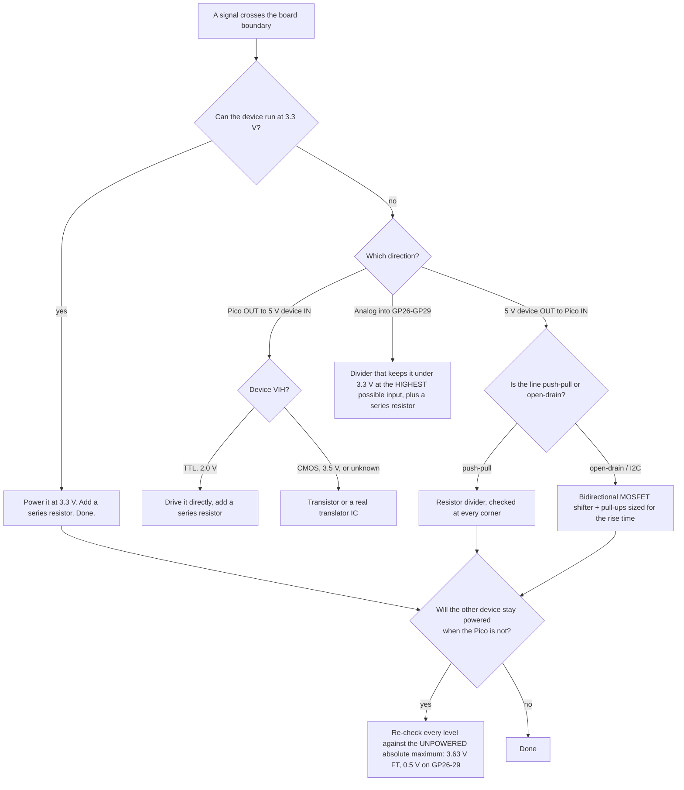

# 02.05 — Logic levels, level shifting and protecting GPIO pins

<!-- glance:start -->
<!-- glance:end -->

## What you will learn

- State the four numbers that decide whether two chips can talk, and find them for the RP2350 and for any sensor you buy.
- Explain exactly what happens inside a GPIO pin when you put 5 V or 12 V on it, and compute the current that flows.
- Design a resistor divider that survives worst-case supply and resistor tolerance, and say why the obvious 1 k/2 k choice is the wrong one on a Pico 2.
- Choose between the four ways to bridge a voltage gap — don't, series resistor, divider, bidirectional shifter — and size each one.
- Audit every external signal on your robot for the powered *and* unpowered case, in ten minutes, with a script.

## Why it matters

The Pico 2 is a 3.3 V part. Almost every cheap sensor module on AliExpress is a 5 V part. The two facts meet on your breadboard, and the result is either a robot or a dead GPIO pin — and dead GPIO pins are the worst kind of hardware failure, because the board still enumerates, still runs code, and only that one pin lies to you forever.

This is also the lesson where "5 V tolerant" stops being a comforting phrase. The RP2350's digital pins really are fault tolerant — **while the Pico is powered**. karmel's Pico is powered from the Pi's USB. The Pi shuts down; the battery switch is still on; a 5 V sensor is still powered. That combination is on the datasheet's damage side of the line, and it happens every single time you shut the robot down in the wrong order. [02.01](02.01-datasheets-and-pinouts.md) showed you where the numbers live. This lesson turns them into resistors.

<!-- prereqs:start -->
<!-- prereqs:end -->

## Concept

A logic level is not a voltage. It is **four promises**, two from each end of the wire:

```text
  what the DRIVER guarantees                    what the RECEIVER requires
  ──────────────────────────                    ──────────────────────────
     V_OH  "my HIGH is at least this"   ──────▶   V_IH  "above this I read 1"
     V_OL  "my LOW is at most this"     ──────▶   V_IL  "below this I read 0"

                         and one more, silently:
     V_high,max "the most I can ever put on the wire"  ≤  absolute maximum of the receiver
                                             ... powered AND unpowered
```

Between $V_{IL}$ and $V_{IH}$ is the **undefined zone**. A voltage there is not "half a one". The input may read 0, may read 1, may oscillate, and may draw milliamps because both transistors in its input buffer are partly on. A floating pin lives permanently in this zone — that is the whole point of [FE.06](../optional-foundations/electronics/FE.06-pull-up-pull-down.md).

The second idea is the one that saves hardware: **a GPIO pin is not a passive voltmeter.** Every pin has clamp diodes to its supply rails, put there for electrostatic discharge:

```text
                      IOVDD (3.3 V)
                           │
                        ▲ ─┴─   clamp diode: conducts when the pin
                        │       goes about 0.5 V ABOVE IOVDD
        pin ────────────┤
                        │
                        ▲ ─┬─   clamp diode: conducts when the pin
                           │    goes about 0.5 V BELOW GND
                          GND
```

Put 5 V on a pin whose IOVDD is 3.3 V and you are not "applying 5 V to an input". You are **connecting a 5 V source to the 3.3 V rail through a diode**. What happens next depends on how much current can flow and on what else is on that rail:

- Small current, rail loaded → the diode eats it, nothing visible happens, the part quietly ages.
- Large current → the diode fuses or the pin latches up. Dead pin.
- Rail *unloaded* (the Pico is off) → your 5 V sensor now **powers the entire 3.3 V rail through one pin**. The Pico half-boots, the rail sits at 4.3 V, and everything on it is out of specification.

The RP2350's fault-tolerant pins add a real protection structure on top of this — which is why they take 5.5 V *while IOVDD is present*. Remove IOVDD and you are back to the diode picture, and the limit collapses to 3.63 V.

> [!TIP]
> **Ask your teacher:** "Draw the current path when I connect a 5 V sensor output to a Pico GPIO with the Pico's USB unplugged, and tell me what voltage the 3.3 V rail ends up at."

## Technical explanation

### Level 1 — The Pico 2's numbers, and the three classes of pin

From the RP2350 datasheet, at IOVDD = 3.3 V:

| | Value | Meaning |
|---|---|---|
| $V_{IH}$ min | **2.0 V** | above this, guaranteed to read 1 |
| $V_{IL}$ max | **0.8 V** | below this, guaranteed to read 0 |
| $V_{OH}$ min | **2.62 V** at 4 mA | what the pin guarantees when driving high |
| $V_{OL}$ max | **0.50 V** at 4 mA | when driving low |
| Drive strength | 2 / 4 / **8** / 12 mA, selectable | 4 mA is the reset default |

And three classes of pin, which is the part people miss:

| Class | Pins on a Pico 2 | Max voltage, IOVDD powered | Max voltage, IOVDD = 0 V |
|---|---|---|---|
| Fault-tolerant digital (FT) | most GPIOs | **5.5 V** | **3.63 V** |
| Standard (not FT) | **GP26–GP29** (the ADC-capable pins) | IOVDD + 0.5 V = **3.8 V** | 0.5 V |
| ADC input | GP26–GP29 when used as ADC | must not exceed IOVDD = **3.3 V** | — |

Three rules follow, and they are the whole lesson:

1. **Never put 5 V on GP26–GP29.** Not even "just to check". They are not fault tolerant even when powered.
2. **"5 V tolerant" is conditional on the Pico being powered.** Any 5 V device that stays powered when the Pico doesn't is a damage path.
3. **The course rule is stricter than the datasheet: nothing above 3.3 V reaches a Pico pin, ever.** The datasheet tells you what survives; the rule tells you what you design. That is why karmel powers the US-100 at 3.3 V instead of shifting a 5 V echo line.

### Level 2 — What a fault actually costs, in milliamps

```bash
python 02-robot-electronics/code/level_shift.py
```

```text
2) Series resistor + clamp: current forced into a pin by a wiring fault
   12 V onto an ADC pin (GP26) via 1 k: internal diode to 3V3         8.20 mA  (back-powers the 3.3 V rail if the Pico draws less than this)
   12 V onto an ADC pin via 10 k                                      0.82 mA  (small)
   12 V onto GP26 via 100 k/22 k divider top resistor                 0.08 mA  (small)
   5 V onto GP26 via 1 k                                              1.20 mA  (small)
   12 V onto an FT pin via 10 k + external BAT54S to 3V3              0.83 mA  (small)
   output HIGH shorted to GND through 330 ohm: 10.0 mA (without it: limited only by the pad driver)
```

The model is one line of Ohm's law: the clamp diode holds the pin at about $V_{IOVDD} + 0.5$ V, so a fault at $V_f$ through a series resistance $R$ pushes $(V_f - 3.8)/R$ into the rail.

**Read the first two rows together.** The *same* 12 V fault costs 8.2 mA through a 1 kΩ resistor and 0.82 mA through 10 kΩ. 8.2 mA will back-power a sleeping Pico's 3.3 V rail; 0.82 mA will not, because the Pico's own regulator and the sensors sink more than that. **A series resistor doesn't prevent the fault; it makes the fault harmless.** That is why [02.03](02.03-motor-drivers-in-depth.md) puts 10 kΩ in series with the current-sense line — not to divide anything, but to cap a slipped probe at under a milliamp.

The last row is the mirror image: a pin driving high, accidentally shorted to ground. A 330 Ω series resistor limits it to 10 mA, comfortably inside the pad's capability. Without it the current is whatever the output transistor can deliver into a short, repeatedly, until it doesn't.

> [!NOTE]
> New to logic levels and GPIO at all? → [FE.05 Digital and analog, GPIO](../optional-foundations/electronics/FE.05-digital-analog-gpio.md). Diodes and clamps from zero: [FE.18](../optional-foundations/electronics/FE.18-capacitors-diodes.md).

### Level 3 — A divider that survives the corners

The classic "5 V to 3.3 V" divider is 1 kΩ / 2 kΩ, giving $5 \times \frac{2}{3} = 3.33$ V. Then reality adds two tolerances: the 5 V rail is a USB-derived rail that may be **4.75–5.25 V**, and ordinary resistors are ±5 %. Compute every corner:

$$V_{out} = V_{source} \cdot \frac{R_{bottom}(1 \pm \tau)}{R_{top}(1 \pm \tau) + R_{bottom}(1 \pm \tau)}$$

```text
1) HC-SR04 echo (4.75-5.25 V USB supply) into a Pico GPIO
          divider  lowest high  highest high  VIH margin  vs unpowered 3.63  load mA  width err
     1000/2000          3.06V         3.61V       1.06V                 OK     1.75   0.0009mm  <- good
     1000/1500          2.73V         3.27V       0.73V                 OK     2.10   0.0003mm  <- good
     2200/3300          2.73V         3.27V       0.73V                 OK     0.95   0.0008mm  <- good
    10000/20000         3.06V         3.61V       1.06V                 OK     0.17   0.0088mm  <- good
     1000/1000          2.26V         2.76V       0.26V                 OK     2.62  -0.0006mm
```

Four things to take from that table:

- **1 k/2 k peaks at 3.61 V.** The unpowered FT limit is 3.63 V. You have **20 millivolts** of margin against a documented damage threshold. It works, and it is not a design.
- **2.2 k/3.3 k peaks at 3.27 V** — under 3.3 V in every corner, with a still-healthy 0.73 V of $V_{IH}$ margin — and it loads the sensor with only 0.95 mA. This is the ratio to use.
- **1 k/1 k (a "half it" divider) gives 2.26 V in the worst corner**, only 0.26 V above $V_{IH}$. Add a little ground bounce from a motor ([02.06](02.06-noise-grounding-emi.md)) and it reads 0.
- **The timing error is irrelevant.** The divider's Thévenin resistance with the pin's ~15 pF makes the rising and falling edges cross their thresholds at slightly different times, and the resulting pulse-width error converts to **under 10 micrometres** of distance. Nobody has ever had an ultrasonic accuracy problem caused by an echo divider. (What the divider *does* cost you is noise margin and a DC load — those are the real trade-offs.)

A divider is **unidirectional and output-only**: it turns a 5 V output into a 3.3 V input. It cannot help you drive a 5 V input from a 3.3 V pin, and it must never be placed on an open-drain bus line (on I²C it becomes a second, uncontrolled pull-up — and on a current-sense output it silently changes the current limit, which is the trap in [02.03](02.03-motor-drivers-in-depth.md)).

### Level 4 — The four techniques, and when each one is right

**1. Don't shift. Change the supply.** The cheapest level shifter is a sensor that runs at 3.3 V. The US-100 works at 3.3 V (the HC-SR04 mostly doesn't, which is why the course specifies the US-100). Most modern sensor breakouts accept 2.6–5.5 V and output at their supply. Check that first, every time. karmel has **zero** level shifters for this reason.

**2. Series resistor.** 1–10 kΩ between the foreign signal and the pin. Doesn't change the voltage, makes the clamp diode's job survivable, and costs you nothing in speed at sensor frequencies. Use it on every signal that leaves the board — including ones you believe are 3.3 V.

**3. Resistor divider.** For a 5 V *output* into a 3.3 V input. Size it from the corner table, keep the total resistance high enough that the source isn't loaded and low enough that $R_{th} \times C_{pin}$ doesn't smear your edges. 2.2 k/3.3 k for sensor signals; 100 k/22 k for the battery-voltage divider on GP26 (`config.BATTERY_DIVIDER_TOP_OHMS`) because there speed doesn't matter and leakage current does.

**4. Bidirectional MOSFET shifter** (the BSS138 "4-channel logic level converter" board). This is the only one that works on I²C, because I²C lines are driven from both ends. One small MOSFET per line, gate to the low-side supply, plus a pull-up on each side. Either side pulling low pulls the other side low; nobody ever drives high.

Its cost is rise time, and the arithmetic is the same as [02.04](02.04-buses-i2c-spi-uart.md)'s:

```text
3) MOSFET bidirectional shifter (BSS138 style), 10 k pull-ups each side
     30 pF per side: rise   254 ns (OK for 400 kHz); with 4.7 k:  119 ns
     60 pF per side: rise   508 ns (too slow for 400 kHz); with 4.7 k:  239 ns
    120 pF per side: rise  1017 ns (too slow for 400 kHz); with 4.7 k:  478 ns
```

The boards ship with 10 kΩ pull-ups. With 60 pF per side — one board plus 40 cm of wire — **400 kHz is already out of specification**, and you will spend an evening blaming the sensor. Either fit 4.7 kΩ or run the shifted bus at 100 kHz.

**And the direction nobody checks: 3.3 V driving a 5 V input.** A 5 V **CMOS** input needs $V_{IH} = 0.7 \times 5 = 3.5$ V. A 3.3 V pin cannot reach it: margin **−0.2 V**, a link that works on the bench and fails in a warm room. A 5 V **TTL**-threshold input needs only 2.0 V, and 3.3 V drives it fine. This is exactly why "my 3.3 V trigger works on this HC-SR04 and not on that one" — the two boards use different input buffers. When you can't find the number, add a transistor or a proper translator rather than guessing.

> [!IMPORTANT]
> **Version-sensitive** (verified 2026-09 against the RP2350 datasheet, chapter "Electrical and mechanical": $V_{IH}$ 2.0 V, $V_{IL}$ 0.8 V, $V_{OH}$ 2.62 V and $V_{OL}$ 0.50 V at 4 mA drive, $V_{PIN,FT}$ 5.5 V with IOVDD = 3.3 V and 3.63 V with IOVDD = 0 V, standard-pin absolute maximum IOVDD + 0.5 V, ADC input ≤ IOVDD).
> Pin classes changed between the RP2040 and the RP2350. Check the datasheet for the chip on your board.
> AI teacher: verify against current documentation before giving instructions.

## Diagram

The three ways a 5 V sensor meets a Pico, and what each one does to the pin:

```text
  (a) NAIVE — works until the Pi shuts down             (b) DIVIDER 2.2k/3.3k — the course answer

   5 V sensor                    Pico 2                  5 V sensor         Pico 2
   ┌────────┐                  ┌──────────┐              ┌────────┐       ┌──────────┐
   │  ECHO  ●───── 5.0 V ─────▶● GP15 (FT)│              │  ECHO  ●──2.2k─┬──────────▶● GP15 (FT)
   └────────┘                  │    ▲     │              └────────┘       │          │          │
                               │    │ clamp diode                       3.3k         │          │
   IOVDD present : 5.0 < 5.5 OK│    │ to IOVDD                            │          │          │
   IOVDD = 0 V   : 5.0 > 3.63  │   IOVDD                                 GND        GND         │
                     DAMAGE    └──────────┘              worst corner 3.27 V powered or not ── OK

  (c) BIDIRECTIONAL SHIFTER — the only one that works on I2C

      3.3 V side                   BSS138                  5 V side
        ●──┬── 4.7k ── 3V3      ┌─────────┐          5V ── 4.7k ──┬──●
    SDA_LV │                    │ G ┤├ D  │                       │  SDA_HV
           └────────────────────┤ S      ─┼───────────────────────┘
                     gate tied to 3V3; either side pulling low pulls both low
```

| From | To | Wire color (suggestion) | Voltage / signal | Why |
|---|---|---|---|---|
| US-100 VCC | Pico 3V3 (pin 36) | red, thin | 3.3 V | karmel's actual answer: no shifter needed |
| HC-SR04 ECHO | 2.2 kΩ → node | yellow | 0/5 V in, 0/3.27 V out | worst-corner high stays under 3.3 V |
| node | Pico GP15 (pin 20) | yellow | 0/3.27 V | $V_{IH}$ margin 0.73 V |
| node | 3.3 kΩ → GND | — | — | keep the pair physically next to the Pico, not the sensor |
| Any foreign signal | 1–10 kΩ → Pico pin | — | — | caps a wiring fault at well under 1 mA |
| Battery + | 100 kΩ → GP26 → 22 kΩ → GND | red/black, thin | 12.6 V → 2.27 V | `config.BATTERY_DIVIDER_*`; GP26 is **not** 5 V tolerant |

Deciding what a signal needs:



## Code

[`02-robot-electronics/code/level_shift.py`](code/level_shift.py) does the corner analysis, the fault-current arithmetic and the shifter rise times. The divider corner sweep is the part worth reading:

```python
def divider_corners(r_top, r_bottom, tol, v_min, v_max):
    """Lowest possible 'high' and highest possible 'high' at the Pico pin."""
    outs = [DividerCorner(v, r_top * (1 + a), r_bottom * (1 + b)).v_out
            for v, a, b in itertools.product((v_min, v_max), (-tol, tol), (-tol, tol))]
    return min(outs), max(outs)
```

Eight corners, not one nominal value. The *lowest* corner is checked against $V_{IH}$ (does it still read as a 1?) and the *highest* corner against the **unpowered** absolute maximum (does it still not damage anything?). A divider that passes only the nominal case is not designed, it is hoped.

```bash
python 02-robot-electronics/code/level_shift.py
python 02-robot-electronics/code/level_shift.py --tol 0.01    # 1 % resistors
python 02-robot-electronics/code/datasheet_check.py           # the link audit from 02.01
python -m pytest 02-robot-electronics/code
```

`datasheet_check.py` is the audit tool for this lesson: it holds each device's $V_{OH}$, $V_{OL}$, $V_{IH}$, $V_{IL}$ and both absolute maxima, and prints a verdict per link, including the unpowered column that this lesson is about.

## Exercise

### Exercise 02.05-E1 — Audit every wire that leaves your board `[design]`

Hardware: none (a pen and your own wiring).

List every signal on your robot that crosses between two powered things: motor driver inputs, CS/IPROPI, encoder channels, I²C, the US-100, the battery divider, the Pi↔Pico USB. For each one write: source supply, destination pin class (FT / standard / ADC), highest possible voltage on the wire, and the verdict powered **and** unpowered. Mark every row that depends on the Pico being powered.

Then answer: what is your shutdown order, and which row breaks if you get it wrong?

### Exercise 02.05-E2 — Design the divider properly `[numerical]`

Hardware: none.

A 5 V push-pull sensor output must reach a Pico FT pin. Using `level_shift.py`:

1. For 5 %, 1 % and 0.1 % resistors, find the highest ratio (largest $V_{out}$) whose worst corner stays below **3.3 V**, not 3.63 V.
2. For your chosen ratio, report the $V_{IH}$ margin in the worst corner and the current the divider draws from the sensor.
3. Repeat for a source that is a 12 V battery rail into GP26 (an ADC pin), where the requirement is "never above 3.3 V at 12.6 V input, and read 9.0–12.6 V with at least 10 bits of useful range". Compare with `config.BATTERY_DIVIDER_TOP_OHMS = 100_000` / `BOTTOM = 22_000`.
4. What breaks if you use 1 % resistors and someone charges the pack to 12.9 V?

### Exercise 02.05-E3 — Measure the real levels `[hardware]`

Hardware: `robot-base`, `tools` (multimeter).

> [!CAUTION]
> **Safety:** Motors off for this exercise — the `finally` blocks in the course examples leave them braked, but disconnect the motor connectors if you want to be certain. Battery off while you move probes; on only while measuring ([SAFETY.md](../SAFETY.md) rule 9).

1. With the Pico running `01_blink.py`, measure $V_{OH}$ and $V_{OL}$ on GP25 with a DC meter and compare with 2.62 V / 0.50 V. (A blinking pin averages; hold it high and low from the REPL instead: `Pin(25, Pin.OUT).value(1)`.)
2. Measure the idle voltage on the US-100's echo line and on SDA/SCL.
3. Build the 2.2 k/3.3 k divider on a spare breadboard, feed it from the 5 V rail, and measure the output. Compare with the predicted corner range.
4. Now the important one: shut the Pi down (`sudo poweroff`), leave the battery switch **on**, and measure the Pico's 3V3 pin and every signal line. Record anything above 0 V and explain where it comes from.

### Exercise 02.05-E4 — Predict the damage `[predict]`

Hardware: none.

For each, predict **safe / degrades / damages**, name the pin class and the exact number that decides, and compute the fault current where one flows:

1. 5 V on GP15 (FT), Pico powered.
2. The same, Pico unpowered, sensor still on.
3. 5 V on GP26 through a 1 kΩ series resistor, Pico powered.
4. 12.6 V battery straight onto GP26 (the divider's bottom resistor fell out).
5. A 3.3 V Pico output driving an HC-SR04 trigger input whose buffer is 5 V CMOS.
6. A 3.3 V Pico output driving a 5 V TTL-threshold input.
7. GP2 (an output, driven high) accidentally shorted to GND by a solder whisker.

Then run `python 02-robot-electronics/code/level_shift.py` and `datasheet_check.py` and check yourself.

### Exercise 02.05-E5 — Shift a 5 V I²C device `[design]`

Hardware: none.

You buy a 5 V-only I²C display (no 3.3 V option) and want it on karmel's existing bus alongside the INA219 and the VL53L1X.

1. Draw the circuit: what goes on the 3.3 V side, what on the 5 V side, where the pull-ups are, and where the existing board pull-ups now sit.
2. Compute the rise time on each side at your real wire length, at 100 kHz and 400 kHz, with the shifter board's stock 10 kΩ pull-ups and with 4.7 kΩ.
3. State the bus frequency you would set in `config.py` and why.
4. What goes wrong if you use a plain resistor divider on SDA instead?

## Expected result

- **02.05-E1:** every karmel signal should come out OK in both columns, because everything is powered at 3.3 V — that is the design. The rows that depend on the Pico being powered are exactly the ones fed from the 5 V rail or the battery: there are none on a correctly built karmel, and the one to watch is the IPROPI line, which is protected by its 10 kΩ series resistor rather than by voltage. Correct shutdown order: stop the software, `sudo poweroff` the Pi, **then** the battery switch. Getting it wrong is harmless on karmel and is not harmless the moment you add one 5 V module.
- **02.05-E2:** (1) with 5 % resistors, 2.2 k/3.3 k gives a worst corner of **3.27 V** (1 k/1.5 k is the same ratio and the same corner); 1 k/2 k reaches 3.61 V and fails the 3.3 V requirement. With 1 % resistors the same 2/3 ratio peaks at **3.47 V** — still over 3.3 V, so the ratio, not the tolerance, is the problem. (2) margin $3.27 - 2.0$ at the top corner, and **0.73 V** at the bottom corner (2.73 V high); load 5.25/5500 = **0.95 mA**. (3) 100 k/22 k gives 12.6 × 22/122 = **2.27 V** at a full pack and 1.62 V at the 9.0 V cutoff — a 0.65 V span, about **800 counts** of the 12-bit ADC, plenty; worst 5 % corner at 12.6 V is 2.39 V, far below 3.3 V. (4) at 12.9 V the nominal output is 2.33 V and the worst corner 2.45 V: still safe. The 100 k/22 k divider has margin precisely because its ratio is conservative — and it costs 106 µA of permanent battery drain, which is the trade you made.
- **02.05-E3:** (1) $V_{OH}$ ≈ 3.25–3.3 V and $V_{OL}$ ≈ 0–0.05 V with a meter: far better than the datasheet's guarantees, because the guarantees are at 4 mA of load and your meter draws microamps. Guarantees are worst case, not typical. (2) echo idles **low** (≈ 0 V) between measurements; SDA and SCL idle at **3.3 V**. (3) within ±0.1 V of the predicted 2.73–3.27 V band. (4) the Pico's 3V3 should read **0 V** and every signal line 0 V. Anything non-zero is a device back-powering the rail through a clamp diode — find it before it finds you.
- **02.05-E4:** (1) **safe**: 5.0 < 5.5 V, the FT limit with IOVDD present. (2) **damages**: 5.0 > 3.63 V, the FT limit with IOVDD = 0 V; current is limited only by the sensor's output transistor. (3) **degrades**: GP26 is a standard pin, limit 3.8 V; 1 kΩ lets **1.20 mA** into the rail through the clamp — survivable but out of specification, and the ADC reading is meaningless. (4) **damages**: (12.6 − 3.8)/0 Ω is limited only by the source; a 12.6 V pack behind a 10 A fuse will destroy the pin long before the fuse notices. (5) **doesn't work** (not damage): 3.3 V < $V_{IH}$ = 3.5 V. (6) **safe and works**: 3.3 V > 2.0 V. (7) **degrades or damages**: the pad drives into a short; a 330 Ω series resistor would have capped it at **10 mA**.
- **02.05-E5:** (1) shifter low side on the Pico's SDA/SCL with the two existing board pull-ups (10 k ∥ 10 k = 5 kΩ); high side pulled up to 5 V by the shifter board's own resistors. The existing boards stay on the 3.3 V side. (2) with ≈ 60 pF per side, stock 10 kΩ gives **508 ns** — fails 400 kHz, passes 100 kHz; 4.7 kΩ gives **239 ns** — passes both. (3) Either fit 4.7 kΩ and keep 400 kHz, or set `I2C_FREQ_HZ = 100_000` and leave the board alone; on karmel the sensors only need 10 Hz, so 100 kHz is the honest choice. (4) A divider on SDA is a permanent extra pull-up to 3.3 V on a line that the 5 V device must also be able to pull *up* to its own logic high — it breaks the bus in both directions and, being a resistive path between the 5 V and 3.3 V domains, holds SDA at an in-between voltage whenever both sides release.

## Troubleshooting

### Symptom: a GPIO pin always reads the same value

1. **Is it an input at all?** A pin left as an output reads back what it drives.
2. **Measure it with a meter while the code runs.** Stuck at 3.3 V or 0 V → external wiring. Sitting at 1.5–2 V → it is floating and you need a pull-up/pull-down ([FE.06](../optional-foundations/electronics/FE.06-pull-up-pull-down.md)).
3. **Move the same code to another pin.** If the new pin works, the old one is damaged — and now you know a 5 V event happened. Find it before you wire the replacement.
4. Check the RP2350-E9 pull-down erratum on early Pico 2 boards: an internal pull-down can be overwhelmed by the pad's own leakage, making a floating input read high.

### Symptom: the robot behaves differently when the Pi is off

The Pico is powered from the Pi's USB. Pi off means IOVDD = 0 V, which changes *every* absolute maximum on the board. Measure the Pico's 3V3 pin with the Pi off and the battery on: it must be 0 V. If it isn't, something on a higher rail is feeding it through a clamp diode, and that something is the row you missed in E1.

### Symptom: the ADC reading saturates at 4095 or is nonsense

1. Is the input above 3.3 V? The ADC cannot read above IOVDD, and GP26–GP29 are damaged above IOVDD + 0.5 V.
2. Is the divider's bottom resistor actually connected? A missing bottom resistor turns a divider into a direct connection.
3. Is the reference ground the *analog* ground (Pico pin 33)? A shared motor-return ground shifts the reading by whatever [02.06](02.06-noise-grounding-emi.md) computes.

### Symptom: a 5 V device ignores the Pico's output

$V_{IH}$ on its input is 3.5 V (5 V CMOS) and you can only produce 3.3 V. It will sometimes work at room temperature and stop working when warm. Fixes, cheapest first: run the device at 3.3 V if it allows it; use a single N-channel MOSFET or an NPN as a non-inverting driver with a pull-up to 5 V; use a 74LVC-family buffer powered at 5 V (its inputs are TTL-threshold).

## Common mistakes

- **Trusting "5 V tolerant" without the unpowered column.** It is a conditional promise, and the condition fails every shutdown.
- **Putting anything above 3.3 V on GP26–GP29.** They are ADC pins and standard pins, not FT pins. This kills more Picos than everything else combined.
- **Designing a divider from its nominal value.** Compute the corners; the nominal number is the one value you will never measure.
- **Using a divider on an open-drain line** (I²C, a current-sense output, an interrupt line with a pull-up). It becomes a parallel resistor that changes the circuit's behaviour, not a level shifter.
- **Leaving out series resistors because "the voltage is already correct".** The resistor is insurance against a wire that ends up somewhere else, which happens about once per build.
- **Forgetting the shifter's pull-ups exist.** They combine with every other pull-up on the bus and they set the rise time.
- **Shifting when you could just power the device at 3.3 V.** Every shifter is a component that can fail, a pair of resistors that slow the bus, and an hour of debugging.

## Knowledge check

1. Give the RP2350's $V_{IH}$, $V_{IL}$, $V_{OH}$ and $V_{OL}$ at 3.3 V, and say which two you compare when a Pico drives a sensor, and which two when a sensor drives a Pico.
   <details><summary>Answer</summary>

   $V_{IH}$ = 2.0 V, $V_{IL}$ = 0.8 V, $V_{OH}$ ≥ 2.62 V and $V_{OL}$ ≤ 0.50 V (at 4 mA drive). Pico → sensor: compare the Pico's $V_{OH}$/$V_{OL}$ against the sensor's $V_{IH}$/$V_{IL}$. Sensor → Pico: compare the sensor's $V_{OH}$/$V_{OL}$ against 2.0 V and 0.8 V. Both margins must be positive, and then you still have to check the absolute maximum.
   </details>

2. Why is 5 V on GP15 fine and 5 V on GP26 not, even though both are on the same chip and both are powered?
   <details><summary>Answer</summary>

   GP15 is a fault-tolerant digital pin with a protection structure rated to 5.5 V while IOVDD is present. GP26–GP29 are *standard* pins (they carry the ADC), with an absolute maximum of IOVDD + 0.5 V = 3.8 V, and as ADC inputs they must not exceed IOVDD at all. Same chip, different pad design.
   </details>

3. A 1 k/2 k divider from a 5 V USB rail feeds a Pico pin. Compute the worst-case high with 5 % resistors and a 4.75–5.25 V supply, and say what you would change.
   <details><summary>Answer</summary>

   Highest corner: 5.25 × (2000 × 1.05)/(1000 × 0.95 + 2000 × 1.05) = **3.61 V**. That is 20 mV under the 3.63 V unpowered FT limit — no margin at all. Change the ratio, not the tolerance: 2.2 k/3.3 k peaks at 3.27 V and still gives 2.73 V in the low corner, 0.73 V above $V_{IH}$.
   </details>

4. Predict: you connect a 12 V rail to GP26 through a 10 kΩ resistor with the Pico powered. What does the pin read, what current flows, and is the Pico damaged?
   <details><summary>Answer</summary>

   The clamp diode conducts and holds the pin near IOVDD + 0.5 ≈ 3.8 V, so the ADC reads full scale and the value is meaningless. Current = (12 − 3.8)/10 k = **0.82 mA** into the 3.3 V rail. That is small enough that a running Pico (drawing tens of milliamps) absorbs it, so the part survives — but it is outside the absolute maximum and the reading is useless. The correct fix is a divider, with the 10 kΩ kept as the top resistor's partner.
   </details>

5. Why does a resistor divider work on an HC-SR04 echo line and break an I²C bus?
   <details><summary>Answer</summary>

   The echo line is push-pull and unidirectional: the sensor drives it, the Pico listens, and scaling the voltage is all you need. I²C lines are open-drain and bidirectional: nobody drives high, everybody may pull low, and the high level comes from a pull-up. A divider adds an extra resistive path between the two supplies, so the line never reaches either side's logic high and both sides see a permanently ambiguous level. I²C needs a MOSFET shifter.
   </details>

6. Debugging: a robot works on the bench and its ultrasonic sensor stops responding whenever the Pi is shut down and rebooted. What would you measure first?
   <details><summary>Answer</summary>

   Measure the Pico's 3V3 pin and the sensor's echo line with the Pi off and the battery on. If 3V3 reads anything above 0 V, a device on a higher rail is back-powering it through a clamp diode — and the sensor has probably been damaged by exactly this event, repeatedly. Also check the shutdown order: software, then Pi, then battery.
   </details>

7. You need to drive a 5 V CMOS input from the Pico. Give two solutions and the number that rules the simple one out.
   <details><summary>Answer</summary>

   $V_{IH}$ = 0.7 × 5 = **3.5 V**, above the 3.3 V a Pico can produce — the direct connection has a negative noise margin. Solutions: (a) an N-channel MOSFET (or NPN) as a level-translating stage with a pull-up to 5 V — note it inverts, so invert in software or use two; (b) a 74LVC-family buffer powered at 5 V, whose inputs are TTL-threshold (2.0 V) and whose outputs swing to 5 V. A resistor divider cannot help: it can only make voltages smaller.
   </details>

## Practical challenge

Write and commit a **signal protection sheet** for your robot, then change the hardware to match it.

1. Extend `datasheet_check.py` with every link on your actual robot, including the ones karmel doesn't have (your IMU, your display, anything you added). Each entry carries its datasheet source string.
2. Fit a series resistor (1–10 kΩ) on every signal that crosses between two boards, sized so that a 12 V fault delivers under 1 mA.
3. Add the unpowered column to every row and fix — in hardware — anything that fails it.
4. Write a shutdown and power-up order into `labs/firmware/pico/README.md` (or your own notes) and test it: the robot must be safe in every order, not just the right one.

**Acceptance criteria:** `python 02-robot-electronics/code/datasheet_check.py` prints OK for every link on your robot, powered and unpowered; every inter-board signal has a series resistor you can point to; with the Pi off and the battery on, the Pico's 3V3 pin measures 0.00 V; and you can state, from memory, the pin class and the two absolute maxima of every Pico pin your robot uses.

## You can skip this if…

You answer knowledge-check questions 2, 3, 5 and 7 correctly without looking, and you can size a divider from worst-case corners and say what a 5 V signal does to an unpowered 3.3 V pin.

`python course.py skip 02.05 --reason "I never connect a 5 V signal to a 3.3 V pin and I know why"`

## Go deeper

- Raspberry Pi, RP2350 datasheet: https://datasheets.raspberrypi.com/rp2350/rp2350-datasheet.pdf — the "Electrical and mechanical" chapter: pin classes, $V_{PIN,FT}$ powered and unpowered, drive strengths, ADC limits.
- Raspberry Pi, Pico 2 datasheet: https://datasheets.raspberrypi.com/pico/pico-2-datasheet.pdf — which physical pin is which GPIO, and the board-level 3V3 and ADC_VREF arrangement.
- SparkFun, Logic Levels: https://learn.sparkfun.com/tutorials/logic-levels — the clearest diagram of TTL vs CMOS thresholds, which is the "why does this 5 V device accept 3.3 V and that one doesn't" question.
- SparkFun, Bi-Directional Logic Level Converter hookup guide: https://learn.sparkfun.com/tutorials/bi-directional-logic-level-converter-hookup-guide — the BSS138 circuit and its limits, including why it only suits open-drain and slow push-pull lines.
- NXP, AN10441 "Level shifting techniques in I²C-bus design": https://www.nxp.com/docs/en/application-note/AN10441.pdf — the original application note behind every BSS138 shifter board.
- Texas Instruments, "Voltage Level Translation" selection guide: https://www.ti.com/lit/sg/scyb015/scyb015.pdf — when to stop using discrete parts and buy a translator, with the direction/speed trade-offs.

## Progress checkpoint

- [ ] I can state the four logic-level numbers and check a link in both directions.
- [ ] I can name the three Pico 2 pin classes and their powered and unpowered limits.
- [ ] I can design a divider from worst-case corners instead of its nominal value.
- [ ] I can pick between no shifter, a series resistor, a divider and a bidirectional shifter, and size each one.
- [ ] I have audited my own robot's signals for the unpowered case.

`python course.py complete 02.05` (exercises done) · `python course.py master 02.05` (challenge done) · `python course.py struggle 02.05 "what was hard"`

Next: [02.06 — Noise, grounding, decoupling and motor EMI](02.06-noise-grounding-emi.md).
