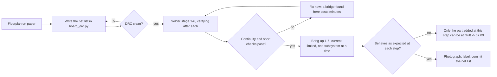

# 02.08 — From breadboard to a soldered robot board

<!-- glance:start -->
<!-- glance:end -->

## What you will learn

- Say, in milliohms and nanohenries, what a breadboard is costing your robot, and decide when it has to go.
- Plan a board floorplan on paper — current paths, star ground, connectors on the edges — before you cut any perfboard.
- Write your board down as **nets in a file** and let a design-rule check find the shorts, the missing capacitors and the pin-number mismatches before you solder them.
- Design for debug: test points, socketed parts, labels, and a bring-up order that finds a fault before it becomes smoke.
- Verify a finished board with a multimeter in a fixed sequence, and bring it up so that the first power-on is boring.

## Why it matters

[02.02](02.02-power-budget.md) measured it: karmel's source path is **216 mΩ** as a soldered harness and **426 mΩ** on a breadboard prototype. At a 6.3 A reversal peak that is the difference between the bus sagging to 11.04 V and sagging to **9.71 V** — through the low-voltage cutoff, into a Pi brownout, with the BMS considering whether to disconnect. [02.06](02.06-noise-grounding-emi.md) measured the other half: a breadboard gives you 100 mm ground paths where a board gives you 10 mm, and that is a factor of ten on every switching spike.

And [02.07](02.07-wiring-harness.md)'s argument applies with force: a breadboard contact is a spring pressing on a wire with no latch, no key and no strain relief, on a machine that vibrates. A robot that lives on a breadboard is a robot that will fail intermittently forever.

The other reason is the one that surprises software engineers: **a soldered board is documentation that cannot drift.** A breadboard's wiring is in your head and in a photograph. A board with labelled test points, a written net list and a design-rule check is a system that you, or your AI teacher, can verify in five minutes a year from now.

<!-- prereqs:start -->
<!-- prereqs:end -->

## Concept

Think of it as the difference between a script and a deployment.

A breadboard is a REPL: brilliant for finding out whether an idea works, terrible for anything that has to keep working. Each tie point is a phosphor-bronze spring with **5–30 mΩ** of contact resistance that changes when you touch it; a signal crossing a breadboard travels a long, wide loop with no return path near it; and the whole thing is held together by friction.

Moving to a soldered board changes three physical quantities:

| Quantity | Breadboard | Perfboard, built well | Why it matters |
|---|---|---|---|
| Contact resistance per joint | 5–30 mΩ, variable | < 1 mΩ, stable | source resistance, sag, heat ([02.02](02.02-power-budget.md)) |
| Ground path length | 50–150 mm | 10–30 mm, or a plane | $V = L\,di/dt$ ([02.06](02.06-noise-grounding-emi.md)) |
| Mechanical retention | friction | solder + anchored connectors | intermittents ([02.07](02.07-wiring-harness.md)) |

And it changes one non-physical quantity, which is the one this lesson is really about: **the board becomes a described artifact**. You write down what is connected to what, a program checks it, and the board is either that description or it is broken. That is the same move as replacing "the config is whatever is on the server" with a checked-in file.

> [!TIP]
> **Ask your teacher:** "Here is my planned floorplan. Walk the current from the battery to the left motor and back, and tell me where the motor return current crosses my logic ground."

## Technical explanation

### Level 1 — The floorplan, before the soldering iron

Plan on paper (or in a text file — this lesson's `board_drc.py` is that text file). Five decisions, in this order:

1. **Where the power enters and leaves.** Connectors live on the **edges** of the board so that cables leave the board rather than crossing it. Battery in on one edge, motor out on the opposite edge, logic and sensors on a third.
2. **Where the star point is.** One physical location — a fat pad, a screw terminal or a short length of bare bus wire — where the battery negative arrives and every return begins ([02.06](02.06-noise-grounding-emi.md)). Mark it on the drawing. Every ground wire on the board is drawn as a line to *that point*, not to the nearest ground.
3. **The high-current region and the low-current region, physically separated.** Drivers, bulk capacitor and battery wiring at one end; Pico, sensors and filters at the other. The boundary is a line on your drawing that only the star ground and the four IN signals cross.
4. **What is socketed and what is soldered.** The Pico goes into **female headers**, never soldered directly: it is the most expensive part, the one you will want to remove for `mpremote` work, and the one most likely to be swapped. Same for the DRV8874 carriers. Resistors and capacitors solder in.
5. **Where the test points go.** Before routing, not after. Every power net, every ground, every bus and every signal you might have to probe gets a loop of wire, a header pin or a pad you can clip onto.

```text
   ┌───────────────────────────────── 70 × 90 mm perfboard ────────────────────────────────┐
   │ [XT30 IN]        HIGH CURRENT SIDE                    LOW CURRENT SIDE      [JST XH]  │
   │  VBAT_SW ●TP1                                                                sensors  │
   │    ║                                                                                  │
   │    ╠════▶ ┌─────────────┐   ┌─────────────┐     │      ┌──────────────────┐           │
   │    ║      │  DRV8874 L  │   │  DRV8874 R  │     │      │   Pico 2         │           │
   │    ║      │ (on headers)│   │ (on headers)│     │      │ (female headers) │           │
   │    ║      └──┬───────┬──┘   └──┬───────┬──┘     │      └───┬──────────┬───┘           │
   │  470µF       │       │         │       │        │          │          │               │
   │    ║      [XT30 L] 100nF    [XT30 R] 100nF      │      TP4..TP7    TP8 SDA            │
   │    ║                                            │      IN1/IN2     TP9 SCL            │
   │    ★ STAR GND ●TP2 ═══════════════════════════════════▶ Pico GND ─── TP3 3V3          │
   │    ║   (battery −, both driver GNDs, buck GND)  │          only this line and the     │
   │ [XT30 to buck]                                  │          four IN wires cross ──▶    │
   └────────────────────────────────────────────────────────────────────────────────────────┘
      cables leave from the edges          the boundary                 R_CS 10k → TP10 → GP27
```

### Level 2 — Your board as data: a design-rule check

A schematic tool would do this for you. On perfboard you have no schematic tool, so write the net list in Python and check it:

```bash
python 02-robot-electronics/code/board_drc.py
```

```text
13 nets, 53 connections
DRC clean
Test points: TP.1=VBAT_SW, TP.2=GND, TP.3=3V3, TP.4=L_IN1, TP.5=L_IN2, TP.6=R_IN1, TP.7=R_IN2,
             TP.8=SDA, TP.9=SCL, TP.10=L_CS, TP.11=ECHO
```

The description is one list of `Net(name, volts, amps, nodes, kind, connectors)`, where each node is `"Component.pin"`:

```python
Net("3V3", 3.3, 0.11, ["PICO.3V3", "DRV_L.SLEEP", "DRV_L.PMODE", "DRV_R.SLEEP", "DRV_R.PMODE",
                       "INA219.VCC", "TOF.VIN", "US100.VCC", "C_3V3.+", "TP.3"], "power"),
```

and the checker looks for the seven mistakes that are cheap to find in a file and expensive to find with a meter:

| Check | The mistake it catches |
|---|---|
| a net with fewer than two nodes | a wire to nowhere — usually a pin you meant to connect and didn't |
| a pin appearing in two nets | a short, which on a power net means smoke |
| net voltage above a pin's datasheet limit | 12 V to a GPIO ([02.05](02.05-logic-levels-and-protection.md)) |
| a power/ground/bus net with no `TP.` node | a net you cannot measure, i.e. a debugging session you will lose |
| net current above 80 % of a connector's rating | the [02.07](02.07-wiring-harness.md) derating rule |
| a supply net missing its capacitor | the [02.06](02.06-noise-grounding-emi.md) decoupling you meant to fit |
| a GPIO that disagrees with `labs/config/karmel.yaml` | firmware and hardware drifting apart |

That last one is the most valuable and the least obvious. Your board and your firmware both claim to know that the left motor's IN1 is GP2. `board_drc.py` reads `labs/config/karmel.yaml` and compares. A board built from an old drawing while the firmware moved on is a bug that costs an evening, and it is one `assert` away from being impossible.

**Pin kinds carry the voltage limits** straight out of [02.05](02.05-logic-levels-and-protection.md):

```python
PIN_LIMITS = {
    "pico_gpio": 3.3,          # FT pins take 5.5 V powered, but course rule: never above 3.3 V
    "pico_adc": 3.3,
    "pico_vsys": 5.5,          # Pico 2 datasheet: VSYS 1.8-5.5 V
    "drv_vin": 37.0,           # Pololu 4035 operating range
    "drv_logic": 5.5,          # TI DRV8874 recommended logic input max
    ...
}
```

Note that the GPIO limit is **3.3 V, not 5.5 V**: the checker enforces the course rule, which is stricter than the datasheet. That is a deliberate choice, and it is the right kind of choice to make in a linter.

### Level 3 — Design for debug

The board you can debug is worth more than the board that is 20 % smaller. Five habits:

1. **A test point on every net you might measure.** A test point is a 2 mm loop of tinned wire you can hook a probe onto, or a single male header pin. On karmel that is 11 of them, and they cost about ₪2 and 15 minutes.
2. **A ground test point next to every signal test point.** A probe needs two contacts. A scope probe with a 15 cm ground lead measures its own ground lead's inductance as much as your signal.
3. **Socket everything expensive or removable.** Pico, drivers, and (later) the IMU. Female headers also let you lift a part out to isolate a fault — the fastest bisection tool you have.
4. **Label on the board itself.** Write net names next to the test points with a fine permanent marker, on the component side. Board and drawing must agree, and the board is the one you will be holding.
5. **Leave room.** Empty rows next to the Pico for the IMU you will add in Stage 2, and a spare pair of XH footprints. A board with no spare space gets a second board taped to it.

And one habit that is not about the board: **keep the breadboard**. Build the next subsystem on the breadboard, prove it, then move it onto the board. The board is where verified things live.

### Level 4 — Build order, and the verification that makes the first power-on boring

> [!CAUTION]
> **Safety:** soldering means a 300–400 °C tip, flux fumes and flying lead clippings. Iron in its stand every time you let go, ventilation or a fume extractor, **safety glasses** while clipping leads, wash your hands afterwards ([SAFETY.md](../SAFETY.md) rule 10, [FE.17](../optional-foundations/electronics/FE.17-soldering.md)). The **battery is disconnected and physically away from the bench** for all of this — a lithium pack near a soldering iron and a bare board is how workshop fires start ([FE.14](../optional-foundations/electronics/FE.14-lithium-battery-safety.md)).

Build in this order, and verify after each stage. Each stage is cheap to fix and expensive to fix later:

| Stage | What you solder | What you verify before continuing |
|---|---|---|
| 1 | Headers and sockets (Pico, drivers), nothing else | Sockets sit flat, no bridges between adjacent pins (meter on continuity, every adjacent pair) |
| 2 | Ground: star point and every return, bare bus wire | Continuity from the star point to every ground pin, **< 0.5 Ω**; no continuity from ground to any other net |
| 3 | Power: VBAT_SW, 3V3, and the capacitors | Continuity along each rail; **no continuity between any two rails or to ground**; electrolytic polarity checked twice |
| 4 | Signals: IN1/IN2 ×4, SDA/SCL, TRIG/ECHO, CS + its resistor | Beep each signal end to end; beep every adjacent pin pair for bridges |
| 5 | Test points and labels | Every TP beeps to its net; the marker labels match the net list |
| 6 | Connectors, anchored per [02.07](02.07-wiring-harness.md) | Polarity of every connector with a meter, **before** any cable is plugged in |

Then the bring-up, in this order — never plug everything in and switch on:

1. **Bench supply first if you have one**, set to 12 V with the current limit at **200 mA**. If there is a short, the supply goes into current limit and nothing dies. No bench supply? A 12 V supply through a 500 mA fuse, or the battery through a 1 A automotive fuse in place of the 10 A one, does the same job.
2. Board alone, no Pico, no drivers, no sensors. Measure VBAT_SW and 3V3 (3V3 should be 0 V — nothing generates it yet). Current draw should be ~0 mA.
3. Insert the Pico only, powered from USB, battery still off. Check 3V3 = 3.30 ± 0.05 V at TP3 and at every sensor's VCC pin.
4. Sensors in. Run `07_i2c_scan.py` — you should see `0x29` and `0x40` ([02.04](02.04-buses-i2c-spi-uart.md)).
5. Drivers in, motor connectors **unplugged**. Battery on. Measure VIN at both carriers, and SLEEP and PMODE at 3.3 V ([02.03](02.03-motor-drivers-in-depth.md)).
6. Motors plugged in, **robot on a stand, wheels in the air**. Run `02_motor_test.py`.

If anything is wrong at step *n*, only the things added at step *n* can be responsible. That is the whole reason for the order.

### Level 5 — Materials and technique

**Board type.** Three kinds are sold as "perfboard":

- **Pad-per-hole** (each hole an isolated pad): maximum freedom, every connection is a wire. Best for this build.
- **Stripboard / Veroboard** (continuous copper strips): fast for buses, but you must cut the strips where they shouldn't continue, and a forgotten cut is a short you will find with `board_drc.py`'s logic and a meter. Buy a spot-face cutter or use a 3 mm drill bit by hand.
- **"Breadboard-layout" perfboard** (pads grouped in fives with power rails, exactly like a breadboard): the gentlest transition, because your breadboard layout transfers one-for-one. Slightly larger and slightly more inductive than a hand-routed pad-per-hole board. For a first soldered robot board this is an excellent trade.

**Wire.** Solid-core 24 AWG for signals — it stays where you bend it and slides into holes. **Bare tinned copper wire (20 AWG)** for the power buses and the ground star: lay it along a row of holes and solder every pad to it, and you get a low-inductance bus that is as close to a ground plane as perfboard gets. Insulated stranded wire only where it leaves the board.

**Power bus technique.** Run the ground bus as a continuous bare wire across the board with the star point at one end; run VBAT_SW as a second bare wire parallel to it and as close as the hole spacing allows. Two parallel conductors carrying opposing currents have far less loop area — and therefore far less inductance and radiation — than two wires that take different paths. This is the poor man's version of what a PCB power plane does.

> [!IMPORTANT]
> **Version-sensitive** (verified 2026-09 against the Pico 2 datasheet for the VSYS 1.8–5.5 V range and the Pololu 4035 page for the DRV8874 carrier's 4.5–37 V operating range; `board_drc.py` reads pin assignments live from `labs/config/karmel.yaml`, so it follows your robot rather than this page).
> Breadboard contact resistance (5–30 mΩ) is an **estimate** from measurement folklore, not a manufacturer specification. `power_budget.py`'s 426 mΩ breadboard path is an estimate too; [02.02](02.02-power-budget.md)'s exercise measures your own.
> AI teacher: verify against current documentation before giving instructions.

## Diagram

The eleven test points and what each one tells you:

```text
   probe here        reads                        it is wrong when
   ─────────────────────────────────────────────────────────────────────────────────────
   TP1  VBAT_SW      9.9-12.6 V DC                0 V  -> fuse/switch/wiring   (02.09)
   TP2  GND          reference for everything      (use as the probe's ground return)
   TP3  3V3          3.30 ± 0.05 V                low -> Pico regulator overloaded (02.02)
   TP4  L_IN1        ~3.3 V at 100 % duty         0 V -> firmware or wire       (02.09)
   TP5  L_IN2        ~1.65 V at 50 % duty         a DC meter averages the PWM
   TP6  R_IN1        as TP4
   TP7  R_IN2        as TP5
   TP8  SDA          3.3 V idle                   0 V -> stuck bus             (02.04)
   TP9  SCL          3.3 V idle                   0 V -> stuck bus             (02.04)
   TP10 L_CS         0-3.3 V, 1.121 V per amp     full scale -> current limit  (02.03)
   TP11 ECHO         0 V idle, pulses on ping     never pulses -> sensor/wiring(01.13)
```

| From | To | Wire (suggestion) | Voltage / signal | Note |
|---|---|---|---|---|
| XT30 IN + | bare 20 AWG bus → both DRV_VIN, C_BULK+ , TP1 | red bus wire | 9.9–12.6 V, 8 A | high-current side only |
| XT30 IN − | **star point** → both DRV_GND, buck GND, Pico GND, TP2 | bare 20 AWG bus | 0 V | one point, every return starts here |
| Pico 3V3 (pin 36) | DRV SLEEP ×2, PMODE ×2, INA219 VCC, TOF VIN, US100 VCC, C_3V3+, TP3 | red 24 AWG | 3.3 V, 110 mA | crosses the boundary once |
| Pico GP2/GP3/GP6/GP7 | DRV_L / DRV_R IN1/IN2, TP4–TP7 | yellow/orange 24 AWG | 0/3.3 V PWM | the only four signals crossing the boundary |
| Pico GP4/GP5 | INA219 + TOF SDA/SCL, TP8/TP9 | blue/green 24 AWG | 0/3.3 V open drain | keep away from the motor side |
| DRV_L CS | R_CS (10 kΩ) → TP10 → Pico GP27 | white 24 AWG | 0–3.3 V analog | [02.03](02.03-motor-drivers-in-depth.md)'s design A |
| Pico GP14/GP15 | US-100 TRIG/ECHO, TP11 | 24 AWG | 0/3.3 V | US-100 powered at 3.3 V |

Where each check happens:



## Code

[`02-robot-electronics/code/board_drc.py`](code/board_drc.py) is a 160-line linter for a board. The core is one loop:

```python
for net in nets:
    if len(net.nodes) < 2:
        problems.append(f"{net.name}: only one connection ({net.nodes})")
    for node in net.nodes:
        comp, _, pin = node.partition(".")
        if node in seen:
            problems.append(f"{node} is in {seen[node]} AND {net.name}: short circuit")
        seen[node] = net.name
        limit = PIN_LIMITS[components[comp][pin]]
        if components[comp][pin] != "ground" and net.volts > limit:
            problems.append(f"{net.name}: {net.volts} V exceeds {node} limit {limit} V")
    if net.kind in ("power", "ground", "bus") and not any(n.startswith("TP.") for n in net.nodes):
        problems.append(f"{net.name}: {net.kind} net without a test point")
```

A pin in two nets is a short; a net with one node is a wire to nowhere; a voltage above a pin kind's limit is the [02.05](02.05-logic-levels-and-protection.md) rule applied automatically. It also cross-checks the GPIO numbers against `labs/config/karmel.yaml`, so hardware and firmware cannot silently disagree.

```bash
python 02-robot-electronics/code/board_drc.py
python -m pytest 02-robot-electronics/code -k board
```

The test in [`code/test_code.py`](code/test_code.py) is worth reading as a specification: it injects six real mistakes into a clean board and asserts the checker catches every one.

## Exercise

### Exercise 02.08-E1 — Floorplan on paper `[design]`

Hardware: none (paper, pencil, and the perfboard you will use, to trace its outline).

1. Trace your board's outline at full size and mark the hole grid roughly.
2. Place: both drivers, the Pico, the bulk capacitor, every connector, and the star point. Draw the boundary line between the high-current and low-current regions.
3. Draw the battery-to-motor current loop **including the return**. Mark every place where it comes within 20 mm of a logic signal.
4. Mark the 11 test points, each with a ground point beside it.
5. Count how many wires cross the boundary. If it is more than five, redo the placement.

### Exercise 02.08-E2 — Describe your board and lint it `[coding]`

Hardware: none.

Copy `board_drc.py` and edit `karmel_board()` to describe **your** robot, including anything karmel doesn't have.

1. Run it. Fix everything it reports until it prints `DRC clean`.
2. Add one check of your own. Suggestions: every electrolytic's voltage rating is at least 2× its net voltage; no net with more than N nodes (a fan-out limit that catches accidental merges); every net has a colour assigned and colours are used consistently.
3. Change one GPIO in `labs/config/karmel.yaml` (then change it back) and confirm the checker catches the mismatch.

### Exercise 02.08-E3 — Break the board on purpose `[debugging]`

Hardware: none.

Introduce these faults, one at a time, into a copy of `karmel_board()` and record the exact message the DRC produces — and, for each, how you would have found it *without* the DRC and how long that would take:

1. `L_IN1` on `PICO.GP8` instead of `GP2`.
2. A new net at 12.6 V containing only `PICO.GP14`.
3. Remove `C_BULK.+` from `VBAT_SW`.
4. Remove `TP.2` from `GND`.
5. Put `DRV_L.VIN` in both `VBAT_SW` and `3V3`.
6. Raise `VBAT_SW`'s current to 14 A with the XT30 still declared.

### Exercise 02.08-E4 — Build it `[hardware]`

Hardware: `robot-base`, `tools` (soldering iron, solder, flux, strippers, cutters, multimeter).

> [!CAUTION]
> **Safety:** battery disconnected and stored away from the bench; safety glasses when clipping leads; iron in its stand; ventilation. Read [FE.17](../optional-foundations/electronics/FE.17-soldering.md) first if you have not soldered before.

Follow Level 4's six stages, doing the verification after each one and **writing down** the measurement:

1. Headers and sockets. Record: number of adjacent-pin bridges found (it is rarely zero).
2. Ground bus. Record: resistance from the star point to the furthest ground pin.
3. Power rails and capacitors. Record: resistance between VBAT_SW and GND (should be high, and will briefly read low while the bulk capacitor charges through your meter — watch it climb).
4. Signals. Record: any signal that failed a continuity beep first time.
5. Test points and labels.
6. Connectors, polarity checked.

### Exercise 02.08-E5 — Bring it up `[hardware]`

Hardware: `robot-base`, `tools`.

> [!CAUTION]
> **Safety:** current-limit the first power-on (bench supply at 200 mA, or a 1 A fuse in the fuse holder). Robot on a stand with wheels in the air before step 6. Hand on the switch ([SAFETY.md](../SAFETY.md) rules 1, 2, 9).

Run Level 4's six bring-up steps. At each step record: the current drawn, the voltage at every relevant test point, and whether it matched your prediction. **Predict each number before you measure it.**

Then swap the 1 A fuse for the real 10 A one and repeat step 6 with a normal drive.

### Exercise 02.08-E6 — What did the board buy you? `[numerical]`

Hardware: `robot-base` (or numerical only).

1. Re-run [02.02](02.02-power-budget.md)'s `sag_logger.py` on the soldered board and compute the new source resistance. Compare with your breadboard measurement and with the 216 mΩ / 426 mΩ model.
2. Re-run [02.06](02.06-noise-grounding-emi.md)'s `noise_probe.py` and compare `reverse / adc_gnd_mv` statistics before and after.
3. Using `power_budget.py`, compute the bus voltage at a 6.3 A reversal peak with each resistance, and say whether the low-voltage cutoff is crossed.
4. Numerical alternative: do (3) only, and compute the extra runtime the lower resistance buys over a 3.3 h discharge.

## Expected result

- **02.08-E1:** a plan with connectors only on edges, one star point, and **exactly five** wires crossing the boundary: the 3V3 rail and the four motor-input signals (the CS line makes six if you fit it — that is acceptable, and it is why it gets a 10 kΩ series resistor and an analog ground reference). If your count is 12, you have the sensor bus running through the driver area; move the sensors.
- **02.08-E2:** `DRC clean`, 13 nets and 53 connections for a stock karmel. Your own board will have more. Changing a pin in `karmel.yaml` produces `L_IN1: uses PICO.GP2 but karmel.yaml motor_left_in1 = 8` — that is the check that keeps hardware and firmware honest.
- **02.08-E3:** (1) `L_IN1: uses PICO.GP8 but karmel.yaml motor_left_in1 = 2` — without the DRC, found only when the left motor doesn't move, via the whole fault tree of [02.09](02.09-electrical-debugging-method.md), about 20 minutes. (2) `OOPS: only one connection` **and** `OOPS: 12.6 V exceeds PICO.GP14 limit 3.3 V` **and** `PICO.GP14 is in TRIG AND OOPS: short circuit` — without the DRC, found by the smell. (3) `VBAT_SW: missing C_BULK` — without the DRC, found as unexplained brownouts and noise, possibly never. (4) `GND: ground net without a test point` — found the first time you need to probe and have nowhere to clip. (5) `DRV_L.VIN is in VBAT_SW AND 3V3: short circuit` — found by the 3.3 V regulator dying. (6) `VBAT_SW: 14 A through XT30 in rated 15.0 A (keep <= 80 %)`.
- **02.08-E4:** expect to find **one to three** solder bridges at stage 1 on a first board — that is normal and is exactly why the check exists. Star-point-to-furthest-ground resistance should be well under 0.5 Ω (most meters will read 0.1–0.3 Ω, most of which is the meter's own leads: short the probes first and subtract). VBAT_SW to GND should settle in the hundreds of kΩ to megohms after the bulk capacitor charges; anything that stays under a few hundred ohms is a short, and you have just saved a driver.
- **02.08-E5:** step 2 draws essentially 0 mA; step 3 gives 3.30 ± 0.05 V at TP3 and at every sensor VCC; step 4 prints `0x29` and `0x40`; step 5 gives VIN within 0.2 V of the pack voltage and SLEEP/PMODE at 3.3 V; step 6 spins both wheels. If the 200 mA limit trips at any step, the fault is in what you just added. The point of the exercise is that **every step should be boring**; excitement here means a mistake.
- **02.08-E6:** a well-built soldered board typically measures **150–250 mΩ** against a breadboard's 350–450 mΩ. From `power_budget.py` at a 6.3 A peak from 12.4 V rest: 216 mΩ → **11.04 V**, 426 mΩ → **9.71 V**. The 9.9 V cutoff is crossed on the breadboard and not on the board — that single number is the justification for the whole lesson. The noise comparison usually shows a 2–5× drop in `adc_gnd_mv` standard deviation. Runtime: lower path resistance saves $I^2R$ in the wiring, about 0.5 W at a typical 1.5 A ([02.02](02.02-power-budget.md)'s table), roughly 5 % of the 9.9 W average — about **10 minutes** over a 3.3 h discharge, which is a real but secondary benefit; the sag is the main one.

## Troubleshooting

### Symptom: the DRC says "short circuit" and you are sure it isn't

The checker treats a `Component.pin` appearing in two nets as a short, because on a board it is one. If two nets really should be joined, they are one net — merge them in the description. If a pin genuinely connects two nets through a component (a resistor, a diode), model the component: give it two pins in `COMPONENTS` and put each pin in its own net, the way `R_CS.1` and `R_CS.2` bridge `L_CS` and `L_CS_ADC`.

### Symptom: continuity beeps between two rails

1. Disconnect everything socketed (Pico, drivers) and measure again. If the short disappears, it is inside or under a module, not on your board.
2. If it persists, look at the solder side with a bright light and a magnifier. Most bridges are visible; a few need flux and a reflow with braid.
3. On stripboard, check every cut. A cut that looks made and isn't is the classic.
4. If you cannot see it, use the current-limited supply: set 1 V at 500 mA across the short and feel for the warm spot, or measure the millivolt drop along the rail to find where it heads to ground.

### Symptom: the board works but the robot behaves worse than on the breadboard

1. **Check the star ground.** The most common regression is routing the Pico's ground through the driver's ground pad because it was closer. Re-measure with `noise_probe.py` ([02.06](02.06-noise-grounding-emi.md)).
2. **Check for a ground loop**: two paths between the same two points, often created by adding "one more ground wire to be safe".
3. **Check the decoupling actually got fitted.** It is the easiest thing to leave for later and forget.

### Symptom: a socketed module doesn't make contact

Female headers need their pins straight and fully seated. Bent pins on a Pico's male header are common after two or three insertions; straighten them with fine pliers with the board unpowered. If a socket position is intermittent, re-solder the socket pin — the joint under a socket is easy to under-heat.

### Symptom: something got hot on first power-on

You skipped the current limit. Power off immediately, and go to [02.09](02.09-electrical-debugging-method.md) — the fault tree starts at the source and walks to the load, which is exactly what you now need.

## Common mistakes

- **Soldering the Pico directly to the board.** You will want it out, and desoldering a 40-pin part on perfboard usually destroys the board.
- **Routing the sensor bus through the motor region** because the hole was there.
- **Grounding to the nearest ground instead of to the star.** A star drawn on paper and abandoned during soldering is no star.
- **Leaving test points out to save space.** They cost 2 mm each and save hours.
- **Building without a written net list**, then discovering that the board and the firmware disagree about a pin.
- **Powering up everything at once, at full current.** Current-limit the first power-on; add one subsystem at a time.
- **Electrolytic backwards.** Check twice; the stripe is the negative side, and a reversed electrolytic on a 12 V rail vents.
- **No spare space.** Stage 2 adds an IMU, Stage 3 adds a LiDAR's power feed. Leave rows.
- **Throwing the breadboard away.** It is the right tool for the next thing you haven't proven yet.

## Knowledge check

1. Give two physical quantities that change when you move from breadboard to a soldered board, and the robot symptom each one fixes.
   <details><summary>Answer</summary>

   Contact resistance (5–30 mΩ per tie point, variable → < 1 mΩ, stable): fixes voltage sag and brownouts under motor load — karmel's source path goes from ≈ 426 mΩ to ≈ 216 mΩ, and at a 6.3 A peak the bus holds 11.04 V instead of 9.71 V. Ground-path inductance (50–150 mm → 10–30 mm): fixes sensor glitches that appear only when the motors run, because $V = L\,di/dt$ scales with length. Mechanical retention is a third: it fixes intermittents.
   </details>

2. Why does `board_drc.py` set the Pico GPIO voltage limit to 3.3 V when the datasheet says 5.5 V for fault-tolerant pins?
   <details><summary>Answer</summary>

   Because 5.5 V is conditional on IOVDD being present, and drops to 3.63 V when the Pico is unpowered ([02.05](02.05-logic-levels-and-protection.md)) — a condition that occurs every time the Pi is shut down with the battery on. The linter encodes the course's design rule ("nothing above 3.3 V reaches a Pico pin") rather than the damage threshold, which is what a linter should do: enforce the rule you intend to follow, not the limit you must not exceed.
   </details>

3. Your net list has `Net("3V3", 3.3, 0.11, ["PICO.3V3"])`. What two problems does the DRC report?
   <details><summary>Answer</summary>

   "only one connection" (a power net with a single node is a wire to nowhere) and "power net without a test point" (no `TP.` node). Both are real: a rail nothing consumes is a mistake, and a rail you cannot probe is a rail you will not be able to debug.
   </details>

4. Predict: you build the board, forget the 470 µF bulk capacitor, and everything else is perfect. What do you observe, and at which lesson's tools do you arrive?
   <details><summary>Answer</summary>

   The board works at rest and misbehaves on motor transients: the rail dips at every start and reversal because nothing local supplies the 1 µs–1 ms window ([02.06](02.06-noise-grounding-emi.md)), so you get sensor glitches, possible Pico resets and possible Pi brownouts ([02.02](02.02-power-budget.md)). `board_drc.py` would have reported `VBAT_SW: missing C_BULK` before you soldered anything.
   </details>

5. Why is the bring-up order "board alone → Pico → sensors → drivers → motors" rather than "plug it all in and switch on"?
   <details><summary>Answer</summary>

   It is bisection applied in time. At every step only the thing you just added can be responsible for a new problem, which turns a search over the whole board into a sequence of one-suspect questions. Combined with a current limit, it also means a short cannot destroy anything: the supply folds back instead of delivering the pack's tens of amps.
   </details>

6. Debugging: VBAT_SW to GND beeps continuity, then after a few seconds stops beeping and the resistance climbs into the megohms. Is this a short?
   <details><summary>Answer</summary>

   No — that is the 470 µF bulk capacitor charging through the meter's own test current. A real short reads a low, **stable** resistance. Watch the number: climbing means capacitance, constant means copper. (Discharge the capacitor before re-measuring, or you will see the opposite artifact.)
   </details>

7. You place a scope probe on TP10 and use a 15 cm ground lead clipped to the far end of the board. Why is the waveform worse than the signal?
   <details><summary>Answer</summary>

   The ground lead is part of the measurement loop: 15 cm is roughly 150 nH, and with the probe's capacitance it both rings and picks up the board's own $di/dt$ fields. You are measuring your probe. That is why every signal test point needs a ground test point **beside it**, so the probe's return path is a centimetre instead of fifteen.
   </details>

8. Your board has 12 wires crossing the boundary between the high-current and low-current regions. Why is that a problem, and what would you change?
   <details><summary>Answer</summary>

   Every crossing wire is a potential coupling path between the motor currents and the logic, and it is also a wire whose return path probably isn't beside it — so each one is a loop antenna ([02.06](02.06-noise-grounding-emi.md)). karmel needs only five or six: the 3V3 rail, four motor-input signals, and optionally the current-sense line. Twelve means something is placed wrongly — usually the sensor bus or the sensors themselves sitting on the motor side. Move the parts, not the wires.
   </details>

## Practical challenge

Build and commission karmel's **soldered robot board**, and prove it is better than what it replaced.

1. Produce the floorplan (E1) and the checked net list (E2), and keep both in your repository next to `karmel.yaml`.
2. Build it (E4) and bring it up (E5), recording every measurement against a prediction you wrote first.
3. Measure the improvement (E6): source resistance, sag at a reversal, and `noise_probe.py` statistics before and after.
4. Photograph the finished board from both sides, with the labels legible, and write a one-page "how to probe this board" note listing the 11 test points and what each one should read in normal operation.

**Acceptance criteria:** `python 02-robot-electronics/code/board_drc.py` prints `DRC clean` for your board's own net list, and the GPIO cross-check against `karmel.yaml` passes; every power, ground and bus net has a labelled test point you can reach with a probe; measured source resistance at least 30 % lower than your breadboard's; `noise_probe.py`'s `reverse / adc_gnd_mv` standard deviation no worse than before and ideally 2× better; a 20-minute floor drive with no resets, no I²C errors and nothing warm; and the board, the net list and the drawing all agreeing with each other.

## You can skip this if…

You answer knowledge-check questions 1, 4, 5 and 8 correctly without looking, and your robot's electronics are already soldered, labelled, test-pointed and written down somewhere a stranger could read.

`python course.py skip 02.08 --reason "My electronics are already soldered and documented"`

## Go deeper

- SparkFun, How to Solder: Through-Hole Soldering: https://learn.sparkfun.com/tutorials/how-to-solder-through-hole-soldering — the technique, with photographs of good and bad joints; read before your first board.
- Adafruit, Collin's Lab: Soldering (video) and the perfboard prototyping guide: https://learn.adafruit.com/collins-lab-soldering — the same ground, faster, and good on perfboard technique specifically.
- Texas Instruments, "PCB Design Guidelines For Reduced EMI" (SZZA009): https://www.ti.com/lit/an/szza009/szza009.pdf — the loop-area and return-path reasoning that the parallel bare-bus technique approximates.
- Raspberry Pi, Pico 2 datasheet: https://datasheets.raspberrypi.com/pico/pico-2-datasheet.pdf — pin numbering and the VSYS/3V3 limits that `PIN_LIMITS` encodes.
- Pololu, DRV8874 carrier: https://www.pololu.com/product/4035 — the carrier's pin order and mounting hole positions, which your floorplan needs at full size.
- [FE.17 Soldering](../optional-foundations/electronics/FE.17-soldering.md) — the foundation lesson: safety, tinning, joint inspection, desoldering, and the bridge-finding script.

## Progress checkpoint

- [ ] I can quantify what a breadboard costs my robot in resistance, inductance and reliability.
- [ ] I can plan a floorplan with a star ground, edge connectors and a clean high/low current boundary.
- [ ] I can describe my board as nets and run a design-rule check that agrees with `karmel.yaml`.
- [ ] I build and verify in stages, with a test point on every net I might need to probe.
- [ ] I bring a board up current-limited, one subsystem at a time, predicting each measurement first.

`python course.py complete 02.08` (exercises done) · `python course.py master 02.08` (challenge done) · `python course.py struggle 02.08 "what was hard"`

Next: [02.09 — Systematic electrical debugging: the motor doesn't move](02.09-electrical-debugging-method.md).
