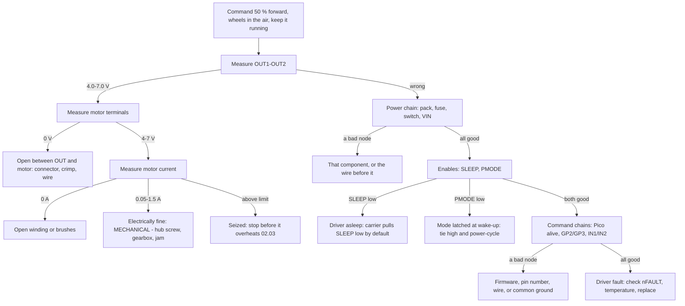

# 02.09 — Systematic electrical debugging: the motor doesn't move

<!-- glance:start -->
<!-- glance:end -->

## What you will learn

- Debug hardware the way you debug software: reproduce, measure state, bisect — instead of swapping parts and hoping.
- Walk the "the motor doesn't move" fault tree from source to load, measuring at every node, and name the exact component that failed.
- Choose between walking a chain and bisecting it, and say how many measurements each one costs.
- Measure correctly with a DC multimeter on a live, PWM-driven circuit — including the readings that look wrong and aren't.
- Write your own fault tree down as code, so the next person (or the next you) debugs in five minutes instead of an evening.

## Why it matters

Every hardware failure you will meet in this course produces the same two words: *nothing happens*. The wheel doesn't turn, the sensor doesn't answer, the Pi doesn't boot. And the default human response — swap the driver, swap the wire, reflash the firmware, try a different USB port — is the hardware equivalent of fixing a bug by randomly editing lines. Sometimes it works. It never teaches you anything, and it costs a part every time it doesn't.

You already have the right instinct from software: you don't guess, you inspect state. A multimeter is a debugger and every connection is a variable you can read. The only thing missing is the ordering — *which* variable to read first — and that is what a fault tree is.

This is also the most reusable lesson in the module. The method here is what you will apply in module 07 when a sensor stops answering, in module 12 when the robot drives into a wall, and in Stage 5 when one servo on a daisy chain stops responding. The domain changes; source-to-load bisection does not.

<!-- prereqs:start -->
<!-- prereqs:end -->

## Concept

Four rules, and the first one is the one people skip.

**1. Reproduce it on demand, with the smallest possible command.** "It sometimes doesn't move" is not a bug you can debug. `mpremote` running one motor at a fixed 50 % duty, on a stand, is. If you cannot make it fail reliably, that is the bug you work on first — see the Troubleshooting section on intermittents.

**2. Measure from the source to the load, not from the symptom.** Power reaches the motor through a chain: battery → fuse → switch → driver VIN. Commands reach it through another: Pico → GPIO → wire → IN pins. Both chains have the property that makes them easy: **once a point is bad, every point after it is bad too.** Start at one end and you are never confused about direction.

**3. One variable at a time.** Change one thing, measure, change it back. Two changes at once and you learn nothing from either.

**4. Write the measurements down as you go.** Not because you will forget, but because the pattern in the numbers is usually the answer, and you cannot see a pattern you didn't record. `fault_tree.py` returns its measurement log for exactly this reason.

The .NET analogy is exact. A daisy-chained power path is a call stack: the exception surfaces at the top, and the cause is somewhere below. You would not fix it by replacing the top frame. You would set a breakpoint in the middle, look at the state, and halve the search. A multimeter probe is a breakpoint and a voltage is a local variable.

There is one hardware-specific twist that software doesn't have: **measure the live, commanded circuit.** A continuity test on a dead board tells you about copper, not about behaviour. Most real faults — a driver asleep, a firmware that isn't driving a pin, a connector that opens under vibration — are invisible with the power off.

> [!TIP]
> **Ask your teacher:** "Give me a set of meter readings from a karmel with one injected fault, without telling me which, and make me name the component."

## Technical explanation

### Level 1 — The fault tree for "the motor doesn't move"

The structure is not one chain, it is a small tree with one decisive first question:

```text
   COMMAND: 50 % forward, drive/brake, wheels in the air, kept running while you measure.

   Q0: measure OUT1-OUT2 at the carrier ..................... expect ≈ duty × VIN ≈ 5.8 V
        │
        ├── OK  ─▶ the driver is doing its job. The fault is downstream (or mechanical).
        │          ├── motor terminals 0 V   ─▶ open circuit: connector, crimp, wire
        │          ├── volts but no current  ─▶ open winding or brushes
        │          └── volts and current OK  ─▶ MECHANICAL: hub set screw, gearbox, jam
        │
        └── BAD ─▶ walk the POWER chain, then the ENABLES, then the COMMAND chains
                   ├── pack       9.9-12.6 V   ─▶ 0 V: battery empty or BMS tripped
                   ├── after fuse 9.9-12.6 V   ─▶ 0 V: fuse blown / holder open
                   ├── after sw   9.9-12.6 V   ─▶ 0 V: switch off or broken
                   ├── DRV VIN    9.9-12.6 V   ─▶ 0 V: wire/connector switch→VIN
                   ├── SLEEP      1.5-5.5 V    ─▶ 0 V: driver asleep (carrier pulls it low)
                   ├── PMODE      1.5-5.5 V    ─▶ 0 V at WAKE-UP: PH/EN mode latched (02.01)
                   ├── Pico alive               ─▶ no: USB, firmware, main.py crashed
                   ├── GP2 at Pico   3.0-3.4 V  ─▶ 0 V: firmware not driving it / watchdog
                   ├── IN1 at driver 3.0-3.4 V  ─▶ 0 V: wire open, or no common ground
                   ├── GP3 at Pico   1.4-1.9 V  ─▶ (50 % duty averages to ≈ 1.65 V)
                   └── IN2 at driver 1.4-1.9 V
                   all good, OUT still wrong    ─▶ driver fault: nFAULT? thermal? dead chip
```

Three things are worth pausing on.

**Why OUT first.** It is the single measurement that splits the problem in half: everything upstream (power, enables, commands) versus everything downstream (wires, motor, mechanics). One probe, half the tree gone.

**Why the enables come before the commands.** SLEEP and PMODE are two wires that cost one measurement each and produce the two most confusing symptoms in the module: an asleep driver looks exactly like a dead driver, and a PMODE that was low at wake-up makes a perfectly-wired IN/IN driver behave like a different chip ([02.01](02.01-datasheets-and-pinouts.md)). Check the cheap, high-prior-probability things early — the same reason you check "is it plugged in" first.

**Why "no common ground" appears as an IN1 fault.** Logic thresholds are measured *relative to the driver's own ground*. Without a common ground, IN1 measured at the carrier reads some floating fraction of 3.3 V — in the simulation, 0.4 V — which is below $V_{IH}$ and therefore correctly reported as "IN1 wire open **or missing common GND**". The measurement cannot distinguish them, and the verdict says so rather than pretending.

### Level 2 — Walk or bisect, and what each costs

```bash
python 02-robot-electronics/code/fault_tree.py
```

```text
injected fault                  walk bisect  verdict
blown fuse                         3      4  fuse blown or holder open
switch off                         4      4  switch off or broken
VIN wire loose                     5      4  wire/connector between switch and driver VIN
SLEEP floating                     6      3  SLEEP low/floating: driver asleep
PMODE low at power-up              7      4  PMODE was low at wake-up: PH/EN mode latched; tie PMODE high and power-cycle
IN2 on wrong GPIO in config.py    12      8  firmware not driving GP3 (wrong pin number)
IN1 Dupont open                   10      6  IN1 wire/Dupont open between Pico and carrier, or missing common GND
no common ground                  10      6  IN1 wire/Dupont open between Pico and carrier, or missing common GND
motor connector open               2      3  open circuit between driver OUT and motor: connector, crimp or wire
hub set screw loose                3      2  electrically fine: mechanical (gearbox, hub set screw, wheel jammed)
empty battery / BMS tripped        2      4  battery empty or BMS tripped
```

Both strategies always reach the same verdict (the script asserts it). What differs is the number of measurements:

$$\text{walk} = O(n) \qquad \text{bisect} = O(\log_2 n)$$

For a 4-element chain that is at most 4 versus at most 3 — barely worth it. For the 12-measurement worst case it is 12 versus 8. **Bisection wins when chains are long, and loses when the first element is the faulty one** (look at "empty battery": walk finds it in 2, bisect takes 4, because bisection always starts by testing the far end).

The practical answer is the one an experienced person uses without thinking: **bisect long chains, walk short ones, and always check the cheap high-probability things first.** A fuse takes three seconds to check and fails often; a "correct" bisection that makes you unplug the driver to reach VIN first is theoretically optimal and practically silly.

And the precondition that makes bisection legal at all: **badness must propagate.** If the battery is dead, everything downstream is dead too, so a single good reading proves everything upstream of it. That is true of the power chain. It is *not* true across the whole tree, which is why the algorithm tests OUT first and then applies bisection **within** each chain.

### Level 3 — Measuring a live, PWM-driven circuit without fooling yourself

Half of hardware debugging is knowing what your meter is actually telling you.

| What you do | What the meter shows | What it means |
|---|---|---|
| DC volts on a pin at **100 % duty** | 3.3 V | a real, steady high |
| DC volts on a pin at **50 % duty**, 20 kHz | ≈ **1.65 V** | *correct* — a DC meter averages. It is not "half a volt of something wrong" |
| DC volts on a pin at 50 % duty with a **true-RMS AC+DC** meter | ≈ 2.33 V RMS | also correct, also not the peak |
| DC volts across OUT1–OUT2 at 50 % duty | ≈ 0.5 × VIN ≈ 5.8 V | the motor sees the average, which is the point of PWM |
| Continuity (beep) on a **powered** circuit | anything | meaningless and possibly damaging. Power off for continuity |
| Resistance across a capacitor | climbing | the meter is charging it. Not a short ([02.08](02.08-from-breadboard-to-perfboard.md)) |
| Voltage measured "to ground" with the probe on a **different** ground | wrong by the ground shift | reference matters ([02.06](02.06-noise-grounding-emi.md)) |

Four techniques that pay for themselves:

1. **Always name your reference.** "3.3 V" means nothing; "3.3 V from carrier SLEEP **to carrier GND**" means something. Measure a driver's logic pins against the *driver's* ground, not the Pi's.
2. **Measure across, not just to ground.** A fuse that reads 12 V on both sides is fine; a fuse with 12 V on one side and 0 V on the other is blown. Measuring *across* the fuse (expect ≈ 0 V when good, full supply when blown) is one measurement instead of two and cannot be misread.
3. **Current needs the meter in series — or an INA219.** Breaking a circuit to insert a meter is slow and is where people blow the meter's 10 A fuse. karmel has an INA219 and a current-sense line ([02.03](02.03-motor-drivers-in-depth.md)) precisely so you rarely have to.
4. **Use the test points.** [02.08](02.08-from-breadboard-to-perfboard.md)'s TP1–TP11 exist for this lesson. Probing a socketed module's pin with a sharp probe while the robot is live is how you short two pins together and create a second fault.

> [!NOTE]
> Never used a multimeter beyond continuity? → [FE.03 The multimeter](../optional-foundations/electronics/FE.03-multimeter.md): ranges, what each mode really measures, and how not to blow the current fuse.

### Level 4 — The same method, generalised

The tree above is specific to a motor. The **shape** is general, and you should be able to draw it for any subsystem in ten minutes:

1. **Find the output** — the thing that should be happening and isn't. Measure it first.
2. **List the chains that feed it.** Usually: a power chain, a command/data chain, and a set of enable/configuration conditions.
3. **Write the expected range at every node**, from the datasheet, before you measure. A measurement without an expectation is a number, not evidence.
4. **Order by cost × prior probability.** Cheap and common first.
5. **Encode it** once you have walked it twice.

Applied to "the I²C sensor doesn't answer" ([02.04](02.04-buses-i2c-spi-uart.md)): output = a scan result; power chain = 3V3 at the *sensor's own* pin; data chain = SDA/SCL idle levels, then pin numbers, then rise time; enables = XSHUT, address straps. Applied to "the Pi won't boot" ([01.04](../01-first-robot/01.04-raspberry-pi-setup.md)): output = the activity LED; power chain = 5 V at the Pi's connector under load; data chain = the SD card; enables = nothing. Same shape, different nodes.

The last step matters more than it looks. A fault tree in your head helps you once. A fault tree in a file, with expected ranges and an interactive prompt, helps everyone who touches the robot — and it is a natural place for your AI teacher to meet you, because it can ask the questions and you supply the readings.

> [!IMPORTANT]
> **Version-sensitive** (verified 2026-09 against TI DRV8874 SLVSF66A for the nSLEEP and PMODE behaviour, including PMODE being latched at wake-up, and the Pololu 4035 carrier page for the on-board pull-downs that make an unconnected SLEEP mean "asleep").
> The expected ranges in `fault_tree.py` assume karmel's 3S pack, 50 % duty and drive/brake decay. Change the command and the ranges change; edit the `Check` objects rather than remembering the difference.
> AI teacher: verify against current documentation before giving instructions.

## Diagram

Where every measurement is taken, on the real robot:

```text
                                           ╔═══ THE POWER CHAIN ═══╗
   ┌────────┐      ┌──────┐     ┌──────┐          ┌──────────────────────┐
   │3S pack │──●──▶│ 10 A │──●─▶│ SW   │──●──TP1─▶│ DRV8874 carrier      │
   │ + BMS  │  ①   │ fuse │  ②  │      │  ③       │  VIN            ④    │
   └────────┘      └──────┘     └──────┘          │                      │
                                                  │  SLEEP ⑤  PMODE ⑥    │
   ┌──────────────┐                               │                      │
   │  Pico 2      │                               │  IN1 ⑧   IN2 ⑩       │
   │  GP2 ⑦ ──────┼──────── yellow ───────────────┤                      │
   │  GP3 ⑨ ──────┼──────── orange ───────────────┤                      │
   │  GND ────────┼──────── black ────────────────┤  GND   (same node!)  │
   └──────────────┘                               │                      │
                                                  │  OUT1 ⓿ OUT2         │
                                                  └───┬──────────┬───────┘
                                                      │          │
                                                   ⓫ motor terminals (after the connector)
                                                      └── M ─────┘   ⓬ current (INA219 / TP10)

   ⓿ is measured FIRST. Everything else is only reached if ⓿ is wrong.
```

| # | Measure | Probe A | Probe B | Expected at 50 % forward | If wrong |
|---|---|---|---|---|---|
| ⓿ | OUT | carrier OUT1 | carrier OUT2 | **4.0–7.0 V** DC | go up the tree; if OK, go down |
| ① | pack | BMS P+ | BMS P− | 9.9–12.6 V | battery empty or BMS tripped |
| ② | after fuse | fuse output | battery − | 9.9–12.6 V | fuse blown or holder open |
| ③ | after switch | switch output | battery − | 9.9–12.6 V | switch off or broken |
| ④ | driver VIN | carrier VIN | **carrier GND** | 9.9–12.6 V | wire/connector switch → VIN |
| ⑤ | SLEEP | carrier SLEEP | carrier GND | 1.5–5.5 V (3.3 V) | driver asleep |
| ⑥ | PMODE | carrier PMODE | carrier GND | 1.5–5.5 V (3.3 V) | mode latched wrong at wake-up |
| ⑦ | GP2 | Pico GP2 / TP4 | Pico GND | 3.0–3.4 V | firmware not driving it |
| ⑧ | IN1 | carrier IN1 | carrier GND | 3.0–3.4 V | wire open, or no common ground |
| ⑨ | GP3 | Pico GP3 / TP5 | Pico GND | 1.4–1.9 V (PWM average) | wrong pin in `config.py` |
| ⑩ | IN2 | carrier IN2 | carrier GND | 1.4–1.9 V | wire open |
| ⓫ | motor terminals | motor + | motor − | 4.0–7.0 V | open connector/crimp/wire |
| ⓬ | motor current | INA219 or TP10 | — | 0.05–1.5 A | 0 A: open winding · high: seized |



## Code

[`02-robot-electronics/code/fault_tree.py`](code/fault_tree.py) encodes the whole tree. Each node is a `Check` with the instruction you follow and the range that counts as good:

```python
POWER_CHAIN = [
    Check("pack", "DC V across the battery pack output (BMS P+ to P-), switch ON", 9.9, 12.6),
    Check("after_fuse", "DC V from fuse output to battery -", 9.9, 12.6),
    Check("after_switch", "DC V from switch output to battery -", 9.9, 12.6),
    Check("drv_vin", "DC V at the DRV8874 carrier VIN to its GND pin", 9.9, 12.6),
]
```

and the two search strategies are eight lines each. Bisection is a plain binary search over the chain:

```python
def bisect(chain, measure, log):
    """Assumes a series chain: once a point is bad, every point after it is bad too."""
    lo, hi = 0, len(chain) - 1
    last = measure(chain[hi])
    if chain[hi].ok(last):
        return None
    while lo < hi:
        mid = (lo + hi) // 2
        if chain[mid].ok(measure(chain[mid])):
            lo = mid + 1
        else:
            hi = mid
    return chain[lo]
```

The docstring is the precondition. If badness does not propagate along your chain, bisection is not merely slower — it is wrong.

Two ways to run it:

```bash
python 02-robot-electronics/code/fault_tree.py                  # simulate all 11 faults
python 02-robot-electronics/code/fault_tree.py --interactive    # it asks, you measure and type
python -m pytest 02-robot-electronics/code -k fault
```

Interactive mode is the one to use at the bench. It tells you exactly where to put the probes, what range is good, and — when you have answered enough questions — names the component:

```text
Command 50 % forward (wheels in the air) and keep it running while you measure.
DC V across OUT1-OUT2 at the carrier (about duty x VIN)  [4.0-7.0 V is good] > 0
DC V at the DRV8874 carrier VIN to its GND pin  [9.9-12.6 V is good] > 11.7
DC V from fuse output to battery -  [9.9-12.6 V is good] > 11.8

VERDICT: SLEEP low/floating: driver asleep
measurements: out=0.0, drv_vin=11.7, after_fuse=11.8, sleep=0.0
```

## Exercise

> [!CAUTION]
> **Safety:** every hardware exercise here runs a motor. **Robot on a stand, wheels in the air**, hand on the battery switch, nothing loose near the wheels, no cables a wheel can catch ([SAFETY.md](../SAFETY.md) rules 1, 2, 7). Probes are sharp and a slip shorts two pins: use the test points from [02.08](02.08-from-breadboard-to-perfboard.md), and switch the battery off before moving a probe onto a new point on a dense board. **Power off before any continuity or resistance measurement** (rule 9).

### Exercise 02.09-E1 — Predict the verdicts `[predict]`

Hardware: none.

For each set of readings, write the verdict **before** running anything, and say which single further measurement would confirm it:

1. `out = 0 V`, `drv_vin = 0 V`, `after_switch = 11.8 V`.
2. `out = 0 V`, all power nodes 11.8 V, `sleep = 3.3 V`, `pmode = 0 V`.
3. `out = 11.7 V` (not 5.8 V), `motor_terminals = 11.7 V`, `motor_current = 3.0 A`.
4. `out = 5.8 V`, `motor_terminals = 5.8 V`, `motor_current = 0.25 A`, wheel still.
5. `in1_at_driver = 0.4 V`, `in2_at_driver = 0.2 V`, `gpio_in1_at_pico = 3.3 V`.

Then run `python 02-robot-electronics/code/fault_tree.py` and compare with the simulator's verdicts.

### Exercise 02.09-E2 — Walk versus bisect `[numerical]`

Hardware: none.

1. From the simulator's table, compute the mean number of measurements for each strategy across all 11 faults.
2. Name the faults where walking wins and explain the pattern.
3. Suppose a Stage 6 robot has a 10-element power chain instead of 4. Compute the worst case for each strategy.
4. `bisect()`'s docstring states a precondition. Construct a fault that violates it (a chain where a downstream point reads good while an upstream point reads bad) and say what bisection would conclude.

### Exercise 02.09-E3 — Let the tool debug your robot `[hardware]`

Hardware: `robot-base`, `tools` (multimeter).

1. Command one motor at 50 % forward and keep it running (a two-line `mpremote` script, or `02_motor_test.py` modified to hold a constant duty).
2. Run `fault_tree.py --interactive` on your laptop and answer with real measurements from your robot, using the test points.
3. Record every reading. On a healthy robot the verdict is the mechanical one — confirm that it is, and that every number sits inside its expected range.
4. Note any reading that surprised you, especially the PWM averages at ⑦ and ⑨.

### Exercise 02.09-E4 — Injected fault, timed `[debugging]`

Hardware: `robot-base`, `tools`, and a second person (or your AI teacher).

> [!CAUTION]
> **Safety:** the person injecting the fault does so with the **battery disconnected**, and only from the approved list below. Never inject a short, never inject a reversed connector, never inject anything on the battery side of the fuse.

Approved faults: unplug the SLEEP wire · unplug an IN1 or IN2 wire · unplug the Pico's ground wire to the driver · change a pin number in `config.py` · unplug a motor connector · loosen a wheel hub set screw · remove the fuse.

1. Have your partner inject **one** fault out of sight, then reconnect the battery.
2. Debug it with the fault tree. Time yourself and count your measurements.
3. Compare your count with `fault_tree.py`'s walk and bisect counts for that fault.
4. Swap roles. Do four faults each.

No partner? Ask your AI teacher to pick a fault, give you readings one at a time when you say where you are probing, and refuse to tell you anything you didn't measure.

### Exercise 02.09-E5 — Extend the tree `[coding]`

Hardware: none.

Add three faults to `FAULTS` in `fault_tree.py`, each with the readings it produces and a phrase the verdict must contain, and make the tests pass:

1. **Thermal shutdown**: the driver has overheated and is cycling ([02.03](02.03-motor-drivers-in-depth.md)). What reads differently from a healthy robot, and what new `Check` do you need?
2. **Brownout loop**: the Pico resets every time the motor starts ([02.02](02.02-power-budget.md)). How does `pico_alive` behave, and how would you distinguish this from a crashed `main.py`?
3. **Watchdog stopping the motors**: the Pi stopped sending commands, so the firmware's 300 ms watchdog stopped the motors ([01.10](../01-first-robot/01.10-pi-pico-protocol.md)). Which node in the tree goes bad, and why is the current verdict text misleading for this case?

Run `python -m pytest 02-robot-electronics/code -k fault` and make sure every injected fault is still found by **both** strategies.

### Exercise 02.09-E6 — A fault tree for something else `[design]`

Hardware: none.

Write (on paper, or as a second `Check` list) the fault tree for **"the I²C sensor doesn't answer"**, using [02.04](02.04-buses-i2c-spi-uart.md)'s content:

1. What is the "output" you measure first?
2. What are the power chain, the data chain and the enable conditions?
3. Give the expected range for each node, with the source of the number.
4. Which node is the analogue of PMODE — cheap to check, high prior probability, and produces a confusing symptom?

## Expected result

- **02.09-E1:** (1) *wire/connector between switch and driver VIN* — confirm by measuring across that wire (expect ≈ 0 V when good, full supply when open). (2) *PMODE was low at wake-up: PH/EN mode latched* — confirm by tying PMODE to 3.3 V and **power-cycling the driver** (taking SLEEP low and high again); if it then works, that was it. (3) *not a fault at all in the electrical sense*: 11.7 V across OUT at a commanded 50 % duty means the driver is at full output — the signature of `IN2 on wrong GPIO in config.py`, where IN2 sits low and IN1 is a 100 % line, so the "PWM" is a constant. The 3.0 A confirms it. (4) *electrically fine: mechanical* — hub set screw, gearbox, or a jammed wheel. (5) *IN1 wire open between Pico and carrier, or missing common GND* — the tell is that the Pico end is 3.3 V and the driver end is a floating fraction; confirm with a continuity check on the wire **with the power off**, and if the wire is good, it is the ground.
- **02.09-E2:** (1) walk mean = (3+4+5+6+7+12+10+10+2+3+2)/11 = **5.82**; bisect mean = (4+4+4+3+4+8+6+6+3+2+4)/11 = **4.36** — about 25 % fewer measurements. (2) Walking wins on `blown fuse` (3 vs 4), `motor connector open` (2 vs 3) and `empty battery / BMS tripped` (2 vs 4); bisection wins everywhere else, most dramatically on `SLEEP floating` (6 vs 3). The pattern: walking wins when the fault is at the **start** of the chain being searched, because walking starts there while bisection starts at the far end. (3) A 10-element chain: walk worst case **10**, bisect worst case $1 + \lceil\log_2 10\rceil$ = **5**. (4) Violating the precondition: a driver whose VIN is fed from a *second* source downstream of the break (a bench supply clipped on to "test it"). Then `drv_vin` reads good while `after_switch` reads bad, bisection concludes the chain is fine and returns `None`, and the real fault is never reported. Bisection is only valid when badness propagates.
- **02.09-E3:** on a healthy robot: OUT ≈ 5.8 V, pack/fuse/switch/VIN all within 0.3 V of each other and of the pack, SLEEP and PMODE at 3.3 V, GP2/IN1 ≈ 3.3 V, GP3/IN2 ≈ **1.65 V**, motor terminals ≈ 5.8 V, current 0.1–0.4 A unloaded. Verdict: `electrically fine: mechanical` — which is the correct verdict for a robot with nothing wrong, and is a good reminder that the tool answers the question "where does the chain break", not "is the robot happy". The surprising reading is ⑨: 1.65 V on a "digital" pin is a correct average, not a broken level.
- **02.09-E4:** with the tree in front of you, expect **2–6 measurements and under 5 minutes** for any fault on the approved list. Without it, most people take 15–40 minutes and at least one unnecessary part swap. The fault that most often takes longest is the ground wire, because everything *looks* connected — which is exactly the case the "IN1 at driver reads 0.4 V" node was written for.
- **02.09-E5:** (1) Thermal shutdown is **intermittent by nature** — it works, then stops, then works. It needs a new `Check` on `nFAULT` (low = fault) and ideally a temperature observation; the single-shot tree cannot see it, and that is the honest answer: add `nFAULT` to `ENABLE_CHECKS` and note that a healthy-looking tree plus a symptom that returns after 30 s means thermal. (2) `pico_alive` reads 1 when you ask it at rest and 0 while the motor runs; distinguishing it from a crash needs a *second* measurement under load, or the 5 V rail during the start transient. Encoding it exposes a limitation of a static tree: some faults are only visible in a time series. (3) The watchdog makes `gpio_in1_at_pico` read 0 V — identical to "firmware not driving GP2". The current verdict text ("wrong pin number, watchdog stopped motors") already hints at it; the real distinguisher is whether the Pi is sending commands, which is a software check, not a meter reading.
- **02.09-E6:** (1) the output is `i2c.scan()`'s result — the cheapest possible "is it working" measurement. (2) Power chain: 3V3 at the **sensor's own** VCC pin, then at the Pico. Data chain: SDA and SCL idle levels (3.3 V, from the pull-ups), then the pin numbers in `config.py`, then the rise time / wire length. Enables: XSHUT for a VL53L1X, address straps for an INA219, and the bus not being held low by a device stuck mid-byte. (3) 3V3 = 3.30 ± 0.05 V (Pico 2 datasheet); SDA/SCL idle = 3.3 V (pull-ups); rise time ≤ 300 ns at 400 kHz (I²C specification). (4) **XSHUT** is the PMODE analogue: one wire, cheap to check, and when it is low the sensor is simply absent from the scan with no other symptom — indistinguishable from a dead part until you measure it.

## Troubleshooting

### Symptom: the tree says everything is fine and the motor still doesn't move

Then it is mechanical, and that is a real answer: hub set screw, gearbox, a wheel rubbing the chassis, a caster jammed. Disconnect the motor from the wheel and command it again — if the shaft turns, the fault is between the shaft and the ground.

If the shaft doesn't turn while the terminals show 5.8 V and 0.25 A flows, the winding is drawing current and producing no torque, which usually means a brush or commutator fault. Swap the motor to the other driver: if the fault follows the motor, it is the motor.

### Symptom: the fault disappears while you are measuring it

Two common causes, and they are opposite:

1. **You are fixing it by touching it.** Pressing a probe onto a marginal connector re-makes the contact. The fix is in [02.07](02.07-wiring-harness.md).
2. **You are loading it.** A high-impedance fault (a floating pin, a broken pull-up) is pulled to a sensible value by the meter's own 10 MΩ. If a voltage looks correct only while you measure it, suspect a node that nothing is actually driving.

### Symptom: it's intermittent, so I can't reproduce it

Make it worse on purpose. This is a legitimate and under-used technique:

1. Command the harshest normal event — reversals at 60 % duty, as `noise_probe.py` does ([02.06](02.06-noise-grounding-emi.md)).
2. Tap each connector with a pencil while the robot runs on a stand.
3. Flex each cable near its termination.
4. Warm the suspect part with a hair dryer or cool it with freeze spray; thermal-dependent faults (a cracked joint, a marginal regulator, a thermal shutdown) change behaviour immediately.
5. Log continuously rather than watching. An intermittent that happens once in 200 seconds is invisible to an eye and obvious in a CSV.

### Symptom: two faults at once

The tree finds the **first** one, which is correct and can be maddening. If a verdict's fix doesn't restore normal behaviour, re-run the whole tree from the top rather than continuing from where you were. Multiple faults are common after a rewiring session, which is an argument for [02.08](02.08-from-breadboard-to-perfboard.md)'s "verify after each stage".

### Symptom: measurements that contradict each other

Almost always a reference problem: two measurements taken against two different grounds ([02.06](02.06-noise-grounding-emi.md)). Re-measure both against the same point, ideally the star ground / TP2, and write the reference next to every number.

## Common mistakes

- **Swapping parts instead of measuring.** It destroys evidence, costs money, and teaches nothing. It is also how a single fault becomes two.
- **Starting at the symptom.** The motor is the last thing in the chain and the least likely thing to be broken.
- **Measuring with the power off** when the fault only exists with the circuit live and commanded.
- **Measuring against the wrong ground**, then trusting the number.
- **Reading 1.65 V on a PWM pin as a fault.** It is the average of a 50 % duty cycle and it is exactly right.
- **Changing two things before re-testing.**
- **Not writing the numbers down**, then not being able to see the pattern.
- **Bisecting a chain where badness doesn't propagate** — for example when a second supply feeds the middle of it.
- **Forgetting that a driver can be asleep.** SLEEP and PMODE are two wires and two measurements, and they produce the module's two most confusing symptoms.

## Knowledge check

1. Why is OUT1–OUT2 the first measurement rather than the battery voltage?
   <details><summary>Answer</summary>

   Because it splits the problem in half with one probe. A correct OUT means every upstream chain — power, enables, commands, the driver itself — is working, and the fault is in the wire, the connector, the motor or the mechanics. A wrong OUT means the fault is upstream. Starting at the battery is not wrong, it is just slower: it is a linear walk instead of a first bisection.
   </details>

2. What precondition makes bisection valid, and give a realistic case where it is violated.
   <details><summary>Answer</summary>

   Badness must propagate: once a node is bad, every node after it must also be bad. Then one good reading proves everything upstream. It is violated whenever a second source feeds the middle of the chain — for example a bench supply clipped onto the driver's VIN "to test it", which makes VIN read good while the switch upstream is broken. Bisection then reports no fault at all.
   </details>

3. A DC meter reads 1.65 V on a pin your firmware is driving with a 50 % duty cycle at 20 kHz. Is anything wrong?
   <details><summary>Answer</summary>

   No. A DC voltmeter averages, and the average of a 0/3.3 V square wave at 50 % duty is 1.65 V. A true-RMS meter would read about 2.33 V, also correct and also not the peak. The only instrument that shows you the actual 0 and 3.3 V levels is an oscilloscope — or the *same* meter at 0 % and 100 % duty, which is the cheap substitute.
   </details>

4. You measure 11.7 V at the driver's VIN using the Pico's ground as your reference, and the driver misbehaves. What is the flaw in the measurement?
   <details><summary>Answer</summary>

   The driver's logic thresholds and its supply are referenced to the *driver's* ground pin, not the Pico's. If the two grounds differ — a missing common ground, or a ground shift under motor current ([02.06](02.06-noise-grounding-emi.md)) — your number describes a voltage the driver never sees. Always name the reference, and measure a part's pins against that part's own ground.
   </details>

5. Predict: SLEEP is unconnected on a Pololu DRV8874 carrier. What do you measure at OUT, at VIN, at IN1, and what is the verdict?
   <details><summary>Answer</summary>

   VIN is normal (9.9–12.6 V), IN1 and IN2 are normal (3.3 V and 1.65 V — the Pico is driving them regardless), SLEEP reads 0 V because the carrier pulls it low, and OUT is 0 V because the outputs are high impedance. Verdict: *SLEEP low/floating: driver asleep*. Two wires' worth of fault that looks exactly like a dead chip — which is why SLEEP is checked before any command node.
   </details>

6. Debugging: `out = 11.7 V` with a commanded 50 % duty. What class of fault is this, and why is it *more* alarming than `out = 0 V`?
   <details><summary>Answer</summary>

   The driver is at full output when you asked for half, so the inputs are not what you think: typically IN2 is stuck low (wrong pin in `config.py`, or an open wire) leaving IN1 as a constant high. It is more alarming than 0 V because the motor is running at full speed and full current — 3.0 A in the simulation, close to the 2.95 A limit — on a robot that thinks it is going slowly. A fault that produces *more* actuation than commanded is a safety issue, which is why the wheels are in the air.
   </details>

7. Your partner injects a fault and you find it in 12 measurements. `fault_tree.py` says bisect would have taken 8. What did you probably do?
   <details><summary>Answer</summary>

   Walked one or both command chains from the start instead of testing their far ends first, and probably re-measured nodes you had already proven. The 12-measurement case in the table is exactly that: `IN2 on wrong GPIO`, found by walking `IN1_CHAIN` completely (all good) and then walking `IN2_CHAIN`. Bisection tests the end of each chain first and skips the chain entirely when its end is good.
   </details>

8. Why does this lesson insist on writing the fault tree down rather than just knowing it?
   <details><summary>Answer</summary>

   Because a written tree carries the *expected ranges*, which is the part memory loses first, and because it makes the debugging reproducible by someone else — including your AI teacher, which can run the interactive prompt with you. It also turns each new fault you meet into a permanent addition rather than a story. The same argument as writing a regression test instead of remembering the bug.
   </details>

## Practical challenge

Build a **debugging kit** for your robot that a stranger could use.

1. Extend `fault_tree.py` with the faults from E5 plus at least two you have actually experienced on your own robot, each with real readings you measured.
2. Add a second tree for a non-motor subsystem — the I²C bus (E6), the 5 V rail, or the Pi↔Pico link — with expected ranges cited from datasheets or from your own measurements.
3. Write a one-page bench card: the command to put the robot in a known state, the test-point map from [02.08](02.08-from-breadboard-to-perfboard.md), and the first three measurements for each of the four most common symptoms.
4. Prove it: have someone inject four faults from the approved list, and fix all four using only the card and the tool, recording time and measurement count for each.

**Acceptance criteria:** `python -m pytest 02-robot-electronics/code -k fault` passes with your added faults, and both strategies still reach the same verdict for every one; the second tree finds at least three injected faults; the bench card fits on one page and names a reference for every measurement; and all four injected faults are found in under 10 minutes each with no part swapped and no part damaged.

## You can skip this if…

You answer knowledge-check questions 2, 3, 5 and 6 correctly without looking, and you can take a robot with an injected fault and name the failed component from measurements alone, in under ten minutes, without swapping anything.

`python course.py skip 02.09 --reason "I debug hardware by measuring from source to load, not by swapping parts"`

## Go deeper

- Texas Instruments, DRV8874 datasheet: https://www.ti.com/product/DRV8874 — nSLEEP timing, the PMODE latch at wake-up, and the nFAULT behaviour that distinguishes current regulation from thermal shutdown.
- Pololu, DRV8874 motor driver carrier: https://www.pololu.com/product/4035 — the on-board pull-downs that make an unconnected SLEEP mean "asleep", which is the fault this tree checks earliest.
- SparkFun, How to Use a Multimeter: https://learn.sparkfun.com/tutorials/how-to-use-a-multimeter — ranges, continuity, and how to measure current without destroying the meter's fuse.
- EEVblog, Multimeter tutorials and teardowns: https://www.eevblog.com/tutorials/ — particularly the "how not to blow up your multimeter" material; worth an hour before you measure current in series.
- Fluke, How to measure DC voltage with a digital multimeter: https://www.fluke.com/en-us/learn/blog/digital-multimeters/how-to-measure-dc-voltage-with-a-digital-multimeter — short, from a meter manufacturer, and precise about references and ranges.
- [FE.03 The multimeter](../optional-foundations/electronics/FE.03-multimeter.md) — the foundation lesson: what each mode measures and what it doesn't.

## Progress checkpoint

- [ ] I reproduce a fault on demand before I start measuring.
- [ ] I measure from source to load, with a named reference for every number.
- [ ] I can bisect a chain, and I know the precondition that makes bisection valid.
- [ ] I can read a DC meter on a PWM-driven circuit without being fooled.
- [ ] I have written my robot's fault tree down, with expected ranges, so someone else can use it.

`python course.py complete 02.09` (exercises done) · `python course.py master 02.09` (challenge done) · `python course.py struggle 02.09 "what was hard"`

Next: [02.10 — CAN bus and smart actuators](02.10-can-bus-and-smart-actuators.md).
