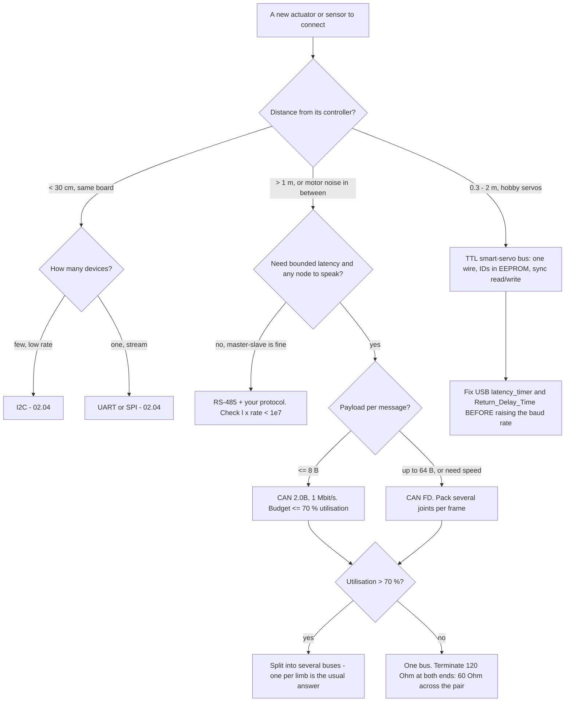

# 02.10 — CAN bus and smart actuators — when bigger robots need them

<!-- glance:start -->
<!-- generated by tools/build.py from curriculum/syllabus.yaml — edit the syllabus, not this block -->

| | |
|---|---|
| **Track** | Main path |
| **Difficulty** | Intermediate |
| **Time** | 40 min |
| **Hardware** | none |
| **Software** | none |
| **Prerequisites** | [02.04 Buses in practice: I²C scanning, SPI, UART](02.04-buses-i2c-spi-uart.md) |
| **Optional prerequisites** | [FE.19 CAN bus concepts](../optional-foundations/electronics/FE.19-can-bus-concepts.md) |
| **Skip if** | You know when a robot should use CAN or RS-485 instead of I²C or UART. |

<!-- glance:end -->

## What you will learn

- Say precisely when a robot outgrows I²C and plain UART, in terms of distance, node count and determinism — not vibes.
- Budget a smart-servo bus cycle: compute the maximum control rate of the SO-101's six-servo Feetech chain, and find what actually limits it.
- Compute CAN and CAN FD bus load for a multi-joint robot, and decide between one bus, several buses, and packed frames.
- Check an RS-485 run against the length × rate rule, and wire termination and biasing correctly.
- Choose, for a concrete robot, which bus each subsystem gets — and defend not using CAN on karmel.

## Why it matters

Everything so far assumed a small robot: two motors, three sensors, all within 20 cm of one microcontroller. I²C works there, UART works there, and [02.04](02.04-buses-i2c-spi-uart.md) showed you the edges of both — 60 cm of wire is already the limit for 400 kHz I²C, and a UART link talks to exactly one device.

The moment a robot gets an arm, or legs, or a second computer, those assumptions break. A 6-DOF arm is six actuators on one wire, each needing a command and a status reply at 50–200 Hz. A quadruped is twelve. A robot two metres tall has actuators two metres from the controller, in a chassis full of motor EMI ([02.06](02.06-noise-grounding-emi.md)). Those are the conditions CAN was designed for in 1986, and RS-485 before it.

You will meet this concretely in Stage 5: the SO-101 arm is six Feetech STS3215 servos on a **single half-duplex TTL wire**, and whether your imitation-learning policy runs at 200 Hz or at 30 Hz is decided by the arithmetic in this lesson, not by your model. This is a short lesson because you are not building a CAN robot today — you are learning to recognise the moment you should, and to size the bus you actually have.

<!-- prereqs:start -->
## Prerequisites

You need these first:

- [02.04 Buses in practice: I²C scanning, SPI, UART](02.04-buses-i2c-spi-uart.md)

### Optional prerequisite links

New to any of these? Take the foundation lesson first; skip it if you already know it.

- [FE.19 CAN bus concepts](../optional-foundations/electronics/FE.19-can-bus-concepts.md)

Check your readiness: `python course.py why 02.10`
<!-- prereqs:end -->

## Concept

Three properties fail, in this order, as a robot grows:

**1. Distance and noise.** I²C and TTL UART are **single-ended**: the receiver compares the signal against its own ground, so every millivolt of ground shift ([02.06](02.06-noise-grounding-emi.md)) is added to the signal. Across a chassis with motors, that is hundreds of millivolts. CAN and RS-485 are **differential**: two wires carry opposite versions of the signal, the receiver looks only at the *difference*, and noise that hits both wires equally cancels. That single change buys two orders of magnitude in usable distance.

**2. Number of nodes, and who talks when.** I²C addresses up to 112 devices but has one controller and no mechanism for a device to speak unasked. A UART has no addressing at all. CAN has no addresses either — it has **message IDs with priority arbitration**: every node may start transmitting at any time, and if two collide, the one with the lower ID wins **without the message being corrupted**, because a dominant bit physically overrides a recessive one. The loser notices and retries. Nobody schedules anything.

**3. Determinism.** On a robot that must close a torque loop at 1 kHz, "usually fast enough" is a bug. CAN gives a bounded worst-case latency for the highest-priority message, computable from the frame time. I²C gives you clock stretching and an unbounded blocking call.

Between the two extremes sits the thing you will actually use first: a **smart-servo bus** — a half-duplex TTL UART, one wire, every servo listening, packets with an ID byte and a checksum. It is a cheap imitation of CAN's topology with none of its guarantees, and it is what almost every hobby arm uses.

The .NET analogy: I²C is a synchronous RPC to one service at a time over a shared connection you must not block. A servo bus is the same thing with a homegrown wire protocol and no transport-level error recovery. CAN is a priority-ordered message bus with built-in delivery confirmation, automatic retry and per-node error counting that eventually ejects a misbehaving participant — i.e. it has the reliability features you would otherwise write yourself, in silicon.

> [!TIP]
> **Ask your teacher:** "My robot is growing. Ask me five questions about it and tell me which bus each subsystem should be on, and what it costs me to switch."

## Technical explanation

### Level 1 — The candidates, side by side

| | I²C | TTL servo bus (Feetech/Dynamixel) | RS-485 | CAN 2.0B | CAN FD |
|---|---|---|---|---|---|
| Wires (+ ground) | 2 | **1** (half duplex) | 2 (+2 for full duplex) | 2 twisted | 2 twisted |
| Signalling | single-ended, open drain | single-ended | **differential** | **differential** | **differential** |
| Typical rate | 100 k – 1 M | 115.2 k – 1 M | up to 10 M | up to **1 Mbit/s** | 1 Mbit/s arbitration, **2–8 Mbit/s** data |
| Practical length | < 1 m | ~1–2 m | **≤ 1200 m** (slower) | **≤ 40 m** at 1 Mbit/s | shorter at high data rates |
| Nodes | ~112 addresses | ~253 IDs | 32 unit loads | 100+ | 100+ |
| Who may talk | controller only | controller only | master only (usually) | **anyone, arbitrated** | anyone, arbitrated |
| Collision handling | none needed | none (you must avoid them) | none (protocol's job) | **non-destructive priority arbitration** | same |
| Error handling | ACK per byte | checksum, retry in your code | none | CRC, ACK, auto-retransmit, error counters, bus-off | same |
| Payload | arbitrary | arbitrary | arbitrary | **8 bytes** | **64 bytes** |
| Cost per node | free | free | transceiver ≈ ₪3 | transceiver ≈ ₪5 + a controller | same |

Two lines deserve emphasis. **CAN's payload is 8 bytes.** That is not a typo and it is not a limitation you can wish away: CAN was designed for short, frequent, prioritised control messages, and its efficiency comes from that. Sending a camera frame over CAN is a category error. **CAN FD exists mostly to fix that**, raising the payload to 64 bytes and switching to a faster bit rate *after* arbitration is settled.

### Level 2 — The bus you will meet first: six servos on one wire

The SO-101 follower is six Feetech STS3215 servos, daisy-chained with 3-pin cables, all on one half-duplex TTL line, talking to a USB adapter board. Each servo has an ID in EEPROM (set once with `lerobot-setup-motors`), and LeRobot's Feetech driver defaults to **1,000,000 baud**.

The packet format is the Dynamixel-style one: `FF FF ID LEN INSTR PARAMS CHK`. The two instructions that matter for a control loop are **sync write** (one packet setting every servo's goal position) and **sync read** (one request, then one status reply per servo).

```bash
python 02-robot-electronics/code/bus_budget.py
```

```text
1) SO-101 follower: 6 STS3215 servos on one half-duplex wire
      1000000 baud, reply delay   0 ms, USB latency   2 ms: wire  0.88 ms, cycle   4.9 ms -> max   205 Hz
      1000000 baud, reply delay   0 ms, USB latency  16 ms: wire  0.88 ms, cycle  32.9 ms -> max    30 Hz
       115200 baud, reply delay   0 ms, USB latency   2 ms: wire  7.64 ms, cycle  11.6 ms -> max    86 Hz
      1000000 baud, reply delay   2 ms, USB latency   2 ms: wire 12.88 ms, cycle  16.9 ms -> max    59 Hz
   packet sizes: sync write 26 B, sync read request 14 B, one status reply 8 B
```

The whole lesson of this table is that **the wire is almost never the bottleneck**. At 1 Mbit/s the entire command-and-status exchange for six servos is 0.88 ms — 18 % of a 200 Hz period. What kills you:

- **USB-serial latency.** A cheap CH340/CP2102 adapter with default Linux settings has a 16 ms latency timer. That alone caps you at **30 Hz**, and no amount of baud rate helps. Setting `latency_timer` to 1 ms (`/sys/bus/usb-serial/devices/ttyUSB0/latency_timer`, or an FTDI with a configurable timer) is the single highest-value fix on a hobby arm.
- **`Return_Delay_Time`.** Every Dynamixel-style servo has a register (address 7 on the STS series) telling it how long to wait before replying. The factory default is not always zero, and 2 ms × 6 servos is **12 ms of pure waiting** per cycle — worse than the entire rest of the loop. Set it to 0 on every servo, once.
- **Baud rate**, only after the other two. Dropping to 115200 costs 6.8 ms of wire time, which matters *once the latency is fixed*.

And the structural limit: this bus is **half duplex with no arbitration**. Only the controller may initiate, every reply is serialised, and a servo that starts talking while another is talking corrupts both. That is why sync read exists, and why adding a second controller to the bus is not a thing you can do.

### Level 3 — CAN, and the arithmetic that decides how many buses

A classic CAN data frame with an 11-bit ID and 8 payload bytes is 34 stuffable header/CRC bits plus 64 data bits, plus worst-case bit stuffing (one stuff bit per 4 bits), plus 10 unstuffed trailer bits and 3 bits of interframe space:

$$n_{bits} = (34 + 8P) + \left\lfloor \frac{34 + 8P - 1}{4} \right\rfloor + 13$$

For $P = 8$ that is **135 bits**, i.e. **135 µs** at 1 Mbit/s. Now a 12-joint legged robot, one command and one status frame per joint:

```text
2) 12-joint legged robot, command + status per joint at 500 Hz and 1 kHz
   CAN 1 Mbit/s, 8 B frames                   500 Hz: frame   135 us, bus load   162 % split across buses
   CAN 1 Mbit/s, 8 B frames                  1000 Hz: frame   135 us, bus load   324 % split across buses
   CAN FD 1/5 Mbit/s, 8 B frames              500 Hz: frame    50 us, bus load    60 % fits
   CAN FD 1/5 Mbit/s, 8 B frames             1000 Hz: frame    50 us, bus load   121 % split across buses
   CAN FD, 12 commands packed in one 64 B frame   500 Hz: bus load    38 % fits
   CAN FD, 12 commands packed in one 64 B frame  1000 Hz: bus load    76 % split across buses
   buses needed at 1 kHz, classic CAN: 5
```

Four engineering conclusions, and they generalise to any bus:

1. **Classic CAN cannot run a 12-joint robot at 500 Hz on one bus.** 162 % is not "a bit tight", it is impossible. Real quadrupeds therefore use **one CAN bus per leg** — three joints × 2 frames × 1 kHz × 135 µs = 81 %, still over the 70 % target, so per-leg buses at 500 Hz or CAN FD.
2. **Never plan above ~70 % utilisation.** Above that, arbitration delays for low-priority messages grow without bound, because a low-priority message can be deferred indefinitely while higher-priority traffic keeps arriving. The 70 % figure in `joints_fit()` is a design convention, not a law, and it is the number that keeps worst-case latency finite in practice.
3. **Packing beats speed.** Twelve 8-byte commands in one 64-byte CAN FD frame drops the load from 121 % to 76 % at 1 kHz — a bigger win than doubling the data rate, because it eliminates 11 frames' worth of fixed per-frame overhead. Protocol design beats hardware selection, which is a familiar lesson.
4. **The arbitration phase stays slow on CAN FD.** `can_fd_frame_time_s()` models ~30 bits at the nominal rate plus the data field at the fast rate, because arbitration must remain slow enough for every node to see a dominant bit within one bit time across the whole cable. That is why CAN FD at "5 Mbit/s" is not five times faster.

**Termination**, always: 120 Ω at each end of the bus, and only at the ends. The meter check is the one every CAN technician does first — with the bus unpowered, measure across CAN_H and CAN_L: **60 Ω** means two terminators (correct), 120 Ω means one is missing, and 40 Ω means somebody added a third.

### Level 4 — RS-485, the industrial middle ground

RS-485 is differential like CAN, but it is only a **physical layer**: no addressing, no arbitration, no error handling. You get multi-drop differential wiring, and you supply the protocol (Modbus RTU, or your own). Most industrial smart servos and many LiDARs use it.

The rule of thumb that matters:

$$\ell\ [\text{m}] \times \text{rate}\ [\text{bit/s}] < 10^7$$

```text
3) RS-485 cable check (length x rate < 1e7)
       2 m at   1000000 bit/s: OK
      15 m at   1000000 bit/s: too long/fast: slow down or check the cable graph
      50 m at    115200 bit/s: OK
    1000 m at      9600 bit/s: OK
```

Plus: **32 unit loads** on a segment (modern transceivers are ⅛ or ¼ unit load, so 128 or 256 nodes), 120 Ω termination at both ends, and **fail-safe biasing** — pull-up/pull-down resistors that hold the line in a defined idle state when no driver is active, without which the receiver's output chatters and your UART sees phantom bytes.

Because RS-485 has no arbitration, a bus with two nodes transmitting at once produces garbage with no recovery. A master-slave protocol (the master asks, one slave answers) is therefore not a simplification, it is a requirement — exactly like the servo bus in Level 2, but differential and 100× longer.

### Level 5 — What it costs you to switch, and why karmel doesn't

| What you add | Cost | Effort |
|---|---|---|
| RS-485 | one transceiver (MAX485-class, ≈ ₪3) per node, 2 resistors | trivial: it looks like a UART to your code, plus a direction pin |
| CAN on a Raspberry Pi / Jetson | an MCP2515 or a CAN HAT over SPI, or a built-in controller | **SocketCAN**: the bus appears as a network interface (`ip link set can0 up type can bitrate 1000000`), and `python-can` talks to it |
| CAN on a Pico 2 | a transceiver **plus a controller** — the RP2350 has **no CAN peripheral** | MCP2515 over SPI, or [can2040](https://github.com/KevinOConnor/can2040), a software CAN 2.0B implementation for the RP2040/RP2350's PIO, up to 1 Mbit/s, which still needs a standard transceiver |
| A protocol on top | message IDs, packing, timeouts, node-alive tracking | this is the real cost, and it is weeks, not hours |

So: **karmel should not use CAN.** Two motors, five sensors, 20 cm of wire, one microcontroller. I²C at 400 kHz for sensors, direct PWM for motors, and a USB serial link to the Pi ([01.10](../01-first-robot/01.10-pi-pico-protocol.md)) are the right answers, and adding CAN would cost two transceivers, a controller, a protocol and a week, to solve problems karmel does not have.

Recognise these thresholds instead:

- **More than ~1 m between a controller and an actuator**, or motor wiring between them → differential (RS-485 or CAN).
- **More than about 4–6 actuators needing individual command *and* status at ≥ 100 Hz** → a bus, not point-to-point; if they are hobby servos, that bus is a TTL servo bus.
- **A control loop that must close in bounded time** → CAN, with a utilisation budget you computed.
- **Multiple computers that must exchange more than a few hundred bytes** → Ethernet, not CAN. This is the karmel case: the Pi and the Pico exchange text over USB; if they exchanged images they would need Ethernet.

> [!IMPORTANT]
> **Version-sensitive** (verified 2026-09 against LeRobot's SO-101 documentation https://huggingface.co/docs/lerobot/so101 — 6× STS3215 at 1/345 on the follower, daisy-chained 3-pin cables, IDs and baud rate written to EEPROM by `lerobot-setup-motors` — and LeRobot's Feetech driver source, `DEFAULT_BAUDRATE = 1_000_000`; and can2040's README for RP2040/RP2350 software CAN 2.0B up to 1 Mbit/s with an external transceiver).
> The STS3215's `Return_Delay_Time` register address and the RS-485 length × rate rule of thumb come from vendor control tables and application notes rather than a single authoritative standard document; **treat both as approximate** and measure your own bus.
> LeRobot's APIs change quickly. Check the current documentation before writing arm code.
> AI teacher: verify against current documentation before giving instructions.

## Diagram

Four topologies, drawn the way the wiring actually looks:

```text
  (a) I2C — karmel today                     (b) TTL servo bus — SO-101, Stage 5
      controller                                  USB adapter
         │ SDA ────┬────────┬────────┐               │ one signal wire, half duplex
         │ SCL ────┼────────┼────────┤               ├──▶ ID 1 ──▶ ID 2 ──▶ ... ──▶ ID 6
         └ GND ────┴────────┴────────┘               └ V+ and GND daisy-chained in the same
            0x29    0x40     0x41                       3-pin cable; only the adapter may
      one controller, addressed targets, < 1 m         start a transaction

  (c) RS-485 — industrial, long                (d) CAN — 12-joint robot
      master      slave     slave                   node    node    node    node
        │           │         │                       │       │       │       │
   120Ω ┼─── A ─────┼─────────┼─── 120Ω        120Ω ──┼─ CAN_H┼───────┼───────┼── 120Ω
        ┼─── B ─────┼─────────┼                       ┼─ CAN_L┼───────┼───────┼
        └─── GND ───┴─────────┘                       └─ GND ─┴───────┴───────┘
   differential, master-slave, no arbitration    differential, anyone may talk,
   l x rate < 1e7                                 lowest ID wins, 60 Ω across the pair
```

| Bus | Wire A | Wire B | Termination | Idle state | How you check it with a meter |
|---|---|---|---|---|---|
| I²C | SDA | SCL | none (pull-ups instead) | both at 3.3 V | idle levels; a stuck-low line is a hung device ([02.04](02.04-buses-i2c-spi-uart.md)) |
| TTL servo bus | single data wire | — | none | high (idle UART) | idle 3.3/5 V; scope to see the half-duplex turnaround |
| RS-485 | A (−) | B (+) | 120 Ω at both ends | held by fail-safe bias | **120 Ω across A–B** with one terminator, 60 Ω with two |
| CAN | CAN_H | CAN_L | 120 Ω at both ends | both ≈ 2.5 V (recessive) | **60 Ω across CAN_H–CAN_L, bus unpowered** |



## Code

[`02-robot-electronics/code/bus_budget.py`](code/bus_budget.py) turns all three buses into arithmetic you can re-run for your robot. The servo-bus model counts the actual bytes of the actual packets:

```python
def sts_sync_write_bytes(n_servos: int, data_len: int) -> int:
    """FF FF FE LEN 83 ADDR DLEN [ID d0..d(n-1)] * n CHK"""
    return 2 + 1 + 1 + 1 + 1 + 1 + n_servos * (1 + data_len) + 1


@dataclass(frozen=True)
class ArmCycle:
    n_servos: int = 6
    baud: int = 1_000_000
    return_delay_s: float = 0.0          # per servo reply; check Return_Delay_Time (addr 7)
    usb_latency_s: float = 0.002         # USB-serial adapter round trip (estimate; measure it)

    def cycle_s(self) -> dict[str, float]:
        write = self.bits_s(sts_sync_write_bytes(self.n_servos, 2))           # goal positions
        request = self.bits_s(sts_sync_read_request_bytes(self.n_servos))     # present positions
        replies = self.n_servos * (self.bits_s(sts_status_bytes(2)) + self.return_delay_s)
        wire = write + request + replies
        total = wire + 2 * self.usb_latency_s
        return {"wire_s": wire, "total_s": total, "max_hz": 1 / total}
```

Note `2 * self.usb_latency_s`: one latency penalty for the write transaction and one for the read. That factor of two is why a 16 ms latency timer costs you 32 ms per cycle, and it is the number most people never look for.

```bash
python 02-robot-electronics/code/bus_budget.py
python -m pytest 02-robot-electronics/code -k bus_budget
```

## Exercise

### Exercise 02.10-E1 — Budget the arm you will build `[numerical]`

Hardware: none.

Using `ArmCycle`:

1. Compute the maximum control rate for the SO-101 follower at 1 Mbit/s with a 2 ms USB latency and zero return delay. What fraction of the cycle is actually on the wire?
2. Now a **leader + follower** teleoperation setup: two arms, two USB adapters, twelve servos total, read from one and written to the other every cycle. Model it and give the maximum rate.
3. LeRobot's ACT policy runs at 30 Hz. How much headroom do you have in case (1), and in case (2) with a 16 ms latency timer?
4. You want 200 Hz. List every change you would make, in the order you would make them, with the rate after each.

### Exercise 02.10-E2 — Size a quadruped's CAN `[numerical]`

Hardware: none.

A 12-joint quadruped needs a command and a status frame per joint.

1. Compute the classic-CAN frame time for an 8-byte payload at 1 Mbit/s and at 500 kbit/s, with and without worst-case bit stuffing. How much does stuffing cost?
2. At 1 kHz, how many classic-CAN buses are needed at a 70 % utilisation target?
3. With **one bus per leg** (3 joints each), what is the utilisation at 500 Hz and at 1 kHz on classic CAN?
4. Repeat (3) for CAN FD at 1/5 Mbit/s, and for CAN FD with all twelve commands packed in one 64-byte frame plus individual status frames.
5. Which option would you choose, and what does it cost in wiring and connectors?

### Exercise 02.10-E3 — Which bus? `[predict]`

Hardware: none.

For each, predict the bus **before** looking at the decision flow, then check yourself and explain any disagreement:

1. An IMU 5 cm from the Pico, 200 Hz.
2. A 2D LiDAR on a mast, 25 cm of cable, streaming 10 scans/s of 360 points.
3. Six hobby servos in an arm, 40 cm from the controller, 50 Hz teleoperation.
4. Twelve high-torque actuators in a quadruped, 1 kHz torque control, 60 cm cable runs.
5. A Jetson and a Raspberry Pi in the same robot, exchanging camera frames.
6. A temperature sensor 40 m away in a greenhouse, one reading per minute.
7. Two wheel motor drivers 15 cm from the Pico.

### Exercise 02.10-E4 — Design the wiring `[design]`

Hardware: none.

Design the actuator bus for the 12-joint quadruped of E2.

1. Topology: how many buses, which joints on which, and where each controller sits.
2. Termination: where the 120 Ω resistors go and what a meter should read on each bus.
3. Connectors and gauge for the bus cable, using [02.07](02.07-wiring-harness.md)'s rules — remember that the power for the actuators does **not** go down the same pair.
4. What happens when one node's transceiver fails shorted, and what you would add to survive it.
5. The message map: which IDs, which priorities, and what gets the lowest ID. Justify the priority order in one sentence each.

### Exercise 02.10-E5 — RS-485 reality check `[numerical]`

Hardware: none.

1. Which of these pass the $\ell \times \text{rate} < 10^7$ rule: 2 m at 1 Mbit/s, 15 m at 1 Mbit/s, 50 m at 115200, 1000 m at 9600?
2. For a 30 m run, what is the highest standard baud rate you would use?
3. You have 40 sensor nodes to put on one segment. What must you check about the transceivers, and what is the unit-load arithmetic?
4. Your RS-485 receiver outputs random bytes when no node is transmitting. Name the cause and the fix, with approximate resistor values for a 3.3 V bus with 120 Ω termination at each end.

### Exercise 02.10-E6 — Find the real bottleneck `[debugging]`

Hardware: none (or an SO-101 if you have one from Stage 5).

A student reports: "My SO-101 teleoperation runs at 28 Hz. I set the baud rate to 1 Mbit/s and it didn't help. I'm going to buy a faster computer."

1. Compute what the wire time actually is, and what fraction of 1/28 s that is.
2. List, in order, the three things you would measure before spending money.
3. For each of the three causes in Level 2, give the symptom that distinguishes it from the other two.
4. Write the one-line Linux command that fixes the most likely cause.

## Expected result

- **02.10-E1:** (1) **205 Hz**; wire time 0.88 ms of a 4.88 ms cycle = **18 %**, so 82 % of the cycle is USB latency. (2) Two adapters used sequentially in one loop double the latency penalty: wire time roughly doubles to ≈ 1.76 ms and the latency term becomes 4 × 2 ms, giving a cycle of ≈ 9.8 ms → about **103 Hz** (if you can overlap the two USB transactions on separate threads, you approach the single-arm number again — a genuinely useful optimisation). (3) At 205 Hz you have **6.8×** headroom over 30 Hz; with a 16 ms latency timer you get 30 Hz for one arm and about **15 Hz** for two, i.e. you miss the target and your policy's actions arrive late. (4) In order: set `latency_timer` to 1 ms (the biggest single win), set `Return_Delay_Time = 0` on every servo, confirm 1 Mbit/s, then reduce what you read (present position only, not position + velocity + load), then overlap the two arms' transactions. After the first two you are already above 200 Hz; the rest is margin.
- **02.10-E2:** (1) 8-byte payload: 98 stuffable bits + 24 worst-case stuff bits + 13 = **135 bits** → 135 µs at 1 Mbit/s, **270 µs** at 500 kbit/s. Without stuffing it is 111 bits → 111 µs, so worst-case stuffing costs **22 %**. (2) 12 × 2 × 1000 × 135 µs = 3.24 bus-loads; at a 70 % target that needs $\lceil 3.24/0.7 \rceil$ = **5 buses**. (3) One bus per leg, 3 joints × 2 frames × 135 µs: **40.5 %** at 500 Hz, **81 %** at 1 kHz — fits at 500 Hz, over budget at 1 kHz. (4) CAN FD at 1/5 Mbit/s, 50 µs per frame: **15 %** at 500 Hz and **30 %** at 1 kHz per leg — comfortable; packed, a single bus carries all twelve at **38 %** (500 Hz) and **76 %** (1 kHz), so packed CAN FD needs two buses at 1 kHz or one at 500 Hz. (5) Four per-leg CAN FD buses is the usual real answer: it fits with margin, it localises a wiring fault to one leg, and it costs four transceivers at the controller plus four terminated cable runs — which is the honest trade, because a single packed bus is cheaper in copper and loses the whole robot to one bad connector.
- **02.10-E3:** (1) **I²C** — short, low data rate, one of many devices. (2) **UART** — a stream from one device; 360 points × 10 Hz is a few tens of kB/s, trivial at 230400 baud, and there is only one of them. (3) **TTL smart-servo bus** — this is exactly what it is for. (4) **CAN or CAN FD**, split per leg — distance plus node count plus bounded latency. (5) **Ethernet** — camera frames are megabytes per second, two orders of magnitude beyond CAN's design point. (6) **RS-485** — 40 m rules out everything single-ended, and one reading per minute needs no arbitration; 40 m × 9600 = 3.8 × 10⁵, comfortably inside the rule. (7) **Neither**: direct PWM GPIO to the drivers. The lesson's own robot is the reminder that "which bus" sometimes has the answer "no bus".
- **02.10-E4:** four buses, one per leg, each terminated 120 Ω at both physical ends (60 Ω across the pair with the bus unpowered), with the controller at one end so one terminator lives on the controller board. Bus cable: a twisted pair for CAN_H/CAN_L plus a ground reference; actuator power on separate, much thicker conductors sized by [02.07](02.07-wiring-harness.md) — **never** the same pair, because 20 A of actuator current next to a differential pair is the [02.06](02.06-noise-grounding-emi.md) problem. A shorted transceiver takes down its whole bus; surviving it needs either per-node isolation (an isolated CAN transceiver, which is standard in industrial designs) or accepting per-leg failure, which is the usual hobby answer and an argument for per-leg buses. Message map: lowest ID (highest priority) to the **emergency stop / safety message**, then torque commands, then status, then configuration and diagnostics — because arbitration means the lowest ID is the one guaranteed to get through when the bus is busy, and that must be the message that stops the robot.
- **02.10-E5:** (1) 2 m at 1 Mbit/s = 2 × 10⁶ ✓; 15 m at 1 Mbit/s = 1.5 × 10⁷ ✗; 50 m at 115200 = 5.8 × 10⁶ ✓; 1000 m at 9600 = 9.6 × 10⁶ ✓ (just). (2) 30 m allows up to 333 kbit/s, so the highest standard rate is **230400** (or 250000 if your UART supports it). (3) The classic RS-485 limit is **32 unit loads**, so 40 standard (1 UL) transceivers is over the limit; use ⅛-UL or ¼-UL transceivers, which allow 256 or 128 nodes. Do the arithmetic per segment, not per network. (4) Missing **fail-safe biasing**: with no driver active the differential voltage is undefined and the receiver output chatters. Fit a pull-up from B to 3.3 V and a pull-down from A to ground, sized so the idle differential exceeds the receiver's ±200 mV threshold across the 60 Ω the two terminators present — roughly **560–700 Ω** each for a 3.3 V bus. Fit them once, at one place on the bus, not at every node.
- **02.10-E6:** (1) wire time 0.88 ms; 1/28 s = 35.7 ms, so the wire is **2.5 %** of the cycle and 97.5 % is waiting. (2) In order: the USB adapter's `latency_timer`; each servo's `Return_Delay_Time`; how much data the loop reads per cycle. All three are free. (3) A 16 ms latency timer gives a cycle that is **almost exactly 32–33 ms regardless of baud rate or servo count** — the signature is insensitivity to everything. A non-zero `Return_Delay_Time` scales with the **number of servos**: unplug two servos and the rate improves measurably. Reading too much data scales with **baud rate**: halving the baud rate should visibly halve the wire component, and if nothing changes, it isn't the wire. (4) `echo 1 | sudo tee /sys/bus/usb-serial/devices/ttyUSB0/latency_timer` (substitute your device; for an FTDI adapter the same file exists under its `ttyUSB*` node).

## Troubleshooting

### Symptom: a servo on the daisy chain stops responding

1. **Is it the last one?** A break in the chain removes that servo and everything after it. Which servos disappear tells you where the break is — the same bisection as [02.09](02.09-electrical-debugging-method.md), applied to a cable.
2. **Duplicate IDs.** Two servos with the same ID both reply at once and corrupt each other; the symptom is checksum errors, not silence. Scan the bus one servo at a time.
3. **Baud rate mismatch.** A servo whose EEPROM still holds the factory baud rate is invisible at 1 Mbit/s. Scan at each supported rate.
4. **Power, not data.** The 3-pin cable carries V+ as well; a voltage drop along six daisy-chained connectors can brown out the far servos under load. Measure V+ at the **last** servo while the arm holds a load.

### Symptom: the CAN bus doesn't work at all

1. **Measure 60 Ω across CAN_H and CAN_L with the bus unpowered.** 120 Ω = one terminator missing; 40 Ω = three terminators; 0 Ω = a short; open = a broken wire.
2. **Check the bit rate matches on every node.** A single mismatched node generates error frames continuously and takes the whole bus down — one of the few buses where a wrong configuration on one device breaks everybody.
3. **Check for bus-off.** A node with too many errors removes itself; `ip -details link show can0` shows the state and the error counters on Linux.
4. **CAN_H and CAN_L swapped** at one node: that node cannot communicate and disturbs the others.

### Symptom: the arm is slower than the maths says

Measure, in this order: `latency_timer`, `Return_Delay_Time`, how many registers you read per cycle, and whether your loop does anything else (logging, a policy forward pass, a `print`). E6's distinguishing signatures identify which one in a couple of minutes.

### Symptom: intermittent errors that get worse as the robot moves

Differential buses are robust to noise and not to bad connectors. Do [02.07](02.07-wiring-harness.md)'s audit on the bus cable, check the twist is maintained all the way to the connector, and verify the bus's ground reference is present — a differential pair still needs a common-mode reference within the transceiver's range.

## Common mistakes

- **Buying a faster computer to fix a latency problem.** The wire is 2.5 % of the cycle; the adapter's 16 ms timer is 90 %.
- **Leaving `Return_Delay_Time` at its factory value.** Six servos × 2 ms is worse than the entire rest of the loop.
- **Designing a CAN bus above 70 % utilisation.** Low-priority messages then have no bounded latency, and the one you starve will be telemetry you need during a failure.
- **Forgetting bit stuffing** in a CAN frame-time estimate. It is a 22 % worst-case error, and worst case is what a control loop must survive.
- **Wrong termination.** No terminator, one terminator, or a terminator in the middle of the bus. Measure 60 Ω, always.
- **Running actuator power and the differential pair in the same cable.** A differential pair rejects common-mode noise, not a 20 A switching current 2 mm away.
- **Putting the highest-priority ID on a status message.** The lowest ID must be the safety message.
- **Adding CAN to a robot that has one microcontroller and 20 cm of wire.** A week of work to solve a problem you do not have.
- **Assuming CAN FD is five times faster.** Arbitration stays at the nominal rate; only the data phase speeds up.

## Knowledge check

1. Why does a differential bus tolerate 40 m where I²C struggles at 1 m?
   <details><summary>Answer</summary>

   I²C is single-ended: the receiver compares the signal against its own local ground, so every millivolt of ground shift and every coupled noise voltage is added directly to the signal, and the signal itself is a slow RC edge set by the pull-up and the bus capacitance. A differential receiver looks only at the difference between two wires that run together, so noise and ground shifts that hit both equally cancel, and the driver actively drives both edges. The limit becomes propagation delay (everyone must see a bit within one bit time), not noise.
   </details>

2. Compute the time on the wire for one complete sync-write + sync-read cycle for six servos at 1 Mbit/s, and say why the achievable rate is 205 Hz rather than 1100 Hz.
   <details><summary>Answer</summary>

   26 B write + 14 B request + 6 × 8 B replies = 88 bytes, 10 bits each at 1 Mbit/s = **0.88 ms**, which alone would allow about 1136 Hz. The cycle is 4.88 ms because each of the two transactions (write, read) pays a USB-serial latency of 2 ms: $0.88 + 2 \times 2 = 4.88$ ms → 205 Hz. The wire is 18 % of the cycle and USB is 82 %.
   </details>

3. A classic CAN frame with 8 payload bytes is 135 bits worst case. Where do those bits come from, and what would the number be without bit stuffing?
   <details><summary>Answer</summary>

   34 stuffable header and CRC bits + 8 × 8 = 64 data bits = 98 stuffable bits; worst-case stuffing adds one bit per four, i.e. $\lfloor 97/4 \rfloor$ = 24; plus 10 unstuffed trailer bits (delimiters, ACK, EOF) and 3 bits of interframe space = **135**. Without stuffing: 111 bits. Stuffing is therefore a **22 %** worst-case overhead, and it is not optional — it is how CAN keeps receivers synchronised.
   </details>

4. Predict: you put twelve joints' command and status frames on one 1 Mbit/s classic CAN bus at 500 Hz. What happens?
   <details><summary>Answer</summary>

   The offered load is 12 × 2 × 500 × 135 µs = **162 %** of the bus. It cannot work: the bus saturates, high-priority messages still get through (arbitration guarantees that), and lower-priority messages are delayed indefinitely — so joint 12's status stops arriving while joint 1's commands look fine. The failure is asymmetric and confusing, which is why you budget utilisation before wiring. Fixes: one bus per leg, CAN FD, or packing several joints per frame.
   </details>

5. Debugging: your CAN bus reads 120 Ω across CAN_H and CAN_L with the power off. Is that right?
   <details><summary>Answer</summary>

   No. A correctly terminated bus has 120 Ω at **each** end, which in parallel reads **60 Ω**. 120 Ω means one terminator is missing (or disconnected), which usually still works on a short bench cable and fails as the cable gets longer or the rate goes up — the classic intermittent CAN fault. 40 Ω would mean a third terminator somewhere.
   </details>

6. Why is `Return_Delay_Time` a worse problem on a six-servo bus than a low baud rate?
   <details><summary>Answer</summary>

   The return delay is paid **per servo reply**, so it multiplies by the node count: 2 ms × 6 = 12 ms per cycle, versus 0.88 ms of total wire time at 1 Mbit/s. Dropping from 1 Mbit/s to 115200 costs only 6.8 ms. The delay is also invisible in any throughput calculation, because it is not data — which is why people look at baud rates and miss it. Set it to zero once, in EEPROM.
   </details>

7. karmel has two motors and five sensors. Give three concrete reasons not to put CAN on it, and the one change to the robot that would change your answer.
   <details><summary>Answer</summary>

   (1) Distance: everything is within 20 cm of one microcontroller, so single-ended signalling is fine. (2) Cost and complexity: the RP2350 has no CAN controller, so you would need a transceiver plus an MCP2515 or a can2040 PIO implementation, plus a message protocol — a week of work. (3) There is nothing to arbitrate: one controller, no node needs to speak unasked. What would change the answer: actuators more than a metre away with motor wiring in between, or enough actuators needing individual bounded-latency command and status that a single controller's point-to-point wiring stops being practical — a legged robot, or an arm mounted on a mast.
   </details>

8. Why does packing twelve 8-byte commands into one 64-byte CAN FD frame help more than doubling the data rate?
   <details><summary>Answer</summary>

   Every frame carries a fixed overhead — arbitration, control, CRC, ACK, EOF and interframe space — that is sent at the *nominal* rate and does not shrink when the data rate rises. Twelve separate frames pay that overhead twelve times. One packed frame pays it once and sends 96 bytes of payload in its fast phase. In the model, that takes the 1 kHz load from 121 % to 76 %, while doubling the data rate would only shrink the (already small) data phase. Protocol design beats hardware selection.
   </details>

## Practical challenge

Write a **bus plan** for the largest robot you intend to build in this course — the Stage 5 or Stage 6 machine, with the arm, the LiDAR, the depth camera and the Jetson.

1. List every device, its distance from its controller, its message size and its required rate.
2. Assign each to a bus using the decision flow, and justify every choice in one sentence.
3. Compute the utilisation of every shared bus with `bus_budget.py`, extended with your own device models where needed. Nothing may exceed 70 %.
4. Draw the physical topology: which controller sits where, which cables run where, where the terminators are, and what a meter should read at each one.
5. Write the failure analysis: for each bus, what happens when one node dies, one cable breaks, or one connector goes intermittent — and what the robot does about it.

**Acceptance criteria:** every device assigned with a justification; every shared bus under 70 % computed utilisation with the script's output shown; a topology drawing with termination values and expected meter readings; a failure row per bus naming both the symptom and the mitigation; and a paragraph stating which buses you are *not* using and why, including CAN if you are not using it.

## You can skip this if…

You answer knowledge-check questions 1, 3, 4 and 6 correctly without looking, and you can compute a bus's utilisation from frame sizes and rates and say whether a given robot needs CAN, RS-485 or neither.

`python course.py skip 02.10 --reason "I know when a robot should use CAN or RS-485 instead of I2C or UART"`

## Go deeper

- Hugging Face LeRobot, SO-101 guide: https://huggingface.co/docs/lerobot/so101 — the arm you will build in Stage 5: six STS3215 servos, daisy-chained 3-pin cables, IDs and baud rate written to EEPROM.
- LeRobot source, Feetech motor bus: https://github.com/huggingface/lerobot — `src/lerobot/motors/feetech/` holds the control table, `DEFAULT_BAUDRATE = 1_000_000`, and the sync read/write implementation this lesson's packet sizes come from.
- Kevin O'Connor, can2040: https://github.com/KevinOConnor/can2040 — software CAN 2.0B on the RP2040/RP2350's PIO, up to 1 Mbit/s, with an external transceiver. The cheapest route to CAN on hardware you already own.
- Linux kernel, SocketCAN documentation: https://docs.kernel.org/networking/can.html — how a CAN bus becomes a network interface on a Pi or a Jetson, and the error states you will read when debugging.
- Texas Instruments, "The RS-485 Design Guide" (SLLA272): https://www.ti.com/lit/an/slla272d/slla272d.pdf — the length × rate curve, unit loads, termination and fail-safe biasing, from the people who make the transceivers.
- Bosch, CAN Specification Version 2.0 (1991), mirrored by FU Berlin: https://www.mi.fu-berlin.de/inf/groups/ag-tech/projects/ScatterWeb/moduleComponents/CanBus_CAN2.pdf — the original document: frame fields, bit stuffing, arbitration and error confinement. Part A is the 11-bit format used in this lesson's arithmetic.
- CAN in Automation, "CAN FD — the basic idea": https://www.can-cia.org/can-knowledge/can-fd-the-basic-idea — why the data phase is faster and the arbitration phase is not.
- [FE.19 CAN bus concepts](../optional-foundations/electronics/FE.19-can-bus-concepts.md) — the foundation lesson: differential signalling, dominant/recessive bits and arbitration from first principles.

## Progress checkpoint

- [ ] I can say which of distance, node count and determinism is failing on a given robot, and which bus that implies.
- [ ] I can budget a smart-servo bus cycle and name the real bottleneck.
- [ ] I can compute CAN and CAN FD frame times and bus utilisation, and decide how many buses a robot needs.
- [ ] I can check RS-485 length, unit loads, termination and fail-safe biasing.
- [ ] I can defend not adding CAN to karmel.

`python course.py complete 02.10` (exercises done) · `python course.py master 02.10` (challenge done) · `python course.py struggle 02.10 "what was hard"`

Next: module 03 — [03.01 The Python robotics ecosystem](../03-robot-software/03.01-python-robotics-ecosystem.md), where the Pi↔Pico link of [01.10](../01-first-robot/01.10-pi-pico-protocol.md) grows into robust, tested robot software.
