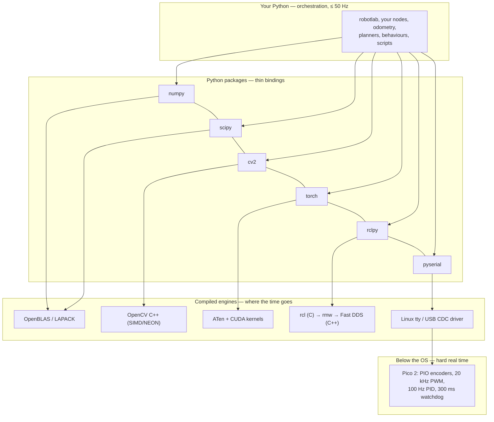

# 03.01 — The Python robotics ecosystem (a map for C# developers)

<!-- glance:start -->
<!-- generated by tools/build.py from curriculum/syllabus.yaml — edit the syllabus, not this block -->

| | |
|---|---|
| **Track** | Main path |
| **Difficulty** | Beginner |
| **Time** | 40 min |
| **Hardware** | none |
| **Software** | python |
| **Prerequisites** | [01.11 Drive forward, backward and rotate in place (open loop)](../01-first-robot/01.11-drive-and-rotate.md) |
| **Optional prerequisites** | [FPY.01 Python for C# developers — the fast tour](../optional-foundations/python/FPY.01-python-for-csharp-devs.md) |
| **Skip if** | You know which library does what among numpy, scipy, opencv, pyserial, gpiozero, rclpy and torch. |

<!-- glance:end -->

## What you will learn

- Name the eight libraries that do 95 % of the work in a Python robot program, and say which one owns which problem.
- Explain why almost every one of them is a thin Python skin over C or C++, and what that means for your code.
- Decide, with measured numbers, when a Python loop is fine, when to vectorize, and when the work belongs in C++ or on the Pico.
- Map your .NET instincts onto this stack — and name the three places where the analogy misleads you.
- Read a robotics `import` block and predict where the code will spend its time.

## Why it matters

karmel's software is Python: `robotlab` drives the wheels, reads the encoders, simulates the
robot and will soon run odometry, a Kalman filter and a planner. Python is not a compromise here —
it is what the robotics world actually uses for everything above the control loop. But it is
Python *in a specific shape*: a scripting layer on top of compiled kernels. Write it as though it
were C#, with objects and `for` loops over data, and a LiDAR scan that should take 0.05 ms takes
30 ms, your 20 Hz loop becomes 8 Hz, and the robot reacts a tenth of a second late.

You already know how to program. What you don't yet know is the *terrain*: which library owns
which problem, which ones are secretly C++, and where the boundary between "Python is fine" and
"this has to be compiled" actually falls. This lesson is the map. Everything else in module 03
builds on it: environments ([03.02](03.02-environments-and-pinning.md)), the hardware
abstraction ([03.05](03.05-hardware-abstraction.md)), testing
([03.08](03.08-testing-robot-software.md)) and the C++ you will have to read
([03.09](03.09-where-cpp-is-used.md)).

<!-- prereqs:start -->
## Prerequisites

You need these first:

- [01.11 Drive forward, backward and rotate in place (open loop)](../01-first-robot/01.11-drive-and-rotate.md)

### Optional prerequisite links

New to any of these? Take the foundation lesson first; skip it if you already know it.

- [FPY.01 Python for C# developers — the fast tour](../optional-foundations/python/FPY.01-python-for-csharp-devs.md)

Check your readiness: `python course.py why 03.01`
<!-- prereqs:end -->

## Concept

Think of the Python robotics stack the way you think of a .NET application that calls into native
code — except the ratio is inverted. In a typical C# service, 95 % of the CPU time is spent in IL
that the JIT compiled from your code. In a typical robotics Python program, 95 % of the CPU time
is spent inside C++ that somebody else compiled, and your Python is the **orchestration**: it
decides which kernels to call, in what order, with what data.

That gives the stack a characteristic shape:

- **A universal data type.** Every library speaks `numpy.ndarray`. A LiDAR scan, a camera frame, a
  pose, a covariance matrix, a neural-network input — all the same object. There is no
  `Convert.ToMatrix()` between libraries because they all already agree. .NET has nothing like
  this; every numerics library there has its own `Matrix` type.
- **Thin bindings, fat engines.** `import cv2` loads the same OpenCV C++ library that self-driving
  cars use. `import torch` loads the same CUDA kernels. `rclpy` is a wrapper around `rcl`, a C
  library. You are not using a "Python port" of anything; you are using the real thing with a
  Python steering wheel.
- **A hard performance cliff.** Inside a numpy call you get C speed. The moment you write
  `for point in scan:` you fall off the cliff, by a factor of 5–50. There is no JIT to save you.

The practical consequence, and the sentence to remember from this lesson: **in robotics Python,
the unit of work is an array, not an item.** The code that looks like a C# `foreach` is the code
that will be too slow.

> [!NOTE]
> This lesson assumes you can read idiomatic Python, not just translate C# into it: duck typing, `with`,
> comprehensions, `*args`/`**kwargs`, and packaging. New to those? →
> [FPY.01 Python for C# developers — the fast tour](../optional-foundations/python/FPY.01-python-for-csharp-devs.md).
> Skip it if you already know why there is no `interface` keyword and what a virtual environment replaces.

> [!TIP]
> **Ask your teacher:** "Take the `for` loop in `transform_python` from the tour script and walk me through rewriting it as numpy, one line at a time, explaining what shape each array has."

## Technical explanation

### Level 1 — The map

| Package | Owns | You will meet it in | .NET reflex that gets you close |
|---|---|---|---|
| **numpy** | arrays and linear algebra: poses, scans, images, covariances | everywhere, from [05.03](../05-frames-and-transforms/05.03-rigid-transforms-2d.md) on | `Span<T>` + `Math.NET` + LINQ, fused into one type |
| **scipy** | the scientific grab bag: KD-trees, optimization, filters, `spatial.transform.Rotation` | ICP ([11.03](../11-slam/11.03-the-slam-problem.md)), calibration ([09.05](../09-odometry/09.05-calibrating-odometry.md)) | Math.NET Numerics, but 15 specialized submodules |
| **opencv (`cv2`)** | images: capture, calibration, ArUco, features, all of classical CV | module [13](../13-computer-vision/13.01-images-as-data.md) | Emgu.CV — which is itself a binding to the same C++ |
| **pyserial** | a serial port as a byte stream | [01.10](../01-first-robot/01.10-pi-pico-protocol.md), [03.03](03.03-robust-serial-communication.md) | `System.IO.Ports.SerialPort` — almost a one-to-one match |
| **gpiozero + lgpio** | GPIO pins on the Raspberry Pi | rarely in this course — karmel's pins live on the Pico | `System.Device.Gpio` (dotnet/iot) |
| **rclpy** | ROS 2: nodes, topics, services, actions, parameters | module [04](../04-ros2/04.01-why-middleware.md) onward | a generated gRPC client + a hosted service, in one |
| **torch** | neural networks: training on a PC, inference on the Jetson | modules [16](../16-machine-learning/16.01-where-ml-helps-robots.md)–[18](../18-embodied-ai/18.01-embodied-ai-landscape.md) | TorchSharp/ML.NET — but nobody ships robot policies in those |
| **matplotlib** | plots: telemetry, trajectories, maps, mostly headless to PNG | [03.07](03.07-logging-and-telemetry.md), every estimation lesson | no real equivalent; think "the plotting part of a notebook" |
| **pyyaml** | `karmel.yaml`, ROS parameter files, map metadata | [03.06](03.06-configuration-and-calibration.md) | `Microsoft.Extensions.Configuration` + YamlDotNet |
| **pytest** | tests that run without hardware | [03.08](03.08-testing-robot-software.md) | xUnit; fixtures ≈ constructor injection, `parametrize` ≈ `[Theory]` |

Everything `robotlab` needs is in `labs/requirements.txt`; the first six rows cover karmel's whole
Stage-1 software stack.

### Level 2 — Where the analogy breaks

Three places where "it's like .NET" will actively mislead you.

**1. There is no JIT, and threads don't give you cores.** CPython interprets bytecode. A tight
numeric loop is 30–100× slower than the equivalent C#. And the GIL means a second thread running
pure Python doesn't use a second core — it fights your control loop for the interpreter
([03.04](03.04-timing-and-concurrency.md) measured this). In .NET you reach for `Parallel.For`;
here you reach for a numpy call, or a separate *process*.

**2. Interfaces are structural, not nominal.** `DifferentialBase` is a `typing.Protocol`: any
object with the five right methods *is* one, with no `: IDifferentialBase` anywhere and no
registration. `isinstance(my_fake, DifferentialBase)` is `True` because the methods exist. This is
closer to Go than to C#, and it is why the course can hand the same code a simulator, a fake and a
real robot ([03.05](03.05-hardware-abstraction.md), [FPY.04](../optional-foundations/python/FPY.04-typing-dataclasses-packaging.md)).

**3. "The package" is not one artifact.** `scipy` is not a library you learn; it is `scipy.spatial`
(KD-trees, convex hulls), `scipy.optimize` (least squares for calibration), `scipy.linalg`,
`scipy.signal`, `scipy.stats`, `scipy.spatial.transform.Rotation` (the quaternion/matrix conversions
you will want in [05.06](../05-frames-and-transforms/)). You import submodules, not the package.
The same is true of ROS 2: `ros-jazzy-desktop` is ~200 apt packages, not one dependency.

And one place where the analogy holds better than you expect: **dependency injection**. Robotics
Python does constructor injection everywhere, just without a container. `SerialBase(port, serial_factory=fake)`
is exactly the `ISerialPort` you would inject in C#; the difference is that no framework wires it,
`main()` does ([03.05](03.05-hardware-abstraction.md)).

### Level 3 — Numbers: where the cliff is

The tour script measures three real karmel workloads. This run is a Windows development PC
(Python 3.14, numpy 2.5.3, OpenCV 5.0.0); your numbers will differ, and the Pi's will differ more.
Read the *ratios*, not the absolute values:

```text
workload    variant                     ms  note
transform   pure Python               8.79  30 scans x 360 beams
transform   numpy                     1.59  30 scans x 360 beams
associate   numpy brute force        51.26  360 x 4000 distances
associate   scipy cKDTree             3.98  360 queries, tree built each time
vision      OpenCV                    6.66  640x480, 57238 edge pixels, 150 fps ceiling
```

**Does the transform matter?** Per scan, pure Python takes $8.79/30 = 0.293$ ms and numpy
$1.59/30 = 0.053$ ms. At the LiDAR's 10 Hz that is 0.29 % of one core versus 0.05 %. **Neither
matters.** Vectorizing this loop would be premature optimization, and this is the honest half of the
story that tutorials skip.

**Where it does matter** is when the same operation sits inside another loop. A particle filter
([10.07](../10-localization/)) with $M$ particles and $B$ beams evaluates

$$N_{\text{rays}} = M \times B = 700 \times 24 = 16{,}800 \text{ raycasts per update}$$

and the simulator's `World.raycast` tests every ray against every wall segment, so the real cost is
$O(N_{\text{rays}} \times S)$. Measured on the same PC, fully vectorized, one call:
**82–130 ms** in `World.apartment()` ($S = 27$) and **~10 ms** in `World.rectangle_room(4, 3)`
($S = 4$). At the filter's 8 Hz that is most of a core in the apartment and 8 % of one in the room.
Two lessons at once: the loop you must worry about is the *nested* one, and the complexity of the
world is part of your CPU budget. You verify both numbers yourself in Exercise 03.01-E2.

**Scan matching** shows the other kind of win, the algorithmic one. Brute-force association is
$O(N \cdot M) = 360 \times 4000 = 1.44$ M distance evaluations: 51.26 ms. A KD-tree is
$O(M \log M)$ to build and $O(N \log M)$ to query: 3.98 ms, 13× faster. ICP runs ~20 iterations per
scan, so at 10 Hz you have 100 ms: 20 × 3.98 ms = 80 ms fits, 20 × 51 ms = 1.03 s does not.
**Both variants are numpy.** Picking the right data structure beat picking the right language.

**The decision rule**, in order:

1. How often does this run, and how many items does it touch? Multiply. Compare with your loop
   period. If it is under ~5 % of the budget, stop — write the clearest code.
2. Over 5 %? Look for the algorithm first (KD-tree, grid, early exit). Factors of 10 live here.
3. Still over? Vectorize with numpy so the inner loop runs in C. Factors of 5–50 live here.
4. Still over, or the deadline is hard (< 5 ms, > 100 Hz)? It belongs in C++ ([03.09](03.09-where-cpp-is-used.md))
   or on the Pico ([01.10](../01-first-robot/01.10-pi-pico-protocol.md)).

Step 4 is rare in this course, and that is the point: karmel puts the hard-real-time work on a
microcontroller, so the Pi never needs it.

### Level 4 — What is actually C++, and why you care

| You write | It calls | Language |
|---|---|---|
| `np.linalg.solve(A, b)` | OpenBLAS / LAPACK | Fortran + C |
| `cv2.Canny(...)` | OpenCV core | C++ (with SIMD/NEON) |
| `torch.nn.Linear(...)` | ATen + cuDNN/oneDNN | C++/CUDA |
| `node.create_publisher(...)` | `rclpy` → `rcl` → `rmw` → Fast DDS | Python → C → C → C++ |
| `nav2` behavior tree, costmaps, planners | Nav2 | C++ |
| ros2_control's read/write loop | `controller_manager`, hardware plugins | C++ ([`karmel_hardware`](../labs/ros2_ws/src/karmel_hardware/src/karmel_system.cpp)) |
| `slam_toolbox`, `robot_localization`, Gazebo | those packages | C++ |

Two consequences you will actually feel:

- **Your Python is not the bottleneck, and it is not the thing that crashes.** When a node
  segfaults, the stack trace is C++. When memory grows, it is often a C++ buffer. Debugging robotics
  means being willing to read the other language — hence [03.09](03.09-where-cpp-is-used.md).
- **C extensions release the GIL** during long operations. A numpy matrix multiply or an OpenCV
  blur in a background thread really does run on another core; a pure-Python loop in that same
  thread does not. This is the one exception to "threads don't give you cores"
  ([03.04](03.04-timing-and-concurrency.md)).

## Diagram



Reading the diagram: everything in the middle band is a *binding*. The interesting engineering
decisions are which band a piece of work lands in.

## Code

| File | What it does | Run |
|---|---|---|
| [`03-robot-software/code/l0301_ecosystem_tour.py`](code/l0301_ecosystem_tour.py) | prints your installed stack, then times three karmel workloads | `python 03-robot-software/code/l0301_ecosystem_tour.py` |
| [`labs/requirements.txt`](../labs/requirements.txt) | the course's non-ROS dependency list | read it |
| [`labs/python/robotlab/`](../labs/python/README.md) | what a Python robotics library looks like from the inside | read it |

The whole "pure Python vs numpy" lesson is these two functions from the tour, which compute
exactly the same thing — LiDAR points from the sensor frame into the world frame:

```python
def transform_python(ranges, angles, pose):
    """Sensor polar -> world Cartesian, one beam at a time (the obvious C#-style loop)."""
    x, y, theta = pose
    cos_t, sin_t = math.cos(theta), math.sin(theta)
    points = []
    for r, a in zip(ranges, angles):
        px, py = r * math.cos(a), r * math.sin(a)
        points.append((x + cos_t * px - sin_t * py, y + sin_t * px + cos_t * py))
    return points


def transform_numpy(ranges, angles, pose):
    """The same thing as four array operations. numpy loops in C, not in the interpreter."""
    import numpy as np

    x, y, theta = pose
    local = np.column_stack((ranges * np.cos(angles), ranges * np.sin(angles)))
    rotation = np.array([[math.cos(theta), -math.sin(theta)], [math.sin(theta), math.cos(theta)]])
    return local @ rotation.T + np.array([x, y])
```

Note what changed and what didn't: the *math* is identical (it is the 2D rigid transform of
[05.03](../05-frames-and-transforms/05.03-rigid-transforms-2d.md)), the loop moved from the
interpreter into C, and the second version is arguably easier to read once you can see shapes.

Tests (no hardware, a few seconds):
`python -m pytest 03-robot-software/code/test_l0301_ecosystem.py`

## Exercise

### Exercise 03.01-E1 — Predict, then take the tour `[predict]`

Hardware: none.

1. **Before running**, write down three predictions: (a) how many times slower the pure-Python
   transform will be than numpy; (b) whether the KD-tree or the brute force wins, and by how much;
   (c) whether `rclpy` and `torch` are installed on your machine.
2. Run `python 03-robot-software/code/l0301_ecosystem_tour.py`.
3. For every prediction you got wrong by more than 2×, write one sentence explaining the mechanism
   you missed.
4. Run it again with `--scans 300`. Does the *ratio* change? Why or why not?

### Exercise 03.01-E2 — Put the numbers in a budget `[numerical]`

Hardware: none. Compute with Python, show every step.

1. From your tour output: the cost of transforming one 360-beam scan, pure Python and numpy. The
   LiDAR runs at 10 Hz. What fraction of one core does each version cost? Does the difference matter?
2. Now a workload that is *not* free. A particle filter ([10.07](../10-localization/)) with 700
   particles × 24 beams raycasts 16,800 rays per update, at 8 Hz, in one vectorized call. Measure it
   yourself, twice — against `World.apartment()` and against `World.rectangle_room(4, 3)`:

   ```python
   import time, numpy as np
   from robotlab.sim import World
   M, B = 700, 24
   rng = np.random.default_rng(0)
   origins = np.repeat(rng.uniform(1, 3, size=(M, 2)), B, axis=0)      # one origin per ray
   angles = np.tile(np.linspace(-np.pi, np.pi, B, endpoint=False), M)
   for name, w in [("apartment", World.apartment()), ("room", World.rectangle_room(4, 3))]:
       best = min(_time_it(lambda: w.raycast(origins, angles, 12.0)) for _ in range(5))
       print(name, len(w.segments), "segments", f"{best * 1000:.1f} ms")
   ```

   (write your own `_time_it` with `time.perf_counter`). For each world: what fraction of one core
   is that at 8 Hz? Why do the two worlds differ? Name two ways to make it fit that are *not*
   "rewrite it in C++".
3. Your measured OpenCV pipeline time for one 640×480 frame. If the Raspberry Pi 5 is 4× slower
   than your development machine, what is the maximum frame rate on the Pi — and how much of the
   20 ms budget of a 50 Hz control loop would a single frame consume if you ran it in the same process?
4. From (2) and (3), write the one-sentence architectural conclusion.

### Exercise 03.01-E3 — Vectorize a real robot loop `[coding]`

Hardware: none. In a scratch file, write both versions of this karmel computation and check they
agree to 1e-9:

> Given arrays `left_ticks` and `right_ticks` of length 3000 (one logged run), the wheel radius
> 0.045 m and 2464 ticks/rev, compute the per-sample distance travelled by the robot centre,
> $d_k = \frac{\pi r}{N}\left(\Delta n^{L}_k + \Delta n^{R}_k\right)$, and the cumulative distance.

1. Version A: a `for` loop over indices, as you would write it in C#.
2. Version B: `np.diff` and `np.cumsum`, no Python loop.
3. Time both with `time.perf_counter`. Report the ratio and the absolute cost of each at the 50 Hz
   telemetry rate (i.e. 3000 samples = 60 s of driving).
4. Then answer honestly: for this workload, does the vectorization matter? Justify with the budget
   rule from Level 3.

### Exercise 03.01-E4 — Map your stack `[design]`

Hardware: none. Take a service you have built in .NET and write a two-column table: each of its
major dependencies (ORM, serialization, HTTP, logging, DI container, test framework) next to what
plays that role in a ROS 2 Python robot — or "nothing, and here is why". Three of the rows should
end in "nothing". Keep it; you will revisit it after module 04.

### Exercise 03.01-E5 — Read an import block `[predict]`

Hardware: none. Open [`labs/python/robotlab/sim/`](../labs/python/robotlab/) and
[`labs/python/robotlab/serial_base.py`](../labs/python/robotlab/serial_base.py). For each file,
before reading the body: from the imports alone, predict (a) whether it is CPU-bound or I/O-bound,
(b) whether it can run in a thread without hurting a control loop, and (c) whether it needs
hardware. Then check by reading.

## Expected result

**03.01-E1:** The tour prints your interpreter, a version table, and the timing table. Typical
ratios on a desktop: pure Python 4–10× slower than numpy for the transform; `cKDTree` 8–20× faster
than brute force. With `--scans 300` the absolute times grow ~10× and the *ratio stays the same* —
both variants are linear in the number of scans, so the ratio is a property of the implementation,
not of the workload size. `rclpy` will say `not installed` unless you are inside a sourced ROS 2
environment ([04.02](../04-ros2/04.02-installing-ros2.md)); `torch` may or may not be.

**03.01-E2:** (1) With the lesson's numbers: 0.293 ms/scan × 10 Hz = 2.9 ms/s = **0.29 % of a
core** in pure Python, 0.05 % with numpy. The difference is 2.4 ms per *second*. It does not
matter — say so out loud, because this is the case tutorials never admit. (2) On the development PC
used for this lesson: apartment (27 wall segments) **82–130 ms**, rectangle room (4 segments)
**~10 ms** for the same 16,800 rays. At 8 Hz that is **65–100 % of one core** for the apartment and
**~8 %** for the room. They differ because `raycast` tests every ray against every segment, so the
cost is $O(\text{rays} \times \text{segments})$ — the *world* is part of your compute budget, which
is not obvious until you measure. Two non-C++ fixes: cut the work (fewer particles, fewer beams
per particle, adaptive resampling) or change the algorithm (precompute a distance/likelihood grid
once and look each point up in $O(1)$ instead of raycasting — module [10](../10-localization/)
does exactly this). (3) With 6.66 ms on the PC, a 4× slower Pi gives ~27 ms/frame → **~37 fps
ceiling**, and one frame is 133 % of a 20 ms control budget. (4) Conclusion: neither the particle
filter nor vision belongs in the control-loop process — separate processes, and for vision
eventually a separate board ([03.04](03.04-timing-and-concurrency.md), and the Jetson in module
[16](../16-machine-learning/16.01-where-ml-helps-robots.md)).

**03.01-E3:** Both versions agree to well under 1e-9. Version B is typically 20–100× faster. At
3000 samples the loop costs single-digit milliseconds and the vectorized version tens of
microseconds — so for *this* workload, done once after a run, vectorizing does **not** matter, and
the correct answer to (4) is "no". If you concluded "yes, always vectorize", re-read the budget rule.

**03.01-E4:** Rows that should end in "nothing, and here is why" include an ORM (robots have no
database; state is in memory, logs are files/bags), a DI container (`main()` wires it —
[03.05](03.05-hardware-abstraction.md)), and an HTTP/REST layer (the middleware is pub/sub —
[04.01](../04-ros2/04.01-why-middleware.md)). Serialization maps to ROS messages/CDR, logging to
`logging` + rosbag2, tests to pytest.

**03.01-E5:** `serial_base.py` imports `threading`, `time`, `logging` and the protocol module —
I/O-bound, safe in a thread (it blocks on reads, releasing the GIL), and needs hardware *or* the
fake. `robotlab.sim` imports numpy — CPU-bound, vectorized (so it releases the GIL inside numpy
calls but the surrounding Python does not), needs no hardware.

## Troubleshooting

### Symptom: `ImportError: No module named numpy` (or cv2, or yaml)

1. Which interpreter is running? `python -c "import sys; print(sys.executable)"`. The tour script
   prints this on its first line for exactly this reason.
2. Is that the interpreter your packages are in? `python -m pip list | grep numpy`. Note `python -m pip`,
   not `pip` — they can be different interpreters.
3. On Ubuntu 24.04, `pip install` outside a virtual environment is refused by PEP 668. That is the
   subject of [03.02](03.02-environments-and-pinning.md); the short fix is a venv.
4. `cv2` specifically: the course uses `opencv-python-headless`. If you installed both it and
   `opencv-python`, uninstall both and install one.

### Symptom: the timings are wildly different every run

You are measuring the machine, not the code. Close browsers and other containers, run on AC power
(laptops downclock on battery), and use the best-of-N the script already does. On a Pi, check
thermal throttling with `vcgencmd measure_temp`. Compare *ratios* between variants in the same run.

### Symptom: numpy code is slower than the Python loop

Almost always one of three things. (a) The arrays are tiny — per-call overhead (~1 µs) dominates
below a few hundred elements. (b) You are creating an array inside a loop, so you pay numpy's
overhead per item instead of per batch. (c) You are indexing element by element (`a[i]`), which is
*slower* than a Python list. Move the loop into the array operation, or keep the list.

### Symptom: `import torch` takes 10 seconds on the Pi

It is loading hundreds of megabytes of kernels. That is a reason not to import it in a control
process at all. Import heavy libraries lazily, inside the function that needs them, the way
`robotlab.serial_base` imports `serial` and the tour imports `cv2`.

## Common mistakes

- **Writing C# in Python.** Objects per data point, `foreach` over scans, `List<T>.Add` in the hot
  path. The fix is arrays, and the trigger is "this loop runs more than a few hundred times per second".
- **Vectorizing everything.** The other failure mode. Unreadable one-liners that save 0.2 ms in a
  20 ms budget. Measure first; most loops are fine.
- **Assuming `pip install` and `apt install` are interchangeable.** On a ROS 2 machine they are not
  ([03.02](03.02-environments-and-pinning.md)).
- **Treating scipy as one library.** You import `scipy.spatial`, `scipy.optimize`, `scipy.linalg` —
  `import scipy` alone gives you almost nothing.
- **Believing threads make Python parallel.** They make it *concurrent for I/O*. For CPU, use
  processes or C extensions ([03.04](03.04-timing-and-concurrency.md)).
- **Reaching for ML first.** Most of this course's problems are solved better by geometry and
  control than by torch. Module [16](../16-machine-learning/16.01-where-ml-helps-robots.md) is
  explicit about where the line is.

## Knowledge check

1. You need the nearest map point for each of 400 LiDAR points against a 10,000-point map, 10 times per second. Which library and which data structure, and what is the order of magnitude of the per-query cost?
   <details><summary>Answer</summary>

   `scipy.spatial.cKDTree`. Build the tree once per map (not per query) and call `query()` on the
   whole (400, 2) array at once. Brute force would be $400 \times 10{,}000 = 4$ M distances per
   scan; the tree is $O(400 \log 10{,}000)$ ≈ a few thousand comparisons. Measured in the tour:
   ~4 ms for 360 × 4000 including the tree build, versus ~51 ms brute force.
   </details>

2. Why does `isinstance(SimBase(...), DifferentialBase)` return `True` even though `SimBase` does not inherit from it?
   <details><summary>Answer</summary>

   `DifferentialBase` is a `typing.Protocol` decorated with `@runtime_checkable`. Protocols are
   *structural*: the check asks whether the object has the named methods, not what it inherits from.
   This is why a fake, the simulator and the real robot all satisfy the same interface with no base
   class, no registration and no framework ([03.05](03.05-hardware-abstraction.md)).
   </details>

3. Predict: you move a pure-Python A* planner into a `threading.Thread` on a 4-core Pi 5, next to a 50 Hz control loop. Then you move an OpenCV `GaussianBlur` into a thread instead. What happens in each case?
   <details><summary>Answer</summary>

   The planner is pure Python: it holds the GIL, so the control thread waits for the switch
   interval (5 ms) or longer each time it wakes. Loop period grows and ticks are lost, with three
   cores idle. The OpenCV blur is C++ that *releases* the GIL for the duration of the call, so it
   genuinely runs on another core and the control loop is barely affected. Rule: C extensions
   parallelize in threads, Python bytecode does not.
   </details>

4. A tutorial tells you to `pip install opencv-python` on the Raspberry Pi and your ROS 2 node then can't find `cv2`. Name two distinct mechanisms that could cause this.
   <details><summary>Answer</summary>

   (a) The pip install went into a virtual environment (or `--user`) that `ros2 run` does not use —
   ROS 2 binaries run the *system* interpreter. (b) It was refused outright by PEP 668 and you
   didn't read the error. A third: you installed `opencv-python` while the ROS packages depend on
   the apt `python3-opencv`, and the two shadow each other. [03.02](03.02-environments-and-pinning.md)
   and [FL.10](../optional-foundations/linux-and-tools/FL.10-python-environments-ubuntu.md) deal with this.
   </details>

5. Your 20 Hz obstacle-check loop spends 0.4 ms in a Python loop over 360 LiDAR beams. Should you vectorize it? Show the arithmetic.
   <details><summary>Answer</summary>

   0.4 ms × 20 Hz = 8 ms per second = **0.8 % of one core**, and 0.4 ms is 0.8 % of the 50 ms loop
   period. No. Vectorizing buys ~0.35 ms per iteration that nothing is waiting for, and costs
   readability. Write the clear version; revisit if the beam count or the rate changes by 10×.
   </details>

6. Which of these run C++ when you call them from Python: `np.linalg.inv`, a Python `for` loop that calls `math.cos`, `cv2.Canny`, `rclpy.spin`, `list.sort` with a Python key function?
   <details><summary>Answer</summary>

   `np.linalg.inv` (LAPACK, Fortran/C), `cv2.Canny` (OpenCV C++), `rclpy.spin` (rcl in C, DDS in
   C++). The `for` loop calls a C function per item but pays interpreter overhead per iteration, so
   it behaves like Python. `list.sort` is C, but it calls *your* Python key function once per
   element, so the key dominates. The pattern: work done **per call** is C speed, work done **per
   item from Python** is not.
   </details>

7. You are asked to add "just a small REST API" to the robot so a web UI can read its state. What does a robotics engineer reach for instead, and why?
   <details><summary>Answer</summary>

   A ROS 2 topic plus a bridge: `foxglove_bridge` (WebSocket) or `rosbridge`, so the state is
   already being published for every other consumer — logging, RViz, the bag, Nav2 — and the web UI
   subscribes. Adding an HTTP endpoint inside a control process also adds a blocking server and a
   second source of truth. [03.07](03.07-logging-and-telemetry.md) and
   [04.01](../04-ros2/04.01-why-middleware.md) develop this.
   </details>

## Practical challenge

**Profile karmel's future perception loop and write the architecture note.**

Build a script that simulates one iteration of a realistic 10 Hz perception + localization step and
reports where the time goes:

1. Get a 360-beam scan from the simulator (`SimBase.scan()`).
2. Transform it to the world frame (numpy).
3. Match it against a 4,000-point map with a KD-tree, 20 ICP-style iterations.
4. Run the OpenCV pipeline on one 640×480 frame.
5. Report per-stage milliseconds, the total, and the fraction of a 100 ms budget — with
   `--repeat N` so the numbers are best-of-N.

Acceptance criteria:
- Runs with no hardware and no network; finishes in under 30 seconds.
- Output identifies the single dominant stage and prints the headroom at 10 Hz.
- A short `ARCHITECTURE.md`-style paragraph in the docstring that answers: which stages can share
  one process on a Pi 5, which must move, and what you would measure on the actual Pi before
  deciding. Cite your own numbers, not this lesson's.

## You can skip this if…

Answer knowledge-check questions 3, 5 and 6 correctly without looking, and you can state — without
running anything — which library you would use for KD-tree nearest neighbours, for a rotation
matrix from a quaternion, for reading a USB serial device, and for a robot's configuration file.

`python course.py skip 03.01 --reason "I know the Python robotics stack and where its performance cliff is"`

## Go deeper

- numpy user guide, "numpy: the absolute basics for beginners": https://numpy.org/doc/stable/user/absolute_beginners.html — start here if arrays are new; broadcasting is the concept that matters most.
- numpy documentation: https://numpy.org/doc/stable/ — the reference for shapes, dtypes and the C API boundary.
- scipy documentation: https://docs.scipy.org/doc/scipy/ — browse the submodule list once; it tells you what you will never have to implement.
- OpenCV documentation (4.x): https://docs.opencv.org/4.x/ — the Python bindings are documented alongside the C++ signatures, which is exactly how you should read them.
- pyserial documentation: https://pyserial.readthedocs.io/en/latest/ — URL handlers (`socket://`, `loop://`) are what make karmel's fake Pico possible.
- gpiozero API — pin factories: https://gpiozero.readthedocs.io/en/stable/api_pins.html — states plainly that only `lgpio` works on the Raspberry Pi 5.
- rclpy API reference (Jazzy): https://docs.ros.org/en/jazzy/p/rclpy/ — the Python side of ROS 2, for when module 04 starts.
- PyTorch tutorials: https://docs.pytorch.org/tutorials/ — official, and the entry point for modules 16–18.
- .NET IoT libraries (`System.Device.Gpio`): https://learn.microsoft.com/en-us/dotnet/iot/ — worth 10 minutes to see what the .NET equivalent looks like, and why the robotics world did not go there.
- [FPY.02 numpy essentials for robotics](../optional-foundations/python/FPY.02-numpy-essentials.md) — the course's own array tutorial, with robot data.
- [FPY.06 Python performance](../optional-foundations/python/FPY.06-python-performance.md) — profiling and the vectorize-or-not decision, in depth.

## Progress checkpoint

- [ ] I can name which library owns arrays, KD-trees, images, serial ports, ROS 2 and neural nets.
- [ ] I can explain why the stack is a Python skin over C++ and what that implies for threads and debugging.
- [ ] I can compute a CPU budget for a robot workload and decide loop vs numpy vs C++ from it.
- [ ] I can name three places where a .NET analogy misleads me here.
- [ ] I ran the tour on my own machine and know my own numbers.

`python course.py complete 03.01` (exercises done) · `python course.py master 03.01`
(challenge done) · `python course.py struggle 03.01 "what was hard"`

Next: [03.02 Project layout, environments and version pinning](03.02-environments-and-pinning.md), where you make that stack reproducible on the Pi.
