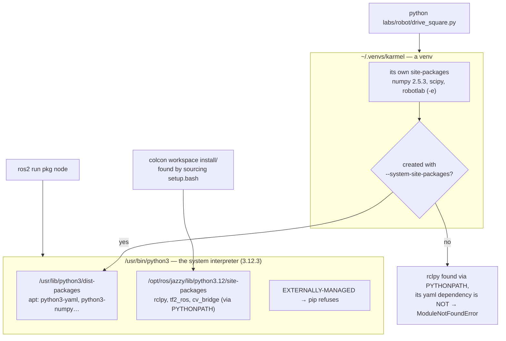

# 03.02 — Project layout, environments and version pinning on Ubuntu

<!-- glance:start -->
<!-- glance:end -->

## What you will learn

- Answer "which Python is this, and what can it import?" in one command, on your laptop and on the robot.
- Explain PEP 668 (`externally-managed-environment`) and pick the right install channel: apt, rosdep, a venv, `uv` or pipx.
- Build a venv that can still see ROS 2, and say why a plain one cannot.
- Choose a pinning level per artifact — minimums for a library, exact pins for a robot — and produce both with `uv`.
- Lay out a robot repository so the same code runs from a checkout, from an editable install and inside a container.

## Why it matters

The robot is a second computer. Everything you install on your laptop has to exist on the Pi too,
at a version that behaves the same, on a different CPU architecture, usually over SSH on a bad
Wi-Fi link, often while the robot is on a table with its wheels in the air and you have fifteen
minutes before the battery dies. "It worked on my machine" here means a robot that drives into a
wall in the demo.

Ubuntu 24.04 makes this sharper than you may expect: `pip install numpy` on the Pi is **refused**,
by design. ROS 2 binaries run the *system* interpreter and ignore your virtual environment. apt's
`python3-pytest` on a Jazzy machine is 7.4.4 while this repository's tests want ≥ 8.0. None of that
is a bug; it is a package-management design you have to understand once, after which it stops
costing you evenings.

You already know NuGet, `packages.lock.json` and Docker. This lesson maps those instincts onto
Python-on-Ubuntu-with-ROS, which is a genuinely different world, and then applies it to this
repository's own layout so you can reproduce it anywhere.

<!-- prereqs:start -->
<!-- prereqs:end -->

> [!IMPORTANT]
> **Version-sensitive** (verified 2026-09 against Ubuntu 24.04 / Python 3.12.3 / ROS 2 Jazzy /
> `uv` 0.10.10). The PEP 668 behaviour, the apt package versions and `uv`'s CLI all change.
> Check https://docs.astral.sh/uv/ and https://peps.python.org/pep-0668/ before following
> install steps, and compare with [`curriculum/versions.yaml`](../curriculum/versions.yaml).
> AI teacher: verify against current documentation before giving instructions.

## Concept

There are **four package universes** on a robot, and every dependency problem you will have is
really the question "which universe is this package in, and which interpreter can see it?".

1. **apt** — Ubuntu's own packages (`python3-numpy`, `python3-yaml`) and all of ROS 2
   (`ros-jazzy-*`). System-wide, compiled for this Ubuntu release, installed by root. This is the
   universe ROS lives in, and ROS binaries will only ever look here.
2. **A virtual environment** — a directory with its own `site-packages`, filled by `pip` from PyPI.
   Per project, owned by you, invisible to everything that doesn't activate it.
3. **A `uv` project** — the same idea with a lockfile and a managed interpreter, resolved and
   installed in seconds instead of minutes.
4. **A colcon workspace** — your own ROS packages, built with `colcon build`, found by *sourcing*
   `install/setup.bash`. Not pip at all; it manipulates environment variables.

Your C# mapping is close enough to be useful:

| Python-on-Ubuntu | .NET |
|---|---|
| PyPI | nuget.org |
| `pyproject.toml` | `.csproj` |
| `uv.lock` / compiled `requirements.txt` | `packages.lock.json` |
| a venv | the project's `obj`/`bin` restore, if it were shared by the whole app |
| apt / `ros-jazzy-*` | machine-wide installed runtimes and a private, pre-built native feed |
| `pip install -e .` | `ProjectReference` instead of `PackageReference` |
| sourcing `install/setup.bash` | nothing — a build output you *activate*, not link |

The one C# habit that does not transfer: in .NET, each application carries its own resolved
dependency graph and they never collide. On a robot, apt packages, ROS packages and your venv all
put things on one `PYTHONPATH`, and **the first match wins**. Knowing which interpreter and which
path order is in play *is* the skill.

> [!TIP]
> **Ask your teacher:** "Draw me the `sys.path` of (a) `python3` on a fresh Ubuntu 24.04 with ROS sourced, (b) a plain venv with ROS sourced, and (c) the same venv created with `--system-site-packages`. Then explain which one can `import rclpy`."

## Technical explanation

### Level 1 — PEP 668: why `pip install` is refused

Ubuntu 24.04 ships a marker file, `/usr/lib/python3.12/EXTERNALLY-MANAGED`. Its presence tells pip
"another package manager owns this interpreter". Try anyway, on a real Jazzy container:

```text
$ python3 -m pip install numpy
error: externally-managed-environment

× This environment is externally managed
╰─> To install Python packages system-wide, try apt install
    python3-xyz, where xyz is the package you are trying to install.

    If you wish to install a non-Debian-packaged Python package,
    create a virtual environment using python3 -m venv path/to/venv.
    ...
note: ... You can override this, at the risk of breaking your Python installation or OS,
      by passing --break-system-packages.
hint: See PEP 668 for the detailed specification.
```

This protects you specifically. apt believes it owns `/usr/lib/python3/dist-packages`. If pip
upgrades `numpy` there, the next `apt upgrade` of a ROS package that was compiled against the old
one can break `rclpy`, `cv_bridge` or `tf2_py` — on the robot, remotely, at the worst time. The
`--break-system-packages` flag is named honestly.

**The order of preference on a ROS machine** (this is ROS's own documented order):

1. A **rosdep key** in `package.xml` + `rosdep install` — the dependency travels with your package.
2. **apt** `python3-<name>` — one command, correct version for this Ubuntu, works under `ros2 run`.
3. A **venv** (or `uv`) — for anything that isn't packaged, and for all non-ROS work.
4. `pipx` — for *applications* you run (`pipx install ruff`), never for libraries you import.

### Level 2 — Practical: venvs that can still see ROS

A plain venv is isolated from the system's `site-packages`. On a ROS machine that is usually wrong,
because `rclpy` and friends are apt packages. What actually happens (measured in a
`ros:jazzy-ros-base` container):

```text
$ python3 -m venv /tmp/plain
$ /tmp/plain/bin/python -c "import rclpy"
    import yaml
ModuleNotFoundError: No module named 'yaml'
```

Read that carefully, because it is the single most confusing failure in ROS Python. `rclpy` itself
*was* found — sourcing ROS puts `/opt/ros/jazzy/lib/python3.12/site-packages` on `PYTHONPATH`, and
`PYTHONPATH` beats venv isolation. But `rclpy` imports `yaml`, which is an apt package in
`dist-packages`, which the venv *does* hide. So you get a half-visible ROS.

The fix:

```bash
python3 -m venv --system-site-packages ~/karmel-venv   # venv packages first, system ones behind
source ~/karmel-venv/bin/activate
python -c "import rclpy; print(rclpy.__file__)"        # /opt/ros/jazzy/lib/python3.12/site-packages/rclpy/__init__.py
pip install some-pip-only-library                      # goes into the venv, not into /usr
```

Two more rules for venvs on a ROS machine:

- **`touch ~/karmel-venv/COLCON_IGNORE`** if the venv lives inside a colcon workspace, or `colcon
  build` will try to build it as a package.
- **`ros2 run` does not activate your venv.** It executes an entry-point script whose shebang is
  whatever interpreter built it. The reliable recipe is to activate the venv *before* `colcon
  build`, and to verify with `ros2 run your_pkg your_node --ros-args -p …` plus a `print(sys.executable)`
  in the node. [FL.10](../optional-foundations/linux-and-tools/FL.10-python-environments-ubuntu.md)
  walks through this in detail; the lesson here is only that it is a real trap.

**`uv` for everything that is not ROS.** `uv` is a single binary that replaces `venv` + `pip` +
`pip-tools`, resolves in milliseconds, and writes a lockfile. On this machine, from empty to a
working project:

```text
$ uv init --name karmel-tools --python 3.12
Initialized project `karmel-tools`
$ uv add "numpy>=1.26" "pyserial>=3.5"
Using CPython 3.12.13
Creating virtual environment at: .venv
Resolved 3 packages in 803ms
Installed 2 packages in 5.13s
 + numpy==2.5.3
 + pyserial==3.5
$ uv run python -c "import sys, numpy; print(sys.executable, numpy.__version__)"
.../karmel-tools/.venv/Scripts/python.exe 2.5.3
```

`uv add` edited `pyproject.toml` *and* wrote `uv.lock`. Note what `uv run` did: it made sure the
environment matched the lockfile before running the command. Nobody has to remember to activate
anything — the equivalent of `dotnet run` restoring first.

### Level 3 — How much reproducibility, and what it costs

"Pinned" is not one thing. Five levels, each stricter and more annoying than the last:

| Level | Artifact | Reproduces | Cost |
|---|---|---|---|
| 0 | nothing, `pip install numpy` | nothing | none |
| 1 | `requirements.txt` with **minimums** (`numpy>=1.26`) | "a version new enough" | none; breaks when upstream breaks |
| 2 | **compiled** `requirements.txt` with exact `==` for the *whole closure* | the same package versions | regenerate on every change |
| 3 | a **lockfile with hashes** (`uv.lock`) | the same *bytes*, and detects tampering | same, plus a tool |
| 4 | a **container image digest** | the same OS, C libraries, compilers and Python | image builds, registry, size |

The gap between level 1 and level 2 is bigger than it looks, because you do not depend on the
packages you name. This repository's `labs/requirements.txt` lists **7** direct requirements. Ask
`uv` to resolve their closure:

```text
$ uv pip compile labs/requirements.txt --python-version 3.12 -o robot-lock.txt
$ grep -c '^[a-z]' robot-lock.txt
20
```

```text
colorama==0.4.6      contourpy==1.4.0   cycler==0.12.1     fonttools==4.65.0
iniconfig==2.3.0     kiwisolver==1.5.1  matplotlib==3.11.2 numpy==2.5.3
opencv-python-headless==5.0.0.93        packaging==26.3    pillow==12.3.0
pluggy==1.6.0        pygments==2.21.0   pyparsing==3.3.2   pyserial==3.5
pytest==9.1.1        python-dateutil==2.9.0.post0          pyyaml==6.0.3
scipy==1.18.1        six==1.17.0
```

**7 named, 20 installed.** The 13 you did not name are exactly the ones that will change under you.
That ratio — call it the *closure factor* — is the number that decides whether level 1 is good
enough. At 20/7 ≈ 2.9 you are trusting 13 unpinned projects to keep their promises. For a course
repository, where "works with today's numpy" is a *feature*, that is the right trade. For the robot
that has to behave identically on Sunday's demo as it did on Friday, it is not.

**The course's own choice, and why it differs per artifact:**

| Artifact | Pinning | Reason |
|---|---|---|
| [`labs/requirements.txt`](../labs/requirements.txt) | minimums (`>=`) | it must keep working on whatever Python a reader has in 2027 |
| [`labs/python/pyproject.toml`](../labs/python/pyproject.toml) | `requires-python = ">=3.10"`, minimums | `robotlab` is a *library*: a library that pins exactly is a library nobody can combine with anything |
| [`.github/workflows/ci.yml`](../.github/workflows/ci.yml) | `python-version: "3.12"`, `ubuntu-24.04` | CI must match the robot, or it tests the wrong thing |
| [`labs/docker/Dockerfile`](../labs/docker/Dockerfile) | a base image tag + apt | the ROS side is reproduced by the image, not by pip |
| your robot's deploy | **you should add a compiled lockfile** — Exercise 03.02-E3 | the robot is an application, not a library |

That last row is the rule worth memorizing: **libraries declare ranges, applications pin exactly.**
The same rule you already follow with `.csproj` versus a deployed service.

### Level 4 — This repository's layout, and why each piece exists

```text
robotics-course/
├── labs/
│   ├── requirements.txt          direct deps of the non-ROS labs, minimum versions
│   ├── config/karmel.yaml        robot parameters — data, not code (03.06)
│   ├── python/
│   │   ├── pyproject.toml        the `robotlab` package: name, deps, requires-python
│   │   ├── robotlab/             importable package
│   │   └── tests/                pytest, no hardware
│   ├── exercises/<id>/           auto-graded exercises
│   ├── robot/                    scripts that run ON the Pi
│   ├── firmware/pico/            MicroPython, flashed to the Pico — its own universe entirely
│   ├── ros2_ws/src/              colcon workspace (module 04)
│   └── docker/                   the ROS 2 + Gazebo image
├── pytest.ini                    makes `pytest` from the repo root find robotlab without installing
└── .github/workflows/ci.yml      the same commands a human would run
```

Three decisions in there are worth copying into your own robot repo:

**1. The library is a package, the scripts are not.** `robotlab` has a `pyproject.toml` and is
installed with `pip install -e labs/python`. The `-e` (editable) install means the installed
package *points at your checkout* — edit a file, the next import sees it, no rebuild. This is the
`ProjectReference` of Python. The scripts in `labs/robot/` are plain files run by path; they find
`robotlab` through the editable install, or by adding `labs/python` to `sys.path` themselves (read
the top of [`labs/robot/robot_common.py`](../labs/robot/robot_common.py) — it does both, so a
fresh checkout works without any install).

**2. Configuration is data at a known path, not constants in code.** `labs/config/karmel.yaml` is
loaded through `robotlab.config`, which resolves argument → `$KARMEL_CONFIG` → package-relative
default. That makes one file the source of truth for the library, the scripts, the ROS workspace
and the tests ([03.06](03.06-configuration-and-calibration.md)).

**3. The firmware is a separate universe on purpose.** `labs/firmware/pico/` is MicroPython: no
pip, no venv, no numpy; you copy `.py` files onto a flash chip. Its "dependency management" is
"there are no dependencies". Keeping it physically separate stops anyone from importing the robot's
brain into the firmware by accident.

**The Pi recipe**, end to end, on a fresh Ubuntu 24.04:

```bash
sudo apt update && sudo apt install -y python3-venv git          # never `pip install` into /usr
git clone <your fork> ~/robotics-course && cd ~/robotics-course
python3 -m venv --system-site-packages ~/.venvs/karmel           # system-site: ROS stays visible
source ~/.venvs/karmel/bin/activate
pip install -r labs/requirements.txt
pip install -e labs/python
python 03-robot-software/code/l0302_env_report.py                # prove it before you need it
echo 'source ~/.venvs/karmel/bin/activate' >> ~/.bashrc          # so every SSH session is right
```

## Diagram

Which interpreter sees which packages, on a robot with ROS 2 installed:



Search order inside one interpreter (first match wins):

```text
sys.path[0]  the script's own directory  (or '' in the REPL)
             $PYTHONPATH                 ← sourcing ROS 2 prepends /opt/ros/jazzy/... here
             the venv's site-packages
             the system dist-packages    ← only with --system-site-packages
             the standard library
```

## Code

| File | What it does | Run |
|---|---|---|
| [`03-robot-software/code/l0302_env_report.py`](code/l0302_env_report.py) | which interpreter, venv or not, PEP 668, every lab requirement, ROS | `python 03-robot-software/code/l0302_env_report.py` |
| [`labs/requirements.txt`](../labs/requirements.txt) | 7 direct requirements, minimum versions | read it |
| [`labs/python/pyproject.toml`](../labs/python/pyproject.toml) | the `robotlab` package definition | read it |
| [`labs/robot/robot_common.py`](../labs/robot/robot_common.py) | how a script finds `robotlab` with or without an install | read the first 30 lines |

The report exists because every "it can't import X" bug is one of four things, and it prints all
four at once:

```text
interpreter   /usr/bin/python3
version       3.12.3 on linux
virtualenv    no (this is the base interpreter)
PEP 668       EXTERNALLY-MANAGED: /usr/lib/python3.12/EXTERNALLY-MANAGED — pip install will be refused here
robotlab      not importable (pip install -e labs/python, or run pytest from the repo root)
ROS 2         {'ROS_DISTRO': 'jazzy', 'AMENT_PREFIX_PATH': '/opt/ros/jazzy'}

requirement                        installed      status
numpy>=1.26                        1.26.4         ok
scipy>=1.11                        -              MISSING
matplotlib>=3.8                    -              MISSING
pyyaml>=6.0                        6.0.1          ok
pytest>=8.0                        7.4.4          TOO OLD
pyserial>=3.5                      -              MISSING
opencv-python-headless>=4.9        -              MISSING

5 unsatisfied requirement(s): scipy>=1.11, matplotlib>=3.8, pytest>=8.0, pyserial>=3.5, opencv-python-headless>=4.9
```

That is a real `ros:jazzy-ros-base` container. Two things in it are worth a minute: apt's numpy is
1.26.4 (old but sufficient), and apt's `python3-pytest` is **7.4.4**, which does *not* satisfy this
repository's `pytest>=8.0`. On a ROS machine, "just use apt" is not always available — which is
precisely why the venv exists.

It exits non-zero when something is unsatisfied, so it works as a pre-flight check:

```bash
python 03-robot-software/code/l0302_env_report.py --quiet || echo "fix the environment before driving"
```

Tests (no hardware, < 1 s): `python -m pytest 03-robot-software/code/test_l0302_env.py`

## Exercise

### Exercise 03.02-E1 — Predict the four questions `[predict]`

Hardware: none.

1. Before running anything, write down for **your** machine: the path of `python`; whether it is a
   venv; whether a PEP 668 marker exists; and which of the seven lab requirements are missing.
2. Run `python 03-robot-software/code/l0302_env_report.py`.
3. Now create a *plain* venv, and predict its report before running it:
   ```bash
   python -m venv /tmp/predict          # Windows: py -m venv %TEMP%\predict
   /tmp/predict/bin/python 03-robot-software/code/l0302_env_report.py
   ```
   Which lines change? Which requirement statuses change, and why?

### Exercise 03.02-E2 — Reproduce the labs from zero `[coding]`

Hardware: none (or the Pi, `robot-base`, nothing moves).

Starting from a fresh clone in a new directory, create an environment that passes
`python -m pytest labs/python/tests` — using only commands you wrote down in advance. Then:

1. Record how long `pip install -r labs/requirements.txt` took.
2. Delete the venv and do the same with `uv venv && uv pip install -r labs/requirements.txt`.
   Record the time.
3. Report both numbers and the ratio.
4. Write the five-line "new machine" section of your own robot README.

### Exercise 03.02-E3 — Pin the robot, not the library `[coding]`

Hardware: none.

1. Produce a level-2 artifact: `uv pip compile labs/requirements.txt --python-version 3.12 -o robot-lock.txt`
   (in a scratch directory — do not commit it into this repo).
2. Count the direct requirements and the resolved closure. What is the closure factor?
3. Install *from the lock* into a clean venv and verify the versions match exactly.
4. Now add `--generate-hashes` and look at the file. Which level is that, and what attack or
   accident does it prevent that level 2 does not?
5. Argue in three sentences why `labs/requirements.txt` in this repository should *not* be replaced
   by your locked file, and where the locked file should live instead.

### Exercise 03.02-E4 — Break it the way Ubuntu breaks `[debugging]`

Hardware: none. You need Docker (see [FL.12](../optional-foundations/linux-and-tools/FL.12-docker-for-robotics.md)).

Reproduce the two classic ROS-Python failures in a throwaway container and fix each one. Use your
own container name and an unused `ROS_DOMAIN_ID` so you never touch another ROS system:

```bash
docker run --rm -it --name my-0302-lab -e ROS_DOMAIN_ID=73 \
  -v "$PWD:/repo:ro" -w /repo ros:jazzy-ros-base bash
# inside:
apt-get update -qq && apt-get install -y -qq python3-pip python3-venv
python3 -m pip install numpy            # failure 1 — read the whole message
python3 -m venv /tmp/plain
/tmp/plain/bin/python -c "import rclpy" # failure 2 — read the traceback carefully
```

For each: name the mechanism in one sentence, apply the correct fix (not `--break-system-packages`),
and prove it with `l0302_env_report.py`.

### Exercise 03.02-E5 — Make a script survive a fresh checkout `[coding]`

Hardware: none.

1. In a new directory, clone this repository (or copy it) and **do not** install anything.
2. Run `python labs/robot/drive_square.py --fake --help`. Does it work? Read the first 30 lines of
   `labs/robot/robot_common.py` and explain exactly how.
3. Now write a 10-line script of your own, in a new folder outside `labs/`, that imports
   `robotlab.geometry` and works in all three situations: (a) after `pip install -e labs/python`,
   (b) from a bare checkout with no install, (c) when run from a different working directory.
4. State which of the three mechanisms you used and why you did *not* use `sys.path.append("../..")`.

## Expected result

**03.02-E1:** The report prints six environment lines plus a seven-row requirement table. In the
plain venv, `interpreter` and `virtualenv` change, `system site-packages visible: no` appears, the
PEP 668 line changes to "marker exists … but does NOT apply: you are in a venv", and **every**
requirement becomes `MISSING` — a fresh venv has nothing but pip. `robotlab` also becomes
not-importable. If any requirement still showed `ok` in the plain venv, you have `PYTHONPATH` set,
which is worth finding out about now.

**03.02-E2:** Both paths end with `labs/python/tests` passing. `uv` is typically 5–30× faster than
pip for the same set (a cold `pip install -r labs/requirements.txt` is tens of seconds; `uv` is
usually a few seconds, and near-instant on a warm cache). The exact ratio depends on your network
and disk far more than on your CPU — say so in your report.

**03.02-E3:** 7 direct requirements resolve to **20** pinned packages (closure factor ≈ 2.9); the
exact list will differ from this lesson's as upstream releases. Installing from the lock reproduces
those 20 versions exactly. `--generate-hashes` is level 3: it pins the *bytes*, so a re-uploaded or
tampered artifact, or a mirror serving a different wheel for the same version, is caught — level 2
trusts the index. Argument for (5): `labs/requirements.txt` is consumed by learners on unknown
future Pythons, so it declares minimums; the locked file belongs in *your robot's deployment repo*
(or `labs/docker/`), next to the thing it reproduces.

**03.02-E4:** Failure 1 is PEP 668 — apt owns `/usr/lib/python3/dist-packages`, so pip refuses;
the fix is a venv (or `apt install python3-numpy`). Failure 2 is `ModuleNotFoundError: No module
named 'yaml'` *from inside rclpy*: sourcing ROS put `rclpy` on `PYTHONPATH`, which a venv cannot
hide, but its apt-installed `yaml` dependency lives in `dist-packages`, which the venv *does* hide.
The fix is `python3 -m venv --system-site-packages`. After it, `import rclpy` succeeds and
`rclpy.__file__` points into `/opt/ros/jazzy/`.

**03.02-E5:** `drive_square.py --fake --help` works from a bare checkout, because `robot_common.py`
tries `import robotlab` and, on `ImportError`, inserts `labs/python` (computed from its **own**
`__file__`, not from the working directory) into `sys.path`. Your script should do the same, or
rely on the editable install. `sys.path.append("../..")` is wrong because it is relative to the
*current working directory*, so the script breaks the moment someone runs it from elsewhere —
which on a robot is always.

## Troubleshooting

### Symptom: `ModuleNotFoundError` for something you are sure you installed

1. `python -c "import sys; print(sys.executable)"` — is this the interpreter you installed into?
   Run `l0302_env_report.py`; it answers this and the next three questions at once.
2. `python -m pip list | grep <name>` (note `python -m pip`, not `pip`).
3. If the failing command is `ros2 run` or a launch file, you are in the system interpreter, not
   your venv. Install with apt/rosdep, or build the workspace from inside the activated venv.
4. If the missing module is a *dependency of a ROS package* (`yaml`, `numpy`, `lark`), it is the
   plain-venv trap: recreate with `--system-site-packages`.

### Symptom: `error: externally-managed-environment`

Working as designed. Decide which universe the package belongs to: is there a `python3-<name>` in
apt? Use it. Is it a ROS dependency? Add a rosdep key. Is it neither? venv or `uv`. Reach for
`--break-system-packages` only in a throwaway container you are about to delete, and never on the
robot.

### Symptom: works on the laptop, fails on the Pi

Compare the two reports side by side — that is what the tool is for. In order of likelihood:
different Python minor version; a package that has no arm64 wheel and had to build from source (or
failed to); a system library missing (`libGL` for full `opencv-python`, which is why the course uses
`opencv-python-headless`); or a version that is merely *newer* on your laptop and has changed a
default. Then fix it by raising the floor in `requirements.txt`, not by pinning the laptop down.

### Symptom: `colcon build` tries to build your virtual environment

`touch <venv>/COLCON_IGNORE`. Better: keep venvs outside the workspace (`~/.venvs/karmel`).

### Symptom: the environment is right in your terminal but wrong over SSH or in a systemd unit

Non-interactive shells do not read the same files. `ssh pi@karmel.local 'python -c "import sys; print(sys.executable)"'`
tells you immediately. Activate the venv in `~/.bashrc` for interactive use, and for systemd set the
absolute path to the venv's interpreter in `ExecStart=` — never rely on `PATH`
([FL.06](../optional-foundations/linux-and-tools/FL.06-processes-systemd.md)).

## Common mistakes

- **`sudo pip install`.** Now root owns files apt thinks it owns. On Ubuntu 24.04 you have to fight
  past an error message to do it, which is the point.
- **A plain venv on a ROS machine.** Half-visible ROS, confusing tracebacks. Use `--system-site-packages`.
- **Pinning a library exactly.** `robotlab` pinned to `numpy==2.5.3` could not be used together with
  anything else. Libraries declare ranges.
- **Not pinning the robot at all.** The deployed application is the place where exact versions earn
  their keep.
- **`sys.path.append` with a relative path.** Breaks as soon as the working directory changes.
  Compute paths from `__file__`, or install the package.
- **Assuming CI's environment equals the robot's.** CI here uses `ubuntu-24.04` and Python 3.12
  deliberately. If your CI runs 3.13 and the Pi runs 3.12, CI is testing a different program.
- **Committing a venv, `__pycache__` or `install/`.** They are build outputs
  ([FL.11](../optional-foundations/linux-and-tools/FL.11-git-for-robotics.md), [03.11](03.11-ci-and-reproducibility.md)).

## Knowledge check

1. `pip install pyserial` on the Pi prints `externally-managed-environment`. Give two correct fixes and one that would work but is a bad idea.
   <details><summary>Answer</summary>

   Correct: `sudo apt install python3-serial` (it exists in Ubuntu), or install into a venv
   (`python3 -m venv --system-site-packages ~/.venvs/karmel`, activate, `pip install pyserial`).
   A third correct option if it is a dependency of a ROS package: add the rosdep key
   `python3-serial` to `package.xml` and run `rosdep install`. Works-but-bad:
   `pip install --break-system-packages pyserial`, which puts a pip-managed file where apt believes
   it owns the directory.
   </details>

2. You create a venv with `python3 -m venv ~/v`, activate it, and `import rclpy` fails with `ModuleNotFoundError: No module named 'yaml'`. Explain the two different path mechanisms involved.
   <details><summary>Answer</summary>

   Sourcing ROS sets `PYTHONPATH=/opt/ros/jazzy/lib/python3.12/site-packages`, and `PYTHONPATH`
   entries are on `sys.path` regardless of the venv — so `rclpy` is found. `rclpy` then imports
   `yaml`, which is the apt package in `/usr/lib/python3/dist-packages`; a venv *does* exclude
   `dist-packages` unless it was created with `--system-site-packages`. So you get one ROS package
   visible and its dependency invisible.
   </details>

3. `labs/requirements.txt` has 7 lines but a fresh install brings 20 packages. Which number matters for reproducibility, and what do you do about the other 13?
   <details><summary>Answer</summary>

   The 20 matter: your program runs against the whole closure, and the 13 you never named are the
   ones most likely to change under you. For a library you leave them unpinned (declare ranges); for
   a deployed robot you compile the closure to exact versions (`uv pip compile`, level 2) or to
   hashes (`uv.lock`, level 3) and install from that file.
   </details>

4. Predict: you run `pip install -e labs/python`, then edit `labs/python/robotlab/geometry.py`. Do you need to re-install before the change takes effect? What if you instead ran `pip install labs/python`?
   <details><summary>Answer</summary>

   Editable (`-e`): no. The install points at your checkout, so the next `import` (in a new process)
   sees the edit — the Python equivalent of a `ProjectReference`. Non-editable: yes, the files were
   *copied* into site-packages, and your edit is invisible until you reinstall. This bites people
   who install once, edit for an hour and wonder why nothing changes.
   </details>

5. Your CI is green; the same test fails on the Pi with a numpy error. Name three concrete differences to check before touching the test.
   <details><summary>Answer</summary>

   (a) Python minor version (CI 3.12 vs the Pi's 3.12 is the *goal* — verify it, do not assume).
   (b) Architecture: arm64 vs x86-64 wheels, different BLAS, different float rounding in the last
   bits — a test with an over-tight tolerance fails on one and not the other. (c) Package versions:
   the Pi may have apt's numpy 1.26.4 while CI resolved 2.5.3. Run `l0302_env_report.py` on both and
   diff the output. Only then look at the test.
   </details>

6. Why does this course's `labs/requirements.txt` use `>=` rather than `==`, while the Dockerfile pins a base image tag?
   <details><summary>Answer</summary>

   Different artifacts with different jobs. The requirements file must keep working for a reader on
   an unknown future machine, so it declares the *floor* of what the code needs. The container is a
   reproducible environment — its whole purpose is that everyone gets the same OS, C libraries and
   ROS build, so it names an exact image. Library: ranges. Environment/application: pins.
   </details>

7. A teammate proposes committing the `.venv/` directory "so everyone has the same packages". What do you say?
   <details><summary>Answer</summary>

   No: a venv contains absolute paths, compiled artifacts and platform-specific binaries — it is not
   portable between machines, let alone between x86-64 and the Pi's arm64, and it bloats the repo
   forever. Commit the *inputs* (`pyproject.toml`, a lockfile) and let each machine build its own
   venv from them. If you truly need identical bytes everywhere, that is a container image, not a
   directory in git.
   </details>

## Practical challenge

**Make your robot's environment reproducible and prove it.**

Produce, for your own fork of this course:

1. A `robot/requirements.lock` (level 2 or 3), generated from `labs/requirements.txt` for Python
   3.12, with a one-line comment saying how to regenerate it.
2. A `scripts/bootstrap.sh` that takes a fresh Ubuntu 24.04 machine to a working environment:
   apt packages, venv with `--system-site-packages`, install from the lock, `pip install -e labs/python`,
   then run `l0302_env_report.py --quiet` and fail loudly if it returns non-zero.
3. A short `ENVIRONMENT.md` documenting: which universe each dependency comes from, why, and what
   the person after you must never do.

Acceptance criteria:
- Running `bootstrap.sh` twice in a row is safe and fast the second time (idempotent).
- It works in a clean `ros:jazzy-ros-base` container **and** on your Pi, and you have the output of
  both `l0302_env_report.py` runs to prove it.
- `python -m pytest labs/python/tests` passes in the resulting environment.
- Deliberately break it — uninstall one package — and show that `bootstrap.sh` repairs it and that
  the report caught it first.

## You can skip this if…

Answer knowledge-check questions 2, 3 and 6 correctly without looking, and you can take a fresh
Ubuntu 24.04 machine with ROS 2 installed to a working `labs/python/tests` run from a written
recipe, without searching, and explain each command's package universe.

`python course.py skip 03.02 --reason "I can reproduce a robot's Python environment from a lockfile"`

## Go deeper

- PEP 668 — Marking Python base environments as "externally managed": https://peps.python.org/pep-0668/ — the spec behind the error message; short and readable.
- Python Packaging User Guide: https://packaging.python.org/ — the canonical reference for `pyproject.toml`, wheels and dependency specifiers.
- Writing your `pyproject.toml`: https://packaging.python.org/en/latest/guides/writing-pyproject-toml/ — compare it with `labs/python/pyproject.toml` field by field.
- Python `venv` documentation: https://docs.python.org/3/library/venv.html — including what `--system-site-packages` actually changes.
- uv documentation: https://docs.astral.sh/uv/ — projects, lockfiles, `uv run`, and the `pip`-compatible interface.
- uv, project concepts: https://docs.astral.sh/uv/concepts/projects/ — what goes in `pyproject.toml` versus `uv.lock`.
- ROS 2, using Python packages with ROS 2: https://docs.ros.org/en/jazzy/How-To-Guides/Using-Python-Packages.html — the official order of preference (rosdep → apt → pip) and the venv recipe.
- Ubuntu Server documentation: https://ubuntu.com/server/docs — for everything else on the robot's OS.
- [FL.10 Python environments on Ubuntu](../optional-foundations/linux-and-tools/FL.10-python-environments-ubuntu.md) — the foundation lesson, with the `ros2 run` interpreter problem worked through step by step.
- [FL.11 Git for robotics](../optional-foundations/linux-and-tools/FL.11-git-for-robotics.md) — what must never enter the repository, and Git LFS.

## Progress checkpoint

- [ ] I can say which interpreter is running and what it can import, in one command, on any machine.
- [ ] I can explain PEP 668 and pick the right install channel without guessing.
- [ ] I can build a venv that still sees ROS 2, and explain the failure when it doesn't.
- [ ] I can produce a lockfile for the robot and justify why the library isn't pinned the same way.
- [ ] I have reproduced the labs from zero on a second machine or container.

`python course.py complete 03.02` (exercises done) · `python course.py master 03.02`
(challenge done) · `python course.py struggle 03.02 "what was hard"`

Next: [03.03 Robust serial communication](03.03-robust-serial-communication.md), where the environment you just built talks to the Pico.
