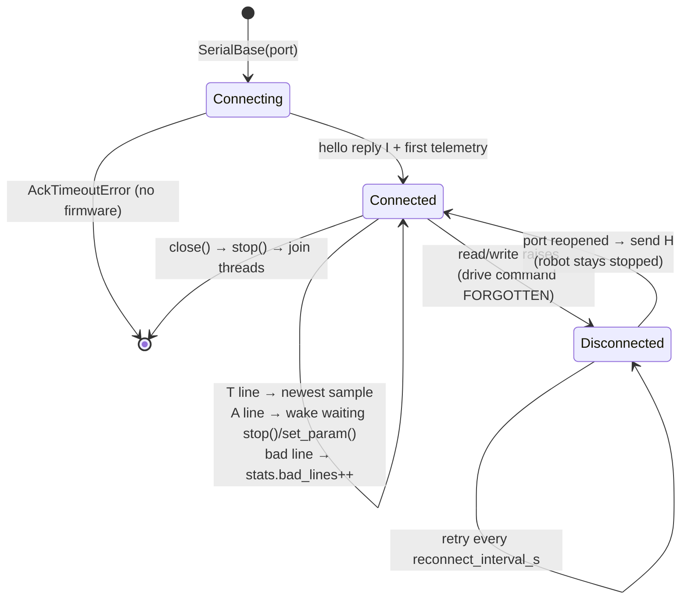
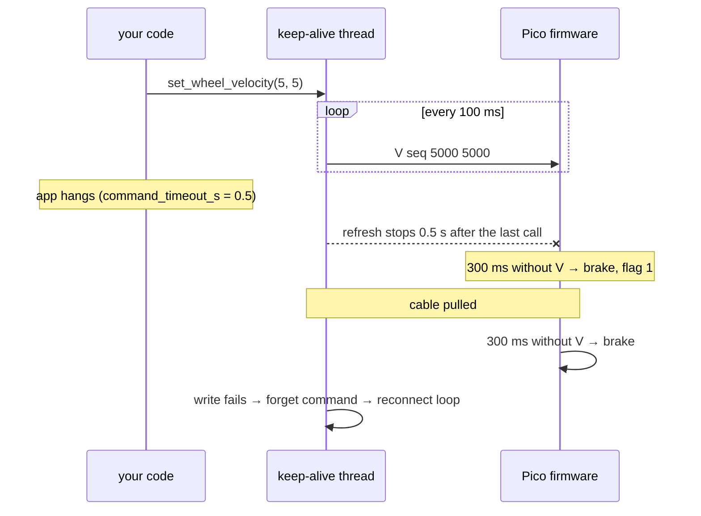

# 03.03 — Robust serial communication — framing, timeouts, reconnection

<!-- glance:start -->
<!-- generated by tools/build.py from curriculum/syllabus.yaml — edit the syllabus, not this block -->

| | |
|---|---|
| **Track** | Main path |
| **Difficulty** | Intermediate |
| **Time** | 1 h |
| **Hardware** | Stage 1 robot: Pi 5, Pico, encoder motors, driver, chassis, battery, distance sensors (stage 1) |
| **Software** | python, pyserial |
| **Prerequisites** | [01.10 Design the Pi ↔ Pico serial protocol (with a watchdog)](../01-first-robot/01.10-pi-pico-protocol.md)<br>[03.02 Project layout, environments and version pinning on Ubuntu](03.02-environments-and-pinning.md) |
| **Optional prerequisites** | [FE.09 Serial buses: UART, I²C and SPI](../optional-foundations/electronics/FE.09-uart-i2c-spi.md) |
| **Skip if** | Your serial link survives unplugging the Pico and plugging it back in. |

<!-- glance:end -->

## What you will learn

- Explain why a serial port is a byte stream, and write a receiver that survives split lines, merged lines, garbage and a partial first line.
- Choose between an XOR checksum and a CRC with numbers, and know when COBS binary framing is worth the upgrade.
- Read `robotlab/serial_base.py` as a design and justify its choices: chunked reads, a reader thread, acks only where they matter, keep-alive vs watchdog, forgetting the drive command on disconnect.
- Break the link on purpose (kill the fake Pico, pull the USB cable) and verify the host reconnects and the robot never restarts on its own.
- Give the Pico a stable name, `/dev/karmel`, with a udev rule.

## Why it matters

Everything karmel does goes through one USB cable between the Raspberry Pi and the Pico: every
wheel command, every encoder tick, every battery reading. In [01.10](../01-first-robot/01.10-pi-pico-protocol.md)
you designed protocol v1 and made it work on a bench. On a moving robot the cable gets bumped,
the Pico browns out when the motors start ([02.02](../02-robot-electronics/02.02-power-budget.md)),
motor noise flips bits ([02.06](../02-robot-electronics/02.06-noise-grounding-emi.md)), and after a
replug the device comes back as `/dev/ttyACM1` instead of `/dev/ttyACM0`.

A link that works 99 % of the time is a robot that drives into a wall once a day. This lesson is
the difference: every failure is detected, contained, counted, and recovered from without a
human, and recovery never means "motors start again by themselves". The ros2_control hardware
interface of [06.06](../06-simulation/06.06-ros2-control.md) and [08.12](../08-control/08.12-control-in-ros2.md),
whose C++ source you read in [03.09](03.09-where-cpp-is-used.md), follows exactly the same rules.

<!-- prereqs:start -->
## Prerequisites

You need these first:

- [01.10 Design the Pi ↔ Pico serial protocol (with a watchdog)](../01-first-robot/01.10-pi-pico-protocol.md)
- [03.02 Project layout, environments and version pinning on Ubuntu](03.02-environments-and-pinning.md)

### Optional prerequisite links

New to any of these? Take the foundation lesson first; skip it if you already know it.

- [FE.09 Serial buses: UART, I²C and SPI](../optional-foundations/electronics/FE.09-uart-i2c-spi.md)

Check your readiness: `python course.py why 03.03`
<!-- prereqs:end -->

## Concept

A TCP socket, a named pipe and a USB serial port have one thing in common: they give you a
**byte stream**, not messages. `read()` returns whatever bytes happen to have arrived. You might
get half a telemetry line, then the rest together with two more lines. If you open the port
while the Pico is mid-line, the first thing you read is the *tail* of a line. You already know
this from TCP; the difference on a robot is that the stream is also **lossy and noisy**, and the
other end **reboots** without warning.

Robust links answer four questions, each with its own mechanism:

1. **Where does a message end?** *Framing.* Protocol v1 uses a newline. Binary protocols use
   COBS and a zero byte. The receiver must **resynchronize** after garbage: throw away bytes until
   the next delimiter, then trust the stream again.
2. **Is this message intact?** *Error detection.* A checksum or CRC on every frame. A corrupted
   frame is dropped silently. Its sequence number can't be trusted, so there's nothing to reply to.
3. **Did the other side get my command?** *Acknowledgements and retries*, but only for commands
   where a loss matters (`stop`, `reset_encoders`, `set_param`). A drive command sent 20 times a
   second is replaced by the next one anyway.
4. **Is the other side still there?** *Timeouts in both directions.* The Pico stops the motors
   if commands stop (the watchdog). The host refuses to use telemetry older than 0.5 s and
   reconnects when the port dies.

The .NET analogy is a resilient message client (Polly retries, circuit breaker, health check),
with one twist that .NET services don't have: **the safe state is "stopped"**. A web client
retries a failed request. A robot client never replays a stale drive command after a
reconnect, because the world moved while it was gone.

> [!TIP]
> **Ask your teacher:** "Walk me through what each side of the karmel link does, second by second, when I pull the USB cable while the robot is driving at 0.3 m/s, and when I plug it back in."

## Technical explanation

### Level 1 — Intuition: the four failure modes you will actually see

| Failure | What it looks like in the byte stream | Who detects it |
|---|---|---|
| Opened mid-line / Pico rebooted mid-line | first line is a fragment | framing + checksum → dropped |
| Electrical noise from the motors | a few flipped bits | checksum/CRC → dropped |
| Wrong baud rate on a real UART, or a flood of debug prints | long runs without a newline | max line length → buffer discarded |
| Cable pulled, brownout, Pico crashed | `read()` raises, or nothing arrives | I/O exception → reconnect; telemetry age → `TelemetryTimeoutError`; Pico watchdog → motors stop |

USB CDC (what the Pico's USB serial is) already has CRCs at the USB layer, so bit flips *inside*
USB are rare. The checksum still earns its place: the same protocol runs over a plain UART on
GPIO pins ([FE.09](../optional-foundations/electronics/FE.09-uart-i2c-spi.md)), where noise does
flip bits, and it catches bugs such as two writers interleaving bytes on one port.

### Level 2 — Practical: pyserial the way robot code uses it

```python
import serial  # pip package "pyserial", apt package python3-serial

port = serial.serial_for_url("/dev/karmel", baudrate=115200, timeout=0)   # or "socket://localhost:5760"
chunk = port.read(4096)       # timeout=0: returns at once with 0..4096 bytes
port.write(b"S 9*4A\n")       # blocks until queued, unless write_timeout is set
```

The three `timeout` modes decide how your reader behaves:

| `timeout=` | `read(n)` | Use |
|---|---|---|
| `None` | blocks until `n` bytes arrive — forever if the Pico is dead | never in robot code |
| `0` | returns immediately with what is there | a reader thread that sleeps briefly when empty (`SerialBase`) |
| `0.05` | returns after `n` bytes or 50 ms | a simple single-threaded loop |

`readline()` looks tempting. With `timeout=None` it hangs forever when the Pico is unplugged in
a way that produces no error. With a timeout it can return half a line, which you must then
glue to the next read yourself. That glue *is* a line reader, so write the line reader once,
properly (Exercise 03.03-E1), and feed it chunks.

**Why chunks, not bytes.** At 50 Hz a telemetry line is 42 bytes, so 2,100 bytes/s. A Python loop
that does `read(1)` pays a system call and an interpreter round trip per byte. `SerialBase`'s
reader thread reads up to 4096 bytes per call and splits on `b"\n"` with `bytes.split`, which runs
in C. The comment in the source explains it: one `select()` + `recv()` per byte couldn't keep up in
a Python thread and data piled up.

**Exclusive access.** Two programs reading the same port each get *some* of the bytes: both see
corrupted lines. On Linux, `serial.Serial(..., exclusive=True)` makes the second open fail
with a clear error instead. `SerialBase` doesn't set it (it opens through `serial_for_url`, which
also serves `socket://` URLs), so don't start two robot scripts at once.

### Level 3 — Mathematics: how strong is a checksum?

**XOR checksum (protocol v1).** Each bit of the 8-bit result is the parity of that bit position
over all payload bytes:

$$c = b_1 \oplus b_2 \oplus \dots \oplus b_n$$

It detects any error that flips an **odd** number of bits in some bit position. It misses two
flips in the same bit position of different bytes, any reordering of bytes, and a random
corruption with probability $2^{-8}$. For 2 random bit flips in a payload of $L$ bytes, the chance
that both hit the same bit position (but different bytes) is

$$P_{\text{miss}} = \frac{8\binom{L}{2}}{\binom{8L}{2}} \approx \frac{1}{8} \quad (L = 38:\ \tfrac{8 \cdot 703}{45\,956} = 12.2\,\%)$$

**CRC-16/CCITT-FALSE.** Treat the message as a polynomial over GF(2), divide by
$g(x) = x^{16} + x^{12} + x^5 + 1$ (`0x1021`), send the 16-bit remainder. Because $g$ has the
factor $(x+1)$ it detects every odd number of bit errors. It also detects every single burst of up to 16
bits, and every 2-bit error in frames far longer than ours. Random corruption slips through
with probability $2^{-16} = 0.0015\,\%$.

Numbers from a Monte Carlo run on the real 42-byte telemetry line
(`03-robot-software/code/l0303_error_detection.py`, 200,000 trials per row):

```text
line 'T 123456 -5 2464 6283 -6283 11850 -1 9*7A\n': 42 bytes, 2100 bytes/s at 50 Hz
1 bit flipped          undetected: XOR  0.000%   CRC-16  0.0000%
2 bits flipped         undetected: XOR 12.229%   CRC-16  0.0000%
3 bits flipped         undetected: XOR  0.000%   CRC-16  0.0000%
8-byte garbage burst   undetected: XOR  0.386%   CRC-16  0.0025%
```

What does 0.386 % mean for karmel? Suppose a noisy UART corrupts 1 line in 1,000 with a burst.
At 50 Hz that's 180 corrupted lines per hour, and XOR lets $180 \times 0.00386 \approx 0.7$ of them through:
**about one bad telemetry sample per hour**. With CRC-16: $180 \times 0.000025 = 0.0045$, one every
~9 days. On USB CDC, where corruption is far rarer, XOR is fine. On a raw UART next to motor wires,
or for commands that move an arm, use a CRC. A second layer helps either way: *plausibility
checks*. A wheel speed of 900 rad/s or ticks that jump by 50,000 in 20 ms are rejected by the
consumer, whatever the checksum says.

### Level 4 — Implementation: `SerialBase` as a design

Open `labs/python/robotlab/serial_base.py` next to this section. Each design decision answers
one of the failure modes above.

**1. A reader thread owns the port.** `_reader_loop` reads chunks with `timeout=0`, sleeps 2 ms
when nothing arrived (instead of spinning a CPU core), splits complete lines and hands each one to
`_handle_line`. Your control loop never blocks on I/O: `read()` just returns the newest
telemetry sample under a lock. (Why a thread and not asyncio is [03.04](03.04-timing-and-concurrency.md)'s
topic.)

**2. Bad input is counted, not raised.** `_handle_line` catches `ProtocolError`, increments
`stats.bad_lines` and logs at DEBUG. A flood of more than 4 × 120 bytes without a newline clears
the buffer. The next bytes up to a newline then form one bad line, and the stream is back in
sync. Exceptions are for the *caller's* problems (a rejected parameter), not for noise.
`print(base.stats)` is the first debugging step for any flaky link.

**3. Acks where losing a command matters.** `stop()`, `reset_encoders()` and `set_param()` go
through `_send_and_wait`: a fresh sequence number per attempt, wait `ack_timeout_s` (0.25 s),
retry up to `retries` (2) times, then raise `AckTimeoutError`. An `A <seq> ERR <reason>` raises
`CommandRejectedError`. Drive commands are **fire-and-forget**: they are tracked, and acks that
never arrive are counted in `unacked_drive_commands`, but nobody waits. At 50 Hz, waiting 0.25 s
for an ack would stall the control loop for 12 cycles to protect a command that is obsolete in 20 ms.

**4. Keep-alive on the host, watchdog on the Pico.** They are two halves of one contract.
The firmware's `CommandWatchdog` (`labs/firmware/pico/watchdog.py`) brakes if no `M`/`V` arrives
for 300 ms. The host's keep-alive thread re-sends the last drive command every 100 ms, so a
script can say `set_wheel_duty(0.4, 0.4); time.sleep(2)` and the wheels keep turning. The margin is
deliberate: 300 ms / 100 ms = 3 consecutive keep-alives may be lost before the robot stops. And if
the host process dies, the keep-alive dies with it, and the watchdog stops the robot within 0.3 s.

`command_timeout_s` adds a third timer, the **dead-man switch**: if *your code* stops calling
`set_wheel_*` (a hung teleop loop, a lost Wi-Fi connection to the laptop, see
[03.10](03.10-networking-for-robots.md)), the keep-alive stops refreshing, and the firmware watchdog
does the rest. Keep-alive protects against a *slow* program. The dead-man protects against a
*stuck* one.

**5. The drive lock.** `stop()` takes `_drive_lock` while clearing the drive command, and the
keep-alive thread holds the same lock while re-sending. Without it, this interleaving is possible:
keep-alive reads the command → your code calls `stop()` and sends `S` → keep-alive sends the old `V`,
and the robot drives on after you stopped it. It's a classic check-then-act race, and here it moves a robot.

**6. Stale data is an error.** `read()` raises `TelemetryTimeoutError` when the newest sample is
older than `max_telemetry_age_s` (0.5 s). Returning the last known value would let an obstacle
avoider keep trusting a range reading from before the cable fell out.

**7. Reconnection forgets the past.** On any read/write exception `_handle_disconnect` clears the
drive command *before* closing the port. The reader thread then retries `serial_for_url` every
`reconnect_interval_s` and sends a hello when it succeeds. The robot stays stopped until your
code commands it again (test: `test_reconnects_after_unplug_and_forgets_the_drive_command`).

**8. Reboots are detected through the robot's clock.** Telemetry carries `ms` since boot. If it goes
backwards, the Pico restarted: `stats.firmware_restarts += 1` and a warning. Its encoder counts
restarted at zero too. The C++ hardware interface in `karmel_hardware` handles that with a
`tick_offset_` so odometry doesn't jump ([03.09](03.09-where-cpp-is-used.md)).

**9. Dependency injection for testability.** `serial_factory` defaults to pyserial, but
`labs/python/tests/test_serial_base.py` injects an in-memory port that can drop acks and "unplug"
on command. The whole behavior above is tested in about 2 s without hardware. More in
[03.08](03.08-testing-robot-software.md).

### Level 4b — The upgrade path: COBS + CRC

Text lines stop being enough when payloads become binary (IMU samples as `float32`, compressed
scans) or you want a CRC-16. The standard answer is **COBS** (Consistent Overhead Byte Stuffing):
rewrite the frame so it contains no `0x00` byte, then use `0x00` as the delimiter. Each run of
non-zero bytes is prefixed by a code byte = (run length + 1):

```text
data:   11 22 00 33
COBS:   03 11 22 02 33      then the delimiter 00
        ^^ "2 bytes follow, then a zero"   ^^ "1 byte follows, end"
```

Overhead is at most $\lceil n/254 \rceil$ bytes (a 100-byte IMU frame: 1 byte), and a receiver that joins
mid-stream resynchronizes at the next zero, just as a line reader does at the next newline.
`03-robot-software/code/l0303_cobs.py` implements `encode_frame(payload)` =
COBS(payload + CRC-16) + `00` and a `FrameReader` with the same chunk-in/payloads-out shape as
your line reader. One trap on the Pico: MicroPython treats byte `0x03` on the USB console as
Ctrl-C and raises `KeyboardInterrupt`. A binary protocol must call `micropython.kbd_intr(-1)`
first. Text protocol v1 never sends `0x03`, which is one more reason it stayed text.

### Level 4c — A stable device name: udev

Linux names USB serial devices in the order they appear: `/dev/ttyACM0`, `/dev/ttyACM1`, …
Replug the Pico while a crashed process still holds `ttyACM0` open, or add a LiDAR with its own
USB serial adapter, and names shift. `SerialBase` would reconnect to the *wrong device* or to
nothing. A udev rule creates a symlink based on what the device *is*:

```text
# /etc/udev/rules.d/99-karmel.rules
# MicroPython on RP2040/RP2350 reports USB VID 2e8a (Raspberry Pi), PID 0005 (MicroPython).
SUBSYSTEM=="tty", ATTRS{idVendor}=="2e8a", ATTRS{idProduct}=="0005", SYMLINK+="karmel", MODE="0660", GROUP="dialout"
```

Two Picos on one robot? Add `ATTRS{serial}=="<the board's unique id>"`. Find all attributes with
`udevadm info -a -n /dev/ttyACM0`. The rule sets `GROUP="dialout"`, so your user must be in `dialout`
([FL.05](../optional-foundations/linux-and-tools/FL.05-permissions-users-groups.md)). On a desktop
Ubuntu with ModemManager installed, add `ENV{ID_MM_DEVICE_IGNORE}="1"` so it doesn't probe the Pico
with modem commands at plug-in. Ubuntu Server usually doesn't run ModemManager. Without writing
a rule, `/dev/serial/by-id/` already holds stable, long names based on the USB serial number, which
is fine for a quick test.

## Diagram

The host-side connection logic of `SerialBase`:



Who stops the robot, for each failure, and how fast:



How a line reader cuts a stream into frames:

```text
bytes arriving:  ...6283 11850 -1 9*7A\n T 1520 12 -20 ...*3C\n A 7 OK*72\n
                  └─ tail of a line ──┘  └──── complete line ────┘ └─ line ─┘
first read:      "...6283 11850 -1 9*7A"   → bad (no valid payload start) → dropped, counted
buffer:          accumulate until \n, check "<payload>*<hh>", XOR, printable ASCII
overlong (>120): discard buffer, ignore bytes until the next \n  → resynchronized
```

## Code

| File | What it shows |
|---|---|
| [`labs/python/robotlab/serial_base.py`](../labs/python/robotlab/serial_base.py) | the production host side: reader thread, acks, keep-alive, reconnect |
| [`labs/python/robotlab/protocol.py`](../labs/python/robotlab/protocol.py) | framing, checksum, strict parsing, error classes |
| [`labs/firmware/pico/watchdog.py`](../labs/firmware/pico/watchdog.py) | the Pico's command watchdog and hardware watchdog |
| [`03-robot-software/code/l0303_link_monitor.py`](code/l0303_link_monitor.py) | watch a link heal: state, telemetry age, counters |
| [`03-robot-software/code/l0303_error_detection.py`](code/l0303_error_detection.py) | XOR vs CRC-16 Monte Carlo |
| [`03-robot-software/code/l0303_cobs.py`](code/l0303_cobs.py) | COBS + CRC-16 frames and a `FrameReader` |

The monitor is small. The core is one status line built from public `SerialBase` state:

```python
def status_line(base: SerialBase, elapsed_s: float) -> str:
    age = f"{base_age_ms(base):4.0f}ms"
    if not base.connected:
        up = "DOWN"  # the reader thread saw an I/O error and is retrying every reconnect_interval_s
    else:
        try:
            base.read()  # raises if the newest sample is older than max_telemetry_age_s (0.5 s)
            up = "UP"
        except TelemetryTimeoutError:
            up = "STALE"  # port open, but no fresh telemetry: firmware hung, wrong device, baud…
    s = base.stats
    return (f"t={elapsed_s:5.1f}s  {up:5} age={age}  telem={s.telemetry}  bad={s.bad_lines}  "
            f"ack_to={s.ack_timeouts}  reconnects={s.reconnects}  fw_restarts={s.firmware_restarts}")
```

Run it with an in-process fake Pico whose "cable" is pulled every second:

```bash
python 03-robot-software/code/l0303_link_monitor.py --fake --chaos 1.0 --duration 3 --interval 0.25
```

Tests (no hardware, ~6 s): `python -m pytest 03-robot-software/code/test_l0303_serial.py`.

## Exercise

### Exercise 03.03-E1 — A line reader that survives the real world `[coding]`

Implement `xor_checksum`, `crc16_ccitt_false`, `frame` and `LineReader.feed` in
`labs/exercises/03.03/student.py` (the README there has the details). The tests feed lines byte by
byte, merged in one chunk, with CRLF endings, corrupted, as a partial first line, as a 500-byte
flood, and as a fuzzed stream of 200 lines cut into random chunks.
Hardware: none. Check it: `python course.py check 03.03`

### Exercise 03.03-E2 — Predict the checksum's blind spots `[predict]`

Before running anything, write down your predictions: what percentage of telemetry lines with
exactly (a) 1, (b) 2, (c) 3 random bit flips does the XOR checksum fail to detect? And CRC-16?
Then run `python 03-robot-software/code/l0303_error_detection.py` and explain every number that
surprised you. Hardware: none.

### Exercise 03.03-E3 — Break the link and watch it heal `[simulation]`

Hardware: none.

1. Terminal 1: `python -m robotlab.fake_pico --port 5760`
2. Terminal 2: `python 03-robot-software/code/l0303_link_monitor.py --port socket://localhost:5760 --duration 30`
3. After ~5 s, stop the fake Pico with Ctrl-C. Wait 3 s. Start it again.
4. Record the sequence of states, how long the link was `DOWN`, and the final counters. Explain
   why `fw_restarts` changed even though you never "rebooted" anything.
5. Repeat with `labs/robot/drive_square.py --port socket://localhost:5760` instead of the
   monitor. Kill the fake mid-square. Does the script crash, or wait? What does the restarted fake robot do?

**Hardware variant** (`robot-base`):

> [!CAUTION]
> **Safety:** Put karmel on a stand with the wheels off the ground before this test. Keep a hand
> near the battery switch. You will unplug the USB cable while a drive command is active.

Run the monitor with `--port /dev/ttyACM0`. Then in a second terminal run
`python labs/robot/log_telemetry.py --duration 20 --velocity 3 3 --output unplug.csv`, pull the
Pico's USB cable for 2 s and plug it back in. Watch the wheels at the moment you pull it and again after the replug.

### Exercise 03.03-E4 — Predict: reconnect while driving `[predict]`

`SerialBase` is keeping `set_wheel_velocity(5.0, 5.0)` alive. The cable drops for 1 s and comes
back. Predict, with timings: when do the wheels stop, which side stops them, what `read()` returns
during the outage, and what the wheels do after the reconnect. Then verify against
`test_reconnects_after_unplug_and_forgets_the_drive_command` in `labs/python/tests/test_serial_base.py`.
Hardware: none.

### Exercise 03.03-E5 — `/dev/karmel` with a udev rule `[hardware]`

Hardware: `robot-base` (the Pico with the karmel firmware, connected to the Pi). Nothing moves.

1. `udevadm info -a -n /dev/ttyACM0 | grep -E 'idVendor|idProduct|serial'` and note the values.
2. Create `/etc/udev/rules.d/99-karmel.rules` with the rule from Level 4c. Then
   `sudo udevadm control --reload-rules && sudo udevadm trigger`.
3. Unplug and replug the Pico. `ls -l /dev/karmel`.
4. `python 03-robot-software/code/l0303_link_monitor.py --port /dev/karmel --duration 20`, and
   unplug/replug once during the run.
5. Change `serial.device` in your copy of `labs/config/karmel.yaml` to `/dev/karmel`.

## Expected result

**03.03-E1:** `python course.py check 03.03` → all 28 tests pass, none skipped. The reference
(`--solution`) runs in well under a second.

**03.03-E2:** XOR: 0 % for 1 and 3 flips (an odd number of flips always changes the parity of
some bit position), about 12.2 % for 2 flips (1/8: both flips in the same bit position).
CRC-16: 0 % in all three rows at this length, and 0.0025 % for the 8-byte burst vs 0.39 % for XOR
(within ±0.05 % of the table in Level 3 for 200,000 trials with `--seed 0`).

**03.03-E3:** The monitor prints `UP` lines with `age` below ~30 ms and `telem` rising by ~25
every 0.5 s. After Ctrl-C: `DOWN`, with `age` growing by 500 ms per line and `telem` frozen. After the restart
(allow 1–2 s on Windows for Python to start): `UP`, `reconnects=1`, `fw_restarts=1`, with the warning
`robot clock went backwards: the Pico restarted`. The restarted fake's clock begins at 0 ms,
lower than the last sample, which is exactly what a real Pico reboot looks like. The actual run
used for this lesson went `DOWN` at 0.5 s and `UP` at 3.5 s with `reconnects=1 fw_restarts=1`.
`drive_square.py` doesn't reconnect by itself: its `wait_for_telemetry` raises
`TelemetryTimeoutError` after 1 s, the script exits through `connect()`'s `finally`, and the
restarted fake robot sits still. Hardware variant: the wheels stop within ~0.3 s of pulling the
cable (the Pico's watchdog, or the Pico losing USB power). After the replug they **stay stopped**,
and the log script ends with `TelemetryTimeoutError`.

**03.03-E4:** The wheels stop ≤ 300 ms after the last `V` that got through (Pico watchdog). The
host's next keep-alive write fails, `_handle_disconnect` forgets the command, and `connected` becomes
False. `read()` returns the last sample for up to 0.5 s after it arrived, then raises
`TelemetryTimeoutError`. After the reconnect, telemetry flows again with flag 1 (watchdog) set, and
no `M`/`V` is sent until your code commands again.

**03.03-E5:** `ls -l /dev/karmel` shows `/dev/karmel -> ttyACM0` (or `ttyACM1`, whatever the
kernel picked). udevadm shows `ATTRS{idVendor}=="2e8a"` and `ATTRS{idProduct}=="0005"`. The monitor
on `/dev/karmel` survives the replug with `reconnects=1`, even when the device number changed.

## Troubleshooting

### Symptom: `stats.bad_lines` keeps increasing

1. Look at *which* lines: `logging.basicConfig(level=logging.DEBUG)` makes `SerialBase` log each
   rejected line with the reason.
2. All lines bad from the start → wrong device (`/dev/ttyACM0` is not the Pico, see udev) or, on a
   GPIO UART, wrong baud rate (garbage without newlines, so `bad_lines` rises slowly in 480-byte steps).
3. Only the first line is bad → normal: you opened the port mid-line.
4. Occasional bad lines that correlate with motor load → electrical noise or brownouts.
   Log `battery_v` next to it ([03.07](03.07-logging-and-telemetry.md)) and go to
   [02.06](../02-robot-electronics/02.06-noise-grounding-emi.md).
5. Lines that look like two messages merged → two processes write to the port. Check
   `sudo fuser -v /dev/ttyACM0` (`lsof` works too) and open with `exclusive=True`.

### Symptom: `AckTimeoutError: no hello reply from /dev/ttyACM0`

1. `mpremote connect /dev/ttyACM0 repl`: do you get a REPL prompt? Then `main.py` isn't running.
   Copy it again ([firmware README](../labs/firmware/pico/README.md)).
2. No REPL either → another process holds the port (`fuser`), or it's the wrong device.
3. The REPL shows a traceback from `main.py` → fix the firmware error. A missing sensor module is common.
4. Works with `mpremote` but not from your script → your user isn't in `dialout`
   (`PermissionError` hides inside the message; run `groups`).

### Symptom: after unplugging, the program hangs instead of reconnecting

Find where it hangs (`py-spy dump --pid <pid>`, or Ctrl-C and read the traceback). Usual causes:
your own code calls `serial.Serial(...).readline()` with `timeout=None`; or it calls
`base.wait_for_telemetry(timeout_s=...)` without handling `TelemetryTimeoutError`; or
`SerialBase(reconnect=False)`. `SerialBase` itself never blocks without a timeout.

### Symptom: the robot twitches briefly after `stop()`

That's the check-then-act race from Level 4, point 5, in your own code: a second thread (teleop
input, a ROS callback) calls `set_wheel_velocity` after `stop()`. Route every drive decision
through one owner (the control loop), or share one lock for "decide and send".

### Symptom: `/dev/karmel` doesn't appear

1. `udevadm test $(udevadm info -q path -n /dev/ttyACM0) 2>&1 | grep -i karmel`: does the rule match?
2. Typos: `ATTRS` (plural, searches parent devices) vs `ATTR`. Values are lowercase hex (`2e8a`).
3. File name must end in `.rules`. Reload and replug.

## Common mistakes

- **Treating `read()` as "one message".** It returns bytes. Always buffer and split, even on TCP.
- **`timeout=None`.** A dead device with no error hangs the thread forever. Every blocking call needs a timeout.
- **Acknowledging and retrying everything.** Retrying a 20 ms-old drive command after a 250 ms timeout makes the robot *less* safe and the loop slower. Ack what must not be lost. Refresh what is periodic.
- **Replaying the last command after a reconnect.** The world changed while you were gone. Reconnect to a stopped robot.
- **Logging every bad line at WARNING.** A noisy link produces 50 warnings per second and hides the real error. Count, log at DEBUG, alert on rates.
- **Hard-coding `/dev/ttyACM0`.** It works until the day it points at the LiDAR. Use `/dev/karmel` or config.
- **Believing the checksum makes the data right.** It makes corruption *unlikely*. Plausibility checks (speed limits, tick jumps, battery range) still belong in the consumer.

## Knowledge check

1. The host reads `b"T 1500 10 -20 62"` and then `b"83 -100 11100 350 9*0B\nA 7 OK*72\nT 15"`. How many messages should the reader return after each read, and what stays in the buffer?
   <details><summary>Answer</summary>

   After the first read: none, and the 16 bytes stay buffered. After the second: two (the completed
   telemetry line, if its checksum is right, and `A 7 OK`). `T 15` stays in the buffer for the next
   read. A reader that assumes one read = one line would parse `T 1500 10 -20 62` as a broken
   message and the rest as garbage.
   </details>

2. Why does `SerialBase.stop()` wait for an acknowledgement but `set_wheel_velocity()` doesn't?
   <details><summary>Answer</summary>

   A lost `S` means the robot keeps driving until the watchdog trips, so it's worth up to 3 × 0.25 s
   of retries and an exception if all fail. A velocity command is refreshed every 100 ms by the
   keep-alive and replaced by the control loop 20–50 times per second, so a lost one is harmless.
   Waiting for its ack would stall the control loop for no benefit. Lost drive acks are still
   *counted* (`unacked_drive_commands`) so a degrading link is visible.
   </details>

3. The firmware watchdog is 300 ms and the keep-alive period is 100 ms. A Wi-Fi-free USB link loses 1 % of lines independently. How often does the watchdog trip spuriously on a robot that keeps a command alive, at one keep-alive per 100 ms?
   <details><summary>Answer</summary>

   It trips only if 3 consecutive refreshes are lost: $0.01^3 = 10^{-6}$ per window. With about 10
   windows per second that's once every $10^5$ s, roughly once per 28 hours of driving. At 10 %
   loss it would be $10^{-3}$ per window, about once every 100 s. That's why the ratio between
   watchdog and refresh period matters, and why a lossy link needs a longer watchdog or a faster refresh.
   </details>

4. You changed the protocol to binary COBS frames with CRC-16. The robot works for minutes, then the firmware suddenly stops with `KeyboardInterrupt`. What happened?
   <details><summary>Answer</summary>

   Some binary payload contained byte `0x03`. On the Pico's USB console MicroPython treats it as
   Ctrl-C by default. Call `micropython.kbd_intr(-1)` at firmware start (and restore it with `3`
   when you need `mpremote` to interrupt). A text protocol never sends that byte.
   </details>

5. A telemetry line arrives with a correct checksum but says `left_mrad_s = 950000`. What should happen, and where?
   <details><summary>Answer</summary>

   Checksums detect accidental corruption with some probability; they don't prove the value is
   sensible (the XOR check misses 1 in 256 random corruptions, and firmware bugs have valid
   checksums). The consumer should apply a plausibility check: 950 rad/s is 56× karmel's
   17 rad/s maximum, so reject the sample (count it) and keep the previous estimate, or flag a fault.
   </details>

6. Why does `SerialBase` forget the drive command in `_handle_disconnect`, before closing the port, rather than in the reconnect code?
   <details><summary>Answer</summary>

   So that no path can resend it: the keep-alive thread checks the command under the lock, and
   after a reconnect `_try_reconnect` sets `connected` before your code has had any chance to
   decide. Clearing it at the moment of failure makes "reconnected ⇒ stopped" true by
   construction, not by the timing of two threads.
   </details>

7. After a replug, `SerialBase` reconnects to `/dev/ttyACM0` successfully, but `read()` keeps raising `TelemetryTimeoutError`. The monitor says `STALE`. List two plausible causes and how to tell them apart.
   <details><summary>Answer</summary>

   (a) The Pico came back as `/dev/ttyACM1` and `ttyACM0` is now a different device (or a stale
   node). `ls -l /dev/serial/by-id/` and `dmesg | tail` show the current name, and a udev symlink fixes it
   for good. (b) The Pico enumerated but `main.py` didn't start (crashed at boot, or it's in the
   REPL). `mpremote connect /dev/ttyACM0 repl` shows a REPL or a traceback. `stats.bad_lines`
   staying at 0 while `lines_received` also stays at 0 points to (b) or to a wrong but silent device.
   </details>

## Practical challenge

**Protocol v2 on a bench, without breaking v1.** Design and implement a binary framing layer for
karmel using `l0303_cobs.py`: host and a MicroPython-compatible firmware module (pure Python,
no `struct` features MicroPython lacks), selected by the hello handshake (`H` → `I <fw> 2`).

Acceptance criteria:
- A `SerialBaseV2` (or a `framing=` strategy injected into a copy of `SerialBase`) passes the
  existing `test_serial_base.py` scenarios adapted to binary frames: dropped acks, unplug/reconnect,
  keep-alive, dead-man, stale telemetry.
- A fuzz test cuts 10,000 frames with 5 % corrupted bytes into random chunks: every intact frame
  is delivered in order, no corrupted frame is delivered, memory stays bounded.
- A written comparison (half a page) of v1 vs v2: bytes per telemetry sample, CPU per 1,000
  frames on your laptop (measure it), detection strength, debuggability with a serial terminal,
  and the `kbd_intr` consequence.
- v1 still works: the firmware falls back to text lines when the host says hello in v1.

## You can skip this if…

Answer knowledge-check questions 2, 3 and 6 correctly without looking. Then show that your own
serial code survives Exercise 03.03-E3 (kill and restart the fake Pico, or unplug the real one)
with the robot staying stopped after the reconnect.

`python course.py skip 03.03 --reason "my serial link reconnects safely and I know XOR vs CRC"`

## Go deeper

- pySerial API: https://pyserial.readthedocs.io/en/latest/pyserial_api.html — `timeout`, `write_timeout`, `exclusive`, `read_until`; the reference behind Level 2.
- pySerial URL handlers: https://pyserial.readthedocs.io/en/latest/url_handlers.html — `socket://`, `loop://`, `spy://`. That's why the fake Pico can be a TCP server.
- Consistent Overhead Byte Stuffing (overview with worked examples and the original Cheshire & Baker paper reference): https://en.wikipedia.org/wiki/Consistent_Overhead_Byte_Stuffing
- Catalogue of parametrised CRC algorithms (CRC-16 page): https://reveng.sourceforge.io/crc-catalogue/16.htm — exact parameters and check values; use it before implementing any CRC another device must agree with.
- udev(7) man page: https://man7.org/linux/man-pages/man7/udev.7.html — rule syntax, `ATTRS`, `SYMLINK`, rule directories and priorities.
- MicroPython `micropython.kbd_intr`: https://docs.micropython.org/en/latest/library/micropython.html — needed before any binary protocol over the USB console.
- ModemManager port probing and filters: https://modemmanager.org/docs/modemmanager/port-and-device-detection/ — why a desktop Ubuntu may send AT commands to your Pico.

## Progress checkpoint

- [ ] I can write a line or frame reader that handles split, merged, corrupted and overlong input.
- [ ] I can say, with numbers, what an XOR checksum misses and when a CRC-16 is worth it.
- [ ] I can explain each design decision in `serial_base.py`: reader thread, acks vs fire-and-forget, keep-alive vs watchdog vs dead-man, forgetting commands on disconnect.
- [ ] I have killed and restarted the fake Pico (or unplugged the real one) and watched the link heal with the robot stopped.
- [ ] My Pico has a stable name through a udev rule.

`python course.py complete 03.03` (exercises done) · `python course.py master 03.03`
(challenge done) · `python course.py struggle 03.03 "what was hard"`

Next: [03.04 Loops, timing and concurrency](03.04-timing-and-concurrency.md), which asks why that reader is a thread and how fast your control loop really runs.
