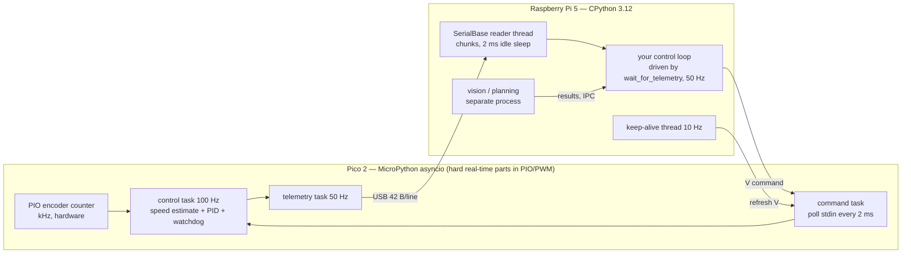

# 03.04 — Loops, timing and concurrency — threads, asyncio, processes

<!-- glance:start -->
<!-- generated by tools/build.py from curriculum/syllabus.yaml — edit the syllabus, not this block -->

| | |
|---|---|
| **Track** | Main path |
| **Difficulty** | Intermediate |
| **Time** | 1 h 15 min |
| **Hardware** | none |
| **Software** | python |
| **Prerequisites** | [03.03 Robust serial communication — framing, timeouts, reconnection](03.03-robust-serial-communication.md) |
| **Optional prerequisites** | [FPY.05 asyncio for people who know async/await in C#](../optional-foundations/python/FPY.05-asyncio-for-csharp-devs.md)<br>[FC.07 Real-time concepts: determinism, latency, jitter and watchdogs](../optional-foundations/cpp-and-embedded/FC.07-real-time-concepts.md) |
| **Skip if** | You can run a fixed-rate loop in Python and measure its jitter. |

<!-- glance:end -->

## What you will learn

- Write a fixed-rate loop that doesn't drift, handles overruns deliberately, and is testable with an injected clock.
- Measure a loop's period, jitter (std, p99, worst case) and lost ticks, and read those numbers correctly.
- Decide where a loop belongs: on the Pico, in a Python thread, in an asyncio task, in a separate process, or in C++.
- Explain what the GIL, the garbage collector and the Linux scheduler do to Python timing, and which mitigations actually help.
- Synchronize a Pi-side loop to the Pico's telemetry instead of racing it with a second clock.

## Why it matters

A robot is a set of loops running at different rates: the Pico's wheel-speed PID at 100 Hz,
telemetry at 50 Hz, the LiDAR at 10 Hz, odometry and obstacle checks on the Pi at 20–50 Hz,
navigation at 5–20 Hz, and later a VLA policy at a few Hz ([18.x](../18-embodied-ai/)).
Control theory assumes each loop runs at *its* rate. A PID tuned for 20 ms that actually runs at
24 ms with ±10 ms jitter is a different controller ([FCT.05](../optional-foundations/control-theory/FCT.05-discrete-time-sampling.md)).
An odometry that divides by a nominal `dt` while the real `dt` varies reports speeds that are 10 %
wrong.

In C# you schedule work on a thread pool and rarely care whether it runs 5 ms late. In robotics
"late" has a physical meaning: the robot moved 5 ms × 0.5 m/s = 2.5 mm further before it
reacted. This lesson gives you the tools to measure that and the judgment to put each loop where
its timing needs can be met. [FPY.05](../optional-foundations/python/FPY.05-asyncio-for-csharp-devs.md)
(asyncio for C# developers) and [FPY.06](../optional-foundations/python/FPY.06-python-performance.md)
(profiling, a first jitter measurement) are the foundations. Here we build on them, not repeat them.

<!-- prereqs:start -->
## Prerequisites

You need these first:

- [03.03 Robust serial communication — framing, timeouts, reconnection](03.03-robust-serial-communication.md)

### Optional prerequisite links

New to any of these? Take the foundation lesson first; skip it if you already know it.

- [FPY.05 asyncio for people who know async/await in C#](../optional-foundations/python/FPY.05-asyncio-for-csharp-devs.md)
- [FC.07 Real-time concepts: determinism, latency, jitter and watchdogs](../optional-foundations/cpp-and-embedded/FC.07-real-time-concepts.md)

Check your readiness: `python course.py why 03.04`
<!-- prereqs:end -->

## Concept

Think of a loop as a **metronome** and your code as a musician who must play one note per tick.
Three things go wrong:

1. **Drift.** If the musician waits "one beat" *after* finishing each note, every note's duration
   adds to the beat. After a minute the tempo is off. The fix is to follow the metronome's grid,
   not your own sense of "one beat since I finished".
2. **Jitter.** Even following the grid, some notes come a little late: the OS woke you late, the
   garbage collector paused you, another thread held the interpreter. Jitter can be *measured*
   and *bounded*, but a normal Linux + Python stack cannot promise a worst case.
3. **Overrun.** Sometimes one note takes longer than a whole beat (a plan, a log flush, a debugger
   breakpoint). Then you choose: burst through the missed beats to "catch up" (dangerous for
   control: several commands in a row computed from the same stale state), or skip them and
   rejoin the grid, and count that you did.

A second picture is for loops that talk to each other: **two metronomes never agree**. The Pico
ticks at 50 Hz on its crystal, the Pi at 50 Hz on its own. Sample the Pico's latest value on the
Pi's timer and you will sometimes read the same sample twice and sometimes miss one, a beat
pattern like two slightly detuned strings. Where possible, let **one clock drive**: the Pi loop
wakes up *because* a new telemetry sample arrived.

> [!TIP]
> **Ask your teacher:** "Show me, with a timeline drawn in ASCII, what a naive `sleep(period)` loop and a grid-based loop do when the loop body takes 3 ms and every sleep wakes 1 ms late."

## Technical explanation

### Level 1 — Intuition: vocabulary with numbers

| Term | Meaning | karmel example |
|---|---|---|
| period $T$ | intended time between iterations | 20 ms (50 Hz telemetry) |
| latency | sensor sample → actuator command | Pico PID: within one 10 ms control step; Pi loop → V command → Pico: up to one telemetry period (20 ms) plus USB and scheduling delays |
| jitter | variation of the actual period around $T$ | std 0.1–1 ms idle Linux, tens of ms on a busy PC |
| overrun | an iteration longer than $T$ | a 60 ms map save inside a 50 Hz loop |
| drift | accumulated error of the average rate | naive loop: 41.7 Hz instead of 50 Hz |
| soft real-time | late results are worse, not catastrophic | Pi loops |
| hard real-time | a missed deadline is a failure | motor PWM, encoder counting, the 300 ms watchdog (on the Pico) |

karmel's architecture is already a timing decision: everything **hard** runs on the Pico (PIO
encoder counting, 20 kHz PWM, the 100 Hz PID, the watchdog), and everything on the Pi is **soft**
with a hardware-side safety net. See [FC.07](../optional-foundations/cpp-and-embedded/FC.07-real-time-concepts.md)
for the theory.

### Level 2 — Practical: clocks and a loop that doesn't drift

**Pick the right clock.**

| Function | Use it for | Never for |
|---|---|---|
| `time.monotonic()` | deadlines, timeouts, loop scheduling (never jumps) | wall-clock timestamps |
| `time.perf_counter()` | measuring short durations with the highest resolution | comparing across processes/machines |
| `time.time()` | log timestamps humans read, correlating with other machines (after chrony, [03.10](03.10-networking-for-robots.md)) | anything with a deadline: NTP can move it backwards |
| `BaseState.t` | the *robot's* clock (Pico `ms` since boot) | comparing with Pi clocks directly |

`SerialBase` uses `time.monotonic()` for every timeout for exactly this reason. An NTP step of
−2 s must not trigger "no telemetry for 2 s".

**The naive loop and the grid loop.**

```python
# naive: drifts. Real period = T + work + oversleep
while running:
    step()
    time.sleep(T)

# grid: deadlines at t0 + k*T. Real period averages exactly T
next_t = time.monotonic() + T
while running:
    step()
    delay = next_t - time.monotonic()
    if delay > 0:
        time.sleep(delay)
        next_t += T
    else:                                   # overrun: skip missed ticks, keep the phase
        missed = int(-delay // T)
        next_t += (missed + 1) * T
```

In Exercise 03.04-E1 you build this as a `FixedRateScheduler(rate_hz, clock, sleep)` with injected
`clock` and `sleep`. That's the same move as `Robot(now_ms)` in the Pico firmware (`labs/firmware/pico/main.py`),
which takes the time as an argument so tests can drive it. A thousand simulated ticks run in
microseconds and give exact answers. For C# developers it's `TimeProvider`/`ISystemClock`, for the same reason.

The Pico firmware's own `periodic()` coroutine is a grid loop too, with one difference worth noticing:
when it falls behind it resets the deadline to *now*. It resynchronizes but loses the phase. For a
PID that uses the measured `dt`, phase doesn't matter. For two loops that should stay aligned (e.g. sampling
exactly between telemetry packets) it does, which is why the exercise keeps the phase.

**Let the robot's clock drive.** `SerialBase.wait_for_telemetry(newer_than=state.t)` blocks until a
sample newer than the one you have arrives:

```python
state = base.read()
while running:
    state = base.wait_for_telemetry(timeout_s=0.2, newer_than=state.t)   # exactly one iteration per sample
    left, right = controller.update(state)
    base.set_wheel_velocity(left, right)
```

No second clock, no duplicates, no aliasing. The Pico's 50 Hz becomes your loop rate, and a
`TelemetryTimeoutError` after 0.2 s is your "the robot is gone" signal. `labs/robot/log_telemetry.py`
and `drive_square.py` are written this way. In simulation, `SimBase.read()` advances time by `dt`
per call (lockstep). That's the same pattern with a deterministic clock.

### Level 3 — Mathematics: what drift, jitter and latency cost

**Naive loop rate.** With period $T$, body time $w$ and average oversleep $\varepsilon$:

$$f_{\text{actual}} = \frac{1}{T + w + \varepsilon}$$

$T = 20$ ms, $w = 3$ ms, $\varepsilon = 1$ ms gives $f = 1/0.024 = 41.7$ Hz: **8.3 lost ticks per
second**, and the controller's integral gain is effectively scaled by $24/20 = 1.2$. Even with
$w = 0$, a 1 ms oversleep over one hour loses $3600/0.021 \times 0.001 \approx 171$ s of ticks.

**Velocity from ticks with the wrong $\Delta t$.** Wheel speed $\omega = \frac{2\pi}{N}\frac{\Delta n}{\Delta t}$
with $N = 2464$ ticks/rev. At 10 rad/s a 20 ms sample holds 78.4 ticks. If the sample actually
spanned 22 ms it holds 86.3 ticks. Divide by the nominal 20 ms and you estimate 11.0 rad/s, **10 %
too high** from 2 ms of jitter. Rule: always divide by the *measured* $\Delta t$, from the same clock
that produced the counts (the Pico's `ms`, not the Pi's arrival time, which adds USB and scheduler jitter).

**Latency as phase lag.** A pure delay $\tau$ shifts a sinusoid of frequency $f$ by

$$\varphi = 360° \cdot f \cdot \tau$$

A robot heading oscillation at 2 Hz with $\tau = 30$ ms of loop + USB latency loses
$360 \times 2 \times 0.03 = 21.6°$ of phase margin. That's often the difference between a crisp and a
ringing controller ([FCT.04](../optional-foundations/control-theory/FCT.04-stability-intuition.md)).
That is why the wheel PID runs on the Pico, 30 ms closer to the motor.

**Statistics that matter.** Report the mean period (drift), the standard deviation (typical
jitter), and the **p99 and maximum** absolute error. A controller survives a small std. It fails on
the tail. A loop with std 0.5 ms and one 80 ms stall per minute will trip a 50 ms watchdog.

### Level 4 — Implementation: threads, asyncio, processes and the GIL

**The GIL in one paragraph.** CPython (3.12 on Ubuntu 24.04, per `curriculum/versions.yaml`) lets
only one thread execute Python bytecode at a time. A thread releases the GIL when it blocks
(`time.sleep`, socket/serial reads, `select`) and when C extensions release it during long
operations (most numpy, OpenCV, PyTorch kernels). A CPU-bound pure-Python thread is asked to
hand over the GIL every `sys.getswitchinterval()` = 5 ms. So your control thread, waking from
`sleep`, may wait up to ~5 ms (more under contention) for the interpreter. C# developers: there is
no `Parallel.For` for Python bytecode. Threads give you concurrency for I/O, not parallelism for CPU.

**Choosing a concurrency model.**

| Model | Good for | Bad for | In this course |
|---|---|---|---|
| **Thread** | blocking I/O next to your loop; small shared state with locks | CPU-heavy Python work (GIL) | `SerialBase` reader + keep-alive threads |
| **asyncio** | many I/O streams in one thread (sockets, websockets, several serial ports); cooperative, no locks | any blocking call: it freezes *every* task | Pico firmware (MicroPython `asyncio`); FPY.05 |
| **Process** | CPU-bound work in parallel (vision, planning, ML inference); fault isolation | sharing large data (copy/IPC cost); startup time | ROS 2 nodes are processes ([04.12](../04-ros2/04.12-executors-and-callbacks.md) covers executors inside one) |
| **C/C++** | bounded latency, high rates, drivers | development speed | `karmel_hardware` ros2_control plugin ([03.09](03.09-where-cpp-is-used.md)) |
| **Microcontroller** | hard real-time, I/O at kHz | anything big | PWM, encoders, PID, watchdog |

Why is `SerialBase` threaded and not asyncio? Its users are ordinary scripts and ROS nodes with
their own loops. A background thread gives them a non-blocking `read()` without forcing their whole
program into an event loop. The reader thread spends its time in `read()`/`sleep(0.002)`, both of
which release the GIL.

**What the measurements say.** `03-robot-software/code/l0304_loop_lab.py` runs the same 50 Hz
loop with a 3 ms body under six conditions. This run was made in a Linux container
(`ros:jazzy-ros-base`, Python 3.12.3) on a 16-core development PC **that was heavily loaded by
other jobs**, which is why even the good rows have tens of milliseconds of tail. Run it on your
idle Pi (Exercise 03.04-E3) for numbers that describe karmel:

```text
linux, Python 3.12.3, 16 CPUs, default scheduler, 50 Hz, body 3 ms, 4 s per scenario
scenario       ticks  lost   mean ms   std ms   p99 err   max err
naive            126    73    31.621    9.732    52.450    60.151
drift_free       195     4    20.433    9.594    40.247    44.552
gil_thread       166    34    24.052   13.434    44.220    45.565
process          199     0    20.000    4.690    15.942    26.329
asyncio          198     1    20.116    5.589    16.996    49.256
asyncio_block    199     0    20.005    5.996    23.411    32.121
```

Read it by columns, not by individual values. **lost** separates the drifting loop (naive: 73
ticks lost in 4 s) from grid loops (0–4). A pure-Python CPU hog in a *thread* costs ticks and
raises the mean period (GIL). The same hog in a *process* costs nothing when there are free cores.
The `asyncio_block` row hides its damage in the max column: one 40 ms blocking call per second
delays whatever task was due. On Windows, `asyncio.sleep` is limited by a coarse event-loop timer,
so the asyncio rows look much worse there. Measure on the OS you deploy on.

**Finding a blocking call in asyncio.** Run with `asyncio.run(main(), debug=True)` (or
`PYTHONASYNCIODEBUG=1`). Every callback slower than 100 ms is logged:

```text
Executing <Task finished name='Task-2' coro=<blocker() done, defined at ...adbg.py:2> result=None ...> took 0.201 seconds
```

Lower the threshold with `loop.slow_callback_duration = 0.01` for control code.

### Level 4b — Python's real-time limits and what actually helps

In order of cost, cheapest first:

1. **Move the hard part down.** Anything that needs < 5 ms latency or > 100 Hz belongs on the Pico
   (or in C++). karmel already does this. It's the single most effective "real-time optimization".
2. **Don't allocate in the loop; tame the GC.** CPython frees most objects by reference counting,
   but the cyclic garbage collector can pause for milliseconds in programs with many objects.
   Call `gc.freeze()` after start-up (moves existing objects out of GC tracking) and keep per-tick
   allocations low. `gc.disable()` during a critical section is possible, but then you own memory growth.
3. **Keep CPU work out of the control process.** Vision, planning and ML inference go to other
   processes (or nodes) and communicate the result. Numpy/OpenCV release the GIL, pure Python doesn't.
4. **Linux scheduling.** `os.sched_setscheduler(0, os.SCHED_FIFO, os.sched_param(50))` makes the
   process preempt normal tasks (needs root or `CAP_SYS_NICE`). `os.sched_setaffinity(0, {3})` pins
   it to a core, ideally one reserved with the `isolcpus=` kernel parameter. The loop lab has `--fifo 50`.
   Test it on the Pi, because in a container on a desktop the effect is small and noisy. `mlockall`
   (through ctypes) prevents page faults on a machine that swaps.
5. **A real-time kernel.** PREEMPT_RT was merged into mainline Linux in 6.12 (2024). Ubuntu 24.04's
   default kernel (6.8) predates that. Canonical's "Real-time Ubuntu" 24.04 (Ubuntu Pro) carries
   the real-time patches on 6.8 and supports the Raspberry Pi. The
   ROS 2 docs have a community guide to building an RT kernel. An RT kernel bounds the OS's
   contribution. It doesn't make the Python interpreter deterministic.
6. **Free-threaded Python.** CPython 3.13 introduced an optional build without the GIL, and PEP 779
   made it officially supported (still optional) in 3.14, with a single-thread slowdown the docs put
   at about 1–8 %. It isn't what Ubuntu 24.04 ships (3.12), and many extension modules aren't ready.
   Watch it, don't depend on it for this robot.

The course's rule of thumb (also in FPY.06): **Python loops on the Pi at ≤ 50 Hz, synchronized to
telemetry, with the Pico watchdog behind them.** If a measured p99 period error is more than ~25 % of the period, first
reduce the load. Then move the loop down a level.

## Diagram

Where karmel's loops run and which clock drives them:



Naive vs grid scheduling with a 3 ms body and 1 ms oversleep (T = 20 ms):

```text
time (ms)      0    20    40    60    80   100   120
grid ticks     |     |     |     |     |     |     |
grid loop      W     .W    .W    .W    .W    .W    .W     each wake ≤1 ms late, never accumulates
naive loop     W      W      W      W      W     W        wakes at 0, 24, 48, 72, 96, 120 …
                      +4     +8     +12    +16   +20      error grows 4 ms per tick → 41.7 Hz

W = loop wakes and starts its body   . = where the grid wanted it
```

## Code

| File | What it does | Run |
|---|---|---|
| [`labs/exercises/03.04/`](../labs/exercises/03.04/README.md) | the scheduler you build (auto-graded) | `python course.py check 03.04` |
| [`03-robot-software/code/l0304_loop_lab.py`](code/l0304_loop_lab.py) | six loop scenarios, one timing table | `python 03-robot-software/code/l0304_loop_lab.py` |
| [`03-robot-software/code/l0304_sync_lab.py`](code/l0304_sync_lab.py) | timer-driven vs telemetry-driven loop against a (fake) Pico | `python 03-robot-software/code/l0304_sync_lab.py --fake` |
| [`labs/firmware/pico/main.py`](../labs/firmware/pico/main.py) | `periodic()` grid loops and the `Robot(now_ms)` clock injection | read it |

The heart of the sync lab. The two loops differ in one line:

```python
def run_timer(base: SerialBase, rate_hz: float, seconds: float) -> list[float]:
    rate = GridRate(rate_hz)
    seen = []
    end = time.monotonic() + seconds
    while time.monotonic() < end:
        seen.append(base.read().t)  # the newest sample, whenever that was
        time.sleep(rate.delay())
    return seen


def run_telemetry(base: SerialBase, seconds: float) -> list[float]:
    state = base.read()
    seen = [state.t]
    end = time.monotonic() + seconds
    while time.monotonic() < end:
        state = base.wait_for_telemetry(timeout_s=1.0, newer_than=state.t)  # blocks until a NEW sample
        seen.append(state.t)
    return seen
```

A run against the in-process fake Pico on the same busy PC:

```text
$ python 03-robot-software/code/l0304_sync_lab.py --fake
timer@50  iterations= 249  duplicates= 41  missed= 63
telemetry iterations= 249  duplicates=  0  missed= 43
```

The timer loop processed the same sample twice 41 times in 5 s. The telemetry-driven loop never did.
Its `missed` count here comes from the source: the fake Pico's own telemetry timing on a loaded PC,
plus its 10 ms simulation step. On the real Pico, expect the telemetry-driven loop's `missed` to stay near 0.

Tests for both scripts (fake clock + synthetic data, ~8 s):
`python -m pytest 03-robot-software/code/test_l0304_timing.py`.

## Exercise

### Exercise 03.04-E1 — A drift-free scheduler with an injectable clock `[coding]`

Implement `FixedRateScheduler` and `summarize_periods` in `labs/exercises/03.04/student.py`.
The tests use a fake clock that oversleeps on purpose, a loop body that takes 3 ms, a 25 ms
overrun and a 1.2 s "debugger pause".
Hardware: none. Check it: `python course.py check 03.04`

### Exercise 03.04-E2 — What does jitter cost? `[numerical]`

Hardware: none. Compute with Python, show every step:

1. A naive loop at 25 Hz has a 6 ms body and wakes 0.5 ms late on average. Actual rate? Ticks lost per minute?
2. karmel's right wheel turns at 8 rad/s. A telemetry interval really lasted 23 ms, but your code
   divides the tick difference by 20 ms. What speed does it report, and what's the error in %?
3. A heading loop oscillates at 1.5 Hz. How much phase lag do 45 ms of end-to-end latency add?

### Exercise 03.04-E3 — Predict, then measure your loops `[predict]`

Hardware: none (your laptop), then the Raspberry Pi if you have it (`robot-base`, nothing moves).

1. Before running, write down for `l0304_loop_lab.py` at 50 Hz: which scenarios will lose ticks?
   Which will have the largest max error? Will `process` be better than `gil_thread`?
2. Run `python 03-robot-software/code/l0304_loop_lab.py --rate 50 --seconds 5` on your laptop and
   on the Pi. On the Pi also run once with `sudo -E python3 … --fifo 50 --only drift_free gil_thread`.
3. Compare with your predictions. Explain each surprise in one sentence.

### Exercise 03.04-E4 — Two clocks vs one `[simulation]`

Hardware: none.

1. `python 03-robot-software/code/l0304_sync_lab.py --fake --mode timer --rate 50`, then with
   `--rate 45` and `--rate 55`. Record duplicates and missed per second.
2. Predict first: at 45 Hz, roughly how many samples per second are missed? At 55 Hz, how many duplicates?
3. Run `--mode telemetry`. Then write down which of karmel's future loops (odometry, obstacle stop,
   logging, teleop) should be telemetry-driven and which timer-driven, with one reason each.

Real-robot variant (`robot-base`, read-only, wheels don't move):
`python 03-robot-software/code/l0304_sync_lab.py --port /dev/karmel`.

### Exercise 03.04-E5 — Find the blocking call `[debugging]`

Hardware: none. Copy `run_asyncio` from `l0304_loop_lab.py` to a scratch file. Replace the
`time.sleep(blocking_s)` with a hidden blocking call of your choice inside a helper function
(e.g. `requests.get` to a slow URL, `open(...).read()` of a large file, a pure-Python loop). Give it to
someone else, or come back tomorrow. Find it using only `asyncio.run(..., debug=True)`,
`loop.slow_callback_duration` and the loop lab's max-error column. Then fix it with
`await asyncio.to_thread(...)` and show that the max error drops.

## Expected result

**03.04-E1:** `python course.py check 03.04` → 13 passed, none skipped. The real-clock smoke test
takes ~0.2 s, everything else microseconds.

**03.04-E2:** (1) period = 40 + 6 + 0.5 = 46.5 ms → 21.51 Hz, 3.49 ticks/s lost → about **210
ticks per minute**. (2) Ticks in 23 ms at 8 rad/s = 8/(2π) × 2464 × 0.023 = 72.2; divided by
0.020 s → **9.2 rad/s**, **+15 %**. (3) 360° × 1.5 × 0.045 = **24.3°**.

**03.04-E3:** On any machine `naive` loses the most ticks: about $50 - 1/(0.020 + 0.003 + \varepsilon)$
per second, ≈ 8 ticks/s on an idle machine. The grid loops lose ≈ 0. `gil_thread` has a longer mean
period and lost ticks. `process` looks like `drift_free` when there is a free core (the Pi 5 has 4).
On an idle Pi 5 the grid loop's std should be well under 1 ms with a max error of a few ms. If
it isn't, something else is using the CPU (check `top`). `--fifo` mostly shrinks the **max** column, not the mean.
Your exact numbers will differ from the table in this lesson, which came from a heavily loaded PC.

**03.04-E4:** Timer at exactly the telemetry rate: both duplicates and misses appear, from phase noise between
the clocks (41 duplicates in 5 s in the lesson's run). At 45 Hz you can't see all 50 samples: ≥ 5
missed per second. At 55 Hz: ≥ 5 duplicates per second. Telemetry mode: **duplicates = 0** always.
Odometry, obstacle stop and logging should be telemetry-driven (every sample exactly once). Teleop key
reading is event-driven, and its commands are refreshed by `SerialBase`'s keep-alive.

**03.04-E5:** Debug mode prints `Executing <Task ...> took 0.2xx seconds` naming the coroutine
that blocked. After `asyncio.to_thread`, the `asyncio_block` max error is back to the level of the `asyncio` row.

## Troubleshooting

### Symptom: the loop runs slower than requested on average

1. Print `sched.skipped` (or the lab's **lost** column). Near 0 → your scheduler drifts: you compute the next
   deadline from `now`. Fix the grid.
2. Many skipped ticks → the body is longer than the period. Time the body alone with `perf_counter`.
   Profile it ([FPY.06](../optional-foundations/python/FPY.06-python-performance.md)), move work out, or lower the rate.
3. Body is short but ticks are lost only sometimes → go to the next symptom.

### Symptom: occasional long periods (big max error, fine std)

Measure what coincides with the spikes. Log `gc.get_count()` / use `gc.callbacks` to timestamp GC
runs. Log when other threads do work. Check `top` for other processes, and the Pi's thermal state
(`vcgencmd measure_temp`, throttling slows everything). Then fix the cause: `gc.freeze()`, move the CPU work to a
process, stop printing to a slow terminal over SSH (`print` can block on a full SSH buffer, so
log to a file), or try `SCHED_FIFO` to test whether it's OS scheduling.

### Symptom: the Pico watchdog trips although the loop "runs at 50 Hz"

The watchdog cares about the *longest* gap between commands, not the average. Log the max period.
If a stall of > 300 ms exists, find it as above. Also check you're not relying on the loop alone:
`SerialBase`'s keep-alive refreshes commands, *unless* you set `command_timeout_s` shorter than your worst stall.

### Symptom: asyncio program freezes for a moment, all tasks at once

A blocking call in some task. Enable asyncio debug mode, lower `slow_callback_duration`, read the
log line that names the task. Common culprits: `time.sleep`, synchronous HTTP, `serial.read` with a
timeout, file I/O on an SD card, CPU-heavy numpy on big arrays.

### Symptom: tests with real `sleep` are flaky in CI

They measure the CI machine, not your code. Inject the clock (Exercise E1) and assert exact
behavior. Keep one loose smoke test on the real clock ([03.08](03.08-testing-robot-software.md)).

## Common mistakes

- **`time.sleep(period)` after the work.** It drifts by body time + oversleep every tick. Schedule on a grid.
- **`time.time()` for deadlines.** NTP/chrony adjustments move it. Use `time.monotonic()`.
- **Catching up after an overrun.** Running three ticks back-to-back sends three commands computed from
  the same stale state. Skip, count, log.
- **Dividing by the nominal `dt`.** Use the measured interval from the clock that produced the data.
- **Threads for CPU-bound Python.** The GIL serializes them and they steal time from your control thread. Use processes.
- **One blocking call inside asyncio.** It stops every task, including the one that feeds the watchdog.
- **Measuring on the dev PC and deploying on the Pi.** Different OS, CPU, load and timer behavior. Measure on the target.
- **Believing `SCHED_FIFO` fixes Python.** It fixes OS scheduling latency. GC pauses and GIL contention remain.

## Knowledge check

1. A loop body takes 4 ms. You want 40 Hz. With `time.sleep(0.025)` after the body, what rate do you get, before any oversleep?
   <details><summary>Answer</summary>

   Period = 25 + 4 = 29 ms → 34.5 Hz, 5.5 ticks per second lost. A grid loop sleeps
   25 − 4 = 21 ms and holds 40 Hz on average.
   </details>

2. Your 50 Hz grid loop falls 70 ms behind because of a log flush. How many ticks should it skip, and why not run them all immediately?
   <details><summary>Answer</summary>

   The deadline was missed by 70 ms: floor(70/20) = 3 further deadlines passed, so run this tick now
   and skip 3. Running the missed ticks back-to-back would compute and send several commands from
   essentially the same sensor data within microseconds. It adds no information and can make
   integrators and rate limiters misbehave. Count the skips, so the overrun is visible.
   </details>

3. Which clock should timestamp telemetry samples used to compute wheel speed: `time.time()` on the Pi at arrival, `time.monotonic()` on the Pi at arrival, or the Pico's `ms` field? Why?
   <details><summary>Answer</summary>

   The Pico's `ms`: it's taken where the ticks were counted, so the tick difference and the time
   difference describe the same interval. Pi arrival times add USB buffering and thread-scheduling
   jitter. `time.time()` can also jump when chrony adjusts the clock. Use the Pi's monotonic clock for
   timeouts and staleness checks.
   </details>

4. Predict: you add a thread that runs a pure-Python A* planner continuously next to your 50 Hz control loop, on a 4-core Pi. What happens to the loop's timing, and what's the fix?
   <details><summary>Answer</summary>

   The planner holds the GIL. The control thread, waking from `sleep`, must wait for the switch
   interval (5 ms) or longer to run. Mean period grows, ticks are lost, and max error jumps, even though 3
   cores are idle. Run the planner in a separate process (multiprocessing, or its own ROS node) and
   send results. The 3 free cores then actually get used.
   </details>

5. An asyncio-based teleop server has a task that sends commands to karmel every 50 ms and another that saves a camera JPEG to the SD card on request. Operators report "the robot stutters when someone takes a picture". Explain and fix.
   <details><summary>Answer</summary>

   Encoding and writing the JPEG synchronously blocks the event loop, so the command task can't
   run until it finishes. If that takes longer than the watchdog margin, the robot even stops.
   Fix: `await asyncio.to_thread(save_jpeg, frame)` (the encode releases the GIL in OpenCV, the
   write blocks in the OS), or a separate process. Confirm with `asyncio.run(..., debug=True)`.
   </details>

6. Why is Python acceptable for karmel's 50 Hz loops on the Pi but not for its encoder counting?
   <details><summary>Answer</summary>

   At full speed each wheel produces ~8,000 encoder edges per second. Each edge must be seen
   within ~100 µs, a hard deadline no Python process on Linux can guarantee (GC, scheduling, GIL).
   The PIO state machine counts in hardware. The Pi loop only needs the *cumulative* count every
   20 ms, and a late sample costs accuracy, not correctness. Plus the Pico watchdog stops the robot if the Pi stalls.
   </details>

7. Your loop's statistics: mean 20.01 ms, std 0.4 ms, p99 error 1.1 ms, max error 180 ms over 10 minutes. Is this loop healthy for a Pi → Pico velocity loop with a 300 ms watchdog and a 100 ms keep-alive? What do you investigate?
   <details><summary>Answer</summary>

   Typical behavior is excellent, but one 180 ms stall exists. It doesn't trip the 300 ms
   watchdog (the keep-alive thread also refreshes commands, unless it was stalled too), but during it
   the robot drove 180 ms on an old command: 9 cm at 0.5 m/s. Correlate the timestamp of the max
   with logs: GC, a log rotation, SD-card writes, CPU throttling, another process. Aim to make the max
   explainable and bounded before trusting obstacle stopping to this loop.
   </details>

## Practical challenge

**A timing-aware control loop runner for karmel.** Build a small `LoopRunner` that runs a
`step(state) -> (left, right)` function on any `DifferentialBase`
([03.05](03.05-hardware-abstraction.md)) and makes timing observable:

- Two modes: telemetry-driven (`wait_for_telemetry`) when the base supports it, grid-driven
  (your E1 scheduler) otherwise (e.g. `SimBase(realtime=True)`).
- Per run: mean/std/p99/max period, skipped ticks, the longest gap between drive commands, and
  the robot-time `dt` handed to `step` (measured, never nominal).
- Safety: if a step raises, or the command gap exceeds a configured limit, call `stop()` and exit with a clear error.

Acceptance criteria:
- Unit tests with a fake clock prove the overrun policy and the command-gap limit, without sleeping.
- It runs a 60 s square drive on `SimBase(realtime=True)` and against `python -m robotlab.fake_pico`
  with a timing report printed at the end.
- On the Pi (wheels off the ground), a 5-minute run reports its p99 and max. You can explain the max.

## You can skip this if…

Answer knowledge-check questions 2, 4 and 7 correctly without looking. Then show a fixed-rate loop
you wrote that is tested with an injected clock and has a measured p99/max period on your target machine.

`python course.py skip 03.04 --reason "I write drift-free loops and measure their jitter"`

## Go deeper

- Python `time` module: https://docs.python.org/3/library/time.html — clock semantics, `monotonic` vs `perf_counter`, `sleep` resolution per OS.
- Python `asyncio` developing guide (debug mode, slow callbacks, blocking code): https://docs.python.org/3/library/asyncio-dev.html
- Python free-threading HOWTO: https://docs.python.org/3/howto/free-threading-python.html — what changes without the GIL, measured overhead.
- PEP 779 — criteria for supported status of free-threaded Python: https://peps.python.org/pep-0779/
- ROS 2 documentation, building a real-time Linux kernel (community guide): https://docs.ros.org/en/jazzy/Tutorials/Miscellaneous/Building-Realtime-rt_preempt-kernel-for-ROS-2.html
- Linux `sched(7)` man page (SCHED_FIFO, priorities, CPU affinity): https://man7.org/linux/man-pages/man7/sched.7.html
- Real-time Ubuntu documentation: https://ubuntu.com/real-time

## Progress checkpoint

- [ ] I can write a drift-free fixed-rate loop and test it with an injected clock.
- [ ] I can measure mean period, std, p99 and max, and say which number matters for which failure.
- [ ] I can place a loop on the Pico, in a thread, in asyncio, in a process or in C++, and justify the choice.
- [ ] I can explain the GIL's effect on a control thread and demonstrate it with a measurement.
- [ ] My Pi-side loops are driven by telemetry, not by a second clock.

`python course.py complete 03.04` (exercises done) · `python course.py master 03.04`
(challenge done) · `python course.py struggle 03.04 "what was hard"`

Next: [03.05 Hardware abstraction](03.05-hardware-abstraction.md), where you make that loop run unchanged on a fake, the simulator and karmel.
