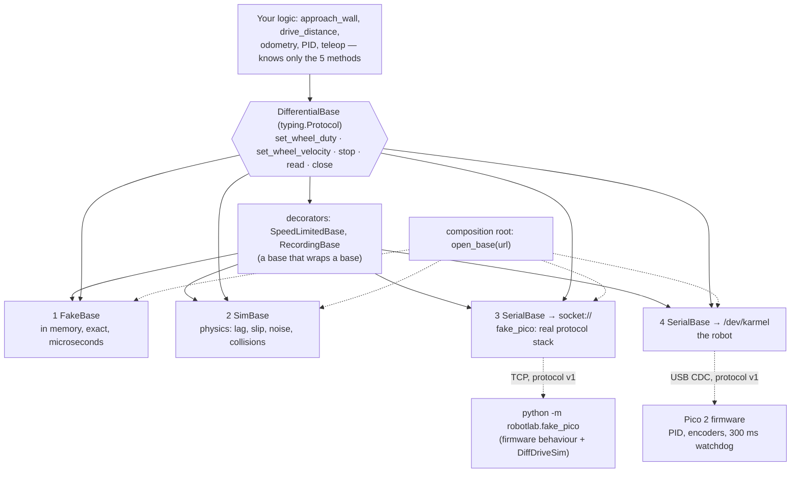

# 03.05 — Hardware abstraction — interfaces, drivers and fakes

<!-- glance:start -->
<!-- glance:end -->

## What you will learn

- Design a hardware interface that is small enough to fake and honest enough to drive a real robot.
- Use `typing.Protocol` for structural typing, and say when an ABC is the better choice instead.
- Write a fake that models *physics* (ticks, watchdog, flags), not canned return values, and a conformance suite that both the fake and the simulator must pass.
- Wire the whole program in one composition root, with no DI framework, and choose the base from a string.
- Name the four levels of fidelity — fake, simulator, fake firmware over a socket, real robot — and which class of bug each one catches.

## Why it matters

Everything you write from here on — odometry ([09.04](../09-odometry/09.04-odometry-from-scratch.md)),
PID ([08.04](../08-control/)), obstacle stopping, a square-driving routine, later a whole ROS 2
node — has to be developed on a laptop with no robot attached, tested in CI with no robot attached,
and then run unchanged on karmel. If the business logic says `serial.write(b"V 12 5000 5000*3A\n")`,
none of that is possible: you can only test it by charging a battery and clearing a space on the floor.

The fix is a single interface, `DifferentialBase`, and four things that implement it. It is the
same move as putting a repository interface in front of SQL — with one robotics-specific twist:
**the fake has to be physically plausible.** A `Mock` that returns a constant tick count will let
you write odometry that divides by zero on the first real run. A fake that integrates wheel angles,
quantizes them to encoder ticks and trips a 300 ms watchdog will not.

This lesson is also where the rest of module 03 becomes usable: configuration
([03.06](03.06-configuration-and-calibration.md)) is what you inject, telemetry
([03.07](03.07-logging-and-telemetry.md)) is what you record through the interface, and testing
([03.08](03.08-testing-robot-software.md)) is the pyramid built on these four implementations.

<!-- prereqs:start -->
<!-- prereqs:end -->

## Concept

Picture the robot as a **contract** rather than as hardware: *"I am a two-wheeled base. You can
tell me how fast to turn each wheel, or brake me. You can ask me what my wheels have done. When
you are finished with me, you close me and I stop."* Five verbs. Everything physical — USB, baud
rates, checksums, sequence numbers, milliradians per second, PWM — lives behind them.

Two properties make that contract useful rather than decorative:

**It is narrow.** `DifferentialBase` has five methods. Every extra method is another thing every
implementation must be able to do, and another reason the fake drifts out of sync with reality. The
LiDAR is *not* in it. Neither is the gyro, the camera, or `wait_for_telemetry`. Those are optional
capabilities that some bases have, asked for separately.

**It is implementable by something with no hardware.** This is the real test of an interface. If
you cannot write a 60-line in-memory implementation that behaves like the robot, your interface is
describing the cable instead of the robot.

And because it is a *contract*, it can be tested as one. The exercise for this lesson gives you a
conformance suite — "increasing time; ticks consistent with the commanded speed; velocity-mode flag;
clamping; watchdog; `stop()`; `close()`" — and runs it against **both** your fake and the course
simulator. If a test only passes on one of them, either the test describes an implementation detail
or one implementation is lying. That is a much stronger design tool than a mock.

> [!TIP]
> **Ask your teacher:** "Show me the same 20-line `drive_forward` routine written (a) against pyserial directly and (b) against `DifferentialBase`, and list every test I can write for (b) that I cannot write for (a)."

## Technical explanation

### Level 1 — The contract, and what is deliberately missing

From [`labs/python/robotlab/hal.py`](../labs/python/robotlab/hal.py):

```python
@dataclass(frozen=True)
class BaseState:
    t: float                  # seconds, the ROBOT's clock
    left_ticks: int           # cumulative signed encoder ticks
    right_ticks: int
    left_rad_s: float         # wheel angular velocity estimate
    right_rad_s: float
    battery_v: float | None
    range_m: float | None     # front distance sensor, None if no reading
    flags: int                # FLAG_WATCHDOG=1 | FLAG_LOW_BATTERY=2 | FLAG_RANGE_ERROR=4 | FLAG_VELOCITY_MODE=8


@runtime_checkable
class DifferentialBase(Protocol):
    def set_wheel_duty(self, left: float, right: float) -> None: ...        # -1..1, open loop
    def set_wheel_velocity(self, left_rad_s: float, right_rad_s: float) -> None: ...
    def stop(self) -> None: ...
    def read(self) -> BaseState: ...
    def close(self) -> None: ...
```

Five design decisions worth stealing:

- **SI units at the boundary.** The wire speaks milliradians per second, per-mille duty, millivolts
  and millimetres, because integers survive a serial link ([01.10](../01-first-robot/01.10-pi-pico-protocol.md)).
  The interface speaks rad/s, volts and metres. The conversion happens in exactly one file.
- **`None` means "no reading", not `0.0` or `-1`.** `range_m = None` when the ToF sensor has nothing
  valid. A sentinel like `-1` will eventually be compared with `< 0.3` and stop the robot for no
  reason; `None` makes you handle it.
- **`t` is the robot's clock.** The Pico's milliseconds since boot, not the Pi's arrival time. Tick
  differences and time differences then describe the same interval
  ([03.04](03.04-timing-and-concurrency.md)).
- **One immutable snapshot, not live properties.** `BaseState` is a frozen dataclass, so
  `state.left_ticks` and `state.t` are guaranteed to come from the same telemetry message. Live
  properties would let you read a tick count from one sample and a timestamp from the next.
- **`flags` is a bitfield the interface does not interpret.** The same four bits mean the same
  thing on the fake, the simulator and the robot, and are checked with `state.flags & FLAG_WATCHDOG`.

What is missing is as deliberate: no LiDAR, no IMU, no pose, no "drive 1 metre". A base commands
wheels and reports wheels. Anything that computes where the robot *is* belongs in odometry
([09.04](../09-odometry/09.04-odometry-from-scratch.md)) — above the interface, testable on all
four implementations.

### Level 2 — Protocol vs ABC, and why the course chose Protocol

`DifferentialBase` is a `typing.Protocol`, so it is **structural**: anything with those five
methods *is* one.

```python
class StuckBase:                      # a robot whose wheels are blocked — 20 lines in a test file
    def set_wheel_duty(self, left, right): ...
    def set_wheel_velocity(self, left_rad_s, right_rad_s): ...
    def stop(self): self.stopped = True
    def read(self): ...
    def close(self): ...

isinstance(StuckBase(), DifferentialBase)   # True. No import of the protocol, no inheritance.
```

| | `typing.Protocol` | `abc.ABC` |
|---|---|---|
| Relationship | structural ("has these methods") | nominal ("declared it inherits") |
| Implementer must import the interface | no | yes |
| Can you retrofit a third-party class? | yes | only via `register()` |
| Shared implementation (template methods) | no (bodies are just defaults) | yes |
| Missing method caught | by the type checker, or `isinstance` at runtime | at instantiation, loudly |
| C# analogue | Go interfaces / duck typing you can type-check | `abstract class` |

The course uses Protocol for three concrete reasons. `SimBase` and `SerialBase` were written
separately and neither had to import the other. Test fakes — including throwaway ten-line ones
inside a single test — become bases for free. And a *decorator* that wraps a base (below) is
automatically a base too, without a base class forwarding thirty methods.

Choose an ABC instead when you have real shared behaviour to inherit (a `RobotArm` base class with
joint-limit checking used by every arm driver), or when you want a loud failure at construction time
rather than a quiet `AttributeError` at 2 m/s. `@runtime_checkable` gives Protocol the `isinstance`
check but only verifies method *names* — not signatures, not behaviour. Which is exactly why the
conformance suite exists.

### Level 3 — The ladder of fidelity, and what each rung catches

Four implementations, cheapest first:

| Rung | What it is | Speed | Catches | Misses |
|---|---|---|---|---|
| **1. `FakeBase`** | ~60 lines in memory; ideal wheels, exact ticks, simulated watchdog | microseconds; deterministic | logic errors, sign errors, unit errors, missing `stop()`, watchdog starvation | anything physical |
| **2. `SimBase`** ([`robotlab.sim`](../labs/python/README.md)) | the 2D simulator behind the same interface: motor lag, deadband, saturation, slip, noise, collisions | ~1 s for a minute of robot time | tuning, overshoot, "it works only with ideal motors", odometry drift, collisions | the serial link, the firmware, real noise |
| **3. `SerialBase` + `python -m robotlab.fake_pico`** | the *real* host stack — framing, checksums, acks, reader thread, keep-alive, reconnect — over TCP to a simulated firmware | real time | protocol bugs, timeouts, reconnection, watchdog interaction, threading races | electrical reality, actual motors |
| **4. `SerialBase` + karmel** | the robot | real time, and a battery | everything else: friction, brownouts, EMI, a wheel that slips on your floor | nothing — it is the truth |

Rung 3 is the one people skip and shouldn't. `pyserial` opens `socket://localhost:5760` with the
same API as `/dev/ttyACM0`, so **nothing in the stack is bypassed** — the fake Pico speaks protocol
v1 over a byte stream, and `SerialBase` cannot tell the difference. That is why
[03.03](03.03-robust-serial-communication.md) could test reconnection by dropping a TCP client.

**A number for rung 1.** The exercise's conformance test commands +5 rad/s on the left wheel for
exactly 1.0 s of robot time and asserts the tick difference:

$$\Delta n = \frac{\omega\,\Delta t}{2\pi}\,N = \frac{5.0 \times 1.0}{2\pi} \times 2464 = 1960.8 \text{ ticks}$$

with $N = 2464$ ticks per wheel revolution from `karmel.yaml`. The fake hits that *exactly* (it
integrates $\omega\,\Delta t$ and rounds once, at `read()`); the simulator lands within 3 %, because
its motors have lag, a deadband and quantization. Same assertion, two tolerances — and the 3 %
tolerance is a statement about physics, not a fudge factor.

**And one for rung 2.** `drive_distance(base, 0.5, wheel_speed_rad_s=6.0, …)` moves the rim at
$6.0 \times 0.045 = 0.27$ m/s, so each 0.02 s cycle covers $5.4$ mm and 0.5 m needs 92.6 cycles.
You cannot stop between cycles, so the best possible overshoot is one cycle: **≤ 5.4 mm**, well
inside the ±2 cm the tests allow. If you ever see 3 cm of overshoot, the cause is not tolerance —
it is that you stopped one cycle late, or forgot to `stop()` at all.

### Level 4 — Optional capabilities, decorators, and the composition root

**Optional capabilities are separate protocols.** Not every base can block until new telemetry
arrives; `SimBase` does not need to, because each `read()` already advances one step. So
[`l0305_hal_demo.py`](code/l0305_hal_demo.py) declares the capability and asks for it:

```python
@runtime_checkable
class TelemetryStream(Protocol):
    """Bases that can block until a NEW sample arrives (SerialBase). SimBase doesn't need it:
    each of its read() calls already advances time by one step."""
    def wait_for_telemetry(self, timeout_s: float = 1.0, newer_than: float | None = None) -> BaseState: ...


def next_state(base: DifferentialBase, previous: BaseState | None) -> BaseState:
    """The next sample, exactly once: wait for new telemetry if the base streams it, else read()."""
    if previous is not None and isinstance(base, TelemetryStream):
        return base.wait_for_telemetry(timeout_s=0.5, newer_than=previous.t)
    return base.read()
```

This is interface segregation, and it keeps the core contract at five methods. The alternative —
putting `wait_for_telemetry` in `DifferentialBase` — would force every fake anyone ever writes to
implement it.

**Decorators add one responsibility and stay a base.** Because the protocol is structural, a class
that forwards the five methods *is* a `DifferentialBase`:

```python
class SpeedLimitedBase:
    """Clamp wheel speeds and duties before they reach the wrapped base (e.g. 'demo mode')."""

    def __init__(self, inner: DifferentialBase, max_rad_s: float, max_duty: float = 1.0) -> None:
        self.inner, self.max_rad_s, self.max_duty = inner, max_rad_s, max_duty

    def set_wheel_velocity(self, left_rad_s: float, right_rad_s: float) -> None:
        clamp = lambda w: max(-self.max_rad_s, min(self.max_rad_s, w))
        self.inner.set_wheel_velocity(clamp(left_rad_s), clamp(right_rad_s))

    # ... set_wheel_duty, stop, read, close forward to self.inner ...

    def __getattr__(self, name):   # pass optional capabilities (wait_for_telemetry, sim, scan) through
        return getattr(self.inner, name)
```

The demo also has `RecordingBase`, a flight recorder that keeps every command and state. Chain them:
`RecordingBase(SpeedLimitedBase(SerialBase("/dev/karmel"), max_rad_s=4.0))` — a safety limit for a
public demo plus a log of what was actually commanded, with no changes to the logic above.

One caveat about `__getattr__`: it makes the wrapper transparent, which is usually what you want,
but it also means `isinstance(wrapper, TelemetryStream)` is `False` even though calling
`wrapper.wait_for_telemetry(...)` works — `isinstance` for protocols looks at the class, not at
`__getattr__`. Know it before it surprises you at 2 m/s.

**The composition root.** There is no DI container. There is one function that knows how to build
every base, driven by a string you can put in a config file or on the command line:

```text
sim://apartment?realistic=1&seed=3     the course simulator (lockstep, instant)
fake://room                            a fake Pico over TCP in this process (real SerialBase stack)
socket://localhost:5760                a fake Pico you started: python -m robotlab.fake_pico
/dev/karmel  (or COM5)                 the real robot
```

```python
with open_base(args.url) as raw:                       # one place decides what "the robot" is
    base = SpeedLimitedBase(raw, args.limit) if args.limit else raw
    result = approach_wall(base, args.stop_at, args.speed)
```

`approach_wall` — real business logic, 15 lines, with a timeout and a `try/finally` that always
stops — never learns which of the four it got. That is the entire payoff of the lesson, and you can
watch it happen:

```text
$ python 03-robot-software/code/l0305_hal_demo.py sim://room
sim://room: target, range 0.535 m after 12.94 s  (sim truth x=3.340 m)
$ python 03-robot-software/code/l0305_hal_demo.py "sim://room?realistic=1&seed=3"
sim://room?realistic=1&seed=3: target, range 0.534 m after 13.00 s  (sim truth x=3.345 m)
$ python 03-robot-software/code/l0305_hal_demo.py fake://room --stop-at 0.5
fake://room: target, range 0.531 m after 12.98 s
```

Same code, three robots, answers that agree to a centimetre.

> [!CAUTION]
> **Safety:** the same script with `/dev/karmel` drives the real robot forward until the front
> sensor reads the stop distance. Before running it: wheels off the ground for the first attempt,
> then a soft obstacle, a low `--speed`, a hand on the battery switch, and `--limit 4` so
> `SpeedLimitedBase` caps the speed no matter what the logic asks for. The firmware's 300 ms
> watchdog and `close()`'s brake are the other two layers ([SAFETY.md](../SAFETY.md)).

## Diagram



Where each rung lives in the repository:

```text
labs/python/robotlab/hal.py          the contract           (rungs: all)
labs/exercises/03.05/student.py      FakeBase               (rung 1) — you write this
labs/python/robotlab/sim/            DiffDriveSim, SimBase  (rung 2)
labs/python/robotlab/fake_pico.py    firmware over TCP      (rung 3)
labs/python/robotlab/serial_base.py  SerialBase             (rungs 3 and 4)
labs/robot/robot_common.py           the scripts' composition root (--port / --fake)
```

## Code

| File | What it shows | Run |
|---|---|---|
| [`labs/python/robotlab/hal.py`](../labs/python/robotlab/hal.py) | the whole contract, 60 lines with docstrings | read it first |
| [`labs/exercises/03.05/`](../labs/exercises/03.05/README.md) | `FakeBase` + `drive_distance`, auto-graded | `python course.py check 03.05` |
| [`03-robot-software/code/l0305_hal_demo.py`](code/l0305_hal_demo.py) | optional-capability protocols, decorators, composition root | `python 03-robot-software/code/l0305_hal_demo.py sim://room` |
| [`labs/robot/robot_common.py`](../labs/robot/robot_common.py) | how every course script chooses its base from `--port` / `--fake` | read `connect()` |
| [`labs/python/robotlab/sim/`](../labs/python/README.md) | `SimBase`, rung 2 | read `SimBase` |

The business logic in the demo — note that the only robot-specific things in it are the five
interface methods and a physical fact (you keep moving while you react):

```python
def approach_wall(base: DifferentialBase, stop_at_m: float, speed_rad_s: float = 4.0,
                  reaction_s: float = 0.2, wheel_radius_m: float = 0.045,
                  timeout_s: float = 20.0) -> ApproachResult:
    """Drive straight until the front range is within stop_at_m (+ the distance covered while reacting)."""
    threshold = stop_at_m + speed_rad_s * wheel_radius_m * reaction_s
    state = next_state(base, None)
    start = state.t
    try:
        while True:
            if state.range_m is None:
                return ApproachResult(None, state.t - start, "no_reading")   # unknown is not free
            if state.range_m <= threshold:
                return ApproachResult(state.range_m, state.t - start, "target")
            if state.t - start > timeout_s:
                return ApproachResult(state.range_m, state.t - start, "timeout")
            base.set_wheel_velocity(speed_rad_s, speed_rad_s)                # every cycle: feeds the watchdog
            state = next_state(base, state)
    finally:
        base.stop()                                                          # SAFETY: every exit path
```

Three habits to copy: re-send the drive command **every** cycle (that is what feeds the firmware
watchdog); treat a missing reading as a reason to stop, not as "far away"; and put `stop()` in a
`finally` so an exception cannot leave the wheels turning.

Tests for the demo (no hardware, ~5 s):
`python -m pytest 03-robot-software/code/test_l0305_hal.py`

## Exercise

### Exercise 03.05-E1 — A fake that passes the conformance suite `[coding]`

Implement `FakeBase` and `drive_distance` in `labs/exercises/03.05/student.py`. The conformance
tests are written against the `DifferentialBase` contract only and run against **both** your fake
and `SimBase`; then `drive_distance` must work unchanged on both and fail safely on a base whose
wheels are blocked.
Hardware: none. Check it: `python course.py check 03.05`

### Exercise 03.05-E2 — Which rung catches which bug? `[predict]`

Hardware: none. For each bug below, predict the **lowest** rung (1 fake, 2 simulator, 3 fake Pico
over a socket, 4 real robot) that fails, and write one sentence on why the rung below it cannot:

1. `drive_distance` never calls `stop()`.
2. The left/right arguments are swapped in the velocity command.
3. Duty is sent as `0.4` where the protocol expects per-mille (`400`).
4. The control loop sends a command only when the distance changes, so gaps exceed 300 ms.
5. The loop divides tick differences by a nominal 20 ms instead of the measured `Δt`.
6. The PID gains overshoot the target speed by 40 % before settling.
7. The reader thread is never started, so `read()` returns the same sample forever.
8. The robot veers left because the right motor is 6 % weaker.
9. The battery sags under acceleration and the Pico browns out.

Then verify at least three of your predictions by actually introducing the bug in a scratch copy.

### Exercise 03.05-E3 — Write a decorator `[coding]`

Hardware: none. Add `WatchdogFeedingBase(inner, period_s)` to a scratch copy of
`l0305_hal_demo.py`: it forwards everything, but remembers the last drive command and re-sends it
from `read()` if more than `period_s` has passed in *robot* time.

1. Show with `RecordingBase` that a loop which commands only once per second still never trips
   `FLAG_WATCHDOG` on `SimBase`.
2. Then explain, in two sentences, why this is a **bad** thing to deploy on the real robot, and
   what `SerialBase`'s keep-alive does differently.

### Exercise 03.05-E4 — One behaviour, four robots `[simulation]`

Hardware: none for 1–3.

1. `python 03-robot-software/code/l0305_hal_demo.py sim://room` — note the stop range and the sim
   truth `x`.
2. `python 03-robot-software/code/l0305_hal_demo.py "sim://room?realistic=1&seed=3"` — and with
   two other seeds. How much does the stopping distance vary?
3. `python 03-robot-software/code/l0305_hal_demo.py fake://room --stop-at 0.5`, then start a fake
   Pico in another terminal (`python -m robotlab.fake_pico`) and connect to it with
   `--port socket://localhost:5760` while it runs. Watch the `--fake` run from step 3 finish in
   ~13 s while the sim run takes under a second — explain the difference.
4. Predict before running: what does `--limit 2` do to the time and to the stopping distance? Run
   it. If the result surprised you, find the line in `approach_wall` that explains it.

> [!CAUTION]
> **Safety (step 5 only):** wheels off the ground for the first run, then a cardboard box as the
> obstacle, `--speed 3 --limit 4`, and your hand on the power switch ([SAFETY.md](../SAFETY.md)).

5. Real-robot variant (`robot-base`): `python 03-robot-software/code/l0305_hal_demo.py /dev/karmel --stop-at 0.5 --speed 3 --limit 4`.
   Compare the measured stopping range with the simulator's. Where does the difference come from?

### Exercise 03.05-E5 — Design an interface for the next sensor `[design]`

Hardware: none. karmel gets a 2D LiDAR in module [07](../07-sensors/07.01-sensor-fundamentals.md).
Write — on paper, not in code — the smallest interface for it:

1. The methods. How many? What does each return, in what units and frame?
2. Should it go into `DifferentialBase`, into a separate `LaserScanner` protocol, or neither? Justify.
3. What does the *fake* return, and what physical property must it preserve for odometry and SLAM
   code to be testable against it?
4. How does the caller learn the scan rate — argument, property, or config
   ([03.06](03.06-configuration-and-calibration.md))?
5. Compare your answer with `SimBase.scan()` and `robotlab.sim.LaserScan`. What did they do
   differently, and who is right?

## Expected result

**03.05-E1:** `python course.py check 03.05` → **29 passed**, nothing skipped, in about a second.
Until then, unimplemented pieces are reported as *skipped — not implemented yet*. The two
fake-specific exactness tests (1 rev/s for 1 s = exactly 2464 ticks; duty 0.5 → 8.5 rad/s) are the
ones that tell you your integration is right; the conformance tests run twice, once per base.

**03.05-E2:** Rung 1 catches 1, 2, 3 and 4 (all pure logic and protocol/unit errors, and the fake
simulates the watchdog) — *if* your fake is physical enough, which is the point of the exercise.
Rung 1 also catches 5 only if the fake's `dt` differs from the nominal one; otherwise rung 2 does.
Rung 2 catches 6 and 8 (they need motor dynamics and per-motor gain). Rung 3 catches 7 (the reader
thread only exists in `SerialBase`) and any real timing interaction with the 300 ms watchdog. Only
rung 4 catches 9. Note the asymmetry: the cheap rungs catch most bugs, which is why you run them
first and often.

**03.05-E3:** Your decorator keeps `FLAG_WATCHDOG` clear with one command per second. It is a bad
thing to deploy because the watchdog exists to stop the robot when *your code* stops thinking — a
layer that feeds it unconditionally from inside `read()` defeats exactly the failure it guards
against. `SerialBase`'s keep-alive differs in two ways: it runs in the host process, so it dies when
your program dies, and `command_timeout_s` lets you say "stop refreshing a command the application
hasn't renewed" — a software dead-man switch on top of the hardware one.

**03.05-E4:** All three of 1–3 stop at 0.52–0.54 m from a 0.50 m target (the extra ~3.5 cm is the
`reaction_s = 0.2` margin at 4 rad/s: $4 \times 0.045 \times 0.2 = 3.6$ cm) after ~13 s of robot
time; the realistic seeds move the range by about a centimetre and leave the decision sound.
Step 3's timing: `sim://` is lockstep (each `read()` advances 0.02 s of simulated time as fast as
the CPU allows), while `fake://` runs the real protocol stack against a fake Pico that advances in
real time, so 13 s of robot time takes 13 s of your life. `--limit 2` is the interesting one: the
run ends `timeout, range 1.07 m after 20.02 s`. Halving the wheel speed more than halves the
progress within the 20 s timeout — and note that `approach_wall` still computed its reaction margin
from the speed it *asked for* (4 rad/s), not from the 2 rad/s the decorator actually allowed. A
wrapper that silently changes behaviour the caller reasons about is a real design cost of
decorators; naming it is the point of this step. On the real robot (step 5) expect a larger and
less repeatable range: the ToF sensor sees a cone, not a point, and the surface matters
([07.03](../07-sensors/)).

**03.05-E5:** A defensible answer: one method, `scan() -> LaserScan`, returning ranges in metres in
the sensor frame with `+inf` for "nothing within range" and `nan` for a dropout (REP-117), plus the
angles. It is a *separate* protocol, because most bases have no LiDAR and every fake would otherwise
have to implement it. The fake must preserve the *geometry* — a scan consistent with a known world
and pose — or nothing downstream can be tested. The rate belongs in config, not in the interface.
`robotlab` matches this, and adds one thing you probably missed: an explicit `valid` mask, so
callers cannot silently average a `nan` into their wall estimate.

## Troubleshooting

### Symptom: `isinstance(my_base, DifferentialBase)` is False

1. Is `DifferentialBase` decorated `@runtime_checkable`? (Ours is; a Protocol without it raises
   `TypeError` on `isinstance`.)
2. Are all five methods present, spelled exactly, and defined on the **class** rather than assigned
   in `__init__`? `isinstance` for protocols inspects the class.
3. Are you checking a wrapper that relies on `__getattr__`? Then the method does not exist on the
   class, and the check fails even though the call works. Forward the five methods explicitly.
4. Remember what this check does *not* prove: signatures and behaviour. Run the conformance suite.

### Symptom: the code works on the fake and drives into the wall on the robot

Work down the ladder to find the first rung that reproduces it.

1. Rung 2 (`SimBase`): does it fail with `DiffDriveParams.realistic()`? Then it was a physics
   assumption — motor lag, deadband, a per-motor gain difference.
2. Rung 3 (`fake://`): does it fail there but not in the simulator? Then it is timing, threading or
   the protocol: check `base.stats`, telemetry age, and whether you send a command every cycle.
3. Neither? Then it is genuinely physical. Log telemetry on the robot
   ([03.07](03.07-logging-and-telemetry.md)) and compare the same plot against the simulator.
4. Whatever the answer: add a test at the rung that reproduced it, so it never comes back.

### Symptom: the wheels keep turning after your script exits

You did not call `stop()` (or `close()`) on every exit path. Use `with`, or `try/finally`, and check
the exception path too. The firmware watchdog will stop the motors 300 ms later regardless — that is
the safety net, not the design. On `SimBase` the watchdog is simulated, so this bug is visible at
rung 1.

### Symptom: `FLAG_WATCHDOG` is set although "the loop runs at 50 Hz"

The watchdog cares about the longest gap, not the average. Something in the loop blocks: a plot, a
log flush, a `print` over a slow SSH link. Log the maximum command gap
([03.04](03.04-timing-and-concurrency.md)), or wrap the base in `RecordingBase` and look at the
timestamps.

### Symptom: the fake and the simulator disagree about ticks

Almost always rounding. Integrate the wheel *angle* as a float and convert to ticks only in
`read()`; converting per step accumulates a rounding error every cycle. At 50 Hz for one minute
that is 3,000 roundings — with karmel's 0.115 mm per tick, easily a centimetre of invented distance.

## Common mistakes

- **A fake that returns canned values.** `read()` returning a constant `BaseState` makes every test
  pass and no bug visible. Integrate the physics you claim to have.
- **Putting everything in one interface.** LiDAR, camera, IMU, arm and battery in `DifferentialBase`
  means every fake must implement all of them. Separate protocols, asked for with `isinstance`.
- **Testing the interface instead of the contract.** A test that calls `base.sim.pose` only runs on
  the simulator. Keep ground-truth assertions in sim-specific tests, and the contract tests clean.
- **Leaking wire units upward.** One `* 1000` in business logic and the abstraction is gone. The
  conversion belongs in the driver.
- **Building a DI container.** Python does not need one. One `open_base(url)` function, called from
  `main()`, is the entire wiring layer.
- **Forgetting that `close()` must stop the motors.** It is the last line of defence when a script
  crashes.
- **Assuming lockstep everywhere.** `SimBase.read()` advances time; `SerialBase.read()` returns the
  newest sample and may return the same one twice. Code that must see every sample uses
  `wait_for_telemetry` ([03.04](03.04-timing-and-concurrency.md)).

## Knowledge check

1. Why is `typing.Protocol` a better fit than an ABC for `DifferentialBase` in this course?
   <details><summary>Answer</summary>

   Structural typing: `SimBase`, `SerialBase`, a student's `FakeBase`, a ten-line `StuckBase` inside
   a test and a decorator that wraps any of them all satisfy it without importing it or inheriting
   from anything. There is no shared implementation to inherit — the five methods have nothing in
   common but their signatures — so the main benefit of an ABC does not apply here.
   </details>

2. `BaseState.range_m` is `None` when the ToF sensor has no valid reading. What would break if it were `-1.0` instead?
   <details><summary>Answer</summary>

   Every comparison. `if state.range_m < 0.3: stop()` would stop the robot permanently the moment
   the sensor sees nothing (a long corridor, a dark surface, an angled wall). `None` forces the
   caller to decide what "unknown" means — and the right decision for a robot is usually to stop,
   which is exactly what `approach_wall` does with its `no_reading` result.
   </details>

3. Predict: you write `drive_distance` so it sends `set_wheel_velocity` once and then only calls `read()` in the loop. What happens on the fake, on `SimBase` and on the real robot?
   <details><summary>Answer</summary>

   All three stop after the watchdog period — 300 ms — because all three implement it: your fake
   simulates it, `SimBase` simulates it, and the Pico enforces it in firmware. The robot travels
   0.27 m/s × 0.3 s ≈ 8 cm and then sits still with `FLAG_WATCHDOG` set while your loop waits
   forever for ticks that never change, until the timeout fires. This is the single most valuable
   behaviour to put in a fake.
   </details>

4. You run the conformance suite against `SimBase` and the tick assertion fails by 2 %. Against `FakeBase` it passes exactly. Is this a bug?
   <details><summary>Answer</summary>

   No — it is the simulator being a simulator. Its motors have a time constant (0.08 s), a duty
   deadband and quantized encoders, so the commanded speed is only reached after a transient. That
   is why the conformance test allows 3 % on ticks and ±0.5 rad/s on speeds while the fake-specific
   tests demand exact values. A tolerance that describes physics is fine; a tolerance that hides a
   sign error is not — which is why the sign and magnitude are still asserted.
   </details>

5. What exactly does rung 3 (`SerialBase` + `fake_pico` over TCP) test that rung 2 (`SimBase`) cannot?
   <details><summary>Answer</summary>

   The entire host communication stack: message encoding, the XOR checksum, sequence numbers,
   acknowledgement matching and retries, the background reader thread and its chunked reads, the
   keep-alive thread, telemetry staleness, and reconnection after a dropped link. `SimBase` is an
   in-process object; none of that code runs. Conversely rung 3 adds real-time behaviour, so tests
   there are slower and must be written with timeouts.
   </details>

6. A teammate adds `def drive_to(self, x, y)` to `DifferentialBase`. Argue for or against, in interface-design terms.
   <details><summary>Answer</summary>

   Against. It is not a *base* capability: it needs a pose estimate, which needs odometry, which is
   built on the base. Putting it in the protocol forces every implementation — including a 60-line
   fake — to implement navigation, and it hides which frame and which estimator are in play. Keep
   the contract at "command wheels, report wheels" and build `drive_to` above it, where it can be
   tested against all four rungs. (This is the same argument as keeping `Save()` out of an entity.)
   </details>

7. Your loop wraps the base as `RecordingBase(SpeedLimitedBase(base, 4.0))` and then calls `wrapper.wait_for_telemetry(...)`. It works. But `isinstance(wrapper, TelemetryStream)` is False, so `next_state()` silently uses `read()` instead. Why, and how do you fix it?
   <details><summary>Answer</summary>

   `isinstance` for a runtime-checkable Protocol inspects the *class* for the attribute;
   `wait_for_telemetry` only exists through `__getattr__` on the instance, so the class check fails.
   The call works because attribute lookup does hit `__getattr__`. Fixes: forward the optional method
   explicitly on the wrapper when the inner base has it, or expose the inner base
   (`wrapper.inner`) and check that, or pass the capability in as a parameter. Silent degradation
   like this is the cost of transparent wrappers — which is why the demo documents it.
   </details>

## Practical challenge

**A reusable `RobotRunner` that works on all four rungs.**

Build a small module that runs any `step(state) -> (left_rad_s, right_rad_s)` function against any
`DifferentialBase`, and makes the abstraction pay for itself:

- `run(base, step, duration_s, rate_hz=None)`. Telemetry-driven when the base is a
  `TelemetryStream`, lockstep otherwise, with the *measured* `Δt` handed to `step`.
- Safety: `stop()` on every exit path; abort with a clear error if `FLAG_WATCHDOG` is ever set, if
  telemetry goes stale, or if `step` raises.
- Observability: a `RecordingBase` inside, so every run returns commands and states, plus the
  command-gap maximum and the flags seen.
- One optional `SpeedLimitedBase` wrapper configured from `karmel.yaml`
  ([03.06](03.06-configuration-and-calibration.md)).

Acceptance criteria:
- A 30-line `step` that drives a 1 m square runs **unchanged** on your `FakeBase`, on `SimBase`
  (ideal and realistic), and on `fake://room`, with a test for each.
- The test on `FakeBase` runs in milliseconds and asserts exact distances; the `SimBase` test
  asserts against `base.sim.pose` with a physical tolerance you justify in a comment.
- Injecting a `StuckBase` (ticks never change) makes the run abort with a clear message and a
  `stop()` call, proved by a test.
- On the real robot, wheels off the ground, a 10 s run produces a recording you can plot
  ([03.07](03.07-logging-and-telemetry.md)).

## You can skip this if…

Answer knowledge-check questions 3, 5 and 6 correctly without looking, and show a robot program of
your own where the business logic has no import of any hardware library, plus a fake that models
the physics well enough that a missing `stop()` fails a test.

`python course.py skip 03.05 --reason "My robot code runs against a fake without changing the logic"`

## Go deeper

- Python `typing.Protocol` documentation: https://docs.python.org/3/library/typing.html#typing.Protocol — structural subtyping, `@runtime_checkable` and its limits.
- PEP 544 — Protocols: structural subtyping: https://peps.python.org/pep-0544/ — the design rationale, including why `isinstance` only checks method presence.
- Python `abc` module: https://docs.python.org/3/library/abc.html — the other half of the choice, for when shared implementation matters.
- ros2_control, writing a new hardware component: https://control.ros.org/jazzy/doc/ros2_control/hardware_interface/doc/writing_new_hardware_component.html — the same idea at ROS 2 scale: `read()`/`write()` behind a plugin interface. karmel's implementation is [`karmel_hardware`](../labs/ros2_ws/src/karmel_hardware/src/karmel_system.cpp) ([03.09](03.09-where-cpp-is-used.md)).
- Martin Fowler, "Mocks Aren't Stubs": https://martinfowler.com/articles/mocksArentStubs.html — the vocabulary (fake, stub, mock, spy) used throughout this module, and why this lesson builds a *fake*.
- [FPY.04 Typing, dataclasses, protocols and packaging](../optional-foundations/python/FPY.04-typing-dataclasses-packaging.md) — the Python mechanics, from zero.
- [`labs/python/README.md`](../labs/python/README.md) — the `robotlab` API, including every `SimBase` knob you can turn to make rung 2 harder.

## Progress checkpoint

- [ ] I can explain why `DifferentialBase` has exactly five methods and what was left out on purpose.
- [ ] I can write a fake that models physics, and a conformance suite that runs on two implementations.
- [ ] I can choose between `Protocol` and `ABC` and defend the choice.
- [ ] I can wire a program from a single composition root and switch robots with a string.
- [ ] I can name which rung of the fidelity ladder catches which class of bug.

`python course.py complete 03.05` (exercises done) · `python course.py master 03.05`
(challenge done) · `python course.py struggle 03.05 "what was hard"`

Next: [03.06 Configuration and calibration data](03.06-configuration-and-calibration.md), where the numbers you have been passing as arguments move into one validated file.
