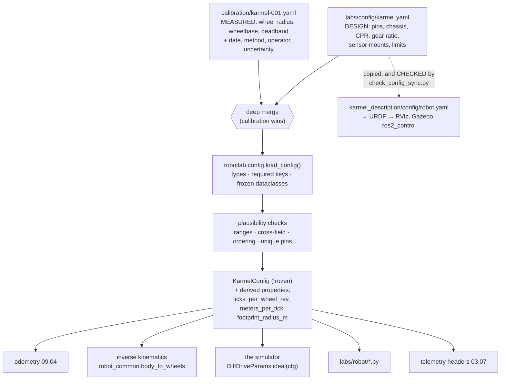

# 03.06 — Configuration and calibration data

<!-- glance:start -->
<!-- glance:end -->

## What you will learn

- Separate the three kinds of numbers in a robot — design choices, measured calibration, and tuning — and store each where it belongs.
- Load configuration into validated, frozen dataclasses, and compute derived values instead of storing them twice.
- Validate *plausibility*, not just types: cross-field consistency, duplicate GPIO pins, ordered battery thresholds.
- Write a calibration file that carries its own provenance — date, method, operator, uncertainty — and merge it over the design config.
- Quantify what a 1 % calibration error costs in centimetres and degrees, and decide which numbers are worth measuring.

## Why it matters

karmel's wheel radius appears in odometry, in the inverse kinematics that turns a velocity command
into wheel speeds, in the simulator, in the URDF, in the ros2_control plugin and in three lab
scripts. Write `0.045` in each of those places and you have six copies of a number that is wrong —
because your wheels are not 45.0 mm, they are 44.6 mm after the rubber compressed under 1.6 kg, and
you will find that out in [09.05](../09-odometry/09.05-calibrating-odometry.md) when the robot
finishes a 10 m straight line 45 cm short.

Worse, the six copies drift apart. Somebody fixes odometry, nobody fixes the URDF, and now the
robot in RViz is a different robot from the one on the floor. Every hour you later spend debugging
"why does the simulation disagree with reality" traces back to this.

So: one file, one loader, validated once, with derived values *computed*. And a second, separate
file for the numbers that came from a tape measure rather than from a decision — because those have
a date, a method and an error bar, and they belong to *your* robot, not to the design.

<!-- prereqs:start -->
<!-- prereqs:end -->

## Concept

A robot's numbers look homogeneous in a YAML file and are not. They have three different
lifecycles, three different owners and three different levels of trust.

| Kind | Example | Changes when | Truth comes from |
|---|---|---|---|
| **Design** | GPIO pin map, chassis dimensions, encoder CPR, gear ratio, sensor mounting position | you rebuild the robot | a decision and a datasheet |
| **Calibration** | wheel radius, effective wheelbase, duty deadband, IMU bias, camera intrinsics | you measure again, or the hardware changes | a measurement, with an uncertainty |
| **Tuning** | PID gains, speed limits, watchdog period, telemetry rate | you tune, or the task changes | an experiment and a judgement |

Confusing calibration with design is the expensive mistake. `wheel_radius_m: 0.045` *looks* like a
design fact — the wheels are sold as 90 mm. It is not: it is a measurement of your robot, on your
floor, at your robot's mass, and it will differ from your friend's identical build by a percent or
two. Storing it as though it were a datasheet value means you will never think to re-measure it.

The other idea in this lesson is **derived values are never stored**. karmel's ticks per wheel
revolution is $11 \times 56 \times 4 = 2464$. You could write `ticks_per_wheel_rev: 2464` in the
file. Don't: now the file contains two truths, and the day someone swaps to the 1:30 gearbox they
will change `gear_ratio` and forget the other line. Store the *independent* facts and compute the
rest as a property — which is exactly what `robotlab.config` does.

> [!TIP]
> **Ask your teacher:** "Go through `labs/config/karmel.yaml` line by line and classify each value as design, calibration or tuning. Where do you disagree with the file as it stands?"

## Technical explanation

### Level 1 — One file, one loader, frozen dataclasses

[`labs/config/karmel.yaml`](../labs/config/karmel.yaml) is the single source. It is read by
[`robotlab.config`](../labs/python/robotlab/config.py), which turns it into nested frozen
dataclasses:

```python
from robotlab.config import load_config

cfg = load_config()                 # path argument > $KARMEL_CONFIG > labs/config/karmel.yaml
cfg.drive.wheel_radius_m            # 0.045
cfg.drive.ticks_per_wheel_rev       # 2464  — a property, computed
cfg.drive.meters_per_tick           # 0.0001147 m — a property, computed
cfg.chassis.footprint_radius_m      # 0.1601 m — a property, computed
cfg.pins["encoder_left_a"]          # 10
cfg.source                          # the Path it actually came from
```

Six properties of that loader are worth copying into your own robot:

1. **Frozen.** `@dataclass(frozen=True)` — nothing can reassign `cfg.drive.wheel_radius_m` at
   runtime. Configuration that changes while the robot drives is a debugging nightmare.
2. **Nested and typed.** `cfg.serial.watchdog_ms` is an `int`, not `cfg["serial"]["watchdog_ms"]`.
   Your editor completes it, and a typo is an `AttributeError` at import time rather than a
   `KeyError` at 0.5 m/s.
3. **Missing keys raise, naming the key.** `ConfigError: missing required config key 'drive.wheel_radius_m'`.
4. **Unknown keys are ignored.** Add `my_experiment: 3` to the file and nothing breaks. This matters
   because several tools read the same file and each cares about a subset.
5. **`source` is recorded.** Every log and every plot can say which file the robot was configured
   from ([03.07](03.07-logging-and-telemetry.md), [03.11](03.11-ci-and-reproducibility.md)).
6. **Resolution order is explicit**: argument → `$KARMEL_CONFIG` → package default. Tests pass a
   path, the robot sets the environment variable, and a bare checkout just works.

The YAML itself carries the units and frames in a header comment, because a number without a unit
is not data:

```yaml
# Units: SI (m, rad, s, V, A). Frames: REP-103 (x forward, y left, z up), origin = base_link
# at the midpoint between the drive wheels…
drive:
  wheel_radius_m: 0.045         # 90 mm Pololu wheels
  encoder_cpr_motor: 11         # Yahboom 520 hall encoder: 11 pulses per motor revolution, one channel
  gear_ratio: 56.0              # 205 RPM version (1:56). The 333 RPM version is 1:30 — set yours
  quadrature_multiplier: 4      # counting both edges of both channels
  # ticks per wheel revolution = 11 * 56 * 4 = 2464
```

Note the suffix convention: `_m`, `_rad_s`, `_v`, `_ms`, `_hz`. It costs four characters and
removes an entire class of bug ([FPY.04](../optional-foundations/python/FPY.04-typing-dataclasses-packaging.md)
shows the heavier version, `NewType`, if you want the type checker to enforce it).

### Level 2 — Validation is more than types

`robotlab.config` guarantees that keys exist and have the right type. It does **not** check that
the numbers make sense, and that gap is where the interesting bugs live. Add a plausibility layer —
[`l0306_config_lab.py`](code/l0306_config_lab.py) is one — and check four categories:

**Ranges.** `0.01 ≤ wheel_radius_m ≤ 0.30`. Catches the classic: typing millimetres into a field
named `_m`.

**Cross-field consistency.** This one finds real bugs:

$$v_{\max}^{\text{wheel}} = \omega_{\max} \, r = 17.0 \times 0.045 = 0.765 \text{ m/s}$$
$$\omega_{\max}^{\text{body}} = \frac{2 v_{\max}^{\text{wheel}}}{b} = \frac{2 \times 0.765}{0.200} = 7.65 \text{ rad/s}$$

karmel's configured limits are `max_linear_speed_m_s: 0.5` and `max_angular_speed_rad_s: 2.5` —
both comfortably below what the wheels can deliver, with 35 % and 67 % of headroom. A configured
limit *above* the physical one is a lie: the controller thinks it has authority it does not have,
saturates, and the robot turns less than commanded while the integrator winds up
([08.06](../08-control/)).

**Ordering.** `cutoff_v < low_warning_v < nominal_v < full_v` — 9.9 < 10.5 < 10.8 < 12.6 for
karmel's 3S Li-ion pack. Get the first two backwards and the low-battery logic warns you *after*
it has cut power ([01.14](../01-first-robot/01.14-battery-monitoring.md)).

**Uniqueness.** Two functions assigned to one GPIO is a wiring bug you want to find on a laptop,
not with a multimeter:

```text
ERROR   pins    GPIO 5 is assigned to 2 functions: i2c_scl, status_led
```

Here is the whole validator run against a deliberately damaged config:

```text
$ python 03-robot-software/code/l0306_config_lab.py --config broken.yaml --quiet
validation:
  ERROR   drive.wheel_radius_m               45.0 m is not a plausible wheel radius (0.01-0.30)
  ERROR   serial.watchdog_ms                 20 ms outside the firmware's accepted 50-5000
  WARNING serial.watchdog_ms                 only 1.0 telemetry periods of margin
  ERROR   pins                               GPIO 5 is assigned to 2 functions: i2c_scl, status_led
exit=1
```

Look closely at what is *missing*. That file also set `max_linear_speed_m_s: 1.2`, which is more
than twice karmel's real capability — and the cross-check did not fire, because with
`wheel_radius_m = 45.0` the "wheel rim speed" came out at 765 m/s. **One wrong unit disabled a
different check.** Validation reports are read in order, and the first error is the one to fix.

### Level 3 — What a calibration error actually costs

Two numbers dominate wheeled odometry. Both are measured, both are roughly 1 % uncertain, and the
errors behave differently.

**Wheel radius → distance.** Odometry converts ticks to metres with `meters_per_tick`
$= 2\pi r / N$. A relative radius error $e_r$ scales every distance:

$$\Delta d = d \cdot e_r$$

**Wheelbase → heading.** In-place rotation gives $\theta = (d_R - d_L)/b$, so a relative wheelbase
error $e_b$ scales every angle:

$$\Delta\theta = \theta \cdot e_b$$

Run the numbers (`--sensitivity`, on karmel's config):

```text
what a calibration error costs (lessons 01.12, 09.05):
  wheel_radius_m off by 0.5 %           5.0 cm after 10 m straight
  wheel_separation_m off by 0.5 %       1.8 deg after 1 full turn(s) in place
  wheel_radius_m off by 1 %            10.0 cm after 10 m straight
  wheel_separation_m off by 1 %         3.6 deg after 1 full turn(s) in place
  wheel_radius_m off by 2 %            20.0 cm after 10 m straight
  wheel_separation_m off by 2 %         7.2 deg after 1 full turn(s) in place
  wheel_radius_m off by 5 %            50.0 cm after 10 m straight
  wheel_separation_m off by 5 %        18.0 deg after 1 full turn(s) in place
```

Now put that in context. The wheels are sold as "90 mm". Measure a built robot and you typically
find 88.5–89.5 mm loaded: **0.5–1.7 % low**. The *mechanical* wheel separation is 200.0 mm by
design, but the effective one — the value that makes rotation come out right, because the contact
patch is a patch and not a point — is commonly 1–3 % larger. So the *default* config, used
uncalibrated, gives you roughly 10 cm of error per 10 m and 5–10° per turn. After a 20 m tour of an
apartment with eight turns, the position estimate is off by a metre and pointing the wrong way.

That is why [01.12](../01-first-robot/01.12-encoder-distance-and-square.md) has you drive a square
and [09.05](../09-odometry/09.05-calibrating-odometry.md) teaches UMBmark, and why the result of
those lessons has to *go somewhere* — which is this lesson's job.

The heading error is the one that hurts more, because it compounds: an angle error rotates all
subsequent motion. 3.6° after one turn is 6 cm of lateral error after the next metre of driving,
and it never comes back on its own. It comes back with a LiDAR and a map
([10](../10-localization/)) — but only if the odometry error is small enough for the filter to
correct rather than diverge.

### Level 4 — Calibration as an overlay, with provenance

Design config lives in `karmel.yaml`. Measurements go in a *separate* file that is merged over it:

```yaml
# 03-robot-software/code/l0306_calibration_example.yaml
calibration:                     # provenance — ignored by robotlab.config's dataclasses
  date: "2026-09-14"
  operator: tal
  robot_serial: karmel-001
  method: >
    wheel_radius_m from 5 x 3.000 m straight runs on the lab floor, tape measure, +/- 3 mm;
    wheel_separation_m from UMBmark (5 CW + 5 CCW 2.0 m squares), lesson 09.05;
    duty_deadband from a duty ramp at 0.005 steps until the wheels first turned, lesson 08.02.
  uncertainty:
    wheel_radius_m: 0.0003       # +/- 0.3 mm -> +/- 0.7 % of distance
    wheel_separation_m: 0.0015   # +/- 1.5 mm -> +/- 0.75 % of heading

drive:
  wheel_radius_m: 0.0446         # measured, not the 45.0 mm nominal from the datasheet
  wheel_separation_m: 0.2032     # UMBmark effective wheelbase, wider than the mechanical 200 mm
  duty_deadband: 0.105
```

```text
$ python 03-robot-software/code/l0306_config_lab.py --overlay 03-robot-software/code/l0306_calibration_example.yaml
…
  drive.meters_per_tick          0.1137 mm = 2*pi*r / ticks_per_rev     ← was 0.1147 mm
…
calibration overlay l0306_calibration_example.yaml
  date         2026-09-14
  operator     tal
  robot_serial karmel-001
  drive.wheel_radius_m               0.045 -> 0.0446  (-0.89 %)
  drive.wheel_separation_m           0.2 -> 0.2032  (+1.60 %)
  drive.duty_deadband                0.12 -> 0.105  (-12.50 %)
```

Three things that pattern buys you:

- **The derived values follow automatically.** `meters_per_tick` moved from 0.1147 mm to 0.1137 mm
  because nobody stored it.
- **You can re-measure without touching design.** Replace the overlay; `git diff` shows exactly
  which measurements changed and by how much. A single merged file would bury that in noise.
- **The numbers carry their own credibility.** `uncertainty.wheel_radius_m: 0.0003` says your
  distance estimate is good to ±0.7 % — which is the number an EKF wants as a process-noise input
  ([10.05](../10-localization/10.05-kalman-filter-multivariate.md)), and the number that tells you
  whether re-measuring is worth an afternoon.

**A provenance block without a method is decoration.** "wheel_radius_m: 0.0446, measured" is not
reproducible. The three-line `method` above is, and in six months it is the only thing that lets
you decide whether to trust the number or re-do it.

**Where the files live and who reads them.** One more wrinkle that bites every ROS robot: an
installed ROS package cannot reach outside its own share directory, so `karmel_description` ships a
*copy* of the config. This repository does not pretend that is fine — it checks:

```bash
python3 labs/ros2_ws/check_config_sync.py          # exit 1 and a diff if the copies drifted
python3 labs/ros2_ws/check_config_sync.py --fix    # copy the source over the package copy
```

and CI runs it. That is the general rule: **if you must duplicate configuration, make the
duplication checkable.** Never rely on people remembering.

**What does not go in the config file:** secrets (Wi-Fi passwords, API keys — those go in an
environment variable or a gitignored file), anything that changes while the robot runs (that is
state, not config), and anything derived. And one thing that is easy to get wrong: the per-motor
gain difference from a weaker right motor is *not* geometry, so it belongs in the controller's
feedforward ([08.09](../08-control/08.09-feedforward-exact-speed.md)), not in `drive:`.

## Diagram



Lifecycles, which is the point of keeping the two files apart:

```text
design      changes when you rebuild       reviewed in a PR, affects every karmel
calibration changes when you re-measure    one robot, one date, one method, one error bar
tuning      changes when you tune          may live in config, in ROS params, or on the Pico (P command)
state       changes 50 times a second      never in a file — this is BaseState
```

## Code

| File | What it shows | Run |
|---|---|---|
| [`labs/config/karmel.yaml`](../labs/config/karmel.yaml) | the single source of physical truth, with units in the header | read it |
| [`labs/python/robotlab/config.py`](../labs/python/robotlab/config.py) | the loader: frozen dataclasses, required keys, derived properties | read it |
| [`03-robot-software/code/l0306_config_lab.py`](code/l0306_config_lab.py) | derived values, plausibility validation, sensitivity, calibration overlay | `python 03-robot-software/code/l0306_config_lab.py --sensitivity` |
| [`03-robot-software/code/l0306_calibration_example.yaml`](code/l0306_calibration_example.yaml) | a calibration overlay with provenance | read it |
| [`labs/ros2_ws/check_config_sync.py`](../labs/ros2_ws/check_config_sync.py) | how to make an unavoidable duplicate checkable | `python labs/ros2_ws/check_config_sync.py` |

The part of the loader worth reading twice — derived values as properties:

```python
@dataclass(frozen=True)
class DriveConfig:
    wheel_radius_m: float
    wheel_separation_m: float
    encoder_cpr_motor: int
    gear_ratio: float
    quadrature_multiplier: int
    ...

    @property
    def ticks_per_wheel_rev(self) -> int:
        """Encoder ticks per wheel revolution = CPR x gear ratio x quadrature multiplier."""
        return round(self.encoder_cpr_motor * self.gear_ratio * self.quadrature_multiplier)

    @property
    def meters_per_tick(self) -> float:
        """Distance the wheel rim travels per encoder tick."""
        return 2.0 * math.pi * self.wheel_radius_m / self.ticks_per_wheel_rev
```

Swap the gearbox to the 1:30 version, change one line in the YAML, and odometry, the simulator, the
inverse kinematics and the tests all move together. Store `ticks_per_wheel_rev` as a fourth field
and they do not.

Tests (no hardware, < 1 s): `python -m pytest 03-robot-software/code/test_l0306_config.py`
and the loader's own suite `python -m pytest labs/python/tests/test_config.py`.

## Exercise

### Exercise 03.06-E1 — Classify every number `[design]`

Hardware: none. Print `labs/config/karmel.yaml` and mark every value **D** (design), **C**
(calibration) or **T** (tuning).

1. Which values did you find hardest to classify, and why?
2. Three of them are arguably in the wrong file as the course ships it. Name them and say where
   they should go.
3. For each **C** value, write down how you would measure it and what your uncertainty would be.

### Exercise 03.06-E2 — What is a percent worth? `[numerical]`

Hardware: none. Compute with Python, show every step.

1. Your robot drives a 2 m × 2 m square (four 2 m legs, four 90° turns) and returns to the start.
   With `wheel_radius_m` 1 % too small and `wheel_separation_m` 2 % too large, where does odometry
   *think* it is when the robot is physically back at the origin? Compute the final $(x, y, \theta)$
   estimate.
2. Which of the two errors dominates the final position error, and does that change if the square
   is 5 m × 5 m?
3. `meters_per_tick` for karmel is 0.1147 mm. How many ticks is 1 mm of error? Is single-tick
   resolution ever your limiting factor at these error levels?
4. From the `uncertainty` block in the example calibration file (±0.3 mm on a 44.6 mm radius),
   what is the 1σ distance error after a 10 m run? Compare it with the error you would have had
   using the uncalibrated 45.0 mm.

### Exercise 03.06-E3 — Make the loader accept a mapping `[coding]`

Hardware: none. `l0306_config_lab.load_with_overlay` merges two YAML documents and then writes the
result to a **temporary file**, because `load_config` only takes a path. Fix that properly:

1. In a scratch copy of `robotlab/config.py` (do not edit the library in place), add
   `load_config_mapping(data: dict, source: Path | None = None) -> KarmelConfig` and make
   `load_config` call it.
2. Rewrite `load_with_overlay` to use it, and show the temporary file is gone.
3. Add one test proving that `source` still reports something useful when the config came from a
   merge of two files.
4. Argue in two sentences why this belongs in the library rather than in the lab script.

### Exercise 03.06-E4 — Break it in four ways `[debugging]`

Hardware: none. Make four broken copies of `karmel.yaml` in a scratch directory, one per mistake,
and for each: **predict the symptom on the real robot first**, then run
`python 03-robot-software/code/l0306_config_lab.py --config broken.yaml`.

1. `wheel_radius_m: 45` (millimetres in a field named `_m`).
2. `wheel_separation_m` and `wheel_width_m` swapped.
3. `low_warning_v: 9.0` (below `cutoff_v`).
4. `status_led` on the same GPIO as `i2c_scl`.

Then answer: which of the four does the *current* validator miss or mis-report, and why? (Re-read
the output in Level 2 before answering — one of them hides another.)

### Exercise 03.06-E5 — Calibrate your robot and record it `[hardware]`

Hardware: `robot-base` (Stage 1 robot). Simulation alternative below.

> [!CAUTION]
> **Safety:** the robot drives 3 m in a straight line and turns in place. Clear the floor, keep
> people and pets out of the path, start with the wheels off the ground to confirm the direction,
> and keep a hand on the power switch ([SAFETY.md](../SAFETY.md)).

1. Measure `wheel_radius_m`: drive five 3.000 m straight runs (`labs/robot/drive_square.py` or
   `01-first-robot/code/duty_calibration.py`), measure the actual distance with a tape, and scale
   the configured radius by actual/reported. Record the spread of your five runs — that is your
   uncertainty.
2. Measure `wheel_separation_m`: five 360° in-place turns; scale by actual/reported heading.
   (The proper method, UMBmark with CW and CCW squares, is [09.05](../09-odometry/09.05-calibrating-odometry.md);
   this is the quick version.)
3. Write `calibration/<your-robot>.yaml` with a full `calibration:` block, and verify with
   `--overlay`.
4. Re-run one 3 m drive with the overlay active and report the remaining error.

**Simulation alternative (no hardware):** use `SimBase` with
`DiffDriveParams.realistic()`, which hides a wheel-radius and wheelbase error from you
(`wheel_radius_scale_*`, `wheel_separation_scale`). Recover them by the same procedure and compare
your estimate with `sim.params` at the end — you get ground truth, which the real robot never
gives you.

## Expected result

**03.06-E1:** Clear **D**: every entry under `pins`, `chassis`, `encoder_cpr_motor`, `gear_ratio`,
`quadrature_multiplier`, the sensor mounting positions, `battery.cells_series`/`chemistry`. Clear
**C**: `wheel_radius_m`, `wheel_separation_m`, `duty_deadband`, `motor_time_constant_s`,
`max_wheel_speed_rad_s` (it says "loaded, at ~11 V" — that is a measurement). Clear **T**:
`max_linear_speed_m_s`, `max_angular_speed_rad_s`, `max_linear_accel_m_s2`, `serial.watchdog_ms`,
`serial.telemetry_hz`. Hardest: `mass_kg` (a measurement of *your* build, but it changes whenever
you add a sensor) and the battery thresholds (chemistry-derived *design*, but `low_warning_v` is
really a tuning choice). Good answers for (2): the three clear **C** values should move into a
calibration overlay; `serial.device` is arguably deployment config rather than robot config.

**03.06-E2:** (1) Each 2 m leg is reported as 1.98 m (−1 %) and each 90° turn is reported as 91.8°
(+2 %), so after four legs and four turns the estimate has both a scale error and a heading error
that rotates each subsequent leg. Computed properly the final estimate is roughly 8–10 cm from the
origin with a heading error of 7.2°; the exact numbers depend on the order you apply them — show
your integration. (2) The wheelbase error dominates the *position* error, because a heading error
is multiplied by the distance driven afterwards; at 5 m legs it dominates far more (the radius
error grows linearly, the heading-induced lateral error grows with distance × angle). (3) 1 mm is
8.7 ticks; at 10 cm of error per 10 m you are 870 ticks off, so tick resolution is nowhere near the
limiting factor — calibration is, by two orders of magnitude. (4) ±0.3 mm on 44.6 mm is ±0.67 %, so
±6.7 cm after 10 m; uncalibrated 45.0 mm against a true 44.6 mm is +0.90 %, i.e. +9.0 cm — and
*biased*, which is worse than random: it never averages out.

**03.06-E3:** `load_config` becomes a thin wrapper that reads a file and calls
`load_config_mapping`; the merge path never touches the filesystem. `source` should report the base
path (or `None` with the provenance recorded separately) — say which you chose and why. It belongs
in the library because every consumer that composes configuration (overlays, ROS parameters, tests
building a config in memory) needs it, and because a temporary file is an I/O failure mode inside
what should be a pure function.

**03.06-E4:** (1) On the robot: every distance is reported 1000× too large, so `drive_distance(1.0)`
stops after one millimetre — the validator catches it. (2) A 10 mm "track width" makes the robot
think it turns 20× faster than it does, so it spins; the validator catches it via
`wheel_separation_m <= wheel_width_m` and the range check. (3) The robot cuts power before it ever
warns; caught by the ordering check — but note the error is reported against `battery.cutoff_v`,
not `low_warning_v`, because the check walks the ordered list. (4) The I²C bus and the LED fight
over GPIO 5, so the ToF sensor reads garbage; caught by the duplicate-pin check. The one that
*hides* another is (1): with a 45 m wheel radius the "configured speed limit exceeds physical
capability" cross-check passes trivially, so a second, real error in `max_linear_speed_m_s` goes
unreported. Fix errors top-down and re-run.

**03.06-E5:** Expect a wheel radius 0.5–2 % below nominal and an effective wheelbase 1–3 % above the
mechanical 200 mm, with a run-to-run spread of a few millimetres over 3 m. After applying the
overlay, a 3 m run should land within about 1 cm (0.3 %). If your five runs disagree by more than
1 %, the problem is not calibration — it is slip, a loose wheel, or a floor with a seam; fix that
first, because calibrating a robot that is not repeatable produces a number that means nothing. In
simulation you should recover the hidden scales to within a few tenths of a percent, and comparing
with `sim.params` is the only time in your life you will see the true answer.

## Troubleshooting

### Symptom: `ConfigError: missing required config key 'drive.wheel_radius_m'`

The loader tells you the exact dotted key. Check, in order: are you editing the file the loader is
actually reading (`print(cfg.source)`, or `echo $KARMEL_CONFIG`)? Is the indentation right — YAML
silently nests a key under the wrong parent if you indent by one extra space? Did you leave a tab
character in (YAML forbids tabs)?

### Symptom: the robot behaves as if your config change never happened

1. `python -c "from robotlab.config import load_config; c = load_config(); print(c.source)"` —
   which file is it really reading?
2. Is `$KARMEL_CONFIG` set in one shell and not another (SSH vs systemd vs your terminal)?
3. Did you change a value that something *copied*? Run `python labs/ros2_ws/check_config_sync.py`.
4. Is the process long-lived? Config is loaded once at startup, by design. Restart it.

### Symptom: simulation and the real robot disagree by a constant factor

A factor is a calibration error, not a bug. Compute the factor: 1.02 on distance is a wheel-radius
error, 1.02 on heading is a wheelbase error, and a factor of exactly 2 or 4 is a quadrature-counting
mistake (`quadrature_multiplier`). A factor near 1000 is a unit. Only after the factor is explained
should you look at the code.

### Symptom: validation passes but the robot is clearly mis-configured

Your plausibility checks are describing the file, not the robot. Add the check that would have
caught it, with a message that says what should have been true — that is how a validator grows.
And re-read the Level 2 note: one wrong unit can silence a different check.

### Symptom: two people's robots behave differently with the same repository

That is the *correct* outcome, if their calibration overlays differ — which is the argument for
keeping calibration out of the shared config. Confirm with
`python 03-robot-software/code/l0306_config_lab.py --diff their-config.yaml`, and check that
`robot_serial` in each overlay matches the robot it is on.

## Common mistakes

- **Storing a derived value.** Two truths, one of which will be stale. Compute it.
- **Calibration merged into the design file.** You lose the date, the method and the ability to
  re-measure without a noisy diff, and every robot's file conflicts with every other's.
- **A calibration number with no method.** Unreproducible, so untrustable, so eventually re-derived
  from scratch by someone who does not know it was already measured.
- **Numbers without units in the name.** `wheel_radius: 45` is a landmine. `wheel_radius_m` is not.
- **Validating types but not plausibility.** The type system is happy with a 45 m wheel.
- **Mutable config.** Something writes `cfg.drive.wheel_radius_m = x` at runtime and the log no
  longer describes the run. Freeze it.
- **Secrets in the config file.** Wi-Fi passwords and API keys in git, forever
  ([FL.11](../optional-foundations/linux-and-tools/FL.11-git-for-robotics.md)).
- **Silent defaults.** `cfg.get("watchdog_ms", 300)` scattered through the code means the file is no
  longer the source of truth. Make missing keys an error.

## Knowledge check

1. Why does `karmel.yaml` store `encoder_cpr_motor`, `gear_ratio` and `quadrature_multiplier` instead of just `ticks_per_wheel_rev: 2464`?
   <details><summary>Answer</summary>

   Because 2464 is *derived* from three independent facts, and storing it creates a second truth
   that can disagree with them. Swap to the 1:30 gearbox and you change one number; the property
   recomputes 11 × 30 × 4 = 1320 and everything downstream — odometry, `meters_per_tick`, the
   simulator, the tests — follows. With the value stored, you would have to remember to change both.
   </details>

2. Your wheel radius is 1 % too small in the config. The robot drives 10 m. What does odometry report, and in which direction is the error?
   <details><summary>Answer</summary>

   `meters_per_tick` is proportional to $r$, so a radius that is 1 % small makes every tick
   worth 1 % less distance: odometry reports **9.9 m** for a true 10 m — it *under*-reports. The
   robot therefore drives *further* than asked when you command a distance. 10 cm per 10 m, and it
   is a bias, so it accumulates instead of averaging out.
   </details>

3. Which is worse for a robot navigating an apartment: a 2 % wheel-radius error or a 2 % wheelbase error? Why?
   <details><summary>Answer</summary>

   The wheelbase error, because it corrupts *heading*, and a heading error rotates every subsequent
   motion. 2 % is 7.2° per full turn; after that, one metre of straight driving adds 12.5 cm of
   lateral error that the distance measurement cannot detect. A radius error is a pure scale on
   distance: 2 cm per metre, and it does not compound into direction. This is why UMBmark
   ([09.05](../09-odometry/09.05-calibrating-odometry.md)) measures both, with CW and CCW squares
   to separate them.
   </details>

4. Predict: you set `max_linear_speed_m_s: 1.2` while the wheels can deliver 0.765 m/s. What happens when the robot is asked for 1.0 m/s?
   <details><summary>Answer</summary>

   The software limit does not clip the request, so the inverse kinematics asks for 22 rad/s per
   wheel; `SerialBase` clamps to `max_wheel_speed_rad_s` (17) and the firmware saturates the PWM.
   The robot goes as fast as it can — 0.765 m/s — while every layer above believes it is doing
   1.0 m/s. Distance-based routines run 30 % long, the PID integrator winds up against a limit it
   cannot reach, and a differential command (drive + turn) loses the turn first, because both wheels
   saturate in the same direction. The cross-field validator exists to catch exactly this.
   </details>

5. A teammate proposes putting the PID gains in `karmel.yaml`. Argue both sides.
   <details><summary>Answer</summary>

   For: they are numbers that describe this robot, they belong under version control, and one file
   is easier to reason about. Against: the gains run on the **Pico**, are settable at runtime with
   the `P` command for tuning, and in ROS they will live as node parameters — so a copy in
   `karmel.yaml` becomes a fourth place the truth might be, with no mechanism to push it to the
   firmware. A reasonable resolution: keep them in the file as the *authoritative startup values*,
   and have the bringup explicitly send them with `set_param` so the copy is enforced rather than
   hoped for — the same "make the duplication checkable" rule as `check_config_sync.py`.
   </details>

6. What does the `uncertainty` block in a calibration file buy you that the measured value alone does not?
   <details><summary>Answer</summary>

   Three things. It tells you when to stop measuring (if the spread is ±0.7 %, a sixth run will not
   help — the floor and the tape are the limit). It feeds state estimation: an EKF needs the odometry
   noise model, and ±0.7 % of distance is literally that input
   ([10.05](../10-localization/10.05-kalman-filter-multivariate.md)). And it lets you judge a
   disagreement: if reality is 3 % off and your calibration claims ±0.7 %, the problem is not
   calibration — something else is wrong.
   </details>

7. `karmel_description` ships a copy of the robot config. Why is that not simply a bug, and what makes it acceptable?
   <details><summary>Answer</summary>

   Once a ROS package is installed, it can only read files inside its own `share` directory — it
   cannot reach `labs/config/karmel.yaml` on the developer's disk, and on the robot the repository
   may not even be present. So the copy is structural, not laziness. It is acceptable because the
   duplication is *checked*: `check_config_sync.py` diffs the two and fails in CI, and `--fix`
   re-copies. Unavoidable duplication is fine; unchecked duplication is not.
   </details>

## Practical challenge

**A calibration workflow you would trust in six months.**

Build, for your own robot (or the realistic simulator if you have no hardware yet):

1. `calibrate.py` — runs the measurement procedure against any `DifferentialBase`
   ([03.05](03.05-hardware-abstraction.md)): N straight runs and N in-place turns, prompting for
   the measured ground truth, computing the corrected `wheel_radius_m` and `wheel_separation_m`
   with their standard deviations.
2. It writes `calibration/<robot_serial>.yaml` with a complete `calibration:` block — date,
   operator, robot serial, the method in prose, per-value uncertainty, and the raw measurements it
   was computed from.
3. `robot_config.py` in your own code loads base + overlay, validates plausibility, and refuses to
   start if a calibration is older than N days or belongs to a different `robot_serial`.
4. A test that runs the whole workflow against `SimBase` with `DiffDriveParams.realistic()` and
   asserts that the recovered scales match `sim.params` to within the uncertainty the tool itself
   reported.

Acceptance criteria:
- Running it twice on the same robot produces values that agree within the reported uncertainty.
- Deliberately calibrating against the *wrong* robot serial is caught at startup with a clear message.
- The simulation test passes deterministically for at least three seeds.
- `git log calibration/` reads like a maintenance history: you can see when each robot was last
  measured and by which method.

## You can skip this if…

Answer knowledge-check questions 1, 3 and 6 correctly without looking, and show a robot repository
of yours where the wheel radius appears exactly once, is validated on load, carries a measurement
date and method, and where every consumer — code, simulation and robot description — provably reads
the same value.

`python course.py skip 03.06 --reason "Robot parameters live in validated config with dated calibration"`

## Go deeper

- REP-103, Standard Units of Measure and Coordinate Conventions: https://www.ros.org/reps/rep-0103.html — the units and frame conventions the config header asserts; two pages, worth reading once properly.
- PyYAML documentation: https://pyyaml.org/wiki/PyYAMLDocumentation — in particular why you always use `safe_load`.
- Python `dataclasses` documentation: https://docs.python.org/3/library/dataclasses.html — `frozen`, `field`, and `dataclasses.replace` for building variants in tests.
- ROS 2, understanding parameters: https://docs.ros.org/en/jazzy/Tutorials/Beginner-CLI-Tools/Understanding-ROS2-Parameters/Understanding-ROS2-Parameters.html — where this configuration reappears in module 04, and how YAML parameter files differ from this one.
- Borenstein & Feng, "Measurement and Correction of Systematic Odometry Errors in Mobile Robots" (the UMBmark paper): https://ieeexplore.ieee.org/document/544770 — the method behind the wheelbase calibration; [09.05](../09-odometry/09.05-calibrating-odometry.md) teaches it without the paywall.
- [FPY.04 Typing, dataclasses, protocols and packaging](../optional-foundations/python/FPY.04-typing-dataclasses-packaging.md) — validation in `__post_init__`, `NewType` for units.
- [01.12 Encoder distance and driving a square](../01-first-robot/01.12-encoder-distance-and-square.md) and [09.05 Calibrating odometry](../09-odometry/09.05-calibrating-odometry.md) — where the numbers in your calibration file come from.

## Progress checkpoint

- [ ] I can classify a robot's numbers as design, calibration or tuning, and store each correctly.
- [ ] My config loads into validated frozen dataclasses, with derived values computed, not stored.
- [ ] I validate plausibility — ranges, cross-field consistency, ordering, duplicate pins — not just types.
- [ ] My calibration file carries date, method, operator and uncertainty.
- [ ] I can say, in centimetres and degrees, what a 1 % error in each calibrated value costs.

`python course.py complete 03.06` (exercises done) · `python course.py master 03.06`
(challenge done) · `python course.py struggle 03.06 "what was hard"`

Next: [03.07 Logging, telemetry and plotting what the robot did](03.07-logging-and-telemetry.md), where the config you just validated is recorded alongside every run.
