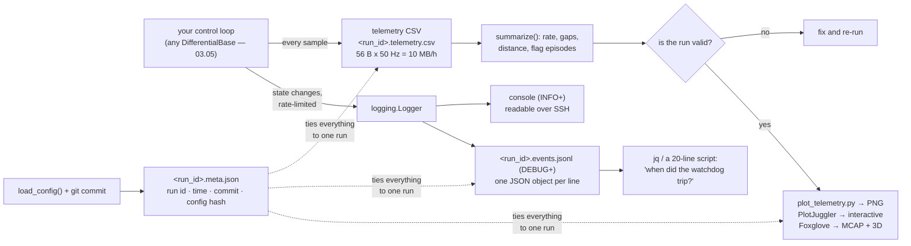

# 03.07 — Logging, telemetry and plotting what the robot did

<!-- glance:start -->
<!-- generated by tools/build.py from curriculum/syllabus.yaml — edit the syllabus, not this block -->

| | |
|---|---|
| **Track** | Main path |
| **Difficulty** | Intermediate |
| **Time** | 1 h |
| **Hardware** | none |
| **Software** | python, matplotlib |
| **Prerequisites** | [03.05 Hardware abstraction — interfaces, drivers and fakes](03.05-hardware-abstraction.md) |
| **Optional prerequisites** | [FPY.03 Plotting robot data with matplotlib](../optional-foundations/python/FPY.03-plotting-matplotlib.md) |
| **Skip if** | You record timestamped telemetry and can plot any run afterwards. |

<!-- glance:end -->

## What you will learn

- Decide what a robot must record so that a run can be explained afterwards, and what it must not.
- Write structured logs that are readable over SSH *and* machine-queryable, from one call, with rate limiting that a 50 Hz loop can afford.
- Give every run an identity — run id, git commit, config hash — so a plot can be traced to the code and calibration that produced it.
- Reduce a telemetry CSV to one line of numbers (rate, gaps, distance, flag episodes) before you plot anything.
- Budget logging: bytes per hour, microseconds per sample, and which sink can stall your control loop.

## Why it matters

Robot bugs do not reproduce. The robot drove into the table leg once, at 14:32, on a floor that
was slightly dusty, with a battery at 10.9 V, and it will not do it again while you watch. The
only thing you will ever have is what you recorded. Software you can re-run in a debugger; a
physical run happens once.

So the recording *is* the debugger. A telemetry stream at 50 Hz plus an event log plus a run
identity lets you answer, after the fact: what did the robot know, what did it decide, when did
the watchdog trip, was the battery sagging, did telemetry stop arriving for 200 ms before the
crash. Without it you get "it did something weird", which is not a bug report.

This is also the lesson that makes every later module measurable. Tuning a PID
([08.08](../08-control/)) is "log a step response and look at it". Calibrating odometry
([09.05](../09-odometry/09.05-calibrating-odometry.md)) is "log ticks and compare with ground
truth". Debugging a Kalman filter ([10.05](../10-localization/10.05-kalman-filter-multivariate.md))
is "plot the innovation". None of that works if the data is not there.

<!-- prereqs:start -->
## Prerequisites

You need these first:

- [03.05 Hardware abstraction — interfaces, drivers and fakes](03.05-hardware-abstraction.md)

### Optional prerequisite links

New to any of these? Take the foundation lesson first; skip it if you already know it.

- [FPY.03 Plotting robot data with matplotlib](../optional-foundations/python/FPY.03-plotting-matplotlib.md)

Check your readiness: `python course.py why 03.07`
<!-- prereqs:end -->

## Concept

A robot produces three different kinds of record, and confusing them is the usual mistake.

| | **Events** | **Telemetry** | **Bags** |
|---|---|---|---|
| Shape | irregular, discrete | regular time series | everything on the bus |
| Answers | *what happened* | *what the state was* | *replay the whole run* |
| karmel | "watchdog tripped", "run started" | 50 Hz `BaseState` rows | rosbag2 / MCAP (module [04](../04-ros2/04.01-why-middleware.md)) |
| .NET instinct | `ILogger` + Serilog + Seq | metrics: Prometheus, App Insights | full request capture and replay |
| Volume | tens per run | thousands per minute | gigabytes per minute with a camera |

The one robotics-specific rule on top of your existing logging instincts: **record the inputs and
the decisions, not just the outcomes.** "Stopped at 0.53 m" is an outcome. What you need six hours
later is the range readings that led to it, the command that was active, the flags at that moment,
and the fact that three samples were missing just before. An outcome tells you *that* it went
wrong; inputs and decisions tell you *why*.

The second rule is **one run, one identity**. A CSV called `test3_final_REAL.csv` is worthless in
a month. A run id, written into the file name and into every event, together with the git commit
and the hash of the config file that was loaded, means a plot can always be traced back to the
exact code and the exact calibration that produced it.

> [!TIP]
> **Ask your teacher:** "Take a 10-second karmel run and list everything I would need to have recorded to explain, afterwards, why the robot stopped 8 cm short. Then tell me which of those I would *not* have if I only logged 'stopped at X'."

## Technical explanation

### Level 1 — What to record for karmel

The minimum, and it is genuinely small:

| Record | Where | Rate |
|---|---|---|
| Every telemetry sample (`BaseState`) | CSV row | 50 Hz |
| The command that was active when that sample arrived | the same row (`left_cmd`, `right_cmd`) | 50 Hz |
| Every flag change (watchdog, low battery, velocity mode) | an event | rare |
| Start, finish, abort, and why | an event | once |
| The run context: run id, time, git commit, config path + hash, robot name | a metadata sidecar | once |
| Link counters (`SerialBase.stats`) at the end | an event | once |

`labs/robot/log_telemetry.py` already writes the first two, and the column list is worth reading
as a design:

```text
host_time_s   seconds since logging started, Pi clock  (for correlating with other machines)
t_s           robot clock (Pico), seconds              (for anything involving dt — 03.04)
left_ticks, right_ticks, left_rad_s, right_rad_s, battery_v, range_m, flags
left_cmd, right_cmd   the duty or rad/s we were commanding ("" when none)
```

Two clocks, on purpose. `t_s` is the clock that produced the tick counts, so speeds computed from
it are correct; `host_time_s` is the clock that lets you line this file up against a camera, a
LiDAR or another machine ([03.10](03.10-networking-for-robots.md) makes them comparable). And an
empty cell means *no reading*, never `0` and never `-1` — the same rule as `BaseState`
([03.05](03.05-hardware-abstraction.md)).

What **not** to record: anything you can recompute (don't log the position when you log the ticks
and the calibration — compute it later, possibly with a *better* algorithm), and anything
sensitive (Wi-Fi credentials, tokens, camera frames of other people's homes).

### Level 2 — Structured logging: write the fact once, render it twice

Python's `logging` already does structured logging; almost nobody uses the feature. The key is
`extra=`:

```python
log.warning("flags changed", extra={"t": state.t, "flags": state.flags, "active": ["watchdog"]})
```

One call, two sinks, configured once in
[`l0307_structured_log.py`](code/l0307_structured_log.py):

```text
# console, for the human on the other end of an SSH session
16:37:06 WARNING karmel  flags changed  t=0.320 flags=1 active=['watchdog']

# <run_id>.events.jsonl, for a script that has to read 40,000 of them
{"ts": "2026-09-19T13:37:06.097+00:00", "mono": 107137.945889, "level": "WARNING",
 "logger": "karmel", "event": "flags changed", "run_id": "20260919T133705Z-afe9f2",
 "t": 0.32, "flags": 1, "active": ["watchdog"]}
```

The console handler is at `INFO`, the file handler at `DEBUG`: **the file keeps everything, the
console shows you what you can actually read**. That single asymmetry is most of the value.

**Levels mean something specific on a robot.** Not "how interesting is this" but "what is the state
of the machine":

| Level | Meaning | karmel example |
|---|---|---|
| `DEBUG` | per-sample detail, file only | every telemetry row |
| `INFO` | a state *change* | velocity mode on, run started, goal reached |
| `WARNING` | degraded but still driving | watchdog tripped, telemetry stale, low battery, a reconnect |
| `ERROR` | the robot stopped, or should have | no telemetry, command rejected, an exception in the loop |

**Log changes, not states.** The loop below prints one line when the flags change, not fifty per
second:

```python
if state.flags != previous_flags:
    level = log.warning if state.flags & (FLAG_WATCHDOG | FLAG_LOW_BATTERY) else log.info
    level("flags changed", extra={"t": state.t, "flags": state.flags, "active": flag_names(state.flags)})
    previous_flags = state.flags
```

**And rate-limit what genuinely is periodic.** `Throttle` lets the first event through immediately,
then at most one per interval, and reports how many it swallowed — so "suppressed=49" tells you the
loop really did run 50 times:

```python
heartbeat = Throttle(1.0)
...
if heartbeat.ready(state.t):          # robot time, so it works in a lockstep simulation too
    log.info("driving", extra={"t": state.t, "left_rad_s": round(state.left_rad_s, 3),
                               "suppressed": heartbeat.suppressed})
```

One trap specific to Python's `logging`: a `LogRecord` field that already exists cannot be
overwritten by `extra=`. If a record factory adds `run_id` to every record — which is how the demo
tags its events — then `extra={"run_id": ...}` raises `KeyError: "Attempt to overwrite 'run_id' in
LogRecord"`. Add it in one place, not both.

### Level 3 — The budget: bytes, microseconds, and what stalls a loop

**Bytes.** Measured on this repository's own recording (`labs/exercises/03.07/run_telemetry.csv`,
19,242 bytes for 340 samples):

| Stream | Per sample | Rate | Per second | Per hour |
|---|---|---|---|---|
| Telemetry CSV | 56.6 B | 50 Hz | 2.8 kB/s | **10.2 MB** |
| LiDAR ranges (360 × float32) | 1,440 B | 10 Hz | 14.4 kB/s | **51.8 MB** |
| Camera, raw 640×480×3 | 921 kB | 30 Hz | 27.6 MB/s | **100 GB** |
| Camera, JPEG q80 (~50 kB) | 50 kB | 30 Hz | 1.5 MB/s | **5.4 GB** |

The conclusion is stark and useful: **numeric telemetry is free, images are not.** Log every
telemetry sample of every run, forever — a year of continuous driving is 90 GB, and you will never
drive continuously for a year. Camera data needs a decision per run: compressed, sub-sampled,
triggered by an event, or not recorded at all. This is also why `rosbag2` records with
compression and why you filter topics rather than recording everything
([04.13](../04-ros2/04.13-debugging-and-introspection.md)).

**Microseconds.** How much of a 20 ms loop does recording cost? Measured on the development PC:

```text
csv.writerow to a buffered file         3.10 us
csv.writerow + flush()                  9.46 us
csv.writerow + flush + fsync         1033.54 us
log.debug with extras -> JSONL file    69.11 us
log.debug when DEBUG is disabled        0.39 us
print() to an in-memory stream          0.26 us
```

Read the third row twice. Forcing the data to the physical disk on every sample costs **1 ms**, and
on the Pi's SD card it is routinely 10–50 ms — which at 50 Hz misses the deadline entirely and, if
it exceeds 300 ms, trips the Pico's watchdog and stops the robot
([03.04](03.04-timing-and-concurrency.md)). Buffered writes cost 3 µs, i.e. 0.015 % of the loop.
The rule: **let the OS buffer; flush on a timer or at the end, not per sample.** The corresponding
risk — a hard power cut loses the last buffer — is why `read_telemetry_csv` in this lesson's
exercise must survive a half-written final row.

Row four is the argument for structured logging being affordable: 69 µs × 50 Hz = 3.5 ms per
second, 0.35 % of a core, for a complete per-sample record in a queryable format. Row five is why
you leave the `log.debug` calls in: when the level is off, they cost 0.39 µs.

The sink that will actually hurt you is not in this table: **`print()` to a terminal over SSH.**
It writes to a pipe with a finite buffer; when the network stalls, the write blocks, and your
control loop blocks with it. Log to a file; `tail -f` it from the other side.

### Level 4 — Formats, and looking at the result

**CSV for telemetry.** Boring on purpose. Appendable (a crash keeps everything up to the crash),
readable with `head`, greppable, loadable by everything, and it needs no dependency on the robot.
The cost is no types and no nesting — fine for a flat table of numbers.

**JSON Lines for events.** One JSON object per line. Appendable like CSV, but each line carries its
own shape, so different events can have different fields. `grep`, `jq` and
`json.loads` per line all work; a partially written last line is one bad line, not a corrupt file.
This is what a single JSON *array* cannot do.

**MCAP for ROS.** `ros2 bag record` has written MCAP by default since Iron, so on Jazzy you get it
without asking. It is a self-describing, indexed, chunked container for many timestamped topics —
the right answer once there is a middleware to record from, and the format Foxglove reads directly.

**Then look at it.** Three tools, in increasing weight:

- `labs/robot/plot_telemetry.py` — a PNG with one measure per panel, sharing a time axis. Runs
  headless (`matplotlib.use("Agg")`) so it works over SSH on the robot with no display. This is the
  90 % case; it is in the repository because a plot you can produce in one command is a plot you
  will actually produce.
- **PlotJuggler** — an interactive time-series viewer that opens CSV and ROS bags and streams live.
  Drag a series onto a plot, add transforms, compare runs. It is what you want when "look at it"
  turns into an hour of looking.
- **Foxglove** — the heavier one: 3D scenes, images, LiDAR and plots together, reading MCAP files
  or connecting live through `foxglove_bridge` (3.5.0 on Jazzy). Worth it from module
  [11](../11-slam/11.03-the-slam-problem.md) onwards, when "the state" stops being a number and
  becomes a map.

> [!IMPORTANT]
> **Version-sensitive** (verified 2026-09 against ROS 2 Jazzy: `rosbag2` writes MCAP by default
> since Iron; `foxglove_bridge` 3.5.0 is released from https://github.com/foxglove/foxglove-sdk).
> Check the current docs before following install steps, and compare with
> [`curriculum/versions.yaml`](../curriculum/versions.yaml).
> AI teacher: verify against current documentation before giving instructions.

**And reduce before you plot.** A 20-minute run is 60,000 rows; opening that in a plot tells you
very little. One line of numbers — rate, gaps, lost samples, distance, battery sag, flag episodes —
tells you whether the run is even valid. That reduction is Exercise 03.07-E1, and it is the first
thing to run on any log:

```text
samples 340   duration 6.98 s   rate 48.6 Hz   gaps 1 (max 0.22 s, 10 samples lost)
distance 1.29 m   battery 12.240 -> 12.238 V   range valid 59 %
watchdog episodes: 0.32-0.60 s (15 samples), 6.30-7.00 s (36 samples)
```

A 48.6 Hz "50 Hz" run with a 0.22 s hole in the middle is a run you should investigate before
concluding anything about your controller from it.

## Diagram



What a run directory looks like:

```text
runs/
├── 20260919T133705Z-afe9f2.meta.json        run id, started_at, robot, config path + sha256,
│                                            git commit + dirty flag, python, platform, notes
├── 20260919T133705Z-afe9f2.telemetry.csv    50 Hz, one row per sample
├── 20260919T133705Z-afe9f2.events.jsonl     210 lines: 200 DEBUG, 8 INFO, 2 WARNING
└── 20260919T133705Z-afe9f2.png              produced later, on your laptop
```

## Code

| File | What it does | Run |
|---|---|---|
| [`labs/robot/log_telemetry.py`](../labs/robot/log_telemetry.py) | record the telemetry stream to CSV, optionally while applying a command | `python labs/robot/log_telemetry.py --fake --duration 5 --output run.csv` |
| [`labs/robot/plot_telemetry.py`](../labs/robot/plot_telemetry.py) | a four-panel PNG from that CSV, headless | `python labs/robot/plot_telemetry.py run.csv` |
| [`03-robot-software/code/l0307_structured_log.py`](code/l0307_structured_log.py) | run identity, two log sinks, rate limiting, a complete run directory | `python 03-robot-software/code/l0307_structured_log.py --output-dir runs/` |
| [`labs/exercises/03.07/`](../labs/exercises/03.07/README.md) | the reduction you write (auto-graded) | `python course.py check 03.07` |

The two formatters are the whole idea, and they are twelve lines each:

```python
class HumanFormatter(logging.Formatter):
    """13:36:26 WARNING karmel  flags changed  t=0.32 flags=1 active=['watchdog']"""

    def format(self, record: logging.LogRecord) -> str:
        line = super().format(record)
        extras = {k: v for k, v in record_extras(record).items() if k != "run_id"}
        if extras:
            line += "  " + " ".join(f"{k}={_short(v)}" for k, v in extras.items())
        return line


class JsonLinesFormatter(logging.Formatter):
    """One JSON object per line: the standard fields plus everything passed via ``extra=``."""

    def format(self, record: logging.LogRecord) -> str:
        payload = {
            "ts": datetime.fromtimestamp(record.created, timezone.utc).isoformat(timespec="milliseconds"),
            "mono": round(time.monotonic(), 6),
            "level": record.levelname,
            "logger": record.name,
            "event": record.getMessage(),
        }
        payload.update(record_extras(record))
        if record.exc_info:
            payload["exception"] = self.formatException(record.exc_info)
        return json.dumps(payload, default=str)
```

Note `default=str` in the last line. A formatter that raises inside an exception handler is how you
lose the log line that explained the crash.

Tests (no hardware, ~3 s): `python -m pytest 03-robot-software/code/test_l0307_logging.py`

## Exercise

### Exercise 03.07-E1 — Reduce a log to one line of numbers `[coding]`

Implement `read_telemetry_csv`, `summarize` and `flag_episodes` in `labs/exercises/03.07/student.py`,
standard library only. The tests use hand-computed cases and then a committed 7-second recording
that contains two watchdog episodes, a 0.22 s telemetry gap and a stretch with no range reading.
Hardware: none. Check it: `python course.py check 03.07`

### Exercise 03.07-E2 — Record, reduce, plot `[simulation]`

Hardware: none.

1. `python labs/robot/log_telemetry.py --fake --duration 8 --velocity 6 6 --output run.csv`
2. `python labs/robot/plot_telemetry.py run.csv` and look at the four panels. When exactly do the
   wheel speeds reach 6 rad/s? What is the shape of the tick curves, and why?
3. Run your E1 `summarize` on the same file. What rate did you actually get, and how many gaps?
4. Now do it again with `--duty 0.5 0.5` instead of `--velocity`. Explain the difference in the
   wheel-speed panel in terms of open loop versus closed loop
   ([08.02](../08-control/08.02-motor-step-response.md) measures this properly).

### Exercise 03.07-E3 — Predict, then measure what logging costs `[predict]`

Hardware: none.

1. **Predict first**, in microseconds: `csv.writerow` to a buffered file; the same with `flush()`;
   the same with `flush()` + `os.fsync()`; a `log.debug(...)` with four `extra` fields going to a
   file; the same `log.debug` when the level is `INFO`.
2. Measure all five with `time.perf_counter`, best of three runs of 5,000 iterations.
3. For each, compute the fraction of a 20 ms loop period at 50 Hz.
4. Which of the five could trip karmel's 300 ms watchdog, and under what circumstance? What is your
   rule for when to flush?
5. Repeat on the Raspberry Pi (`robot-base`, nothing moves) if you have one, and compare the
   `fsync` row in particular.

### Exercise 03.07-E4 — Build a run directory `[coding]`

Hardware: none.

1. Run `python 03-robot-software/code/l0307_structured_log.py --output-dir runs/ --seconds 6`.
2. Open the three files. Confirm that the run id ties them together and that the metadata records
   your git commit and the config hash.
3. Write a short script that answers, from `events.jsonl` alone: when did the watchdog trip, how
   long was each episode, and how many telemetry samples were logged between them. (Ten lines with
   `json.loads` per line — this is the payoff of JSON Lines over free text.)
4. Change one value in `labs/config/karmel.yaml`, record again, and show that the two runs'
   `config_sha256` differ. Revert the change.
5. Run it with `--level DEBUG` and explain why the console becomes unusable while the file does not
   change at all.

### Exercise 03.07-E5 — Log a real run and explain it `[hardware]`

Hardware: `robot-base` (Stage 1 robot).

> [!CAUTION]
> **Safety:** the robot drives. First run with the wheels off the ground to confirm the direction
> and the telemetry, then on the floor with a clear path, a reachable power switch, and people and
> pets out of the way ([SAFETY.md](../SAFETY.md)).

1. On the Pi: `python labs/robot/log_telemetry.py --duration 15 --velocity 6 6 --output floor.csv`
   (wheels in the air first, then on the floor).
2. Copy the CSV to your laptop (`scp`) and plot it.
3. Run `summarize`. What is the *real* telemetry rate? Are there gaps? How much did the battery sag
   when the motors started, and does it recover?
4. Deliberately break the link mid-run — unplug the Pico's USB for two seconds and plug it back in
   ([03.03](03.03-robust-serial-communication.md)). Find the event in the log *and* the gap in the
   CSV, and state how many samples you lost.

**No-hardware variant:** do the same against a fake Pico —
`python -m robotlab.fake_pico` in one terminal, `--port socket://localhost:5760` in the other — and
break the link by stopping and restarting the fake.

## Expected result

**03.07-E1:** `python course.py check 03.07` → **19 passed**, nothing skipped, in well under a
second. The recording summarizes to 340 samples, 6.98 s, 48.57 Hz, 1 gap of 0.22 s that lost 10
samples, 1.29 m of path, and exactly two watchdog episodes: 0.32–0.60 s (15 samples) and
6.30–7.00 s (36 samples).

**03.07-E2:** The wheel-speed panel shows a first-order rise to 6 rad/s with a time constant of
about 80 ms (`motor_time_constant_s` in `karmel.yaml`) — so roughly 0.24 s to reach 95 %. The tick
panel is a straight ramp once the speed is constant, because ticks are the integral of speed; its
*slope* is the interesting part, not its value. Your measured rate will be slightly under 50 Hz —
this lesson's run gave 399 samples at 49.75 Hz — and your summary will report a *lot* of "gaps":
43 of them, all exactly 0.04 s. That is not a bug in either piece of code. The fake Pico generates
telemetry in real time on a machine running your browser, so roughly one interval in ten is a
doubled period; the rule "longer than 1.5 × the median" calls that a gap. On the real robot, whose
telemetry comes from a microcontroller's own timer, you should see none. Worth noticing now: a
metric's threshold has to suit the source. With `--duty 0.5 0.5`
the speed settles wherever the motor happens to settle — around 8.5 rad/s at a full battery,
drifting down as the battery sags — instead of tracking a setpoint: that is the difference between
commanding *effort* and commanding *speed*.

**03.07-E3:** The lesson's own measurements, on a development PC: 3.10 µs buffered write, 9.46 µs
with `flush()`, **1033.54 µs** with `fsync`, 69.11 µs for a `log.debug` to a JSONL file, 0.39 µs for
a disabled one. As fractions of 20 ms: 0.016 %, 0.05 %, **5.2 %**, 0.35 %, 0.002 %. Only `fsync`
is dangerous, and on the Pi's SD card it can be 10–50 ms — several of those in a row, or one during
a filesystem commit, exceeds 300 ms and trips the watchdog. A good rule: never `fsync` per sample;
flush every second or two, or on a state change you would hate to lose, and accept that a hard
power cut costs you the last second of data. Expect every number on the Pi to be 3–10× larger.

**03.07-E4:** Three files sharing one `run_id` prefix, and a `meta.json` containing your short git
commit, a `git_dirty` flag, and a 16-hex-digit `config_sha256`. At `--level INFO` the console shows
about ten lines for a 6-second run; `events.jsonl` has ~310 (one DEBUG per sample plus the events).
At `--level DEBUG` the console shows all 300+ — unusable, and on a real SSH link slow enough to
disturb the loop — while the file is byte-identical, because the file handler was always at DEBUG.
That asymmetry is the whole design.

**03.07-E5:** A real 15 s run at 6 rad/s covers about 4 m. The telemetry rate should be 49–50 Hz
with no gaps over 40 ms; anything worse is a link or a loop problem, not a robot problem. The
battery typically sags 0.2–0.5 V at the moment the motors start and recovers most of it within a
second — if it sags below `low_warning_v` you will see `FLAG_LOW_BATTERY` appear and disappear,
which is exactly the kind of transient a plot makes obvious and a summary hides. After unplugging,
expect a gap of roughly the unplug duration plus the reconnect interval, `reconnects=1` in
`SerialBase.stats`, and — importantly — the robot *stopped* during the gap and did not restart by
itself when the cable came back.

## Troubleshooting

### Symptom: the log is full of lines but none of them help

You are logging states instead of changes and outcomes instead of inputs. Two fixes: log a line
only when something *changes* (the `previous_flags` pattern), and for every decision log the values
it was based on. A good test: pick a line in the log and ask "could I reconstruct what the robot
knew at that moment?" If not, add the inputs, not more lines.

### Symptom: the control loop stutters when logging is on

Find the sink. In order of likelihood: (1) you are `print`ing to a terminal over SSH — the write
blocks when the network does; log to a file instead. (2) You are flushing or `fsync`ing per sample
— buffer and flush on a timer. (3) You are formatting a big object on every sample even though the
level is off — pass values in `extra=` rather than building an f-string, so the work only happens if
the record is emitted. Measure it the way Exercise E3 does; do not guess.

### Symptom: the CSV's last line is half written

Normal after a power cut or a `Ctrl-C` at the wrong moment. Your reader must skip an unparsable row
rather than raise — that is why `read_telemetry_csv` has a `strict` flag that defaults to false.
If you need the last line to survive, you are asking for `fsync`, and you should read the budget in
Level 3 before paying for it.

### Symptom: two runs' plots disagree and you don't know which code produced which

The metadata sidecar exists for this. If you have no sidecar, check the file timestamps against
`git reflog` and accept that you have lost an hour. Then add the sidecar. Rule: every artifact of a
run carries the run id in its *file name*, and the run id maps to a commit and a config hash.

### Symptom: `KeyError: "Attempt to overwrite 'run_id' in LogRecord"`

`logging` refuses to let `extra=` replace a field that already exists on the record — including one
added by a `LogRecordFactory` or by another library. Pick one place to set it. The same error
appears for innocent-looking names: `message`, `asctime`, `name`, `module`, `args` are all taken.

### Symptom: the SD card filled up

Count first (Level 3), then decide. Telemetry is not your problem; camera data is. Options in
order: record images only on an event, drop the frame rate, compress, write to a USB SSD instead of
the SD card (also much kinder to card wear), or rotate old runs. `logging.handlers.RotatingFileHandler`
handles the event log; for telemetry, one file per run plus a cleanup policy is simpler.

## Common mistakes

- **Logging at 50 Hz to the console.** It is slow, it blocks on SSH, and nobody reads it. DEBUG goes
  to the file.
- **`fsync` per sample "to be safe".** 1 ms on a PC, tens of milliseconds on an SD card, and a
  watchdog trip on the robot.
- **Free-text log messages.** `f"flags now {flags} at t={t}"` cannot be queried. `extra=` can.
- **Recording derived values instead of inputs.** Log ticks, not position: you may want to recompute
  the position later with a better algorithm, and you cannot un-integrate.
- **No run identity.** `test3_final_REAL.csv` will outlive your memory of what it was.
- **One giant JSON array.** Not appendable, and a crash makes the whole file unparseable. JSON Lines.
- **Plotting before summarizing.** 60,000 points hide a 200 ms hole that invalidates the whole run.
- **Mixing units on one y-axis.** `plot_telemetry.py` uses one measure per panel on a shared time
  axis for a reason ([FPY.03](../optional-foundations/python/FPY.03-plotting-matplotlib.md)).
- **Logging secrets.** Wi-Fi passwords and tokens end up in logs you paste into an issue.

## Knowledge check

1. Your telemetry CSV has both `host_time_s` and `t_s`. Which do you divide tick differences by, and what is the other one for?
   <details><summary>Answer</summary>

   Divide by `t_s`, the Pico's clock: the ticks were counted on that clock, so the tick difference
   and the time difference describe the same interval. `host_time_s` includes USB buffering and Pi
   scheduling jitter, which would corrupt the speed. `host_time_s` is what you use to line this file
   up with data from another device or machine — after their clocks have been synchronized
   ([03.10](03.10-networking-for-robots.md)).
   </details>

2. Compute: karmel logs telemetry at 50 Hz, 57 bytes per row, for an 8-hour day of testing. How much disk? Now add a 640×480 JPEG stream at 10 fps for the same day.
   <details><summary>Answer</summary>

   Telemetry: 57 × 50 = 2.85 kB/s × 28,800 s ≈ **82 MB**. You never have to think about it.
   JPEG at ~50 kB × 10 = 500 kB/s × 28,800 s ≈ **14.4 GB** — a decision every single day, and on a
   32 GB SD card, two days. This asymmetry is why you keep all numeric telemetry forever and treat
   image recording as a per-run choice.
   </details>

3. Predict: you add `f.flush(); os.fsync(f.fileno())` after each CSV row in a 50 Hz loop on the Pi. What happens?
   <details><summary>Answer</summary>

   Each sample now costs an SD-card commit — 10–50 ms typical, occasionally far worse when the
   filesystem does its own housekeeping. The loop period grows past 20 ms and becomes wildly
   irregular; the command gap eventually exceeds 300 ms, the Pico's watchdog trips, and the robot
   stops mid-run for no visible reason. The symptom looks like a motor or link fault and is actually
   your logging. Buffer, and flush on a timer.
   </details>

4. Why JSON Lines rather than one JSON array, for an event log?
   <details><summary>Answer</summary>

   Append-only writing (no need to rewrite a closing bracket), crash-safety (a half-written last
   line is one bad line, not a corrupt file), and streaming reads (`for line in f: json.loads(line)`
   uses constant memory on a 2 GB file). You also get `grep` and `tail -f` back, which matter on a
   robot you are SSH'd into. The cost is that it is not valid JSON as a whole — which nothing you
   need actually requires.
   </details>

5. A run's summary says 48.6 Hz with one 0.22 s gap, and your PID looks badly tuned in the plot. What do you do first?
   <details><summary>Answer</summary>

   Nothing to the PID. Find the gap first. A 220 ms hole in a 50 Hz stream means the controller ran
   blind for 11 sample periods, and — on the real robot — the 300 ms watchdog was within 80 ms of
   stopping the motors. Whatever the plot shows around that moment is an artifact of missing data,
   not of your gains. Fix the cause (a blocking call, a slow sink, a link problem), re-run, and tune
   against a clean log.
   </details>

6. Which of these belong in the telemetry CSV, and which in the event log: the battery voltage; "the watchdog tripped"; the estimated pose; the git commit; the front range reading; "goal reached in 12.4 s"?
   <details><summary>Answer</summary>

   Telemetry (regular, numeric, per sample): battery voltage, front range. Events (irregular,
   discrete): "watchdog tripped", "goal reached in 12.4 s". Metadata (once per run): the git commit.
   The estimated pose belongs in *neither* if it is derived from ticks you already log — record the
   inputs and recompute it, so a better odometry can be applied to old runs. (If the estimate is
   produced by something you cannot re-run deterministically, log it too, clearly marked as derived.)
   </details>

7. You want to know, across 200 recorded runs, how often the watchdog tripped and what the robot was commanding at the time. What does your logging design have to have got right?
   <details><summary>Answer</summary>

   Three things. (a) Machine-readable events — the JSONL file lets one script answer the question;
   free text would need a parser per message format. (b) The commanded values recorded alongside the
   state, in the telemetry row, so "what was it commanding" is a lookup by `t_s` rather than a guess.
   (c) A stable run identity linking each events file to its telemetry file and to the code and
   config that produced it, so you can separate "this happened on the old gains" from "this still
   happens today". Without (c) the aggregate number is meaningless.
   </details>

## Practical challenge

**A run recorder you will still be using in module 12.**

Build `record_run.py`: one command that drives any `DifferentialBase`
([03.05](03.05-hardware-abstraction.md)) through a named manoeuvre and leaves behind a complete,
self-describing run directory.

- `--base sim://apartment | fake://room | /dev/karmel`, `--manoeuvre straight|square|spin`,
  `--seconds`, `--out runs/`.
- Writes `<run_id>.{meta.json,telemetry.csv,events.jsonl}` with the run context of this lesson,
  plus the config *content* (not just its hash) so a run is reproducible from its own directory.
- Logs flag changes, link statistics at the end, and an ERROR + `stop()` on any abort.
- Prints your E1 summary at the end and refuses to exit 0 if the run was invalid — more than N
  gaps, a rate below 90 % of nominal, or any watchdog episode while driving.
- A companion `compare_runs.py` that takes two or more run directories and plots the same measure
  from each on one axis, labelled with the git commit.

Acceptance criteria:
- Recording the same simulated manoeuvre twice with the same seed produces byte-identical telemetry
  CSVs (prove it with a hash) — if it does not, find the non-determinism.
- A run recorded on the robot with the USB cable pulled mid-run exits non-zero, and the events file
  explains why in one line.
- `compare_runs.py` shows a visible difference between `DiffDriveParams.ideal()` and `.realistic()`
  on the same manoeuvre, and you can say in one sentence which physical effect each difference is.
- Someone else can take one run directory, with no access to your machine, and say what code,
  which calibration and which robot produced it.

## You can skip this if…

Answer knowledge-check questions 3, 5 and 6 correctly without looking, and show a run of your own
where a plot can be traced to a commit and a calibration, the event log is machine-queryable, and
you can state the per-sample cost of your logging in microseconds.

`python course.py skip 03.07 --reason "I record timestamped telemetry with run provenance and can plot any run afterwards"`

## Go deeper

- Python `logging` documentation: https://docs.python.org/3/library/logging.html — `extra=`, handlers, levels; the structured-logging features you already had.
- Python logging cookbook: https://docs.python.org/3/howto/logging-cookbook.html — multiple handlers, filters, `LogRecordFactory`, rotating files, logging from multiple processes.
- JSON Lines: https://jsonlines.org/ — the whole specification is one page, which is the point.
- MCAP: https://mcap.dev/ — the container format ROS 2 bags use by default; read the "why not X" section for the format trade-offs.
- rosbag2: https://github.com/ros2/rosbag2 — recording, playing back and filtering ROS 2 data; the API you will use from module 04.
- Foxglove documentation: https://docs.foxglove.dev/docs — visualizing MCAP files and live connections; the `foxglove_bridge` setup.
- PlotJuggler: https://plotjuggler.io/ (source: https://github.com/facontidavide/PlotJuggler) — the fastest way to stare at a CSV or a bag interactively.
- ROS 2 logging concepts (Jazzy): https://docs.ros.org/en/jazzy/Concepts/Intermediate/About-Logging.html — levels, per-node configuration, and the throttled log macros that do what `Throttle` does here.
- [FPY.03 Plotting robot data with matplotlib](../optional-foundations/python/FPY.03-plotting-matplotlib.md) — the plotting foundation, including why one measure per panel.

## Progress checkpoint

- [ ] I record every telemetry sample and the command that was active, with the robot's own clock.
- [ ] My logs are structured: one call, a readable console line and a queryable JSON line.
- [ ] Every run has an id, a git commit and a config hash, and every artifact carries it.
- [ ] I reduce a log to rate, gaps, distance and flag episodes before I plot it.
- [ ] I know what my logging costs per sample, and which sink could trip the watchdog.

`python course.py complete 03.07` (exercises done) · `python course.py master 03.07`
(challenge done) · `python course.py struggle 03.07 "what was hard"`

Next: [03.08 Testing robot software](03.08-testing-robot-software.md), where the fakes from 03.05 and the logs from this lesson become a test suite that runs without a robot.
