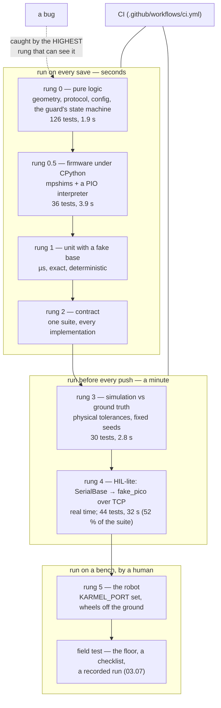

# 03.08 — Testing robot software — unit, simulation and hardware-in-the-loop

<!-- glance:start -->
<!-- generated by tools/build.py from curriculum/syllabus.yaml — edit the syllabus, not this block -->

| | |
|---|---|
| **Track** | Main path |
| **Difficulty** | Intermediate |
| **Time** | 1 h |
| **Hardware** | none |
| **Software** | python, pytest |
| **Prerequisites** | [03.05 Hardware abstraction — interfaces, drivers and fakes](03.05-hardware-abstraction.md) |
| **Skip if** | Your robot repo has automated tests that run without hardware. |

<!-- glance:end -->

## What you will learn

- Split robot code into pure decision logic and a thin I/O shell, which is what makes the rest of this lesson possible.
- Place a test at the right rung: pure logic, fake, contract, simulation, fake firmware over a socket, real hardware.
- Choose tolerances that describe physics, and make simulation tests deterministic instead of flaky.
- Write a hardware-in-the-loop test that skips itself in CI and is safe to run on a bench.
- Read this repository's own 262 library tests and say what each one is buying.

## Why it matters

You cannot roll back a robot. A web service that ships a bug serves a 500 and you redeploy; a robot
that ships a bug drives into a wall at 0.5 m/s, and the cheapest outcome is a bent bracket. The
expensive outcomes involve an arm, a person or a battery.

And the feedback loop is brutal. Testing a change on the robot means: charge a battery, clear a
space, put the wheels on a stand, SSH in, deploy, run, watch, write down what happened, undo the
mess. Ten minutes, and it is not repeatable — the floor, the battery voltage and the friction are
different every time. Testing the same change against a fake takes 30 milliseconds and gives the
same answer twice.

So the question is never "should I test this" but **"what is the cheapest level that can see this
bug?"** That is what this lesson answers, using the code you already have: the interface from
[03.05](03.05-hardware-abstraction.md), the fake Pico from [03.03](03.03-robust-serial-communication.md),
and the simulator.

<!-- prereqs:start -->
## Prerequisites

You need these first:

- [03.05 Hardware abstraction — interfaces, drivers and fakes](03.05-hardware-abstraction.md)

### Optional prerequisite links

None.

Check your readiness: `python course.py why 03.08`
<!-- prereqs:end -->

## Concept

The web-shaped test pyramid says: many fast unit tests, fewer integration tests, very few
end-to-end tests, because the higher levels are slow *I/O*. In robotics the shape is the same but
the reason is different and much harder: **the top of the pyramid involves physics and a human**.
It is not slow because of a database. It is slow because a battery has to be charged, and it is
irreproducible because friction is.

That leads to one structural rule that everything else follows from:

> **Separate the decision from the I/O.** Logic that is tangled with `base.read()` can only be
> tested at the slowest level. Logic that takes numbers and returns a decision can be tested
> exhaustively, in microseconds, on a laptop with no robot in the building.

The battery guard used throughout this lesson is one class and one function, on purpose:

```python
class BatteryGuard:        # pure: (t, volts) -> Decision.  No robot, no clock, no I/O.
    def update(self, t: float, volts: float | None) -> Decision: ...

def drive_with_guard(base: DifferentialBase, guard: BatteryGuard, ...) -> GuardedRun:
    ...                    # the shell: read, decide, act. Knows only the interface.
```

The guard's whole behaviour — debouncing an inrush dip, latching a stop, treating a missing
reading as unsafe, the strict inequality at the threshold — is tested with plain numbers. The
shell is tested on a fake, then on the simulator, then against a fake Pico over TCP, then on the
robot, and each rung tests *less* than the one below it because the logic is already proven.

The second idea is **test doubles are fakes here, not mocks.** A mock asserts that you called a
method; a fake *behaves like the thing*. In robotics you want the fake, because the interesting
bugs are behavioural: you forgot to re-send the command and the watchdog tripped, you stopped one
cycle late, you divided by the nominal `dt`. A mock cheerfully passes all three.

> [!TIP]
> **Ask your teacher:** "Take a piece of robot code I wrote that calls `base.read()` inside its decision logic, and refactor it into a pure function plus a shell. Then show me three tests I can write afterwards that I could not write before."

## Technical explanation

### Level 1 — The six rungs, with this repository's real numbers

| Rung | What runs | Where in this repo | Cost | Catches |
|---|---|---|---|---|
| **0. Pure logic** | functions on numbers | `test_geometry.py` (17 tests, 0.28 s), `test_protocol.py` (102, 1.17 s), `test_config.py` (7, 0.41 s) | µs per test | maths, units, parsing, edge cases, sign errors |
| **0.5 Firmware logic** | MicroPython modules under CPython, with shims | `test_firmware_logic.py` (36, 3.94 s) | ms | the PID, the watchdog, the PIO program — without a Pico |
| **1. Unit + fake** | your logic against an in-memory base | `labs/exercises/03.05`, `test_l0308_levels.py` | µs | missing `stop()`, watchdog starvation, control flow |
| **2. Contract** | one suite, several implementations | `labs/exercises/03.05` (runs on `FakeBase` *and* `SimBase`) | ms | an implementation that lies; a test that over-fits |
| **3. Simulation** | physics + ground truth | `test_sim_physics.py` (18, 1.76 s), `test_simbase.py` (12, 1.01 s) | ~0.1 s per test | tuning, overshoot, drift, collisions, "only works with ideal motors" |
| **4. HIL-lite** | the real host stack over TCP | `test_fake_pico.py` (32, **27.45 s**), `test_serial_base.py` (12, 4.46 s) | ~1 s per test | framing, acks, reconnect, threading, real-time interaction |
| **5. Hardware** | the robot | `KARMEL_PORT=…` tests, skipped by default | minutes, a human | friction, brownouts, EMI, the floor |

262 library tests in 53 seconds, and look where the seconds are: **32 tests at rung 4 are 52 % of
the runtime for 12 % of the tests.** That is the pyramid argument in numbers, not in a diagram.
The 536 auto-graded exercise tests take another 157 s, which is why CI runs them as a separate
step.

Rung 0.5 deserves a look, because most people do not know it is possible. `labs/python/tests/mpshims/`
contains small stand-ins for `machine`, `rp2`, `micropython` and `utime`, so the Pico firmware
imports and runs under CPython — and the `rp2` shim includes a **PIO interpreter**, so the
quadrature decoder program is tested instruction by instruction. The firmware's PID, its watchdog
and its protocol parser are all tested with no microcontroller attached. What it cannot tell you is
timing, electrical behaviour, or whether the sensors answer.

### Level 2 — What belongs at each rung

The decision procedure, in order:

1. **Can I write it as a function of numbers?** Then rung 0, and test it exhaustively — every
   branch, every boundary, both sides of every threshold. This is where most of your tests should be.
2. **Does it need a robot's *behaviour* but not its *physics*?** Rung 1 with a fake: it drove, it
   stopped, it kept commanding, it gave up after a timeout.
3. **Should this hold for every implementation?** Rung 2: write it once, run it against all of
   them. If a test passes on the fake and fails on the simulator, you have learned something
   either way.
4. **Does the answer depend on mass, friction, motor lag or noise?** Rung 3, against ground truth
   (`base.sim.pose`).
5. **Does it involve the wire, the threads or real time?** Rung 4, against `fake_pico`.
6. **Is it electrical, mechanical or about the actual floor?** Rung 5, and write the checklist.

Concretely, for karmel:

| Behaviour | Rung | Why not lower |
|---|---|---|
| `wrap_angle`, `SE2` composition | 0 | — |
| protocol encode/decode, checksum rejection | 0 | — |
| "below critical for 5 samples ⇒ stop" | 0 | pure logic once it is separated from `read()` |
| "`drive_distance` always calls `stop()`" | 1 | needs a base, not physics |
| "every base reports `FLAG_VELOCITY_MODE` while driving" | 2 | it is a statement about the *contract* |
| "the square ends within 5 cm of the start" | 3 | needs slip, motor gain mismatch, quantization |
| "an unplugged cable raises instead of failing silently" | 4 | there is no cable below rung 4 |
| "the robot stops before the table leg" | 5 | the ToF sensor and the table are physical |

### Level 3 — Tolerances and determinism: the robotics-specific hard part

A web test asserts equality. A robot test asserts "close enough", and **choosing the tolerance is
the engineering**. A tolerance that is too tight gives you a flaky suite that everyone learns to
ignore; too loose and it passes while the robot drifts into a wall.

**Derive the tolerance from physics, and write the derivation in the test.** Two worked examples
from this repository:

*Ticks.* Commanding 5 rad/s for exactly 1.0 s should give

$$\Delta n = \frac{\omega \Delta t}{2\pi} N = \frac{5.0 \times 1.0}{2\pi} \times 2464 = 1960.8 \text{ ticks}$$

The fake hits it exactly. The simulator is allowed 3 %, because its motors have an 0.08 s time
constant, a 0.12 duty deadband and quantized encoders — so the first ~0.24 s of the second is
spent accelerating. 3 % is a statement about those three effects, not a fudge factor.

*Coasting.* In this lesson's rung-3 test, the guard stops the robot at 8 rad/s, i.e.
$8 \times 0.045 = 0.36$ m/s. With a motor time constant $\tau = 0.08$ s, the distance covered while
the wheels spin down is approximately

$$d \approx v\,\tau = 0.36 \times 0.08 = 0.029 \text{ m}$$

so the test asserts the robot moves **less than 5 cm** after the stop. A limit of 1 cm would be
physically wrong and would fail for the right reason; a limit of 50 cm would pass even if `stop()`
did nothing.

**Make the randomness deterministic, then test that it is.** `robotlab.sim` takes every random
number from `numpy.random.default_rng(seed)`, so the same seed and the same call sequence give
bit-identical runs. That is worth an explicit test:

```python
def test_the_result_is_identical_for_the_same_seed(self) -> None:
    """Determinism is a feature you have to test, or tolerances quietly hide regressions."""
    results = []
    for _ in range(2):
        base = make_sim()
        drive_with_guard(base, BatteryGuard(10.5, 9.9, 5), 8.0, 8.0, max_samples=100)
        results.append((base.sim.pose.x, base.sim.pose.y, base.sim.pose.theta))
        base.close()
    assert results[0] == results[1]      # exact equality, deliberately
```

One gotcha the simulator's README states plainly: **extra sensor calls consume random numbers**, so
adding a `scan()` inside a loop changes every later noise sample. If a test starts failing after you
added a debug print that calls a sensor, that is why.

**Where flakiness actually comes from**, in the order you should suspect it:

1. **Wall-clock time in an assertion.** `assert elapsed < 0.1` measures the CI machine. Inject the
   clock ([03.04](03.04-timing-and-concurrency.md)) or assert on robot time.
2. **Real-time tests at rung 4.** `SerialBase.read()` returns the *newest* sample and may return
   the same one twice, so the number of samples in a fixed wall-clock window is not reproducible.
   Assert the behaviour, not the count — this lesson's rung-4 test asserts `20 < samples <= 100`.
3. **Threads.** A test that starts a reader thread and asserts immediately is a race. Wait for a
   condition with a timeout, never `sleep(0.1)` and hope.
4. **Floating point across architectures.** x86-64 and the Pi's arm64 do not produce bit-identical
   results for every operation. Exact equality is for *replaying the same code on the same machine*
   (the determinism test above); cross-machine assertions need a tolerance.
5. **Test order.** Global state — a module-level config, a `logging` handler, `sys.path` — leaking
   between tests. `test_firmware_logic.py` shows the disciplined version: it saves and restores
   `sys.modules` and `sys.path` around the firmware import.

### Level 4 — Hardware in the loop, and how to keep it out of CI

Rung 4 first, because it is the one people skip. `pyserial` opens `socket://localhost:5760`
exactly as it opens `/dev/ttyACM0`, so `SerialBase` cannot tell a fake Pico from a real one. The
entire host stack — framing, checksum, sequence numbers, ack matching, the reader thread, the
keep-alive thread, reconnection — executes for real:

```python
with FakePicoServer(FakePico(default_sim("room")), port=0) as server:
    with SerialBase(server.url) as base:
        run = drive_with_guard(FailingBatteryBase(base, after=20), BatteryGuard(10.5, 9.9, 5), 6.0, 6.0)
assert run.stopped_by_guard
```

And failures you cannot stage any other way become one line — `server.disconnect_client()` is
"someone pulled the USB cable".

Rung 5 is the real robot, and the discipline is **it must skip itself**:

```python
@pytest.mark.skipif(not os.environ.get("KARMEL_PORT"),
                    reason="hardware-in-the-loop: set KARMEL_PORT (wheels OFF THE GROUND)")
class TestLevel5Hardware:
    ...
```

CI never sets `KARMEL_PORT`, so CI never tries to drive a robot it does not have. You set it on the
bench, deliberately, after reading the reason string — which is why the reason string contains the
safety instruction.

> [!CAUTION]
> **Safety:** a hardware test moves the wheels. Run rung-5 tests with the robot on a stand (wheels
> off the ground), a reachable power switch, a charged but not full battery, and nothing on the
> bench that can be dragged off it. Keep the motion short and the speed low — the hardware test in
> this lesson drives for about half a second at 3 rad/s. The Pico's 300 ms watchdog is your backstop
> if the test crashes ([SAFETY.md](../SAFETY.md)).

**A test doubles as a bring-up checklist.** The two rung-5 tests here are exactly what you would do
by hand before trusting a robot: does it report a plausible battery voltage, and does the safety
behaviour actually stop the wheels? Writing them down means the next person does the same checks in
the same order. The ROS workspace has the same idea at a larger scale in
`labs/ros2_ws/tools/smoke_test.sh`, which boots the simulated robot, checks controllers, topics and
frames, drives it and confirms odometry moved.

## Diagram



What each rung cannot see:

```text
rung 0   anything involving a robot at all
rung 1   physics: lag, deadband, slip, saturation, noise, collisions
rung 2   whatever the contract does not mention
rung 3   the wire, the threads, real time, the firmware
rung 4   electricity, friction, the actual floor, your actual battery
rung 5   nothing — but it costs ten minutes and a human, and never repeats exactly
```

## Code

| File | What it shows | Run |
|---|---|---|
| [`03-robot-software/code/l0308_battery_guard.py`](code/l0308_battery_guard.py) | pure logic + a thin I/O shell, the split that makes the pyramid possible | `python 03-robot-software/code/l0308_battery_guard.py sim://room --battery-fails-after 40` |
| [`03-robot-software/code/test_l0308_levels.py`](code/test_l0308_levels.py) | **one behaviour tested at all six rungs**, in one readable file | `python -m pytest 03-robot-software/code/test_l0308_levels.py -v --durations=0` |
| [`labs/python/tests/`](../labs/python/tests/) | the real suite: 262 tests, rungs 0–4 | `python -m pytest labs/python/tests` |
| [`labs/python/tests/mpshims/`](../labs/python/tests/mpshims/) | MicroPython shims incl. a PIO interpreter — rung 0.5 | read `rp2.py` |
| [`labs/python/tests/test_serial_base.py`](../labs/python/tests/test_serial_base.py) | an injected in-memory port: drop acks, "unplug the cable" | read `MemoryPort` |
| [`labs/exercises/03.05/test_exercise.py`](../labs/exercises/03.05/test_exercise.py) | a contract suite run against two implementations | `python course.py check 03.05 --solution` |

The rung-4 test, complete, and the two things that make it honest:

```python
def test_the_guard_works_through_the_whole_serial_stack(self) -> None:
    with FakePicoServer(FakePico(default_sim("room")), port=0) as server:
        with SerialBase(server.url) as base:
            run = drive_with_guard(FailingBatteryBase(base, after=20),
                                   BatteryGuard(10.5, 9.9, 5), 6.0, 6.0, max_samples=100)
    assert run.stopped_by_guard and "no battery reading" in (run.reason or "")
    # Unlike SimBase, read() here returns the NEWEST sample and may repeat it, so the sample
    # count is a property of wall-clock timing, not of the simulation. Assert the behaviour,
    # not the count (lesson 03.04).
    assert 20 < run.samples <= 100
```

`port=0` lets the OS pick a free port, so two tests never collide. And the comment is the test's
most important line: it records *why* the assertion is loose, so the next person does not tighten
it and make the suite flaky.

The other pattern worth stealing is the failure injector, which is a decorator from
[03.05](03.05-hardware-abstraction.md) wearing a different hat:

```python
@dataclass
class FailingBatteryBase:
    """A DifferentialBase decorator whose battery sensor dies after `after` reads."""
    inner: DifferentialBase
    after: int

    def read(self) -> BaseState:
        state = self.inner.read()
        self._reads += 1
        return dataclasses.replace(state, battery_v=None) if self._reads > self.after else state
    # ...the other four methods forward to self.inner...
```

One small class lets every rung — fake, simulator, fake Pico, and the real robot — be asked the
same question: *what do you do when the battery sensor dies?* You cannot ask a real robot that
politely.

## Exercise

### Exercise 03.08-E1 — Read the suite and classify it `[design]`

Hardware: none.

1. `python -m pytest labs/python/tests -q --durations=15`. Write down the slowest fifteen tests.
2. For each of the twelve test files, name its rung (0, 0.5, 1, 2, 3 or 4) and the one thing it can
   see that the rung below cannot.
3. Compute: what fraction of the runtime is rung 4, and what fraction of the tests? What does that
   ratio tell you about where to add the *next* test?
4. Find one test in the suite that you think is at the wrong rung — either it could be cheaper, or
   it is asserting something its rung cannot actually prove. Argue your case in three sentences.

### Exercise 03.08-E2 — The same bug at six rungs `[predict]`

Hardware: none. For each bug, predict the **lowest** rung that fails, then verify at least four of
them by introducing the bug in a scratch copy of `l0308_battery_guard.py` or your own code:

1. The guard uses `<=` instead of `<` at the critical threshold.
2. The guard forgets to reset `_missing_streak` when a reading comes back.
3. `drive_with_guard` sends the wheel command once, before the loop, instead of every cycle.
4. `drive_with_guard` stops only on the happy path (a `return`, not a `finally`).
5. The guard is not latching: it resumes driving when the voltage bounces back.
6. The wheel speed is passed in rad/s but interpreted as m/s somewhere downstream.
7. `SerialBase` is constructed with `reconnect=False` and the cable is bumped mid-run.
8. The ToF sensor's cone sees the table top instead of the table leg.

### Exercise 03.08-E3 — Add a rung to the ladder `[coding]`

Hardware: none. `test_l0308_levels.py` has no rung-2 test for the *latching* behaviour — that the
guard, once stopped, stays stopped.

1. Add a contract test that runs on both `ScriptedBase` and `SimBase` and proves it: after the
   guard stops, calling `drive_with_guard` again with the *same* guard must stop immediately, with
   zero further commands.
2. Make it fail first by removing the latch, and confirm the failure message tells you what went
   wrong. Fix the message if it does not.
3. Then move that test down to rung 0 (pure logic). Which version do you keep, and why might you
   keep both?

### Exercise 03.08-E4 — Fix a flaky test `[debugging]`

Hardware: none. Here is a test that passes on your laptop and fails in CI roughly one run in five:

```python
def test_the_robot_reaches_speed(self):
    with FakePicoServer(FakePico(default_sim("room")), port=5760) as server:
        base = SerialBase(server.url)
        base.set_wheel_velocity(8.0, 8.0)
        time.sleep(0.3)
        state = base.read()
        assert state.left_rad_s == 8.0
        assert base.stats.telemetry == 15
```

1. Find **five** distinct reasons this test is unreliable, before running it. (Hint: one is in the
   first line, one is in the `sleep`, one is in each assertion, and one is missing entirely.)
2. Rewrite it so that it is deterministic where it can be and correctly tolerant where it cannot,
   and so it cleans up after itself.
3. Then argue: should this test exist at rung 4 at all, or does a lower rung prove the same thing?

### Exercise 03.08-E5 — A hardware-in-the-loop test you would actually run `[hardware]`

Hardware: `robot-base` (Stage 1 robot). No-hardware variant below.

> [!CAUTION]
> **Safety:** wheels off the ground on a stand for every step. Short motions, low speeds, a hand on
> the power switch, and read the `skipif` reason before you set the variable ([SAFETY.md](../SAFETY.md)).

1. Run the existing rung-5 tests:
   `KARMEL_PORT=/dev/karmel python -m pytest 03-robot-software/code/test_l0308_levels.py -k Level5 -v`
2. Add two tests of your own to the same class: one that confirms the firmware version and protocol
   version the robot reports, and one that confirms a command actually moves the wheels (assert
   ticks change by the right *sign* and roughly the right magnitude, with a tolerance you justify).
3. Run the same file *without* `KARMEL_PORT` and confirm both skip with a message a colleague could
   act on.
4. Write a five-line bring-up checklist, derived from your tests, for "the robot has been on the
   shelf for a month; is it safe to drive?"

**No-hardware variant:** point `KARMEL_PORT` at a fake Pico
(`python -m robotlab.fake_pico` in another terminal, then `KARMEL_PORT=socket://localhost:5760`)
and note which of your assertions are still meaningful and which have become tautologies.

## Expected result

**03.08-E1:** The slow list is dominated by `test_fake_pico.py` and `test_viz.py`; rung 4
(`test_fake_pico` + `test_serial_base`) is **44 of 262 tests (17 %) and ~32 of 53 s (60 %)**. The
conclusion: new tests should default to rung 0 or 1, and a new rung-4 test needs a reason — it must
test the wire, the threads or real time. Defensible answers for (4) include `test_viz.py` (3 tests,
6.9 s: matplotlib import dominates, and it proves only that the plots do not crash) and any
`test_fake_pico` test whose assertion does not involve the serial link at all.

**03.08-E2:** Rung 0 catches 1, 2 and 5 — all pure state-machine behaviour, and all with one-line
tests. Rung 1 catches 3 (the fake simulates the watchdog, so the wheels stop and the ticks stop
changing) and 4 (the fake counts `stop()` calls). Rung 3 catches 6 if the unit error changes the
distance by more than your tolerance — which is why the tolerance has to be derived, not guessed.
Rung 4 catches 7: there is no cable below it. Only rung 5 catches 8. Note again how few bugs need
the expensive rungs.

**03.08-E3:** Your contract test fails on both bases when the latch is removed, with a message like
"the guard resumed driving after a STOP decision (2nd run sent 43 commands)". Keep the rung-0
version for the exhaustive cases (streaks, boundaries, recovery) and the rung-2 version for the one
statement about the *system*: "after a stop, no further commands reach the robot". They answer
different questions, so keeping both is right; keeping only the rung-2 one is the common mistake.

**03.08-E4:** The five problems: (i) `port=5760` is a fixed port — two runs or two jobs collide;
use `port=0`. (ii) `time.sleep(0.3)` assumes the motor reaches speed in 0.3 s and that the machine
scheduled you on time; wait for a *condition* (`wait_for_telemetry`) instead. (iii)
`state.left_rad_s == 8.0` is exact equality on a simulated motor with lag and tick quantization;
use `pytest.approx(8.0, abs=0.5)`. (iv) `base.stats.telemetry == 15` counts real-time events —
0.3 s at 50 Hz is "about 15", never exactly 15; assert `>= 10`, or do not assert it at all. (v)
`base.close()` is missing, so the threads and the port leak into the next test. For (3): the
*motor reaching speed* is physics and belongs at rung 3 on `SimBase`, where it is deterministic;
rung 4 should be asserting that the command survived the wire.

**03.08-E5:** With `KARMEL_PORT` set, both existing tests pass in a couple of seconds and the wheels
turn briefly. Your firmware-version test should assert `protocol_version == 1` and a non-empty
firmware string. For the motion test: at 3 rad/s for 0.5 s, each wheel turns
$3 \times 0.5 / 2\pi \times 2464 \approx 588$ ticks, so assert the sign and ±30 % — a real motor
under a real battery does not hit the setpoint instantly. Without the variable, both skip with
"hardware-in-the-loop: set KARMEL_PORT (wheels OFF THE GROUND)". Against the fake Pico, the
firmware-version test becomes a tautology (the fake reports `fake-0.1.0`) while the motion test is
still meaningful — it exercises the whole command path.

## Troubleshooting

### Symptom: a test fails on the Pi and passes on your laptop

1. Is it a tolerance? arm64 and x86-64 differ in the last bits of floating point; an exact equality
   that crosses machines is a bug in the test.
2. Is it a package version? Run `l0302_env_report.py` on both and diff
   ([03.02](03.02-environments-and-pinning.md)).
3. Is it timing? The Pi is slower; a test with a wall-clock assertion measures the machine.
4. Is it real? Sometimes the Pi is right and your laptop was hiding the bug. Check what the test
   actually asserts before assuming the environment is at fault.

### Symptom: a test passes alone and fails in the suite

Global state. Find it in this order: module-level configuration loaded at import time; `logging`
handlers added by another test; `sys.path` or `sys.modules` mutated by an import; a class attribute
used as a cache; a fixed TCP port; a file written to a fixed path. Run with `-p no:randomly` off
and `--lf`, and bisect with `pytest --deselect`. The fix is almost always a fixture that restores
what it changed — as `test_firmware_logic.py` and this lesson's logging tests do.

### Symptom: the simulation test is flaky

1. Did you fix the seed? `DiffDriveSim(..., seed=5)`.
2. Did you add a sensor call? Sensor calls consume random numbers and shift every later sample.
3. Is the tolerance derived or guessed? Write the derivation in a comment; if you cannot, you do not
   know what you are asserting.
4. Is it `realistic()` when `ideal()` would do? Use `ideal()` for "does the logic work" and
   `realistic()` for "does it survive physics" — with a looser, justified tolerance and a fixed seed.

### Symptom: a rung-4 test hangs

A real-time test with no timeout. Every `wait_for_telemetry`, every `pytest.raises` around a loop
and every thread join needs one. Also check you closed the previous `SerialBase` — its reader
thread holds the port, and the next test's connection then behaves strangely. Use `with` blocks.

### Symptom: the hardware test ran in CI

Then your skip condition is wrong, or someone set the variable in the CI configuration. The skip
must depend on something CI cannot accidentally have — an environment variable that names a device,
not a `--run-slow` flag. Check `.github/workflows/ci.yml`: it never sets `KARMEL_PORT`.

### Symptom: "the tests all pass but the robot doesn't work"

The usual cause is that your tests are all at rungs 0–1 and the bug is physical. Work *up* the
ladder: reproduce it on `SimBase` with `realistic()` parameters; if that passes, reproduce it
against `fake://`; if that passes, it is genuinely electrical or mechanical, and you need a
recorded run ([03.07](03.07-logging-and-telemetry.md)) rather than a test. Whatever finally
reproduced it, add a test at that rung.

## Common mistakes

- **Mocks instead of fakes.** `mock.assert_called_with(...)` passes while the robot drives into a
  wall. Build a fake that behaves.
- **Logic tangled with I/O.** If your decision function calls `base.read()`, the only rung available
  is the slow one. Split it.
- **Guessed tolerances.** `abs=0.1` with no comment is a future flake or a future false pass.
  Derive it and write the derivation down.
- **Exact equality on simulated physics.** Motor lag, deadband and tick quantization make it wrong.
  Keep exact equality for determinism checks and pure logic.
- **`time.sleep` as synchronization.** Wait for a condition with a timeout.
- **Fixed TCP ports and fixed file paths in tests.** `port=0` and `tmp_path`.
- **Hardware tests that do not skip.** CI tries to drive a robot it does not have, and someone
  disables the whole file.
- **Testing the simulator instead of your code.** An assertion on `base.sim.pose` inside a contract
  test makes it unrunnable on anything else.
- **No test at the rung that found the bug.** The bug comes back. Every field failure earns a test
  at the cheapest rung that can see it.

## Knowledge check

1. Why does a robotics test pyramid have the same shape as a web one but for a different reason?
   <details><summary>Answer</summary>

   In a web system the upper levels are slow because of I/O — databases, networks, browsers — and
   they are at least repeatable. In robotics the upper levels are slow because they involve
   *physics and a human*: charging a battery, clearing a floor, putting the robot on a stand. They
   are also not repeatable: friction, battery voltage and floor dust differ every run. So the
   pressure to push tests downwards is stronger, and the top of the pyramid is a checklist executed
   by a person rather than a job in CI.
   </details>

2. Your control logic calls `base.read()` in the middle of its decision. Name two tests you cannot write, and the refactor that enables them.
   <details><summary>Answer</summary>

   You cannot test the decision exhaustively over a range of inputs (every test needs a base and a
   clock), and you cannot test boundary conditions cheaply — "exactly at the threshold", "the
   reading came back after two missing samples" — because you have to engineer a base that produces
   those sequences. The refactor is to extract a pure function or state machine that takes the
   values and returns a decision, leaving a thin shell that reads, calls it and acts. Then the
   decision gets 50 microsecond-scale tests and the shell gets five.
   </details>

3. A test asserts the simulated robot's wheels reach exactly 5.0 rad/s after a command. It fails at 4.87. Bug or bad test?
   <details><summary>Answer</summary>

   Bad test — almost certainly. The simulator models a first-order motor with a 0.08 s time constant,
   a duty deadband and quantized encoders, so the speed approaches the setpoint asymptotically and
   the *estimate* comes from tick differences. 4.87 is 2.6 % low, consistent with sampling during
   the approach. The fix is a tolerance derived from $\tau$ and the sampling time, with the
   derivation in a comment — and a separate exact test on the fake, where 5.0 really does mean 5.0.
   </details>

4. Predict: you add `scan()` to a simulation test's loop to debug something, and three *other* tests start failing. Why?
   <details><summary>Answer</summary>

   Every sensor call consumes numbers from the simulator's single seeded random generator, so adding
   a call shifts the entire subsequent noise sequence. Any test that depends on specific noise —
   a landmark bearing, a LiDAR dropout, a battery sample — now sees different values. If those tests
   share a simulator instance or a session fixture, they fail. Fix: give each test its own `sim`
   with its own seed, and do not leave debug sensor calls in.
   </details>

5. Which rung finds each of these, and why not one lower? (a) A checksum that accepts a corrupt line. (b) The robot never re-sends the drive command. (c) The robot veers left on the floor but not in simulation.
   <details><summary>Answer</summary>

   (a) Rung 0 — `protocol.decode` is a pure function of bytes; 102 tests in 1.17 s cover it. (b)
   Rung 1 — needs a base that simulates the watchdog, which a fake does; no physics required. (c)
   Rung 3 *if* the cause is a modelled effect (the realistic preset has a 6 % weaker right motor and
   mismatched wheel radii), otherwise rung 5 — a real mechanical misalignment or a floor that is not
   flat has no model. The diagnostic value is in that distinction: if `realistic()` reproduces it,
   you know what it is.
   </details>

6. What does `FailingBatteryBase` buy you that a `unittest.mock.Mock` would not?
   <details><summary>Answer</summary>

   It is a `DifferentialBase`, so it works at *every* rung — wrapped around the fake, the simulator,
   the fake Pico and the real robot — and it produces a physically coherent sequence: real states
   until read N, then real states with `battery_v=None`. A `Mock` would return a `Mock` for
   everything else (ticks, flags, time), so the code under test would fail for unrelated reasons, and
   you could not run the same test against the real robot at all. The failure injector is a fake, not
   a mock, and that is why it composes.
   </details>

7. You are asked to add a nightly CI job that runs the hardware tests on a robot in the office. What has to be true first?
   <details><summary>Answer</summary>

   Physical safety before software: the robot on a stand or in a bounded pen, wheels off the ground
   or a clear enclosed area, a charged battery with a supervised charger, a physical e-stop or a
   power switch a human can reach, and nothing fragile within reach. Software: every test bounded in
   time and speed; a guaranteed stop on failure *and* on a hung job (the firmware watchdog helps, but
   a hung runner that keeps sending commands does not trip it — the keep-alive must have a
   `command_timeout_s`); a recorded run per job ([03.07](03.07-logging-and-telemetry.md)) so a
   failure can be diagnosed without being there; and an alert when the job fails, because an
   unattended robot that failed at 3 a.m. should not still be trying at 9.
   </details>

## Practical challenge

**Take one of your own robot behaviours down the ladder.**

Pick something you have written that currently only works when the robot is plugged in — an
obstacle stop, a square drive, a teleop safety layer. Then:

1. Refactor it into pure decision logic plus a thin `DifferentialBase` shell, with no behaviour
   change.
2. Write tests at rungs 0, 1, 2 and 3: exhaustive logic tests, a fake-based test of the shell, a
   contract test that runs on two implementations, and a simulation test against `base.sim.pose`
   with a tolerance you derive in a comment.
3. Write one rung-4 test against `fake_pico` that tests something the lower rungs cannot — a
   disconnect, a stale-telemetry abort, or a real-time interaction with the watchdog.
4. Write one rung-5 test that skips without `KARMEL_PORT`, keeps the motion under a second, and
   doubles as a bring-up check.
5. Add a failure injector (a decorator) for the failure you are most afraid of, and use it at rungs
   1 through 5.

Acceptance criteria:
- Rungs 0–3 run in under two seconds total, and you can state each tolerance's physical origin.
- Run the whole suite 20 times: zero failures. If not, fix the flakiness, do not add a retry.
- Introduce three bugs on purpose — one logic, one physical, one protocol — and show, for each,
  which rung caught it and that no lower rung could have.
- The rung-5 test is safe to hand to someone else with only the `skipif` reason as instructions.

## You can skip this if…

Answer knowledge-check questions 2, 5 and 6 correctly without looking, and show a robot repository
of yours where the tests run in CI with no hardware, the decision logic is tested without a robot,
at least one suite runs against more than one implementation, and every tolerance in a simulation
test has a stated physical justification.

`python course.py skip 03.08 --reason "My robot repo has automated tests at every level that run without hardware"`

## Go deeper

- pytest documentation: https://docs.pytest.org/en/stable/ — fixtures, `parametrize`, `approx`, `tmp_path`, markers and `skipif`.
- pytest, "How to use fixtures": https://docs.pytest.org/en/stable/how-to/fixtures.html — the dependency injection that makes contract tests (one suite, several implementations) natural.
- Martin Fowler, "Mocks Aren't Stubs": https://martinfowler.com/articles/mocksArentStubs.html — the vocabulary, and why this lesson builds fakes.
- Martin Fowler, "Eradicating Non-Determinism in Tests": https://martinfowler.com/articles/nonDeterminism.html — the flakiness taxonomy, written before robotics made it worse.
- ROS 2 testing tutorials (Jazzy): https://docs.ros.org/en/jazzy/Tutorials/Intermediate/Testing/Testing-Main.html — `colcon test`, `launch_testing` for node-level integration tests; where this goes in module 04.
- Hypothesis (property-based testing): https://hypothesis.readthedocs.io/ — for the round-trip and invariant properties in `protocol.py` and `geometry.py`; a natural next step after rung 0.
- [`labs/python/README.md`](../labs/python/README.md) — every `DiffDriveParams` and `SensorParams` knob you can turn to make a rung-3 test harder.
- [03.05 Hardware abstraction](03.05-hardware-abstraction.md) — the interface and the fidelity ladder this lesson tests against.

## Progress checkpoint

- [ ] I split decision logic from the I/O shell, and I can name what that buys me.
- [ ] I can place a test at the cheapest rung that can see the bug, and justify the choice.
- [ ] My simulation tests use fixed seeds and tolerances I derived from physics.
- [ ] I have a hardware-in-the-loop test that skips itself in CI and is safe to run on a bench.
- [ ] My whole non-hardware suite runs in seconds, and I actually run it.

`python course.py complete 03.08` (exercises done) · `python course.py master 03.08`
(challenge done) · `python course.py struggle 03.08 "what was hard"`

Next: [03.09 Where C and C++ are used in robotics](03.09-where-cpp-is-used.md), where you learn to read the other half of the stack.
