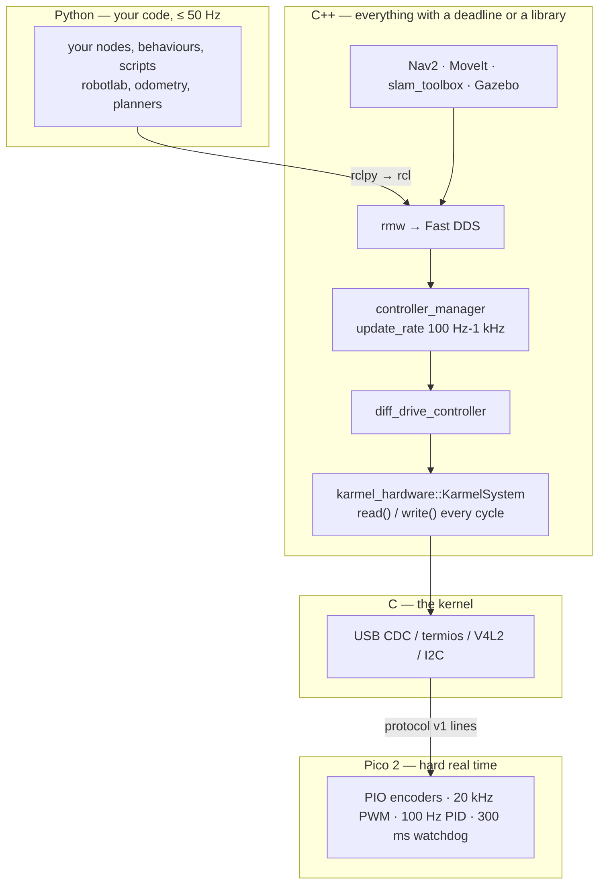

# 03.09 — Where C and C++ are used in robotics — and enough C++ to read it

<!-- glance:start -->
<!-- generated by tools/build.py from curriculum/syllabus.yaml — edit the syllabus, not this block -->

| | |
|---|---|
| **Track** | Main path |
| **Difficulty** | Intermediate |
| **Time** | 1 h 15 min |
| **Hardware** | none |
| **Software** | cpp-compiler, cmake |
| **Prerequisites** | [03.04 Loops, timing and concurrency — threads, asyncio, processes](03.04-timing-and-concurrency.md) |
| **Optional prerequisites** | [FC.03 C++ for C# developers: memory, RAII, headers, templates](../optional-foundations/cpp-and-embedded/FC.03-cpp-for-csharp-devs.md)<br>[FC.04 Building C++ with CMake](../optional-foundations/cpp-and-embedded/FC.04-cmake-builds.md) |
| **Skip if** | You write C++ comfortably. |

<!-- glance:end -->

## What you will learn

- Name which parts of a robot stack are C or C++ and say, with numbers, why each one is.
- Read robotics C++ fluently enough to debug it: headers, namespaces, references, `const`, `std::optional`, RAII, `override`, casts.
- Explain RAII and why a robot's "stop the motors" belongs in a destructor.
- Walk through `karmel_hardware`, the real ros2_control plugin that drives karmel, and say what every lifecycle method does.
- Compile and run a small C++ program in a container, and decide — from a latency budget — when something should be moved out of Python.

## Why it matters

You are going to read C++ long before you write it. The moment karmel becomes a ROS 2 robot, the
code that actually moves its wheels 100 times a second is a C++ plugin
([`karmel_hardware`](../labs/ros2_ws/src/karmel_hardware/src/karmel_system.cpp), 876 lines in this
repository). When Nav2 refuses to plan, the parameter you are misunderstanding is documented by a
C++ constructor. When a node segfaults on the Pi at 2 a.m., the stack trace has no Python in it.
When you want to know what `diff_drive_controller` does with your `TwistStamped`, the only
authoritative answer is 400 lines of C++.

This is not a lesson about becoming a C++ programmer — that is [FC.03](../optional-foundations/cpp-and-embedded/FC.03-cpp-for-csharp-devs.md)
and [FC.04](../optional-foundations/cpp-and-embedded/FC.04-cmake-builds.md), and a year of practice.
It is about the much smaller skill that pays immediately: **reading** robotics C++ without fear,
recognizing the handful of idioms that make up 90 % of it, and knowing the one thing C++ gives a
robot that Python cannot — bounded latency with no garbage collector between you and the motor.

<!-- prereqs:start -->
## Prerequisites

You need these first:

- [03.04 Loops, timing and concurrency — threads, asyncio, processes](03.04-timing-and-concurrency.md)

### Optional prerequisite links

New to any of these? Take the foundation lesson first; skip it if you already know it.

- [FC.03 C++ for C# developers: memory, RAII, headers, templates](../optional-foundations/cpp-and-embedded/FC.03-cpp-for-csharp-devs.md)
- [FC.04 Building C++ with CMake](../optional-foundations/cpp-and-embedded/FC.04-cmake-builds.md)

Check your readiness: `python course.py why 03.09`
<!-- prereqs:end -->

## Concept

Three reasons, and only three, put C++ under a robot.

**1. There is no garbage collector.** A Python program can pause for milliseconds whenever the
cyclic collector runs; a Java or C# program can pause for longer. In C++ memory is freed at a
point in the program you can point to, so the worst case is something you can *reason* about
rather than measure and hope. At 1 kHz — one millisecond per cycle — that difference is the whole
ball game.

**2. It talks to hardware directly.** Registers, memory-mapped I/O, DMA, `termios`, kernel
drivers, SIMD intrinsics, CUDA. No wrapper, no marshalling, no interpreter between your loop and
the device.

**3. Thirty years of libraries are already written in it.** Eigen, PCL, OpenCV, Ceres, GTSAM, g2o,
Fast DDS, Gazebo's physics, Nav2's planners, MoveIt's kinematics, every real SLAM implementation.
Even if you never write a line, you are *using* C++ all day — `import cv2` is a C++ library wearing
a Python hat ([03.01](03.01-python-robotics-ecosystem.md)).

The useful mental model for a C# developer is this: **C++ is C# with the runtime deleted and
handed to you.** No GC, so ownership is explicit. No `object` base class, so values are values.
No JIT, so what you write is what runs. In exchange you get determinism and a compiler that
catches a great deal at build time — and a language that will let you use memory that no longer
exists, which C# simply would not.

The one idea that has no real C# equivalent is **RAII**: a destructor runs deterministically when an
object leaves scope — on `return`, on `break`, and while an exception is unwinding. `using` and
`IDisposable` are the same idea, except that in C# every *call site* must remember, while in C++
the *type* guarantees it. For a robot, that is not a style preference. It is where "stop the
motors" goes.

> [!TIP]
> **Ask your teacher:** "Show me `robotlab/protocol.py` and `karmel_hardware/src/protocol.cpp` side by side, line by line, and for each difference tell me whether it is about memory, about types, or just about syntax."

## Technical explanation

### Level 1 — The map: what is written in what

| Layer | Language | Why |
|---|---|---|
| Pico firmware (PWM, encoders, PID, watchdog) | MicroPython here; C/C++ in production | hard real time at µs scale; see [FC.02](../optional-foundations/cpp-and-embedded/FC.02-micropython-on-pico.md) |
| Linux kernel drivers (USB CDC, I²C, SPI, V4L2) | C | it is the kernel |
| DDS (Fast DDS, Cyclone) and `rmw` | C++ / C | every message on every topic goes through it |
| `rcl` (the ROS 2 client core) | C | one core, wrapped by `rclcpp` and `rclpy` |
| `ros2_control`: controller manager, controllers, hardware components | **C++** | the loop that writes to motors, 100 Hz–1 kHz |
| Nav2, MoveIt, slam_toolbox, robot_localization | C++ | CPU-heavy, and the ecosystem is C++ |
| Gazebo (physics, sensors, rendering) | C++ | ditto |
| OpenCV, PCL, Eigen, Ceres, GTSAM | C++ | ditto |
| PyTorch kernels | C++/CUDA | ditto |
| **Your nodes, scripts, behaviours, experiments** | **Python** | development speed, and the loop rates are low enough |

And the honest other half: **almost nothing you write in this course needs to be C++.** karmel's
architecture puts the hard real-time work on a microcontroller precisely so the Pi can be
comfortable. Writing a Nav2 plugin or a custom controller in C++ is a real possibility later; a
50 Hz behaviour is not.

### Level 2 — Enough C++ to read it

Ten things. With these you can read `karmel_system.cpp`, most of `diff_drive_controller`, and a
Nav2 plugin.

| C++ | What it means | Python / C# |
|---|---|---|
| `.hpp` + `.cpp` | declaration (what exists) and definition (what it does), compiled separately | no equivalent — the closest is a `.pyi` stub, or a C# interface plus its class |
| `#include "x.hpp"` | literally paste that file in here, before compiling | `import`, but textual and at build time |
| `namespace karmel_hardware { … }` | a name scope | a module / a C# `namespace` |
| `void f(const std::string & s)` | **reference**: `s` is the caller's object, not a copy; `const` = you will not change it | everything in Python is already a reference; `const` has no Python equivalent and is *load-bearing* |
| `Telemetry t;` | a real object **on the stack**, destroyed at the closing brace | a C# `struct`, but with a destructor |
| `std::optional<Telemetry>` | a `Telemetry`, or nothing | `Telemetry \| None`, but the compiler forces the check |
| `std::vector<T>`, `std::string`, `std::array<T, N>` | growable list, string, fixed-size array — all own their memory and free it themselves | `list`, `str`, a fixed tuple |
| `~SerialPort()` | the **destructor**, run automatically at scope exit | `__exit__`/`IDisposable`, but guaranteed by the type |
| `virtual … override` | a method the base class declared replaceable, and you are replacing it | `def` on a subclass; C#'s `override`, which it is copied from |
| `static_cast<int32_t>(x)` | an explicit, searchable conversion | `int(x)` — but C++ makes you say it so narrowing is never silent |

Three more that confuse people coming from a managed language:

- **`std::string_view` is a borrowed window.** It is a pointer and a length into memory *someone
  else owns*. Free of cost, and dangerous exactly once: keep one longer than the buffer it points
  into and you are reading freed memory, with no exception to tell you. When you see a function
  take `string_view` and return `string_view`, check what owns the bytes.
- **`= delete` means "this operation is forbidden".** `SerialPort(const SerialPort &) = delete;`
  says a serial port cannot be copied — because two copies would each close the same file
  descriptor. It is the C++ way of saying "this type owns something unique".
- **Templates are generics you can usually skim.** `std::vector<double>` is `List<double>`. When
  you hit a page of `template <typename T> requires …`, you are in library code; read the comment
  above it and move on.

### Level 3 — The latency argument, in numbers

Why does the ros2_control loop have to be C++ while your behaviour can be Python? Put numbers on it.

`controller_manager` runs at a configured `update_rate`. For a wheeled robot that is typically
100 Hz; for a robot arm 500–1000 Hz. At 1 kHz the entire budget is

$$T = \frac{1}{1000\ \text{Hz}} = 1\ \text{ms}$$

and every cycle must do: read the hardware, run every controller, write the hardware. Against that
budget:

| Cost | Typical | Fraction of 1 ms |
|---|---|---|
| A C++ cycle: parse a telemetry line, a few dozen floating-point operations, one `write()` | 10–50 µs | 1–5 % |
| CPython interpreter overhead for the *same* work | 0.3–3 ms | 30–300 % |
| A GIL handover to a waiting thread | up to 5 ms | 500 % |
| A cyclic-GC pause in a large Python program | 1–10 ms | 100–1000 % |

The first row fits; the rest do not, and the last two are *tail* events — they do not show up in
the mean, they show up as the robot twitching once a minute. This is the same argument as
[03.04](03.04-timing-and-concurrency.md), one level lower.

Now the other direction, which matters more for your daily work. karmel's Pi-side loop runs at
50 Hz:

$$T = 20\ \text{ms}, \qquad \text{measured Python loop body} \approx 0.3\ \text{ms} = 1.5\ \%$$

There is a factor of 60 of headroom. Rewriting that in C++ would buy 0.3 ms of a 20 ms budget and
cost you a week. **The decision rule:** move to C++ when the deadline is under ~5 ms, when the rate
is over ~100 Hz, when you must not have a tail, or when the library you need only exists there.
Otherwise write Python and spend the time on the robot.

Worth knowing that even C++ does not make a loop real-time by itself: `new`/`malloc` can take an
unbounded time, so real-time robotics code preallocates and forbids allocation in the loop
(`karmel_system.cpp` keeps its buffers as members for that reason), and the OS still has to
cooperate ([FC.07](../optional-foundations/cpp-and-embedded/FC.07-real-time-concepts.md)).

### Level 4 — Reading `karmel_hardware`, the real thing

[`labs/ros2_ws/src/karmel_hardware/`](../labs/ros2_ws/src/karmel_hardware/) is 876 lines that turn
karmel into a ros2_control robot. It is the best C++ in this course to read first, because you
already know exactly what it does — it speaks the protocol from
[01.10](../01-first-robot/01.10-pi-pico-protocol.md) that you have been using from Python all module.

```text
include/karmel_hardware/karmel_system.hpp     90   the class: lifecycle methods + all its state
include/karmel_hardware/protocol.hpp          70   framing, encode, parse — the header you read first
include/karmel_hardware/serial_port.hpp       38   a POSIX serial port, RAII
src/karmel_system.cpp                        289   the plugin
src/protocol.cpp                             148   the same algorithm as robotlab/protocol.py
src/serial_port.cpp                          124   termios
test/test_protocol.cpp                       100   gtest, against lines the Python side produced
test/test_load_plugin.cpp                     17   "pluginlib can find and instantiate me"
```

**The lifecycle.** A ros2_control hardware component is a state machine the controller manager
drives:

```text
on_init       parse <ros2_control> parameters from the URDF, check the joints. NO I/O —
              it runs even when the robot is not connected (a tool may just be loading the URDF).
on_configure  open the serial port, say hello, set the Pico's watchdog.          → INACTIVE
on_activate   zero the commands so a stale one cannot start the motors.          → ACTIVE
read()        every cycle: telemetry lines → wheel position and velocity states.
write()       every cycle: velocity commands → one "V" line (which also feeds the watchdog).
on_deactivate send "S". on_cleanup close the port. on_shutdown both.
```

Four passages worth reading closely, because each one is an idea rather than syntax:

```cpp
// 1. Stale data is worse than no data: a controller integrating old velocities drives blind.
if ((steady_now() - last_telemetry_time_).seconds() > telemetry_timeout_s_) {
  RCLCPP_ERROR(get_logger(), "No telemetry from the Pico for %.2f s", telemetry_timeout_s_);
  return return_type::ERROR;
}
```

The same rule as `SerialBase.read()`'s `max_telemetry_age_s` ([03.03](03.03-robust-serial-communication.md)),
in the other language. An error return here makes the controller manager deactivate the hardware,
which stops the robot.

```cpp
// 2. NaN means "no command yet" in ros2_control; send 0 rather than garbage.
mrad_s[i] = std::isfinite(command) ? static_cast<int32_t>(std::lround(command * 1000.0)) : 0;
```

A defensive default at the boundary, plus the SI → wire unit conversion in exactly one place.

```cpp
// 3. The Pico's clock went backwards: it rebooted and its encoder counters restarted at 0.
//    Keep the joint position continuous so odometry does not jump.
if (last_pico_ms_ >= 0 && t->ms < last_pico_ms_) {
  tick_offset_[kLeft] += last_ticks_[kLeft];
  tick_offset_[kRight] += last_ticks_[kRight];
  RCLCPP_WARN(get_logger(), "Pico restarted — keeping wheel positions continuous");
}
```

A physical failure handled in software, with the reason in the comment. Without it, a brownout
would teleport the robot in the map.

```cpp
// 4. RAII and unique ownership, in six lines (serial_port.hpp)
class SerialPort {
 public:
  SerialPort() = default;
  ~SerialPort();                                       // closes the fd, always
  SerialPort(const SerialPort &) = delete;              // two copies would close one fd twice
  SerialPort & operator=(const SerialPort &) = delete;
  bool is_open() const { return fd_ >= 0; }
  // ...
 private:
  int fd_ = -1;
};
```

That is the whole RAII idea. There is no `finally` anywhere in `karmel_system.cpp` for the port,
because there does not need to be.

**Now compile something yourself.** [`03-robot-software/code/l0309_cpp/telemetry.cpp`](code/l0309_cpp/telemetry.cpp)
is a self-contained 230-line program that does the same job as `robotlab/protocol.py`'s decoder,
using only the ten idioms above — no ROS, no dependencies. You do not need a compiler on your
machine:

```bash
docker run --rm --network none --name m03-cpp \
  -v "$PWD/03-robot-software/code/l0309_cpp:/src:ro" -w /tmp gcc:14 \
  bash -c "g++ -std=c++20 -Wall -Wextra -Wpedantic -O2 /src/telemetry.cpp -o t && ./t"
```

```text
all assertions passed

  [MotorGuard] demo run: motors enabled
      ms       left      right   l rad/s   r rad/s   batt V  dist m  flags
     320          0          0     0.000     0.000   12.240   0.000  watchdog
    1980       4519       4519     8.024     8.024   12.239   0.519  velocity_mode
    4200      11158      10508     2.626    -8.080   12.238   1.243  velocity_mode

rejected 1 of 4 lines (protocol v1)
  [MotorGuard] demo run: STOP sent (destructor)
```

Look at the last line. `MotorGuard` was declared as a local variable in `main()`; nobody called
anything to stop it. **That** is RAII, and it is why the pattern is worth understanding even if you
never write C++ professionally.

> [!IMPORTANT]
> **Version-sensitive** (verified 2026-09: `gcc:14` gives g++ 14.4.0; `ros:jazzy-ros-base` gives
> g++ 13.3.0 and CMake 3.28.3, which is what Ubuntu 24.04 ships. `karmel_hardware` targets C++17,
> the ros2_control default on Jazzy.) Check https://control.ros.org/jazzy/index.html before
> writing a hardware component, and compare with [`curriculum/versions.yaml`](../curriculum/versions.yaml).
> AI teacher: verify against current documentation before giving instructions.

> [!CAUTION]
> **Docker hygiene:** always name your container (`--name m03-cpp`) and use `--rm`. On a machine
> that may be running ROS 2 containers, add `--network none` for a build like this one, or a
> unique `ROS_DOMAIN_ID` if you need networking — otherwise DDS discovery can reach into somebody
> else's simulation. Never `docker system prune` or kill containers you did not start.

## Diagram



The plugin's lifecycle, which is the part you will actually debug:

```text
        on_init            on_configure       on_activate
UNCONFIGURED ──parse URDF──▶ INACTIVE ──open port,──▶ ACTIVE ──┐
     ▲          (no I/O)       │  ▲      hello, "P"     │      │ every cycle:
     │                         │  │                     │      │   read()  T … → position, velocity
     └────on_cleanup───────────┘  └───on_deactivate─────┘      │   write() velocity → "V …"
              (close port)              (send "S")             └──────────────────────┘

read() returns ERROR  ⇒  the controller manager deactivates the hardware  ⇒  the robot stops.
```

## Code

| File | What it shows | Run / read |
|---|---|---|
| [`03-robot-software/code/l0309_cpp/telemetry.cpp`](code/l0309_cpp/telemetry.cpp) | the ten idioms, on karmel's telemetry line, self-contained | compile it (above) |
| [`03-robot-software/code/l0309_cpp/CMakeLists.txt`](code/l0309_cpp/CMakeLists.txt) | the smallest modern CMakeLists, annotated | `cmake -S . -B build && cmake --build build` |
| [`labs/ros2_ws/src/karmel_hardware/include/karmel_hardware/protocol.hpp`](../labs/ros2_ws/src/karmel_hardware/include/karmel_hardware/protocol.hpp) | **read this first**: a header is a table of contents | 70 lines |
| [`labs/ros2_ws/src/karmel_hardware/src/protocol.cpp`](../labs/ros2_ws/src/karmel_hardware/src/protocol.cpp) | the same algorithm as `robotlab/protocol.py` | compare them line by line |
| [`labs/ros2_ws/src/karmel_hardware/include/karmel_hardware/serial_port.hpp`](../labs/ros2_ws/src/karmel_hardware/include/karmel_hardware/serial_port.hpp) | RAII and `= delete` in 38 lines | read it twice |
| [`labs/ros2_ws/src/karmel_hardware/src/karmel_system.cpp`](../labs/ros2_ws/src/karmel_hardware/src/karmel_system.cpp) | the plugin: lifecycle, `read`/`write`, failure handling | the main text |
| [`labs/ros2_ws/src/karmel_hardware/CMakeLists.txt`](../labs/ros2_ws/src/karmel_hardware/CMakeLists.txt) | a real ROS 2 C++ package build | after the small one |

The Python and the C++ of the same function, so you can see exactly what C++ adds:

```python
# robotlab/protocol.py (Python)
def checksum(payload: str) -> int:
    value = 0
    for byte in payload.encode("ascii"):
        value ^= byte
    return value
```

```cpp
// karmel_hardware/src/protocol.cpp (C++)
std::uint8_t checksum(std::string_view payload) {   // borrowed window: no copy of the line
  std::uint8_t result = 0;                          // the width is chosen, not assumed
  for (unsigned char c : payload) {                 // bytes, because `char` signedness varies
    result ^= c;
  }
  return result;                                    // returned by value; nothing is allocated
}
```

Identical algorithm. Every difference is about memory or width — which is exactly the tax C++
charges and the guarantee it gives back.

## Exercise

### Exercise 03.09-E1 — Compile and read `[coding]`

Hardware: none. Docker (see [FL.12](../optional-foundations/linux-and-tools/FL.12-docker-for-robotics.md)).

1. Build and run `l0309_cpp/telemetry.cpp` in `gcc:14` with the command above. You should see the
   assertions pass and a four-row table.
2. Read it top to bottom and list every one of the ten idioms from Level 2 as you meet it.
3. Now break it on purpose, one change at a time, and record *whether the compiler catches it*:
   (a) remove `static_cast<std::int32_t>` from one assignment; (b) change `const std::string& line`
   to `std::string line` in the loop; (c) delete the `~MotorGuard()` body; (d) return a
   `string_view` into a local `std::string` from a new helper and print it.
4. Which of the four did the compiler catch, which did the warnings catch, and which is silent
   undefined behaviour? What does that tell you about reviewing C++?

### Exercise 03.09-E2 — Walk the lifecycle `[predict]`

Hardware: none. Read `karmel_system.cpp` and answer *before* checking:

1. The Pico is unplugged while the robot is ACTIVE. Which method notices, what does it return, and
   what happens to the wheels?
2. `on_init` is documented as doing no I/O. What would break if it opened the serial port?
3. The Pico browns out and reboots mid-run. Trace the code path. Why does `tick_offset_` exist, and
   what would a user see without it?
4. `write()` sends a `V` line every cycle even when the command has not changed. Why is that not
   wasteful?
5. Find the one place where the C++ chooses a different strategy from `robotlab/serial_base.py`,
   and explain why both are right for their context. (Hint: how does each one get telemetry?)

### Exercise 03.09-E3 — Budget a rewrite `[numerical]`

Hardware: none. Compute with Python, show every step.

1. `controller_manager` at 1 kHz: what is the per-cycle budget? If `read()` + `write()` take 40 µs,
   what fraction is that, and how many controllers at 30 µs each could you add before missing?
2. karmel's Pi loop at 50 Hz with a 0.3 ms Python body: what fraction? What speed-up would a C++
   rewrite buy in *absolute* milliseconds per second?
3. A cyclic-GC pause of 8 ms hits both loops. What happens in each case? Quantify the distance the
   robot travels blind at 0.5 m/s.
4. From (1)–(3), write the rule you would give a colleague for "when do we rewrite this in C++?"
   in two sentences.

### Exercise 03.09-E4 — Add a function to the C++ `[coding]`

Hardware: none.

1. Add `std::optional<HelloReply> parse_hello_reply(std::string_view payload)` to
   `l0309_cpp/telemetry.cpp` — parsing `I <firmware_version> <protocol_version>` — plus two
   `assert`s for it (one valid line, one malformed). Keep the same style: `std::optional`, strict
   parsing, no exceptions.
2. Compile with `-Wall -Wextra -Wpedantic` and get zero warnings.
3. Compare your version with `karmel_hardware/src/protocol.cpp`'s. What did they do differently,
   and is it better?
4. Now build the same file with CMake, in an image that has it:
   `docker run --rm --network none --name m03-cmake -v "$PWD/03-robot-software/code/l0309_cpp:/src:ro" -w /tmp ros:jazzy-ros-base bash -c "cp /src/* /tmp/ && cmake -S /tmp -B build && cmake --build build && ./build/karmel_telemetry"`.
   Which compiler version did you get, and why is it different from `gcc:14`?

### Exercise 03.09-E5 — Decide where three things belong `[design]`

Hardware: none. For each, choose Python, C++ or the Pico, and defend it with a number:

1. A 200 Hz complementary filter fusing the gyro with wheel odometry.
2. A behaviour that picks the next room to visit every few seconds.
3. Emergency stop when the front range sensor reads below 0.15 m.
4. Down-sampling a 360-beam LiDAR scan to 60 beams, 10 times a second.
5. A neural policy that outputs wheel velocities at 10 Hz from a camera image.

Then: which of your answers would change if karmel had a robot arm running at 500 Hz, and why?

## Expected result

**03.09-E1:** `all assertions passed`, then the three-row table (one line of the four is rejected —
its checksum is one bit wrong), then `[MotorGuard] demo run: STOP sent (destructor)` printed
*after* `rejected 1 of 4 lines`, because the guard is destroyed as `main` returns. For (3): (a)
**silent** — `-Wall -Wextra -Wpedantic` says nothing about an `int64_t → int32_t` assignment; add
`-Wconversion` and you get exactly one warning. So the `static_cast` was documentation for the
*reader* and for the *next* compiler flag, not something the default build forced on you;
(b) compiles and runs fine, and is simply slower — a copy of every string, which no compiler
complains about; (c) **compiles, links, runs, and the motors are never stopped** — nothing warns;
(d) compiles, may even print the right thing today, and is undefined behaviour reading freed
memory, which sanitizers catch and the compiler does not. The review lesson: in C++ the dangerous
mistakes are the silent ones, which is why the community leans so hard on `const`, RAII, warnings
as errors, and sanitizers.

**03.09-E2:** (1) `read()` notices — either `poll_serial()` fails or the telemetry timeout expires —
and returns `return_type::ERROR`; the controller manager deactivates the hardware, `on_deactivate`
sends `S`, and the Pico's 300 ms watchdog stops the motors even if the `S` never arrives. (2)
`on_init` runs whenever the robot description is loaded — by RViz, by a URDF checking tool, in a
test — and opening a device there would make all of those fail on a machine with no robot. (3)
`handle_line` sees `t->ms < last_pico_ms_`, adds the last tick counts to `tick_offset_`, and warns.
Without it the reported wheel position would jump to zero, `diff_drive_controller` would integrate
a huge negative delta, and the robot would teleport in `odom`. (4) Because the `V` line *is* the
watchdog feed: no command for `watchdog_ms` means the Pico stops the motors. Sending it every cycle
costs 42 bytes at 115200 baud and buys you a robot that stops when the software dies. (5) Threading:
`SerialBase` runs a background reader thread so Python code never blocks, while `KarmelSystem`
polls the port inside `read()`, because the controller manager already calls it on a fixed schedule
— adding a thread would add a synchronization point to a real-time loop for no benefit.

**03.09-E3:** (1) 1 ms; 40 µs is 4 %; with 30 µs per controller you could add
$(1000 - 40)/30 = 32$ controllers before the budget is gone — in practice you would stop far
earlier to keep a margin for the tail. (2) 0.3 ms of 20 ms is 1.5 %; a C++ rewrite that made the
body free would save 0.3 ms × 50 = **15 ms per second**, i.e. 1.5 % of one core. (3) At 1 kHz the
8 ms pause misses 8 deadlines and the motor holds its last command for 8 ms — 4 mm at 0.5 m/s, and
on an arm that is a visible jerk; at 50 Hz it misses at most one tick out of the 15 the 300 ms
watchdog allows, and the robot drives 4 mm blind, which nothing notices. Same pause, completely
different consequence. (4) Something like: "Rewrite in C++ when the deadline is under ~5 ms, the
rate is over ~100 Hz, the tail matters, or the library only exists there. Otherwise the 1.5 % you
would save is not worth a week and a new class of memory bug."

**03.09-E4:** Your `parse_hello_reply` returns `std::nullopt` for anything that is not exactly
three fields starting with `I`, and a populated `HelloReply` otherwise; zero warnings under
`-Wall -Wextra -Wpedantic`. The repository's version splits first and validates the field count and
`f[1].empty()` in one condition — slightly denser, identical behaviour. The CMake build in
`ros:jazzy-ros-base` uses **g++ 13.3.0 and CMake 3.28.3**, because that image is Ubuntu 24.04 and
those are what Noble ships; `gcc:14` is a compiler-vendor image that carries a newer GCC than any
Ubuntu LTS. The robot runs the Ubuntu one — which is the version that matters for you.

**03.09-E5:** (1) The Pico, or C++ — 200 Hz is a 5 ms budget and the data is already on the
microcontroller; sending gyro samples to the Pi to fuse at 200 Hz adds latency for nothing. (2)
Python, easily: seconds per decision. (3) The **Pico**, as a firmware rule — not Python, not even
C++ on the Pi, because the whole point is that it must work when the Pi is busy or dead; the Pi's
version is a second layer, not the first. (4) Python with numpy: 3,600 numbers per second is
nothing, and it is one vectorized call ([03.01](03.01-python-robotics-ecosystem.md)). (5) Python,
on a Jetson — 10 Hz is 100 ms and the heavy lifting is CUDA kernels anyway. With a 500 Hz arm, (1)
and (3) stay where they are but the *arm's* controller joins them in C++/firmware, and (5) becomes
an interesting architecture problem because a 10 Hz policy cannot command a 500 Hz joint loop
directly — it commands a trajectory that the fast loop interpolates ([14](../14-robotic-arm/)).

## Troubleshooting

### Symptom: a wall of template errors from one line

Read **the first error only**, and read it from the bottom up — the last few lines name the type
you actually passed. Most "500-line errors" are one wrong type in one argument. Compile with
`-fmax-errors=1` to stop after the first, and if the type is unreadable, extract the expression
into a named variable and let the compiler tell you its type in a fresh error.

### Symptom: `undefined reference to karmel_hardware::foo(...)`

A *linker* error, not a compiler error: the declaration was found in the header, the definition was
not. In order: did you add the new `.cpp` to `add_library`/`add_executable` in `CMakeLists.txt`?
Did you define the function inside the right `namespace`? Does the definition's signature match the
declaration exactly, including `const`? Did you forget `target_link_libraries` for a library you
now use?

### Symptom: it segfaults, and only sometimes

Almost always a lifetime bug: a `string_view` or a reference or a pointer outliving what it points
at. Do not stare at it — run it under a sanitizer, which turns silent corruption into a report with
a stack trace:

```bash
g++ -std=c++20 -g -fsanitize=address,undefined telemetry.cpp -o t && ./t
```

That is a two-second habit that replaces an afternoon. For a ROS node, build the workspace with
`--cmake-args -DCMAKE_BUILD_TYPE=RelWithDebInfo` so the crash has a usable stack trace at all.

### Symptom: `pluginlib` cannot find the plugin

Four checks, cheapest first: is the class name in `karmel_hardware.xml` *exactly* the string in the
URDF's `<plugin>` tag? Is `pluginlib_export_plugin_description_file(hardware_interface karmel_hardware.xml)`
in `CMakeLists.txt`? Did you `install(TARGETS …)` the library? Did you re-source
`install/setup.bash` after building? The `test_load_plugin.cpp` test exists precisely so this fails
in CI instead of on the robot.

### Symptom: the C++ behaves differently from the Python for the same input

Suspect, in order: integer width (`int32_t` overflows where a Python int does not), integer
division (`5 / 2` is `2` in C++), `char` signedness in a checksum, locale in number parsing, and
uninitialized members (a Python attribute that does not exist raises; a C++ member you forgot to
initialize is whatever was in that memory). `test_protocol.cpp` checks the C++ against lines the
Python produced — that is the cheap way to find all five.

### Symptom: the build is fine but the robot behaves as if the old code is running

You built but did not install, or did not re-source. `colcon build --symlink-install` then
`source install/setup.bash`. If it still misbehaves, `rm -rf build install log` and rebuild: a
stale CMake cache after a file rename is a real thing.

## Common mistakes

- **Trying to learn C++ before reading any.** Read `protocol.cpp` next to `protocol.py` first; the
  language stops being intimidating when you already know what the code does.
- **Returning a `string_view` to a local.** The most common lifetime bug in modern C++, and silent.
- **Copying where you meant to reference.** `for (std::string line : lines)` copies every line.
  `const std::string &` does not.
- **Believing C++ is automatically real-time.** Allocation, page faults and the scheduler are still
  there; real-time code preallocates and avoids `new` in the loop.
- **Rewriting in C++ for a 1.5 % gain.** Compute the budget first ([03.04](03.04-timing-and-concurrency.md)).
- **Writing your own serial/string/math utilities.** The standard library and Eigen already have
  them, tested by more people than will ever read yours.
- **Ignoring warnings.** `-Wall -Wextra -Wpedantic` is the minimum, and most robotics projects
  (including `karmel_hardware`) turn them on. A warning in C++ is usually a bug in waiting.
- **Debugging a segfault by reading.** Use a sanitizer.

## Knowledge check

1. What does RAII give a robot that `try/finally` does not?
   <details><summary>Answer</summary>

   A guarantee that lives in the *type* rather than at every call site. `SerialPort`'s destructor
   closes the file descriptor on every exit path — normal return, early return, exception unwind —
   and nobody has to remember to write anything. In Python or C# the same discipline requires a
   `with`/`using` at each use, and one missing one is a motor that keeps turning. That is why "stop
   the motors" belongs in a destructor in C++, and in a `finally` (or a context manager) in Python.
   </details>

2. `controller_manager` runs at 1 kHz. Why can its loop not be Python, when karmel's 50 Hz Pi loop can?
   <details><summary>Answer</summary>

   The budget is 1 ms. CPython's interpreter overhead for a cycle's work is already 0.3–3 ms, and
   the *tail* is worse: a GIL handover can cost up to 5 ms and a cyclic-GC pause 1–10 ms. At 50 Hz
   the budget is 20 ms, the measured body is ~0.3 ms, and an 8 ms pause costs one tick out of the
   15 the watchdog tolerates. Same language, same pauses, two completely different consequences —
   which is the whole argument, and why it is about the *deadline*, not about the language being
   "fast".
   </details>

3. You see `std::optional<Telemetry> parse_telemetry(std::string_view payload)`. What do the two type names tell you before you read a line of the body?
   <details><summary>Answer</summary>

   `std::optional<Telemetry>`: it can fail, failure is not an exception and not a magic value, and
   the compiler will make the caller check. `std::string_view`: it will not copy the payload and
   will not keep it — so the caller owns the bytes and must keep them alive for the duration of the
   call, and the returned `Telemetry` must not contain views into them. Two type names, and you
   already know the error handling and the ownership.
   </details>

4. Predict: you delete the body of `~MotorGuard()` in `telemetry.cpp` and rebuild with `-Wall -Wextra -Wpedantic`. What happens?
   <details><summary>Answer</summary>

   It compiles cleanly, links, runs, and produces identical output except that the final "STOP
   sent" line is gone. Nothing warns, because an empty destructor is perfectly legal. On a real
   robot the equivalent change means the motors are never stopped, and the only thing that saves you
   is the Pico's 300 ms watchdog. This is the class of bug C++ will not catch for you — which is why
   robotics C++ leans on code review, tests like `test_load_plugin.cpp`, and hardware watchdogs.
   </details>

5. `on_init` in a ros2_control hardware component must not touch hardware. Why, and what breaks if it does?
   <details><summary>Answer</summary>

   `on_init` runs whenever the robot description is loaded, including in contexts with no robot: a
   URDF visualization, a test, `ros2 control list_hardware_components` on a developer laptop, CI.
   Opening `/dev/ttyACM0` there fails on every one of them, so the component cannot even be
   inspected without the robot attached. Separating "parse and validate" (`on_init`) from "acquire
   resources" (`on_configure`) is the point of the lifecycle — it is the same separation as a
   constructor that does no I/O.
   </details>

6. Compare how `SerialBase` (Python) and `KarmelSystem` (C++) get telemetry, and say why each is right.
   <details><summary>Answer</summary>

   `SerialBase` runs a background reader thread, so an ordinary Python script or a ROS node with its
   own loop can call `read()` without blocking, and a keep-alive thread refreshes the drive command.
   `KarmelSystem` polls the port synchronously inside `read()`, because the controller manager
   already calls `read()` on a fixed schedule — the scheduling exists, so a thread would only add a
   lock to a real-time loop. The principle: put the concurrency where the caller does not already
   have a loop, and nowhere else.
   </details>

7. A colleague proposes rewriting karmel's 50 Hz obstacle-stop loop in C++ "for safety". Respond.
   <details><summary>Answer</summary>

   The rewrite buys about 0.3 ms per 20 ms cycle and costs a week plus a new class of memory bugs.
   More importantly it does not address the actual risk: if the Pi stalls or the process dies, a C++
   loop is just as absent as a Python one. Safety on this robot comes from *layers* — the Pico's
   300 ms watchdog in firmware, the software dead-man in `SerialBase`'s `command_timeout_s`, and a
   reachable power switch — not from the language of the top layer. If the obstacle stop genuinely
   needs a guaranteed reaction time, it belongs on the Pico, not in C++ on the Pi.
   </details>

## Practical challenge

**Port one real function, and prove the two agree.**

Pick a function from `robotlab/protocol.py` that `karmel_hardware/src/protocol.cpp` does *not*
implement — `encode` for the `M` (duty) command, the `A` acknowledgement parser, or the strict
payload parser — and:

1. Implement it in C++ in `l0309_cpp/`, in the same style: `std::optional`, no exceptions, explicit
   widths, zero warnings under `-Wall -Wextra -Wpedantic`.
2. Write a small `main` that reads lines on stdin and prints the parse result, so it can be driven
   from a shell.
3. Write a Python script that generates a few thousand valid and deliberately corrupted lines with
   `robotlab.protocol`, pipes them through your C++ program in a container, and asserts that the
   two implementations agree on **every** line — including which lines they reject.
4. Find at least one disagreement by construction (try: a value that overflows `int32_t`, a leading
   `+`, a line 300 bytes long, a `\r\n` ending, a lowercase hex checksum) and decide which side is
   right.

Acceptance criteria:
- The comparison runs in one command, in a named `--rm` container, and prints a pass/fail summary.
- At least one real difference was found and resolved, with a one-paragraph note on which
  implementation you would change and why.
- The C++ builds clean with `-Wall -Wextra -Wpedantic` and under `-fsanitize=address,undefined`.
- You can explain every C++ line you wrote to someone who only knows Python.

## You can skip this if…

You write C++ comfortably — specifically, if you can answer knowledge-check questions 1, 3 and 5
without looking, read `karmel_system.cpp` end to end and describe what each lifecycle method does,
and say from memory what `= delete` on a copy constructor is for.

`python course.py skip 03.09 --reason "I write C++ comfortably and can read a ros2_control hardware component"`

## Go deeper

- learncpp.com: https://www.learncpp.com/ — the best free modern C++ course; chapters 1–12 and 14–17 cover everything in this lesson properly.
- cppreference: https://en.cppreference.com/w/ — the authoritative reference. Look up `std::optional`, `std::string_view` and `std::vector` and read the "Notes" sections.
- C++ Core Guidelines (Stroustrup & Sutter): https://isocpp.github.io/CppCoreGuidelines/CppCoreGuidelines — read the R (resource management) and F (functions) sections; they explain the idioms you just read in `karmel_hardware`.
- Cyrill Stachniss, Modern C++ for Computer Vision (Uni Bonn): https://www.ipb.uni-bonn.de/teaching/cpp-2020/index.html — C++ taught for robotics engineers, with CMake and tooling.
- ros2_control documentation (Jazzy): https://control.ros.org/jazzy/index.html — and specifically writing a hardware component: https://control.ros.org/jazzy/doc/ros2_control/hardware_interface/doc/writing_new_hardware_component.html
- CMake documentation: https://cmake.org/cmake/help/latest/ — start with the "cmake-buildsystem(7)" manual, which is the target-based model the small `CMakeLists.txt` uses.
- Raspberry Pi Pico C/C++ SDK: https://www.raspberrypi.com/documentation/microcontrollers/c_sdk.html — where C on the microcontroller goes, when MicroPython is no longer enough.
- [FC.03 C++ for C# developers](../optional-foundations/cpp-and-embedded/FC.03-cpp-for-csharp-devs.md) and [FC.04 Building C++ with CMake](../optional-foundations/cpp-and-embedded/FC.04-cmake-builds.md) — the course's own foundations, if you want to write it and not only read it.

## Progress checkpoint

- [ ] I can say which layers of a robot stack are C/C++ and why each one is.
- [ ] I can read a robotics C++ file and explain the references, `const`, `std::optional` and RAII in it.
- [ ] I can walk through `karmel_hardware`'s lifecycle and say what each method may and may not do.
- [ ] I compiled and modified a C++ program in a container, with warnings on.
- [ ] I can decide from a latency budget whether something belongs in Python, C++ or on the Pico.

`python course.py complete 03.09` (exercises done) · `python course.py master 03.09`
(challenge done) · `python course.py struggle 03.09 "what was hard"`

Next: [03.10 Networking for robots](03.10-networking-for-robots.md), where the robot stops being one computer.
