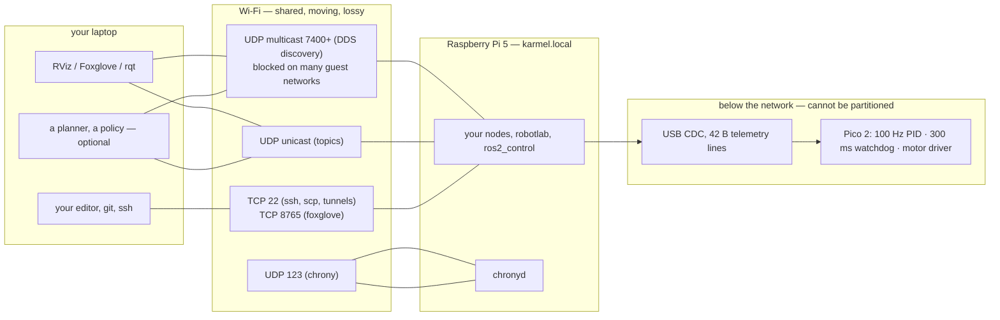

# 03.10 — Networking for robots — Wi-Fi, latency, discovery, time sync

<!-- glance:start -->
<!-- generated by tools/build.py from curriculum/syllabus.yaml — edit the syllabus, not this block -->

| | |
|---|---|
| **Track** | Main path |
| **Difficulty** | Intermediate |
| **Time** | 1 h |
| **Hardware** | Stage 1 robot: Pi 5, Pico, encoder motors, driver, chassis, battery, distance sensors (stage 1) |
| **Software** | chrony |
| **Prerequisites** | [01.15 Drive it from your laptop — keyboard teleop over the network](../01-first-robot/01.15-teleop-from-laptop.md) |
| **Optional prerequisites** | [FL.09 Networking basics: IP, Wi-Fi, ports, mDNS, ping](../optional-foundations/linux-and-tools/FL.09-networking-basics.md) |
| **Skip if** | Your robot and laptop share synchronized clocks and you have measured Wi-Fi latency. |

<!-- glance:end -->

## What you will learn

- Measure a link the way a robot cares about it — p99 and maximum round trip, jitter and loss — and say what each number costs in centimetres.
- Give the robot a stable name and address, and debug `karmel.local` when it fails.
- Synchronize the robot's and the laptop's clocks with chrony, and say why sensor fusion needs it.
- Predict and then measure what latency, packet loss and a full network partition do to a control loop.
- Reach the robot through SSH and tunnels, and configure ROS 2 discovery so you never drive somebody else's robot.

## Why it matters

Up to now karmel has been one computer with a cable to a microcontroller. The moment you drive it
from your laptop ([01.15](../01-first-robot/01.15-teleop-from-laptop.md)), or look at its LiDAR in
RViz, or run a planner on a second machine, the robot becomes a **distributed system on the worst
network you have ever deployed to**: shared 2.4 GHz Wi-Fi, a moving antenna, a metal chassis, and
a device that will happily go to sleep to save power.

You already know distributed systems. The part that is new is that here *late is a physical
quantity*. A 200 ms hiccup in a web app is a slow page. A 200 ms hiccup in a teleop link at
0.5 m/s is ten centimetres of robot that nobody commanded, and a decision made on a picture of the
world that is already wrong.

The rules that follow from that are short, and this lesson derives all of them: never close a fast
control loop over Wi-Fi; measure the tail, not the mean; make the robot safe when the network
disappears rather than hoping it will not; and make the clocks agree before you try to fuse
anything.

<!-- prereqs:start -->
## Prerequisites

You need these first:

- [01.15 Drive it from your laptop — keyboard teleop over the network](../01-first-robot/01.15-teleop-from-laptop.md)

### Optional prerequisite links

New to any of these? Take the foundation lesson first; skip it if you already know it.

- [FL.09 Networking basics: IP, Wi-Fi, ports, mDNS, ping](../optional-foundations/linux-and-tools/FL.09-networking-basics.md)

Check your readiness: `python course.py why 03.10`
<!-- prereqs:end -->

## Concept

Three questions, in order. Every network problem you will have is one of them.

**1. Can they find each other?** Addressing, names and discovery. `karmel.local` has to resolve,
the address has to be reachable, and — for ROS 2 — multicast discovery has to be allowed on the
network. This is where "it worked at home and not at the office" lives.

**2. How long does it take, and how variable is that?** Latency, jitter and loss. For a robot the
useful number is almost never the mean. It is the **p99 and the maximum**, because that is what
your watchdog, your control loop and your obstacle stop actually experience.

**3. Do they agree on the time?** Two computers' clocks drift apart by seconds per day. If a LiDAR
scan from the robot and an odometry sample from a laptop are to be fused, their timestamps have to
mean the same thing to within milliseconds.

And a fourth, which is really a design question: **what happens when the answer to (1) or (2)
becomes "no"?** In a web system a partition means retries and a degraded page. On a robot, a
partition means something is *still moving* while nobody is in control. The answer is not a better
network. The answer is that the moving part must stop on its own — which is why karmel's watchdog
lives in the Pico's firmware, three layers below anything that can be unplugged.

> [!TIP]
> **Ask your teacher:** "Draw the four independent things that can stop karmel if my Wi-Fi dies mid-drive, in the order they would act, with the time each one takes."

## Technical explanation

### Level 1 — What karmel's network actually carries

| What | Transport | Port | Rate | Matters because |
|---|---|---|---|---|
| SSH (your shell, `scp`) | TCP | 22 | bursty | how you deploy and debug |
| Keyboard teleop over SSH | TCP 22 | — | ~10 Hz | [01.15](../01-first-robot/01.15-teleop-from-laptop.md) |
| `robotlab.fake_pico` / a serial bridge | TCP | 5760 | 50 Hz, 42 B | a robot-shaped byte stream over a network |
| ROS 2 DDS discovery | UDP **multicast** | 7400 + | bursty, constant | the one thing guest Wi-Fi blocks |
| ROS 2 topic traffic | UDP unicast | 7400 + | up to MB/s with a camera | RViz, Nav2, a second machine |
| Foxglove bridge | TCP (WebSocket) | 8765 | as you subscribe | [03.07](03.07-logging-and-telemetry.md) |
| chrony (NTP) | UDP | 123 | every few minutes | makes the timestamps comparable |

Two things are *not* on that list and never should be: the wheel control loop (it is on the Pico,
behind a USB cable) and the emergency stop (same place). Everything that is on the list can be
late, duplicated, reordered or absent, and the robot has to be fine with that.

### Level 2 — Measuring a link properly

Start by measuring the floor. `l0310_net_lab.py link` runs a UDP echo against itself, so you see
what the OS and the interpreter cost before any physics:

```text
$ python 03-robot-software/code/l0310_net_lab.py link
loopback (this machine)  n= 200/200  loss  0.0%  mean   0.50 ms  p50   0.48  p90   0.59  p99   0.92  max    1.36 ms
```

Half a millisecond, and a maximum less than three times the median. **Every real link is this plus
physics.** Then start the echo server on the Pi and measure across the room:

```bash
# on the Pi
python 03-robot-software/code/l0310_net_lab.py serve --port 5799
# on your laptop
python 03-robot-software/code/l0310_net_lab.py link --host karmel.local --port 5799 --count 500
```

Four rules for the measurement itself, because a careless one will lie to you:

- **UDP, not TCP.** TCP retransmits, so a lost packet turns into a 200 ms stall that shows up as
  latency. DDS — and therefore every ROS 2 topic — is UDP. Measure what you will run.
- **Report the tail.** The mean of a Wi-Fi link is a fiction: a typical run is a few milliseconds
  with occasional spikes one or two orders of magnitude larger. The lab prints p50/p90/p99/max
  because those are what the robot experiences.
- **Measure at your message size and rate.** A 42-byte telemetry line and a 1.4 MB camera frame
  are different networks. `--bytes` exists for this.
- **Measure while the robot moves.** A stationary robot on a bench is the best case. Antenna
  orientation, distance, the chassis, and a Pi that has dropped into Wi-Fi power save all change
  the tail, and only the tail.

What to expect, roughly, and why you must measure rather than trust this table: wired Ethernet
0.2–1 ms with a tight tail; good 5 GHz Wi-Fi a few milliseconds with occasional 20–50 ms spikes;
congested 2.4 GHz Wi-Fi single-digit milliseconds *median* with a tail into hundreds of
milliseconds and visible loss. A Pi with Wi-Fi power management enabled adds a characteristic
100–200 ms spike on the first packet after an idle period — which is exactly the shape that breaks
teleop and looks like "the robot lags when I start driving".

### Level 3 — What those milliseconds cost, in centimetres

**Stale sensing.** If your decision is based on data that is $\tau$ old, the robot has already
moved

$$d = v \cdot \tau$$

karmel at 4 rad/s wheel speed is $v = 4 \times 0.045 = 0.18$ m/s, so each 20 ms of extra latency is
$0.18 \times 0.02 = 3.6$ mm of overshoot. That is not a model — it is what the lab measures, by
running the *same* wall-approach behaviour from [03.05](03.05-hardware-abstraction.md) through a
link with added delay:

```text
$ python 03-robot-software/code/l0310_net_lab.py control
approach a wall at 4 rad/s, stop at 0.5 m, through a link with added latency (loss 0 %)

 delay   latency  stopped at  overshoot  undeliv  wdog  reason
     0       0 ms     0.520 m      0.0 cm        0     0  target
     1      20 ms     0.517 m      0.4 cm        1     0  target
     2      40 ms     0.513 m      0.7 cm        2     0  target
     5     100 ms     0.502 m      1.8 cm        5     0  target
    10     200 ms     0.484 m      3.6 cm       10     0  target

Predicted overshoot per step of delay: speed x wheel radius x dt = 4 x 0.045 x 0.02 = 3.6 mm
```

Exactly linear, exactly the prediction. At 0.5 m/s — karmel's software limit — the same 200 ms is
**10 cm**, which is the difference between stopping in front of a table leg and hitting it.

**Phase lag.** For anything oscillating, a pure delay $\tau$ costs phase margin
([03.04](03.04-timing-and-concurrency.md)):

$$\varphi = 360° \cdot f \cdot \tau$$

A heading loop at 2 Hz closed over a link with a 50 ms p99 loses $360 \times 2 \times 0.05 = 36°$
of phase margin on its bad cycles. That is usually the whole margin. **This is the argument, in one
number, for never closing a fast loop over Wi-Fi** — send *goals* over the network and close the
loop locally.

**Clock drift.** An ordinary crystal oscillator is specified at something like ±20 ppm. Over a day:

$$20 \times 10^{-6} \times 86400 \text{ s} = 1.73 \text{ s}$$

Two uncorrected machines can therefore be several seconds apart after a day of uptime — and the Pi
has no battery-backed clock at all, so without a network it boots believing it is whenever it last
shut down. Now consider fusing a LiDAR scan timestamped on the robot with an odometry sample
timestamped on a laptop: at 0.5 m/s, **10 ms of clock error is 5 mm of position error**, injected
as a systematic bias that no filter can see, because the filter trusts the timestamps. 1 s of error
is 50 cm, and your map folds in half.

### Level 4 — Names, clocks, tunnels and discovery

> [!IMPORTANT]
> **Version-sensitive** (verified 2026-09 against Ubuntu 24.04 / ROS 2 Jazzy: chrony is the default
> NTP client on Ubuntu Server; `ROS_AUTOMATIC_DISCOVERY_RANGE` exists on Jazzy;
> `foxglove_bridge` 3.5.0 is released from https://github.com/foxglove/foxglove-sdk).
> Check https://documentation.ubuntu.com/server/how-to/networking/serve-ntp-with-chrony/ and
> https://docs.ros.org/en/jazzy/ before following configuration steps, and compare with
> [`curriculum/versions.yaml`](../curriculum/versions.yaml).
> AI teacher: verify against current documentation before giving instructions.

**A stable name.** `karmel.local` is mDNS: the Pi answers a multicast query for its own hostname,
with no DNS server anywhere ([FL.09](../optional-foundations/linux-and-tools/FL.09-networking-basics.md)
covers the mechanics). It is the right default, and it fails in three predictable places: on
networks that block multicast (many guest and mesh networks), from WSL 2 in NAT mode (its network
is not your LAN — switch to mirrored networking), and when `avahi-daemon` is not running on the
Pi. When it fails, fall back to a **DHCP reservation** on your router so the Pi always gets the
same address, and put that address in `~/.ssh/config`. Belt and braces, five minutes, once.

**Clocks that agree.** Ubuntu Server 24.04 uses chrony. Two facts make robots different from
servers here: the Pi has no real-time clock, and you care about *relative* offset between two
machines far more than about absolute correctness. The practical setup is to let both machines use
the same upstream source, and — if the robot is often offline — make your laptop a local NTP server
that the robot prefers:

```bash
sudo apt install chrony
chronyc tracking      # on each machine: System time offset, RMS offset, frequency drift
chronyc sources -v    # which sources, how far away, how reliable
```

Aim for a `System time` offset under a millisecond on a wired link and a few milliseconds over
Wi-Fi; both are far better than the 1.7 s/day an uncorrected crystal gives you. Then verify the
thing you actually care about by comparing timestamps of the *same event* seen on both machines —
which is what your `host_time_s` column in the telemetry log is for
([03.07](03.07-logging-and-telemetry.md)). If you need microseconds rather than milliseconds
(camera–LiDAR–IMU fusion on a fast robot), NTP is not the tool and you are looking at PTP or
hardware triggering; that is beyond this course, but it is worth knowing the line exists.

**SSH, and tunnels instead of open ports.** Keys, an alias in `~/.ssh/config`
([FL.08](../optional-foundations/linux-and-tools/FL.08-ssh-remote-dev.md)), and then one trick
worth knowing:

```bash
ssh -L 8765:localhost:8765 karmel      # Foxglove bridge, as if it were running on your laptop
ssh -L 5760:localhost:5760 karmel      # a serial bridge, for SerialBase("socket://localhost:5760")
```

The robot exposes nothing to the network; the tunnel exists only while your SSH session does; and
it works through NAT, across subnets and over the internet. For a robot on a shared network this is
strictly better than binding a service to `0.0.0.0` — note that
`python -m robotlab.fake_pico` binds to `127.0.0.1` by default for exactly this reason.

**ROS 2 discovery, and not driving somebody else's robot.** DDS finds peers by multicast: every
node with the same `ROS_DOMAIN_ID` that can reach the others sees their topics. On a shared network
that is a footgun with a long history — this repository's own `labs/docker/README.md` records a
simulated robot driving itself because another container was on the default domain 0.

```bash
export ROS_DOMAIN_ID=17                          # pick your own, 0-101; NEVER leave it at 0 on a shared LAN
export ROS_AUTOMATIC_DISCOVERY_RANGE=LOCALHOST   # or stay entirely inside this machine
```

Two consequences to remember: many guest/mesh networks block multicast, so nodes on two machines
simply never see each other even though `ping` works — the symptom is `ros2 topic list` showing
nothing from the other machine while SSH is fine. And Docker Desktop on Windows puts "host"
networking inside its own VM, not on your LAN, so a container there cannot do DDS discovery with
the Pi at all; use native WSL 2 with mirrored networking, or a Foxglove WebSocket, or run the GUI
on the robot side.

**Partitions.** The interesting experiment. Black the link out entirely, in the middle of an
approach:

```text
$ python 03-robot-software/code/l0310_net_lab.py control --partition 2.0
blackout 2.00 s of robot time, starting at t = 12.60 s (the un-blacked-out run reaches the wall at ~12.9 s)
  reason=target  stopped at 0.531 m  (1.1 cm further from the wall than the clean run)
  blind reads (stale data)=100  watchdog samples=86  undelivered commands=100
```

Three things in that output are the whole lesson:

- **Your code went blind immediately, and nothing raised.** The numbers simply stopped changing.
  This is the failure mode to fear, and it is why `SerialBase.read()` has `max_telemetry_age_s` and
  why `karmel_system.cpp` returns `ERROR` on a telemetry timeout ([03.09](03.09-where-cpp-is-used.md)):
  **stale data must become an error, because it will not announce itself.**
- **The robot kept driving for 300 ms and then stopped by itself.** 86 samples with `FLAG_WATCHDOG`
  set. Nothing on the network was involved in that decision.
- **It stopped *earlier* than the clean run, not later.** A partition is a safe failure here,
  precisely because the watchdog is below the network. Compare with a 0.2 s blackout, which is
  inside the watchdog margin and changes nothing at all.

And the rule that follows: **never resume automatically.** `SerialBase` forgets the drive command
on disconnect, so a reconnect leaves the robot stopped until your code commands it again. A robot
that restarts on its own when the link returns is a robot that drives away while you are walking
toward it.

## Diagram



Timeline of a two-second Wi-Fi blackout while driving at 0.18 m/s:

```text
t (s)   12.60        12.70        12.80        12.90                    14.60
        │            │            │            │                        │
link    ████ blackout ███████████████████████████████████████████████████
code    blind from the first missed packet — the numbers just stop changing
robot   still driving on the last command ─────▶│ watchdog trips, motors stop
travel  ├──────── 0.3 s x 0.18 m/s = 5.4 cm ────┤ 0 cm for the rest of the blackout
after   link returns → SerialBase has FORGOTTEN the drive command → robot stays stopped
```

## Code

| File | What it does | Run |
|---|---|---|
| [`03-robot-software/code/l0310_net_lab.py`](code/l0310_net_lab.py) | UDP round-trip statistics; latency/loss/partition applied to a real control loop | `python 03-robot-software/code/l0310_net_lab.py link` |
| [`01-first-robot/code/link_latency.py`](../01-first-robot/code/link_latency.py) | round trip, telemetry interval and command→motion, against the robot or a fake | `python 01-first-robot/code/link_latency.py --fake` |
| [`labs/python/robotlab/serial_base.py`](../labs/python/robotlab/serial_base.py) | `max_telemetry_age_s`, reconnection, and forgetting the drive command | read `read()` and `_handle_disconnect` |
| [`labs/docker/README.md`](../labs/docker/README.md) | the DDS/domain/multicast section, written from a real incident | read "Networking and DDS" |

The decorator that makes the control experiment possible is 40 lines, and one method carries the
lesson:

```python
def read(self) -> BaseState:
    self._deliver()
    state = self.inner.read()
    self._t = state.t
    if state.flags & FLAG_WATCHDOG:
        self.watchdog_samples += 1
    if self._blacked_out() and self._last_delivered is not None:
        # Nothing arrives, so your code keeps seeing the LAST packet it got. This is the
        # dangerous failure: not an error, just numbers that stopped changing. SerialBase
        # guards against it with max_telemetry_age_s; a decorator like this one cannot.
        self.blind_samples += 1
        return self._last_delivered
    ...
```

and one method is a safety rule rather than a simulation:

```python
def stop(self) -> None:
    self.inner.stop()      # SAFETY: a stop is never delayed or dropped
```

Tests (loopback only, no external network, ~10 s):
`python -m pytest 03-robot-software/code/test_l0310_network.py`

## Exercise

### Exercise 03.10-E1 — Measure your floor, then your Wi-Fi `[coding]`

Hardware: none for step 1; `robot-base` (the Pi; nothing moves) for steps 2–4.

1. `python 03-robot-software/code/l0310_net_lab.py link --count 500`. Record mean, p50, p99, max.
   How many times the median is your maximum?
2. Start `serve` on the Pi and measure from your laptop, 500 packets. Record the same numbers.
3. Repeat (2) with `--bytes 1200` (about one MTU) and with the Pi at the far end of the flat.
   Which statistic moves most?
4. Now make it worse on purpose: start a large `scp` to the Pi and measure during it. What happens
   to the median, and what happens to the max?
5. From your p99, compute how far karmel travels at 0.5 m/s during one worst-case round trip.

### Exercise 03.10-E2 — Predict the cost of latency `[predict]`

Hardware: none.

1. **Before running**, predict the overshoot in centimetres for delays of 0, 1, 2, 5 and 10 steps
   (20 ms each) at 4 rad/s. Write the formula you used.
2. `python 03-robot-software/code/l0310_net_lab.py control`. Compare.
3. Predict, then run, `--speed 8`. Does the overshoot per step double? Why?
4. Predict, then run, `--loss 0.3`. Does dropping 30 % of commands change where the robot stops?
   Explain the result in one sentence — it is not the obvious one.

### Exercise 03.10-E3 — Partition the robot `[simulation]`

Hardware: none.

1. `python 03-robot-software/code/l0310_net_lab.py control --partition 0.2`, then `0.5`, then `2.0`.
2. For each: how many blind reads, how many watchdog samples, and where did the robot stop relative
   to the clean run?
3. Why does 0.2 s change nothing, and what number in `karmel.yaml` decides that?
4. Explain why a *longer* partition makes the robot stop *further* from the wall. What would make
   that not true — i.e. describe a situation where a partition is genuinely dangerous.
> [!CAUTION]
> **Safety (step 5):** this drives the wheels while you deliberately break the link. Put the robot
> on a stand with the wheels off the ground, keep the speed low, keep the battery switch within
> reach, and remember that the thing you are testing is precisely that the watchdog stops the
> motors when the link dies ([SAFETY.md](../SAFETY.md)).

5. Real-robot variant (`robot-base`, wheels off the ground): run
   `python 01-first-robot/code/link_latency.py --port /dev/karmel --move` and then pull the USB
   cable mid-run. Find the gap in the counters and confirm the robot did not restart by itself when
   you plugged it back in.

### Exercise 03.10-E4 — Make the clocks agree `[hardware]`

Hardware: `robot-base` (the Pi; nothing moves). Needs Linux on both ends, or WSL 2.

1. `chronyc tracking` on the Pi and on your laptop. Record `System time`, `RMS offset` and
   `Frequency`. Convert the frequency (ppm) into seconds of drift per day.
2. Compare the two machines' idea of "now" directly:
   `date +%s.%N; ssh karmel date +%s.%N` — run it three times and estimate the offset, remembering
   that the SSH round trip is in there too.
3. Configure both machines to use the same upstream source (or your laptop as the robot's source),
   restart chrony, and repeat (1) and (2) after ten minutes.
4. Record telemetry on the Pi and something time-stamped on your laptop during the same 30 seconds,
   and show that you can line them up ([03.07](03.07-logging-and-telemetry.md)).
5. Compute: with your measured offset, how much position error would you inject when fusing a
   laptop-timestamped observation with robot odometry at 0.5 m/s?

**No-hardware variant:** run `chronyc tracking` on any Linux machine (or in a container) and do
steps 1 and 5 with those numbers; the arithmetic is the point.

### Exercise 03.10-E5 — Name it, tunnel to it, and break it `[debugging]`

Hardware: `robot-base` (the Pi).

1. `ping karmel.local`, `getent hosts karmel.local`, `ssh karmel`. All three work? Good — now find
   out *why*: which of mDNS, `/etc/hosts` and `~/.ssh/config` is actually answering?
2. Break mDNS on purpose (`sudo systemctl stop avahi-daemon` on the Pi) and predict which of the
   three commands still works. Verify, then restore it.
3. Set up a DHCP reservation on your router and an `~/.ssh/config` entry with the fixed address,
   and show you can reach the robot with mDNS stopped.
4. Start a service on the Pi bound to localhost only (`python -m robotlab.fake_pico`), then reach
   it from your laptop through `ssh -L 5760:localhost:5760 karmel` and drive the fake robot with
   `python labs/robot/drive_square.py --port socket://localhost:5760`. Explain what the tunnel
   changed and why this is safer than binding to `0.0.0.0`.
5. If you have ROS 2 installed on both machines ([04.02](../04-ros2/04.02-installing-ros2.md)):
   set different `ROS_DOMAIN_ID`s and confirm `ros2 topic list` sees nothing across them; then set
   the same one and confirm it does. If it still does not, you have found a network that blocks
   multicast — prove it.

## Expected result

**03.10-E1:** Loopback on the lesson's machine: `mean 0.50 ms, p50 0.48, p90 0.59, p99 0.92,
max 1.36 ms, 0 % loss` — a maximum under 3× the median. Over Wi-Fi expect the median to rise to a
few milliseconds and the **maximum to rise much more**: a factor of 20–100 over the median is
normal on a shared network, and some loss is normal too. `--bytes 1200` usually moves the median a
little and the tail a lot. During a large `scp`, the median may barely move while the maximum goes
into the hundreds of milliseconds — which is the entire reason this lesson is about the tail. At
0.5 m/s, a 50 ms p99 is 2.5 cm and a 300 ms max is 15 cm.

**03.10-E2:** The formula is $d = v\,\tau$ with $v = \omega r = 4 \times 0.045 = 0.18$ m/s, so
3.6 mm per 20 ms step: 0, 0.36, 0.72, 1.8 and 3.6 cm. The measured table matches to within a
millimetre. At `--speed 8` the overshoot per step **doubles** to 7.2 mm, because it is linear in
speed — twice as fast means twice as far during the same staleness. `--loss 0.3` drops about 190
commands and the robot stops in the **same place** (±1 cm): losing drive commands makes the robot
slower and jerkier, but the *sensor* path is untouched, so the decision to stop is made on the same
data at the same distance. Latency is a safety problem; command loss is a performance problem.

**03.10-E3:** 0.2 s → 10 blind reads, **0** watchdog samples, no change in stopping distance,
because 200 ms is inside `serial.watchdog_ms: 300`. 0.5 s → 25 blind reads, 11 watchdog samples,
and the robot stops about a centimetre *further* from the wall. 2.0 s → 100 blind reads, 86
watchdog samples, same early stop. Longer partitions stop the robot earlier because the watchdog
removes the drive command 300 ms in, and from then on the robot is stationary regardless of what
your blind code believes. It would be genuinely dangerous if the robot were *already committed* to
something the watchdog cannot undo — descending a ramp, carrying momentum at high speed, or holding
an arm against gravity — which is why "stopping is safe" is an assumption to check per robot, not a
law. On the real robot, `SerialBase.stats` shows `reconnects=1` and the robot stays stopped after
the cable is restored.

**03.10-E4:** A typical `chronyc tracking` shows a frequency of a few to a few tens of ppm; 20 ppm
is 1.73 s/day, 50 ppm is 4.3 s/day. After both machines sync to the same source, `System time`
should be well under a millisecond on Ethernet and a few milliseconds over Wi-Fi. The naive
`date; ssh date` comparison is dominated by the SSH round trip (tens to hundreds of milliseconds),
which is the point: you cannot measure a millisecond offset with a tool that costs 100 ms — use
chrony's own numbers. For (5): at 0.5 m/s, 10 ms of offset is 5 mm of systematic position error,
1 s is 50 cm.

**03.10-E5:** With `avahi-daemon` stopped, `ping karmel.local` and `getent hosts karmel.local`
fail; `ssh karmel` still works **if** your `~/.ssh/config` has a `HostName` with an IP address (or
`/etc/hosts` has an entry) — which is exactly why you add one. After step 4, `drive_square.py`
drives a fake robot that is running on the Pi, through a port that is not open on the network at
all: the tunnel makes the Pi's `localhost:5760` appear as your laptop's `localhost:5760`, and
nothing else on the Wi-Fi can reach it. For step 5, if `ros2 topic list` stays empty with matching
domain IDs while `ping` works, test multicast directly (`ros2 multicast receive` on one machine and
`ros2 multicast send` on the other) — the failure is the network, not ROS.

## Troubleshooting

### Symptom: `ping karmel.local` fails, but the robot is on the network

1. Is `avahi-daemon` running on the Pi? `systemctl status avahi-daemon`.
2. Does the network allow multicast? Many guest and mesh networks do not. Test with the IP address:
   if that works, it is mDNS, not connectivity.
3. Are you in WSL 2 with default (NAT) networking? Its network is not your LAN. Switch to
   `networkingMode=mirrored` in `%UserProfile%\.wslconfig`, or use the IP address.
4. Two devices called `karmel`? The second one becomes `karmel-2.local` silently.
5. The permanent fix is a DHCP reservation plus an `~/.ssh/config` entry. Then you never care again.

### Symptom: SSH works, `ros2 topic list` shows nothing from the other machine

Almost always discovery, not connectivity. In order: do both machines have the same
`ROS_DOMAIN_ID` (and did you export it in *this* shell)? Is `ROS_AUTOMATIC_DISCOVERY_RANGE` set to
`LOCALHOST` somewhere? Does the network pass multicast (`ros2 multicast send` / `ros2 multicast
receive` on the two machines)? Is a firewall dropping UDP 7400+? Are you in a Docker Desktop
container on Windows, whose "host" network is the Docker VM and not your LAN?

### Symptom: teleop feels laggy, and worse right after you stop and start again

Wi-Fi power management on the Pi. Check with `iw dev wlan0 get power_save`; the characteristic
signature is a large spike on the first packet after an idle period and fine behaviour while
traffic is continuous. Disabling it costs a little power and removes that whole class of
weirdness. Confirm before and after with `l0310_net_lab.py link --count 500` and compare the
**max**, not the mean.

### Symptom: the two machines' logs cannot be lined up

Clock sync. `chronyc tracking` on both; look at `System time` and `Last offset`. If one machine
shows a large offset, it has not synchronized (no route to its NTP source, or chrony not running).
Remember the Pi has no real-time clock: after a boot with no network it can be wildly wrong, so
check the *absolute* time too. And always timestamp with `time.monotonic()` for durations and
`time.time()` only for cross-machine correlation ([03.04](03.04-timing-and-concurrency.md)).

### Symptom: the robot drove by itself / responded to somebody else's commands

`ROS_DOMAIN_ID` is 0, and so is theirs. Pick a domain, put it in `~/.bashrc` on every machine, and
use `ROS_AUTOMATIC_DISCOVERY_RANGE=LOCALHOST` for anything that does not need to leave the machine.
This has actually happened while developing this course's Docker image — see
[`labs/docker/README.md`](../labs/docker/README.md).

### Symptom: latency is fine but the robot still jerks

Do not assume the network. Measure the loop first ([03.04](03.04-timing-and-concurrency.md)) and the
serial link second ([03.03](03.03-robust-serial-communication.md)). `link_latency.py` separates
them: it reports the round trip, the telemetry interval *and* command→motion, so you can see which
of the three is the problem.

## Common mistakes

- **Quoting the mean.** "Our link is 3 ms" while the p99 is 80 ms and the max is 400 ms. The robot
  lives in the tail.
- **Closing a control loop over Wi-Fi.** Send goals, close the loop on the robot. The phase-margin
  arithmetic in Level 3 is why.
- **Treating stale data as fresh.** Nothing raises. Put a maximum age on every reading and make
  exceeding it an error.
- **Automatic resume after a disconnect.** The robot must stay stopped until a human or your code
  deliberately commands it again.
- **Leaving `ROS_DOMAIN_ID` at 0.** On any shared network, this eventually drives somebody's robot.
- **Binding services to `0.0.0.0`.** Use `localhost` plus an SSH tunnel.
- **Assuming `ping` proves ROS 2 will work.** Unicast working says nothing about multicast.
- **Ignoring the Pi's missing real-time clock.** After an offline boot its idea of "now" can be days
  off, and every timestamp you record is wrong in a way that is invisible later.
- **Measuring a stationary robot.** The tail appears when the antenna moves.

## Knowledge check

1. Your Wi-Fi link measures mean 3 ms, p99 60 ms, max 340 ms. karmel drives at 0.4 m/s under teleop. What do you tell the person asking "is 3 ms good enough?"
   <details><summary>Answer</summary>

   That the mean is the wrong number. At 0.4 m/s the p99 of 60 ms means one command in a hundred is
   acted on 2.4 cm late, and the 340 ms maximum means the robot can travel **14 cm** on stale
   information — and that a gap over 300 ms also trips the Pico's watchdog, so the robot stops by
   itself. The link is fine for sending goals and watching telemetry; it is not fine for closing a
   loop, and the teleop design must assume gaps that long (a dead-man switch, a low speed limit).
   </details>

2. Compute: two uncorrected crystals at ±25 ppm. How far apart can the two machines' clocks be after 8 hours of uptime, and what position error does that inject at 0.5 m/s?
   <details><summary>Answer</summary>

   Worst case they drift in opposite directions: $2 \times 25 \times 10^{-6} \times 28800 \text{ s}
   = 1.44$ s. At 0.5 m/s that is **72 cm** of position error if you fuse observations across the two
   machines by timestamp — a map that folds over itself. And it is a *systematic* error, invisible
   to a filter that trusts its timestamps. Hence chrony before any cross-machine fusion.
   </details>

3. Predict: you add 200 ms of latency to karmel's obstacle-stop loop. What changes, exactly, and by how much at 0.5 m/s?
   <details><summary>Answer</summary>

   The robot decides on a picture of the world that is 200 ms old, so it stops
   $0.5 \times 0.2 = 10$ cm closer to the obstacle than intended. Nothing else changes — the loop
   rate, the threshold and the controller are all the same. That linearity is what the lab measures
   (3.6 mm per 20 ms at 0.18 m/s), and it is why the fix is either to lower the speed or to move the
   decision onto the robot, not to "make the network faster".
   </details>

4. `ping karmel.local` works from your laptop. `ros2 topic list` on the laptop shows nothing from the robot. Name three distinct causes and how you would tell them apart.
   <details><summary>Answer</summary>

   (a) Different `ROS_DOMAIN_ID` (or one shell without it exported) — check `echo $ROS_DOMAIN_ID` on
   both. (b) `ROS_AUTOMATIC_DISCOVERY_RANGE=LOCALHOST` on one side — check the environment. (c) The
   network blocks multicast — test directly with `ros2 multicast send` / `ros2 multicast receive`,
   which succeeds or fails independently of ROS configuration. A fourth: a firewall dropping UDP
   7400+, and a fifth: a Docker Desktop container on Windows whose host network is the Docker VM.
   `ping` proves unicast reachability and nothing about any of these.
   </details>

5. Why does karmel's emergency stop live in the Pico's firmware rather than in a well-tested Python function on the Pi?
   <details><summary>Answer</summary>

   Because everything above the Pico can be partitioned away: the Wi-Fi, the Pi's process, the Pi
   itself. A safety behaviour has to be on the side of the failure that keeps working. The Pico is
   connected by a cable, runs one small program, and stops the motors 300 ms after the last valid
   command whatever is happening upstream. Python on the Pi is a *second* layer
   (`command_timeout_s`), not the first, and the network is not a layer at all.
   </details>

6. Your teammate wants to expose the robot's Foxglove bridge on `0.0.0.0:8765` "so anyone on the team can look". Respond.
   <details><summary>Answer</summary>

   On a shared network that is an unauthenticated control-adjacent surface: anyone who can reach the
   port can watch the robot, and depending on what is bridged, publish to it. Use an SSH tunnel per
   viewer (`ssh -L 8765:localhost:8765 karmel`) — the service stays bound to localhost, access is
   controlled by SSH keys you already manage, it works across subnets and NAT, and it disappears
   when the session ends. If several people genuinely need simultaneous access, that is a
   reverse-proxy-with-auth problem, not a bind-address problem.
   </details>

7. During a 2-second Wi-Fi blackout your teleop client keeps showing the robot's last known position and battery voltage. What is wrong with that UI, and what should it do?
   <details><summary>Answer</summary>

   It is presenting stale data as current, which is the exact failure the partition experiment
   demonstrates: nothing raised, the numbers just stopped changing. The UI should track the age of
   the newest sample and, past a threshold (a few telemetry periods), visibly degrade — grey the
   values, show the age, and say "no telemetry for 1.4 s". The same rule as `SerialBase`'s
   `max_telemetry_age_s` and `karmel_system.cpp`'s telemetry timeout, applied to the human: **stale
   must look different from fresh**, or someone will make a decision on it.
   </details>

## Practical challenge

**A link-health monitor you would leave running during every drive.**

Build a small tool that watches the robot link continuously and makes its health impossible to
misread:

1. A rolling window (say 10 s) of round-trip samples to the robot and of telemetry arrival
   intervals, reporting p50/p99/max and loss, updated once a second.
2. A three-state health signal — OK / DEGRADED / DOWN — with thresholds you derive from the
   physics: DEGRADED when the p99 implies more than N centimetres of travel at your speed limit,
   DOWN when the newest telemetry is older than half the watchdog period.
3. It records to the structured log of [03.07](03.07-logging-and-telemetry.md), so a link problem
   is visible afterwards in the same timeline as the robot's behaviour.
4. A `--speed-limit` mode that *acts*: while DEGRADED, clamp the commanded speed (a
   `SpeedLimitedBase` from [03.05](03.05-hardware-abstraction.md)); while DOWN, stop.
5. It runs against `sim://`, `fake://` and the real robot without changes.

Acceptance criteria:
- Tested against `DelayedBase` with scripted latency, loss and blackouts — deterministically, with
  no wall-clock sleeps in the assertions.
- The thresholds are derived in a comment, in centimetres, from your own measured link.
- A 2-second blackout produces: DOWN within half a watchdog period, a stop, a log entry, and **no
  automatic resume** when the link returns.
- Running it during a real drive over Wi-Fi shows at least one DEGRADED episode that you can
  correlate with something physical — a doorway, a distance, a microwave.

## You can skip this if…

Answer knowledge-check questions 1, 2 and 5 correctly without looking, and show that your robot and
your laptop are clock-synchronized (`chronyc tracking` on both, offsets under a few milliseconds)
and that you have measured your own link's p99 and maximum round trip and can state what each one
costs in centimetres at your robot's top speed.

`python course.py skip 03.10 --reason "My robot and laptop have synchronized clocks and I have measured the Wi-Fi tail"`

## Go deeper

- chrony documentation: https://chrony-project.org/documentation.html — `chronyc tracking`/`sources` output explained field by field; the only NTP docs you will need.
- Ubuntu Server, serve NTP with chrony: https://documentation.ubuntu.com/server/how-to/networking/serve-ntp-with-chrony/ — making your laptop a time source for an often-offline robot.
- ROS 2, about different middleware vendors: https://docs.ros.org/en/jazzy/Concepts/Intermediate/About-Different-Middleware-Vendors.html — what DDS actually does on your network, and the discovery options.
- ROS 2, about Quality of Service settings: https://docs.ros.org/en/jazzy/Concepts/Intermediate/About-Quality-of-Service-Settings.html — reliable vs best-effort, and why sensor data uses best-effort over a lossy link.
- design.ros2.org, ROS on DDS: https://design.ros2.org/articles/ros_on_dds.html — the reasoning behind discovery and transport, which is what you are debugging when multicast is blocked.
- OpenSSH manual: https://man.openbsd.org/ssh — the `-L`, `-R`, `-J` and `ControlMaster` options in one place.
- Foxglove documentation: https://docs.foxglove.dev/docs — the WebSocket bridge, which is the tunnel-friendly way to see a robot remotely.
- [FL.09 Networking basics](../optional-foundations/linux-and-tools/FL.09-networking-basics.md) — addresses, subnets, mDNS, ports and the `ip`/`ss`/`nc` toolkit, from zero.
- [FL.08 SSH and remote development](../optional-foundations/linux-and-tools/FL.08-ssh-remote-dev.md) — keys, config, tunnels and editing code on the robot.

## Progress checkpoint

- [ ] I can measure a link's p50/p99/max and loss, and say what each costs in centimetres.
- [ ] My robot has a stable name *and* a stable address, and I know which one is answering.
- [ ] My robot and laptop clocks agree to within milliseconds, and I checked with `chronyc tracking`.
- [ ] I can predict and demonstrate what latency, loss and a partition do to a control loop.
- [ ] My robot stops on a partition and never resumes by itself.

`python course.py complete 03.10` (exercises done) · `python course.py master 03.10`
(challenge done) · `python course.py struggle 03.10 "what was hard"`

Next: [03.11 Git workflow, CI and reproducibility](03.11-ci-and-reproducibility.md), the last piece of the engineering module.
