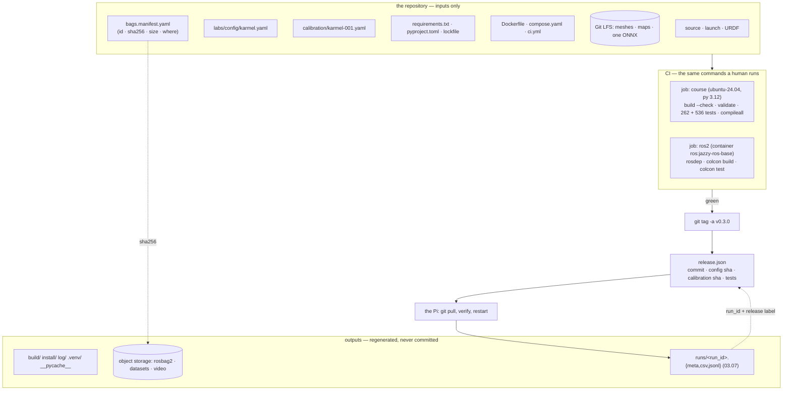

# 03.11 — Git workflow, CI and reproducibility for a robot repo

<!-- glance:start -->
<!-- generated by tools/build.py from curriculum/syllabus.yaml — edit the syllabus, not this block -->

| | |
|---|---|
| **Track** | Main path |
| **Difficulty** | Intermediate |
| **Time** | 50 min |
| **Hardware** | none |
| **Software** | git, docker |
| **Prerequisites** | [03.08 Testing robot software — unit, simulation and hardware-in-the-loop](03.08-testing-robot-software.md) |
| **Optional prerequisites** | [FL.11 Git for robotics: large files, bags and models](../optional-foundations/linux-and-tools/FL.11-git-for-robotics.md)<br>[FL.12 Docker for robotics: devices, GUIs and host networking](../optional-foundations/linux-and-tools/FL.12-docker-for-robotics.md) |
| **Skip if** | Your robot repo runs tests in CI in the same container you develop in. |

<!-- glance:end -->

## What you will learn

- Decide what belongs in a robot repository, what belongs in Git LFS, and what must never be committed.
- Read and extend this repository's CI so that every push proves the labs, the exercises and the ROS 2 workspace still build.
- Keep the container you develop in and the one CI runs in the same thing, and say what that buys.
- Record a release that ties code, environment, robot config and calibration together — and verify it weeks later.
- Answer "can we rebuild the robot that drove on Tuesday?" with a command instead of an argument.

## Why it matters

Everything in module 03 has been building one capability: the ability to explain, later, why the
robot did what it did. Configuration ([03.06](03.06-configuration-and-calibration.md)) pins the
numbers, telemetry ([03.07](03.07-logging-and-telemetry.md)) records the run, tests
([03.08](03.08-testing-robot-software.md)) prove the code still works. This lesson closes the loop:
the repository and the pipeline that make all of it *reproducible* rather than merely *recorded*.

A robot repository is not a web service repository. It mixes source, configuration that changes the
physical behaviour of a machine, calibration that belongs to one specific robot, build outputs from
two different build systems, and binaries — bags, meshes, maps, model weights — that are hundreds of
times larger than the code. Get the boundaries wrong and within a month you have a 4 GB clone, a
config that drifted between the simulator and the robot, and no way to tell which commit was on the
robot during the demo that worked.

And the deploy story is genuinely different. You cannot roll back a robot from a dashboard. The
"production environment" is a Raspberry Pi on a shelf that has been powered off for three weeks, on
a Wi-Fi network you do not control, and the person doing the deploy is you, over SSH, with the
battery at 40 %.

<!-- prereqs:start -->
## Prerequisites

You need these first:

- [03.08 Testing robot software — unit, simulation and hardware-in-the-loop](03.08-testing-robot-software.md)

### Optional prerequisite links

New to any of these? Take the foundation lesson first; skip it if you already know it.

- [FL.11 Git for robotics: large files, bags and models](../optional-foundations/linux-and-tools/FL.11-git-for-robotics.md)
- [FL.12 Docker for robotics: devices, GUIs and host networking](../optional-foundations/linux-and-tools/FL.12-docker-for-robotics.md)

Check your readiness: `python course.py why 03.11`
<!-- prereqs:end -->

## Concept

Reproducibility for a robot is three separate questions, and people usually only answer the first.

**1. Can you rebuild the software?** Git answers this — *if* nothing that matters lives outside it
and nothing generated lives inside it.

**2. Can you rebuild the environment it ran in?** Git does not answer this. A commit does not
pin numpy, or the ROS distro, or the version of `libstdc++` a plugin was compiled against. That is
what lockfiles ([03.02](03.02-environments-and-pinning.md)) and container images are for.

**3. Can you explain the robot's behaviour?** This needs the other two *plus* the config and
calibration that were loaded ([03.06](03.06-configuration-and-calibration.md)) and the telemetry
of the run itself ([03.07](03.07-logging-and-telemetry.md)). A commit hash alone tells you nothing
about whether the wheel radius was the measured one.

The organizing rule for the repository follows from those: **commit the inputs, never the
outputs.** Source, configuration, calibration, dependency declarations and lockfiles are inputs.
`build/`, `install/`, `__pycache__/`, `.venv/`, a rendered plot, a compiled URDF, a recorded bag are
outputs — regenerate them or store them somewhere that is not git.

The one case where people get this wrong in both directions at once is calibration. It *looks*
like an output (it came from a measurement) and it *is* an input (the software cannot run correctly
without it). It belongs in the repository, in its own file, with its provenance
([03.06](03.06-configuration-and-calibration.md)).

> [!TIP]
> **Ask your teacher:** "Walk me through `git status` on a robot repo after a day of work on the actual robot, and tell me for each file whether it is an input, an output, or evidence — and where each one should go."

## Technical explanation

### Level 1 — What goes where

| Thing | Where | Why |
|---|---|---|
| Source, launch files, URDF/xacro | **git** | it is the code |
| `labs/config/karmel.yaml` | **git** | it changes what the robot does ([03.06](03.06-configuration-and-calibration.md)) |
| Calibration overlay per robot | **git**, own file | an input with a date, a method and an owner |
| `requirements.txt`, `pyproject.toml`, a lockfile | **git** | the environment's declaration ([03.02](03.02-environments-and-pinning.md)) |
| `Dockerfile`, `compose.yaml`, CI workflow | **git** | the environment's *build* |
| Meshes (STL), a map PGM, a small reference bag, an ONNX model | **Git LFS** | needed with the code, too big for git objects |
| rosbag2 recordings, datasets, training checkpoints, video | **not git** — object storage, with a manifest in git | hundreds of MB to GB *per run* |
| `build/`, `install/`, `log/`, `.venv/`, `__pycache__/`, `*.egg-info` | **ignored** | outputs |
| Wi-Fi passwords, API keys, tokens | **never** | git remembers forever |

This repository's [`.gitignore`](../.gitignore) is worth reading as an example, because every rule
is a decision someone had to make:

```text
labs/ros2_ws/build/          # colcon outputs
labs/ros2_ws/install/
labs/ros2_ws/log/
*.db3                        # robot data: bags, models and video stay out of git
*.mcap
rosbag2_*/
*.pt  *.pth  *.onnx  *.engine  *.safetensors
datasets/  outputs/  wandb/
projects/evidence/**/*.mp4   # small evidence files are fine, large media is not
```

And [`.gitattributes`](../.gitattributes), which does a job people forget about entirely:

```text
* text=auto eol=lf           # LF in the repository, whatever your OS does locally
*.png binary                 # never "fix" line endings in a PNG
*.stl binary  *.3mf binary  *.uf2 binary
*.bat text eol=crlf          # ...except the files Windows genuinely needs CRLF in
*.pgm binary
```

On a project where the developer is on Windows and the robot is on Linux — which is *this* project —
that first line is not cosmetic. Without it, a shell script committed from Windows arrives on the Pi
with `\r` at the end of every line and fails with `bad interpreter: /bin/bash^M`.

### Level 2 — Large files: LFS, and when LFS is the wrong answer

Git stores a full copy of every version of every file, forever. A 200 MB bag recorded ten times is
2 GB in every clone, including on the Pi. Git LFS changes *where* the bytes live — the repository
stores a small pointer file and the content goes to an LFS server — but it does not change the
arithmetic: it is still a full copy per version, just somewhere else, and usually somewhere you pay
for.

```bash
git lfs install
git lfs track "*.stl" "*.onnx" "labs/ros2_ws/src/*/maps/*.pgm"
git add .gitattributes                 # tracking rules live here, so they must be committed
git add model.onnx && git commit -m "Add the detector"
git lfs ls-files                       # what is actually in LFS
cat model.onnx | head -3               # a pointer file if LFS is not installed: version/oid/size
```

That last line is the failure mode to recognize: a machine without `git-lfs` clones the repository
successfully and gets a 130-byte text file where the model should be. The program then fails with
something unhelpful, and the cause is three layers away.

**The decision, with numbers from [03.07](03.07-logging-and-telemetry.md):**

| Data | Size per run | Verdict |
|---|---|---|
| Telemetry CSV | 10 MB/hour | plain git is fine, and it compresses well |
| A 10-minute LiDAR bag | ~500 MB | **not git, not LFS** — object storage, manifest in git |
| A camera bag | GB per minute | never |
| Chassis meshes (STL) | 1–20 MB, rarely change | LFS |
| A map PGM | ~100 KB | plain git |
| An ONNX detector | 10–100 MB, changes rarely | LFS |
| A small reference bag used by a test | 5–20 MB | LFS, and only one |

For the "not git" row, commit a **manifest** instead — a small YAML or JSON listing each run's id,
its SHA-256, its size, where it lives and what it was for. Then `git log` still tells the story,
the bytes are wherever bytes are cheap, and a stale copy is detectable.

### Level 3 — CI that is worth having on a robot project

This repository's [`.github/workflows/ci.yml`](../.github/workflows/ci.yml) has two jobs. Read it
as a design, because every step answers a specific way a robot repository rots.

```yaml
jobs:
  course:
    runs-on: ubuntu-24.04          # the robot's OS, not "latest" (03.02)
    steps:
      - uses: actions/setup-python@v5
        with: { python-version: "3.12" }        # the robot's Python
      - run: pip install -r labs/requirements.txt && pip install -e labs/python
      - run: python tools/build.py --check      # generated files are up to date
      - run: python tools/validate.py --links --final --quiet
      - run: python course.py next && python course.py complete 00.01 && ...
      - run: pytest -q labs/python/tests        # 262 tests, ~53 s
      - run: COURSE_USE_SOLUTION=1 pytest -q labs/exercises   # 536 tests, ~157 s
      - run: python -m compileall -q labs/firmware/pico       # the firmware at least parses
  ros2:
    container: ros:jazzy-ros-base   # the same distro the robot runs
    steps:
      - run: rosdep install --from-paths labs/ros2_ws/src --ignore-src -y -r
      - run: colcon build && colcon test --packages-select karmel_base && colcon test-result --verbose
```

Six properties to copy:

1. **The runner matches the robot.** `ubuntu-24.04` and Python `3.12`, not `ubuntu-latest`. CI on a
   different platform than the robot tests a program you are not going to run.
2. **Generated files are checked, not trusted.** `tools/build.py --check` fails if a lesson's
   generated block is stale. The general rule: if you generate something into the repository,
   CI must verify it is current, or it will silently drift.
3. **Every layer of the test pyramid runs**, in increasing cost order
   ([03.08](03.08-testing-robot-software.md)) — and nothing needs hardware, because the simulator
   and the fake Pico stand in for it.
4. **The ROS job runs in the distro's own container.** `rosdep install` then `colcon build` is
   exactly what a human does, so a missing dependency in a `package.xml` fails here and not on the
   robot.
5. **The firmware is at least compiled.** `compileall` on MicroPython sources catches a syntax error
   before you flash it — the cheapest possible check for the layer that is hardest to debug.
6. **Every step is a command a human would run.** No CI-only scripts. When CI fails you reproduce
   it locally by copying one line.

What CI **cannot** do is drive the robot. The compensation is the fidelity ladder from
[03.05](03.05-hardware-abstraction.md): rungs 0–4 run in CI, and rung 5 is a human on a bench with
a checklist. Be explicit about that boundary rather than pretending green CI means the robot works.

**Keep CI and your development environment the same thing.** [`labs/docker/`](../labs/docker/README.md)
builds one image with two stages: `deps` (ROS + Gazebo + every apt package, used as the dev
container with the workspace bind-mounted) and `final` (`deps` plus a `colcon build` of the
workspace, used headless by the `ci` compose service). When your container and CI's are built from
the same Dockerfile, "works on my machine" stops being a sentence anyone can say.

### Level 4 — A release you can rebuild

Tagging a commit is necessary and not sufficient. The four things you need, and the command that
records them together:

```text
$ python 03-robot-software/code/l0311_release.py record --out release.json \
      --calibration calibration/karmel-001.yaml --tests '{"labs": "262 passed"}'
label        v0.3.0
recorded_at  2026-09-19T14:23:55+00:00
commit       b4ca564 on main  tag v0.3.0
describe     v0.3.0
python       3.12.3 on Linux aarch64
  labs/config/karmel.yaml            91ffaff5d7c3
  labs/requirements.txt              6e295133c37a
  labs/python/pyproject.toml         540047fd1d35
  .github/workflows/ci.yml           dbd7df02c271
  calibration calibration/karmel-001.yaml 921413f19e6b
tests        {'labs': '262 passed'}
```

Six weeks later, on the robot, the question "is this the release that worked?" is one command:

```text
$ python 03-robot-software/code/l0311_release.py verify release.json
3 difference(s) from the recorded release:
  git.commit      recorded 'b4ca564…'  now '9f21d0e…'
  git.dirty       recorded False  now 'True (2 files)'
  labs/config/karmel.yaml   recorded '91ffaff5d7c3'  now 'c81e728d9d4c'

A run made now would NOT be the recorded release. Check out the commit, or record a new one.
```

Three habits that make that work:

- **`--require-clean`.** A release recorded from a dirty working tree is not a release; the tool
  refuses and lists the files. On the robot, `git status --porcelain` being empty is the first thing
  to check before believing anything.
- **Annotated tags, with the calibration named in the message.** `git tag -a v0.3.0 -m "…, calibration karmel-001 2026-09-14"`.
  Lightweight tags carry no author, date or message; annotated ones are objects you can read later.
- **Put the release label in the run metadata.** The `RunContext` from
  [03.07](03.07-logging-and-telemetry.md) already records the commit and the config hash; add the
  release label and every plot is traceable to a release without anyone remembering anything.

**Branching.** Short-lived branches off `main`, merged when CI is green, is the right default for a
one- to five-person robot project — the same trunk-based workflow you already use. Two robotics
specifics: never merge a branch that changes `karmel.yaml` without saying which robot was
re-measured and when, and treat a change to the *protocol* ([01.10](../01-first-robot/01.10-pi-pico-protocol.md))
as a versioned interface — the firmware and the host are deployed separately, so they will be
mismatched for a while, and the `I <firmware> <protocol>` hello exists exactly so that mismatch is
detected rather than discovered at speed.

**Deploying.** For this robot, a deploy is `git pull && restart the service`, which is fine as long
as you can say which commit is on the robot. Put that in the health check: the bring-up script
prints the commit and the release label at startup, and refuses to start if the tree is dirty on a
robot marked "production" ([FL.06](../optional-foundations/linux-and-tools/FL.06-processes-systemd.md)
covers the systemd side). The heavier alternative — build a container image per release and pull it
— buys you the *environment* half of reproducibility too, and costs you a registry and a slower
edit-test cycle on the robot. Choose deliberately; the course's robot is small enough that
`git pull` plus a lockfile is the right trade.

## Diagram



The question this whole diagram exists to answer:

```text
"Can we rebuild the robot that drove on Tuesday?"

  1. which commit?          release.json → git checkout          ✓ git
  2. which packages?        lockfile / image digest              ✓ 03.02
  3. which wheel radius?    config sha + calibration sha         ✓ 03.06
  4. what did it do?        runs/<run_id>.telemetry.csv          ✓ 03.07
  5. did it pass?           tests recorded in release.json       ✓ 03.08

Miss any one of the five and the answer is "probably".
```

## Code

| File | What it shows | Run / read |
|---|---|---|
| [`.github/workflows/ci.yml`](../.github/workflows/ci.yml) | two jobs, every step a command a human would run | read it in full — it is 60 lines |
| [`03-robot-software/code/l0311_release.py`](code/l0311_release.py) | record and verify a release: code, environment, robot, evidence | `python 03-robot-software/code/l0311_release.py record --out release.json` |
| [`.gitignore`](../.gitignore) and [`.gitattributes`](../.gitattributes) | the input/output boundary, and line endings across Windows and the Pi | read both |
| [`labs/docker/README.md`](../labs/docker/README.md) | one image for development and CI; the DDS/networking warnings | read "Build" and "Headless mode and CI" |
| [`labs/ros2_ws/check_config_sync.py`](../labs/ros2_ws/check_config_sync.py) | making an unavoidable duplicate checkable in CI | `python labs/ros2_ws/check_config_sync.py` |

The part of the release tool that carries the lesson is the comparison — it reports what *changed*,
not merely that something did:

```python
def compare(recorded: dict[str, Any], root: Path = REPO_ROOT) -> list[Difference]:
    """What changed between a recorded release and the tree in front of you, most important first."""
    differences: list[Difference] = []
    state = asdict(git_state(root))
    for key in ("commit", "branch", "tag"):
        if recorded.get("git", {}).get(key) != state.get(key):
            differences.append(Difference(f"git.{key}", recorded.get("git", {}).get(key), state.get(key)))
    if state["dirty"] and not recorded.get("git", {}).get("dirty"):
        differences.append(Difference("git.dirty", False, f"True ({len(state['dirty_files'])} files)"))
    for name, digest in recorded.get("files", {}).items():
        current = file_sha256(root / name)
        if current != digest:
            differences.append(Difference(name, digest[:12], current[:12]))
    ...
```

And one three-line comment in that file is worth more than the rest of it, because it is a bug that
will find you too:

```python
    # rstrip only: `git status --porcelain` puts the status in the FIRST TWO COLUMNS, so a
    # leading space is data (" M path" = modified, not staged). A .strip() here eats it and
    # every path you parse afterwards is missing its first character.
    return result.stdout.rstrip() if result.returncode == 0 else None
```

Tests (no hardware, ~10 s, each one builds its own throwaway repository):
`python -m pytest 03-robot-software/code/test_l0311_release.py`

## Exercise

### Exercise 03.11-E1 — Audit the boundary `[design]`

Hardware: none.

1. Run `git status --porcelain --ignored | head -40` in this repository. For each ignored entry,
   say which rule in `.gitignore` matched (`git check-ignore -v <path>` tells you) and whether it
   is an output, data or a secret.
2. `git ls-files | wc -l` and `git count-objects -vH`. How many files, how big is the history?
3. Find the five largest tracked files (`git ls-files -z | xargs -0 ls -l | sort -k5 -n -r | head -5`).
   For each: should it be in plain git, in LFS, or not in the repository at all? Justify with the
   size *and* the change frequency.
4. Delete `.gitattributes` in a scratch clone, commit a shell script from Windows, check it out on
   Linux (or in a container) and run it. What happens, and which line of `.gitattributes` prevents it?

### Exercise 03.11-E2 — Record and verify a release `[coding]`

Hardware: none.

1. `python 03-robot-software/code/l0311_release.py record --out /tmp/release.json`. Read every
   field and say what question it answers.
2. Change one value in `labs/config/karmel.yaml`, then run `verify`. What does it report, and what
   is the exit code?
3. Revert, commit something unrelated, and `verify` again. What changed now?
4. Try `record --require-clean` on a dirty tree. Why is refusing the right behaviour?
5. Add one field of your own to the record that you would actually want six weeks later — and argue
   why it is worth the bytes.

### Exercise 03.11-E3 — Make CI fail on purpose `[debugging]`

Hardware: none. Work on a branch; do not push broken commits to `main`.

For each, predict which CI step fails and what the message will look like, then run that step
locally to confirm:

1. Add a link to a lesson that points at a file that does not exist.
2. Change a lesson's title in `curriculum/syllabus.yaml` without running `python tools/build.py`.
3. Break one assertion in `labs/python/tests/test_geometry.py`.
4. Add a dependency to a ROS package's code without adding it to its `package.xml`.
5. Edit `labs/config/karmel.yaml` without updating `karmel_description`'s copy.
6. Introduce a syntax error into `labs/firmware/pico/motors.py`.

Then: which of the six would a human plausibly ship without CI, and which would be caught
immediately anyway? That difference is what CI is *for*.

### Exercise 03.11-E4 — Put a bag where bags belong `[coding]`

Hardware: none (use any file over 50 MB as a stand-in, or a recorded run from
[03.07](03.07-logging-and-telemetry.md)).

1. In a scratch clone, commit a 50 MB file directly. Measure the clone size before and after, and
   again after you delete the file in a later commit. Explain the second measurement.
2. Now do it with Git LFS: `git lfs install`, `git lfs track`, commit, and inspect the pointer file
   with `cat`. What does a machine *without* git-lfs get when it clones?
3. Design the third option: a `bags.manifest.yaml` with id, SHA-256, size, storage location and a
   one-line description per run, plus a tiny `fetch_bag.py` that verifies the hash after download.
   Write the manifest for two runs.
4. State the rule you would put in your team's README: which of the three for which kind of file.

### Exercise 03.11-E5 — Deploy and prove it `[hardware]`

Hardware: `robot-base` (the Pi; nothing has to move).

> [!CAUTION]
> **Safety:** if any step starts a service that can command the motors, do it with the wheels off
> the ground and a hand on the power switch ([SAFETY.md](../SAFETY.md)).

1. Tag a release: `git tag -a v0.1-karmel -m "…, calibration karmel-001 2026-09-14"` and push it.
2. On the Pi: pull, then run `l0311_release.py verify` against the release record you created on
   your laptop. Make the differences go to zero.
3. Record a short run ([03.07](03.07-logging-and-telemetry.md)) and confirm its metadata names the
   same commit and config hash as the release.
4. Now break it: edit one file on the Pi directly (as everyone does at 1 a.m.), re-run `verify`, and
   see it caught. Then decide what your bring-up script should do about a dirty tree on a robot.
5. Write the five-line "deploy" section of your robot's README, including how someone else would
   find out what is currently running.

## Expected result

**03.11-E1:** The ignored list is dominated by `__pycache__/`, `.pytest_cache/`, colcon `build/
install/ log/` and any local venv — all outputs. This repository tracks about 950 files; the
largest tracked ones are a few simulation `.pkl` fixtures at ~1.5 MB and a PNG at ~0.6 MB, which
are fine in plain git because they are small *and* they change rarely. Without `.gitattributes`,
a script committed from Windows arrives with CRLF line endings and the Pi reports
`bad interpreter: /bin/bash^M`; `* text=auto eol=lf` is the line that prevents it, and `*.png binary`
(and friends) stop git from "fixing" line endings inside binary files.

**03.11-E2:** The record answers: *which code* (commit, branch, tag, describe, dirty), *which
environment* (requirements and pyproject hashes, Python version, platform), *which robot* (config
and calibration hashes) and *what passed* (the tests field). A changed config produces
`labs/config/karmel.yaml recorded 91ffaff5d7c3 now …` plus `git.dirty recorded False now True`, and
exit code **1**. An unrelated commit produces `git.commit` alone — which is exactly the useful
distinction: the code moved, the robot's numbers did not. `--require-clean` refuses because a
release from a dirty tree cannot be checked out again; the tool prints the offending files and
writes nothing.

**03.11-E3:** (1) `tools/validate.py --links` — it names the lesson and the broken target. (2)
`tools/build.py --check` — the generated glance block no longer matches the syllabus. (3)
`pytest -q labs/python/tests`. (4) The `ros2` job's `rosdep install` succeeds but `colcon build`
or `colcon test` fails at import/link time — the dependency exists on your machine and not in a
clean container, which is precisely why that job uses one. (5) `check_config_sync.py`, with a diff
of the drifted keys. (6) `python -m compileall -q labs/firmware/pico`. The ones a human would ship
without noticing are (1), (2), (4) and (5) — all invisible locally, all caught in seconds by CI.
(3) and (6) you would hit within a minute anyway.

**03.11-E4:** Committing 50 MB grows the clone by roughly 50 MB; deleting it in a later commit
changes nothing, because the object is still in the history forever — that measurement is the whole
argument. With LFS the working tree has the file but the repository stores a ~130-byte pointer
(`version https://git-lfs.github.com/spec/v1`, `oid sha256:…`, `size …`), and a machine without
git-lfs installed clones successfully and gets that text file, which then fails somewhere
confusing. A good README rule: plain git under ~5 MB and rarely changing; LFS for binaries you must
have alongside the code; an external store plus a hashed manifest for anything recorded per run.

**03.11-E5:** After `git pull` on the Pi, `verify` should print `MATCH`. If it does not, the usual
causes are a local edit made during debugging and an untracked file created by a script — both
exactly what you want to find. The run metadata's `git_commit` must equal the release's short
commit and its `config_sha256` must match the first 16 hex digits of the release's config hash. A
sensible bring-up policy: warn loudly on a dirty tree, refuse to start on a robot flagged
`production`, and always print the release label and commit at startup so the answer to "what is
running?" is in the first line of the log.

## Troubleshooting

### Symptom: the clone takes ten minutes and fills the Pi's SD card

Something large is in the history. `git count-objects -vH` for the size, then find the culprits:
`git rev-list --objects --all | git cat-file --batch-check='%(objecttype) %(objectname) %(objectsize) %(rest)' | sort -k3 -n -r | head`.
Removing it from *history* means rewriting it (`git filter-repo`) and everyone re-cloning — which is
why the `.gitignore` rules exist before the first bag is recorded. For the Pi right now:
`git clone --depth 1` gets you working today.

### Symptom: CI fails, and you cannot reproduce it locally

Compare the three things that differ: the OS and Python version (CI pins `ubuntu-24.04` and 3.12 —
does your machine match?), the packages (`l0302_env_report.py` on both, from
[03.02](03.02-environments-and-pinning.md)), and the *state* (CI clones fresh, so an untracked file
you rely on does not exist there — `git status --ignored`, and try in a clean clone). If the failing
job is the ROS one, run it locally in the same container:
`docker run --rm --network none --name m03-ci -v "$PWD:/repo" -w /repo ros:jazzy-ros-base bash`.

### Symptom: a file is in the repository but arrives empty or as a pointer

Git LFS is not installed on that machine, or the LFS objects were not fetched. `git lfs install`
then `git lfs pull`. Recognize the shape: a three-line text file starting with
`version https://git-lfs.github.com/spec/v1`. Add a check to your bring-up script for any LFS file
the robot actually needs.

### Symptom: "it worked on the robot last week" and nobody knows what changed

This is the lesson's entire subject. If you have a release record, `verify` answers it. If you do
not: `git log --since='2 weeks ago' -- labs/config/ calibration/` first (the numbers change
behaviour most sharply), then `git log` on the code, then check whether the *environment* changed
(an `apt upgrade` on the Pi is invisible to git — which is the argument for pinning it too). Then
start recording releases.

### Symptom: `bad interpreter: /bin/bash^M` on the Pi

CRLF line endings from a Windows commit. `.gitattributes` with `* text=auto eol=lf` prevents it;
`git add --renormalize .` fixes files already committed wrongly. Verify with
`file script.sh` or `cat -A script.sh | head`.

### Symptom: CI is green and the robot does not work

Expected, sometimes — CI cannot test electricity, friction or your floor. Check what rung the bug
lives at ([03.08](03.08-testing-robot-software.md)), and then ask the more useful question: *should*
a cheaper rung have caught it? If yes, add that test. If no, add it to the bring-up checklist that
the human runs, and make the checklist part of the repository.

## Common mistakes

- **Committing outputs.** `build/`, `install/`, `.venv/`, `__pycache__`, rendered plots. They create
  conflicts, bloat and confusion, and they are regenerable by definition.
- **Committing bags.** One recorded run can be larger than the entire history of the code, and git
  keeps it forever even after you delete it.
- **Treating LFS as "git for big files".** It is a different storage location, not different
  arithmetic. Per-run data still does not belong in version control.
- **No `.gitattributes` on a mixed Windows/Linux project.** You will lose an evening to `^M`.
- **Committing calibration into the shared config file.** Every robot's file then conflicts with
  every other's ([03.06](03.06-configuration-and-calibration.md)).
- **`ubuntu-latest` in CI.** The day it moves to the next LTS, CI tests a platform your robot is not.
- **CI-only scripts.** When CI fails you should be able to copy one line and run it.
- **Tagging without recording the environment.** A tag pins your code and nothing else.
- **Editing directly on the robot and not telling anyone.** Make the bring-up script print the
  commit and complain about a dirty tree, so the robot tells on itself.
- **Secrets in the repository.** Rotate them; do not merely delete them. Git remembers.

## Knowledge check

1. Why is `python tools/build.py --check` a CI step, when the generated blocks are committed anyway?
   <details><summary>Answer</summary>

   Because generated files committed into a repository drift silently. Someone edits
   `curriculum/syllabus.yaml`, forgets to regenerate, and from then on the lesson's prerequisite
   table describes a syllabus that no longer exists — with nothing failing anywhere. The general
   rule: **anything generated into the repository must be verified by CI**, or do not commit it at
   all. The same logic puts `check_config_sync.py` in the pipeline.
   </details>

2. You record 20 rosbags of 400 MB each during a week of testing. Where do they go, and what goes in git?
   <details><summary>Answer</summary>

   8 GB — not git, and not LFS either, because both store every version forever and neither is
   cheap at that scale. They go to object storage (S3, a NAS, an external drive with an index), and
   git gets a **manifest**: one entry per bag with an id, SHA-256, size, location, date, the robot
   and the release it was recorded with. `git log` then still tells the story, the bytes live
   somewhere appropriate, and a corrupted or stale copy is detectable because you recorded the hash.
   </details>

3. Your CI is green. Name three classes of failure it cannot catch for a robot, and what you do instead.
   <details><summary>Answer</summary>

   (a) Physical and electrical: friction, brownouts, EMI, a loose connector — a bench checklist and
   rung-5 hardware tests ([03.08](03.08-testing-robot-software.md)). (b) Real-time behaviour on the
   target: CI's runner is not a Pi 5, so jitter, GC pauses and SD-card stalls only show up there —
   measure on the robot ([03.04](03.04-timing-and-concurrency.md)). (c) Environment drift on the
   robot itself: an `apt upgrade` on the Pi is invisible to git — pin it, or record the environment
   in the release and verify it at bring-up.
   </details>

4. Predict: you `git rm` a 300 MB file you committed last month and push. What happens to the clone size?
   <details><summary>Answer</summary>

   Nothing. The blob is still in the history, reachable from the old commit, so every clone still
   downloads it. Only rewriting history (`git filter-repo`) removes it, and that changes every
   commit hash after it, so everyone must re-clone and any open branch has to be rebased. This
   asymmetry — cheap to add, expensive to remove — is why the `.gitignore` rules for `*.mcap`,
   `*.db3` and `*.onnx` exist *before* anyone records a bag.
   </details>

5. What does a release record give you that an annotated git tag does not?
   <details><summary>Answer</summary>

   A tag pins the code. The record additionally pins the *environment* (the hashes of the dependency
   declarations, the Python version, the platform), the *robot* (the config hash and the calibration
   overlay hash — which robot, measured when), and the *evidence* (which tests passed at that
   moment). It is also **verifiable**: one command tells you whether the tree in front of you is
   that release, and names every difference if it is not. A tag can only tell you whether you have
   checked it out.
   </details>

6. Your teammate wants CI to run `ubuntu-latest` "so we stay current". Respond.
   <details><summary>Answer</summary>

   The robot runs Ubuntu 24.04 with Python 3.12 and ROS 2 Jazzy, and CI's job is to test *that*
   program. `ubuntu-latest` silently moves to the next LTS one morning, and from then on green CI
   means "it works on a platform we do not ship". Pin `ubuntu-24.04`, and when you want to know
   whether the next release will work, add a **second, non-blocking** job on it — that is the
   version of "staying current" that gives information without lying about the one that matters.
   </details>

7. A run's plot looks wrong and you want to know what produced it. Walk through what you consult, in order.
   <details><summary>Answer</summary>

   (1) The run's metadata sidecar ([03.07](03.07-logging-and-telemetry.md)) — run id, git commit,
   dirty flag, config hash, release label. (2) `git show <commit>` and `git log` around it: was it
   even a clean tree? (3) The config and calibration hashes against the release record: was the
   robot running the measured wheel radius or the nominal one
   ([03.06](03.06-configuration-and-calibration.md))? (4) The events file for what the robot
   *reported* during the run — watchdog episodes, gaps, warnings. (5) Only then the telemetry
   itself. Four of those five are things you had to set up *before* the run, which is why this is
   the last lesson of the module and not an afterthought.
   </details>

## Practical challenge

**Make your robot able to say what it is.**

Build the loop that closes this module, for your own fork:

1. A `scripts/release.py` (or extend `l0311_release.py`) that records code, environment, robot and
   evidence — including a lockfile hash from [03.02](03.02-environments-and-pinning.md) and the
   calibration overlay from [03.06](03.06-configuration-and-calibration.md) — and refuses a dirty tree.
2. A CI workflow of your own that runs on `ubuntu-24.04` with your robot's Python, runs your tests
   in pyramid order, checks that anything generated is current, and — on a tag — records a release
   record as a build artifact.
3. A `scripts/bringup.sh` on the robot that verifies the release before starting anything, prints
   the label, commit and calibration date in its first log line, and refuses to start with a dirty
   tree unless `--allow-dirty` is passed.
4. Every recorded run ([03.07](03.07-logging-and-telemetry.md)) carries the release label, so any
   plot can be traced back without anyone remembering anything.
5. A `bags.manifest.yaml` plus a fetch script with hash verification, for the data that does not
   belong in git.

Acceptance criteria:
- Hand someone a single run directory and they can tell you the commit, the environment, the robot's
  calibration and which tests passed — without access to your machine.
- Deliberately corrupt each of those four in turn, and show that `verify` names the right one.
- A fresh clone plus your bootstrap script plus `bringup.sh --dry-run` works on a machine that has
  never seen the project, and takes under fifteen minutes.
- CI is green on `main`, and you can point at the step that would have caught each of the six
  failures from Exercise 03.11-E3.

## You can skip this if…

Answer knowledge-check questions 1, 4 and 6 correctly without looking, and show a robot repository
of yours where CI runs the tests in the same container or platform you develop and deploy on, no
generated file or recorded bag is committed, and you can name — from a command, not from memory —
the commit, config and calibration that were on the robot during a specific run last month.

`python course.py skip 03.11 --reason "My robot repo runs its tests in CI in the same container I develop in, and releases are verifiable"`

## Go deeper

- Pro Git (Chacon & Straub), free online: https://git-scm.com/book/en/v2 — chapters 3, 7 and 10; the "Git Internals" chapter is what makes the "you cannot delete a blob" answer obvious.
- Git LFS: https://git-lfs.com/ — installation, `track`, and the pointer-file format you will one day have to recognize.
- git-filter-repo: https://github.com/newren/git-filter-repo — the supported way to remove something from history, for the day you need it.
- GitHub Actions documentation: https://docs.github.com/en/actions — workflow syntax, matrices, caching, artifacts.
- Docker build cache: https://docs.docker.com/build/cache/ — why the order of lines in `labs/docker/Dockerfile` matters, and how to keep CI fast.
- ROS 2, testing tutorials (Jazzy): https://docs.ros.org/en/jazzy/Tutorials/Intermediate/Testing/Testing-Main.html — `colcon test` and what the `ros2` CI job is actually doing.
- Python Packaging User Guide: https://packaging.python.org/ — for the lockfile and packaging half of reproducibility.
- [FL.11 Git for robotics](../optional-foundations/linux-and-tools/FL.11-git-for-robotics.md) — `.gitignore`/`.gitattributes` in depth, LFS mechanics, `vcstool` for multi-repository workspaces.
- [FL.12 Docker for robotics](../optional-foundations/linux-and-tools/FL.12-docker-for-robotics.md) — devices, GUIs, host networking, and the arm64 story for the Pi.

## Progress checkpoint

- [ ] I can say, for any file in a robot repo, whether it is an input, an output, data or a secret.
- [ ] My CI runs on the platform the robot runs, with every test level and every generated file checked.
- [ ] I develop in the same container CI uses.
- [ ] I can record a release that pins code, environment, robot config and calibration — and verify it later.
- [ ] I can answer "what was running on the robot during that run?" with a command.

`python course.py complete 03.11` (exercises done) · `python course.py master 03.11`
(challenge done) · `python course.py struggle 03.11 "what was hard"`

Next: module [04 — ROS 2](../04-ros2/04.01-why-middleware.md). Everything you built in this module —
the interface, the config, the telemetry, the tests, the pipeline — is about to be wrapped in a
middleware, and you will recognize every piece of it.
