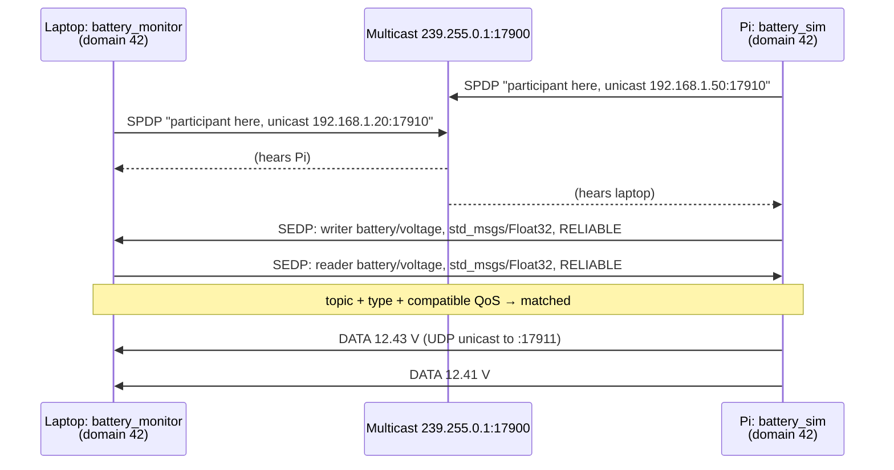
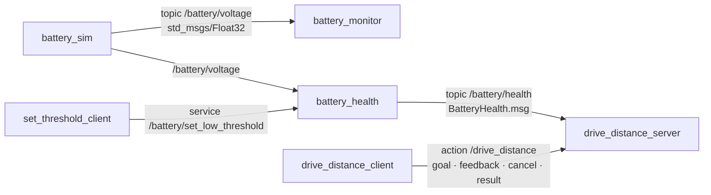

# 04.01 — Why middleware? ROS 2 through a distributed-systems lens

<!-- glance:start -->
<!-- generated by tools/build.py from curriculum/syllabus.yaml — edit the syllabus, not this block -->

| | |
|---|---|
| **Track** | Main path |
| **Difficulty** | Beginner |
| **Time** | 45 min |
| **Hardware** | none |
| **Software** | none |
| **Prerequisites** | [00.05 ROS 2 and robot middleware in one page](../00-orientation/00.05-ros2-in-one-page.md)<br>[03.04 Loops, timing and concurrency — threads, asyncio, processes](../03-robot-software/03.04-timing-and-concurrency.md) |
| **Skip if** | You can compare ROS 2 topics/services/actions to Kafka, gRPC and long-running jobs. |

<!-- glance:end -->

## What you will learn

- Explain why a small robot is best built as a distributed system of processes rather than one program.
- Map ROS 2 topics, services and actions to Kafka-style pub/sub, gRPC request/response and long-running job APIs, and name exactly where each analogy breaks.
- Describe the ROS 2 stack (rclpy → rcl → RMW → DDS → RTPS/UDP) and what "changing the RMW" means.
- Explain peer-to-peer discovery, `ROS_DOMAIN_ID`, and compute the UDP ports a domain uses.
- Pick the right communication pattern and a first QoS intent for each data flow on karmel.

## Why it matters

Look at the data flowing through karmel once it is finished: the Pico streams wheel telemetry at
50 Hz, the LiDAR sends 360 ranges at 10 Hz, the camera produces 640×480 frames at 30 fps, the
base driver needs `cmd_vel` at ~20 Hz or its watchdog stops the motors, the battery reports every
half second, a planner computes paths, and an LLM-driven task layer says "go to the kitchen" and
waits minutes for the outcome. Some of these run on the Raspberry Pi, some on your laptop over
Wi-Fi, later some on a Jetson.

You could write this as one Python program with threads. It works for a week. Then the camera
driver segfaults and takes the motor watchdog down with it, you can't reuse
[Nav2](https://docs.nav2.org/) or `slam_toolbox` because they expect a standard interface, and you
can't record the sensor data to replay a bug. ROS 2 is the middleware that lets
each concern be its own process, with typed messages, discovery, recording, introspection and a
huge ecosystem of drivers and algorithms that already speak it. You already know most of the ideas
from distributed systems. This lesson tells you which intuitions carry over and which will hurt you.

<!-- prereqs:start -->
## Prerequisites

You need these first:

- [00.05 ROS 2 and robot middleware in one page](../00-orientation/00.05-ros2-in-one-page.md)
- [03.04 Loops, timing and concurrency — threads, asyncio, processes](../03-robot-software/03.04-timing-and-concurrency.md)

### Optional prerequisite links

None.

Check your readiness: `python course.py why 04.01`
<!-- prereqs:end -->

## Concept

A robot is **a small distributed system in a box, on a flaky network, with deadlines, where a bug
moves physical mass**.

ROS 2 gives you five building blocks. Every ROS program you will ever read is a combination of them:

| ROS 2 concept | What it is | Closest thing you know | Where the analogy breaks |
|---|---|---|---|
| **Node** | A named participant in the system, usually one per process | A microservice | Many nodes can share one process. Nodes are cheap: a driver, a filter and a planner are all nodes. |
| **Topic** | Named, typed, many-to-many stream of messages | A Kafka topic, Azure Service Bus topic, Redis pub/sub | **No broker, no log, no offsets, no consumer groups.** Messages go straight from publisher to subscriber. A subscriber that wasn't there when the message was sent never sees it (unless QoS says to keep the last N). |
| **Service** | Typed request → single response | A gRPC unary call, an HTTP POST | No built-in deadline, no retries, no load balancing, no status codes. Meant for **fast** calls (milliseconds). |
| **Action** | A goal that runs for a long time, streams feedback and can be cancelled | A job API: `POST /jobs` → 202 + job id, progress over SignalR/WebSocket, `DELETE /jobs/{id}` | Built from topics + services underneath. The server decides whether to accept a goal and whether to honor a cancel. |
| **Parameter** | Named config value owned by a node, changeable at runtime | `IOptionsMonitor<T>` with a reload hook | Lives inside the node process. There is no central config server. |

The story of one command, "drive 1 m forward", on karmel:

1. A task node sends a `drive_distance` **action** goal. The driver node accepts it and returns a goal id.
2. While driving, the driver publishes **feedback** ("0.35 m done") and the task node shows progress.
3. Every 50 ms the driver publishes a velocity command on the `cmd_vel` **topic**. The base node forwards it to the Pico.
4. The base node publishes wheel odometry and battery voltage on **topics**. Nobody asked for them. Whoever cares subscribes.
5. Halfway, someone calls a **service** to lower the low-battery threshold. It returns in a millisecond.
6. The user presses Stop. The task node **cancels** the goal and the driver stops the wheels.

You will build a simulated version of exactly this, step by step, in lessons 04.04 to 04.08.

> [!TIP]
> **Ask your teacher:** "I know Kafka and gRPC well. Give me three failure scenarios where treating a ROS 2 topic like a Kafka topic or a ROS 2 service like a gRPC call would break a robot, and what I should do instead."

## Technical explanation

### Level 1 — The ROS graph

At runtime, a ROS 2 system is a **graph**: nodes are vertices, and topics, services and actions are
the edges between them. There is no central registry process. (ROS 1 had a `roscore` master. It was a single
point of failure and one of the main reasons ROS 2 exists.) Every node discovers the others itself.
The `ros2` CLI you will use in [04.03](04.03-nodes-and-cli.md) is just another participant that
joins the graph and looks around.

### Level 2 — Practical: what's different from your cloud systems

**1. No broker.** In Kafka, producers write to a broker, the broker persists, and consumers pull
at their own pace with offsets. In ROS 2 (on DDS, the default), the publisher sends UDP datagrams, or
shared memory on the same host, *directly* to every matched subscriber. Consequences:

- Nothing is stored. There is no replay unless you record with rosbag2 ([04.14](04.14-rosbag2.md)).
- A slow subscriber doesn't slow the publisher down. It loses old messages from its queue instead.
- No consumer groups: three subscribers on `/scan` all get every message. If you want work sharing, you build it.
- No broker also means no broker outage. Two nodes on the Pi keep talking when your Wi-Fi drops.

**2. QoS instead of delivery guarantees.** Every publisher and subscription has a Quality of
Service profile ([04.11](04.11-qos.md) covers it in depth):

| QoS policy | Values | What it really means |
|---|---|---|
| History + depth | `KEEP_LAST n` / `KEEP_ALL` | Size of the in-memory queue on each side. Default depth in most examples: 10. |
| Reliability | `RELIABLE` / `BEST_EFFORT` | RELIABLE retransmits lost samples **that are still in the history queue, while both sides are alive**. It isn't "acks=all, persisted". |
| Durability | `VOLATILE` / `TRANSIENT_LOCAL` | TRANSIENT_LOCAL: a late-joining subscriber gets the last *depth* samples, as long as the publisher is still running. It's in-memory only. |
| Deadline, liveliness, lifespan | durations | "I expect a message at least every 100 ms", "tell me when the writer dies", "drop samples older than X". |

Robot data is mostly **latest-value-wins**. A LiDAR scan from 300 ms ago is worse than useless
for obstacle avoidance, so sensor streams use `BEST_EFFORT` with a small depth. A map published once
uses `RELIABLE` + `TRANSIENT_LOCAL`, so RViz started later still gets it. A publisher and subscription whose
QoS are incompatible (for example, a best-effort publisher and a reliable subscription) **silently don't
connect**. That's the number-one "my subscriber receives nothing" bug.

**3. Services are for fast calls.** Services in ROS 2 have no timeout of their own. If the server dies mid-call,
the client's future simply never completes, so the client must enforce its own deadline. The
default Python executor runs callbacks on one thread. A service handler that takes 5 s blocks every other callback in
that node (timers, subscriptions) for 5 s, and a synchronous call made *from inside a callback*
deadlocks. You will reproduce that deadlock in [04.07](04.07-services.md). Anything slow, or anything
the caller may want to cancel, is an action.

**4. Actions = job API.** An action is exactly the long-running-job pattern you know: submit →
accepted/rejected + id → progress stream → final result with a status (SUCCEEDED, CANCELED, ABORTED),
with cancellation as a *request* the server may refuse. Under the hood, an action named
`drive_distance` is three services (`send_goal`, `cancel_goal`, `get_result`) and two topics
(`feedback`, `status`) under the hidden namespace `/drive_distance/_action/`.

**5. Interfaces = IDL, like protobuf, but stricter and less forgiving.** Messages are defined in
`.msg`/`.srv`/`.action` files and compiled to Python/C++ classes ([04.06](04.06-messages-and-custom-interfaces.md)).
Unlike protobuf there are **no field numbers**: the wire format is CDR, fields are serialized in
declaration order. Reordering fields between two builds silently corrupts data. Protobuf's schema evolution
rules don't exist here. You will see this happen for real in 04.06.

**6. The network is assumed local.** DDS was designed for LANs: ships, factories, cars. Discovery
uses UDP multicast, which most home routers pass on a single Wi-Fi subnet but VPNs, cloud VMs,
corporate networks and Docker's default NAT do not. ROS 2 isn't meant to talk across the internet
out of the box. That's a job for a bridge (Zenoh, a VPN with static peers, or a web bridge).

**7. Time is a first-class problem.** Messages carry timestamps (`header.stamp`), transforms are
looked up "at time t", and clocks on the Pi and laptop must be synchronized
([03.10](../03-robot-software/03.10-networking-for-robots.md)). In simulation, time comes from the
simulator (`use_sim_time`), not the wall clock.

### Level 2 — The stack: what "ROS 2 on DDS" means

```text
 your code          rclpy (Python)            rclcpp (C++)
                          \                      /
 client library core          rcl  (C: nodes, topics, services, actions, params, time)
                                 |
 middleware interface           rmw  (C API every middleware must implement)
                                 |
 RMW implementation   rmw_fastrtps_cpp (default)  |  rmw_cyclonedds_cpp  |  rmw_zenoh_cpp
                                 |
 middleware            eProsima Fast DDS          |  Eclipse Cyclone DDS |  Zenoh
                                 |
 wire                  RTPS over UDP (shared memory on the same host)    |  Zenoh protocol over TCP/UDP
```

- **DDS** (Data Distribution Service) is an OMG standard for typed, brokerless pub/sub with QoS.
  **RTPS** is its wire protocol. Several vendors implement it.
- **RMW** ("ROS middleware") is ROS 2's abstraction layer, like a repository interface with
  several implementations. Switching middleware is an environment variable, not a code change:
  `RMW_IMPLEMENTATION=rmw_cyclonedds_cpp ros2 run ...`. Nodes on different RMWs usually cannot talk
  to each other, so every process in the system must use the same RMW.
- On Jazzy the default is **Fast DDS** (`rmw_fastrtps_cpp`). Cyclone DDS ships in the binaries.
  **Zenoh** (`rmw_zenoh_cpp`) is a newer, non-DDS RMW that uses a router for discovery, which
  behaves much better over Wi-Fi and across networks. It's available on Jazzy and became a Tier 1
  RMW in the next distro, Kilted. This course uses the default and mentions Zenoh where it solves a real problem.
- Topic names are mangled into DDS names: ROS topic `/battery/voltage` becomes DDS topic
  `rt/battery/voltage`. A service uses a request and a reply topic (`rq/…Request`, `rr/…Reply`). You
  rarely see this, but it explains why Wireshark shows "topics" for your services.

### Level 2 — Discovery: how nodes find each other without a registry

1. **Participant discovery (SPDP).** Each ROS process creates a DDS *participant* that periodically
   announces itself ("I exist, here are my unicast locators") to the multicast group `239.255.0.1`
   on a port derived from the domain ID.
2. **Endpoint discovery (SEDP).** Participants that heard each other exchange their lists of
   publishers and subscriptions over unicast: topic name, type name, type hash, QoS.
3. **Matching.** A publisher and a subscription match when topic name and type are the same **and** QoS is compatible.
4. **Data.** Samples flow directly between matched endpoints, over UDP unicast or shared memory.

`ROS_DOMAIN_ID` (default `0`) selects a separate logical network: participants in different domains
use different ports and never see each other. The simplest way to avoid talking to your colleague's
robot on the same Wi-Fi is to both pick different domain IDs. `ROS_AUTOMATIC_DISCOVERY_RANGE`
(`SUBNET` by default, or `LOCALHOST`, `OFF`) limits how far discovery reaches, and `ROS_STATIC_PEERS`
lists hosts to contact directly when multicast doesn't work. These replaced `ROS_LOCALHOST_ONLY`,
which was deprecated in Iron. You will still see it in old tutorials.

A real example from writing this course: while the author tested the lesson code in Docker, the
`ros2 service list` output suddenly contained `/battery/get_status` and `/supervisor/...`. Those
services came from a *different* container, started by someone else, sitting on the same Docker bridge network in domain 0.
Nothing was misconfigured. That's DDS discovery working as designed. The fix was `ROS_DOMAIN_ID=57`.

### Level 3 — Mathematics: the ports a domain uses

The RTPS specification derives ports from the domain ID $d$ and participant index $p$ (0 for the
first ROS process on the host, 1 for the second…), with defaults $PB = 7400$, $DG = 250$, $PG = 2$:

$$\text{discovery multicast} = PB + DG \cdot d$$
$$\text{discovery unicast}(p) = PB + DG \cdot d + 10 + PG \cdot p$$
$$\text{data unicast}(p) = PB + DG \cdot d + 11 + PG \cdot p$$

**Worked example, domain 42, third ROS process on the Pi ($p = 2$):**

- discovery multicast $= 7400 + 250 \cdot 42 = 7400 + 10500 = 17900$
- discovery unicast $= 17900 + 10 + 2 \cdot 2 = 17914$
- data unicast $= 17900 + 11 + 4 = 17915$

Each domain gets a block of 250 ports. Each participant uses 2 of them, so after
$(250 - 10)/2 = 120$ processes on one host, domain 42's ports spill into domain 43's block. Since UDP ports
stop at 65535, the largest domain whose first participant fits is $d = 232$: $7400 + 250 \cdot 232 + 11 = 65411$.
On Linux the ephemeral port range 32768–60999 overlaps domains 102–214, which is why the ROS docs
recommend **0–101**.

### Level 4 — Implementation: choosing a pattern for a data flow

A decision procedure you can apply to every interface you design:

1. Is it a continuous stream of *state* or *measurements* (sensor data, odometry, battery)? → **topic**.
   Ask: "does a late subscriber need the last value?" (TRANSIENT_LOCAL) and "is an old sample worse than a lost one?" (BEST_EFFORT).
2. Is it a question or a quick command that finishes in milliseconds and must return an answer
   (set a threshold, reset the encoders, get the current map)? → **service**.
3. Does it take longer than ~1 s, or must it report progress, or be cancellable (drive 1 m, navigate to a pose, pick up a cup)? → **action**.
4. Is it configuration read at startup and occasionally tuned (PID gains, wheel radius)? → **parameter** ([04.09](04.09-parameters.md)).
5. Is it a high-rate command that is re-sent continuously (`cmd_vel` at 20 Hz)? → **topic**, not a service.
   If a command is lost, the next one arrives 50 ms later, and the base's watchdog stops the robot if they all stop.

## Diagram

The ROS 2 stack and discovery between two machines:



The karmel graph you will build across this module (simulated now, real robot in 04.16):



## Code

You don't have ROS 2 installed yet (that's [04.02](04.02-installing-ros2.md)), so this lesson's code
is plain Python: a port calculator for DDS, useful when you write firewall rules or debug discovery.
It lives at [`04-ros2/code/scripts/dds_ports.py`](code/scripts/dds_ports.py).

```python
#!/usr/bin/env python3
"""Compute the UDP ports DDS (RTPS) uses for a ROS_DOMAIN_ID (lesson 04.01). No ROS needed."""
from __future__ import annotations

import argparse
from dataclasses import dataclass

PB = 7400   # port base
DG = 250    # domain id gain
PG = 2      # participant id gain
D0, D1, D2, D3 = 0, 10, 1, 11   # offsets
MAX_PORT = 65535


@dataclass(frozen=True)
class DomainPorts:
    domain_id: int
    discovery_multicast: int     # SPDP announcements, multicast group 239.255.0.1
    user_multicast: int          # data sent to multicast (rare in ROS 2)

    def discovery_unicast(self, participant_id: int) -> int:
        return PB + DG * self.domain_id + D1 + PG * participant_id

    def user_unicast(self, participant_id: int) -> int:
        return PB + DG * self.domain_id + D3 + PG * participant_id


def ports_for(domain_id: int) -> DomainPorts:
    if not 0 <= domain_id <= 232:
        raise ValueError('ROS_DOMAIN_ID must be 0..232 (0..101 recommended on Linux)')
    base = PB + DG * domain_id
    return DomainPorts(domain_id, base + D0, base + D2)


def main() -> None:
    ap = argparse.ArgumentParser()
    ap.add_argument('domain_id', type=int)
    ap.add_argument('--participants', type=int, default=3,
                    help='how many ROS processes (DDS participants) to list')
    args = ap.parse_args()
    p = ports_for(args.domain_id)
    print(f'ROS_DOMAIN_ID={p.domain_id}')
    print(f'  discovery multicast : udp/{p.discovery_multicast}')
    print(f'  user multicast      : udp/{p.user_multicast}')
    for i in range(args.participants):
        print(f'  participant {i:3d}     : discovery udp/{p.discovery_unicast(i)}, '
              f'data udp/{p.user_unicast(i)}')
    last = p.user_unicast(args.participants - 1)
    if last > MAX_PORT:
        print(f'  !! participant {args.participants - 1} would need port {last} > {MAX_PORT}')


if __name__ == '__main__':
    main()
```

Run it (Windows: `py`, Linux: `python3`):

```bash
python 04-ros2/code/scripts/dds_ports.py 0
```

```text
ROS_DOMAIN_ID=0
  discovery multicast : udp/7400
  user multicast      : udp/7401
  participant   0     : discovery udp/7410, data udp/7411
  participant   1     : discovery udp/7412, data udp/7413
  participant   2     : discovery udp/7414, data udp/7415
```

## Exercise

### Exercise 04.01-E1 — Ports for your home domain `[numerical]`

Hardware: none.

1. By hand, compute the discovery multicast port and the data unicast port of participants 0 and 5 for `ROS_DOMAIN_ID=42`.
2. Check with `python 04-ros2/code/scripts/dds_ports.py 42 --participants 6`.
3. Compute the smallest number of ROS processes on one host at which domain 42's unicast ports collide with domain 43's multicast port.

### Exercise 04.01-E2 — Predict the broker-less behavior `[predict]`

Hardware: none. Write down your prediction for each scenario *before* reading the answers in Expected result.

1. `battery_sim` publishes one message per second with the default QoS (RELIABLE, VOLATILE, depth 10). You start `battery_monitor` 5 s after `battery_sim`. How many of the first five messages does it receive?
2. You `kill -9` the publisher. What does the subscriber's code see: an exception, a disconnect callback, or nothing?
3. Your colleague runs the same tutorial on the same Wi-Fi, also with domain 0. What happens to your `battery_monitor`?
4. A service handler sleeps for 3 s. The same node has a 10 Hz timer. What happens to the timer during those 3 s (default single-threaded executor)?
5. The camera driver publishes 640×480 raw RGB frames with BEST_EFFORT over Wi-Fi that loses 1% of UDP packets. Do you lose about 1% of frames?

### Exercise 04.01-E3 — Bandwidth budget over Wi-Fi `[numerical]`

Hardware: none. karmel's camera is 640×480 RGB (3 bytes per pixel) at 30 fps, and the LiDAR sends 360 `float32` ranges plus 360 `float32` intensities at 10 Hz.

1. Compute the raw camera data rate in MB/s and Mbit/s, and the LiDAR data rate in kB/s (ignore headers).
2. A typical home Wi-Fi link between a Pi 5 and a laptop gives you a few tens of Mbit/s of *reliable* throughput, shared with everything else. Decide which streams may cross Wi-Fi raw and which must be compressed or processed on the robot.

### Exercise 04.01-E4 — Classify karmel's interfaces `[coding]`

Hardware: none. Create a Python file `karmel_interfaces_plan.py` containing a list of `@dataclass`
records `Flow(name, pattern, rate_hz, qos_intent, reason)` for these flows, then print them as a table:
wheel telemetry from the Pico, `cmd_vel`, LiDAR scan, the occupancy map, "set low-battery threshold",
"reset odometry", "drive 1 m", "navigate to the kitchen", PID gains, emergency stop request.
Use the decision procedure from Level 4.

## Expected result

**04.01-E1:** discovery multicast `udp/17900`. Participant 0 data `udp/17911`, participant 5 data
`udp/17921` ($17900 + 11 + 2·5$). The script prints the same values. Domain 43's discovery multicast is
$7400 + 250·43 = 18150$. Domain 42's discovery unicast for participant $p$ is $17910 + 2p$, and it reaches 18150
at $p = 120$, so the **121st** process on one host collides. (That matches the ROS docs' "more than 120 processes".)

**04.01-E2:**
1. **Zero** of the first five. VOLATILE durability keeps nothing for late joiners. It starts receiving from message 6 (plus or minus one, depending on discovery time). With TRANSIENT_LOCAL depth 10 it would get the last (up to) 10.
2. **Nothing.** There is no connection to break. Silence is the only signal, which is why the `battery_monitor` you write in 04.04 has its own staleness timer. (DDS *liveliness* QoS can notify you. See 04.11.)
3. Both publishers match both subscribers. Your monitor receives two interleaved voltage streams and the warnings flap. Fix: different `ROS_DOMAIN_ID`s.
4. The timer doesn't fire for 3 s. Its callbacks are skipped or run late in a burst, depending on the executor. Callbacks share one thread.
5. **No, much worse.** A 921,600-byte sample is split into hundreds of RTPS fragments (~660 at a ~1,400-byte payload). With BEST_EFFORT, losing any one fragment drops the whole frame: $1 - 0.99^{660} ≈ 99.9\%$ of frames lost. Large samples over lossy links need compression, a smaller image, or processing on the robot.

**04.01-E3:** camera $640·480·3 = 921{,}600$ B/frame → $27.6$ MB/s ≈ **221 Mbit/s**. That can't cross Wi-Fi
raw. Compress it (JPEG frames are typically tens of kB) or run the vision on the robot and publish
results. LiDAR $360·4·2 = 2{,}880$ B/scan → **28.8 kB/s**, fine over Wi-Fi.

**04.01-E4:** your table should roughly contain: telemetry, `cmd_vel`, scan → topics (telemetry and
scan BEST_EFFORT/sensor data, `cmd_vel` RELIABLE depth 1–10, re-sent at 20 Hz); map → topic with
RELIABLE + TRANSIENT_LOCAL; set threshold, reset odometry → services; drive 1 m, navigate → actions;
PID gains → parameters; emergency stop → a hardware circuit first, and a latched topic
(RELIABLE + TRANSIENT_LOCAL) second. Never make safety depend on a service call. If your
emergency stop only exists in software, see [SAFETY.md](../SAFETY.md).

## Troubleshooting

This lesson has no install yet. These are the symptoms you'll meet later that come straight from the concepts above.

### Symptom: a node shows up in `ros2 node list` but its subscriber receives nothing

1. Compare types: `ros2 topic info /topic -v` shows the type of every endpoint. Different types → no match.
2. Compare QoS in the same output. A BEST_EFFORT publisher with a RELIABLE subscription never connects ([04.11](04.11-qos.md)).
3. If both are fine and the nodes are on different machines, discovery worked but data doesn't: check firewalls on the *data* ports you computed in E1, and Docker `--net=host` with shared memory ([04.02](04.02-installing-ros2.md#troubleshooting)).

### Symptom: nodes on the laptop and the Pi don't see each other at all

1. Same `ROS_DOMAIN_ID` on both? `printenv ROS_DOMAIN_ID`.
2. Same RMW? `printenv RMW_IMPLEMENTATION` (unset = Fast DDS on both).
3. Same subnet, and multicast allowed? `ros2 multicast receive` on one, `ros2 multicast send` on the other.
4. Is either side in a VM, Docker with NAT, or a VPN? Multicast usually stops there. Use host networking, WSL mirrored networking, `ROS_STATIC_PEERS`, or Zenoh.

### Symptom: "ghost" nodes or topics you didn't start

Someone else is on your domain (colleague, other container, the robot from yesterday), or a process you
thought you killed is still running. Check `ros2 node list` and `ps aux | grep ros`, and pick a
personal `ROS_DOMAIN_ID`.

## Common mistakes

- **Treating a topic as durable.** People expect Kafka semantics and lose the one-shot "map" or "config" message because the subscriber started later. Use TRANSIENT_LOCAL for latched data, or a service.
- **Making `cmd_vel` a service "to be sure it arrived".** A service round trip adds latency and blocks. A stream plus a watchdog on the receiver is the robust design.
- **Long-running services.** A 10 s "navigate" service blocks the caller and can't be cancelled. That's an action.
- **Everyone on domain 0.** Fine alone, chaos in a lab, an office Wi-Fi or a Docker host shared with others.
- **Assuming the internet is a LAN.** Multicast discovery doesn't cross routers, VPNs or cloud networks. Plan a bridge.
- **Reordering fields in a message definition** and deploying to only one machine. CDR has no field numbers.

## Knowledge check

1. What component in a Kafka deployment has no equivalent in a default ROS 2 (DDS) system, and name two consequences for robot software.
   <details><summary>Answer</summary>

   The broker. Consequences: nothing is persisted or replayable (use rosbag2 to record); a subscriber that starts late misses earlier messages unless the publisher uses TRANSIENT_LOCAL durability; there are no consumer groups or offsets; a slow subscriber drops old samples instead of applying back-pressure. Also: there's no single point of failure, and local traffic keeps flowing when the network to other hosts dies.
   </details>

2. Compute the discovery multicast port and the data unicast port for participant 1 in `ROS_DOMAIN_ID=7`.
   <details><summary>Answer</summary>

   Multicast $= 7400 + 250·7 = 9150$. Data unicast $= 9150 + 11 + 2·1 = 9163$.
   </details>

3. Why is "drive 1 m" an action and not a service, even though both are "request → result"?
   <details><summary>Answer</summary>

   It takes seconds, the caller wants progress (feedback), and it must be cancellable. A service has none of those, blocks the caller's callback thread while waiting, and has no built-in timeout. An action is the job-API pattern: accept/reject, a feedback stream, cancel, final status.
   </details>

4. `RELIABLE` QoS is set on both sides. The subscriber process is restarted. Does it receive the messages published while it was down?
   <details><summary>Answer</summary>

   No. RELIABLE only retransmits samples still in the writer's history to readers that are currently matched. Samples published while no reader existed are gone. With TRANSIENT_LOCAL, the restarted reader gets up to *depth* most recent samples, from memory, only if the publisher is still alive.
   </details>

5. What is the RMW, and what does `RMW_IMPLEMENTATION=rmw_cyclonedds_cpp` change?
   <details><summary>Answer</summary>

   The RMW is ROS 2's middleware abstraction interface (a C API). rcl talks only to it, and an implementation maps it onto a concrete middleware (Fast DDS, Cyclone DDS, Zenoh). Setting the variable makes that process load the Cyclone DDS implementation instead of the default Fast DDS. No code changes, but every process that must communicate should use the same RMW.
   </details>

6. Debugging scenario: your listener on the laptop receives nothing from the talker on the Pi. `ros2 multicast send/receive` works in both directions, `ROS_DOMAIN_ID` is 42 on both. What do you check next, in order?
   <details><summary>Answer</summary>

   (1) `ros2 topic list` on the laptop. If the topic appears, discovery works. (2) `ros2 topic info -v` to compare type and QoS compatibility. (3) The RMW on both sides. (4) Firewall rules for the *unicast* data ports (for domain 42 from 17911 upwards), because multicast discovery passing doesn't mean unicast data passes. (5) Whether one side is in a container with host networking but no shared IPC (shared-memory transport). Change one thing at a time.
   </details>

7. Why does a 640×480 raw image over a lossy Wi-Fi link with BEST_EFFORT lose far more frames than the packet loss rate?
   <details><summary>Answer</summary>

   The ~0.9 MB sample is fragmented into hundreds of network packets, and BEST_EFFORT drops the whole sample if any fragment is missing. Frame success probability is $(1-\text{loss})^{\text{fragments}}$, for example $0.99^{660} ≈ 0.001$.
   </details>

## Practical challenge

Write a one-page **communication design** (Markdown, in your own notes) for karmel's Stage-1 system:
Pi (base driver, battery, range sensor) + laptop (teleop, visualization, a task script).

Acceptance criteria:

- Every data flow is listed with: pattern (topic/service/action/parameter), message type (standard where one exists: `geometry_msgs/TwistStamped`, `sensor_msgs/BatteryState`, `sensor_msgs/Range`, `nav_msgs/Odometry`), rate, QoS intent, and which machine publishes it.
- Contains a failure analysis for three events: Wi-Fi drops for 2 s, the laptop process crashes, the Pi reboots. For each, state what the robot does and which mechanism guarantees it (watchdog, timeout, liveliness, staleness check).
- States the domain ID you will use and how you will stop other ROS systems on your network from interfering.
- An AI teacher reviewing it finds no flow modeled as a service that should be a topic or action.

## You can skip this if…

You can answer knowledge-check questions 1, 3, 4 and 7 correctly without looking, and you can explain,
without notes, how DDS discovery works and why ROS 2 services should return in milliseconds.

`python course.py skip 04.01 --reason "I already reason about ROS 2 comms like a distributed system"`

## Go deeper

- https://docs.ros.org/en/jazzy/Concepts.html — official ROS 2 concept pages (nodes, topics, services, actions, interfaces). Read "Basic" first.
- https://design.ros2.org/articles/ros_on_dds.html — why ROS 2 was built on DDS and how ROS concepts map onto it, including the topic name mangling.
- https://design.ros2.org/articles/qos.html — the design rationale for QoS in ROS 2.
- https://docs.ros.org/en/jazzy/Concepts/Intermediate/About-Different-Middleware-Vendors.html — the RMW implementations and how to choose one.
- https://docs.ros.org/en/jazzy/Concepts/Intermediate/About-Domain-ID.html — the domain ID port math and the recommended range.
- https://docs.ros.org/en/jazzy/Tutorials/Advanced/Improved-Dynamic-Discovery.html — `ROS_AUTOMATIC_DISCOVERY_RANGE` and `ROS_STATIC_PEERS`.

## Progress checkpoint

- [ ] I can explain why karmel's software is a set of ROS 2 nodes instead of one program.
- [ ] I can map topics, services and actions to pub/sub, RPC and job APIs, and say where each analogy breaks.
- [ ] I can describe the rclpy → rcl → RMW → DDS stack and what discovery does.
- [ ] I can compute the ports for a `ROS_DOMAIN_ID` and choose a safe one.
- [ ] I can choose topic / service / action / parameter for a new data flow and justify the QoS intent.

`python course.py complete 04.01` (exercises done) · `python course.py master 04.01` (challenge done) · `python course.py struggle 04.01 "what was hard"`

Next: [04.02 — Installing ROS 2](04.02-installing-ros2.md) on your laptop, in Docker and on the Pi.
