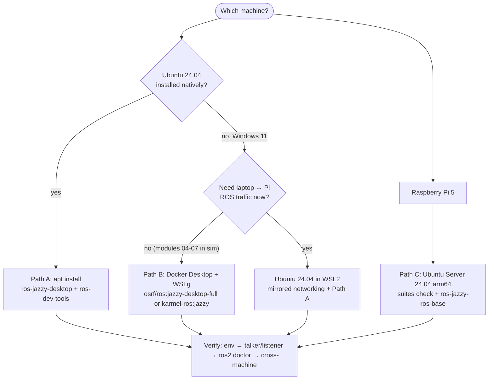

# 04.02 — Installing ROS 2 — native Ubuntu, Docker on Windows, and the Pi

<!-- glance:start -->
<!-- generated by tools/build.py from curriculum/syllabus.yaml — edit the syllabus, not this block -->

| | |
|---|---|
| **Track** | Main path |
| **Difficulty** | Beginner |
| **Time** | 1 h 30 min |
| **Hardware** | none |
| **Software** | ubuntu, ros2, docker |
| **Prerequisites** | [04.01 Why middleware? ROS 2 through a distributed-systems lens](04.01-why-middleware.md) |
| **Optional prerequisites** | [FL.02 Getting Ubuntu: dual boot, VM or WSL2](../optional-foundations/linux-and-tools/FL.02-installing-ubuntu.md)<br>[FL.07 Package management: apt, keys and repositories](../optional-foundations/linux-and-tools/FL.07-package-management.md)<br>[FL.12 Docker for robotics: devices, GUIs and host networking](../optional-foundations/linux-and-tools/FL.12-docker-for-robotics.md) |
| **Version-sensitive** | yes — see [curriculum/versions.yaml](../curriculum/versions.yaml) |
| **Skip if** | `ros2 run demo_nodes_py talker` works on your laptop and on the Pi. |

<!-- glance:end -->

## What you will learn

- Choose the right ROS 2 installation for each machine: native Ubuntu 24.04, Docker on Windows 11 with WSLg, or Ubuntu Server on the Raspberry Pi 5.
- Install ROS 2 Jazzy from the official apt repository using the `ros2-apt-source` package, and choose between `ros-jazzy-desktop` and `ros-jazzy-ros-base`.
- Explain what sourcing `setup.bash` does and make it permanent without breaking other shells.
- Verify an installation with `talker`/`listener` and `ros2 doctor`, on one machine and across the laptop ↔ Pi link.
- Diagnose the common failures: apt key/source errors, missing locale, GUI apps in WSL2/Docker, and DDS discovery through Docker and WSL networking.

## Why it matters

Every remaining lesson in this module, and most of the course, assumes `ros2` works in your terminal.
karmel needs ROS 2 in **two places**: on your development machine (with GUI tools such as RViz,
rqt and Gazebo) and on the robot's Raspberry Pi 5 (headless, just the communication libraries). They
must run the **same distro** and be able to discover each other over Wi-Fi.

A half-working install costs days later: a missing locale breaks message generation, a Docker
container that can't reach the Pi's DDS traffic looks exactly like a bug in your code, and a
`.bashrc` that sources two distros produces baffling import errors. Spend the 90 minutes now.

<!-- prereqs:start -->
## Prerequisites

You need these first:

- [04.01 Why middleware? ROS 2 through a distributed-systems lens](04.01-why-middleware.md)

### Optional prerequisite links

New to any of these? Take the foundation lesson first; skip it if you already know it.

- [FL.02 Getting Ubuntu: dual boot, VM or WSL2](../optional-foundations/linux-and-tools/FL.02-installing-ubuntu.md)
- [FL.07 Package management: apt, keys and repositories](../optional-foundations/linux-and-tools/FL.07-package-management.md)
- [FL.12 Docker for robotics: devices, GUIs and host networking](../optional-foundations/linux-and-tools/FL.12-docker-for-robotics.md)

Check your readiness: `python course.py why 04.02`
<!-- prereqs:end -->

## Concept

A ROS 2 **distribution** is a versioned set of packages built for specific operating systems, like a .NET
LTS release pinned to a runtime. This course uses **ROS 2 Jazzy Jalisco** (LTS, supported until May 2029)
on **Ubuntu 24.04 "Noble"**. The pairing is strict: Jazzy binaries are built for Noble and Python 3.12.
You can't install Jazzy debs on Ubuntu 22.04 or on Windows' Python.

Three ways to get it:

| Machine | Recommended path | Why |
|---|---|---|
| Laptop/desktop running Ubuntu 24.04 (native or dual boot) | **A. apt install** | Best performance, GUI and USB work natively, multi-machine networking is simple. |
| Windows 11 laptop | **B. Docker Desktop + WSLg** (the course image or `osrf/ros:jazzy-desktop-full`) | Nothing to break on Windows, reproducible, GUIs appear as normal windows. Weak spot: talking to the Pi over the LAN (see Troubleshooting). Alternative: Ubuntu 24.04 inside WSL2 + path A. |
| Raspberry Pi 5 on the robot | **C. Ubuntu Server 24.04 arm64 + apt `ros-jazzy-ros-base`** | Jazzy's Tier 1 platforms are Ubuntu 24.04 amd64 and arm64. No desktop, no GUI, less RAM used. |

After installing, you **source** the environment in each shell. The setup script is to ROS what
`dotnet` on the PATH plus NuGet package sources are to .NET: it tells the shell, Python and the
dynamic linker where the ROS packages live.

> [!TIP]
> **Ask your teacher:** "I'm on Windows 11. Walk me through choosing between Docker Desktop and Ubuntu in WSL2 for this course, given that my robot's Pi must talk to my laptop over Wi-Fi."

## Technical explanation

> [!IMPORTANT]
> **Version-sensitive** (verified 2026-09 against ROS 2 Jazzy / Ubuntu 24.04, `ros2-apt-source` 1.3.0).
> Before following these steps, check the current docs: https://docs.ros.org/en/jazzy/Installation/Ubuntu-Install-Debs.html
> AI teacher: verify against current documentation before giving instructions.

### Level 1 — What gets installed

| Package | Contents | Use it on |
|---|---|---|
| `ros-jazzy-ros-base` | Communication libraries, rclpy/rclcpp, message packages, `ros2` CLI. No GUI. | The Pi, CI, containers |
| `ros-jazzy-desktop` | ros-base + RViz, rqt, demos (`demo_nodes_py`, `turtlesim`), tutorials | Your development machine |
| `ros-jazzy-desktop-full` | desktop + simulation (Gazebo Harmonic integration) and perception | The dev machine, later (module 06 installs what it needs) |
| `ros-dev-tools` | colcon, rosdep, vcstool and other build tools. Not ROS-version specific. | Everywhere you build code |

Sizes differ a lot: on a fresh Ubuntu 24.04 container, `apt install --simulate` pulled in **424
packages for ros-base and 1,380 for desktop** (checked 2026-09). On the Pi, that difference is disk,
download time and memory you want for your own nodes.

Everything installs under `/opt/ros/jazzy`. Nothing is on your PATH until you source
`/opt/ros/jazzy/setup.bash`, which sets `AMENT_PREFIX_PATH` (where packages are found), `PATH`,
`PYTHONPATH`, `LD_LIBRARY_PATH`, `ROS_DISTRO=jazzy` and `ROS_VERSION=2`. It never changes system
files, so it's per shell. Your own workspaces are sourced *on top* of it as **overlays**
([04.05](04.05-packages-and-workspaces.md)).

### Level 2 — Path A: native Ubuntu 24.04 (also: Ubuntu in WSL2, and the Pi)

New to apt repositories and signing keys? → [FL.07 Package management](../optional-foundations/linux-and-tools/FL.07-package-management.md).
Need Ubuntu first? → [FL.02 Getting Ubuntu](../optional-foundations/linux-and-tools/FL.02-installing-ubuntu.md).

**1. Locale.** ROS tools assume UTF-8. Minimal systems and containers often have `POSIX`.

```bash
locale                                # look for UTF-8
sudo apt update && sudo apt install locales
sudo locale-gen en_US en_US.UTF-8
sudo update-locale LC_ALL=en_US.UTF-8 LANG=en_US.UTF-8
export LANG=en_US.UTF-8
locale                                # verify
```

**2. Enable Ubuntu's universe repository**, where many ROS dependencies live.

```bash
sudo apt install software-properties-common
sudo add-apt-repository universe
```

**3. Make sure `noble-updates` and `noble-backports` are enabled.** Ubuntu Server images for the
Raspberry Pi don't include them by default, and without them `ros-dev-tools` hits dependency conflicts.

```bash
grep Suites /etc/apt/sources.list.d/ubuntu.sources
# must show:  Suites: noble noble-updates noble-backports
# if not, edit the file (sudo nano ...), then:
sudo apt clean && sudo apt update && sudo apt full-upgrade -y
```

**4. Add the ROS 2 apt repository with `ros2-apt-source`.** Since mid-2025, the official method is a
small `.deb` that installs both the repository definition and the signing key, and updates them
itself when the key rotates. It replaced the old "curl the key into
`/usr/share/keyrings/ros-archive-keyring.gpg` + write `ros2.list`" method, whose key expired on
2025-06-01. Many blog posts still show the old method, so don't use them.

```bash
sudo apt update && sudo apt install curl -y
export ROS_APT_SOURCE_VERSION=$(curl -s https://api.github.com/repos/ros-infrastructure/ros-apt-source/releases/latest | grep -F "tag_name" | awk -F'"' '{print $4}')
curl -L -o /tmp/ros2-apt-source.deb "https://github.com/ros-infrastructure/ros-apt-source/releases/download/${ROS_APT_SOURCE_VERSION}/ros2-apt-source_${ROS_APT_SOURCE_VERSION}.$(. /etc/os-release && echo ${UBUNTU_CODENAME:-${VERSION_CODENAME}})_all.deb"
sudo dpkg -i /tmp/ros2-apt-source.deb
```

Before running `dpkg`, check that `echo $ROS_APT_SOURCE_VERSION` printed a version (it was `1.3.0` on
2026-09-16). An empty value is the most common failure (see Troubleshooting). The package creates
`/etc/apt/sources.list.d/ros2.sources`, a deb822 file with the key embedded in `Signed-By:`, pointing at `http://packages.ros.org/ros2/ubuntu`.

**5. Install ROS 2.**

```bash
sudo apt update
sudo apt upgrade                      # ROS debs are built against an up-to-date Noble
sudo apt install ros-jazzy-desktop    # dev machine;  on the Pi: sudo apt install ros-jazzy-ros-base
sudo apt install ros-dev-tools        # colcon, rosdep, vcstool
```

**6. Source it, now and in every new shell.**

```bash
source /opt/ros/jazzy/setup.bash
echo 'source /opt/ros/jazzy/setup.bash' >> ~/.bashrc
```

Only ever source **one** distro in `.bashrc`. If you later install another distro for experiments,
source it by hand in that terminal.

**7. Choose your domain ID** ([04.01](04.01-why-middleware.md#level-2--discovery-how-nodes-find-each-other-without-a-registry)).
Pick one number between 1 and 101 for *your* robot and use it on the laptop and the Pi:

```bash
echo 'export ROS_DOMAIN_ID=42' >> ~/.bashrc
```

**8. Python packages: apt first.** Ubuntu 24.04 blocks `pip install` into the system Python (PEP 668,
"externally-managed-environment"). ROS binaries require that system Python 3.12, so no conda and no pyenv
interpreters. For extra libraries, prefer `sudo apt install python3-<name>` or a rosdep key. If a package
is pip-only, use a venv created from the system Python. Details: [FL.10](../optional-foundations/linux-and-tools/FL.10-python-environments-ubuntu.md).

### Level 2 — Path B: Docker Desktop on Windows 11 with WSLg

Background on containers for robotics → [FL.12 Docker for robotics](../optional-foundations/linux-and-tools/FL.12-docker-for-robotics.md).

1. Install **Docker Desktop** with the **WSL 2 backend** (default on Windows 11). Run `wsl --update` in
   PowerShell so WSLg, the component that shows Linux GUI windows on Windows, is current.
2. Pull the image. `osrf/ros:jazzy-desktop-full` is **amd64 only** (fine for an Intel/AMD laptop). It is
   ~1.4 GB to download and ~6.4 GB on disk.

   ```powershell
   docker pull osrf/ros:jazzy-desktop-full
   ```

3. Start a container from the **repository root** in PowerShell. The mounts connect the container to
   WSLg's X11/Wayland sockets. Docker Desktop exposes them under `/run/desktop/mnt/host/wslg`.

   ```powershell
   docker run -it --name ros `
     -e ROS_DOMAIN_ID=42 `
     -v /run/desktop/mnt/host/wslg/.X11-unix:/tmp/.X11-unix `
     -v /run/desktop/mnt/host/wslg:/mnt/wslg `
     -e DISPLAY=:0 -e WAYLAND_DISPLAY=wayland-0 `
     -e XDG_RUNTIME_DIR=/mnt/wslg/runtime-dir -e PULSE_SERVER=/mnt/wslg/PulseServer `
     -v ${PWD}/04-ros2/code:/ws `
     osrf/ros:jazzy-desktop-full bash
   ```

   The image's entrypoint sources `/opt/ros/jazzy/setup.bash` for this first shell.
4. Open a **second terminal** into the same container. `docker exec` bypasses the entrypoint, so source by hand:

   ```powershell
   docker exec -it ros bash
   ```
   ```bash
   source /opt/ros/jazzy/setup.bash
   ```

5. Next time, `docker start -ai ros` resumes the same container. Drop `--name ros` and add `--rm` if you
   prefer throwaway containers, but then anything you install inside is lost.

**The course image.** `labs/docker/Dockerfile` builds `karmel-ros:jazzy`: `osrf/ros:jazzy-desktop-full`
plus Gazebo, ros2_control, Nav2, slam_toolbox and a non-root user whose `.bashrc` already sources ROS.
You'll need those packages from module 05 on. Build it once from `labs/`:

```bash
docker build -f docker/Dockerfile -t karmel-ros:jazzy .
```

Then use `karmel-ros:jazzy` instead of `osrf/ros:jazzy-desktop-full` in the `docker run` command above.

> [!NOTE]
> The WSLg mounts above were tested on Windows 11 with Docker Desktop 4.x (Engine 29.7) on 2026-09-17:
> turtlesim opened as a normal window. Without the mounts, Qt aborts with "could not load the Qt platform plugin".
> GPU-accelerated rendering in containers (for Gazebo) needs `/dev/dxg` as well. That's covered in module 06.

**Alternative, Ubuntu in WSL2:** `wsl --install -d Ubuntu-24.04`, then follow Path A inside it.
GUIs work through WSLg without extra flags. For laptop ↔ Pi communication, enable **mirrored networking**
(`networkingMode=mirrored` under `[wsl2]` in `%UserProfile%\.wslconfig`, Windows 11 22H2+), which
Microsoft documents as adding multicast support and LAN reachability. You'll also have to allow inbound traffic
through the Hyper-V firewall.

### Level 2 — Path C: Raspberry Pi 5 with Ubuntu Server 24.04

1. Flash **Ubuntu Server 24.04 LTS (64-bit)** for Raspberry Pi with Raspberry Pi Imager
   (the current point release was 24.04.5 in 2026-09). In the Imager settings, set a hostname
   (`karmel`), a user, Wi-Fi and enable SSH with your public key ([FL.08](../optional-foundations/linux-and-tools/FL.08-ssh-remote-dev.md)).
2. Boot, `ssh <user>@karmel.local`, `sudo apt update && sudo apt full-upgrade -y`, reboot.
3. **Check the suites** (step 3 of Path A). The Pi image lacks `noble-updates` and `noble-backports`, and this is the
   step people skip.
4. Follow Path A steps 1, 2, 4, 5 with `ros-jazzy-ros-base` and `ros-dev-tools`, then 6, 7 and 8.
   Use the **same** `ROS_DOMAIN_ID` as your laptop.
5. `demo_nodes_py` is not part of ros-base. For the cross-machine test, install it explicitly:
   `sudo apt install ros-jazzy-demo-nodes-py ros-jazzy-demo-nodes-cpp`.

Raspberry Pi OS instead of Ubuntu is possible (ROS in a `ros:jazzy-ros-base` container, which is
multi-arch), but GPIO, serial and camera access from containers add friction. This course uses
Ubuntu on the Pi. Its known 24.04 limitations (use `lgpio`/`gpiozero`, not RPi.GPIO; CSI camera
needs workarounds) are covered in the hardware lessons.

### Level 3 — Verifying: what "works" means

A correct install passes four checks, from local to distributed:

1. **Environment:** `printenv | grep -E 'ROS|RMW'` shows `ROS_DISTRO=jazzy`, `ROS_VERSION=2`, your `ROS_DOMAIN_ID`.
2. **Same process type, same host:** `ros2 run demo_nodes_cpp talker` + `ros2 run demo_nodes_py listener`. This proves C++ and Python client libraries share the middleware.
3. **Health report:** `ros2 doctor` checks platform, network interfaces, middleware, package versions and topics.
4. **Across machines:** talker on the Pi, listener on the laptop, and the other way round. This is the check that exercises multicast, firewalls and container networking.

`ros2 doctor` prints `UserWarning`s when newer package versions exist in the repository. Those mean
"`apt upgrade` available", not "broken". The line that matters is the last one. Real output from a
Jazzy container (2026-09):

```text
/opt/ros/jazzy/lib/python3.12/site-packages/ros2doctor/api/package.py: 122: UserWarning: tf2_ros has been updated to a new version. local: 0.36.21 < latest: 0.36.23
...
All 5 checks passed
```

`ros2 doctor --report` prints details, including the network interfaces DDS will use. Look for
`MULTICAST` in the flags of your Wi-Fi or Ethernet interface:

```text
   NETWORK CONFIGURATION
...
inet         : 172.17.0.5
device       : eth0
flags        : 4163<RUNNING,BROADCAST,MULTICAST,UP>
```

### Level 4 — Networking reality for each path

| Setup | Nodes on same machine | Container ↔ container | Laptop ↔ Pi over Wi-Fi |
|---|---|---|---|
| Native Ubuntu | works | n/a | works if same subnet, multicast allowed |
| Docker Desktop, default bridge network | works (same container) | **works** on the same Docker network, which also means you see *other people's* containers on the same domain | **does not work** out of the box: the containers sit behind NAT inside Docker Desktop's VM |
| Ubuntu in WSL2, NAT (default) | works | n/a | usually not |
| Ubuntu in WSL2, mirrored networking | works | n/a | designed to work; allow inbound in the Hyper-V firewall |

The container ↔ container row was verified while writing this lesson: a `talker` in one container and
a `listener` in another, both on domain 57, communicated. With the listener on domain 58, nothing arrived.

## Diagram



What `source /opt/ros/jazzy/setup.bash` does to a shell:

```text
before                                   after
PATH=/usr/bin:...                        PATH=/opt/ros/jazzy/bin:/usr/bin:...
PYTHONPATH=                              PYTHONPATH=/opt/ros/jazzy/lib/python3.12/site-packages
LD_LIBRARY_PATH=                         LD_LIBRARY_PATH=/opt/ros/jazzy/lib:...
AMENT_PREFIX_PATH=                       AMENT_PREFIX_PATH=/opt/ros/jazzy
ROS_DISTRO=                              ROS_DISTRO=jazzy   ROS_VERSION=2   ROS_PYTHON_VERSION=3
```

## Code

The install itself is the code. Here is a small verification script you can run on every machine
(laptop, container, Pi). Save it as `~/check_ros.sh`:

```bash
#!/usr/bin/env bash
# check_ros.sh — sanity-check a ROS 2 Jazzy installation (lesson 04.02)
# (no `set -u`: ROS setup scripts read unset variables and would abort)
source /opt/ros/jazzy/setup.bash

echo "== environment"
printenv | grep -E '^(ROS_|RMW_)' | sort
locale | grep -E '^LANG=' || true

echo "== version"
dpkg -s ros-jazzy-ros-base 2>/dev/null | grep -E '^Version' || echo "(no deb install: container or source build?)"

echo "== talker/listener on this machine (8 s)"
ros2 run demo_nodes_cpp talker > /tmp/talker.log 2>&1 &
# ROS log lines go to stderr, hence 2>&1
timeout 8 ros2 run demo_nodes_py listener 2>&1 | grep -m 3 "I heard"
# kill the node itself: killing only the `ros2 run` wrapper can leave the node running
pkill -f lib/demo_nodes_cpp/talker

echo "== ros2 doctor"
ros2 doctor 2>&1 | grep -i "check"
```

```bash
chmod +x ~/check_ros.sh && ~/check_ros.sh
```

## Exercise

### Exercise 04.02-E1 — Install and verify on your development machine `[simulation]`

Hardware: none. Pick Path A, B or the WSL2 alternative.

1. Install ROS 2 Jazzy desktop following your path.
2. Run `check_ros.sh` (inside the container for Path B).
3. In two terminals, run `ros2 run demo_nodes_cpp talker` and `ros2 run demo_nodes_py listener`.
4. Run `ros2 run turtlesim turtlesim_node` and confirm a window opens.

### Exercise 04.02-E2 — Predict: sourcing and domains `[predict]`

Hardware: none. Predict, then run each case with the talker running in terminal 1 (domain 42):

1. Terminal 2 is a brand-new `docker exec` shell (or a new terminal with the `.bashrc` line removed). You type `ros2 topic list`.
2. Terminal 2 is sourced but `export ROS_DOMAIN_ID=43`. You run the listener.
3. Terminal 2 is sourced, domain 42, `export ROS_AUTOMATIC_DISCOVERY_RANGE=OFF`. You run the listener.
4. Same as 2, but you run `ros2 topic list`.

### Exercise 04.02-E3 — ROS 2 on the robot's Pi and across Wi-Fi `[hardware]`

Hardware: `robot-base` (the Raspberry Pi 5 only, no motors powered). No-hardware alternative: two
containers (`docker run` twice with the same `ROS_DOMAIN_ID`) stand in for laptop and Pi.

1. Install Path C on the Pi. Run `check_ros.sh` over SSH.
2. On the Pi: `ros2 run demo_nodes_cpp talker`. On the laptop (native Ubuntu or WSL2 mirrored): `ros2 run demo_nodes_py listener`.
3. Swap roles.
4. Run `ros2 multicast receive` on one side and `ros2 multicast send` on the other, in both directions.
5. If you use Docker Desktop on the laptop, repeat step 2 from the container and write down what happens.

### Exercise 04.02-E4 — Break it on purpose `[debugging]`

Hardware: none. In a throwaway `ubuntu:24.04` container (`docker run -it --rm ubuntu:24.04 bash`):

1. Run step 4 of Path A with `ROS_APT_SOURCE_VERSION` deliberately set to an empty string. Read the error.
2. Fix it by getting the version from the release redirect instead of the API:
   `curl -sI https://github.com/ros-infrastructure/ros-apt-source/releases/latest | grep -i '^location:'`.
3. Run `apt-get install -y -s ros-jazzy-ros-base | grep -c '^Inst'` (simulated install) and the same for `ros-jazzy-desktop`.

## Expected result

**04.02-E1:** `check_ros.sh` shows `ROS_DISTRO=jazzy`, `ROS_VERSION=2`, your domain, and three listener lines such as
`[INFO] [...] [listener]: I heard: [Hello World: 2]`, then `All 5 checks passed` (plus harmless `UserWarning` lines about newer versions).
The talker prints `Publishing: 'Hello World: N'` once per second, and the listener prints the same numbers.
turtlesim shows a blue window with a turtle in the middle and logs:

```text
[INFO] [...] [turtlesim]: Starting turtlesim with node name /turtlesim
[INFO] [...] [turtlesim]: Spawning turtle [turtle1] at x=[5.544445], y=[5.544445], theta=[0.000000]
```

**04.02-E2:**
1. `bash: ros2: command not found`. The shell isn't sourced.
2. Nothing arrives. Different domains are separate networks.
3. Nothing arrives. Discovery is off for that process.
4. Only `/parameter_events` and `/rosout`. Those are created by the CLI's own node, not by the talker in domain 42.

**04.02-E3:** Steps 2 and 3 print `I heard: [Hello World: N]` within a few seconds of starting.
Step 4: `Received from <other IP>:<port>: 'Hello World!'` on the receiving side. Step 5 from Docker
Desktop's default network: **no messages** in either direction, even though both commands start without errors.
That's expected (NAT), not a bug in your install. The two-container alternative prints `I heard` lines.

**04.02-E4:** Step 1:

```text
dpkg-deb: error: '/tmp/ros2-apt-source.deb' is not a Debian format archive
dpkg: error processing archive /tmp/ros2-apt-source.deb (--install):
 dpkg-deb --control subprocess returned error exit status 2
```

(The URL without a version downloads GitHub's "Not Found" text, not a .deb.) Step 2 prints a
`location: .../releases/tag/1.3.0` line (or newer), and installing that version succeeds with
`Setting up ros2-apt-source (1.3.0~noble)`. Step 3: several hundred packages for ros-base and roughly three times as many for
desktop (424 and 1,380 in September 2026, varies over time).

## Troubleshooting

### Symptom: `dpkg-deb: error: ... is not a Debian format archive` while adding the repository

`ROS_APT_SOURCE_VERSION` is empty, so the download URL was wrong. Check `echo $ROS_APT_SOURCE_VERSION`.
The usual cause is the GitHub API rate limit for unauthenticated calls (60 per hour per IP, easily hit
behind a shared office or university NAT): `curl -s https://api.github.com/...` then returns
`"API rate limit exceeded"`. Use the redirect method from E4, or read the latest version on
https://github.com/ros-infrastructure/ros-apt-source/releases and set the variable by hand.

### Symptom: `apt update` shows `EXPKEYSIG`, `NO_PUBKEY F42ED6FBAB17C654` or "Conflicting values set for option Signed-By"

1. `ls /etc/apt/sources.list.d/ | grep -i ros` and `ls /usr/share/keyrings/ | grep -i ros`.
2. Files from the **old method** (`ros2.list`, `ros2-latest.list`, `ros-archive-keyring.gpg`) next to the new `ros2.sources` → two
   definitions of the same repository with different keys. Remove the old ones:
   `sudo rm /etc/apt/sources.list.d/ros2.list /usr/share/keyrings/ros-archive-keyring.gpg`, then
   `sudo apt update`.
3. No `ros2.sources` at all → redo Path A step 4.
4. Still failing → check the system clock (`date`). A Pi without network time has a clock in the past, and apt rejects "not yet valid" signatures.

### Symptom: `The following packages have unmet dependencies` when installing `ros-dev-tools` or `ros-jazzy-*`

1. `grep Suites /etc/apt/sources.list.d/ubuntu.sources` must include `noble-updates noble-backports` (Pi images don't).
2. `sudo apt update && sudo apt full-upgrade`. ROS debs are built against current Noble.
3. `lsb_release -cs` must print `noble`. Jazzy debs don't exist for `jammy` (22.04).
4. A PPA or a manually installed newer library can pin conflicting versions: `apt-cache policy <package-in-error>`.

### Symptom: locale errors, or strange failures generating messages (`UnicodeEncodeError`, `LANG=POSIX`)

`locale` shows `POSIX` or an empty `LANG`. Run Path A step 1. In containers, set `-e LANG=C.UTF-8` (the
official ROS images already set it). Then open a new shell. `update-locale` affects new logins, not the current shell.

### Symptom: `ros2: command not found` or `ModuleNotFoundError: No module named 'rclpy'`

1. `echo $ROS_DISTRO`. Empty means not sourced. Source `/opt/ros/jazzy/setup.bash`. (In Docker, every `docker exec` shell needs it.)
2. `which python3` must be `/usr/bin/python3`. An activated conda or pyenv environment shadows the system Python 3.12 that rclpy was built for: `conda deactivate`, and remove conda init from `.bashrc` for ROS shells.
3. `.bashrc` sourcing two distros (for example humble and jazzy) → keep one.

### Symptom: GUI apps (turtlesim, RViz) fail in WSL2 or Docker

1. Error `could not connect to display` or `no Qt platform plugin could be initialized` → the container has no display. Add the WSLg mounts and `DISPLAY=:0` from Path B. In WSL2 itself, `echo $DISPLAY` should print `:0`. If it doesn't, run `wsl --update` then `wsl --shutdown`.
2. Warning `runtime directory '/mnt/wslg/runtime-dir' is not owned by UID 0` → harmless when the container runs as root.
3. RViz `Unable to create the rendering window` on a Wayland session → `QT_QPA_PLATFORM=xcb rviz2`.
4. Window opens but is black or very slow → software rendering. Update the Windows GPU driver. GPU passthrough to containers (`/dev/dxg`) is covered in module 06.

### Symptom: nodes don't see each other across Docker, WSL or machines

Work outward, one layer at a time:

1. **Same shell works?** Talker + listener in one container or host. If not, the install is broken, not the network.
2. **Same domain and RMW?** `printenv ROS_DOMAIN_ID RMW_IMPLEMENTATION ROS_AUTOMATIC_DISCOVERY_RANGE` on both ends.
3. **Multicast?** `ros2 multicast receive` / `send` both ways. Fails on native Ubuntu → firewall: `sudo ufw allow in proto udp to 224.0.0.0/4` and `sudo ufw allow in proto udp from 224.0.0.0/4`. Also check that the router doesn't isolate Wi-Fi clients ("AP/client isolation", common on guest networks).
4. **Discovery works but no data** (`ros2 topic list` shows the topic, `echo` prints nothing): unicast UDP is blocked (firewall on the data ports from [04.01](04.01-why-middleware.md)), or containers started with `--net=host` but separate IPC namespaces. Fast DDS then picks shared memory between "same host" participants that can't actually share memory. Add `--ipc=host` to both containers.
5. **Docker Desktop ↔ Pi:** the container is NATed inside a VM, so multicast never reaches the LAN. Options, from simplest: run ROS natively in WSL2 with mirrored networking for multi-machine work; or run the laptop side on native Ubuntu; or configure `ROS_STATIC_PEERS` / a Zenoh router (advanced).
6. **Surprise nodes** from other containers or people → set a personal `ROS_DOMAIN_ID`.

### Symptom: `pip install ...` fails with `externally-managed-environment`

That's PEP 668 on Ubuntu 24.04, working as intended. Use `sudo apt install python3-<name>`, or a venv
created with the system interpreter (`python3 -m venv --system-site-packages .venv`) so rclpy stays importable. Never use
`--break-system-packages` on the robot.

## Common mistakes

- **Following a Humble (22.04) or pre-2025 tutorial.** Wrong distro names, and the old apt key method that now fails. Check that the URL says `jazzy`.
- **Skipping the suites check on the Pi.** It shows up later as unmet dependencies for `ros-dev-tools`.
- **Installing `desktop` on the Pi.** Hundreds of GUI packages you can't use, on a machine that needs its RAM for your nodes.
- **Sourcing in `.bashrc` in one terminal and wondering why `docker exec` shells differ.** Entry points and `.bashrc` only run where they run.
- **Leaving `ROS_DOMAIN_ID` at 0 in a shared environment.** You will eventually receive someone else's `cmd_vel`.
- **Expecting Docker Desktop containers to talk to the Pi.** They can't by default. Decide on WSL2 mirrored networking or native Ubuntu before module 04.16.
- **Using conda for "just one package".** It shadows the system Python and breaks rclpy.

## Knowledge check

1. Which package do you install on the Pi and which on your development laptop, and why not the same?
   <details><summary>Answer</summary>

   Pi: `ros-jazzy-ros-base` (+ `ros-dev-tools`). Communication libraries, CLI and messages, no GUI. Laptop: `ros-jazzy-desktop` for RViz, rqt, turtlesim and demos. Desktop is about three times as many packages, all of them unusable on a headless robot that needs its memory and disk for real work.
   </details>

2. What does `source /opt/ros/jazzy/setup.bash` change, and why must you do it in every shell?
   <details><summary>Answer</summary>

   It prepends ROS paths to `PATH`, `PYTHONPATH`, `LD_LIBRARY_PATH`, sets `AMENT_PREFIX_PATH` (package discovery) and `ROS_DISTRO`/`ROS_VERSION`. Environment variables belong to a process and its children, so each new shell starts without them unless `.bashrc` (or a container entrypoint) sources the file.
   </details>

3. Debugging: `sudo dpkg -i /tmp/ros2-apt-source.deb` says "is not a Debian format archive". What happened and how do you fix it?
   <details><summary>Answer</summary>

   The version variable was empty (typically GitHub API rate limiting), so the download URL pointed at nothing and saved an error page. Check `echo $ROS_APT_SOURCE_VERSION`, get the version from the releases page or the `/releases/latest` redirect, download again, install.
   </details>

4. Predict: laptop runs the listener in Docker Desktop (default bridge network), Pi runs the talker, both domain 42, same Wi-Fi. What do you see, and what are two ways to make it work?
   <details><summary>Answer</summary>

   Nothing. Docker Desktop's containers are NATed inside a VM, so DDS multicast discovery doesn't reach the LAN. Fixes: run ROS in Ubuntu on WSL2 with mirrored networking (and allow Hyper-V firewall inbound), use native Ubuntu on the laptop, or configure static peers / a Zenoh router.
   </details>

5. `ros2 topic list` on the laptop shows `/chatter` published by the Pi, but `ros2 topic echo /chatter` prints nothing. Which layer is broken, and what are the likely causes?
   <details><summary>Answer</summary>

   Discovery (multicast + SEDP) works, and data transport doesn't. Likely causes: a firewall blocking unicast UDP data ports, containers with `--net=host` but without `--ipc=host` (shared memory chosen but unusable), or incompatible QoS (check `ros2 topic info -v`).
   </details>

6. Why does Ubuntu 24.04 refuse `pip install numpy` and what should you do in a ROS project?
   <details><summary>Answer</summary>

   PEP 668 marks the system Python as externally managed, so pip can't overwrite apt-managed packages. In ROS: prefer `apt install python3-numpy` or a rosdep key in `package.xml`. For pip-only packages, use a venv made from the system Python with `--system-site-packages`. Never conda, never `--break-system-packages` on the robot.
   </details>

7. `ros2 doctor` prints 15 `UserWarning ... has been updated to a new version` lines and then "All 5 checks passed". Is the install broken?
   <details><summary>Answer</summary>

   No. The warnings mean newer package versions exist in the apt repository. `sudo apt update && sudo apt upgrade` clears them. The final line is the verdict.
   </details>

## Practical challenge

Make ROS 2 work **between your development environment and the robot's Pi**, reproducibly.

Acceptance criteria:

- The Pi runs Ubuntu Server 24.04 with `ros-jazzy-ros-base`, `ROS_DOMAIN_ID` set in `.bashrc`, and passes `ros2 doctor`.
- Your development environment (native, WSL2 or a container setup you've made work) runs `ros2 run demo_nodes_py listener` and receives the Pi's `talker` **and** the reverse, within 5 s of starting.
- `ros2 multicast send/receive` succeeds both ways.
- You have a written note (for yourself) of every non-default setting you needed: firewall rules, `.wslconfig`, docker flags, router settings. Six months from now you'll reinstall and need it.
- (Hardware alternative if the Pi isn't built yet: two containers on a user-defined Docker network, one of them `ros:jazzy-ros-base` playing the Pi, plus a third container on a *different* domain that provably receives nothing.)

## You can skip this if…

`ros2 run demo_nodes_py talker` works on your laptop and on the Pi, a listener on the other machine
receives it, and you can answer knowledge-check questions 3, 4 and 5 without looking.

`python course.py skip 04.02 --reason "ROS 2 Jazzy already works on laptop and Pi"`

## Go deeper

- https://docs.ros.org/en/jazzy/Installation/Ubuntu-Install-Debs.html — the official install page this lesson follows. Check it before every reinstall.
- https://docs.ros.org/en/jazzy/How-To-Guides/Installation-Troubleshooting.html — official troubleshooting: multicast, conda conflicts, RViz on Wayland.
- https://docs.ros.org/en/jazzy/How-To-Guides/Installing-on-Raspberry-Pi.html — the Raspberry Pi notes, including the missing updates/backports suites.
- https://discourse.openrobotics.org/t/ros-signing-key-migration-guide/43937 — the 2025 signing-key migration and how to clean up the old key files.
- https://hub.docker.com/r/osrf/ros — the desktop images (amd64). The multi-arch `ros` images are at https://hub.docker.com/_/ros.
- https://github.com/microsoft/wslg/blob/main/samples/container/Containers.md — Microsoft's notes on running GUI containers under WSLg.
- https://learn.microsoft.com/en-us/windows/wsl/networking — WSL NAT vs mirrored networking mode.

## Progress checkpoint

- [ ] I can choose between native, Docker+WSLg and WSL2 installs for a given machine and goal.
- [ ] I can install ROS 2 Jazzy with `ros2-apt-source` and explain ros-base vs desktop.
- [ ] I can explain what sourcing does and set up `.bashrc` and `ROS_DOMAIN_ID` correctly.
- [ ] I can verify an install with talker/listener and `ros2 doctor`, locally and laptop ↔ Pi.
- [ ] I can diagnose apt key errors, locale problems, missing GUIs and discovery failures layer by layer.

`python course.py complete 04.02` (exercises done) · `python course.py master 04.02` (challenge done) · `python course.py struggle 04.02 "what was hard"`

Next: [04.03 — Nodes and the ros2 command line](04.03-nodes-and-cli.md), exploring a running system with turtlesim.
