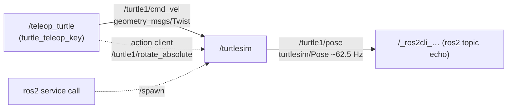

# 04.03 — Nodes and the ros2 command line

<!-- glance:start -->
<!-- generated by tools/build.py from curriculum/syllabus.yaml — edit the syllabus, not this block -->

| | |
|---|---|
| **Track** | Main path |
| **Difficulty** | Beginner |
| **Time** | 45 min |
| **Hardware** | none |
| **Software** | ros2 |
| **Prerequisites** | [04.02 Installing ROS 2 — native Ubuntu, Docker on Windows, and the Pi](04.02-installing-ros2.md) |
| **Skip if** | You can list nodes, topics and their types from the CLI. |

<!-- glance:end -->

## What you will learn

- Start nodes with `ros2 run`, rename them and remap their topics with `--ros-args`.
- List the nodes, topics, services, actions and parameters of a running system, with their types.
- Watch data flow with `ros2 topic echo`, `hz`, `bw` and inject data with `ros2 topic pub`.
- Call a service, send an action goal with feedback, and read or change a parameter, all from the shell.
- Predict where a velocity command moves a turtle, then check the prediction against `/turtle1/pose`.
- Save a snapshot of a ROS graph to a file so you can diff "working" against "broken".

## Why it matters

When karmel doesn't move, the first questions are always the same: is the base node running? Is
anything publishing `cmd_vel`? At what rate? With which type? Is the battery topic alive? You answer
them in seconds with the `ros2` CLI, before opening any code. It plays the role of `kubectl get`,
`grpcurl` and `kcat` for ROS, and you'll use it in every remaining lesson. In [04.16](04.16-your-robot-as-ros2-node.md) you'll drive
the real robot with the exact `ros2 topic pub` commands you practice here on a simulated turtle.

<!-- prereqs:start -->
## Prerequisites

You need these first:

- [04.02 Installing ROS 2 — native Ubuntu, Docker on Windows, and the Pi](04.02-installing-ros2.md)

### Optional prerequisite links

None.

Check your readiness: `python course.py why 04.03`
<!-- prereqs:end -->

## Concept

A **node** is a named participant in the ROS graph: one unit of functionality with its own
publishers, subscriptions, service servers/clients, action servers/clients and parameters. A node
usually lives in its own process (a C++ or Python executable), but several nodes can share one.

The `ros2` CLI doesn't talk to a central server, because there isn't one. When you type `ros2 topic list`, the CLI
joins the graph as a participant, listens to discovery traffic and prints what it learns. To make this
fast, the first `ros2` command starts a background **ros2 daemon** that stays in the domain and caches
the graph, like a local discovery cache. Most "the CLI shows something stale" issues are that cache.

**turtlesim** is the ROS "hello world" robot. It's a 2D turtle in a window that behaves like a tiny mobile robot:
it subscribes to velocity commands on `/turtle1/cmd_vel` and publishes its pose on
`/turtle1/pose`. That's the same contract karmel's base node will have (`cmd_vel` in, odometry out).

Every ROS 2 name follows filesystem-like rules:

| You write (in node `battery_monitor`, namespace `/karmel`) | Resolves to | Kind |
|---|---|---|
| `battery/voltage` | `/karmel/battery/voltage` | relative: prefixed with the node's namespace |
| `/battery/voltage` | `/battery/voltage` | absolute: used as is |
| `~/status` | `/karmel/battery_monitor/status` | private: prefixed with the node's full name |

That's why nodes in this course use **relative** names: launching them in a namespace
(`/karmel`, `/robot2`) moves all their topics together, with no code change.

> [!TIP]
> **Ask your teacher:** "Give me a running system I don't know (start a few demo nodes for me) and quiz me: I must discover its topics, rates and types using only the ros2 CLI."

## Technical explanation

### Level 1 — The CLI is organized by noun

`ros2 <noun> <verb>`, with `-h` at every level:

| Noun | Verbs you'll use | Analogy |
|---|---|---|
| `run` | `ros2 run <package> <executable> [--ros-args ...]` | `dotnet run` |
| `pkg` | `list`, `executables <pkg>`, `prefix <pkg>` | `dotnet list package` |
| `node` | `list`, `info <node>` | `kubectl get pods`, `kubectl describe pod` |
| `topic` | `list -t`, `info -v`, `echo`, `hz`, `bw`, `pub`, `type` | `kcat -C`, `kcat -P` |
| `service` | `list -t`, `type`, `call` | `grpcurl` |
| `action` | `list -t`, `info`, `send_goal --feedback` | `curl -X POST /jobs` + watching progress |
| `param` | `list`, `get`, `set`, `describe`, `dump` | reading/writing `IOptionsMonitor` values |
| `interface` | `list`, `show <type>` | reading a `.proto` file |
| `doctor`, `daemon`, `multicast` | health report, discovery cache, network test | |

### Level 2 — Practical: anatomy of turtlesim

Real output of `ros2 node info /turtlesim` on Jazzy:

```text
/turtlesim
  Subscribers:
    /parameter_events: rcl_interfaces/msg/ParameterEvent
    /turtle1/cmd_vel: geometry_msgs/msg/Twist
  Publishers:
    /parameter_events: rcl_interfaces/msg/ParameterEvent
    /rosout: rcl_interfaces/msg/Log
    /turtle1/color_sensor: turtlesim/msg/Color
    /turtle1/pose: turtlesim/msg/Pose
  Service Servers:
    /clear: std_srvs/srv/Empty
    /kill: turtlesim/srv/Kill
    /reset: std_srvs/srv/Empty
    /spawn: turtlesim/srv/Spawn
    /turtle1/set_pen: turtlesim/srv/SetPen
    /turtle1/teleport_absolute: turtlesim/srv/TeleportAbsolute
    /turtle1/teleport_relative: turtlesim/srv/TeleportRelative
    /turtlesim/describe_parameters: rcl_interfaces/srv/DescribeParameters
    /turtlesim/get_parameter_types: rcl_interfaces/srv/GetParameterTypes
    /turtlesim/get_parameters: rcl_interfaces/srv/GetParameters
    /turtlesim/get_type_description: type_description_interfaces/srv/GetTypeDescription
    /turtlesim/list_parameters: rcl_interfaces/srv/ListParameters
    /turtlesim/set_parameters: rcl_interfaces/srv/SetParameters
    /turtlesim/set_parameters_atomically: rcl_interfaces/srv/SetParametersAtomically
  Service Clients:

  Action Servers:
    /turtle1/rotate_absolute: turtlesim/action/RotateAbsolute
  Action Clients:

```

Read it like an API surface:

- **Every node gets infrastructure for free:** `/rosout` (its log messages, aggregated system-wide), `/parameter_events`, and the six `/turtlesim/*_parameters` services that `ros2 param` uses. `get_type_description` (new since Iron) lets tools fetch message definitions at runtime.
- **Its domain API:** one command stream in (`cmd_vel`), state out (`pose`, `color_sensor`), quick commands as services (`spawn`, `teleport`, `set_pen`), one long-running behavior as an action (`rotate_absolute`). That's exactly the design split from [04.01](04.01-why-middleware.md).
- **Types are namespaced by package:** `geometry_msgs/msg/Twist` is the standard velocity type, while `turtlesim/msg/Pose` is private to turtlesim. Real robots use `geometry_msgs/msg/Pose` or `nav_msgs/msg/Odometry`.

`ros2 interface show` is your `.proto` viewer:

```text
$ ros2 interface show geometry_msgs/msg/Twist
# This expresses velocity in free space broken into its linear and angular parts.

Vector3  linear
	float64 x
	float64 y
	float64 z
Vector3  angular
	float64 x
	float64 y
	float64 z
```

### Level 2 — Practical: `--ros-args` for names, remapping, parameters and logging

Any ROS executable accepts these without code changes:

```bash
ros2 run turtlesim turtlesim_node --ros-args \
  -r __node:=karmel_sim \            # rename the node
  -r __ns:=/robot2 \                 # put it in a namespace
  -r turtle1/cmd_vel:=cmd_vel \      # remap a topic name
  -p background_r:=150 \             # set a parameter at startup
  --log-level debug                  # more logging
```

(The comments are for reading. Bash doesn't allow comments after `\`, so remove them before pasting.)

Remapping is dependency injection for names: the code subscribes to `turtle1/cmd_vel`, and the
deployment decides that this means `/robot2/cmd_vel`. Launch files ([04.10](04.10-launch-files.md)) do the same thing declaratively.

### Level 3 — Mathematics: predicting where a Twist moves the turtle

A `Twist` with forward speed $v$ (`linear.x`) and turn rate $\omega$ (`angular.z`) moves a
planar robot along a circular arc of radius $r = v/\omega$. (New to this model? It's the
*unicycle model*. Module 08 derives it for karmel's differential drive.) Starting at heading
$\theta_0 = 0$, after time $t$ the heading is $\theta = \omega t$ and the displacement is

$$\Delta x = r \sin\theta, \qquad \Delta y = r\,(1 - \cos\theta)$$

turtlesim applies a command for **1 s** and then stops (its own command watchdog, the same safety
idea karmel's base will use).

**Worked example:** `ros2 topic pub --once /turtle1/cmd_vel geometry_msgs/msg/Twist "{linear: {x: 2.0}, angular: {z: 1.8}}"`
from the start pose $(5.544, 5.544, 0)$:

- $r = 2.0 / 1.8 = 1.111$, $\theta = 1.8 \cdot 1 = 1.8$ rad
- $\Delta x = 1.111 \cdot \sin 1.8 = 1.111 \cdot 0.974 = 1.082$
- $\Delta y = 1.111 \cdot (1 - \cos 1.8) = 1.111 \cdot 1.227 = 1.364$
- Predicted pose: $(6.626, 6.908, 1.80)$

Measured with `ros2 topic echo /turtle1/pose --once` on Jazzy: `x: 6.603, y: 6.939, theta: 1.814`.
That's within 3 cm. turtlesim integrates in 16 ms steps (it publishes the pose at ~62.5 Hz) and ran for
slightly more than 1 s, which explains the difference. Measuring $\theta = 1.8144$ and using it in the formula gives
$(1.078, 1.379)$, closer still.

### Level 4 — Implementation: how the CLI sees the graph, and its limits

- `ros2 node list` asks the daemon, which has been listening to discovery. A process that died
  without a clean shutdown can linger in the daemon's cache for a few seconds. `ros2 daemon stop` (it
  restarts on the next command) or `--no-daemon` gives you a fresh view.
- `ros2 topic echo` and `hz` create a real subscription. They must discover the publisher first
  (a second or two) and need compatible QoS. For sensor topics published BEST_EFFORT, the CLI adapts
  automatically in most cases ([04.11](04.11-qos.md)).
- `ros2 topic hz` measures inter-arrival times *at the CLI*, including network jitter. Over Wi-Fi it
  measures the link as much as the publisher.
- `ros2 topic pub` without `--once` or `--times N` publishes forever at `--rate` (default 1 Hz). For
  velocity commands this is useful: the robot's watchdog sees a steady stream.
- Killing a `ros2 run` process from a **script** with `kill <pid>` can leave the actual node running,
  because `ros2 run` is a wrapper that starts the executable as a child. Kill the node
  (`pkill -f lib/turtlesim/turtlesim_node`), or use Ctrl+C in an interactive terminal, which reaches both.

## Diagram

The graph while teleoperating turtlesim (what `rqt_graph` shows):



turtlesim's world, the same axis convention karmel uses (REP-103: x forward, y left, θ counter-clockwise):

```text
 y ▲ 11.09
   │
   │            ● after Twist(2.0, 1.8) for 1 s: (6.60, 6.94, θ=1.81)
   │          ╱
   │        ╱  arc radius r = v/ω = 1.11
   │  ──────► turtle1 spawns at (5.54, 5.54), θ = 0 (facing +x)
   │
   └──────────────────────────────► x
  0,0                             11.09
```

## Code

A graph snapshot script. Save the system state when it works, again when it's broken, then `diff`.
It lives at [`04-ros2/code/scripts/ros_graph_snapshot.sh`](code/scripts/ros_graph_snapshot.sh):

```bash
#!/usr/bin/env bash
# ros_graph_snapshot.sh — save the current ROS 2 graph to a text file (lesson 04.03).
# Nodes, topics, services and actions with their types, plus every node's info and parameters.
# Usage:  ros_graph_snapshot.sh [output_file]       (ROS must be sourced)
# Diff two snapshots to see what changed:  diff before.txt after.txt

if ! command -v ros2 >/dev/null; then
  echo "ros2 not found: source /opt/ros/jazzy/setup.bash first" >&2
  exit 1
fi

out="${1:-ros_graph_$(date +%Y%m%d_%H%M%S).txt}"
{
  echo "# ROS graph snapshot $(date -Iseconds)"
  echo "# ROS_DISTRO=${ROS_DISTRO} ROS_DOMAIN_ID=${ROS_DOMAIN_ID:-0} RMW_IMPLEMENTATION=${RMW_IMPLEMENTATION:-default}"
  echo "## nodes";    ros2 node list
  echo "## topics";   ros2 topic list -t
  echo "## services"; ros2 service list -t
  echo "## actions";  ros2 action list -t
  for node in $(ros2 node list); do
    echo "## node ${node}"
    ros2 node info "${node}"
    echo "### parameters of ${node}"
    ros2 param dump "${node}"
  done
} > "${out}" 2>&1

echo "wrote ${out}: $(ros2 node list | wc -l) nodes, $(ros2 topic list | wc -l) topics, $(wc -l < "${out}") lines"
```

Run it with turtlesim running (in Docker, the repo's `04-ros2/code` is mounted at `/ws`):

```bash
bash /ws/scripts/ros_graph_snapshot.sh /tmp/turtlesim.txt
```

```text
wrote /tmp/turtlesim.txt: 1 nodes, 5 topics, 75 lines
```

## Exercise

All exercises need a sourced Jazzy desktop install or container from [04.02](04.02-installing-ros2.md). Hardware: none.

### Exercise 04.03-E1 — Explore a running node `[simulation]`

1. Terminal 1: `ros2 run turtlesim turtlesim_node`. Terminal 2: `ros2 run turtlesim turtle_teleop_key` (keep this terminal focused and drive with the arrow keys).
2. Terminal 3: `ros2 node list`, `ros2 node info /teleop_turtle`, `ros2 topic list -t`.
3. `ros2 topic echo /turtle1/pose` while you drive. Then `ros2 topic hz /turtle1/pose` and `ros2 topic bw /turtle1/pose`.
4. Run `rqt_graph` (desktop install) and match it to the Diagram.
5. Before running `ros2 topic hz /turtle1/cmd_vel`, predict the rate. Then run it while holding an arrow key and again while not touching any key.

### Exercise 04.03-E2 — Predict an arc, then measure it `[predict]`

1. `ros2 service call /reset std_srvs/srv/Empty` to put the turtle back at the start.
2. On paper, compute the pose after `{linear: {x: 1.5}, angular: {z: -1.0}}` applied for 1 s.
3. Publish it with `ros2 topic pub --once /turtle1/cmd_vel geometry_msgs/msg/Twist "{linear: {x: 1.5}, angular: {z: -1.0}}"`, wait 2 s, then `ros2 topic echo /turtle1/pose --once`.
4. Compute the error in x, y and θ.

### Exercise 04.03-E3 — Services, actions and parameters `[simulation]`

1. Spawn a second turtle: `ros2 service call /spawn turtlesim/srv/Spawn "{x: 2.0, y: 2.0, theta: 0.0, name: rover}"`. List the topics again. What appeared?
2. Rotate turtle1 with feedback: `ros2 action send_goal --feedback /turtle1/rotate_absolute turtlesim/action/RotateAbsolute "{theta: 1.57}"`. Then send a goal of `{theta: -3.0}` and press Ctrl+C after 1 s. Check `ros2 topic echo /turtle1/pose --once --field theta` 3 s later: was the goal really cancelled? Finally, in the teleop terminal, press `b` (rotate) and then quickly `f` (cancel).
3. `ros2 param describe /turtlesim background_r`, then `ros2 param set /turtlesim background_r 150`. Does the window change color? Now try `ros2 param set /turtlesim background_r 300`.
4. Draw with the pen: `ros2 service call /turtle1/set_pen turtlesim/srv/SetPen "{r: 255, g: 0, b: 0, width: 4, 'off': 0}"` and drive.

### Exercise 04.03-E4 — Names, remapping and collisions `[debugging]`

1. Start a second simulator in a new terminal with the default name: `ros2 run turtlesim turtlesim_node`. Run `ros2 node list`. Then publish one Twist on `/turtle1/cmd_vel`. What moves, and why?
2. Stop it and start it instead with `--ros-args -r __node:=karmel_sim -r turtle1/cmd_vel:=cmd_vel`. Which topics exist now? Make only the second turtle move.
3. Run `ros2 run turtlesim turtle_teleop_key --ros-args -r turtle1/cmd_vel:=cmd_vel` and explain which window it drives.

### Exercise 04.03-E5 — Diff two graph snapshots `[coding]`

1. With only turtlesim running, run `ros_graph_snapshot.sh before.txt`.
2. Start teleop and spawn `rover`, run `ros_graph_snapshot.sh after.txt`.
3. `diff before.txt after.txt | grep '^[<>]'`. Extend the script with one extra section of your choice (for example `ros2 topic info -v` for each topic, to capture QoS).

## Expected result

**04.03-E1:** `ros2 node list` shows `/teleop_turtle` and `/turtlesim`. `/teleop_turtle` publishes `/turtle1/cmd_vel`
and has an action client for `/turtle1/rotate_absolute` (keys g/b/v/c/d/e/r/t rotate, `f` cancels). `ros2 topic hz /turtle1/pose`
prints about **62.5 Hz**:

```text
average rate: 62.489
	min: 0.015s max: 0.017s std dev: 0.00055s window: 127
```

`ros2 topic bw /turtle1/pose` prints about **1.5 KB/s** with a mean message size of 0.02 KB (5 × float32 + header overhead).
`/turtle1/cmd_vel` has a rate roughly equal to your keyboard's auto-repeat (often 10–30 Hz) while holding a key, and **no output at all**
when you don't press anything. teleop publishes only on key events. Silence isn't an error.

**04.03-E2:** $r = v/\omega = 1.5/(-1.0) = -1.5$ (a negative radius means turning right), $\theta = -1.0$ rad.
$\Delta x = r \sin\theta = -1.5 \cdot (-0.841) = 1.262$, $\Delta y = r(1-\cos\theta) = -1.5 \cdot 0.460 = -0.690$.
Predicted pose $(6.806, 4.855, -1.000)$. Measured on Jazzy: `x: 6.807, y: 4.835, theta: -1.008`, so errors of about 0.001, 0.02 and 0.008 rad.
Anything within about 0.05 and 0.03 rad is correct.

**04.03-E3:** (1) New topics `/rover/cmd_vel`, `/rover/pose`, `/rover/color_sensor`, new action `/rover/rotate_absolute`.
The service response is `turtlesim.srv.Spawn_Response(name='rover')`. (2) Feedback lines `remaining: 1.57…` counting down, then
`Result: delta: -1.55…` and `Goal finished with status: SUCCEEDED`. On the second goal, Ctrl+C prints `Canceling goal...` and, on Jazzy
as tested in 2026-09, `Executor is already spinning`. The CLI exits, **but the turtle keeps rotating until θ ≈ −2.99**: the cancel request
never reached the server. A client disappearing isn't a cancel. Goals keep running unless a cancel is actually delivered.
teleop's `f` key does deliver one, and the rotation stops where it is. You will implement cancellation properly in [04.08](04.08-actions.md).
(3) `describe` shows `Type: integer`, `Min value: 0`, `Max value: 255`. Setting 150 prints `Set parameter successful`, and the background
color changes. Setting 300 is rejected: `Setting parameter failed: Parameter {background_r} doesn't comply with integer range.`
(4) A red trail follows the turtle.

**04.03-E4:** (1) `ros2 node list` prints `/turtlesim` twice and warns:

```text
WARNING: Be aware that there are nodes in the graph that share an exact name, which can have unintended side effects.
```

**Both** turtles move: both nodes subscribe to the same `/turtle1/cmd_vel`. Pub/sub fan-out is by topic name, not by node. Parameter
and service calls to `/turtlesim/...` now reach an unpredictable one of the two. (2) Topics now include `/cmd_vel` (the remapped
subscriber of `/karmel_sim`) next to `/turtle1/cmd_vel`. Publishing on `/cmd_vel` moves only the second window. Its pose is still
published on `/turtle1/pose`, colliding with the first simulator. (3) The remapped teleop drives the second window.

**04.03-E5:** The diff shows added lines for `/teleop_turtle`, `/rover/*` topics and the `/rover/rotate_absolute` action, and a
`## node /teleop_turtle` section. Your extension adds the QoS blocks (`Reliability: RELIABLE`, `Durability: VOLATILE`, …) per endpoint.

## Troubleshooting

### Symptom: `ros2 node list` is empty, but the node is running in another terminal

1. Same machine or container? A `docker exec` shell in a *different* container is a different host.
2. `printenv ROS_DOMAIN_ID ROS_AUTOMATIC_DISCOVERY_RANGE` in both terminals. They must match (and the range not `OFF`).
3. Wait 2–3 s and retry. Discovery isn't instantaneous.
4. `ros2 node list --no-daemon`. If that works, the daemon is stale: `ros2 daemon stop`.
5. Still empty across machines → [04.02 troubleshooting](04.02-installing-ros2.md#troubleshooting), network layer by layer.

### Symptom: the node list shows nodes you already stopped

The daemon's cache is stale (`ros2 daemon stop`), or the node is still alive: `ps aux | grep -E 'lib/.*/'`.
Scripts that killed only the `ros2 run` wrapper leave orphans. Kill them by executable path.

### Symptom: `ros2 topic pub` prints `publishing #1` but the turtle doesn't move, or moves then stops

1. Wrong topic name (typo, missing namespace): `ros2 topic info /turtle1/cmd_vel` must show `Subscription count: 1`.
2. Wrong type: the type argument must match the subscriber's type exactly (`geometry_msgs/msg/Twist`).
3. YAML field names must match the message (`linear: {x: 1.0}`, not `linear_x`). Check with `ros2 interface show`.
4. Moves for 1 s then stops: that's turtlesim's command timeout. Use `--rate 10` to keep it moving.

### Symptom: `turtle_teleop_key` doesn't react to arrow keys

It reads keys from its own terminal. Click that terminal to focus it. It doesn't work in a non-interactive `docker exec` (use `docker exec -it`).

### Symptom: `ros2 topic echo` prints nothing although `ros2 topic list` shows the topic

1. `ros2 topic info /topic -v` → publisher count 0 means nobody is publishing right now (for example teleop with no key pressed).
2. Publisher exists → compare QoS (Reliability/Durability) between the publisher and the echo subscription ([04.11](04.11-qos.md)).
3. A large or rarely published message: add `--once` and wait longer, or check with `ros2 topic hz`.

## Common mistakes

- **Forgetting that fan-out is by name.** Two nodes subscribing to the same topic both act on every message, which is how two robots end up obeying one teleop.
- **Using absolute names (`/cmd_vel`) inside node code.** It prevents namespacing a second robot. Prefer relative names and remap at launch.
- **Reading `topic hz` over Wi-Fi as the publisher's rate.** It includes the network. Measure on the publishing machine too.
- **Two nodes with the same name.** The CLI warns, parameters and services become ambiguous. Always give nodes unique names (`__node:=`).
- **Believing the daemon blindly.** When the graph looks impossible, `ros2 daemon stop` before debugging further.
- **Typing long YAML by hand under pressure.** Keep a text file of the `ros2 topic pub` / `service call` commands you use for your robot.

## Knowledge check

1. Node `battery_monitor` runs in namespace `/karmel` and subscribes to `battery/voltage`, publishes `~/status` and `/diagnostics`. Give the three resolved names.
   <details><summary>Answer</summary>

   `/karmel/battery/voltage` (relative → namespace prefix), `/karmel/battery_monitor/status` (private → node FQN prefix), `/diagnostics` (absolute, unchanged).
   </details>

2. What does `ros2 node info` tell you that `ros2 topic list` doesn't, and when is it the first command to run?
   <details><summary>Answer</summary>

   Per node: which topics it publishes and subscribes (with types), its service servers/clients and action servers/clients. It's the first command when one component misbehaves: it answers "is this node even connected to the topic I think it is?", including after remapping.
   </details>

3. Compute the pose of the turtle from $(5.544, 5.544, 0)$ after `Twist(linear.x = 1.0, angular.z = 0.0)` for 1 s, then after `Twist(linear.x = 0, angular.z = 1.5708)` for 1 s.
   <details><summary>Answer</summary>

   Straight line: $(6.544, 5.544, 0)$. Pure rotation ($r = 0$): position unchanged, heading $\theta = 1.5708$ rad (90°, now facing +y). Measured values differ by a few millimeters because of turtlesim's discrete steps.
   </details>

4. Predict: you run `ros2 topic pub --rate 10 /turtle1/cmd_vel ...` and then start a second `turtlesim_node` with default arguments. What happens?
   <details><summary>Answer</summary>

   The second simulator's turtle starts moving too, since it subscribes to the same topic. The CLI will warn about duplicate node names, and service/parameter calls addressed to `/turtlesim` become ambiguous.
   </details>

5. Debugging: `ros2 node list` still shows `/battery_sim` after you stopped it with `kill <pid-of-ros2-run>` in a script. Name two possible explanations and how to tell them apart.
   <details><summary>Answer</summary>

   (a) The node process is still alive, because only the `ros2 run` wrapper was killed: `ps aux | grep lib/karmel_tutorial/battery_sim` shows it, and `ros2 topic hz` on its topic still reports a rate. (b) The daemon cache is stale: `ros2 node list --no-daemon` doesn't show it, and `ros2 daemon stop` clears it.
   </details>

6. Why does `ros2 topic hz /turtle1/cmd_vel` show nothing while the teleop node is running, and is that a bug?
   <details><summary>Answer</summary>

   teleop publishes only when a key is pressed. No messages, no rate. Not a bug. A robot base must treat silence as "stop" via a watchdog, exactly as turtlesim does after 1 s.
   </details>

7. How do you move all of turtlesim's topics under `/robot2` without touching code?
   <details><summary>Answer</summary>

   `ros2 run turtlesim turtlesim_node --ros-args -r __ns:=/robot2`. Its relative names (`turtle1/cmd_vel`, `turtle1/pose`) become `/robot2/turtle1/cmd_vel` etc. Clients must use the new names or be launched in the same namespace.
   </details>

## Practical challenge

**Square without code.** Using only the ros2 CLI (and bash if you want loops), make turtle1 draw a closed square of side 2.0 with a
red pen, starting and ending at the center.

Acceptance criteria:

- Use `/reset`, `set_pen`, and `cmd_vel` publications, or `rotate_absolute` goals for the corners. No teleport services for the drawing itself.
- The final pose (`ros2 topic echo /turtle1/pose --once`) is within 0.15 of the start position and 0.1 rad of the start heading.
- A graph snapshot taken during the run with `ros_graph_snapshot.sh` shows every node involved.
- Write two sentences: which source of error made the square not perfectly close, and how a real robot would correct it (hint: feedback from pose/odometry, module 08).

## You can skip this if…

You can, without looking anything up, list nodes, topics and their types, echo a topic once, publish a Twist at 10 Hz,
call a service and send an action goal with feedback from the CLI, and you answer knowledge-check questions 1, 5 and 7 correctly.

`python course.py skip 04.03 --reason "Fluent with the ros2 CLI"`

## Go deeper

- https://docs.ros.org/en/jazzy/Tutorials/Beginner-CLI-Tools.html — the official CLI tutorial series (turtlesim, nodes, topics, services, parameters, actions, rqt_console, bags).
- https://docs.ros.org/en/jazzy/How-To-Guides/Node-arguments.html — every `--ros-args` option: remapping, parameters, logging.
- https://design.ros2.org/articles/topic_and_service_names.html — the design of ROS 2 names: relative, absolute, private, and the DDS mapping.
- https://docs.ros.org/en/jazzy/Concepts/Basic/About-Command-Line-Tools.html — how the CLI and the daemon work.

## Progress checkpoint

- [ ] I can start nodes with `ros2 run` and rename or remap them with `--ros-args`.
- [ ] I can list nodes, topics, services, actions and parameters with their types.
- [ ] I can echo, measure (`hz`, `bw`) and publish topic data from the shell.
- [ ] I can call services, send action goals with feedback, and get/set parameters.
- [ ] I can predict a simple arc motion from a Twist and verify it against the pose.

`python course.py complete 04.03` (exercises done) · `python course.py master 04.03` (challenge done) · `python course.py struggle 04.03 "what was hard"`

Next: [04.04 — Topics: writing publishers and subscribers in Python](04.04-topics-publishers-subscribers.md), your first karmel nodes.
