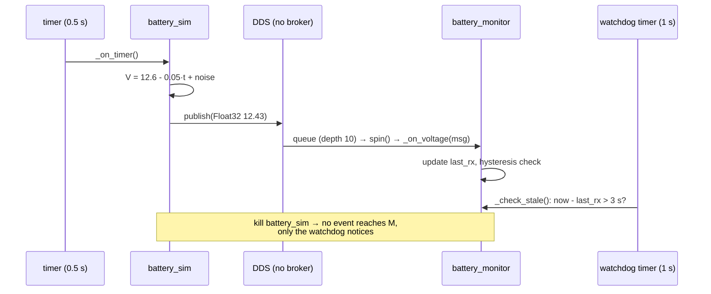
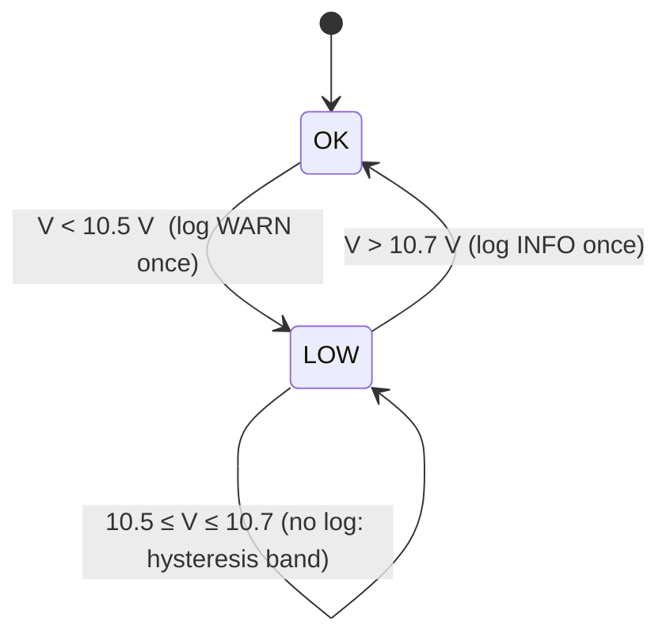

# 04.04 — Topics — writing publishers and subscribers in Python

<!-- glance:start -->
<!-- generated by tools/build.py from curriculum/syllabus.yaml — edit the syllabus, not this block -->

| | |
|---|---|
| **Track** | Main path |
| **Difficulty** | Beginner |
| **Time** | 1 h |
| **Hardware** | none |
| **Software** | ros2, rclpy |
| **Prerequisites** | [04.03 Nodes and the ros2 command line](04.03-nodes-and-cli.md) |
| **Skip if** | You have written rclpy publishers and subscribers. |

<!-- glance:end -->

## What you will learn

- Write an rclpy node class with a timer-driven publisher (`battery_sim`) and run it as a plain Python script.
- Write a subscriber node (`battery_monitor`) that warns on low voltage with hysteresis instead of flapping.
- Detect a dead publisher yourself with a staleness watchdog, because pub/sub never reports "disconnected".
- Explain what `rclpy.spin()` does, what the queue depth argument means, and how to shut a node down cleanly.
- Inspect your own nodes with the CLI and diagnose type clashes and silent message-field bugs.

## Why it matters

Almost everything karmel knows arrives on a topic: wheel telemetry, range readings, the IMU, the
LiDAR, and the battery voltage. If the battery sags below ~10.5 V under motor load, the Pi can brown
out mid-drive, and a 3S Li-ion pack taken below its cutoff is damaged. In [01.14](../01-first-robot/01.14-battery-monitoring.md)
you read that voltage in a Python loop. Now you'll turn it into a ROS 2 *stream* that any node can
consume (a dashboard, a safety supervisor, a "return to charger" behavior) without the battery code
knowing any of them exist.

This lesson starts the example that grows through the whole module: `battery_sim` → `battery_monitor`
here, a custom message in 04.06, a service in 04.07, a drive action in 04.08, and in
[04.16](04.16-your-robot-as-ros2-node.md) the simulated voltage is replaced by the real one from the Pico.

<!-- prereqs:start -->
## Prerequisites

You need these first:

- [04.03 Nodes and the ros2 command line](04.03-nodes-and-cli.md)

### Optional prerequisite links

None.

Check your readiness: `python course.py why 04.04`
<!-- prereqs:end -->

## Concept

An rclpy node is **an object that registers callbacks, plus an event loop that runs them**. If you've written an
ASP.NET Core `BackgroundService` with message handlers, you know the shape:

| rclpy | .NET analogy |
|---|---|
| `class BatterySim(Node)` | a hosted service class |
| `self.create_publisher(Float32, 'battery/voltage', 10)` | an injected `IProducer<Float32>` bound to a topic |
| `self.create_timer(0.5, self._on_timer)` | a `PeriodicTimer` loop |
| `self.create_subscription(Float32, 'battery/voltage', self._on_voltage, 10)` | a message handler registration |
| `rclpy.spin(node)` | `host.Run()`: blocks, dispatches callbacks until shutdown |
| `self.get_logger().warn(...)` | `ILogger.LogWarning`, also published on `/rosout` |

By default, **all callbacks of a node run on one thread, one at a time** (a single-threaded executor,
like the JavaScript event loop). You never need locks between two callbacks of the same node, but a
slow callback delays all the others. That's why callbacks do little work and return. Executors are covered properly in [04.12](04.12-executors-and-callbacks.md).

**The battery, in one paragraph.** karmel runs on a 3S Li-ion pack: three cells in series, each
4.2 V full and ~3.3 V at the course's cutoff, so the pack goes from **12.6 V full** through 10.8 V
nominal to a **9.9 V cutoff**, with a **10.5 V low warning** (all in `labs/config/karmel.yaml`). The
measured voltage is noisy and sags when the motors draw current. New to battery chemistry? →
[FE.13 Batteries](../optional-foundations/electronics/FE.13-batteries.md).

> [!TIP]
> **Ask your teacher:** "Explain the rclpy single-threaded executor using the Node.js event loop as the analogy. Then show me what goes wrong if my subscription callback calls time.sleep(1)."

## Technical explanation

### Level 1 — A publisher is three calls

1. Create the node (it joins the graph under a name).
2. Create a publisher: message type, topic name, QoS (the integer `10` is shorthand for "KEEP_LAST, depth 10, RELIABLE, VOLATILE").
3. Periodically build a message and `publish()` it. Publish is fire-and-forget: it returns immediately, whether zero or fifty subscribers exist.

A subscriber is two calls: create the node, create a subscription with a callback. Then both spin.

### Level 2 — Practical: the details that matter

**Topic names are relative.** `battery/voltage` becomes `/battery/voltage` by default, or
`/karmel/battery/voltage` if the node is started in the `karmel` namespace ([04.03](04.03-nodes-and-cli.md)).

**Queue depth is a buffer, not a guarantee.** The subscription keeps at most 10 unprocessed messages.
If your callback is slower than the publish rate, the oldest are dropped. For sensor streams you
usually want the *newest* sample, so a small depth (1–10) is right. A large depth just means you
process stale data late.

**Messages are plain generated classes.** `Float32()` has one field `data` (a 32-bit float on the wire).
Fields default to zero values. **Assign the exact Python type.** On Jazzy, rclpy's per-field type checks are
**off** unless the environment variable `ROS_PYTHON_CHECK_FIELDS=1` is set. With checks off, `msg.data = 12`
(an `int`) is accepted, and then `publish()` hits a C assertion and **aborts the whole process**:

```text
python3: ./.obj-x86_64-linux-gnu/rosidl_generator_py/std_msgs/msg/_float32_s.c:58: std_msgs__msg__float32__convert_from_py: Assertion `PyFloat_Check(field)' failed.
Aborted
```

With `export ROS_PYTHON_CHECK_FIELDS=1` the same line raises a normal Python error at the assignment,
`AssertionError: The 'data' field must be of type 'float'`. Set it in your development shell, and always convert (`float(...)`) values that come from parameters, parsing or arithmetic with ints.

**Clean shutdown.** Ctrl+C raises `KeyboardInterrupt` inside `spin()`, and a shutdown triggered from elsewhere
(for example a launch system sending SIGTERM) raises `ExternalShutdownException`. The Jazzy pattern
catches both, destroys the node, and calls `rclpy.try_shutdown()` (which, unlike `shutdown()`, doesn't
raise if the context is already shut down).

**Logging.** `get_logger().debug/info/warn/error/fatal`. Messages go to stderr, to a log file under
`~/.ros/log`, and to the `/rosout` topic. Debug is hidden by default: `--ros-args --log-level debug`.

**Silence is the failure mode.** No broker means no "connection lost" event ([04.01](04.01-why-middleware.md)). A
subscriber that needs fresh data must track when it last received something. That's exactly how
the Pico's motor watchdog works ([01.10](../01-first-robot/01.10-pi-pico-protocol.md)), one layer up.

### Level 3 — Mathematics: the simulated battery and why hysteresis is mandatory

The simulator models the pack voltage as linear discharge plus Gaussian measurement noise:

$$V(t) = \max\big(V_\text{floor},\; V_0 - k\,t\big) + \varepsilon, \qquad \varepsilon \sim \mathcal{N}(0, \sigma^2)$$

With the defaults $V_0 = 12.6$ V, $k = 0.05$ V/s, $\sigma = 0.03$ V, the true voltage reaches the
warning threshold after $t = (12.6 - 10.5)/0.05 = 42$ s. That's fast on purpose, so demos don't take hours.

A real pack drains much more slowly. karmel's 3.5 Ah pack at an average 1.5 A lasts
$3.5/1.5 = 2.33$ h, and falls $12.6 - 9.9 = 2.7$ V over that time, so $k \approx 2.7 / 8400 \approx 0.00032$ V/s
(real discharge curves aren't linear, but the order of magnitude is right).

**Why a naive threshold flaps.** While the true voltage is within $\pm 2\sigma = \pm 0.06$ V of 10.5 V,
noise pushes individual samples to both sides. At the real drain rate the voltage spends
$0.12 / 0.00032 \approx 373$ s in that band, which is ~750 samples at 2 Hz. A simulation of that
situation produced **83 separate LOW warnings** with a plain `v < 10.5` test.

**Hysteresis** uses two thresholds: enter LOW below $V_\text{low} = 10.5$ V, leave LOW only above
$V_\text{low} + h$. With $h = 0.2$ V, a false recovery requires noise of $+0.2$ V, a $6.7\sigma$ event:

$$P(\varepsilon > 0.2) = P\!\left(z > \tfrac{0.2}{0.03}\right) = P(z > 6.67) \approx 1.3 \times 10^{-11}$$

The same simulation produced **1 warning**. The band must be wide compared with the noise. If
$\sigma$ were 0.2 V, $P(z > 1) = 16\%$ and it would flap again (you'll see that in E2).

### Level 4 — Implementation: what happens on `publish()`

`publish()` serializes the Python object to CDR (a C extension), hands it to the RMW, and the DDS
writer sends it to every matched reader (shared memory on the same host, UDP otherwise). On the
subscriber side, the DDS reader queues it (depth 10), the executor's wait set wakes up, and `spin()`
calls your callback with a freshly deserialized Python object. Two consequences:

- Serialization cost scales with message size. A `Float32` is trivial, while a 640×480 image copied through Python on every callback is not.
- Callbacks run *in your process at spin time*, not "when the message arrives on the wire". If the executor is busy in another callback, the message waits in the queue.

## Diagram



The monitor's state logic:



## Code

Both files live in the example package you'll formalize in 04.05:
[`04-ros2/code/src/karmel_tutorial/karmel_tutorial/`](code/src/karmel_tutorial/karmel_tutorial/). For now,
run them as plain scripts. rclpy doesn't need a package.

### The publisher: `battery_sim.py`

```python
"""
battery_sim: publish a simulated, slowly draining 3S pack voltage (lesson 04.04).

Publishes
  battery/voltage   std_msgs/Float32   pack voltage [V] at rate_hz

Run it (after `source /opt/ros/jazzy/setup.bash`):
  python3 battery_sim.py                      # lesson 04.04, before packaging
  ros2 run karmel_tutorial battery_sim        # lesson 04.05 onwards
  ros2 run karmel_tutorial battery_sim --ros-args -p drain_v_per_s:=0.2
"""
import random

import rclpy
from rclpy.executors import ExternalShutdownException
from rclpy.node import Node
from std_msgs.msg import Float32


class BatterySim(Node):
    """Fake battery: linear discharge plus Gaussian measurement noise."""

    FLOOR_V = 9.0  # a real pack's BMS disconnects around here

    def __init__(self) -> None:
        super().__init__('battery_sim')
        # Parameters are covered properly in 04.09. Here they just make the demo tunable.
        self._start_v = float(self.declare_parameter('start_v', 12.6).value)
        self._drain_v_per_s = float(self.declare_parameter('drain_v_per_s', 0.05).value)
        self._noise_v = float(self.declare_parameter('noise_v', 0.03).value)
        rate_hz = float(self.declare_parameter('rate_hz', 2.0).value)

        self._rng = random.Random()
        self._t0 = self.get_clock().now()
        self._publisher = self.create_publisher(Float32, 'battery/voltage', 10)
        self._timer = self.create_timer(1.0 / rate_hz, self._on_timer)
        self.get_logger().info(
            f'Simulating a pack from {self._start_v:.2f} V, draining '
            f'{self._drain_v_per_s:.3f} V/s, publishing at {rate_hz:.1f} Hz')

    def _on_timer(self) -> None:
        elapsed_s = (self.get_clock().now() - self._t0).nanoseconds * 1e-9
        true_v = max(self.FLOOR_V, self._start_v - self._drain_v_per_s * elapsed_s)
        msg = Float32()
        msg.data = true_v + self._rng.gauss(0.0, self._noise_v)
        self._publisher.publish(msg)
        self.get_logger().info(f'Publishing {msg.data:.2f} V')


def main(args=None) -> None:
    rclpy.init(args=args)
    node = BatterySim()
    try:
        rclpy.spin(node)
    except (KeyboardInterrupt, ExternalShutdownException):
        pass
    finally:
        node.destroy_node()
        rclpy.try_shutdown()


if __name__ == '__main__':
    main()
```

Why `self._timer = ...` and `self._publisher = ...`? The node keeps its own references, but storing them
makes ownership explicit, and you need the handle to cancel a timer or destroy a publisher later.

### The subscriber: `battery_monitor.py`

```python
"""
battery_monitor: warn when the pack voltage is low or stops arriving (lesson 04.04).

Subscribes
  battery/voltage   std_msgs/Float32

Deliberately self-contained (no imports from this package) so it runs as a plain script
in lesson 04.04, before you learn packaging in 04.05.
"""
import rclpy
from rclpy.executors import ExternalShutdownException
from rclpy.node import Node
from std_msgs.msg import Float32

LOW_WARNING_V = 10.5   # labs/config/karmel.yaml battery.low_warning_v
HYSTERESIS_V = 0.2     # must rise above 10.7 V before the warning clears
STALE_AFTER_S = 3.0    # no message for this long = publisher gone or network broken


class BatteryMonitor(Node):
    """Log a warning on low voltage (with hysteresis) and on silence."""

    def __init__(self) -> None:
        super().__init__('battery_monitor')
        self._low = False
        self._last_rx = None
        self._stale_reported = False
        self._subscription = self.create_subscription(
            Float32, 'battery/voltage', self._on_voltage, 10)
        # Pub/sub has no connection to break: silence is the only symptom of a dead
        # publisher, so we check for it ourselves.
        self._watchdog = self.create_timer(1.0, self._check_stale)
        self.get_logger().info(f'Watching battery/voltage, low below {LOW_WARNING_V:.2f} V')

    def _on_voltage(self, msg: Float32) -> None:
        self._last_rx = self.get_clock().now()
        self._stale_reported = False
        voltage = msg.data
        if not self._low and voltage < LOW_WARNING_V:
            self._low = True
            self.get_logger().warn(
                f'Battery LOW: {voltage:.2f} V (threshold {LOW_WARNING_V:.2f} V)')
        elif self._low and voltage > LOW_WARNING_V + HYSTERESIS_V:
            self._low = False
            self.get_logger().info(f'Battery recovered: {voltage:.2f} V')
        else:
            self.get_logger().debug(f'{voltage:.2f} V')

    def _check_stale(self) -> None:
        if self._last_rx is None or self._stale_reported:
            return
        silent_s = (self.get_clock().now() - self._last_rx).nanoseconds * 1e-9
        if silent_s > STALE_AFTER_S:
            self._stale_reported = True
            self.get_logger().error(f'No battery data for {silent_s:.1f} s')


def main(args=None) -> None:
    rclpy.init(args=args)
    node = BatteryMonitor()
    try:
        rclpy.spin(node)
    except (KeyboardInterrupt, ExternalShutdownException):
        pass
    finally:
        node.destroy_node()
        rclpy.try_shutdown()


if __name__ == '__main__':
    main()
```

### Run them

```bash
# every terminal: source /opt/ros/jazzy/setup.bash   (and export ROS_PYTHON_CHECK_FIELDS=1)
cd 04-ros2/code/src/karmel_tutorial/karmel_tutorial     # in Docker: cd /ws/src/karmel_tutorial/karmel_tutorial
python3 battery_sim.py --ros-args -p drain_v_per_s:=0.2         # terminal 1 (fast drain: LOW after ~10 s)
python3 battery_monitor.py                                      # terminal 2
ros2 topic echo /battery/voltage --once                         # terminal 3
```

The `--ros-args` flags work for plain scripts too, because `rclpy.init(args=None)` reads `sys.argv`.

## Exercise

All exercises: sourced Jazzy environment ([04.02](04.02-installing-ros2.md)). Hardware: none.

### Exercise 04.04-E1 — Run and inspect your first nodes `[coding]`

1. Start `battery_sim.py` (drain 0.2 V/s) and `battery_monitor.py` as above.
2. In a third terminal: `ros2 node list`, `ros2 topic list -t`, `ros2 topic echo /battery/voltage --once`, `ros2 topic hz /battery/voltage`, `ros2 topic info /battery/voltage -v`.
3. Watch the monitor's terminal until the LOW warning appears. Note the elapsed time.
4. Stop the simulator with Ctrl+C and watch the monitor for 5 s.

### Exercise 04.04-E2 — Predict: order, silence and noise `[predict]`

Write your predictions first, then run.

1. Start the monitor **first**, wait 10 s, then start the simulator. Does anything break?
2. Restart the simulator with `-p start_v:=10.6 -p drain_v_per_s:=0.0 -p noise_v:=0.2` (constant 10.6 V, very noisy). How many LOW/recovered messages will the monitor print in 10 s?
3. Start **two** simulators (the second with `--ros-args -r __node:=battery_sim2 -p start_v:=11.5 -p drain_v_per_s:=0.0`) and one monitor. What does the monitor see?

### Exercise 04.04-E3 — Add a critical level and a rate check `[coding]`

Copy `battery_monitor.py` to `my_battery_monitor.py` and extend it:

1. A CRITICAL state below 9.9 V (log with `error`, once), with the same 0.2 V hysteresis back to LOW.
2. Measure the actual message rate over a sliding window of the last 10 arrivals, and warn if it drops below 1.5 Hz while messages are still arriving.
3. Test it with `battery_sim.py --ros-args -p drain_v_per_s:=0.3` and with `-p rate_hz:=1.0`.

### Exercise 04.04-E4 — Two debugging traps `[debugging]`

1. While the monitor runs, publish a wrong type on the same topic: `ros2 topic pub -r 2 /battery/voltage std_msgs/msg/Float64 "{data: 10.0}"`. Does the monitor warn? Run `ros2 topic list -t` and `ros2 topic echo /battery/voltage`.
2. In `battery_sim.py`, temporarily change the publish line to `msg.data = 12` (an int). Run it without and then with `export ROS_PYTHON_CHECK_FIELDS=1`. Compare the failures.

### Exercise 04.04-E5 — Size the hysteresis band `[numerical]`

The real voltage divider + ADC on karmel ([01.14](../01-first-robot/01.14-battery-monitoring.md)) has noise $\sigma = 0.05$ V.

1. What hysteresis $h$ makes a false recovery a $\geq 5\sigma$ event?
2. With that $h$ and a 2 Hz monitor, estimate the expected number of false recoveries during 10 minutes spent just below the threshold ($P(z > 5) \approx 2.9 \times 10^{-7}$).
3. Why can't you make $h$ arbitrarily large? Give a concrete consequence for karmel.

## Expected result

**04.04-E1:** Terminal 1 logs `Publishing 12.55 V`, `12.41 V`… every 0.5 s. Real output of the monitor (drain 0.2 V/s):

```text
[INFO] [1789590389.107505723] [battery_monitor]: Watching battery/voltage, low below 10.50 V
[WARN] [1789590399.614799740] [battery_monitor]: Battery LOW: 10.50 V (threshold 10.50 V)
[ERROR] [1789590405.083029905] [battery_monitor]: No battery data for 3.5 s
```

(10.50 is 10.497 rounded to two decimals.) LOW arrives ~10.5 s after start ($2.1/0.2$), ±1 s depending on noise and startup.
`ros2 topic echo --once` prints one `data: 11.6196…` block. `ros2 topic hz` shows `average rate: 2.000` with `min: 0.500s max: 0.501s`.
`ros2 topic info -v` shows one PUBLISHER (`battery_sim`) and one SUBSCRIPTION (`battery_monitor`), both `Reliability: RELIABLE`,
`Durability: VOLATILE`, and the same `Topic type hash: RIHS01_…`. After Ctrl+C on the simulator, the monitor prints
`No battery data for 3.x s` once, 3–4 s later (the watchdog runs at 1 Hz).

**04.04-E2:**
1. Nothing breaks. The monitor waits silently (no stale error, because it has never received data) and starts working within a second or two of the simulator appearing. Start order doesn't matter in ROS 2.
2. It **flaps**. With $\sigma = 0.2$ V, samples cross both 10.5 and 10.7 V often. In the author's run it printed 4 LOW and 4 recovered messages in 10 s:
   ```text
   [WARN] [...] [battery_monitor]: Battery LOW: 10.37 V (threshold 10.50 V)
   [INFO] [...] [battery_monitor]: Battery recovered: 10.70 V
   [WARN] [...] [battery_monitor]: Battery LOW: 10.38 V (threshold 10.50 V)
   [INFO] [...] [battery_monitor]: Battery recovered: 10.86 V
   ```
   Your count will differ (random), but should be several. The band is only $1\sigma$ wide.
3. It receives **both** streams interleaved at 4 Hz total and has no idea there are two batteries. Warnings and recoveries alternate as values jump between ~11.5 and the draining one. Pub/sub fan-in is by name.

**04.04-E3:** With drain 0.3 V/s, LOW after ~7 s, CRITICAL after ~9 s, each logged once. With `rate_hz:=1.0` your rate warning fires
once the window fills (10 messages, ~10 s), reporting ≈1.0 Hz. With the default 2 Hz it never fires.

**04.04-E4:**
1. The monitor prints **nothing** about 10.0 V. It never matches the Float64 publisher. `ros2 topic list -t` shows
   `/battery/voltage [std_msgs/msg/Float32, std_msgs/msg/Float64]`, and `ros2 topic echo` refuses:
   `Cannot echo topic '/battery/voltage', as it contains more than one type: [std_msgs/msg/Float32, std_msgs/msg/Float64]`.
2. Without the variable: the first `publish()` aborts the process with `Assertion 'PyFloat_Check(field)' failed.` / `Aborted` (no Python traceback).
   With `ROS_PYTHON_CHECK_FIELDS=1`: a normal traceback ending in `AssertionError: The 'data' field must be of type 'float'` at the assignment line.

**04.04-E5:** (1) $h = 5 \cdot 0.05 = 0.25$ V. (2) 10 min at 2 Hz = 1,200 samples. $1200 \cdot 2.9 \times 10^{-7} \approx 3.5 \times 10^{-4}$ false recoveries,
effectively zero. (3) A large $h$ (say 1 V) means that after a warning the voltage must rise to 11.5 V to clear it. A pack
that recovers from 10.4 V to 11.0 V when the motors stop (voltage sag disappearing) would stay "LOW" although it's fine. The robot would refuse tasks
or return to charge unnecessarily. The band should cover noise and load sag, and no more.

## Troubleshooting

### Symptom: the subscriber prints nothing

1. Is the publisher running and publishing? `ros2 topic hz /battery/voltage`.
2. Same topic name? `ros2 topic list`. A leading slash, a namespace or a typo (`battery/voltages`) creates a separate topic.
3. Same type? `ros2 topic list -t`. Two types on one name means some endpoints never match.
4. Same domain and discovery settings in both terminals? `printenv ROS_DOMAIN_ID`.
5. QoS compatible? `ros2 topic info -v` ([04.11](04.11-qos.md)). Not an issue with the default `10` on both sides.

### Symptom: the node process dies with `Assertion ... failed` and `Aborted`, no traceback

A message field got the wrong Python type (int instead of float, float instead of int, str…) and checks are
disabled. `export ROS_PYTHON_CHECK_FIELDS=1`, rerun, and the traceback points at the line. Fix with an explicit conversion.

### Symptom: `ModuleNotFoundError: No module named 'rclpy'` when running `python3 battery_sim.py`

The shell isn't sourced, or `python3` isn't the system Python (conda, pyenv, a venv without
`--system-site-packages`). `which python3` must be `/usr/bin/python3`.

### Symptom: callbacks run late or the watchdog fires although data is flowing

Something in the node blocks the executor: `time.sleep`, a blocking serial read, a slow computation in a callback.
Measure: log `time.monotonic()` at callback entry and exit. Move blocking work out of callbacks ([04.12](04.12-executors-and-callbacks.md)).

### Symptom: Ctrl+C prints a long traceback with `ExternalShutdownException` or `RCLError`

The `main()` doesn't follow the shutdown pattern. Catch `(KeyboardInterrupt, ExternalShutdownException)` around `spin`, and use `rclpy.try_shutdown()` in `finally`.

## Common mistakes

- **Doing real work in the timer or subscription callback** (blocking I/O, long loops). It stalls every other callback of the node.
- **No staleness check on safety-relevant data.** A monitor that only reacts to messages says nothing when the battery node dies.
- **Single-threshold alarms on noisy signals.** They flap. Use hysteresis, filtering, or both.
- **Assuming publish means delivered.** `publish()` returns immediately even with zero subscribers.
- **Absolute topic names in node code** (`/battery/voltage`). They defeat namespacing. Use relative names.
- **Int/float mix-ups in message fields**, invisible until the process aborts. Develop with `ROS_PYTHON_CHECK_FIELDS=1`.
- **Huge queue depths "to be safe".** On sensor data they add latency, not safety.

## Knowledge check

1. What does the `10` in `create_publisher(Float32, 'battery/voltage', 10)` mean, and what happens when the subscriber's callback is slower than the publisher?
   <details><summary>Answer</summary>

   It's a QoS shortcut: KEEP_LAST history with depth 10 (RELIABLE, VOLATILE). The subscriber's queue holds at most 10 pending messages. When it's full, the oldest are dropped, so a slow subscriber processes increasingly stale data and loses messages. It doesn't slow the publisher down.
   </details>

2. The simulator starts at 12.6 V and drains at 0.08 V/s. After how many seconds does the monitor (ignoring noise) warn, and when would a naive `v > 10.5` recovery check first be satisfied if the voltage then stayed constant with noise σ = 0.03 V?
   <details><summary>Answer</summary>

   $(12.6 - 10.5)/0.08 = 26.25$ s. Recovery "never" in a meaningful sense: if the voltage stays constant just below 10.5, each sample has close to 50% chance to be above 10.5 when it's within a few σ, so a naive check recovers within a sample or two and flaps. With hysteresis at 10.7 V it needs a $6.7\sigma$ excursion.
   </details>

3. Predict: you kill `battery_sim` with `kill -9`. What does `battery_monitor` log, and after how long?
   <details><summary>Answer</summary>

   No event arrives. Its 1 Hz watchdog notices when more than 3 s have passed since the last message, so an `ERROR ... No battery data for 3.x s` appears between 3 and 4 s after the last message, once.
   </details>

4. Why don't the subscription callback and the watchdog timer callback in `BatteryMonitor` need a lock around `self._last_rx`?
   <details><summary>Answer</summary>

   With the default single-threaded executor, callbacks of the node run one at a time on the thread that called `rclpy.spin()`, so they never execute concurrently. With a MultiThreadedExecutor and a reentrant callback group, you would need synchronization.
   </details>

5. Debugging: `ros2 topic list -t` shows `/battery/voltage [std_msgs/msg/Float32, std_msgs/msg/Float64]`. What does that mean for your monitor, and how do you find the offender?
   <details><summary>Answer</summary>

   Two publishers or subscribers use different types on the same name. The Float32 monitor only matches Float32 publishers, so data from the Float64 endpoint is invisible to it. `ros2 topic info /battery/voltage -v` lists every endpoint with node name and type, and that shows the offending node.
   </details>

6. A node crashes with `Assertion 'PyFloat_Check(field)' failed` and no Python traceback. What is the fastest way to find the bad line?
   <details><summary>Answer</summary>

   Rerun with `ROS_PYTHON_CHECK_FIELDS=1`. Field assignments are then checked in Python and raise `AssertionError` with a traceback pointing at the assignment that used a non-float value.
   </details>

## Practical challenge

**A battery-aware status publisher.** Write a node `battery_status.py` (plain script is fine) that subscribes to
`battery/voltage` and publishes `std_msgs/String` on `battery/status` at exactly 1 Hz, **independent of the input rate**,
with one of `OK`, `LOW`, `CRITICAL`, `STALE`.

Acceptance criteria:

- Uses a low-pass filter (exponential moving average, $y \leftarrow \alpha x + (1-\alpha) y$ with $\alpha = 0.3$) before classification, plus hysteresis.
- `ros2 topic hz /battery/status` shows 1.0 Hz whether the simulator runs at 0.5, 2 or 20 Hz (`-p rate_hz:=...`).
- Publishes `STALE` within 3 s after the simulator is killed, and returns to a voltage-based state within 2 s after it restarts.
- With `-p start_v:=10.6 -p drain_v_per_s:=0.0 -p noise_v:=0.2`, it doesn't flap: at most one status change in 30 s.
- Runs without errors with `ROS_PYTHON_CHECK_FIELDS=1`.

## You can skip this if…

You have written rclpy publishers and subscribers, you can explain the single-threaded executor and the queue depth, and you
answer knowledge-check questions 1, 3 and 6 correctly without looking.

`python course.py skip 04.04 --reason "Written rclpy pub/sub before"`

## Go deeper

- https://docs.ros.org/en/jazzy/Tutorials/Beginner-Client-Libraries/Writing-A-Simple-Py-Publisher-And-Subscriber.html — the official Python pub/sub tutorial (it creates a package right away, which is next lesson here).
- https://docs.ros.org/en/jazzy/Concepts/Basic/About-Topics.html — the concept page for topics: anonymity, strong typing, publish/subscribe semantics.
- https://docs.ros.org/en/jazzy/p/rclpy/ — rclpy API reference (Node, publishers, subscriptions, timers, logging).
- https://docs.ros.org/en/jazzy/Concepts/Intermediate/About-Executors.html — how callbacks are scheduled, ahead of 04.12.

## Progress checkpoint

- [ ] I can write and run an rclpy publisher driven by a timer.
- [ ] I can write a subscriber with hysteresis and a staleness watchdog.
- [ ] I can explain `spin()`, the single-threaded executor and queue depth.
- [ ] I can inspect my nodes with `ros2 topic echo/hz/info -v` and spot type clashes.
- [ ] I can shut a node down cleanly and debug field-type aborts.

`python course.py complete 04.04` (exercises done) · `python course.py master 04.04` (challenge done) · `python course.py struggle 04.04 "what was hard"`

Next: [04.05 — Packages, workspaces and colcon](04.05-packages-and-workspaces.md): turn these scripts into a package you can `ros2 run`.
