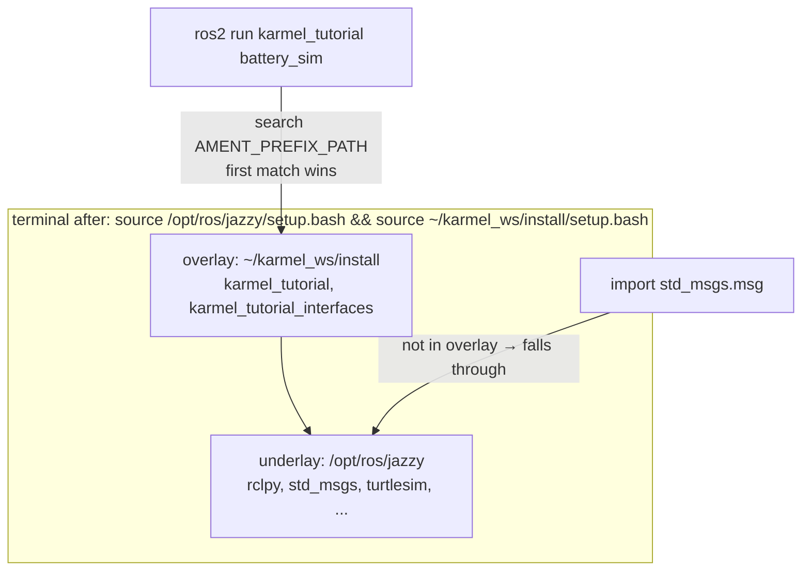
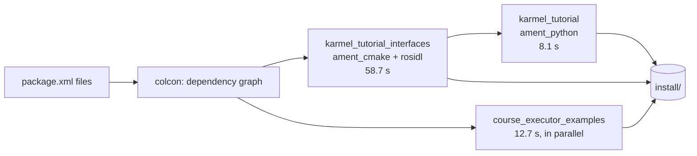

# 04.05 — Packages, workspaces and colcon

<!-- glance:start -->
<!-- generated by tools/build.py from curriculum/syllabus.yaml — edit the syllabus, not this block -->

| | |
|---|---|
| **Track** | Main path |
| **Difficulty** | Beginner |
| **Time** | 50 min |
| **Hardware** | none |
| **Software** | ros2, colcon |
| **Prerequisites** | [04.04 Topics — writing publishers and subscribers in Python](04.04-topics-publishers-subscribers.md) |
| **Skip if** | You can create, build and overlay a Python ROS 2 package. |

<!-- glance:end -->

## What you will learn

- Create an `ament_python` package with `ros2 pkg create` and understand every file it generates.
- Turn the 04.04 scripts into executables that `ros2 run karmel_tutorial battery_sim` finds.
- Build a workspace with `colcon build`, choose `--symlink-install` deliberately, and run `colcon test`.
- Explain underlays and overlays, source them correctly, and diagnose "which copy of my package is running?".
- Declare dependencies in `package.xml` so `rosdep` can install them on a fresh machine or the Pi.

## Why it matters

Scripts in a folder work on your laptop. They don't work on the Pi, in CI, in a launch file
([04.10](04.10-launch-files.md)), or for anyone else. karmel's software will be a dozen packages: interfaces, the base driver, description,
bringup, perception. Some are Python, some C++, and they depend on each other and on apt packages. A **package** is the unit
ROS tools understand: `ros2 run`, `ros2 launch`, `rosdep`, `colcon test` and the ament index all work on packages. The
build tool **colcon** builds a whole workspace in dependency order, the way `dotnet build` builds a solution.

From this lesson on, the course's example code lives in a real colcon workspace, [`04-ros2/code/`](code/), and you'll build the
same packages in your own workspace.

<!-- prereqs:start -->
## Prerequisites

You need these first:

- [04.04 Topics — writing publishers and subscribers in Python](04.04-topics-publishers-subscribers.md)

### Optional prerequisite links

None.

Check your readiness: `python course.py why 04.05`
<!-- prereqs:end -->

## Concept

| ROS 2 | .NET analogy | Notes |
|---|---|---|
| **Workspace** (`~/karmel_ws`, with `src/`) | A solution folder | Just a directory. Everything under `src/` that has a `package.xml` is a package. |
| **Package** (`package.xml` + build files) | A project (`.csproj`) | Has a name, version, dependencies, and a build type. |
| `ament_python` build type (`setup.py`) | An SDK-style project for a pure-Python library/app | For Python nodes. |
| `ament_cmake` build type (`CMakeLists.txt`) | A C++ project | For C++ nodes **and for message/service/action definitions** (04.06). |
| `colcon build` | `dotnet build` on the solution | Builds packages in topological order, in parallel. |
| `install/` | `dotnet publish` output | What you run. Code in `src/` isn't used at runtime (except via symlinks). |
| **Underlay / overlay** | PATH precedence, a local NuGet feed that shadows nuget.org | `/opt/ros/jazzy` is the underlay, your workspace an overlay on top of it. |
| `rosdep install` | `dotnet restore` for *system* dependencies | Maps keys like `python3-serial` to `apt install python3-serial`. |

The mental model to keep: **you source a chain of install prefixes, and the first prefix that contains a package wins.**

> [!TIP]
> **Ask your teacher:** "Draw my environment after I source /opt/ros/jazzy and then two workspaces, and show which package wins when the same package name exists in all three."

## Technical explanation

### Level 1 — The workspace layout

```text
~/karmel_ws/                 ← workspace root: run colcon HERE, never inside src/
├── src/                     ← your sources (git lives here)
│   ├── karmel_tutorial/                 ament_python package
│   │   ├── package.xml                  name, version, dependencies, build type
│   │   ├── setup.py                     Python packaging + entry points (executables)
│   │   ├── setup.cfg                    tells setuptools to put executables in lib/<pkg>
│   │   ├── resource/karmel_tutorial     empty marker file → registers the package in the ament index
│   │   ├── karmel_tutorial/             the Python module (same name as the package)
│   │   │   ├── __init__.py
│   │   │   ├── battery_sim.py
│   │   │   └── battery_monitor.py
│   │   └── test/                        pytest tests + generated linters (flake8, pep257, copyright)
│   └── karmel_tutorial_interfaces/      ament_cmake package (04.06)
├── build/                   ← intermediate files        (generated, never commit)
├── install/                 ← the runnable result        (generated, never commit)
│   ├── setup.bash                       sources the underlays this workspace was built on, then this workspace
│   ├── local_setup.bash                 this workspace only
│   └── karmel_tutorial/lib/karmel_tutorial/battery_sim   ← what `ros2 run` executes
└── log/                     ← build and test logs       (generated, never commit)
```

### Level 2 — Practical: from scripts to a package

**1. Create the workspace and package.** Put the package name **first**. `--dependencies` takes a list and
would otherwise swallow it ("the following arguments are required: package_name").

```bash
mkdir -p ~/karmel_ws/src && cd ~/karmel_ws/src
ros2 pkg create karmel_tutorial --build-type ament_python --license Apache-2.0 \
  --dependencies rclpy std_msgs
```

**2. Copy the nodes into the module folder**, next to `__init__.py`:

```bash
cp <repo>/04-ros2/code/src/karmel_tutorial/karmel_tutorial/battery_{sim,monitor}.py \
   ~/karmel_ws/src/karmel_tutorial/karmel_tutorial/
```

**3. Register executables** in `setup.py`. Each console script is `name = module.path:function`:

```python
    entry_points={
        'console_scripts': [
            'battery_sim = karmel_tutorial.battery_sim:main',
            'battery_monitor = karmel_tutorial.battery_monitor:main',
        ],
    },
```

**4. Check `package.xml`.** `ros2 pkg create` already added `<depend>rclpy</depend>` and `<depend>std_msgs</depend>`.
Every `import` of another ROS package or system library must be declared here. That's what `rosdep` and the build order use:

| Tag | Meaning | Example |
|---|---|---|
| `<depend>` | needed to build **and** run | `rclpy`, `std_msgs`, your interface package |
| `<exec_depend>` | needed at runtime only | `python3-serial`, `rosidl_default_runtime` |
| `<build_depend>` | needed only to build | code generators |
| `<buildtool_depend>` | the build system itself | `ament_cmake`, `rosidl_default_generators` |
| `<test_depend>` | needed only for tests | `python3-pytest`, `ament_flake8` |

**5. Install system dependencies, build, source, run.** Build from the workspace root, in a terminal where only the underlay is sourced:

```bash
cd ~/karmel_ws
rosdep install --from-paths src -y --ignore-src     # first time on a machine: sudo rosdep init && rosdep update
colcon build --symlink-install
source install/setup.bash                           # in every terminal that should see the package
ros2 run karmel_tutorial battery_sim
```

**`--symlink-install`** makes the installed Python code a link to `src/`, so editing a `.py` file takes effect on the next
`ros2 run` without rebuilding. Without it, colcon copies files and you must rebuild after every edit. You still need to rebuild
after changing `setup.py` (new entry point), `package.xml`, message definitions, or anything C++.

**Tests.** `colcon test` runs each package's tests, and `colcon test-result --verbose` shows failures. The generated
`test_flake8.py` and `test_pep257.py` enforce ROS Python style (99-character lines, single quotes, import order, docstring format).
`test_copyright.py` is skipped until you add license headers. The course package also has real unit tests for its pure logic
([`test/test_battery_logic.py`](code/src/karmel_tutorial/test/test_battery_logic.py)), which run with plain `pytest` without ROS.

### Level 2 — Practical: the course workspace in this repository

[`04-ros2/code/`](code/) is a colcon workspace shared by the ROS 2 lessons. The packages from this lesson series are:

| Package | Type | Contents | Lessons |
|---|---|---|---|
| `karmel_tutorial` | ament_python | `battery_sim`, `battery_monitor`, `battery_health`, `set_threshold_client`, `deadlock_demo`, `drive_distance_server`, `drive_distance_client`, `battery_logic` + tests | 04.04–04.08 |
| `karmel_tutorial_interfaces` | ament_cmake | `BatteryHealth.msg`, `SetLowThreshold.srv`, `DriveDistance.action` | 04.06–04.08 |

Other `course_*_examples` packages in the same `src/` belong to lessons 04.09–04.15. Build only what you need:

```bash
cd <repo>/04-ros2/code          # in the Docker container from 04.02: cd /ws
colcon build --symlink-install --packages-up-to karmel_tutorial
source install/setup.bash
ros2 pkg executables karmel_tutorial
```

`build/`, `install/` and `log/` are created next to `src/`. Don't commit them.

### Level 3 — Mathematics: build order and build time

colcon reads every `package.xml`, builds a directed acyclic graph of dependencies, and schedules packages in
**topological order** with a pool of parallel workers (default: number of CPU cores). With enough workers,
the wall-clock time is set by the **critical path**, the longest chain of dependent builds, exactly as in project
scheduling:

$$T_\text{wall} \approx \max_{\text{paths } p} \sum_{k \in p} t_k$$

**Worked example** (real timings in a Docker container on a laptop, 2026-09). `karmel_tutorial_interfaces`
took 58.7 s (code generation for C, C++ and Python), `karmel_tutorial` 8.1 s and depends on it, and an unrelated
`course_executor_examples` took 12.7 s:

- Path 1: interfaces → karmel_tutorial $= 58.7 + 8.1 = 66.8$ s
- Path 2: course_executor_examples $= 12.7$ s
- Predicted $T_\text{wall} \approx 66.8$ s. colcon reported `Summary: 3 packages finished [1min 7s]`.

Sequential would have been $58.7 + 8.1 + 12.7 = 79.5$ s. On a Raspberry Pi 5 the same interface package takes several
times longer, and parallel C++ builds can run out of RAM. `colcon build --executor sequential` or
`MAKEFLAGS=-j1` trade time for memory.

### Level 4 — Implementation: how sourcing and overlays actually work

`install/setup.bash` does two things: it re-sources the **underlays that were sourced when this workspace was built**
(it records `/opt/ros/jazzy`), then sources `local_setup.bash`, which prepends this workspace's package prefixes to
`AMENT_PREFIX_PATH`, `PYTHONPATH`, `PATH`, and so on. Real result after sourcing the workspace:

```text
$ echo $AMENT_PREFIX_PATH
/root/karmel_ws/install/karmel_tutorial:/opt/ros/jazzy
$ ros2 pkg prefix karmel_tutorial
/root/karmel_ws/install/karmel_tutorial
```

`ros2 run <pkg> <exe>` looks up `<pkg>` in the **ament index** (the `share/ament_index/resource_index/packages/<pkg>` marker
files installed thanks to `resource/<pkg>`) along `AMENT_PREFIX_PATH`, **first match wins**, then runs `lib/<pkg>/<exe>`.
If the package isn't found you get `Package 'karmel_tutorial' not found`. If the package is found but the executable isn't, you get `No executable found`.

Overlays let you **shadow** a package: put a modified copy of, say, `nav2_bt_navigator` in your workspace and it wins over
`/opt/ros/jazzy`, without touching the system install. The price is confusion when you forget which copies exist. Sourcing
the same prefixes again in a different order **doesn't reliably reorder them**. In a test, a shell that had sourced workspace B on
top of workspace A still resolved to B after sourcing A again. The only reliable reset is a **fresh terminal** that sources exactly one chain.

## Diagram



The build pipeline for the two course packages:



## Code

The finished package metadata. Full files: [`package.xml`](code/src/karmel_tutorial/package.xml),
[`setup.py`](code/src/karmel_tutorial/setup.py), [`setup.cfg`](code/src/karmel_tutorial/setup.cfg).

`package.xml`. Note the dependency on the interface package you'll create in 04.06 and on `action_msgs` (04.08):

```xml
<?xml version="1.0"?>
<?xml-model href="http://download.ros.org/schema/package_format3.xsd" schematypens="http://www.w3.org/2001/XMLSchema"?>
<package format="3">
  <name>karmel_tutorial</name>
  <version>0.1.0</version>
  <description>The battery + drive example built up across ROS 2 lessons 04.04-04.08.</description>
  <maintainer email="student@example.com">karmel course</maintainer>
  <license>Apache-2.0</license>

  <depend>rclpy</depend>
  <depend>std_msgs</depend>
  <depend>action_msgs</depend>
  <depend>karmel_tutorial_interfaces</depend>

  <test_depend>ament_flake8</test_depend>
  <test_depend>ament_pep257</test_depend>
  <test_depend>python3-pytest</test_depend>

  <export>
    <build_type>ament_python</build_type>
  </export>
</package>
```

`setup.py`:

```python
from setuptools import find_packages, setup

package_name = 'karmel_tutorial'

setup(
    name=package_name,
    version='0.1.0',
    packages=find_packages(exclude=['test']),
    data_files=[
        ('share/ament_index/resource_index/packages', ['resource/' + package_name]),
        ('share/' + package_name, ['package.xml']),
    ],
    install_requires=['setuptools'],
    zip_safe=True,
    maintainer='karmel course',
    maintainer_email='student@example.com',
    description='The battery + drive example built up across ROS 2 lessons 04.04-04.08.',
    license='Apache-2.0',
    extras_require={'test': ['pytest']},
    entry_points={
        'console_scripts': [
            # 04.04 topics
            'battery_sim = karmel_tutorial.battery_sim:main',
            'battery_monitor = karmel_tutorial.battery_monitor:main',
            # 04.06 custom message (+ 04.07 service)
            'battery_health = karmel_tutorial.battery_health:main',
            # 04.07 services
            'set_threshold_client = karmel_tutorial.set_threshold_client:main',
            'deadlock_demo = karmel_tutorial.deadlock_demo:main',
            # 04.08 actions
            'drive_distance_server = karmel_tutorial.drive_distance_server:main',
            'drive_distance_client = karmel_tutorial.drive_distance_client:main',
        ],
    },
)
```

`data_files` is how non-Python files get installed. Launch files and YAML configs are added here in 04.09/04.10:
`('share/' + package_name + '/launch', glob('launch/*.launch.py'))`.

`setup.cfg` (generated, don't change) puts console scripts into `lib/karmel_tutorial/`, where `ros2 run` looks:

```ini
[develop]
script_dir=$base/lib/karmel_tutorial
[install]
install_scripts=$base/lib/karmel_tutorial
```

## Exercise

Hardware: none for all exercises. Sourced Jazzy environment from [04.02](04.02-installing-ros2.md).

### Exercise 04.05-E1 — Package your 04.04 nodes `[coding]`

1. Create `~/karmel_ws/src/karmel_tutorial` with `ros2 pkg create` (steps 1–3 above), containing only `battery_sim` and `battery_monitor`.
2. `colcon list`, then `colcon build --symlink-install`.
3. In a **new** terminal, run `ros2 run karmel_tutorial battery_sim` *before* sourcing the workspace, then after.
4. Run both nodes with `ros2 run`, then `colcon test` and `colcon test-result --verbose`.

### Exercise 04.05-E2 — Predict: what needs a rebuild? `[predict]`

For each change, predict "works immediately", "needs `colcon build`", or "needs build + re-source", then verify:

1. With `--symlink-install`: change the log text in `battery_sim.py`.
2. Without `--symlink-install` (delete `build/ install/ log/`, run `colcon build`): the same change.
3. With `--symlink-install`: add `'battery_monitor2 = karmel_tutorial.battery_monitor:main'` to `setup.py` and run `ros2 run karmel_tutorial battery_monitor2`.
4. Create a brand-new package `karmel_scratch` in `src/`, build it, and run `ros2 pkg list | grep karmel` in a terminal where you had sourced the workspace *before* the build.

### Exercise 04.05-E3 — Build the course workspace `[coding]`

1. In the Docker container (repo mounted at `/ws`) or on Ubuntu: `cd 04-ros2/code && colcon build --symlink-install --packages-up-to karmel_tutorial`.
2. Note the per-package times colcon prints. Which package dominates, and why?
3. `colcon test --packages-select karmel_tutorial && colcon test-result --verbose`.
4. On any machine with Python ≥ 3.10 and pytest (even Windows, no ROS): `cd 04-ros2/code/src/karmel_tutorial && python -m pytest test/test_battery_logic.py`.

### Exercise 04.05-E4 — Who shadows whom? `[debugging]`

1. Copy your package into a second workspace `~/ws_b/src/`, change the log line to `(from ws_b)`, and build `ws_b` in a terminal where `~/karmel_ws` is sourced.
2. Source `~/ws_b/install/setup.bash`. Run `echo $AMENT_PREFIX_PATH`, `ros2 pkg prefix karmel_tutorial` and `ros2 run karmel_tutorial battery_sim`.
3. In the same terminal, source `~/karmel_ws/install/setup.bash` again. Predict which copy runs now, then check.
4. Open a fresh terminal and source only `/opt/ros/jazzy` + `~/karmel_ws`. Which copy runs?

### Exercise 04.05-E5 — Critical path `[numerical]`

A future karmel workspace has: `karmel_interfaces` (60 s) ← `karmel_base` (10 s) ← `karmel_bringup` (5 s);
`karmel_description` (8 s) ← `karmel_bringup`; `karmel_perception` (45 s, C++) depends on `karmel_interfaces`.

1. Draw the dependency graph and compute the wall time with 4 workers and with 1 worker.
2. Which single package would you optimize (or split) to reduce the wall time, and by how much at most?

## Expected result

**04.05-E1:** `colcon list` prints `karmel_tutorial	src/karmel_tutorial	(ros.ament_python)`. The build ends with
`Summary: 1 package finished [~9s]`. Before sourcing, `ros2 run` prints `Package 'karmel_tutorial' not found`. After
`source install/setup.bash` it logs `Simulating a pack from 12.60 V ...`. `colcon test-result` reports
`Summary: 3 tests, 0 errors, 0 failures, 1 skipped` (flake8 and pep257 pass if you copied the course files unchanged,
and the copyright test is skipped: `No copyright header has been placed in the generated source file.`).

**04.05-E2:**
1. Works immediately: the next `ros2 run` logs the new text (install links to `src/`).
2. Needs `colcon build`: the old text keeps appearing until you rebuild.
3. Needs `colcon build`: before rebuilding, `ros2 run` prints `No executable found`. Entry points are generated at build time.
4. Needs build **and** re-source: an already-sourced terminal doesn't know the new package prefix (it isn't in its `AMENT_PREFIX_PATH`). A new terminal, or sourcing `install/setup.bash` again, fixes it.

**04.05-E3:** `karmel_tutorial_interfaces` dominates (about a minute in Docker on a laptop, versus ~8 s for `karmel_tutorial`).
It generates and compiles C and C++ type support and Python bindings for every message. Tests: `12 tests, 0 errors, 0 failures, 0 skipped`
(flake8, pep257, and 10 unit tests). The plain pytest run prints `10 passed`.

**04.05-E4:** (2) `AMENT_PREFIX_PATH` starts with `/root/ws_b/install/karmel_tutorial:` (or your home path), the prefix is ws_b's, and the log says
`(from ws_b)`. (3) **Still ws_b.** Re-sourcing karmel_ws doesn't move its prefix in front of ws_b's in an already-mixed environment
(observed: `AMENT_PREFIX_PATH` unchanged). (4) The fresh terminal runs karmel_ws's copy. Lesson: when in doubt, open a new terminal and source one chain.

**04.05-E5:** Paths: interfaces→base→bringup $= 75$ s; description→bringup $= 13$ s; interfaces→perception $= 105$ s.
With 4 workers (enough for the maximum width of 2–3) $T_\text{wall} ≈ 105$ s. With 1 worker $60+10+5+8+45 = 128$ s.
Optimize `karmel_interfaces`: it's on every long path. Removing it entirely would cut the critical path to $\max(45, 15, 8) = 45$ s, so at most 60 s saved.
Speeding up perception alone saves at most 30 s (the next path is 75 s).

## Troubleshooting

### Symptom: `Package 'karmel_tutorial' not found`

1. `echo $AMENT_PREFIX_PATH`. Does it contain `.../install/karmel_tutorial`? If not, `source install/setup.bash` in *this* terminal.
2. Did the build succeed? Look for `Finished <<< karmel_tutorial` and check `log/latest_build/`.
3. Did you build in the right place? `install/` must be next to `src/`. Running colcon inside `src/` creates `src/build`, `src/install`...
4. `ls install/karmel_tutorial/share/ament_index/resource_index/packages/`. If it's empty, the `resource/karmel_tutorial` marker or its `data_files` entry is missing.

### Symptom: `No executable found`

1. `ros2 pkg executables karmel_tutorial`: is the name listed?
2. Not listed → missing or misspelled `console_scripts` entry, or you didn't rebuild after editing `setup.py`.
3. `setup.cfg` missing or wrong → scripts are installed to `bin/` instead of `lib/karmel_tutorial/`.

### Symptom: my code change has no effect

1. Built with `--symlink-install`? If not, rebuild.
2. Is the copy you edited the one that runs? `ros2 pkg prefix karmel_tutorial` (overlays, other workspaces).
3. Mixing `colcon build` with and without `--symlink-install` in the same workspace can leave stale copies: `rm -rf build install log` and rebuild.

### Symptom: `colcon build` fails with `ModuleNotFoundError` or a missing CMake package

A dependency isn't installed. Declare it in `package.xml` and run `rosdep install --from-paths src -y --ignore-src`.
If rosdep says `ERROR: your rosdep installation has not been initialized yet`, run `sudo rosdep init && rosdep update` once.

### Symptom: flake8 failures from `colcon test`: `I100 Import statements are in the wrong order`, `Q000`, `D213`

The ROS linters are stricter than PEP 8. Imports go in one alphabetical block per group, strings in single quotes, lines at most 99 chars,
and multi-line docstrings start on the line after `"""`. `ament_flake8 <path>` and `ament_pep257 <path>` reproduce the checks without colcon.

### Symptom: the Pi freezes or the build is killed while compiling interface or C++ packages

Out of memory. `MAKEFLAGS=-j1 colcon build --executor sequential`, add swap, or build on the laptop in an arm64 container.

## Common mistakes

- **Running `colcon build` inside `src/` or a package folder.** Always run it from the workspace root.
- **Sourcing the workspace in the terminal you build in**, then building another workspace there. Build in a terminal with only the underlay sourced.
- **Forgetting to re-source after adding a package.** The terminal keeps its old prefix list.
- **Missing dependencies in `package.xml`.** It builds on your laptop (where everything is installed) and fails on the Pi and in CI.
- **Committing `build/`, `install/`, `log/`.** Add them to `.gitignore`.
- **Package name ≠ module folder name** in ament_python. `find_packages` and the entry points then point nowhere.
- **Editing files under `install/`.** They're overwritten on the next build, or they're links to `src/` anyway.

## Knowledge check

1. What are the minimum files that make a directory an `ament_python` package, and what does each do?
   <details><summary>Answer</summary>

   `package.xml` (identity, dependencies, `build_type`), `setup.py` (Python packaging, `data_files`, `console_scripts`), `setup.cfg` (install scripts into `lib/<pkg>`), `resource/<pkg>` (empty marker installed into the ament index so tools can find the package), and the module folder `<pkg>/__init__.py`.
   </details>

2. You edit `battery_monitor.py` and add a new console script in `setup.py`, in a workspace built with `--symlink-install`. What must you do before both changes work?
   <details><summary>Answer</summary>

   The Python edit works immediately (symlinked). The new console script needs `colcon build` because entry points are generated at build time. The package prefix already exists, so re-sourcing isn't strictly required, but it's harmless.
   </details>

3. Explain underlay and overlay using `AMENT_PREFIX_PATH`. Which copy of a package runs if it exists in both?
   <details><summary>Answer</summary>

   Sourcing prepends each workspace's prefixes. The overlay's prefixes come before the underlay's (`/opt/ros/jazzy`). Tools like `ros2 run` search the ament index along that path, and the first match wins, so the overlay's copy runs.
   </details>

4. colcon reports interface package 90 s, two independent Python packages 10 s each that both depend on it, and a bringup package 3 s depending on both. What is the wall time with 8 workers?
   <details><summary>Answer</summary>

   Critical path: $90 + 10 + 3 = 103$ s (the two Python packages build in parallel after the interfaces). Sequential would be 113 s.
   </details>

5. Debugging: on the Pi, `colcon build` works but `ros2 run karmel_tutorial battery_health` crashes with `ModuleNotFoundError: No module named 'karmel_tutorial_interfaces'`. On the laptop it works. What happened, and what is the systematic fix?
   <details><summary>Answer</summary>

   The interface package isn't built or sourced on the Pi (maybe it's only in the laptop's workspace, or the Pi's workspace was built with `--packages-select karmel_tutorial`). Fix: include the interface package in the Pi's workspace, declare `<depend>karmel_tutorial_interfaces</depend>` so colcon builds it first (`--packages-up-to`), rebuild, re-source.
   </details>

6. Why should you never run `pip install` to satisfy a dependency of a package you'll deploy to the robot?
   <details><summary>Answer</summary>

   It isn't declared or reproducible: the robot (and CI) won't have it, and on Ubuntu 24.04 system pip installs are blocked by PEP 668 anyway. Declare the rosdep key (`<exec_depend>python3-serial</exec_depend>`) and use `rosdep install`, which installs the apt package on every machine.
   </details>

## Practical challenge

**A reproducible robot workspace.** Create a git repository `karmel_ws` (only `src/` tracked) that builds and runs on a clean machine.

Acceptance criteria:

- Contains `karmel_tutorial` (with at least `battery_sim` and `battery_monitor`) and a `.gitignore` for `build/ install/ log/`.
- On a fresh container `docker run -it --rm -v <your repo>:/src:ro ros:jazzy-ros-base bash`, this exact sequence succeeds with no manual steps:
  `mkdir -p /ws && cp -r /src/src /ws/ && cd /ws && apt-get update && rosdep update && rosdep install --from-paths src -y --ignore-src && colcon build && colcon test && colcon test-result`
  (`ros-base` has no desktop GUI and none of the demo packages, which is exactly what makes it a good test for missing dependencies).
- `colcon test-result` reports 0 failures (flake8, pep257, and at least one real unit test of your own).
- A `README` line in the repo tells you how to run the two nodes.

## You can skip this if…

You can create, build and overlay a Python ROS 2 package from memory, know when `--symlink-install` isn't enough, and answer
knowledge-check questions 2, 3 and 5 correctly.

`python course.py skip 04.05 --reason "Comfortable with colcon workspaces and overlays"`

## Go deeper

- https://docs.ros.org/en/jazzy/Tutorials/Beginner-Client-Libraries/Creating-A-Workspace/Creating-A-Workspace.html — the official workspace tutorial (underlay/overlay with a real example).
- https://docs.ros.org/en/jazzy/Tutorials/Beginner-Client-Libraries/Creating-Your-First-ROS2-Package.html — `ros2 pkg create` for CMake and Python packages.
- https://docs.ros.org/en/jazzy/Tutorials/Beginner-Client-Libraries/Colcon-Tutorial.html — colcon basics, `--symlink-install`, `colcon test`.
- https://colcon.readthedocs.io/en/released/ — full colcon documentation: package selection, executors, event handlers.
- https://docs.ros.org/en/jazzy/How-To-Guides/Using-Python-Packages.html — how to depend on Python libraries (rosdep, apt, venv) the ROS way.
- https://docs.ros.org/en/jazzy/How-To-Guides/Developing-a-ROS-2-Package.html — package layout conventions and what goes where.

## Progress checkpoint

- [ ] I can create an `ament_python` package and register executables in `setup.py`.
- [ ] I can build and test a workspace with colcon and know when a rebuild is needed.
- [ ] I can explain underlays/overlays and find which copy of a package runs.
- [ ] I can declare dependencies in `package.xml` and install them with `rosdep`.
- [ ] I can build the course workspace in `04-ros2/code`.

`python course.py complete 04.05` (exercises done) · `python course.py master 04.05` (challenge done) · `python course.py struggle 04.05 "what was hard"`

Next: [04.06 — Messages, interfaces and custom messages](04.06-messages-and-custom-interfaces.md): design `BatteryHealth.msg`.
