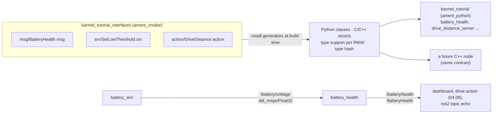

# 04.06 — Messages, interfaces and custom messages

<!-- glance:start -->
<!-- generated by tools/build.py from curriculum/syllabus.yaml — edit the syllabus, not this block -->

| | |
|---|---|
| **Track** | Main path |
| **Difficulty** | Beginner |
| **Time** | 50 min |
| **Hardware** | none |
| **Software** | ros2, colcon |
| **Prerequisites** | [04.05 Packages, workspaces and colcon](04.05-packages-and-workspaces.md) |
| **Skip if** | You have defined and used a custom .msg in an interface package. |

<!-- glance:end -->

## What you will learn

- Read any `.msg`, `.srv` or `.action` definition and predict the Python object and the wire size it produces.
- Choose the right standard message (`std_msgs`, `geometry_msgs`, `sensor_msgs`, `nav_msgs`) before inventing your own.
- Create a separate `ament_cmake` interface package with a message, a service and an action, and use it from a Python package.
- Write `battery_health`, a node that publishes the custom `BatteryHealth` message.
- Explain how ROS 2 IDL differs from protobuf, and why changing a message definition on only one machine silently corrupts data.

## Why it matters

Messages are the contracts between karmel's processes, and eventually between your code and Nav2,
MoveIt, `robot_localization` and every driver you install. Picking `geometry_msgs/TwistStamped` for
velocity commands and `sensor_msgs/BatteryState` for the battery means dozens of existing tools
understand your robot for free. When no standard message fits, you define one, and the way you
package and version it decides whether the laptop and the Pi still understand each other after the next change.

In 04.04 the battery was a bare `Float32`, a number with no unit, no timestamp and no meaning.
Here it becomes a `BatteryHealth` message with a filtered voltage, an estimated charge, a state and a timestamp.
The same interface package also holds the service (04.07) and the action (04.08) for the rest of the module.

<!-- prereqs:start -->
## Prerequisites

You need these first:

- [04.05 Packages, workspaces and colcon](04.05-packages-and-workspaces.md)

### Optional prerequisite links

None.

Check your readiness: `python course.py why 04.06`
<!-- prereqs:end -->

## Concept

A ROS 2 **interface** is a typed schema written in a small IDL, compiled at build time into Python classes,
C++ structs and serialization code. Three kinds:

| File | Structure | Used by |
|---|---|---|
| `msg/BatteryHealth.msg` | fields | topics (and as building blocks inside the others) |
| `srv/SetLowThreshold.srv` | request fields `---` response fields | services |
| `action/DriveDistance.action` | goal `---` result `---` feedback | actions |

If you know protobuf/gRPC, the workflow is familiar: a `.proto`-like file, a code generator, a contracts
package that clients and servers both depend on. The **differences** are what bite, and the
[Technical explanation](#technical-explanation) shows them with real experiments.

**Rule 1: search before you define.** The standard packages encode decades of robotics conventions:

| Package | Messages you'll use on karmel | Why standard matters |
|---|---|---|
| `std_msgs` | `Header` (stamp + frame_id) | Every stamped message embeds it. The primitive wrappers (`Float32`, `String`) carry no meaning, so they're fine for demos and bad for real interfaces. |
| `geometry_msgs` | `Twist`, `TwistStamped`, `Pose`, `PoseStamped`, `Point`, `Quaternion`, `Transform` | Nav2, `diff_drive_controller`, RViz, TF all speak them. Jazzy's `diff_drive_controller` expects **TwistStamped**. |
| `sensor_msgs` | `BatteryState`, `Range`, `Imu`, `LaserScan`, `Image`, `JointState` | Drivers publish them and visualization tools display them. |
| `nav_msgs` | `Odometry`, `Path`, `OccupancyGrid` | The navigation stack's inputs and outputs. |

All of them use SI units and REP-103 axes: meters, radians, seconds, volts; x forward, y left, z up.

**Rule 2: a separate interface package.** Interfaces live in their own `ament_cmake` package
(`karmel_tutorial_interfaces`), not inside the Python package that uses them. The code generators are CMake-based.
C++ and Python consumers can both depend on it without depending on each other's code. And it's the thing you version carefully,
the same reason you keep `.proto` files in a contracts project.

> [!TIP]
> **Ask your teacher:** "I'm going to describe a data flow on karmel. Before I define a custom message, find me the closest standard ROS 2 message and tell me honestly whether it fits."

## Technical explanation

### Level 1 — Field types

| IDL type | Python type | Wire size (CDR) | Notes |
|---|---|---|---|
| `bool`, `byte`, `char`, `int8`, `uint8` | `bool` / `bytes` / `int` | 1 | |
| `int16`, `uint16` | `int` | 2 | |
| `int32`, `uint32`, `float32` | `int` / `float` | 4 | |
| `int64`, `uint64`, `float64` | `int` / `float` | 8 | Python `float` is always 64-bit, and float32 fields lose precision: `11.1` comes back as `11.100000381469727`. |
| `string`, `string<=N` | `str` | 4 (length) + bytes + NUL | Bounded strings are rejected if longer than N. |
| `float32[3]` (fixed), `float32[<=10]` (bounded), `float32[]` (unbounded) | `numpy.ndarray` (fixed), `array.array` (bounded/unbounded numeric), `list` (others) | 4 (length, not for fixed) + elements | `sensor_msgs/BatteryState.cell_voltage` is `float32[]` → `array('f')`. Covariances are fixed `float64[36]` → `numpy.ndarray`. |
| `pkg/Msg` (nested) | the generated class | its fields inline | `std_msgs/Header header` |
| `uint8 STATE_LOW=1` (constant) | class attribute `BatteryHealth.STATE_LOW` | 0 (not sent) | Constants are primitives or strings, UPPER_CASE. |
| `float32 speed_m_s 0.25` (default) | initial value | | Without a default: zero, empty string, empty array. |

Naming rules are enforced by the generator: message names `CamelCase`, fields `snake_case` matching
`^(?!.*__)(?!.*_$)[a-z][a-z0-9_]*$`. A field called `Voltage` fails the build with `NameError: 'Voltage' is an invalid field name`.

**Units in names or comments, always.** `voltage_v`, `speed_m_s`, `distance_m`. A message field without a unit is a future bug.

### Level 2 — Practical: designing `BatteryHealth`

`sensor_msgs/BatteryState` already exists (see Code, below, for its fields). Real karmel will publish it in 04.16. So why a custom message?
`BatteryState` carries **measurements** (voltage, current, charge, cell voltages, percentage 0..1). It has no place for
a **derived judgment**: a filtered voltage, an OK/LOW/CRITICAL state with hysteresis, and the threshold that produced it.
Those are the outputs of your monitoring *policy*, and other nodes (the drive action in 04.08, a future "return to
charger" behavior) should consume the policy's decision, not re-implement it. That's a legitimate custom message.
A custom message that just re-labels `BatteryState` fields would not be.

Design decisions in [`BatteryHealth.msg`](code/src/karmel_tutorial_interfaces/msg/BatteryHealth.msg):

- `std_msgs/Header header`: when the sample was processed. Every message about the physical world should be stamped.
- Constants `STATE_OK/LOW/CRITICAL` instead of a string. Consumers compare `msg.state == BatteryHealth.STATE_CRITICAL`, with no typos possible.
- Both `voltage_v` (filtered) and `raw_voltage_v`, so debugging the filter doesn't need a second topic.
- `low_threshold_v`, the threshold *in force*. When 04.07 lets someone change it at runtime, every message documents its own context.

### Level 2 — Practical: creating the interface package

```bash
cd ~/karmel_ws/src
ros2 pkg create karmel_tutorial_interfaces --build-type ament_cmake --license Apache-2.0
cd karmel_tutorial_interfaces && rm -rf include src && mkdir msg srv action
# write msg/BatteryHealth.msg, srv/SetLowThreshold.srv, action/DriveDistance.action (see Code)
```

Two edits make it an interface package. Both are required, and forgetting either produces a clear CMake error:

1. `CMakeLists.txt`: `find_package(rosidl_default_generators REQUIRED)`, the dependencies, and `rosidl_generate_interfaces(...)`.
2. `package.xml`: `<buildtool_depend>rosidl_default_generators</buildtool_depend>`, `<exec_depend>rosidl_default_runtime</exec_depend>`, `<depend>` on packages whose messages you nest (here `std_msgs`), and `<member_of_group>rosidl_interface_packages</member_of_group>`.

Then build and inspect:

```bash
cd ~/karmel_ws
colcon build --packages-select karmel_tutorial_interfaces
source install/setup.bash
ros2 interface package karmel_tutorial_interfaces
ros2 interface show karmel_tutorial_interfaces/msg/BatteryHealth
ros2 interface proto karmel_tutorial_interfaces/msg/BatteryHealth    # a YAML template for `ros2 topic pub`
```

In the Python package, add `<depend>karmel_tutorial_interfaces</depend>` to `package.xml` and import it like any message:
`from karmel_tutorial_interfaces.msg import BatteryHealth`.

### Level 3 — Mathematics: how many bytes is a message?

ROS 2 on DDS serializes with **CDR** (Common Data Representation): a 4-byte encapsulation header, then fields
in declaration order, little-endian, each primitive **aligned** to a multiple of its own size (relative to the start of the data).
A string is a `uint32` length (including the terminating NUL) followed by the bytes.

$$\text{offset}_{k} = \left\lceil \frac{\text{end}_{k-1}}{a_k} \right\rceil a_k, \qquad \text{end}_k = \text{offset}_k + \text{size}_k$$

**Worked example: `BatteryHealth` with `frame_id = 'base_link'`** (offsets relative to the data start):

| Field | Align | Offset | Size | End |
|---|---|---|---|---|
| `header.stamp.sec` (int32) | 4 | 0 | 4 | 4 |
| `header.stamp.nanosec` (uint32) | 4 | 4 | 4 | 8 |
| `header.frame_id` length (uint32) | 4 | 8 | 4 | 12 |
| `header.frame_id` bytes `base_link\0` | 1 | 12 | 10 | 22 |
| `voltage_v` (float32) | 4 | **24** (2 bytes padding) | 4 | 28 |
| `raw_voltage_v`, `percent` | 4 | 28, 32 | 4 each | 36 |
| `state` (uint8) | 1 | 36 | 1 | 37 |
| `low_threshold_v` (float32) | 4 | **40** (3 bytes padding) | 4 | 44 |

Total $= 4 + 44 = 48$ bytes. With an empty `frame_id` (only the NUL): length at 8–12, NUL at 12, `voltage_v` aligned to 16,
the three floats end at 28, `state` at 28, `low_threshold_v` aligned to 32 → end 36, total $4 + 36 =$ **40** bytes.
Measured with `rclpy.serialization.serialize_message` on Jazzy: **48** and **40** bytes. A bare `Float32` is **8** (header + 4).
One detail the formula doesn't show: for messages made only of fixed-size fields (no strings or unbounded arrays), the serializer also
pads the **end** to a multiple of 4. `std_msgs/UInt8` measures 8 bytes, not 5.

Two practical conclusions. Field order changes size: putting `state` last would save the 3 padding bytes.
That's irrelevant at 2 Hz, and it matters for a 10,000-element array at 30 Hz. And the numbers are tiny compared with
the 921,600-byte camera frame from [04.01](04.01-why-middleware.md). Message design is about meaning first, size second.

### Level 3 — ROS 2 IDL versus protobuf, measured

| | protobuf | ROS 2 `.msg` (CDR) |
|---|---|---|
| Field identity on the wire | field **number** + wire type | **position** only |
| Unknown / missing fields | skipped / default | not detectable: bytes are simply read in order |
| Add a field | safe (new number) | safe only if **appended** and only by luck of the reader stopping early |
| Reorder / rename / retype | reorder and rename safe, retype unsafe | reorder or retype = **silent corruption**. Rename is invisible on the wire. |
| Optional presence | `optional`, `has_x()` | none. Zero is indistinguishable from "not set". Use NaN or explicit flags. |
| Schema check at connect | none | a **type hash** (`RIHS01_…`) per endpoint, visible in `ros2 topic info -v`. On Jazzy, mismatched hashes **still connect** (tested below). |
| Size of a message of zeros | ~0 bytes | full size |

**The experiment** (run in Docker for this lesson, Jazzy, Fast DDS). A second workspace built a modified `BatteryHealth`,
and `ros2 topic pub` published it. `ros2 topic echo` using the *original* definition received:

1. **Field appended** at the end (`float32 temperature_c`): the old reader showed correct values. The extra 4 bytes were ignored. The type hashes differed, and nothing warned.
2. **Field inserted first** (`float32 temperature_c` before `voltage_v`), published as `temperature_c: 30.0, voltage_v: 11.1, raw_voltage_v: 11.2, percent: 44.0, state: 1, low_threshold_v: 10.5`. The old reader printed:

```text
voltage_v: 30.0
raw_voltage_v: 11.100000381469727
percent: 11.199999809265137
state: 0
low_threshold_v: 1.401298464324817e-45
```

Every field is shifted by one position. The battery "reads" 30 V, the state says OK, and no error appears anywhere.
On a robot, that's a monitor that never warns. The rules that follow:

- **Treat a published message definition as immutable.** Change = new message name (`BatteryHealth2`) or new topic, with a transition period that publishes both.
- **Deploy interface packages to every machine together** (laptop, Pi, containers) and rebuild everything that depends on them.
- Use `ros2 topic info -v` and compare `Topic type hash` across endpoints when data looks wrong. Different hashes mean different definitions.

### Level 4 — Implementation: what the generator produces

`colcon build` of the interface package runs `rosidl` generators and installs, per message:

- **Python:** `karmel_tutorial_interfaces/msg/_battery_health.py` (the class with `__slots__`, properties and optional field checks) plus a C extension (`_battery_health_s.c`) that converts between Python objects and C structs.
- **C and C++:** headers such as `battery_health.hpp` (struct `karmel_tutorial_interfaces::msg::BatteryHealth`).
- **Type support libraries** for each RMW (Fast DDS, Cyclone, introspection), the code that actually serializes.
- **The type description and hash** used by `ros2 interface show` and the `get_type_description` service.

That's why this tiny package took ~60 s to build while the Python package took 8 s ([04.05](04.05-packages-and-workspaces.md)),
and why **every change to an interface requires a rebuild of the interface package and a re-source**, with or without `--symlink-install`.

## Diagram



The CDR bytes of `BatteryHealth` (frame_id `base_link`, voltage 11.1, state LOW), as serialized on Jazzy:

```text
offset  00 01 02 03   meaning
  -4    00 01 00 00   encapsulation: CDR, little-endian
   0    00 00 00 00   header.stamp.sec      = 0
   4    00 00 00 00   header.stamp.nanosec  = 0
   8    0a 00 00 00   frame_id length       = 10
  12    62 61 73 65   "base"
  16    5f 6c 69 6e   "_lin"
  20    6b 00 .. ..   "k\0" + 2 padding bytes
  24    9a 99 31 41   voltage_v             = 11.1 (float32)
  28    00 00 00 00   raw_voltage_v         = 0.0
  32    00 00 00 00   percent               = 0.0
  36    01 .. .. ..   state = 1 (LOW) + 3 padding bytes
  40    00 00 00 00   low_threshold_v       = 0.0
```

## Code

### The interface package

[`msg/BatteryHealth.msg`](code/src/karmel_tutorial_interfaces/msg/BatteryHealth.msg):

```text
# Health summary of karmel's 3S Li-ion pack, derived from the raw voltage.
# Published by karmel_tutorial/battery_health on /battery/health (lesson 04.06).
#
# The raw measurement belongs in sensor_msgs/BatteryState (lesson 04.16). This message adds
# what BatteryState does not have: a filtered voltage, a coarse health state with hysteresis,
# and the threshold that produced it.

# Health states (constants: generated as class attributes, e.g. BatteryHealth.STATE_LOW)
uint8 STATE_OK=0
uint8 STATE_LOW=1
uint8 STATE_CRITICAL=2

std_msgs/Header header      # stamp = when the voltage sample was processed
float32 voltage_v           # low-pass filtered pack voltage [V]
float32 raw_voltage_v       # last unfiltered sample [V]
float32 percent             # 0..100, crude linear estimate between cutoff and full
uint8 state                 # one of STATE_*
float32 low_threshold_v     # threshold in force when this message was produced [V]
```

The service and action files are explained in [04.07](04.07-services.md) and [04.08](04.08-actions.md). They're already in the package:
[`srv/SetLowThreshold.srv`](code/src/karmel_tutorial_interfaces/srv/SetLowThreshold.srv),
[`action/DriveDistance.action`](code/src/karmel_tutorial_interfaces/action/DriveDistance.action).

[`CMakeLists.txt`](code/src/karmel_tutorial_interfaces/CMakeLists.txt):

```cmake
cmake_minimum_required(VERSION 3.8)
project(karmel_tutorial_interfaces)

find_package(ament_cmake REQUIRED)
find_package(rosidl_default_generators REQUIRED)
find_package(std_msgs REQUIRED)

# Generates C, C++ and Python code (plus type support for the RMW) for every interface.
rosidl_generate_interfaces(${PROJECT_NAME}
  "msg/BatteryHealth.msg"
  "srv/SetLowThreshold.srv"
  "action/DriveDistance.action"
  DEPENDENCIES std_msgs
)

ament_export_dependencies(rosidl_default_runtime)
ament_package()
```

[`package.xml`](code/src/karmel_tutorial_interfaces/package.xml):

```xml
<?xml version="1.0"?>
<?xml-model href="http://download.ros.org/schema/package_format3.xsd" schematypens="http://www.w3.org/2001/XMLSchema"?>
<package format="3">
  <name>karmel_tutorial_interfaces</name>
  <version>0.1.0</version>
  <description>Custom message, service and action used by the ROS 2 lessons 04.06-04.08.</description>
  <maintainer email="student@example.com">karmel course</maintainer>
  <license>Apache-2.0</license>

  <buildtool_depend>ament_cmake</buildtool_depend>
  <buildtool_depend>rosidl_default_generators</buildtool_depend>

  <depend>std_msgs</depend>

  <exec_depend>rosidl_default_runtime</exec_depend>

  <member_of_group>rosidl_interface_packages</member_of_group>

  <export>
    <build_type>ament_cmake</build_type>
  </export>
</package>
```

### The logic, separated from ROS

[`karmel_tutorial/battery_logic.py`](code/src/karmel_tutorial/karmel_tutorial/battery_logic.py) holds the filter, the percent estimate and the
hysteresis state machine as plain Python (no rclpy), tested by `test/test_battery_logic.py`. It's the "hardware
abstraction + fake" idea from [03.05](../03-robot-software/03.05-hardware-abstraction.md) applied to ROS: the node is a thin adapter.
The key parts:

```python
def estimate_percent(voltage_v: float, empty_v: float = CUTOFF_V,
                     full_v: float = FULL_V) -> float:
    """Crude linear state-of-charge estimate, clamped to 0..100 %."""
    fraction = (voltage_v - empty_v) / (full_v - empty_v)
    return 100.0 * min(1.0, max(0.0, fraction))


@dataclass
class LowPassFilter:
    """Exponential moving average: y = alpha * x + (1 - alpha) * y_previous."""

    alpha: float = 0.3
    value: float | None = None

    def update(self, sample: float) -> float:
        """Add a sample and return the filtered value."""
        if self.value is None:
            self.value = sample
        else:
            self.value = self.alpha * sample + (1.0 - self.alpha) * self.value
        return self.value
```

Numerical check for the filter and the estimate (the unit tests assert these): samples 12.0 then 11.0 give
$y_1 = 12.0$, $y_2 = 0.3 \cdot 11.0 + 0.7 \cdot 12.0 = 11.70$, $y_3 = 0.3 \cdot 11.0 + 0.7 \cdot 11.70 = 11.49$.
A filtered 11.4 V is $(11.4 - 9.9)/(12.6 - 9.9) = 55.6\,\%$. It's a crude estimate. Li-ion discharge curves are flat in the middle,
which is why [01.14](../01-first-robot/01.14-battery-monitoring.md) discusses better state-of-charge methods.

### The node: `battery_health.py` (publishing part)

Full file: [`karmel_tutorial/battery_health.py`](code/src/karmel_tutorial/karmel_tutorial/battery_health.py). It also contains the
service you'll study in 04.07 (marked `# --- lesson 04.07`). The part for this lesson:

```python
from karmel_tutorial.battery_logic import (BatteryHealthTracker, estimate_percent,
                                           HealthState, LowPassFilter)
from karmel_tutorial_interfaces.msg import BatteryHealth
from karmel_tutorial_interfaces.srv import SetLowThreshold
import rclpy
from rclpy.executors import ExternalShutdownException
from rclpy.node import Node
from std_msgs.msg import Float32


class BatteryHealthNode(Node):
    """Filter the voltage, classify it, publish the result, accept threshold changes."""

    def __init__(self) -> None:
        super().__init__('battery_health')
        self._filter = LowPassFilter(alpha=0.3)
        self._tracker = BatteryHealthTracker()
        self._publisher = self.create_publisher(BatteryHealth, 'battery/health', 10)
        self._subscription = self.create_subscription(
            Float32, 'battery/voltage', self._on_voltage, 10)
        # --- lesson 04.07: the service -------------------------------------------------
        self._service = self.create_service(
            SetLowThreshold, 'battery/set_low_threshold', self._on_set_low_threshold)
        self.get_logger().info('battery_health ready')

    def _on_voltage(self, msg: Float32) -> None:
        filtered = self._filter.update(msg.data)
        previous = self._tracker.state
        state = self._tracker.update(filtered)

        out = BatteryHealth()
        out.header.stamp = self.get_clock().now().to_msg()
        out.voltage_v = filtered
        out.raw_voltage_v = msg.data
        out.percent = estimate_percent(filtered)
        out.state = int(state)
        out.low_threshold_v = self._tracker.low_threshold_v
        self._publisher.publish(out)

        if state != previous:
            text = f'{previous.name} -> {state.name} at {filtered:.2f} V ({out.percent:.0f} %)'
            if state == HealthState.CRITICAL:
                self.get_logger().error(text)
            elif state == HealthState.LOW:
                self.get_logger().warn(text)
            else:
                self.get_logger().info(text)
```

Note `out.state = int(state)`: `HealthState` is an `IntEnum`, and converting explicitly keeps the uint8 field a plain `int`.

### The standard alternative you'll use in 04.16: `sensor_msgs/BatteryState`

Output of `ros2 interface show sensor_msgs/msg/BatteryState` (constants trimmed):

```text
std_msgs/Header  header
float32 voltage          # Voltage in Volts (Mandatory)
float32 temperature      # Temperature in Degrees Celsius (If unmeasured NaN)
float32 current          # Negative when discharging (A)  (If unmeasured NaN)
float32 charge           # Current charge in Ah  (If unmeasured NaN)
float32 capacity         # Capacity in Ah (last full capacity)  (If unmeasured NaN)
float32 design_capacity  # Capacity in Ah (design capacity)  (If unmeasured NaN)
float32 percentage       # Charge percentage on 0 to 1 range  (If unmeasured NaN)
uint8   power_supply_status     # The charging status as reported. Values defined above
uint8   power_supply_health     # The battery health metric. Values defined above
uint8   power_supply_technology # The battery chemistry. Values defined above
bool    present          # True if the battery is present
float32[] cell_voltage   # An array of individual cell voltages for each cell in the pack
```

Note the conventions: **NaN** means "not measured" (the answer to "no optional fields"), and `percentage` is **0..1**, not 0..100.

## Exercise

Hardware: none. Sourced Jazzy environment and the workspace from [04.05](04.05-packages-and-workspaces.md).

### Exercise 04.06-E1 — Build the interface package `[coding]`

1. Create `karmel_tutorial_interfaces` in `~/karmel_ws/src` (commands above), and copy the three interface files and the `CMakeLists.txt`/`package.xml` from `04-ros2/code/src/karmel_tutorial_interfaces/`. Alternatively, write them yourself from the listings.
2. `colcon build --packages-select karmel_tutorial_interfaces`, source, then `ros2 interface list | grep karmel`, `ros2 interface show ...BatteryHealth`, `ros2 interface proto ...BatteryHealth`.
3. Break it twice on purpose, one at a time: rename `voltage_v` to `Voltage`, then remove `<member_of_group>` from `package.xml`. Read both errors and restore.

### Exercise 04.06-E2 — Publish and inspect `BatteryHealth` `[coding]`

1. Add `battery_logic.py`, `battery_health.py`, the `battery_health` entry point and `<depend>karmel_tutorial_interfaces</depend>` to your `karmel_tutorial` (or build the course workspace with `--packages-up-to karmel_tutorial`).
2. Run `battery_sim --ros-args -p drain_v_per_s:=0.1` and `battery_health`.
3. `ros2 topic echo /battery/health --once`, `ros2 topic echo /battery/health --field percent`, `ros2 topic hz /battery/health`.
4. Wait for the state transitions and note the timestamps in the `battery_health` log.

### Exercise 04.06-E3 — Wire size by hand `[numerical]`

A colleague proposes `WheelTelemetry.msg`: `std_msgs/Header header` (frame_id `""`), `uint8 flags`, `float64 left_rad_s`, `float64 right_rad_s`, `int32 left_ticks`, `int32 right_ticks`.

1. Compute the CDR size in bytes including the 4-byte encapsulation header.
2. Reorder the fields to minimize padding and compute the new size.
3. At 50 Hz, how many bytes per second does the reordering save? Is it worth it?
4. Verify both with `python3 -c "from rclpy.serialization import serialize_message; ..."` after building the message (optional).

### Exercise 04.06-E4 — Predict schema drift `[predict]`

Use a second workspace `~/ws_drift` containing a copy of `karmel_tutorial_interfaces`. Build it in a terminal where only `/opt/ros/jazzy` is sourced.

1. Append `float32 temperature_c` at the end of `BatteryHealth.msg` in `ws_drift`, build, and in a `ws_drift`-sourced terminal run
   `ros2 topic pub -r 2 /battery/health karmel_tutorial_interfaces/msg/BatteryHealth "{voltage_v: 11.1, temperature_c: 30.0}"`.
   **Predict** what `ros2 topic echo /battery/health --once` prints in a terminal sourced with the **original** workspace. Then run it.
2. Move `temperature_c` to be the first field after `header`, rebuild `ws_drift`, and publish
   `"{temperature_c: 30.0, voltage_v: 11.1, raw_voltage_v: 11.2, percent: 44.0, state: 1, low_threshold_v: 10.5}"`. Predict, then run.
3. In both cases compare `Topic type hash` in `ros2 topic info /battery/health -v`.

### Exercise 04.06-E5 — Also publish the standard message `[coding]`

Extend your `battery_health` to publish `sensor_msgs/BatteryState` on `battery/state` as well:
`voltage` = raw voltage, `percentage` = the estimate on a **0..1** scale, `current`, `temperature`, `charge`, `capacity` = NaN (unmeasured),
`design_capacity` = 3.5 Ah, `power_supply_technology` = `POWER_SUPPLY_TECHNOLOGY_LION`, `present = True`, `cell_voltage` = three equal values (voltage / 3).
Add `sensor_msgs` to `package.xml`. Check with `ros2 topic echo /battery/state --once`.

## Expected result

**04.06-E1:** `ros2 interface list | grep karmel` prints the three interfaces:

```text
    karmel_tutorial_interfaces/msg/BatteryHealth
    karmel_tutorial_interfaces/srv/SetLowThreshold
    karmel_tutorial_interfaces/action/DriveDistance
```

`ros2 interface show` prints the definition with the header expanded (`builtin_interfaces/Time stamp`, `int32 sec`, `uint32 nanosec`, `string frame_id`).
`ros2 interface proto` prints a YAML template with all fields at zero. The build takes tens of seconds (about 60 s in Docker on a laptop).
Break 1: `NameError: 'Voltage' is an invalid field name.  It should have the pattern '^(?!.*__)(?!.*_$)[a-z][a-z0-9_]*$'`.
Break 2: `Packages installing interfaces must include '<member_of_group>rosidl_interface_packages</member_of_group>' in their package.xml`.

**04.06-E2:** Real output of `ros2 topic echo /battery/health --once` shortly after start:

```text
header:
  stamp:
    sec: 1789623153
    nanosec: 910354229
  frame_id: ''
voltage_v: 12.418840408325195
raw_voltage_v: 12.369768142700195
percent: 93.2903823852539
state: 0
low_threshold_v: 10.5
---
```

`voltage_v` is smoother than `raw_voltage_v` and lags slightly behind it during discharge. `ros2 topic hz` shows ≈2.0 Hz (one health message per voltage sample).
With drain 0.1 V/s, the log shows `OK -> LOW` about 21–23 s after start (filter lag adds ~1 s to the 21 s of pure discharge) and
`LOW -> CRITICAL at 9.8x V (0 %)` about 6 s later, e.g. `[ERROR] [...] [battery_health]: LOW -> CRITICAL at 9.86 V (0 %)`.

**04.06-E3:** (1) Header: sec 0–4, nanosec 4–8, frame_id length 8–12, NUL at 12 → end 13. `flags` 13–14. `left_rad_s` aligned to 16 → 24, `right_rad_s` 24–32, `left_ticks` 32–36, `right_ticks` 36–40. Total $4 + 40 =$ **44 bytes** (2 bytes padding).
(2) The "obvious" reorder, largest-last (header, ints, doubles, `flags`), is **worse**: ints 16–24 (3 bytes padding after the NUL), doubles 24–40, `flags` 40–41 → **45 bytes**. `flags` first then ints then doubles gives **44**. The padding after the variable-length `frame_id` can't be avoided, so 44 is the minimum.
All three sizes were measured by building the variants on Jazzy: 44, 45, 44.
(3) Nothing to gain: at best 0 bytes, at worst a 1-byte loss, ×50 Hz = 50 bytes/s. Not worth a less readable message. Order fields by meaning.

**04.06-E4:** (1) The original-type echo shows `voltage_v: 11.1…` and all other fields 0. The appended field is silently ignored, no error.
(2) It shows `voltage_v: 30.0`, `raw_voltage_v: 11.1…`, `percent: 11.199…`, `state: 0`, `low_threshold_v: 1.401298464324817e-45`, silently wrong.
(3) The `Topic type hash` of the publisher and of the echo subscription differ in both cases (`RIHS01_…` strings), and they connect anyway.

**04.06-E5:** `ros2 topic echo /battery/state --once` shows `voltage: 12.3…`, `temperature: .nan`, `current: .nan`, `charge: .nan`, `capacity: .nan`,
`design_capacity: 3.5`, `percentage: 0.9…` (between 0 and 1), `power_supply_technology: 2`, `present: true`, and `cell_voltage` with three values ≈ 4.1.

## Troubleshooting

### Symptom: `ModuleNotFoundError: No module named 'karmel_tutorial_interfaces'`

1. Is the interface package built? `ls install/karmel_tutorial_interfaces`. If it's missing: `colcon build --packages-up-to karmel_tutorial`.
2. Is the terminal sourced **after** that build? Re-source or open a new terminal.
3. Is `<depend>karmel_tutorial_interfaces</depend>` in `karmel_tutorial/package.xml`? Without it colcon may build the Python package first.

### Symptom: the interface package fails to build

Read the first CMake error, not the last:

1. `invalid field name` / `invalid message name` → naming rules (snake_case fields, CamelCase types).
2. `Unable to find ... std_msgs/Header` or `is not a known ...` → the nested package is missing from `DEPENDENCIES` in `CMakeLists.txt` and from `<depend>` in `package.xml`.
3. `must include '<member_of_group>rosidl_interface_packages'` → add it.
4. Out of memory on the Pi → `MAKEFLAGS=-j1 colcon build --packages-select karmel_tutorial_interfaces`.

### Symptom: I changed the `.msg` and nothing changed

Interfaces are compiled: rebuild the interface package (symlink install doesn't help), rebuild dependents, and **restart** running nodes and re-source terminals.
If an old definition still appears, `rm -rf build/karmel_tutorial_interfaces install/karmel_tutorial_interfaces` and rebuild.

### Symptom: values on a topic are plausible but wrong (shifted, tiny exponents like `1.4e-45`, huge numbers)

Suspect definition drift before suspecting your algorithm:

1. `ros2 topic info /topic -v` → compare `Topic type hash` of all endpoints. Different → different definitions.
2. Check which workspace each machine or container has sourced (`ros2 pkg prefix karmel_tutorial_interfaces`) and when it was built.
3. Rebuild and redeploy the interface package everywhere, then restart all nodes.

### Symptom: `ros2 topic pub` fails with `Failed to populate field` or `... has no attribute ...`

The YAML doesn't match the definition. `ros2 interface proto <type>` gives the exact template to edit.

## Common mistakes

- **Defining a custom message that duplicates a standard one.** You lose every tool that understands the standard. Search `sensor_msgs`, `geometry_msgs`, `nav_msgs` first.
- **Putting `.msg` files in the Python package.** `ament_python` can't generate interfaces. Use a separate `ament_cmake` interface package.
- **Unit-less field names** (`voltage`, `speed`). Put the unit in the name or the comment.
- **Using `std_msgs/Float32` or `String` for real interfaces.** No timestamp, no frame, no meaning.
- **Editing a deployed message in place.** Position-based CDR turns reorders into silent corruption. Add a new message or topic instead.
- **Treating 0 as "not set".** Use NaN (as `BatteryState` does) or explicit flags.
- **Forgetting that percentages in `BatteryState` are 0..1.** A dashboard then shows 0.93 %.

## Knowledge check

1. Why must interfaces live in an `ament_cmake` package, and why is it good practice to keep them separate from the nodes even in C++?
   <details><summary>Answer</summary>

   The rosidl code generators are driven by CMake (`rosidl_generate_interfaces`), and `ament_python` has no such step. Separately: consumers in any language depend only on the contract, not on another node's implementation, and the contract can be versioned, built once and deployed consistently to every machine, like a shared `.proto` package.
   </details>

2. Compute the CDR size (with the 4-byte encapsulation header) of a message `uint8 mode`, `float64 speed_m_s`, `uint8 flags`.
   <details><summary>Answer</summary>

   `mode` 0–1, `speed_m_s` aligned to 8 → 8–16 (7 bytes padding), `flags` 16–17. Data = 17 bytes → 21, and because the message is all fixed-size fields the end is padded to a multiple of 4: **24** bytes (measured on Jazzy). Reordered as `float64`, `uint8`, `uint8`: data 10 → 14 → padded **16** bytes (measured).
   </details>

3. Predict: the Pi's workspace has an old `BatteryHealth` without `raw_voltage_v` (so `voltage_v, percent, state, low_threshold_v`), and the laptop publishes the new one. What does the Pi read for `percent`?
   <details><summary>Answer</summary>

   Fields are read by position: after `voltage_v` the Pi reads the next 4 bytes as `percent`, but those are the laptop's `raw_voltage_v` (e.g. 12.37). The following fields are also misread, and there's no error. The type hashes differ, which `ros2 topic info -v` would reveal.
   </details>

4. When is a custom message justified instead of `sensor_msgs/BatteryState`? Give the criterion and apply it to `BatteryHealth`.
   <details><summary>Answer</summary>

   When the data has a meaning no standard message expresses, not merely different field names. `BatteryHealth` carries a policy decision (filtered voltage, hysteresis state, threshold in force) that `BatteryState` can't represent. The raw measurement itself should still be published as `BatteryState`.
   </details>

5. How does ROS 2 express "this field was not measured", given there's no optional presence like protobuf's `has_field()`?
   <details><summary>Answer</summary>

   By convention in the message documentation: NaN for floats (as `BatteryState` does), a separate boolean or flag field, or a sentinel constant documented in the `.msg`. Zero can't be used, because zero is a valid value and also the default.
   </details>

6. Debugging: after renaming a field in the `.msg`, `battery_health` crashes with `AttributeError: 'BatteryHealth' object has no attribute 'voltage_v'` on the Pi but works on the laptop. What is the systematic fix?
   <details><summary>Answer</summary>

   The Pi runs code or an interface build that doesn't match. Deploy the same revision of both packages to the Pi, rebuild the interface package and its dependents there (`colcon build --packages-up-to karmel_tutorial`), re-source, restart all nodes. Then verify with `ros2 interface show` on both machines and matching type hashes in `ros2 topic info -v`.
   </details>

7. `BatteryHealth.STATE_LOW` is a constant in the message. How many bytes does it add to each published message, and why?
   <details><summary>Answer</summary>

   Zero. Constants are generated as class attributes in code and never serialized. Only fields are sent.
   </details>

## Practical challenge

**Design karmel's telemetry contract.** Create a package `karmel_contract_interfaces` with the messages that
the real base node in 04.16 could publish **beyond** the standard ones.

Acceptance criteria:

- A written table (in the package README or your notes) of every data flow of karmel's base, marking which standard message covers it (`nav_msgs/Odometry`, `sensor_msgs/BatteryState`, `sensor_msgs/Range`, `sensor_msgs/JointState`, `geometry_msgs/TwistStamped`) and which don't.
- At most two custom messages, each with a Header, units in every field name or comment, documented constants instead of magic numbers, and NaN or flag semantics for unmeasured values.
- One of them represents the Pico's `flags` bitfield from the protocol ([labs/README.md](../labs/README.md)) as named constants.
- It builds with `colcon build`, `ros2 interface show` displays it, and a Python script publishes one instance that `ros2 topic echo --once` prints.
- A one-paragraph versioning policy: what you'll do when a field must change after the robot is deployed.

## You can skip this if…

You have defined and used a custom message in an interface package, you can explain CDR's position-based encoding and its consequences
versus protobuf, and you answer knowledge-check questions 2, 3 and 5 correctly.

`python course.py skip 04.06 --reason "Built custom interface packages before"`

## Go deeper

- https://docs.ros.org/en/jazzy/Concepts/Basic/About-Interfaces.html — the full interface definition language: types, bounds, defaults, constants, naming rules.
- https://docs.ros.org/en/jazzy/Tutorials/Beginner-Client-Libraries/Custom-ROS2-Interfaces.html — the official tutorial creating a msg and srv package.
- https://docs.ros.org/en/jazzy/Tutorials/Beginner-Client-Libraries/Single-Package-Define-And-Use-Interface.html — the alternative of defining interfaces in the same (C++) package, and why it's rarely a good idea.
- https://design.ros2.org/articles/legacy_interface_definition.html — design article on the `.msg` format and its mapping to IDL.
- https://github.com/ros2/common_interfaces — source of `std_msgs`, `geometry_msgs`, `sensor_msgs`, `nav_msgs`: read the comments in the `.msg` files, they're the documentation.
- https://www.ros.org/reps/rep-0103.html — REP-103, units and coordinate conventions every message follows.

## Progress checkpoint

- [ ] I can read `.msg/.srv/.action` files and predict their Python types and wire size.
- [ ] I can pick a standard message before designing a custom one, and justify a custom one.
- [ ] I can create and build an `ament_cmake` interface package and use it from Python.
- [ ] I can run `battery_health` and inspect `BatteryHealth` messages from the CLI.
- [ ] I can explain why changing a message definition on one machine corrupts data silently, and how to evolve interfaces safely.

`python course.py complete 04.06` (exercises done) · `python course.py master 04.06` (challenge done) · `python course.py struggle 04.06 "what was hard"`

Next: [04.07 — Services](04.07-services.md): change the low-battery threshold at runtime, without deadlocking.
