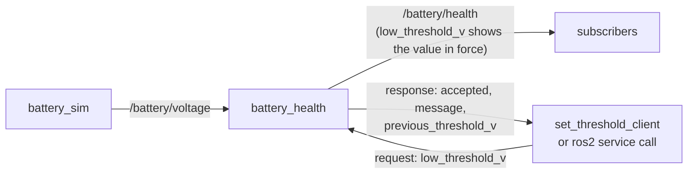

# 04.07 — Services — request/response

<!-- glance:start -->
<!-- generated by tools/build.py from curriculum/syllabus.yaml — edit the syllabus, not this block -->

| | |
|---|---|
| **Track** | Main path |
| **Difficulty** | Beginner |
| **Time** | 45 min |
| **Hardware** | none |
| **Software** | ros2, rclpy |
| **Prerequisites** | [04.06 Messages, interfaces and custom messages](04.06-messages-and-custom-interfaces.md) |
| **Skip if** | You can write a service server and an async client without deadlocking. |

<!-- glance:end -->

## What you will learn

- Define a `.srv` interface and implement a service server that validates its input and answers fast.
- Call a service from the CLI and from a standalone Python client with `call_async`, a discovery wait and a timeout.
- Call a service from *inside* a node callback without deadlocking the executor, and explain exactly why the synchronous version hangs.
- Reason about timeouts, late responses and retries the way you would for any RPC, including idempotency.
- Decide between a service, a parameter, a topic and an action for a given command.

## Why it matters

Some interactions on karmel are questions or quick commands with an answer: "set the low-battery threshold to 11 V, and tell me if you accepted it",
"reset the odometry", "is the lidar ready?", "save the map". Topics can't express "did it work?", and actions are overkill for
something that takes a millisecond. That's what services are for.

Services are also where most new ROS 2 developers write their first **deadlock**: a node calls a service from a timer or
subscription callback, blocks, and freezes forever, taking the robot's control loop down with it. On a robot the frozen node
might be the one that sends `cmd_vel`. You'll reproduce the deadlock on purpose, understand it, and fix it. Lesson
[04.12](04.12-executors-and-callbacks.md) then generalizes the fix with executors and callback groups.

<!-- prereqs:start -->
## Prerequisites

You need these first:

- [04.06 Messages, interfaces and custom messages](04.06-messages-and-custom-interfaces.md)

### Optional prerequisite links

None.

Check your readiness: `python course.py why 04.07`
<!-- prereqs:end -->

## Concept

A ROS 2 service is a **typed unary RPC** between two nodes:

| | gRPC unary / HTTP | ROS 2 service |
|---|---|---|
| Contract | `.proto` rpc with request/response messages | `.srv`: request fields `---` response fields |
| Addressing | host:port + method | a name in the ROS graph (`/battery/set_low_threshold`), found by discovery |
| Status | gRPC status codes / HTTP status | **none**: put `bool accepted` / `string message` in the response yourself |
| Deadline | per-call deadline, propagated | **none**: the client must implement its own timeout |
| Retries, load balancing | client libs, proxies | none. Multiple servers with the same name is unsupported (which one answers is undefined). |
| Transport | HTTP/2 over TCP | DDS request/reply topics (`rq/.../Request`, `rr/.../Reply`) over UDP with RELIABLE QoS |

**When to use a service:** the call is quick (milliseconds, up to maybe 100 ms), the caller needs the answer, and there's no
need for progress or cancellation. "Set a threshold with validation" fits perfectly.

**When not to:** anything slow or cancellable → **action** (04.08); a continuous stream → **topic**; plain configuration that you'd
read at startup and occasionally tune → **parameter** ([04.09](04.09-parameters.md)). In fact, a threshold is often best modeled
as a parameter with a validation callback. We use a service here because it teaches the pattern and because the response carries a
domain-specific result (`accepted`, a human-readable reason, the previous value), which is a command-with-result, not just a setting.

> [!TIP]
> **Ask your teacher:** "Draw the single-threaded executor timeline for a timer callback that calls client.call(). Show exactly which event the response is waiting for and why it can never be processed."

## Technical explanation

### Level 1 — The three pieces

1. **Interface** (in `karmel_tutorial_interfaces`, built in 04.06):

   ```text
   float32 low_threshold_v       # requested threshold [V]
   ---
   bool accepted                 # false when the value is outside the safe range
   string message                # human-readable reason
   float32 previous_threshold_v  # threshold before this call [V]
   ```

2. **Server:** `self.create_service(SetLowThreshold, 'battery/set_low_threshold', self._on_set_low_threshold)`. The callback receives a filled
   `request` and an empty `response`, fills the response and **returns it**.
3. **Client:** `self.create_client(SetLowThreshold, 'battery/set_low_threshold')`, then `wait_for_service()`, then `call_async(request)` → a `Future`.

### Level 2 — Practical: writing a good server

The server lives in `battery_health` (04.06), because the threshold is that node's state:

- **Validate and reject explicitly.** A threshold below 10.1 V (cutoff 9.9 V + 0.2 V hysteresis) would let the warning come too late to protect the pack, and at or above 12.6 V (full) every state would be LOW. Return `accepted = False` with a reason, never raise. An exception in a service callback crashes the server node.
- **Be fast.** The callback runs on the node's executor thread. While it runs, `battery_health` processes no voltage messages. Do in-memory work only: no file I/O that can stall, no network calls, no `sleep`.
- **Return useful context** (`previous_threshold_v`) so the caller can log or undo.
- **Log state changes** at INFO, rejections at WARN.

### Level 2 — Practical: writing a good client

A standalone client (a CLI tool, a test script) owns its process, so it can spin until the answer arrives:

```python
client = node.create_client(SetLowThreshold, 'battery/set_low_threshold')
if not client.wait_for_service(timeout_sec=5.0):        # discovery is asynchronous
    ...error...
future = client.call_async(request)
rclpy.spin_until_future_complete(node, future, timeout_sec=5.0)
if not future.done():                                    # YOUR deadline, not ROS's
    client.remove_pending_request(future)
    ...error...
response = future.result()
```

`spin_until_future_complete` runs the executor (which delivers the response and completes the future) until the future is done or the timeout expires.

### Level 2 — Practical: calling a service from inside a node (the deadlock)

Inside a running node you are *already inside* `rclpy.spin()`. The rclpy source of `Client.call()` says it plainly:

```text
.. warning:: Do not call this method in a callback, or a deadlock or timeout may occur.
```

`call()` is `call_async()` plus a `threading.Event` that it waits on. The event is set by a done-callback on the future. The future is
completed when the executor processes the incoming response. With the default single-threaded executor, the only thread that could
process it is the one blocked in `event.wait()`. It waits forever.

The fix inside a node: **`call_async()` + `add_done_callback()`, and return from your callback immediately.** The response is handled
later, in a separate callback, by the same executor thread. It's the async/await mental model without the syntax, like
`ContinueWith` in .NET before `await` existed. (rclpy also supports `async def` callbacks that `await` futures. 04.12 covers them together with multi-threaded executors.)

### Level 3 — Mathematics: latency budgets and what a blocked executor costs

**Measured round-trip latency** (300 calls from a Python client to `battery_health` in the same container, Fast DDS, Jazzy, first 20 discarded):

| Server logging | median | p99 | max |
|---|---|---|---|
| INFO log line on every call | 2.84 ms | 14.05 ms | 29.32 ms |
| `--log-level warn` | 1.14 ms | 10.71 ms | 12.86 ms |

Two lessons: Python + DDS round trips are **milliseconds, not microseconds**, and the tail is 10× the median. Logging to the console
on every call doubled the median. Over Wi-Fi, add the network's latency and its much worse tail.

**What a slow callback costs.** If a callback blocks the executor for $T_b$ seconds, a periodic callback at frequency $f$ misses or delays

$$n_\text{missed} \approx \lfloor T_b \cdot f \rfloor$$

activations, and a subscription with queue depth $d$ receiving at rate $f$ *drops* $\max(0, \lfloor T_b f \rfloor - d)$ messages.

**Worked example.** Suppose the threshold service wrote the new value to an SD card and that took $T_b = 1.5$ s on a busy Pi.
`battery_health` receives voltage at $f = 2$ Hz with depth $d = 10$: $1.5 \cdot 2 = 3$ messages wait in the queue (none dropped, all processed 1.5 s late).
Now imagine the same node also ran a 50 Hz safety check: $1.5 \cdot 50 = 75$ missed checks, and in 1.5 s at 0.5 m/s karmel travels 0.75 m unsupervised.
A service callback that blocks is a safety problem, not a style issue.

**A deadlock is $T_b = \infty$.** Every other callback in the node stops forever, and the process stays alive, so a process-level health check says "running".

### Level 4 — Implementation: timeouts, late answers and idempotency

The client-side timeout doesn't cancel anything on the server. The experiment for this lesson froze `battery_health` with `SIGSTOP`
right after the client had discovered it, then called the service with a 5 s timeout:

```text
ready: True
server frozen; service_is_ready() = True
after 5.0 s: done=False
after resume 5.2 s: done=True result=low threshold 10.50 V -> 11.00 V
```

`service_is_ready()` stayed `True` for a frozen server, because discovery doesn't know it's frozen. The client's timeout expired. When the server was resumed, it
**processed the queued request and changed the threshold anyway**, 5.2 s after the call. Exactly the semantics you know from HTTP:
a timeout means "unknown outcome", not "didn't happen". Consequences:

- Make service handlers **idempotent** where possible. "Set threshold to 11.0" is idempotent, while "lower threshold by 0.1" is not.
  A retry of a non-idempotent request after a timeout can apply the change twice.
- After a timeout, **re-read the state** (the next `BatteryHealth` message carries `low_threshold_v`) instead of assuming.
- A client that starts *after* the server froze can't even discover it. In the same experiment, a fresh `set_threshold_client` reported
  `battery/set_low_threshold not available after 5 s`.

Under the hood, a service is a pair of DDS topics with RELIABLE QoS. Requests carry a client GUID and sequence number, and the reply is
routed back to that client. There's no connection, so there's nothing to "break": a dead server just means silence.

## Diagram

The deadlock and its fix, on a single-threaded executor:

```mermaid
sequenceDiagram
    participant E as Executor thread (deadlock_demo)
    participant C as Client
    participant S as battery_health (server)
    rect rgb(255, 235, 235)
    Note over E,S: sync — call() inside a timer callback
    E->>C: timer callback → client.call(req)
    C->>S: request
    S-->>C: response arrives (queued in DDS)
    Note over E: blocked in event.wait()<br/>nobody left to process the response
    Note over E: hangs forever
    end
    rect rgb(235, 255, 235)
    Note over E,S: async — call_async() + done callback
    E->>C: timer callback → future = call_async(req); add_done_callback(on_response)
    E-->>E: callback returns, executor free
    C->>S: request
    S-->>C: response
    E->>E: executor processes response → future done → on_response(future)
    end
```

Where the service sits in the karmel example:



## Code

### Server: the service part of `battery_health.py`

Full file: [`karmel_tutorial/battery_health.py`](code/src/karmel_tutorial/karmel_tutorial/battery_health.py). Registration in `__init__`:

```python
        self._service = self.create_service(
            SetLowThreshold, 'battery/set_low_threshold', self._on_set_low_threshold)
```

The handler:

```python
    def _on_set_low_threshold(self, request: SetLowThreshold.Request,
                              response: SetLowThreshold.Response) -> SetLowThreshold.Response:
        # Service callbacks must be fast: validate, update in-memory state, return.
        response.previous_threshold_v = self._tracker.low_threshold_v
        problem = self._tracker.check_threshold(request.low_threshold_v)
        if problem is not None:
            response.accepted = False
            response.message = problem
            self.get_logger().warn(f'Rejected threshold change: {problem}')
            return response
        self._tracker.low_threshold_v = request.low_threshold_v
        response.accepted = True
        response.message = (f'low threshold {response.previous_threshold_v:.2f} V -> '
                            f'{request.low_threshold_v:.2f} V')
        self.get_logger().info(response.message)
        return response
```

The validation lives in the ROS-free, unit-tested [`battery_logic.py`](code/src/karmel_tutorial/karmel_tutorial/battery_logic.py):

```python
    def check_threshold(self, low_threshold_v: float) -> str | None:
        """Return None when the threshold is acceptable, else the reason it is not."""
        minimum = self.critical_v + self.hysteresis_v
        if not minimum <= low_threshold_v < FULL_V:
            return (f'threshold must be in [{minimum:.2f}, {FULL_V:.2f}) V, '
                    f'got {low_threshold_v:.2f} V')
        return None
```

### Standalone client: `set_threshold_client.py`

[`karmel_tutorial/set_threshold_client.py`](code/src/karmel_tutorial/karmel_tutorial/set_threshold_client.py):

```python
"""
set_threshold_client: call battery/set_low_threshold once and print the answer (04.07).

Usage:
  ros2 run karmel_tutorial set_threshold_client 11.0
"""
import sys

from karmel_tutorial_interfaces.srv import SetLowThreshold
import rclpy
from rclpy.node import Node
from rclpy.utilities import remove_ros_args


def main(args=None) -> int:
    rclpy.init(args=args)
    argv = remove_ros_args(sys.argv)
    if len(argv) != 2:
        print('usage: ros2 run karmel_tutorial set_threshold_client <volts>')
        rclpy.try_shutdown()
        return 2

    node = Node('set_threshold_client')
    try:
        client = node.create_client(SetLowThreshold, 'battery/set_low_threshold')
        # Discovery is asynchronous: the server may exist but not be discovered yet.
        if not client.wait_for_service(timeout_sec=5.0):
            node.get_logger().error('battery/set_low_threshold not available after 5 s')
            return 1

        request = SetLowThreshold.Request()
        request.low_threshold_v = float(argv[1])
        future = client.call_async(request)
        # Spin this node until the response arrives (or 5 s pass). There is no
        # built-in deadline in ROS 2 services: the timeout is the client's job.
        rclpy.spin_until_future_complete(node, future, timeout_sec=5.0)
        if not future.done():
            client.remove_pending_request(future)
            node.get_logger().error('no response within 5 s')
            return 1

        response = future.result()
        status = 'accepted' if response.accepted else 'REJECTED'
        print(f'{status}: {response.message} '
              f'(previous {response.previous_threshold_v:.2f} V)')
        return 0 if response.accepted else 3
    finally:
        node.destroy_node()
        rclpy.try_shutdown()


if __name__ == '__main__':
    sys.exit(main())
```

`remove_ros_args` strips `--ros-args ...` so only your own arguments remain. The exit codes (0 accepted, 3 rejected, 1 unavailable/timeout)
make the tool scriptable.

### Calling from inside a node: `deadlock_demo.py`

[`karmel_tutorial/deadlock_demo.py`](code/src/karmel_tutorial/karmel_tutorial/deadlock_demo.py), the wrong way and the right way side by side:

```python
    def _on_timer(self) -> None:
        if not self._client.service_is_ready():
            self.get_logger().info('waiting for battery/set_low_threshold ...')
            return
        if self._mode == 'sync':
            self.get_logger().info('calling synchronously ...')
            response = self._client.call(self._request())  # never returns
            self.get_logger().info(f'got: {response.message}')
        else:
            self.get_logger().info('calling asynchronously ...')
            future = self._client.call_async(self._request())
            future.add_done_callback(self._on_response)

    def _on_response(self, future: Future) -> None:
        self.get_logger().info(f'got: {future.result().message}')
```

Note `service_is_ready()` (non-blocking) instead of `wait_for_service()` (blocking) inside the callback.

### Run it

```bash
# terminal 1..3: source /opt/ros/jazzy/setup.bash && source <workspace>/install/setup.bash
ros2 run karmel_tutorial battery_sim                        # 1
ros2 run karmel_tutorial battery_health                     # 2
ros2 service call /battery/set_low_threshold karmel_tutorial_interfaces/srv/SetLowThreshold "{low_threshold_v: 11.0}"   # 3
ros2 run karmel_tutorial set_threshold_client 9.5           # 3
```

## Exercise

Hardware: none. Build the course workspace (or yours) with `--packages-up-to karmel_tutorial` ([04.05](04.05-packages-and-workspaces.md)).

### Exercise 04.07-E1 — Call the service three ways `[coding]`

1. Start `battery_sim` (drain `0.1`) and `battery_health`.
2. `ros2 service list -t | grep battery`, `ros2 service type /battery/set_low_threshold`, `ros2 service find karmel_tutorial_interfaces/srv/SetLowThreshold`.
3. Set 11.0 V with `ros2 service call`. Then run `set_threshold_client 9.5` and `set_threshold_client 11.5`, printing `echo $?` after each.
4. Watch `ros2 topic echo /battery/health --field low_threshold_v` while you change it, and note when `battery_health` logs `OK -> LOW`.

### Exercise 04.07-E2 — Predict and fix the deadlock `[debugging]`

1. With `battery_health` running, **predict** what `ros2 run karmel_tutorial deadlock_demo sync` prints over 10 s, and what `battery_health` logs. Then run it.
2. While it hangs, in another terminal run `ros2 node list` and `ros2 topic echo /battery/health --field low_threshold_v --once`. Did the server process the request?
3. Run `deadlock_demo async` and compare.
4. Write down, in two sentences, why `sync` hangs even though the server answered.

### Exercise 04.07-E3 — Timeouts are "unknown outcome" `[predict]`

1. Start `battery_health`. In a Python script (use `set_threshold_client.py` as a template), create the client, `wait_for_service`, then **pause** the server from another terminal with `pkill -STOP -f lib/karmel_tutorial/battery_health` (the script can wait for Enter before calling).
2. Predict: does `wait_for_service`/`service_is_ready()` notice? What does a call with a 5 s timeout return? What happens when you `pkill -CONT` it 10 s later?
3. Change the service semantics on paper to "lower the threshold by 0.1 V" and describe what a client that retries after a timeout would do to the threshold.

### Exercise 04.07-E4 — Measure your latency budget `[numerical]`

1. Write `latency_probe.py`: 300 `call_async` + `spin_until_future_complete` round trips, discard the first 20, print median, p99 and max in milliseconds.
2. Run it against `battery_health` with default logging, then with `--ros-args --log-level warn`.
3. If karmel's teleop needed an answer within 20 ms 99% of the time, does a service meet it on your machine? Over Wi-Fi to the Pi?

### Exercise 04.07-E5 — A second service: reset the filter `[coding]`

Add `battery/reset_filter` to `battery_health` using the standard `std_srvs/srv/Trigger` (request empty; response `bool success`, `string message`).
It clears the low-pass filter and sets the state back to OK. Add `std_srvs` to `package.xml`, rebuild, and call it with
`ros2 service call /battery/reset_filter std_srvs/srv/Trigger`. Justify in a comment whether this should be a service, a parameter or a topic.

## Expected result

**04.07-E1:** Step 2 prints `/battery/set_low_threshold [karmel_tutorial_interfaces/srv/SetLowThreshold]` plus the node's parameter services,
the type, and `/battery/set_low_threshold`. Step 3 (real output):

```text
requester: making request: karmel_tutorial_interfaces.srv.SetLowThreshold_Request(low_threshold_v=11.0)

response:
karmel_tutorial_interfaces.srv.SetLowThreshold_Response(accepted=True, message='low threshold 10.50 V -> 11.00 V', previous_threshold_v=10.5)
```

```text
REJECTED: threshold must be in [10.10, 12.60) V, got 9.50 V (previous 11.00 V)
[ros2run]: Process exited with failure 3
accepted: low threshold 11.00 V -> 11.50 V (previous 11.00 V)
```

Exit codes 3 and 0. The `low_threshold_v` field in `/battery/health` changes within one message (≤ 0.5 s). With the threshold set to 11.5 V within the first
10 s and drain 0.1 V/s, `battery_health` logs `OK -> LOW at 11.4x V (5x %)` about 12 s after the simulator started, instead of ~22 s.

**04.07-E2:** `sync` prints exactly two lines and then nothing, forever:

```text
[INFO] [...] [deadlock_demo]: mode=sync
[INFO] [...] [deadlock_demo]: calling synchronously ...
```

`battery_health` **does** log `low threshold ... -> 10.60 V` at that moment, and `/battery/health` shows the new threshold. The server answered,
and the client's executor can't deliver the answer to itself. `ros2 node list` still shows `/deadlock_demo` (alive but stuck).
`async` prints `calling asynchronously ...` then `got: low threshold ...` every 2 s. Ctrl+C stops both.

**04.07-E3:** `service_is_ready()` stays `True`. The call's future isn't done after 5 s (your timeout path runs). After `pkill -CONT`, the server processes
the queued request and the threshold changes anyway (in the reference run, at 5.2 s). With "lower by 0.1 V" semantics, a retry after
the timeout lowers it twice (by 0.2 V in total), and more with every retry. Non-idempotent RPC plus retries equals duplicated effects.

**04.07-E4:** Order of magnitude on a laptop in Docker: median 1–3 ms, p99 10–15 ms, with console logging on every call roughly doubling the median.
Reference: median 2.84 / p99 14.05 ms with logging, 1.14 / 10.71 ms with `--log-level warn`. A 20 ms p99 is met locally. Over Wi-Fi to the Pi,
typical home Wi-Fi adds a few ms median and tens of ms tail, so p99 < 20 ms is unlikely. That's one reason teleop uses a topic stream, not services.

**04.07-E5:** `ros2 service call /battery/reset_filter std_srvs/srv/Trigger` returns
`std_srvs.srv.Trigger_Response(success=True, message='filter reset')` (your message text). The next `/battery/health` has `voltage_v` equal to `raw_voltage_v`
(filter restarted with the first sample). A service fits: it's a quick command with a result, not configuration and not a stream.

## Troubleshooting

### Symptom: the client waits forever at "waiting for service to become available..."

1. `ros2 service list | grep set_low` from the client's terminal. If it's missing, the server isn't running, or has a different name or namespace.
2. Same domain, same discovery range, same RMW in both terminals.
3. Name mismatch: relative vs absolute (`battery/set_low_threshold` inside a namespace becomes `/ns/battery/set_low_threshold`). `ros2 node info /battery_health` shows the exact name.
4. Type mismatch: `ros2 service type` must equal the client's type exactly, or the client never matches.

### Symptom: the node that calls a service freezes (no logs, no publications, CPU idle)

A synchronous `call()` (or `wait_for_service()` without timeout, or `spin_until_future_complete` on the node that's already spinning) inside a callback.
Confirm: the server's log shows the request was handled, but the client never logs the response. Fix: `call_async()` + `add_done_callback()`, or an
`async def` callback that awaits the future, or a MultiThreadedExecutor with a separate callback group ([04.12](04.12-executors-and-callbacks.md)).

### Symptom: the server node crashes when called

Read the traceback in the server's terminal:

1. An exception in the handler (bad input not validated, e.g. NaN) → validate and return `accepted = False`.
2. `The 'message' field must be of type 'str'` or an abort with `Assertion ... failed` → a response field with the wrong Python type (see [04.04](04.04-topics-publishers-subscribers.md#troubleshooting)).
3. Returning `None` instead of the response object → the client gets no valid response. Always `return response`.

### Symptom: calls work locally but time out from the laptop to the Pi

Discovery works (the service is listed) but request/response doesn't: the same unicast data path issues as topics ([04.02 troubleshooting](04.02-installing-ros2.md#troubleshooting)).
Test with a topic first (`ros2 topic echo` of a Pi topic). If topics work but services time out only under load, measure latency (E4) and raise the client timeout.

### Symptom: a timed-out call changed the state anyway

Expected: see Level 4. Re-read state after timeouts, and make handlers idempotent.

## Common mistakes

- **Calling `client.call()` inside a callback.** The classic deadlock. Use `call_async` + a done callback.
- **Slow work in a service handler** (file writes, serial round trips, sleeps). It stalls every other callback of the server node. Long work is an action.
- **Using a service for streaming or high-rate commands** (`cmd_vel` as a service). The latency tail and the blocking make it both slower and less safe than a topic with a watchdog.
- **No client timeout.** ROS services have no deadline, so a dead server hangs your client forever.
- **Assuming a timeout means "not executed".** It means "unknown".
- **Raising exceptions for invalid requests.** It crashes the server. Return a structured rejection.
- **Two nodes serving the same service name.** Unsupported, and the responder is unpredictable. Keep service names unique (use namespaces).

## Knowledge check

1. Name three things a gRPC unary call gives you that a ROS 2 service doesn't, and how you compensate for each.
   <details><summary>Answer</summary>

   Status codes (→ `bool accepted` / `string message` fields in the response), deadlines (→ client-side timeout with `spin_until_future_complete(..., timeout_sec)` and `remove_pending_request`), connection-level failure detection (→ timeouts, and re-reading state; `service_is_ready()` only reflects discovery). Retries/load balancing also don't exist.
   </details>

2. Explain precisely why `client.call()` in a timer callback deadlocks with `rclpy.spin(node)`.
   <details><summary>Answer</summary>

   `call()` sends the request and blocks the current thread on a `threading.Event`. The event is set by a done-callback when the future completes, and the future is completed when the executor processes the response. The single-threaded executor's only thread is the one blocked inside the timer callback, so the response is never processed and the event is never set.
   </details>

3. A node receives voltage at 20 Hz with queue depth 10 and has a 50 Hz safety timer. A service handler blocks for 0.8 s. How many timer activations are missed, and how many voltage messages are dropped?
   <details><summary>Answer</summary>

   Timer: $0.8 \cdot 50 = 40$ missed or delayed activations. Voltage: $0.8 \cdot 20 = 16$ messages arrive, and the queue holds 10, so about 6 are dropped (the oldest). The remaining 10 are processed ~0.8 s late.
   </details>

4. Predict: the client times out after 5 s, logs "failed", and the operator immediately retries a "lower threshold by 0.1 V" command. The server was just slow, not dead. What is the final threshold, starting at 11.0 V?
   <details><summary>Answer</summary>

   10.8 V. Both requests are eventually processed, because a timeout doesn't cancel the first. That's why handlers should be idempotent ("set to 10.9 V") and why clients should re-read state after a timeout.
   </details>

5. `ros2 service list` shows the service, `ros2 service type` matches, yet `set_threshold_client` says "not available after 5 s". List what you check, in order.
   <details><summary>Answer</summary>

   (1) The exact resolved name from the client's perspective (namespace/remapping). (2) That `ros2 service list` was run with the same domain, RMW and discovery range as the client. (3) Whether the server process is actually responsive (a frozen or overloaded process can be listed by a cached daemon but not discoverable by a new participant; try `ros2 service list --no-daemon`). (4) Network/unicast data path if the server is on another machine.
   </details>

6. Service, parameter, topic or action? (a) "Reset odometry to zero", (b) "PID gain kp = 1.2", (c) "rotate 90° in place", (d) "current wheel speeds".
   <details><summary>Answer</summary>

   (a) service: quick command with a result. (b) parameter: configuration, validated in a parameter callback. (c) action: takes seconds, needs feedback and cancel. (d) topic: a continuous state stream.
   </details>

## Practical challenge

**A battery supervisor with a service interface.** Write a node `battery_supervisor` that **calls** `battery/set_low_threshold` automatically:
when `/battery/health` reports `STATE_LOW` for the first time, it requests a threshold 0.3 V higher (to warn earlier next time), at most once per run.

Acceptance criteria:

- Runs with the default single-threaded executor and never blocks: it uses `call_async` + a done callback. A 10 Hz heartbeat timer logs at DEBUG and never skips a beat while the call is in flight (verify with `--log-level debug`).
- Uses `service_is_ready()` in callbacks, never `wait_for_service()` or `call()`.
- Handles rejection (`accepted = False`) and a 2 s timeout (checked from the heartbeat timer), logging each case once.
- Confirms success by observing `low_threshold_v` on the next `/battery/health` message, not just by the response.
- Demonstrated with `battery_sim --ros-args -p drain_v_per_s:=0.1`, `battery_health`, and a run where you `pkill -STOP` `battery_health` to show the timeout path.

## You can skip this if…

You can write a service server and an async client without deadlocking, you can explain the deadlock mechanism precisely, and you answer
knowledge-check questions 2, 3 and 4 correctly.

`python course.py skip 04.07 --reason "Written ROS 2 services and async clients before"`

## Go deeper

- https://docs.ros.org/en/jazzy/Tutorials/Beginner-Client-Libraries/Writing-A-Simple-Py-Service-And-Client.html — the official Python service/client tutorial.
- https://docs.ros.org/en/jazzy/How-To-Guides/Sync-Vs-Async.html — official guide on synchronous vs asynchronous service calls and the deadlock.
- https://docs.ros.org/en/jazzy/Concepts/Basic/About-Services.html — the concept page: when services are appropriate.
- https://docs.ros.org/en/jazzy/Concepts/Intermediate/About-Executors.html — executors and callback groups, the general solution you'll apply in 04.12.
- https://design.ros2.org/articles/ros_on_dds.html — how services map onto DDS request/reply topics.

## Progress checkpoint

- [ ] I can define a `.srv` and implement a fast, validating service server.
- [ ] I can call a service from the CLI and from a standalone client with a timeout.
- [ ] I can call a service from inside a node without deadlocking, and explain why `call()` deadlocks.
- [ ] I can reason about timeouts, late execution and idempotency for service calls.
- [ ] I can choose between service, parameter, topic and action for a command.

`python course.py complete 04.07` (exercises done) · `python course.py master 04.07` (challenge done) · `python course.py struggle 04.07 "what was hard"`

Next: [04.08 — Actions](04.08-actions.md): drive a distance with feedback and cancellation.
