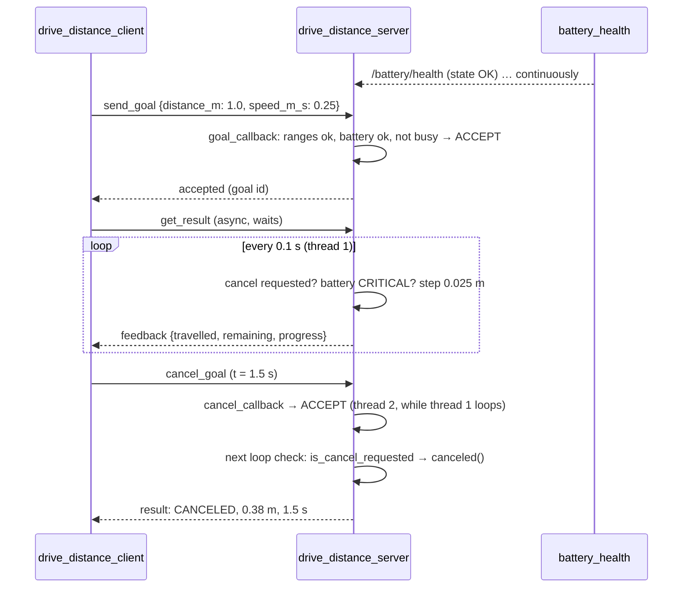
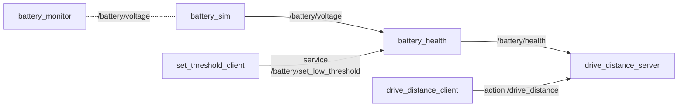

# 04.08 — Actions — long-running goals with feedback and cancellation

<!-- glance:start -->
<!-- generated by tools/build.py from curriculum/syllabus.yaml — edit the syllabus, not this block -->

| | |
|---|---|
| **Track** | Main path |
| **Difficulty** | Intermediate |
| **Time** | 1 h |
| **Hardware** | none |
| **Software** | ros2, rclpy |
| **Prerequisites** | [04.07 Services — request/response](04.07-services.md) |
| **Skip if** | You have written an action server with feedback and cancellation. |

<!-- glance:end -->

## What you will learn

- Define a `.action` interface (goal, result, feedback) and explain the goal state machine behind it.
- Implement an action server that rejects bad goals up front, streams feedback, honors cancellation and aborts on a failing precondition (a critical battery).
- Implement an action client that sends a goal, prints feedback, cancels after a delay and interprets the final status.
- Explain why the server needs a MultiThreadedExecutor and a reentrant callback group to process cancel requests while executing.
- Map actions onto the long-running job API you know (submit → 202 + id, progress via SignalR, DELETE to cancel) and name the differences.

## Why it matters

Almost everything interesting a robot does takes time: drive 1 m, rotate 90°, navigate to the kitchen, pick up a cup. The caller needs
to know it was accepted, see progress, stop it when something changes, and get a definite outcome. Nav2's `NavigateToPose`,
MoveIt's `MoveGroup`, `FollowJointTrajectory` for arms: all of them are actions. The LLM task layer you'll build near the end of the course
is, at its core, an action client that composes them.

Cancellation matters for safety as much as for convenience. When a person steps in front of karmel, "stop what you're doing" must reach
the code that is driving the wheels, and that code must be able to hear it while it's busy. This lesson builds `drive_distance`: a
simulated "drive N meters" action that uses the battery health from 04.06 as a precondition. In [04.16](04.16-your-robot-as-ros2-node.md) the same structure drives the real robot.

<!-- prereqs:start -->
## Prerequisites

You need these first:

- [04.07 Services — request/response](04.07-services.md)

### Optional prerequisite links

None.

Check your readiness: `python course.py why 04.08`
<!-- prereqs:end -->

## Concept

An action is the **long-running job pattern**, standardized:

| Job API you know | ROS 2 action | Notes |
|---|---|---|
| `POST /jobs` → `202 Accepted` + job id, or `400`/`409` | `send_goal` → accepted/rejected + goal UUID | The server's `goal_callback` decides, **before** any work starts. |
| Progress over SignalR / WebSocket | **feedback** messages (typed, e.g. distance travelled) | A topic under the hood. Only the goal's owner gets its feedback in the client API. |
| `GET /jobs/{id}` status | **status** topic: ACCEPTED, EXECUTING, CANCELING, SUCCEEDED, CANCELED, ABORTED | |
| `DELETE /jobs/{id}` | `cancel_goal` → the server may accept or reject the cancel request | A cancel is a *request*. The executing code must notice it and stop. |
| `GET /jobs/{id}/result` | `get_result` → the final status + a typed result | The server keeps results for a while (rclpy default `result_timeout=900` s). |

Under the hood an action named `drive_distance` is **three services and two topics** (real listing with the server running):

```text
$ ros2 topic list --include-hidden-topics | grep drive
/drive_distance/_action/feedback
/drive_distance/_action/status
$ ros2 service list --include-hidden-services | grep _action
/drive_distance/_action/cancel_goal
/drive_distance/_action/get_result
/drive_distance/_action/send_goal
```

What's different from your job API: there's no persistence (a server restart loses all goals), no queue (a server decides what to do
with concurrent goals, and ours rejects them), and cancellation is *cooperative*. Physics adds a twist of its own: "canceled" for a
moving robot means "decelerating", not "stopped this instant".

> [!TIP]
> **Ask your teacher:** "Walk me through the goal state machine of a ROS 2 action with a concrete timeline: goal sent at t=0, accepted at 5 ms, feedback every 100 ms, cancel at 1.5 s. Which callbacks run on which threads?"

## Technical explanation

### Level 1 — The interface

[`DriveDistance.action`](code/src/karmel_tutorial_interfaces/action/DriveDistance.action) (in the interface package from 04.06):

```text
# Goal
float32 distance_m            # signed: positive = forward, negative = backward [m]
float32 speed_m_s             # magnitude, 0 < speed <= 0.5 [m/s]
---
# Result
float32 distance_travelled_m  # absolute distance actually covered [m]
float32 elapsed_s             # wall time from start to finish/cancel/abort [s]
string message
---
# Feedback
float32 distance_travelled_m  # [m]
float32 distance_remaining_m  # [m]
float32 progress              # 0.0 .. 1.0
```

The generated classes are `DriveDistance.Goal`, `DriveDistance.Result`, `DriveDistance.Feedback`. The success/failure itself isn't a
field: it's the **goal status** (SUCCEEDED / CANCELED / ABORTED), set by the server. The result carries what's useful in every case,
here how far the robot actually got, which matters most when it *didn't* arrive.

### Level 2 — Practical: the server's four callbacks

| Callback | Runs when | Must | rclpy default if you omit it |
|---|---|---|---|
| `goal_callback(goal)` | a goal request arrives | decide **quickly**: `GoalResponse.ACCEPT` / `REJECT`. Validate ranges, preconditions, busy state. | accept everything |
| `handle_accepted_callback(goal_handle)` | after accept | start execution (default: execute now) | runs `execute` |
| `execute_callback(goal_handle)` | executing | loop: check `is_cancel_requested`, do a step, `publish_feedback`, then call exactly one of `succeed()`, `canceled()`, `abort()`, and return a Result | *(required)* |
| `cancel_callback(goal_handle)` | a cancel request arrives | `CancelResponse.ACCEPT` / `REJECT` | **REJECT**: forgetting it makes goals uncancellable |

That last row is worth remembering: `default_cancel_callback` in rclpy is literally `"""No cancellations.""" return CancelResponse.REJECT`.

Rules for `drive_distance_server`:

- **Reject bad goals in `goal_callback`, not halfway through:** $|d| > 5$ m, speed outside $(0, 0.5]$ m/s (karmel's software speed limit from `karmel.yaml`), battery CRITICAL, or another goal already executing.
- **One goal at a time.** A robot base can't drive two distances at once. Alternatives (queue it, or preempt the old goal) are design choices. Rejection is the simplest correct one.
- **Cancel = stop and report `canceled()` with the distance so far.**
- **Precondition lost while executing → `abort()`.** If the battery turns CRITICAL mid-drive, stop and abort.
- **Always release the busy flag** (`try/finally`), whatever the outcome.

### Level 2 — Practical: why the executor matters here

The execute callback runs for seconds. With `rclpy.spin(node)` (single-threaded), that thread is inside the loop the whole time,
so **the cancel request, new goal requests and battery messages all wait in their queues until the goal has finished**. The
`is_cancel_requested` flag never becomes true while it matters. Measured with this lesson's server under `rclpy.spin()`: a cancel sent 1.0 s
into a 1 m goal was ignored, and the client received `SUCCEEDED, 1.00 m in 4.0 s`.

The fix used in [`drive_distance_server.py`](code/src/karmel_tutorial/karmel_tutorial/drive_distance_server.py): put the action server
and the battery subscription in a `ReentrantCallbackGroup` and spin with a `MultiThreadedExecutor`. The execute loop occupies one thread,
and other callbacks run on the others. Same code, same cancel after 1.5 s: `CANCELED, 0.38 m in 1.5 s`, with the server logging the
cancel 16 ms after the request. Shared state touched from several threads (the busy flag) now needs a lock. [04.12](04.12-executors-and-callbacks.md)
explains executors and callback groups in depth.

### Level 2 — Practical: the client

1. `ActionClient(node, DriveDistance, 'drive_distance')`, `wait_for_server(timeout_sec=...)`.
2. `send_goal_async(goal, feedback_callback=...)` → future of a **goal handle**. Check `goal_handle.accepted`.
3. `goal_handle.get_result_async()` → future of `(status, result)`.
4. To cancel: `goal_handle.cancel_goal_async()`.

A standalone client spins its own node with `spin_until_future_complete` at each step (same pattern as 04.07). Inside another node, chain done-callbacks instead.

### Level 3 — Mathematics: feedback, cancel latency and stopping distance

**Progress.** The simulation integrates at $f_c = 10$ Hz ($\Delta t = 0.1$ s): after $n$ steps $d_n = \min(D, n \, v \, \Delta t)$.
The number of steps (and feedback messages) for a full goal is $N = \lceil D / (v \Delta t) \rceil$.

**Worked example:** $D = 1.0$ m, $v = 0.25$ m/s → $v \Delta t = 0.025$ m per step, $N = 40$ steps = 4.0 s, 40 feedback messages.
Cancel requested at $t_c = 1.5$ s: the loop checks the flag once per step, so it stops at the first check after the request arrives:
$d = \lceil 1.5 / 0.1 \rceil \cdot 0.025 = 15 \cdot 0.025 = 0.375$ m (0.40 m if one more step was already in progress).
The measured result was `0.38 m` (0.375 rounded). **Worst-case cancel latency = one control period (0.1 s) + message latency (ms).**

**On the real robot, stopping isn't instantaneous.** With a deceleration limit $a$ (karmel: `max_linear_accel_m_s2: 1.0`), the robot
needs a distance and time after the cancel takes effect:

$$d_\text{stop} = \frac{v^2}{2a}, \qquad t_\text{stop} = \frac{v}{a}$$

At 0.25 m/s: $0.25^2 / 2 = 0.031$ m in 0.25 s. At the 0.5 m/s limit: $0.125$ m in 0.5 s. Add one control period at full speed
($0.5 \cdot 0.1 = 0.05$ m) and the network latency, and a cancel at 0.5 m/s can take ~0.18 m to take effect. That number
belongs in your safety analysis ([SAFETY.md](../SAFETY.md)): software cancellation is a convenience. The hardware emergency stop and the
Pico's motor watchdog are the safety mechanisms.

### Level 4 — Implementation: goal state machine and threads

```text
                 goal_callback: ACCEPT
  (request) ──────────────────────────► ACCEPTED ──► EXECUTING ──succeed()──► SUCCEEDED
      │                                                 │   │
      │ REJECT                        cancel_callback:  │   └────abort()────► ABORTED
      ▼                               ACCEPT            ▼
  (rejected, no goal id kept)                       CANCELING ──canceled()──► CANCELED
```

- The terminal state is set by **your** execute code. Return without calling one of the three and rclpy marks the goal ABORTED and warns: `Goal state not set, assuming aborted. Goal ID: [...]` (tested).
- In `drive_distance_server`, goal and cancel callbacks, the execute loop and the battery subscription can run concurrently. `_busy` is protected by a `threading.Lock`, and `_battery_state` is a single attribute assignment of an int, which is safe to read without a lock in CPython.
- `time.sleep(dt)` inside the execute loop is acceptable **only** because this executor thread is dedicated to the goal. On the real robot the loop would publish `cmd_vel` and read odometry, still in the same structure.
- A client that crashes or disconnects does **not** cancel its goal. The server keeps executing. You saw this with turtlesim's CLI in [04.03](04.03-nodes-and-cli.md): Ctrl+C on `ros2 action send_goal` didn't stop the rotation. Robot-side, pair actions with a watchdog or a "client alive" check when that matters.

## Diagram



The complete example system after 04.04–04.08:



## Code

### Server: `drive_distance_server.py`

[`karmel_tutorial/drive_distance_server.py`](code/src/karmel_tutorial/karmel_tutorial/drive_distance_server.py):

```python
"""
drive_distance_server: a simulated "drive N metres" action with feedback and cancel (04.08).

Serves
  drive_distance     karmel_tutorial_interfaces/action/DriveDistance
Subscribes
  battery/health     karmel_tutorial_interfaces/BatteryHealth   (abort when CRITICAL)

The motion is simulated: distance += speed * dt every 0.1 s. In lesson 04.16 the same
structure publishes cmd_vel to the real robot and measures distance from wheel odometry.
"""
import threading
import time

from karmel_tutorial_interfaces.action import DriveDistance
from karmel_tutorial_interfaces.msg import BatteryHealth
import rclpy
from rclpy.action import ActionServer, CancelResponse, GoalResponse
from rclpy.action.server import ServerGoalHandle
from rclpy.callback_groups import ReentrantCallbackGroup
from rclpy.executors import ExternalShutdownException, MultiThreadedExecutor
from rclpy.node import Node

MAX_SPEED_M_S = 0.5     # labs/config/karmel.yaml drive.max_linear_speed_m_s
MAX_DISTANCE_M = 5.0    # refuse silly goals indoors
CONTROL_RATE_HZ = 10.0


class DriveDistanceServer(Node):
    """One goal at a time; reject bad goals up front; honor cancel; abort on dead battery."""

    def __init__(self) -> None:
        super().__init__('drive_distance_server')
        # A reentrant group + MultiThreadedExecutor lets cancel requests and battery
        # messages be processed WHILE a goal executes (details in lesson 04.12).
        group = ReentrantCallbackGroup()
        self._lock = threading.Lock()
        self._busy = False
        self._battery_state = None
        self._health_sub = self.create_subscription(
            BatteryHealth, 'battery/health', self._on_health, 10, callback_group=group)
        self._server = ActionServer(
            self, DriveDistance, 'drive_distance',
            execute_callback=self._execute,
            goal_callback=self._on_goal,
            cancel_callback=self._on_cancel,
            callback_group=group)
        self.get_logger().info('drive_distance action server ready')

    def _on_health(self, msg: BatteryHealth) -> None:
        self._battery_state = msg.state

    def _battery_critical(self) -> bool:
        return self._battery_state == BatteryHealth.STATE_CRITICAL

    def _on_goal(self, goal: DriveDistance.Goal) -> GoalResponse:
        """Decide quickly whether to accept. Do not start work here."""
        reason = None
        if abs(goal.distance_m) > MAX_DISTANCE_M:
            reason = f'|distance| {abs(goal.distance_m):.2f} m > {MAX_DISTANCE_M:.1f} m'
        elif not 0.0 < goal.speed_m_s <= MAX_SPEED_M_S:
            reason = f'speed {goal.speed_m_s:.2f} m/s not in (0, {MAX_SPEED_M_S}]'
        elif self._battery_critical():
            reason = 'battery CRITICAL'
        with self._lock:
            if reason is None and self._busy:
                reason = 'another goal is executing'
            if reason is None:
                self._busy = True
        if reason is not None:
            self.get_logger().warn(f'Rejecting goal: {reason}')
            return GoalResponse.REJECT
        self.get_logger().info(
            f'Accepting goal: {goal.distance_m:+.2f} m at {goal.speed_m_s:.2f} m/s')
        return GoalResponse.ACCEPT

    def _on_cancel(self, goal_handle: ServerGoalHandle) -> CancelResponse:
        self.get_logger().info('Cancel requested')
        return CancelResponse.ACCEPT

    def _execute(self, goal_handle: ServerGoalHandle) -> DriveDistance.Result:
        goal = goal_handle.request
        target = abs(goal.distance_m)
        dt = 1.0 / CONTROL_RATE_HZ
        travelled = 0.0
        start = time.monotonic()
        feedback = DriveDistance.Feedback()
        result = DriveDistance.Result()
        try:
            while travelled < target:
                if goal_handle.is_cancel_requested:
                    goal_handle.canceled()
                    result.message = f'canceled after {travelled:.2f} m'
                    self.get_logger().info(result.message)
                    break
                if self._battery_critical():
                    goal_handle.abort()
                    result.message = f'aborted after {travelled:.2f} m: battery CRITICAL'
                    self.get_logger().error(result.message)
                    break
                time.sleep(dt)  # stands in for "send cmd_vel, wait for the next odometry"
                travelled = min(target, travelled + goal.speed_m_s * dt)
                feedback.distance_travelled_m = travelled
                feedback.distance_remaining_m = target - travelled
                feedback.progress = travelled / target if target > 0.0 else 1.0
                goal_handle.publish_feedback(feedback)
            else:
                goal_handle.succeed()
                result.message = f'arrived: {travelled:.2f} m'
                self.get_logger().info(result.message)
        finally:
            with self._lock:
                self._busy = False
        result.distance_travelled_m = travelled
        result.elapsed_s = time.monotonic() - start
        return result


def main(args=None) -> None:
    rclpy.init(args=args)
    node = DriveDistanceServer()
    executor = MultiThreadedExecutor()
    executor.add_node(node)
    try:
        executor.spin()
    except (KeyboardInterrupt, ExternalShutdownException):
        pass
    finally:
        executor.shutdown()
        node.destroy_node()
        rclpy.try_shutdown()


if __name__ == '__main__':
    main()
```

The `while ... else` runs the `else` branch only when the loop ended without `break`, which is exactly "arrived". The busy flag is set in
`_on_goal` (under the lock) rather than in `_execute`, so two goals arriving together can't both be accepted.

### Client: `drive_distance_client.py`

[`karmel_tutorial/drive_distance_client.py`](code/src/karmel_tutorial/karmel_tutorial/drive_distance_client.py):

```python
"""
drive_distance_client: send a DriveDistance goal, print feedback, optionally cancel (04.08).

Usage:
  ros2 run karmel_tutorial drive_distance_client 1.0 0.25          # drive 1 m at 0.25 m/s
  ros2 run karmel_tutorial drive_distance_client 1.0 0.25 1.5      # cancel after 1.5 s
"""
import sys

from action_msgs.msg import GoalStatus
from karmel_tutorial_interfaces.action import DriveDistance
import rclpy
from rclpy.action import ActionClient
from rclpy.node import Node
from rclpy.utilities import remove_ros_args

STATUS_NAMES = {
    GoalStatus.STATUS_SUCCEEDED: 'SUCCEEDED',
    GoalStatus.STATUS_CANCELED: 'CANCELED',
    GoalStatus.STATUS_ABORTED: 'ABORTED',
}


def main(args=None) -> int:
    rclpy.init(args=args)
    argv = remove_ros_args(sys.argv)
    if len(argv) not in (3, 4):
        print('usage: drive_distance_client <distance_m> <speed_m_s> [cancel_after_s]')
        rclpy.try_shutdown()
        return 2
    cancel_after_s = float(argv[3]) if len(argv) == 4 else None

    node = Node('drive_distance_client')
    try:
        client = ActionClient(node, DriveDistance, 'drive_distance')
        if not client.wait_for_server(timeout_sec=5.0):
            node.get_logger().error('drive_distance server not available after 5 s')
            return 1

        goal = DriveDistance.Goal()
        goal.distance_m = float(argv[1])
        goal.speed_m_s = float(argv[2])

        def on_feedback(msg) -> None:
            fb = msg.feedback
            print(f'feedback: {fb.distance_travelled_m:.2f} m travelled, '
                  f'{fb.distance_remaining_m:.2f} m remaining ({100 * fb.progress:.0f} %)')

        # Step 1: send the goal and wait for accept/reject.
        send_future = client.send_goal_async(goal, feedback_callback=on_feedback)
        rclpy.spin_until_future_complete(node, send_future)
        goal_handle = send_future.result()
        if not goal_handle.accepted:
            print('goal REJECTED')
            return 3
        print('goal accepted')

        # Step 2: wait for the result, optionally cancelling part-way.
        result_future = goal_handle.get_result_async()
        if cancel_after_s is not None:
            rclpy.spin_until_future_complete(node, result_future, timeout_sec=cancel_after_s)
            if not result_future.done():
                print(f'requesting cancel after {cancel_after_s:.1f} s')
                cancel_future = goal_handle.cancel_goal_async()
                rclpy.spin_until_future_complete(node, cancel_future)
        rclpy.spin_until_future_complete(node, result_future)

        wrapped = result_future.result()
        result = wrapped.result
        status = STATUS_NAMES.get(wrapped.status, str(wrapped.status))
        print(f'result: {status}, {result.distance_travelled_m:.2f} m in '
              f'{result.elapsed_s:.1f} s, "{result.message}"')
        return 0 if wrapped.status == GoalStatus.STATUS_SUCCEEDED else 4
    finally:
        node.destroy_node()
        rclpy.try_shutdown()


if __name__ == '__main__':
    sys.exit(main())
```

### Run it

```bash
# every terminal: source /opt/ros/jazzy/setup.bash && source <workspace>/install/setup.bash
ros2 run karmel_tutorial drive_distance_server                       # terminal 1
ros2 run karmel_tutorial drive_distance_client 0.5 0.25              # terminal 2
ros2 action send_goal --feedback /drive_distance karmel_tutorial_interfaces/action/DriveDistance "{distance_m: -0.3, speed_m_s: 0.3}"
```

## Exercise

Hardware: none. Simulated motion only. The server never commands real motors in this lesson.

### Exercise 04.08-E1 — Drive, inspect, cancel `[coding]`

1. Start `drive_distance_server`. Run `ros2 action list -t` and `ros2 action info /drive_distance`.
2. `drive_distance_client 0.5 0.25`. Count the feedback lines.
3. `drive_distance_client 1.0 0.25 1.5` (cancel after 1.5 s). Note the distance in the result.
4. Send a goal with the CLI: `ros2 action send_goal --feedback /drive_distance karmel_tutorial_interfaces/action/DriveDistance "{distance_m: -0.3, speed_m_s: 0.3}"`.
5. Print `echo $?` after each client run.

### Exercise 04.08-E2 — Rejections and precondition aborts `[simulation]`

1. With only the server running, send `8 0.25`, `1.0 0.0` and `1.0 0.9`. Read the server's log.
2. Start a 1 m goal at 0.5 m/s, and 1 s later (second terminal) send a 0.2 m goal.
3. Start `battery_sim --ros-args -p start_v:=10.3 -p drain_v_per_s:=0.1` and `battery_health`, then immediately send a 4 m goal at 0.2 m/s. Then send another goal.

### Exercise 04.08-E3 — Predict: what if the server spins single-threaded? `[predict]`

1. Predict what the client prints for `drive_distance_client 1.0 0.25 1.0` if the server's `main()` uses `rclpy.spin(node)` instead of the MultiThreadedExecutor.
2. Test it: create `single_threaded_server.py` that imports `DriveDistanceServer`, calls `rclpy.init()`, `node = DriveDistanceServer()`, `rclpy.spin(node)`, and run it with `python3` (sourced workspace) instead of the normal server.
3. Also remove `cancel_callback=self._on_cancel` in a copy of the server (keep multi-threading) and predict, then test, the same cancel.

### Exercise 04.08-E4 — Stopping distance budget `[numerical]`

For the real karmel (deceleration limit 1.0 m/s², control loop 20 Hz, Wi-Fi round trip for the cancel ≈ 30 ms), compute the distance travelled
between a user pressing "cancel" and the robot standing still, at 0.2 m/s and at 0.5 m/s. At which speed does it exceed 0.15 m?

### Exercise 04.08-E5 — Rotate in place `[coding]`

Add a second action `RotateAngle.action` (goal `float32 angle_rad`, `float32 angular_speed_rad_s`; result `float32 angle_rotated_rad`, `string message`;
feedback `float32 angle_rotated_rad`, `float32 angle_remaining_rad`) to your interface package and a simulated `rotate_angle_server`
with the same rules: reject $|\omega| > 2.5$ rad/s (karmel's limit), one goal at a time, cancel, abort on CRITICAL battery. Test with `ros2 action send_goal --feedback`.

## Expected result

**04.08-E1:** `ros2 action list -t` → `/drive_distance [karmel_tutorial_interfaces/action/DriveDistance]`. `ros2 action info` shows
`Action servers: 1` with `/drive_distance_server`. Step 2 prints `goal accepted`, **20** feedback lines from `feedback: 0.03 m travelled, 0.47 m remaining (5 %)`
to `feedback: 0.50 m travelled, 0.00 m remaining (100 %)`, then `result: SUCCEEDED, 0.50 m in 2.0 s, "arrived: 0.50 m"`, exit code 0.
Step 3 (real output, feedback trimmed):

```text
goal accepted
feedback: 0.03 m travelled, 0.98 m remaining (3 %)
...
feedback: 0.35 m travelled, 0.65 m remaining (35 %)
requesting cancel after 1.5 s
feedback: 0.38 m travelled, 0.62 m remaining (38 %)
result: CANCELED, 0.38 m in 1.5 s, "canceled after 0.38 m"
[ros2run]: Process exited with failure 4
```

The server logs `Cancel requested` and `canceled after 0.38 m` about 16 ms apart. Step 4 prints ten `Feedback:` blocks (0.03 … 0.30), then
`Result: distance_travelled_m: 0.300… elapsed_s: 1.00… message: 'arrived: 0.30 m'` and `Goal finished with status: SUCCEEDED`.

**04.08-E2:** (1) All three print `goal REJECTED` (exit 3). The server logs `Rejecting goal: |distance| 8.00 m > 5.0 m`, `speed 0.00 m/s not in (0, 0.5]`,
`speed 0.90 m/s not in (0, 0.5]`. (2) The second client prints `goal REJECTED`, the server logs `Rejecting goal: another goal is executing`,
and the first goal still ends `SUCCEEDED, 1.00 m in 2.0 s`. (3) The goal is accepted (battery still LOW, not CRITICAL), then:

```text
feedback: 0.66 m travelled, 3.34 m remaining (17 %)
result: ABORTED, 0.66 m in 3.3 s, "aborted after 0.66 m: battery CRITICAL"
```

(exact distance varies with noise and start timing, typically 0.5–0.8 m). The next goal is rejected with `Rejecting goal: battery CRITICAL`.

**04.08-E3:** (1–2) The cancel is **ignored** until the goal has finished. Real output with the single-threaded server:

```text
goal accepted
requesting cancel after 1.0 s
result: SUCCEEDED, 1.00 m in 4.0 s, "arrived: 1.00 m"
```

(3) Without `cancel_callback`, rclpy's default rejects every cancel request. The client's cancel future completes, and its response has an
**empty `goals_canceling` list** (that's how a rejected cancel looks; `return_code` was 0 in the test). The goal runs to `SUCCEEDED, 1.00 m in 4.0 s`,
and the server never logs `Cancel requested`. Check `len(response.goals_canceling) > 0` in clients that need to know.

**04.08-E4:** Control period $1/20 = 0.05$ s. Distance before the stop begins: $v(0.030 + 0.05)$; braking $v^2/2$.
At 0.2 m/s: $0.2 \cdot 0.08 + 0.04/2 = 0.016 + 0.020 = 0.036$ m. At 0.5 m/s: $0.5 \cdot 0.08 + 0.25/2 = 0.040 + 0.125 = 0.165$ m.
Solve $0.08v + v^2/2 = 0.15$ → $v^2 + 0.16v - 0.30 = 0$ → $v ≈ 0.47$ m/s. Above ~0.47 m/s the cancel takes more than 15 cm.

**04.08-E5:** `ros2 action send_goal --feedback /rotate_angle <pkg>/action/RotateAngle "{angle_rad: 1.5708, angular_speed_rad_s: 1.0}"` prints about
16 feedback messages (at 10 Hz) and `SUCCEEDED` with `angle_rotated_rad: 1.57…` after ~1.6 s. A goal with `angular_speed_rad_s: 3.0` is rejected.

## Troubleshooting

### Symptom: cancel does nothing, the goal always runs to completion

1. Does the server log `Cancel requested`? **No** → `cancel_callback` is missing (default REJECT), or the executor can't run it: single-threaded spin, or the action server not in a reentrant/separate callback group.
2. **Yes, but it keeps going** → the execute loop doesn't check `goal_handle.is_cancel_requested`, or checks it only before a long blocking step.
3. Client side: did the cancel request actually get sent? A client that exits (Ctrl+C) may not deliver it (see 04.03). Check the cancel future's response.

### Symptom: every goal is rejected

Read the server's reason (it logs one). If there's no log: name or type mismatch (`ros2 action info`), or the server isn't running. If the reason is
"another goal is executing" although nothing runs, the busy flag wasn't released: check the `finally` block and whether an exception escaped `_execute`.

### Symptom: the client waits forever after "goal accepted"

1. The server's execute callback never returns (infinite loop: `travelled` never reaches `target`, for example speed 0 accepted by mistake).
2. The execute callback raised an exception: look at the server terminal. rclpy aborts the goal, but check the log.
3. The execute callback returned without `succeed()/canceled()/abort()`: rclpy logs `Goal state not set, assuming aborted` and the client gets ABORTED (not a hang, but a surprising status).

### Symptom: `ros2 action send_goal` prints `Executor is already spinning` on Ctrl+C

A known CLI rough edge on Jazzy (observed 2026-09). The goal may keep running on the server. Cancel from code (client `cancel_goal_async`) or via the node's own cancel mechanism, and verify with `ros2 topic echo /<action>/_action/status`.

### Symptom: feedback arrives in bursts

The server's feedback publishing is delayed by a busy executor, or the client's executor is busy. Check that no other callback on the server blocks, and that the client spins continuously while waiting.

## Common mistakes

- **Forgetting `cancel_callback`.** rclpy's default rejects all cancels.
- **Spinning an action server single-threaded.** Cancel requests and sensor callbacks wait until the goal ends.
- **Validating inside `execute` instead of `goal_callback`.** The client sees "accepted" and then an immediate abort. Reject early with a reason.
- **Not ending every path with `succeed()`, `canceled()` or `abort()`.**
- **Treating "canceled" as "stopped".** A moving robot needs distance and time to brake. Software cancel isn't an emergency stop.
- **Assuming a client crash cancels its goal.** It doesn't. The robot keeps executing.
- **Shared state across callbacks without a lock** once you use a MultiThreadedExecutor.
- **Using an action for something that takes 2 ms**, or a service for something that takes 2 s.

## Knowledge check

1. What does an action named `/drive_distance` consist of underneath, and why is it built that way?
   <details><summary>Answer</summary>

   Three services (`_action/send_goal`, `_action/cancel_goal`, `_action/get_result`) and two topics (`_action/feedback`, `_action/status`). Request/response parts (submit, cancel, fetch result) need replies, while progress and status are streams to any interested client. It reuses the two primitives instead of adding a third transport concept.
   </details>

2. Predict the client output for a 2.0 m goal at 0.4 m/s with a 10 Hz loop, cancelled after 2.0 s, with a correctly multi-threaded server.
   <details><summary>Answer</summary>

   Step $= 0.04$ m, full goal $= 50$ steps = 5 s. Cancel at 2.0 s → about 20 steps → `CANCELED, 0.80 m in 2.0 s` (possibly 0.84 m if one more step was in progress), with ~20 feedback lines before it.
   </details>

3. Why must `drive_distance_server` use a MultiThreadedExecutor with a reentrant callback group, and what new obligation does that create?
   <details><summary>Answer</summary>

   The execute callback occupies a thread for seconds. With one thread, the cancel service, new goal requests and battery subscription callbacks can't run until it returns, so cancel and abort-on-battery wouldn't work. Multiple threads allow concurrent callbacks, which means shared state (the busy flag) must be synchronized (a lock).
   </details>

4. Which callback should reject a goal whose speed exceeds 0.5 m/s, and what does the client observe in each option?
   <details><summary>Answer</summary>

   `goal_callback`: the client sees `accepted == False` immediately and no goal exists. If you checked in `execute` instead, the client would see "accepted", then an ABORTED status, a misleading contract that also briefly marks the server busy.
   </details>

5. At 0.5 m/s with 1.0 m/s² deceleration, a 20 Hz loop and 50 ms cancel latency, how far does karmel move after the cancel is issued?
   <details><summary>Answer</summary>

   $0.5 \cdot (0.05 + 0.05) + 0.5^2/(2 \cdot 1.0) = 0.05 + 0.125 = 0.175$ m.
   </details>

6. Debugging: the server logs `Cancel requested` but the goal still ends SUCCEEDED 3 s later. What is the most likely bug?
   <details><summary>Answer</summary>

   The cancel was accepted, but the execute loop doesn't check `goal_handle.is_cancel_requested` (or only checks before a long blocking operation), so it never calls `canceled()` and runs to `succeed()`.
   </details>

7. The operator's laptop running the action client crashes mid-goal. What does the robot do, and what would you add to make that safe?
   <details><summary>Answer</summary>

   The server keeps executing the goal to completion, since no cancel is sent. Add a liveness mechanism: the client publishes a heartbeat the server monitors (abort if silent), or a deadman/teleop watchdog, and always keep the base-level `cmd_vel` watchdog and hardware e-stop as the real safety layer.
   </details>

## Practical challenge

**A square with actions.** Write `square_mission.py`, a standalone client that uses `drive_distance` and your `rotate_angle` (E5) to drive a
0.5 m square in simulation, with a mission-level cancel.

Acceptance criteria:

- Executes 4 × (drive 0.5 m at 0.2 m/s, rotate +π/2 at 1.0 rad/s) sequentially, printing one line per completed leg with its result.
- Pressing Ctrl+C at any time **cancels the currently active goal** (the server logs `Cancel requested` and returns CANCELED) and the program then exits cleanly, with no goal still running on the server (check the servers' logs).
- If any leg ends ABORTED or is rejected (try it by starting `battery_sim` at 10.0 V with `battery_health`), the mission stops and reports which leg failed and why.
- Total mission time without interruptions is within 10% of the sum computed from distances and speeds.
- A short note: which parts of this client would change when `drive_distance_server` drives the real karmel in 04.16, and which safety checks you'd add first.

> [!CAUTION]
> **Safety:** This challenge is simulation-only. When the same actions drive the real robot (04.16), put karmel on a stand with its wheels in the air for the first runs, keep the power switch within reach, and never rely on action cancellation as the emergency stop.

## You can skip this if…

You have written an action server with feedback and cancellation (and know why it needs a multi-threaded executor), and you answer
knowledge-check questions 2, 3 and 7 correctly.

`python course.py skip 04.08 --reason "Written ROS 2 action servers with cancel before"`

## Go deeper

- https://docs.ros.org/en/jazzy/Tutorials/Intermediate/Writing-an-Action-Server-Client/Py.html — the official Python action server and client tutorial.
- https://docs.ros.org/en/jazzy/Tutorials/Intermediate/Creating-an-Action.html — defining `.action` interfaces.
- https://docs.ros.org/en/jazzy/Concepts/Basic/About-Actions.html — the concept page: when to use actions.
- https://design.ros2.org/articles/actions.html — the design article: goal states, the services and topics underneath, cancel semantics.
- https://docs.ros.org/en/jazzy/Concepts/Intermediate/About-Executors.html — callback groups and multi-threaded executors, in depth in 04.12.
- https://docs.nav2.org/ — Nav2, the biggest action-based system you'll use (`NavigateToPose`), in the navigation module.

## Progress checkpoint

- [ ] I can define a `.action` and explain the goal state machine.
- [ ] I can write an action server that rejects early, streams feedback, cancels and aborts correctly.
- [ ] I can write an action client that sends, monitors and cancels a goal and reads the final status.
- [ ] I can explain why cancellation needs a multi-threaded executor and a correct `cancel_callback`.
- [ ] I can estimate how far a robot moves after a cancel and why cancel isn't an emergency stop.

`python course.py complete 04.08` (exercises done) · `python course.py master 04.08` (challenge done) · `python course.py struggle 04.08 "what was hard"`

Next: [04.09 — Parameters](04.09-parameters.md): configure nodes at runtime (you've already used `-p drain_v_per_s:=0.2`). Later, [04.16](04.16-your-robot-as-ros2-node.md) connects this battery and drive example to the real robot.
