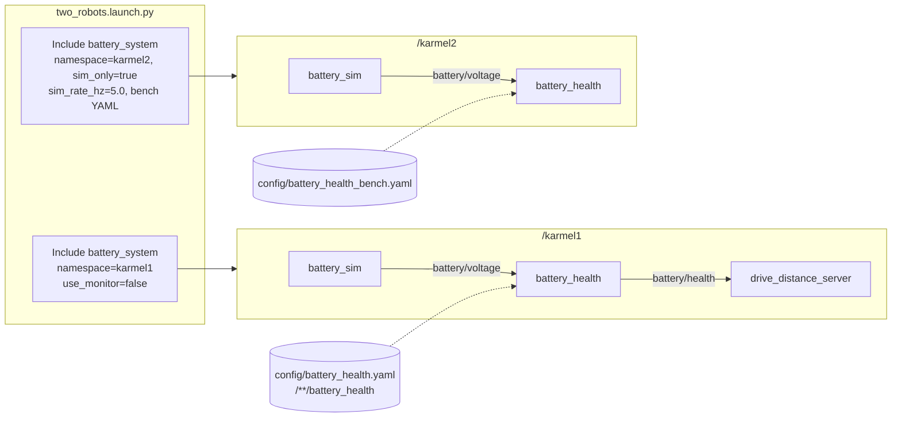

# 04.10 — Launch files — starting a system

<!-- glance:start -->
<!-- generated by tools/build.py from curriculum/syllabus.yaml — edit the syllabus, not this block -->

| | |
|---|---|
| **Track** | Main path |
| **Difficulty** | Intermediate |
| **Time** | 50 min |
| **Hardware** | none |
| **Software** | ros2 |
| **Prerequisites** | [04.09 Parameters — configuring nodes at runtime](04.09-parameters.md) |
| **Skip if** | You write Python launch files with arguments, includes and remapping. |

<!-- glance:end -->

## What you will learn

- Start the whole battery + drive example (four nodes, a YAML file) with one `ros2 launch` command.
- Give a launch file a public interface of arguments with defaults, descriptions and allowed values.
- Rewire topic names with remapping and run the same system twice side by side with namespaces.
- Include one launch file from another and pass it arguments, the way Nav2 and your final robot bring-up do.
- Switch parts of a system on and off with conditions, and read the launch log when a process dies.

## Why it matters

By now the battery example is four terminals: `battery_sim`, `battery_health` with its YAML file, `battery_monitor`,
`drive_distance_server`. The real karmel in [module 20](../20-final-robot/20.03-software-integration-bringup.md) runs
a motor driver, `robot_state_publisher`, a LiDAR driver, a camera, an EKF, SLAM or AMCL, and Nav2's ten-odd servers.
Each needs parameters, some need remapping, and all must start in one command, the same way on the Pi, in Gazebo and in CI.

Launch files are that command. They're also documentation: a well-written launch file is the most accurate description
of how a ROS system is wired. When you read Nav2's `bringup_launch.py` in [12.07](../12-navigation/12.07-nav2-in-simulation.md),
you need to be fluent in includes, arguments, conditions and namespaces.

<!-- prereqs:start -->
## Prerequisites

You need these first:

- [04.09 Parameters — configuring nodes at runtime](04.09-parameters.md)

### Optional prerequisite links

None.

Check your readiness: `python course.py why 04.10`
<!-- prereqs:end -->

## Concept

Think of a Python launch file as **docker-compose, or a .NET Aspire AppHost, written as code that returns a declarative plan**:

- `generate_launch_description()` doesn't start anything. It returns a `LaunchDescription`, a list of **actions**
  (start this process, declare that argument, include that file). `ros2 launch` then *executes* the plan.
- Values that aren't known when the file is read ("whatever the user passes as `namespace`", "the install path of
  package X") are **substitutions**: lazy placeholders resolved at execution time. `LaunchConfiguration('namespace')`
  isn't a string; it's a promise of one. That's the most common confusion for programmers: you can't
  `if LaunchConfiguration('use_monitor') == 'true':` in plain Python, because at that moment the value doesn't exist yet.
  You use a **condition** instead, which is evaluated later.
- **Arguments** (`DeclareLaunchArgument`) are the file's public API, like a compose file's `${VARIABLES}` with defaults.
  `ros2 launch pkg file.launch.py --show-args` lists them.
- **Includes** compose files like function calls: `IncludeLaunchDescription(file, launch_arguments={...})`.
- **Remapping** rewires a node's topic names from outside, like changing a connection string without recompiling.
- **Namespaces** prefix every relative name a node uses, so two robots (or two copies of a subsystem) don't collide,
  like Kubernetes namespaces for the ROS graph.

Launch also supervises. It watches the processes it started, prints their output with a `[name-N]` prefix, can
respawn them, can react to events ("when this node exits, shut everything down"), and forwards Ctrl-C to all of them.

> [!TIP]
> **Ask your teacher:** "Show me the same small launch file in Python, XML and YAML launch formats and tell me when each is the better choice."

## Technical explanation

### Level 1 — Names: relative, absolute, private

Remapping and namespaces only make sense once you know how ROS resolves names. A node named `battery_health` in
namespace `/karmel1`:

| Name in code | Kind | Resolves to |
|---|---|---|
| `battery/voltage` | relative | `/karmel1/battery/voltage` |
| `/power/pack_voltage` | absolute | `/power/pack_voltage` (namespace ignored) |
| `~/status` | private | `/karmel1/battery_health/status` |

This is why every course node uses **relative** names (`battery/voltage`, never `/battery/voltage`): a relative name can be
pushed into a namespace by whoever launches it. Hard-coding a leading `/` in a node takes that choice away from the integrator.

Remapping `from:=to` is applied to the name as written in code, before namespacing. `('battery/voltage', '/power/pack_voltage')`
makes the node use the absolute topic regardless of namespace. `('battery/voltage', 'pack/voltage')` stays relative and gets namespaced.

### Level 2 — The building blocks you'll use 95 % of the time

| Action / substitution | Package | What it does |
|---|---|---|
| `DeclareLaunchArgument(name, default_value, description, choices)` | `launch.actions` | declares an argument; `choices` rejects typos at start-up |
| `LaunchConfiguration(name)` | `launch.substitutions` | the value of an argument (lazy) |
| `PathJoinSubstitution([...])`, `FindPackageShare(pkg)` | `launch.substitutions`, `launch_ros.substitutions` | install paths: never hard-code `/home/you/ws/...` |
| `Node(package, executable, name, namespace, parameters, remappings, ros_arguments, output, condition, respawn)` | `launch_ros.actions` | starts one ROS node process |
| `GroupAction([...])` + `PushRosNamespace(ns)` | `launch.actions`, `launch_ros.actions` | scope: everything in the group gets the namespace |
| `IncludeLaunchDescription(PythonLaunchDescriptionSource(path), launch_arguments={...}.items())` | `launch.actions` | compose files |
| `IfCondition(expr)`, `UnlessCondition(expr)`, `LaunchConfigurationEquals(name, value)` | `launch.conditions` | skip an action at execution time |
| `LogInfo(msg=[...])` | `launch.actions` | print resolved values; your `printf` debugging for launch |
| `RegisterEventHandler(OnProcessExit(...))` | `launch.actions`, `launch.event_handlers` | react to process events (used in [04.15](04.15-lifecycle-nodes.md)) |
| `OpaqueFunction(function=f)` | `launch.actions` | escape hatch: `f(context)` runs at execution time where `.perform(context)` gives real strings |

Three rules that prevent most launch bugs:

1. **Arguments are strings.** `sim_rate_hz:=5.0` arrives as `'5.0'`. `launch_ros` converts parameter values given
   as substitutions by YAML-parsing them, so `{'rate_hz': LaunchConfiguration('sim_rate_hz')}` becomes a double. But
   in your own Python logic you must convert explicitly.
2. **Arguments are scoped to the including file, and they leak downwards.** An included file sees arguments you pass
   *and* the includer's configurations. Always pass what the child needs explicitly.
3. **An action object may be executed only once.** Build a new `Node(...)` or source object per use. Reusing one
   `PythonLaunchDescriptionSource` for two includes fails with `executed more than once`. You'll reproduce that below.

### Level 2 — Parameters in launch files

`Node(parameters=[...])` accepts a list that's applied in order (later wins), mixing YAML files and dicts:

```python
parameters=[LaunchConfiguration('params_file'), {'use_sim_time': LaunchConfiguration('use_sim_time')}]
```

Remember [04.09](04.09-parameters.md): the YAML key must match the node's **fully qualified name**. A file keyed
`battery_health:` doesn't match `/karmel1/battery_health`. In launch files, prefer `/**/battery_health:`. This lesson's
package ships its own copy of the YAML file with that key, and the exercises show what happens with the plain key.

### Level 3 — What `ros2 launch` actually does

```text
ros2 launch pkg file.launch.py a:=1
  1. find share/pkg/launch/file.launch.py (installed by setup.py data_files!)
  2. import it, call generate_launch_description()          -> LaunchDescription (a tree of actions)
  3. LaunchService visits the tree in order:
       DeclareLaunchArgument  -> context.launch_configurations['a'] = '1' (or default)
       IncludeLaunchDescription -> load child file, push a scope, visit its actions
       Node (condition true?)  -> resolve substitutions -> build the command line:
            .../lib/pkg/exe --ros-args -r __node:=name -r __ns:=/ns --params-file /tmp/launch_params_xyz -r from:=to
  4. run an asyncio event loop: stream output, emit ProcessExited events, handle Ctrl-C (SIGINT -> SIGTERM -> SIGKILL)
```

That generated command line shows up in the log whenever a process dies. It's the fastest way to see what a launch file
really did with your arguments (see Troubleshooting). Parameters given as a dict are written to a temporary YAML file
(`/tmp/launch_params_…`) and passed with `--params-file`.

### Level 4 — The course launch files

`course_launch_examples` contains two files:

- `battery_system.launch.py` starts the four nodes of the running example with seven arguments (namespace, YAML file,
  voltage topic, sim rate, two on/off switches, log level).
- `two_robots.launch.py` includes it twice as `karmel1` and `karmel2` with different arguments.

For launch files to be found by `ros2 launch`, the package's `setup.py` must install them:

```python
data_files=[
    ('share/ament_index/resource_index/packages', ['resource/' + package_name]),
    ('share/' + package_name, ['package.xml']),
    ('share/' + package_name + '/launch', glob('launch/*')),
    ('share/' + package_name + '/config', glob('config/*')),
],
```

and `package.xml` should declare `exec_depend` on every package the launch files start, so `rosdep` installs them.

## Diagram



## Code

[`04-ros2/code/src/course_launch_examples/launch/battery_system.launch.py`](code/src/course_launch_examples/launch/battery_system.launch.py):

```python
from launch import LaunchDescription
from launch.actions import DeclareLaunchArgument, GroupAction, LogInfo
from launch.conditions import IfCondition, UnlessCondition
from launch.substitutions import LaunchConfiguration, PathJoinSubstitution
from launch_ros.actions import Node, PushRosNamespace
from launch_ros.substitutions import FindPackageShare


def generate_launch_description() -> LaunchDescription:
    # 1. Arguments: the launch file's public API. Each has a default and a description (--show-args).
    args = [
        DeclareLaunchArgument('namespace', default_value='',
                              description='Namespace for every node, e.g. karmel1 (empty = none)'),
        DeclareLaunchArgument('params_file',
                              default_value=PathJoinSubstitution(
                                  [FindPackageShare('course_launch_examples'), 'config', 'battery_health.yaml']),
                              description='YAML parameter file for battery_health'),
        DeclareLaunchArgument('voltage_topic', default_value='battery/voltage',
                              description='Topic the voltage flows on (remapped for every node)'),
        DeclareLaunchArgument('sim_rate_hz', default_value='2.0', description='battery_sim publish rate [Hz]'),
        DeclareLaunchArgument('use_monitor', default_value='true', choices=['true', 'false'],
                              description='Also start the simple battery_monitor from 04.04'),
        DeclareLaunchArgument('sim_only', default_value='false', choices=['true', 'false'],
                              description='Skip the drive_distance action server'),
        DeclareLaunchArgument('log_level', default_value='info', choices=['debug', 'info', 'warn', 'error'],
                              description='Log level for all nodes'),
    ]

    namespace = LaunchConfiguration('namespace')
    voltage_topic = LaunchConfiguration('voltage_topic')
    log_level = LaunchConfiguration('log_level')

    # 2. Remapping: every node in this file was written against 'battery/voltage'.
    voltage_remap = [('battery/voltage', voltage_topic)]
    common = {'output': 'screen', 'ros_arguments': ['--log-level', log_level]}

    nodes = GroupAction([
        PushRosNamespace(namespace),  # everything below gets the namespace; relative names only!
        Node(package='karmel_tutorial', executable='battery_sim', name='battery_sim',
             parameters=[{'rate_hz': LaunchConfiguration('sim_rate_hz')}],
             remappings=voltage_remap, **common),
        Node(package='course_params_examples', executable='battery_health_params', name='battery_health',
             parameters=[LaunchConfiguration('params_file')],
             remappings=voltage_remap, **common),
        Node(package='karmel_tutorial', executable='battery_monitor', name='battery_monitor',
             condition=IfCondition(LaunchConfiguration('use_monitor')),
             remappings=voltage_remap, **common),
        Node(package='karmel_tutorial', executable='drive_distance_server', name='drive_distance_server',
             condition=UnlessCondition(LaunchConfiguration('sim_only')), **common),
    ])

    return LaunchDescription(args + [
        LogInfo(msg=['battery_system: namespace="', namespace, '" voltage_topic=', voltage_topic]),
        nodes,
    ])
```

[`two_robots.launch.py`](code/src/course_launch_examples/launch/two_robots.launch.py):

```python
from launch import LaunchDescription
from launch.actions import IncludeLaunchDescription
from launch.launch_description_sources import PythonLaunchDescriptionSource
from launch.substitutions import PathJoinSubstitution
from launch_ros.substitutions import FindPackageShare


def generate_launch_description() -> LaunchDescription:
    share = FindPackageShare('course_launch_examples')
    system_file = PathJoinSubstitution([share, 'launch', 'battery_system.launch.py'])

    # One source object per include: launch refuses to execute the same action object twice.
    karmel1 = IncludeLaunchDescription(PythonLaunchDescriptionSource(system_file), launch_arguments={
        'namespace': 'karmel1',
        'use_monitor': 'false',
    }.items())

    karmel2 = IncludeLaunchDescription(PythonLaunchDescriptionSource(system_file), launch_arguments={
        'namespace': 'karmel2',
        'use_monitor': 'false',
        'sim_only': 'true',
        'sim_rate_hz': '5.0',
        'params_file': PathJoinSubstitution([share, 'config', 'battery_health_bench.yaml']),
    }.items())

    return LaunchDescription([karmel1, karmel2])
```

The YAML file uses the namespace wildcard ([`config/battery_health.yaml`](code/src/course_launch_examples/config/battery_health.yaml)):

```yaml
/**/battery_health:
  ros__parameters:
    cells_series: 3
    full_v: 12.6
    low_threshold_v: 10.5
    critical_v: 9.9
    hysteresis_v: 0.2
    filter_alpha: 0.3
```

Build and run (Docker from [04.02](04.02-installing-ros2.md), `04-ros2/code` mounted at `/ws`):

```bash
cd /ws && colcon build --packages-up-to course_launch_examples && source install/setup.bash
ros2 launch course_launch_examples battery_system.launch.py --show-args
ros2 launch course_launch_examples battery_system.launch.py
# second shell:
ros2 node list && ros2 topic list
```

> [!NOTE]
> Launch files are Python files installed by `colcon build`. After editing one, rebuild, or build once with
> `colcon build --symlink-install` so the installed file is a symlink to your source.

## Exercise

No hardware needed for any exercise.

### Exercise 04.10-E1 — Predict the graph `[predict]`

For each command, **write down** `ros2 node list` and `ros2 topic list` (ignore `/parameter_events` and `/rosout`)
**before** running it. Then check in a second shell.

```bash
ros2 launch course_launch_examples battery_system.launch.py
ros2 launch course_launch_examples battery_system.launch.py namespace:=karmel1 use_monitor:=false voltage_topic:=/power/pack_voltage
ros2 launch course_launch_examples battery_system.launch.py namespace:=karmel1 voltage_topic:=pack/voltage sim_only:=true
```

For the second command, also run `ros2 node info /karmel1/battery_health` and explain every name in the Subscribers and Publishers sections.

### Exercise 04.10-E2 — Two robots, two configurations `[simulation]`

Run `two_robots.launch.py`. Using only the CLI, prove that:
(a) the two `battery_health` nodes have different `low_threshold_v`,
(b) `karmel2` has no action server,
(c) `karmel2` reaches LOW first, and explain why from its YAML file.

### Exercise 04.10-E3 — Break it on purpose `[debugging]`

1. Pass an invalid choice: `use_monitor:=yes`. Read the error.
2. In a copy of `two_robots.launch.py`, create **one** `PythonLaunchDescriptionSource` and use it for both includes. Run it and read the error.
3. Start `battery_system.launch.py namespace:=karmel1 params_file:=$(ros2 pkg prefix --share course_params_examples)/config/battery_health_bench.yaml`
   (that file's key is plain `battery_health:`) and check the thresholds the node logs. Explain.

### Exercise 04.10-E4 — Your own bring-up file `[coding]`

In your own package, write `karmel_bench.launch.py` that:
- includes `battery_system.launch.py` with `sim_only:=true`
- adds an argument `record` (`true`/`false`, default `false`). When true it also starts
  `ros2 bag record -o /tmp/battery_bench --topics <ns>/battery/voltage <ns>/battery/health`
  (use `launch.actions.ExecuteProcess` with `condition=IfCondition(...)`; you'll use bags in [04.14](04.14-rosbag2.md))
- shuts the whole launch down when `battery_health` exits, using `RegisterEventHandler(OnProcessExit(target_action=..., on_exit=[EmitEvent(event=Shutdown())]))`

Hint: to target the `battery_health` action from outside the included file you can't reference it. Start `battery_health`
in *your* file instead (with `use_monitor` and the other nodes from the include), or write the whole thing without the include.
Deciding which is cleaner is part of the exercise.

## Expected result

**04.10-E1** (captured 2026-09, ROS 2 Jazzy):

```text
# 1. defaults
/battery_health
/battery_monitor
/battery_sim
/drive_distance_server
/battery/health
/battery/voltage

# 2. namespace:=karmel1 use_monitor:=false voltage_topic:=/power/pack_voltage
/karmel1/battery_health
/karmel1/battery_sim
/karmel1/drive_distance_server
/karmel1/battery/health
/power/pack_voltage

$ ros2 node info /karmel1/battery_health
/karmel1/battery_health
  Subscribers:
    /power/pack_voltage: std_msgs/msg/Float32
  Publishers:
    /karmel1/battery/health: karmel_tutorial_interfaces/msg/BatteryHealth
    /parameter_events: rcl_interfaces/msg/ParameterEvent
    /rosout: rcl_interfaces/msg/Log
  Service Servers:
    /karmel1/battery_health/describe_parameters: rcl_interfaces/srv/DescribeParameters
    ...
```

The remap target is absolute, so the voltage topic escapes the namespace. `battery/health` isn't remapped, so it's
namespaced. `/parameter_events` and `/rosout` are absolute by design. The parameter services are private (`~/`) names.
In case 3, the topics are `/karmel1/battery/health` and `/karmel1/pack/voltage` (relative remap target, so namespaced), with three nodes and no action server.

The launch log begins with:

```text
[INFO] [launch.user]: battery_system: namespace="karmel1" voltage_topic=/power/pack_voltage
[INFO] [battery_sim-1]: process started with pid [827]
[INFO] [battery_health_params-2]: process started with pid [828]
[INFO] [drive_distance_server-3]: process started with pid [829]
[battery_sim-1] [INFO] [...] [karmel1.battery_sim]: Simulating a pack from 12.60 V, draining 0.050 V/s, publishing at 2.0 Hz
[battery_health_params-2] [INFO] [...] [karmel1.battery_health]: 3S pack, config: HealthConfig(full_v=12.6, low_threshold_v=10.5, critical_v=9.9, hysteresis_v=0.2, filter_alpha=0.3)
```

**04.10-E2**:

```text
$ ros2 node list
/karmel1/battery_health
/karmel1/battery_sim
/karmel1/drive_distance_server
/karmel2/battery_health
/karmel2/battery_sim
$ ros2 param get /karmel2/battery_health low_threshold_v
Double value is: 12.3
$ ros2 param get /karmel1/battery_health low_threshold_v
Double value is: 10.5
```

`ros2 action list` shows only `/karmel1/drive_distance`. Within a few seconds the log shows
`[battery_health_params-5] [WARN] [...] [karmel2.battery_health]: OK -> LOW at 12.28 V`. The bench YAML sets
`low_threshold_v: 12.3`, just 0.3 V below a full pack, and `filter_alpha: 0.5` reacts faster. karmel1 needs
$(12.6 - 10.5) / 0.05 = 42$ s of simulated drain to get there.

**04.10-E3**:

```text
[ERROR] [launch]: Caught exception in launch (see debug for traceback): Argument "use_monitor" provided value "yes" is not valid. Valid options are: ['true', 'false']
```
```text
[ERROR] [launch]: Caught exception in launch (see debug for traceback): ExecuteLocal action 'battery_sim-4': executed more than once: <launch_ros.actions.node.Node object at 0x...>
```

The second message names a *node* action, not your include. When an included description is shared, its actions are shared too.
In part 3 the node logs `low_threshold_v=10.5, critical_v=9.9, ... filter_alpha=0.3`, the defaults. The plain key
`battery_health:` doesn't match `/karmel1/battery_health`, so the bench file was silently ignored.

**04.10-E4**: `ros2 launch <your_pkg> karmel_bench.launch.py record:=true` logs `[INFO] [ros2-N]: process started with pid [...]`
for the recorder: `ExecuteProcess` names the process after the executable, and here that's `ros2`. After Ctrl-C, `/tmp/battery_bench` contains `metadata.yaml` and an `.mcap` file. Killing `battery_health` from another
shell (`pkill -f battery_health_params`) makes launch log `process has died` for it and then shut down every other process.

## Troubleshooting

### Symptom: `file 'x.launch.py' was not found in the share directory of package 'y'`

1. Did you rebuild after adding the file? `ls install/y/share/y/launch/`
2. Does `setup.py` install it (`data_files` with `glob('launch/*')`)? No entry, no file.
3. Did you `source install/setup.bash` in *this* shell after building?
4. Is the extension matched by your glob (`*.launch.py` vs `*.py`)?

### Symptom: a node starts but behaves as if arguments were not applied

Read what launch actually ran. When a process dies, launch prints its full command line:
`cmd '.../battery_health_params --ros-args --log-level info --ros-args -r __node:=battery_health -r __ns:=/karmel1 --params-file ... -r battery/voltage:=/power/pack_voltage'`.
For a live process, `ps -ef | grep battery_health` shows the same. Check, in order: namespace (`__ns`), node name
(`__node`), which `--params-file`, remaps. Then check the YAML key against `__ns` + `__node`. Add
`LogInfo(msg=[...])` with the substitutions to print resolved values at launch time.

### Symptom: `Caught exception in launch ... executed more than once`

You reused an action or launch-description-source object. Create new objects per use: loop and construct, don't store one and append it twice.

### Symptom: `Included launch description missing required argument 'x' (description: ...), given: []`

The child declares `x` without a default and you didn't pass it. Pass it in `launch_arguments`, or give it a default in the child. Run the child alone with `--show-args` to see its interface.

### Symptom: Ctrl-C prints tracebacks and `process has died [..., exit code -2]`

Launch forwards SIGINT to every child. Nodes that are interrupted inside `rclpy` shutdown may print a `KeyboardInterrupt`
traceback, and launch reports the exit code of a signal-terminated process as negative (−2 = SIGINT). At shutdown that's
noise. **During** a run, `process has died` is the first line to read: scroll up to that node's own last output.

### Symptom: my `if` on a launch argument is always true/false

You compared a `LaunchConfiguration` object with a string in Python at description time. Use `IfCondition`,
`LaunchConfigurationEquals`, or `PythonExpression`. If the logic is genuinely complex, use `OpaqueFunction` and call
`LaunchConfiguration('x').perform(context)` inside it, as `labs/ros2_ws/src/karmel_base/launch/base.launch.py` does.

## Common mistakes

- **Absolute topic names inside nodes** (`/battery/voltage`). They can't be namespaced, which breaks multi-robot setups and makes remapping the only fix.
- **Plain node-name keys in YAML used with namespaces.** Use `/**/node_name:` in files meant for launch.
- **Hard-coded paths** (`/home/tal/ws/src/...`). Use `FindPackageShare` + `PathJoinSubstitution`; the robot's filesystem isn't yours.
- **Treating substitutions as strings** in Python logic at description time.
- **Forgetting `exec_depend`** for the packages a launch file starts, which breaks a fresh machine after `rosdep install`.
- **Giant monolithic launch files.** Compose from small includes with explicit arguments, one per subsystem (base, sensors, localization, navigation), as Nav2's bringup does.
- **Not declaring arguments** and relying on inherited configurations: it works until someone launches the child alone.

## Knowledge check

1. A node in namespace `/karmel2` uses the topic names `battery/voltage`, `/rosout` and `~/debug`. The node is called `battery_health`. What are the resolved names?
   <details><summary>Answer</summary>

   `/karmel2/battery/voltage`, `/rosout`, `/karmel2/battery_health/debug`.
   </details>

2. What does `remappings=[('battery/voltage', 'pack/voltage')]` produce for a node in `/karmel1`, compared with `('battery/voltage', '/pack/voltage')`?
   <details><summary>Answer</summary>

   `/karmel1/pack/voltage` (a relative target is still namespaced) vs `/pack/voltage` (an absolute target escapes the namespace).
   </details>

3. Why can't you write `if LaunchConfiguration('sim_only') == 'true':` inside `generate_launch_description()`?
   <details><summary>Answer</summary>

   `generate_launch_description()` runs before arguments are parsed. `LaunchConfiguration` is a lazy substitution object, not a string, and the comparison is simply `False`. Use `IfCondition`/`UnlessCondition`/`LaunchConfigurationEquals`, or `OpaqueFunction` with `.perform(context)`.
   </details>

4. Predict: `two_robots.launch.py` includes `battery_system.launch.py` twice, both times with `use_monitor:=false`. You change karmel1's include to `use_monitor:=true`. Which `battery_monitor` nodes exist?
   <details><summary>Answer</summary>

   Only `/karmel1/battery_monitor`. Each include has its own argument scope, and karmel2 still passes `false`.
   </details>

5. A teammate's node logs default thresholds, although the launch file passes a YAML file. `ps` shows `-r __ns:=/karmel1 -r __node:=battery_health --params-file .../health.yaml`, and the file starts with `battery_health:`. What's wrong, and what's the minimal fix?
   <details><summary>Answer</summary>

   The key doesn't match the fully qualified name `/karmel1/battery_health`, so the block is ignored silently. Change the key to `/**/battery_health:` (or `/karmel1/battery_health:`).
   </details>

6. Where do launch files have to be for `ros2 launch pkg name.launch.py` to find them, and what puts them there in an `ament_python` package?
   <details><summary>Answer</summary>

   In `install/pkg/share/pkg/launch/`. The `data_files` entry in `setup.py` (`('share/' + package_name + '/launch', glob('launch/*'))`) copies them during `colcon build`.
   </details>

7. Numerical: `battery_sim` drains 0.05 V/s from 12.6 V. How long after launch does karmel1 (low threshold 10.5 V, α = 0.3 at 2 Hz) log LOW, roughly? And karmel2 (12.3 V, α = 0.5 at 5 Hz)?
   <details><summary>Answer</summary>

   karmel1: the true voltage crosses 10.5 V after $(12.6-10.5)/0.05 = 42$ s. The exponential filter lags by about $(1-\alpha)/\alpha = 2.3$ samples ≈ 1.2 s at 2 Hz, so about 43 s (noise shifts it slightly). karmel2: $(12.6-12.3)/0.05 = 6$ s, plus a lag of 1 sample = 0.2 s, so about 6 s.
   </details>

## Practical challenge

Write `karmel_system.launch.py`, a bring-up for "one or more karmels" that later modules can extend.

Acceptance criteria:
- An argument `robots` takes a comma-separated list (`karmel1,karmel2,karmel3`). Use `OpaqueFunction` to create one include of `battery_system.launch.py` per robot, each in its own namespace.
- An argument `profile` (`real` | `bench`) selects the YAML file, using `choices`.
- An argument `with_drive` (`true` | `false`) controls the action servers.
- `ros2 launch ... --show-args` documents every argument.
- With three robots, `ros2 node list` shows 9 or 12 nodes (depending on `with_drive`), `ros2 param get` proves the profile was applied to *every* `battery_health`, and no topic exists outside a namespace except `/rosout` and `/parameter_events`.
- Killing one robot's `battery_health` doesn't take down the other robots, but it does log clearly which one died.

## You can skip this if…

You can answer questions 1, 3 and 5 without looking, and you've written Python launch files that use arguments with
defaults, includes with passed arguments, namespaces, remapping and conditions.

`python course.py skip 04.10 --reason "I write Python launch files with includes, namespaces and remapping"`

## Go deeper

- https://docs.ros.org/en/jazzy/Tutorials/Intermediate/Launch/Launch-Main.html — the official launch tutorial series: creating, integrating, substitutions, event handlers, large projects.
- https://docs.ros.org/en/jazzy/Tutorials/Intermediate/Launch/Using-Substitutions.html — substitutions in depth, including `PythonExpression`.
- https://docs.ros.org/en/jazzy/Tutorials/Intermediate/Launch/Using-Event-Handlers.html — `OnProcessStart`, `OnProcessExit`, `OnShutdown`, the foundation for 04.15's lifecycle launch.
- https://docs.ros.org/en/jazzy/How-To-Guides/Launch-file-different-formats.html — the same launch file in Python, XML and YAML side by side.
- https://docs.ros.org/en/jazzy/How-To-Guides/Node-arguments.html — what launch generates underneath: `--ros-args`, `-r`, `__ns`, `__node`.

## Progress checkpoint

- [ ] I can start a multi-node system with one `ros2 launch` command.
- [ ] I can declare launch arguments with defaults, descriptions and choices, and pass them to includes.
- [ ] I can predict resolved names under namespaces and remapping.
- [ ] I can use conditions and read the launch log to find what launch actually ran.

`python course.py complete 04.10` (exercises done) · `python course.py master 04.10` (challenge done) · `python course.py struggle 04.10 "what was hard"`

Next: [04.11 — Quality of Service](04.11-qos.md): why a subscriber can be connected and still receive nothing.
