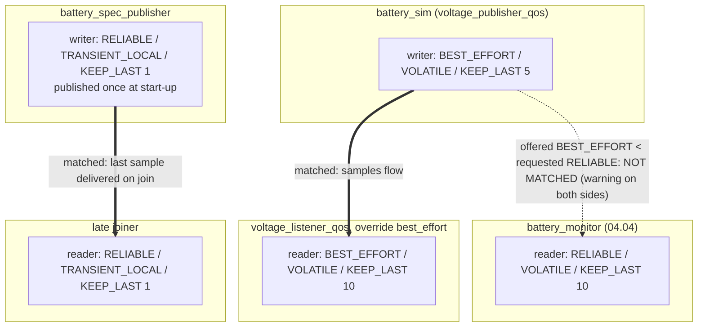

# 04.11 — Quality of Service — reliability, durability, history

<!-- glance:start -->
<!-- generated by tools/build.py from curriculum/syllabus.yaml — edit the syllabus, not this block -->

| | |
|---|---|
| **Track** | Main path |
| **Difficulty** | Intermediate |
| **Time** | 50 min |
| **Hardware** | none |
| **Software** | ros2 |
| **Prerequisites** | [04.04 Topics — writing publishers and subscribers in Python](04.04-topics-publishers-subscribers.md) |
| **Skip if** | You can diagnose a subscriber that receives nothing because of QoS mismatch. |

<!-- glance:end -->

## What you will learn

- Choose reliability, durability, history and depth for a topic from what the data *is*: sensor stream, command, or state that late joiners need.
- Predict whether a publisher and a subscriber are QoS-compatible before running them.
- Diagnose "the subscriber receives nothing" caused by a QoS mismatch, using logs, `ros2 topic info -v` and `ros2 doctor --report`.
- Publish "latched" data with `TRANSIENT_LOCAL` so nodes that start later still receive it.
- Calculate how queue depth trades latency against completeness for a slow subscriber.

## Why it matters

Topics in [04.04](04.04-topics-publishers-subscribers.md) just worked because both ends used the default profile. Real
drivers don't. LiDAR, camera and IMU drivers publish with the **sensor-data** profile (best effort). `robot_state_publisher`
and `map_server` publish **transient local**. Nav2 subscribes to all of these. The first time you write your own node
against a real driver, or plug a Gazebo bridge in [06.04](../06-simulation/06.04-bridging-gazebo-ros2.md), the subscriber is
connected, the topic shows up in `ros2 topic list`, the types match, and **not a single message arrives**. There's no
exception. There's one warning line, often scrolled away in a launch log.

QoS is also a design decision about your robot on Wi-Fi. Should a 640×480 camera frame be retransmitted when a fragment is
lost, delaying every later frame? Should the controller process a 200 ms old velocity command? This lesson gives you the
vocabulary and the numbers.

<!-- prereqs:start -->
## Prerequisites

You need these first:

- [04.04 Topics — writing publishers and subscribers in Python](04.04-topics-publishers-subscribers.md)

### Optional prerequisite links

None.

Check your readiness: `python course.py why 04.11`
<!-- prereqs:end -->

## Concept

A ROS 2 topic has no broker. Every publisher and subscriber is a DDS endpoint that states a **QoS profile**, a small
delivery contract. When they discover each other, the middleware compares the contracts using a **request vs. offer** rule:

> A subscription (the *requester*) is matched only if every policy the publisher *offers* is at least as strong as what the subscriber *requests*.

A best-effort publisher can't satisfy a subscriber that demands reliability, so they're not connected, and DDS says so once
in a warning. A reliable publisher *can* serve a best-effort subscriber: stronger than asked is fine.

If you know Kafka, map the policies like this, but mind the last column:

| ROS 2 QoS policy | Kafka feels like | The difference that bites |
|---|---|---|
| `RELIABLE` / `BEST_EFFORT` | `acks=all` with retries / `acks=0` | Reliability is **per link and per history window**: a sample that fell out of the queue is gone, reliable or not. No broker, no disk. |
| `TRANSIENT_LOCAL` durability | a compacted topic / retention for late consumers | The "retention" is the **publisher's own memory**, the last `depth` samples. Publisher process dies, history is gone. |
| `VOLATILE` durability | consumer starting at `latest` | Late joiners get nothing that was published before they matched. |
| `KEEP_LAST(depth)` history | a bounded queue with drop-oldest (.NET `BoundedChannelFullMode.DropOldest`) | Applies on **both** sides: the writer's cache and the reader's queue. |
| `KEEP_ALL` | unbounded consumer lag | Bounded by resource limits; a slow reader can make a reliable writer block. |
| `deadline` | a heartbeat SLA monitor | Both sides declare it; you get an event when a period passes without a sample. |
| `lifespan` | message TTL | Old samples are dropped instead of delivered. |
| `liveliness` | session heartbeats (ZooKeeper ephemeral node) | Detects a dead *writer*, not a quiet one. |

There are no consumer groups and no offsets. Every subscriber gets its own copy. And there's no replay unless you record
it (that's [04.14](04.14-rosbag2.md)).

> [!TIP]
> **Ask your teacher:** "Walk me through what DDS does on the wire when a RELIABLE sample is lost: heartbeats, ACKNACKs and retransmission. Then tell me when that makes latency worse than just dropping it."

## Technical explanation

### Level 1 — The three questions to ask about any topic

1. **Is a newer sample better than an old lost one?** Sensor streams (IMU at 100 Hz, LiDAR at 10 Hz, camera frames): yes.
   Use best effort, a small depth, and let lost samples go. Retransmitting a 100 ms old scan delays the fresh one.
2. **Must every sample arrive, in order?** Events and commands that aren't superseded: yes. Use reliable.
   For `cmd_vel`, the default (reliable, depth 10) is common, but the robot-side watchdog from
   [01.10](../01-first-robot/01.10-pi-pico-protocol.md) matters more than the QoS.
3. **Does a node that starts later need the last value?** Static or slow-changing *state* (`/robot_description`,
   `/tf_static`, `/map`, karmel's battery spec): yes. Use reliable + transient local + depth 1.

### Level 2 — Profiles you'll meet

| Profile (rclpy name) | Reliability | Durability | History / depth | Used by |
|---|---|---|---|---|
| default (`QoSProfile(depth=10)`) | RELIABLE | VOLATILE | KEEP_LAST 10 | most application topics, `create_publisher(Msg, 'x', 10)` |
| `qos_profile_sensor_data` | BEST_EFFORT | VOLATILE | KEEP_LAST 5 | sensor drivers (LiDAR, camera, IMU) |
| latched pattern (build it yourself) | RELIABLE | TRANSIENT_LOCAL | KEEP_LAST 1 | `/robot_description`, `/tf_static`, `/map` |
| `qos_profile_services_default` | RELIABLE | VOLATILE | KEEP_LAST 10 | services |
| `qos_profile_parameter_events` | RELIABLE | VOLATILE | KEEP_LAST 1000 | `/parameter_events` |

The integer you pass to `create_publisher(Float32, 'battery/voltage', 10)` *is* a QoS profile: depth 10, everything else default.

### Level 2 — Compatibility table

Only some policies take part in matching. History and depth **don't**: that's why `ros2 topic info -v` prints
`History (Depth): UNKNOWN` for remote endpoints, since depth isn't sent during discovery.

| Policy | Publisher offers | Subscriber requests | Match? |
|---|---|---|---|
| Reliability | BEST_EFFORT | RELIABLE | **no** |
| Reliability | RELIABLE | BEST_EFFORT | yes (delivered best effort) |
| Durability | VOLATILE | TRANSIENT_LOCAL | **no** |
| Durability | TRANSIENT_LOCAL | VOLATILE | yes (no history for late joiners) |
| Deadline | none (infinite) | 1 s | **no** |
| Deadline | 0.5 s | 1 s | yes (offered ≤ requested) |
| Liveliness | MANUAL_BY_TOPIC | AUTOMATIC | yes (manual is stronger) |

The mismatch everyone hits: **a driver publishes sensor data best effort and your node subscribes with the default reliable
profile.** The fix is almost always on the subscriber: subscribe with `qos_profile_sensor_data`. Being best effort as a
subscriber matches both kinds of publisher.

> [!NOTE]
> In Jazzy, `ros2 topic echo`, `ros2 topic hz` and `ros2 bag record` **adapt** their subscription QoS to the publishers
> they discover. So "`ros2 topic echo` shows data but my node gets nothing" is a classic QoS-mismatch signature, not proof that the topic is fine.
> Pass `--qos-reliability reliable` or `--qos-durability volatile` to echo to reproduce what your node requests.

### Level 3 — Numbers: what depth and reliability cost

**A slow subscriber and depth.** The publisher sends at rate $f$ (period $T = 1/f$). The subscriber's callback takes $w$ seconds,
so it can process at most $1/w$ messages per second. When $1/w < f$, the queue of depth $N$ is always full and holds the
latest $N$ samples. Each callback takes the **oldest** one. Its age when processing starts is about

$$\text{age} \approx (N - 1)\,T$$

and the fraction of samples never processed is $1 - \dfrac{1/w}{f}$ **whatever $N$ is**.

karmel example, `slow_health_listener` on `/battery/health` published at $f = 50$ Hz ($T = 20$ ms) with $w = 0.1$ s:

- processed: $1/w = 10$ msgs/s, so $1 - 10/50 = 80\,\%$ dropped, for every depth
- $N = 1$: age ≈ 0 ms plus transport (measured: **10 ms**)
- $N = 10$: age ≈ $9 \times 20 = 180$ ms (measured: **186–192 ms**)
- $N = 50$: age ≈ $49 \times 20 = 980$ ms (measured: **877–995 ms**)

A bigger queue doesn't make a slow consumer see more data. It makes it see **older** data. For control loops, a depth of 1
(the freshest value) is usually right. A bigger depth is for bursts that a normally fast consumer can catch up on.

**Best effort and big messages over Wi-Fi.** A sample is split into many network frames. If any frame is lost, a
best-effort sample is dropped. With per-frame loss probability $p$ and $k$ frames (simplified model):

$$P(\text{sample arrives}) = (1-p)^k$$

A raw 640×480 RGB image is $640 \cdot 480 \cdot 3 = 921\,600$ bytes, about $k = 627$ Ethernet-sized frames. At $p = 0.1\,\%$:
$0.999^{627} = 0.53$, so **almost half the frames are lost**. At $p = 1\,\%$ (poor Wi-Fi) it's $0.0018$, and practically nothing
arrives. The battery `Float32` is one frame: $0.999$. That's why [07.08](../07-sensors/07.08-rgb-cameras.md) sends compressed
images, and why reliability for big messages on Wi-Fi turns loss into latency: every lost frame triggers a retransmission while newer frames wait.

### Level 4 — QoS in rclpy

```python
from rclpy.qos import (QoSProfile, ReliabilityPolicy, DurabilityPolicy, HistoryPolicy,
                       qos_profile_sensor_data)
from rclpy.qos_overriding_options import QoSOverridingOptions
from rclpy.event_handler import SubscriptionEventCallbacks

LATCHED = QoSProfile(depth=1, reliability=ReliabilityPolicy.RELIABLE,
                     durability=DurabilityPolicy.TRANSIENT_LOCAL)

pub = node.create_publisher(Float32, 'battery/voltage', qos_profile_sensor_data,
                            qos_overriding_options=QoSOverridingOptions.with_default_policies())

sub = node.create_subscription(Float32, 'battery/voltage', cb, QoSProfile(depth=10),
                               event_callbacks=SubscriptionEventCallbacks(incompatible_qos=on_incompatible),
                               qos_overriding_options=QoSOverridingOptions.with_default_policies())
```

Two tools worth using in every driver-facing node:

- **`QoSOverridingOptions.with_default_policies()`** creates read-only start-up parameters
  `qos_overrides./battery/voltage.publisher.reliability` (also `history`, `depth`), so an integrator can fix a mismatch
  from a launch file or YAML without touching code. Nav2 and many drivers support this.
- **Event callbacks** (`incompatible_qos`, `deadline`, `liveliness`, `message_lost`) turn silent failure into a log line or a
  diagnostic *inside your node*.

## Diagram



## Code

All in [`04-ros2/code/src/course_qos_examples`](code/src/course_qos_examples/):

| Executable | Node name | What it shows |
|---|---|---|
| `voltage_publisher_qos` | `battery_sim` | the battery voltage with **sensor-data QoS**, overridable via parameters (don't run it next to `karmel_tutorial`'s `battery_sim`: same node name) |
| `voltage_listener_qos` | `voltage_listener` | a subscriber that logs an **ERROR on incompatible QoS** and counts received messages |
| `battery_spec_publisher` | `battery_spec_publisher` | a **latched** `sensor_msgs/BatteryState` spec, published once |
| `slow_health_listener` | `slow_health_listener` | message **age vs depth** for a slow callback |

The listener's incompatibility event ([`voltage_listener_qos.py`](code/src/course_qos_examples/course_qos_examples/voltage_listener_qos.py)):

```python
class VoltageListenerQos(Node):

    def __init__(self) -> None:
        super().__init__('voltage_listener')
        self._received = 0
        events = SubscriptionEventCallbacks(incompatible_qos=self._on_incompatible)
        self._sub = self.create_subscription(
            Float32, 'battery/voltage', self._on_msg, QoSProfile(depth=10),
            event_callbacks=events,
            qos_overriding_options=QoSOverridingOptions.with_default_policies())
        self.create_timer(5.0, self._report)
        self.get_logger().info(f'subscribed to battery/voltage with QoS {describe(self._sub.qos_profile)}')

    def _on_msg(self, msg: Float32) -> None:
        self._received += 1

    def _on_incompatible(self, info: QoSRequestedIncompatibleQoSInfo) -> None:
        policy = QoSPolicyKind(info.last_policy_kind).name
        self.get_logger().error(
            f'incompatible publisher on battery/voltage: policy {policy} '
            f'(total incompatible offers so far: {info.total_count})')

    def _report(self) -> None:
        self.get_logger().info(f'received {self._received} messages in the last 5 s')
        self._received = 0
```

The latched publisher ([`battery_spec_publisher.py`](code/src/course_qos_examples/course_qos_examples/battery_spec_publisher.py)):

```python
LATCHED = QoSProfile(depth=1, reliability=ReliabilityPolicy.RELIABLE, durability=DurabilityPolicy.TRANSIENT_LOCAL)


class BatterySpecPublisher(Node):

    def __init__(self) -> None:
        super().__init__('battery_spec_publisher')
        cells = int(self.declare_parameter('cells_series', 3).value)
        pub = self.create_publisher(BatteryState, 'battery/spec', LATCHED)

        spec = BatteryState()
        spec.header.stamp = self.get_clock().now().to_msg()
        spec.header.frame_id = 'base_link'
        spec.power_supply_technology = BatteryState.POWER_SUPPLY_TECHNOLOGY_LION
        spec.design_capacity = float(self.declare_parameter('capacity_ah', 3.5).value)  # labs/config/karmel.yaml
        spec.voltage = float('nan')          # not a measurement: this message only carries the spec
        spec.cell_voltage = [float('nan')] * cells
        spec.location = 'karmel main pack'
        spec.present = True
        pub.publish(spec)
        self._pub = pub  # keep a reference: the publisher's history is what late joiners receive
```

Build (Docker from [04.02](04.02-installing-ros2.md), `04-ros2/code` at `/ws`):

```bash
cd /ws && colcon build --packages-up-to course_qos_examples && source install/setup.bash
```

## Exercise

No hardware needed.

### Exercise 04.11-E1 — The silent subscriber `[debugging]`

Start, each in its own shell:

```bash
ros2 run course_qos_examples voltage_publisher_qos
ros2 run karmel_tutorial battery_monitor
ros2 run course_qos_examples voltage_listener_qos
```

1. Does `battery_monitor` ever log the voltage? (Start it with `--ros-args --log-level debug` to see every sample.)
2. Collect evidence *without reading code*: `ros2 topic list`, `ros2 topic hz /battery/voltage`, `ros2 topic info -v /battery/voltage`, `ros2 doctor --report`.
3. Why does `ros2 topic hz` show 10 Hz while both subscribers get nothing?
4. Fix it **twice**, without editing code: (a) make the listener best effort with a `qos_overrides` parameter; (b) restart the publisher with a reliable override so the unmodified `battery_monitor` works too.

### Exercise 04.11-E2 — Late joiners `[predict]`

Start `battery_spec_publisher`, wait 3 s, then predict and run:

```bash
ros2 topic echo --once --qos-durability volatile --qos-reliability reliable /battery/spec --field design_capacity
ros2 topic echo --once --qos-durability transient_local --qos-reliability reliable /battery/spec --field design_capacity
ros2 topic echo --once /battery/spec --field design_capacity
```

Then stop the publisher and run the second command again. What does that tell you about where "retention" lives?

### Exercise 04.11-E3 — Depth vs age `[numerical]`

With `ros2 run karmel_tutorial battery_sim --ros-args -p rate_hz:=50.0`
and `ros2 run karmel_tutorial battery_health` running, **compute** the expected processed count per 5 s and mean message age for `slow_health_listener` with
`depth:=1`, `5`, `10`, `50` (callback 0.1 s). Then run each for 15 s and compare with your numbers:

```bash
ros2 run course_qos_examples slow_health_listener --ros-args -p depth:=10
```

### Exercise 04.11-E4 — Deadline monitoring `[coding]`

Write a node `battery_watchdog` in your own package that subscribes to `battery/voltage` with a **1.0 s deadline** and logs a
warning from a `deadline` event callback. Make a copy of `voltage_publisher_qos` that offers a **0.5 s** deadline.
Then: (a) run your watchdog against the unmodified `karmel_tutorial` `battery_sim` and explain the result; (b) run it against
your copy, stop the publisher after a few seconds, and observe the events.

## Expected result

**04.11-E1** (captured 2026-09, ROS 2 Jazzy, Fast DDS). `battery_monitor` never logs a sample. The logs show:

```text
[battery_sim]: publishing battery/voltage at 10 Hz with QoS BEST_EFFORT / VOLATILE / KEEP_LAST(5)
[battery_sim]: New subscription discovered on topic 'battery/voltage', requesting incompatible QoS. No messages will be sent to it. Last incompatible policy: RELIABILITY
[battery_monitor]: New publisher discovered on topic 'battery/voltage', offering incompatible QoS. No messages will be received from it. Last incompatible policy: RELIABILITY
[voltage_listener]: incompatible publisher on battery/voltage: policy RELIABILITY (total incompatible offers so far: 1)
[voltage_listener]: received 0 messages in the last 5 s
```

```text
$ ros2 topic info -v /battery/voltage
Type: std_msgs/msg/Float32

Publisher count: 1

Node name: battery_sim
Node namespace: /
Topic type: std_msgs/msg/Float32
Endpoint type: PUBLISHER
QoS profile:
  Reliability: BEST_EFFORT
  History (Depth): UNKNOWN
  Durability: VOLATILE
  Lifespan: Infinite
  Deadline: Infinite
  Liveliness: AUTOMATIC
  Liveliness lease duration: Infinite

Subscription count: 2

Node name: battery_monitor
Node namespace: /
Topic type: std_msgs/msg/Float32
Endpoint type: SUBSCRIPTION
QoS profile:
  Reliability: RELIABLE
  History (Depth): UNKNOWN
  Durability: VOLATILE
  ...
```

(`Topic type hash` and `GID` lines omitted.) `ros2 doctor --report` contains:

```text
   QOS COMPATIBILITY LIST
topic [type]            : /battery/voltage [std_msgs/msg/Float32]
publisher node          : battery_sim
subscriber node         : battery_monitor
compatibility status    : ERROR: Best effort publisher and reliable subscription;
```

`ros2 topic hz` reports `average rate: 9.968`, because the CLI adapts its own QoS to the publisher. Fix (a):
`ros2 run course_qos_examples voltage_listener_qos --ros-args -p qos_overrides./battery/voltage.subscription.reliability:=best_effort`
logs `subscribed ... with QoS BEST_EFFORT / VOLATILE / KEEP_LAST(10)` and `received 50 messages in the last 5 s`. Fix (b):
`... voltage_publisher_qos --ros-args -p qos_overrides./battery/voltage.publisher.reliability:=reliable` logs
`RELIABLE / VOLATILE / KEEP_LAST(5)`, and `battery_monitor` shows no warning and receives samples (visible at debug level).

**04.11-E2**:

```text
$ ros2 topic echo --once --qos-durability volatile --qos-reliability reliable /battery/spec --field design_capacity
(nothing, until you press Ctrl-C: the only sample was published before this subscriber existed)
$ ros2 topic echo --once --qos-durability transient_local --qos-reliability reliable /battery/spec --field design_capacity
3.5
---
```

The third command (no QoS flags) also prints `3.5`, because Jazzy's `ros2 topic echo` adopts the publisher's durability.
After stopping the publisher, the transient-local echo waits forever: the history lived in the publisher process.

**04.11-E3**: expected ≈ 50 processed per 5 s for every depth (10 Hz × 5 s), and age ≈ (N−1) × 20 ms. Captured:

```text
depth=1   processed 49 msgs, mean age 10 ms, max age 29 ms
depth=5   processed 50 msgs, mean age 90 ms, max age 108 ms
depth=10  processed 49 msgs, mean age 186 ms, max age 201 ms
depth=50  processed 49 msgs, mean age 995 ms, max age 1023 ms
```

Your absolute ages vary by a few ms with machine load. The linear growth with depth and the constant count don't. (The first 5 s window of
depth 50 shows a lower mean, around 880 ms, while the queue is still filling.)

**04.11-E4**: (a) no deadline events at all, but a warning: `New publisher discovered on topic 'battery/voltage', offering incompatible QoS. No messages will be received from it. Last incompatible policy: DEADLINE`.
A publisher that offers no deadline (infinite) can't satisfy a requested 1 s. (b) Samples flow. About 1 s after the publisher stops,
one warning per second (captured with a 0.5 s offered / 1.0 s requested pair):

```text
[WARN] [...] [deadline_listener]: deadline missed: total_count=1 total_count_change=1
[WARN] [...] [deadline_listener]: deadline missed: total_count=2 total_count_change=1
[WARN] [...] [deadline_listener]: deadline missed: total_count=3 total_count_change=1
```

## Troubleshooting

### Symptom: subscriber connected, topic listed, no messages

Work from cheapest to most expensive check:

1. `ros2 topic info /t`: publisher count ≥ 1? If 0, it's a name or namespace problem, not QoS ([04.10](04.10-launch-files.md)).
2. Search the logs of **both** processes for `incompatible QoS`. The warning names the policy.
3. `ros2 topic info -v /t`: compare Reliability, Durability, Deadline and Liveliness of each publisher with each subscriber using the compatibility table.
4. `ros2 doctor --report | grep -A4 "QOS COMPATIBILITY"` lists every incompatible pair in the graph at once.
5. Everything compatible but still nothing? Check the type hash (`Topic type hash` in `-v` output): two differently built message definitions with the same name don't match. Then check discovery (domain ID, network): [04.13](04.13-debugging-and-introspection.md).

### Symptom: late-starting node never gets the map / robot description / spec

The publisher is transient local, but the subscriber requested volatile (default), so it matched but got no history.
Subscribe with `DurabilityPolicy.TRANSIENT_LOCAL` and a depth ≥ what you need. If the subscriber is transient local and the
publisher is volatile, they don't match at all: look for the warning.

### Symptom: data arrives, but the controller acts on stale values

Look at `ros2 topic delay /t` (needs a header stamp) and at your callback duration. If the callback is slower than the
publish period, reduce depth to 1, make the callback faster, or move the work off the executor thread
([04.12](04.12-executors-and-callbacks.md)). A bigger depth makes it worse.

### Symptom: images or point clouds stutter badly over Wi-Fi

Measure `ros2 topic hz` on the robot vs on the laptop. If the laptop rate is much lower, you're losing large samples.
Reliable QoS will turn that into latency spikes. Use compressed transport, lower resolution or rate, or process on the robot
and send results instead of raw data.

## Common mistakes

- **Subscribing to sensor drivers with the default profile.** Use `qos_profile_sensor_data` for anything a driver publishes.
- **Trusting `ros2 topic echo` as proof.** In Jazzy it adapts to the publisher; your node doesn't.
- **Treating depth as "more reliability".** Depth is a staleness budget for slow consumers, not a delivery guarantee.
- **Publishing static data periodically "just in case"** instead of once with transient local, or publishing once *volatile* and wondering why late nodes miss it.
- **Expecting transient local to survive the publisher.** It isn't a broker: restart the publisher and it republishes, or the data is gone.
- **Requesting a deadline or liveliness the publisher doesn't offer**, which silently disconnects the pair.
- **Changing QoS in code to fix an integration problem** in a third-party node, instead of using `qos_overrides` parameters where the node supports them.

## Knowledge check

1. Publisher: BEST_EFFORT, TRANSIENT_LOCAL. Subscriber: RELIABLE, VOLATILE. Do they match? Which policy fails?
   <details><summary>Answer</summary>

   No. Reliability fails (best effort offered < reliable requested). Durability would be fine: transient local offered ≥ volatile requested.
   </details>

2. Why does `ros2 topic info -v` show `History (Depth): UNKNOWN`?
   <details><summary>Answer</summary>

   History and depth are local resource settings. They don't take part in matching and aren't exchanged during discovery, so the CLI can't know the remote endpoint's depth.
   </details>

3. Numerical: a camera driver publishes at 30 Hz. Your detector callback takes 0.2 s. With depth 10, what fraction of frames is processed, and roughly how old is each frame when processing starts?
   <details><summary>Answer</summary>

   Processed: $5$ of $30$ per second, about $16.7\,\%$ ($83\,\%$ dropped). Age ≈ $(10-1) \cdot 33.3$ ms ≈ $300$ ms. With depth 1: still 5 frames/s, but each only about one publish period old at most.
   </details>

4. Numerical: a 200 KB point cloud crosses a Wi-Fi link with 0.5 % frame loss, about 1472 bytes of payload per frame. What fraction of samples arrive best effort (simplified model)?
   <details><summary>Answer</summary>

   $k = \lceil 200\,000 / 1472 \rceil = 136$ frames. $0.995^{136} \approx 0.51$, so about half. Reliable QoS would recover them at the cost of latency.
   </details>

5. Predict: `robot_state_publisher` has been running for a minute when you start RViz. RViz subscribes to `/robot_description` as transient local. Does it get the URDF? What if `robot_state_publisher` is restarted with a volatile publisher?
   <details><summary>Answer</summary>

   Yes: transient local on both sides, and the publisher keeps the last sample. With a volatile publisher and a transient-local subscriber, they don't match at all (VOLATILE < TRANSIENT_LOCAL), and RViz logs an incompatible-QoS warning.
   </details>

6. Debugging: `ros2 topic echo /scan` prints scans, but your node's scan callback never runs. Name the most likely cause and two commands that confirm it.
   <details><summary>Answer</summary>

   A reliability mismatch: the LiDAR driver publishes best effort and your node subscribed with the reliable default. The CLI adapts its QoS, so echo works. Confirm with `ros2 topic info -v /scan` (publisher BEST_EFFORT, your subscription RELIABLE) and `ros2 doctor --report` (QoS compatibility list), or find the `incompatible QoS` warning in your node's log. Fix: `qos_profile_sensor_data`.
   </details>

7. Compare `TRANSIENT_LOCAL` with a Kafka compacted topic. Give one similarity and two differences.
   <details><summary>Answer</summary>

   Similarity: a late consumer receives the latest value(s) without the producer re-sending. Differences: (1) the history lives in the publisher process's memory, not a broker, so it disappears with the publisher; (2) it keeps the last `depth` samples of the whole topic, not the last value per key. Also no offsets or consumer groups.
   </details>

## Practical challenge

Design the QoS for karmel's topics in a short table in your notes, then prove two of the choices with experiments.

Acceptance criteria:
- The table covers `battery/voltage`, `battery/health`, `battery/spec`, `cmd_vel`, `scan`, `camera/image_raw/compressed`, `odom`, `map`, `robot_description`, with reliability, durability, depth and a one-line justification each.
- Experiment 1: with your chosen QoS for `battery/health`, a subscriber that joins late gets a value within 100 ms or not, and your choice explains which.
- Experiment 2: using `tc qdisc add dev lo root netem loss 5%` inside a container started with `--cap-add NET_ADMIN` (`apt install iproute2` first), measure `ros2 topic hz` at the subscriber for a 100 KB message at 10 Hz with best effort vs reliable, and note the rate and `ros2 topic delay` for both.
- One incompatibility that your design deliberately prevents is written down, with the warning text you'd see if someone broke it.

## You can skip this if…

You can answer questions 1, 3 and 6 without looking, and you've already diagnosed a subscriber receiving nothing because of a QoS mismatch using `ros2 topic info -v`.

`python course.py skip 04.11 --reason "I diagnose QoS mismatches and choose profiles deliberately"`

## Go deeper

- https://docs.ros.org/en/jazzy/Concepts/Intermediate/About-Quality-of-Service-Settings.html — the official QoS concept page with the complete compatibility tables.
- https://design.ros2.org/articles/qos.html — the design rationale and how ROS QoS maps onto DDS.
- https://docs.ros.org/en/jazzy/How-To-Guides/Overriding-QoS-Policies-For-Recording-And-Playback.html — QoS overrides for `ros2 bag`, which you'll need in 04.14.
- https://docs.ros.org/en/jazzy/Tutorials/Beginner-Client-Libraries/Getting-Started-With-Ros2doctor.html — `ros2 doctor`, including the QoS compatibility check.

## Progress checkpoint

- [ ] I can pick reliability, durability and depth for a topic and justify it.
- [ ] I can predict whether two endpoints are QoS-compatible.
- [ ] I can find a QoS mismatch with logs, `ros2 topic info -v` and `ros2 doctor --report`.
- [ ] I can publish and receive latched (transient local) data.
- [ ] I can calculate how depth affects the age of data a slow subscriber sees.

`python course.py complete 04.11` (exercises done) · `python course.py master 04.11` (challenge done) · `python course.py struggle 04.11 "what was hard"`

Next: [04.12 — Executors, callback groups and timing](04.12-executors-and-callbacks.md): why a slow callback blocks everything else in a node.
