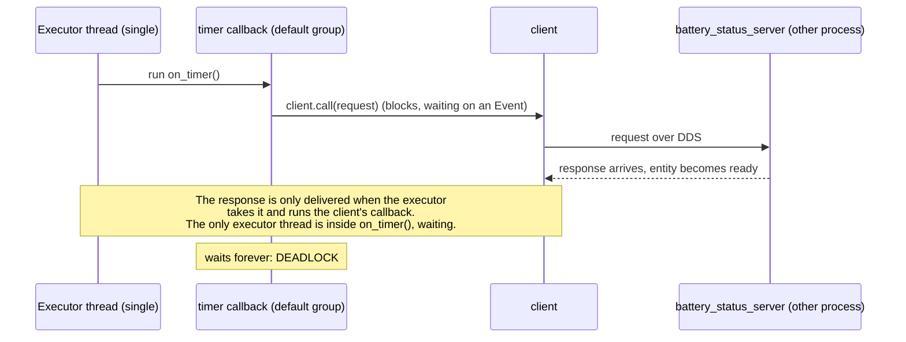

# 04.12 — Executors, callback groups and timing

<!-- glance:start -->
<!-- generated by tools/build.py from curriculum/syllabus.yaml — edit the syllabus, not this block -->

| | |
|---|---|
| **Track** | Main path |
| **Difficulty** | Intermediate |
| **Time** | 55 min |
| **Hardware** | none |
| **Software** | ros2, rclpy |
| **Prerequisites** | [04.07 Services — request/response](04.07-services.md) |
| **Optional prerequisites** | [FPY.05 asyncio for people who know async/await in C#](../optional-foundations/python/FPY.05-asyncio-for-csharp-devs.md) |
| **Skip if** | You know why a service call inside a callback deadlocks a single-threaded executor. |

<!-- glance:end -->

## What you will learn

- Explain what an executor does, which thread runs each callback, and why `rclpy.spin()` is a single-threaded event loop.
- Predict when a synchronous service call inside a callback deadlocks, and fix it three ways.
- Choose between mutually exclusive and reentrant callback groups, and know which locks that makes you responsible for.
- Measure how a slow callback starves a timer-driven control loop, and remove the starvation.
- Recognise executor problems from the outside: a node that's listed but doesn't answer `ros2 param get`.

## Why it matters

A robot node is a small concurrent program. `drive_distance_server` from [04.08](04.08-actions.md) must execute a goal
for seconds while still accepting a cancel request and reading `battery/health`. A base driver must run its control
loop at 50 Hz while a diagnostics callback formats a report. A behaviour node calls a service and waits for the answer.

Get the threading model wrong and you get the two failures robotics teams lose most time to: a node that **hangs forever**
(still listed in `ros2 node list`, so it looks alive), or a control loop that **silently runs at 15 Hz instead of 20** because
something else holds the thread. The first stops the robot. The second makes it drive badly in a way that looks like a tuning problem.
[04.07](04.07-services.md) showed you the deadlock and the async fix. This lesson explains the machinery so you can reason about any combination.

<!-- prereqs:start -->
## Prerequisites

You need these first:

- [04.07 Services — request/response](04.07-services.md)

### Optional prerequisite links

New to any of these? Take the foundation lesson first; skip it if you already know it.

- [FPY.05 asyncio for people who know async/await in C#](../optional-foundations/python/FPY.05-asyncio-for-csharp-devs.md)

Check your readiness: `python course.py why 04.12`
<!-- prereqs:end -->

## Concept

A ROS 2 node doesn't own a thread. Its subscriptions, timers, service servers, service-client responses and action callbacks
are **work items**. An **executor** is the loop that waits for any of them to become ready (via a DDS wait set) and then
runs the callback. `rclpy.spin(node)` is shorthand for "create a `SingleThreadedExecutor`, add this node, loop forever".

The .NET mapping is close:

| ROS 2 (rclpy) | .NET |
|---|---|
| `SingleThreadedExecutor` | a UI thread with a `SynchronizationContext`: one thread runs every continuation |
| `MultiThreadedExecutor(num_threads=N)` | a dispatcher over a small thread pool |
| `MutuallyExclusiveCallbackGroup` | callbacks serialized on a `SemaphoreSlim(1)`, or an actor's mailbox |
| `ReentrantCallbackGroup` | no serialization: your code needs locks |
| `client.call(req)` inside a callback | `task.Result` / `.Wait()` on the UI thread |
| `client.call_async(req)` + done callback | `await` / `ContinueWith` |

> [!NOTE]
> This lesson uses Python's own concurrency vocabulary — coroutines, futures, the event loop, and why Python
> threads are not .NET threads. New to it? → [FPY.05 asyncio for people who know async/await in C#](../optional-foundations/python/FPY.05-asyncio-for-csharp-devs.md).
> Skip it if you can already say what the GIL does to a CPU-bound callback and why `await` needs something to
> drive the loop.

That last pair is the whole deadlock story. In classic ASP.NET or WinForms, `GetAsync(url).Result` on the UI thread blocks
it, the continuation that would complete the task is posted to the same UI thread, and nothing ever runs it. In rclpy,
`client.call()` blocks the executor thread waiting for the response, and the response is delivered **by the executor**,
which needs a free thread allowed to run the client's callback group. With one thread, nobody is left.

Callback groups are how you tell a multi-threaded executor what may run in parallel. Every callback belongs to exactly one
group. By default, all callbacks of a node share the node's **default group, which is mutually exclusive**. So even with 8
executor threads, a node that never creates groups runs one callback at a time.

> [!TIP]
> **Ask your teacher:** "Draw the thread timeline for `client.call()` inside a timer callback with a MultiThreadedExecutor, first with the client in the default group and then in its own group."

## Technical explanation

### Level 1 — What the executor loop does

```text
loop:
  wait_set = all timers, subscriptions, services, clients, guard conditions of the added nodes
             EXCEPT entities whose callback group can't take more work right now
  wait(wait_set)                       # blocks until something is ready
  for each ready entity:
      take the data (message / request / response)
      run the callback      <- SingleThreaded: inline on this thread
                            <- MultiThreaded: submitted to a thread pool, if the group allows it
```

Consequences:

- **A callback that doesn't return blocks every other callback in its group**, and with a `SingleThreadedExecutor` every callback of every node on that executor, including the node's **parameter services**. `ros2 param get` then times out.
- **Timers don't queue missed ticks.** If a 20 Hz timer is blocked for 300 ms, it fires once when the thread is free and then continues on schedule. Five ticks aren't replayed.
- **Messages are taken from the subscription queue** (depth from [04.11](04.11-qos.md)) only when the callback can run, so a blocked executor makes data stale.

### Level 2 — The deadlock, precisely

`course_executor_examples/supervisor` runs a 1 Hz timer that calls `battery/get_status` (`std_srvs/Trigger`). Four switches:
`call_style` (sync/async), `executor` (single/multi), `separate_group` (client in its own mutually exclusive group),
`timeout_s`. What happens, captured in Docker (`ros:jazzy-ros-base`, 2026-09):

| call_style | executor | client group | Result |
|---|---|---|---|
| sync | single | default | **hangs forever** at tick 1. The server logs that it answered. |
| sync + `timeout_s:=2.0` | single | default | every call returns `None` after 2 s. Never works, just fails slowly. |
| sync | multi | default (same as timer) | **hangs forever**: a free thread exists, but the response callback is in the busy timer's group. |
| sync | multi | **separate** | works: response in about 5 ms |
| async | single | default | works: response in about 3 ms |

Why the third row still hangs: the timer callback holds the default mutually exclusive group while it blocks in `call()`.
The client's response handling belongs to that same group, so the executor won't run it on another thread. Moving the client
into its own group frees it.

Three correct designs, in order of preference:

1. **Async all the way** (`call_async` + `add_done_callback`, or an `async def` callback that `await`s the future). The
   callback returns immediately and the executor stays free. Works with any executor. This is the default choice.
2. **Blocking call on a multi-threaded executor, with the client in a different group from the caller.** Readable
   sequential code (call A, then B, then C) at the cost of a thread per waiting callback.
3. **Call from outside the executor**: `rclpy.spin_until_future_complete(node, future)` in `main()` or a script, never inside a callback.

### Level 2 — Choosing groups

| Situation | Group design |
|---|---|
| Simple node, fast callbacks | nothing: default group, `rclpy.spin` |
| Callback must call a service/action and wait | client in its own `MutuallyExclusiveCallbackGroup` + `MultiThreadedExecutor` (or go async) |
| Control loop must never wait for slow work | control timer in group A, slow work in group B, `MultiThreadedExecutor` |
| Action server: execute runs for seconds, cancel/goal/feedback must still be handled | `ReentrantCallbackGroup` for the action server + `MultiThreadedExecutor`, **plus a lock** around shared state (see `_busy` in `drive_distance_server`) |
| Many messages, callback is pure and thread-safe | `ReentrantCallbackGroup`, only if you've measured that it helps |

Mutually exclusive groups give you **free thread safety** for state that's only touched by callbacks in that group.
Reentrant groups give you parallelism and **the obligation to lock**. Two callbacks in *different* mutually exclusive groups
can run concurrently too, so state they share needs a lock.

### Level 3 — Timing: utilization isn't the problem, blocking is

For one thread, the classic utilization is $\rho = \sum_i f_i\,w_i$ (rate times callback duration). `timer_starvation`
has a 20 Hz control callback of about 0.1 ms and a 1 Hz planner of 300 ms:

$$\rho = 20 \cdot 0.0001 + 1 \cdot 0.3 = 0.302$$

Only 30 % busy, yet the control loop suffers, because what matters for a periodic loop is the **longest blocking time**.
While the planner runs, the control timer can't fire. Per second, the planner blocks 0.3 s; the timer fires about
$20 \cdot (1 - 0.3) = 14$ times normally plus one late catch-up:

$$f_{\text{control}} \approx 20 \cdot (1 - 0.3) + 1 = 15\ \text{Hz}, \qquad \text{worst gap} \approx 0.3\ \text{s}$$

Measured on a `SingleThreadedExecutor`: **15.0–15.1 Hz, worst gap 302–320 ms**. With a `MultiThreadedExecutor` and one
mutually exclusive group per timer: **20.0 Hz, worst gap 57–68 ms**. The remaining jitter above 50 ms is Python scheduling,
the reason hard real-time loops live on the Pico or in C++ ([03.04](../03-robot-software/03.04-timing-and-concurrency.md)).

### Level 3 — The GIL

rclpy callbacks are Python. A `MultiThreadedExecutor` only helps if the slow callback **releases the GIL**: `time.sleep`,
socket/serial I/O, and most numpy/OpenCV operations do. A pure-Python loop computing a path doesn't, and then two threads
take turns and the control loop still stutters. The options then are a separate **process** (another node, which ROS makes
easy), or C++. Python 3.13+ free-threaded builds aren't what ROS 2 Jazzy ships with (Python 3.12).

### Level 4 — Implementation

```python
from rclpy.callback_groups import MutuallyExclusiveCallbackGroup, ReentrantCallbackGroup
from rclpy.executors import MultiThreadedExecutor

class Supervisor(Node):
    def __init__(self):
        super().__init__('supervisor')
        client_group = MutuallyExclusiveCallbackGroup()
        self.client = self.create_client(Trigger, 'battery/get_status', callback_group=client_group)
        self.create_timer(1.0, self.on_timer)             # default group

def main():
    rclpy.init()
    node = Supervisor()
    executor = MultiThreadedExecutor(num_threads=4)
    executor.add_node(node)
    executor.spin()
```

> [!NOTE]
> **Version note.** Everything here is the Jazzy rclpy API. ROS 2 Lyrical (May 2026) adds an `asyncio`-based node API and
> a new `EventsCBGExecutor`. The group semantics you learn here still apply; check the release notes before porting
> (https://docs.ros.org/en/lyrical/Releases/Release-Lyrical-Luth.html).

## Diagram



```text
MultiThreadedExecutor, 4 threads            client in DEFAULT group         client in SEPARATE group
thread 1: on_timer() ── call() ── wait ──── ∞                               on_timer() ── call() ── wait ─┐
thread 2: response ready → group busy → not scheduled                        response callback ─ set Event ┘→ on_timer returns
```

## Code

[`04-ros2/code/src/course_executor_examples`](code/src/course_executor_examples/):

| Executable | Purpose |
|---|---|
| `battery_status_server` | `battery/get_status` (`std_srvs/Trigger`), logs every answer |
| `supervisor` | the four wiring variants of "timer calls a service" |
| `timer_starvation` | 20 Hz control timer + 1 Hz 300 ms planner, reports real rate and worst gap every 5 s |

The core of [`supervisor.py`](code/src/course_executor_examples/course_executor_examples/supervisor.py):

```python
class Supervisor(Node):

    def __init__(self) -> None:
        super().__init__('supervisor')
        self.call_style = self.declare_parameter('call_style', 'sync').value
        self.executor_kind = self.declare_parameter('executor', 'single').value
        separate_group = self.declare_parameter('separate_group', False).value
        timeout_s = self.declare_parameter('timeout_s', 0.0).value
        self.timeout = timeout_s if timeout_s > 0.0 else None

        # None = the node's default callback group, which is MutuallyExclusive and is also
        # the group the timer below lives in.
        client_group = MutuallyExclusiveCallbackGroup() if separate_group else None
        self.client = self.create_client(Trigger, 'battery/get_status', callback_group=client_group)
        self.tick = 0
        self.create_timer(1.0, self.on_timer)

    def on_timer(self) -> None:
        self.tick += 1
        n = self.tick
        if not self.client.service_is_ready():
            self.get_logger().warn(f'tick {n}: battery/get_status not available yet')
            return
        self.get_logger().info(f'tick {n}: calling battery/get_status')

        if self.call_style == 'async':
            future = self.client.call_async(Trigger.Request())
            future.add_done_callback(partial(self.on_future_done, n))
            return  # the callback returns at once; the executor stays free

        # Synchronous: this thread blocks until the response arrives. The response is
        # delivered BY THE EXECUTOR, which needs a free thread allowed to run the client.
        response = self.client.call(Trigger.Request(), timeout_sec=self.timeout)
        if response is None:
            self.get_logger().error(f'tick {n}: no response after {self.timeout} s')
        else:
            self.get_logger().info(f'tick {n}: got "{response.message}"')

    def on_future_done(self, n: int, future: Future) -> None:
        self.get_logger().info(f'tick {n}: got "{future.result().message}"')


def main(args=None) -> None:
    rclpy.init(args=args)
    node = Supervisor()
    executor = MultiThreadedExecutor(num_threads=4) if node.executor_kind == 'multi' else SingleThreadedExecutor()
    executor.add_node(node)
    try:
        executor.spin()
    except (KeyboardInterrupt, ExternalShutdownException):
        pass
    finally:
        executor.shutdown()
        node.destroy_node()
        rclpy.try_shutdown()
```

The groups in [`timer_starvation.py`](code/src/course_executor_examples/course_executor_examples/timer_starvation.py):

```python
if self.executor_kind == 'multi':
    control_group, planner_group = MutuallyExclusiveCallbackGroup(), MutuallyExclusiveCallbackGroup()
else:
    control_group = planner_group = None  # default group: one lane for everything

self.create_timer(self.control_period_s, self.on_control, callback_group=control_group)
self.create_timer(1.0, self.on_planner, callback_group=planner_group)
self.create_timer(5.0, self.on_report, callback_group=control_group)
```

Build (Docker from [04.02](04.02-installing-ros2.md), `04-ros2/code` at `/ws`):

```bash
cd /ws && colcon build --packages-select course_executor_examples && source install/setup.bash
```

## Exercise

No hardware needed. A deadlocked node sometimes ignores Ctrl-C (the thread is stuck inside `call()`). Use
`pkill -9 -f supervisor` from another shell.

### Exercise 04.12-E1 — The deadlock matrix `[predict]`

Start `ros2 run course_executor_examples battery_status_server`. **Before running anything else**, predict for each line:
works / hangs forever / fails with timeout. Then run each for about 5 s:

```bash
ros2 run course_executor_examples supervisor --ros-args -p call_style:=sync  -p executor:=single
ros2 run course_executor_examples supervisor --ros-args -p call_style:=sync  -p executor:=single -p timeout_s:=2.0
ros2 run course_executor_examples supervisor --ros-args -p call_style:=sync  -p executor:=multi
ros2 run course_executor_examples supervisor --ros-args -p call_style:=sync  -p executor:=multi -p separate_group:=true
ros2 run course_executor_examples supervisor --ros-args -p call_style:=async -p executor:=single
```

For every hang, look at the server's log. Did the server answer?

### Exercise 04.12-E2 — Diagnose a hang from outside `[debugging]`

Start the server and the deadlocking supervisor (first line above). In a third shell, **without looking at the supervisor's
code or log**, collect evidence that it's an executor hang and not a crash or a discovery problem:
`ros2 node list`, `ros2 param get /supervisor call_style`, `ros2 service list | grep supervisor`, and `py-spy dump --pid <pid>`
if you have `py-spy` (`pip install py-spy` in a venv).

### Exercise 04.12-E3 — Starve the control loop `[numerical]`

Compute the expected control-loop rate and worst gap for `planner_work_s` = 0.3, 0.5 and 0.8 on a single-threaded executor. Then measure:

```bash
ros2 run course_executor_examples timer_starvation --ros-args -p executor:=single -p planner_work_s:=0.5
ros2 run course_executor_examples timer_starvation --ros-args -p executor:=multi  -p planner_work_s:=0.5
```

### Exercise 04.12-E4 — Keep one thread, offload the work `[coding]`

Copy `timer_starvation` into your own package. Keep a `SingleThreadedExecutor`, but make `on_planner` submit the slow work to a
`concurrent.futures.ThreadPoolExecutor(max_workers=1)` and return immediately. Check `future.done()` from the control timer and
count finished plans. Don't start a new plan while one is running. Report the control rate, the worst gap and plans per 5 s.
When is this better than a `MultiThreadedExecutor`, and what must you be careful with when the worker's result touches node state?

## Expected result

**04.12-E1** (captured 2026-09, `ros:jazzy-ros-base`):

```text
===== call_style:=sync executor:=single
[INFO] [...] [supervisor]: call_style=sync executor=single separate_group=False timeout_s=0.0
[INFO] [...] [supervisor]: tick 1: calling battery/get_status
(nothing more, ever)
===== + timeout_s:=2.0
[INFO] [...] [supervisor]: tick 1: calling battery/get_status
[ERROR] [...] [supervisor]: tick 1: no response after 2.0 s
[INFO] [...] [supervisor]: tick 2: calling battery/get_status
[ERROR] [...] [supervisor]: tick 2: no response after 2.0 s
===== executor:=multi (client in default group)
[INFO] [...] [supervisor]: tick 1: calling battery/get_status
(nothing more, ever)
===== executor:=multi separate_group:=true
[INFO] [1789590175.029246901] [supervisor]: tick 1: calling battery/get_status
[INFO] [1789590175.080239330] [supervisor]: tick 1: got "11.42 V"
[INFO] [1789590176.027160621] [supervisor]: tick 2: calling battery/get_status
[INFO] [1789590176.031986151] [supervisor]: tick 2: got "11.42 V"
===== call_style:=async executor:=single
[INFO] [1789590181.350993936] [supervisor]: tick 1: calling battery/get_status
[INFO] [1789590181.353479845] [supervisor]: tick 1: got "11.42 V"
```

The server logs `answered get_status: 11.42 V` for **every** call, including the hung ones. The response was sent; the client
side never processed it. With `timeout_s`, the node may crash with a segmentation fault when you stop it while a call is
pending (observed with Ctrl-C). One more reason a timeout isn't a fix.

**04.12-E2**:

```text
$ ros2 node list
/battery_status_server
/supervisor
$ ros2 param get /supervisor call_style
(no output; timeout 124 when wrapped in `timeout 8`)
$ ros2 param get /battery_status_server voltage_v
Double value is: 11.42
```

The node is discovered (DDS participant alive) and its services are listed, but its parameter service never answers,
because it runs on the same stuck executor. `ros2 service list | grep supervisor` still lists
`/supervisor/get_parameters` and the other parameter services: advertising is done by DDS, answering needs the executor.
`py-spy dump` (run the container with `--cap-add SYS_PTRACE`) shows exactly where:

```text
Thread 361 (idle): "MainThread"
    wait (threading.py:355)
    wait (threading.py:655)
    call (rclpy/client.py:105)
    on_timer (course_executor_examples/supervisor.py:62)
    await_or_execute (rclpy/executors.py:115)
    ...
    spin (rclpy/executors.py:359)
    main (course_executor_examples/supervisor.py:78)
```

**04.12-E3**: predictions with $f \approx 20(1-w) + 1$: $w = 0.3$ gives 15 Hz and a 300 ms gap; $w = 0.5$ gives 11 Hz and 500 ms;
$w = 0.8$ gives 5 Hz and 800 ms. Measured for 0.3 s: single `control loop 15.1 Hz (target 20.0), worst gap 302 ms` and
`15.0 Hz, worst gap 320 ms`; multi `control loop 20.0 Hz (target 20.0), worst gap 57 ms` and `20.0 Hz, 68 ms`.
For 0.5 s: single `11.6 Hz, worst gap 501 ms`. For 0.8 s: single `6.9 Hz, worst gap 802 ms`, multi `20.0 Hz, worst gap 91 ms`.
The gap prediction is exact; the rate model underestimates for long blocks (6.9 vs 5 Hz) because the timer's next deadline
is computed from its schedule, so ticks right after the block come quickly. The conclusion doesn't change.

**04.12-E4** (a 0.3 s job, measured with an equivalent script): `control loop 20.0 Hz, worst gap 64 ms, plans done 4` and
`19.8 Hz, worst gap 100 ms, plans done 9` (cumulative), so about 5 plans per 5 s with a 20 Hz loop. It's better when only one
job is slow and everything else should stay single-threaded (no locks needed in callbacks). Be careful: the worker thread must
not modify node state or call publishers unsynchronized. Hand results back through the future and read them in a callback, as the control timer does here.

## Troubleshooting

### Symptom: the node logs one line and then nothing; Ctrl-C doesn't stop it

1. From another shell: `ros2 param get /node use_sim_time`. A timeout with the node still in `ros2 node list` means its executor is blocked.
2. Find the blocking call: look for `.call(`, `spin_until_future_complete(` or `future.result()` *inside a callback*, `time.sleep` in a loop, or a lock taken twice. `py-spy dump --pid` shows the exact line.
3. If it's a service or action call: go async, or give the client its own group and use a `MultiThreadedExecutor`.
4. Kill with `pkill -9 -f <executable>`.

### Symptom: action server doesn't process cancel while executing

The execute callback holds the group. Use a `ReentrantCallbackGroup` for the action server (or separate groups for execute
and cancel) and a `MultiThreadedExecutor`. Also check `main()`: `rclpy.spin(node)` silently uses a single-threaded executor
whatever groups you created.

### Symptom: the control loop rate is lower than the timer period says

Measure first: `ros2 topic hz` on what the loop publishes, or log intervals like `timer_starvation` does. Then list every
callback on that executor with its worst-case duration (log `time.monotonic()` around suspects). The slowest callback in
the same group, or anywhere on a single-threaded executor, sets your worst gap. Move it to another group, another thread or another process.

### Symptom: MultiThreadedExecutor made things worse or random

Two callbacks in different groups, or in a reentrant group, now touch the same variables concurrently. Add a
`threading.Lock` around the shared state, or put those callbacks back in one mutually exclusive group. CPU-bound Python
callbacks gain nothing from threads because of the GIL; use a separate node process.

## Common mistakes

- **`client.call()` inside any callback with `rclpy.spin()`.** Always a deadlock.
- **Creating callback groups but spinning with `rclpy.spin(node)`.** Groups only matter with a `MultiThreadedExecutor`.
- **Putting the client in the same group as the callback that waits for it.** Still a deadlock, even with many threads.
- **Using `ReentrantCallbackGroup` everywhere "for performance"** and then chasing race conditions.
- **Calling `timeout_sec` a fix.** It turns a hang into a guaranteed failure.
- **Doing heavy work in a timer that also runs the control loop.** Use separate groups, or better, separate nodes.
- **Assuming timers catch up.** Missed ticks are skipped, not queued: integrate with the measured `dt`, not the nominal period.

## Knowledge check

1. Why does `client.call()` inside a timer callback deadlock under `rclpy.spin(node)`, although the server is in another process and answers?
   <details><summary>Answer</summary>

   The response has to be taken and processed by the node's executor, which completes the future and sets the event `call()` waits on. `rclpy.spin` runs a single-threaded executor, and its only thread is blocked inside the timer callback waiting for that event. Nobody can deliver the response.
   </details>

2. You switch to `MultiThreadedExecutor(num_threads=8)` and it still hangs. What did you forget?
   <details><summary>Answer</summary>

   The client is still in the node's default mutually exclusive callback group, the same group as the timer that's blocked. The executor won't run the client's response handling while that group is busy. Put the client (or the timer) in a separate group.
   </details>

3. Numerical: one thread runs a 50 Hz control callback (1 ms) and a 2 Hz logging callback that takes 120 ms. What's the utilization, the approximate control rate, and the worst gap?
   <details><summary>Answer</summary>

   $\rho = 50 \cdot 0.001 + 2 \cdot 0.12 = 0.29$. Blocked fraction $2 \cdot 0.12 = 0.24$, so the rate is about $50 \cdot 0.76 + 2 = 40$ Hz. The worst gap is about 120 ms (vs the nominal 20 ms).
   </details>

4. What does a `MutuallyExclusiveCallbackGroup` guarantee, and what does it *not* guarantee about state shared with callbacks in other groups?
   <details><summary>Answer</summary>

   No two callbacks *of that group* run at the same time, so state touched only by them needs no lock. Callbacks in other groups can run concurrently with them, so state shared across groups needs a lock.
   </details>

5. Predict: a node's slow callback is a pure-Python loop that computes for 400 ms. You move it to its own group on a `MultiThreadedExecutor`. Does the 20 Hz timer recover?
   <details><summary>Answer</summary>

   Mostly not. A pure-Python loop holds the GIL, so the control callback only gets scheduled when the interpreter switches threads (every ~5 ms by default), and jitter stays high. Offload to a separate process/node or make the computation release the GIL (numpy, C++).
   </details>

6. Debugging: a node appears in `ros2 node list`, `ros2 service list` shows its services, but `ros2 param get` times out. What's your leading hypothesis, and why doesn't discovery contradict it?
   <details><summary>Answer</summary>

   A blocked executor (deadlock or a never-returning callback). Discovery and service advertisement are done by the DDS participant's own threads, independent of the rclpy executor. Answering the parameter service requires the executor to run the service callback.
   </details>

7. Why does `drive_distance_server` in 04.08 use a `ReentrantCallbackGroup` and also a `threading.Lock`?
   <details><summary>Answer</summary>

   Reentrant plus a `MultiThreadedExecutor` lets goal, cancel and `battery/health` callbacks run while `execute` loops for seconds. Because those callbacks can now run concurrently, the shared `_busy` flag is protected with a lock so two goals can't be accepted at once.
   </details>

## Practical challenge

Build `battery_guard`, a node that combines everything, in your own package.

Acceptance criteria:
- It subscribes to `battery/health` and sends a `drive_distance` goal (0.5 m at 0.2 m/s) every 10 s from a timer, and it **waits for the result inside the timer callback**, blocking by design.
- When the battery state becomes CRITICAL, it cancels the active goal within 200 ms, measured from the `battery/health` message stamp to the cancel acceptance log.
- It publishes `guard/heartbeat` at 5 Hz, and `ros2 topic hz guard/heartbeat` stays at 5.0 Hz ± 0.2 while a goal is executing.
- `ros2 param get /battery_guard use_sim_time` answers within 1 s at all times.
- A short README section in your package draws the callback groups and threads, and explains which shared variables are locked and why.
- Test by lowering the threshold at runtime with `ros2 param set /battery_health low_threshold_v ...` and the `critical_v` parameter from [04.09](04.09-parameters.md) to force CRITICAL.

## You can skip this if…

You can answer questions 1, 2 and 6 without looking, and you know how to wire a blocking call on a multi-threaded executor with separate callback groups, and why `rclpy.spin` can't do it.

`python course.py skip 04.12 --reason "I know rclpy executors, callback groups and the sync-call deadlock"`

## Go deeper

- https://docs.ros.org/en/jazzy/Concepts/Intermediate/About-Executors.html — official concept page: executor types, callback groups, scheduling semantics.
- https://docs.ros.org/en/jazzy/How-To-Guides/Using-callback-groups.html — the how-to with the "service call in a timer" example in Python and C++.
- https://docs.ros.org/en/jazzy/How-To-Guides/Sync-Vs-Async.html — synchronous vs asynchronous service clients and the deadlock they warn about.
- https://docs.ros.org/en/jazzy/p/rclpy/api/execution_and_callbacks.html — rclpy API reference for executors and callback groups.
- https://docs.ros.org/en/lyrical/Releases/Release-Lyrical-Luth.html — what changes for executors and asyncio in the next LTS.

## Progress checkpoint

- [ ] I can explain which thread runs each callback under single and multi-threaded executors.
- [ ] I can predict and fix the synchronous-service-call deadlock three ways.
- [ ] I can choose mutually exclusive vs reentrant groups and know when I need a lock.
- [ ] I can measure and remove timer starvation in a control loop.

`python course.py complete 04.12` (exercises done) · `python course.py master 04.12` (challenge done) · `python course.py struggle 04.12 "what was hard"`

Next: [04.13 — Logging, debugging and introspection](04.13-debugging-and-introspection.md): a systematic method for everything that goes wrong in a ROS graph.
