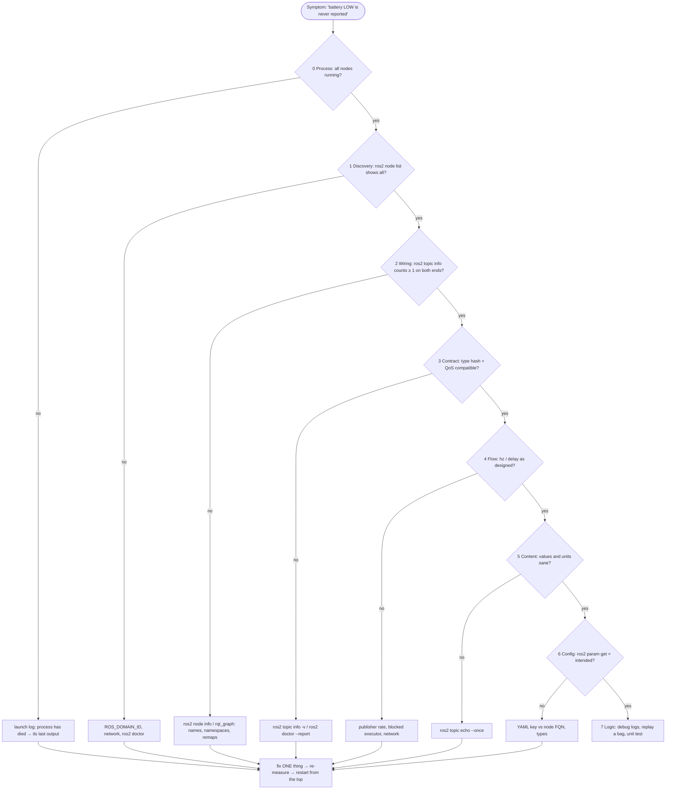

# 04.13 — Logging, debugging and introspection

<!-- glance:start -->
<!-- generated by tools/build.py from curriculum/syllabus.yaml — edit the syllabus, not this block -->

| | |
|---|---|
| **Track** | Main path |
| **Difficulty** | Intermediate |
| **Time** | 50 min |
| **Hardware** | none |
| **Software** | ros2, rqt |
| **Prerequisites** | [04.10 Launch files — starting a system](04.10-launch-files.md)<br>[04.11 Quality of Service — reliability, durability, history](04.11-qos.md) |
| **Skip if** | You debug ROS systems methodically with the CLI, rqt and logs. |

<!-- glance:end -->

## What you will learn

- Debug a misbehaving ROS 2 system with a fixed, layered method instead of guessing, from discovery to parameters to node logic.
- Use the introspection tools for each layer: `ros2 node|topic|service|param` CLI, `rqt_graph`, `rqt_console`, `ros2 doctor`, `ros2 topic hz|delay|bw`.
- Control logging: severity levels, per-node levels at start-up and at runtime, output format, throttling, `/rosout`, and log files.
- Find four planted faults in a running system in under 20 minutes and prove each fix with a measurement.

## Why it matters

A robot fails as a distributed system: nine processes, a Wi-Fi link, a microcontroller, and the physical world. The failure
report is always "it doesn't move" or "it drove into the wall". The cause is a remapped topic name, a QoS profile, a YAML key,
a blocked executor, a stale timestamp or a wrong sign, and only one of those leaves a stack trace.

You already met each fault class separately: parameters that were silently ignored ([04.09](04.09-parameters.md)), names under
namespaces ([04.10](04.10-launch-files.md)), QoS mismatches ([04.11](04.11-qos.md)), blocked executors
([04.12](04.12-executors-and-callbacks.md)). On the real robot they come **together**, and fixing one reveals the next. This lesson
turns them into a method you'll reuse for TF ([05.11](../05-frames-and-transforms/05.11-debugging-tf.md)), sensors
([07.11](../07-sensors/07.11-sensor-troubleshooting.md)) and Nav2.

<!-- prereqs:start -->
## Prerequisites

You need these first:

- [04.10 Launch files — starting a system](04.10-launch-files.md)
- [04.11 Quality of Service — reliability, durability, history](04.11-qos.md)

### Optional prerequisite links

None.

Check your readiness: `python course.py why 04.13`
<!-- prereqs:end -->

## Concept

You know how to debug a microservice system: you don't read code first, you **follow the request** through logs, metrics and
traces until the point where what happens differs from what should happen. ROS is the same with different tools:

| Observability pillar | Microservices | ROS 2 |
|---|---|---|
| Topology | service map, service mesh dashboard | `ros2 node list`, `ros2 node info`, `rqt_graph` |
| Contracts | OpenAPI / schema registry | `ros2 topic info -v` (type, type hash, QoS), `ros2 interface show` |
| Metrics | request rate, latency, payload size | `ros2 topic hz`, `ros2 topic delay`, `ros2 topic bw` |
| Payload inspection | request logging, Wireshark | `ros2 topic echo` |
| Configuration | config service, env dump | `ros2 param dump`, `ros2 param get` |
| Logs | centralized log aggregator | `/rosout` topic, `rqt_console`, `~/.ros/log` |
| Health checks | `/healthz` | `ros2 doctor`, `/diagnostics` (module 07) |
| Traces | OpenTelemetry | `ros2_tracing` (LTTng) — advanced, not needed yet |

The method has one rule borrowed from network engineering: **debug in layers, bottom-up along the data path.** A message from
`battery_sim` to `battery_health` has to survive every layer. Check the cheapest, lowest layer first, and don't touch the next
layer until the current one is proven good. Change **one** thing at a time, and re-measure after every change.

> [!TIP]
> **Ask your teacher:** "Give me a broken ROS 2 system description in words (symptom only) and let me ask you for command outputs one at a time until I find the fault. Grade my method, not just the answer."

## Technical explanation

### Level 1 — The layered method

For a symptom like "X doesn't happen", first write the **expected data path** on paper: `battery_sim —battery/voltage→ battery_health —battery/health→ …`.
Then walk it from source to sink and check each layer at each hop:

| # | Layer | Question | Commands | Typical fault |
|---|---|---|---|---|
| 0 | Process | Is it running at all? Did it crash? | launch log (`process has died`), `ps -ef \| grep`, `ros2 node list` | exception at start-up, missing package |
| 1 | Discovery | Can the processes see each other? | `ros2 node list` from *each* machine, `ros2 doctor`, `echo $ROS_DOMAIN_ID` | domain ID, firewall, multicast, Docker networking |
| 2 | Graph wiring | Does the subscriber listen where the publisher talks? | `ros2 node info /n`, `ros2 topic info /t` (counts!), `rqt_graph` | typo, namespace, remap, absolute vs relative name |
| 3 | Contract | Same type (and hash)? Compatible QoS? | `ros2 topic info -v /t`, `ros2 doctor --report` | QoS mismatch, stale interface build |
| 4 | Flow | Is data flowing at the right rate, with acceptable latency? | `ros2 topic hz`, `ros2 topic delay`, `ros2 topic bw` | publisher too slow, blocked executor, Wi-Fi |
| 5 | Content | Are the values sane? Units, frames, stamps? | `ros2 topic echo --once`, `--field` | mV instead of V, wrong frame_id, zero stamps |
| 6 | Configuration | Does the node run with the config you think? | `ros2 param get/dump`, start-up log | YAML key mismatch, integer vs double |
| 7 | Logic | Given correct inputs and config, is the output wrong? | debug-level logs, `py-spy dump`, a unit test with the recorded input ([04.14](04.14-rosbag2.md)) | a real bug in your code |

Most time is lost by starting at layer 7, reading code, when the fault is at layer 2 or 3.

### Level 2 — The tools per layer

**`ros2 doctor`** runs checks for the network, platform, middleware, QoS compatibility and topics with a publisher but no
subscriber (or the reverse). `ros2 doctor --report` prints everything it found. It's the fastest first pass over layers 1–3 for the whole graph.

**`rqt_graph`** draws nodes and topics. Set the dropdown to *Nodes/Topics (all)* and untick *Hide: Dead sinks / Leaf topics*
while debugging, otherwise the dangling topic you're looking for is hidden. Two disconnected islands where you expect one chain is a layer-2 fault.

**`ros2 topic hz /t`** measures the receive rate (and min/max/std-dev of periods, for jitter). **`ros2 topic delay /t`** needs a
`header.stamp` and prints now − stamp: the age at arrival, which includes the publisher's processing time. **`ros2 topic bw /t`**
gives bytes per second and message size, for Wi-Fi budgets.

**`rqt_console`** shows `/rosout` (every node's log messages) in a table you can filter by severity, node and text. Useful when
a launch file merges ten processes' output into one scrolling terminal.

Run GUI tools in the desktop image with WSLg as set up in [04.02](04.02-installing-ros2.md): `ros2 run rqt_graph rqt_graph`, `ros2 run rqt_console rqt_console`.

### Level 2 — Logging

Severities and their numeric values (you need the numbers for the logger services): `DEBUG` 10, `INFO` 20, `WARN` 30, `ERROR` 40, `FATAL` 50.
A logger prints messages at or above its level. The default is `INFO`.

| What | How |
|---|---|
| Level for all loggers of a process at start-up | `ros2 run pkg exe --ros-args --log-level debug` |
| Level for one logger | `--ros-args --log-level battery_health:=debug` (logger name = node name; with a namespace, `karmel1.battery_health`) |
| Level in a launch file | `Node(..., ros_arguments=['--log-level', 'battery_health:=debug'])` |
| Level at runtime | the node must be created with `enable_logger_service=True`, then `ros2 service call /battery_health/set_logger_levels rcl_interfaces/srv/SetLoggerLevels "{levels: [{name: battery_health, level: 10}]}"` |
| Output format | `export RCUTILS_CONSOLE_OUTPUT_FORMAT='[{severity}] [{name}] [{time}]: {message} ({function_name}() at {file_name}:{line_number})'` |
| Colours | `export RCUTILS_COLORIZED_OUTPUT=1` (0 to disable, for log files) |
| Unbuffered output when piping to a file | `export RCUTILS_LOGGING_BUFFERED_STREAM=0` |
| Throttle / once / skip first | `logger.info('...', throttle_duration_sec=1.0)`, `once=True`, `skip_first=True` |
| Where files go | `~/.ros/log/` (change with `ROS_LOG_DIR`); `ros2 launch` makes a directory per run |
| Network log stream | topic `/rosout` (`rcl_interfaces/msg/Log`), RELIABLE + TRANSIENT_LOCAL with a 10 s lifespan, so late tools see the last 10 s |

What to log at which level on a robot: `DEBUG` per-message detail (off in normal runs), `INFO` state changes and start-up
configuration (log the *effective* configuration once, as `battery_health` does), `WARN` degraded but operating, `ERROR` a
function failed and the robot's behaviour is affected, `FATAL` the node is about to exit. A log line in a 50 Hz callback at
`INFO` is a bug: throttle it or use `DEBUG`.

### Level 3 — Measuring instead of believing: a numerical example

`battery_health` runs a low-pass filter on 10 Hz input and should report LOW within one second of the voltage crossing
10.5 V. Is the system fast enough? Measure each contribution:

$$t_{\text{react}} = t_{\text{transport}} + t_{\text{queue}} + t_{\text{filter lag}}$$

- $t_{\text{transport}}$ from `ros2 topic delay /battery/health`: measured average **0.001–0.002 s**, max 0.021 s.
- $t_{\text{queue}}$: the callback is far faster than 100 ms (`ros2 topic hz /battery/health` = **9.99–10.00 Hz**, same as the input), so ≈ 0.
- $t_{\text{filter lag}}$: an exponential filter tracking a ramp lags by $(1-\alpha)/\alpha$ samples $= 0.7/0.3 = 2.33$ samples $= 0.233$ s at 10 Hz.

$t_{\text{react}} \approx 0.002 + 0 + 0.233 = 0.24$ s, inside the budget. At the faulty 0.25 Hz rate of this lesson's broken system, the
same filter lag becomes $2.33 \times 4 = 9.3$ s. A rate fault is a latency fault.

### Level 4 — The broken system

`course_debug_examples/broken_battery_system.launch.py` starts three nodes that should form the battery chain, with **four
realistic faults** planted at different layers. Its docstring tells you what it's supposed to do and nothing else. The
exercise is to find the faults with the method, not by reading the launch file.

## Diagram



## Code

The broken system, [`04-ros2/code/src/course_debug_examples/launch/broken_battery_system.launch.py`](code/src/course_debug_examples/launch/broken_battery_system.launch.py),
uses nodes you already know: `voltage_publisher_qos` (04.11), `battery_health_params` (04.09) and `battery_monitor` (04.04),
plus a YAML file in `config/`. **Don't open it until you've finished Exercise E1.**

A debugging session script you can reuse for any system (save as `graph_snapshot.sh`; it complements `04-ros2/code/scripts/ros_graph_snapshot.sh` from 04.03):

```bash
#!/usr/bin/env bash
# usage: bash graph_snapshot.sh /battery/voltage /battery/health   -> layers 1-4 for the given topics
set -u
echo "== ROS_DOMAIN_ID=${ROS_DOMAIN_ID:-0}  RMW=${RMW_IMPLEMENTATION:-default}"
echo "== nodes";  ros2 node list
echo "== doctor"; ros2 doctor 2>&1 | grep -E "UserWarning|check"
for t in "$@"; do
  echo "== $t";  ros2 topic info -v "$t" | grep -E "count|Node name|Endpoint|Reliability|Durability"
  echo "-- rate"; timeout -s INT 10 ros2 topic hz "$t" 2>&1 | grep "average rate" | tail -1 || true
done
```

The logging features used by `battery_health_params`:

```python
super().__init__('battery_health', enable_logger_service=True)   # runtime log-level services
...
self.get_logger().info(f'{cells}S pack, config: {self._config}')  # log the EFFECTIVE config once at start-up
self.get_logger().debug(f'{msg.data:.2f} V raw, {filtered:.2f} V filtered, {state.name}')  # per message: DEBUG
```

Build (Docker from [04.02](04.02-installing-ros2.md); use `osrf/ros:jazzy-desktop-full` or the course image for rqt):

```bash
cd /ws && colcon build --packages-up-to course_debug_examples && source install/setup.bash
```

## Exercise

No hardware needed.

### Exercise 04.13-E1 — Four faults `[debugging]`

```bash
ros2 launch course_debug_examples broken_battery_system.launch.py
```

Intended behaviour: `battery_sim` publishes the pack voltage at 10 Hz; `battery_health` publishes `battery/health` and uses a
low threshold of **11.0 V** (critical 10.2 V); `battery_monitor` receives every sample and never reports missing data.

Find all four faults **using only the tools, without opening the launch file or YAML**. For each one, write down: the layer,
the command output that proves it, the fix, and the command output that proves the fix. Then fix them in the source
(`course_debug_examples/launch` and `config`), rebuild, and show that `ros2 doctor` passes, `ros2 topic hz /battery/health` is ~10 Hz,
and `ros2 param get /battery_health low_threshold_v` is 11.0.

### Exercise 04.13-E2 — Logging controls `[coding]`

1. Start `battery_sim` (from `karmel_tutorial`) and `battery_health_params` with `--log-level battery_health:=debug` and the file/line output format from the table. Confirm per-sample DEBUG lines with file and line.
2. Without restarting, switch `battery_health` back to INFO with the `set_logger_levels` service, and prove no new DEBUG lines appear.
3. In your own copy of `battery_monitor`, replace the per-sample debug log with an INFO log throttled to once every 2 s. Measure how many lines you get in 20 s.

### Exercise 04.13-E3 — What does doctor see? `[predict]`

With the **unfixed** broken system running, predict which of the four faults `ros2 doctor` reports and which it can't. Then run `ros2 doctor` and `ros2 doctor --report`.

### Exercise 04.13-E4 — Reaction-time budget `[numerical]`

With the fixed system from E1, measure `ros2 topic delay /battery/health` and `ros2 topic hz /battery/health`. Compute the
reaction time to a voltage crossing, as in Level 3, for `filter_alpha` 0.3 and 0.1. Change `filter_alpha` at runtime to 0.1 and
verify your prediction by timing the LOW transition against the voltage reported in `raw_voltage_v`.

## Expected result

**04.13-E1** — the four faults and their evidence (captured 2026-09, ROS 2 Jazzy):

<details><summary>Fault 1 (layer 2, wiring): battery_health subscribes to a misspelt topic</summary>

```text
$ ros2 topic list -t
/battery/health [karmel_tutorial_interfaces/msg/BatteryHealth]
/battery/voltag [std_msgs/msg/Float32]
/battery/voltage [std_msgs/msg/Float32]
$ ros2 node info /battery_health
/battery_health
  Subscribers:
    /battery/voltag: std_msgs/msg/Float32
$ ros2 topic info /battery/voltag
Type: std_msgs/msg/Float32
Publisher count: 0
Subscription count: 1
```

Fix: the remapping `('battery/voltage', 'battery/voltag')` in the launch file. Remove it. In `rqt_graph`, `battery_health`
hangs off a dead-end `/battery/voltag` topic, separate from `battery_sim`.
</details>

<details><summary>Fault 2 (layer 3, contract): best-effort publisher, reliable subscribers</summary>

```text
[battery_monitor]: New publisher discovered on topic 'battery/voltage', offering incompatible QoS. No messages will be received from it. Last incompatible policy: RELIABILITY
$ ros2 topic info -v /battery/voltage
...  Node name: battery_sim ... Endpoint type: PUBLISHER ... Reliability: BEST_EFFORT
...  Node name: battery_monitor ... Endpoint type: SUBSCRIPTION ... Reliability: RELIABLE
```

After fixing fault 1, `battery_health` shows the same incompatibility. Fix: `-p qos_overrides./battery/voltage.publisher.reliability:=reliable`
for `battery_sim` (a `parameters=[{'qos_overrides./battery/voltage.publisher.reliability': 'reliable', ...}]` entry in the launch file).
</details>

<details><summary>Fault 3 (layer 6, configuration): the YAML is keyed with the executable name</summary>

```text
$ ros2 param get /battery_health low_threshold_v
Double value is: 10.5
```

The start-up log says `config: HealthConfig(full_v=12.6, low_threshold_v=10.5, critical_v=9.9, ...)`. The YAML key is
`battery_health_params:` but the node is `/battery_health`. Fix the key (or use `/**/battery_health:`). Afterwards the value is `11.0`.
</details>

<details><summary>Fault 4 (layer 4, flow): the simulator publishes at 0.25 Hz</summary>

```text
$ ros2 topic hz /battery/voltage
average rate: 0.250
	min: 4.000s max: 4.000s std dev: 0.00016s window: 2
```

It only becomes a visible *symptom* after fault 2 is fixed: `battery_monitor` then logs errors such as
`[ERROR] [...] [battery_monitor]: No battery data for 3.8 s` intermittently, because its stale timeout is 3 s. The start-up
log said it too: `publishing battery/voltage at 0.25 Hz`. Fix: `rate_hz: 10.0`.
</details>

After all fixes (the same nodes started with the corrected settings):

```text
$ ros2 doctor
.../ros2doctor/api/topic.py: 42: UserWarning: Publisher without subscriber detected on /battery/health.

All 3 checks passed

$ ros2 param get /battery_health low_threshold_v
Double value is: 11.0
$ ros2 topic hz /battery/health
average rate: 9.996
	min: 0.093s max: 0.109s std dev: 0.00364s window: 11
```

The remaining warning is expected: nothing subscribes to `/battery/health` in this system. Inside a container you'll also
see `Only loopback IP address is found` network warnings; they don't affect a single-machine setup.

**04.13-E2**: with the format variable set, lines look like

```text
[DEBUG] [battery_health] [1789605682.139291632]: 12.55 V raw, 12.55 V filtered, OK (_on_voltage() at .../course_params_examples/battery_health_params.py:120)
```

The service call returns `SetLoggerLevelsResult(successful=True, reason='')`. Counting DEBUG lines in the log file before and
4 s after the call gives a difference of **0** (captured). If the count keeps growing, output is buffered: set
`RCUTILS_LOGGING_BUFFERED_STREAM=0` before starting the node. `get_logger_levels` before the change reports `level=10`.
Throttled to 2 s, 20 s of running gives 10 or 11 lines (the first message always prints).

**04.13-E3**: `ros2 doctor` reports faults 1 and 2 and misses 3 and 4. Captured:

```text
UserWarning: ERROR: QoS compatibility error found on topic '/battery/voltage': Best effort publisher and reliable subscription;
UserWarning: Publisher without subscriber detected on /battery/health.
UserWarning: Subscriber without publisher detected on /battery/voltag.

1/3 check(s) failed

Failed modules: middleware
```

Doctor checks graph structure and QoS. It doesn't know what rate you intended or what your parameters should be: layers 4 and 6 need *your* expectations.

**04.13-E4**: delay average ≈ 0.001–0.002 s, rate ≈ 10 Hz. Predicted reaction: α = 0.3 gives about 0.24 s; α = 0.1 gives a lag of
$0.9/0.1 = 9$ samples = 0.9 s. To see it, restart `battery_sim` with a faster drain (`drain_v_per_s:=0.2`, i.e. 0.02 V per
sample). The LOW transition is then logged when the *filtered* voltage crosses 11.0 V, while `raw_voltage_v` in the
`battery/health` messages has been below 11.0 V for about 2–3 samples with α = 0.3 and about 9 samples with α = 0.1 (±2 samples of noise).

## Troubleshooting

### Symptom: `ros2 node list` is empty or incomplete

Layer 1. Check `ROS_DOMAIN_ID` in both shells (`printenv | grep ROS`). Same machine? `ros2 daemon stop` and retry (the daemon
caches the graph). Different machines or containers: see [04.02](04.02-installing-ros2.md) networking and
[03.10](../03-robot-software/03.10-networking-for-robots.md). `ros2 doctor --report` shows the interfaces DDS can use. Right after
`ros2 launch`, give discovery a second or two: a `ros2 topic list` in the first moments can show only `/parameter_events` and `/rosout`.

### Symptom: `ros2 topic echo` shows data, my node receives nothing

Layer 3 first (the CLI adapts its QoS, your node doesn't), then layer 2 (does `ros2 node info` of *your* node show the same
fully qualified topic name?), then layer 7 (is the callback registered on an executor that's actually spinning?).

### Symptom: a node's log output is missing or appears late

Output of processes started by launch or piped into files is buffered. Set `RCUTILS_LOGGING_BUFFERED_STREAM=0` and, for
`print()`, `PYTHONUNBUFFERED=1`. Or read `/rosout` (`rqt_console`), which isn't affected by stdout buffering. Check the node's
level: `ros2 service call /node/get_logger_levels ...` if the logger service is enabled.

### Symptom: every command against one node times out (`ros2 param`, services)

Layer 7 masquerading as layer 1: the node is discovered but its executor is blocked ([04.12](04.12-executors-and-callbacks.md)).
`py-spy dump --pid <pid>` shows the blocking line.

### Symptom: the fix worked, then the problem came back after restart

You changed live state (`ros2 param set`, a CLI override) but not the launch file or YAML. Every fix must end in version-controlled
configuration, followed by a clean restart and the same measurement.

## Common mistakes

- **Starting at the code.** Most faults are in names, QoS, rates or configuration. Walk the layers first.
- **Changing two things at once.** When it starts working, you don't know which change fixed it, or whether the other one broke something else.
- **Believing the launch file instead of the running graph.** What matters is what `ros2 node info` and `ros2 param get` report.
- **Stopping after the first fault.** Faults mask each other: fault 4 above is invisible until fault 2 is fixed.
- **Logging at INFO inside high-rate callbacks**, which floods `/rosout` and costs CPU. Use DEBUG or throttle.
- **Not logging the effective configuration at start-up.** One INFO line with every parameter saves the most debugging time of any line you'll write.
- **Hiding leaf topics in `rqt_graph`** while looking for a dangling topic.

## Knowledge check

1. List the layers of the debugging method in order and give one command per layer.
   <details><summary>Answer</summary>

   0 Process (launch log / `ps`), 1 Discovery (`ros2 node list`, `ros2 doctor`), 2 Wiring (`ros2 node info`, `ros2 topic info`, `rqt_graph`), 3 Contract (`ros2 topic info -v`, `ros2 doctor --report`), 4 Flow (`ros2 topic hz/delay/bw`), 5 Content (`ros2 topic echo --once`), 6 Config (`ros2 param get/dump`), 7 Logic (debug logs, `py-spy`, replay test).
   </details>

2. `ros2 topic info /scan` shows `Publisher count: 1, Subscription count: 0`, but you're sure your node subscribes. What are the two most likely causes, and how do you tell them apart?
   <details><summary>Answer</summary>

   Your node subscribes to a different fully qualified name (namespace, remap, typo), or it isn't running or created the subscription later/never. `ros2 node info /your_node` shows the actual subscribed name if the node is up; `ros2 node list` shows whether it's running.
   </details>

3. How do you turn on DEBUG output for only `/karmel1/battery_health` at start-up from a launch file, and how do you change it at runtime?
   <details><summary>Answer</summary>

   `ros_arguments=['--log-level', 'karmel1.battery_health:=debug']` in the `Node` action (logger names use dots). At runtime, with `enable_logger_service=True`, call `/karmel1/battery_health/set_logger_levels` with `{levels: [{name: karmel1.battery_health, level: 10}]}`.
   </details>

4. Numerical: `ros2 topic delay /odom` averages 0.004 s and `ros2 topic hz /odom` shows 50 Hz. A controller uses the last odometry message at each 20 ms cycle, and its callback runs right after a sample would arrive only by chance. What's the worst-case age of the odometry it uses?
   <details><summary>Answer</summary>

   Delay at arrival (4 ms) plus up to one publish period of waiting (20 ms): about 24 ms, plus the controller's own queueing if its executor is busy.
   </details>

5. Predict: which of these does `ros2 doctor` detect: (a) best-effort publisher with reliable subscriber, (b) a YAML block that matches no node, (c) a publisher at 1 Hz that should be 10 Hz, (d) a subscriber on a topic nobody publishes?
   <details><summary>Answer</summary>

   (a) and (d). Not (b) or (c): doctor doesn't know your intended configuration or rates.
   </details>

6. After fixing a QoS mismatch, a *new* error appears: "No battery data for 3.8 s". Did your fix break something?
   <details><summary>Answer</summary>

   Probably not. The QoS fault masked a flow fault: before, no data arrived at all and the stale watchdog never armed (it only arms after a first sample). Now samples arrive but too slowly. Measure `ros2 topic hz` to confirm, then fix the rate.
   </details>

7. Why is logging the effective configuration once at start-up more useful than logging parameters when they're declared?
   <details><summary>Answer</summary>

   The effective configuration (after defaults, YAML and `-p` overrides, and validation) is what the node actually runs with, and it lands in the launch log and `/rosout` where it can be compared with intent. It turns silent layer-6 faults (ignored YAML) into a visible line.
   </details>

## Practical challenge

Write a "bring-up self-test" for the battery system that a teammate can run after every launch.

Acceptance criteria:
- `python3 selftest.py --expect expect.yaml` checks, within 15 s: every expected node exists; every expected topic has ≥ 1 publisher and ≥ 1 subscriber with the expected type; no QoS incompatibility on those topics; the measured rate of each topic is within ±10 % of the expected rate; every listed parameter has the expected value.
- `expect.yaml` describes the intended system (nodes, topics with type and rate, parameters) and is the only thing that changes per robot.
- It uses `rclpy` APIs (`get_node_names_and_namespaces`, `get_publishers_info_by_topic`, a parameter client), not parsing CLI text.
- Run against the unfixed `broken_battery_system.launch.py`, it reports all four faults with the layer name. Against the fixed system it exits 0.

## You can skip this if…

You can answer questions 1, 5 and 6 without looking, and you routinely debug ROS graphs layer by layer with the CLI, `rqt_graph`, `rqt_console` and runtime log levels.

`python course.py skip 04.13 --reason "I debug ROS 2 systems methodically with CLI, rqt and logs"`

## Go deeper

- https://docs.ros.org/en/jazzy/Concepts/Intermediate/About-Logging.html — logging concepts: severities, loggers, `/rosout`, environment variables, logger services.
- https://docs.ros.org/en/jazzy/Tutorials/Demos/Logging-and-logger-configuration.html — hands-on logger configuration, output formats and runtime level changes.
- https://docs.ros.org/en/jazzy/Tutorials/Beginner-CLI-Tools/Using-Rqt-Console/Using-Rqt-Console.html — `rqt_console` for filtering logs.
- https://docs.ros.org/en/jazzy/Tutorials/Beginner-Client-Libraries/Getting-Started-With-Ros2doctor.html — what `ros2 doctor` checks and how to read the report.
- https://docs.ros.org/en/jazzy/How-To-Guides/Getting-Backtraces-in-ROS-2.html — backtraces with GDB when a C++ node crashes (you'll need it with drivers).
- https://docs.ros.org/en/jazzy/Tutorials/Advanced/Topic-Statistics-Tutorial/Topic-Statistics-Tutorial.html — built-in topic statistics, the "metrics" pillar without the CLI.

## Progress checkpoint

- [ ] I can debug a ROS graph layer by layer, from process and discovery to logic.
- [ ] I can use `ros2 doctor`, `rqt_graph`, `rqt_console` and `ros2 topic hz/delay/bw` to prove or rule out a fault.
- [ ] I can control log levels at start-up and at runtime and read `/rosout`.
- [ ] I found all four faults in the broken system and proved each fix with a measurement.

`python course.py complete 04.13` (exercises done) · `python course.py master 04.13` (challenge done) · `python course.py struggle 04.13 "what was hard"`

Next: [04.14 — rosbag2](04.14-rosbag2.md): record what the robot saw and replay it as often as you need.
